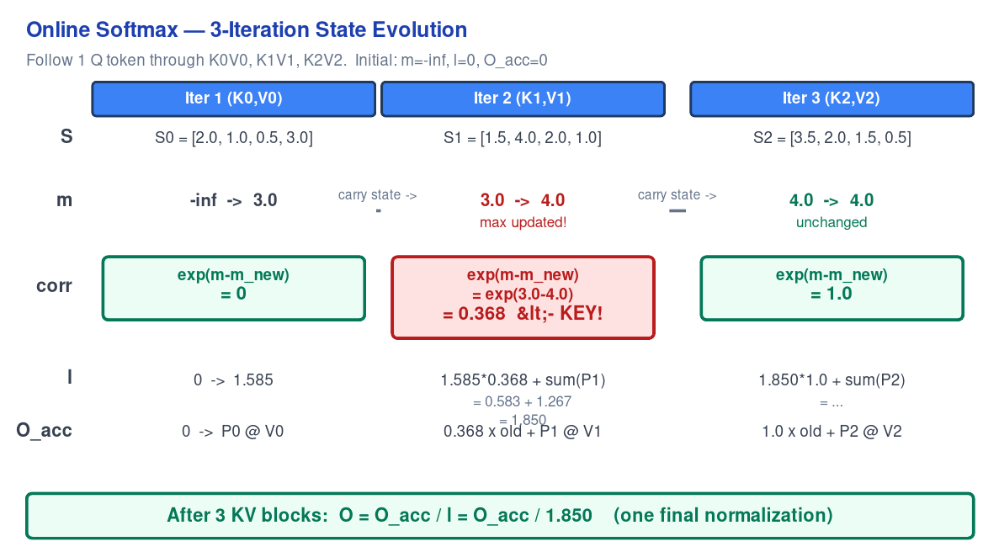

# Diagram Examples & Patterns

## Example 1: Tiling Diagram (Many-to-Many)

**Use case:** Show connections between two groups of tiles where every element in group A connects to every element in group B.

**Pattern:**
- Left column: source tiles (Q₀, Q₁, Q₂) with distinct colors
- Right column: target tiles (K₀, K₁, K₂) with uniform color
- Arrow from each source to each target (N×M arrows)
- Each source tile has its own arrow color for visual tracking
- Dashed boundary boxes around each group
- Annotation at bottom explaining the pattern

**Key implementation details:**
- Q tiles are blue gradient (`#3b82f6`, `#60a5fa`, `#93c5fd`)
- KV tiles use yellow (`#fef3c7` fill, `#b45309` stroke)
- Arrow opacity set to 0.5 to reduce visual noise when many arrows cross
- Each Q tile's arrows use a different color (blue, purple, green) for traceability

## Example 2: State Evolution Table

**Use case:** Show how values change across iterations or time steps. Best for algorithm explanations where the reader needs to trace values.

**Pattern:**
- Columns = iterations/time steps with blue headers
- Rows = variables (S, m, corr, l, O_acc) with left-side labels
- Highlighted boxes for the most important row (correction factor)
  - Green (#ecfdf5) = stable/unchanged
  - Red (#fee2e2) = changed/significant
- Flow arrows between columns to show state carry-forward
- Final result box at the bottom

**Key implementation details:**
- Row labels use `text-anchor="end"` at x=55 (must be > text width to avoid clipping!)
- Multiline values use separate `<text>` elements at increasing y offsets
- The `<- KEY!` annotation uses `&lt;- KEY!` (escaped `<`)
- Flow arrows between column boundaries with `marker-end`

## When NOT to Use These Patterns

- **Simple 3-node flow** → use Mermaid flowchart
- **Numerical comparison** → use Markdown table (more maintainable)
- **Protocol/sequence** → use Mermaid sequence diagram
