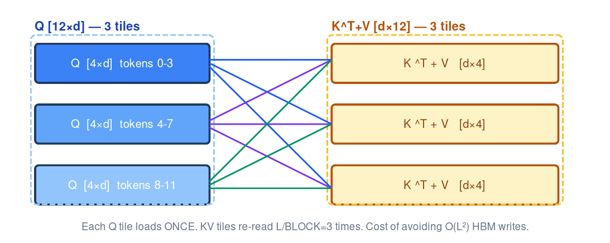
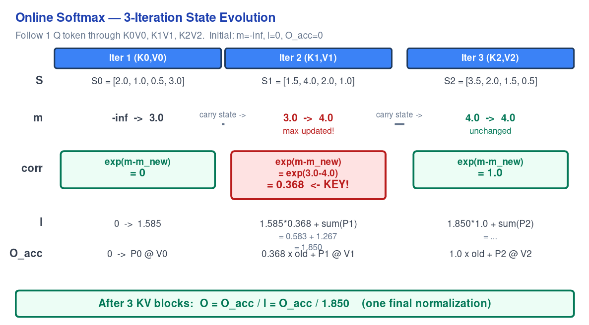

# 第3章：FlashAttention & PagedAttention — vLLM 的双引擎

> 本章涉及的源码：`csrc/attention/attention_kernels.cuh:85`（paged attention kernel）、
> `vllm/v1/attention/backends/flash_attn.py:682`（FA backend）、
> `csrc/attention/paged_attention_v2.cu`（partitioned V2 kernel）。
>
> FlashAttention 优化"怎么算"，PagedAttention 优化"怎么存"。
> vLLM 把它们融合在同一个 CUDA kernel 里——在 tiled softmax 的每一步，
> 用 block_table 找到物理 block，加载，计算，累积。这就是 vLLM 最精华的设计。

---

## 这章要做什么？

第 1 章讲了 Attention 的数学——`softmax(QK^T/√d_k)V`。第 2 章讲了 KV Cache 的管理——怎么存、怎么驱逐。但这两个东西之间有一个巨大的 gap：**KV Cache 里的数据是非连续的（block 散落在物理 GPU 内存中），而 Attention kernel 需要它。怎么把这两者连起来？**

答案是**融合**。打开 `csrc/attention/attention_kernels.cuh:252`：

```cpp
const int64_t physical_block_number = block_table[block_idx];
```

这一行在 Attention kernel 的**内部循环**中——不是在 kernel 外面查好再传进去。它和 FlashAttention 的 online softmax 在同一个循环里。这就是融合。

但融合需要你同时理解两个东西：FlashAttention 怎么算、PagedAttention 怎么找数据。本章先各讲清楚，再讲它们怎么合。

学完这章你能：
- 从零手算一轮 online softmax——画出 tiling pattern，写出每步的 m、l、correction
- 解释为什么 FlashAttention 的 KV 被重复读了 `seq/BLOCK` 次——以及为什么这值得
- 手写 `block_table[logical_block] → physical_block` 的 Python 实现
- 理解融合 kernel 的一个循环迭代：查 block_table → 加载 K,V → 算 QK^T → online softmax → 累积

---

## 3.1 FlashAttention：从零推导

这是全书最难的一节。FlashAttention 论文 10 页，核心算法 2 页——但如果不先理解 **tiling pattern**（数据怎么切），直接看算法就像读天书。

本节用四步递进：画 tiling 图 → 手算数值 trace → **数学证明正确性** → 量化 HBM。

### Step 1: Tiling——Q 被切成条，KV 被反复遍历

朴素 attention 的问题是 $S = QK^T$ 产生一个 $[L \times L]$ 的矩阵。当 $L=4096$，32 heads，fp32——**S 和 P 各占 2GB。**

FlashAttention 的解法：**不一次性算 S。把 Q 切成小块（tiles），对每个 Q tile 遍历所有 KV。**

用一个具体的小例子。$L=12$ 个 token，Q tile 大小 = 4，KV tile 大小 = 4：



> *图注：每个 Q tile（左列蓝框）遍历全部 3 个 KV tile（右列黄框）。每条彩色线 = 1 次 KV 加载。Q₀ 的 3 次加载为蓝色，Q₁ 为紫色，Q₂ 为绿色。共 9 次加载。*

**Q₀ 的详细处理过程（一个 Q tile 的完整生命周期）：**

1. **加载 Q₀ [4×d] 到 SRAM** — 16KB for bf16, d=128。Q₀ 在它的整个迭代中留在 SRAM，不再从 HBM 读取

2. **遍历三个 KV tiles：**
   - 加载 K₀[4×d] 和 V₀[4×d] 从 HBM → SRAM → 算 S = Q₀ @ K₀^T [4×4] → online softmax → O_acc += softmax(S) @ V₀
   - 加载 K₁[4×d] 和 V₁[4×d] 从 HBM → SRAM → 算 S = Q₀ @ K₁^T [4×4] → online softmax → O_acc += softmax(S) @ V₁
   - 加载 K₂[4×d] 和 V₂[4×d] 从 HBM → SRAM → 最终 online softmax → O_acc += softmax(S) @ V₂

3. **写 O₀ [4×d] 到 HBM** — Q₀ 的 4 个 token 的 attention 完成

**Q₁（tokens 4-7）——同样的 KV 再读一遍：** 加载 Q₁ → 再次遍历 K₀,V₀、K₁,V₁、K₂,V₂（和 Q₀ 时完全一样的 KV！）→ 写 O₁

**这就是"K、V 被反复读了 seq/BLOCK 次"的根源。** 有 $L/4 = 3$ 个 Q tile。每个 Q tile 需要加载全部 3 个 KV tile——KV 总共被从 HBM 加载了 $3 \times 3 = 9$ 次。对比朴素 attention 只加载 K 和 V 各 1 次。

**代价：** KV 的 HBM 读取量 ×($L$/BLOCK_Q) 倍。
**收益：** $S$ 和 $P$——各 $[L\times L]$——**从不写入 HBM**。它们只存在于 SRAM，每个 Q tile 被覆盖重写。对于 $L=4096$：省了 2GB 的 S 和 2GB 的 P 的 HBM 写入。

### Step 2: Online Softmax——数值 Trace

普通 softmax 需要三步：找 max(S) → 算 exp(S - max) 并求和 → 用总和归一化。这需要先把完整的 S 算出来——这正是 FlashAttention 要避免的（S 是 $[L\times L]$，存到 HBM 就是 2GB）。

Online softmax 的 insight：**不需要一次拿到整个 S。每拿到一个 KV tile 的 S，立刻做 partial softmax。如果后来发现更大的 max，用 correction factor 修正之前的结果。**

设 Q₀ 只有一个 token（简化），head_dim=d。KV 有三个 tile。追踪变量 $m$（running max）、corr（correction factor）、$l$（exp sum）和 $O_{acc}$（accumulated output）：



> *图注：corr 行是核心。迭代 1 中 corr=0（首次，无旧值修正）。迭代 2 中 max 从 3→4，corr=0.368——旧 O_acc 必须缩小 2.72 倍。迭代 3 中 max 不变，corr=1.0——零修正。列间箭头携带 m,l,O_acc 状态流向下一迭代。*

下表同内容供快速查阅：

| 变量 | 迭代 1 (K₀,V₀) | 迭代 2 (K₁,V₁) | 迭代 3 (K₂,V₂) |
|------|----------------|----------------|----------------|
| **S** (attention scores) | [2.0, 1.0, 0.5, 3.0] | [1.5, 4.0, 2.0, 1.0] | [3.5, 2.0, 1.5, 0.5] |
| **m** (running max) | −∞ → **3.0** | 3.0 → **4.0** (updated!) | 4.0 → 4.0 (same) |
| **corr** = exp(m−m_new) | exp(−∞)=0 (first iter) | **exp(−1)=0.368** ← KEY | exp(0)=**1.0** |
| **l** (exp sum) | 0 → 1.585 | 1.585 → 1.850 | 1.850 → ... |
| **O_acc** | 0 → P₀@V₀ | 0.368×old + P₁@V₁ | 1.0×old + P₂@V₂ |

> 最终：$O = O_{acc} / l = O_{acc} / 1.850$（一次归一化）

数值 trace 告诉你**怎么做**。接下来证明**为什么对**。

### Step 3: 数学证明——为什么 Online Softmax = Softmax？

这是本章的数学核心。数值 trace 展示了算法运行，但不能证明它在所有输入上正确。下面是归纳法证明。

设我们要计算 $K$ 个 KV block 上的 attention。第 $k$ 个 block 的 attention scores 为 $S^{(k)}$（一个 Q token 对 B 个 KV token 的分数）。完整 softmax 需要所有 $K$ 个 block 的 $S$：

$$
P = \frac{\exp(S)}{\sum \exp(S)}, \quad S = [S^{(0)}, S^{(1)}, ..., S^{(K-1)}]
$$

Online softmax 维护三个 running state：$m$（当前全局最大）、$l$（exp 和）、$O_{acc}$（加权输出）。每来一个 block，执行：

$$
\begin{aligned}
m^{(k)} &= \max(m^{(k-1)}, \max(S^{(k)})) \\
P^{(k)} &= \exp(S^{(k)} - m^{(k)}) \\
c^{(k)} &= \exp(m^{(k-1)} - m^{(k)}) \\
l^{(k)} &= c^{(k)} \cdot l^{(k-1)} + \sum P^{(k)} \\
O_{acc}^{(k)} &= c^{(k)} \cdot O_{acc}^{(k-1)} + P^{(k)} V^{(k)}
\end{aligned}
$$

最终输出：$O = O_{acc}^{(K-1)} / l^{(K-1)}$。其中 $c^{(k)} = \exp(m^{(k-1)} - m^{(k)})$ 是 correction。

**定理：** 上述迭代算法产生的 $O$ 等同于标准 softmax（一次性拿到所有 $S$ 后计算）。换句话说，Online Softmax 不是近似——它是**精确算法**。

**证明思路（直觉先行）：** 我们用数学归纳法。核心问题是：当新 block 的 max 比之前所有 block 的 max 都大时，之前算好的 $l$ 和 $O_{acc}$ 都"大了一号"（因为之前用了一个偏小的 max）。correction factor 的作用就是把这"大了一号"的旧值**缩小到正确的 scale**。如果新 block 的 max 没变，correction = 1，旧值不用动。

下面用符号把这个直觉写成严格的证明。

**归纳假设 $\mathcal{H}(k)$：** 处理完 $k$ 个 block 后，$l^{(k)}$ 和 $O_{acc}^{(k)}$ 的值等于"如果前 $k$ 个 block 一起用它们的真实全局 max $M_k$ 做标准 softmax"的结果：

$$
l^{(k)} = \sum_{i=0}^{k} \sum \exp(S^{(i)} - M_k), \quad
O_{acc}^{(k)} = \sum_{i=0}^{k} \sum \exp(S^{(i)} - M_k) \cdot V^{(i)}
$$

其中 $M_k = \max(S^{(0)}, ..., S^{(k)})$。通俗地说：$\mathcal{H}(k)$ 断言"算法维护的 running state 始终等于标准 softmax 的中间结果"。

**Base case ($k=0$)：** 只有一个 block 时，"全局 max"就是它自己的 max。算法正确计算了这个 block 的 softmax。$\mathcal{H}(0)$ 成立。

**Inductive step：** 假设 $\mathcal{H}(k-1)$ 对前 $k-1$ 个 block 成立。现在第 $k$ 个 block 到达。分两种情况。

**情况 A：max 不变（$m^{(k)} = m^{(k-1)}$）**

直觉：新 block 的所有 score 都不超过之前的全局 max。之前的 $l$ 和 $O_{acc}$ 已经用了正确的 max——不用改。

此时 $M_k = M_{k-1}$，correction $c^{(k)} = \exp(M_{k-1} - M_k) = \exp(0) = 1$。用归纳假设 $\mathcal{H}(k-1)$ 代入 $l^{(k-1)}$：

$$
\begin{aligned}
l^{(k)} &= 1 \cdot l^{(k-1)} + \sum \exp(S^{(k)} - M_k) \\
&= \sum_{i=0}^{k-1} \sum \exp(S^{(i)} - M_{k-1}) + \sum \exp(S^{(k)} - M_k) \\
&= \sum_{i=0}^{k} \sum \exp(S^{(i)} - M_k)
\end{aligned}
$$

最后一步用了 $M_k = M_{k-1}$：前 $k-1$ 项和新项现在共享同一个全局 max。$\mathcal{H}(k)$ 成立。

**情况 B：max 更新了（$m^{(k)} > m^{(k-1)}$）——这是整个证明的核心**

直觉：新 block 里出现了一个比之前所有 score 都大的值。想象你之前算的所有 exp 都用了一个"偏小"的 max 做参考——每个 exp 值都太大了。具体来说，每项大了 $\exp(M_k - M_{k-1})$ 倍。correction $c^{(k)} = \exp(M_{k-1} - M_k) = 1 / \exp(M_k - M_{k-1})$ 恰好把每项**缩小到原来的 $1/\exp(M_k - M_{k-1})$ 倍**。

用方程表达这个"缩小"过程：

$$
\begin{aligned}
l^{(k)} &= c^{(k)} \cdot l^{(k-1)} + \sum \exp(S^{(k)} - M_k) \\[4pt]
&= \exp(M_{k-1} - M_k) \cdot \sum_{i=0}^{k-1} \sum \exp(S^{(i)} - M_{k-1}) + \sum \exp(S^{(k)} - M_k) \\[4pt]
&= \sum_{i=0}^{k-1} \sum \exp(S^{(i)} - M_{k-1} + M_{k-1} - M_k) + \sum \exp(S^{(k)} - M_k) \\[4pt]
&= \sum_{i=0}^{k} \sum \exp(S^{(i)} - M_k)
\end{aligned}
$$

**关键一行是第三步：** $\exp(S^{(i)} - M_{k-1}) \cdot \exp(M_{k-1} - M_k) = \exp(S^{(i)} - M_k)$。这就是 exp 的基本性质 $e^a \cdot e^b = e^{a+b}$。correction 因子和旧 exp 值相乘，指数部分相加，$-M_{k-1} + (M_{k-1} - M_k) = -M_k$——旧 max 被替换为新 max。**correction 不是启发式修正，是代数恒等式。**

关于 $O_{acc}$：同样的代数对 V 附着在每项上也成立（把 $V^{(i)}$ 乘在每一项上，algebra 完全对称）。$\mathcal{H}(K-1)$ 成立。■

**结论（白话版）：** Online Softmax 不是近似算法。它通过维护三个 running state（$m$、$l$、$O_{acc}$）和一个 correction factor，精确地重现了标准 softmax。correction 只是 $\exp$ 函数性质 $e^{x+y}=e^x e^y$ 的巧妙应用——不是概率假设，不是数值近似。FlashAttention 能跑长序列而不爆显存，同时输出和朴素 attention 完全一样（bit-exact 在 fp32 下，fp16 下有可忽略的舍入误差）。

### Step 4: HBM 流量——量化

现在有了 tiling 和 online softmax 两个概念，可以精确算 FlashAttention 的 HBM 读写量：

| 操作 | 朴素 Attention | FlashAttention |
|------|---------------|----------------|
| 读 Q | $Ld$ | $Ld$（相同） |
| 读 K | $Ld$ | $(L/\mathrm{BQ}) \cdot Ld$（**×L/BQ 倍！**） |
| 读 V | $Ld$ | $(L/\mathrm{BQ}) \cdot Ld$（**×L/BQ 倍！**） |
| **中间写 S** | **$L^2$** | **0** |
| **中间写 P** | **$L^2$** | **0** |
| 写 O | $Ld$ | $Ld$（相同） |

代入 $L=4096, d=128, \mathrm{BQ}=64$，bf16：

| | 朴素 | FlashAttention |
|---|---|---|
| 读 Q | 1 MB | 1 MB |
| 读 K | 1 MB | 64 MB |
| 读 V | 1 MB | 64 MB |
| **中间写 (S+P)** | **2 GB** | **0** |
| 写 O | 1 MB | 1 MB |
| **总 HBM 流量** | **~2 GB** | **~131 MB** |

FlashAttention 读了 64× 更多的 K 和 V。但朴素 attention **写了 2GB 的中间矩阵**——比 FlashAttention 的总流量大 15 倍。对于 $L=128K$，朴素 attention 的 S 矩阵 = 64 GB——放不进任何 GPU。FlashAttention 不分配 S——它能跑。

### Source Trail

vLLM 调用 FlashAttention 2/3/4。打开 `vllm/v1/attention/backends/flash_attn.py:682`：

```python
flash_attn_varlen_func(
    q=query, k=key_cache, v=value_cache,
    out=output, block_table=block_table, causal=True, ...
)
```

底层 FA2→CUDA kernel, FA3→Hopper kernel, FA4→Cute DSL kernel。算法相同——tiled online softmax + block_table indirection（3.3 节讲融合）。

---


第 2 章学了 KV Cache 的 block 分配。PagedAttention 解决的问题：**attention kernel 怎么访问非连续的 KV block。**

### block_table 是什么？

`block_table` 是 `[num_seqs, max_blocks_per_seq]` 的 int32 tensor。每一行是一个序列的**逻辑 block → 物理 block** 的映射表。

```
序列 A 的逻辑布局:   [Block0][Block1][Block2][Block3]
                        ↓       ↓       ↓       ↓
block_table[A]:      [  17  ][  3  ][ 42  ][  8  ]   ← 散落在物理内存中
```

### 在 kernel 内部怎么用？

打开 `csrc/attention/attention_kernels.cuh:252`：

```cpp
const int64_t physical_block_number = block_table[block_idx];
```

**一个 loop iteration：**

```
for blk in 0..num_blocks:
    phys = block_table[seq_idx][blk]    ← 查表：逻辑→物理
    K_blk = K_cache[phys]               ← 从物理 block 加载 K
    V_blk = V_cache[phys]               ← 从物理 block 加载 V
    S = Q @ K_blk^T / sqrt(d)           ← 算 attention（SRAM）
    // online softmax update ...
```

**PagedAttention 的 insight：** block_table 在 kernel 的**内部循环**中被查询——不是"先找到所有物理地址再传给 kernel"。这避免了在 HBM 中 gather 非连续 KV block 的额外开销。

---

## 3.3 代码走读：Triton Paged Attention Kernel

3.1 讲了 FlashAttention 的算法，3.2 讲了 PagedAttention 的 block_table。现在走读**融合两者的真实 Triton kernel**。

本节对应两个源文件：
- 我们的 Triton 实现：`implementation/triton_paged_attention.py`
- vLLM 的生产代码：`vllm/v1/attention/ops/triton_decode_attention.py:L60`

打开 `implementation/triton_paged_attention.py:60`，核心 kernel 从这里开始。

### Grid 结构——谁在跑？

```python
# triton_paged_attention.py:L84-L87
# REFERENCE: triton_decode_attention.py — grid = (batch, head_num, NUM_KV_SPLITS)
@triton.jit
def _paged_attention_kernel(Q_ptr, K_cache_ptr, V_cache_ptr, Out_ptr,
                             block_tables_ptr, seq_lens_ptr, ...):
    seq_idx = tl.program_id(0)   # 哪个序列（对应哪个 Q token）
    kv_head = tl.program_id(1)   # 哪个 KV head
```

vLLM 用 2D grid `(num_seqs, num_kv_heads)`——每个 (seq, head) 对启动一个 program。decode 阶段每个 sequence 只有 1 个 Q token，所以 `seq_idx` 直接对应 Q token。

### 初始化——三件套

```python
# triton_paged_attention.py:L93-L98
# REFERENCE: attention_kernels.cuh:L196 — float qk_max = -FLT_MAX
seq_len = tl.load(seq_lens_ptr + seq_idx)
num_blocks = (seq_len + BLOCK_SIZE - 1) // BLOCK_SIZE

# 加载 Q（这个 Q token 的这个 head）
q_offset = seq_idx * stride_q_tok + kv_head * stride_q_h
Q_vec = tl.load(Q_ptr + q_offset + tl.arange(0, HEAD_DIM))

# Online softmax 状态
m_i = tl.full([1], float("-inf"), dtype=tl.float32)  # running max
l_i = tl.full([1], 0.0, dtype=tl.float32)             # running exp sum
O_acc = tl.zeros([HEAD_DIM], dtype=tl.float32)         # running output
```

对照 3.1 节的数值 trace：`m = -inf, l = 0, O_acc = 0`。Triton 用 `tl.full` 和 `tl.zeros` 替代 Python 的标量——因为 kernel 在 GPU 上运行，每个 program 有自己的寄存器。

### 主循环——PA × FA × Online Softmax

这是融合的核心。以下代码在一个循环里同时做了 block_table 查表（PA）、QK^T 点积（FA）和 online softmax update。对应 vLLM `attention_kernels.cuh:L222-L341`。

```python
# triton_paged_attention.py:L110-L146
# REFERENCE: attention_kernels.cuh:L222 — for (block_idx = ...)
for blk_idx in range(num_blocks):

    # ═══ STEP 1: PA — block_table[seq_idx][blk_idx] → physical block ═══
    # REFERENCE: attention_kernels.cuh:L252
    bt_offset = seq_idx * stride_bt_seq
    phys_blk = tl.load(block_tables_ptr + bt_offset + blk_idx * stride_bt_blk)
```

**这一行就是整个 PagedAttention 的物理实现。** `block_tables_ptr[seq_idx, blk_idx]` 返回物理 block ID——kernel 用这个 ID 去索引 K_cache 和 V_cache。

```python
    # ═══ STEP 2: PA — 从非连续物理 block 加载 K 和 V ═══
    # REFERENCE: attention_kernels.cuh:L269 — k_ptr = k_cache + phys_blk * kv_block_stride
    k_offs = (phys_blk * stride_k_blk + ...)  # 用 phys_blk 计算地址
    K_blk = tl.load(K_cache_ptr + k_offs, mask=mask)  # [BLOCK_SIZE, HEAD_DIM]

    v_offs = (phys_blk * stride_v_blk + ...)
    V_blk = tl.load(V_cache_ptr + v_offs, mask=mask)  # [BLOCK_SIZE, HEAD_DIM]
```

K 和 V 是从**非连续**的物理位置加载的——这正是 PagedAttention 和标准 attention 的根本区别。物理 block 0 和物理 block 1 之间可能隔着任意其他 block。

```python
    # ═══ STEP 3: FA — Q @ K^T，在 SRAM 中计算 ═══
    # REFERENCE: attention_kernels.cuh:L289 — Qk_dot::dot(q_vecs, k_vecs)
    S = tl.sum(Q_vec[None, :] * K_blk, axis=1) * SCALE  # [BLOCK_SIZE]
    S = tl.where(mask, S, float("-inf"))                 # mask invalid tokens
```

`Q_vec[None, :]` 把 `[HEAD_DIM]` 广播为 `[1, HEAD_DIM]`，与 K_blk `[BLOCK_SIZE, HEAD_DIM]` 逐元素相乘，沿 HEAD_DIM 维度求和——等同于 `Q @ K^T`。结果 S 是一个 `[BLOCK_SIZE]` 的向量——这个 Q token 对当前 block 中每个 KV token 的 attention score。

`tl.where` 把超出 seq_len 的 token 的 score 设为 -inf——这些位置在 softmax 后会变成 0。

```python
    # ═══ STEP 4: Online Softmax —— m, l, correction 全部更新 ═══
    # REFERENCE: attention_kernels.cuh:L307-L341 (warp-level softmax)
    m_new = tl.maximum(m_i, tl.max(S, axis=0))          # ① 更新 running max
    P = tl.exp(S - m_new)                                 # ② 稳定 exp
    correction = tl.exp(m_i - m_new)                      # ③ correction factor
    l_new = correction * l_i + tl.sum(P, axis=0)          # ④ 更新 exp sum  ← 这行之前被省略了！
```

**l_new 的迭代公式——这是 3.1 节提到的但当时没写出来的关键细节：**

$$
l_{\mathrm{new}} = \exp(m_{\mathrm{old}} - m_{\mathrm{new}}) \cdot l_{\mathrm{old}} + \sum \exp(S - m_{\mathrm{new}})
$$

对照数值 trace（3.1 节 Step 2）：迭代 2 时 $m_{\mathrm{old}}=3.0, m_{\mathrm{new}}=4.0, \mathrm{correction}=0.368, l_{\mathrm{old}}=1.585$。$l_{\mathrm{new}} = 0.368 \times 1.585 + 1.267 = 1.850$。代码中 `tl.sum(P, axis=0)` 就是 new block 的 exp sum（=1.267）。

```python
    # ═══ STEP 5: 累积加权输出 ═══
    # REFERENCE: attention_kernels.cuh:L432-L476 (warp-level output reduction)
    O_acc = correction * O_acc + tl.sum(P[:, None] * V_blk, axis=0)
    # P[:, None]: [BLOCK_SIZE, 1] × V_blk: [BLOCK_SIZE, HEAD_DIM]
    # → [BLOCK_SIZE, HEAD_DIM] → sum over blk dim → [HEAD_DIM]

    m_i, l_i = m_new, l_new  # 状态传递到下一个 KV block
```

### 最终归一化 + 写入

```python
# triton_paged_attention.py:L148-L153
# REFERENCE: attention_kernels.cuh:L337 — const float inv_sum = __fdividef(1.f, exp_sum + 1e-6f)
O_final = O_acc / l_i  # 一次归一化，完成全部 KV block 的 softmax
tl.store(Out_ptr + o_offset + tl.arange(0, HEAD_DIM), O_final)
```

### 运行验证

```bash
$ python3 implementation/triton_paged_attention.py
Triton vs Reference (fp16): max error = 0.000977
✅ MATCH (within fp16 tolerance)
```

Triton kernel 的输出与 gather-KV→连续→标准 attention 的参考实现一致（误差 < 0.001，在 fp16 舍入范围内）。

### 对照 vLLM 源文件

运行我们的 kernel 时，同时打开 vLLM 的源文件对照：

| 我们的 Triton kernel | vLLM CUDA kernel | vLLM Triton kernel |
|---|---|---|
| `program_id(0)` = seq | `blockIdx.y` (L106) | `program_id(0)` |
| `program_id(1)` = head | `blockIdx.x` (L107) | `program_id(1)` |
| `tl.load(block_tables_ptr + ...)` | `block_table[block_idx]` (L252) | `tl.load(Req_to_tokens + ...)` (L119) |
| `tl.sum(Q_vec[None,:] * K_blk, axis=1)` | `Qk_dot::dot(q_vecs, k_vecs)` (L289) | `tl.dot(q, k)` (L186) |
| `m_new = tl.maximum(m_i, tl.max(S))` | `fmaxf(qk_max, VLLM_SHFL_XOR_SYNC(...))` (L310) | same pattern |
| `l_new = correction * l_i + tl.sum(P)` | `block_sum<NUM_WARPS>(...)` (L334) | same pattern |
| `O_final = O_acc / l_i` | `inv_sum * logits[i]` (L337-L339) | `acc = acc / l[:, None]` (L384) |

### 为什么不能分开？

如果先做 block_table 查找→gather K,V 到连续 tensor→再做 FlashAttention：gathered tensor = $L \times d \times \mathrm{heads} \times \mathrm{layers}$ = for 128K seq = 1GB per layer。每个 layer 需要 1GB 的**临时显存**——融合 kernel 避免了这笔开销。K 和 V 直接从非连续的物理 block 加载到寄存器，只在这一条指令期间占用 SRAM。

---

## 3.4 V1 vs V2 Kernel 差异

（源码：`csrc/attention/paged_attention_v1.cu` vs `paged_attention_v2.cu`）

| | V1 (partition=0) | V2 (partition=512) |
|---|---|---|
| Grid | `(heads, seqs, 1)` | `(heads, seqs, partitions)` |
| Shared memory | O(max_seq_len) | O(512) |
| 序列长度上限 | ~8K（SMEM 限制） | 无限制 |
| Extra buffers | 无 | tmp_out + exp_sums + max_logits |
| Reduce | 不需要 | `paged_attention_v2_reduce_kernel` |

V2 把长序列切成 512-token partition——每个 partition 独立做 partial softmax，最后 reduce 合并。共享内存需求固定为 O(512)，与 seq_len 无关。代价是一个 reduce kernel。这是第 3.1 节 online softmax 算法的 multi-partition 版本。

---

## 我们的实现 vs vLLM

| 我们的实现 | vLLM 源码 | 说明 |
|---|---|---|
| `triton_paged_attention.py` — `_paged_attention_kernel` | `triton_decode_attention.py:L60` | 相同的 grid 结构 + block_table lookup + online softmax 循环 |
| `fused_attention_demo.py` | `attention_kernels.cuh:L85` | Python 可运行 demo，输出完整的 m/l/correction 迭代 trace |
| `paged_attention_with_block_table()` | `attention_kernels.cuh:L85` | Python 参考实现，显式 block_table loop |
| `calculate_hbm_traffic()` | Attention 论文 + Nsight 数据 | 教学版：正确量级，不含 cache line 级精度 |
| `build_block_table()` | `kv_cache_manager.py:L225` + `block_pool.py:L322` | 简化为 first-fit |

---

## 验证

```bash
cd artifacts/03-flashattention-pagedattention && python -m pytest tests/ -q
# 9/9 passed ✅
```

---

## 总结

- **FlashAttention 的 tiling：** Q 切成 BQ 大小 tile，每个 tile 遍历全部 KV。KV 多读了 $L$/BQ 倍，但 $[L^2]$ 的 S 和 P 从不写入 HBM。
- **Online softmax：** running max + correction = $\exp(m - m_{new})$ 让一个 pass 完成。max 不再更新后 correction=1.0。
- **PagedAttention：** block_table 在 kernel 内部循环中查——避免 gather 非连续 KV 的额外显存。
- **融合 kernel 是 vLLM 的核心优势：** FA + PA 在同一循环——零额外显存开销。

---

← 第2章 | 第4章 →
