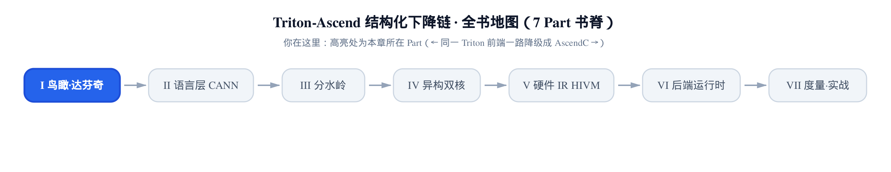
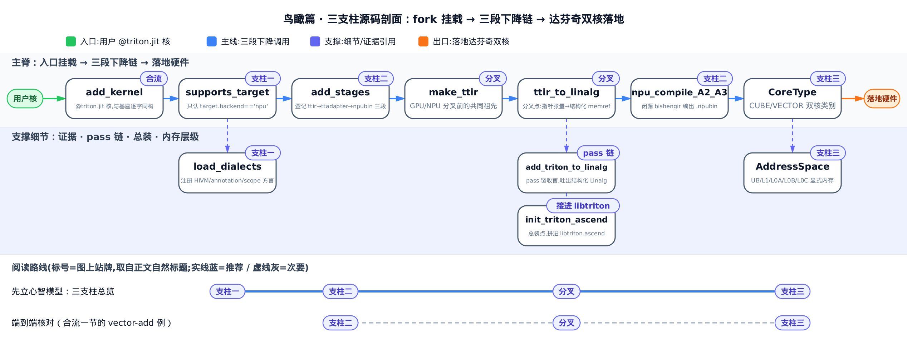
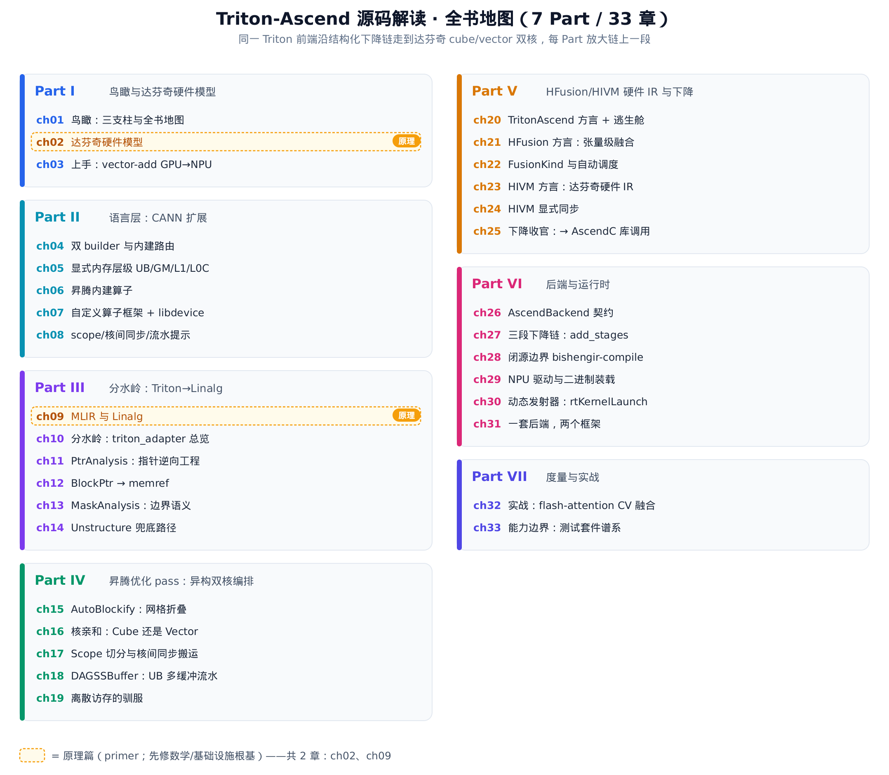
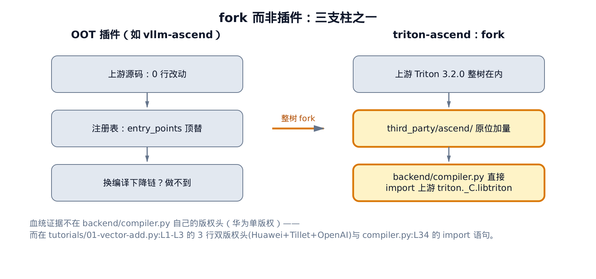
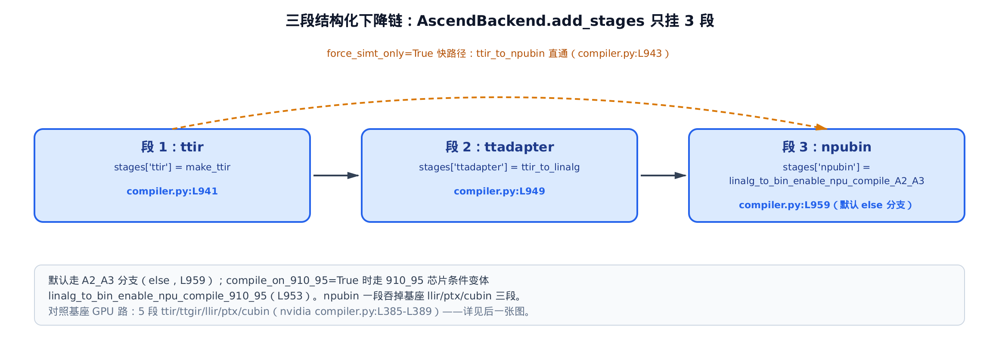
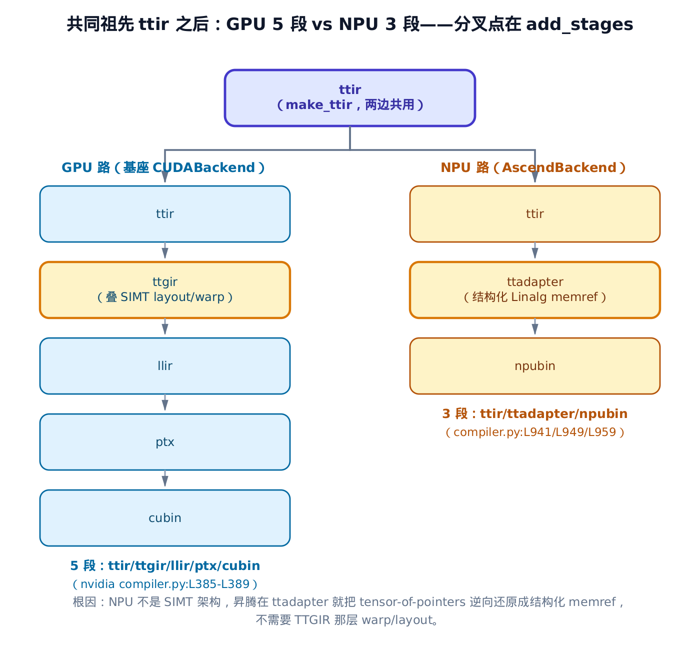
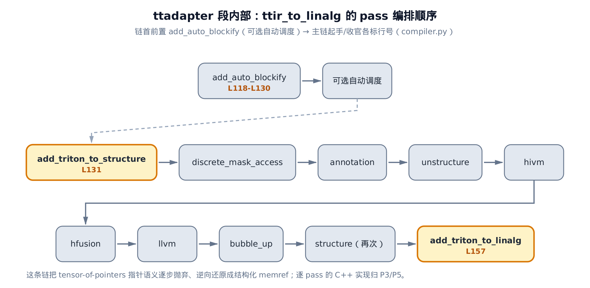
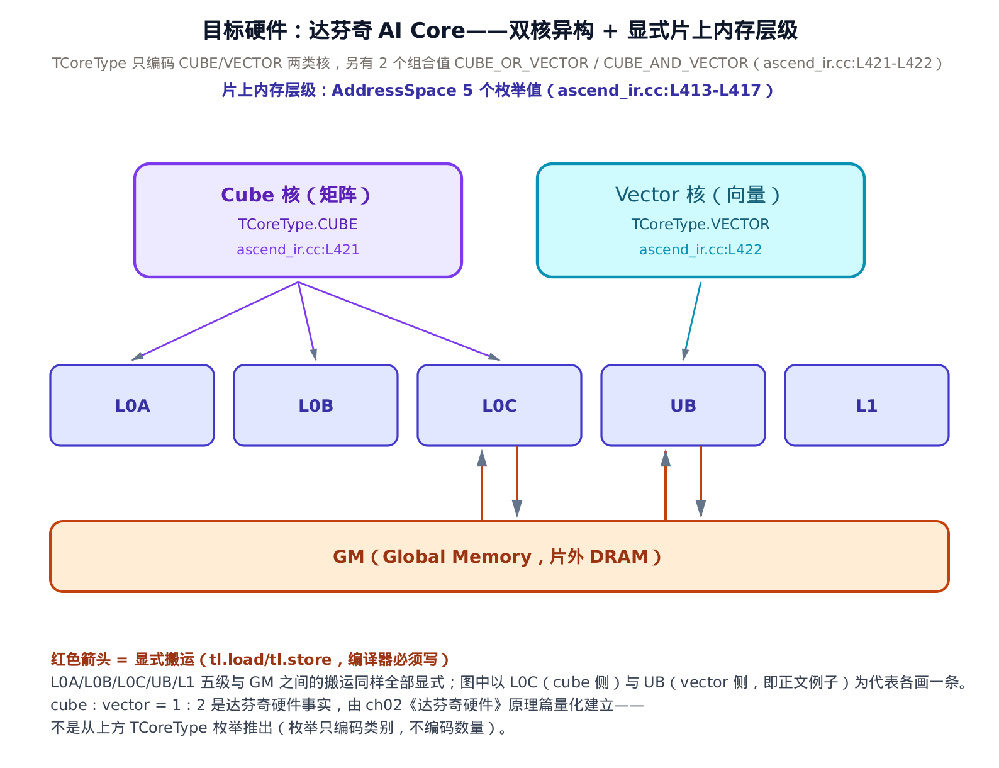
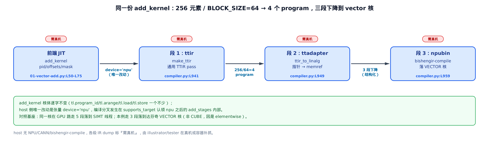

# 鸟瞰：一个 fork 了 Triton、却把整条下降链换成昇腾 NPU 路的后端



> 上一章：无——你正站在全书起点。
> 本章：搭起心智模型，看清 fork、三段下降、双核三根支柱。
> 下一章：走进达芬奇硬件，给双核与内存层级填上定量细节。

先说清这本书要带你读的是什么。Triton(一门把 Python 写的算子编译成加速器机器码的领域特定语言)原本只有一条路：编到 NVIDIA GPU。而 triton-ascend 把这门语言的下降链整条改道，让同一份 `@triton.jit` 核最终落到华为昇腾 NPU(Neural Processing Unit，神经网络处理器)上。

这件事有两种做法。一种是写个「树外插件」(OOT,out-of-tree)，一行上游源码都不碰，靠注册表让系统「发现」你的后端——vllm-ascend(另一个面向昇腾的开源适配项目，走的正是插件路线)就是这么干的。另一种是 **fork**：把整棵上游 Triton 拷进自己仓库，再原地动手改。triton-ascend 选的是后者。为什么必须是 fork？因为要换的不是某个算子，而是**整条编译下降链**——这是插件那套「不改源码只顶替」的机制根本做不到的。这一章就把这个选择、以及它带出的三根支柱讲透。

本章是**鸟瞰**，不是逐行源码解读。三根支柱各挑最小的源码锚点内嵌——分别落在后端主文件 `third_party/ascend/backend/compiler.py`、昇腾 IR 接入 `third_party/ascend/ascend_ir.cc`、以及教程 `third_party/ascend/tutorials/01-vector-add.py`——目的是把地图铺开、把心智模型立住；每根支柱的细节都指向后续对应的 Part。



只想抓住「fork 而非插件」这条血统证据，读完「支柱一」那一节就够；只关心下降链怎么从五段压成三段，直接跳「支柱二」；想看这条链最终落在哪块硬件上，跳「支柱三」。不挑读法，按顺序走下来，三根支柱会在最后「三支柱合流」那一节自然拧成一股。

## 全书地图：七个 Part 沿一条下降链铺开



*图注：七个 Part 就是把本章这张鸟瞰图逐块放大。*
*从「同一前端」一路走到「落在双核」，每 Part 放大一段。*
*ch02、ch09 是两块原理先修，其余都是源码解读章。*

这本书的骨架是 **7 个 Part、共 33 章**，顺序不是随便排的——它沿着昇腾的下降链（`third_party/ascend/backend/compiler.py` 里 `add_stages` 登记的那三段）从前到后走：P1 鸟瞰与达芬奇硬件 → P2 语言层的 CANN(华为昇腾软件栈)扩展 → P3 分水岭 Triton→Linalg → P4 昇腾优化 pass 的异构双核编排 → P5 HFusion/HIVM 硬件 IR 与下降 → P6 后端与运行时 → P7 度量与实战。每一 Part 都是把本章某根支柱放大成若干章。

其中 ch02 达芬奇 NPU 硬件模型、ch09 MLIR 与 Linalg 是两块**原理篇**(图里标了「原理」徽标)：前者把双核与内存层级的定量事实讲清，后者补上结构化张量编译的数学根基。它们不解读昇腾源码，是打底用的先修。

**姊妹篇约定**：这本书全程对照基座《Triton 源码解读》(读的是上游 Triton v3.2.0)。每章都会指出「同一处基座 Triton 走 GPU 路长什么样、fork 之后走 NPU 路改成了什么」。本章对位《Triton 源码解读》的开篇章《Triton 是什么，以及本书怎么读》。

**怎么读**：想先建立整体印象，按序读 P1 三章即可，后面按需跳；想直接看下降链最硬核的分水岭，记住 ch10 分水岭 triton_adapter 这一章；想看运行时怎么把二进制送上卡，直奔 P6。本章往下，就把三根支柱一根根立起来。

## 支柱一：fork，不是插件



**直觉**。OOT 插件像给一台装好的车挂个外接配件——原厂代码一行不动，靠一张注册表让系统认得你。fork 反过来：把整台上游 Triton 的车(`python/triton`、`lib`、`include` 全量)拖进自己车库，昇腾的改装件原地焊在 `third_party/ascend/`。区别不是风格偏好，是能力边界：配件换不了发动机，只有把车拆开才能换整条传动。

**机制：为什么换下降链就非 fork 不可**。Triton 的后端要在三个地方做**原位替换**——`add_stages`(登记编译分几段)、OpBuilder(建 IR 的那支笔，昇腾这里换成一对 builder，细节留给 ch04 双 builder 与分发一章，呼应全书地图 P2)、以及 MLIR(Multi-Level Intermediate Representation，一套用来搭建编译器中间表示的开源框架)方言层。这三处都是上游的既有代码，插件式的「注册表顶替」只能在系统预留的挂钩上追加，碰不到这些内部装配。所以想把 GPU 的五段下降链换成 NPU 的三段，除了 fork 整树、原地改，没有别的办法。

那 fork 的血统证据在哪？**不在后端主文件自己的版权头**——`third_party/ascend/backend/compiler.py` 顶部是华为单版权，看不出上游痕迹。证据在两处别的地方。

第一处，教程文件保留了三行叠加的版权头：

```python
# third_party/ascend/tutorials/01-vector-add.py:L1-L3
# Copyright (c) Huawei Technologies Co., Ltd. 2025. All rights reserved.
# Copyright 2018-2020 Philippe Tillet
# Copyright 2020-2022 OpenAI
```

华为、Philippe Tillet(Triton 作者)、OpenAI 三行并排——这份文件是从上游原样带过来、再叠上华为版权的，是 fork(而非重写)的直接痕迹。

第二处，也是更硬的一处，在后端主文件的 import 语句里：

```python
# third_party/ascend/backend/compiler.py:L34-L62（节选）
from triton._C.libtriton import ir, passes, ascend
# … 省略：昇腾自己的 utils/driver import … #
from triton.backends.compiler import (
    AttrsDescriptor,
    BaseBackend,
    GPUTarget,
    register_descriptor,
)
```

`from triton._C.libtriton import ir, passes, ascend`——昇腾后端直接 import 上游 Triton 的编译器核心(`ir` 是 MLIR IR 绑定、`passes` 是通用 pass 集，`ascend` 才是自己新加的)，而不是另起炉灶顶替它。同理 `BaseBackend`、`GPUTarget`(描述目标设备的结构体)都从上游 `triton.backends.compiler` 拿。**原位复用上游，不是顶替上游**——这就是 fork 与 OOT 插件的分野。

昇腾后端本身，是上游 `BaseBackend` 契约的一个具体实现：

```python
# third_party/ascend/backend/compiler.py:L877-L886
class AscendBackend(BaseBackend):

    @staticmethod
    def supports_target(target: GPUTarget):
        return target.backend == "npu"

    def __init__(self, target: GPUTarget) -> None:
        super().__init__(target)
        if target.backend == "npu":
            self.binary_ext = "npubin"
```

`AscendBackend` 继承 `BaseBackend`,`supports_target` 只在 `target.backend == "npu"` 时认领这个目标——`target` 就是描述「要编到哪块卡」的对象，`backend` 是它的一个字段。这一行，就是 fork 式后端「原位实现契约」与 OOT 插件「注册表顶替」的分水岭：插件只能被动等着系统发现，这里是主动实现上游定义好的接口。构造函数里 `binary_ext = "npubin"`(binary_ext，后端产物的扩展名)钉死了整条下降链的终点是 `.npubin`(NPU 二进制)，后面会反复用到。

fork 还在树内新增了昇腾专属的 MLIR 方言，注册到编译上下文里：

```cpp
// third_party/ascend/ascend_ir.cc:L492-L499
m.def("load_dialects", [](MLIRContext &context) {
    gDefaultAscendContext = &context;
    DialectRegistry registry;
    registry.insert<annotation::AnnotationDialect, mlir::hivm::HIVMDialect,
                    scope::ScopeDialect>();
    context.appendDialectRegistry(registry);
    context.loadAllAvailableDialects();
});
```

`load_dialects` 把三个新方言——`annotation`(注解)、`hivm`(达芬奇硬件 IR，后面 P5 的主角)、`scope`(作用域)——注册进 `MLIRContext`(MLIR 编译上下文，方言的登记处)。上游整树在内 + 昇腾在树内新增方言，这就是「fork 而非插件」在方言层留下的又一处铁证。

## 支柱二：三段下降链 ttir → ttadapter → npubin



**直觉**。把编译想成流水线上的工位。GPU 路有五道工位(ttir → ttgir → llir → ptx → cubin)，一路把「SIMT(Single Instruction Multiple Threads，单指令多线程，GPU 的执行模型)裸指针 + 线程 layout」带到最后。昇腾只留三道：第一道 `ttir` 是所有 Triton 后端共用的通用打磨间；第二道 `ttadapter` 把 GPU 那「一堆裸指针」翻译成「规规整整的货架」(结构化 memref，即 MLIR 里带 offset/size/stride 的内存引用——记住哪块内存、多大、每次跨几步取一个);第三道 `npubin` 把货架交给闭源黑箱压成 NPU 二进制。GPU 的四道后端工位，在昇腾被压成两道。

**机制**。这条下降链登记在 `add_stages` 里，是全书第一眼要抓的一段代码：

```python
# third_party/ascend/backend/compiler.py:L939-L963
def add_stages(self, stages, options):
    if self.target.backend == "npu":
        stages["ttir"] = lambda src, metadata: make_ttir(src, metadata, options)
        if options.force_simt_only:
            stages["npubin"] = (
                lambda src, metadata: ttir_to_npubin(
                    src, metadata, options
                )
            )
            return
        stages["ttadapter"] = lambda src, metadata: ttir_to_linalg(
            src, metadata, options, named_ops=True
        )
        if options.compile_on_910_95:
            stages["npubin"] = (
                lambda src, metadata: linalg_to_bin_enable_npu_compile_910_95(
                    src, metadata, options
                )
            )
        else:
            stages["npubin"] = (
                lambda src, metadata: linalg_to_bin_enable_npu_compile_A2_A3(
                    src, metadata, options
                )
            )
    # … 省略：非 npu 分支直接 raise NotImplementedError（L964-L968）… #
```

`stages` 是一个有序字典，`add_stages` 往里塞三个键：`ttir`、`ttadapter`、`npubin`。每个值是一个 lambda，只吃前一段的 `(src, metadata)`——即上一工位的产物 IR 和元数据。三个键依次是：

- `ttir` → `make_ttir`：跑与所有后端共享的通用 TTIR(Triton IR,Triton 的中间表示)pass。
- `ttadapter` → `ttir_to_linalg`：把 TTIR 降成结构化 Linalg(MLIR 的线性代数方言)。`named_ops=True` 让逐元素算子尽量保持 `arith` 原样、不被摊成 `linalg.generic`(这个开关的真实语义要读实现才能定论，见[第 10 章](../../ch10-watershed-triton-to-linalg/narrative/chapter.md))。
- `npubin` → `linalg_to_bin_enable_npu_compile_A2_A3`(A2_A3 指昇腾 A2/A3 系列芯片，是与下面 910_95 并列的另一代目标芯片代号，本章默认走这条)：把 Linalg 交给闭源编译器出 NPU 二进制。

注意最后那个 `if options.compile_on_910_95` 分支：`compile_on_910_95`(是否编到 910_95 芯片)默认为假，走 `else` 分支的 `linalg_to_bin_enable_npu_compile_A2_A3`——本章就以这条默认路径为代表；为真时改走 `linalg_to_bin_enable_npu_compile_910_95`，那只是同一段的 **910_95 芯片条件变体**，末段职责不变。开头还有一条 `force_simt_only`(强制只走 SIMT 模板)快路径，`return` 直接跳过 `ttadapter`、`ttir_to_npubin` 一步出二进制——那是给特殊场景的旁路，细节留给 ch20 逃生舱与 SIMT 直通一章。

**为什么这条链一定终止、不会绕圈**。三个 lambda 各只依赖前一段的产物，`stages` 是有序字典，`binary_ext="npubin"` 又钉死了终点扩展名。主路径上没有回边、没有并列分支，编译状态只能沿 `ttir → ttadapter → npubin` 单调前进，走完第三段就停机。唯一的「捷径」是 `force_simt_only` 那条 `return`，它更早停机，同样不会绕圈。

下面把这三段的挂载点、职责、以及对照基座 GPU 路，列成一张对账表。本章 host(开发机)没有 NPU/CANN，跑不出真机的运行时轨迹，所以这张表记的是 pin 源码里的**段次与行号**(结构性轨迹，已逐条 grep 核对)，不是数值 dump:

<!-- trace: m02-three-stage-lowering -->
| 段次 | stage 键 | 挂载函数（file:Lxxx） | 输入 IR → 输出 IR | 对照基座 GPU 路 |
|---|---|---|---|---|
| 1 | ttir | make_ttir（compiler.py:L73，登记于 L941） | 前端 Triton-MLIR → 优化后 TTIR | 共同祖先：基座同名 make_ttir（nvidia compiler.py:L385） |
| 2 | ttadapter | ttir_to_linalg（compiler.py:L96，登记于 L949） | TTIR → 结构化 Linalg memref | 分叉点：基座此处改走 ttgir=make_ttgir（L386）叠 SIMT layout |
| 3 | npubin | linalg_to_bin_enable_npu_compile_A2_A3（compiler.py:L502，默认 else 分支登记于 L959） | Linalg → NPU 二进制 .npubin | 基座三段 llir/ptx/cubin（L387-389）在此收敛成一段闭源 bishengir |

一句话读这张表：昇腾把 GPU 路的四段后端(ttgir → cubin)压成两段(ttadapter + npubin)，其中 `npubin` 一段就吞掉了基座 llir/ptx/cubin 三段——全部交给闭源的 bishengir-compile(华为毕昇编译器，昇腾下降链末段的闭源黑箱)。开篇那张「你在这里」窄条把这末段标成「一路降级成 AscendC」：`bishengir-compile` 内部最终会落到 AscendC(昇腾的核函数编程语言，类似 CUDA C 之于 GPU)的库调用——这条黑箱内部的细节留给 ch25 下降到 AscendC 一章。**5 段对 3 段，差的正是那两层 GPU 专属工位。**

### 与 GPU 路的根本分叉，精确落在这几行



**直觉**。同一份 TTIR，走到第二道工位前，GPU 和 NPU 还是同一个东西；从第二道起彻底分家。GPU 一路把张量看成「一堆带 layout 的指针，交给成千上万个 SIMT 线程」;昇腾一上来就把这堆指针拆开，还原成「第几行第几列、跨几步取一个」的结构化 memref。

**机制**。分叉点不抽象，就在 `add_stages` 那几行。两边共享的最后一步是 `ttir`——GPU 和 NPU 都调 `make_ttir`，这是它们的共同祖先。分家从第二段开始：基座 nvidia 后端在这里挂 `make_ttgir`，叠上 TTGIR(Triton GPU IR)那层 SIMT 的 layout 与 warp(GPU 上 32 个线程的调度单元)指派，再一路 `llir → ptx → cubin`;昇腾在这里挂 `ttir_to_linalg`，把指针张量直接换成结构化 memref。

根因是硬件模型不同。SIMT 就是 GPU 的执行模型：同一条指令喂给一大片线程，每个线程各自持一个指针去访存——所以 GPU 需要 TTGIR 那层把 layout 和 warp 编码进去。达芬奇 NPU **不是 SIMT 架构**，它是 cube/vector 双核 + 显式内存搬运(下一节讲);硬塞 TTGIR 那套 warp/layout 反而不贴硬件。所以昇腾干脆早早换轨——**这是全书与基座最根本的一处 divergence(分叉)，后面每一章的差异，追根溯源都在这里。**

### ttadapter 内部：一条把指针语义逐层剥掉的 pass 链



**直觉**。第二道工位 `ttadapter` 内部不是一步到位，而是一条流水小传送带：`ttir_to_linalg` 在 pass manager(MLIR 里编排 pass 的调度器)上按顺序挂一长串 pass，像逐道打磨，把 Triton-MLIR 里「指针算术」的痕迹一层层剥掉，最后 `add_triton_to_linalg` 吐出规整的结构化 Linalg。

**机制**。这条传送带的最前面其实还有一道可选的 `add_auto_blockify`(自动分块与可选的自动调度，条件触发)，本章按下不表，细节留给 P4/P5;下面只看主链的**挂载顺序**，每道 pass 的 C++ 内部实现留给 P3/P5:

```python
# third_party/ascend/backend/compiler.py:L131-L165（节选，省去各 pass 的开关参数）
ascend.passes.ttir.add_triton_to_structure(pm, ...)
ascend.passes.ttir.add_discrete_mask_access_conversion(pm, ...)
ascend.passes.ttir.add_triton_to_annotation(pm)
ascend.passes.ttir.add_triton_to_unstructure(pm, ...)
ascend.passes.ttir.add_triton_to_hivm(pm)
ascend.passes.ttir.add_triton_to_hfusion(pm)
ascend.passes.ttir.add_triton_to_llvm(pm)
ascend.passes.ttir.add_bubble_up_operation(pm)
ascend.passes.ttir.add_triton_to_structure(pm, ...)
ascend.passes.ttir.add_triton_to_linalg(pm, ...)
pm.run(mod)
```

`pm` 是 pass manager,`add_*` 把一道道 pass 依次挂上去，`pm.run(mod)` 才真正跑。这条传送带一共挂了约十道 pass，顺序读下来：`add_triton_to_structure`(起手，识别结构化访存)→ 掩码离散访存转换 → 注解 → `unstructure`(处理非结构化兜底路径)→ `hivm` → `hfusion` → `llvm` → `bubble_up`(算子上浮)→ 再来一次 `structure` → `add_triton_to_linalg`(收官，产出结构化 Linalg)。这个顺序不是任意的——每一道 pass 只处理前一道产出的中间形态，交换顺序就会把一种它不认识的 IR 形态喂给下一道 pass。这条链的净效果，就是把 tensor-of-pointers(指针张量，Triton 用来表达访存的形态)的指针语义逐步抛弃、逆向还原成结构化 memref。这里出现的 `hivm`、`hfusion` 两个名字，正是 P5 要展开的昇腾硬件 IR 方言；把 `addptr`(指针加法)逆向工程成 memref 的机制，则是 ch11 PtrAnalysis 一章的主题。本章只需记住：分水岭在这条链里发生。

## 支柱三：达芬奇 cube/vector 双核



**直觉**。这条下降链最终落到什么硬件上？达芬奇(DaVinci，昇腾 AI Core 的架构名)AI Core 不是一堆同构的 SIMT 核，而是两种专业工种搭班：**cube 核**专啃矩阵乘，**vector 核**专啃逐元素/规约。更关键的是内存：GPU 的 L1/L2 cache 对程序员基本隐形，昇腾的 UB(Unified Buffer，统一缓冲)/L1/L0A/L0B/L0C/GM(Global Memory，片外 DRAM)全部**显式可见**——数据从 GM 搬到 UB 再算、算完搬回，每一步都得由编译器亲手写。这就是为什么后面所有优化都绕着「放哪个核、搬到哪级 buffer」转。

**机制**。这些硬件概念在昇腾 IR 里的落点，是两个 C++ 枚举，经 pybind(pybind11，把 C++ 对象暴露给 Python 的绑定库)暴露给 Python。先看双核：

```cpp
// third_party/ascend/ascend_ir.cc:L420-L425
py::enum_<hivm::TCoreType>(m, "CoreType", py::module_local())
    .value("CUBE", hivm::TCoreType::CUBE)
    .value("VECTOR", hivm::TCoreType::VECTOR)
    .value("CUBE_OR_VECTOR", hivm::TCoreType::CUBE_OR_VECTOR)
    .value("CUBE_AND_VECTOR", hivm::TCoreType::CUBE_AND_VECTOR)
    .export_values();
```

`TCoreType` 枚举编码核的**类别**——`CUBE` 与 `VECTOR` 两类，外加 `CUBE_OR_VECTOR`、`CUBE_AND_VECTOR` 两个组合值。后两个组合值用于既要能表达 cube 端约束、也要能表达 vector 端约束的场合，具体在 P4 核亲和分析里才会用到，本章不展开。这里要小心一个常见误读：枚举只编码「是哪一类核」,**不编码数量**。达芬奇 AI Core 里 cube 核与 vector 核的数量比(1 比 2)是硬件事实，由 ch02 达芬奇硬件原理篇量化建立，推不出、也不该从这个枚举里读出来。本章只需知道：双核异构在 IR 里就落成这个 `CoreType`。

再看显式内存层级：

```cpp
// third_party/ascend/ascend_ir.cc:L412-L418
py::enum_<hivm::AddressSpace>(m, "AddressSpace", py::module_local())
    .value("L1", hivm::AddressSpace::L1)
    .value("UB", hivm::AddressSpace::UB)
    .value("L0A", hivm::AddressSpace::L0A)
    .value("L0B", hivm::AddressSpace::L0B)
    .value("L0C", hivm::AddressSpace::L0C)
    .export_values();
```

`AddressSpace` 枚举把片上的五级显式存储——`L1`、`UB`、`L0A`、`L0B`、`L0C`——编成地址空间。与 GPU 的隐式 cache/shared 不同，昇腾数据搬运必须显式写，这几个地址空间就是编译器必须显式落地的搬运目的地。`L0A`/`L0B`/`L0C` 服务 cube 核的矩阵乘(输入 A、输入 B、累加 C),`UB` 服务 vector 核——**核与 buffer 的这层绑定，是 P4 全部优化的战场**。显式内存层级怎么在语言层落成 buffer 语言，是 ch05 显式内存层级一章的主题。

### 这些枚举是怎么接进 libtriton 的

**直觉**。Python 侧调的 `ascend.passes.ttir.add_*` 和 `CoreType`/`AddressSpace` 枚举，都要有人在 C++ 侧把它们「装」进 `libtriton`——这道总装工序就是 `init_triton_ascend`，好比一条产线的总装车间，把各个零件模块拼成一台能从 Python 调用的整机。

上面那些 `ascend.passes.ttir.add_*` 和 `CoreType`/`AddressSpace` 枚举，不是凭空来的。C++ 侧有一个总装点，把它们拼进 `libtriton`(Triton 的 C++ 编译器共享库)的 `ascend` 命名空间：

```cpp
// third_party/ascend/triton_ascend.cc:L361-L376
void init_triton_ascend(py::module &&m) {
  auto passes = m.def_submodule("passes");
  // load dialects
  m.def("load_dialects", [](mlir::MLIRContext &context) {
    mlir::DialectRegistry registry;
    registry.insert<mlir::triton::ascend::TritonAscendDialect>();
    context.appendDialectRegistry(registry);
    context.loadAllAvailableDialects();
  });

  init_triton_ascend_passes_ttir(passes.def_submodule("ttir"));
  init_triton_ascend_ir(m.def_submodule("ascend_ir"));

  // Initialize ascend IR bindings (ascendnpu_ir_builder, scope/hivm dialects)
  init_ascend_ir(m.def_submodule("ir"));
}
```

`init_triton_ascend` 建一个 `passes` 子模块、注册 `TritonAscendDialect` 方言，再把 `passes.ttir`(Python 侧 `add_stages` 里调的 `ascend.passes.ttir.add_*` 就来自这里)、`ascend_ir`(那两个枚举的出处)、`ir` 三个子模块拼进来。注意这里的 `load_dialects` 是 `triton_ascend.cc` 里独立的一份，注册的是 `TritonAscendDialect`；它和支柱一 `third_party/ascend/ascend_ir.cc` 那份 `load_dialects`(注册 `annotation`/`hivm`/`scope`)分属不同的 pybind 子模块，各自注册各自的方言集，互不覆盖。这就是本章前面 `from triton._C.libtriton import ascend` 那行背后的 C++ 装配——**「树内原位增量」在 pybind 层的落点**。三个方言、pass 库、IR builder 的逐一展开，分别是 P5、P4、ch04 双 builder 与分发路由的事；本章把它作为接口指路。

## 三支柱合流：一份 vector-add 的完整旅程



三根支柱不是孤立的。把它们串起来最直观的办法，是跟一份最简单的核——向量加法——从头走到尾。

**直觉**。同一张菜谱(`add_kernel`)，在 GPU 厨房和 NPU 厨房做出的成品不同——不是菜谱改了，而是两个厨房的后厨加工线不同。你只把「用哪个厨房」这一个开关(张量 `device='npu'` / `import torch_npu`)拨过去，后面整条加工线就自动换成 NPU 路。

**机制**。先看菜谱本身。这段核体与基座《Triton 源码解读》里的 vector-add **逐字同构**:

```python
# third_party/ascend/tutorials/01-vector-add.py:L50-L75
@triton.jit
def add_kernel(x_ptr,  # *Pointer* to first input vector.
               y_ptr,  # *Pointer* to second input vector.
               output_ptr,  # *Pointer* to output vector.
               n_elements,  # Size of the vector.
               BLOCK_SIZE: tl.constexpr,  # Number of elements each program should process.
               # NOTE: `constexpr` so it can be used as a shape value.
               ):
    # There are multiple 'programs' processing different data. We identify which program
    # we are here:
    pid = tl.program_id(axis=0)  # We use a 1D launch grid so axis is 0.
    # This program will process inputs that are offset from the initial data.
    # For instance, if you had a vector of length 256 and block_size of 64, the programs
    # would each access the elements [0:64, 64:128, 128:192, 192:256].
    # Note that offsets is a list of pointers:
    block_start = pid * BLOCK_SIZE
    offsets = block_start + tl.arange(0, BLOCK_SIZE)
    # Create a mask to guard memory operations against out-of-bounds accesses.
    mask = offsets < n_elements
    # Load x and y from DRAM, masking out any extra elements in case the input is not a
    # multiple of the block size.
    x = tl.load(x_ptr + offsets, mask=mask)
    y = tl.load(y_ptr + offsets, mask=mask)
    output = x + y
    # Write x + y back to DRAM.
    tl.store(output_ptr + offsets, output, mask=mask)
```

`@triton.jit` 标记这是个要 JIT 编译的核。`pid = tl.program_id(axis=0)` 取当前 **program**(Triton 的并行单位，一个 program 处理一个数据块)的编号；`offsets = pid * BLOCK_SIZE + tl.arange(0, BLOCK_SIZE)` 算出本 program 负责的下标区间；`mask = offsets < n_elements` 挡住越界；`tl.load`/`tl.store` 是访存，`x + y` 是逐元素加。`tl.program_id`、`tl.arange`、`tl.load`、`tl.store` 一个不少——与基座完全一致。**fork 保证前端 0 改动**，host 侧唯一的 NPU 差异是把张量建在 `device='npu'` 上、`import torch_npu`(昇腾的 PyTorch 扩展)。

按教程注释的示例值(示意，非本机实抓)：向量长 256、`BLOCK_SIZE=64`，于是 `grid = ceil(256 / 64) = 4` 个 program，分别处理 `[0:64]`、`[64:128]`、`[128:192]`、`[192:256]`。这份核走完三段下降的旅程如下——同样是结构性轨迹(行号已核),IR dump 标「需真机」:

<!-- trace: m08-vector-add-lowering-trace -->
| 阶段 | 对 add_kernel 做了什么 | 关键标量 | 落点（file:Lxxx） | host 能否复现 |
|---|---|---|---|---|
| 前端 JIT | @triton.jit add_kernel 编成 Triton-MLIR：pid=program_id、offsets=pid*64+arange(0,64)、mask=offsets<256 | grid=4，BLOCK_SIZE=64 | 01-vector-add.py:L50-L75 | 需真机（触发编译需 device='npu'） |
| 段1 ttir | make_ttir 跑与所有后端共享的通用 TTIR pass（inliner/combine/cse/licm…） | 段 1/3 | compiler.py:L941 / L73 | 需真机 |
| 段2 ttadapter | ttir_to_linalg 把 x_ptr+offsets 的 tensor-of-pointers 逆向还原成 (offset,size,stride) memref + linalg 结构化 add | 指针张量 → memref | compiler.py:L949 / L96 | 需真机（opt.debug 可 dump kernel.ttadapter.mlir） |
| 段3 npubin | linalg_to_bin_enable_npu_compile_A2_A3 交 bishengir-compile 出 .npubin；elementwise add 落达芬奇 vector 核（非矩阵，不上 cube） | 段 3/3，目标核=VECTOR | compiler.py:L959 / L502 | 需真机（闭源 bishengir） |

**不变量：同核、异后端**。这份 `add_kernel` 的核体逐字不变，唯一的 NPU 侧改动是张量 `device='npu'`。编译分叉不发生在核体里，而是发生在 `AscendBackend.supports_target` 认领 `backend=='npu'` 之后的 `add_stages` 内部——挂三段而非五段。所以「同一份核，在基座走五段落到 GPU SIMT 线程，在本书走三段落到达芬奇 vector 核」这句话，是三根支柱的合流：**支柱一(fork)保证核体 0 改动，支柱二(三段下降)是那条改道的加工线，支柱三(双核)是它落地的目标硬件。**

为什么这个 elementwise 加法落在 **vector 核**、不上 cube 核？因为 cube 核专司矩阵乘，逐元素加是向量算子，归 vector 核。这个「该上哪个核」的判定，本章只点到为止，系统性的核亲和分析是 ch16 核亲和(Cube 还是 Vector)一章的主题。至于本例里 256 恰好被 64 整除(4 个 program 各满 64 元素)、`mask` 没有真正裁到边界的非平凡情形，留给 P3 的掩码分析章；本例意在展示「同核异后端 + 三段下降」，不纠结边界。

## 小结：你已经有了整张地图

到这里，三根支柱都立起来了：

- **fork，不是插件**——上游 Triton 整树在内，昇腾增量原位放 `third_party/ascend/`；血统证据在 `third_party/ascend/backend/compiler.py:L34` 的 import 与教程双版权头，能力理由是「换整条下降链只有 fork 做得到」。
- **三段下降链**——`add_stages`（`third_party/ascend/backend/compiler.py:L939`）只登记 `ttir → ttadapter → npubin`，对照基座 GPU 路的五段；分叉精确落在第二段，根因是 NPU 不是 SIMT。
- **达芬奇双核**——一切下降落到 cube/vector 双核 + 显式内存层级；IR 里的接入点是 `third_party/ascend/ascend_ir.cc` 的 `CoreType` 与 `AddressSpace` 两个枚举。

这三根支柱，就是后面 32 章要逐块放大的东西。下一章先补硬件：走进达芬奇 AI Core，把双核的数量比、UB 的容量、内存层级的搬运代价这些**定量事实**讲清——它们是理解后续每一处优化决策的地基。
