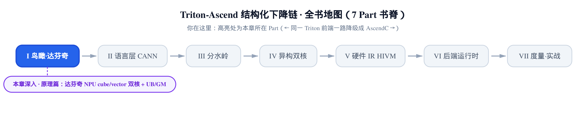
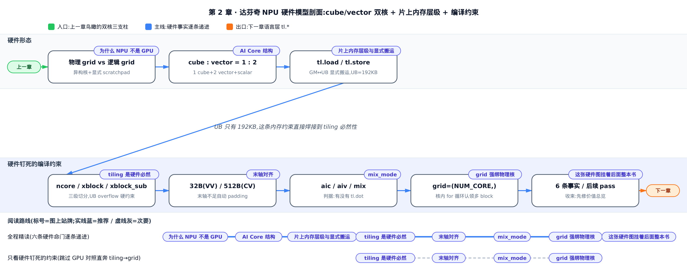
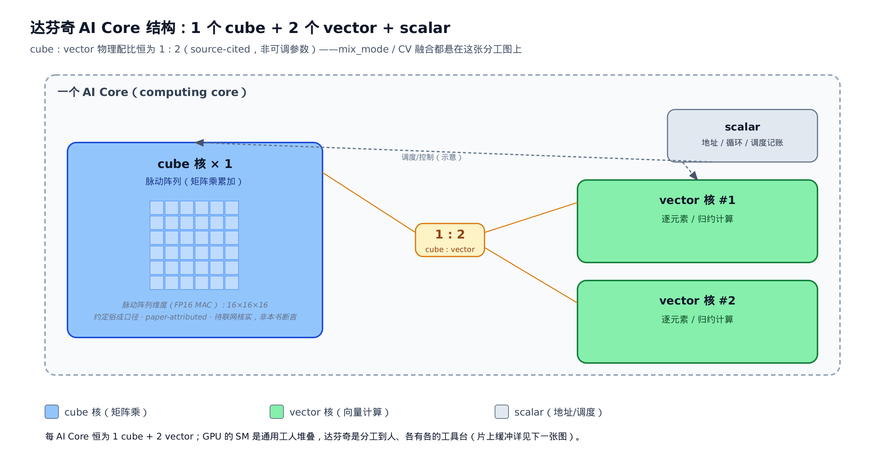
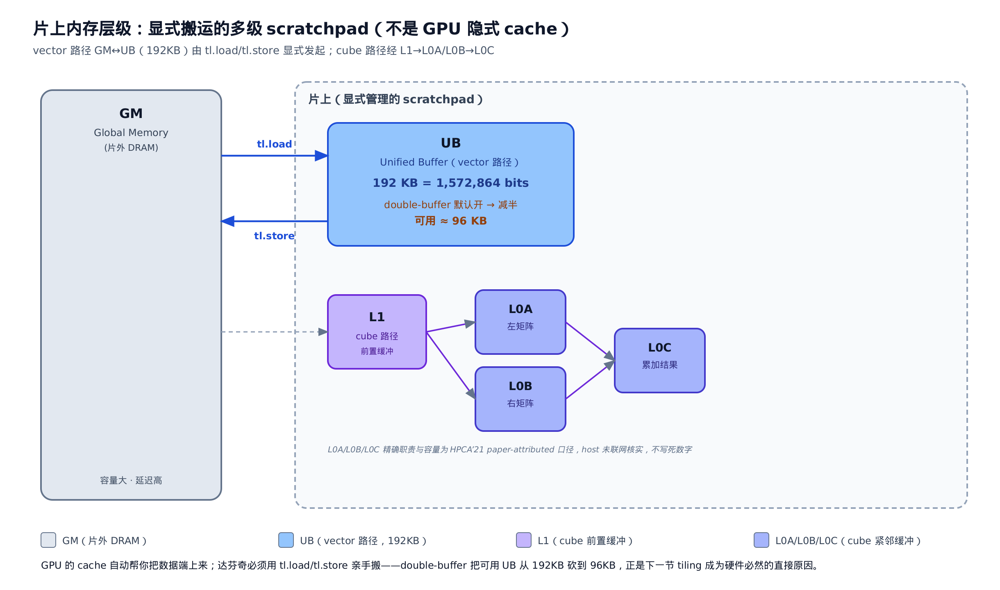

# 达芬奇 NPU 硬件模型：cube/vector 双核、显式片上内存，和它绑死的每一条后端规则



> 上一章：鸟瞰了 fork、三段下降、双核三根支柱。
> 本章：给双核与片上内存填上定量事实。
> 下一章：进入语言层，看 `tl.*` 怎么落到昇腾方言。

**姊妹篇约定**。这本书全程对照基座《Triton 源码解读》。本章对位基座里的 [GPU 执行模型那一章](../../../../triton/artifacts/ch02-gpu-execution-model/narrative/chapter.md)——那一章讲 GPU 的 SIMT（Single Instruction Multiple Threads，单指令多线程）执行模型：海量同构线程、隐式 cache、逻辑 grid。本章讲同一个位置换成华为昇腾 NPU（Neural Processing Unit，神经网络处理器）后，硬件模型变成了什么样。两章讲的是同一件事的两个硬件底座——**后面所有下降 pass 的分叉，根子都在这两张硬件图的差异上**。

这是一块**原理先修章**：它不解读昇腾源码的实现细节，而是把「达芬奇（DaVinci，昇腾 AI Core 的架构名）长什么样、程序员和编译器必须遵守哪些硬约束」讲成定量事实。这些事实是全书后半部分每一个 pass（tiling、内存规划、CV 融合、核间同步）的**根因**——不先立住它们，后面「后端为什么要这么切、这么搬、这么同步」全部悬空。

只想要一句话结论，读完下一节的 GPU 对照就够；想知道 tiling 为什么是硬件必然而非优化选项，跳「tiling 是硬件必然」；想把每一条硬件事实挂到后面哪一章，直接翻末尾的收束表。按顺序读，六条硬件命门会一条接一条从同一张图上长出来。

**符号速查表**（后文每个符号首现处仍会有一句人话解释，这张表只作随手回查）：

| 符号 | 含义 | 首现 |
|---|---|---|
| `num_aicore` | cube 核数（= AI Core 数）；CV 融合算子把并发核数固定到它，约为 `num_vectorcore` 的一半 | §AI Core 结构 |
| `num_vectorcore` | vector 核数；纯 vector 算子把并发核数固定到它，约为 `num_aicore` 的两倍 | §AI Core 结构 |
| UB | Unified Buffer——vector 单元的主片上缓冲，192 KB；本章最硬的一个容量数字挂在它身上 | §片上内存层级 |
| GM | Global Memory（片外 DRAM）——所有输入/输出张量的初始与最终位置，容量大、延迟高 | §片上内存层级 |
| L0A / L0B / L0C | cube 单元紧贴脉动阵列的小缓冲：通常 L0A 放左矩阵、L0B 放右矩阵、L0C 放累加结果（精确职责待联网核实） | §片上内存层级 |
| `ncore` | 三级 tiling 第一级：用几个核（cross-core，跨核切） | §tiling 是硬件必然 |
| `xblock` | 三级 tiling 第二级：每个核负责的数据块大小（inter-core，核间切） | §tiling 是硬件必然 |
| `xblock_sub` | 三级 tiling 第三级：单次搬进 UB 的粒度（intra-core，核内细切） | §tiling 是硬件必然 |
| `tl.dot` | 判定执行模式的唯一判据：有 `tl.dot` ⇒ 涉及矩阵乘 ⇒ 走 AI 核（cube）；无 ⇒ 纯 vector | §mix_mode |
| `cube : vector = 1 : 2` | 一个 AI Core = 1 cube 核 + 2 vector 核，这个物理配比从硬件一路贯穿到编译器的 CV 分块比例 | §AI Core 结构 |



只想弄清楚硬件钉死了后端哪些编译约束，可以跳过开头的 GPU 对照，直接从「tiling 是硬件必然」那一节读到「grid 强绑物理核」；想把「NPU 为什么不是 GPU」这层道理也搞清楚，就按顺序从头读到尾——图中那条斜线焊接点（UB 只有 192KB）正是两节的拼接处。

---

## 为什么 NPU 不是 GPU：领域专用异构核 vs 通用 SIMT

**直觉**。GPU 像一间挤满通用工人的大车间：谁都能干任何活，靠**人多**（成百上千个线程）掩盖等料的空档。达芬奇不是——它是一间**分工到人**的小工坊：干矩阵活的师傅、干向量活的师傅、管调度记账的账房，各有各的工具台，料还得你亲手端上台。这一句差异，是后面所有「为什么昇腾后端要重写一整套下降链」的总起。

**机制**。把两边的心智模型摆开对照。

GPU（SIMT）这一侧：成百上千个同构的 SM（Streaming Multiprocessor，流多处理器），每个 SM 跑大量 warp（32 个线程为一束的调度单位），靠**超额订阅**（oversubscription，让待跑线程数远多于硬件槽位）用线程级并行掩盖访存延迟；片上有硬件管理的 cache 和程序员部分管理的 shared memory，但 global→shared 的搬运在很多路径上是**隐式**的；grid（内核的并行任务网格）是**逻辑任务维**，`[n, m, l]` 等价于 `n×m×l` 个线程，每个线程对应一次内核执行、只跑一次，物理映射交给硬件调度器。

昇腾（达芬奇）这一侧：少量**异构**的 AI Core（昇腾的计算核，内部是分工的功能单元），片上是**显式管理的多级 scratchpad**（草稿缓冲，不是 cache——没有自动换入换出），数据搬运必须由内核**显式写出**；grid 不再是逻辑维，而是**物理核拓扑的映射**。源码文档把这条差异写得很硬：

```python
# docs/en/migration_guide/architecture_difference.md:L5
NPUs are strongly bound to physical cores in Triton multi-core parallelism.
This represents a core difference from GPUs' logical dimension parallelism
+ automatic physical mapping in hardware.
```

再看它给的对照表（省略表头骨架，只留两行关键对照）：

```python
# docs/en/migration_guide/architecture_difference.md:L11-L15
|Essence of grids| Logical task dimension (decoupled from physical cores)| Physical core group mapping (bound to the AI core topology)|
|Limit on the number of cores/dimensions| No hard limit on the grid dimensions/sizes| Grid size ≤ Total number of AI cores; topology matching required by 2D|

GPUs can be bound to multiple dimensions (a 3D grid of `[n, m, l]` is equivalent to `n × m × l` parallel threads). Each thread corresponds to only one kernel execution and executes only once.
In NPUs, vector cores and cube cores belong to multiple physical cores. The number of cores varies with the generation of hardware. Each core executes only one block and can schedule the block execution repeatedly.
```

逐字读出三条硬事实：① 昇腾的 grid 是「物理核组映射」，绑定 AI Core 拓扑，不是 GPU 那种「与物理核解耦的逻辑维」；② 昇腾要求 `Grid size ≤ 总 AI Core 数`，GPU 对 grid 维度/尺寸无硬限；③ 达芬奇上「每个核只执行一个 block、但可以重复调度这个 block 多次」——这最后一句是后面「grid 强绑物理核」那一节的种子，先记住它。

**架构动机（论文侧）**。达芬奇被设计成一个「可伸缩、统一」的深度神经网络计算架构——用领域专用的矩阵/向量单元换取远高于通用 SIMT 的能效比，代价是把访存与并行的管理责任**显式**交给编译器和程序员（HPCA'21，DOI 10.1109/HPCA51647.2021.00071；前序架构宣讲见 HotChips'19，DOI 10.1109/HOTCHIPS.2019.8875654）。这正是为什么昇腾后端不是「把 GPU 内核原样搬过来」，而要重写一整套结构化下降——把显式搬运、tiling、cube/vector 分工全在编译期做出来。

**此刻该记住的一句话**：GPU 靠「海量线程 + 隐式 cache + 逻辑 grid」；达芬奇靠「异构功能单元 + 显式 scratchpad + 物理 grid」。本章后面六条硬件命门，都从这句话生长出来。

---

## AI Core 结构：1 个 cube + 2 个 vector + scalar，配比恒为 1:2

**直觉**。一个 AI Core 像一个专业化的小工坊：里面固定住着「1 个干矩阵活的师傅（cube）+ 2 个干向量活的师傅（vector）+ 1 个管地址、循环、调度记账的账房（scalar）」。GPU 的 SM 是一屋子通用工人堆叠；达芬奇是分工到人、各有各的工具台。



**机制**。一个达芬奇 AI Core 内部有三类计算单元，各司其职：

- **cube（矩阵）单元**：做矩阵乘累加（MAC，Multiply-Accumulate，乘加）。达芬奇的标志性设计是一个 **3D-Cube 脉动阵列**（systolic array，数据像脉搏一样在阵列里逐拍流过、边流边算的结构），把 matmul/卷积做到高能效的核心就在这里。它的**具体维度**（公开常见口径是 16×16×16 的 FP16 MAC 阵列）与每拍 MAC 数属于论文的微架构细节 `[paper-attributed，待联网核实]`——本书不把具体数字写成断言。
- **vector（向量）单元**：做逐元素（elementwise）与归约（reduce，把一维/多维数据聚合成更少元素，如求和、求最大）类计算——激活函数、加减乘除、softmax 的指数与求和、layernorm 的均值方差等。
- **scalar（标量）单元**：做标量运算、地址计算、循环控制与流程调度，相当于核内的「小 CPU」。

源码文档对「矩阵 vs 向量」这层分工给了逐字口径：

```python
# docs/en/migration_guide/migrate_from_gpu.md:L108
|Ascend NPU|Multiple AI cores, categorized into cube cores (for matrix multiplication) and vector cores (for vector computation)| Vector-only operators → Number of concurrent tasks = Number of vector cores; Operators using tl.dot → Number of concurrent tasks = Number of AI cores|
```

达芬奇把「矩阵 vs 向量」的分工**显式暴露**到编程模型——GPU 那边是 CUDA cores 加 Tensor cores、并发度由编译器和硬件自动决定，程序员感知不到。这个显式分工，正是后面 `mix_mode`（内核执行模式）的由来。

**1:2 配比与两个核数**。关键的硬件事实是——一个 AI Core = 1 个 cube 核 + 2 个 vector 核，即 `cube : vector = 1 : 2`：

```python
# docs/en/programming_guide.md:L13-L16
* For pure vector operators, the number of cores is equal to the **number of vector cores**.
* For CV fusion operators, the number of cores is equal to the **number of cube cores** (usually half of the number of vector cores). During operator execution, vector cores are called at a ratio of 1:2.

Generally, on an NPU card, a computing core (AI Core) consists of one cube core, with each cube core paired with two vector cores. So you can obtain the **number of vector cores(vectorcore_num)** and **number of cube cores(aicore_num)** through the following interfaces:
```

这个 1:2 不是随口比喻，它落成**两个可查的核数**——`num_vectorcore`（vector 核数）与 `num_aicore`（cube 核数，约为前者的一半），运行期从设备属性里直接读：

```python
# docs/en/programming_guide.md:L25-L26
vectorcore_num = properties["num_vectorcore"]
aicore_num = properties["num_aicore"]
```

**为什么这个比例值得单独记一节**？因为它决定了「核数怎么固定」：纯 vector 算子把并发核数固定到 `num_vectorcore`，CV 融合算子（既有矩阵乘又有向量运算的算子）固定到 `num_aicore`。这条直接落到「grid 怎么设」（见「grid 强绑物理核」一节）。更关键的是——这个 1:2 从硬件一路贯穿到编译器：昇腾的 CV 编译里有一个自动实现「CV 1:2 subtiling ratio」的分块步骤，调的就是「1 个 cube 配 2 个 vector」这两拨核的协同（源码口径见 `mix_mode` 一节）。

三层递进到这里收口：先记「一个核里有干矩阵的和干向量的两拨人」；再记「人数是 1:2」；最后你会看到「所以后端要为 CV 融合内核专门做 1:2 分块与核间同步」。各单元各自绑定哪块片上缓冲，是下一节的事。

---

## 片上内存层级与显式搬运：GM/UB/L1/L0，和一趟趟亲手搬的货车

**直觉**。片上内存像厨房里从冷库到砧板的一串工作台：GM 是楼下大冷库（装得多、跑一趟远），UB 是灶台边的备料盆，L0A/L0B/L0C 是紧贴炒锅的小碟。GPU 的 cache 会「自动帮你把料端上来」；达芬奇不会——你必须用 `tl.load` 亲手把料从冷库端到备料盆（GM→UB），算完再用 `tl.store` 端回去。



**机制**。达芬奇的片上内存是**显式管理的多级 scratchpad**，不是自动 cache。从远到近、从大到小：

- **GM（Global Memory）**：片外 DRAM，全局可见，容量大但延迟高。所有输入/输出张量初始都在这里。
- **UB（Unified Buffer）**：vector 单元的主片上缓冲区，逐元素/归约计算的数据在这里进出。**容量是本章最硬的一个数字**——192 KB：

```python
# docs/en/programming_guide.md:L180
Before the AI Core performs computation, data needs to be transferred to the on-chip memory. The on-chip memory space is usually much smaller than the total data volume to be processed by the AI Core. For example, the on-chip memory capacity of Atlas 800T/I A2 is 192 KB. After doublebuffer is enabled by default, the capacity is reduced to half of the original capacity. Therefore, data needs to be tiled during operator computation, and only a small part of the data is loaded and processed each time.
```

```python
# docs/en/programming_guide.md:L272
[Note] The UB size of the A2 series products is 192 KB (1,572,864 bits).
```

- **L1 缓冲区**：cube 计算的较大片上缓冲，承接从 GM 搬入、供给 L0。
- **L0A / L0B / L0C**：cube 单元紧贴脉动阵列的小缓冲——通常 L0A 放左矩阵、L0B 放右矩阵、L0C 放累加结果。它们的精确职责与容量属于论文微架构细节 `[paper-attributed，待联网核实]`，图里只作软性标注、不写死数字。

这里 `192 KB = 1,572,864 bits` 值得停一秒：把 192 KB 展开成比特就是 192×1024×8 = 1,572,864。这个精确到比特的数字，后面会在 UB overflow 报错里逐字撞见——它不是约数，是硬件寄死的容量。上面这段里，Atlas 800T/I A2 是昇腾的一款训推一体机型号，A2 系列产品的 UB 就是这个 192 KB。

**显式搬运**是这一节的核心动词。在 GPU 上 `tl.load` 大体是「读到寄存器、让 cache 生效」；在昇腾上，`tl.load` 是**把数据从 GM 显式搬进片上 UB**，`tl.store` 是**从 UB 显式写回 GM**。看 `add_kernel`（一个逐元素向量加内核）里这层语义——每个 block 严格三步：搬进、就地算、搬回。

```python
# docs/en/programming_guide.md:L92-L106
    pid = tl.program_id(0)
    NUM_CORE = tl.num_programs(0)
    NUM_BLOCKS = tl.cdiv(n, BLOCK_SIZE)
    for block_idx in range(pid, NUM_BLOCKS, NUM_CORE):
        block_start = block_idx * BLOCK_SIZE
        # The block size is BLOCK_SIZE.
        offsets = block_start + tl.arange(0, BLOCK_SIZE)
        mask = offsets < n
        # Load data of x and y to the on-chip memory.
        x = tl.load(x_ptr + offsets, mask=mask)
        y = tl.load(y_ptr + offsets, mask=mask)

        output = x + y

        tl.store(out_ptr + offsets, output, mask=mask)
```

`pid` 是本核的程序号（`tl.program_id(0)`），`NUM_CORE` 是并发核数，`BLOCK_SIZE` 是一个编译期常量块大小，`mask` 挡住尾部越界的元素。核内那圈 `for block_idx in range(pid, NUM_BLOCKS, NUM_CORE)` 是任务分配，留到最后一节讲；先把眼睛放在循环体里那条数据链：`tl.load` 两次把 `x`、`y` 从 GM 搬进 UB → `output = x + y` 在 UB 上算 → `tl.store` 写回 GM。

**逐块追踪**。取一组小到能心算的参数：`n = 8`、`BLOCK_SIZE = 4`、单核（`NUM_CORE = 1`），`x = [10,20,30,40,50,60,70,80]`、`y = [1,2,3,4,5,6,7,8]`。块数是 $`\lceil 8/4 \rceil = 2`$，单核跑两轮「搬进→算→搬回」：

<!-- trace: explicit-data-movement -->

| block | offsets | tl.load(GM→UB) | UB 上算 output=x+y | tl.store(UB→GM) |
|---|---|---|---|---|
| 0 | [0,1,2,3] | x=[10,20,30,40], y=[1,2,3,4] 搬进 UB | [11,22,33,44] | out[0:4]=[11,22,33,44] 写回 GM |
| 1 | [4,5,6,7] | x=[50,60,70,80], y=[5,6,7,8] 搬进 UB | [55,66,77,88] | out[4:8]=[55,66,77,88] 写回 GM |

**不变量**。vector 单元的输入必先经 `tl.load` 进片上、输出必经 `tl.store` 回 GM——搬运是显式且强制的，GM 里的数据 vector 单元不能就地访问。论证：每个 block 缺了 `tl.load` 则 UB 里没数据可算，缺了 `tl.store` 则结果留在片上、永远不落 GM。所以「进片上→算→回 GM」是每 block 不可省的闭环——这正是 GPU 隐式 cache 路径所没有的显式性。搬运次数也是线性的：两个 block 共 `tl.load` 4 次（`x`、`y` 各一次）、`tl.store` 2 次。

后端还专门为「显式搬运有代价」这件事做优化——比如「先整块搬进 UB 再从 UB 里选值」，本质是把离散的小搬运换成一次大搬运，显著改善 MTE（Memory Transfer Engine，搬运引擎）的占用。这类优化在 GPU 上根本不存在，因为 GPU 的搬运是隐式的。

**double-buffer：为什么它把可用 UB 减半**。为了让「搬运」和「计算」流水并行（搬第 N+1 块的同时算第 N 块），达芬奇用 **double-buffer**（也叫 ping-pong，乒乓缓冲）：同一块逻辑缓冲区在物理上开两份，一份在算、一份在搬。它**默认就开**：

```python
# docs/en/programming_guide.md:L176
Currently, the compiler is configured with multiBuffer set to True by default, and the parallel storage and computation are supported by default.
```

这里 `multiBuffer` 是编译器实现 double-buffer 的开关名，默认 `True`。代价上面那段 L180 已经逐字讲了：「After doublebuffer is enabled by default, the capacity is reduced to half」——可用容量减半，从 192 KB 掉到约 96 KB。写成不变量：可用 UB = 声明容量 / 2 当且仅当 `multiBuffer=True`，否则等于声明容量——下一节 tiling 的 trace 表默认拿约 96 KB 作可用 UB 基线，根子就是这条。这一句是本章两节的**焊接点**：它把「UB 只有 192 KB」这条内存约束，直接接到下一节「tiling 是硬件必然」——因为可用的其实只有一半。

---

## tiling 是硬件必然：三级切分，不是优化选项

**直觉**。灶台（可用 UB，double-buffer 后约 96 KB）比整锅要炒的菜（数据总量）小得多，所以不能一次全端上来——必须切成小份、炒一份端一份。这不是「优化技巧」，是「装不下就得切」的物理必然。切法是**三级**：先分给几个师傅（`ncore`），每个师傅分一大盆（`xblock`），师傅自己再把盆里的菜一小碟一小碟下锅（`xblock_sub`）。

**机制**。片上远小于数据总量，加上 double-buffer 再砍一半，所以必须 tiling——每次只搬一小块进 UB 算（依据就是上一节那段 L180：「data needs to be tiled during operator computation, and only a small part of the data is loaded and processed each time」）。超了会直接编译报错，这是读者一定撞得到的错误：

```python
# docs/en/programming_guide.md:L268
E loc("/tmp/tmpsb6qkdih/kernel.ttadapter.mlir":3:3): error: ub overflow, requires 3072256 bits while 1572864 bits available! (possible reason
```

看这两个数字：请求 3,072,256 比特、可用 1,572,864 比特——后者正是上一节 UB 的精确容量。两个数一除，3,072,256 ÷ 1,572,864 约等于 1.95，即请求了将近两倍的 UB。这条报错不是抽象警告，是「没 tiling 好就装不下」的硬碰硬。

昇腾的 tiling 是三级的，源码文档给了逐字口径：

```python
# docs/en/migration_guide/architecture_difference.md:L37-L39
ncore: the number of cores in use (cross-core tiling)
xblock: the size of inter-core data blocks (inter-core tiling)
xblock_sub: the granularity of intra-core tiling (fine-grained intra-core tiling)
```

`ncore` 跨核切（决定用几个核）、`xblock` 核间切（每个核负责多大一段）、`xblock_sub` 核内再切（决定单次进 UB 的量）。三个参数同时实例化的规范例子是 `triton_better_kernel`（一个逐元素 GELU 内核，GELU 是一种激活函数），它把三级 tiling 一次写全：

```python
# docs/en/migration_guide/architecture_difference.md:L97-L110
def triton_better_kernel(in_ptr0, out_ptr0, xnumel, XBLOCK: tl.constexpr, XBLOCK_SUB: tl.constexpr):
    xoffset = tl.program_id(0) * XBLOCK
    for xoffset_sub in range(0, XBLOCK, XBLOCK_SUB):
        x_index = xoffset + xoffset_sub + tl.arange(0, XBLOCK_SUB)[:]
        xmask = x_index < xnumel
        x = tl.load(in_ptr0 + x_index, xmask)
        ret = x * 0.5 * (1.0 + tl.erf(x / tl.sqrt(2.0)))
        tl.store(out_ptr0 + x_index, ret, xmask)

# Call the triton_kernel function.
ncore = 32
xblock = 32768
xblock_sub = 8192
triton_better_kernel[ncore, 1, 1](x0, out1, x0.numel(), xblock, xblock_sub)
```

逐段拆：`XBLOCK`、`XBLOCK_SUB` 是编译期常量（`tl.constexpr`）；`xoffset = tl.program_id(0) * XBLOCK` 算出本核负责的那一大盆的起点（核间 tiling）；核内那圈 `for xoffset_sub in range(0, XBLOCK, XBLOCK_SUB)` 就是「核内再套一层 for」，每轮只取 `XBLOCK_SUB` 个元素进 UB（核内 tiling）。调用侧把三参钉死：`ncore=32`、`xblock=32768`、`xblock_sub=8192`。这正是等价 GPU 内核没有、而昇腾内核常见「核内多套一层循环」的根因——GPU 靠海量线程铺开，昇腾靠少数核循环认领。

**逐轮追踪**。聚焦单个核（`pid=0`）的核内循环 `for xoffset_sub in range(0, 32768, 8192)`，数据类型 f32（每元素 4 字节），可用 UB 约 96 KB：

<!-- trace: tiling-hardware-necessity -->

| 核内轮次 sub | xoffset_sub | x_index 区间 | 本轮元素数 | 进 UB 占用（f32=4B） | 判定 vs 可用 UB ~96KB |
|---|---|---|---|---|---|
| 0 | 0 | [0, 8192) | 8192 | 8192×4B = 32 KB | 32KB ≤ 96KB ✓ 装得下 |
| 1 | 8192 | [8192, 16384) | 8192 | 32 KB | ✓ |
| 2 | 16384 | [16384, 24576) | 8192 | 32 KB | ✓ |
| 3 | 24576 | [24576, 32768) | 8192 | 32 KB | ✓ |
| 对照：若不切核内（整 XBLOCK 一次进 UB） | — | [0, 32768) | 32768 | 32768×4B = 128 KB | 128KB > 96KB ✗ UB overflow |

**不变量**。只要单轮进 UB 的量（`xblock_sub` 个元素乘每元素字节数）不超过可用 UB，核内循环每轮就恒 ≤ UB 容量，永不 overflow；而整块 `xblock` 一次进 UB 会超。论证：循环步长 `XBLOCK_SUB`，共 $`\lceil 32768/8192 \rceil = 4`$ 轮，起点 $`\{0,8192,16384,24576\}`$ 两两不交、并集恰好覆盖 $`[0,32768)`$，不重不漏；每轮固定进 8192 个 f32 = 32 KB ≤ 96 KB（单调有上界）；对照整块 32768 个 f32 = 128 KB > 96 KB，正好触发那条 ub overflow。所以「切到 sub 粒度」是装得下的**充分条件**，不是可选优化。

同一「核内再套一层 for」还有个更贴近真实算子的落地写法——`masked_fill_kernel`（按掩码填值的内核），核内循环用 `num_sub_blocks = tl.cdiv(BLOCK_SIZE, BLOCK_SIZE_SUB)` 算出要跑几轮：

```python
# docs/en/migration_guide/migrate_from_gpu.md:L280-L295
    # Calculate the number of sub-blocks to be processed.
    num_sub_blocks = tl.cdiv(BLOCK_SIZE, BLOCK_SIZE_SUB)
    # Process blocks to avoid UB overflow.
    for sub_block_idx in range(num_sub_blocks):
        sub_offset = base_offset + sub_block_idx * BLOCK_SIZE_SUB
        offsets = sub_offset + tl.arange(0, BLOCK_SIZE_SUB)
        mask = offsets < N
        # Load and process data in batches.
        input_vals = tl.load(inp + offsets, mask=mask, other=0)
        fill_mask_vals = tl.load(expand_mask + offsets, mask=mask, other=0).to(tl.int1)
        # First, write the original data.
        tl.store(out + offsets, input_vals, mask=mask)
        # Then overwrite the target value at the position where padding is required.
        value_to_write = tl.full([BLOCK_SIZE_SUB], value, dtype=input_vals.dtype)
        final_vals = tl.where(fill_mask_vals, value_to_write, input_vals)
        tl.store(out + offsets, final_vals, mask=mask)
```

注释「Process blocks to avoid UB overflow」把动机写在脸上：这层核内循环存在的唯一理由，就是躲开上面那条 overflow。若沿用 `BLOCK_SIZE=32768`、`BLOCK_SIZE_SUB=8192`，`num_sub_blocks` 同样是 $`\lceil 32768/8192 \rceil = 4`$——和 `triton_better_kernel` 一样的四轮。两个例子一个是理想教学写法、一个是真实算子写法，指向的是同一条硬件必然。

---

## 末轴对齐：32 字节与 512 字节的整格税

**直觉**。UB 搬数据像货架只按整格摆：VV 算子（只用 vector 核的算子）一格是 32 字节（= 8 个 f32），CV 算子（同时用 cube 核和 vector 核的算子）一格是 512 字节（= 128 个 f32）。你的张量末轴要是只有 1 个元素（4 字节），硬件也得占满一整格 32 字节——1 个真元素背后拖着 7 个空位，8 倍的无效搬运和计算。末轴越短、padding 越亏。

**机制**。UB 对张量**末轴（tail axis，最内层那一维）字节数**有对齐要求，不满足会**自动 padding**、拖慢性能。源码文档一段话把规则和反例都给全了：

```python
# docs/en/programming_guide.md:L111
[Description] For VV operators, if the Vector core needs to be called for computation, the UB of the Ascend hardware requires that the size of the tail axis of the tensor be divisible by 32 bytes. For CV operators, if the Vector core and Cube core need to be called for computation, the size of the tail axis of the tensor must be divisible by 512 bytes. If the tail axis length is insufficient, the tail axis length will be automatically padded. Under this premise, the performance of operations with the shape of (2048,3) and (2048,1) tensors in the model deteriorates significantly due to automatic padding. In this case, you can perform the transpose operation to convert the alignment axis to a lower dimension until the store operation is performed, avoiding automatic padding and optimizing the computing speed.
```

规则形式化成一句：末轴被 padding 到不小于自身的最小整格倍数。

```math
\mathrm{padded\_bytes} = \left\lceil \frac{\mathrm{tail\_bytes}}{\mathrm{align}} \right\rceil \times \mathrm{align}
```

这里 `tail_bytes` 是末轴的真实字节数，`align` 是对齐格（VV 是 32、CV 是 512），$`\lceil \cdot \rceil`$ 是向上取整。膨胀比就是 `padded_bytes` 与 `tail_bytes` 之比——它衡量「真元素里混进了多少空位」。

**逐例追踪**。f32 下，VV 一格 = 32 B / 4 = 8 元素，CV 一格 = 512 B / 4 = 128 元素。拿文档点名的反面形状 `(2048, 1)`、`(2048, 3)` 和一个恰好对齐的 `(2048, 8)` 对比：

<!-- trace: tail-axis-alignment -->

| 张量 shape | 算子类型 | 末轴元素/字节 | 对齐格（字节/元素） | padding 后末轴 | 膨胀比 |
|---|---|---|---|---|---|
| (2048, 1) f32 | VV | 1 元素 / 4 B | 32 B / 8 元素 | 8 元素（32 B） | 8.0× (7 个空位) |
| (2048, 3) f32 | VV | 3 元素 / 12 B | 32 B / 8 元素 | 8 元素（32 B） | 2.67× |
| (2048, 8) f32 | VV | 8 元素 / 32 B | 32 B / 8 元素 | 8 元素（32 B） | 1.0× 恰好对齐、无 padding |
| (2048, 1) f32 | CV | 1 元素 / 4 B | 512 B / 128 元素 | 128 元素（512 B） | 128× (CV 格更大、更亏) |

**不变量**。末轴字节数不是对齐格的整数倍就必被向上 padding 到下一整格；末轴越短膨胀比越大，恰为整格倍数时膨胀比 = 1（无 padding）。论证：`padded_bytes` 是不小于 `tail_bytes` 的最小 `align` 倍数，向上取整单调。当 `tail_bytes` 能被 `align` 整除时（如 `(2048, 8)`：32 B 整除 32 B）膨胀比 = 1；否则膨胀比 > 1，且 `tail_bytes` 越小比值越大——VV 下 `(2048, 1)` 达 8×，同一形状在 CV（512 B 格）下膨胀到 128×。

这就是文档说 `(2048, 1)`、`(2048, 3)` 因自动 padding「性能显著劣化」的量化根因，也是它建议用「借轴转置」（把对齐轴转到更低维直到 store 时才落地）规避 padding 的动机。往后你会看到后端做 layout/transpose（数据布局与转置）变换、把 `<Nx1>` 这种细长张量重排——根子都在这张整格税表上。

---

## mix_mode：有没有 `tl.dot`，决定用哪拨核

**直觉**。上一次分工（1 cube + 2 vector）留了个尾巴：一个内核到底该派给哪拨核？判据简单到只看一件事——**内核里有没有 `tl.dot`**（矩阵乘原语）。有，就涉及矩阵乘、得动用 cube；没有，就是纯向量活、只用 vector。

**机制**。由 cube/vector 分工直接派生出内核的三种执行模式 `mix_mode`：

- **aiv（纯 vector）**：内核只有向量/逐元素运算 → 只用 vector 核。
- **aic（cube）**：涉及矩阵乘 → 动用 cube 核。
- **mix（CV 融合，Mix Kernel）**：一个内核里**既有 cube 又有 vector** 运算。典型是 flash-attention（一种把注意力计算融进单个内核、边算边归约的算法）——$`Q \cdot K^{\top}`$ 是矩阵乘走 cube，中间的 softmax 走 vector，softmax 的输出记为 P，$`P \cdot V`$ 再走 cube 做矩阵乘。

判据的源码口径就在前面那段 migrate_from_gpu.md:L108 里逐字写着——「Vector-only operators → 并发任务数 = vector 核数；Operators using **tl.dot** → 并发任务数 = AI 核数」。有没有 `tl.dot`，一刀切开走哪拨核、并发数固定到哪个核数。

**为什么这构成一个编译难题**。cube 和 vector 是**物理分离**的两拨核。当一个内核同时用到两者（mix），编译器必须把两拨核的协同在编译期做出来。昇腾的硬件 IR 层（HIVM，Hardware IR & Virtual Machine，昇腾的硬件级中间表示与下降层）为此专门有一个「感知 CV 核分离架构、自动做 CV 融合编译」的步骤：

```python
# third_party/ascend/AscendNPU-IR/docs/source/en/introduction/architecture.md:L29
1. **CV kernel mapping compilation**: Aware of the NPU CV core-separation hardware architecture, it automatically performs CV fusion compilation and optimization for Mix Kernel (kernel functions that include both cube and vector operations). By analyzing data dependencies between cube and vector operations, it automatically inserts store and load for CV core data exchange, derives the workspace global memory size required for intermediate exchange and generates the Host-side size-derivation function, inserts inter-core synchronization at CV data dependencies to guarantee dependency order, and finally splits MixKernel into separate AIC and AIV kernel functions, thus realizing CV fusion compilation. For performance, the CVPipeline pass automatically adjusts the order of Cube and Vector code to enable CV core pipeline parallelism, and AutoSubTiling automatically implements the CV 1:2 subtiling ratio.
```

逐条读出这段做了什么：① 分析 cube 与 vector 运算之间的数据依赖；② 在 CV 数据交换处自动插入 store/load，并推导中转 workspace（编译器在 GM 里开的中间缓冲）的大小；③ 在 CV 数据依赖处插入**核间同步**，保证依赖顺序；④ 最终把一个 Mix Kernel 拆成独立的 AIC 内核和 AIV 内核。为了性能，CVPipeline（一个调整 cube/vector 代码顺序、让两拨核流水并行的 pass）和 AutoSubTiling（自动实现 CV 1:2 分块比例的 pass）再补上——注意这个 **1:2 正是「AI Core 结构」一节那个物理配比**，它从硬件一路贯穿到了这里的编译器自动分块。

一句话收束：CV 融合不是一个可选优化，是「cube/vector 物理分离」这个硬件形态在编译级留下的**必然后果**。有 `tl.dot` 又有向量运算，编译器就必须替你把数据交换、同步、1:2 分块全做出来。判据本身是双向的：有 `tl.dot` 的内核一定动用 cube；没有 `tl.dot` 的内核一定不动用 cube——`mix_mode` 三态里落到哪一态，只由这一个信号决定。

---

## grid 强绑物理核：固定核数，核内 for 循环认领

**直觉**。GPU 的 grid 像点外卖：你要 5 份、系统就派 5 个骑手（逻辑等于物理、自动映射）。达芬奇只有固定几个骑手（物理核），要 5 份就让每个骑手多跑几趟——核数固定到物理核数，核内用 for 循环 step 式地把多出来的 block 一轮轮认领。这正是本章开头那句「每个核只执行一个 block、但可重复调度」的落地。

**机制**。源码文档把推荐做法写得很直接：

```python
# docs/en/migration_guide/migrate_from_gpu.md:L103
For Triton operators that perform only vector core computations, the number of concurrent tasks should be equal to the number of vector cores. For other types of Triton operators (those using tl.dot), the number of concurrent tasks should be equal to the total number of AI cores.
```

把并发任务数设成物理核数（纯 vector 用 `num_vectorcore`、含 `tl.dot` 用 `num_aicore`），然后核内用 step 循环认领多出来的 block——回头看「显式搬运」一节那段 `add_kernel`，核内那圈 `for block_idx in range(pid, NUM_BLOCKS, NUM_CORE)` 就是这个 step 循环：从 `pid` 起步、步长 `NUM_CORE`,一个核隔 `NUM_CORE` 认领一个 block。

**逐步追踪**。取 `NUM_CORE = 2`（2 个物理核）、`NUM_BLOCKS = 5`（5 个 block），看两个核怎么把 5 个 block 认领干净：

<!-- trace: grid-bound-to-physical-cores -->

| step k | 核 pid=0 认领 block_idx=0+2k | 核 pid=1 认领 block_idx=1+2k | 累计已覆盖 block |
|---|---|---|---|
| 0 | block 0 | block 1 | {0,1} |
| 1 | block 2 | block 3 | {0,1,2,3} |
| 2 | block 4 | （1+4=5 ≥ 5，越界，停） | {0,1,2,3,4} 全覆盖 |

**不变量**。step 循环 `range(pid, NUM_BLOCKS, NUM_CORE)` 让 `NUM_BLOCKS` 个 block 被 `NUM_CORE` 个物理核不重不漏地认领：每个 block 恰好被一个核执行一次，核可重复调度多次。论证靠一个整数分解——任一 block $`b`$ 有唯一写法：

```math
b = (b \bmod \mathrm{NUM\_CORE}) + \left\lfloor b / \mathrm{NUM\_CORE} \right\rfloor \times \mathrm{NUM\_CORE}
```

即每个 block 按对 `NUM_CORE` 取余数分类，余数就是认领它的 `pid`、商就是第几轮 `k`。所以各核的认领集合两两不交、并集覆盖全部 block；`k` 每轮加一、`block_idx` 单调增，达到 ≥ `NUM_BLOCKS` 即停（`pid=1` 在 `k=2` 时 1+4=5 ≥ 5 停），有限步终止。这正印证了本章开头那句「each core executes only one block and can schedule the block execution repeatedly」的两面：一次认一个 block、但可重复认多次。本例里核 0 认领 $`\{0,2,4\}`$、核 1 认领 $`\{1,3\}`$，每核最多 $`\lceil 5/2 \rceil = 3`$ 轮。

**为什么非得这么做**。runtime 虽允许最多 65,535 个并发任务，但超过物理核数的任务要「分新一轮下发」，带来核启动与初始化开销。GPU 那种「grid = 逻辑任务维、物理映射交硬件」直接搬到昇腾会性能劣化——这就是「grid 强绑物理核」的成本理由。编译器侧还给了一个自动开关，帮你把逻辑核数收敛到物理核数：

```python
# docs/en/migration_guide/migrate_from_gpu.md:L104
Tips: **TRITON_ALL_BLOCKS_PARALLEL** controls the automatic optimization of the number of logical cores based on the number of physical cores. This feature can be enabled only when logical cores can execute in parallel. When the number of logical cores is greater than the number of physical cores, enabling this feature will instruct the compiler to automatically adjust the number of logical cores to match the number of physical cores, thereby reducing scheduling overhead.
```

`TRITON_ALL_BLOCKS_PARALLEL` 是这个自动收敛的开关：逻辑核数多于物理核数时开启它，编译器就自动把逻辑核数调到物理核数、省掉调度开销。这也是后面 AutoBlockify（把逻辑 block 自动收敛/重排到物理核数的 pass）的动机来源。

---

## 这张硬件图挂着后面整本书

到这里，六条硬件命门都立住了。它们不是孤立的冷知识——每一条都在后面某个 pass 或某一章下面**当地基**。把它们一一挂钩，你就明白「为什么先修这一章」：

先给几个后面会反复出现的 pass 名一句话定位，免得表里撞见发懵：PlanMemory 是编译期推导片上内存布局与占用的内存规划 pass；AutoBlockify 前面刚讲过（逻辑核数收敛到物理核数）；layout/transpose 是重排数据布局、绕开对齐税的变换；CV 融合相关的 CVPipeline / AutoSubTiling / 核间同步已在 `mix_mode` 一节讲过。

| 本章硬件事实 | 挂到后面哪个机制 / Part |
|---|---|
| cube/vector 1:2 分工 | `mix_mode`、CV 融合、CVPipeline、AutoSubTiling（P5 HFusion/HIVM） |
| UB 192KB + double-buffer 减半 | tiling 必然、PlanMemory、UB overflow 诊断（P4 优化 / P5 HIVM） |
| 32B/512B 末轴对齐 | layout/transpose 变换、`<Nx1>` 膨胀、借轴转置（P4 优化） |
| 显式搬运 GM↔UB | `tl.load`/`tl.store` 下降、MTE 搬运优化、bind_buffer/multibuffer 缓冲绑定（P3 分水岭 / P5 HIVM） |
| grid 强绑物理核 | AutoBlockify、`TRITON_ALL_BLOCKS_PARALLEL`、auto_blockify_size 收敛粒度（P4 优化） |
| `tl.dot` ⇒ 用 AI 核 | Mix Kernel 拆 AIC/AIV、核间同步（P5 HIVM） |

这张硬件模型是有边界的。它只讲达芬奇的**硬件形态**——cube/vector/scalar、UB/L1/L0/GM、double-buffer、对齐、`mix_mode`、grid 强绑物理核。三样东西**不在本章**，各有专章：MLIR（Multi-Level Intermediate Representation，多层中间表示）编译基础设施的方言/op/pass 原理，归 MLIR 原理章（arXiv:2002.11054）；Linalg（线性代数方言）的结构化张量 codegen，归 Linalg 原理章（arXiv:2202.03293）；昇腾方言分层图与整条编译流图，归开篇的鸟瞰章。放心，后面用到时会各自展开，不在这里重画。

一句话收尾：**你写下的 `tl.load` / `tl.dot` / `tl.store` 不是在 GPU 上跑，而是被 fork 后的昇腾后端逐层下降成达芬奇 NPU 的 cube/vector 指令**——本书接下来讲的每一个 pass，都是在把这张硬件图上的约束「编译」出来。
