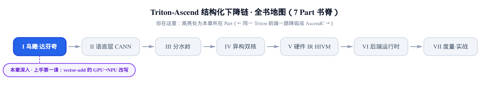
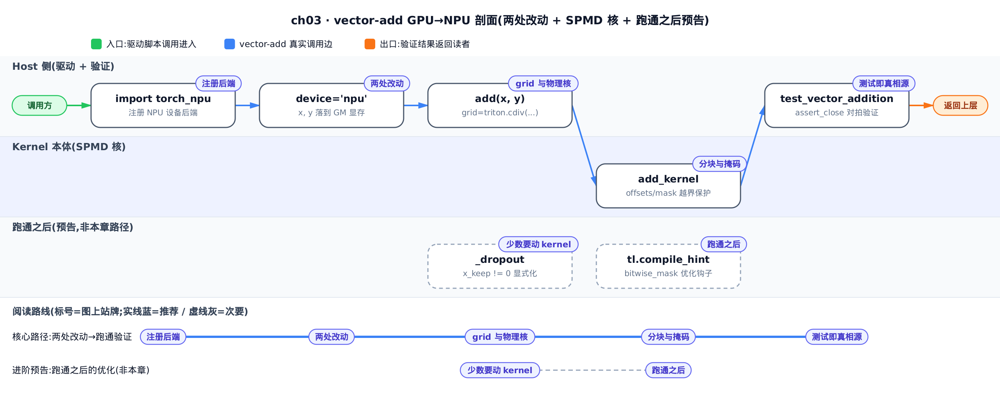
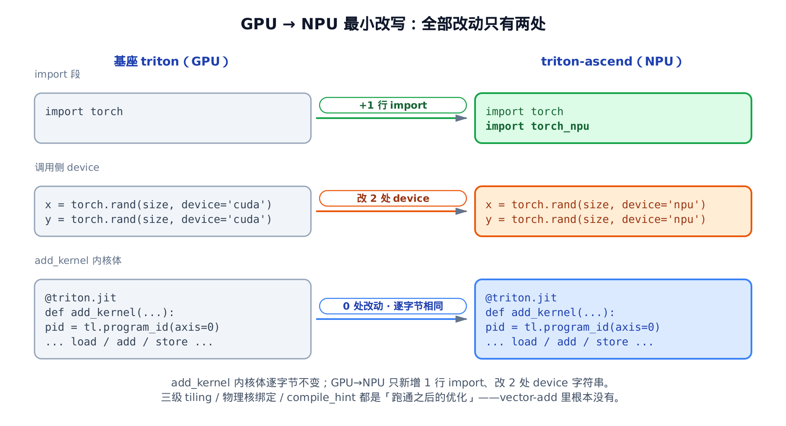
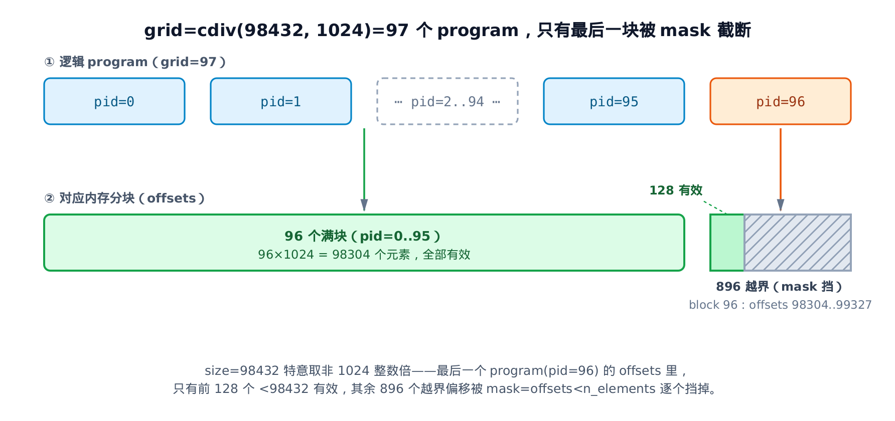

# 上手第一课：vector-add 的 GPU→NPU 最小改写



> 上一章：走进达芬奇硬件，立起双核异构、显式内存层级、三级 tiling 的定量事实。
> 本章：拿一个能跑通的最小核落地——GPU 的 vector-add 搬到昇腾，到底改哪几处。
> 下一章：翻开 Part 2，看语言层怎么在昇腾侧接管算子的构建与分派。

前两章都在铺**心智模型**：鸟瞰那一章把 fork、三段下降、双核三根支柱铺开；上一章把达芬奇硬件的定量事实钉死。到这里你手里有一整套「昇腾为什么这么设计」的期望——[上一章的达芬奇模型](../../ch02-davinci-npu-hardware-model/narrative/chapter.md)甚至给出了三级 tiling（ncore/xblock/xblock_sub 三层分块）和「grid 强绑物理核」的样板。

本章反过来：不再讲原理，拿一个**真能跑的最小核**当活体标本，看这套期望里有多少是「跑通所必需」，多少是「跑通之后的优化」。标本就选官方教程的第一个例子——vector-add（`third_party/ascend/tutorials/01-vector-add.py`），两个向量逐元素相加。它是最小的：没有矩阵乘、没有规约、没有跨核同步，把 GPU→NPU 的移植面缩到只剩骨架，方便我们孤立地问一句——**到底改哪几处，它就能在昇腾上跑起来？**

答案小到会让你意外。只想看结论，读完下一节「两处改动」就够；想弄懂那段一字未改的 kernel 内部怎么算的，重点在「分块与掩码」这一节；关心「为什么这里不做物理核绑定」的落差，跳到「逻辑 grid 与物理核」。



图上实线蓝是本章核心路径，从注册后端一路读到测试即真相源就拿到了全部结论；虚线灰的两站（少数要动 kernel、跑通之后）是预告性质，好奇 NPU 上还有哪些优化钩子再顺访，跳过也不影响读懂这一课。

## 两处改动：kernel 本体一个字都不用改

先说结论：把基座 Triton 那本书里读过的同一个 vector-add，从 GPU 搬到昇腾 NPU（Neural Processing Unit，神经网络处理器），移植相关的改动只有两处——**加一行 `import torch_npu`、把 device 字符串从 `'cuda'` 改成 `'npu'`**。那段 `@triton.jit` 标注的核函数本体，逐字节不变。此外教程文件里还删掉了几处解释性注释、一句 `is_cuda` 断言和整段 benchmark 代码——这些是教程本身的取舍，与 GPU→NPU 移植无关，你自己对着基座 `01-vector-add.py` 逐行 diff 时会一并看到。



*图注：三块并排——import 块 +1 行、device 块改 2 处、kernel 本体 0 改动。*
*Triton 的 `@triton.jit` 是硬件无关的中间表达，编译到 NPU 还是 PTX 由框架承担。*

第一处，import。基座只有一行 `import torch`；昇腾版在它下面多加一行：

```python
# third_party/ascend/tutorials/01-vector-add.py:L43-L47
import torch
import torch_npu

import triton
import triton.language as tl
```

多出来的 `import torch_npu` 是让 `device='npu'` 生效的前提——它向 PyTorch 注册昇腾 NPU 设备后端，`'npu'` 这个设备字符串才会被认得。缺这一行，后面写 `device='npu'` 会直接报错。这一行的分量下一节单独讲。

第二处，就是 device 字符串。看驱动这段：

```python
# third_party/ascend/tutorials/01-vector-add.py:L92-L101
torch.manual_seed(0)
size = 98432
x = torch.rand(size, device='npu')
y = torch.rand(size, device='npu')
output_torch = x + y
output_triton = add(x, y)
print(output_torch)
print(output_triton)
print(f'The maximum difference between torch and triton is '
      f'{torch.max(torch.abs(output_torch - output_triton))}')
```

`x`、`y` 两处 `device='npu'`——基座这里写的是 `'cuda'`。改完这两处，张量就分配在 NPU 的全局内存（GM，Global Memory，达芬奇的片外 DRAM，上一章已建立）上了。最后拿 Triton 的结果和 `torch` 的直接相加逐元素对拍，是「跑通看数值」的交叉验证。这里 `size=98432` 特意取了个不是 1024 整数倍的数，后面「分块与掩码」会看到它的用意。

那核函数本体呢？一个字没动：

```python
# third_party/ascend/tutorials/01-vector-add.py:L50-L75
@triton.jit
def add_kernel(x_ptr,  # *Pointer* to first input vector.
               y_ptr,  # *Pointer* to second input vector.
               output_ptr,  # *Pointer* to output vector.
               n_elements,  # Size of the vector.
               BLOCK_SIZE: tl.constexpr,  # Number of elements each program should process.
               # NOTE: `constexpr` so it can be used as a shape value.
               ):
    # There are multiple 'programs' processing different data. We identify which program
    # we are here:
    pid = tl.program_id(axis=0)  # We use a 1D launch grid so axis is 0.
    # This program will process inputs that are offset from the initial data.
    # For instance, if you had a vector of length 256 and block_size of 64, the programs
    # would each access the elements [0:64, 64:128, 128:192, 192:256].
    # Note that offsets is a list of pointers:
    block_start = pid * BLOCK_SIZE
    offsets = block_start + tl.arange(0, BLOCK_SIZE)
    # Create a mask to guard memory operations against out-of-bounds accesses.
    mask = offsets < n_elements
    # Load x and y from DRAM, masking out any extra elements in case the input is not a
    # multiple of the block size.
    x = tl.load(x_ptr + offsets, mask=mask)
    y = tl.load(y_ptr + offsets, mask=mask)
    output = x + y
    # Write x + y back to DRAM.
    tl.store(output_ptr + offsets, output, mask=mask)
```

这 26 行，连注释都和基座 Triton 的同名 `add_kernel` 逐字节相同。这就是本章的头条：**Triton 的 `@triton.jit` 核是一份硬件无关的中间表达**，编译到 NPU 二进制还是 GPU 的 PTX（NVIDIA GPU 的并行汇编），由框架的后端（`third_party/ascend/backend/compiler.py` 里的 AscendBackend，鸟瞰那一章已建立的昇腾后端主类）承担；kernel 本体因此可移植。基座 Triton 那本书里，同一个 vector-add 讲的是 `@triton.jit`→PTX→launch 的一条 GPU 全链路；本章讲的是同一份源码原封不动落到昇腾——改的只是「编到哪块卡」，不是「怎么写这个核」。

至于三级 tiling、物理核绑定、`compile_hint`——上一章铺得很足的那些昇腾特性——在这个核里**一处都没有**。它们不是跑通的前提，是跑通之后才碰的优化。这一点，后面几节会逐个落实。

## import torch_npu：一行注册，换来一整个设备后端

上面那行 `import torch_npu`（`third_party/ascend/tutorials/01-vector-add.py:L44`）值得单独停一下。它看着只是个 import，实际做的是**向 PyTorch 注册昇腾 NPU 设备后端**——把 `'npu'` 变成一个合法的 device 字符串。

链条是这样的：`import torch_npu` 跑完，PyTorch 的设备表里就多了 `'npu'` 这一项；于是 `torch.rand(size, device='npu')` 才能解析、在 GM 上分配张量；`add(x, y)` 里 `torch.empty_like(x)` 也顺势把输出开在 NPU 上；最后 `add_kernel[grid](...)` 把这几个 NPU 张量喂进 Triton 核。整条数据流的第一环就是这一行 import——它是「基座只有 `import torch`、昇腾多一行」这个差异的全部技术含量所在。

换句话说，GPU→NPU 的第一处改动不是「改」，是「加一句注册」。第二处改动 `device='cuda'→'npu'` 只有在这句注册跑过之后才有意义。两处改动其实是同一件事的两半：**声明我要用昇腾（import），然后把数据放上去（device）**。

## 分块与掩码：一个 program 领一块，越界的挡回去

kernel 本体一字未改，但它内部到底怎么算的，是理解后面所有优化的地基。这一节把它讲透。

**直觉先行**。把一根很长的面条按固定长度切段，每段派一个厨师并行处理。面条长度未必正好是段长的整数倍，最后一段会短一截——`mask`（掩码）就是告诉最后那位厨师：「你这段只有前几个是真面条，后面是空的，别下刀。」没有 `mask`，最后一个 program（Triton 里的「一个并行执行体」，SPMD 模型的基本单位，下段解释）会读写到数组尾部之外的越界内存。

Triton 用的是 SPMD（Single Program Multiple Data，单程序多数据）模型：同一份 kernel 代码，被复制成很多份并行跑，每份靠一个编号知道「我是第几个、该处理哪一块」。这个编号从 `tl.program_id(axis=0)` 取——`axis=0` 因为我们用的是一维的启动网格（grid）。

**机制：逐行跟一遍算术**。为了能心算，先用玩具参数：假设向量长 `n_elements=10`、每块 `BLOCK_SIZE=4`（`constexpr` 常量，编译期就固定，能当形状用）。10 不是 4 的整数倍，正好触发最后一块的截断。核里四步纯整数算术：

1. `block_start = pid * BLOCK_SIZE`——我这块从第几个元素起。
2. `offsets = block_start + tl.arange(0, BLOCK_SIZE)`——`tl.arange(0,4)` 生成 `[0,1,2,3]`，加上起点得到我这块要碰的四个偏移。
3. `mask = offsets < n_elements`——哪些偏移是合法的（真面条），哪些越界（空的）。
4. `tl.load(..., mask=mask)` / `tl.store(..., mask=mask)`——带掩码从 GM 读、写回；`mask` 为假的位置跳过，不读也不写。

这四步对应核里 `third_party/ascend/tutorials/01-vector-add.py:L65-L75` 那几行。代进玩具参数，三个 program 各跑一遍：

<!-- trace: m3-block-mask-arithmetic -->

| pid（第几个 program） | block_start = pid×4 | offsets = block_start + arange(0,4) | mask = offsets < 10 | 有效元素数 | 动作 |
| --- | --- | --- | --- | --- | --- |
| 0 | 0 | 0..3 | [T,T,T,T] | 4 | 全 4 个都 load / 加 / store |
| 1 | 4 | 4..7 | [T,T,T,T] | 4 | 全 4 个都 load / 加 / store |
| 2 | 8 | 8..11 | [T,T,F,F] | 2 | 只处理 8、9；偏移 10、11 越界，被 mask 挡掉、跳过读写 |

三块合起来处理 4+4+2=10 个元素，恰好等于 `n_elements`，不重不漏。关键在最后一块（pid=2）：它名义上领了偏移 8..11 四个位置，但 10、11 已经超出向量长度 10，`mask` 把这两位置假，`load`/`store` 在假位跳过——**这是 `mask` 存在的唯一理由**，也是这个例子里唯一处理「边界」的机制。

**为什么它一定对**？可以给个不变量：无论 `n_elements` 是不是 `BLOCK_SIZE` 的整数倍，被真正读写的偏移集合恰好是 `{0, 1, …, n_elements-1}`——不重、不漏、不越界。论证两句话：各 program 的偏移区间 `[pid·BLOCK_SIZE, pid·BLOCK_SIZE+BLOCK_SIZE-1]` 两两不相交、首尾相接，拼起来覆盖 `[0, grid·BLOCK_SIZE-1]`；而 `mask=offsets<n_elements` 把尾部那段越界偏移逐个置假。两者一交，剩下的正好是 `{0, …, n_elements-1}`。

**换成源码真实参数**。驱动里 `size=98432`、核里 `BLOCK_SIZE=1024`。启动网格大小就是向上取整除：

```math
\mathrm{grid} = \lceil 98432 / 1024 \rceil = 97
```

也就是 97 个逻辑 program。前 96 个各处理满 1024 个元素（覆盖 0..98303）；第 97 个（pid=96）从偏移 98304 起、领 98304..99327，但其中只有 `98432-98304=128` 个偏移小于 `n_elements`、有效，剩下 `1024-128=896` 个越界偏移被 `mask` 逐个挡掉。三段合计有效元素 `96×1024+128=98432`，正好是向量长度。现在明白驱动里为什么把 `size` 取成非 1024 整数倍了——就是为了让这条 `mask` 尾块路径被真正走到、而不是空跑。



*图注：前 96 块全满；尾块 offsets 98304..99327 里只有前 128 个 <98432 有效。*
*后 896 个越界偏移由 `mask=offsets<n_elements` 逐个挡掉——vector-add 里唯一的边界处理。*

复杂度上，vector-add 是 memory-bound（受内存带宽约束）的 O(n) 逐元素算子：每个元素 2 读 1 写、1 次加法，program 之间没有任何依赖，是彻底的「尴尬并行」（embarrassingly parallel，各干各的、互不通气）。正因为它这么干净——没有规约、没有跨核同步、没有 tiling 压力——才配当「最小标本」，让我们能孤立地看清移植面。

## 逻辑 grid 与物理核：这里没做的那件事

上一节算出 `grid=97`——97 个逻辑 program。但上一章讲达芬奇时反复强调：昇腾推荐把 grid 直接**绑到物理核数**（`grid=(NUM_CORE,)`，每个物理 AI Core 只领一个 block、靠 step 循环覆盖剩余数据）。这里的 97 个逻辑核，跟物理核数（比如某型号固定 32 个）根本对不上。为什么 vector-add 不做那步收缩？

因为最小移植追求的是**跑通**，不是**跑快**。这个 `grid` 在 host 侧的 `add` 包装里算出：

```python
# third_party/ascend/tutorials/01-vector-add.py:L82-L87
def add(x: torch.Tensor, y: torch.Tensor):
    output = torch.empty_like(x)
    n_elements = output.numel()
    grid = lambda meta: (triton.cdiv(n_elements, meta['BLOCK_SIZE']), )
    add_kernel[grid](x, y, output, n_elements, BLOCK_SIZE=1024)
    return output
```

`grid = (triton.cdiv(n_elements, BLOCK_SIZE),)` 这一行和基座 GPU 上一模一样——GPU 的习惯就是「逻辑核远多于物理核，靠硬件调度」。`add_kernel[grid](...)` 这个索引语法把 jit 函数变成可 launch 的 kernel，张量隐式转成首元素指针喂进去。搬到 NPU，它照样能算出正确结果，只是逻辑核过多会放大 launch 与调度开销。把逻辑核数收缩到接近物理核数，是[上一章](../../ch02-davinci-npu-hardware-model/narrative/chapter.md)讲的 `grid` 强绑物理核那套优化。代码里这招最早出现在下一个教程 fused-softmax 里——它不再用 `cdiv` 算逻辑核数，而是把并行程序数直接钉在物理核数上。下面这段里 `kernels` 是按 `BLOCK_SIZE` 缓存已编译核的字典、`kernel`/`softmax_kernel` 是从它取出的核对象，这几行缓存逻辑与本节论点无关，只看 `num_programs = 32` 这一行：

```python
# third_party/ascend/tutorials/02-fused-softmax.py:L92-L101
    kernel, num_programs = kernels.get(BLOCK_SIZE, (None, 0))
    if kernel is None:
        num_programs = 32
        kernel = softmax_kernel
        kernels[BLOCK_SIZE] = (kernel, num_programs)

    num_programs = min(num_programs, n_rows)

    # Create a number of persistent programs.
    kernel[(num_programs, 1, 1)](
        # … 启动参数省略 …
    )
```

`num_programs = 32`——直接固定到物理核数，每个物理核领一个「常驻 program」、靠核内循环覆盖剩余数据。这正是上一章「`grid` 强绑物理核」的落地。对比之下，vector-add 的 `grid=cdiv(...)` 老老实实按 GPU 逻辑核算，把优化留白——这就是「期望 vs 现实」的落差本身。

所以这里能看到一个刻意留白：**上一章立的期望（三级 tiling、物理核绑定）在 vector-add 里全部缺席**。它们不是错，是「之后才加」——先让核在昇腾上正确跑起来，再谈把逻辑核收缩、把每核内的活按 UB（Unified Buffer，服务 vector 核的统一片上缓冲，上一章已建立容量约束）容量切成 tiling。这个「期望 vs 现实」的落差，是 on-ramp 阶段最该先建立的坐标系：别一上来就套优化，先看清哪些是骨架、哪些是装饰。

## 测试即真相源：把「正确」钉成一句断言

教程用 `print` 打印最大差值让你人眼判断。工程上更硬的做法在单元测试里——它把「正确」钉成一句可执行的断言：

```python
# third_party/ascend/unittest/pytest_ut/test_01_vector_add.py:L80-L87
def test_vector_addition():
    torch.manual_seed(0)
    size = 98432
    x = torch.rand(size, device='npu')
    y = torch.rand(size, device='npu')
    output_torch = x + y
    output_triton = add(x, y)
    torch.testing.assert_close(output_triton, output_torch)
```

`torch.testing.assert_close`（在容差内断言两个张量逐元素相等）把 tutorial 里模糊的「看一眼差值」换成硬门禁：Triton 核的输出必须和 `torch` 的参考结果在容差内相等，否则测试失败。这就是「测试即真相源」——`torch` 的逐元素相加是不容置疑的黄金参考，Triton 只要对齐它就算对。顺带，`size=98432` 这个非整数倍在这里又出现一次，让测试连 `mask` 尾块路径一起覆盖到。

> 主机上没有 NPU/CANN（华为昇腾的软件栈，提供设备驱动与运行时）时这条测试跑不起来——`device='npu'` 需要真机。但它的控制流照读即可：它权威地定义了「正确」= 与 `torch` 对齐，无需真的执行也能当作规格来读。

## NPU 上少数要动 kernel 的地方

看到这里你可能觉得移植太轻松了——kernel 一字不改。那有没有非动 kernel 逻辑不可的情况？有，但很少。教程里的 low-memory dropout 提供了唯一一个有实质意义的例子。它的骨架和 vector-add 一模一样，同样是 `pid`→`offsets`→`mask`→`load`/`store`：

```python
# third_party/ascend/tutorials/04-low-memory-dropout.py:L38-L57
@triton.jit
def _dropout(
    x_ptr,  # pointer to the input
    x_keep_ptr,  # pointer to a mask of 0s and 1s
    output_ptr,  # pointer to the output
    n_elements,  # number of elements in the `x` tensor
    p,  # probability that an element of `x` is changed to zero
    BLOCK_SIZE: tl.constexpr,
):
    pid = tl.program_id(axis=0)
    block_start = pid * BLOCK_SIZE
    offsets = block_start + tl.arange(0, BLOCK_SIZE)
    mask = offsets < n_elements
    # Load data
    x = tl.load(x_ptr + offsets, mask=mask)
    x_keep = tl.load(x_keep_ptr + offsets, mask=mask)
    # The line below is the crucial part, described in the paragraph above!
    output = tl.where(x_keep != 0, x / (1 - p), 0.0)
    # Write-back output
    tl.store(output_ptr + offsets, output, mask=mask)
```

唯一的 NPU 特化改动在倒数第三行：基座 Triton 写的是 `tl.where(x_keep, ...)`（`tl.where` 按条件逐元素三选一：条件真取第二项、假取第三项），昇腾版改成 `tl.where(x_keep != 0, ...)`，把布尔条件写显式。

为什么要多写个 `!= 0`？根因在硬件：昇腾上布尔（i1，1 比特整数）张量存进 GM 时按 i8（1 字节整数）存。把这个 i8 掩码直接当条件用，会触发 i1↔i8 的反复转换。写成 `!= 0` 让「这是个布尔判断」的语义明确，编译器就不用来回猜。这是 NPU 上少数需要动 kernel 逻辑的地方之一——而它也正是下一个话题的引子。

## 跑通之后：一句 compile_hint 预告

上一节 `third_party/ascend/tutorials/04-low-memory-dropout.py:L55` 那处 `tl.where(x_keep != 0, ...)` 解决了语义，但没解决效率——那个掩码在内存里仍是一字节一个布尔，浪费。昇腾的最佳实践文档给了进一步的调优手段：

```python
# third_party/ascend/AscendNPU-IR/docs/source/en/user_guide/best_practice.md:L634-L635
mask = tl.where(cond, value1, value2)
tl.compile_hint(cond, "bitwise_mask")
```

`tl.compile_hint`（编译提示：给编译器一条不改变语义、只影响生成代码的建议）在 `tl.where` 的条件上加一句 `"bitwise_mask"`，让编译器把掩码按位（bitmask，一位一个布尔）处理，省掉 i1↔i8 转换的开销。较新版本里这个接口挪到了 `tl.extra.cann.extension.compile_hint`（`tl.extra.cann` 是昇腾在 Triton 语言里增设的扩展命名空间）。

这里只作一句话预告：**跑通之后想调优，才会碰到 `compile_hint` 这类扩展钩子**。它、以及物理核绑定、三级 tiling，都属于「optimization」而非「跑通所需」——具体展开留给后续讲昇腾优化 pass 的章节。本章把它们点到为止，就是要守住 on-ramp 的边界：先看清最小骨架，别让优化细节抢了第一课的镜头。

## 小结：抽象是可移植的，优化是后加的

一个能跑通的最小核（`third_party/ascend/tutorials/01-vector-add.py`），把 GPU→NPU 的移植面缩到了两处改动：加一行 `import torch_npu` 注册设备后端，把 device 字符串改成 `'npu'`。那段 `@triton.jit` 核本体逐字节不变——因为 Triton 的抽象本就硬件无关，编到哪块卡由后端承担。核内部的 `pid`→`block_start`→`offsets`→`mask`→`load`/`store` 是一套硬件无关的整数算术，`mask` 保证非整数倍长度也不越界。

同样重要的是这一课**没讲**的东西：三级 tiling、物理核绑定、`compile_hint`——上一章铺得满满的那些昇腾特性，在 vector-add 里一处都没有。它们是跑通之后的优化，不是跑通的前提。带着这个「期望 vs 现实」的坐标系，Part 2 起我们就往下钻：从语言层怎么在昇腾侧接管算子构建开始，一层层把这些「后加的优化」到底加在下降链哪一站，逐个拆开。
