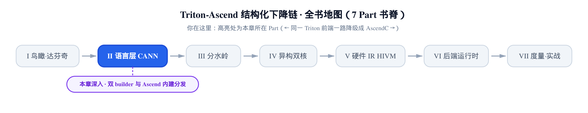
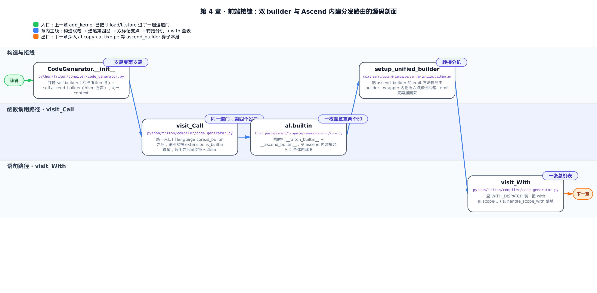
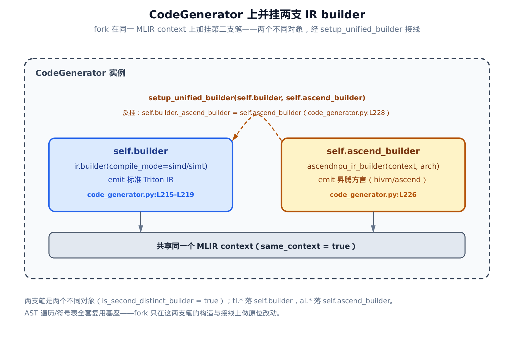
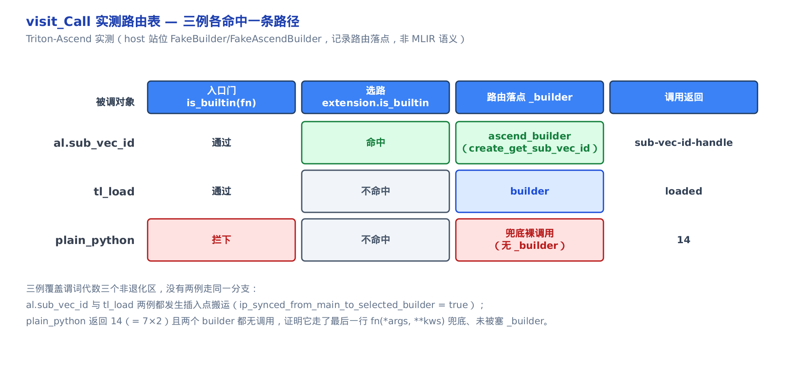

# 前端接缝——双 builder 与 Ascend 内建的分发路由



> **上一章**带你把一段 vector-add 从 GPU 改写到 NPU，核体一行没动就跑起来了。
> **本章**拆开那句「前端 0 改动」背后的机关：同一个前端，怎么同时 emit 两套 IR。
> **下一章**顺着这道分发往里走，讲显式内存层级与 buffer 语言里的搬运原语。

**姊妹篇约定**。这本书全程对照基座《Triton 源码解读》（读上游 Triton v3.2.0）。本章对位基座里讲 [`tl.*` 表面与 `constexpr` 分水岭那一章](../../../../triton/artifacts/ch04-tl-surface-and-constexpr/narrative/chapter.md)——那里把 `visit_Call` 讲成一棵**三岔**决策树（常量折叠 / `@triton.jit` 组合子 / 统一 builtin）。本章讲 fork 在同一棵树的同一道 builtin 入口门之后，加的**第四岔**。

上一章那份 `add_kernel` 里，`tl.load`、`x + y`、`tl.store` 全是基座原语。可昇腾方言（hivm，达芬奇硬件 IR）的算子——比如把数据从 GM 搬到 UB 的 `al.copy`——总得有人把它 emit 进 IR。谁来 emit？更棘手的是：在**同一段 kernel** 里，`tl.load` 和 `al.copy` 挨着写，凭什么前者落进标准 Triton IR、后者落进昇腾方言，还互不打架？

答案是 fork 在前端翻译器 `CodeGenerator`（`python/triton/compiler/code_generator.py`，把 Python AST 翻成 IR 的那个类）上做的三处外科改动。核心只有一句话：**给它塞第二支笔**。



只想抓住 `visit_Call` 怎么多出「第四岔」，直接跳「同一道门，第四个岔口」；想看两支笔怎么并挂、方法怎么接线，从「一支笔变两支笔」和「转接分机」两节读起；不挑读法，按顺序走下来，五节会在最后「小结」自然拧回同一个支点。

---

## 一支笔变两支笔：`CodeGenerator` 上并挂双 builder

**直觉**。把 `CodeGenerator` 想成开会时的一个速记员。基座给他一支笔，专记标准 Triton IR。fork 没有另请一位速记员——它给原来那位又塞了第二支笔：左手 `self.builder` 记标准 IR，右手 `self.ascend_builder` 记昇腾方言。两支笔写在**同一张纸**（同一个 MLIR context）上，所以左笔写下的 value，右笔随手就能引用。

**机制**。基座在 `__init__` 里构造 builder 只有一行——`self.builder = ir.builder(context)`。fork 在同一位置把它扩成一对：

`python/triton/compiler/code_generator.py:L215-L231`

```python
# python/triton/compiler/code_generator.py:L215-L231
        if hasattr(options, "force_simt_only") and options.force_simt_only:
            self.builder = ir.builder(context, compile_mode="simt")
        else:
            self.builder = ir.builder(context, compile_mode="simd")
        self.file_name = file_name
        # node.lineno starts from 1, so we need to subtract 1
        self.begin_line = begin_line - 1
        self.builder.set_loc(file_name, begin_line, 0)
        self.builder.options = options

        # Set up unified builder interface with methods from specialized builders
        self.ascend_builder = ascend_ir.ascendnpu_ir_builder(context, getattr(options, "arch", ""))
        self.ascend_builder.set_loc(file_name, begin_line, 0)
        setup_unified_builder(self.builder, self.ascend_builder)
        # … 省略：buffer_builder 支线与 gscope/module_map 等基座通用初始化，与双 builder 主线无关 …
```

一段一段读：

- 前四行是**基座就有的主 builder**。`ir.builder` 按 `force_simt_only`（一个布尔选项，为真则强制走 SIMT 模板路）选 `compile_mode`——simd 或 simt（这两者是两套不同的底层代码生成模板，二选一，和本章的双 builder 分工是两回事，这里只是构造 `self.builder` 时顺带做的一次模式选择）。这支笔 emit 的是所有 Triton 后端共享的标准 Triton IR。紧接着的 `set_loc` 给这支笔设 `loc`（source location，即这行 IR 该归属到源码哪一行的调试信息）——它和插入点一样是 builder 的「当前状态」，切笔、转接时必须一并保存和恢复，否则报错定位会串行。
- `self.ascend_builder = ascend_ir.ascendnpu_ir_builder(context, ...)` 是**第二支笔**，也是本章主角。`ascendnpu_ir_builder` 是昇腾方言的 IR builder（C++ 绑定，emit hivm/ascend 方言的 op）。注意它吃的 `context` 和主 builder 是**同一个**——两支笔同纸。构造参数 `arch`（目标芯片型号，如 `ascend910b`）从编译选项取，让方言 op 带上硬件档位。
- `setup_unified_builder(self.builder, self.ascend_builder)` 把两支笔**接线**——具体怎么接，本章后面单开一节讲。

**不变量：两个不同对象、同一个 context**。这一点是整套分发的物理基础。同一 context 才能让两支笔产出的 op 落进同一 module、同一函数体、互相引用 value；而它们是**两个不同的 builder 对象**，各自维护「下一笔写在哪」（插入点），所以后面切笔时必须显式交接（也留到后面讲）。至于 fork 只在这几行做原位改动、整套 AST 遍历和符号表全盘复用基座——这正是「同一前端、两套 emit」的省力之处。



有了两支笔，真正的问题来了：遍历 AST 遇到一个函数调用，`CodeGenerator` 凭什么知道该用左笔还是右笔？这就是下一节的第四岔。

---

## 同一道门，第四个岔口：`visit_Call` 的分发

这是本章的心脏。`visit_Call` 是 `CodeGenerator` 处理「函数调用」这类 AST 节点的方法，也是选笔发生的地方。

**直觉**。想象机场安检。所有旅客——`tl.*` 和 `al.*` 的一切内建——先过**同一道安检门**：`language.core.is_builtin`，读的是登机牌上的 `__triton_builtin__` 印章（一个布尔标记，「我是 Triton 内建」）。过了门再看护照上有没有 `__ascend_builtin__` 签证章：有签证的（`al.*`）被引到**昇腾专用登机口** `ascend_builder`，没有的（`tl.*`）走普通登机口 `builder`。而既没登机牌又没签证的普通旅客（裸 Python 调用）连门都进不去，原路遣返。

**机制**。我们把三个代表对象喂进真实的 `visit_Call`，看它们各落到哪：`al.sub_vec_id`（用昇腾装饰器标注的内建，双标记）、`tl_load`（基座内建，单标记）、`plain_python`（一个没打任何标记的普通函数）。这三例恰好覆盖三种非退化情形，没有两例走同一分支：

<!-- trace: m2-builtin-dispatch-fourth-branch -->

| 被调对象 | `__triton_builtin__` | `__ascend_builtin__` | 入口门 `language.core.is_builtin` | 选路 `extension.is_builtin` | 路由落点 `_builder` | 调用返回 |
|---|---|---|---|---|---|---|
| `al.sub_vec_id` | 有 | 有 | 通过 | 命中 | `ascend_builder` | `sub-vec-id-handle` |
| `tl_load` | 有 | 无 | 通过 | 不命中 | `builder` | `loaded` |
| `plain_python` | 无 | 无 | 拦下 | 不命中 | 兜底裸调用（无 `_builder`） | `14` |

逐行读这张表，就是三条路径各走一遍：

- `al.sub_vec_id` 两个标记都有：过入口门、选路命中，落 `ascend_builder`，右笔 emit 出它的算子句柄。
- `tl_load` 只有 `__triton_builtin__`：过入口门、但选路不命中，落标准 `builder`，左笔照旧。
- `plain_python` 两个标记都没有：入口门直接拦下，它既不进左笔也不进右笔，而是走到最末一行被当普通 Python 函数**裸调用**——返回 `14`（就是 `7×2`），两支笔都没收到任何调用，证明它确实没被塞 `_builder`。

**这张表怎么来的，得挑明一句**。本章在开发机（host）上取证，而这台机器没有昇腾 NPU / CANN 工具链，真实的 C++ builder（`ir.builder` / `ascendnpu_ir_builder`）根本实例化不出来。所以上表里的「路由落点」是用**记录型替身**站在真实 builder 位置上抓的——替身只忠实记录「这次调用被路由到哪个 builder 对象、切笔时插入点有没有搬过去」，**不模拟 MLIR 语义**。也就是说，这张表验证的是**分发事实**（落点 + 插入点搬运），不是某个 op 在方言里到底 lower 成什么——后者要真机、归后续章。分发这一层，替身足以铁证。

**为什么保证不漏**。把它写成一条不变量。设 $`B`$ 为带 `__triton_builtin__` 的函数集合（全体内建），$`A`$ 为带 `__ascend_builtin__` 的函数集合（昇腾内建）。核心命题只有一句——昇腾内建集合是全体内建集合的子集：

```math
A \subseteq B
```

- **基例**。昇腾装饰器 `al.builtin` 对每个昇腾内建**一次同时打两个标记**（下一节看它的源码）。凡打了昇腾标记的必然也打了内建标记，这正是 $`A`$ 落在 $`B`$ 里的来由。
- **顺序**。`visit_Call` 先用入口门 `language.core.is_builtin` 测「是不是内建」（是否属于 $`B`$），通过才进 builtin 分支；进门后才用 `extension.is_builtin` 测「是不是昇腾内建」（是否属于 $`A`$）选笔。
- **穷尽**。三类函数各落一条路径，互斥且穷尽：

```math
fn \in A \;\Rightarrow\; \mathtt{ascend\_builder}, \qquad fn \in B \setminus A \;\Rightarrow\; \mathtt{builder}, \qquad fn \notin B \;\Rightarrow\; \mathtt{bare}
```

  昇腾内建先过门、再被选路命中，走右笔 `ascend_builder`；仅基座内建过门但选路失败，走标准左笔 `builder`；非内建入口门即拦下，落末行裸调用（`bare`）。**没有一个 `al.*` 内建能漏出 builtin 分支掉进裸调用**。

上表三例正是这三条路径各一，实测落点与推断逐一吻合。

**反事实**。要是 `al.builtin` 只打 `__ascend_builtin__`、漏打 `__triton_builtin__`，就会有个昇腾内建 $`\in A`$ 却 $`\notin B`$——入口门把它当普通 Python 调用兜底，`al.builtin` 的 wrapper 拿不到 `_builder`，当场抛出 `ValueError`，报「Did you forget to add @triton.jit ?（`_builder` argument must be provided outside of JIT functions.）」。双标记里「同时」二字，防的正是这个漏。

**源码**。看 `visit_Call` 本体，四岔顺序一目了然：

`python/triton/compiler/code_generator.py:L1168-L1206`

```python
# python/triton/compiler/code_generator.py:L1168-L1206
    def visit_Call(self, node):
        fn = _unwrap_if_constexpr(self.visit(node.func))
        static_implementation = self.statically_implemented_functions.get(fn)
        if static_implementation is not None:
            return static_implementation(self, node)

        kws = dict(self.visit(keyword) for keyword in node.keywords)
        args = [self.visit(arg) for arg in node.args]
        if isinstance(fn, JITFunction):
            _check_fn_args(node, fn, args)
            return self.call_JitFunction(fn, args, kws)
        if (hasattr(fn, '__self__') and _is_triton_value(fn.__self__)) or language.core.is_builtin(fn):
            # Copy builder's location and insertion point.
            ip, last_loc = self._get_insertion_point_and_loc()
            # Use ascend_builder if this function is a builtin extension operation.
            _builder = self.ascend_builder if extension.is_builtin(fn) else self.builder
            self._set_insertion_point_and_loc(ip, last_loc, _builder)
            extra_kwargs = {"_builder": _builder}
            sig = inspect.signature(fn)
            if '_generator' in sig.parameters:
                extra_kwargs['_generator'] = self
            try:
                ret = fn(*args, **extra_kwargs, **kws)
                # Sync the builder's location before return.
                ip, last_loc = self._get_insertion_point_and_loc(_builder)
                self._set_insertion_point_and_loc(ip, last_loc)
                return ret
            except Exception as e:
                # … 省略：把底层异常包成 CompilationError 并保留原始 traceback 的细节 …
                raise CompilationError(self.jit_fn.src, node, repr(e)) from e

        if fn in self.builtin_namespace.values():
            args = map(_unwrap_if_constexpr, args)
        return fn(*args, **kws)
```

对着看这四岔：

- **第①岔 常量折叠**：`statically_implemented_functions.get(fn)`。编译期就能算出的（如 `tl.constexpr` 数学），直接返回，跟本章正交。
- **第②岔 JIT 组合子**：`isinstance(fn, JITFunction)`。`@triton.jit` 装饰的函数（`JITFunction`）走这里递归展开——也是基座逻辑，本章不碰。
- **第③岔 入口门**：`... or language.core.is_builtin(fn)`。这道门对 `tl.*` 与 `al.*` **一切内建都为真**，是安检的第一关。
- **第④岔 选笔（fork 加的关键一行）**：`_builder = self.ascend_builder if extension.is_builtin(fn) else self.builder`。基座这里只有单一 `self.builder`；fork 把第③岔内部按 `extension.is_builtin` 一分为二——这一行就是 fork 在语言层的**接缝**。选定 `_builder` 后，通过 `_builder=_builder` 关键字把它喂给内建函数，op 就 emit 在这支笔上。紧接的 `sig = inspect.signature(fn)` 那两行还多做一手：若该内建的签名里声明了 `_generator` 形参，就额外把 `self`（`CodeGenerator` 实例自身）也喂给它——这让少数内建能回调生成器做更复杂的展开，多数内建用不到。
- **兜底**：最末 `return fn(*args, **kws)`。入口门没放行的普通调用落到这里，裸跑，`plain_python` 返回 `14` 走的就是这条。

值得强调：第④岔不是新增的**顶层**分支，而是**同一道入口门下多了一个 builder 选择**。而且这个选择是**数据驱动**的——读标记，不是在 `visit_Call` 里 `if fn is al_copy` 逐个枚举函数名。分发成本恒为两次 `getattr`（读两个标记），$`O(1)`$，与内建总数无关；新增一个昇腾内建只要打上装饰器，`visit_Call` **一行不改**。




那两个标记从哪来、为什么 `al.*` 有而 `tl.*` 只有一半——下一节看盖章的那枚图章。

---

## 一枚图章盖两个印：双内建标记

**直觉**。`@al.builtin` 是一枚图章，一次盖下两个印：`__triton_builtin__`（「我是内建」）和 `__ascend_builtin__`（「我还是昇腾专属」）。两个下游读者各读各的印——入口门只认第一个印放行，选路谓词只认第二个印决定去不去昇腾登机口。基座的 `@tl.builtin` 那枚图章只盖一个印，所以 `tl.*` 过得了门、上不了昇腾专列。

**机制**。上一节表里三例的标记分布，投影到集合上正好是 $`A \subseteq B`$ 的三个非退化点：`al.sub_vec_id` 落在 $`A`$（也在 $`B`$）里，`tl_load` 落在 $`B \setminus A`$，`plain_python` 落在 $`B`$ 之外。两个标记被**两个不同谓词各读一个**——这就是整条路由的支点。

**源码**。看昇腾侧的装饰器定义：

`third_party/ascend/language/cann/extension/core.py:L66-L90`

```python
# third_party/ascend/language/cann/extension/core.py:L66-L90
TRITON_BUILTIN = "__triton_builtin__"
ASCEND_BUILTIN = "__ascend_builtin__"


def builtin(fn: T) -> T:
    """Mark a function as a buffer language builtin."""
    assert callable(fn)

    @wraps(fn)
    def wrapper(*args, **kwargs):
        if "_builder" not in kwargs or kwargs["_builder"] is None:
            raise ValueError("Did you forget to add @triton.jit ? "
                             "(`_builder` argument must be provided outside of JIT functions.)")
        return fn(*args, **kwargs)

    # also set triton_builtin to true so that CodeGenerator will recognize this function
    setattr(wrapper, TRITON_BUILTIN, True)
    setattr(wrapper, ASCEND_BUILTIN, True)

    return wrapper


def is_builtin(fn) -> bool:
    """Is this a registered ascend language builtin function?"""
    return getattr(fn, ASCEND_BUILTIN, False)
```

关键就在两行 `setattr`：`builtin`（即 `al.builtin`）给包装函数**同时**打上 `TRITON_BUILTIN` 和 `ASCEND_BUILTIN` 两个属性。对照基座 `python/triton/language/core.py` 里的 `@builtin`——它只 `setattr(wrapper, TRITON_BUILTIN, True)` 一个。fork 这份多打的 `__ascend_builtin__`，就是 `al.*` 内建能被选路认出来、路由到右笔的根源。

再看两个谓词读的是**两个不同**标记：

- 入口门 `language.core.is_builtin`（`python/triton/compiler/code_generator.py:L1179` 那道门）读 `__triton_builtin__`，判「是不是内建」，对应集合 $`B`$。
- 选路 `extension.is_builtin`（就是上面这段 `is_builtin`，读 `__ascend_builtin__`）判「要不要走 `ascend_builder`」，对应集合 $`A`$。

顺带看清那个 `wrapper`：它先检查 `_builder` 在不在——**这正是反事实里那句 `ValueError` 的出处**。只有当 `visit_Call` 把 `_builder` 喂进来时才放行；漏喂（比如某内建漏打 `__triton_builtin__` 被入口门当普通调用），wrapper 立刻报「Did you forget @triton.jit ?」。双标记的「同时」二字，就是防这个漏的。


到这里，「怎么选笔」讲透了。剩下三处是让这套分发真正跑顺的支撑件：右笔的方法怎么被主 builder 调到、两支笔的插入点怎么交接、以及 `with al.scope(...)` 这种语句级扩展怎么落地。

---

## 转接分机：右笔的方法怎么挂到主 builder 上

**直觉**。给主 builder 装一排「转接分机」。`setup_unified_builder` 把 `ascend_builder` 的一串 emit 方法各包一层 wrapper，`setattr` 到主 builder 上，再把 `ascend_builder` 反挂成 `main._ascend_builder`。这样后面处理 `with` 的代码只管写 `generator.builder.create_scope_op(...)`（这里的 `generator` 就是 `CodeGenerator` 实例本身，也就是前面签名检测里塞给内建的那个 `_generator`，`generator.builder` 即主 builder），wrapper 在背后把这通电话**转接**到右笔，顺手把插入点搬过去再搬回来——调用方压根感觉不到「其实写在另一支笔上」。

**源码**。看接线函数与它包的 wrapper：

`third_party/ascend/language/cann/extension/builder.py:L32-L86`

```python
# third_party/ascend/language/cann/extension/builder.py:L32-L86
def create_builder_method_wrapper(main_builder, delegate_builder, method_name):
    """
    Create a wrapper that delegates a method call to another builder while
    synchronizing insertion points and locations.
    """
    delegate_method = getattr(delegate_builder, method_name)

    def wrapper(*args, **kwargs):
        saved_ip = main_builder.get_insertion_point()
        saved_loc = main_builder.get_loc()
        delegate_builder.restore_insertion_point(saved_ip)
        if saved_loc:
            delegate_builder.set_loc(saved_loc)
        result = delegate_method(*args, **kwargs)
        main_builder.restore_insertion_point(saved_ip)
        if saved_loc:
            main_builder.set_loc(saved_loc)
        return result
    # … 省略：给 wrapper 补 __name__/__doc__ 的两行 …
    return wrapper


def attach_builder_methods(main_builder, delegate_builder, method_names):
    """Attach multiple methods from a delegate builder to the main builder."""
    for method_name in method_names:
        wrapper = create_builder_method_wrapper(main_builder, delegate_builder, method_name)
        setattr(main_builder, method_name, wrapper)


def setup_unified_builder(main_builder, ascend_builder):
    """Set up a unified builder interface by attaching methods from specialized builders."""
    main_builder._ascend_builder = ascend_builder
    ascend_methods = [
        'create_scope_op',
        'scope_return',
        'get_t_core_type_attr_name',
        'create_copy_buffer',
        # … 省略：create_fixpipe / sync_block_* / create_convert_layout 等共 17+ 项，同理逐个挂 …
    ]
    attach_builder_methods(main_builder, ascend_builder, ascend_methods)
```

从下往上读：`setup_unified_builder` 先把 `ascend_builder` 反挂为 `main_builder._ascend_builder`（留个直达引用），再列一份 `ascend_methods` 清单（`create_scope_op` 造 scope 算子、`create_copy_buffer` 造搬运算子等 hivm 方言原语，真实 17+ 项，机制上逐个同理），交给 `attach_builder_methods`。后者逐个方法调 `create_builder_method_wrapper` 包成 wrapper，再 `setattr` 到主 builder。

wrapper 才是精华：调真方法前，它把**主 builder 当前的插入点和 loc 存下来、恢复进右笔**；`delegate_method` 在右笔上 emit 完，再**把插入点搬回主 builder**。这就把「切到另一支笔」这件事对调用方彻底隐藏了——也顺势引出下一件事：插入点为什么必须这么来回搬。这些 `create_*` 算子在方言里各自是什么语义，是后续章的深水区，本章只讲它们**怎么被挂上来、被调到**。

---

## 接力交棒：两支笔的插入点同步

**直觉**。接力赛交接棒。两支笔各有自己的「下一笔写在哪」（插入点）。`tl.load` 刚在主 builder 上写完，紧接着 `al.copy` 要在 `ascend_builder` 上写——要是右笔用的是它自己陈旧的插入点，新 op 就插错位置，破坏了顺序和支配关系。所以每次切笔前，把主 builder 的当前插入点拷进所选笔，emit 完再拷回来，两条 emit 流在同一函数体里线性接续，棒不落地。

**机制**。这件事在本章其实**出现了两次**，同源同理：

一次在 `visit_Call` 里（`python/triton/compiler/code_generator.py:L1180-L1193`，前面那段源码已内嵌）。切笔前 `ip, last_loc = self._get_insertion_point_and_loc()` 读主 builder 当前位置，`self._set_insertion_point_and_loc(ip, last_loc, _builder)` 把它塞进选定的 `_builder`；内建调用返回后，`ip, last_loc = self._get_insertion_point_and_loc(_builder)` 读回、`self._set_insertion_point_and_loc(ip, last_loc)` 同步回主 builder。就是第③④岔那段代码里，包在 `try` 前后的四行。

另一次就在上一节 `create_builder_method_wrapper` 的 wrapper 里——`get_insertion_point` / `restore_insertion_point` 那对，走的是完全一样的「存—恢复—干活—搬回」节奏。

回到上一节实测那张路由表，脚注早埋了这条证据：`al.sub_vec_id` 与 `tl_load` 两例，替身都记到了 `ip_synced_from_main_to_selected_builder = true`——切笔前主 builder 的插入点确实被搬进了所选笔。唯独 `plain_python` 是 `false`，因为它压根没进 builtin 分支、没选笔、也就无所谓搬运。**为什么必须搬**，这张表已经替我们答了：不搬，两条 emit 流就各插各的、乱套；搬了，`tl.*` 和 `al.*` 才能在同一段 kernel 里线性接续。

---

## 一张总机表：`with al.scope(...)` 与 `mangle_ty` override

最后一处接缝是**语句级**的。`al.copy` 那种是函数调用，走 `visit_Call`；而 `with al.scope(core_mode='vector'):` 这种 `with` 语句，得有另一个处理入口。

**直觉**。一本总机分机表。`WITH_DISPATCH` 是一张全局字典，既登记 `with` 语句的处理器（`scope` 类 → `handle_scope_with`），又登记函数级的 override 钩子（字符串键 `'mangle_ty'` → 昇腾版类型名编码）。模块一加载就把昇腾条目 `update` 进来——两类扩展点收敛到同一张表，往里加行就是扩展。

**源码**。先看这张表在模块加载时怎么被合入：

`python/triton/compiler/code_generator.py:L25-L31`

```python
# python/triton/compiler/code_generator.py:L25-L31
# Central registry for all 'with' statement handlers
WITH_DISPATCH = {}

# Import and register Ascend extension dispatch handlers
from triton.language.extra.cann.extension.dispatch import ASCEND_WITH_DISPATCH
from triton.language.extra.cann.extension.builder import setup_unified_builder
WITH_DISPATCH.update(ASCEND_WITH_DISPATCH)
```

`code_generator` 一被导入，就从昇腾扩展里把 `ASCEND_WITH_DISPATCH` 拉进来 `update` 进全局的 `WITH_DISPATCH`——fork 的接缝从 `import` 就开始了。这里导入路径写 `triton.language.extra.cann.extension`，是安装期把 `third_party/ascend/language/cann` 链进 `triton` 包后的运行时路径；源码物理位置就在 `third_party/ascend/language/cann/extension/`。

那张昇腾侧的表长这样：

`third_party/ascend/language/cann/extension/dispatch.py:L25-L34`

```python
# third_party/ascend/language/cann/extension/dispatch.py:L25-L34
from .scope import scope
from .code_generator import handle_scope_with, mangle_ty

__all__ = ["ASCEND_WITH_DISPATCH"]

# Registry of 'with' statement handlers for Ascend extension
ASCEND_WITH_DISPATCH = {
    scope: handle_scope_with,
    "mangle_ty": mangle_ty,
}
```

两个键，两种用法：`scope` 类（`with al.scope(...)` 的上下文管理器类）映到 `handle_scope_with`，供 `with` 分发查；字符串 `'mangle_ty'` 映到昇腾版 `mangle_ty`（类型名 mangling，把类型编码进符号名），供 `code_generator` 用 `WITH_DISPATCH.get("mangle_ty", ...)` **覆盖基座实现**，好让昇腾特有类型也能编码进符号名。同一张表，既承载 `with` 分发，又承载函数级 override 钩子。

再看查表的入口。基座根本没有 `visit_With`——`with` 语句不是标准 Triton IR 关心的东西；fork 新增了它：

`python/triton/compiler/code_generator.py:L801-L814`

```python
# python/triton/compiler/code_generator.py:L801-L814
    def visit_With(self, node):
        """Handle 'with' statements using dispatch pattern."""
        assert len(node.items) == 1
        context = node.items[0].context_expr

        # Check if context is a Call and dispatch to registered handler
        if isinstance(context, ast.Call):
            withitemClass = self.visit(context.func)
            handler = WITH_DISPATCH.get(withitemClass)
            if handler:
                return handler(self, node)

        # Fall back to visiting body for unhandled cases
        return self.visit_compound_statement(node.body)
```

逻辑很直：`with` 后面是不是个调用？是就取出被调用的类（`with al.scope(...)` 里就是 `scope` 类），拿它去 `WITH_DISPATCH.get` 查处理器。查到了（`handle_scope_with`）就交它，把 `with` 体 emit 成昇腾的 scope 算子——经的正是上一节挂到主 builder 上的那个 `create_scope_op`；查不到就退回按普通语句块处理。至于 `handle_scope_with` 内部怎么把 region（IR 里一段带自己控制流的代码块）、SSA 值（这里指编译期生成、只被赋值一次的中间结果）线程化进 scope 算子，是后面 scope 专章的活，本章只讲它**经这张表被查到、落了地**。

---

## 小结：三处原位改动，一个支点

回头看，fork 让「同一前端、两套 emit」成立，靠的就是 `python/triton/compiler/code_generator.py` 上三处外科改动，外加一个支点：

- **构造**：`__init__` 里在基座唯一的 `self.builder` 之外，于同一 context 加挂 `self.ascend_builder`，并 `setup_unified_builder` 接线（第一节）。
- **选笔**：`visit_Call` 在统一 builtin 入口门之后，加一行 `_builder = self.ascend_builder if extension.is_builtin(fn) else self.builder`——就是那第四岔（第二节）。
- **语句分发**：`visit_With` 经 `WITH_DISPATCH` 查表，把 `with al.scope(...)` 交 `handle_scope_with`，同一张表还顺带 override 了 `mangle_ty`（最后一节）。

而支点是**双标记**：`al.builtin` 一次盖两个印，让昇腾内建集合恰是全体内建集合的子集（$`A \subseteq B`$），选路才能既零漏又与函数名解耦——加新昇腾内建，分发逻辑一行不改。

这道分发是本 Part 的总闸门。后面讲 UB/GM 显式搬运的 `al.copy`/`al.fixpipe`、讲昇腾内建算子、讲 `scope` 与核间同步——它们的 op 全都是经这第四岔路由到 `ascend_builder`、经这些挂上来的 `create_*` 方法 emit 进 IR 的。下一章就从最要紧的一类右笔算子开刀：把数据在显式内存层级之间搬来搬去的 buffer 语言。
