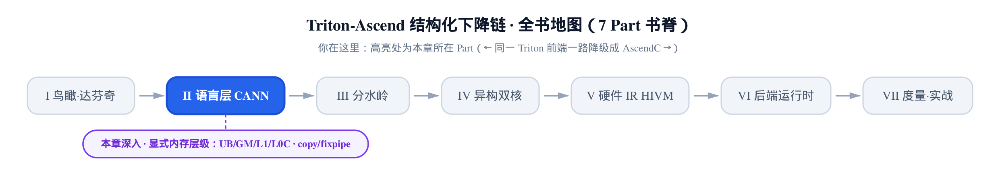
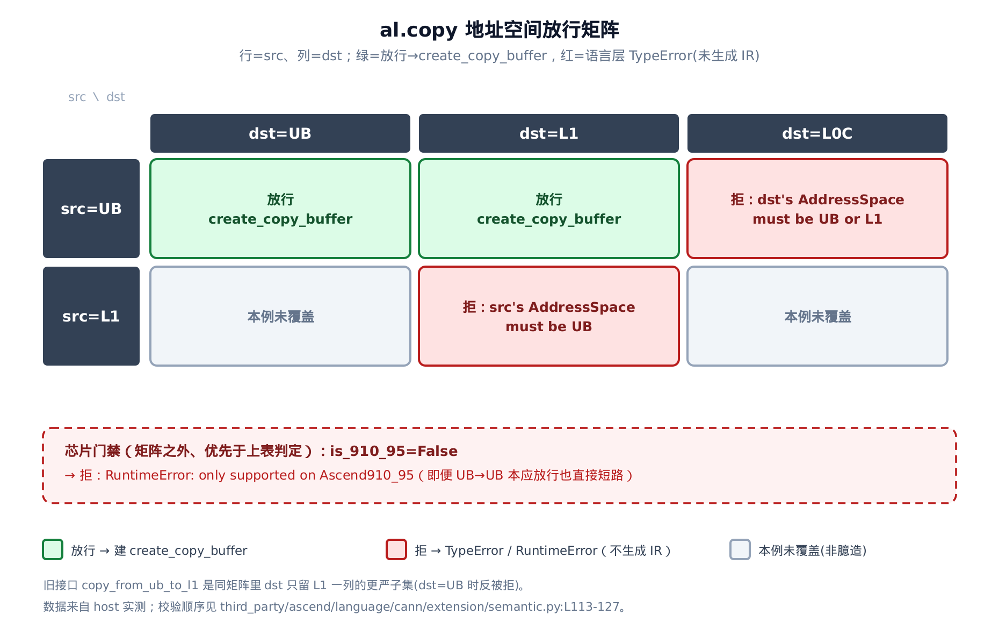
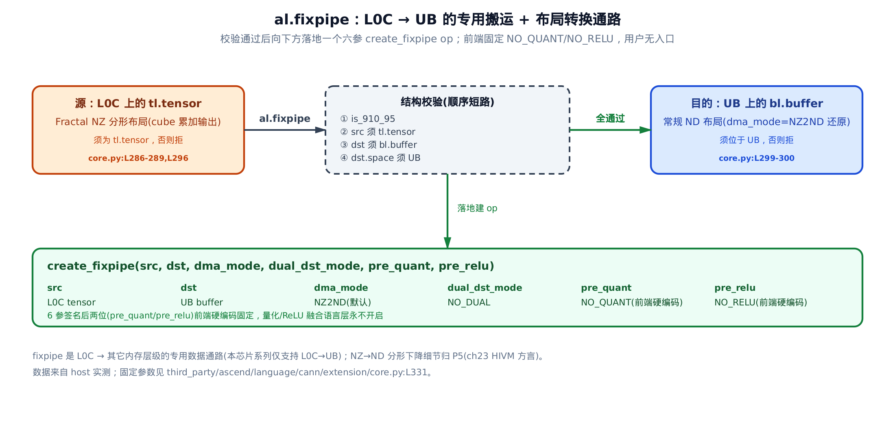

# 显式内存层级——UB/GM/L1/L0C、buffer 语言与 copy/fixpipe



> **上一章**拆开了「同一前端、两套 emit」的机关：`al.copy` 这类昇腾算子怎么被路由进昇腾方言。
> **本章**顺着那道路由往里走，讲被路由的算子到底在做什么——把片上内存层级搬上台面。
> **下一章**接着讲昇腾内建算子里的索引搬运（gather/scatter 那一族）。

**姊妹篇约定**。这本书全程对照基座《Triton 源码解读》（读上游 Triton v3.2.0）。本章对位基座里[讲造块、形状变换、访存与原子那一章](../../../../triton/artifacts/ch07-blocks-shape-and-memory-access/narrative/chapter.md)——那里的 `tl.load`／`tl.store` 面对 NVIDIA GPU 时，shared memory 由编译器托管，程序员从不写「这块数据现在在几楼」。本章讲昇腾在**同一层**多出来的一整套 NPU 显式内存语义：地址空间对程序员可见，每一次片上搬运都得亲手写清源和目的的物理层级。

先把画面摆出来。在[第 2 章的达芬奇硬件 primer](../../ch02-davinci-npu-hardware-model/narrative/chapter.md) 里，我们把 AI Core（达芬奇的计算核，cube 核专啃矩阵乘、vector 核专啃逐元素运算）的片上内存画成一栋楼：`GM`（Global Memory，片外全局内存，大而慢）是楼外仓库；`UB`（Unified Buffer，服务 vector 核的片上统一缓冲）、`L1`（片上，cube 侧输入缓冲）是各楼层的工作台，快但小；`L0C`（cube 累加输出缓冲）是流水线尽头堆半成品的收料台。那一章反复强调一句话：**数据 GM→UB→算→搬回，每一步都得程序员显式写**。

那是硬件事实。这一章讲它在**语言层**怎么落地成能敲进 kernel 的 API：地址空间怎么变成 buffer 类型上的一个字段（`ascend_address_space`）、怎么在指定楼层订一块内存（`bl.alloc`）、怎么把内存从一层显式搬到另一层（`al.copy`）、以及 cube 算完的结果怎么从 `L0C` 落回 `UB`（`al.fixpipe`）。这套 API 分住两处：buffer 语言的通用框架在 `python/triton/extension/buffer/language/core.py`，昇腾具体的地址空间与 copy/fixpipe 在 `third_party/ascend/language/cann/extension/core.py`。


想先抓住「昇腾比基座多暴露了什么」，读头两节；想看每一条搬运边的逐条校验怎么写、错在哪当场报什么，`al.copy` 和 `al.fixpipe` 两节是核心；不挑读法，按顺序走下来，最后「小结」会把「显式的负担」拧成「调优的旋钮」。

> **一句话先约定取证口径。** 本章正文里的数值表取自在开发机（host）上跑本章精简版所得——真实的昇腾 IR builder 是需要 NPU/CANN 工具链的 C++ 绑定，host 上没有，故由一个只记录调用、返回哨兵值的测试替身站位。所以像 `create_copy_buffer(handle#2, handle#5)` 这样的行，读作「前端**校验全过、走到了建 op 这一步**、拿这两个操作数去建」，而不是「真机上 emit 出的 IR」。本章验证的正是「地址空间校验／copy 方向门禁／fixpipe 对齐算术／以及最后一节才展开的 buffer↔tensor 桥」这些 **Python 语言层可观察行为**；hivm op 的 IR 语义与 `NZ2ND` 分形下降需要真机，留到 P5 的 HIVM 方言部分。

---

## 内存层级搬上台面：`ascend_address_space`

**直觉**。基座 Triton 面对 GPU 时，把片上那几层内存全藏起来——你写 `tl.load`，编译器替你决定数据落 shared memory 还是寄存器，楼层是隐形的。昇腾反着来：它把每一层的**门牌号**直接印在数据的类型上。一块 buffer 的类型里明写着「我在 UB」或「我在 L1」，搬东西时前端一读这个门牌号，就知道你要从几楼搬到几楼。地址空间从「编译器的私事」变成「程序员必须写清的一等公民」——这是本章所有故事的地基。

**机制**。门牌号这套东西不是 Python 里硬编码的一张表，而是从 C++ 后端**反射**出来的——而这条反射链上有一道容易看漏的收窄，值得先摆清楚。

最底下那份定义在 HIVM（昇腾后端的 MLIR 方言，P5 会专门讲）的属性定义文件里，`third_party/ascend/AscendNPU-IR/bishengir/include/bishengir/Dialect/HIVM/IR/HIVMAttrs.td:L188-L194` 一共列了 **7 个**地址空间：`Zero`(0)、`GM`(1)、`L1`(2)、`L0A`(3)、`L0B`(4)、`L0C`(5)、`UB`(6)。但把这个 C++ 枚举暴露给 Python 的是 pybind 绑定（把 C++ 符号导出成 Python 对象的胶水层），而 `third_party/ascend/ascend_ir.cc:L412-L418` 里那段 `py::enum_<hivm::AddressSpace>` 只 `.value()` 了其中 **5 个**：`L1`、`UB`、`L0A`、`L0B`、`L0C`——**`Zero` 和 `GM` 没有被导出**。Python 语言层不重抄一遍，而是遍历 `ascend_ir.AddressSpace.__dict__`、把它**拿得到**的每个成员包成一个能下沉进 IR 的对象。好处是：绑定层哪天多导出一级内存，Python 侧自动跟上，不用改一行；代价是这张表的边界不由 Python 说了算——你在 kernel 里能写出哪些门牌号，取决于 `ascend_ir.cc` 里那份 `.value()` 清单。

这 5 级都能拿来 `bl.alloc` 出一块 buffer——`alloc` 把你报的层级原样透传进类型，不做白名单。但「能 alloc」离「语言层管得住」还差得远。按**管得住的程度**排，一共四档，混着数必然数错。

**第一档，真被校验的只有 2 级：`UB` 与 `L1`**。本章两条搬运边上，`al.copy` 要求起点 `space == UB`、终点 `space ∈ {UB, L1}`，`al.fixpipe` 要求终点 `space == UB`；全仓对 `space` 做的比较就这几处，再没有别的层级出现在任何一条 `if` 里。

**第二档是 `L0C`：有契约、但校验不了。**`al.fixpipe` 的文档白纸黑字写着源必须位于 L0C，可它的源是个 `tl.tensor`（基座 Triton 的值视角张量），而 `tl.tensor` 的类型上压根没有 `space` 这个字段——门牌号只印在 `bl.buffer` 上。前端连读都无从读起，于是这条只能靠程序员遵守，写错了要到真机上才炸。这个「文档说必须、代码拦不住」的缝，是显式内存语义里最容易踩的一类坑。

**第三档是 `L0A`／`L0B`：连契约都没有。** 它们进了 Python、也能 `alloc`，但全仓没有任何一条 `if` 比较过它们——cube 矩阵乘的输入由硬件内部装载，语言层不直接搬，也就无话可说。

**第四档是 `GM` 与 `Zero`：根本没进语言层。** 以 `GM` 为例，这比「本章不覆盖」还要更彻底一层——**在语言层里它连名字都没有**。HIVM 那边明明有 `GM`（枚举值 1），可 pybind 没导出它，`ascend_address_space` 上就不存在这个属性——你在 kernel 里**根本写不出**一块 `space=GM` 的 buffer，`al.copy` 的终点集合里自然也不可能出现它。这不是疏漏，而是分工：GM↔UB 的搬运压根不靠 buffer 上的门牌号来表达，走的是[第 2 章](../../ch02-davinci-npu-hardware-model/narrative/chapter.md)建立的那套显式搬运（下一章的索引搬运算子是同一条路上的另一段）。`Zero` 同理，止步于 pybind，是纯 IR 侧的占位。**读到这里可以记一条：本章讲的显式内存语义，是「片上楼层之间」的语义；片外那一跳不在这套 API 的词汇表里。**


**源码**。反射这一套只有二十来行。第一个类把**单个**地址空间包成一个能 `to_ir` 下沉的对象，第二个类**批量**遍历枚举、把每个成员挂成单例的一个属性：

`third_party/ascend/language/cann/extension/core.py:L143-L163`

```python
# third_party/ascend/language/cann/extension/core.py:L143-L163
class ascend_address_space_base(bl.address_space):
    def __init__(self, address_space_value: ascend_ir.AddressSpace) -> None:
        super().__init__()
        self.real_address_space = address_space_value

    def to_ir(self, builder: ir.builder) -> ir.attribute:
        return builder.get_target_attribute(self.real_address_space)


class ascend_address_space_group:

    def __init__(self):
        for k, v in {
            k: v
            for k, v in ascend_ir.AddressSpace.__dict__.items()
            if isinstance(v, ascend_ir.AddressSpace)
        }.items():
            setattr(self, k, ascend_address_space_base(v))


ascend_address_space = ascend_address_space_group()
```

一段一段读：

- `ascend_address_space_base` 继承 `bl.address_space`（buffer 语言的地址空间抽象基类，`to_ir` 在基类里是抛 `NotImplementedError` 的——它只画框架、把「具体有哪些地址空间」这件 target-specific 的事留给后端填）。它只干一件事：把 C++ 侧的枚举值 `real_address_space` 存下来，需要时用 `builder.get_target_attribute` 把它转成一个 MLIR attribute（IR 里挂在类型/op 上的元数据）。这就是「门牌号如何变成 IR 里的一段标注」。
- `ascend_address_space_group.__init__` 里那个字典推导，把 `ascend_ir.AddressSpace.__dict__` 里**是 AddressSpace 实例**的成员筛出来（滤掉方法、`__doc__` 之类），逐个 `setattr` 挂到自己身上。于是 `L1`／`UB`／`L0A`／`L0B`／`L0C` 这 5 个成了这个对象的属性——**没被 pybind 导出的 `Zero`／`GM` 也就不会出现在这里**：字典推导只能筛出 `__dict__` 里已有的东西，绑定层没给的，反射变不出来。
- 最后一行 `ascend_address_space = ascend_address_space_group()` 建了个**单例**。用户在 kernel 里写的 `al.ascend_address_space.UB`，读的就是这里挂上去的那个 `ascend_address_space_base` 实例。

**不变量**。反射挂上去的每个属性都是 `ascend_address_space_base`（即 `bl.address_space` 的子类）的实例，故 `al.ascend_address_space.X` 永远持有一个可 `to_ir` 的对象——不存在「后端有某级内存、Python 侧却漏了它」的路径，因为这张表是从 C++ 枚举整体遍历生成的，而非手抄。

门牌号有了，下一个问题：它印在**哪**？印在 buffer 的类型上。`buffer_type` 携带元素类型、形状、地址空间（`space`）、步长，`to_ir` 把它们一起建成 memref 类型（MLIR 里表示「一块带形状和内存位置的内存引用」的类型）：

`python/triton/extension/buffer/language/core.py:L82-L107`

```python
# python/triton/extension/buffer/language/core.py:L82-L107
class buffer_type(tl.dtype):

    def __init__(self, element_ty: tl.dtype, shape: List, space: address_space = None, strides: List = None):
        self.element_ty = element_ty
        self.shape = shape if isinstance(shape, list) else list(shape)
        self.space = space
        self.strides = strides if strides is not None else []
        self.name = self._make_name()

    # … 省略：_make_name 只是把 shape/dtype/space 拼成一个打印名 …

    def to_ir(self, builder: ir.builder) -> ir.type:
        element_ty_ir = self.element_ty.to_ir(builder)
        addr_space_attr = self.space.to_ir(builder) if self.space else builder.get_null_attr()

        # use the method with strides if strides is not empty
        if self.strides:
            return builder.get_buffer_ty_with_strides(self.shape, element_ty_ir, self.strides, addr_space_attr)
        else:
            return builder.get_buffer_ty(self.shape, element_ty_ir, addr_space_attr)
```

关键在 `to_ir` 那两行：`self.space.to_ir(builder)`（就是上面那个 `get_target_attribute`）把地址空间转成 attribute，再连同形状、元素类型一起喂给 `get_buffer_ty` 建 memref。**「数据在哪级内存、什么形状」被显式编码进了类型系统**——这正是基座 Triton 的 block type 里没有的那一维。基座的 `tl.tensor` 只有形状和 dtype，没有 `space`；昇腾的 `bl.buffer` 多带一个门牌号，一切显式搬运校验都从读这个门牌号开始。

---

## 显式订台：`bl.alloc` 在指定楼层开缓冲

**直觉**。既然每块内存都带门牌号，那开一块新内存时就得说清「订在几楼」。`bl.alloc` 就是这道「订台」手续：你报出「要多大、放什么元素类型、订在哪个地址空间」，它就在那层物化一块内存，顺手给这块内存贴上「会被读也会被写」的标签（`effects` 注解），供下游编译 pass 分析谁依赖谁。基座 Triton 完全没有这道手续——它的临时内存是编译器背着你分配的。

**机制**。我们扫四个调用看它的行为边界：两个正常的（`fp32` 订在 UB、`fp16` 订在 L1）、一个带 `is_mem_unique` 开关的（多挂一条 `mem_unique` 注解），外加一个非法的（元素类型 `int1`，昇腾不支持）。每一行看它建出的 memref 类型、挂了什么注解、最后返回的 buffer 门牌号是不是等于你订的那层。

<!-- trace: M2 -->

| 调用 | 地址空间 | shape×dtype | builder 建的 memref_ty | 注解 | 返回 / 报错 |
|---|---|---|---|---|---|
| `bl.alloc(fp32,[64,128],UB)` | UB | 64×128 fp32 | `('buffer_ty',(64,128),fp32_ty,attr(UB))` | `effects=['write','read']` | `buffer.space=UB` |
| `bl.alloc(fp16,[16,32],L1)` | L1 | 16×32 fp16 | `('buffer_ty',(16,32),fp16_ty,attr(L1))` | `effects=['write','read']` | `buffer.space=L1` |
| `bl.alloc(fp32,[8,8],UB,is_mem_unique)` | UB | 8×8 fp32 | `('buffer_ty',(8,8),fp32_ty,attr(UB))` | `mem_unique + effects=['write','read']` | `buffer.space=UB` |
| `bl.alloc(int1,[8],UB)` | UB | int1 | —（未建 op） | — | `TypeError: Unsupported alloc int1 type` |

**不变量**。三件事值得点破。其一，**返回的门牌号恒等于你订的那层**：报 UB 就拿回 `space=UB`，报 L1 就拿回 L1——中途没有任何转换分支，`alloc` 把你传入的 `address_space` 原样存进 `buffer_type.space`，`buffer` 再原样暴露为 `.space`。这是个恒等映射，后面 `al.copy`／`al.fixpipe` 的校验之所以敢直接信任 `.space`，根就在这。其二，`effects` 注解**无条件挂**，不看输入是什么——它是给下游别名/依赖分析用的固定标注。其三，`int1` 在**建任何 op 之前**就被拒：类型判断在函数体最前，命中即 `raise`，一个 builder 调用都没发生（第四行「未建 op」即此）。

`is_mem_unique` 是那个可选开关（「这块内存独占、不与别处别名」的提示），为真时多挂一条 `mem_unique` 注解——第三行比前两行多出的那半截标注就是它。

**源码**。先看前端签名，它只是把参数原样转给 semantic 实现：

`python/triton/extension/buffer/language/core.py:L190-L208`

```python
# python/triton/extension/buffer/language/core.py:L190-L208
@builtin
def alloc(
    etype: tl.dtype,
    shape: List[tl.constexpr],
    _address_space: address_space = None,
    is_mem_unique: bool = False,
    _builder=None
) -> buffer:
    """
    Allocates a region of local memory with the specified shape and type.
    # … 省略：参数 docstring …
    """
    return semantic.alloc(etype, shape, _address_space, is_mem_unique, _builder)
```

`@builtin` 是上游那枚「走 builder 分支」的图章（[第 4 章](../../ch04-dual-builder-ascend-dispatch/narrative/chapter.md)讲过它怎么被 `visit_Call` 认出来、把 `_builder` 注进来）；`_address_space` 就是你传的 `al.ascend_address_space.UB`。真正干活的是 semantic：

`python/triton/extension/buffer/language/semantic.py:L35-L62`

```python
# python/triton/extension/buffer/language/semantic.py:L35-L62
def alloc(
    etype: tl.dtype,
    shape: List[tl.constexpr],
    address_space: bl.address_space,
    is_mem_unique,
    builder: ir.builder
) -> bl.buffer:
    shape = tl._unwrap_shape(shape)
    if etype == tl.int1:
        raise TypeError("Unsupported alloc int1 type")
    if not isinstance(shape, (tuple, list)):
        raise TypeError("shape must be list/tuple")
    etype = tl._constexpr_to_value(etype)
    address_space = tl._constexpr_to_value(address_space)
    element_ty_ir = etype.to_ir(builder)
    addr_space_attr = (
        address_space.to_ir(builder) if address_space else builder.get_null_attr()
    )
    memref_ty = builder.get_buffer_ty(shape, element_ty_ir, addr_space_attr)
    handle = builder.alloc(memref_ty)
    if is_mem_unique:
        builder.create_annotation_mark(handle, "mem_unique", builder.get_unit_attr())
    builder.create_annotation_mark(
        handle, "effects", builder.get_str_array_attr(["write", "read"])
    )

    buffer_ty = bl.buffer_type(element_ty=etype, shape=shape, space=address_space)
    return bl.buffer(handle, buffer_ty)
```

顺着读一遍，正好对上表里的四行：

- `if etype == tl.int1: raise` 在最前——这就是第四行「建 op 之前即被拒」的出处，`builder` 一次没碰。
- 中段是主干：地址空间 `to_ir` 成 attr → `get_buffer_ty(shape, ety, addr_space)` 建 memref 类型 → `builder.alloc(memref_ty)` 建 op 拿到 `handle`。表里那列 `('buffer_ty',(64,128),fp32_ty,attr(UB))` 就是 `get_buffer_ty` 收到的三元组的写照。
- `is_mem_unique` 为真时先挂 `mem_unique`，然后**无条件**挂 `effects=['write','read']`——对上表里第三行的「`mem_unique + effects`」和前两行的纯 `effects`。
- 最后 `bl.buffer_type(..., space=address_space)` 把你传入的地址空间原样封进类型，`bl.buffer(handle, buffer_ty)` 把 handle 和类型打包返回。**注意这里 `space=address_space` 是同一个对象**——门牌号从入参到返回值一路没变形，这就是前面那个恒等映射的字面证据。

`buffer` 值对象本身很薄，它继承 `tl._value`，把类型里的四个字段摊平成属性——后面所有校验读的就是这里的 `self.space`：

`python/triton/extension/buffer/language/core.py:L136-L169`

```python
# python/triton/extension/buffer/language/core.py:L136-L169
class buffer(tl._value):
    """Represents a region of memory.
    # … 省略：类 docstring …
    """

    def __init__(self, handle, buffer_ty: buffer_type):
        """Not called by user code."""
        super().__init__(handle)
        self.type = buffer_ty
        self.dtype = buffer_ty.element_ty.scalar
        self.shape = buffer_ty.shape
        self.space = buffer_ty.space
        self.strides = buffer_ty.strides

    # … 省略：__str__ 只是拼一个 "<16x32xfloat32, address_space>" 形式的打印名 …
```

一块内存，带着门牌号，物化好了。接下来是本章的重头戏：把它从一层搬到另一层，前端会逐条查什么。

---

## 严格的搬运工：`al.copy` 的地址空间逐条校验

**直觉**。`al.copy` 是一位一丝不苟的搬运工。交货前它逐条查验：你从 UB 出发吗？终点是 UB 或 L1 吗？这台机器（Ascend910_95）支持这个特性吗？两头形状和类型对得上吗？两头都是 buffer、不是 tensor 吗？任何一条不合格，当场退回并说清原因，绝不生成一条会在下游炸掉的非法搬运指令。把合法性检查前移到 Python 前端，意味着错误在 **编译期**（甚至 trace 期）就带着可读原因抛出，而不是等硬件默默搬出一半错位数据。

**机制**。我们扫七个调用，沿「地址空间方向 × 芯片开关」这两个维度铺开，看谁放行、谁在第几道门被短路（另外两道防线——`tensor/buffer` 类型校验、`shape/dtype` 一致性——放到下面「源码」小节里随 `if` 链逐行讲，不在这张表里凑行）。表里一并把已弃用的旧接口 `copy_from_ub_to_l1` 拉进来对照——它是 `copy` 的**更严子集**，终点只准 L1。

<!-- trace: M3 -->

| 调用 | src.space | dst.space | is_910_95 | 触发的校验判定 | 建 op / 报错 |
|---|---|---|---|---|---|
| `copy` | UB | UB | True | 全通过 | `create_copy_buffer(handle#2,handle#5)` |
| `copy` | UB | L1 | True | 全通过 | `create_copy_buffer(handle#2,handle#5)` |
| `copy` | UB | L0C | True | `dst∉{UB,L1}` | `TypeError: dst's AddressSpace must be UB or L1` |
| `copy` | L1 | L1 | True | `src≠UB` | `TypeError: src's AddressSpace must be UB` |
| `copy` | UB | UB | False | 芯片门禁 | `RuntimeError: only supported on Ascend910_95` |
| `copy_from_ub_to_l1` | UB | L1 | True | 全通过（旧接口，已弃用告警） | `create_copy_buffer(handle#2,handle#5)` |
| `copy_from_ub_to_l1` | UB | UB | True | 旧接口更严：`dst≠L1` | `TypeError: dst's AddressSpace must be L1` |

读表：`UB→UB` 和 `UB→L1` 放行、建 `create_copy_buffer`（`copy` 最终落地的 builder op 名，本章语言层到此为止）；`UB→L0C` 被「终点必须 ∈{UB,L1}」拦下；`L1→L1` 被「起点必须是 UB」拦下；而把芯片开关 `is_910_95`（前端向 builder 查询「当前目标是不是 Ascend910_95 芯片」的方法）关掉，连本该放行的 `UB→UB` 也直接短路——**芯片门禁排在最前，优先于一切地址空间判断**。这不是 bug，是硬件能力分野：`copy`／`fixpipe` 这套特性仅 910_95 系列支持。

`Ascend910_95` 是昇腾的一个具体芯片档位（[第 1 章 glossary](../../ch01-birdseye-ascend-backend/narrative/chapter.md) 里记过它与 A2_A3 的分野）；`is_910_95()` 返回假就意味着这颗芯片压根没这条数据通路。

最后两行是旧接口 `copy_from_ub_to_l1` 的对照：同样的输入 `UB→L1` 它也放行（只是多一句弃用告警），但 `UB→UB` 它**反而拒**——因为它的终点条件是死板的「必须等于 L1」，而不是 `copy` 放宽后的「∈{UB,L1}」。这就是接口演进的活标本：`copy` 是 `copy_from_ub_to_l1` 的超集，把终点从 L1-only 放宽到了 {UB,L1}。

**不变量**。`builder.calls`（即开头脚注里那个只记录调用的测试替身内部维护的调用记录列表）里出现 `create_copy_buffer`，**当且仅当**六道校验全过（`is_910_95` ∧ 两头皆 `bl.buffer` ∧ 同 shape ∧ 同 dtype ∧ `src=UB` ∧ `dst∈{UB,L1}`）。论证很直接：六道校验按序短路，任一失败即 `raise`，而 `create_copy_buffer` 写在全部校验**之后**——所以失败路径下 builder 里绝不会出现它，表里六个失败/未覆盖场景对应的 op 均为空即是佐证。旧接口的合法输入集则是新接口的真子集（终点从 {UB,L1} 收紧为 {L1}）。



**源码**。前端 builtin 很薄，`copy` 直接转发 semantic，旧接口在转发前多喊一句弃用告警：

`third_party/ascend/language/cann/extension/core.py:L174-L199`

```python
# third_party/ascend/language/cann/extension/core.py:L174-L199
@builtin
def copy_from_ub_to_l1(src: Union[tl.tensor, bl.buffer], dst: Union[tl.tensor, bl.buffer], _builder: None) -> None:
    # … 省略：docstring …
    from warnings import warn
    warn("copy_from_ub_to_l1 is deprecated, please use copy instead.")
    return semantic.copy_from_ub_to_l1(src, dst, _builder)


@builtin
def copy(src: Union[tl.tensor, bl.buffer], dst: Union[tl.tensor, bl.buffer], _builder: None) -> None:
    # … 省略：docstring …
    return semantic.copy(src, dst, _builder)
```

逐条校验全在 semantic 里。把两个函数并排放，一眼看出它们逐行相同，只有终点那一条不同：

`third_party/ascend/language/cann/extension/semantic.py:L94-L129`

```python
# third_party/ascend/language/cann/extension/semantic.py:L94-L129
def copy_from_ub_to_l1(src: Union[tl.tensor, bl.buffer], dst: Union[tl.tensor, bl.buffer], builder):
    if not builder.is_910_95():
        raise RuntimeError("this feature is only supported on Ascend910_95")
    if isinstance(src, tl.tensor) or isinstance(dst, tl.tensor):
        raise TypeError("tensor not support yet")
    if src.shape != dst.shape:
        raise TypeError("src and dst must have same shape")
    if src.dtype != dst.dtype:
        raise TypeError("src and dst need to have the same type")
    if isinstance(src, bl.buffer) and isinstance(dst, bl.buffer):
        if src.space != al.ascend_address_space.UB:
            raise TypeError("src's AddressSpace must be UB")
        if dst.space != al.ascend_address_space.L1:
            raise TypeError("dst's AddressSpace must be L1")
        builder.create_copy_buffer(src.handle, dst.handle)
    else:
        raise TypeError("src and dst must be tl.tensor or bl.buffer")


def copy(src: Union[tl.tensor, bl.buffer], dst: Union[tl.tensor, bl.buffer], builder):
    if not builder.is_910_95():
        raise RuntimeError("this feature is only supported on Ascend910_95")
    if isinstance(src, tl.tensor) or isinstance(dst, tl.tensor):
        raise TypeError("tensor not support yet")
    if src.shape != dst.shape:
        raise TypeError("src and dst must have same shape")
    if src.dtype != dst.dtype:
        raise TypeError("src and dst need to have the same type")
    if isinstance(src, bl.buffer) and isinstance(dst, bl.buffer):
        if src.space != al.ascend_address_space.UB:
            raise TypeError("src's AddressSpace must be UB")
        if dst.space not in (al.ascend_address_space.L1, al.ascend_address_space.UB):
            raise TypeError("dst's AddressSpace must be UB or L1")
        builder.create_copy_buffer(src.handle, dst.handle)
    else:
        raise TypeError("src and dst must be tl.tensor or bl.buffer")
```

自上而下就是表里那串门的排序：

- `if not builder.is_910_95(): raise` 是**第一道**，芯片门禁——对上表第五行「关掉开关连 UB→UB 都拒」。
- `isinstance(src/dst, tl.tensor)` 拒绝 tensor：`al.copy` 只吃 `bl.buffer`（内存视角），不吃 `tl.tensor`（值视角）；两者的区别下一小节还会碰到。
- 两条 `shape`／`dtype` 一致性检查。
- 进到 `isinstance(..., bl.buffer)` 分支后，才查地址空间方向：`src.space != UB` 拒（第四行）、终点条件两个函数在此分岔——旧接口要求 `!= L1` 即拒，新接口要求 `not in (L1, UB)` 即拒（第三、七行）。
- 全过，才 `builder.create_copy_buffer(src.handle, dst.handle)`。

一条搬运边被逐条 `assert` 在 Python 前端，而不是甩给硬件默默处理——这就是「显式内存语义」在 `copy` 上的全部含义。下一条边更硬核：它从 cube 流水线的尽头出发。

---

## cube 结果落地：`al.fixpipe` 的 L0C→UB 专用传送带

**直觉**。cube 核（矩阵单元）算完的结果堆在 `L0C` 上，而且是为高效矩阵运算重排过的 **Fractal NZ 分形布局**——vector 侧和 GM 都看不懂这个排法。`al.fixpipe` 是一条专用传送带，把这堆半成品从 L0C 搬到 UB，**顺路**（`dma_mode=NZ2ND`）把分形布局还原成常规 ND（row-major，常规行主序）：一次搬运兼做格式转换。上传送带前照例先验票：必须是 910_95，源必须是 `tl.tensor`（按约定它来自 L0C——但如上一节所说，前端读不到 tensor 的门牌号，这一条只能靠程序员自觉），目的必须是 UB 上的 buffer。

> **Fractal NZ 是什么？** cube 单元为让矩阵乘的数据流水顺滑，把二维矩阵按 16×16 一类的小块重排成分形（fractal）排布，而非常规行主序。`NZ2ND` 就是「把这个分形排法还原回常规 ND」。本章只需接受「cube 产出是 NZ、fixpipe 顺带转回 ND」这一句；分形布局的精确定义与它在 IR 里怎么下降，是 P5 HIVM 方言部分的活。

**机制**。先扫「结构校验」这一层：两个合法调用（`fp32`／`fp16`，形状 `[64,128]`）建出六参 `create_fixpipe`，四个非法调用各自在第一道结构门就被拦。注意看「首个失败校验」那列，它精确指出每个非法输入死在哪。

<!-- trace: M4 -->

| 调用 | src（应在 L0C） | dst（应在 UB） | 首个失败校验 | 结果 |
|---|---|---|---|---|
| `fixpipe(NZ2ND, fp32, [64,128])` | `tensor l0c-handle` | `buffer handle#2 @UB` | —（全通过） | `create_fixpipe(l0c-handle, handle#2, NZ2ND, NO_DUAL, NO_QUANT, NO_RELU)` |
| `fixpipe(NZ2ND, fp16, [64,128])` | `tensor l0c-handle` | `buffer handle#2 @UB` | —（全通过） | `create_fixpipe(..., NZ2ND, NO_DUAL, NO_QUANT, NO_RELU)` |
| `fixpipe(src=buffer)` | `buffer(非 tensor)` | `buffer @UB` | src 须 tensor | `TypeError: src is not of tensor type` |
| `fixpipe(dst=tensor)` | `tensor l0c-handle` | `tensor(非 buffer)` | dst 须 buffer | `TypeError: dst is not of buffer type` |
| `fixpipe(dst@L1)` | `tensor l0c-handle` | `buffer @L1` | dst 须 UB | `TypeError: dst must be located in the UB memory region` |
| `fixpipe(is_910_95=False)` | `tensor l0c-handle` | `buffer @UB` | 芯片门禁 | `RuntimeError: only supported on Ascend910_95` |

这里有个和 `copy` 对称又相反的细节：**`fixpipe` 的 src 必须是 `tl.tensor`、dst 必须是 `bl.buffer`**。为什么反过来？因为 L0C 上的 cube 产出是以「值」的身份存在的 `tl.tensor`（它是 `tl.dot` 这类算子的输出），而落地目标是一块你 `bl.alloc` 出来的 UB `bl.buffer`（内存视角）。fixpipe 正是「值 → 内存」这道跨界搬运，两头身份天然不同。第三、四行就是把身份搞反的两种死法。

**不变量**。`create_fixpipe` **恒以六参**建：`(src, dst, dma_mode, dual_dst_mode, NO_QUANT, NO_RELU)`——后两参被前端**硬编码**，故量化（quant）与 ReLU 融合在语言层**永不开启**。看表里两个成功行的落地 op，末两位雷打不动是 `NO_QUANT, NO_RELU`。这解释了一个乍看奇怪的现象：`create_fixpipe` 明明有六个参数，用户却只能碰前四个。原因是前端调 semantic 时把后两位写死了。



**源码**。四组模式先摆出来——DMA 布局变换、双目的拆分、前置量化、前置 ReLU，各是一个枚举：

`third_party/ascend/language/cann/extension/core.py:L247-L270`

```python
# third_party/ascend/language/cann/extension/core.py:L247-L270
class FixpipeDMAMode(enum.Enum):
    NZ2DN = ascend_ir.FixpipeDMAMode.NZ2DN
    NZ2ND = ascend_ir.FixpipeDMAMode.NZ2ND
    NZ2NZ = ascend_ir.FixpipeDMAMode.NZ2NZ


class FixpipeDualDstMode(enum.Enum):
    NO_DUAL = ascend_ir.FixpipeDualDstMode.NO_DUAL
    COLUMN_SPLIT = ascend_ir.FixpipeDualDstMode.COLUMN_SPLIT
    ROW_SPLIT = ascend_ir.FixpipeDualDstMode.ROW_SPLIT


class FixpipePreQuantMode(enum.Enum):
    NO_QUANT = ascend_ir.FixpipePreQuantMode.NO_QUANT
    F322BF16 = ascend_ir.FixpipePreQuantMode.F322BF16
    F322F16 = ascend_ir.FixpipePreQuantMode.F322F16
    S322I8 = ascend_ir.FixpipePreQuantMode.S322I8


class FixpipePreReluMode(enum.Enum):
    LEAKY_RELU = ascend_ir.FixpipePreReluMode.LEAKY_RELU
    NO_RELU = ascend_ir.FixpipePreReluMode.NO_RELU
    NORMAL_RELU = ascend_ir.FixpipePreReluMode.NORMAL_RELU
    P_RELU = ascend_ir.FixpipePreReluMode.P_RELU
```

`FixpipeDMAMode` 是本章会用到的：`NZ2ND`（分形转常规，默认）、`NZ2DN`（转成列主序）、`NZ2NZ`（保持分形）。`FixpipeDualDstMode` 的 `COLUMN_SPLIT`（按列切成双目的）后面对齐那节会触发一条更严的约束。后两个枚举 `FixpipePreQuantMode`／`FixpipePreReluMode` 虽然完整定义了量化和 ReLU 的档位，但——如上面不变量所说——前端根本不给用户入口，它们的存在只是为了解释 `create_fixpipe` 那六参签名的后两位是什么。

前端 builtin 是本章最长的一段校验，结构门加对齐门一气呵成：

`third_party/ascend/language/cann/extension/core.py:L273-L333`

```python
# third_party/ascend/language/cann/extension/core.py:L273-L333
@builtin
def fixpipe(
    src: tl.tensor,
    dst: bl.buffer,
    dma_mode: FixpipeDMAMode = FixpipeDMAMode.NZ2ND,
    dual_dst_mode: FixpipeDualDstMode = FixpipeDualDstMode.NO_DUAL,
    _builder=None,
) -> None:
    """
    Directly store a tensor on L0C to a local buffer via fixpipe.
    # … 省略：docstring，说明仅支持 L0C→UB (Ascend910_95) …
    """
    if not _builder.is_910_95():
        raise RuntimeError("this feature is only supported on Ascend910_95")
    if not isinstance(src, tl.tensor):
        raise TypeError("src is not of tensor type")
    elif not isinstance(dst, bl.buffer):
        raise TypeError("dst is not of buffer type")
    if dst.space != ascend_address_space.UB:
        raise TypeError("dst must be located in the UB memory region")

    if len(dst.shape) == 2 and (
        dst.type.element_ty == tl.float32 or dst.type.element_ty == tl.int32
    ):
        N = dst.shape[1]
        if N % 8 != 0:
            raise ValueError("32b Fixpipe last dim must be aligned to 8")
        if (dma_mode != FixpipeDMAMode.NZ2ND) and (N % 16 != 0):
            raise ValueError("32b non-NZ2ND Fixpipe last dim must be aligned to 16")
        if (dual_dst_mode == FixpipeDualDstMode.COLUMN_SPLIT) and (N % 32 != 0):
            raise ValueError(
                "32b Column split dual Fixpipe last dim must be aligned to 32"
            )
        M = dst.shape[0]
        if (dma_mode == FixpipeDMAMode.NZ2DN) and (M % 8 != 0):
            raise ValueError("32b NZ2DN Fixpipe first dim must be aligned to 8")
    dst16bits = (
        dst.type.element_ty == tl.float16
        or dst.type.element_ty == tl.int16
        or dst.type.element_ty == tl.bfloat16
    )
    if len(dst.shape) == 2 and dst16bits:
        N = dst.shape[1]
        if N % 16 != 0:
            raise ValueError("16b Fixpipe last dim must be aligned to 16")
        M = dst.shape[0]
        if (dma_mode == FixpipeDMAMode.NZ2DN) and (M % 16 != 0):
            raise ValueError("16b NZ2DN Fixpipe first dim must be aligned to 16")

    return semantic.fixpipe(
        src, dst, dma_mode, dual_dst_mode, FixpipePreQuantMode.NO_QUANT, FixpipePreReluMode.NO_RELU, _builder
    )
```

前四个 `if` 就是上表那四道结构门：芯片 → src 是 tensor → dst 是 buffer → `dst.space == UB`。过了这四道，才进入按 dtype 位宽分流的对齐检查（下一小节专讲）。最后一行 `semantic.fixpipe(..., NO_QUANT, NO_RELU, ...)` 就是把量化/ReLU 写死的地方——这两个参数没有任何用户入口。

semantic 侧薄得只剩一句转发，把校验过的操作数和四个模式值直接喂给 builder：

`third_party/ascend/language/cann/extension/semantic.py:L132-L148`

```python
# third_party/ascend/language/cann/extension/semantic.py:L132-L148
def fixpipe(
    src: tl.tensor,
    dst,
    dma_mode,
    dual_dst_mode,
    pre_quant_mode,
    pre_relu_mode,
    builder: ascend_ir.ascendnpu_ir_builder,
) -> None:
    builder.create_fixpipe(
        src.handle,
        dst.handle,
        dma_mode.value,
        dual_dst_mode.value,
        pre_quant_mode.value,
        pre_relu_mode.value,
    )
```

语言层到 `create_fixpipe` 为止——六参对应四组模式，是语言表面到 hivm op 的接缝。这条 op 的 IR 语义、以及 `NZ2ND` 分形布局到底怎么在 IR 里下降，全归 P5 HIVM 方言部分。本章只负责把「上传送带前查什么、落地建什么」讲透。

### 对齐检查这串安检门

**直觉**。上面那四道结构门过了之后，还有一串**对齐**安检门，一道比一道紧。为什么要对齐？因为 DMA（Direct Memory Access，直接内存访问）引擎一次搬固定粒度的数据——32 位元素一拍搬 8 个（`8 × 32bit = 256bit`），16 位元素一拍搬 16 个。所以末维 `N` 的元素数必须凑成整拍，凑不齐就当场报「差多少」，而不是搬出一半错位数据。换布局模式、按列切分双目的、按列主序搬，各自再加一道更严的模数门。至于为什么换布局要翻倍到 16、列切分再翻倍到 32、`NZ2DN` 又把检查从末维转到首维——这些具体的硬件时序缘由本书不深入，只需记住一条经验律：**搬运模式越复杂，对齐门槛越紧、盯的维度可能还会转移**。

**机制**。这串门是**常数步短路**：32 位至多 4 道（`N%8` → 非 NZ2ND 再查 `N%16` → 列切分再查 `N%32` → NZ2DN 首维查 `M%8`），16 位至多 2 道（`N%16` → NZ2DN 首维查 `M%16`）。下表十组里 4 组全过、6 组各恰好卡在一道门上——每组的 `(M,N)` 都特意选成能清掉前面所有门、只暴露被测那一道。

<!-- trace: M7 -->

| dtype | dma_mode | dual_dst | M | N | 决定性模数检查 | 结果 |
|---|---|---|---|---|---|---|
| fp32 | NZ2ND | NO_DUAL | 64 | 128 | `N%8=0` | pass → `create_fixpipe` |
| fp32 | NZ2ND | NO_DUAL | 64 | 100 | `N%8=4` | `ValueError: 32b Fixpipe last dim must be aligned to 8` |
| fp32 | NZ2NZ | NO_DUAL | 64 | 136 | `N%8=0, N%16=8 (非NZ2ND)` | `ValueError: 32b non-NZ2ND Fixpipe last dim must be aligned to 16` |
| fp32 | NZ2ND | COLUMN_SPLIT | 64 | 104 | `N%8=0, N%32=8 (列切分)` | `ValueError: 32b Column split dual Fixpipe last dim must be aligned to 32` |
| fp32 | NZ2DN | NO_DUAL | 100 | 128 | `N%8=0, M%8=4 (NZ2DN)` | `ValueError: 32b NZ2DN Fixpipe first dim must be aligned to 8` |
| fp32 | NZ2DN | NO_DUAL | 64 | 128 | `N%8=0, M%8=0` | pass → `create_fixpipe` |
| fp16 | NZ2ND | NO_DUAL | 64 | 128 | `N%16=0` | pass → `create_fixpipe` |
| fp16 | NZ2ND | NO_DUAL | 64 | 100 | `N%16=4` | `ValueError: 16b Fixpipe last dim must be aligned to 16` |
| bf16 | NZ2DN | NO_DUAL | 100 | 128 | `N%16=0, M%16=4 (NZ2DN)` | `ValueError: 16b NZ2DN Fixpipe first dim must be aligned to 16` |
| bf16 | NZ2DN | NO_DUAL | 64 | 128 | `N%16=0, M%16=0` | pass → `create_fixpipe` |

挑几行连着看，正好复盘上一节内嵌的那段 `if` 链。第二行 `fp32 [64,100]`：末维 `100 % 8 = 4 ≠ 0`，卡在第一道 `N%8` 门，报「must be aligned to 8」；把 `N` 改成 `128`（`128 % 8 = 0`）就是第一行的 pass。第三行 `NZ2NZ` 触发了「非 NZ2ND」那道：`136 % 8 = 0` 过了第一道，但 `136 % 16 = 8 ≠ 0` 卡在第二道。第四行 `COLUMN_SPLIT` 触发列切分那道 `N%32`。第五行 `NZ2DN` 换成查**首维** `M%8`：`M=100, 100 % 8 = 4` 卡住，改成 `M=64` 就是第六行的 pass。16 位那三行（fp16/bf16）走的是另一条更短的链，粒度整体翻倍到 16。

**不变量**。对齐检查有限且无循环（32 位至多 4 道、16 位至多 2 道 `if`），必在常数步内终止；反过来，一个输入能走到 `semantic.fixpipe`，就意味着所有 `if` 条件都没触发 `raise`——即该 dtype/模式下所有适用的模数约束全部成立。表里 4 个 pass 行的 `N`／`M` 对各自 dtype 的模数全为 0，正是这个反向命题的见证。这串门的设计意图是把「搬运粒度对不齐」这种会产出错位数据的错误，拦在 trace 期、带着「差在第几维、该对齐到几」的可读信息报出来。

---

## buffer 与 tensor：两种视角的桥

前面反复碰到一件事：`al.copy`／`al.fixpipe` 有的吃 `bl.buffer`、有的吃 `tl.tensor`，而真正算数的 `tl.dot`／`tl.load`／vector 算子又只吃 `tl.tensor`。同一个 kernel 里两套算子要接力，就得有座桥在「内存视角」和「值视角」之间来回切。这座桥就是 `to_tensor`／`to_buffer`／`subview`。

**直觉**。`bl.buffer` 是「这块内存在哪、多大」的内存视角；`tl.tensor` 是「这些数值是什么」的值视角。同一片数据，`al.copy` 关心它在几楼（要 buffer），`tl.dot` 关心它的数值（要 tensor）。`to_tensor` 把内存视角切成值视角交给标准算子算，`to_buffer` 再切回来；需要时顺带换个布局。

**机制**。这座桥的做法很轻：`to_tensor` 把 buffer 的 handle 重新包进一个 `tl.tensor`，可选地在中途插一次 `create_convert_layout` 换布局；`to_buffer`／`subview` 与它同构，只是方向相反或多带一层切片偏移，不逐一展开。

**源码**。`to_tensor` 是这座桥的一半——把 buffer 转回 tensor，可选地在中途插一个换布局的 op：

`python/triton/extension/buffer/language/semantic.py:L87-L116`

```python
# python/triton/extension/buffer/language/semantic.py:L87-L116
def to_tensor(
    memref: bl.buffer,
    writable: bool,
    builder: ir.builder,
    target_shape=None
) -> tl.tensor:
    if not isinstance(memref, bl.buffer):
        raise TypeError("memref must be bl.buffer")

    need_convert_layout = False
    shape = memref.shape
    if target_shape:
        need_convert_layout = True
        shape = tl._unwrap_shape(target_shape)
        assert shape != memref.shape, "target shape is the same as source shape"
    if not isinstance(shape, (tuple, list)):
        raise TypeError("shape must be list/tuple")
    tensor_type = tl.block_type(memref.dtype, shape)

    memref_value = memref.handle
    if need_convert_layout:
        buffer_ty = bl.buffer_type(
            element_ty=memref.dtype,
            shape=shape,
            space=memref.space,
        )
        memref_value = builder.create_convert_layout(
            memref_value, buffer_ty.to_ir(builder))

    return tl.tensor(builder.to_tensor(memref_value, writable), tensor_type)
```

主干只有一句：`tl.tensor(builder.to_tensor(memref_value, writable), tensor_type)`——把 buffer 的 handle 包成一个 `tl.tensor`，值视角就切回来了。`writable`（这块转出来的 tensor 是否可写）决定别名语义：`writable=False` 时下游编译 pass 可以放心把这份数据当只读输入去做调度/复用优化；`writable=True` 则必须假定它随时可能被改写，不能做这类优化。可选的 `target_shape` 触发 `create_convert_layout` 换布局——这正是 fixpipe 之外另一处会碰到布局变换的地方，只是这里由用户显式点名目标形状。

与它对称的另一半 `to_buffer`（tensor→buffer，可 `bind_buffer` 复用一块已开的缓冲）、以及按 offsets/sizes/strides 切子缓冲的 `subview`（前端 `check_subview` 会施加 32 字节对齐约束），一并构成 `bl.*` 与 `tl.*` 在同一 kernel 里衔接的完整桥面。它们是 supporting 角色，机制与这里的 `to_tensor` 同构，不再逐一展开。

---

## 小结：显式的负担，也是旋钮

这一章从头到尾在讲一件事：**昇腾把基座 Triton 藏起来的片上内存层级，在语言层全部显式暴露**。

- **地址空间可见**（`ascend_address_space`，`third_party/ascend/language/cann/extension/core.py:L143-L163`）：分四档数——HIVM 侧定义 7 级，pybind（`third_party/ascend/ascend_ir.cc:L412-L418`）只导出 5 级，故反射进语言层、能拿去 `alloc` 的是 `L1`/`UB`/`L0A`/`L0B`/`L0C`；能被拦住的只有 `UB` 与 `L1`（`al.copy` 与 `al.fixpipe` 里全部 `space` 比较只提这两个）；`L0C` 是 `fixpipe` 的文档契约，因源是没有 `space` 字段的 `tl.tensor` 而无从校验；`L0A`/`L0B` 可 `alloc` 但无人比较；`GM` 与 `Zero` 干脆没进 Python，kernel 里写不出 `space=GM` 的 buffer——GM↔UB 那一跳属于[第 2 章](../../ch02-davinci-npu-hardware-model/narrative/chapter.md)那条主干，不由本章这套门牌号表达。门牌号编码进 `buffer_type.space`（`python/triton/extension/buffer/language/core.py:L82-L107`），成为一切搬运校验的读取对象。
- **显式订台**（`bl.alloc`，`python/triton/extension/buffer/language/semantic.py:L35-L62`）：在指定楼层物化一块内存，返回的门牌号恒等于你订的那层，顺带挂 `effects` 注解——基座完全没有的一道手续。
- **显式搬运**（`al.copy`，`third_party/ascend/language/cann/extension/semantic.py:L94-L129`）：`UB → {UB,L1}` 一条边，六道校验逐条 `assert` 在 Python 前端，芯片门禁优先短路；旧接口 `copy_from_ub_to_l1` 是它终点更严的子集。
- **cube 落地**（`al.fixpipe`，`third_party/ascend/language/cann/extension/core.py:L273-L333`）：`L0C → UB` 一条边，四道结构门 + 按 dtype 分流的对齐门，落地建六参 `create_fixpipe`（量化/ReLU 前端写死不开）；`NZ2ND` 顺带还原分形布局。
- **两视角的桥**（`to_tensor`／`to_buffer`／`subview`，`python/triton/extension/buffer/language/semantic.py:L87-L116`）：让吃 buffer 的搬运原语和吃 tensor 的计算算子在同一 kernel 接力。

回到[第 2 章](../../ch02-davinci-npu-hardware-model/narrative/chapter.md)那句「显式搬运 GM→UB / UB→GM」——本章就是它在语言层的落地 API。GPU 的 warp 模型下 shared memory 由编译器托管，程序员写 `tl.load` 就够；NPU 要程序员显式 `alloc`（在哪级）+ `copy`（搬哪条边）+ `fixpipe`（cube 怎么落地）。这是额外的编程负担，没错；但也正是这份「必须写清每一次搬运」的显式，让程序员能精确控制片上数据流——这是 NPU kernel 调优的第一现场。负担的另一面，就是旋钮。

前端只讲到「建出什么 op」。这些 op 的 IR 语义、`create_copy_buffer`／`create_fixpipe` 在 hivm 方言里长什么样、`NZ2ND` 分形布局如何一步步下降到硬件——是 P5 的舞台。下一章先把语言层剩下的那一族显式搬运讲完：昇腾内建的索引搬运算子（gather/scatter）。
