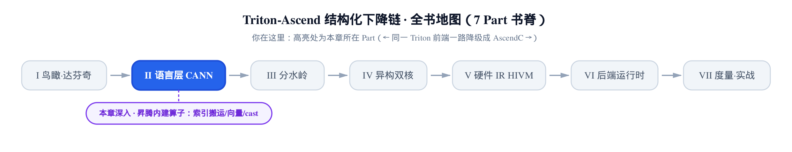
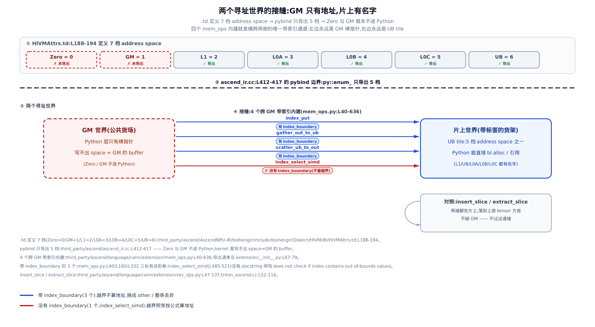
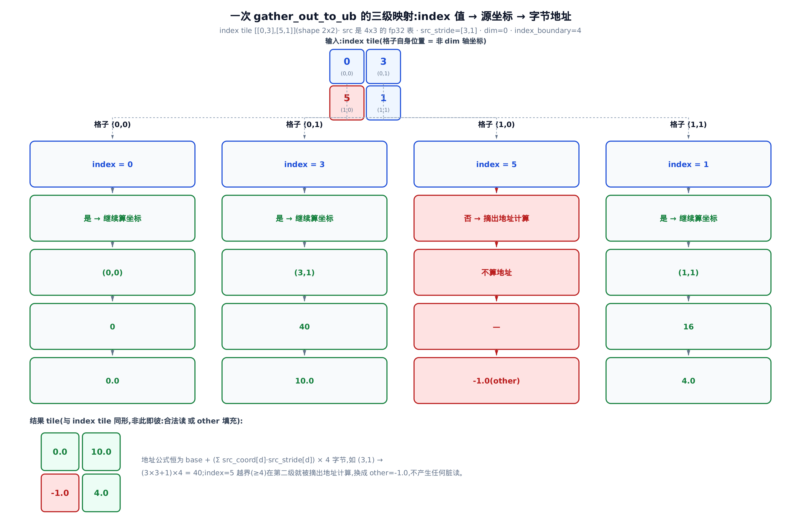
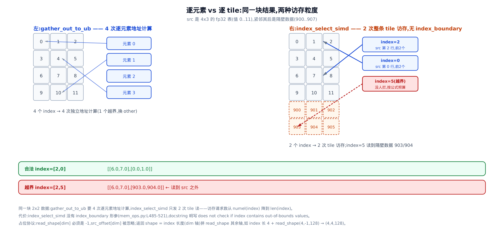
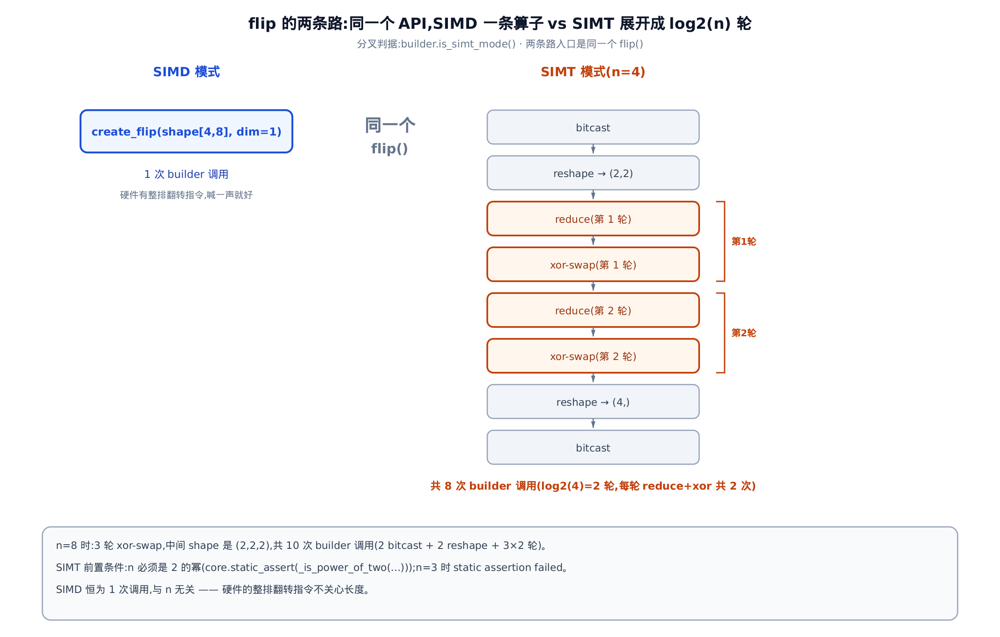
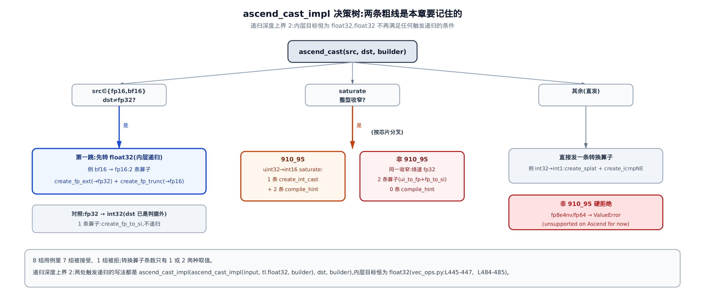
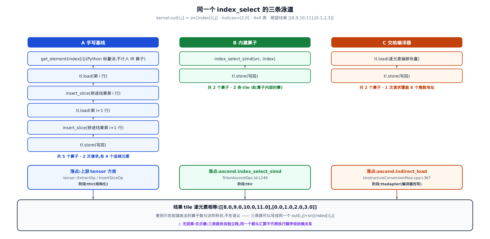

# 昇腾内建算子——索引搬运、向量算子与定制 cast



> **上一章**把片上内存层级搬上了台面：`bl.alloc` 在哪一层订台、`al.copy` 怎么逐条校验方向。
> **本章**讲这套语言层剩下的那半边——带**索引**的搬运、片上向量算子，以及被改写过的 `cast`。
> **下一章**接着讲怎么把外部算子和 libdevice 数学函数接进来。

**姊妹篇约定**。这本书全程对照基座《Triton 源码解读》（读上游 Triton v3.2.0）。本章对位基座里[讲 `tl` 表层词汇与 constexpr 那一章](../../../../triton/artifacts/ch04-tl-surface-and-constexpr/narrative/chapter.md)——那里的 `tl.*` 是一张对所有后端通用的词汇表；昇腾在**同一层**额外挂了一批只在这块硬件上成立的词，住在 `third_party/ascend/language/cann/extension/` 下。本章讲的就是这批扩展词：它们是什么、为什么非有不可、以及每个词最后落成哪个 IR 算子。`cast` 那一节还会和基座[讲类型提升与广播那一章](../../../../triton/artifacts/ch06-type-promotion-broadcast/narrative/chapter.md)里的 `semantic.cast` 直接对读——昇腾把它整个另写了一份。

> **先约定取证口径。** 开发机（host）上没有昇腾 NPU，也没有 CANN（Compute Architecture for Neural Networks，昇腾的软件栈）工具链，所以本章**没有一处真机数值**。正文的数值表有三个来源：① 仓库自带的 interpreter（解释器模式，用 numpy 逐条模拟算子语义的参考实现，见 `python/triton/runtime/ascend_interpreter.py`）——它给出的是「这个算子按定义应该算出什么」；② 跑本章精简版时记录下来的 builder（IR 构造器）调用序列——真实的 builder 是需要 CANN 才能编出来的 C++ 绑定，host 上由一个只记账、返回哨兵值的替身站位，所以这类表读作「前端校验全过、走到了建 op 这一步」，而不是「真机 emit 的指令」；③ 官方用例的三个 kernel 按其循环结构逐句复刻成的 numpy 版。凡是「越界会读到什么」这类真机才能定论的话题，正文一律标明这是参考实现的行为、真机未验证。


**这张图怎么用。** 想一次读完就顺着 ① 到 ⑩ 走。只想学会怎么用索引搬运，读前四站——从「接缝在哪」这一节到「`index_select_simd`」为止，四个 mem_ops 的语义分歧全在那里。只关心片上算子（切片、`flip`、`sort`、`cast`），直接跳到「片上词汇表：切片与取标量」往后的四节。只想鸟瞰分野在哪、不看每个算子的细节，读开头那一节加末尾的「同一个 `index_select` 的三种写法」与「落点表」三处即可。

---

## 接缝在哪：GM 只有地址，片上才有名字

**直觉**。片上那几块内存像仓库里贴了标签的货架：`UB`（Unified Buffer，服务 vector 核的片上统一缓冲）、`L1`、`L0A`/`L0B`/`L0C` 各有名字，你可以直说「把这块数据放 UB 那一格」。而 `GM`（Global Memory，片外全局内存）像仓库外面的公共货场——它在 Python 层**根本没有名字**，你手里只有一张写着地址的纸条，也就是 kernel 形参里那个裸指针。于是问题来了：一头有名字、一头只有地址，谁来跨过这道缝？答案就是本章的主角之一，`mem_ops` 里那四个索引搬运内建。

**机制**。[上一章](../../ch05-explicit-memory-hierarchy/narrative/chapter.md)留下过一个四档口径：硬件 IR 的 `.td` 定义里写着 7 档 address space（地址空间，数据物理上住在哪一层的类型级标签），pybind（C++ 与 Python 之间的绑定层）只把其中 5 档导出给 Python，`al.copy` 的方向校验实际只认 `UB`/`L1`，而 `L0C` 只活在文档契约里。本章要用的是这条链的第二环——**导出的那 5 档里没有 GM**：

```python
# third_party/ascend/ascend_ir.cc:L412-L417
  py::enum_<hivm::AddressSpace>(m, "AddressSpace", py::module_local())
      .value("L1", hivm::AddressSpace::L1)
      .value("UB", hivm::AddressSpace::UB)
      .value("L0A", hivm::AddressSpace::L0A)
      .value("L0B", hivm::AddressSpace::L0B)
      .value("L0C", hivm::AddressSpace::L0C)
```

这段 pybind 枚举就是分水岭。`.td` 那边定义了 7 档（含 `Zero` 与 `GM`），但只有这 5 个名字进了 Python。**结论很硬：kernel 里你写不出 `space=GM` 的 buffer**，因为 Python 侧压根没有这个枚举值。GM 不是「另一档 address space」，它是**另一个寻址世界**——那边只有指针算术，`ptr + offset`，跟 buffer 那套门牌号语言不通。



**源码**。接缝的最短证据是 `gather_out_to_ub` 的公开签名——注意它的第一个参数：

```python
# third_party/ascend/language/cann/extension/mem_ops.py:L182-L192
def gather_out_to_ub(
    src: tensor,
    index: tensor,
    index_boundary: int,
    dim: int,
    src_stride: tuple,
    end_offset: tuple,
    start_offset: tuple,
    other=None,
    _builder=None
):
```

`src` 是 GM 侧的源，类型标的却是普通 `tensor`——因为在这套前端里，指向 GM 的东西就是一个**指针类型的 tensor**，跟 buffer 无关。`index` 是已经躺在 UB 上的整型 tile（片上的一小块数据，Triton 里 kernel 一次处理的基本单位），返回值也在 UB。一头指针、一头 tile，这就是接缝的形状。官方用例把这件事写得更直白：

```python
# third_party/ascend/language/cann/extension/mem_ops.py:L243-L264
        @triton.jit
        def simple_gather_kernel(src_ptr, index_ptr, out_ptr):
            # index tile shape: [2,2]
            y0_local = tl.arange(0, 2)[:, None]  # [0,1] rows
            x1_local = tl.arange(0, 2)[None, :]  # [0,1] cols
            mask = (y0_local < 2) & (x1_local < 2)

            # Load index tile to UB
            index = tl.load(index_ptr + y0_local*2 + x1_local, mask)

            # Call gather_out_to_ub: gather values from src along dim=0
            gathered = gather_out_to_ub(
                src=src_ptr,
                index=index,
                index_boundary=4,
                dim=0,
                src_stride=(2, 1),
                end_offset=(2, 2),
                start_offset=(0, 0)
            )

            tl.store(out_ptr + y0_local*2 + x1_local, gathered, mask)
```

从头到尾没有一行 `bl.alloc`、没有一个 `space=` 参数。索引用最普通的 `tl.load` 从 GM 搬进片上，`src=src_ptr` 直接就是 kernel 的指针形参，结果再用 `tl.store` 写回去。上一章讲的那套 buffer 语言在这里一个字都没出现——**这两套东西是分工，不是替代**：buffer 语言管片上层级之间的整块搬运，`mem_ops` 管跨 GM 的**带索引**访问。

跨 GM 的这一族一共四个：`index_put`、`gather_out_to_ub`、`scatter_ub_to_out`、`index_select_simd`（导出清单见 `third_party/ascend/language/cann/extension/__init__.py:L67-L79`）。它们形态相似但**并不统一**——前三个带一个叫 `index_boundary` 的越界上界参数，第四个没有。这个「3 对 1」贯穿本章，是最值得记住的一处语义分歧，后面会专门算给你看。

作为对照，同目录下还有一对**不过这道缝**的算子：`insert_slice` 和 `extract_slice`。它们两端都在片上，纯粹是 tile 的结构操作，跟 GM 无关——落点也因此完全不同，本章后面会拆开看。

## 三级映射：`gather_out_to_ub` 怎么把 index 变成地址

**直觉**。像照着一张座位表去仓库取书。座位表就是 `index` tile，每一格写着「第几排」；而这一格**自己在座位表里的位置**，就是「第几列」。取书前先看一眼排号有没有超出书架总排数——这就是 `index_boundary`；超了就不去取，直接往这一格里放一本预先准备好的替代品，也就是参数 `other`。

**机制**。整个映射分三级：`index` 值 → 源坐标 → 字节地址。关键是**只有 `dim` 轴那一维的坐标来自 index 值，其余维的坐标来自格子自身的位置**。拿一张 GM 里 4x3 的 fp32 表（值 0..11，row-major 即行优先存放，所以 `src_stride=[3,1]`，意思是行走一步跨 3 个元素、列走一步跨 1 个），`dim=0`、`index_boundary=4`、`other=-1.0`，喂一张 2x2 的 index tile：

<!-- trace: m2 -->

| index 格子 | index 值 | 是否 < 4 | 源坐标 (行，列) | 字节偏移 | 落进 tile 的值 |
|---|---|---|---|---|---|
| (0,0) | 0 | 是 | (0,0) | 0 | 0.0 |
| (0,1) | 3 | 是 | (3,1) | 40 | 10.0 |
| (1,0) | 5 | 否 | 不算地址 | — | -1.0(other) |
| (1,1) | 1 | 是 | (1,1) | 16 | 4.0 |

（数值来自仓库内 interpreter 参考实现逐字执行的结果，非真机。）

读第二行：格子 (0,1) 里写着 3，那么源坐标的行取 3（来自 index 值），列取 1（来自格子自己在第 1 列）；地址偏移 = (3·3 + 1)·4 字节 = 40，取回来的正是表里的 10.0。第三行是越界：5 不小于 4，这一格**在第二级就被摘出去了**，根本不参与地址计算，输出位置由 `other` 顶上。

**不变量**：输出 tile 与 index tile 同形，且每个位置**非此即彼**——要么是一次合法地址的读，要么是 `other` 填充，没有第三种可能，也不会漏格。论证：参考实现先按 `index.shape` 把每个坐标展开一遍，对每个坐标**恰好** append 一次 `(address, valid)` 二元组，所以地址列表与 `index` 的元素个数等长（本例 4 个 → 4 条）；`valid=False` 的位置地址被置 0 并被 mask 掉，读的时候由 `other` 顶上。于是「合法读」与「other 填充」构成对每个格子的一次二分覆盖，数量守恒：4 = 3 次合法读 + 1 次填充。

顺带一个访存量的口径，后面对比时要用：**`gather_out_to_ub` 的访存次数等于 `index` 的元素总数**，与 tile 形状无关。本例是 4 个元素 → 4 次独立的地址计算与访存请求（其中 1 次被 mask 掉）。



**源码**。Python 侧的实现体只做四件事：校验、把 Python 标量折成 IR value（IR 里的一个值，可以是常量也可以是某条指令的结果）、调 C++ builder、把结果包成 tensor。

```python
# third_party/ascend/language/cann/extension/mem_ops.py:L285-L324
        assert index.dtype.is_int(), "index must be an integer tensor"
        if not src.dtype.element_ty.is_floating():
            raise ValueError(f"Expected dtype fp16/fp32/bf16, but got {src.dtype.element_ty}")

        if not isinstance(index_boundary, int):
            raise ValueError("index_boundary must be of type tl.constexpr")
        if not isinstance(dim, int):
            raise ValueError("dim must be of type tl.constexpr")

        idx_rank = len(index.shape)
        if idx_rank < 1 or idx_rank > 5:
            raise ValueError(f"index rank must be in [1, 5], got rank={idx_rank}")
        if dim < 0 or dim >= idx_rank:
            raise ValueError(f"dim must satisfy 0<=dim<index.rank ({idx_rank}), got dim={dim}")

        if other is not None:
            other = real_semantic.cast(other, src.dtype.element_ty, _builder)

        # src stride need to be i64
        src_stride = [_convert_elem_to_ir_value(_builder, elem, True) for elem in src_stride]
        # end offset and start offset need to be i32
        end_offset = [_convert_elem_to_ir_value(_builder, elem, False) for elem in end_offset]
        start_offset = [_convert_elem_to_ir_value(_builder, elem, False) for elem in start_offset]

        if len(src_stride) != idx_rank or len(end_offset) != idx_rank or len(start_offset) != idx_rank:
            raise ValueError(f"len(src_stride)==len(end_offset)==len(start_offset)==index.rank required, "
                            f"got {len(src_stride)}, {len(end_offset)}, {len(start_offset)}, {idx_rank}")

        ret = _builder.create_gather_out_to_ub(
            src.handle,
            index.handle,
            index_boundary,
            dim,
            src_stride,
            end_offset,
            start_offset,
            other if other else None
        )
        ret_shape = [_unwrap_if_constexpr(s) for s in index.shape]
        return wrap_tensor(ret, src.dtype.element_ty, ret_shape)
```

几处值得停一停。`index_boundary` 和 `dim` 都被要求是**编译期常量**（`isinstance(..., int)` 的报错信息直接写着 `must be of type tl.constexpr`，因为 `constexpr` 在这一步之前已经被解包成 Python `int` 了）——它们最后要变成 MLIR 的属性，不能是运行时值。`idx_rank` 限死在 1..5，这是硬件对 tile 维数的上限。最后两行是接缝的另一端：`wrap_tensor` 按 `index.shape` 把 builder 返回的句柄包成一个普通的 UB tile——**从这里往后它就是一个再普通不过的 tensor**，能参与算术、能进后面要讲的那些向量算子。

`index_boundary` 的确切语义，源码里只有参考实现说得明白：

```python
# python/triton/runtime/ascend_interpreter.py:L552-L576
        # Compute the source tensor coordinates for each position in all_coords
        src_coords = []
        for coord in all_coords:
            src_coord = []
            for d in range(index_rank):
                if d == dim:
                    index_value = index_tensor.data[coord]
                    if index_value >= index_boundary:
                        src_coord.append(-1)
                    else:
                        src_coord.append(start_offset_vals[d] + index_value)
                else:
                    src_coord.append(start_offset_vals[d] + coord[d])
            src_coords.append(src_coord)

        # Compute address and mask
        addresses = []
        valid_mask = []
        for _, src_coord in enumerate(src_coords):
            if -1 in src_coord:
                addresses.append(0)
                valid_mask.append(False)
            else:
                offset = 0
                for d in range(index_rank):
```

`d == dim` 那一支取 index 值、其余维取格子坐标——上面那张表的第 4 列就是这段代码画出来的。`-1` 在这里被当作「无效」的哨兵，随后 `-1 in src_coord` 把整格判成 `valid=False`。要提醒一句：这里只看到 `>=` 的**上界**判断，负索引和下界在 pin 的这一版里没有对应的显式校验；真机行为本章无从验证。

**设计决策**：为什么把上界做成必填参数，而不是让用户自己写 mask？因为越界索引在 NPU 上算出来的是一个非法地址，而 mask 是加在 `tl.load` 上的、管不到算子内部的地址生成。把上界收进算子签名，越界元素就在**地址还没算出来之前**被摘掉——这是这三个算子（`index_put`/`gather_out_to_ub`/`scatter_ub_to_out`）共同的安全网。第四个算子没有这张网，代价后面会算清楚。

## 反向搬运：`scatter_ub_to_out` 与 `index_put`

**直觉**。`gather` 是照座位表**取**书，`scatter_ub_to_out` 就是照同一张座位表**还**书：值从片上 tile 出发，按 index 找回 GM 的位置写下去。排号越界的那本不还了——直接丢掉，而不是随便找个位置塞。

**机制**。参数与 gather 几乎镜像（`dst_stride` 换掉 `src_stride`），判定逻辑也镜像。同样的 4x3 表（初值全 0）、同样的 index tile：

<!-- trace: m3 -->

| index 格子 | index 值 | 要写的值 | 是否 < 4 | 目标坐标 (行，列) | 字节偏移 |
|---|---|---|---|---|---|
| (0,0) | 0 | 7.0 | 是 | (0,0) | 0 |
| (0,1) | 3 | 8.0 | 是 | (3,1) | 40 |
| (1,0) | 5 | 9.0 | 否 | 丢弃 | — |
| (1,1) | 1 | 10.0 | 是 | (1,1) | 16 |

（同样来自 interpreter 参考实现，非真机。）

**不变量**：写回的元素个数 = index 元素总数减去越界个数，被丢弃的恰好是 `index ≥ index_boundary` 的那些格子；GM 里其余位置一个字节都不动。论证：参考实现对每个坐标恰好判一次 `index_value >= index_boundary`，真则记 `(addr=0, valid=False)`，假则算出目标坐标与地址、`valid=True`；最终落盘只发生在 mask 为真处。于是「写回数 + 丢弃数 = index 元素总数」恒成立（本例 3 + 1 = 4），运行完这张 4x3 表里恰好只有 3 个非零。

**源码**。这里只看 `scatter_ub_to_out` 外层的一个小设计——标量 value 的自动广播：

```python
# third_party/ascend/language/cann/extension/mem_ops.py:L471-L482
    def _is_ranked_tensor(x):
        return isinstance(x, tensor) and x.shape and len(x.shape) > 0

    dim = _constexpr_to_value(dim)
    index_boundary = _constexpr_to_value(index_boundary)
    value = _constexpr_to_value(value)

    if not _is_ranked_tensor(value) or isinstance(value, constexpr):
        element_ty = ptr.type.scalar.element_ty
        value = real_semantic.full(index.shape, value, element_ty, _builder)
    return scatter_ub_to_out_impl(ptr, value, index, index_boundary, dim,
                                  dst_stride, end_offset, start_offset, _builder)
```

`_is_ranked_tensor`（判断是不是一个带确定形状的 tensor，而非标量或 `constexpr` 编译期常量）不成立时，`real_semantic.full` 会把这个标量摊成一张 `index.shape` 的常量 tile。这是纯语法糖：想把某个位置全填成 0，你直接传 `0` 就行，不用自己造 tile。代价只是 builder 侧多一条广播调用，不增加任何访存。

### `index_put`：越界作废的不是一个元素，而是一整条

**直觉**。`index_put` 的 index 是一张**一维的行号清单**：`value` 的第 i 条（沿 `dim` 轴切出来的那一片），整条按清单第 i 项落到 GM 的对应位置。所以越界的后果升级了——不是丢一个元素，而是**整条作废**。

**机制**。4x3 的 GM 表（初值全 0），`dst_stride=[3,1]`，`start_offset=[0,1]`，一维 index 是 `[2, 5]`，value 是 2x2：

<!-- trace: m4 -->

| value 坐标 | 查 index 的位置 | index 值 | 是否 < 4 | 目标坐标 (行，列) | 字节偏移 | 结果 |
|---|---|---|---|---|---|---|
| (0,0) | index[0] | 2 | 是 | (2,1) | 28 | 写入 1.0 |
| (0,1) | index[0] | 2 | 是 | (2,2) | 32 | 写入 2.0 |
| (1,0) | index[1] | 5 | 否 | — | — | 丢弃 3.0 |
| (1,1) | index[1] | 5 | 否 | — | — | 丢弃 4.0 |

（interpreter 参考实现，非真机。）

**不变量**：index 的第 i 项决定 value 第 i 条的去向，一项越界 ⇒ 那一整条都不落盘。基例：value 沿 `dim` 轴只有 1 条时，判定 `index[0]` 一次即决定这条写或不写。归纳步：第 i 条的所有元素共享同一个 `coord[dim] = i`，因而查到同一个 `index[i]`、走同一个分支，判定结果对整条一致。

还有个容易踩的不对称：**`dim` 轴上不叠加 `start_offset`，其余轴叠加**。目标坐标的构造是 `dst_coord[dim] = index_value`（不加偏移），而 `d ≠ dim` 时 `dst_coord[d] = start_offset[d] + coord[d]`。本例 `start_offset=[0,1]` 只体现在列上——所以落点是第 1、2 列，而不是第 0、1 列。这和 `gather`/`scatter` 在 `dim` 轴上也叠加 `start_offset` 的写法不同。

（另注一处未验证的疑点：参考实现只在合法分支里 append 待写的值，越界元素没有占位，于是值列表与地址列表会不等长。本例合法槽位排在前面，两种解读结果一致，所以看不出差别；这是 pin 版本里的一处潜在缺陷，本章不做结论。）

**源码**。`index_put` 的实现体里有两处独有的校验，都值得看：

```python
# third_party/ascend/language/cann/extension/mem_ops.py:L141-L163
        v_rank = len(value.shape)
        idx_rank = len(index.shape)
        if v_rank < 2 or v_rank > 5:
            raise ValueError(f"value rank must be in [2, 5], got value rank={v_rank}")
        if dim < 0 or dim >= v_rank - 1:
            raise ValueError(f"dim must satisfy 0<=dim<value.rank-1 ({v_rank-1}), got dim={dim}")

        if idx_rank != 1:
            # flatten index to 1D, shape (index.numel,)
            flat_numel = index.numel
            index = real_semantic.reshape(index, (flat_numel,), True, _builder)
            idx_rank = 1

        if value.shape[dim] != index.shape[0]:
            raise ValueError(
                f"index.numel must equal value.shape[dim], "
                f"but got index.numel={index.numel.value}, value.shape[dim]={value.shape[dim].value}"
            )

        require_i64 = index.dtype.is_int64()
        end_offset = [_convert_elem_to_ir_value(_builder, elem, require_i64) for elem in end_offset]
        start_offset = [_convert_elem_to_ir_value(_builder, elem, require_i64) for elem in start_offset]
        dst_stride = [_convert_elem_to_ir_value(_builder, elem, require_i64) for elem in dst_stride]
```

第一处：`dim` 的上界是 `v_rank - 1` 而不是 `v_rank`——**尾轴不能当选取轴**。对比一下，`gather_out_to_ub` 的同一处写的是 `dim >= idx_rank`，尾轴是允许的。两个算子的约束确实不一样。

第二处：index 不是 1D 就**当场摊平**，不报错。摊平之后再要求 `value.shape[dim] == index.shape[0]`——也就是「清单长度必须等于要写的条数」。这一条把「一项管一条」的语义钉死了。

### 位宽契约：一个开关和两处硬编码

上面那段最后三行，是本章最该被如实记下来的一处**不一致**。所有 offset/stride 元组都经同一个折叠器变成 IR value：

```python
# third_party/ascend/language/cann/extension/_utils.py:L36-L54
def _convert_elem_to_ir_value(builder, elem, require_i64):
    if isinstance(elem, int):
        elem = tl.constexpr(elem)
    if isinstance(elem, tl.constexpr):
        if require_i64:
            assert -2**63 <= elem.value < 2**63, f"Block pointers only support 64 bit `shape/strides`, " \
                f"got a value {elem.value} which is out of the range"
            return builder.get_int64(elem.value)
        else:
            assert -2**31 <= elem.value < 2**31, f"Block pointers only support 32 bit `offsets/block_shape`, " \
                f"got a value {elem.value} which is out of the range"
            return builder.get_int32(elem.value)
    elif isinstance(elem, tl.tensor):
        if require_i64:
            return builder.create_int_cast(elem.handle, builder.get_int64_ty(), elem.dtype.is_int_signed())
        else:
            return builder.create_int_cast(elem.handle, builder.get_int32_ty(), elem.dtype.is_int_signed())
    else:
        assert False, f"Unsupported element type in shape/strides/offsets: {type(elem)}"
```

函数本身很直白：`require_i64` 这个布尔开关决定发 i64（64 位整数）还是 i32（32 位整数）常量；传进来的若是运行时 tensor，就插一条整数位宽转换。**问题出在调用方怎么填这个开关**：

- `gather_out_to_ub`（上面 `# … L285-L324` 那段里能直接看到）与 `scatter_ub_to_out` 是**硬编码**：`src_stride`/`dst_stride` 恒传 `True`（i64），`start_offset`/`end_offset` 恒传 `False`（i32）。
- `index_put` 是**一个开关同时决定三者**：`require_i64 = index.dtype.is_int64()`，然后 `end_offset`、`start_offset`、`dst_stride` 全用它。

后果是：当你给 `index_put` 传一个 int32 的 index 时，**连 stride 都退成 i32**。而 stride 是要乘元素数的、可能超出 32 位——按前两个算子的写法，它本该恒为 i64。三个算子两套写法，注释与彼此都对不上，这**疑似是一处 bug**。本章如实指出，不替它编一个统一契约来圆场。

## `index_select_simd`：零拷贝换来的是「不查越界」

**直觉**。`gather_out_to_ub` 是拿着清单一本一本取书；`index_select_simd` 是拿着清单**整排整排地搬**——每个 index 直接对应一整条连续的书。搬得快，代价写在文档第一行：它**不核对排号**。你给一个不存在的排号，它照样按公式算出地址去搬。

**机制**。先看粒度差。同样是取出一块 2x2 的数据：`gather_out_to_ub` 要为 index 的每个元素各算一次地址，是 4 次逐元素访存；`index_select_simd` 只为每个 index 元素发一次**连续段**的读，访存请求数从「index 的元素总数」降到「index 的长度」。这里要留意两侧的 index **形状不同**：`gather_out_to_ub` 那侧是一张 2x2 的二维 index（4 个元素、4 次访存），而 `index_select_simd` 的 index 被硬性要求是**一维**清单（下面源码里那条 `len(index.shape) == 1` 的断言），所以它的「长度」就是它的全部元素数。换句话说，省下的不是同一张 index 上的次数，而是**表达同一件事所需的 index 规模**：二维逐元素的那张表，在这边缩成了一维的行号清单，剩下的连续维交给 `read_shape`。下表是同一张 4x3 表（值 0..11，紧邻其后放着别的数据 900..907）上，`dim=0`、`read_shape=(-1, 2)` 的两组 index：

<!-- trace: m5 -->

| index 值 | 取的是哪一条 | 两个元素的字节偏移 | 读到的 tile | 有没有人拦 |
|---|---|---|---|---|
| 2 | src 第 2 行的前 2 个 | 24 / 28 | [6.0, 7.0] | 没有 index_boundary 这个参数 |
| 0 | src 第 0 行的前 2 个 | 0 / 4 | [0.0, 1.0] | 没有 |
| 5(越界) | 按公式落到 src 之外 | 60 / 64 | [903.0, 904.0](隔壁数据) | 没有，docstring 明写不检查 |

最后一行请这样读：那是**参考实现**按公式照算地址的后果——它在 numpy 数组上算出越界偏移，就读到了紧邻的数据。真机上这是一次越界访问，行为本章未验证。但无论真机怎样，**前端不拦**这件事是确定的。

**不变量**：返回 tile 的 `dim` 轴长度恒等于 index 的长度，其余轴长度恒等于 `read_shape` 的对应项；整条路径上没有任何一步检查 index 的取值范围。前半句直接来自源码里那个构造式（下面就能看到）。后半句是**穷举式**的论证：这个内建的形参只有 `(src, dim, index, src_shape, src_offset, read_shape)` 六个，里面根本没有 `index_boundary`；函数体的断言只管 `dim` 与 index 的 rank（维数），不碰 index 的值。



**源码**。实现体一共做三件事：断言、把 shape/offset 逐元素拆成句柄、推导返回 shape。

```python
# third_party/ascend/language/cann/extension/mem_ops.py:L572-L612
        # Validate inputs
        ndim = len(src_shape)
        assert len(src_offset) == ndim, \
            f"src_offset length {len(src_offset)} must match src_shape length {ndim}"
        assert len(read_shape) == ndim, \
            f"read_shape length {len(read_shape)} must match src_shape length {ndim}"
        assert 0 <= dim < ndim, \
            f"dim={dim} must be in range [0, {ndim})"
        assert len(index.shape) == 1, \
            f"index must be 1D tensor, got {len(index.shape)}D"
        assert dim < ndim - 1, \
            f"index_select_simd cannot support trailing dimension as dim={dim}, ndim={ndim}"
        # Handle both tensor and int offsets (for interpreter mode)
        newsrc_shape = []
        for s in src_shape:
            if isinstance(s, tensor):
                newsrc_shape.append(s.handle)
            elif isinstance(s, int):
                # For interpreter mode: keep as int
                newsrc_shape.append(s)
            else:
                newsrc_shape.append(s.handle if hasattr(s, 'handle') else s)
        # … 省略：src_offset 的拆解循环与上面 src_shape 这段结构完全相同 …

        # Create output type
        return_shape = [
            index.shape[0] if i == dim else read_shape[i] 
            for i in range(ndim)
        ]
        element_ty = src.type.element_ty
        output_ty = tl.block_type(element_ty, return_shape)
        out = _builder.create_index_select_simd(src.handle, index.handle, dim, newsrc_shape, newsrc_offset, read_shape, return_shape)
        return tl.tensor(out, output_ty)
```

`return_shape` 那个列表推导就是不变量前半句的全部依据：逐轴二选一，`dim` 轴用 index 的长度、其余轴用 `read_shape`。举例：index 长 4、`read_shape=(4,-1,128)`、`dim=1` → 返回 `(4,4,128)`。

两条断言值得单独说。`len(index.shape) == 1` 好理解：index 是一维清单。而 `dim < ndim - 1`——**尾轴不能当选取轴**——源码没有给任何理由，注释和文档都没有。一个合理的猜想是「尾轴要留给连续段」，但那只是猜想，pin 里找不到出处，本章不把它当结论。

再看外层。这里有一处彩蛋：

```python
# third_party/ascend/language/cann/extension/mem_ops.py:L614-L636
    dim = _constexpr_to_value(dim)

    # Process shape parameters: convert constexpr to values, keep tensors as-is
    def process_param(val):
        """Convert constexpr to value, keep tensor or int as-is"""
        if isinstance(val, tensor):
            return val
        else:
            return _constexpr_to_value(val)

    newsrc_shape = [
        real_semantic.to_tensor(o, _builder) if isinstance(o, constexpr) else o
        for o in src_shape
    ]
    newsrc_offset = [
        real_semantic.to_tensor(o, _builder) if isinstance(o, constexpr) else o
        for o in src_offset
    ]
    assert len(index.shape) == 1, "index must be a 1D tensor"

    return index_select_simd_impl(
        src, dim, index, newsrc_shape, newsrc_offset, read_shape, _builder
    )
```

`process_param` 定义了，然后**从来没有被调用过**——是死代码。真正生效的是下面两段列表推导：`constexpr` 被提成 tensor，其余原样透传。这类残留在读源码时值得停一秒确认，免得顺着一个不存在的调用路径推错。

**占位协议**。`read_shape[dim]` 必须填 `-1`、`src_offset[dim]` 会被忽略——这不是随手定的，是写进算子定义里的约束：

```
// third_party/ascend/include/Dialect/TritonAscend/IR/TritonAscendOps.td:L249-L282
def IndexSelectSimdOp : TT_Ascend_Op<"index_select_simd", [
  MemoryEffects<[MemRead<GlobalMemory>]>,
  DeclareOpInterfaceMethods<InferTypeOpInterface>,
  AttrSizedOperandSegments
]> {
    let summary = "Index select SIMD operation from global memory";

    let description = [{
        Index select operation (SIMD version) that loads data from multiple indices along a
        specified dimension. The operation selects data from GM and loads them
        as tiles directly to UB with zero-copy semantics.
        …
        Constraints:
        - read_shape[dim] must be -1
        - src_offset[dim] can be -1 (will be ignored)
    }];

    let arguments = (
      ins
      TT_PtrLike:$src,
      TT_IntTensor:$index,
      I32Attr:$dim,
      Variadic<Index>:$src_shape,
      Variadic<Index>:$src_offset,
      DenseI32ArrayAttr:$read_shape
    );
```

`.td`（TableGen，MLIR 描述算子定义的声明式文件）这几行同时确认了三件事。`MemRead<GlobalMemory>` 说明这个算子的副作用被登记为「读全局内存」——它确实活在指针世界那一侧。`dim` 与 `read_shape` 是**属性**（编译期常量），而 `src_shape`/`src_offset` 是 `Index` 类型的**变长操作数**（可以是运行时值）。以及那个 `-1` 占位协议：用 `-1` 表示「这一维由 index 决定」，就省掉了一个「哪一维是选取维」的冗余参数——`dim` 属性已经说明了一切。

顺带补一句上一节的位宽话题：`index_select_simd` **不走** `_convert_elem_to_ir_value`。它的 `src_shape`/`src_offset` 走 `real_semantic.to_tensor` 再进 `Variadic<Index>` 操作数，跟前三个算子的 i32/i64 折叠完全是两条路。

至此「3 对 1」的账可以结了：`index_put`/`gather_out_to_ub`/`scatter_ub_to_out` 有 `index_boundary`、有 offset/stride 三元组、走同一个折叠器；`index_select_simd` 三样都没有。**零拷贝买到的是访存粒度，卖掉的是那张安全网**——这是本章最该带走的一句话。至于「SIMD 零拷贝」在硬件上到底映射成哪条指令，Python 层只到发出算子为止，pin 里没有可核的下降证据，本章不臆测。

## 片上词汇表：切片与取标量

前面都在跨缝。现在看**不过缝**的那一类：两端都在片上、纯粹操作 tile 结构的算子。它们的落点和昇腾方言算子完全不同，这个差别本身就是设计意图。

`insert_slice` 和 `extract_slice` 是一对互逆算子：一个把小 tile 按窗口写进大 tile，一个从大 tile 按窗口切出小 tile。

```python
# third_party/ascend/language/cann/extension/vec_ops.py:L65-L92
    def insert_slice_impl(ful: tensor, sub: tensor, offsets: List[tensor], sizes: List[int], strides: List[int], builder: ir.builder) -> tensor:
        assert(len(ful.shape) == len(offsets))
        assert(len(ful.shape) == len(sizes))
        assert(len(ful.shape) == len(strides))
        assert(all([s>=1 for s in sizes]))
        assert(all([s>=0 for s in strides]))
        # Handle both tensor and int offsets (for interpreter mode)
        new_offsets = []
        for o in offsets:
            if isinstance(o, tensor):
                new_offsets.append(o.handle)
            elif isinstance(o, int):
                # For interpreter mode: keep as int
                new_offsets.append(o)
            else:
                new_offsets.append(o.handle if hasattr(o, 'handle') else o)
        ret_type = tl.block_type(ful.type.scalar, ful.shape)
        out = builder.create_insert_slice(ful.handle, sub.handle, new_offsets, sizes, strides)
        return tensor(out, ret_type)

    assert len(ful.shape) > 0
    assert len(ful.shape) == len(sub.shape)
    new_offsets = [
        semantic.to_tensor(o, _builder) if isinstance(o, constexpr) else o
        for o in offsets
    ]
    out = insert_slice_impl(ful, sub, new_offsets, sizes, strides, _builder)
    return out
```

```python
# third_party/ascend/language/cann/extension/vec_ops.py:L111-L137
    def extract_slice_impl(ful: tensor, offsets: List[tensor], sizes: List[int], strides: List[int], builder: ir.builder) -> tensor:
        assert(len(ful.shape) == len(offsets))
        assert(len(ful.shape) == len(sizes))
        assert(len(ful.shape) == len(strides))
        assert(all([s>=1 for s in sizes]))
        assert(all([s>=0 for s in strides]))
        # Handle both tensor and int offsets (for interpreter mode)
        new_offsets = []
        for o in offsets:
            if isinstance(o, tensor):
                new_offsets.append(o.handle)
            elif isinstance(o, int):
                # For interpreter mode: keep as int
                new_offsets.append(o)
            else:
                new_offsets.append(o.handle if hasattr(o, 'handle') else o)
        ret_type = tl.block_type(ful.type.scalar, sizes)
        out = builder.create_extract_slice(ful.handle, new_offsets, sizes, strides)
        return tensor(out, ret_type)

    assert len(ful.shape) > 0
    new_offsets = [
        semantic.to_tensor(o, _builder) if isinstance(o, constexpr) else o
        for o in offsets
    ]
    sub = extract_slice_impl(ful, new_offsets, sizes, strides, _builder)
    return sub
```

两段逐行对称，唯一的实质差别在返回类型那一行：`insert_slice` 用 `ful.shape`（塞进去之后还是原来那么大），`extract_slice` 用 `sizes`（切出来只有窗口那么大）。共同点也很清楚：`offsets` 允许是运行时 tensor（也兼容 interpreter 模式下的 Python `int`），而 `sizes`/`strides` 必须是编译期整数——窗口大小要参与类型推导，不能等到运行时才知道。

**顺带打通一个别名。** 这两段里的 `semantic.to_tensor`，和前面 `mem_ops` 那几段里的 `real_semantic.cast` / `real_semantic.full` / `real_semantic.to_tensor`，指的是**同一个模块**——上游的 `python/triton/language/semantic.py`，只是两个文件 import 时起的别名不同（`mem_ops.py` 用 `real_semantic`，`vec_ops.py` 用 `semantic`）。看到两个名字别以为昇腾另有一套 semantic：扩展算子在做类型转换、广播、标量提张量这些事情时，走的仍是上游那份实现。唯一被昇腾另写了一份的是 `cast`，本章后面会专门拆。

关键在**落点**：

```cpp
// third_party/ascend/triton_ascend.cc:L52-L82
    .def("create_extract_slice",
      [](TritonOpBuilder &self, Value &ful, std::vector<Value> &offs_vec,
        std::vector<int> &sizs_vec, std::vector<int> &strd_vec) -> Value {
        llvm::SmallVector<Value> offsets;
        for (const auto &o : offs_vec) {
          auto oTy = o.getType();
          if (!oTy.isIndex()) {
            auto v = self.create<arith::IndexCastOp>(
              self.getBuilder().getIndexType(), o);
            offsets.push_back(v);
          } else {
            offsets.push_back(o);
          }
        }
        llvm::SmallVector<Value> sizes;
        llvm::SmallVector<int64_t> retSizes;
        for (const auto &s : sizs_vec) {
          auto v = self.create<arith::ConstantIndexOp>(s);
          sizes.push_back(v);
          retSizes.push_back(s);
        }
        llvm::SmallVector<Value> strides;
        for (const auto &s : strd_vec) {
          auto v = self.create<arith::ConstantIndexOp>(s);
          strides.push_back(v);
        }
        auto retTy = RankedTensorType::get(retSizes,
          cast<RankedTensorType>(ful.getType()).getElementType());

        return self.create<tensor::ExtractSliceOp>(retTy, ful, offsets, sizes, strides);
      })
```

最后一行是重点：落到的是**上游 MLIR 的 `tensor::ExtractSliceOp`**，不是昇腾方言算子。这条分野很清晰——纯 tile 级的结构操作与硬件无关，直接复用上游；昇腾方言只留给真正带昇腾语义的算子。同一族里还有 `get_element`（按整型下标从 tile 里取出一个标量），落点同理是上游 `tensor` 方言：

```python
# third_party/ascend/language/cann/extension/vec_ops.py:L153-L177
    def get_element_impl(src: tensor, indice: List[tensor], builder: ir.builder):
        if len(src.shape) != len(indice):
            raise ValueError("Indice's rank must be equal to src tensor's rank")

        # Handle both tensor and int indices (for interpreter mode)
        new_indice = []
        for i in indice:
            if isinstance(i, tensor):
                new_indice.append(i.handle)
            elif isinstance(i, int):
                # For interpreter mode: convert int to TensorHandle
                new_indice.append(i)
            else:
                # Try to use .handle attribute if available
                new_indice.append(i.handle if hasattr(i, 'handle') else i)
        
        result = builder.create_extract_scalar(src.handle, new_indice)
        return wrap_tensor(result, src.type.scalar, None)

    assert len(src.shape) > 0
    new_indice = [
        semantic.to_tensor(i, _builder) if isinstance(i, constexpr) else i
        for i in indice
    ]
    return get_element_impl(src, new_indice, _builder)
```

下标个数必须等于 tile 的维数——取的是**一个**标量，不是切片。这三个算子看着朴素，但本章最后那节的「手写 gather 基线」全靠它们拼出来。

还有一处词汇表边界值得记住：`insert_slice`/`extract_slice`/`get_element`/`cast` 与四个 `mem_ops` 都带 `@_tensor_member_fn`（把函数同时注入成 tensor 的方法，于是可以写 `t.extract_slice(...)`），而接下来要讲的 `flip` 与 `sort` **只有 `@builtin`**——它们不是 tensor 方法，只能以函数形式调用。这个不齐整在查「这个词怎么念」时会直接撞上。至于 `@builtin` 标记本身怎么被前端识别、怎么分发到昇腾那一侧的 builder，是[第 4 章双 builder 路由](../../ch04-dual-builder-ascend-dispatch/narrative/chapter.md)的题目，本章只讲被路由到的算子本身。

## `flip`：同一个 API，两条路

**直觉**。倒序一排书。SIMD 模式下硬件有一条「整排翻转」指令，喊一声就好；SIMT 模式下没有这条指令，只能像洗牌一样两两换位、再四四换位……换 `log2(n)` 轮才能把整排倒过来。

（SIMD 与 SIMT 是两种编译模式：前者一条指令处理整块数据，是昇腾 vector 核的原生形态；后者是 GPU 那种「一个线程管一个元素」的模型。同一份 kernel 源码在两种模式下会走不同的展开路径。）

**机制**。分叉只看一个布尔值。下表是同一个 `flip()` 在两种模式下发出的 builder 调用统计：

<!-- trace: m9 -->

| 模式 | n | create_flip | reshape | xor 轮数 | bitcast | builder 调用总数 |
|---|---|---|---|---|---|---|
| SIMD | 8 | 1 | 0 | 0 | 0 | 1 |
| SIMT | 4 | 0 | 2 | 2 | 2 | 8 |
| SIMT | 8 | 0 | 2 | 3 | 2 | 10 |

（记录的是精简版发给替身 builder 的调用序列，不是真机指令数。）

SIMD 那行恒为 1 次调用，与 n 无关——硬件的整排翻转指令不关心长度。SIMT 那两行的结构是固定的：前后各一次 `bitcast`（按位重解释类型，把浮点当整数看，好做异或）、前后各一次 `reshape`，中间夹 `log2(n)` 轮换位。n=4 是 2 轮共 8 次调用，n=8 是 3 轮共 10 次。

**不变量**：SIMT 回退路径必然在有限步内停，步数 = `log2(n)`，且 n 必须是 2 的幂。论证：`_log2` 把 n 反复右移直到 1 得到 `steps`；循环上界是编译期常量，每轮消耗掉 reshape 出来的一个「2」维度，剩余待处理维度数从 `steps` 单调递减到 0——非负整数严格递减，必定有限步停。前置条件由一条编译期断言挡住，实测 n=3 直接报 static assertion failed。SIMD 路径没有循环，就是一条算子。



**源码**。SIMD 路径极短，正事只有最后两行：

```python
# third_party/ascend/language/cann/extension/vec_ops.py:L211-L251
        def flip_simd(ptr: tensor, dim: int, builder: ir.builder):
            """
            Triton flip operation for simd
            …
            """

            shape = getattr(ptr, "shape", None)
            # … 省略：shape/rank 的防御式取法，为兼容 shape 缺失的对象 …

            if rank is not None:
                if rank < 1:
                    raise ValueError("ascend.flip requires tensor rank >= 1")
                norm_dim = dim if dim >= 0 else dim + rank
                if not (0 <= norm_dim < rank):
                    raise ValueError(
                        f"ascend.flip got invalid dim={dim} for shape {tuple(shape)}"
                    )
                dim = norm_dim
            else:
                if dim < 0:
                    raise ValueError(
                        "ascend.flip with unknown rank requires non-negative dim"
                    )

            flipped_vals = builder.create_flip(ptr.handle, dim)
            flipped = tensor(flipped_vals, type=ptr.type)
            return flipped
```

拿到 rank、把负 `dim` 归一化、校验范围，然后 `create_flip` 一步到位。分叉与回退在它外面：

```python
# third_party/ascend/language/cann/extension/vec_ops.py:L253-L269
        # If compile_mode is not simt, use the simd implementation
        if not builder.is_simt_mode():
            return flip_simd(ptr, dim, builder)
        core.static_assert(-len(ptr.shape) <= dim and dim < len(ptr.shape), _builder=builder)
        _dim: core.constexpr = _get_flip_dim(dim, ptr.shape)
        core.static_assert(standard._is_power_of_two(ptr.shape[_dim]), _builder=builder)
        steps: core.constexpr = _log2(ptr.shape[_dim])
        # If steps is 0, return the original tensor
        if steps == 0:
            return ptr
        # reshape the swap dimension to (2, 2, ..., 2)
        idtype = core.get_int_dtype(bitwidth=ptr.dtype.primitive_bitwidth, signed=True)
        y = core.reshape(ptr.to(idtype, bitcast=True, _builder=builder), ptr.shape.__getitem__(slice(None, _dim)) + [2] * steps + ptr.shape.__getitem__(slice(_dim + 1, None)), _builder=builder)
        for i in static_range(steps):
            y = y.__xor__(standard.xor_sum(y, _dim + i, True, _builder=builder, _generator=generator), _builder=builder)
        ptr = core.reshape(y, ptr.shape, _builder=builder).to(ptr.dtype, bitcast=True, _builder=builder)
        return ptr
```

第一行 `builder.is_simt_mode()` 就是整个分叉的判据。回退路径的思路是：把长度 n 的那一维 reshape 成 `steps` 个大小为 2 的维度，然后逐维做一次「异或换位」——`static_range`（编译期展开的循环，轮数必须是常量）保证这个循环在编译期就被摊平，不留运行时循环。`_is_power_of_two` 的断言就是从这里来的：reshape 成一串 2，n 不是 2 的幂根本摆不平。

**设计决策**：为什么不干脆在 SIMT 模式下也调 `create_flip`？因为那条昇腾方言算子只在 SIMD 模式下有对应的下降路径。前端能做的是退回到上游 Triton 的通用写法——用 `reshape` + 异或把翻转拼出来。代价写在表里：从 1 次调用变成 8 或 10 次，还附带一条「该维必须是 2 的幂」的额外约束。**同一行 Python，两种模式下的成本完全不同**，这是本章第二次遇到这种情形，等下 `cast` 那节还有第三次。

## `sort`：只排末维，出口自动贴便条

**直觉**。`sort` 只肯排**最后一维**——像只允许在每一行内部排序，不允许跨行排。另外窄整型（int8/int16）排序时中间过程容易溢出，于是算子在出口**自动替你贴一张便条**：「溢出请按饱和处理」，不用你自己记。

**机制**。六组输入喂进去，四组被接受、两组被拒：

<!-- trace: m10 -->

| dtype | shape | dim | 是否接受 | create_sort | 自动挂的 compile_hint |
|---|---|---|---|---|---|
| float32 | [4, 8] | 1(末维) | 接受 | 1 | 0 条 |
| int8 | [4] | 0(末维) | 接受 | 1 | 1 条 overflow_mode=saturate |
| int16 | [4] | 0(末维) | 接受 | 1 | 1 条 overflow_mode=saturate |
| int32 | [4] | 0(末维) | 接受 | 1 | 0 条 |
| float32 | [4, 8] | 0(非末维) | 拒绝：only supports sorting along the last dimension | 0 | — |
| uint8 | [4] | 0(末维) | 拒绝：dtype 不在白名单 | 0 | — |

（同样是替身 builder 记下的调用序列，不是真机排序结果。）

只有 int8 和 int16 多挂了一条编译提示（compile hint，钉在 IR 值上、留给后端 pass 读的标注），int32 和 float32 都是 0 条。

**不变量**：`sort` 的输出 shape 恒等于输入 shape，那条提示只是额外挂在结果上的标注，不改变算子本身，也不改变返回类型。论证：实现体把 builder 返回的句柄包成 `tensor(sorted_vals, type=ptr.type)`——类型直接沿用输入，shape 不可能变。挂提示发生在实现体**返回之后**，只多一次调用，它落到的是「给某个值贴 attribute」的接口，不产生新值。

**源码**。先看白名单与末维校验：

```python
# third_party/ascend/language/cann/extension/vec_ops.py:L330-L360
    def sort_impl(ptr: tensor, dim: int, descending, builder: ir.builder):
        allowed_types = {tl.int8, tl.int16, tl.bfloat16, tl.float16, tl.float32, tl.int32, tl.int64, tl.float8e4nv, tl.float8e5}
        base_ty = ptr.type.scalar if hasattr(ptr.type, "scalar") else ptr.type
        if base_ty not in allowed_types:
            raise TypeError(
                f"ascend.sort only supports int8, int16, bfloat16, float16, float32, int32, int64, float8e4nv, float8e5"
                f"but got {ptr.type}"
            )
        # … 省略：shape/rank 的防御式取法，与 flip_simd 那段同构 …
        if rank is not None:
            if rank < 1:
                raise ValueError("ascend.sort requires tensor rank >= 1")
            last_dim = rank - 1
            norm_dim = dim if dim >= 0 else dim + rank
            if norm_dim != last_dim:
                raise ValueError(
                    f"ascend.sort only supports sorting along the last dimension "
                    f"(dim={last_dim} or -1) for shape {tuple(shape)}, but got dim={dim}"
                )
            dim = last_dim
```

白名单是显式集合，`uint8` 不在里面所以被拒。末维约束写得很硬：归一化后的 `dim` 必须**等于** `rank - 1`，不是「小于等于」。这与 `index_select_simd` 的 `dim < ndim - 1`（尾轴禁用）正好相反——一个只准排尾轴，一个只准选非尾轴。两处约束源码都只写了断言、没给任何理由；「都与硬件的数据排布有关」听着顺理成章，但 pin 里同样找不到出处，本章不把它当结论。

出口那段是自动挂提示的地方：

```python
# third_party/ascend/language/cann/extension/vec_ops.py:L379-L397
    try:
        dim = int(dim.value) if hasattr(dim, "value") else int(dim)
    except Exception as e:
        raise TypeError(f"dim must be an integer (or tl.constexpr int), got {dim!r}. Error: {str(e)}") from e

    if hasattr(descending, "value"):
        descending = bool(descending.value)
    else:
        descending = bool(descending)

    ret = sort_impl(ptr, dim, descending, _builder)
    # interpreter mode not support compile_hint overflow_mode, direct return
    from triton.runtime.interpreter import InterpreterBuilder
    if isinstance(_builder, InterpreterBuilder):
        return ret
    base_ty = ptr.type.scalar if hasattr(ptr.type, "scalar") else ptr.type
    if base_ty.is_int8() or base_ty.is_int16():
        compile_hint_impl(ret, "overflow_mode", constexpr("saturate"), _builder)
    return ret
```

**设计决策**：与其在文档里写一句「排 int8 记得开饱和模式」等着用户忘，不如在算子出口按 dtype 自动挂上。interpreter 模式不支持这类提示，所以那一行先行返回——这也解释了为什么表里的提示条数在解释器下会全变成 0。

## `cast`：决策树、芯片门控与那个拼错的词

**直觉**。像换外币：有的货币对之间有直航柜台（fp32 ↔ int32），有的没有，必须先换成通用货币再换第二次——bf16/fp16 想去 fp32 以外的地方，一律先换 fp32。还有几种货币这台机器根本不收（非 910_95 芯片上的 fp8/fp64），当场拒绝。

**机制**。昇腾没有沿用基座的 `semantic.cast`，而是另写了一份 `ascend_cast_impl`。八组用例跑下来，七组被接受、一组被拒；转换算子的条数只有 1 或 2 两种取值：

<!-- trace: m11 -->

| 源 → 目标 | 芯片 | overflow_mode | 发出的转换算子 | 条数 | compile_hint |
|---|---|---|---|---|---|
| fp16 → fp32 | 非 910_95 | 无 | create_fp_ext | 1 | 0 |
| bf16 → fp16 | 非 910_95 | 无 | create_fp_ext + create_fp_trunc(经 fp32 中转) | 2 | 0 |
| fp16 → int32 | 非 910_95 | 无 | create_fp_ext + create_fp_to_si(同样先上 fp32) | 2 | 0 |
| fp32 → int32 | 非 910_95 | 无 | create_fp_to_si | 1 | 0 |
| int32 → int1 | 非 910_95 | 无 | create_splat + create_icmpNE(变成 != 0) | 2 | 0 |
| uint32 → int16 | 910_95 | saturate | create_int_cast | 1 | 2 条(saturate_src_unsigned / saturate_dst_unsigned) |
| uint32 → int16 | 非 910_95 | saturate | create_ui_to_fp + create_fp_to_si(绕道 fp32) | 2 | 0 |
| fp8e4nv → fp32 | 非 910_95 | 无 | 直接拒绝：[fp8, fp64] is unsupported on Ascend for now | 0 | 0 |

（`910_95` 是昇腾的一档芯片型号；表里的芯片列靠改写模块级探测标志模拟，host 上没有真芯片。同样是替身 builder 记下的调用序列。）

最值得盯的是最后两行的对比：**同一行 Python、同一个 `overflow_mode="saturate"`，在 910_95 上是「1 条算子 + 2 条编译提示」，换台机器就变成「绕道 fp32 的 2 条算子 + 0 条提示」**。代价随芯片变，而调用方一无所知。

**不变量**：`ascend_cast_impl` 的自递归深度 ≤ 2。论证：触发递归的条件只有两处——① 源是 fp16/bf16 且目标不是 fp32；② saturate 整型收窄且不在 910_95。两处的写法都是 `ascend_cast_impl(ascend_cast_impl(input, tl.float32, builder), dst_sca_ty, builder)`，**内层目标恒为 float32**。而 float32 既不是 fp16 也不是 bf16（条件 ① 不成立），也不是整型（条件 ② 不成立），所以外层那次调用必定走到某个直接发算子的分支就返回。基例是任何不触发 ①② 的输入，深度 1。这正是表里「条数只有 1 或 2」的原因。



**源码**。整数分支最能说明这套设计：

```python
# third_party/ascend/language/cann/extension/vec_ops.py:L468-L486
    # Casting between integer types
    if src_sca_ty.is_int() and dst_sca_ty.is_int() and \
       (src_sca_ty.int_bitwidth != dst_sca_ty.int_bitwidth or src_sca_ty.int_signedness != dst_sca_ty.int_signedness):
        sign_extend = src_sca_ty.is_int_signed() and not src_sca_ty.is_bool()
        if dst_sca_ty.is_bool():
            ty = input.dtype.to_ir(builder)
            _0 = tensor(builder.get_null_value(ty), input.dtype)
            return not_equal(input, _0, builder) 
        elif overflow_mode == "saturate" and \
             (src_sca_ty.is_int_unsigned() or dst_sca_ty.is_int_unsigned()) and \
             src_sca_ty.int_bitwidth >= dst_sca_ty.int_bitwidth:
            if is_compile_on_910_95:
                result = tensor(builder.create_int_cast(input.handle, dst_ty.to_ir(builder), sign_extend), dst_ty)
                compile_hint_impl(result, "saturate_src_unsigned", src_sca_ty.is_int_unsigned(), builder)
                compile_hint_impl(result, "saturate_dst_unsigned", dst_sca_ty.is_int_unsigned(), builder)
                return result
            else:
                return ascend_cast_impl(ascend_cast_impl(input, tl.float32, builder), dst_sca_ty, builder)
        return tensor(builder.create_int_cast(input.handle, dst_ty.to_ir(builder), sign_extend), dst_ty)
```

饱和路径的触发条件是三个条件**同时**成立：`overflow_mode == "saturate"`、源或目标至少有一方无符号、且位宽在收窄。任缺其一都掉到最后那行的普通整数转换。`is_compile_on_910_95` 是模块级的硬件探测全局量（不是 builder 上的方法），它把这一支再劈成两半：新芯片上直接发一条整数转换、外加两条提示告诉后端「源/目标各自是否无符号」；老芯片上没有这条能力，只能递归绕道 float32——表里那两行就是这么来的。

`ascend_cast_impl` 与基座 `python/triton/language/semantic.py` 里的 `cast` 其余部分高度重复，昇腾另起一份主要就是为了这两件事：非 910_95 上直接拒绝 fp8/fp64，以及上面这套饱和门控。

### `overflow_mode`：贴便条，而不是换算子

**直觉**。`overflow_mode` 不是让 `cast` 换一条算子，而是给转换结果**贴一张便条**，留给后端 pass 去读。便条只认两个词。而文档里那个词**拼错了**——照抄文档会被当场拒收。

**机制**。int32 → int16，四种取值：

<!-- trace: m12 -->

| overflow_mode | 是否接受 | 转换算子 | compile_hint | 调用顺序 |
|---|---|---|---|---|
| 未传(None) | 接受 | create_int_cast | 0 条 | create_int_cast |
| trunc | 接受 | create_int_cast | 1 条 overflow_mode=trunc | create_int_cast → create_annotation_mark |
| saturate | 接受 | create_int_cast | 1 条 overflow_mode=saturate | create_int_cast → create_annotation_mark |
| sautrate(照 docstring 抄) | 拒绝：Unknown overflow_mode | create_int_cast 已经发出 | 0 条 | create_int_cast → 抛 ValueError |

**不变量**：非法的 `overflow_mode` 一定会抛错，但抛错发生在转换算子**已经发出之后**——校验不是前置守卫，而是收尾检查。最后一行的调用顺序就是证据：`create_int_cast` 已经在序列里了，然后才抛出错误。合法值集合是穷举的两元素列表，所以「不在列表里 ⇒ 抛错」没有第三种出口。

**源码**。把公开入口和它的文档放在一起读，那处矛盾就藏不住了：

```python
# third_party/ascend/language/cann/extension/vec_ops.py:L524-L562
@_tensor_member_fn
@builtin
def cast(input, dtype: dtype, fp_downcast_rounding: Optional[str] = None, bitcast: bool = False, overflow_mode: Optional[str] = None, _builder=None):
    """
    Casts a tensor to the given :code:`dtype`.
    …
    :param overflow_mode: When overflow_mode is not set or is "trunc",
        truncation (cut-off) will be used to handle overflow. When
        overflow_mode is "sautrate", the maximum value of the data type
        will be used to handle overflow.
    :type overflow_mode: string, optional
    """
    overflow_modes = ["trunc", "saturate"]
    input = semantic.to_tensor(input, _builder)
    if isinstance(bitcast, constexpr):
        bitcast = bitcast.value
    if bitcast:
        return semantic.bitcast(input, dtype, _builder)
    ret = ascend_cast_impl(input, dtype, _builder, fp_downcast_rounding, overflow_mode)
    if overflow_mode is not None:
        if overflow_mode in overflow_modes:
            from triton.runtime.interpreter import InterpreterBuilder
            if isinstance(_builder, InterpreterBuilder):
                overflow_mode = constexpr(overflow_mode)
            compile_hint_impl(ret, "overflow_mode", overflow_mode, _builder)
        else:
            raise ValueError(f"Unknown overflow_mode:{overflow_mode} is found.")
    return ret
```

文档字符串里写的是 `"sautrate"`，下面一行的校验列表却是 `["trunc", "saturate"]`。**照文档抄的人会拿到一个 `Unknown overflow_mode` 的 ValueError**，而且是在转换算子已经发出之后才抛。这处 doc 与 code 的不一致本身就值得记一笔：读扩展算子的文档时，能对照校验列表就对照校验列表。

还有一处顺序值得看清：`ret = ascend_cast_impl(...)` 在前，`overflow_mode` 的合法性判断在后。也就是说，`overflow_mode` 其实被用了**两次**——先作为参数进 `ascend_cast_impl` 参与上一节那个三条件的饱和判定，再在这里作为提示挂到结果上。两次用途不同，中间没有任何一步先校验它。

提示怎么挂上去？

```python
# third_party/ascend/language/cann/extension/aux_ops.py:L114-L133
def compile_hint_impl(ptr: tensor, hint_name: str, hint_val, builder: ir.builder):
    # simt mode does not support hint annotations
    # FIXME: is_simt_mode
    # if builder.is_simt_mode():
    #     return
    # Check isinstance(hint_val, bool) first to handle False explicitly
    if isinstance(hint_val, bool):
        hint_val = builder.get_bool_attr(hint_val)
    elif not hint_val:
        hint_val = builder.get_unit_attr()
    elif isinstance(hint_val, int):
        hint_val = builder.get_int32_attr(hint_val)
    elif isinstance(hint_val, core.constexpr):
        hint_val = builder.get_str_attr(hint_val.value)
    elif isinstance(hint_val, list):
        # only support i64 array attr for now
        hint_val = builder.get_i64_array_attr(hint_val)
    else:
        raise ValueError(f"Unsupported hint value type: {type(hint_val)}")
    builder.create_annotation_mark(ptr.handle, hint_name, hint_val)
```

按 Python 值的类型挑一种 MLIR attribute（属性，挂在 IR 上的编译期元数据），最后一行钉上去。注意 `isinstance(hint_val, bool)` 必须排在 `not hint_val` 前面——否则 `False` 会被当成「空值」走成 unit attr，语义就丢了。上一节 `cast` 传的是 `constexpr("saturate")`，走的是字符串 attr 那一支；而 `saturate_src_unsigned` 传的是 Python bool，走第一支。

最后一环容易找错地方，而且有个现成的陷阱：同一个仓库里还有一个名字只差几个字母的 `create_annotation`（`third_party/ascend/triton_ascend.cc:L290-L296`），它落到的是昇腾方言的 `triton::ascend::AnnotationOp`。本章一路在用的是**另一个**——`create_annotation_mark`，落到 annotation 方言的 `annotation::MarkOp`，而且它压根不在本章一直在看的那个 builder 上：

```cpp
// third_party/ascend/ascend_ir.cc:L597-L603
      .def("create_annotation_mark",
           [](TritonOpBuilder &self, Value &ptr, const std::string &attrKey,
              Attribute &attrVal) {
             auto annotationOp = self.create<annotation::MarkOp>(ptr);
             annotationOp->setAttr(self.getBuilder().getStringAttr(attrKey),
                                   attrVal);
           })
```

落点是 `annotation::MarkOp`——一个独立的 annotation 方言算子，套在被标注的值上，属性挂在它身上。这个绑定住在另一个 pybind 模块里，得先被挂到主 builder 上，Python 侧才调得到：

```python
# third_party/ascend/language/cann/extension/builder.py:L63-L86
def setup_unified_builder(main_builder, ascend_builder):
    """Set up a unified builder interface by attaching methods from specialized builders."""
    main_builder._ascend_builder = ascend_builder
    ascend_methods = [
        'create_scope_op',
        'scope_return',
        # … 省略：其余方法名 …
        'create_annotation_mark',
        'create_bind_buffer',
        'create_debug_barrier',
        'is_910_95',
        # … 省略 …
    ]
    attach_builder_methods(main_builder, ascend_builder, ascend_methods)
```

这就是[第 4 章](../../ch04-dual-builder-ascend-dispatch/narrative/chapter.md)那套双 builder 机制在本章的一个具体落地：`create_annotation_mark` 之所以能被 `compile_hint_impl` 直接调到，是因为它被显式列进了这张搬运清单。上一章讲的 `create_copy_buffer`、`create_fixpipe` 也在同一张清单上。

## 同一个 `index_select` 的三种写法

**直觉**。同一件事，三种写法：自己一行行搬（手写基线）、喊一句专用口令（内建算子）、或者干脆照常写普通的按下标取数、**让编译器自己认出这是 gather**。三条路结果一样，差别在你发出了几个算子、以及最后落到哪个 IR 算子上。

**机制**。官方用例里三个 kernel 做的是同一件事：`out[i, j] = src[index[i], j]`。喂同一组输入（4x4 的表，`indices=[2,0]`）：

<!-- trace: m13 -->

| 写法 | kernel 里发出的算子 | 算子条数 | 对 GM 的读请求 | 结果是否一致 | 最终落到哪个 IR 算子(阶段) |
|---|---|---|---|---|---|
| A 手写基线 | get_element + tl.load + insert_slice + tl.store | 5 | 2 次，各 4 个连续元素 | 一致 | 上游 tensor 方言(tensor::ExtractOp / InsertSliceOp) |
| B 内建算子 | index_select_simd + tl.store | 2 | 2 条 tile(算子内部的事) | 一致 | ascend.index_select_simd(ttir) |
| C 交给编译器 | tl.load(逐元素偏移张量)+ tl.store | 2 | 1 次请求覆盖 8 个离散地址 | 一致 | ascend.indirect_load(ttadapter) |

（三个 kernel 需要真机才能跑；表里的算子计数与数值来自按其循环结构逐句复刻的 numpy 版，IR 落点来自静态源码锚点。表头那两个阶段名指的是下降流水线上的位置：`ttir` 是刚建完的 Triton IR，`ttadapter` 是把 Triton IR 适配到昇腾结构化表示的那一段——全景见[第 1 章](../../ch01-birdseye-ascend-backend/narrative/chapter.md)。）

**「算子条数」这一列怎么数。** 数的是**访存与 tile 拼装**类算子：A 行的 5 = 2 次 `tl.load` + 2 次 `insert_slice` + 1 次 `tl.store`（循环在编译期展开，2 个索引各一轮）。`get_element` 列在第二列里是为了说明这条路用到了哪些词，但它不计入这个数——它从**已经在片上**的 index tile 里取一个标量，不产生任何访存、也不拼装结果 tile。这不表示它不是一条真算子：本章末尾的落点表里它明明白白落成上游的 `tensor::ExtractOp`。B 行的 2 = 内建算子 + `tl.store`，C 行的 2 = `tl.load` + `tl.store`，同一把尺子。

**不变量**：三种写法在同一组输入上逐元素相等，差别只在前端发出的算子数与访存形状，不在语义。论证：三条路都可以写成同一个函数 `out[i, j] = src[index[i], j]`。A 用若干次单行读加拼接把结果攒起来；B 让一条内建算子按 index 取 tile；C 把 index 展开成偏移张量交给普通 `load`。跑完逐元素比对，三者与直接按下标取数的结果完全相等。



**源码 A：手写基线**。没有内建算子时，只能这么写：

```python
# third_party/ascend/unittest/pytest_ut/test_index_select.py:L62-L78
            other_idx = tl.arange(0, other_block) + other_offset
            other_mask = other_idx < g_stride
            
            # Manual gather: iterate over each index
            for i in range(0, g_block_sub):
                gather_offset = extension.get_element(indices, (i,)) * g_stride
                val = tl.load(in_ptr + gather_offset + other_idx, other_mask)
                tmp_buf = extension.insert_slice(
                    tmp_buf,
                    val[None, :],
                    offsets=(i, 0),
                    sizes=(1, other_block),
                    strides=(1, 1)
                )
            
            tl.store(out_ptr + g_idx[:, None] * g_stride + other_idx[None, :], 
                     tmp_buf, g_mask[:, None] & other_mask[None, :])
```

前面那节的三个片上算子在这里全用上了：`get_element` 把第 i 个索引取成标量、乘上行跨度算出偏移、`tl.load` 读一整行、`insert_slice` 拼进结果 tile 的第 i 行。循环体在编译期展开，所以「2 个索引」意味着实打实的 2 次 load 加 2 次 insert。

**源码 B：内建算子**。同一个测试文件里，上面整个内层循环被一句话顶掉：

```python
# third_party/ascend/unittest/pytest_ut/test_index_select.py:L98-L111
        for other_offset in range(0, g_stride, other_block):
            other_idx = tl.arange(0, other_block) + other_offset
            other_mask = other_idx < g_stride
            
            # Use extension index_select_simd
            tmp_buf = extension.index_select_simd(
                src=in_ptr,
                dim=dim,
                index=indices,
                src_shape=(other_numel, g_stride),
                src_offset=(-1, 0),
                read_shape=(-1, other_block)
            )
            
```

`src_offset[dim]` 与 `read_shape[dim]` 都填 `-1`，正是前面讲的占位协议——那一轴交给 index 决定。注意 `src=in_ptr` 又一次印证了接缝的形状：GM 侧永远是裸指针。

**源码 C：交给编译器**。第三个 kernel 什么扩展算子都不用，就写最普通的 Triton：

```python
# third_party/ascend/unittest/pytest_ut/test_index_select.py:L137-L143
            # Auto-lowering: compute offsets and use standard load
            src_offsets = indices[:, None] * g_stride + other_idx[None, :]
            tmp_buf = tl.load(in_ptr + src_offsets,
                              g_mask[:, None] & other_mask[None, :])
            
            tl.store(out_ptr + g_idx[:, None] * g_stride + other_idx[None, :],
                     tmp_buf, g_mask[:, None] & other_mask[None, :])
```

`indices` 是一个从 GM 载进来的**运行时张量**，它参与了地址算术——于是 `tl.load` 拿到的是一张逐元素各不相同的偏移张量。这就是所谓的**间接寻址**。第三条路不是幻觉：编译器在 `ttadapter` 阶段（把 Triton IR 适配到昇腾结构化表示的那一段下降，全景见[第 1 章](../../ch01-birdseye-ascend-backend/narrative/chapter.md)）会把这种 load 识别出来，改写成 `triton::ascend::IndirectLoadOp`（`third_party/ascend/lib/TritonToUnstructure/UnstructureConversionPass.cpp:L367`），算子定义在 `third_party/ascend/include/Dialect/TritonAscend/IR/TritonAscendOps.td:L299`，往下的转换器在 `third_party/ascend/lib/TritonToLinalg/TritonOpConverter.cpp:L2661`。

同一族里还有第四种口味：完全不碰 GM 的片上 gather。

```python
# third_party/ascend/language/kernels/gather.py:L75-L106
    pid = tl.program_id(0)
    m_start = pid * XBLOCK
    m_end = min(m_start + XBLOCK, M)
    m_base = tl.arange(0, XBLOCK_SUB)
    
    # Process multiple rows at once using XBLOCK_SUB for vectorization
    for m_tile_start in range(m_start, m_end, XBLOCK_SUB):
        # M dimension offsets: [XBLOCK_SUB]
        m_offs = m_tile_start + m_base
        m_mask = m_offs < M
        
        # Load indices: [XBLOCK_SUB, K]
        k_offs = tl.arange(0, K)
        idx_tile = tl.load(
            idx_ptr + m_offs[:, None] * K + k_offs[None, :]
        )

        # Load source data: [XBLOCK_SUB, N]
        n_offs = tl.arange(0, N)
        src_tile = tl.load(
            src_ptr + m_offs[:, None] * N + n_offs[None, :]
        )
        
        # Gather operation along axis=1
        gathered_values = tl.gather(src_tile, idx_tile, axis=1)
            
        # Store results
        tl.store(
            out_ptr + m_offs[:, None] * K + k_offs[None, :],
            gathered_values,
            mask=m_mask[:, None]
        )
```

它先把整块源数据搬进片上，再用**上游的** `tl.gather` 在 tile 内部取数——索引搬运发生在片上，根本没跨 GM。这是「能整块搬就整块搬」时最省事的写法，但前提是整块塞得进 UB。

**该用哪条？** 源码没有给推荐，本章也不替它下结论。能确定的只有三件事：写法 A 把控制权完全交给你，代价是算子数随索引数线性增长；写法 B 一条算子搞定，但要接受它不查越界；写法 C 一行普通 Triton，代价是你看不见编译器最后把它变成了什么，得读 IR 才知道。**这三种表达的存在本身，就是「昇腾语言层是一层可选的加速词汇，而不是必经之路」的证明**——下一章讲怎么把外部算子接进来时，你会看到同一种张力的另一种形态。

## 落点表：每个 builtin 最后变成哪个算子

把本章走过的算子按落点归档，分野一目了然：

| Python 内建 | C++ 侧接口 | 落成的算子 | 归属 |
|---|---|---|---|
| `index_put` | `create_index_put` | `ascend.index_put` | 昇腾方言 |
| `gather_out_to_ub` | `create_gather_out_to_ub` | `ascend.gather_out_to_ub` | 昇腾方言 |
| `scatter_ub_to_out` | `create_scatter_ub_to_out` | `ascend.scatter_ub_to_out` | 昇腾方言 |
| `index_select_simd` | `create_index_select_simd` | `ascend.index_select_simd` | 昇腾方言 |
| `sort` | `create_sort` | `ascend.sort` | 昇腾方言 |
| `flip`（SIMD 路径） | `create_flip` | `ascend.flip` | 昇腾方言 |
| `insert_slice` | `create_insert_slice` | `tensor::InsertSliceOp` | 上游 tensor 方言 |
| `extract_slice` | `create_extract_slice` | `tensor::ExtractSliceOp` | 上游 tensor 方言 |
| `get_element` | `create_extract_scalar` | `tensor::ExtractOp` | 上游 tensor 方言 |
| `cast` / `sort` 的溢出提示 | `create_annotation_mark` | `annotation::MarkOp` | annotation 方言（另一个 builder，经清单挂载） |

前六行住在 `third_party/ascend/triton_ascend.cc` 的同一个 pybind 模块里。挑 `gather_out_to_ub` 看一眼 C++ 侧到底做了什么：

```cpp
// third_party/ascend/triton_ascend.cc:L208-L235
    .def("create_gather_out_to_ub",
      [](TritonOpBuilder &self, Value &src, Value &index, const int64_t indexBoundary,
        const int32_t dim, std::vector<Value> &srcStride, std::vector<Value> &endOffset,
        std::vector<Value> &startOffset, std::optional<Value> &other) -> Value {
          auto elemTy = cast<PointerType>(src.getType()).getPointeeType();
          auto idxTy = cast<RankedTensorType>(index.getType());
          auto idxShape = idxTy.getShape();
          std::vector<int64_t> retShape(idxShape.begin(), idxShape.end());
          auto resType = RankedTensorType::get(retShape, elemTy);

          // indexBoundary need to be i64 type
          auto BoundI64Ty = self.getBuilder().getI64Type();
          auto bound_val = self.create<arith::ConstantIntOp>(indexBoundary, BoundI64Ty);
          // dim need to be i32 type
          auto dimI32Ty = self.getBuilder().getI32Type();
          auto dim_val = self.create<arith::ConstantIntOp>(dim, dimI32Ty);
          return self.create<triton::ascend::GatherOutToUbOp>(
            resType,
            src,
            index,
            bound_val,
            dim_val,
            srcStride,
            endOffset,
            startOffset,
            other.value_or(Value())
          );
      })
```

第一行 `cast<PointerType>(src.getType()).getPointeeType()` 是接缝在 C++ 侧的写照：`src` 的类型被断言成**指针**，元素类型从它指向的东西里取。返回类型则由 `index` 的 shape 与这个元素类型拼出来——「结果与 index 同形」这条不变量，是在这里被钉死成 IR 类型的，不是 Python 侧的约定。往下 `indexBoundary` 成了 i64 常量、`dim` 成了 i32 常量，正对应 Python 侧那两处「必须是编译期常量」的校验。这条 `ascend.gather_out_to_ub` 发出时处在 `ttir` 阶段；再往下怎么降，是本书后半程的题目。

## 小结：一层可选的加速词汇

这一章拆的是昇腾语言层的第二半边。上一章的 buffer 语言管「数据在几楼」，本章这批内建管「按索引怎么搬、片上怎么重排、类型怎么转」。三条线索值得带走：

**接缝是真实存在的，不是抽象。** 片上有名字、GM 只有地址，这不是修辞——它由 `third_party/ascend/ascend_ir.cc:L412-L417` 那段 pybind 枚举只导出 5 档 address space 决定（`.td` 侧本来有 7 档，`Zero` 与 `GM` 没进 Python）。于是跨 GM 的带索引访问必须由专门的内建承担，而这些内建的签名永远是「一头裸指针、一头 UB tile」。

**统一是假象，差别才是真相。** 四个索引搬运里 3 个带 `index_boundary`、1 个不带；位宽契约有两套互相矛盾的写法；`sort` 只准排尾轴而 `index_select_simd` 偏偏不准选尾轴；`cast` 的文档把 `saturate` 拼成了 `sautrate`。读扩展算子这类演进中的代码，**能对照校验列表就别信文档**，是本章最实用的一条经验。

**同一行 Python，代价随环境变。** `flip` 在 SIMT 模式下从 1 次调用膨胀成 8 次，`cast` 的饱和收窄换台芯片就从「挂提示」变成「绕道 fp32」，`index_select_simd` 买到粒度卖掉安全网。这些内建是**可选的加速词汇**：不用它们，普通的 `tl.load` 加偏移张量照样能跑，编译器会在 `ttadapter` 阶段替你改写；用它们，你换来的是更粗的访存粒度和更少的算子，付出的是对约束的记忆负担。

下一章继续沿语言层往外走：当扩展词汇表也不够用时，怎么把仓库外的算子和 libdevice 数学函数接进 kernel——见[第 7 章](../../ch07-custom-op-and-libdevice/narrative/chapter.md)。
