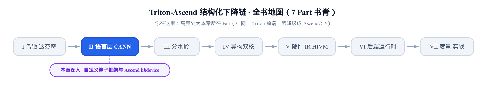
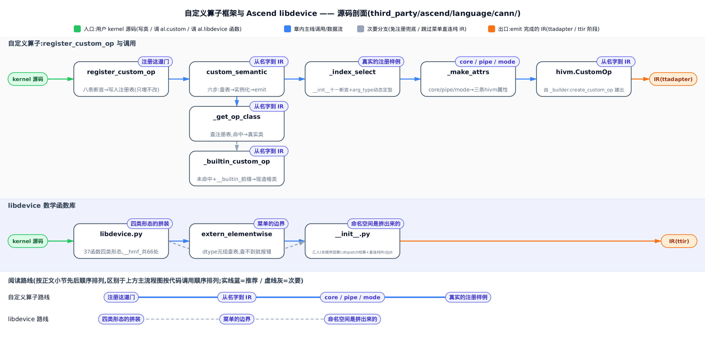
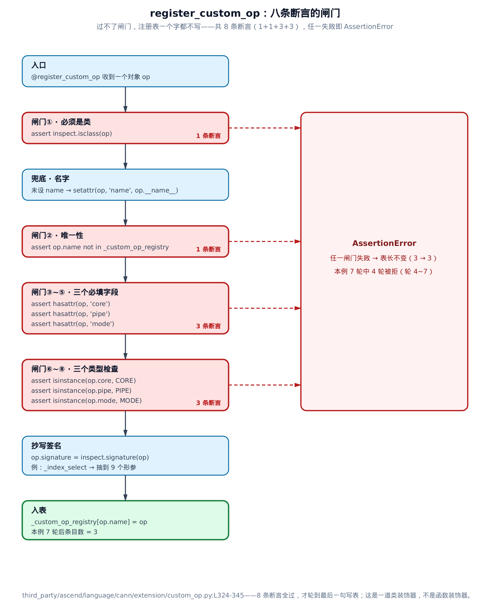
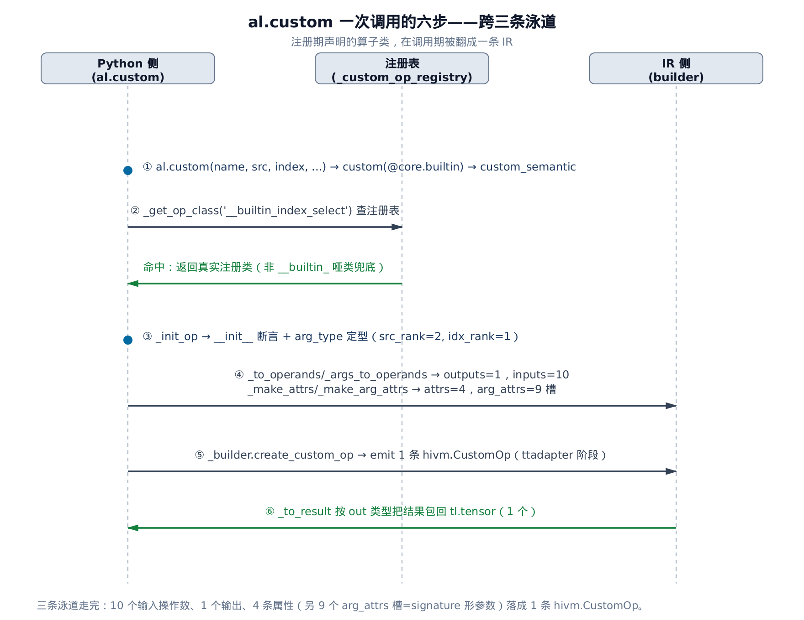
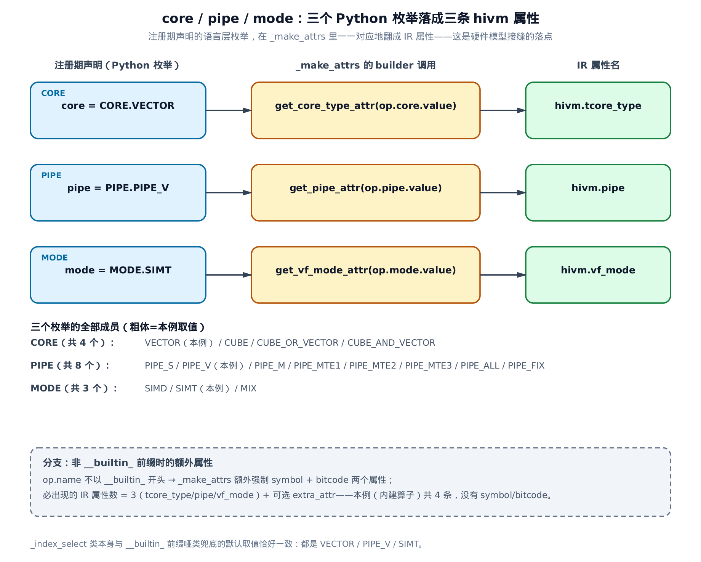
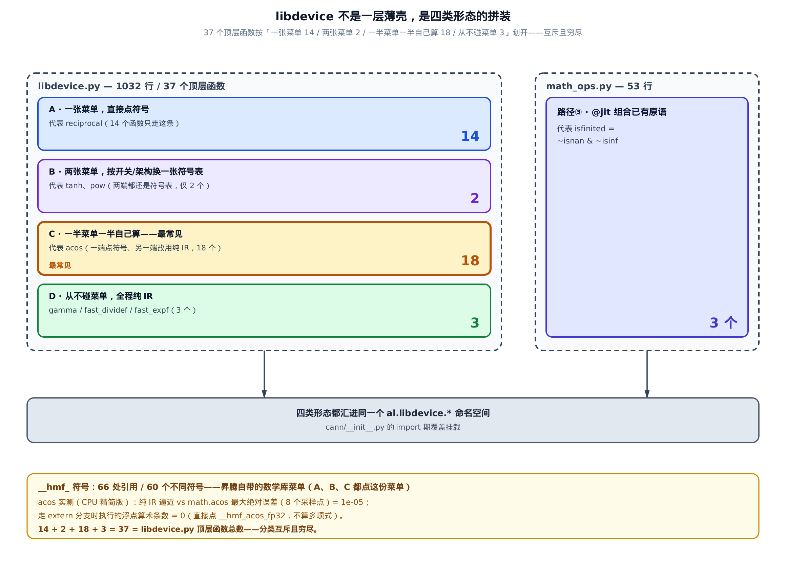

# 自定义算子框架与 Ascend libdevice——`register_custom_op` 与数学库



> **上一章**讲完昇腾自带的那批内建算子：索引搬运、向量算子、定制 cast。
> **本章**问一句更狠的：框架没给你的算子，你能不能自己往语言里加一个。
> **下一章**转向作用域与核间同步，讲多核怎么协同、流水线提示怎么下。

**姊妹篇约定**。这本书全程对照基座《Triton 源码解读》（读上游 Triton v3.2.0）。本章对位基座里讲[自举标准库、数学与随机数的那一章](../../../../triton/artifacts/ch09-self-hosted-libraries/narrative/chapter.md)——那里把数学函数讲成两条路：内建的直接 `create_*` 建原生 IR 节点，外部的经 `extern_elementwise` 按 dtype 查符号、链到 libdevice（设备侧数学函数库命名空间）。本章讲昇腾在这两条路之外**又加的一条**：不是「调一个已经存在的符号」，而是「往语言里注册一个新算子」。

先把差别摆清楚。基座的 `extern_elementwise` 是**点菜**：菜单在函数定义处就写死了，你端着 fp32 的盘子来，前台在菜单上找到 `__hmf_recipf` 这一行——`__hmf_` 是华为数学函数库（Huawei Math Function）的符号前缀，昇腾侧的硬件数学符号都叫这个名字——然后把这个符号名 emit 进 IR，仅此而已。菜单上没有的 dtype，点不到；菜单上没有的**函数**，更没法凭空长出来。

昇腾多出来的那件事叫 `register_custom_op`：你**自带菜谱**。写一个 Python 类，声明它跑在哪种核（cube 还是 vector）、占哪条流水线、以什么执行模式跑，再交一份预编译好的算子实现，框架就把它当成一条新的 IR 指令收下。这件事 GPU 侧的 Triton 不做——单核同构的 SIMT（单指令多线程，每个线程各算各的那种标量视角；本章第三节会看到它在昇腾这边是一个正式的枚举值）模型里不需要「这个算子该落在哪个核上」这种问题。而达芬奇是多核异构的，这个问题必须有人回答，于是它被提到了语言层。

这一章就顺着这两条线走：先把「注册」这道门从头拆到尾，再回头看昇腾的 libdevice 到底是怎么拼出来的——它比想象中厚得多。



只想弄清「自带菜谱」怎么注册进框架，读「注册这道门」「从名字到 IR」「`core`/`pipe`/`mode`」「一个真实的注册样例」这四节就够；只关心昇腾的数学库怎么拼、跟基座的点菜路线差在哪，直接跳「libdevice」「菜单的边界」「最后一层」三节；不挑读法，按顺序走下来，两条路线会在「小结」一节拧成同一句对照。

---

## 注册这道门：八条断言，一次抄写，一次入表

**直觉**。把它想成给社区活动室登记新器材。你交上来的必须是一整套器材（一个**类**，不是一个动作），登记表上不能重名，而且必须写清三件事：放哪个房间、占哪条走廊搬运、怎么使用。三样缺一样、或者写的不是登记处认的那种标签（比如你手写「大概是 SIMT 吧」而不是从登记处的标签册里挑一张），前台当场退回，登记表一个字不写。登记通过了，前台还会照着器材说明书把「需要哪些配件」抄一份存档，以后凭名字就能取用。

**源码**。整个注册表就是一个模块级的空字典，写在文件顶上：

```python
# third_party/ascend/language/cann/extension/custom_op.py:L33-L34
# Registry for custom op, mapping name to its configuration.
_custom_op_registry = {}
```

一个 `dict`，键是算子名，值是那个类。整套自定义算子框架的真相源就这么大。往里写的只有一个函数：

```python
# third_party/ascend/language/cann/extension/custom_op.py:L324-L345
def register_custom_op(op):
    """Register a custom operation so that we can invoke it using al.custom()."""
    assert inspect.isclass(op), "@register_custom_op should decorate on a class."
    # Use class name if name not set.
    if not hasattr(op, 'name'):
        setattr(op, 'name', op.__name__)
    # The op name should not be used.
    assert op.name not in _custom_op_registry, f"Custom op name '{op.name}' already used."

    # Check required core, pipe, mode fields.
    assert hasattr(op, 'core'), "'core' field is required."
    assert hasattr(op, 'pipe'), "'pipe' field is required."
    assert hasattr(op, 'mode'), "'mode' field is required."
    assert isinstance(op.core, core.CORE), "Invalid 'core' field, CORE type is required."
    assert isinstance(op.pipe, core.PIPE), "Invalid 'pipe' field, PIPE type is required."
    assert isinstance(op.mode, core.MODE), "Invalid 'mode' field, MODE type is required."
    # Retrieve arguments signature from __init__ method and save it.
    signature = inspect.signature(op)
    setattr(op, 'signature', signature)
    # Register the custom op configuration.
    _custom_op_registry[op.name] = op
    return op
```

一段一段读：

- **第一行断言就定了性**：`inspect.isclass(op)`——这是个**类装饰器**，不是函数装饰器。写 `@register_custom_op` 去修饰一个 `def`，第一道门就把你拦下。为什么必须是类？因为一个类能同时装下两样东西：静态配置（`name`/`core`/`pipe`/`mode` 这些类字段）和参数校验逻辑（`__init__` 里的一串断言）。函数装不下前者。
- **名字兜底**。没写 `name` 字段就用类名顶上（`op.__name__`）。所以一个最小的自定义算子类可以只写三个必填字段，名字随类名走。
- **唯一性闸门**。`op.name not in _custom_op_registry`——重名当场拒。注册表因此是只增的，一个名字一旦落表就永远指向同一个类。
- **三个必填字段，六条断言**。`core`/`pipe`/`mode` 先各查一次「有没有」（`hasattr`），再各查一次「是不是那个枚举类型」（`isinstance`）。注意第二组的严格：`mode = 'SIMT'` 这种裸字符串不认，必须是 `core.MODE.SIMT` 这个枚举成员本身。下一节会看到为什么——这三个值要被原样取 `.value` 塞进 IR 属性，字符串在那里没有意义。
- **抄写签名**。`inspect.signature(op)` 抽的是这个类 `__init__` 的形参列表（`inspect.signature` 作用在类上时，返回的正是构造签名），存回类上。这份签名是调用期把实参一个个对上号的依据——注册期抄一次，之后每次调用都用它。
- **入表并返回原类**。`return op` 意味着装饰器**不换壳**：被装饰的类还是它自己，你依旧可以正常继承、实例化。装饰器在这里纯粹是「登记」的语法糖。

八条断言横在写表语句前面，而写表是函数体最后一句。这个顺序是有意的。



**七轮登记看表长**。下面这张表是真跑出来的：从只装了随包自带算子的干净注册表开始，连交七样东西给 `@register_custom_op`，看每一轮表长怎么变。`_index_select` 是框架自带的内建算子，它在 `import` 期就被装饰器登记了，所以它是第一轮。

<!-- trace: m1 -->

| 轮次 | 交给 `@register_custom_op` 的东西 | 表长（前 → 后） | 校验结果 | 抽到的 `__init__` 形参数 |
|---|---|---|---|---|
| 1 | `class _index_select`（`import` 期，随包自带） | 0 → 1 | 通过，name = `'__builtin_index_select'` | 9 |
| 2 | `class Scale`（name/core/pipe/mode 四要素齐） | 1 → 2 | 通过，name = `'scale'` | 3 |
| 3 | `class Relu6`（没写 name 字段） | 2 → 3 | 通过，name 用类名兜底 = `'Relu6'` | 2 |
| 4 | `class Scale2`（name 又叫 `'scale'`） | 3 → 3 | 拒：Custom op name 'scale' already used. | 未抽取 |
| 5 | `class NoMode`（没有 mode 字段） | 3 → 3 | 拒：'mode' field is required. | 未抽取 |
| 6 | `class BadMode`（mode = `'SIMT'` 裸字符串） | 3 → 3 | 拒：Invalid 'mode' field, MODE type is required. | 未抽取 |
| 7 | `def not_a_class`（装饰的是函数） | 3 → 3 | 拒：@register_custom_op should decorate on a class. | 未抽取 |

轮 6 值得多看一眼：`mode` 字段**在**，值也「看起来对」，但类型不对，照样拒。这就是那三条 `isinstance` 断言的作用——它们防的不是马虎，是**默默写进 IR 的错误值**。

**不变量：注册表的键集合只增不改**。每次调用要么让表长恰好加一、且新键此前不存在，要么一个字都不写。论证很短：写表语句 `_custom_op_registry[op.name] = op` 是函数体最后一句，它前面横着八条断言，其中一条专门保证键是新的；Python 的 `assert` 一失败就抛异常、后面的语句根本不执行，所以任一条不满足时表长不变（轮 4 到轮 7 全是 3 → 3）。于是表长是个只增不减的非负整数，同一个名字一旦落表就终生指向同一个类。下一节的查表结果因此是**编译期稳定的**——这是整套框架敢把名字当唯一入口的底气。

成本也值得记一笔：注册期是常数量级的——八次 `hasattr`/`isinstance` 检查、一次 `inspect.signature`（与形参个数成线性，`_index_select` 是 9 个）、一次字典写入。全部发生在 `import` 期。kernel 编译期和执行期，这道门的开销是零。

---

## 从名字到 IR：`al.custom` 一次调用的六步

**直觉**。注册是把菜谱存进后厨的活页夹，`al.custom(name, ...)` 则是按菜名点单。前台凭名字翻出菜谱，照菜谱核对你带来的食材够不够、对不对，把食材摊平摆成一排，在单子上盖三个章说明这道菜在哪口锅、走哪条流水线、什么火候，最后把单子递进厨房——emit 出一条 IR 指令。

**源码**。用户在 kernel 里写的是 `al.custom(...)`，它是个薄得不能再薄的入口，真正的活在 `custom_semantic` 里：

```python
# third_party/ascend/language/cann/extension/custom_op.py:L294-L321
def custom_semantic(name: str, *args, _builder=None, **kwargs):
    name = _unwrap_constexpr(name)
    # Get op class according the name.
    op_class = _get_op_class(name)
    # Convert constexpr to value in arguments.
    args = _unwrap_constexpr(args)
    kwargs = _unwrap_constexpr(kwargs)
    # Create op instance from op class with the arguments.
    op = _init_op(op_class, *args, **kwargs)
    # Prepare inputs and outputs operands.
    out = kwargs.pop('out', [])
    outs = out if isinstance(out, (list, tuple)) else [out]
    outputs = _to_operands(outs, _builder)
    inputs = _args_to_operands(op, _builder, args, kwargs)
    # Setup attributes.
    attrs = _make_attrs(op, _builder)
    arg_attrs = _make_arg_attrs(op, _builder)
    # Build IR for the custom op.
    res = _builder.create_custom_op(name, attrs, inputs, outputs, arg_attrs)
    # Results with same types as outputs.
    res_types = [out.type for out in outs]
    return _to_result(res, res_types)


@core.builtin
def custom(name: str, *args, _builder=None, **kwargs):
    """Invoke a custom operation with the given name and arguments."""
    return custom_semantic(name, *args, _builder=_builder, **kwargs)
```

从下往上读更顺。`custom` 挂着 `@core.builtin`——[第 4 章](../../ch04-dual-builder-ascend-dispatch/narrative/chapter.md)讲过的那个昇腾侧内建标记（判定函数 `is_builtin` 认的就是它），前端遇到它会走昇腾那条分发路，并把 IR builder（`_builder`，负责往 IR 里写指令的那支笔）自动注入进来。所以 `custom` 唯一的工作就是把这支笔连同参数原样转给 `custom_semantic`。路由怎么走不是本章的事，那一章已经拆过。

`custom_semantic` 是六步：

1. **拆常量**。`_unwrap_constexpr` 把 `constexpr`（Triton 里表示编译期已知常量的包装类型）剥成裸 Python 值。名字本身通常就是个编译期字符串常量，先剥掉包装才能拿去查表。
2. **查表**。`_get_op_class(name)` 拿到算子类——下面单说。
3. **实例化**。`_init_op` 用实参真的构造一个算子实例出来。这一步会跑 `__init__`，也就是**跑那个类自己写的形状与 dtype 校验**。注册期只查了四要素，真正的参数合法性是在这里查的，而且用的是算子作者自己写的断言。
4. **摊成操作数**。`out` 从关键字参数里 `pop` 出来（可以是单个也可以是列表），转成输出操作数（operand，即 IR 指令的实参句柄）；其余实参按注册期抄下的签名逐个转成输入操作数。
5. **造属性**。`_make_attrs` 造整条指令级的属性，`_make_arg_attrs` 造每个参数各自的属性（比如对齐维度）。
6. **emit**。`_builder.create_custom_op(...)` 建出一条 `hivm.CustomOp`——`hivm` 是昇腾硬件 IR 方言的前缀，讲双 builder 的那一章建立过；这条指令落在 ttadapter 阶段的 IR 里。最后 `_to_result` 按 `out` 的类型把结果包回张量。

查表那一步的分野是这套框架的第二个设计决策：

```python
# third_party/ascend/language/cann/extension/custom_op.py:L37-L51
def _get_op_class(name):
    # Try to get op class in _custom_op_registry.
    op_class = _custom_op_registry.get(name)
    if op_class is None:
        # Allow bulitin custom ops used without registry.
        assert name.startswith('__builtin_'), f"Custom Op '{name}' not registered."
        # Return a dummy op class for builtin custom op.
        op_class = type("_builtin_custom_op", (object, ), {
            "name": name,
            "core": core.CORE.VECTOR,
            "pipe": core.PIPE.PIPE_V,
            "mode": core.MODE.SIMT,
            "signature": inspect.signature(object),
        })
    return op_class
```

查不到时不是直接报错，而是先看名字前缀。`__builtin_` 开头的，框架现造一个哑类顶上——名字照抄，三要素给一组默认值（VECTOR / PIPE_V / SIMT），签名给一个空的。别的名字，一律 `not registered` 拒掉。

**直觉**。这个前缀相当于一张免检通行证：谁的名字以它开头，谁就不必在登记处排队。框架内建的那批算子有现成的 IR 模板实现，不需要用户交任何外部产物，于是用命名前缀把它们和「用户自己写的、要带实现文件的算子」划开。这道分野在下一节的 `_make_attrs` 里还会再出现一次。

**一次调用的六步实测**。用框架自带的 `__builtin_index_select` 走一遍，参数刻意选到最小：二维的源、四个索引，操作数个数可以心算。

<!-- trace: m2 -->

| 步 | 动作 | 关键标量 | 产出 |
|---|---|---|---|
| 1 | `_get_op_class('__builtin_index_select')` | 注册表 1 项，命中 | 拿到真实注册类（不是 `__builtin_` 哑类兜底） |
| 2 | `_init_op` → `__init__` 断言 + `arg_type` 定型 | src_rank=2, idx_rank=1 | 11 条 assert 全过（另 3 次 `_assert_int_like_tuple`）；3 个参数被重定型为 index.dtype=int32；extra_attr=`'src_stride_len=2'` |
| 3 | `_to_operands(out)` → outputs | len(outputs)=1 | 1 个输出操作数（out 张量 handle 直接透传） |
| 4 | `_args_to_operands(args/kwargs)` → inputs | len(inputs)=10 | 2 个张量 + dim/bound 2 个标量 + 3 个二元组摊平共 6 个 = 10；other=None 被跳过 |
| 5 | `_make_attrs` / `_make_arg_attrs` | len(attrs)=4, len(arg_attrs)=9 | hivm.tcore_type/hivm.pipe/hivm.vf_mode + extra_attr；`__builtin_` 前缀免 symbol/bitcode |
| 6 | `_builder.create_custom_op` → `_to_result` | 1 次调用，1 个结果 | emit 一条 `hivm.CustomOp`（ttadapter 阶段 IR），结果张量类型与 out 一致（fp32） |

这些数字跑在本章的可运行精简版上（宿主没有昇腾 NPU 与 CANN 工具链，IR builder 由一层只记录「被调用了什么」的替身站位），所以它们说的是「哪个属性被建了、哪个符号被点了」，不是真机上的数值。



有两处数字值得盯住。

第一，**操作数 10 个，签名形参 9 个，两者不等**。因为 `arg_attrs` 是按形参数分配的（9 个槽），而操作数按**摊平后的值个数**走：三个二元组各摊成两个，六个值顶三个形参（具体是哪三个形参，下一节看 `_index_select` 的 `__init__` 签名时会点名——`end_offset`/`start_offset`/`src_stride`）。元组参数一摊，两个计数就解耦了。

第二处在输出侧。**不变量：结果个数恒等于 `out` 的个数**，而且整条数据流对每个非 `None` 的实参恰好产出一个操作数，因此必然终止。`_to_result` 开头就断言结果个数与类型个数相等，而类型列表是 `[out.type for out in outs]`、结果是 builder 按 `outputs` 建出来的——三者同源于同一个 `outs` 列表，本例 1 对 1 对 1。至于终止性：第 4 步遍历的是注册期就固定下来的有限形参序列，元组再展开也只是有限次内层循环，无回退无递归。

成本同样只在编译期：一次字典查表、一次 `__init__`（本例 11 条断言）、10 次装箱、4 个属性对象、9 个参数属性槽、一次 emit。跟张量里有多少个元素（这里索引长 4）完全无关。运行期只剩那一条 `hivm.CustomOp`。

---

## `core` / `pipe` / `mode`：三个 Python 枚举落成三条 IR 属性

**直觉**。注册期填的那三个字段不是装饰性的元数据，它们是三条 IR 属性的**唯一来源**。填错了，算子会被安排到错误的核上去跑。

**源码**。先看这三个枚举本身：

```python
# third_party/ascend/language/cann/extension/core.py:L104-L126
class CORE(enum.Enum):
    VECTOR = ascend_ir.CoreType.VECTOR
    CUBE = ascend_ir.CoreType.CUBE
    CUBE_OR_VECTOR = ascend_ir.CoreType.CUBE_OR_VECTOR
    CUBE_AND_VECTOR = ascend_ir.CoreType.CUBE_AND_VECTOR


class PIPE(enum.Enum):
    PIPE_S = ascend_ir.PIPE.PIPE_S
    PIPE_V = ascend_ir.PIPE.PIPE_V
    PIPE_M = ascend_ir.PIPE.PIPE_M
    PIPE_MTE1 = ascend_ir.PIPE.PIPE_MTE1
    PIPE_MTE2 = ascend_ir.PIPE.PIPE_MTE2
    PIPE_MTE3 = ascend_ir.PIPE.PIPE_MTE3
    PIPE_ALL = ascend_ir.PIPE.PIPE_ALL
    PIPE_FIX = ascend_ir.PIPE.PIPE_FIX


class MODE(enum.Enum):
    SIMD = ascend_ir.MODE.SIMD
    SIMT = ascend_ir.MODE.SIMT
    MIX = ascend_ir.MODE.MIX
```

三个枚举的值全都不是 Python 常量，而是 `ascend_ir` 这个 C++ 绑定模块里的枚举成员——也就是说，Python 侧的 `CORE.VECTOR` 和 IR 侧的核类型是**同一个对象**，中间没有翻译层，只有一次取 `.value`。`CORE` 四个成员对应[第 2 章](../../ch02-davinci-npu-hardware-model/narrative/chapter.md)讲的达芬奇 cube/vector 双核（cube 做矩阵、vector 做逐元素）。`MODE` 三个成员是执行模式：SIMT（单指令多线程，每个线程各算各的那种标量视角）、SIMD（单指令多数据，一条指令铺一整排数据）、MIX（两者混合）。

再看它们怎么变成属性：

```python
# third_party/ascend/language/cann/extension/custom_op.py:L245-L271
def _make_attrs(op, builder):
    attrs = {
        'hivm.tcore_type': builder.get_core_type_attr(op.core.value),
        'hivm.pipe': builder.get_pipe_attr(op.pipe.value),
        'hivm.vf_mode': builder.get_vf_mode_attr(op.mode.value),
    }

    if not op.name.startswith('__builtin_'):
        assert hasattr(op, 'symbol'), f"Non builtin custom op, symbol is required."
        assert hasattr(op, 'bitcode'), f"Non builtin custom op, bitcode path is required."

    # Add bit code path attribute, formalize to abosulte path.
    _add_bitcode_attr(op, builder, attrs)


    _add_optional_indexing_map_attr(op, builder, attrs)
    _add_optional_iterator_types_attr(op, builder, attrs)

    _add_optional_extra_buffer_attr(op, builder, attrs)

    _add_optional_attr(op, 'symbol', builder, attrs)
    _add_optional_attr(op, 'source', builder, attrs)
    _add_optional_attr(op, 'compile', builder, attrs)
    # Extra attributes can be added here, such as op.extra_attr="attr_a=xx"
    _add_optional_attr(op, 'extra_attr', builder, attrs)

    return attrs
```

函数体的第一个语句就是全章最该记住的三行：`op.core.value` 变成 `hivm.tcore_type`，`op.pipe.value` 变成 `hivm.pipe`，`op.mode.value` 变成 `hivm.vf_mode`。一一对应，没有任何条件分支。这三条属性是**必出现**的，因为它们在字典字面量里，不在任何 `if` 下面。



紧接着是 `__builtin_` 分野的另一半：**非内建算子必须交出 `symbol` 和 `bitcode` 两样东西**。`symbol` 是算子实现的符号名，`bitcode` 是一份预编译好的 LLVM bitcode 文件路径——你自带的「菜谱」实体就是它。内建算子豁免（框架自己有 IR 模板），这就是为什么上一节表里 `_index_select` 的属性只有 4 条、没有 symbol 和 bitcode。

后面那一串 `_add_optional_*` 都是可选属性的挂载点，其中两个名字值得先认一下，虽然本章不展开：`indexing_map` 是一组 MLIR 仿射映射（AffineMap），描述算子各操作数怎么被访问和迭代；`iterator_types` 与它配套，说明每一维是并行还是别的什么。它们和 `bitcode` 一样，本章只讲「这些参数存在、如何被挂成 IR 属性」这一层表面——它们的下降语义、`hivm.CustomOp` 在编译 pass 里怎么被 lowering，是后端那一部分的事。

**一处诚实的空白**。`CORE.CUBE_OR_VECTOR` 与 `CUBE_AND_VECTOR` 的确切调度语义（是「二选一」还是「同时占用」），在本章涉及的 Python 源码与枚举定义里**没有说明**——能看到的只是它们被原样翻成属性值。同理，八个 `PIPE_*` 各自绑到达芬奇哪条流水线单元、`MODE` 的三个取值对算子内部代码生成有什么影响，也都不在本章源码范围内。这些答案在 hivm 方言的下降语义里，本书后面讲后端时才有源码可依。这里不猜。

---

## 一个真实的注册样例：`_index_select`

框架自带四个 `__builtin_` 内建算子，都是用 `@register_custom_op` 注册的。挑最有代表性的 `_index_select` 看——它按索引从源张量里取行：

```python
# third_party/ascend/language/cann/extension/builtin_custom_ops.py:L74-L103
    name = '__builtin_index_select'
    core = CORE.VECTOR
    pipe = PIPE.PIPE_V
    mode = MODE.SIMT

    def __init__(self, src, index, dim, bound: tl.int64, end_offset, start_offset, src_stride, other=None, out=None):
        assert src.type.is_ptr() or src.dtype.is_ptr(), f"src should be a pointer, but got {src.type}"
        assert index.dtype.is_int(), "index should be integer tensor"
        src_rank = len(src_stride)
        idx_rank = len(index.shape)
        assert 2 <= src_rank <= 5, f"src rank should in [2, 5], but got {src_rank}"
        assert 1 <= idx_rank <= 2, f"index rank should in [1, 2], but got {idx_rank}"
        assert _is_int_like_elem(dim), "dim should be an integer"
        assert _is_int_like_elem(bound), "bound should be an integer"
        assert 0 <= dim < src_rank, f"dim should in [0, {src_rank - 1}], but got {dim}"
        assert len(start_offset) == len(src_stride), "start_offset and src_stride should have same size"
        assert len(end_offset) == idx_rank + len(start_offset) - 1, "len(end_offset) should be equal to index rank + len(start_offset) - 1"

        _assert_int_like_tuple("end_offset", end_offset)
        _assert_int_like_tuple("start_offset", start_offset)
        _assert_int_like_tuple("src_stride", src_stride)

        assert out, "out is required"
        assert out.dtype == src.dtype.element_ty, "out should have same dtype as src"

        # use index type for end_offset, start_offset and src_stride.
        self.arg_type['end_offset'] = index.dtype
        self.arg_type['start_offset'] = index.dtype
        self.arg_type['src_stride'] = index.dtype
        self.extra_attr = f"src_stride_len={len(src_stride)}"
```

（类头上的 `@register_custom_op` 装饰器与说明各维度语义的 docstring 在这四行字段之前，此处略去。）

**类字段就是注册表要的四要素**：名字带 `__builtin_` 前缀，核选 VECTOR、流水线选 PIPE_V、模式选 SIMT——按索引取行是典型的逐元素、离散访存的活儿，交给 vector 核用标量线程视角做，符合直觉。这个算子的说明里写着源张量在 GM（片外全局内存）、输出在 UB（片上统一缓冲），和[第 5 章](../../ch05-explicit-memory-hierarchy/narrative/chapter.md)的口径一致：源是以**指针**形式进来的（第一条断言就在查 `is_ptr()`），不是一块带地址空间标签的 buffer——GM 那一档本来就没进 Python，语言层写不出 `space=GM` 的缓冲。

**`__init__` 是这个算子自己的门卫**。十一条断言，查的都是注册期查不了的东西：源必须是指针、索引必须是整型张量、源的秩在 2 到 5 之间、索引的秩在 1 到 2 之间、`dim` 在合法范围内、几个元组长度互相自洽、输出必须给且 dtype 与源一致。夹在中间的三次 `_assert_int_like_tuple` 是对元组**元素**的补充检查：前面几条只量了元组的长度，这三条逐个查里面的值是不是整数或整型 `constexpr`——上一节实测表里第 2 步记的「另 3 次 `_assert_int_like_tuple`」就是它们。这是自定义算子框架的一个漂亮之处——**校验逻辑跟着算子走**，框架不需要知道任何一个具体算子该怎么查参数。

最后四行是本节的重点：**动态定型**。

**直觉**。同一张点菜单上写着「要三份配料」，但配料按几两算，得看你今天带来的主料：`self.arg_type['end_offset'] = index.dtype` 就是「按主料改秤」。索引张量是 int32，三样配料就按 int32 秤；索引换成 int64，三样自动跟着换。

为什么需要这个？因为 Python 的 `int` 传到设备侧默认降成 int32。偏移量、步长这类参数如果必须和索引张量同宽，就得有办法在**运行时看到实参之后**再决定类型。`arg_type` 这个实例字典就是这个后门。另外两种定型来源是静态的：签名上的类型标注（看 `bound: tl.int64` 那个形参）和调用点手动套的 `al.int64(x)` 逃生口——后者是昇腾侧提供的一个 `int` 子类，唯一作用就是给这个值别上一张「我是 int64」的标签。

两轮实测，唯一的变量是索引张量的 dtype：

<!-- trace: m7 -->

| 轮次 | index 张量 dtype | 形参 | 类型从哪来 | 解析出的类型 |
|---|---|---|---|---|
| 1 | int32 | dim（传 0） | 都没有 → 回落到值自身/Python 默认 | 无（默认 int32） |
| 1 | int32 | bound（传 al.int64(8)） | 签名 type-hint `bound: tl.int64`；值自身也带 .type=int64 | int64 |
| 1 | int32 | end_offset（传 (4, 4)） | self.arg_type ← `__init__` 里赋成 index.dtype | int32 |
| 1 | int32 | src_stride（传 (1, 1)） | self.arg_type ← `__init__` 里赋成 index.dtype | int32 |
| 2 | int64 | end_offset（传 (4, 4)） | self.arg_type ← `__init__` 里赋成 index.dtype | int64 |
| 2 | int64 | src_stride（传 (1, 1)） | self.arg_type ← `__init__` 里赋成 index.dtype | int64 |
| 2 | int64 | bound（传 al.int64(8)） | 签名 type-hint，不随 index 变 | int64 |

这张表观测的是「类型是怎么被解析出来的」，不是最终 IR 句柄的位宽——本章精简版按批准的减法，把「按位宽逐条挑 builder 工厂方法」的那组同构分支（真实源码里整数一侧 `get_int64`/`get_uint64`/`get_int32`/… 八条、浮点一侧 `get_fp64`/`get_fp32`/`get_fp16`/`get_bf16` 四条，共十二条）删到只剩 `get_int32`/`get_fp32` 两条默认路径，所以在精简版里 int64 不会真的换出对应那条调用；而类型解析那一句本身是原样保留的，正是这张表的观测对象。

**不变量：每个形参的类型由一条严格有序的优先链唯一确定**——先看 `self.arg_type[name]`，没有再看形参标注，再没有才问值自身的 `.type`，最后才落到 Python 类型默认。前两级来自一行代码（字典命中就用它，否则退到标注），第三级只在前两级都没给出时才去问值自身（`al.int64` 的类型就在这里生效）。四级两两互斥、顺序固定。而且不跨调用污染：实例化前会先把 `arg_type` 置成一个新的空字典，它是**实例**属性——轮 2 的 int64 定型不会回头改写轮 1 那个实例。

九个形参里，三个由 `arg_type` 动态定型、一个由签名标注定成 int64、一个因为是 `None` 被整个跳过。两轮之间跟着变的恰好是那三个，操作数总数不变（都是 10）——**定型只改类型，不改数据流形状**。

---

## libdevice：一层薄壳？四类形态的拼装

讲完「注册」这条昇腾独有的路，回头看昇腾怎么补齐数学函数。这里有个容易上当的直觉：libdevice 听起来像是一层薄薄的转发壳，把每个函数名映射到一个硬件符号就完事。

打开 `libdevice.py` 看规模就知道不是——1032 行，37 个顶层函数，`__hmf_` 符号出现 66 处、去重后 60 个不同符号。把这 37 个函数逐个数一遍，它们落在四类**互斥且穷尽**的形态里：**一张菜单**（不分流，直接点符号）14 个、**两张菜单**（按开关换一张符号表，两端都还是符号）2 个、**一半菜单一半自己算**（一端点符号、另一端改用纯 IR）18 个、**从不碰菜单**（全程纯 IR，函数体里根本没有 `__hmf_`）3 个。数量最大的是第三类——这也是最值得看的一类。



**第一类：一张菜单，直接点 `__hmf_` 符号**。最简的样子长这样：

```python
# third_party/ascend/language/cann/libdevice.py:L28-L34
@core.extern
def reciprocal(arg0, _builder=None):
    return core.extern_elementwise(
        "", "", [arg0], {
            (core.dtype("fp32"),): ("__hmf_recipf", core.dtype("fp32")),
            (core.dtype("fp16"),): ("__hmf_recipDh", core.dtype("fp16")),
        }, is_pure=True, _builder=_builder)
```

函数体就是一张字典：输入 dtype 元组映射到「符号名 + 返回 dtype」。`@core.extern` 是基座的装饰器（和 `@core.builtin` 一样会注入 `_builder`），`extern_elementwise` 是基座的下降入口——**整条路完全复用基座**，昇腾出的只是这张符号表。这一类共 14 个（`reciprocal`/`log1p`/`relu`/`isinf`/`tan`/`atan`/`ilogb`/`ldexp`/`isnan`/`div_rz`/`fmod`/`float_as_int`/`atan2`/`round`）。注意符号命名的规律：`f` 后缀是 fp32 版，`Dh` 后缀是 fp16 版。

**第二类：两张菜单，按开关和架构换一张**。同一个函数，在不同编译目标下点不同的符号：

```python
# third_party/ascend/language/cann/libdevice.py:L81-L93
@core.extern
def tanh(arg0, _builder=None):
    if triton_enable_libdevice_simt() and is_compile_on_910_95:
        return core.extern_elementwise(
            "", "", [arg0], {
                (core.dtype("fp32"), ): ("__hmf_tanh_fp32", core.dtype("fp32")),
            }, is_pure=True, _builder=_builder)
    else:
        return core.extern_elementwise(
            "", "", [arg0], {
                (core.dtype("fp32"), ): ("__hmf_tanhf", core.dtype("fp32")),
                (core.dtype("fp16"), ): ("__hmf_tanhDh", core.dtype("fp16")),
            }, is_pure=True, _builder=_builder)
```

两个条件：`triton_enable_libdevice_simt()` 读的是一个环境开关（是否启用 SIMT 版 libdevice），`is_compile_on_910_95` 是编译目标芯片型号的判定。两者同时成立时走上面那张只有一行的菜单——符号名换成了 `__hmf_tanh_fp32` 这种带显式位宽的新命名，而且 **fp16 那一行没有了**。要紧的是：这个 `if` 的两端**都还是符号表**，换的只是菜名与可点的 dtype。全文件里这样两端都落回菜单的只有 **2 个**——`tanh` 和 `pow`。

**第三类：一半菜单一半自己算——数量最大的一类**。分流的另一头未必是另一张菜单，更常见的是根本不点符号、改用纯 IR 把函数算出来。这一类有 **18 个**（`acos`/`trunc`/`sinh`/`cosh`/`acosh`/`asinh`/`atanh`/`expm1`/`nextafter`/`hypot`/`cyl_bessel_i0`/`signbit`/`erfinv`/`lgamma`/`nearbyint`/`asin`/`log10`/`copysign`），占了全文件近一半。`acos` 是最好的例子：

```python
# third_party/ascend/language/cann/libdevice.py:L215-L273
@core.builtin
@math._check_dtype(dtypes=["bf16", "fp16", "fp32"])
@math._add_math_1arg_docstr("acos")
def acos(arg0: core.tensor, _builder: ir.builder):
    if triton_enable_libdevice_simt() and is_compile_on_910_95:
        # … 省略：bf16 在这条分支上静态报错的两行 …
        return core.extern_elementwise(
            "", "", [arg0], {
                (core.dtype("fp16"),): ("__hmf_acos_fp16", core.dtype("fp16")),
                (core.dtype("fp32"),): ("__hmf_acos_fp32", core.dtype("fp32")),
            }, is_pure=True, _builder=_builder)
    else:
        pi = 3.1415926536
        pi_half = 1.5707963268
        # … 省略：sqrt2 / eps 两个常量 …

        # |x| < 0.5, acos(x) = pi/2 - [x + x*x²*(0.1666667 + x²*(0.075 + x²*(0.0446429 + 0.0303810*x²))]
        arg0 = semantic.to_tensor(arg0, _builder)
        abs_x = math.abs(arg0, _builder=_builder)
        arg0_2 = semantic.mul(arg0, arg0, True, _builder)
        arg0_4 = semantic.mul(arg0_2, arg0_2, True, _builder)
        # … 省略：arg0_6 / arg0_8 / arg0_10 同构地各再乘一次 …
        poly = semantic.add(1.0, semantic.mul(0.166667, arg0_2, True, _builder), True, _builder)
        poly = semantic.add(poly, semantic.mul(0.075, arg0_4, True, _builder), True, _builder)
        # … 省略：0.044643 / 0.030380 / 0.022372 三项同构累加 …
        acos_center = semantic.sub(pi_half, semantic.mul(arg0, poly, True, _builder), True, _builder)

        # 0.5<|x|<0.9, acos(x) = 2*arctan(t), t=sqrt((1-abs_x)/(1+abs_x))
        numerator_mid = semantic.sub(1.0, abs_x, True, _builder)
        denom_mid = semantic.add(1.0, abs_x, True, _builder)
        div_mid = semantic.truediv(numerator_mid, denom_mid, _builder)
        t_mid = math.sqrt(div_mid, _builder=_builder)
        # … 省略：t 的偶次幂，与 Horner 形式的 arctan 多项式（四个系数）算出 arctan_t …
        acos_mid = semantic.mul(2.0, arctan_t, True, _builder)
        is_neg_mid = semantic.less_than(arg0, 0.0, _builder)
        acos_mid_signed = semantic.where(is_neg_mid, semantic.sub(pi, acos_mid, True, _builder), acos_mid, _builder)

        is_center = semantic.less_than(abs_x, 0.6, _builder)
        res_mid_boundary = semantic.where(is_center, acos_center, acos_mid_signed, _builder)
        return res_mid_boundary
```

`else` 分支里没有任何 `__hmf_` 符号——全是 `semantic.mul` / `semantic.add` / `semantic.where`，也就是**基座的算术原语一条条建出来的 IR**（ttir 阶段）。它把定义域切成两半：绝对值小的一半用一条奇次多项式直接逼近，绝对值大的一半换元成 `t = sqrt((1-|x|)/(1+|x|))` 再用 arctan 的多项式，最后一句 `where` 把两半按条件选出来。负半轴靠 `pi - acos(|x|)` 补齐。

注意代码注释里写的分界是 0.5 和 0.9，而真正判定的那一句 `is_center` 用的是 0.6——**以代码为准**。

这条路好不好？本章的精简版把这段多项式在 CPU 上真的跑了一遍（多项式逼近本身是纯数学，不依赖昇腾硬件），八个采样点跨两个子分支，与 Python 标准库 `math.acos` 的最大绝对误差是 1e-05。而走 extern 那一支时，浮点算术执行了 0 条——直接点 `__hmf_acos_fp32`，一步到位。这就是两条路的取舍：有硬件符号时零算术、最快最准；没有时用几十条 IR 指令换一个可用的近似。

**第四类：从不碰菜单**。还有 3 个函数（`fast_dividef`、`fast_expf`、`gamma`）连 `if` 都没有——函数体里从头到尾不出现 `__hmf_`，全程纯 IR：

```python
# third_party/ascend/language/cann/libdevice.py:L143-L148
@core.builtin
def fast_dividef(arg0, arg1, _builder=None):
    arg0 = semantic.to_tensor(arg0, _builder)
    arg1 = semantic.to_tensor(arg1, _builder)
    ret = semantic.fdiv(arg0, arg1, False, _builder)
    return ret
```

`fast_dividef` 短到只是给基座的浮点除法换个名字；另一头的 `gamma` 是全文件最长的函数之一，用 Lanczos 系数把 Γ 函数硬算出来，同样一个符号都不点。它们和第三类的区别只在**有没有那个 `if`**：第三类在有硬件符号可用时会切回去，这 3 个永远不会。

**另册：用语言本身把函数拼出来**。还有一批函数根本不在 `libdevice.py` 里，而在一个只有 53 行的薄文件 `math_ops.py` 中，一共三个：

```python
# third_party/ascend/language/cann/extension/math_ops.py:L32-L42
@core._tensor_member_fn
@jit
@math._add_math_1arg_docstr("isfinited")
def isfinited(x):
    _is_int8_type: core.constexpr = x.dtype.is_int8()
    core.static_assert(not _is_int8_type, f"Expected dtype fp16/fp32/bf16, but got int8 or int1")
    _is_floating_type: core.constexpr = x.dtype.is_floating()
    core.static_assert(_is_floating_type == True, f"Expected dtype fp16/fp32/bf16, but got {core.constexpr(x.dtype)}")
    nan_mask = isnan(x)
    inf_mask = isinf(x)
    return (~nan_mask & ~inf_mask).to(int1)
```

它既不点符号也不亲手建 IR，而是挂 `@jit`——就是普通用户写 kernel 用的那个装饰器。函数体是**一段普通的 Triton 代码**：查两个静态断言（`static_assert` 在编译期查 dtype，不产生运行期开销），然后 `~isnan & ~isinf`。`_tensor_member_fn` 让它同时能写成 `x.isfinited()` 的方法形式。

这一册的性质和前四类不同：前四类要么往 IR 里放一个外部调用节点、要么亲手建算术节点，这一册是「用语言自己把函数拼出来」——和基座那本书里讲的自举标准库是同一个思路。

`libdevice.py` 那四类加起来正好穷尽：14 + 2 + 18 + 3 = 37，就是它的顶层函数总数；`math_ops.py` 的 3 个另算。

---

## 菜单的边界：`extern_elementwise` 只能查，不能加

上一节的前三类——一张菜单、两张菜单、以及分流时点符号的那一半——最后都落到同一个基座函数上。它是本章「点菜 vs 自带菜谱」这个对比的落点，值得单独看一眼它的**核心那几行**：

```python
# python/triton/language/core.py:L2647-L2687
def dispatch(func, lib_name: str, lib_path: str, args: list, arg_type_symbol_dict: dict, ret_shape: tuple,
             is_pure: bool, _builder=None):
    # … 省略：docstring，以及空字典与参数个数的两处前置校验 …
    arg_types = []
    arg_list = []
    for arg in args:
        if isinstance(arg, tensor):
            arg_types.append(arg.dtype)
            arg_list.append(arg.handle)
        else:
            arg_types.append(type(arg))
            arg_list.append(arg)
    arg_types = tuple(arg_types)

    if arg_types not in arg_type_symbol_dict:
        raise ValueError(f"input arg type does not match."
                         f"Expect one of {arg_type_symbol_dict.keys()}, got {arg_types}")
    else:
        symbol = arg_type_symbol_dict[arg_types][0]
        ret_type = arg_type_symbol_dict[arg_types][1]
        # … 省略：ret_shape 非空时把返回类型包成块类型 …
        return tensor(func(lib_name, lib_path, symbol, arg_list, ret_type.to_ir(_builder), is_pure), ret_type)
```

（`extern_elementwise` 本体在 `python/triton/language/core.py:L2690-L2730`，它先做广播与类型对齐，再把活交给上面这个 `dispatch`。）

主干只有两句：把实参的 dtype 拼成一个元组，拿它去查那张字典。查不到，`raise`；查到了，取出符号名，`func`——也就是 `_builder.create_extern_elementwise`——把它 emit 成一条 ttir 阶段的外部调用节点。

**直觉**。这就是点菜：菜单在函数定义处写死，你端着什么 dtype 的盘子来，前台就在菜单上找对应那一行。菜单上没有你这种盘子，点不到菜、当场报错。而同一道菜在不同厨房还可能有不同菜单——开了 SIMT 且编译目标是 910_95，`tanh` 的菜单只剩 fp32 一行。

七轮实测，把两个函数、三种 dtype、两组开关配置排列出来：

<!-- trace: m6 -->

| 轮次 | 调用 | 编译期开关 | 入参 dtype | 命中的符号 | 返回 dtype |
|---|---|---|---|---|---|
| 1 | libdevice.reciprocal(x) | simt=False | fp32 | `__hmf_recipf` | fp32 |
| 2 | libdevice.reciprocal(x) | simt=False | fp16 | `__hmf_recipDh` | fp16 |
| 3 | libdevice.reciprocal(x) | simt=False | bf16 | 菜单里没有 → 报错（no symbol registered） | 无 |
| 4 | libdevice.tanh(x) | simt=False, 910_95=False | fp32 | `__hmf_tanhf` | fp32 |
| 5 | libdevice.tanh(x) | simt=False, 910_95=False | fp16 | `__hmf_tanhDh` | fp16 |
| 6 | libdevice.tanh(x) | simt=True, 910_95=True | fp32 | `__hmf_tanh_fp32` | fp32 |
| 7 | libdevice.tanh(x) | simt=True, 910_95=True | fp16 | 换了菜单后没有 fp16 这一行 → 报错 | 无 |

轮 3 和轮 7 的「报错」需要一句就近说明：这两行跑的是本章精简版，它按批准的减法只留了「精确 dtype 元组查表」这条主干，查不到时抛的是 `KeyError`；上面内嵌的真实源码抛的是 `ValueError`，而且多参数场景下还会先做隐式广播与算术类型提升再查表。**异常类型以真实源码为准**——表里这两行要说的是同一件事：菜单外的 dtype 点不到菜。

**不变量：能引用的符号集合恒等于定义处那张静态菜单的值域**。这是个偏函数——只有落在菜单键集里的 dtype 元组才有像，而且这个像集在调用期**不可扩充**。论证只需两点：那张字典是写死在函数体里的字面量，每次调用重新构造、内容恒定，没有任何代码路径往里插新键；而取符号的唯一出口就是那次字典下标，前面一句 `if ... not in ...: raise` 把出界的挡掉了。

于是本章开头那句对比可以说得精确了：`register_custom_op` 往注册表里**新增**条目（第一节的表长 1 → 2 → 3），`extern_elementwise` 只能在既有菜单里**查**。差别不是常数因子，是**闭集与开集**的差别。66 处 `__hmf_` 引用是一份固定长度的菜单；而昇腾侧能注册多少个自定义算子，没有这个上界。

---

## 最后一层：`al.libdevice` 这个命名空间是拼出来的

还剩一个小疑问没解决：既然这些实现分散在两个文件里，用户为什么统一写 `al.libdevice.` 加函数名就能调到？而且——`al.libdevice.exp` 又是从哪来的？`libdevice.py` 里根本没有 `exp` 这个函数。

**直觉**。`al.libdevice` 不是某一个文件，而是一块公告栏：`import` 期各家把自己那份实现往同一块板上贴，后贴的盖住先贴的。答案就在包的 `__init__.py`，全在 `import` 期完成：

```python
# third_party/ascend/language/cann/__init__.py:L27-L52
extension.parallel = extension.aux_ops.parallel
if not triton_enable_libdevice_simt():
    libdevice.atan2 = extension.math_ops.atan2
libdevice.isfinited = extension.math_ops.isfinited
libdevice.finitef = extension.math_ops.finitef
libdevice.flip = extension.flip

libdevice.umulhi = math.umulhi
libdevice.exp = math.exp
# … 省略：exp2/log/log2/cos/sin/sqrt_rn/rsqrt/div_rn/erf/floor/ceil/fdiv/fma 等同构的复用赋值 …
libdevice.sqrt = math.sqrt
libdevice.abs = math.abs

__all__ = ["libdevice", "extension"]
```

这是一段**模块属性赋值**，不是定义。两类动作：

- **覆盖**。`isfinited`/`finitef`/`flip` 无条件覆盖上去——它们是昇腾自己的实现（前两个就是上一节「另册」里的那种 `@jit` 函数）。`atan2` 是**条件覆盖**：只有 SIMT 版 libdevice 没开时才换成昇腾版，开了就保留 `libdevice.py` 里那个走 extern 的版本。这个开关在 `import` 期读一次即定，之后整个进程内不可变。
- **复用**。`exp`/`log`/`sin`/`cos`/`sqrt`/`abs` 这一批共 17 行，直接把基座 `triton.language.math` 的同名函数**原样借过来**。所以 `al.libdevice.exp` 和基座的 `tl.math.exp` 是同一个对象——昇腾对它没有任何差异实现，就不重复写一遍。

这个手法很省事：一个命名空间，四类形态加一册 `@jit` 组合、再加一批基座复用，全靠 `import` 期的几十行赋值拼装。代价是读源码时容易迷路——想知道 `al.libdevice` 下的某个函数到底是谁，光看 `libdevice.py` 不够，还得回来看这份覆盖清单。

---

## 小结：注册是开集，点菜是闭集

这一章讲了昇腾语言层相对基座 Triton **多出**的一件事，和一件**厚**得出乎意料的事。

**多出的那件事是注册**。`register_custom_op`（`third_party/ascend/language/cann/extension/custom_op.py:L324-L345`）是一道类装饰器闸门：八条断言查「必须是类、名字不重、三要素齐且类型对」，全过了才抄一份 `__init__` 签名、往全局注册表写一条。注册表只增不改，名字到类的映射是编译期稳定的真相源。调用侧的 `al.custom`（同文件 `L294-L321`）凭名字查表、实例化跑算子自己写的校验、把实参摊成操作数、把 `core`/`pipe`/`mode` 翻成 `hivm.tcore_type`/`hivm.pipe`/`hivm.vf_mode` 三条 IR 属性，最后 emit 一条 `hivm.CustomOp`。`__builtin_` 前缀是随包自带算子的通行证——免注册、免 `symbol` 与 `bitcode`；你自己的算子没有这层豁免，必须交出实现符号和一份预编译 bitcode。

那三个必填字段是整件事的支点。基座的 GPU 后端不需要它们：单核同构的模型里，「这个算子跑在哪个核、占哪条流水线」不是一个问题。达芬奇是多核异构的，这个问题必须有人回答——于是它被提到了语言层，变成注册时必须填的三个格子。**硬件模型的差异，最终会长成语言表面的差异**，这是本书反复出现的那条线索在语言层的又一次现形。

**厚的那件事是 libdevice**（`third_party/ascend/language/cann/libdevice.py`，1032 行 37 个函数）。它不是一层转发壳，而是四类形态的拼装：14 个只有一张符号菜单、2 个（`tanh`/`pow`）按 SIMT 开关与芯片型号换另一张符号菜单、18 个在符号与纯 IR 之间分流（最常见的一类）、3 个全程纯 IR 从不点符号；另有 3 个在 `third_party/ascend/language/cann/extension/math_ops.py` 里用 `@jit` 组合已有原语。菜单上有的（66 处 `__hmf_` 引用、60 个不同符号）就零算术直调，没有的就用几十条 IR 指令做多项式逼近顶上——`acos` 的逼近在八个采样点上与标准库的最大绝对误差是 1e-05。最后由包的 `__init__.py` 把这些实现和 17 行基座复用拼成同一个 `al.libdevice` 命名空间。

两件事合起来是一句话：**基座只能点菜，昇腾能自带菜谱**。`extern_elementwise`（`python/triton/language/core.py:L2690-L2730`）的可调符号集合恒等于定义处那张静态菜单——闭集；`register_custom_op` 的注册表可以一直长——开集。

本章只讲到「注册表面」：这些参数存在、如何被挂成 IR 属性。`bitcode` 怎么被加载、`indexing_map` 那组仿射映射怎么参与下降、`hivm.CustomOp` 在编译 pass 里被 lowering 成什么——全都留给后端那一部分。语言层这边还差最后一块：算子有了，多个核怎么分工、怎么同步、怎么给流水线下提示。下一章讲这个。
