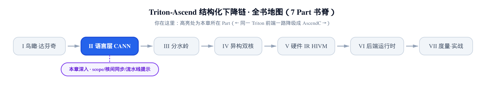

# 作用域、核间同步与流水线提示——`with scope`、`sync_block` 与 `compile_hint`



> **上一章**讲完「自带菜谱」：怎么往语言里注册一条新算子。
> **本章**讲怎么指挥这些算子：哪段代码归哪种核、两种核之间怎么对表、怎么给编译器递条子。
> **下一部分**转向 MLIR 与 Linalg，把语言层交出去的东西一路往下降。

**姊妹篇约定**。这本书全程对照基座《Triton 源码解读》（读上游 Triton v3.2.0）。本章有两处直接对位：`with` 语句的 AST（抽象语法树，Python 源码被解析出来的那棵树）处理对位基座讲 [CodeGenerator 逐节点翻译 AST 的那一章](../../../../triton/artifacts/ch16-codegenerator-ast-visitor/narrative/chapter.md)；本章主角 `handle_scope_with` 的算法则是从基座 `visit_While` 里抄来的，源码注释自己写着「similar to visit_while」——那一趟 dummy 块试跑的套路在[基座讲控制流下降的那一章](../../../../triton/artifacts/ch17-control-flow-lowering-scf/narrative/chapter.md)已经拆过一遍。

**取证口径**。宿主上没有昇腾 NPU、没有 CANN 工具链，所以本章**不存在任何真机数值**。正文里的数值表有两个来源，我会逐表标明：一类是把 pin 版本的函数体**逐字**取出来跑，只把 IR builder（构建 IR 的那个对象）换成「只记账、返回哨兵值」的替身——这类表读作「前端校验全过、走到了建 op 这一步」，表里出现的 MLIR 属性文本（如 `#hivm.tcore_type<VECTOR>`）是替身的渲染，不是编译器打印出来的 IR；另一类落在 C++ 侧（pybind 扩展未编译，跑不起来），由分支逐条读出，每格标行号。至于每条流水线在硬件上到底对应哪个队列、`PIPE_MTE2` 这个名字背后是什么时序，本仓从 Python 到 `.td` 定义文件都没有一句说明——**本章不编**，只把源码给出的线索摆出来。

---

## 一句 `with`，编译器根本没让它当上下文管理器

**直觉**。你在 kernel 里写：

```python
with al.scope(core_mode="cube"):
    acc = tl.dot(a, b)
```

第一反应大概是：`scope` 是个上下文管理器，进块时 `__enter__` 干点什么、出块时 `__exit__` 收尾。这个直觉在这里**整个是错的**。真实情况更像是：这句 `with` 从来没被执行过——它在**编译期**就被当成一个语法标记拦下来了，`scope(...)` 这个调用表达式压根没求值，`__enter__` / `__exit__` 一次都没被调到。

**源码**。先看这位「主角」有多空。`scope` 类的全文（去掉文件头的版权声明）：

```python
# third_party/ascend/language/cann/extension/scope.py:L28-L71
class scope:
    """
    Context manager for entering and exiting a scope, where operations within a scope shares some common characteristics.

    Example:
    ```python
        import triton.language.extra.cann.extension as extension

        @triton.jit
        def kernel(x_ptr, y_ptr, N):
            # specify annotation
            with extension.scope(feature_a=True):
                a = tl.load(x_ptr)
                b = tl.load(y_ptr)
                result = tl.dot(a, b)
    ```

    Reserved keywords:
        - `core_mode`: Allows explicitly specify which core type should be used for operations within a code block, helping the compiler generate appropriate code for cube or vector cores.
    """

    def __init__(self, core_mode: str, _builder=None, _semantic=None, **kwargs):
        """
        :param core_mode: Either "cube" or "vector" to specify the core type
        :param _builder: Internal builder object (set by code_generator)
        :param _semantic: Internal semantic object (set by code_generator)
        :param kwargs: Additional internal parameters
        """
        # Convert constexpr to value if not being called from code generator
        self.core_mode = _constexpr_to_value(core_mode) if _builder is None else core_mode
        self._builder = _builder
        self._semantic = _semantic

        # Validate core_mode
        if self.core_mode not in ("cube", "vector"):
            raise ValueError(f'core_mode must be "cube" or "vector", got {self.core_mode}')

    def __enter__(self):
        if self._builder is None:
            raise RuntimeError("scope can only be used inside a Triton kernel")
        return self

    def __exit__(self, exc_type, exc_val, exc_tb):
        return False
```

一整个类，两个协议方法：`__enter__` 在没有 builder 时抛 `RuntimeError`，然后 `return self`；`__exit__` 直接 `return False`（不吞异常）。**一行 IR 都不发**。语义完全不在这里。

那语义在哪里？在基座编译器对 `with` 的特判上。基座 `CodeGenerator`（把 AST 逐节点翻成 MLIR 的那个前端访问器，[第 4 章](../../ch04-dual-builder-ascend-dispatch/narrative/chapter.md)拆过它被 fork 开的几道口子）文件顶上有这么七行：

```python
# python/triton/compiler/code_generator.py:L25-L31
# Central registry for all 'with' statement handlers
WITH_DISPATCH = {}

# Import and register Ascend extension dispatch handlers
from triton.language.extra.cann.extension.dispatch import ASCEND_WITH_DISPATCH
from triton.language.extra.cann.extension.builder import setup_unified_builder
WITH_DISPATCH.update(ASCEND_WITH_DISPATCH)
```

注意这是**基座文件**（`python/triton/`），却在 import 期无条件把昇腾扩展的表并了进来——没有开关、没有 try/except。这是 fork 路线才做得出的动作：整棵上游树都在自己仓库里，想在哪儿开口就在哪儿开口。

并进来的表只有两项：

```python
# third_party/ascend/language/cann/extension/dispatch.py:L25-L34
from .scope import scope
from .code_generator import handle_scope_with, mangle_ty

__all__ = ["ASCEND_WITH_DISPATCH"]

# Registry of 'with' statement handlers for Ascend extension
ASCEND_WITH_DISPATCH = {
    scope: handle_scope_with,
    "mangle_ty": mangle_ty,
}
```

第一项的键值得盯一眼：**键是 `scope` 这个类对象本身**，不是字符串 `"scope"`。为什么要这么设计，看查表那一侧就懂了：

```python
# python/triton/compiler/code_generator.py:L801-L813
    def visit_With(self, node):
        """Handle 'with' statements using dispatch pattern."""
        assert len(node.items) == 1
        context = node.items[0].context_expr

        # Check if context is a Call and dispatch to registered handler
        if isinstance(context, ast.Call):
            withitemClass = self.visit(context.func)
            handler = WITH_DISPATCH.get(withitemClass)
            if handler:
                return handler(self, node)

        # Fall back to visiting body for unhandled cases
```

`self.visit(context.func)` 只 visit 了**被调用的那个东西**（`al.scope` 这个名字），求值结果就是 `scope` 类对象；`context.func` 之后的那对括号、那些实参，一个都没被求值。拿这个类对象当键去查表，命中就把**整条 `with` 语句的 AST 节点**交给 `handle_scope_with`，`visit_With` 自己就此返回。

于是三件事同时成立：`scope.__init__` 不跑（所以它那句 `core_mode` 合法性校验在 kernel 里根本不生效）、`__enter__` / `__exit__` 不跑、`with` 块的体也不会被 `visit_With` 自己处理——全归 handler 管。没命中的 `with`（比如你写个普通的 Python 上下文管理器）才走到最后那行兜底，等于把 `with` 当成一层透明壳、只生成块体。


[第 4 章](../../ch04-dual-builder-ascend-dispatch/narrative/chapter.md)讲过 `visit_Call` 里按 `is_builtin` 选 builder 的那条路由——这里是**同一个思路的第二个入口**：不改上游的调用约定，只在前端访问器的某个 `visit_*` 上挂一张表，让昇腾侧接管一类语法结构。路由机制本身那章已经拆透，这里只认路：`with` 归 `WITH_DISPATCH`。

**顺手记一个坑**。上面那段 docstring 的示例写的是 `with extension.scope(feature_a=True):`，可 `__init__` 的签名是 `(self, core_mode: str, ...)`——`core_mode` 是**必填位置参数**。这两处对不上，后果分两种：在 kernel **外面**照 docstring 手工构造一个 `scope(feature_a=True)`，当场 `TypeError`；在 kernel **里面**这么写反而不报错，因为如上所述，`handle_scope_with` 从不构造 `scope` 实例，`feature_a` 会被当成一个普通关键字透传成 MLIR 属性（下一节讲这条透传规则）。官方用例一律写 `core_mode="..."`，跟着用例走就对了。这是本书第二次遇到「文档和校验列表打架」——[第 6 章](../../ch06-ascend-builtin-ops/narrative/chapter.md)讲 cast 的 `overflow_mode` 时，docstring 把 `saturate` 拼成了 `sautrate`；结论同一条：**能对照代码就别信文档**。

那么 handler 拿到这条 AST 之后，到底怎么把一段 Python 块变成 IR？

---

## 两趟 visit：先试跑数变量，再正式建 region

**直觉**。像装修队进屋前先空跑一遍：第一趟在一间临时搭的样板房里把活干完，只为数清楚「这次装修会动到哪几件家具」；数完把样板房拆掉，按这份清单在正式房间里**重做一遍**，最后把动过的家具从正式房间的出口交还给屋主。屋主手里的那件「a」从此指向新交还的那一件，而不是进屋前那件。

为什么非得空跑一趟？因为 MLIR 的规矩：一个**带 region 的算子**（region = 区域，挂在某个算子内部的一段代码块，`scf.for` 的循环体就是这么挂上去的）在**创建那一刻**就得把结果类型列表交齐。而「这个块里会定义/改写哪些变量、各是什么类型」，不把块走一遍是不知道的。于是只好走两遍：第一遍算清单，第二遍才动真格。

这里还需要一个概念：**SSA**（静态单赋值）——IR 世界里每个值只被赋一次，Python 里那句 `a = a + 1` 落到 IR 上是「造了一个新值」，而不是「改了老值」。所以块里改过的变量要想在块外可见，必须**从块的出口交还出来**，再在块外重新绑定到名字上。这套地基（SSA、块参数、跨块存活的变量）在[基座讲 SSA 与结构化控制流的那一章](../../../../triton/artifacts/ch15-ssa-and-structured-control-flow/narrative/chapter.md)有完整推导，本章只用结论。

**源码**。`handle_scope_with` 全文如下。它不长，但每一段都对应上面直觉里的一步：

```python
# third_party/ascend/language/cann/extension/code_generator.py:L137-L208
def handle_scope_with(generator, node):
    """
    Handle 'with scope(...)' statements by creating a scope.scope operation.
    
    This creates a scope.scope operation with a region for the scope block.
    Uses SSA threading to properly handle variables modified inside the scope.
    
    Args:
        generator: The CodeGenerator instance
        node: AST node for the with statement
    """
    # Lazy imports to avoid circular dependency
    from triton import language
    from triton.compiler.code_generator import enter_sub_region, _is_triton_value, _is_triton_tensor
    
    context_expr = node.items[0].context_expr
    scope_attrs = _extract_scope_attributes(context_expr)
    
    with enter_sub_region(generator) as sr:
        liveins, _ = sr
        ip, last_loc = generator._get_insertion_point_and_loc()

        # This implementation is similar to visit_while
        dummy = generator.builder.create_block()
        generator.builder.set_insertion_point_to_start(dummy)
        generator.visit_compound_statement(node.body)
        scope_defs = generator.local_defs
        dummy.erase()

        # Verify and get return type of the scope.scope
        # (variables that exist in parent scope AND are modified in scope)
        names = []
        ret_types = []
        for name in scope_defs:
            scope_val = scope_defs[name]
            ret_types.append(scope_val.type)
            names.append(name)
            if name in liveins:
                live_val = liveins[name]
                _verify_loop_carried_variable(
                    _is_triton_value, _is_triton_tensor, name, scope_val, live_val)

        # Convert Python primitives to MLIR attributes
        mlir_attrs = _build_mlir_attrs_from_scope_attrs(generator.builder, scope_attrs)

        # Create scope operation with operands (values from outside)
        generator._set_insertion_point_and_loc(ip, last_loc)
        scope_op = generator.builder.create_scope_op(
            mlir_attrs,
            [ty.to_ir(generator.builder) for ty in ret_types]
        )

        # Create the entry block with arguments matching the operands
        entry_block = generator.builder.create_block_with_parent(scope_op.get_region(0), [])
        generator.builder.set_insertion_point_to_start(entry_block)

        # Initialize the scope's symbol table with liveins
        generator.lscope = liveins.copy()
        generator.visit_compound_statement(node.body)
        generator.builder.set_insertion_point_to_end(entry_block)
        reconstructed_values = []

        for i in range(len(names)):
            # generator.lscope[names[i]] is already a tensor, just get its IR handle
            reconstructed_values.append(generator.lscope[names[i]].handle)
        generator.builder.scope_return(reconstructed_values)

    # After exiting enter_sub_region, update symbol table with results
    # Convert IR values back to tensor objects
    for i, name in enumerate(names):
        generator.set_value(name, _reconstruct_value_from_ir(language, scope_op.get_result(i), ret_types[i]))
    return None
```

（开头三行 lazy import 只为绕开循环依赖，跳过不看。）逐段读：

- **`enter_sub_region` 交出 `liveins`**。`liveins` 是「进这个块之前，外层已经有哪些名字、各绑着什么值」的一份快照。它同时负责在块结束后把生成器的符号表恢复原状。
- **样板房**。`create_block()` 建一个不挂在任何算子上的临时块（`dummy`），把插入点挪进去，`visit_compound_statement(node.body)` 把块体**生成一遍**，然后读走 `generator.local_defs`——这是「本段代码里定义或改写了哪些名字」的记录——最后 `dummy.erase()`，刚才生成的 IR 连同块一起作废。这一趟的产物只有类型信息。
- **冻结名单**。`for name in scope_defs` 同步 append 出 `names` 与 `ret_types` 两个列表，此后代码里**再没有对这两个列表的写入**。凡是与外层同名的变量，用 `_verify_loop_carried_variable` 校验类型一致——这个校验函数是从循环那边直接复用过来的：

```python
# third_party/ascend/language/cann/extension/code_generator.py:L121-L129
def _verify_loop_carried_variable(_is_triton_value, _is_triton_tensor, name, loop_val, live_val):
    """Verify that loop-carried variable types are consistent."""
    assert _is_triton_value(loop_val), f'cannot reassign constxpr {name} in the loop'
    assert _is_triton_value(live_val), f'cannot reasign constexpr {name} in the loop'
    assert type(loop_val) == type(live_val), f'Loop carried variable {name} changed type'
    assert not _is_triton_tensor(loop_val) or loop_val.type == live_val.type, \
        f'Loop-carried variable {name} has initial type {live_val.type} '\
        f'but is re-assigned to {loop_val.type} in loop! '\
        f'Please make sure that the type stays consistent.'
```

报错信息里满口 `loop`，连拼写错误（`constxpr` / `reasign`）都原样继承——这是「`scope` 就是照着 `while` 抄的」最诚实的证据。对读者的实际含义是：**`with scope` 块里改一个外层变量，改前改后类型必须一致**，跟循环里的规矩一样。

- **建 op**。属性翻译完（下一节讲），插入点先还原到 `with` 语句原本所在的位置，再调 `create_scope_op`，两个实参分别是属性字典与结果类型列表。
- **正式房间**。在 `scope_op` 的第 0 个 region 上建入口块，注意 `create_block_with_parent(..., [])` 的第二个实参是**空列表**——这个 region 的入口块**没有块参数**，外层的值靠 region 直接捕获引用，不从参数口传进来。然后把符号表重置成 `liveins.copy()`，**第二次** visit 块体，这一趟发的 IR 才是留下的。
- **封口与回填**。按 `names` 的顺序取每个名字当前绑定的 IR 值（`.handle` 就是 IR 里那个 SSA 值的编号），`scope_return(...)` 把它们从 region 的出口交出去；退出 `enter_sub_region` 之后，再按同一个 `names` 顺序把 `scope_op.get_result(i)` 包回 tensor 写进外层符号表。至此块内改过的名字在块外指向的是 **scope 算子的结果**。

**数值推演**。取一个最小例子跑一遍：外层已有 `a`（`tensor<128xf32>`，块内会被改写）和 `n`（`i32`，块内不碰），`with` 写成 `with scope(core_mode="vector", disable_auto_sync=True, my_hint=3):`，块体两条赋值 `a = a + 1`、`c = a * 2`，于是 `scope_defs = {a, c}`。下表逐步记录 builder 收到了什么。取证口径如前所述：`handle_scope_with` 整模块 import 后逐字执行，`enter_sub_region` 按行号从基座文件切片 exec，builder 与 CodeGenerator 是记录型替身。

<!-- trace: M3 -->

| 阶段 | 插入点 | builder 动作 | 本趟 SSA 产物 | `local_defs` / 结果 |
|---|---|---|---|---|
| 第 1 趟：搭样板房 | func.entry → block1 | `create_block()`（dummy） | — | `local_defs` 空 |
| 第 1 趟：试跑 with 体 | block1:start | `visit_compound_statement`（趟次 1） | a=%1, c=%2 | `local_defs = {a: %1, c: %2}` |
| 第 1 趟收工：拆样板房 | block1 | `dummy.erase()` | %1 / %2 随 block 一起作废 | 只留下 names=[a, c] 与 ret_types |
| 建 scope.scope | 回到 func.entry | `create_scope_op(attrs, 2 个结果类型)` | — | attrs = {noinline, tcore_type\<VECTOR\>, hivm.disable_auto_sync, my_hint} |
| 建 region 入口块 | region#0 | `create_block_with_parent(region#0, [])` | — | 入口块参数列表为空（region 不带块参数） |
| 第 2 趟：正式重跑 with 体 | block2:start | `visit_compound_statement`（趟次 2） | a=%3, c=%4 | lscope 先被重置成 liveins 的副本 |
| 封口 | block2:end | `scope_return([%3, %4])` | — | 2 个操作数，与 2 个结果一一对应 |
| 回填外层符号表 | func.entry | — | — | a → %scope_res0，c → %scope_res1，n 仍是 %n_outer |


**不变量**。设第一趟试跑得到的 `scope_defs` 大小为 k（本例 k = 2），则三个数恒等且顺序一致：`scope.scope` 的结果数、`scope.return` 的操作数数、退出 `with` 后回填外层的名字数。

论证很直白。基例：`names` 与 `ret_types` 在第一趟结束时一次性定好（同一个 `for` 循环里同步 append），此后再无写入，长度冻结为 k。归纳步三处各查一遍：① 建 op 时结果类型列表由 `ret_types` 逐个 `to_ir` 得到，长度 = k；② 第二趟之后的回收循环是 `for i in range(len(names))`，长度 = k、顺序 = `names`；③ 退出子区域后的回填循环是 `for i, name in enumerate(names)`，长度 = k、顺序 = `names`。三处都以同一个 `names` 为唯一游标，故三者恒等且对齐。终止性：没有嵌套循环，visit 固定两趟。

有一条**警告**必须写在旁边：第二趟前只做了 `generator.lscope = liveins.copy()`，**`local_defs` 没有清空**——第 2 趟入口处它还带着第 1 趟留下的 `{a, c}`。这不影响上面的不变量（`names` 早已冻结），但它解释了为什么第二趟的回收只能从 `lscope` 里取值，而不是再读一次 `local_defs`。

**代价**。块体被完整生成两遍、丢弃一遍。本例 k = 2，共造出 4 个 SSA 值，其中 2 个随 dummy 块作废——「试跑」的净开销就是一整趟 codegen。推广开：k 个被改写的变量意味着 2k 个值被造、k 个被丢，`scope.scope` 的结果数线性于 k。真正要留神的是**嵌套**：每嵌一层，最内层的块体就多被走一倍。官方用例里有个三层嵌套的 kernel：

```python
# third_party/ascend/unittest/pytest_ut/test_scope.py:L38-L59
@triton.jit
def kernel_nested_scope(x_ptr, y_ptr, out_ptr, n, BLOCK: tl.constexpr):
    """Test nested scopes."""
    i = tl.program_id(0) * BLOCK + tl.arange(0, BLOCK)
    with al.scope(core_mode="vector"):
        with al.scope(core_mode="vector"):
            with al.scope(core_mode="cube"):
                x = tl.load(x_ptr + i, mask=i < n)
                y = tl.load(y_ptr + i, mask=i < n)
                result = x + y
                tl.store(out_ptr + i, result, mask=i < n)


@triton.jit
def kernel_scope_escape(x_ptr, out_ptr, n, BLOCK: tl.constexpr):
    """Test variable defined inside scope, used outside."""
    i = tl.program_id(0) * BLOCK + tl.arange(0, BLOCK)
    with al.scope(core_mode="vector"):
        x = tl.load(x_ptr + i, mask=i < n)
    # Use x outside of the scope
    a = x + 1.0
    tl.store(out_ptr + i, a, mask=i < n)
```

嵌 N 层，最内层的 AST 就会被走 $`2^N`$ 次——三层即 8 次。这是**纯编译期**开销，跟运行期一点关系没有，别把它读成「嵌套 scope 会让 kernel 变慢」。下面那个 `kernel_scope_escape` 则是 SSA 穿线的官方验收：`x` 在块内定义、块外照用——能用，正是因为它被 `scope_return` 交了出来、又被回填进了外层符号表。

块的骨架搭好了，接下来看括号里那几个关键字去了哪儿。

---

## 关键字变属性的四条规则，和三种静默失效

**直觉**。`with scope(...)` 括号里的东西不是函数实参——没人调这个函数——它们是**贴在 AST 上的便条**，编译器直接从语法树上把便条揭下来，翻译成挂在 `scope.scope` 算子上的 MLIR 属性。既然是从语法树上揭，那便条必须是**字面量**：写成变量名，编译器揭不下来，而且**不报错**。

**源码**。揭便条这一步只有七行：

```python
# third_party/ascend/language/cann/extension/code_generator.py:L63-L69
def _extract_scope_attributes(context_expr):
    """Extract attributes from scope(...) call."""
    scope_attrs = {}
    for keyword in context_expr.keywords:
        if isinstance(keyword.value, ast.Constant):
            scope_attrs[keyword.arg] = keyword.value.value
    return scope_attrs
```

只遍历 `keywords`（关键字实参），且只接受 `ast.Constant`（AST 里的字面量常量节点）。两条后果都不出声：位置参数写法 `scope("vector")` 的 `keywords` 是空的；`core_mode=mode_var` 这种传变量的写法，`keyword.value` 是 `ast.Name` 而不是 `ast.Constant`，直接被跳过。**没有 else、没有 warning**。

揭下来的便条再逐项翻译：

```python
# third_party/ascend/language/cann/extension/code_generator.py:L72-L93
def _py_value_to_mlir_attr(builder, value):
    """Convert Python value to MLIR attribute."""
    attr_creators = {
        str: lambda v: builder.get_str_attr(v),
        bool: lambda v: builder.get_bool_attr(v),
        int: lambda v: builder.get_int32_attr(v),
        list: lambda v: builder.get_i64_array_attr(v),
    }
    creator = attr_creators.get(type(value))
    return creator(value) if creator else value


def _handle_core_mode_attr(builder, core_mode):
    """Handle core_mode attribute conversion."""
    if core_mode not in ("cube", "vector"):
        return {}
    return {
        builder.get_t_core_type_attr_name(): (
            builder.get_t_core_type_cube_attr() if core_mode == "cube"
            else builder.get_t_core_type_vector_attr()
        )
    }
```

```python
# third_party/ascend/language/cann/extension/code_generator.py:L96-L118
def _build_mlir_attrs_from_scope_attrs(builder, scope_attrs):
    """Convert Python scope attributes to MLIR attributes.
    
    Args:
        builder: The IR builder
        scope_attrs: Dict of scope attributes (e.g., {'core_mode': 'vector', 'noinline': True})
        
    Returns:
        Dict of MLIR attributes
    """
    mlir_attrs = {"noinline": builder.get_unit_attr()}
    for k, v in scope_attrs.items():
        if k == "core_mode":
            mlir_attrs.update(_handle_core_mode_attr(builder, v))
        elif k == "noinline":
            if not v:
                mlir_attrs.pop("noinline")
        elif k == "disable_auto_sync":
            if v:
                mlir_attrs["hivm.disable_auto_sync"] = _py_value_to_mlir_attr(builder, v)
        else:
            mlir_attrs[k] = _py_value_to_mlir_attr(builder, v)
    return mlir_attrs
```

四条规则，一条一条读：

1. **`noinline` 默认打开**。字典以 `{"noinline": get_unit_attr()}` 起手——unit attr 是「只有名字、没有值」的那种 MLIR 属性，存在本身即语义。只有显式传 `noinline=False` 才把它 `pop` 掉。为什么默认不许内联，下一节讲完 `scope.scope` 的下场就明白了。
2. **`core_mode` 走白名单**。`"cube"` / `"vector"` 各自换成一个 `tcore_type`（核类型）属性；**其它值直接 `return {}`**——不报错、不生成属性。你把 `core_mode` 拼成 `"aicore"`，这句 `with` 就成了一个什么也没声明的空壳，编译照跑。
3. **`disable_auto_sync` 只在为真时落地**，且要**改名**：加上 `hivm.` 前缀变成 `hivm.disable_auto_sync`。传 `False` 什么都不加。
4. **其余关键字原样透传**，按 Python 类型查 `_py_value_to_mlir_attr` 那张四行的构造表（str / bool / int / list）。表里查不到的类型（比如 float）就把原值返回去——注意这一路**没有报错分支**，一个非法值会一直漂到 pybind 边界才出问题。另外，`list` 这一行在 `with scope(...)` 这条入口上其实**够不着**：写 `my_list=[7, 9]`，AST 节点是 `ast.List` 而不是 `ast.Constant`，在揭便条那步就被滤掉了。


把这四条合起来，最值得记的是 **写错了不报错** 这一条。`scope` 生不生效，全看 AST 里那个关键字是不是一个字面量、值在不在白名单里；写错了没有任何反馈，只是核类型声明悄悄消失、代码退化成普通的一段。官方用例里唯一示范过的额外关键字是 `disable_auto_sync`：

```python
# third_party/ascend/unittest/pytest_ut/test_scope.py:L84-L92
@triton.jit
def kernel_scope_disable_auto_sync(x_ptr, y_ptr, out_ptr, n, BLOCK: tl.constexpr):
    """Test disable auto sync."""
    i = tl.program_id(0) * BLOCK + tl.arange(0, BLOCK)
    with al.scope(core_mode="vector", disable_auto_sync=True):
        x = tl.load(x_ptr + i, mask=i < n)
        y = tl.load(y_ptr + i, mask=i < n)
        result = x + y
        tl.store(out_ptr + i, result, mask=i < n)
```

属性挂上去了，`scope.scope` 也建出来了。这个算子接下来会遭遇什么？

---

## `scope.scope` 的下游命运：外提成一个函数

**直觉**。`scope.scope` 是个**临时容器**。它活不到最后——编译器后面有一道 pass 专门把它的 region 整段搬出去，做成一个独立的函数，原地只留一次调用。所以你写的那句 `with`，最终决定的不是「这条语句归哪个核」，而是「**这一整个函数**归哪个核」。

**源码**。先看 Python 这一侧怎么把属性交出去。`create_scope_op` 的 pybind 绑定（pybind = 把 C++ 暴露成 Python 模块的那层绑定）：

```cpp
// third_party/ascend/ascend_ir.cc:L664-L681
      .def("create_scope_op",
           [](AscendNPUIROpBuilder &self, py::dict &scopeAttrs,
              std::vector<Type> resultTypes) -> OpState {
             llvm::SmallVector<NamedAttribute> attrs;
             for (auto item : scopeAttrs) {
               std::string key = py::cast<std::string>(item.first);
               Attribute value = py::cast<Attribute>(item.second);
               attrs.push_back(
                   NamedAttribute(self.getBuilder().getStringAttr(key), value));
             }
             auto scopeOp = self.create<scope::ScopeOp>(TypeRange(resultTypes));
             scopeOp->setAttrs(attrs);
             return OpState(scopeOp);
           })
      .def("scope_return",
           [](AscendNPUIROpBuilder &self,
              std::vector<Value> operands) -> OpState {
             return self.create<scope::ReturnOp>(ValueRange(operands));
```

Python 那个 dict 逐项转成具名属性挂到算子上——**没有白名单**，上一节透传进来的任何键都会原样变成 `scope.scope` 的属性。这个算子本身的 ODS 定义（ODS = MLIR 用来声明算子的定义文件，后缀 `.td`）只声明了一个属性：

```tablegen
// third_party/ascend/AscendNPU-IR/bishengir/include/bishengir/Dialect/Scope/IR/ScopeOps.td:L34-L65
def ScopeOp : Scope_Op<"scope", [
    DeclareOpInterfaceMethods<RegionBranchOpInterface, [
    "getNumRegionInvocations", "getRegionInvocationBounds",
    "getEntrySuccessorRegions"]>,
    NoRegionArguments,
    SingleBlockImplicitTerminator<"scope::ReturnOp">,
    SingleBlock,
    RecursiveMemoryEffects]> {
  let summary = "Represents scope of a region";
  let description = [{
    The "scope.scope" operation represents a scope of the
    operations inside the region.

    Example:
    ```
    scope.scope : () -> () {
        scope.return
    } {tcore_type = #hivm.tcore_type<CUBE>, ...}

    scope.scope : () -> () {
        scope.return
    }
    ```
  }];
  let arguments = (ins
    UnitAttr:$no_inline
  );
  let results = (outs Variadic<AnyType>:$results);
  let regions = (region SizedRegion<1>:$region);
  let hasCustomAssemblyFormat = 1;
  let hasCanonicalizer = 1;
}
```

三条约束正好对上前一节读到的代码：`SizedRegion<1>`（就一个 region，所以 Python 侧写死 `get_region(0)`）、`NoRegionArguments`（region 不带块参数，所以建入口块时第二个实参是空列表）、`SingleBlockImplicitTerminator<"scope::ReturnOp">`（单块、终结符必须是 `scope.return`，所以封口那步不是可选动作）。声明里的属性只有 `no_inline` 一个，`tcore_type` 那些是以「可丢弃属性」的形式挂上去的——ODS 里没登记，但 MLIR 允许挂。

再看那道 pass 的说明。它写在 pass 定义文件里，前后对照是官方给的：

```tablegen
// third_party/ascend/AscendNPU-IR/bishengir/include/bishengir/Dialect/Scope/Transforms/Passes.td:L23-L68
def OutlineScope : Pass<"outline-scope", "mlir::ModuleOp"> {
  let summary = "Outline scope region within ScopeOp.";
  let description = [{
    Convert `scope.scope` into a `func.func`.

    Example:

    ```mlir
    module {
      func.func @test() {
        scope.scope : () -> () {
          ...
          scope.return
        } {tcore_type = #hivm.tcore_type<CUBE>, ...}
        scope.scope : () -> () {
          ...
          scope.return
        } {tcore_type = #hivm.tcore_type<VECTOR>, ...}
        return
      }
    }
    ```

    will be transformed into:

    ```mlir
    module {
      func.func @test_scope_0() attributes {tcore_type = #hivm.tcore_type<CUBE>, ...} {
        ...
        return
      }
      func.func @test_scope_1() attributes {tcore_type = #hivm.tcore_type<VECTOR>, ...} {
        ...
        return
      }
      func.func @test() {
        call @test_scope_scope_scope_0() : () -> ()
        call @test_scope_scope_scope_1() : () -> ()
        return
      }
    }
    ```
  }];
  let constructor = "mlir::scope::createOutlineScopePass()";
  let dependentDialects = ["mlir::func::FuncDialect"];
}
```

左边那份 IR 是 ttadapter 段开头的形态——`scope.scope` 由 AST 到 ttir 这一步（`ast_to_ttir`）直接 emit，一路带到 ttadapter；右边是 `outline-scope` 这道 ttadapter 侧 pass 跑完之后的形态。看清楚发生了什么：**`tcore_type` 从算子属性搬到了函数属性上**，原地换成一次 `call`。


到这里，上一节那个「`noinline` 为什么默认打开」的问题自己回答了：这段代码马上要被外提成一个独立函数，靠的就是「它是一个不该被内联进周围代码的完整块」。要是允许内联，`with scope` 圈起来的边界先没了，「整段归哪种核」也就无从谈起。（同一个文件里还有一道反向的 `InlineScope` pass，成对存在。）

`scope` 解决的是「**哪段代码归哪种核**」。可一旦真有两种核同时在干活，就出现了第二个问题：它们之间怎么对表。

---

## 同一个 `sync_block_set`，两条下降路径

**直觉**。cube 核算完一块要交给 vector 核接着算，两边得有个约定：我这边写完了、你那边再读。这就是核间同步。昇腾把它做成了两个原语：`set`（我这边好了）和 `wait`（我等你那边好）。API 就这么两个词，但这个仓库里**同名的东西有两套**——一套已经打了弃用标记，一套是现在推荐的。两套的校验几乎一样，落到 IR 上却是完全不同的两个算子。

**源码**。旧代长这样（`wait` 与它逐字同构，只差 op 名，这里只看 `set`）：

```python
# third_party/ascend/language/cann/extension/aux_ops.py:L57-L76
@_tensor_member_fn
@builtin
def sync_block_set(sender, receiver, event_id, _builder=None):
    import warnings

    warnings.warn(
        ("This method would be deprecated. Use al.sync_block_set instead."),
        DeprecationWarning,
        stacklevel=1,
    )
    sender = _constexpr_to_value(sender)
    receiver = _constexpr_to_value(receiver)
    event_id = _constexpr_to_value(event_id)
    assert isinstance(sender, str) and (sender == "cube" or sender == "vector"), f"ERROR: sender = {sender}, only supports cube/vector"
    assert isinstance(receiver, str) and (receiver == "cube" or receiver == "vector"), f"ERROR: receiver = {receiver}, only supports cube/vector"
    assert isinstance(event_id, int) and (event_id >= 0) and (event_id < 16), f"event_id: {event_id} should be 0 ~ 15"
    if sender == receiver:
        raise ValueError(f'Unexpected pair: {sender} -> {receiver}, only supports cube -> vector or vector -> cube')
    custom_op(_builder, "sync_block_set", sender=sender, event_id=event_id)
```

进门第一件事就是 `DeprecationWarning`（Python 的弃用告警），指路「用 `al.sync_block_set`」。随后三次 `_constexpr_to_value`（把编译期常量拆成裸值），三条断言加一条 `ValueError`（下一节细讲），最后交给 `custom_op`。（头上那个 `@_tensor_member_fn` 是基座的装饰器，把函数同时挂成张量的方法，与本章的同步语义无关；`@builtin` 则是[第 4 章](../../ch04-dual-builder-ascend-dispatch/narrative/chapter.md)讲过的那枚双标记图章。）

**这里有个同名陷阱，务必分清**：这个 `custom_op` **不是**[第 7 章](../../ch07-custom-op-and-libdevice/narrative/chapter.md)讲的那张自定义算子注册表。那一章的主角是 `custom_op.py` 里的 `register_custom_op` / `al.custom`；这里 `aux_ops.py` 顶部写的是 `from ._utils import custom_op`，指向另一个文件里的一个手写分发函数，全文十二行：

```python
# third_party/ascend/language/cann/extension/_utils.py:L5-L16
def custom_op(builder: ir.builder, op_name: str, **kwargs):
    if op_name == "sync_block_all":
        return builder.create_custom_op_for_inter_core_sync(op_name, kwargs["mode"], kwargs["event_id"])

    elif op_name == "sync_block_set":
        return builder.create_custom_op_for_inter_core_sync(op_name, kwargs["sender"], kwargs["event_id"])
    
    elif op_name == "sync_block_wait":
        return builder.create_custom_op_for_inter_core_sync(op_name, kwargs["sender"], kwargs["event_id"])
    
    raise ValueError(f"Unsupported custom op: {op_name}")
```

只认三个名字的 if-elif 链，没有注册表、没有开集，别名重了而已。三个分支都落到同一个 C++ 方法上：

```cpp
// third_party/ascend/triton_ascend.cc:L117-L125
    .def("create_custom_op_for_inter_core_sync",
      [](TritonOpBuilder &self, std::string &op_name,
        std::string &mode_or_sender, int id) -> void {
          auto args = self.getBuilder().getArrayAttr(
              {self.getBuilder().getStringAttr(mode_or_sender),
              self.getBuilder().getI32IntegerAttr(id)}
          );
          self.create<triton::ascend::CustomOp>(op_name, args, ValueRange());
      })
```

**看它丢掉了什么**：只有 `(mode_or_sender, id)` 两样东西被打成一个数组属性，挂在一个通用的 `ascend.custom` 上——`triton::ascend::CustomOp` 是这个算子的 C++ 类名，它在 IR 里印出来叫 `ascend.custom`（算子名由 ODS 里的助记符定：`third_party/ascend/include/Dialect/TritonAscend/IR/TritonAscendOps.td:L388` 写的是 `TT_Ascend_Op<"custom", ...>`，方言名 `"ascend"` 见同目录 `TritonAscendDialect.td:L15`）。`receiver` 从 Python 那层就没进 `kwargs`——它只参与了校验，一到建 op 就蒸发了。这个算子上既没有核类型、也没有任何流水线信息。

新代把这些全补了回来：

```python
# third_party/ascend/language/cann/extension/core.py:L202-L234
def create_sync_block(sender, receiver, event_id, is_set: bool,
                      sender_pipe=None, receiver_pipe=None,
                      _builder=None):
    sender = _constexpr_to_value(sender)
    receiver = _constexpr_to_value(receiver)
    assert isinstance(sender, str) and (sender == "cube" or sender == "vector"), f"ERROR: sender = {sender}, only supports cube/vector"
    assert isinstance(receiver, str) and (receiver == "cube" or receiver == "vector"), f"ERROR: receiver = {receiver}, only supports cube/vector"
    if isinstance(event_id, int):
        assert (event_id >= 0) and (event_id < 16), f"event_id: {event_id} should be 0 ~ 15"
    if sender == receiver:
        raise ValueError(f'Unexpected pair: {sender} -> {receiver}, only supports cube -> vector or vector -> cube')
    if sender_pipe is None and receiver_pipe is None:
        if sender == "cube":
            sender_pipe = PIPE.PIPE_FIX
            receiver_pipe = PIPE.PIPE_MTE2
        if sender == "vector":
            sender_pipe = PIPE.PIPE_MTE3
            receiver_pipe = PIPE.PIPE_MTE2
    if not isinstance(sender_pipe, PIPE) or not isinstance(receiver_pipe, PIPE):
        raise TypeError("sender_pipe and receiver_pipe must be instances of PIPE enum")
    if is_set:
        return semantic.create_sync_block_set(sender, receiver, event_id, sender_pipe, receiver_pipe, _builder)
    return semantic.create_sync_block_wait(sender, receiver, event_id, sender_pipe, receiver_pipe, _builder)


@builtin
def sync_block_set(sender, receiver, event_id, sender_pipe=None, receiver_pipe=None, _builder=None):
    return create_sync_block(sender, receiver, event_id, True, sender_pipe, receiver_pipe, _builder)


@builtin
def sync_block_wait(sender, receiver, event_id, sender_pipe=None, receiver_pipe=None, _builder=None):
    return create_sync_block(sender, receiver, event_id, False, sender_pipe, receiver_pipe, _builder)
```

多了两个参数：`sender_pipe` 与 `receiver_pipe`——发方和收方各自占哪条流水线。这两个东西最后会跟核类型一起写进一个 **HIVM 方言专用算子**（HIVM 是达芬奇的硬件 IR 方言，[第 1 章](../../ch01-birdseye-ascend-backend/narrative/chapter.md)点过名），而不是那个通用的 `ascend.custom`。


还有一处细节值得点出：两代**挂在不同的 builder 上**。旧代那个 `create_custom_op_for_inter_core_sync` 定义在 `TritonOpBuilder`（基座 builder，被 fork 就地加了方法）上；新代的 `sync_block_set` / `sync_block_wait` 定义在 `AscendNPUIROpBuilder` 上（`third_party/ascend/ascend_ir.cc:L683-L696`，该类继承前者，见同文件 `L501`）——也就是[第 4 章](../../ch04-dual-builder-ascend-dispatch/narrative/chapter.md)那两个 builder 里的第二个。「换一代 API」在这个仓库里的具体含义是：**换一个 builder、换一个方言、把语言层原本丢掉的信息补进 IR**。

那么这两代共同守着的契约到底是什么？

---

## 四条校验：核间同步的参数契约

**直觉**。像两个人隔墙传暗号：必须一个在墙这边、一个在墙那边（`sender ≠ receiver`），双方都得是这栋楼里真实存在的房间（只有 cube / vector 两间），暗号编号取自墙上钉死的 16 个挂钩（0～15）之一。挂钩不够就得复用，编号写错当场拦下——而不是让墙那边空等。

**源码**已在上一节给全，这里只把四条拎出来（行号指新代 `core.py`）：

1. `sender` 必须是字符串且 ∈ {`"cube"`, `"vector"`}（`L207`）；
2. `receiver` 同样（`L208`）；
3. `event_id` 是 int 时，必须 0 ≤ id < 16（`L209-L210`）；
4. `sender == receiver` 直接 `raise ValueError`（`L211-L212`）。

第四条尤其要读进去：核间同步就是「跨核」原语，**同一个核内部的先后次序不归它管**。第三条那个 16 是整章唯一的资源硬数字——语言层能看见的、关于同步事件资源规模的全部信息就是这个上界；它是不是对应硬件上某组标志寄存器的数量，源码只有断言、没有一句注释，不猜。

**数值推演**。把 15 种调用穷举跑一遍，看谁过、谁被拦、拦在哪一层。取证口径：两代函数体逐字取出执行，`PIPE` 成员名从源码解析，semantic 与 builder 是记录型替身；「落到下游的是什么」一列记的是替身收到的实参，不是真机行为。

<!-- trace: M7 -->

| 调用 | sender → receiver | event_id | pipe 实参 | 结果 | 落到下游的是什么 |
|---|---|---|---|---|---|
| 新代 `sync_block_set` | cube → vector | 0 | 不给 | OK | sender_pipe = PIPE_FIX，receiver_pipe = PIPE_MTE2 |
| 新代 `sync_block_wait` | vector → cube | 15 | 不给 | OK | sender_pipe = PIPE_MTE3，receiver_pipe = PIPE_MTE2 |
| 新代 `sync_block_set` | cube → cube | 1 | 不给 | ValueError | 『Unexpected pair: cube -> cube』——同核直接拒绝 |
| 新代 `sync_block_set` | cube → vector | 16 | 不给 | AssertionError | 『event_id: 16 should be 0 ~ 15』 |
| 新代 `sync_block_set` | cube → vector | -1 | 不给 | AssertionError | 『event_id: -1 should be 0 ~ 15』 |
| 新代 `sync_block_set` | aicore → vector | 2 | 不给 | AssertionError | 『only supports cube/vector』——核名白名单只有两项 |
| 新代 `sync_block_set` | cube → vector | 3 | 只给 sender_pipe = PIPE_V | TypeError | 缺省配对是『两个都为 None』才触发，单边给等于把另一边留成 None |
| 新代 `sync_block_set` | cube → vector | 4 | PIPE_V / PIPE_MTE1 | OK | 显式两侧 pipe 原样透传 |
| 新代 `sync_block_set` | cube → vector | constexpr(99) | 不给 | OK（未被拦） | event_id 没走 `_constexpr_to_value`，isinstance(int) 不成立 ⇒ 跳过范围检查 |
| 旧代 `sync_block_set` | cube → vector | 3 | 无此参数 | OK + DeprecationWarning | custom_op → create_custom_op_for_inter_core_sync('sync_block_set', 'cube', 3)：receiver 被丢掉 |
| 旧代 `sync_block_set` | cube → vector | constexpr(99) | 无此参数 | AssertionError | 旧代先 `_constexpr_to_value` 再查范围，反而拦住了 |
| 旧代 `sync_block_set` | cube → cube | 3 | 无此参数 | ValueError | 同核判定两代一致（先 warn 后抛） |

**不变量**。任何能走到 semantic 层的**新代**同步调用，出口状态必同时满足四条：`sender`、`receiver` ∈ {cube, vector}，且 `sender ≠ receiver`，且（`event_id` 是 int 时）0 ≤ `event_id` < 16，且两个 pipe 都是 `PIPE` 枚举实例。

论证靠函数体的形状：`create_sync_block` 是一条**无循环、无提前 return 的直线**，四道检查全部排在唯一出口（那两句 `return semantic.create_sync_block_*`）之前，任一条不成立即抛出，控制流到不了出口。上表 15 例穷举佐证：通过的 8 例（含全体同步与两条 constexpr 用例）、AssertionError 4 例、ValueError 2 例、TypeError 1 例。

括号里那个「`event_id` 是 int 时」的前提**不能删**——它正是这条契约的漏洞。表里 `constexpr(99)` 一路走到了出口：新代对 `sender` / `receiver` 都调了 `_constexpr_to_value`，**唯独没对 `event_id` 调**，于是 `isinstance(event_id, int)` 不成立，范围检查整条被跳过。有意思的是，同一个 `constexpr(99)` 在旧代反而被 `AssertionError` 拦住了——旧代先无条件解包再查范围。所以「新 API 更严格」并不成立，**两代各有各的漏洞面**：旧代丢信息，新代漏检查。

新代为什么要放宽这一条，从下一层就能看出来——它允许 `event_id` 是运行期的值：

```python
# third_party/ascend/language/cann/extension/semantic.py:L62-L73
def create_sync_block_set(sender, receiver, event_id, sender_pipe: PIPE, receiver_pipe: PIPE, _builder=None):
    if isinstance(event_id, int):
        _builder.sync_block_set(sender, receiver,
                                real_semantic.to_tensor(tl.constexpr(event_id), _builder).handle,
                                sender_pipe.value, receiver_pipe.value)
    elif isinstance(event_id, tl.constexpr):
        _builder.sync_block_set(sender, receiver,
                                real_semantic.to_tensor(event_id, _builder).handle,
                                sender_pipe.value, receiver_pipe.value)
    else:
        _builder.sync_block_set(sender, receiver,
                                event_id.handle, sender_pipe.value, receiver_pipe.value)
```

三形态归一：Python 的 `int`、编译期常量 `constexpr`、以及运行期张量，统统变成一个 IR 值的 handle 交给 builder；两个 pipe 则取 `.value`（枚举的底层整数）。`create_sync_block_wait` 与它逐字同构。第三条 `else` 分支就是允许运行期 `event_id` 的地方——代价就是上面那个漏检。

**合法输入空间有多大**？核名 2 种 × 2 个位置 = 4 个有序对，去掉 2 个同核对，只剩 cube→vector 与 vector→cube 两条方向；`event_id` 16 个取值。所以不显式指定 pipe 时，一对核之间可区分的同步通道共 2 × 16 = 32 个，单向 16 个。显式指定 pipe 会把每条通道再乘上两侧 pipe 的可选值——但哪些组合在真机上有效，源码没说，不推断。

那两个 pipe 参数留空时到底填了什么，值得单独看一眼。

---

## 两侧 pipe 要么都不给，要么都给

**直觉**。缺省值这件事在这里有个反直觉的地方：它不是「哪个没给就补哪个」，而是「**两个都没给**才补」。只给一边，另一边就实打实地留着 `None`，然后被下一行的类型检查打回来。

**源码**就是上一节 `create_sync_block` 里那两段（`third_party/ascend/language/cann/extension/core.py:L213-L221`）：触发条件写死为 `if sender_pipe is None and receiver_pipe is None`，是**与**不是或；补完之后紧跟一句 `if not isinstance(sender_pipe, PIPE) or not isinstance(receiver_pipe, PIPE): raise TypeError`，无论走没走缺省分支都要过一遍。所以「只给 `sender_pipe`」的下场不是「`receiver_pipe` 用缺省」，而是 `TypeError`。

补进去的两组配对是源码写死的：

- `sender == "cube"`：发方 `PIPE_FIX`、收方 `PIPE_MTE2`；
- `sender == "vector"`：发方 `PIPE_MTE3`、收方 `PIPE_MTE2`。


这四个名字是本章能引到的**全部** pipe 语义线索：cube 侧产出走 `PIPE_FIX`、vector 侧产出走 `PIPE_MTE3`、接收侧一律 `PIPE_MTE2`。至于 `FIX` / `MTE2` / `MTE3` 各自对应哪条硬件队列、为什么收方总是 `MTE2`，本仓从 Python 到 pybind 到 `.td` 定义（那里只有一句 `"HIVM Op Pipe"` 的说明）都没给依据——**本章就到此为止，不编硬件语义**。能补充的只有旁证：仓库里有些算子在自己的定义上标了所占的 pipe（比如某些 DMA 算子标 `PIPE_FIX`），想深挖的话线索在那儿。

pipe 定完了，`sender` 与 `receiver` 这对字符串还有最后一手要看：它们怎么变成「谁上哪个核」。

---

## `GetCore`：一个 sender，两处登记

**直觉**。同一张快递单，寄件人柜台记「已寄出」，收件人柜台记「等签收」——单号相同，登记的柜台却是两个。`sync_block_set` / `sync_block_wait` 只接一个 `sender` 参数，却要在两个不同的核上各留一条记录。C++ 侧的 `GetCore` 就是那位按「你是寄还是收」决定去哪个柜台的调度员。

**源码**。它是个纯函数，输入只有 op 名和 `sender`：

```cpp
// third_party/ascend/ascend_ir.cc:L93-L113
hivm::TCoreTypeAttr GetCore(MLIRContext *ctx, llvm::StringRef opName, llvm::StringRef sender)
{
  // Decide core type
  hivm::TCoreTypeAttr core;
  if (sender == "cube") {
    if (opName == "sync_block_set")
      core = hivm::TCoreTypeAttr::get(ctx, hivm::TCoreType::CUBE);
    else
      core = hivm::TCoreTypeAttr::get(ctx, hivm::TCoreType::VECTOR);
  } else {
    if (sender != "vector") {
      throw std::runtime_error("sync_block_set/wait only supports 'cube' or 'vector' as sender");
    }
    if (opName == "sync_block_set")
      core = hivm::TCoreTypeAttr::get(ctx, hivm::TCoreType::VECTOR);
    else
      core = hivm::TCoreTypeAttr::get(ctx, hivm::TCoreType::CUBE);
  }

  return core;
}
```

两层二分支、没有循环。四种组合逐格列出来（表格由分支逐条读出，C++ 扩展在宿主上未编译，无真机验证）：

<!-- trace: M9 -->

| opName | sender 实参 | GetCore 返回的 tcore_type | 含义 | 出处 |
|---|---|---|---|---|
| `sync_block_set` | `"cube"` | `hivm::TCoreType::CUBE` | set 落在发方核（cube）上：cube 宣告「我干完了」 | `ascend_ir.cc:L97-L99` |
| `sync_block_wait` | `"cube"` | `hivm::TCoreType::VECTOR` | 同一个 sender，wait 却落在收方核（vector）上：vector 在等 cube | `ascend_ir.cc:L100-L101` |
| `sync_block_set` | `"vector"` | `hivm::TCoreType::VECTOR` | 对称的另一半：vector 发、set 落 vector | `ascend_ir.cc:L106-L107` |
| `sync_block_wait` | `"vector"` | `hivm::TCoreType::CUBE` | cube 在等 vector | `ascend_ir.cc:L108-L109` |
| 任意 | `"aicore"`（既非 cube 也非 vector） | 不返回，抛 `std::runtime_error` | C++ 侧再兜一次底 | `ascend_ir.cc:L103-L105` |
| 非 set / 非 wait 的 opName | 合法 sender | GetCore 正常返回，但建 op 时抛 `std::runtime_error` | 落核决定与建 op 是两段 | `ascend_ir.cc:L128-L135` |


**不变量**。对固定的 `sender` ∈ {cube, vector}，`set` 与 `wait` 两次调用得到的核类型**恰好互补**，绝不会同时落在同一个核上。论证就是上表的穷举：`sender == "cube"` 时 set 返回 CUBE、否则 VECTOR；`sender == "vector"` 时对称地 set 返回 VECTOR、否则 CUBE。写成一句话即「set 落 sender 核、wait 落另一核」，两者取值恒不相等。第三条出路只有 `sender` 非法时的异常，不产生核类型。所以只要按契约成对写 set / wait（Python 层已经保证 `sender ≠ receiver`），事件两端必分处两核，不存在「自己等自己」这种死锁形态。

**注意边界**：「成对」本身不由编译器保证。只写 `set` 不写 `wait`、或者两处 `event_id` 填得不一样，静态层面没有人检查——真机上会发生什么，本章无从取证。

翻转出来的核类型再连同两个 pipe 一起建 op：

```cpp
// third_party/ascend/ascend_ir.cc:L115-L136
void buildSyncBlockOp(AscendNPUIROpBuilder &self, const std::string &opName, std::string &sender,
                      std::string &receiver, Value id, hivm::PIPE senderPipe, hivm::PIPE receiverPipe)
{
  auto *ctx = self.getBuilder().getContext();
  hivm::TCoreTypeAttr coreAttr = GetCore(ctx, opName, sender);
  hivm::PipeAttr prodPipe = hivm::PipeAttr::get(ctx, senderPipe);
  hivm::PipeAttr consPipe = hivm::PipeAttr::get(ctx, receiverPipe);
  const size_t I64 = 64;
  auto i64Ty = IntegerType::get(ctx, I64);
  Value idI64 = id;
  if (!id.getType().isInteger(I64)) {
    idI64 = mlir::convertScalarToDtype(self.getBuilder(), id.getLoc(), id,
                                       i64Ty, true);
  }
  if (opName == "sync_block_set") {
    self.create<hivm::SyncBlockSetOp>(coreAttr, prodPipe, consPipe, idI64);
  } else if (opName == "sync_block_wait") {
    self.create<hivm::SyncBlockWaitOp>(coreAttr, prodPipe, consPipe, idI64);
  } else {
    throw std::runtime_error("Unsupported operation name for SyncBlockOp");
  }
}
```

三件事：核类型与两个 pipe 各自打成属性（`prodPipe` 是生产侧、`consPipe` 是消费侧）；事件号统一提升到 64 位整数——语言层只准 0～15，位宽这边富余得很；然后按 op 名 emit `hivm.sync_block_set` 或 `hivm.sync_block_wait`（HIVM 方言，在 AST 到 ttir 这一步就已经建出来了）。目标算子的 ODS 声明能印证这份签名：

```tablegen
// third_party/ascend/AscendNPU-IR/bishengir/include/bishengir/Dialect/HIVM/IR/HIVMSynchronizationOps.td:L129-L145
def SyncBlockSetOp : HIVM_SynchronizationOp<"sync_block_set", [AttrSizedOperandSegments]> {
  let summary = "hivm set block sync.";
  let arguments = (ins HIVM_TCoreTypeAttr:$tcore_type,
                       HIVM_PipeAttr:$tpipe,
                       HIVM_PipeAttr:$pipe,
                       OptionalAttr<Builtin_IntegerAttr>:$static_flag_id,
                       Optional<I64>:$dynamic_flag_id,
                       Optional<I64>:$ffts_base_addr,
                       DefaultValuedOptionalAttr<HIVM_SyncBlockInstrModeAttr,
                         "INTRA_BLOCK_SYNCHRONIZATION">:$tsync_instr_mode
  );
  let assemblyFormat = [{
    attr-dict `[` $tcore_type `,` $tpipe `,` $pipe`]`
    `flag` `=` custom<FlagID>($static_flag_id, $dynamic_flag_id)
    (`ffts_base_addr` `=` $ffts_base_addr^)?
    (`sync_instr_mode` `=` $tsync_instr_mode^)?
  }];
```

`static_flag_id` 与 `dynamic_flag_id` 一对可选项，正好对上语言层 `event_id` 的「编译期常量 / 运行期值」两条路。算子还有几个 Python 侧根本够不着的口子（`ffts_base_addr`、`tsync_instr_mode`），这是本章第二次看到底层比语言层宽——待会儿会有一节专门讲这件事。

点对点的同步讲完了，还剩一种粗粒度的。

---

## 全体同步：四种模式与两侧的流水线

`sync_block_set` / `wait` 是「一对一」；还有一个「一对多」的原语，招呼一整拨核：

```python
# third_party/ascend/language/cann/extension/core.py:L237-L244
@builtin
def sync_block_all(mode, event_id, _builder=None):
    mode = _constexpr_to_value(mode)
    event_id = _constexpr_to_value(event_id)
    assert isinstance(mode, str), f"mode: {mode} is not string"
    assert isinstance(event_id, int) and (event_id >= 0) and (event_id < 16), f"event_id: {event_id} should be 0 ~ 15"
    assert mode in ("all_cube", "all_vector", "all", "all_sub_vector"), f"ERROR: mode = {mode}, only supports all_cube/all_vector/all/all_sub_vector"
    _builder.sync_block_all(mode, event_id)
```

事件号照旧 0～15；模式四选一。注意这里的**代际差**：旧代那份（`third_party/ascend/language/cann/extension/aux_ops.py:L39-L54`）只认前三种，没有 `all_sub_vector`，而且要绕一趟 `custom_op`；新代直接调 builder。这跟点对点那边是同一个走向——新代不再借通用算子中转。

模式怎么变成 IR，在 C++ 这边一目了然：

```cpp
// third_party/ascend/ascend_ir.cc:L138-L167
ModeAndPipes GetSyncBlockModeAndPipes(MLIRContext *ctx,
                                      const std::string &mode)
{
  hivm::SyncBlockModeAttr modeAttr = {};
  hivm::PipeAttr cubePipe = {};
  hivm::PipeAttr vectorPipe = {};

  if (mode == "all_cube") {
    modeAttr = hivm::SyncBlockModeAttr::get(ctx, hivm::SyncBlockMode::ALL_CUBE);
    cubePipe = hivm::PipeAttr::get(ctx, hivm::PIPE::PIPE_ALL);
    vectorPipe = hivm::PipeAttr{};
  } else if (mode == "all_vector") {
    modeAttr =
        hivm::SyncBlockModeAttr::get(ctx, hivm::SyncBlockMode::ALL_VECTOR);
    cubePipe = hivm::PipeAttr{};
    vectorPipe = hivm::PipeAttr::get(ctx, hivm::PIPE::PIPE_ALL);
  } else if (mode == "all") {
    modeAttr = hivm::SyncBlockModeAttr::get(ctx, hivm::SyncBlockMode::ALL);
    cubePipe = hivm::PipeAttr::get(ctx, hivm::PIPE::PIPE_ALL);
    vectorPipe = hivm::PipeAttr::get(ctx, hivm::PIPE::PIPE_ALL);
  } else if (mode == "all_sub_vector") {
    modeAttr =
        hivm::SyncBlockModeAttr::get(ctx, hivm::SyncBlockMode::ALL_SUB_VECTOR);
    cubePipe = hivm::PipeAttr{};
    vectorPipe = hivm::PipeAttr::get(ctx, hivm::PIPE::PIPE_ALL);
  } else {
    llvm::report_fatal_error(llvm::StringRef("Invalid sync-block mode: " + mode));
  }
  return {modeAttr, cubePipe, vectorPipe};
}
```

规律一句话说完：模式名点到哪一侧，哪一侧就拿 `PIPE_ALL`（一次拦下该侧全部流水线），另一侧留空属性。`all` 两侧都给，`all_cube` 只给 cube 侧，`all_vector` 与 `all_sub_vector` 只给 vector 侧——这两者在 pipe 分配上一样，区别落在模式属性本身（`ALL_VECTOR` vs `ALL_SUB_VECTOR`）上。官方用例把前三种各来了一发：

```python
# third_party/ascend/unittest/pytest_ut/test_sync_block_all.py:L38-L42
@triton.jit
def test_sync_block_all():
    al.sync_block_all("all_cube", 8)
    al.sync_block_all("all_vector", 9)
    al.sync_block_all("all", 10)
```

`PIPE_ALL` 这个名字第三次出现了。是时候盯住 `PIPE` 这个枚举本身——它比看上去要窄。

---

## `PIPE` 与 `TCoreType`：收窄链第二次出现

**直觉**。[第 5 章](../../ch05-explicit-memory-hierarchy/narrative/chapter.md)讲地址空间时立过一条口径：一个枚举在这个仓库里要走三级台阶——**`.td` 里定义了多少 → pybind 导出了多少 → 语言层真正能写出多少**，每一级都可能掉几档，而且掉在哪一级决定了「这个数字该记在谁头上」。当时的例子是地址空间：定义 7 档、导出 5 档。本章的 `PIPE` 和 `TCoreType` 各走一遍同一条台阶，掉队的位置还不一样。

**源码**。第一级，`.td` 定义：

```tablegen
// third_party/ascend/AscendNPU-IR/bishengir/include/bishengir/Dialect/HIVM/IR/HIVMAttrs.td:L220-L253
def HIVM_PIPE_S : I32EnumAttrCase<"PIPE_S", 0>;
def HIVM_PIPE_V : I32EnumAttrCase<"PIPE_V", 1>;
def HIVM_PIPE_M : I32EnumAttrCase<"PIPE_M", 2>;
def HIVM_PIPE_MTE1 : I32EnumAttrCase<"PIPE_MTE1", 3>;
def HIVM_PIPE_MTE2 : I32EnumAttrCase<"PIPE_MTE2", 4>;
def HIVM_PIPE_MTE3 : I32EnumAttrCase<"PIPE_MTE3", 5>;
def HIVM_PIPE_ALL : I32EnumAttrCase<"PIPE_ALL", 6>;
def HIVM_PIPE_MTE4 : I32EnumAttrCase<"PIPE_MTE4", 7>;
def HIVM_PIPE_MTE5 : I32EnumAttrCase<"PIPE_MTE5", 8>;
def HIVM_PIPE_V2 : I32EnumAttrCase<"PIPE_V2", 9>;
def HIVM_PIPE_FIX : I32EnumAttrCase<"PIPE_FIX", 10>;
def HIVM_VIRTUAL_PIPE_MTE2_L1A : I32EnumAttrCase<"VIRTUAL_PIPE_MTE2_L1A", 11>;
def HIVM_VIRTUAL_PIPE_MTE2_L1B : I32EnumAttrCase<"VIRTUAL_PIPE_MTE2_L1B", 12>;
def HIVM_PIPE_NUM : I32EnumAttrCase<"PIPE_NUM", 13>;
def HIVM_PIPE_UNASSIGNED : I32EnumAttrCase<"PIPE_UNASSIGNED", 99>;

def HIVM_PipeEnum : HIVM_I32Enum<
  "PIPE", "HIVM Op Pipe", [
    HIVM_PIPE_S,
    HIVM_PIPE_V,
    HIVM_PIPE_M,
    HIVM_PIPE_MTE1,
    HIVM_PIPE_MTE2,
    HIVM_PIPE_MTE3,
    HIVM_PIPE_ALL,
    HIVM_PIPE_MTE4,
    HIVM_PIPE_MTE5,
    HIVM_PIPE_V2,
    HIVM_PIPE_FIX,
    HIVM_VIRTUAL_PIPE_MTE2_L1A,
    HIVM_VIRTUAL_PIPE_MTE2_L1B,
    HIVM_PIPE_NUM,
    HIVM_PIPE_UNASSIGNED
  ]>;
```

15 档。第二级，pybind 导出：

```cpp
// third_party/ascend/ascend_ir.cc:L420-L436
  py::enum_<hivm::TCoreType>(m, "CoreType", py::module_local())
      .value("CUBE", hivm::TCoreType::CUBE)
      .value("VECTOR", hivm::TCoreType::VECTOR)
      .value("CUBE_OR_VECTOR", hivm::TCoreType::CUBE_OR_VECTOR)
      .value("CUBE_AND_VECTOR", hivm::TCoreType::CUBE_AND_VECTOR)
      .export_values();

  py::enum_<hivm::PIPE>(m, "PIPE", py::module_local())
      .value("PIPE_S", hivm::PIPE::PIPE_S)
      .value("PIPE_V", hivm::PIPE::PIPE_V)
      .value("PIPE_M", hivm::PIPE::PIPE_M)
      .value("PIPE_MTE1", hivm::PIPE::PIPE_MTE1)
      .value("PIPE_MTE2", hivm::PIPE::PIPE_MTE2)
      .value("PIPE_MTE3", hivm::PIPE::PIPE_MTE3)
      .value("PIPE_ALL", hivm::PIPE::PIPE_ALL)
      .value("PIPE_FIX", hivm::PIPE::PIPE_FIX)
      .export_values();
```

`PIPE` 只导出 8 档，**掉队 7 档**：`PIPE_MTE4`、`PIPE_MTE5`、`PIPE_V2`、`VIRTUAL_PIPE_MTE2_L1A`、`VIRTUAL_PIPE_MTE2_L1B`、`PIPE_NUM`、`PIPE_UNASSIGNED`。（顺带一提枚举值：前面各档是 0～13 连着排的，`PIPE_UNASSIGNED` 单独取了 99——一个「留白哨兵」的常见写法。）第三级，Python 侧照抄这 8 档包一层：

```python
# third_party/ascend/language/cann/extension/core.py:L104-L126
class CORE(enum.Enum):
    VECTOR = ascend_ir.CoreType.VECTOR
    CUBE = ascend_ir.CoreType.CUBE
    CUBE_OR_VECTOR = ascend_ir.CoreType.CUBE_OR_VECTOR
    CUBE_AND_VECTOR = ascend_ir.CoreType.CUBE_AND_VECTOR


class PIPE(enum.Enum):
    PIPE_S = ascend_ir.PIPE.PIPE_S
    PIPE_V = ascend_ir.PIPE.PIPE_V
    PIPE_M = ascend_ir.PIPE.PIPE_M
    PIPE_MTE1 = ascend_ir.PIPE.PIPE_MTE1
    PIPE_MTE2 = ascend_ir.PIPE.PIPE_MTE2
    PIPE_MTE3 = ascend_ir.PIPE.PIPE_MTE3
    PIPE_ALL = ascend_ir.PIPE.PIPE_ALL
    PIPE_FIX = ascend_ir.PIPE.PIPE_FIX


class MODE(enum.Enum):
    SIMD = ascend_ir.MODE.SIMD
    SIMT = ascend_ir.MODE.SIMT
    MIX = ascend_ir.MODE.MIX
```

这三个枚举[第 7 章](../../ch07-custom-op-and-libdevice/narrative/chapter.md)见过——注册自定义算子时必填的那三个格子：算子跑在哪类核（`CORE`）、占哪条流水线（`PIPE`）、以什么执行模式跑（`MODE`，即 SIMD / SIMT / MIX 三选一）。当时只用到它们的取值集合，现在可以说清这些集合是怎么来的：**`PIPE` 从 15 档掉到 8 档，掉在 pybind 这一级**。

`TCoreType` 的掉法不一样。它在 `.td` 与 pybind 里都是 4 档（`CUBE` / `VECTOR` / `CUBE_OR_VECTOR` / `CUBE_AND_VECTOR`，Python 的 `CORE` 也照抄了 4 档），一档没少；可 `with scope(core_mode=...)` 只认 `"cube"` 与 `"vector"` 两个字符串——回头看 `_handle_core_mode_attr`（`third_party/ascend/language/cann/extension/code_generator.py:L84-L93`）就明白了：白名单只有两项，builder 那边也只导出了 cube / vector 两个属性构造器。所以 `CUBE_OR_VECTOR` 与 `CUBE_AND_VECTOR` 这两档**从 `scope` 到不了**，`GetCore` 那边也只产 CUBE / VECTOR。它们在注册自定义算子时倒是填得进去（那条路直接吃 `CORE` 枚举实例），但从 `with scope` 这个入口，没有写法能到达。


至于掉队那 7 档在真机上意味着什么、`CUBE_OR_VECTOR` 与 `CUBE_AND_VECTOR` 的调度含义是什么——源码没给依据，本章一律不推断。要记住的是那条**方法**：碰到枚举先数三遍，并且**把数字记在正确的那一级上**。「PIPE 有 8 个」这句话对 Python 和 pybind 成立，对 `.td` 不成立。

**再补一个小坑**。`core.py` 里 `PIPE` 这个名字被绑定了**两次**：先是 `PIPE = semantic.PIPE`（`third_party/ascend/language/cann/extension/core.py:L61`），后面又 `class PIPE(enum.Enum)`（上面那段 `L111-L119`）覆盖了它。模块对外导出的是后者。两个类成员同名同值（都转手同一批 pybind 枚举），但**是两个不同的 Python 类，`isinstance` 互不成立**。这没出事纯属巧合：`create_sync_block` 的类型检查用的是 `core.py` 自己那个（同模块内的名字，即覆盖后的），而 `semantic.create_sync_block_set` 的形参标注虽写着 `semantic.PIPE`，但那只是个类型标注、函数体里只取 `.value`。换句话说，**只要有人真按标注去 `isinstance` 一下，就会踩到**。

指挥核的两件事——分派与同步——到这里讲完了。语言层还剩最后一类动作：不改变任何计算，只对编译器说句话。

---

## `compile_hint`：贴条，不是改写

**直觉**。前面所有原语都在「造 IR」：造一个 region、造一个同步算子。`compile_hint` 不造计算，它**贴条**：在某个张量旁边立一个标记算子，上面写一句「关于这块数据，编译器你注意一下 XXX」。被提示的那个算子**一个字节都不动**——这一点很重要，它意味着提示可以随便加、随便不加，不影响原有 IR 的形状。

这个机制[第 6 章](../../ch06-ascend-builtin-ops/narrative/chapter.md)已经用过一次：讲 `al.cast` 的 `overflow_mode` 时，那个「不换算子、只贴便条」的做法走的就是同一条路。这一章讲便条机制本身。

**源码**。核心是一段五路类型分派：

```python
# third_party/ascend/language/cann/extension/aux_ops.py:L114-L151
def compile_hint_impl(ptr: tensor, hint_name: str, hint_val, builder: ir.builder):
    # simt mode does not support hint annotations
    # FIXME: is_simt_mode
    # if builder.is_simt_mode():
    #     return
    # Check isinstance(hint_val, bool) first to handle False explicitly
    if isinstance(hint_val, bool):
        hint_val = builder.get_bool_attr(hint_val)
    elif not hint_val:
        hint_val = builder.get_unit_attr()
    elif isinstance(hint_val, int):
        hint_val = builder.get_int32_attr(hint_val)
    elif isinstance(hint_val, core.constexpr):
        hint_val = builder.get_str_attr(hint_val.value)
    elif isinstance(hint_val, list):
        # only support i64 array attr for now
        hint_val = builder.get_i64_array_attr(hint_val)
    else:
        raise ValueError(f"Unsupported hint value type: {type(hint_val)}")
    builder.create_annotation_mark(ptr.handle, hint_name, hint_val)

@builtin
def compile_hint(ptr, hint_name, hint_val=None, _builder=None):
    # simt mode does not support hint annotations
    if _builder.is_simt_mode():
        return

    def _unwrap(val):
        return _unwrap_if_constexpr(val) if val else val

    hint_name = _constexpr_to_value(hint_name)
    assert isinstance(hint_name, str), f"hint name: {hint_name} is not string"
    if isinstance(hint_val, list):
        hint_val = [_unwrap(val) for val in hint_val]
    else:
        hint_val = _unwrap(hint_val)
    hint_val = _unwrap_if_constexpr(hint_val) if hint_val else hint_val
    compile_hint_impl(ptr, hint_name, hint_val, _builder)
```

分派的**顺序**是全部要点。五条按序：

1. `isinstance(hint_val, bool)` **必须排第一**——注释自己写了原因（`handle False explicitly`）。`False` 是假值，要是让它先掉进第二条，就会变成一个「存在即真」的 unit 属性，语义整个反过来。
2. `not hint_val`（假值，包括默认的 `None`）→ unit 属性。**这里有个坑**：整数 `0` 也是假值，所以 `compile_hint(t, "k", 0)` 得到的不是 `0 : i32`，而是一个 unit 属性——跟「没传值」完全一样。
3. `int` → 32 位整数属性；
4. `constexpr` → **字符串**属性（取 `.value`）；
5. `list` → 64 位整数数组属性。

第六条不是分派，是**终止分支**：其余类型（比如 float）直接 `ValueError: Unsupported hint value type`，不产任何属性、也就走不到贴条那一步。

贴条本身在 C++ 侧，七行：

```cpp
// third_party/ascend/ascend_ir.cc:L597-L603
      .def("create_annotation_mark",
           [](TritonOpBuilder &self, Value &ptr, const std::string &attrKey,
              Attribute &attrVal) {
             auto annotationOp = self.create<annotation::MarkOp>(ptr);
             annotationOp->setAttr(self.getBuilder().getStringAttr(attrKey),
                                   attrVal);
           })
```

新建一个 `annotation.mark` 算子指向目标值，再把键与值挂到 **这个标记算子** 上（annotation 是专门放标注的方言；这个算子在 AST 到 ttir 这一步就已 emit）。好处是任意提示都能挂到任意张量上，不必为此扩张原算子的属性表；代价是提示与被提示者的关联要靠标记算子的操作数维系——搬动 IR 的 pass 得自己照顾好这层关系。


**最后一个坑，源码自带 FIXME**。外层 `compile_hint` 开头有一句 `if _builder.is_simt_mode(): return`——SIMT 模式（GPU 式的线程模型，[第 4 章](../../ch04-dual-builder-ascend-dispatch/narrative/chapter.md)区分过 simd / simt 两种编译模式）下提示一律不发。而 `compile_hint_impl` 里**同样的检查被注释掉了**，旁边留着 `# FIXME: is_simt_mode`。于是绕过外层、直呼内层的调用者就不受这道门控。谁会绕过？就在下面：

```python
# third_party/ascend/language/cann/extension/aux_ops.py:L153-L162
@builtin
def multibuffer(src: tensor, size, _builder=None):
    """
    Set multi_buffer for an existing tensor
    :src: tensor set to bufferize multiple time
    :size: number of copies
    """
    buffer_size = _constexpr_to_value(size)
    assert isinstance(buffer_size, int) and buffer_size == 2, f"only support bufferize equals 2"
    compile_hint_impl(src, "hivm.multi_buffer", buffer_size, _builder)
```

`multibuffer` 是 `compile_hint` 的具名特例：只接受 `size == 2`（[第 2 章](../../ch02-davinci-npu-hardware-model/narrative/chapter.md)讲过的那个默认开启的双缓冲，一块算、一块搬），挂 `hivm.multi_buffer` 提示。它直接调 `compile_hint_impl`，所以在 SIMT 模式下**照发不误**。这是源码的现状，带着自己的 FIXME，如实记录、不做对错判断。

官方用例把常用形态凑在一处，可以当速查：

```python
# third_party/ascend/unittest/pytest_ut/test_compile_hint.py:L32-L45
def triton_compile_hint(in_ptr0, out_ptr0, xnumel, XBLOCK: tl.constexpr, XBLOCK_SUB: tl.constexpr):
    xoffset = tl.program_id(0) * XBLOCK
    for xoffset_sub in range(0, XBLOCK, XBLOCK_SUB):
        xindex = xoffset + xoffset_sub + tl.arange(0, XBLOCK_SUB)[:]
        xmask = xindex < xnumel
        x0 = xindex
        tmp0 = tl.load(in_ptr0 + (x0), xmask)
        extension.compile_hint(tmp0, "hint_a")
        extension.multibuffer(tmp0, 2)
        tmp2 = tmp0
        extension.compile_hint(tmp2, "hint_b", 42)
        extension.compile_hint(tmp2, "hint_c", True)
        extension.compile_hint(tmp2, "hint_d", [XBLOCK, XBLOCK_SUB])
        tl.store(out_ptr0 + (xindex), tmp2, xmask)
```

无值、int、bool、list 四种形态各一发，外加一个 `multibuffer`。注意最后那个 list 里放的是两个编译期常量——它们在外层被逐个解包成裸整数，才进得了「64 位整数数组」这条分派。

贴条讲完，语言层还有一个编排入口没提。

---

## 还有一个入口：循环上的 `bind_sub_block`

`scope` 管「这段代码归哪种核」，`sync_block` 管「两种核怎么对表」。第三个编排入口挂在**循环**上：

```python
# third_party/ascend/language/cann/extension/aux_ops.py:L99-L111
class parallel(range):
    """
    Iterator that counts upward forever, with parallel execution semantics.

    This is a special iterator used to implement similar semantics to Python's :code:`range` in the context of
    :code:`triton.jit` functions. In addition, it allows user to pass extra attributes to the compiler.
    :param bind_sub_block: Tells the compiler if multiple vector cores participate in the loop.
        This is used in the mixed cube-vector kernel on 910B. The number of vector cores is determined by the number of
        iteration in this loop. Currently on 910B, max 2 vector cores could be used.
    """
    def __init__(self, arg1, arg2=None, step=None, num_stages=None, loop_unroll_factor=None, bind_sub_block: bool = False):
        super().__init__(arg1, arg2, step, num_stages, loop_unroll_factor)
        self.bind_sub_block = bind_sub_block
```

它继承基座的 `tl.range`（Triton 里那个能给循环带编译参数的迭代器），只多一个关键字 `bind_sub_block`（绑定子块）：告诉编译器「这个循环由多个 vector 核一起跑，跑几个由循环轮数决定」。docstring 说在 910B 上最多能用 2 个 vector 核——这跟[第 2 章](../../ch02-davinci-npu-hardware-model/narrative/chapter.md)量化过的 cube : vector = 1 : 2 配比正好对得上：一个 cube 核配两个 vector 核，所以「最多 2 个」不是随口一说。这里只点名它是语言层的第三个编排入口，循环本身怎么下降，留给后面讲 IR 的部分。

---

## 小结：语言层到这里交卷

这一章讲的四件事，其实是同一个问题的四个面：**多核异构的硬件，怎么把「谁干什么、什么时候干」写进语言表面**。

**`with scope` 不是上下文管理器**。`scope` 类（`third_party/ascend/language/cann/extension/scope.py:L28-L71`）空得反常：`__enter__` 只 `return self`、`__exit__` 只 `return False`，一行 IR 不发。语义全在编译器对 `with` 的特判里——基座 `visit_With`（`python/triton/compiler/code_generator.py:L801-L813`）拿 `scope` **类对象本身**当键查 `WITH_DISPATCH`，命中就把整条 AST 交给 `handle_scope_with`，`scope(...)` 这个调用从未被求值。这跟前面讲过的按 `is_builtin` 选 builder 是同一个路由思路的第二个入口。

**`handle_scope_with` 走两趟**（`third_party/ascend/language/cann/extension/code_generator.py:L137-L208`）。第一趟在临时块里试跑，只为数出块内被定义/改写的变量名与类型，数完连块带值一起 erase；据此建出带 region 的 `scope.scope`，第二趟才真进 region 发 IR，末尾 `scope_return` 把跨界的值交出去、回填进外层符号表。三个数恒等于跨界变量个数 k：结果数、`scope.return` 操作数数、回填名字数。代价是块体被生成两遍，嵌 N 层就是 $`2^N`$ 遍——纯编译期。括号里的关键字则从 AST 上直接揭，四条翻译规则（`noinline` 默认开、`core_mode` 走两项白名单、`disable_auto_sync` 加前缀、其余透传）之外还有三种**静默失效**：拼错核名、用位置参数、传变量，都不报错，只是核类型声明悄悄消失。而 `scope.scope` 本身活不到最后——`outline-scope` pass 把它外提成带 `tcore_type` 的 `func.func`，所以「哪种核」最终是**函数级**属性。

**核间同步有两代**。旧代（`third_party/ascend/language/cann/extension/aux_ops.py:L57-L96`）进门先 `DeprecationWarning`，经十二行的手写分发（`third_party/ascend/language/cann/extension/_utils.py:L5-L16`，**跟自定义算子注册表同名不同物**）落成通用的 `ascend.custom`，`receiver` 与流水线信息在语言层就丢了；新代（`third_party/ascend/language/cann/extension/core.py:L202-L234`）补上两个 pipe 参数，落成 `hivm.sync_block_set` / `wait`，核类型 + 双 pipe + 64 位事件号一并写进 IR。两代共守四条校验：核名白名单、`sender ≠ receiver`、事件号 0～15、pipe 必须是枚举实例；漏洞面各有各的——旧代丢信息，新代对 `event_id` 少调了一次解包，`constexpr` 形态能绕过范围检查。落核由 C++ 的 `GetCore`（`third_party/ascend/ascend_ir.cc:L93-L113`）按 op 名翻转：**set 落发方核、wait 落收方核**，两端恒互补。pipe 两侧要么都不给（走写死的缺省配对：cube 发 FIX/MTE2、vector 发 MTE3/MTE2），要么都给，单边给直接 `TypeError`。

**`compile_hint` 只贴条**（`third_party/ascend/language/cann/extension/aux_ops.py:L114-L151`）。按值的 Python 类型五路分派成属性，再由 `annotation.mark` 旁挂到目标张量上，原算子一个字节不动；`bool` 判断必须排在假值判断前面，而整数 `0` 会掉进假值分支变成 unit 属性。SIMT 门控只挡住 `compile_hint` 这一个入口，`multibuffer` 直呼内层实现，因而不受门控——源码自己留着 FIXME。

还有一条线索贯穿全章：**收窄**。`PIPE` 在定义文件里 15 档、pybind 只导出 8 档；`TCoreType` 定义与导出都是 4 档，可 `with scope` 只到得了 2 档。这跟讲地址空间时数出的「定义 7 档、导出 5 档」是同一条台阶，也是同一条纪律：**数字要记在正确的那一级上**，「PIPE 有 8 个」这句话对 Python 成立、对定义文件不成立。掉队的那几档在硬件上意味着什么，本仓没给依据，本章不编。

到这里，语言层这一部分收官了。回头看这几章走过的路：先是前端接缝上并挂了第二个 builder、给 `visit_Call` 加了一岔；然后是显式的内存层级与搬运边，把「数据在哪、怎么搬」写成了语言里的一等公民；接着是昇腾自带的那批内建算子，和「自带菜谱」的自定义算子框架；最后是本章的作用域、核间同步与编译提示，把「谁来干、何时干、顺带提醒编译器一句」也搬上了语言表面。一句话概括这一路：**达芬奇硬件模型里每一处与 GPU 不同的地方，最终都在语言表面长出了一个对应的关键字**。

而这些关键字造出来的东西——`scope.scope` 的 region、`hivm.sync_block_set` 的核类型与流水线属性、`annotation.mark` 上的那些提示——统统只是**半成品 IR**。它们要经过 `outline-scope` 这类 pass 被重排、外提、消化，最后才变成 NPU 上真正跑的东西。下一部分从头讲这套 IR：MLIR 是什么、Linalg 与 memref 凭什么能替掉 GPU 路那套指针模型，然后沿着下降链一站一站走下去。语言层交出的每一样东西，都会在那边被接住。
