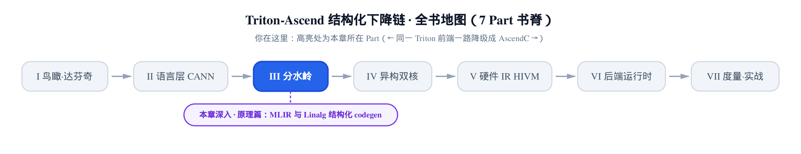
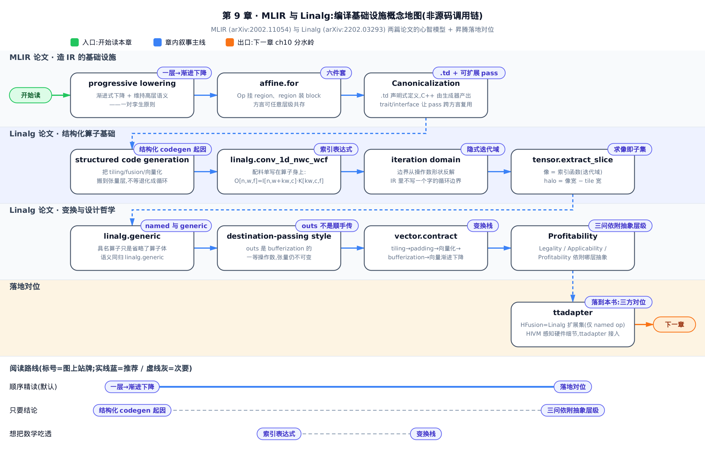
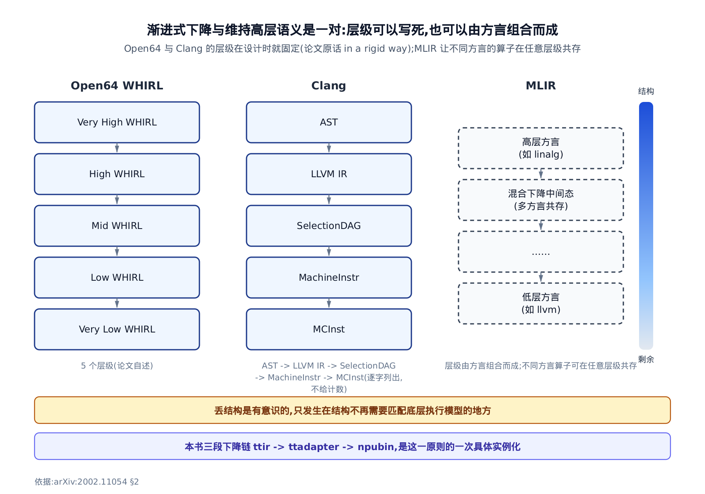
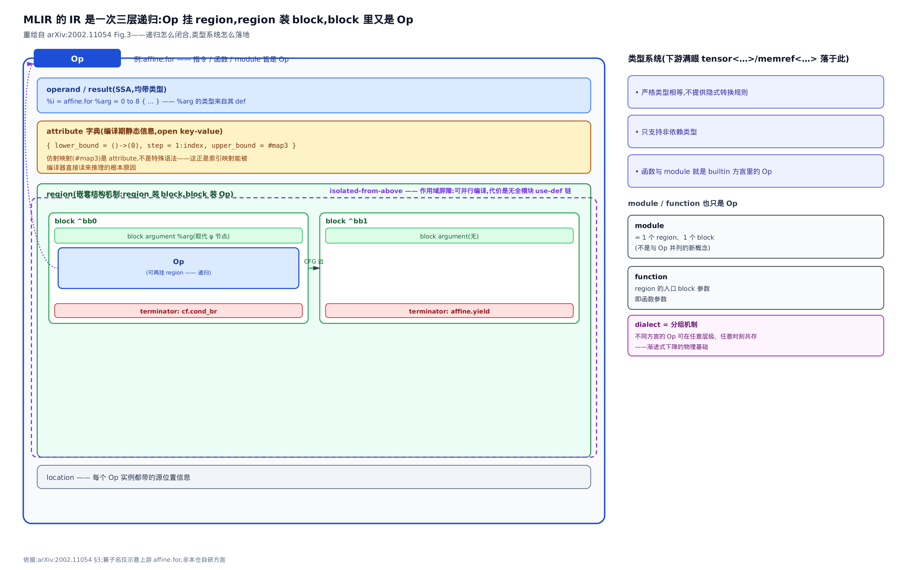
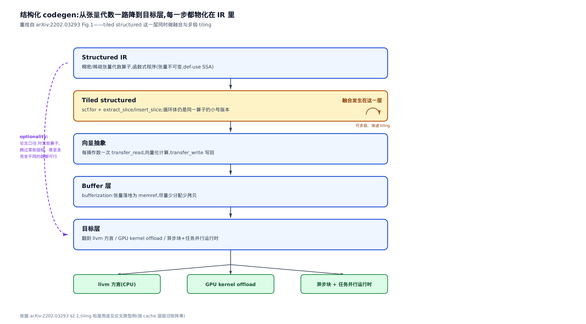
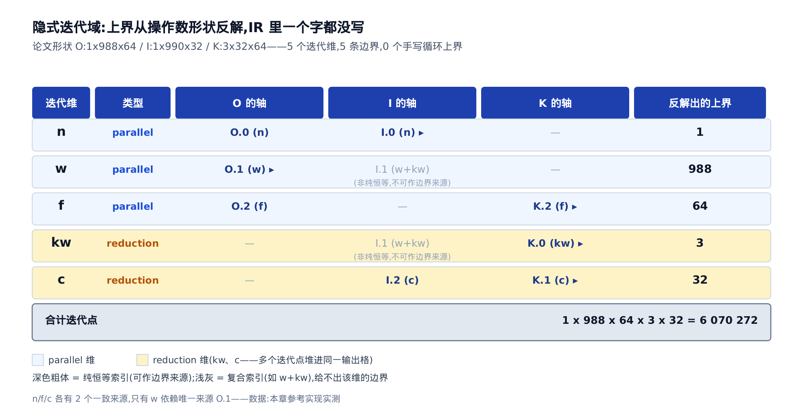
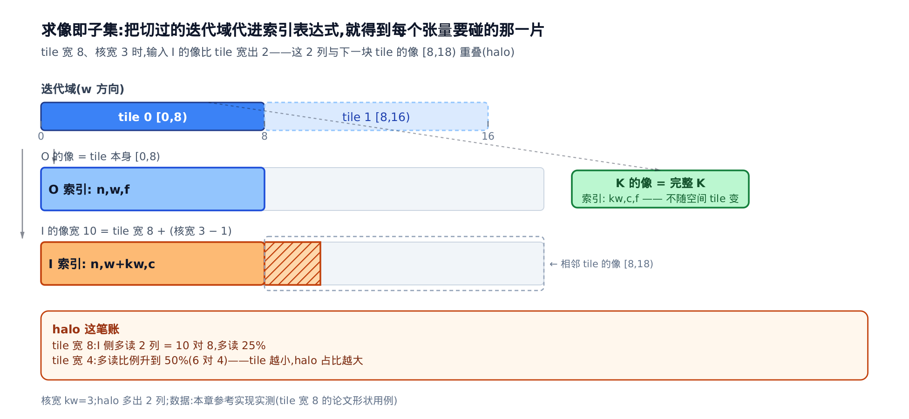
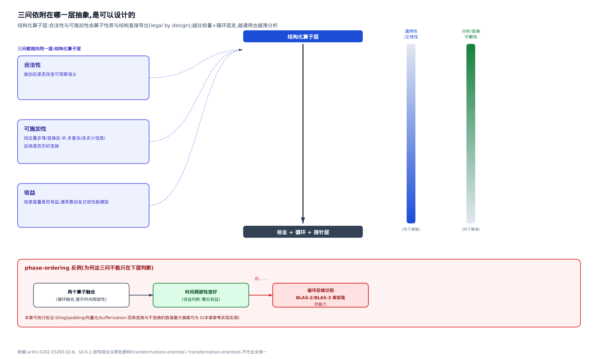

# MLIR 与 Linalg：结构化张量 codegen 的编译基础设施



> 上一章：拆完语言层最后一组编排入口——作用域、同步与流水线提示。
> 本章：补上 MLIR 与 Linalg 两篇论文的心智模型，为整个 Part III 打底。
> 下一章：进入分水岭，看 Triton IR 怎么被降成结构化的 Linalg。

到这里，语言层的账已经算清了：`tl.*` 怎么分发、昇腾的内建算子长什么样、提示信息怎么贴到 IR 上。再往下一步，故事就换了主角——[第 1 章](../../ch01-birdseye-ascend-backend/narrative/chapter.md)立起的那条三段下降链 `ttir → ttadapter → npubin`，第二段 `ttadapter` 要把 Triton 的 IR（Intermediate Representation，中间表示）翻成 **Linalg**，再往下交给 **HFusion**、**HIVM** 两个昇腾自研方言。

问题是：这些名字为什么长这样？为什么后端要在「Linalg」这一层做切分与融合，而不是等它塌成普通循环再优化？为什么昇腾能往一个开源编译器框架里塞进自己的两层 IR，而不必 fork 整个 MLIR？

这些问题的答案不在昇腾的代码里，在两篇论文里：

- **[MLIR]** *MLIR: A Compiler Infrastructure for the End of Moore's Law*，**arXiv:2002.11054**（Lattner 等 10 人，v2 / 2020-03-01，21 页）——它回答「**怎么造一层 IR**」。
- **[Linalg]** *Composable and Modular Code Generation in MLIR: A Structured and Retargetable Approach to Tensor Compiler Construction*，**arXiv:2202.03293**（Vasilache 等 12 人，v1 / 2022-02-07，43 页）——它回答「**张量计算该造成什么样的 IR**」。

本章是一块**原理先修**：不解读昇腾源码的实现细节，只把这两个答案讲透，最后做一次**概念对位**。也要把话说在前头——本仓能拿来给昇腾侧作证的**概述性文档**材料只有两份、合计 **111 行**（`third_party/ascend/AscendNPU-IR/docs/source/en/introduction/architecture.md` 78 行 + `third_party/ascend/include/TritonToLinalg/Passes.td` 33 行），都是概述性文字，没有算子清单、没有 pass 实现；另有后端主文件 `third_party/ascend/backend/compiler.py` 的三处装配/透传行，用于核实一个开关的实际取值。**承重的是两篇论文**；凡「昇腾为什么这样做」的因果，本章一律标成本书类比或明确留给后面的章节。

**怎么选读**：只想拿到「后端为什么在 Linalg 层动手」这一句结论，读「结构化 codegen：把变换搬到张量层」与「三问依附的抽象层级是可以设计的」两节；想把数学吃透，从「符号速查表」一路读到「变换栈」；只关心昇腾对位，直接跳最后两节。按顺序读，MLIR 的六件套会先立住，Linalg 的代数才有地方落。



图底部三条路线对应三种读法：**顺序精读** 是默认，从「一层→渐进下降」一路走到「落地对位」；**只要结论** 的读者从「结构化 codegen 起因」这一站所在的「结构化 codegen：把变换搬到张量层」一节，直接跳到「三问依附的抽象层级是可以设计的」一节，中间的推导可以先欠着；**想把数学吃透** 的读者盯住「索引表达式」与「变换栈」两站对应的小节，它们是本章唯二真正需要动笔演算的地方。

---

## 一刀切 IR 很成功，但它只有一层

**直觉**。LLVM 与 JVM 都像一条修得极好的国道：路面质量顶级，但只有一条车道宽度。开小轿车合适，开加长挂车就得自己另修一条路。

**机制**。MLIR 论文开篇把这件事说得很直接——这些成熟平台的共同特征是「one size fits all」，只提供**单一抽象层**作为与系统对接的接口：LLVM IR 大体是「带向量的 C」，JVM 提供的是「带垃圾回收的面向对象类型系统」[MLIR §1]。

单层抽象的代价，是**每个领域各自造 IR**。论文点名：Swift、Rust、Julia、Fortran 各自发展了自己的 IR，用来做语言/库专属优化、流敏感的类型检查，以及改善下降过程的实现；机器学习系统则普遍拿「ML 图」当自己的领域专用抽象 [MLIR §1]。造 IR 的工程成本高得离谱，基础设施质量往往排不进优先级，于是用户吃到的是编译慢、实现有 bug、诊断质量差、优化之后的代码难调试 [MLIR §1]。

**论文的解法**——注意它不是「再造一个更好的 IR」：

> [MLIR §1] "MLIR does this by (1) standardizing the Static Single Assignment (SSA)-based IR data structures, (2) providing a declarative system for defining IR dialects, and (3) providing a wide range of common infrastructure (including documentation, parsing and printing logic, location tracking, multithreaded compilation support, pass management, etc)."

三件事：**标准化基于 SSA 的 IR 数据结构**（SSA，Static Single Assignment，静态单赋值——每个值只被赋值一次的 IR 形式，数据流分析因此简单而稀疏）、**提供一套声明式的方言定义系统**、**提供一整套公共基础设施**（文档、解析与打印、位置追踪、多线程编译支持、pass 管理等；pass 是编译器里一趟独立的分析或变换）。

**这是本章的题眼**：MLIR 不给你一个更好的 IR，它给你**造 IR 的基础设施**。读者可以先把这句话按在心里——昇腾之所以能自己长出 HFusion 与 HIVM 两个方言，而不必去改上游社区的代码，前提就在这一句上。

---

## 一对孪生原则：渐进式下降，与「降之前别把结构丢了」

**直觉**。下楼不要从三楼直接跳到一楼；而且下楼之前，别把手里那摞按顺序理好的文件先扬了——楼下再想重排，就得靠猜。

**机制**。[MLIR §2] 依次给出了系统的设计原则。论文以加粗小标题分段、没有自行编号，**本书通读 §2 的清点口径是 7 条**：极少内建概念而一切可定制、SSA 与 region、渐进式下降、维持高层语义、IR 验证、声明式重写模式、源位置追踪与可追溯性。其中第三、第四条是本章从头用到尾的**一对**。

先看「渐进式下降」（progressive lowering）的原始定义：

> [MLIR §2] "The system should support progressive lowering, i.e. from the higher-level representation down to the lowest-level, with the lowering being performed in small steps along multiple abstraction levels."

论文紧接着把它和既有做法对照：Open64 的 WHIRL 表示有**五个层级**，Clang（LLVM 的 C/C++ 前端）也是从 AST（抽象语法树）逐级下到 LLVM IR → SelectionDAG（指令选择用的有向无环图）→ MachineInstr（机器指令）→ MCInst（更低层的机器码指令对象）——但论文的评价是，**这些层级是写死的**（原话 in a rigid way），而可扩展性要求更灵活的设计 [MLIR §2]。

再看它的孪生条款「维持高层语义」：

> [MLIR §2] "the system should maintain structure of computation and progressively lower to the hardware abstraction. The loss of structure is then conscious and happens only where the structure is no longer needed to match the underlying execution model."

一句「一步一步降」，一句「降之前别把结构丢了」。注意论文自己带着条件：丢结构必须是**有意识的**，而且**只发生在结构不再需要匹配底层执行模型的地方**——不是「永不丢结构」。论文举的例子正是循环结构：一旦丢掉它、退回 CFG（Control Flow Graph，控制流图）形式的控制流，「实质上意味着这一层不会再做任何变换了」[MLIR §2]。



*图注：三栏对照——左两栏台阶是实线钉死的，右栏 MLIR 的台阶由方言组合而成。右侧那条渐变条是「结构信息剩余量」，它到最后一级才明显掉下来。底部那行把本书的 `ttir → ttadapter → npubin` 对齐上去：那条链不是三次神秘翻译，是同一条原则的一次具体实例化（重绘依据：arXiv:2002.11054 §2）。*

**这一对原则还有一个直接推论：混合抽象层级**——同一份 IR 里，一部分保持高层、另一部分已经下降 [MLIR §2]。这条推论下一节就要兑现成 IR 的具体构件。另有一个容易被跳过的后果：pass 的角色被归为四类（优化变换、使能变换、下降、清理），而系统应当允许**在单个 operation 的粒度上**混搭这四类角色，而不是在整个编译单元上排 pass 顺序 [MLIR §2]。

---

## IR 模型六件套：Op → region → block → Op 的三层递归

**直觉**。俄罗斯套娃：拧开一个娃娃，里面还是一个同类的娃娃。MLIR 的 IR 就靠这一手递归，让**同一套数据结构**既装得下 ML 计算图，也装得下循环嵌套，还装得下机器指令。

**机制**。先立**语义的唯一单位**：

> [MLIR §3] "The unit of semantics in MLIR is an “operation”, referred to as Op. Everything from “instruction” to “function” to “module” are modeled as Ops in this system. MLIR does not have a fixed set of Ops, but allows (and encourages) user-defined extensions—compiler passes treat unknown Ops conservatively"

一个 Op（operation，操作/算子）有唯一的 opcode（操作码，文本上是「方言名.操作名」的点分前缀）、零或多个 operand（操作数）与 result（结果值）——都保持 SSA 形式、都带类型；此外还能挂 attribute、region、block argument 与 location（源位置）信息 [MLIR §3]。

**最后半句「未知算子按保守方式处理」值得单独拎出来**：它是「任何人都能加算子而不破坏既有 pass」的底座。没有它，昇腾往 MLIR 生态里塞两个自研方言，等于要把每一趟既有 pass 都改一遍。

第二件是 **attribute**（属性，编译期静态信息）：

> [MLIR §3] "An MLIR attribute is structured compile-time static information, e.g., integer constant values, string data, or a list of constant floating point values. Attributes are typed, and each Op instance has an open key-value dictionary from string names to attribute values."

论文举 `affine.for`（仿射方言里的循环算子，上游 MLIR 名）为例：循环上下界与步长都是 attribute，写作 `{lower_bound = () -> (0), step = 1 : index, upper_bound = #map3}`；其中 `() -> (0)` 是内联的仿射式，`#map3` 是**属性别名**——先给某个属性值起个标签，之后凡需要属性值的地方都能用这个标签 [MLIR §3]。

**这条要记死：仿射映射在 MLIR 里是属性，不是某种特殊语法。** 后面 Linalg 的索引映射之所以能被编译器直接读来做推理，正因为它是 IR 里一等的、结构化的编译期数据——不是注释，不是外挂表格。

第三、第四件是 **region 与 block**，递归就在这里闭合：

> [MLIR §3] "An instance of an Op may have a list of attached regions. A region provides the mechanism for nested structure in MLIR: a region contains a list of blocks, and a block contains a list of operations (which may contain regions). As with attributes, the semantics of a region are defined by the operation they are attached to"

Op 挂一串 region（区域），region 装一串 block（基本块），block 装一串 Op，Op 又能再挂 region——三层一转，回到起点。配套四条事实：

- region 里的 block 之间构成一张 CFG；每个 block 以 **terminator**（终结算子）结尾，terminator 自己定义控制流的转移语义 [MLIR §3]。
- MLIR **不用 φ 节点**（传统 SSA 里在汇合点合并多条来路取值的伪指令），改用 SSA 的函数式形态：terminator 把值传给后继 block 的 **block argument**（块参数）[MLIR §3]。`affine.for` 就是拿入口 block 的参数当循环归纳变量 [MLIR §3]。
- **isolated from above**（自上隔离）：region 内的 op 通常可以用「词法上位于该 region 之外且在其上方」定义的值，但被标为 isolated-from-above 的 op 是一道作用域屏障——好处是「一个含 isolated-from-above 算子的 module 可以被 MLIR 并行处理，因为 use-def 链不会跨越隔离边界」[MLIR §3]。这道屏障也有代价——MLIR 因此没有全模块范围的 use-def 链，下一节讲 pass 管理时会把这笔账算完。
- Op 可以挂 **symbol table**（符号表）：把字符串名字关联到 IR 对象，而符号不必遵守 SSA（可以先用后定义），所以才可能表达递归函数、全局变量、具名 module [MLIR §3]。

第五件是**类型系统**，它是读者往下每一章都会撞见的东西。每个值都有类型，类型系统用户可扩展，甚至能引用外部类型系统；关键是 MLIR **强制严格类型相等检查、不提供隐式类型转换规则** [MLIR §3]，并且只支持非依赖类型 [MLIR §3]。还有一条对心智模型帮助极大的事实：**函数与 module 不是新概念，它们就是 builtin 方言里的 Op**——module 是「带一个 region、region 里一个 block」的 Op，function 是「带一个 region、region 参数即函数参数」的 Op [MLIR §3]。



*图注：中间那圈虚线回环就是递归本身。左上角的 isolated-from-above 标记是作用域屏障：换来可并行编译，代价是没有全模块 use-def 链。右栏三条类型系统事实，是读者在 Part III 之后满眼看到的 `tensor<…>` / `memref<…>` / `!tt.ptr<…>` 的落脚处——严格类型相等、不提供隐式转换规则，所以类型对不上时编译器会当场拦你，而不是悄悄转一下。*

第六件是 **dialect**（方言），也是本章最关键的一件。

**直觉**。方言就是命名空间——像 Python 的模块，`numpy.array` 和 `torch.tensor` 不会打架。但 MLIR 的方言多一条性质，这条性质才是重点。

**机制**。论文强调方言只是**逻辑分组**，本身不引入任何新语义；把所有东西塞进一个方言在技术上可行，但概念太多、名字冲突，很快会失控 [MLIR §3]。而最关键的一句是**共存**：

> [MLIR §3] "Although each Op, type and attribute belongs to exactly one dialect, MLIR explicitly supports a mix of dialects to enable progressive lowering. Ops from different dialects can coexist at any level of the IR at any time, they can use types defined in different dialects, etc."

**「不同方言的算子可以在任意时刻、任意层级共存」——这是渐进式下降在 IR 层面的物理基础。** 把这句话反过来读更清楚：没有共存，「一步一步降」就只能退化成「一次性全量翻译」——因为每一步的中间态都得是某个单一方言的合法程序，而中间态天然是半降不降的混合物。

论文自己也把这条列为最深刻、也最难领会的一点 [MLIR §6.2]：仿射方言就是例子——仿射控制流与仿射映射的定义，与 region 里那些算子的语义**无关**，于是仿射方言可以和表示目标无关算术的 standard 方言、以及多个目标专属的机器指令方言组合使用 [MLIR §6.2]。这种「用 op interface 拿到具体算子语义、从而复用通用多面体变换」的复用形态，论文说是**在其他系统中没见过的** [MLIR §6.2]。

顺带记住论文给的**互操作范式**：要接一个外部系统，就定义一个尽可能直接对应它的方言，让格式能简单可预测地来回往返；IR 进了 MLIR 之后，再用 MLIR 的全套设施升/降到更方便的表示 [MLIR §6.3]。这一条马上就要用上——`ttadapter` 面对的正是「把另一个系统（Triton 的 IR）接进 MLIR 生态」这个问题形态。

---

## 声明式基础设施：`.td` 写声明，C++ 由生成器产出

**直觉**。与其手写一千个长得差不多的 C++ 类，不如写一张表，让工具去生成那一千个类——顺带把验证器和文档也一起生成，三者从此不会各说各话。

**机制**。**ODS**（Operation Definition Specification，算子定义规范）就是这张表：

> [MLIR §4.1] "MLIR uses TableGen-based [47] specification for Operation Descriptions (ODS), defining the structure of an Op and components of its verifier declaratively. TableGen is a data modeling tool intended to help define and maintain records of domain-specific information, used extensively in LLVM."

TableGen 是 LLVM 里广泛使用的数据建模工具，写在 `.td` 文件里。一条 ODS 定义包含：唯一名字、一串描述算子性质的 **trait**（特征标记，如「无副作用」）、一串 argument（operand 与 attribute）、一串 result；argument 与 result 各有名字与类型约束；还可以写人类可读的描述用于生成文档，以及有限的自定义文本形式 [MLIR §4.1]。表达力不够时，可经 builder / printer / parser / verifier 子句注入额外 C++ 代码 [MLIR §4.1]。最后一步是：

> [MLIR §4.1] "The ODS definition is ultimately translated into C++ code (including Op classes with named accessors, verification, etc.) which interoperate with the rest of the system."

**这就是读者在本仓看到一堆 `.td` 文件的原因。** 昇腾自己的文档把这条机制写死了：

```text
# third_party/ascend/AscendNPU-IR/docs/source/en/introduction/architecture.md:L55
The bishengir directory structure is aligned with the MLIR directory structure. The include directory holds declaration files, including C++ headers (.h, .hpp) and TableGen definition files (.td); the include directory under the build directory also contains code generated by TableGen (.h.inc, .cpp.inc). The lib directory holds implementation code, including source files (.cpp) and private headers (for AscendNPU IR internal use only); the lib directory structure is largely consistent with include.
```

`bishengir` 是昇腾这套 IR 实现的目录名（也就是 AscendNPU-IR 本体）。`.td` 写声明 → TableGen 生成 `.h.inc` / `.cpp.inc`（`.inc` 是被 C++ 源文件 `#include` 进去的生成代码片段）→ 手写 `.cpp` 补实现。这与 [MLIR §4.1] 描述的机制严丝合缝。

**源码层：本仓一份 33 行的 `.td` 样本。** `ttadapter` 这一段**收官** pass 的声明就在这里（[第 1 章](../../ch01-birdseye-ascend-backend/narrative/chapter.md)拆过那条十来道 pass 的链，`triton-to-linalg` 挂在最后一道，紧接着就是 `pm.run`）。全文 33 行、声明 **2 个 pass**：

```tablegen
# third_party/ascend/include/TritonToLinalg/Passes.td:L6-L26
def TritonToLinalg : Pass<"triton-to-linalg", "mlir::ModuleOp"> {
    let summary = "Convert Triton to Linalg dialect";
    let constructor = "triton::createTritonToLinalgPass()";
    let options = [
        Option<"globalKernel", "global-kernel", 
            "bool", /*default*/"true",
            "generate a global kernel">,
        Option<"namedOps", "named-ops", 
            "bool", /*default*/"false",
            "use linalg named ops instead of linalg.generic">,
        Option<"enableNd2nzOnVector", "enable-nd2nz-on-vector", 
            "bool", /*default*/"false",
            "enable nd2nz on vector">,
        Option<"enableSelectAnalysis", "enable-select-analysis",
            "bool", /*default*/"true",
            "enable select analysis">,
        Option<"compileOn91095", "compile-on-910-95", 
            "bool", /*default*/"false",
            "compile on 910_95">
    ];
}
```

三个读点。

**第一，这里声明的是 pass，不是算子。** TableGen 在 MLIR 生态里被同一套「声明写在 `.td`、C++ 由生成器产出」的方式复用到了 pass 定义上——`Pass<"triton-to-linalg", "mlir::ModuleOp">` 的两个参数分别是 pass 的命令行名与它作用的 Op 类型（`mlir::ModuleOp` 是 C++ 类名，带 `::`，不是 IR 里的算子名）。

**第二，`let constructor` 指向一个手写的 C++ 工厂函数** `triton::createTritonToLinalgPass()`：声明式定义并不消灭手写实现，它只是把「样板」和「逻辑」切开。

**第三，`namedOps` 这个开关**（命令行写法 `--named-ops`，`.td` 里的默认值是 `false`，说明文字是 "use linalg named ops instead of linalg.generic"）。它是本章后面「named op 与 generic op」那一节在本仓的落点，稍后专门讲——包括「`.td` 里的默认值到底是不是实际编译路径上的取值」这个必须掰开的问题。另外四个开关（`globalKernel` 生成全局 kernel、`enableNd2nzOnVector` 的 nd2nz 向量化、`enableSelectAnalysis` 的 select 分析、`compileOn91095` 面向 910_95 型号编译）的**真实语义要读实现才能定论**，属于 ch10 与后面讲后端选项的章节，本章不替它们下结论。

同一份 33 行文件里还有第二个 pass 声明，用来说明「一份 `.td` 可以声明多个 pass」这一体例事实：

```tablegen
# third_party/ascend/include/TritonToLinalg/Passes.td:L28-L31
def MarkTensorKind : Pass<"mark-tensor-kind", "mlir::ModuleOp"> {
    let summary = "Mark tensor kind (INPUT/OUTPUT/INPUT_OUTPUT) on Triton function arguments";
    let constructor = "triton::createMarkTensorKindPass()";
}
```

它做什么，是 ch10 的事；这里只认体例。

**其余四件基础设施**，各一句，够用就好：

- **DRR**（Declarative Rewrite Rule，声明式重写规则）与 ODS 一样嵌在 TableGen 里，用来表达源 DAG（有向无环图）与目标 DAG 的模式、约束与优先级收益；概念上，DRR 表达的是「在给定约束下两个 DAG 等价」[MLIR §4.2]，最终同样翻成 C++。
- **pass manager**（pass 管理器）不绑定固定粒度：

  > [MLIR §4.3] "Whereas pass management in existing systems is typically defined over a fixed granularity (e.g., module, function or loop pass managers), in MLIR modules and functions are not special—they are merely Ops with regions and there can be multiple variants of them. Therefore, the MLIR pass manager is also not specialized on a fixed set of ops, but instead works on arbitrary Ops at arbitrary levels of nesting."

  **代价要和好处一起讲**：正因如此，MLIR 与 LLVM 不同，**没有全模块范围的 use-def 链**——全局对象要经符号表引用，常量则实现为带属性的 operation [MLIR §4.3]。并行编译的资格由上一节的 isolated-from-above 给出：这类 op 定义了一棵可并行处理的 region 树 [MLIR §4.3]。
- **可往返的文本形式**：IR 有完全反映内存表示的文本形式，两种形式（通用形式与自定义形式）完全可往返，每个 pass 都能单独测试；因为没有隐藏状态，「单跑一个 pass 的结果与在完整流水线里跑同一个 pass 的结果相同」[MLIR §4.4]。**这条是读者往后的实操福利**——后面几个 Part 里所有「把中间 IR dump 出来看一眼」的做法，正建立在这个属性上。
- **verifier**（验证器）先查全局结构性质——类型必须精确匹配、值只定义一次且满足支配与可见性、符号名在符号表内唯一、所有 block 以 terminator 结尾——再跑各算子与属性自己的验证器；**验证失败被视为不变量被破坏，直接中止编译** [MLIR §4.6]。文档则由 ODS 描述生成、与验证代码同源 [MLIR §4.5]。

---

## 算子开放可扩展，pass 还怎么写

**直觉**。如果谁都能往语言里加新词，词典编纂者怎么活？答案是：别编词典，编**语法规则**——只依赖词的少数几个可声明性质，而不是逐词枚举。

**机制**。[MLIR §6.1] 正面回答了这个问题，原话是「四条主要途径」（four major approaches）：

1. **基础算子 trait**——DCE（死代码消除）、CSE（公共子表达式消除）这类家常 pass 只依赖很简单的性质（「无副作用」「可交换」）。把这些性质定义成 Op trait、由算子作者在 ODS 里声明，pass 就能跨抽象域通用 [MLIR §6.1]。
2. **特权算子 hook**——有些性质一个 bit 表达不了、需要 C++ 实现，比如常量折叠。比 folding 更有意思的是 `getCanonicalizationPatterns`：它让算子作者声明适用于自己的折叠模式，从而撑起一个**能施加到所有方言**的通用 Canonicalization（正规化）pass。论文说这一个可扩展机制吃掉了 LLVM 生态里 InstCombine / DAGCombine / PeepholeOptimizer / SILCombine 一堆专用 pass 所做的事，而那些正是众所周知的维护负担 [MLIR §6.1]。
3. **优化接口**（Optimization Interfaces）——论文举内联器为例：它想同时服务 TensorFlow 图、Flang 函数与函数式语言的闭包，可它根本不知道什么是调用点、什么是被调用者。解法是把它需要知道的两件事抽成接口（能否把某算子内联进某 region、内联后落在块中间的 terminator 怎么处理），由各算子/方言自行注册实现；**没实现接口的算子，对应的优化 pass 就保守对待** [MLIR §6.1]。
4. **方言专属 pass**——完全可以写只服务某个方言的 pass，由该方言算子的完整语义驱动；在不需要泛化时，这是新变换简单有用的起点 [MLIR §6.1]。

**把这四条与前面的「未知算子保守处理」串起来看**，一个开放生态的自洽性就闭合了：新算子进来，通用 pass 靠 trait 与接口该干活干活、不认识就保守放过，谁也不会因为别人加了算子而失效。

MLIR 这半篇到此为止。接下来换第二篇论文，问题也换一个：**有了造 IR 的基础设施，张量计算该造成什么样的 IR？**

---

## 结构化 codegen：为什么把变换搬到张量层

**直觉**。想知道一条流水线上某个工位要领哪些料，有两条路：一条是蹲在车间里看它伸手抓了什么（分析），另一条是直接看它的**领料单**（结构信息）。传统 codegen 走第一条，因为程序进来时已经是「循环 + 指针」，领料单早就被撕了；ML 领域走得起第二条，因为程序本来就写在远高于循环的抽象层。

**机制**。论文先承认传统路线的成熟与它的前提：

> [Linalg §2.1] "Code generation approaches for numerical computing have traditionally focused on optimizing the performance of loop nests. Associated analyses focus on scalar elements as the body of a loop nest typically computes a single element. Such analyses must consider memory dependences and aliasing."

当输入语言是 C 或 Fortran 时，问题**本来就是**以「在预分配内存上跑的循环」形式给出的 [Linalg §2.1]——那种情况下没得选。但 ML 这类领域有奢侈的起点：

> [Linalg §2.1] "This opens up the opportunity to revisit classical loop optimizations like fusion, tiling or vectorization without the need for complicated analysis and heuristics. Advantages include reduced complexity and maintenance cost while also scaling naturally to extensions like sparse tensors, that are even more difficult to analyze at the loop level."

于是有了名字：

> [Linalg §2.1] "We refer to this approach as structured code generation since the compiler primarily leverages structural information readily available in the source code."

**一句话定性：结构化 codegen 不是「更聪明地分析循环」，而是「在还没退化成循环之前就把变换做完」。** 论文在 §1 里把病因写得更直白：过快跨越抽象鸿沟会（1）丢掉高层 IR 上本来就有的信息，（2）因为要从低层 IR 重建高层语义而加剧 phase-ordering 问题（不同优化的先后顺序互相掣肘）[Linalg §1]。

**整条流水**长这样 [Linalg §2.1]：



*图注：五个层级——Structured IR（稠密/稀疏张量上的张量代数算子，组织成函数式程序）→ Tiled structured（tiling 引入循环，循环体里仍是结构化算子；**融合也在这一层**）→ 向量抽象 → Buffer 层 → 目标层（llvm 方言跑 CPU、offload GPU kernel、或切成异步块交给任务并行运行时）。左边那条虚线旁路是论文自陈的 optionality。*

**三条必须带走的判断**，一条一条来：

**① tiling 的粒度选择服务于硬件映射。** 论文给的原型例子是「先按 cache 层级 tiling 矩阵乘，再把切小后的矩阵乘直接下降到汇编写的超优化 microkernel（针对特定尺寸手工调优的小内核）」[Linalg §2.1]。也就是说，切多大不是美学问题，是「切到刚好能喂饱下一级硬件」的工程问题。

**② 可组合性来自泛型。** 论文原话是：「tiling 与 fusion 变换在它们所作用的算子与数据类型上都是完全泛型的……它们只假定计算与复合数据上存在一种泛型的、（就集合包含而言）单调的结构化分解模式」——稠密与稀疏张量代数都具备这种分块分解模式，于是同一套 codegen 抽象泛型地适用于两者 [Linalg §2.1]。

**③ optionality（可选性）。** 论文坦白：对某些算子，跳过某些层级、甚至走一条完全不同的路，都是**可行选项**；而这之所以可能，正是因为「每一步都物化在 IR 里，几乎没有承重逻辑被藏在编译器内部复杂的 C++ 分析与启发式里」[Linalg §2.1]。论文并不声称这套流水覆盖 ML/HPC 的全部计算——它明说「不是所有问题都要在同一个抽象里解决，而应为每一类问题用最合适的抽象」[Linalg §2.1]。

**顺手把一个底座立住：融合发生在 tiled structured 这一层。** 这件事在本章证据不厚，得如实说清：论文把 fusion 与 tiling、vectorization 并列为「结构化之后可重访的经典循环优化」[Linalg §2.1]，说 tiling 与 fusion 在算子与数据类型上完全泛型 [Linalg §2.1]，并在讲 phase ordering 时拿融合当反例 [Linalg §3.6.1]——但**论文没有给融合的独立算法**。所以本章只立两句：**融合发生在哪一层**（tiled structured），**它靠什么性质成立**（与 tiling 同一套结构化分解性质）。至于融合具体怎么做，留给后面讲 HFusion 的那些章——那个方言的名字就是 Hybrid Fusion，本章先把地基垫在这儿，免得读到那里悬空。

**linalg 在方言栈的哪一层？** [Linalg §2.3] 按抽象层级由低到高列出与 codegen 相关的方言，**论文自列的编号清单共 7 个**（§2.3.1–§2.3.7）：`vector`、`gpu`、`memref`、`tensor`、`scf`、`linalg`、`sparse_tensor`。四个对本书后面最要紧的定义：

- **`memref`**——MLIR 里 n 维内存 buffer 的主表示，是进入「有副作用的内存操作」的入口。关键性质是**索引方案与底层存储解耦**：「与传统指针不同，memref 是带显式 layout 的多维 buffer」——论文举的例子是 `memref<10x10xf32, strides: [1,10]>`，存储是行主序、访问却是列主序 [Linalg §2.3.3]。
- **`tensor`**——抽象的 n 维张量类型，**还没决定内存表示**；张量值不可变、遵守 def-use 的 SSA 语义，于是 peephole（窥孔优化，在很小的一段指令窗口内做局部替换）、CSE、DCE、循环不变量外提这些经典变换可以无差别地施加到张量算子上 [Linalg §2.3.4]。因为不可变，「写入」由「值插入」类算子表达——产生一个新张量，其中某个值或某个子集被替换 [Linalg §2.3.4]。
- **`scf`**（Structured Control Flow，结构化控制流）——提供 `scf.for` / `scf.while`（无早退）与 `scf.if`，比 CFG 高一层，且 **`scf` 循环可以 yield（让出）SSA 值** [Linalg §2.3.5]。tiling 引入的循环就落在这一层。
- **`linalg`**——本章的主角：

  > [Linalg §2.3.6] "The linalg dialect provides higher-level compute primitives that can operate on both tensor and memref containers. These primitives can decompose into versions of themselves operating on structured subsets of the original input data and producing similarly structured subset of their results. They also capture program invariants and structural information, such as independency of certain parts of computation or reduction patterns, that decreases the need for expensive analyses prior to transformation."

**把这段拆成三条可检验的性质，就是 structured op（结构化算子）的定义**：① 同时作用于 `tensor` 与 `memref` 两种容器；② 能分解成「自己的小号版本」，作用在输入的结构化子集上、产出同样结构化的结果子集；③ 自带程序不变量与结构信息（哪些部分互相独立、哪些维度是归约），**从而减少变换前的昂贵分析**。

到这里，[第 1 章](../../ch01-birdseye-ascend-backend/narrative/chapter.md)里那句「`ttadapter` 把一堆裸指针翻译成规规整整的结构化 Linalg memref」总算有了准确含义：`memref` 是带 offset/size/stride 的显式 layout，`linalg` 是能自我分解的算子。下面就把「自我分解」的数学摊开——这是本章的核心。

---

## 符号速查表

下面几节的记号取自 [Linalg §3] 的卷积例子（唯一的例外见表下声明）。每个符号首现处正文里还会有一句人话解释，这张表只作随手回查。

| 符号 | 含义 | 首现节 |
|---|---|---|
| $`O`$ | 输出张量——卷积算出来的那块结果；论文此例类型 `tensor<1x988x64xf32>` | 算子自带索引表达式 |
| $`I`$ | 输入张量——被卷积核滑过去的那块数据，`tensor<1x990x32xf32>`；空间轴比 $`O`$ 长，因为滑窗要多吃「核宽减一」个位置 | 算子自带索引表达式 |
| $`K`$ | 卷积核张量，`tensor<3x32x64xf32>`——三个轴分别是核宽、输入通道、输出通道 | 算子自带索引表达式 |
| $`n`$ | batch 维的迭代器：现在算第几个样本（此例只有一个） | 算子自带索引表达式 |
| $`w`$ | 空间维的迭代器：卷积窗口滑到输出的第几个位置 | 算子自带索引表达式 |
| $`f`$ | 输出通道维的迭代器：现在算第几张输出特征图 | 算子自带索引表达式 |
| $`kw`$ | 核宽维的迭代器：窗口内部第几个抽头；它是**归约维**——扫完要把结果加起来，不各自产出一个格子 | 算子自带索引表达式 |
| $`c`$ | 输入通道维的迭代器：同样是归约维，各通道的乘积累加进同一个输出格子 | 算子自带索引表达式 |
| $`w+kw`$ | 输入侧空间轴的索引表达式：两个迭代维相加——正是这条耦合让 $`I`$ 要读的那一片比 tile 宽 | 算子自带索引表达式 |
| $`O.d`$ | 「$`O`$ 的第 $`d`$ 维尺寸」的写法；迭代域的上界直接从操作数形状读出 | 迭代域是隐式的 |
| $`\cdot`$ | 论文在索引记法里表示乘（并省略了累加号——归约由 $`kw`$、$`c`$ 是归约维这件事隐含给出） | 算子自带索引表达式 |
| $`\varphi_T`$ | 张量 $`T`$ 的索引函数：把一个迭代点映射到 $`T`$ 上要访问的那一格 | 求像即子集 |
| $`D`$ | 迭代域（做过 tiling 之后就是本块 tile 对应的那一小块迭代域） | 求像即子集 |

另有一组只在数值推演里出现的量 $`N, W_{in}, C, F, KW`$，表示对应小写迭代维的**尺寸**（首现处正文另有解释）；$`O`$、$`I`$、$`K`$ 是张量名，不属于这一组。

**一处例外先声明**：后面「多维向量算子的渐进下降」一节讲的是 [Linalg §3.5] 的**矩阵乘**例子，另起一套记号——那里的 $`M/K/N`$ 是矩阵乘的三个维度长度、$`a_k/b_k`$ 是列向量与行向量，与上表无关。尤其注意三个字母撞了名：上表的 $`K`$ 是卷积核张量、$`N`$ 是 batch 尺寸、$`C`$ 是输入通道数，而那一节的 $`K`$ 是收缩维长度、$`N`$ 是结果矩阵的列数、$`C`$ 是结果矩阵本身。到那一节正文里会再提醒一次。

---

## 算子自带索引表达式：把「配料单」写在自己身上

**直觉**。算子不写循环，它写的是一张**配料单**：要算出货架上第 $`(n, w, f)`$ 格的成品，得去 $`I`$ 的哪几格、$`K`$ 的哪几格取料。配料单贴在算子身上，编译器不用去猜。

**机制**。[Linalg §3] 一上来就以 `linalg.conv_1d_nwc_wcf`（上游 MLIR 的一维卷积具名算子，名字里 nwc/wcf 是两个操作数的轴顺序约定）为例，给出它的索引记法——一个 5 维矩形迭代域作用在 3 个张量上：

```math
O[n, w, f] \; = \; I[n, w+kw, c] \cdot K[kw, c, f]
```

论文原文用 $`\cdot`$ 表示乘、并省略了累加号，本书照录 [Linalg §3]。这一行里藏着三件事，逐件读：

- **左边只出现 $`n, w, f`$**：输出的每个格子由这三个下标定位。
- **右边多出 $`kw, c`$**：它们不出现在输出下标里，所以「同一个输出格子」会被多个迭代点反复写——这正是它们成为**归约维**的定义性原因。
- **$`I`$ 的空间轴写成 $`w+kw`$**：两个迭代维相加，是本章卷积例子里唯一一条「非纯恒等」的索引，后面 halo 与 tiling 的所有麻烦都从它来。

配上此例的类型：$`O`$ 是 `tensor<1x988x64xf32>`、$`I`$ 是 `tensor<1x990x32xf32>`、$`K`$ 是 `tensor<3x32x64xf32>`。形状之间不是随便配的，滑窗关系钉死了它们：

```math
988 \; = \; 990 - 3 + 1
```

也就是「输出空间长度 = 输入空间长度 − 核宽 + 1」——窗口宽 3，从最左端滑到最右端，能落的位置正好比输入少 2 个。

**数值推演**。把论文的形状缩到能心算的规模，但保住这条形状关系：取 $`N=1`$、$`W_{in}=8`$、$`C=2`$、$`F=3`$、$`KW=3`$，于是输出空间长度是 $`8 - 3 + 1 = 6`$，与论文的 $`988 = 990 - 3 + 1`$ 同构。（这几个大写量是对应小写迭代维的**尺寸**：$`N`$ 是 batch 数、$`W_{in}`$ 是输入空间长度、$`C`$ 是输入通道数、$`F`$ 是输出通道数、$`KW`$ 是核宽。这五个量在后面几节的数值推演里沿用同一含义；张量名 $`O`$、$`I`$、$`K`$ 不在此列。）

数据也取得能心算：输入按 $`I[0,w,c] = w+1+10c`$ 填（$`c=0`$ 那条是 1 到 8，$`c=1`$ 那条是 11 到 18），卷积核按下式填——

```math
K[kw, c, f] \; = \; (kw+1)(c+1)(f+1)
```

两个归约维都取大于 1（$`KW=3`$、$`C=2`$），确保「多个迭代点堆进同一格」这条非平凡性质真的发生。

盯住一个格子 $`O[0,0,0]`$，看这 6 个迭代点怎么把它填出来：

<!-- trace: m13-indexing-expression -->

| 迭代点 (kw,c) | 读 I 的下标 [n,w+kw,c] | I 的值 | 读 K 的下标 [kw,c,f] | K 的值 | 乘积 | O[0,0,0] 累加到 |
|---|---|---|---|---|---|---|
| kw=0, c=0 | I[0,0,0] | 1 | K[0,0,0] | 1 | 1 | 1 |
| kw=0, c=1 | I[0,0,1] | 11 | K[0,1,0] | 2 | 22 | 23 |
| kw=1, c=0 | I[0,1,0] | 2 | K[1,0,0] | 2 | 4 | 27 |
| kw=1, c=1 | I[0,1,1] | 12 | K[1,1,0] | 4 | 48 | 75 |
| kw=2, c=0 | I[0,2,0] | 3 | K[2,0,0] | 3 | 9 | 84 |
| kw=2, c=1 | I[0,2,1] | 13 | K[2,1,0] | 6 | 78 | 162 |

（数据来源：本章的论文忠实参考实现，纯 NumPy、CPU 上跑出来的结构性数值；宿主没有昇腾 NPU 与 CANN 工具链，本章**不存在任何真机数字**。）

把同一组数据交给参考实现自己走一遍迭代域，$`O[0,0,0] = 162`$，与逐行手推的最终累加值相同，偏差 0。

**不变量**：同一个输出格子的值 = 所有「输出下标相同」的迭代点的贡献之和。论证很短——输出索引表达式只含 $`(n,w,f)`$，固定这三者后 $`(kw,c)`$ 取遍 $`3 \times 2 = 6`$ 种组合，这 6 个迭代点算出的输出下标全等，于是 6 次贡献落进同一格。基例是第一个迭代点写入 1；归纳步是第 $`k+1`$ 个迭代点把自己的乘积加到累加器上，累加器只增不换格（表里 1 → 23 → 27 → 75 → 84 → 162）。因为加法结合且交换，遍历顺序不影响终值——**这正是「$`kw`$、$`c`$ 可以标成 reduction 而不必规定先后」的依据**。

**规模与结构解耦**，这是本节最该带走的量化直觉。小参数下的迭代点总数与论文形状下的迭代点总数，分别是五个维度尺寸连乘：

```math
1 \times 6 \times 3 \times 3 \times 2 = 108, \qquad 1 \times 988 \times 64 \times 3 \times 32 = 6070272
```

前者对应 18 个输出格子、每格 6 个迭代点；后者是同一条索引式撑起来的规模 [Linalg §3]。**配料单的字数没变，规模变了五万多倍。**

**术语诚实提示**（这一条会一直跟到后面几章）：论文用的措辞是 “indexing function / indexing expressions”（索引函数 / 索引表达式）。`indexing_maps` 与 `iterator_types` 这对属性名在两篇论文正文里**只出现在 `vector.contract` 上**（[Linalg §3.3] 的图例）。所以：**语义有论文支撑，属性名属于 MLIR 实现层的口径**。本章按论文口径讲「索引表达式」，读者日后在上游文档或 `.td` 里看到那对属性名，知道它们是同一件事的实现层写法即可。

---

## 迭代域是隐式的：边界不是写出来的，是反解出来的

**直觉**。菜谱不写「切 6 刀」，只写「把这根黄瓜全部切完」。刀数不是规定出来的，是黄瓜和刀法一起决定的。

**机制**。紧接着的这句是整个 structured op 思想的技术核心：

> [Linalg §3] "The iteration domain is implicit in the operation description and is such that the iterators span the entire data of the operands."

**没人手写循环边界**：迭代域由算子描述隐含地确定，且要求迭代器恰好扫过操作数的全部数据。读者不妨先自己按这条要求把不等式列一遍——每一维去找「哪个操作数的哪一轴，其索引恰好就是这个迭代维本身」，那一轴的尺寸就是上界。此例的结果是：

```math
0 \le n < O.0, \qquad 0 \le w < O.1, \qquad 0 \le f < O.2, \qquad 0 \le kw < K.0, \qquad 0 \le c < K.1
```

其中 $`O.d`$ 表示 $`O`$ 的第 $`d`$ 维尺寸 [Linalg §3]。**逐条核一遍为什么是这几个来源**：

- $`n`$：$`O`$ 的第 0 轴与 $`I`$ 的第 0 轴都是 $`n`$ 的恒等映射；论文的不等式取了 $`O.0`$。
- $`w`$：$`O`$ 的第 1 轴索引就是 $`w`$；而 $`I`$ 的空间轴写的是 $`w+kw`$，是两维之和、**不是** $`w`$ 的恒等映射，给不出 $`w`$ 的边界。
- $`f`$：$`O`$ 的第 2 轴与 $`K`$ 的第 2 轴都是 $`f`$ 的恒等映射。
- $`kw`$：只有 $`K`$ 的第 0 轴是 $`kw`$ 的恒等映射 → 上界 $`K.0`$。
- $`c`$：$`I`$ 的第 2 轴与 $`K`$ 的第 1 轴都是 $`c`$ 的恒等映射。

论文注明这些量的推导「遵循与 Tensor Comprehensions 相同的规则」，且**在稠密情形下可由连续施加 Fourier-Motzkin 消元过程得出** [Linalg §3]。这里要照论文的口径读：Fourier-Motzkin（一种逐维消去变量、求解线性不等式组的经典方法）只出现在这个限定说法里，**论文没有说 MLIR 的实现就是这么跑的**，本章也不这么说。

**数值推演**。同一段推导跑两组形状——论文的原始形状，与上一节那组小参数：

<!-- trace: m14-implicit-iteration-domain -->

| 迭代维 | 迭代器类型 | 论文写的边界来源 | 上界（论文形状） | 上界（小参数） | 本实现扫到的纯恒等来源个数 |
|---|---|---|---|---|---|
| n | parallel | O.0 | 1 | 1 | 2 |
| w | parallel | O.1 | 988 | 6 | 1 |
| f | parallel | O.2 | 64 | 3 | 2 |
| kw | reduction | K.0 | 3 | 3 | 1 |
| c | reduction | K.1 | 32 | 2 | 2 |
| 合计迭代点 | — | 五维之积 | 6070272 | 108 | 0 |

（最后一行「来源个数」填 0 是占位，合计行没有这个概念。`parallel` / `reduction` 是迭代器类型的两种取值，逐字取自 [Linalg §3.3] 的图例——前者表示该维各点互相独立，后者表示该维要归约。）

**两条诚实注记**。第一，除了 $`w`$ 与 $`kw`$（各只有 1 个来源），其余三维在本例里都不止一个纯恒等来源（$`n`$、$`f`$、$`c`$ 各有 2 个），而且这些来源给出的尺寸彼此一致；论文的不等式只写了其中一个。所以**不要写成「只能从某个张量读出」**。第二，参考实现在多来源尺寸冲突时直接报错，而不是随便挑一个——「一致」是一条可检验的必要条件，不是巧合。

**反证跑一次**，这一步很有意思：把 $`O`$（也就是 `outs` 操作数）从操作数集合里拿掉再反解，$`w`$ 维立刻找不到任何纯恒等来源，参考实现当场抛错并说明「通用推导需要 Fourier-Motzkin 消元，本参考实现不实现该步骤」。**这就是「迭代器扫过操作数全部数据」里的「操作数」天然包含输出的可运行证据**——后面讲 destination-passing style 时，这条会再回来一次。



*图注：深色粗体是纯恒等索引（可作边界来源），浅灰是复合索引。唯独输入 $`I`$ 的空间轴写作 $`w+kw`$，它给不出 $`w`$ 的边界——这也是 `outs` 必须算作操作数的原因（数据：本章参考实现）。*

**不变量**：反解出的边界既「扫得全」也「不越界」。纯恒等轴上，该轴索引就是迭代维本身，迭代维跑 $`[0, \mathrm{extent})`$，与该轴下标一一对应，扫全且不越界。复合轴上（$`I`$ 的 $`w+kw`$）算一遍：像的下界是 $`0+0=0`$，上界是 $`(988-1)+(3-1)+1 = 990`$——恰好等于 $`I`$ 第 1 轴的尺寸，一格不多一格不少。

**这一节的分量**：IR 里为这 5 条边界写下的字数是 **0**。反过来说，形状从 990 改成别的，循环边界不需要改一个字符。传统编译器要在循环层反复做的「归纳变量分析」，在这一层根本不存在——因为循环还没生出来。

---

## 求像即子集：「这块循环碰哪片数据」退化成一次代数计算

**直觉**。问「我负责的这段流水线要领哪些料」，不用去仓库翻记录——把自己的工号区间代进领料公式，算出来的区间就是答案。

**机制**。这是本章最该被读者带走的一句：

> [Linalg §3.1] "The derivation of dense subsets is obtained by computing the image of the iteration domain by the indexing function for each tensor."

迭代域是定义域，每个张量的索引函数是一个映射；把（切过的）迭代域**打到**某个张量上取像，就得到该张量要访问的那一片。写成式子，对张量 $`T`$ 与它的索引函数 $`\varphi_T`$、切过的迭代域 $`D`$：

```math
\mathrm{subset}(T) \; = \; \varphi_T(D) \; = \; \{\, \varphi_T(p) \;:\; p \in D \,\}
```

**传统编译器要靠依赖分析与别名分析回答的问题，在这里退化成求像。** 这就是「无需模式匹配就能推理循环嵌套与访存」的确切含义。

对本章这个卷积，三个张量的索引函数各不相同，求像的难易也就不同。$`O`$ 的索引全是纯恒等，像就等于 tile 本身；$`K`$ 的索引只含 $`kw, c, f`$，与空间维无关，所以按 $`w`$ 切 tile 时 $`K`$ 的像不变；$`I`$ 的空间轴是 $`w+kw`$，两个独立的加性项，像的端点可以逐项独立取到。设 tile 在 $`w`$ 上是 $`[w_{lo}, w_{hi})`$、$`kw`$ 满量程 $`[0, KW)`$，那么 $`I`$ 空间轴上能碰到的最小下标是 $`w_{lo}+0`$、最大下标是 $`(w_{hi}-1)+(KW-1)`$。而且这个像**中间没有洞**：两项都以步长 1 取遍各自的整数区间，固定 $`kw`$ 让 $`w`$ 走一遍，和就已经连续覆盖了长度为 tile 宽的一段，$`kw`$ 每加 1 这段整体右移一格，与前一段至少首尾相接、不留空隙（tile 宽至少为 1，故右移一格后两段必然搭得上），所以两端点之间的每个整数都被取到。像因此是一个**连续区间**；写成半开区间，右端要在最大下标上再加 1：

```math
\big[\; w_{lo} + 0, \;\; (w_{hi}-1) + (KW-1) + 1 \;\big)
```

像宽减去 tile 宽：

```math
\big[(w_{hi}-1)+(KW-1)+1 - w_{lo}\big] - \big[w_{hi}-w_{lo}\big] \; = \; KW - 1
```

也就是 **像宽 = tile 宽 + 核宽 − 1**，与 tile 落在哪一段无关。多出来的这 $`KW-1`$ 列，正是与相邻 tile 重叠的那部分——滑窗算子的 **halo**（边料/晕圈）。

**数值推演**。取论文的 tile size `1x8x32x1x8` 里的空间维（$`w`$ 的 tile 宽 8），再配一组小参数（输出空间长度 6、tile 宽 4，故意除不尽）：

<!-- trace: m15-subset-by-image -->

| tile | 迭代域 w 区间 | tile 宽 | I 要读的 w 区间（像） | 像宽 | 比 tile 多出 | O 要写的 w 区间（像） | K 的像 |
|---|---|---|---|---|---|---|---|
| 小参数 tile 0 | [0,4) | 4 | [0,6) | 6 | 2 | [0,4) | 完整 K（3x2x3） |
| 小参数 tile 1（边界块） | [4,6) | 2 | [4,8) | 4 | 2 | [4,6) | 完整 K（3x2x3） |
| 论文形状 tile 0 | [0,8) | 8 | [0,10) | 10 | 2 | [0,8) | 完整 K（3x32x64） |
| 论文形状 tile 123（最后一块） | [984,988) | 4 | [984,990) | 6 | 2 | [984,988) | 完整 K（3x32x64） |

驱动脚本对全部 tile（论文形状 124 块、小参数 2 块）逐块核对「像宽 = tile 宽 + 核宽 − 1」，全部通过；最后一块的像右端恰好落在 990——也就是 $`I`$ 空间轴的尺寸上，一格不越界。



*图注：斜纹那一段就是 halo。输出侧的像与 tile 严丝合缝，$`K`$ 的像整条不变——它的索引里根本没有 $`w`$。*

**注意这条结论的适用范围**：halo 来自 $`w+kw`$ 这类加性耦合索引，**纯恒等索引不产生 halo**（$`O`$ 的像就等于 tile 本身，一列都不多）。别把它外推成所有 linalg 算子的通性。另外，此处 $`K`$ 的像不随空间 tile 变，是因为本章的参考实现不对归约维分块；论文的 tile size 例子是覆盖全部 5 维的。

**不变量**：在 $`w+kw`$ 这类加性耦合索引上，像宽超出 tile 宽的部分恒等于 $`KW-1`$，与 tile 落在哪一段无关。论证里没有代入任何具体数字——上面两步只用到任取的区间端点 $`w_{lo}, w_{hi}`$，相减时两个端点双双约掉，剩下的只由核宽决定。所以它对论文形状的 124 块与小参数的 2 块同时成立——上表列出的是其中 4 块，全部块由驱动脚本逐块实测核对；而在纯恒等索引上（$`O`$ 那一列），同一个式子里 $`KW`$ 这一项根本不出现，超出量为 0。

**这笔账怎么算**，是选 tile size 时绕不开的：论文形状按 tile 宽 8 切 $`w`$，得 $`\lceil 988/8 \rceil = 124`$ 块，其中 123 块满宽 8、最后一块宽 4。每块 $`I`$ 侧多读 2 列，也就是 10 对 8、多读 25%；若 tile 宽取 4，多读比例升到 50%（6 对 4）。**tile 越小，halo 占比越大**——而算出这笔账用的是一次代数求像，不是任何依赖分析。

**向量化那一步同样吃这份索引信息**，论文把话说得很准：

> [Linalg §3.3] "The vector.transfer operations are indexed following the indexing expressions of the linalg operation. This behavior is generic for the data movement part of all linalg operations."

「通用」这个词论文只给了**数据搬运部分**，没有给计算体——这个区分在后面讲向量化时会兑现成一张表。

---

## named op 与 generic op：同一件东西的两种穿法

**直觉**。`linalg.matmul` 和一个写全了算子体的 `linalg.generic`，关系就像「毛衣」和「一件织法写在标签上的针织上衣」——是同一件衣服，只是一个把织法印出来了，一个省了。

**机制**。每个 linalg 算子都有一个**算子体**（body region），表达该计算的标量形式：

> [Linalg §3.3] "Under the hood, every linalg operation has a body region that expresses the scalar form of the computation."
>
> [Linalg §3.3, 脚注 6] "The body may be printed explicitly (when expressed in linalg.generic form) or simply elided when expressed in "named" form (such as linalg.conv_xxx)."

也就是说 `linalg.matmul`、`linalg.conv_1d_nwc_wcf` 这些**具名算子只是省略了算子体的写法**，语义上仍归结到 `linalg.generic`（那个把索引表达式、迭代器类型、算子体全部显式写出来的通用算子）。论文在与 ONNX（一种开放的神经网络交换格式）的对比里把设计意图写死：

> [Linalg §5.1] "We also minimize the range of "named" operations by making them simple declarative configurations of a small set of generic operations. Compared to a typical numerical library interface (the de facto standard until now), this greatly reduces maintenance burden and increases portability."

**刻意压小 named 算子的范围**——对照数值库式接口，大幅降低维护负担、提升可移植性。论文并点名批评了反面：ONNX 与 XLA 的 HLO（XLA 编译器的高层算子集）都出现了**算子增殖**问题，HLO「演化成一大批语义互相交叠的算子」[Linalg §5.2]。

这条设计在参考实现里可以一眼看穿——把 named 展开成 generic，改的只有一个标志位：

```python
def to_generic(op: StructuredOp) -> StructuredOp:
    """把一个 named op「展开」成 generic 形式：索引映射/迭代器类型/算子体
    原样不动，只把 `is_named` 翻成 False——因为按论文的说法，这些内容从来
    就没有因为「穿哪件衣服」而变过。返回新对象，不修改传入的 `op`。
    """
    return dataclasses.replace(op, is_named=False)
```

（`StructuredOp` 是参考实现里承载「索引表达式 + 迭代器类型 + 算子体 + 操作数」的那个数据类；`dataclasses.replace` 复制一份并只改指定字段。展开前后数值相同，且索引映射、迭代器类型、算子体是**同一份对象**，不是「恰好配置成相等」。）

**落到本仓：两个真实锚点，以及它们之间到底有没有矛盾。**

第一个锚点在昇腾的架构文档里，说的是下游那一层：

```text
# third_party/ascend/AscendNPU-IR/docs/source/en/introduction/architecture.md:L17
The HFusion (Hybrid Fusion) dialect is an extension set based on the MLIR community Linalg dialect. The HFusion dialect inherits all operations of the Linalg dialect and extends with operations not yet supported by the Linalg community. Note that the operations handled by the HFusion dialect are all named operations, so that high-level semantics are preserved as much as possible for the compiler to process. The HFusion dialect mainly includes three layers of capability: conversion layer, preprocessing, and fusion:
```

HFusion（Hybrid Fusion，昇腾自研的融合方言）被文档定义成 **Linalg 方言的扩展集**，并明说它**处理的算子全是 named operation**，理由与 [Linalg §5.1] 一致——尽量保住高层语义供编译器处理。这是文档自述口径；「继承 Linalg 全部算子」也只有这一句话，所以本章**不给任何算子计数**。文档还说 HFusion 有三层能力（conversion layer、preprocessing、fusion），本章只点名，细节属后面讲 HFusion 的章节。

第二个锚点就是前面那份 `.td` 里的 `namedOps`，`.td` 里的默认值写着 `false`。乍一看这两条像是打架：一个说下游只吃 named op，一个说上游默认不产 named op。

**但 `.td` 里的默认值管的是另一条路——命令行单跑。** 前面说过，MLIR 的每个 pass 都能拿 `triton-opt`（本仓的 MLIR 命令行驱动，只跑指定的几趟 pass）单独跑；那条路上不写 `--triton-to-linalg=named-ops=True` 就吃 `.td` 的 `false`，本仓跑这趟 pass 的 9 个命令行测试里就有 2 个走的是默认值。而**产出编译产物的那条路，装配点只有一个**，就在后端主文件里：

```python
# third_party/ascend/backend/compiler.py:L939-L951（节选）
    def add_stages(self, stages, options):
        if self.target.backend == "npu":
            stages["ttir"] = lambda src, metadata: make_ttir(src, metadata, options)
            if options.force_simt_only:
                # … 省略：force_simt_only 走另一条直通路径 …
                return
            stages["ttadapter"] = lambda src, metadata: ttir_to_linalg(
                src, metadata, options, named_ops=True
            )
```

`add_stages` 是登记「编译分几段」的方法（[第 1 章](../../ch01-birdseye-ascend-backend/narrative/chapter.md)拆过它）；`force_simt_only` 是一个走 SIMT 直通路径的选项。在 NPU 的非 `force_simt_only` 路径上，`ttadapter` 这一段挂的是 `ttir_to_linalg`，而且**显式写着 `named_ops=True`**。这个参数再往下传：

```python
# third_party/ascend/backend/compiler.py:L157-L164
        ascend.passes.ttir.add_triton_to_linalg(
            pm,
            False,
            named_ops,
            enable_nd2nz_on_vector,
            enable_select_analysis,
            compile_on_910_95
        )
```

`pm` 是 pass manager，`add_triton_to_linalg` 是把 `TritonToLinalg` 这趟 pass 连同它的选项装进 pass manager 的绑定函数——`named_ops` 就落在第三个位置上。函数签名那一头（`third_party/ascend/backend/compiler.py:L96`）写的是 `def ttir_to_linalg(mod, metadata, opt, *, named_ops=False)`，**签名默认确实是 `False`**；但这个默认值在本仓从没被用到过——`ttir_to_linalg` 全仓共 7 处 Python 调用点（上面这处装配点，加上 `third_party/ascend/unittest/` 下的 6 处示例与测试），**无一例外传 `True`**。这不是「我看了一处」，是把取值点数完了。

**所以结论是**：`.td` 声明的默认值与函数签名的默认值都是 `False`，而 Python 侧那条产出编译产物的路上，每一处调用传的都是 `True`——与 HFusion 只吃 named op 的自述**并不矛盾**。这也正是 [第 1 章](../../ch01-birdseye-ascend-backend/narrative/chapter.md)在介绍 `ttir_to_linalg`（把 TTIR 降成结构化 Linalg 的那个阶段函数）时，说它产出的是带名字的 Linalg 算子的依据。

**留一个问题给下一章**：这个开关打开之后，在实现里**具体改变哪些算子的产出形态**——哪些走了具名路径、哪些仍落成 `linalg.generic`——要读 `third_party/ascend/lib/TritonToLinalg/TritonToLinalgPass.cpp` 才能答，属于 ch10 分水岭那一章。本章只把「为什么会有这么个开关」讲清楚。

---

## `outs` 不是「顺手传个输出 buffer」

**直觉**。张量不可变，那「就地更新」怎么办？答案不是偷偷让它可变，而是**提前打一张招呼**：这个结果，将来可以写进那块地方。招呼归招呼，语义上张量仍然不可变。

**机制**。这张招呼就是 **destination-passing style**（DPS，目标传递风格）——它约束的不是当下这一步，而是后面的 **bufferization**（把不可变的张量值落实进内存 buffer / `memref` 的那一步，本章「变换栈」里单列一节细讲）：

> [Linalg §3.4] "In such operations, one of the tensor arguments is tied with the resulting tensor for in-place bufferization. Such a tensor argument is called an output tensor... Intuitively, output tensors are similar to C++ output parameters that are passed as non-const references and used for returning the result of a computation. Except these ties between an output tensor (argument) and the operation's result serve as a bufferization constraint with no observable impact on the functional semantics; in particular, output tensors still appear as immutable."

**论文的推法是第一性原理式的，值得完整走一遍**——它不是从「工程上方便」出发，而是从「结构化算子怎么和 `scf.for` 组合」推出来的：

1. `scf.for` 要 yield 一个值，那它的嵌套 region 就必须 yield **完整的张量**，而不是任意子集。
2. 可 region 里的算子通常作用在张量的**子集**上（多半是 tiling 的产物）。
3. 于是自然要成对插入 `tensor.extract_slice` 与 `tensor.insert_slice`（上游 MLIR 里读子集与写回子集的两个算子）：先切出来算，再插回完整张量。
4. 这些算子连同配套的 `scf.yield` 天然「消费掉」自己的张量参数——参数此后不会再被使用。
5. 而「用完就不再被读」的张量，正是**就地 bufferize 的理想候选** [Linalg §3.4]。

论文最后落到一句：

> [Linalg §3.4] "linalg.generic itself is designed as a destination-passing style operation. This includes linalg.matmul and any other operation that reduces to linalg.generic."

**所以 `linalg.matmul ins(%a, %b) outs(%c)` 里的那个 `outs`，是一条编译期的 bufferization 约束**（`ins` 是输入操作数列表、`outs` 是输出张量列表）：它不改变函数式语义（张量仍不可变），只告诉后面的 bufferization「结果可以写进这块」。

**这条还有一个前面欠下的呼应**：上一节反解迭代域时，$`w`$ 的边界只能从 $`O`$ 读出——也就是说，**`outs` 不只是「输出」，它同时是迭代域推导的一等信息来源**。参考实现把这件事直接做进了接口：求值函数的输出形状参数是调用方必须显式给出的，不是内部算出来的。两条线在这里合流：`outs` 之所以是一等操作数，既因为迭代域需要它，也因为 bufferization 需要它。

---

## 变换栈：tiling → padding/packing → 向量化 → bufferization → 向量渐进下降

有了「索引表达式 + 隐式迭代域 + 求像」这三件工具，论文用**同一个卷积例子**把整条变换链走了一遍。往下五节按论文顺序来，每一节先给直觉，再给数值。

### tiling 的不动点：循环体里仍然是同一个算子

**直觉**。把一整块蛋糕切成小块，切完每一块**还是蛋糕**，不是面粉和鸡蛋。

**机制**。

> [Linalg §3.1] "Tiling the operation introduces scf.for loops as well as subset operations (tensor.extract_slice and tensor.insert_slice) to access the tiled data... The tiled form of the operation is itself a linalg.conv_1d_nwc_wcf operating on the tiled subsets."

这是 structured op 最反直觉、也最关键的性质：**tiling 之后，循环体里不是标量语句，而是同一个算子的小号版本**。（**「不动点」是本书的说法**：论文只陈述了「切完的形态本身还是一个 `linalg.conv_1d_nwc_wcf`」这个事实，没有用不动点这个词，也没有把它写成一条命名性质。）所以变换可以继续叠——再 tiling 一次、做融合、再向量化。这里所有算子名都是**上游 MLIR/Linalg 层**的名字，不是 `ttadapter` 的产物。

论文也诚实交代了 tiling 带来的麻烦：所选 tile size（此例 `1x8x32x1x8`）虽然是静态的，但有些除法除不尽，边界 tile 要按「满/不满」分类，于是**没有哪个静态张量类型对每次循环迭代都合法**，被切出来的张量类型必须放松成动态形状；后续单独的 canonicalization 再把能确定的部分重新静态化 [Linalg §3.1]。此外，「tiling on tensors」引入的 `scf.for` 会在每次迭代 yield 完整张量值，**避免多余的分配与拷贝是 bufferization 的责任** [Linalg §3.1]——这笔账下面第四小节会算。

**数值推演**。同一段 tiling 代码跑两种 tile 宽：4（对输出空间长度 6 除不尽）与 3（除得尽）：

<!-- trace: m16-tiling-same-op -->

| tile size | tile 序号 | 迭代域 w | 局部 I 切片形状 | 局部输出类型 | 循环体里的算子 | 与不切时的最大偏差 |
|---|---|---|---|---|---|---|
| tile_w=4 | 0 | [0,4) | 1x6x2 | 1x4x3 | conv_1d_nwc_wcf（与外层同一个对象） | 0 |
| tile_w=4 | 1 | [4,6) | 1x4x2 | 1x2x3 | conv_1d_nwc_wcf（与外层同一个对象） | 0 |
| tile_w=3 | 0 | [0,3) | 1x5x2 | 1x3x3 | conv_1d_nwc_wcf（与外层同一个对象） | 0 |
| tile_w=3 | 1 | [3,6) | 1x5x2 | 1x3x3 | conv_1d_nwc_wcf（与外层同一个对象） | 0 |

**先说清「同一个对象」这一列是什么意思**：参考实现让循环体复用**同一个 Python 对象**，是为了让「结构字段一个没变」这件事可以直接检验（对象同一 ⇒ 字段必然全等）。真实的 MLIR 里 tiling **会新建一个同名算子实例**放进循环体，不会共享外层那个 op（这是 MLIR 实现层的事实，不是论文断言）。所以「不动点」说的是**结构字段**——算子名字、索引表达式、迭代器类型——切前切后不变，不是对象层面的同一。

看第一、第二行：tile 宽 4 切长度 6，两块的**局部输出类型不同**（1x4x3 与 1x2x3）——论文说的「没有哪个静态张量类型对每次迭代都合法」，就在这两行里。再看第三、第四行：tile 宽 3 除得尽，两块类型相同。所以**不能反过来说「tiling 一定产生动态形状」**，那取决于除不除得尽。

局部 $`I`$ 切片形状也值得看一眼：tile 宽 4 那块是 1x6x2（$`6 = 4+3-1`$），边界块 tile 宽 2 那块是 1x4x2（$`4 = 2+3-1`$）——正是上一节那条像宽公式在这里的兑现。

端到端核对：切与不切的结果最大偏差 0（两种 tile 宽皆是）；循环体里执行的算子在参考实现里就是循环外那个对象本身（如上所述，这是为了让结构字段的不变性可直接检验），迭代器类型仍是 3 个 parallel 加 2 个 reduction。


*图注：左右两个方块同名同色，这就是「不动点」的全部含义——变的只有操作数形状，算子的结构字段没变（左右是两个同名实例，不是同一个 op）。底部那行标出迭代器类型切前切后相同、与不切时的数值偏差为 0（数值：本章参考实现）。*

**不变量**：tiling 是一个不动点变换——算子的名字、索引表达式、迭代器类型在切前切后完全不变，变的只有操作数形状。论证：切分只改写迭代域的区间上下界，不触碰算子的任何结构字段；每次求值都从**局部**操作数形状重新反解一次迭代域，所以结构信息与规模天然解耦。基例是不切时整个迭代域就是一块 tile；归纳步是任取一块 tile，其局部迭代域仍是矩形，切分可以原样再作用一次。数值不变则由「每块 tile 写入的输出区间互不相交、并集是全域」保证。

**切法变、块数变、类型可能变，算子不变**——这条不变量是后续所有变换能继续叠加的前提。

### padding 与 packing：把动态边界磨平

**直觉**。拼货：最后一箱没装满，为了让所有箱子同规格好搬运，得往里塞填充物。填充物必须是「加进去等于没加」的东西——对求和来说是 0，对连乘是 1，对取最大值是负无穷。塞错了，货就被算贵了。

**机制**。tile 内容变动态会妨碍向量化（向量化要求静态尺寸）。论文给出**三种缓解手段**（§3.2 自列的编号清单）：

1. **多级循环剥离（peeling）或版本化**：把静态已知的主体隔离到主循环，边界走 cleanup 循环；cleanup 仍是动态的，但总可以按 1 来 tiling、退化成尺寸为 1 的维度再细粒度向量化 [Linalg §3.2]。
2. **padding**：把动态 tile 补到更大的、静态已知的尺寸。**补的值必须是消费该 tile 的算子的幺元（neutral element，运算的单位元）**；代价是边界处多出拷贝与计算，但所有 tile 都变成满 tile [Linalg §3.2]。
3. **显式 masking**：论文明说「work in progress and outside the scope of this paper」[Linalg §3.2]——本章同样不展开。

第 2 条是一条**正确性条件**，不是「随便补 0」。不过论文这句「消费该 tile 的算子」要落到**归约算子**上读，否则会被字面意思带偏：真正的条件是**补出的那部分对归约的贡献等于归约的幺元**，而不是「每个操作数都补自己那一步运算的幺元」。以卷积这种乘加体为例：就地消费 $`I`$ 的是乘法、乘法的幺元是 1，若按那条朴素规则「每个操作数补自己那步运算的幺元」补（$`I{\leftarrow}1`$、$`K{\leftarrow}1`$），每个假通道仍会贡献 $`3 \times (1 \times 1) = 3`$、两个假通道共错 6——补了「幺元」，结果照样不对。下面那张表的第三行更极端：$`K`$ 侧还留了个未清零的残留值 3，于是错 18。正确的读法是——补出的那几项要让**加法归约**这一头拿到 0，而乘积为 0 只需两个因子之一取 0 就够（这正是下面 $`K`$ 侧补 999 也无妨的原因）。参考实现把这条读法做成一张查表，表里列的正是归约算子：

```python
NEUTRAL_ELEMENTS = {
    "sum": 0.0,
    "prod": 1.0,
    "max": float("-inf"),
    "min": float("inf"),
}
```

**数值推演**，把「补错幺元 → 结果错」做成一个可运行的反例。取 $`N=1`$、$`W_{in}=8`$、$`C=4`$、$`F=2`$、$`KW=3`$，$`K`$ 全取 1 便于心算；输入仍按前面那条 $`I[0,w,c] = w+1+10c`$ 填（这样下表的 108 与 204 都能自己复算）；把归约维（输入通道 $`c`$，真实 4 个）手工切成 $`[0,3)`$ 与 $`[3,4)`$ 两段。第二段只有 1 个真实通道，要补到静态尺寸 3 才能与第一段共用同一份满块代码，于是补出 2 个假通道：

<!-- trace: m17-padding-packing -->

| 场景 | I 侧补位值 | K 侧补位值 | 补出的假通道数 | O[0,0,0] | 参考值（不分段） | 与参考的最大偏差 |
|---|---|---|---|---|---|---|
| 第一段 c∈[0,3) 单独算 | — | — | 0 | 108 | 204 | — |
| ＋第二段补正确幺元 | 0 | 999 | 2 | 204 | 204 | 0 |
| ＋第二段补错误幺元 | 1 | 3 | 2 | 222 | 204 | 18 |

**第二行的 999 是故意的**：$`I`$ 侧补的是加法的幺元 0，乘出来恒为 0，所以 $`K`$ 侧补一个多荒唐的数都不影响结果。**正确性条件落在「补出的部分对归约的贡献等于归约的幺元」上，不是「所有补位都得清零」**——这个区分，用一个 999 比一段解释更省事。

第三行的偏差可以手算核对——注意它算的是**残留值**那一行（$`K`$ 侧的 3 是没清零的残留数据，不是任何一步运算的幺元）。$`I`$ 侧补 1、$`K`$ 侧留 3，于是每个假通道对该输出格子的贡献是：

```math
\sum_{kw=0}^{KW-1} 1 \times 3 \; = \; 3 \times 3 \; = \; 9
```

2 个假通道共 18——与实测偏差逐位吻合。**注意这条论证依赖「幺元由归约算子决定」**（这正是论文那条正确性条件的落点 [Linalg §3.2]）：换成连乘归约，补 0 反而会把结果清零，该补的是 1。

**不变量**：只要补出的那部分对**归约算子**的贡献等于该归约的幺元，补齐前后这一格的输出值相等——上表补对幺元的那一行偏差是 0，补错的那一行偏差 18 也与上面的手算逐位吻合。这条性质不绑定在加法上：换成连乘归约，该补的幺元从 0 换成 1，「补幺元不改变结果」依旧成立，变的只是补哪个数。

**packing 是 padding 的延伸**：对存在时间复用的算子，可以把 pad 操作**外提**出 tile 循环，把补齐后的 tile 存进一个更高维的 packed 张量。好处论文记了两层：摊薄拷贝成本，以及把这些 tile 在内存里**连续排布**——从而缩短短时间内被复用的 tile 之间的内存距离、减少 TLB miss（Translation Lookaside Buffer，页表缓存未命中）[Linalg §3.2]。外提层数可按张量配置，在内存占用、拷贝成本与计算收益之间权衡 [Linalg §3.2]。

代价是可以数出来的：本例第二段补出 2 个假通道、占补齐后 3 个通道的三分之二——这一段的乘加有三分之二是白算的，换来的是两段共用一份满块代码。

**这里要挑明一件事**：「补齐 + 打包成连续 tile」这个动机，与[第 2 章](../../ch02-davinci-npu-hardware-model/narrative/chapter.md)讲的昇腾末轴对齐、显式搬运代价是同一类问题的不同实例——但**论文没有讲 NPU**，两者的联系是本书的类比，不是论文断言。

### 向量化：搬运通用，计算体分五种情形

**直觉**。搬运和加工要分开看。搬运（把数据从内存取进向量寄存器、算完再写回）对所有 linalg 算子是同一套动作，因为搬哪几格由索引表达式直接给出；加工才要看情况。

**机制**。`linalg` 算子的向量化配方是：为每个操作数引入一个 `vector.transfer_read`，以向量形式完成计算，再经 `vector.transfer_write` 写回张量或 buffer；其中 `vector.transfer` 的索引跟随 linalg 算子的索引表达式，**这部分对所有 linalg 算子是通用的** [Linalg §3.3]。论文称 `vector.transfer` 是「弥合内存与向量之间鸿沟的瑞士军刀」：它携带足够信息以编码广播、置换、掩码、补齐等多维向量访存模式，因而易于重定向到不同的内存子系统与向量 ISA（指令集架构）[Linalg §3.3]。

**计算体则分五种情形**（§3.3 自列的编号清单）[Linalg §3.3]：

| 论文编号 | 情形 | 处理 |
|---|---|---|
| (1) | 逐点算子——索引全为恒等，每个输出格子只由对位的输入格子决定 | 算子体里每条运算直接写成逐点的向量变体 |
| (2) | 低维操作数——某个操作数的维度比迭代域低 | `vector.broadcast` 升到高维，归约到情形 (1) |
| (3) | 索引表达式里有置换——轴的顺序被换过 | 用 `vector.transpose` 处理 |
| (4) | 有归约维——迭代器类型里出现 reduction | 视对算子体的进一步分析，下降成一等的 `vector.contract` 或 `vector.multi_reduction` |
| (5) | 滑窗模式（如卷积）——索引里有加性耦合 | 沿某些维度展开并抽取切片，进而归结为 `vector.contract` 或 `vector.fma`；论文称这一简单策略「在覆盖 strided 与 dilated 卷积的同时交付了高性能」 |

**数值推演**。参考实现覆盖情形 (1)（逐点）与情形 (4)（有归约维）两条路，情形 (5)（滑窗）显式拒绝而不是假装支持：

<!-- trace: m18-vectorization-cases -->

| 情形 | 算子 | parallel / reduction 维数 | 计算体走哪条路 | transfer_read 次数 | 与逐点参考求值的最大偏差 |
|---|---|---|---|---|---|
| (1) 逐点 | pointwise_add | 2 / 0 | 整块逐元素运算 | 2 | 0 |
| (4) 有归约维 | matmul | 2 / 1 | 收缩（einsum ac,cb->ab） | 2 | 0 |
| (5) 滑窗 | conv_1d_nwc_wcf | 3 / 2 | 本参考实现显式拒绝（NotImplementedError） | 2 | — |

（`pointwise_add` 是参考实现自己挑的最简逐点算子，两篇论文对情形 (1) 只有泛泛描述、没有点名具体算子；`einsum` 是 NumPy 里按下标串表达张量收缩的函数，下标串里的字母是按迭代维序号机械分配的，不是论文的记号。**「参考实现不实现」不等于「MLIR 做不到」**——论文对情形 (5) 明说该策略交付了高性能。）

**读这张表要盯两列**。「transfer_read 次数」一列三行完全一致：每个**输入**操作数恰好一次读、结果一次写（卷积的第三个操作数 `outs` 是被写的那一头，不计在读里），读写下标直接抄自算子的索引表达式（卷积那行读的就是 $`n, w+kw, c`$ 与 $`kw, c, f`$）——**这正是论文说「这部分对所有 linalg 算子通用」的那个「这部分」**。而「计算体走哪条路」一列三行分道扬镳。同一套搬运、三种加工，论文把「通用」这个词只给数据搬运部分，原因就在这张表里。

**不变量**：向量化前后逐元素一致，而且**判定走哪条路只需要读算子的索引表达式与迭代器类型这两项结构信息**——不需要看数据，也不需要分析外层循环。情形 (1)：无归约维且各操作数的索引映射与结果相同，输入输出格子一一对应，整块逐元素运算与逐点求值同构。情形 (4)：索引映射是迭代维的纯置换，可以机械翻成收缩下标串，求和的那个字母恰是标了 reduction 的那一维。情形 (5)：卷积的 $`w+kw`$ 不是纯置换，翻译规则直接不成立，于是报错而不是猜。

论文对这一整套的收尾很关键：**「所有这些变换都沿 SSA def-use 链实现，且按设计即合法（legal by design）」** [Linalg §3.3]。

### bufferization：把不可变张量落进内存

**直觉**。张量是「值」，写一笔就等于生出一份新的；内存是「地方」，写一笔就是把原地覆盖掉。bufferization 就是把前者落实成后者，还要尽量少买新地方。

**机制**。

> [Linalg §3.4] "Bufferization is the process of materializing tensor values into memory (memref). It is necessary to make tensor programs concretely executable with a source of data residing in memory. In our current compilation pipeline, it is one of the last steps."

注意论文的措辞是「靠后的步骤**之一**」，不是「最后一步」。目标写得很直白：**尽可能少分配、尽可能少拷贝**；buffer 要尽量复用与就地更新，否则程序变换会带来意料之外的分配与拷贝，代价很大 [Linalg §3.4]。难点是 **read-after-write 冲突**（写后读，也称 RAW）：为每次写都新分配 buffer 永远安全但浪费；复用并就地写则可能非法——若被覆盖位置的原数据在之后还要被读 [Linalg §3.4]。论文把高效 bufferization 类比为寄存器合并问题 [Linalg §3.4]。启发式的落点，就是前面那节的 destination-passing style。

**数值推演**。把「永远安全但浪费」和「就地写」两条路都实现出来，数分配次数：

<!-- trace: m21-bufferization -->

| tile_w | tile 数 | naive 分配次数 | DPS 分配次数 | 省下 | naive 与 DPS 的数值偏差 | 与不切参考的偏差 |
|---|---|---|---|---|---|---|
| 1 | 6 | 7 | 1 | 6 | 0 | 0 |
| 2 | 3 | 4 | 1 | 3 | 0 | 0 |
| 4 | 2 | 3 | 1 | 2 | 0 | 0 |

关系式一眼可见：**naive = tile 数 + 1，DPS 恒为 1**。朴素路径初始分配一次、每块 tile 再整份复制一次；DPS 路径只在开头分配 `outs` 那一次。而两条路径的输出逐元素相同，也都与「不切、一次算完」的参考结果相同——**语义没变，变的只有分配次数**。这就是「`outs` 是一条 bufferization 约束、对函数式语义无可观察影响」这句话的可运行形态。

**不变量**：就地写在本例里合法，因为各块 tile 写入的输出区间两两不相交、并集恰是全域，不存在「被覆盖的位置之后还要被读」的冲突。论证：输出侧索引是纯恒等，切分把 $`w`$ 的区间切成半开区间的不相交并集，求像后各块输出区间互不相交。**这条论证成立的前提是输出区间不相交**——论文强调的难点，正是当它不成立时，复用并就地写可能非法。

省下的分配次数正比于 tile 数，**而 tile 数恰恰是 tiling 那一步为了适配硬件而调大的量**：切得越细，朴素路径浪费越大。（这些是 CPU 上的分配次数，不是耗时，也与昇腾没有对位关系。）

### 多维向量算子的渐进下降

**直觉**。下楼梯不是从三楼直接跳到一楼。向量化之后的算子还要一级一级往下拆，每下一级都顺手做折叠与 peephole，IR 反而越来越小。

**机制**。[Linalg §3.5] 是「渐进式下降」原则的教科书演示，从向量化后的矩阵乘出发，共五步：

- **(a) vector unrolling**（向量展开）——两个目的：把向量算子拆成目标已知支持的尺寸（如映射到 AMX 这类矩阵扩展指令），以及提前把非 2 的幂尺寸拆成 2 的幂的组合（例：`vector<12xf32>` 拆成 3 个 `vector<4xf32>`），以免后端产出次优代码。
- **(b)** 把 `vector.transfer_read` 里的转置物化出来。
- **(c)** 生成 1 维 load 与广播。
- **(d)** 把 `vector.contract` 降成外积（论文注明也可选内积或 LLVM 矩阵 intrinsic）。
- **(e)** 进而映射到 SIMD 的 fused multiply-add（融合乘加）。

每一级下降都伴随折叠与 peephole，减少 IR 体量并使能后续变换；最终得到的向量 IR 作用在 `vector<8xf32>` 上（例如 AVX2 支持的宽度）[Linalg §3.5]。**这是论文的 CPU 例子**，宽度 8 与昇腾没有对位关系。

第 (d) 步的「降成外积」值得算一遍。**注意这一节换了例子**：论文这里讲的是矩阵乘，下面的 $`M, K, N`$ 是矩阵乘的三个维度长度（$`M`$、$`N`$ 是两个 parallel 维，$`K`$ 是收缩维），与前面卷积例子里表示卷积核张量的 $`K`$ 无关；$`C`$ 同理，这里是结果矩阵，不是输入通道数。矩阵乘 $`C = A B`$ 的外积展开式是定义式的重排：

```math
C \; = \; \sum_{k=0}^{K-1} a_k \, b_k^{\mathsf{T}}
```

其中 $`a_k`$ 是 $`A`$ 的第 $`k`$ 列（长 $`M`$）、$`b_k^{\mathsf{T}}`$ 是 $`B`$ 的第 $`k`$ 行（长 $`N`$），每一项都是一次秩 1 更新。这条式子是矩阵乘定义式的标准重排（线性代数常识，论文只说了「把 `vector.contract` 降成外积」这一步变换本身 [Linalg §3.5]）。维度账核一遍：

```math
a_k \, b_k^{\mathsf{T}} : \; (M \times 1)(1 \times N) \; = \; M \times N
```

与 $`C`$ 同形，$`K`$ 项相加仍是 $`M \times N`$——形状对上了。

**数值推演**。取 $`M=2`$、$`K=3`$、$`N=8`$（$`N`$ 取 8 是为了对齐论文最终那个 `vector<8xf32>`），$`A = [[1,2,3],[4,5,6]]`$，$`B`$ 的第 $`k`$ 行依次是 1 到 8、9 到 16、17 到 24。盯住累加器的两个格子：

<!-- trace: m22-progressive-vector-lowering -->

| 下降级别 | 这一级做的事 | 关键标量 | acc[0,0] 更新后 | acc[1,0] 更新后 | 校验 |
|---|---|---|---|---|---|
| (a) unrolling | 把 vector<12xf32> 拆成 vector<4xf32> | 12 = 3 × 4，余 0 | — | — | — |
| (d) 收缩 → 外积 k=0 | a 列 [1,4] 与 b 行首元素 1 的秩 1 更新 | 1 | 1 | 4 | — |
| (d) 收缩 → 外积 k=1 | a 列 [2,5] 与 b 行首元素 9 的秩 1 更新 | 18 | 19 | 49 | — |
| (d) 收缩 → 外积 k=2 | a 列 [3,6] 与 b 行首元素 17 的秩 1 更新 | 51 | 70 | 151 | — |
| (e) 落到乘加 | 3 次秩 1 更新 = 6 次宽 8 向量乘加 = 48 次标量乘加 | 48 | 70 | 151 | 与逐点参考求值偏差 0 |

（表首行 (a) 里的 12 与 4 是 [Linalg §3.5] 自带的展开例子，只用来演示展开的守恒，与本表其余各行的 $`M/K/N`$ 无关。第 (b) 步的转置物化与第 (c) 步的一维 load/广播，在纯 NumPy 数组层面没有可诚实观测的对应量，驱动脚本不模拟也不编造；这两级由前面的文字交代。表末那三个计数是按外积展开数出来的结构性计数，不是任何真实后端产出的指令数。）

**不变量**：逐级下降每一步都保持数值语义——前 $`j`$ 次秩 1 更新之和，恰是收缩维只跑前 $`j`$ 个位置的部分结果。基例 $`j=0`$：累加器全 0，等于空和。归纳步：第 $`j+1`$ 步加上 $`a_j b_j^{\mathsf{T}}`$，累加器变成前 $`j+1`$ 项之和。$`j`$ 跑满时等于完整收缩，实测的累加器左上角格子是三次更新之和：

```math
\mathrm{acc}[0,0] \; = \; 1 + 18 + 51 \; = \; 70
```

与逐点求值、与一次算完的收缩三条路逐位一致。unrolling 一侧的守恒更直白：$`12 = 3 \times 4`$ 且余 0，拆完的片段拼起来长度不变。

---

## 三问依附的抽象层级，是可以设计的

**直觉**。同一个问题，站在不同楼层问，难度天差地别。「这两个循环能不能交换」在标量层要费力分析，在结构化算子层可能只是读一眼迭代器类型。既然如此，**楼层本身就该是设计对象**。

**机制**。[Linalg §3.6] 把前面所有变换背后的方法论提炼成一句：

> [Linalg §3.6] "These transformations are legal by design, in the sense that their legality and applicability derive from the operation's properties and structure. We refer to this philosophy as transformations-oriented IR design."

（论文此处写作 “transformations-oriented”，而 §3.6.1 的标题与 §6 结论处写作 “transformation-oriented”；本书照录两处原样，不代论文统一。）

[Linalg §3.6.1] 把传统数值计算编译器的取舍拆成**三问**，这是给读者的分析框架：

- **合法性**（Legality）：哪些变换施加后不改变可观察语义？通常靠静态分析检查——例如支配性分析给出代码移动的必要条件：使用点必须仍被定义点支配。
- **可施加性**（Applicability）：找到该施加变换的位置有多难？变换后 IR 会变得多复杂？还包含「丢了多少信息、IR 是否仍可分析、后续变换是否仍容易施加」。
- **收益**（Profitability）：按某个度量，哪些变换算有益？通常由启发式或性能模型决定。

而全节的论点是：**这三问依附于哪一层抽象，是可以设计的**——

> [Linalg §3.6.1] "The finer-grained the IR, the more general and canonical the representation, but also the more intractable the analyses and transformations."

IR 越细粒度，表示越通用越正规，但分析与变换也越不可解。论文举了一个非常有说服力的 phase-ordering 反例：为提升时间局部性而做的循环融合，可能**破坏后续识别出高效 BLAS-2/BLAS-3 库实现的能力**（BLAS 是基础线性代数子程序库，2 级是矩阵-向量、3 级是矩阵-矩阵运算）[Linalg §3.6.1]。**这正是「过早下降到循环层」的代价**：融合本身在收益这一问上看着划算，可它顺手抹掉了后续识别库调用所需要的结构。



*图注：右侧两条反向渐变条是这一节的全部张力——往下走，通用性与正规性增强，分析与变换的可解性衰减。底部那条 phase-ordering 反例说明这三问为什么不能只在下层判断。本章四条变换（tiling / padding / 向量化 / bufferization）与不变换的数值最大偏差均为 0，是「legal by design」在这一章的可执行佐证（依据：arXiv:2202.03293 §3.6、§3.6.1）。*

[Linalg §3.6.2] 给出高层 IR 的第二重红利——**变换目标好指定**：绝大多数变换针对 IR 中的**单个算子**，而不是「循环」这种多算子构造；tiling、fusion、unrolling 都施加于高层算子而非循环。论文诚实注明：显式分布与软件流水这类变换仍天然附着于循环 [Linalg §3.6.2]。这条路进一步通向**把变换本身写成一个 MLIR 方言**：变换序列可以被存储、分析、变换，并与主编译器分开发布 [Linalg §3.6.2]。

**与多面体编译的关系**（读者常问，论文有正面回答）：[Linalg §5.6] 承认多面体模型（用整数点集与仿射映射精确刻画循环嵌套的优化框架）几十年来处在循环嵌套优化的前沿，也列了它未被主流采纳的原因——表示多级 tiling、并行、数据搬运与展开时，IR 比仿射调度复杂得多，需要 schedule tree 这类复杂抽象；调度与代码生成依赖指数级算法；仿射表示与 SSA 形式不可组合，从而与归纳变量正规化、循环不变量外提、向量化等 pass 产生顺序冲突。MLIR 的 `affine` 方言缓解了其中一些长期问题，但——

> [Linalg §5.6] "Structured operations avoid these problems by operating on a higher level of abstraction, involving tensor-operation-specific optimizations and lowering strategies instead."

**结构化算子不是把这些难题解决了，是靠提高抽象层级绕开了它们。** 这句话是本章方法论的收口，也是理解昇腾为什么在 Linalg 这一层而不是循环层做事的钥匙。

---

## 落到本书：MLIR/Linalg 与 `ttadapter → HFusion → HIVM` 的对位

> ⚠️ **证据强度声明**：本节的昇腾侧材料在本仓**极薄**——概述性文档只有两份，`architecture.md` 78 行、`Passes.td` 33 行，合计 111 行，都是概述性文字，没有算子清单、没有 pass 实现；本章另外用到后端主文件 `compiler.py` 的三处装配/透传行，那是为了核实 `namedOps` 开关的实际取值，不属本节的对位材料。**承重仍是两篇论文**；本节只做概念对位，凡涉及「昇腾为什么这样做」的因果，一律标为本书类比或留给后面的章节。

**先看方言这一层**。昇腾把自己的东西全部装进自研方言里，与社区方言共处一个生态：

```text
# third_party/ascend/AscendNPU-IR/docs/source/en/introduction/architecture.md:L11
The dialects designed in-house in AscendNPU IR are HFusion, HIVM, HACC, Annotation, and Scope. Among them, the HFusion dialect is responsible for hardware-relatively-independent optimization; HIVM is responsible for fine-grained awareness of NPU hardware details and for converting high-level programming languages into NPU low-level instructions; the HACC dialect is responsible for heterogeneous hardware abstraction; Annotation and Scope are responsible for marking compiler hint information for specific Operands or Operations.
```

按文档自述口径，自研方言共 **5 个**：HFusion 负责**硬件相对无关**的优化，HIVM（昇腾的硬件 IR 方言，[第 1 章](../../ch01-birdseye-ascend-backend/narrative/chapter.md)点过名）才**细粒度感知 NPU 硬件细节**并把高层语言转成 NPU 低层指令，HACC 负责异构硬件抽象，Annotation 与 Scope 负责给特定操作数或算子打编译提示标记——后两者正是[第 8 章](../../ch08-scope-sync-pipeline-hints/narrative/chapter.md)讲过的那套提示信息在 IR 侧的落点。

**这个分层本身就是 [MLIR §2]「维持高层语义、只在必要时丢结构」的一次实例化**：硬件无关的优化放在上面一层做完，硬件细节感知放在下面一层——丢结构的位置是被设计出来的，不是自然滑落的。

**再看「扩展而非侵入」**：

```text
# third_party/ascend/AscendNPU-IR/docs/source/en/introduction/architecture.md:L37
AscendNPU IR is built on the MLIR ecosystem; MLIR upstream community code is introduced as third-party. The code structure is as follows: the bishengir (i.e. AscendNPU IR) directory contains AscendNPU IR–related implementation, and the build-tools directory contains scripts and patches required to build AscendNPU IR. Enhancements to MLIR upstream by AscendNPU IR are preferably placed under bishengir/Dialect in separate dialect directories; capability is extended by adding files in these directories to avoid invasive changes to the community code. Modifications that cannot be isolated are applied via separate patch files; each patch has its own commit information for future integration with the MLIR community.
```

对上游的增强**优先放进独立的方言目录**，实在无法隔离的改动才落成独立 patch，每个 patch 带自己的提交信息以便未来回上游。这正是「方言只是分组机制、未知算子保守处理」这套设计的工程后果：**能加方言就不改上游**。

**互操作那一条也有落点**：

```text
# third_party/ascend/AscendNPU-IR/docs/source/en/introduction/architecture.md:L72
The IR is mainly composed of Conversion, Dialect, and tools. Conversion carries the conversion capability between dialects; Dialect contains the definitions and implementations of dialects; the tools directory defines the compilation toolchain. Conversion includes both third-party ecosystem conversions (e.g. TorchToHFusion) and internal AscendNPU IR dialect conversions (e.g. HFusionToHIVM). Under Dialect there are both in-house dialects and community dialects (internally extending and enhancing community dialects). Under tools, bishengir-compile is the command-line driver of the AscendNPU IR compiler.
```

`Conversion` 目录同时装着**生态转换**（如 TorchToHFusion）与**内部方言转换**（如 HFusionToHIVM）——对位 [MLIR §6.3] 那条互操作范式：要接一个外部系统，就定义一个尽可能直接对应它的方言。`ttadapter` 面对的正是同一类问题：把 Triton 的 IR 接进 MLIR 生态。

**最后这条是本节唯一可直接检验的对位**：

```text
# third_party/ascend/AscendNPU-IR/docs/source/en/introduction/architecture.md:L76
The AscendNPU IR toolchain is bishengir-compile, which compiles high-level tile-level OPs into NPU-hardware–aware low-level ops; both input and output of this toolchain are MLIR. The hivmc tool is responsible for converting low-level MLIR into LLVM IR and for low-level instruction compilation and optimization on LLVM IR, finally producing the operator binary.
```

`bishengir-compile`（AscendNPU-IR 编译器的命令行驱动）的**输入与输出都是 MLIR**；要到 `hivmc` 这一步才转成 LLVM IR 并做底层指令编译，最终出算子二进制。也就是说，[Linalg §2.1] 那句「每一步都物化在 IR 里，几乎没有承重逻辑被藏在编译器内部的 C++ 分析与启发式里」，在昇腾侧是**可以核对的事实**（文档口径）——这也是读者能一路 dump 中间 IR 来跟踪编译过程的前提。

**三条本章不下结论、留给后面的问题**：

1. **`ttadapter` 究竟怎么把「指针张量」变成结构化张量**——这是本书与基座 Triton 最根本的分叉，属 ch10 分水岭总览与 ch11 的指针算术逆向工程。本章只提供「为什么值得变成 Linalg」的理由，不碰实现。
2. **`namedOps` 打开之后，具体改变了哪些算子的产出形态**——前面已经确认实际编译路径上传的是 `True`，但「哪些算子因此走具名路径」要读 `TritonToLinalgPass.cpp` 才能答，属 ch10。
3. **昇腾的 tiling 与融合，和论文的 tiling 与融合是不是同一套机制**——论文的 tiling 面向 cache 层级与向量 ISA，昇腾面向 UB 容量、double-buffer 与 cube/vector 分工（[第 2 章](../../ch02-davinci-npu-hardware-model/narrative/chapter.md)量化过这些约束）。**形式相似不等于机制相同**，须由后面讲昇腾优化 pass 与 HIVM 的章节据源码定论。

---

## 小结：两个答案，一次实例化

这一章只讲了两件事。

**MLIR 回答「怎么造一层 IR」**：语义单位是 Op，指令、函数、module 一律是 Op；Op 挂 region、region 装 block、block 里又是 Op，递归三层就装下了从 ML 图到机器指令的一切；attribute 把编译期静态信息做成 IR 里的一等数据（仿射映射因此可以被直接读来推理）；方言只是命名空间分组，但**允许任意层级共存**——这是渐进式下降的物理基础；ODS 与 DRR 把定义与重写做成声明式，`.td` 写声明、C++ 由生成器产出；pass manager 不绑定固定粒度，代价是没有全模块 use-def 链；文本形式完全可往返，所以每个 pass 都能单独测试。

**Linalg 回答「张量计算该造成什么样的 IR」**：算子把索引表达式写在自己身上，迭代域隐式且可由「迭代器扫过操作数全部数据」反解；于是「这块循环碰哪片数据」退化成一次**求像**；于是 tiling 之后循环体里仍是同一个算子，变换可以继续叠；于是 padding 的正确性条件是一条幺元条件、向量化的分情形判定只需读结构信息、bufferization 的就地写有 `outs` 这条编译期约束兜底。这一整套的方法论收口只有一句：**合法性与可施加性从算子的性质与结构导出，而不是从低层 IR 的分析中恢复**。

**昇腾后端不是另起炉灶**，而是在这两个答案上加了一层硬件专属的方言：`ttadapter` 把 Triton IR 接进 MLIR 生态，HFusion 做硬件相对无关的优化（Linalg 的扩展集、只处理 named op），HIVM 做硬件细节感知与低层指令映射，`hivmc` 出二进制。本仓能给这条对位作证的概述性文档只有两份、合计 111 行（另有 `compiler.py` 的三处装配/透传行，只用于核实 `namedOps` 的实际取值），所以本章的对位一律按类比措辞写——**证据在论文，落点在后面的章节**。

回头再看[第 1 章](../../ch01-birdseye-ascend-backend/narrative/chapter.md)那张下降链图，`ttir → ttadapter → npubin` 上的每个箭头，现在都可以从「一次神秘的翻译」读成「一次有原则的渐进下降」。

下一章就走进第二个箭头：Triton 的 IR 里是一堆算术出来的指针，Linalg 要的是带 offset/size/stride 的结构化 memref，这中间隔着一整套逆向工程——那就是 ch10 分水岭：从指针张量到结构化张量。
