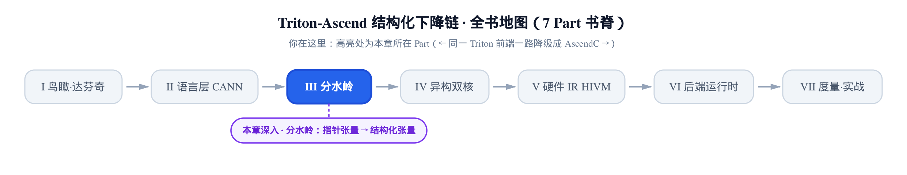
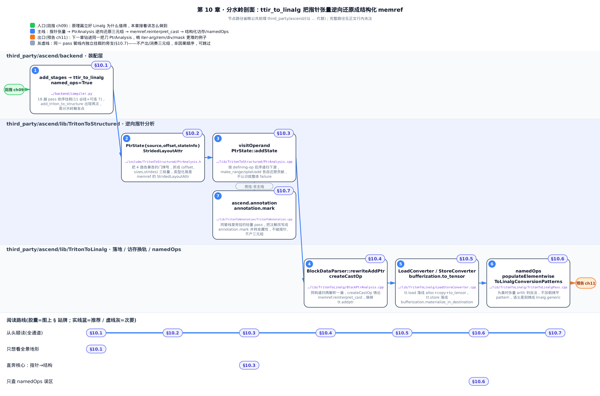
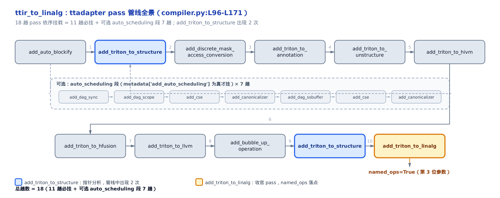
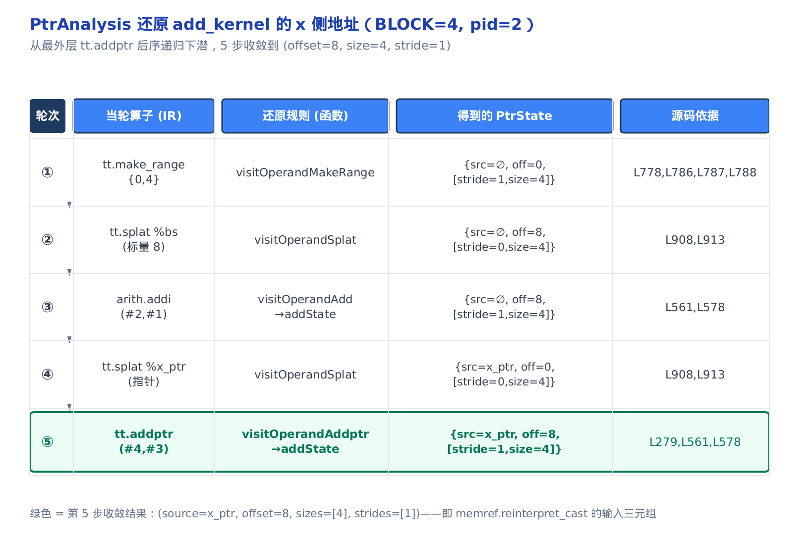
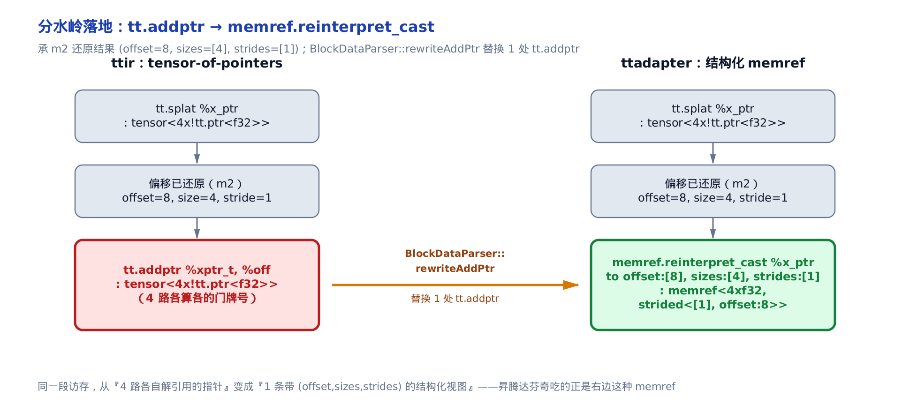

# 分水岭：从指针张量到结构化张量——triton_adapter 总览



> 上一章：原理篇讲透了 Linalg 为什么值得——索引写在算子身上，迭代域可反解。
> 这一章：把「值得」变成「怎么做」——一条 pass 管线把裸指针还原成结构化 memref。
> 下一章：还是 `PtrAnalysis` 这把手术刀，本章只走了 make_range/splat/add 这条最干净的路；下一章补上循环里的 iter-arg 怎么传递、rem/div/mask 那些绕来绕去的表达式怎么规范化——同样是逐算子，但换成难啃的例子。

同一份 Triton 前端代码，到这里开始走上一条 GPU 从不会走的路。

基座 Triton 拿到 `add_kernel` 这样的核函数，一路降到 TritonGPU、再到 LLVM，最后交给 NVPTX——全程守着 **SIMT**(Single Instruction Multiple Threads，同一条指令喂给一大片线程、每线程各持一个指针访存，GPU 执行模型，详见[第 2 章：达芬奇 NPU 硬件模型](../../ch02-davinci-npu-hardware-model/narrative/chapter.md))这套模型不撒手。昇腾达芬奇不是 SIMT 架构，它吃的是**结构化访存**：一整块规整的内存，连着搬、按维度跨步取。所以在编译器里必然有一处——**GPU 那套「一堆各算各的裸指针」被翻译成「记住哪块内存、多大、每次跨几步取」的结构化视图**。

这处翻译就是本章的主角：`ttadapter` 段的 `ttir_to_linalg` pass 管线。它是本书与基座 Triton **最根本的一处分叉**——上游的 [ch01 鸟瞰章](../../ch01-birdseye-ascend-backend/narrative/chapter.md)把它标成了三段下降链的第二段，[原理篇 ch09](../../ch09-mlir-linalg-primer/narrative/chapter.md)论证了它降落的目的地 Linalg 为什么在数学上立得住。本章要回答的是：**这条管线长什么样、它怎么把 `tt.addptr` 这类裸指针算术逆向还原成 `(offset, sizes, strides)` 三元组、再铸成一条 `memref`**。

分水岭的水，从这里开始分流。

> 只想看全景地形，读 §10.1 的管线图就够；想弄懂「指针怎么变回结构」这件核心事，直奔 §10.3；关心那个总被误读的 `namedOps` 开关，跳 §10.6。想跟全程，按序读。



上图三条源码泳道自上而下顺次接力，你可以按底部四条路线挑着读：从头顺读走全通道，只想看全景地形跳 §10.1，直奔核心「指针 → 结构」看 §10.3，只查 `namedOps` 误区翻 §10.6。§10.7 的 TritonToAnnotation 是旁挂支线、不在主干上。

---

## 10.1 分水岭在哪里：ttir_to_linalg 的一条管线

### 直觉：一条固定顺序的流水线

先建立一个粗糙但正确的画面。编译器后端不是一个大函数，而是**一串小手术**——每趟 pass(一次独立的 IR 变换)只管一件事，依次挂到 `pass_manager`(MLIR 管理 pass 执行顺序的调度器)上，最后一次性 `run` 碾过整个模块。`ttadapter` 段就是这样一串手术的固定序列：输入是 **ttir**(Triton 方言的 IR，还带着 GPU 味的裸指针)，输出是 memref/tensor 混合的结构化 IR。

### 机制：入口在哪、固定传了什么

从后端注册处看起。`add_stages` 把三段下降链登记进 `stages` 字典，`ttadapter` 段绑定的正是 `ttir_to_linalg`:

```python
# third_party/ascend/backend/compiler.py:L939-L963
    def add_stages(self, stages, options):
        if self.target.backend == "npu":
            stages["ttir"] = lambda src, metadata: make_ttir(src, metadata, options)
            if options.force_simt_only:
                stages["npubin"] = (
                    lambda src, metadata: ttir_to_npubin(
                        src, metadata, options
                    )
                )
                return
            stages["ttadapter"] = lambda src, metadata: ttir_to_linalg(
                src, metadata, options, named_ops=True
            )
            if options.compile_on_910_95:
                # … 省略:910_95 分支换 linalg_to_bin_enable_npu_compile_910_95,末段职责不变 …
            else:
                stages["npubin"] = (
                    lambda src, metadata: linalg_to_bin_enable_npu_compile_A2_A3(
                        src, metadata, options
                    )
                )
```

盯住一个细节：`ttir_to_linalg` 这个唯一的编译产物装配点，**固定传了 `named_ops=True`**。这个开关后面 §10.6 专门算账，先记住它从这里进场。旁边的 `force_simt_only`(强制只走 SIMT 模板的快路径，直接 `ttir→npubin` 跳过整个 `ttadapter`)是一条旁路，细节留到后端章；主线走的是下面这条把指针变结构的正路。

进到 `ttir_to_linalg`，它做的事一句话说清：**把整条 pass 管线依序挂到 `pass_manager`，再 `pm.run`**。

```python
# third_party/ascend/backend/compiler.py:L96-L171
def ttir_to_linalg(mod, metadata, opt, *, named_ops=False):
    # use triton_adapter to lower Triton-MLIR to linalg
    ttir_code = str(mod)
    with tempfile.TemporaryDirectory() as tmpdir:
        # … 省略:临时文件落盘 + 从 metadata 逐项取出各 pass 的开关透传 …
        pm = ir.pass_manager(mod.context)
        pm.enable_debug()
        ascend.passes.ttir.add_auto_blockify(
            pm,
            auto_blockify_size
        )
        if (metadata["add_auto_scheduling"]):
            ascend.passes.ttir.add_dag_sync(pm)
            ascend.passes.ttir.add_dag_scope(pm)
            passes.common.add_cse(pm)
            passes.common.add_canonicalizer(pm)
            ascend.passes.ttir.add_dag_ssbuffer(pm)
            passes.common.add_cse(pm)
            passes.common.add_canonicalizer(pm)

        ascend.passes.ttir.add_triton_to_structure(
            pm,
            enable_mask_fallback_conversion,
            optimize_dynamic_offset
        )
        ascend.passes.ttir.add_discrete_mask_access_conversion(
            pm,
            compile_on_910_95,
            force_simt_template,
            enable_sync_block_lock
        )
        ascend.passes.ttir.add_triton_to_annotation(pm)
        ascend.passes.ttir.add_triton_to_unstructure(
            pm,
            compile_on_910_95,
            force_simt_template
        )
        ascend.passes.ttir.add_triton_to_hivm(pm)
        ascend.passes.ttir.add_triton_to_hfusion(pm)
        ascend.passes.ttir.add_triton_to_llvm(pm)
        ascend.passes.ttir.add_bubble_up_operation(pm)
        ascend.passes.ttir.add_triton_to_structure(
            pm,
            enable_mask_fallback_conversion,
            optimize_dynamic_offset
        )
        ascend.passes.ttir.add_triton_to_linalg(
            pm,
            False,
            named_ops,
            enable_nd2nz_on_vector,
            enable_select_analysis,
            compile_on_910_95
        )
        pm.run(mod)
```

数一下这条序列，一共 **18 趟 pass**:**11 趟必挂** + 一段 **可选的 `auto_scheduling` 7 趟**(只有 `metadata["add_auto_scheduling"]` 为真才挂，是自动流水调度的一组前处理)。11 趟必挂里，`add_auto_blockify`(把并行块自动切成硬件友好的粒度)打头，`add_triton_to_linalg` 收官——而 `named_ops` 正是从收官这趟的第三个位置参数落进去的。

三个数值值得钉死，后面反复用到：

- **`add_triton_to_structure` 出现两次**(管线里第 1 处、收官前第 2 处)——这是「分水岭」动作的触发点，指针分析就住在这趟 pass 里。为什么要做两遍，§10.3 末尾解释。
- **`add_triton_to_annotation` 排在第一次 `add_triton_to_structure` 之后**，但两者不紧邻——中间隔着一趟 `add_discrete_mask_access_conversion`(离散掩码访存转换)。
- **`named_ops` 落点只有 1 处**：收官那趟。

把这条地形画成一张图：



图里蓝框标出的两次 `add_triton_to_structure` 就是指针分析所在；橙框收官 pass 上标着 `named_ops=True`。中间那个虚线大框是可选的 `auto_scheduling` 段——挂不挂由 metadata 开关决定，数出来正好 7 趟，与主链 11 趟合成 18。

这就是分水岭的整体地形。接下来的每一节，都是钻进其中一趟或几趟 pass，看它到底动了什么。真正把「指针」变回「结构」的那把手术刀，在 `add_triton_to_structure` 里——但要看懂它，得先说清它要还原出来的东西究竟是什么。

---

## 10.2 目标形态：结构化三元组与 memref

在拆分析算法之前，先把「目标」摆清楚：PtrAnalysis 辛辛苦苦要还原出的，到底是个什么东西？

答案是三样标量：一个基址 `base`、每一维的大小 `size`、每一维的**步长** `stride`(相邻两个元素在内存里隔多远)。一个规则的 rank-N 张量访问，可以被这组 `(base, {s_i}, {d_i})` 完全刻画——第 $`(idx_0,\dots,idx_{N-1})`$ 个元素的线性地址就是：

```math
\mathrm{addr}(idx_0,\dots,idx_{N-1}) = \mathrm{base} + \sum_{i=0}^{N-1} idx_i \cdot d_i,\quad idx_i \in [0, s_i)
```

这一步没有魔法，就是把「多维下标」按每维步长加权求和折成一维地址。买到的是什么？**一整块访存不再需要 N 路独立的门牌号，只要 `2N+1` 个标量就描述完了**(N 个 stride、N 个 size、1 个 offset)。

MLIR 里恰好有个现成的抽象承接它：**memref**(带 offset/size/stride 的内存引用，记住哪块内存、多大、每次跨几步取——[原理篇 ch09](../../ch09-mlir-linalg-primer/narrative/chapter.md) 把它立成结构化 codegen 的地基)。memref 类型上挂的 `StridedLayoutAttr`(带步长布局的类型属性，里面就是一个 offset 加一串 strides)正是上面这个公式的类型化身——本章后面那条 `memref.reinterpret_cast` 的类型，就是由 `getResultMemrefType`(`third_party/ascend/lib/TritonToLinalg/BlockPtrAnalysis.cpp:L153-L165`)据三元组现铸出来的。所以 PtrAnalysis / BlockPtrAnalysis 干的全部活，可以一句话概括：

> 从裸 IR 反解出 `(base, offset, {s_i, d_i})` 这组三元组，再用 `memref.reinterpret_cast` 把它物化成一条 memref。

现在目标清楚了：一边是 ttir 里 `tensor<4x!tt.ptr<f32>>` 那样「4 个各算各的指针」，另一边是一条 `memref<4xf32, strided<...>>` 那样「一块结构化视图」。中间的桥，就是下一节的指针分析。

---

## 10.3 逆向侦探：PtrAnalysis 把指针算术还原成三元组

这是本章的技术核心。**difficulty 拉满**，我们按「直觉 → 逐算子推演 → 停机与正确性 → 源码」四层往下走。

### 直觉：把散开的门牌号重新说成一句话

读一段地址，本来是一句很简单的话：「从第 8 个格子起，连着数 4 个格子，每次跳 1 格。」

SIMT 模型把这句话拆散了——它算出 4 个各自独立的门牌号 `[8, 9, 10, 11]`，塞进一个 `tensor<4x!tt.ptr<f32>>`(4 个指针的张量，即 **tensor-of-pointers**)。这 4 个门牌号躺在一起，但谁也不知道它们其实排成一条等差数列。

PtrAnalysis 做的正是反向侦探：**顺着 `tt.addptr`/`tt.splat`/`tt.make_range` 这些算式往回倒推**，把这 4 个孤立门牌号重新说成一句「起点 8、长度 4、步长 1」。这句话，就是上一节那组结构化三元组 `(offset=8, sizes=[4], strides=[1])`。

### 机制：一场后序推演(BLOCK=4, pid=2)

拿 `add_kernel` 里 x 侧的地址算术 `x_ptr + (pid*BLOCK + arange(0,BLOCK))` 做样本，取 `BLOCK=4`、`pid=2`(避开 `pid=0` 会让 offset 退化成 0 的平凡情形)。它在 ttir 里长这样：

```mlir
%bs     = arith.muli %pid, %cBLOCK : i32                    // block_start = 2 * 4 = 8
%range  = tt.make_range {start = 0 : i32, end = 4 : i32}  : tensor<4xi32>
%bs_t   = tt.splat %bs   : i32           -> tensor<4xi32>
%off    = arith.addi %bs_t, %range       : tensor<4xi32>   // offsets = [8,9,10,11]
%xptr_t = tt.splat %x_ptr : !tt.ptr<f32> -> tensor<4x!tt.ptr<f32>>
%addr   = tt.addptr %xptr_t, %off : tensor<4x!tt.ptr<f32>>, tensor<4xi32>
```

分析器从最外层的 `tt.addptr` 进去，**后序递归下潜**它的操作数，每遇到一种算子就按固定规则更新手里的三元组。用 `{source, offset, [(stride, size)]}` 记 PtrState(承载还原中间态的结构体)。五步收敛：

<!-- trace: m2-ptr-to-structured-raise -->

| 轮次 | 当前算子 | 还原规则(函数) | 得到的 PtrState `{source, offset, [(stride,size)]}` | 源码依据 file:Lxxx |
|---|---|---|---|---|
| 1 | `tt.make_range {0,4}` | `visitOperandMakeRange` | `{∅, off=0, [(stride=1, size=4)]}` | stride=(4-0+4-1)/4=1 PtrAnalysis.cpp:L778,L786;size=shape[0]=4 L787;off=start=0 L788 |
| 2 | `tt.splat %bs`(标量 8) | `visitOperandSplat` | `{∅, off=8, [(stride=0, size=4)]}` | 标量 splat 各维 stride=0 L908,L913;off=标量值 8 |
| 3 | `arith.addi`(#2,#1) | `visitOperandAdd`→`addState` | `{∅, off=8, [(stride=1, size=4)]}` | 逐维 stride 相加 0+1=1 L561;offset 相加 8+0=8 L578 |
| 4 | `tt.splat %x_ptr`(指针) | `visitOperandSplat` | `{x_ptr, off=0, [(stride=0, size=4)]}` | 指针 splat:source=x_ptr、各维 stride=0 L908,L913 |
| 5 | `tt.addptr`(#4,#3) | `visitOperandAddptr`→`addState` | `{x_ptr, off=8, [(stride=1, size=4)]}` | ptr 态+offset 态 addState L279;stride 0+1=1 L561;off 0+8=8 L578 |

> 说明：本章是纯 C++ MLIR pass 的解读，取证环境无 CANN/NPU 工具链，`triton-opt` 编不动、跑不出真实 dump。上表**不是**运行时观测，而是按 pin 源码的还原规则逐算子手工推演，每步常量都锚定到 `PtrAnalysis.cpp` 的具体行号；`BLOCK=4`、`sizes: [4]` 与仓库自带的 lit 测试夹具 `unittest/Conversion/General/TritonToStructured/parseMakeRange.mlir`、`.../TritonToLinalg/legal_stride.mlir` 对齐。

把这五步画成状态演化表，更看得清「三元组怎么一步步长出来」:



三条**还原规则**是这套推演的字母表，值得单独点破(它们对结构化三元组的作用可直接推导):

- **`make_range(0..n)`**：凭空长出一维，`stride=1, size=n, offset=start`。这是 `(offset,sizes,strides)` 从裸 IR 里长出来的第一块砖。
- **`splat`(标量→张量)**：各维 `stride=0`——广播出来的维度，下标怎么变地址都不动。标量若是指针，就顺手记进 `source`。
- **`addState`(两个分量相加)**：按维度对齐，逐维 `stride` 相加、`offset` 相加、`size` 取相容的较小者。第 3、5 步都走它。

顺带补两条本例没触发、但同属这套字母表的规则，后续章节会反复用：`broadcast`(把 `size==1` 的维提到目标大小、`stride` 保持)和 `mul`(range 乘常量时 `stride` 乘常量，走 `mulState`)。这套规则合起来，就让 `x_ptr + (pid*BLOCK + arange(0,BLOCK))` 一步步长成了 `(offset=8, size=4, stride=1)`。

量化一下这笔账：`BLOCK=4` 的 x 侧地址 DAG(有向无环图)一共 5 个节点，`visitOperand` 恰好访问 5 次、每节点 O(1) 代数合并，把 `tensor<4x!ptr>` 里 4 个独立指针**压成 1 组三元组**。推广到 rank-N：还原代价与 DAG 节点数线性相关，产物恒为 `2N+1` 个标量——**与 BLOCK 大小无关**。这正是「结构化」相对「一堆门牌号」的本质优势：描述长度不随数据量涨。

### 停机与全或无：为什么这场侦探不会骗人

地址算术错一位，就是越界或静默错数。所以这个递归必须有两条铁的保证：**一定停机**，而且**要么给出完全确定的三元组、要么整体失败，绝不产出「猜了一半」的错误地址**。

- **停机**：每次递归都下潜到操作数的 defining-op(定义它的那个算子)。指针算术是 DAG、无环、深度有限，叶子是 `make_range`/标量/指针三种基例——到基例就不再递归、直接返回。「结构深度」是个严格递减的单调量，有限步必达叶子。
- **全或无**：分派器对每种已知算子调对应的 `visitOperandXxx` 并检查它的 `LogicalResult`(MLIR 里表示成功/失败的返回值)，任一子调用 `.failed()` 就立刻 `return failure()`；遇到不认识或不安全的算子——`tt.load` 派生出的地址、浮点转整、未知 op——落到兜底分支直接 `failure`。因此返回 `success` 时，每一维的 `stride/size/offset` 都已被某条基例规则确定，**不存在半还原的中间态**。

这条「不认识就整体失败、绝不猜」的纪律，就是保守失败原则。它让分析器啃不动的 kernel 走非结构化回退路径，而不是产出一条错误的 memref。

### 源码：分派器与它的字母表

> 说明：下文内嵌的 C++ 片段为便于讲解重排了换行与花括号、并加了中文行内注释，**控制流与源码一致**，逐字原文见每块块首标注的行号。

先看承载还原结果的数据结构 `PtrState`——本章反复说的「三元组」，在代码里就是它：

```cpp
// third_party/ascend/include/TritonToStructured/PtrAnalysis.h:L52-L99
struct PtrState {
    SmallVector<StateInfo> stateInfo;  // shape info when load, maintained with visitOps
    SmallVector<OpFoldResult> sizes;    // original shape, maintained with visitOps
    // … 省略:permuteIds/order/dimOffsets 只服务 block_ptr 与转置场景,首讲按下不表 …

    Value source;                // base address (ptr), maintained with visitOps
    OpFoldResult offset;        // scalar offset (int), maintained with visitOps
    // … 省略:isBlockPtr / analyzePermute 等 block_ptr 专用查询 …

    LogicalResult mulState(const PtrState& lhsState, const PtrState& rhsState,
                          Operation* op, OpBuilder& builder);
    LogicalResult subState(const PtrState& lhsState, const PtrState& rhsState,
                          Operation* op, OpBuilder& builder);
    LogicalResult addState(PtrState& lhsState, PtrState& rhsState, Operation* op,
                          OpBuilder& builder);

    triton::AddPtrOp createAddPtrOp(OpBuilder& builder, Location loc);
};
```

`source` 是基址、`offset` 是标量偏移、`stateInfo` 每维一个 `(stride, shape)`——正好对上 §10.2 那组三元组。`add/mul/subState` 就是在这套三元组上做代数的三条规则。

递归的骨架是 `visitOperand`，一个按 defining-op 类型分派的大 `if-else`:

```cpp
// third_party/ascend/lib/TritonToStructured/PtrAnalysis.cpp:L1277-L1356
LogicalResult PtrAnalysis::visitOperand(Value operand, PtrState &state,
                                        const Location loc, OpBuilder &builder) {
    if (knownPtrs.find(operand) != knownPtrs.end()) {   // 已还原过:直接查表复用
        state = knownPtrs.lookup(operand);
        return success();
    }
    if (operandIsScalar(operand))                        // 基例:标量
        return initStateByScalar(operand, state, loc, builder);
    if (isa<triton::PointerType>(operand.getType()))     // 基例:指针
        return initStateByPointer(operand, state, loc, builder);

    if (auto op = operand.getDefiningOp<arith::AddIOp>())
        return visitOperandAdd(op, state, loc, builder);
    else if (auto op = operand.getDefiningOp<arith::MulIOp>())
        return visitOperandMul(op, state, loc, builder);
    else if (auto op = operand.getDefiningOp<triton::MakeRangeOp>())
        return visitOperandMakeRange(op, state, loc, builder);
    else if (auto op = operand.getDefiningOp<triton::BroadcastOp>())
        return visitOperandBroadcast(op, state, loc, builder);
    else if (auto op = operand.getDefiningOp<triton::SplatOp>())
        return visitOperandSplat(op, state, loc, builder);
    else if (auto op = operand.getDefiningOp<triton::AddPtrOp>())
        return visitOperandAddptr(op, state, loc, builder);
    // … 省略:ExpandDims/ConstSplat/Sub/RemSI/DivSI/ExtSI 等更多算子的分支 …
    else if (auto op = operand.getDefiningOp<triton::LoadOp>()) {
        // load 结果派生出的地址:无法静态还原,保守失败
        return failure();
    } else if (auto op = operand.getDefiningOp<arith::FPToSIOp>()) {
        // 浮点转整参与地址计算:精度不保,保守失败
        return failure();
    }
    // … 省略:无 defining-op 的 iter-arg 复用 knownPtrs、以及未知 op 的兜底 failure …
    return success();
}
```

`knownPtrs`(已还原指针的缓存表)开头一查，是记忆化——同一个值不重复还原。中段每个 `else-if` 对应一条字母表规则。末段的 `LoadOp`/`FPToSIOp`/未知 op 分支，就是上面说的保守失败：**不认识就整体 `failure`，绝不猜**。

看一眼字母表里最基础的一条，`make_range` 的还原——`(offset,sizes,strides)` 的第一块砖就是它铸的：

```cpp
// third_party/ascend/lib/TritonToStructured/PtrAnalysis.cpp:L764-L797
LogicalResult PtrAnalysis::visitOperandMakeRange(triton::MakeRangeOp rangeOp,
                                                 PtrState &state, Location loc,
                                                 OpBuilder &builder) {
    // … 省略:state 非空的防御性报错 …
    auto shape = cast<ShapedType>(rangeOp.getType()).getShape();
    auto start = rangeOp.getStart();
    auto end = rangeOp.getEnd();
    auto stride = (end - start + shape[0] - 1) / shape[0];
    if (stride != 1) {
        // 非单位步长的 make_range:不支持,保守失败
        return failure();
    }
    auto infoStride = builder.getIndexAttr(stride);
    auto size = builder.getIndexAttr(shape[0]);
    auto offset = builder.getIndexAttr(start);

    SmallVector<StateInfo> stateInfo;
    SmallVector<OpFoldResult> sizes;
    stateInfo.emplace_back(infoStride, size);
    sizes.emplace_back(size);
    state.updatePtrState(stateInfo, sizes, nullptr, offset, loc, builder);
    return success();
}
```

`tt.make_range {0,4}` 进来：`stride=(4-0+4-1)/4=1`、`size=shape[0]=4`、`offset=start=0`——正是推演表第 1 行的 `{∅, off=0, [(stride=1, size=4)]}`。非单位步长直接拒绝，又一处保守失败。

再看指针加法的代数核心 `addState`——`add_kernel` 里 `x_ptr + offsets` 最终落到这里合并：

```cpp
// third_party/ascend/lib/TritonToStructured/PtrAnalysis.cpp:L497-L592
LogicalResult PtrState::addState(PtrState &lhsState, PtrState &rhsState,
                                 Operation *op, OpBuilder &builder) {
    auto loc = op->getLoc();
    // … 省略:this 非空、两侧 size 不相容的防御性报错 …
    SmallVector<StateInfo> newStateInfo;
    auto lIt = lhsState.stateInfo.begin();
    auto rIt = rhsState.stateInfo.begin();
    while (lIt != lhsState.stateInfo.end() && rIt != rhsState.stateInfo.end()) {
        if (lIt->dimIndex != rIt->dimIndex) {         // 维度不对齐:取小的那一维先走
            auto newInfo = lIt->dimIndex < rIt->dimIndex ? *lIt++ : *rIt++;
            newStateInfo.emplace_back(newInfo);
            continue;
        }
        // … 省略:shape 相容性(isMultiple)与可分裂性检查,不满足即 failure …
        auto newShape = minOpFoldResult(lIt->shape, rIt->shape, loc, builder);
        auto newStride = addOpFoldResult(lIt->stride, rIt->stride, loc, builder);  // 逐维 stride 相加
        newStateInfo.emplace_back(newStride, newShape, lIt->dimIndex);
        // … 省略:shape 不等时按较小者分裂、推进迭代器 …
    }
    // … 省略:一侧剩余维度直接搬入 …
    auto newSource = source = lhsState.source ? lhsState.source : rhsState.source;   // 谁有基址取谁
    auto newOffset = addOpFoldResult(lhsState.offset, rhsState.offset, loc, builder);  // offset 相加
    // … 省略:updatePtrState 落状态 …
    return success();
}
```

核心就三行：`stride` 逐维相加(`0+1=1`)、`offset` 相加(`0+8=8`)、`source` 取非空的一方(`x_ptr`)。推演表第 5 行 `tt.addptr` 走 `visitOperandAddptr`——它把 addptr 拆成 ptr 态和 offset 态两个子状态，再调 `addState` 合并——收敛到 `{x_ptr, off=8, [(stride=1, size=4)]}`。三元组齐了。

### 为什么做两遍

回到 §10.1 那个悬念：管线里 `add_triton_to_structure` 为什么出现两次？

先厘清一件容易读错的事：**两次 `add_triton_to_structure` 跑的都是这里讲的 `PtrAnalysis`**——它在 Triton 方言内部，把复杂指针表达式(含 rem/div/mask 那些绕来绕去的算式)**规范化**成干净的 addptr，并处理循环里的 iter-arg(循环迭代变量，`for` 每转一圈更新的那个指针)；落地时调 `rewriteAddptrOp`，据 PtrState 重新发射一条规范化的 `tt.addptr`。**这两趟都还没碰 memref**：第一次先做初步清场，隔着中间若干 pass(unstructure/hivm/hfusion/llvm 等)之后，第二次再把新暴露出来的指针算式清一遍。

那 memref 什么时候铸？不是在 `add_triton_to_structure` 里，而是在**另一趟、另一个名字**的 pass 里——收官的 `add_triton_to_linalg`。它跑的是下一节的主角 `BlockPtrAnalysis`，把已经被反复规范化的三元组真正铸成 `memref.reinterpret_cast`。对照 §10.1 的管线图就是：两趟 `add_triton_to_structure`(先后独立的两个蓝框)一路清场，收官的 `add_triton_to_linalg`(橙框)才落地成 memref——是**三个先后独立的 pass** 的三方分工，别把「第二遍」误当成「第二次 `add_triton_to_structure` 就产 memref」。

> 补一句出处：这套「把裸指针算术还原成结构化访存」的分析思路，工程上借鉴自微软的 triton-shared 项目——`PtrAnalysis.h` 头部的版权同时署了华为与 Microsoft(`third_party/ascend/include/TritonToStructured/PtrAnalysis.h:L2-L3`)。它是工程上的方案借鉴，不是某篇学术论文的实现，本书据实标注、不当论文引。

---

## 10.4 落地时刻：三元组铸成 memref.reinterpret_cast

### 直觉：把三元组盖章成一张门牌卡片

三元组是一句话，`memref.reinterpret_cast` 就是把这句话打印成一张有法律效力的门牌卡片。§10.3 已经把「起点 8、长 4、步长 1」这句话说清楚了，但它还只是分析器内存里的一组标量；这一节把它盖章成 IR 里一条真实存在、下游能拿去 load/store 的算子。

三元组还原出来了，分水岭的水还没真正分流——ttir 里那条 `tt.addptr` 还杵在那儿。**这一步没有新算法**：§10.3 已经把 `(offset, sizes, strides)` 算出来了，这里只是把这句「起点 8、长 4、步长 1」的话做类型化，铸成一张带物理身份的「内存卡片」。真正的落地，发生在收官 pass 里的 `BlockPtrAnalysis`(TritonToLinalg 侧的指针分析器，与 `PtrAnalysis` 结构平行，但直接产 memref)。

它的载体是 `BlockData`(TritonToLinalg 侧显式持有 offsets/sizes/strides/source 的结构体，定义在 `include/TritonToLinalg/BlockPtrAnalysis.h:L77`)，做完同构的递归解析后，由 `BlockDataParser::rewriteAddPtr` 收尾：

```cpp
// third_party/ascend/lib/TritonToLinalg/BlockPtrAnalysis.cpp:L1125-L1214
void BlockDataParser::rewriteAddPtr(
    triton::AddPtrOp op, triton::AddPtrOp::Adaptor &adaptor,
    ConversionPatternRewriter &rewriter,
    llvm::SmallDenseMap<Value, BlockData> &known) {
  rewriter.setInsertionPoint(op);
  BlockData data;
  parseAddPtr(op, data, op.getLoc(), rewriter, known);   // 递归填好 (offsets,sizes,strides,source)

  // … 省略:非结构化回退(rewriteAddPtrToUnstrucMemAcc)、IntToPtr、bitcast 三条旁支 …

  if (data.getSizesRef().size() == 0) {                  // 标量退化:补一维 (size=1,stride=0)
    data.getSizesRef().push_back(rewriter.getIndexAttr(1));
    data.getStridesRef().push_back(rewriter.getIndexAttr(0));
    data.getOffsetsRef().push_back(data.getScalarRef());
  }
  // … 省略:resultShape 取自结果类型;单指针用 {1} 桩形状 …
  known[op.getResult()] = data;
  // … 省略:对 size==1 或 hoist_dim 维把 stride=0 修成推断步长的规范化循环 …

  memref::ReinterpretCastOp castOp =
      data.createCastOp(resultShape, op.getLoc(), rewriter);
  Value src = castOp.getResult();
  rewriter.replaceOp(op, src);                           // 用 memref 视图替换掉 tt.addptr
}
```

最后两行是分水岭真正落地的一刻：`createCastOp` 发射一条 `memref.reinterpret_cast`,`replaceOp` 把原来的 `tt.addptr` 一对一换掉。看 `createCastOp` 怎么把三元组铸成 memref:

```cpp
// third_party/ascend/lib/TritonToLinalg/BlockPtrAnalysis.cpp:L322-L343
memref::ReinterpretCastOp BlockData::createCastOp(ArrayRef<int64_t> resultShape,
                                                  const Location &loc,
                                                  OpBuilder &builder) const {
  OpFoldResult resOffset = this->inferBlockOffset(loc, builder);
  auto resultType = this->getResultMemrefType(
      isa<Attribute>(resOffset) ? getConstantIntValue(resOffset).value()
                                : ShapedType::kDynamic,
      resultShape);
  // … 省略:对 size==1 维把 stride 抬到至少 1(MaxSIOp)的防御 …
  return builder.create<memref::ReinterpretCastOp>(
      loc, resultType, this->source, resOffset, this->sizes, strides);
}
```

`getResultMemrefType` 把 `(offset, sizes, strides)` 铸成带 `StridedLayoutAttr` 的 `MemRefType`,`memref.reinterpret_cast` 就地物化。承 §10.3 的还原结果 `(offset=8, sizes=[4], strides=[1])`，产物是：

```mlir
%v = memref.reinterpret_cast %x_ptr to offset: [8], sizes: [4], strides: [1]
       : memref<?xf32> to memref<4xf32, strided<[1], offset: 8>>
```

一张前后对照图把这一刻钉死：



左边 ttir:`tensor<4x!tt.ptr<f32>>`,4 个各算各的门牌号；右边 ttadapter：一条 `memref.reinterpret_cast to offset:[8], sizes:[4], strides:[1]`。同一段访存，从「4 路指针」变成「1 块结构化视图」。**昇腾达芬奇吃的正是右边这种 memref**——这一条算子，就是「结构化张量」的物化形态，后续所有 load/store 都锚在它上面。

分水岭的水，到这里正式分流。

---

## 10.5 访存换轨：load/store 落成对 memref 的搬运

指针张量变成了 memref，那原来「解引用指针取数」的 `tt.load` 该怎么办？它也得跟着换轨——从「每线程解引用一个指针」变成「把一块结构化 memref 搬进本地」。

`LoadConverter`(`tt.load` 的转换 pattern)的无 mask 主路是这样落的：

```cpp
// third_party/ascend/lib/TritonToLinalg/LoadStoreConverter.cpp:L425-L453
  if (!mask) {
    assert(!other && "can not input 'other' when 'mask' is not set");
    // … 省略:UnrealizedConversionCast 的异常分支 …
    {
      // … 省略:last-dim stride==2 的 deinterleave 优化旁支 …
      auto copyOp = rewriter.create<memref::CopyOp>(loc, ptr, allocOp);
      // … 省略:mayImplicitTransposeWithLastAxis 转置标记旁支 …
    }
    return this->toTensorAndReplace(op, tensorType, allocOp, mayImplicitTransposeWithLastAxis, loc, rewriter);
  }
```

主路三步：先 `memref.alloc` 开一块本地缓冲 `allocOp`，再 `memref.copy` 从 `reinterpret_cast` 得到的源视图 `ptr` 搬进去，最后 `toTensorAndReplace` 内部走 `bufferization.to_tensor`(把 memref 转回值语义的 tensor，好让下游按张量做变换)。对称地，`StoreConverter` 把 `tt.store` 落成 `bufferization.materialize_in_destination`(把值语义的张量结果就地物化、写回目标 memref buffer)，落点正是 `reinterpret_cast` 的 memref 视图。

一句话：**SIMT「每线程解引用一个指针」，到这里变成「把一块结构化 memref 搬进本地再转成 tensor」**。访存也换轨了。

---

## 10.6 namedOps 的真实语义：别把逐元素 arith 摊成 linalg.generic

回到 §10.1 埋下的那个开关。装配点固定传了 `named_ops=True`，它到底改变了什么？

这个开关**极易望文生义**。它的命令行名字叫 `named-ops`、注释写着 "use linalg named ops instead of linalg.generic"，很容易读成「打开它就发射 `linalg.matmul`、`linalg.add` 这类具名算子」。**这是错的**。先看它在 ODS(Operation Definition Specification,MLIR 用来声明算子/pass 的表格式 DSL)里的声明：

```tablegen
// third_party/ascend/include/TritonToLinalg/Passes.td:L6-L26
def TritonToLinalg : Pass<"triton-to-linalg", "mlir::ModuleOp"> {
    // … 省略:summary / constructor / globalKernel 等其他 Option …
    let options = [
        Option<"namedOps", "named-ops",
            "bool", /*default*/"false",
            "use linalg named ops instead of linalg.generic">,
        // … 省略:enableNd2nzOnVector / enableSelectAnalysis / compileOn91095 …
    ];
}
```

声明的**默认值是 `false`**——但产出编译产物那条路固定传 `True`(§10.1 的 `named_ops=True`)。「声明默认 ≠ 实际取值」，这是读源码时反复要留神的一处。

那 `True` 到底做了什么？去 pass 实现里找 `namedOps` 被读的地方，**只有两处**。第一处在合法性描述里：

```cpp
// third_party/ascend/lib/TritonToLinalg/TritonToLinalgPass.cpp:L510-L525
  target.addDynamicallyLegalDialect<arith::ArithDialect, math::MathDialect>(
      [this](Operation *op) {
        if (op->hasAttr("MetaUse")) {
          return false;
        }
        if (isa<arith::ConstantOp>(op)) {
          return true;
        }
        bool operateOnTensors =
            llvm::all_of(op->getOperandTypes(),
                         [](Type type) { return isa<RankedTensorType>(type); });
        return this->namedOps || !operateOnTensors;
      });
```

`addDynamicallyLegalDialect` 是在告诉转换框架「哪些算子算合法、无需转换」。看最后一行：当 `namedOps` 为真时，**张量上的 `arith`/`math` 算子一律判为合法**——于是它们**原样保留**，不被转换掉。

第二处在注册转换 pattern 的收尾：

```cpp
// third_party/ascend/lib/TritonToLinalg/TritonToLinalgPass.cpp:L648-L654
  // Add convert pattern for CustomOp.
  patterns.add<CustomOpConverter>(patterns.getContext());

  if (!this->namedOps) {
    linalg::populateElementwiseToLinalgConversionPatterns(patterns);
  }
```

`populateElementwiseToLinalgConversionPatterns` 就是那条「把逐元素运算摊成 `linalg.generic`」的转换 pattern。**只有 `namedOps` 为假才加载它**；为真则跳过。

两处合起来，真相清清楚楚：`namedOps=True` 的真实语义是——**别把张量上的逐元素 `arith` 摊成 `linalg.generic`，保持 `arith` 原样**。它**不是**「发射 linalg 具名算子」。就这条转换涉及的三条路径而言——`third_party/ascend/lib/TritonToStructured`、`third_party/ascend/lib/TritonToLinalg`、`third_party/ascend/backend`——`grep` 搜 `linalg::AddOp` 与它产出的 `linalg.add` **零命中**(下游 bishengir(昇腾 IR 后端，后续章详解)另有一条把 HIVM(昇腾硬件感知中间表示，下游方言)加法算子改写成 `linalg.add` 的 pattern，那是本管线之外的后段处理，不在这条 `triton-to-linalg` 转换的产物之列)。产物是 tensor 上的 `arith` 加 linalg 结构化算子的混合体。

为什么这么设计？因为下游 **HFusion**(昇腾自研的融合方言，是 Linalg 的扩展集，处理的算子全是 named operation)吃的正是 tensor 上的 arith 与具名结构化算子；把逐元素运算摊成 `linalg.generic` 反而会妨碍它做融合。保留 arith 原样，是给下游融合留住高层语义。这与 HFusion「只吃 named op」的自述并不矛盾：这里的 named operation 是**广义**的——只要算子自带专属助记符、而不是套 `linalg.generic` 这个通用壳子把算子体塞进 region 里表达，就算 named；`arith.addf`/`arith.mulf` 本身就带专名，天生满足这一条，压根不需要再转一道。所以两边说的是同一件事的两面。

这就补上了[原理篇 ch09](../../ch09-mlir-linalg-primer/narrative/chapter.md)特意留给本章的那道题：`namedOps` 到底改变什么。答案是「保住 arith、别摊平」，不是「产 named 算子」。

---

## 10.7 桥一趟注解：TritonToAnnotation

管线里还有一趟轻量 pass 值得点一句，免得读者在 §10.1 的图里看到 `add_triton_to_annotation` 却不知它干嘛。它排在第一次 `add_triton_to_structure` 之后(中间隔着 `add_discrete_mask_access_conversion`)，做的事很小：

```cpp
// third_party/ascend/lib/TritonToAnnotation/TritonToAnnotation.cpp:L47-L71
  LogicalResult matchAndRewrite(mlir::triton::ascend::AnnotationOp op,
                                PatternRewriter &rewriter) const final {
    auto markOp = rewriter.create<annotation::MarkOp>(op.getLoc(), op.getSrc());
    markOp->setAttrs(op->getAttrs());   // 转发全部属性
    rewriter.eraseOp(op);
    return success();
  }
```

把 Triton 侧的 `ascend.annotation` 算子改写成通用的 `annotation.mark`，并转发全部属性——**把 Triton 侧的注解桥接到 bishengir 的 annotation 方言**，供后续 pass 与 profiling 读取。它不碰指针、不碰访存，是管线里一趟纯粹的「翻译标签」的活。

---

## 小结：水已分流

分水岭走完了。回看这一章做了什么：

1. `ttadapter` 段的 `ttir_to_linalg`(`third_party/ascend/backend/compiler.py:L96-L171`)挂了 **18 趟 pass**(11 必挂 + 可选 auto_scheduling 7),`add_triton_to_structure` 出现两次、`add_triton_to_linalg` 收官——这是本书与基座 Triton 最根本的分叉点。
2. `PtrAnalysis`(`third_party/ascend/lib/TritonToStructured/PtrAnalysis.cpp:L1277-L1356`)顺着 `tt.addptr`/`splat`/`make_range` 的算式**后序倒推**，把 SIMT 那「4 个各算各的门牌号」还原成一句「起点 8、长 4、步长 1」的结构化三元组 `(offset, sizes, strides)`；不认识的算子一律保守失败，绝不猜。
3. `BlockPtrAnalysis`(`third_party/ascend/lib/TritonToLinalg/BlockPtrAnalysis.cpp:L1125-L1214`)把三元组铸成 `memref.reinterpret_cast`,`tt.load`/`tt.store` 随之换轨成对 memref 的结构化搬运；`namedOps=True` 顺手定下「逐元素 arith 保持原样、不摊成 linalg.generic」。

这一章给全书立下一个贯穿始终的前提：**从这里往后，指针已经被 raise 成了结构化 memref**。后面讲昇腾优化 pass(AutoBlockify 的自动分块)、讲 HFusion / HIVM 方言，都站在这块地基上——它们面对的不再是裸指针，而是规规整整的结构化张量。

本章给的是分水岭的**整体地形**，那把最核心的手术刀 `PtrAnalysis` 只解剖了主干。它还有一大片没展开的地方：循环 iter-arg 怎么在 `rewriteForOp` 里传递、`rem`/`div`/`mask` 那些绕来绕去的表达式怎么规范化、`block_ptr` 与转置场景怎么处理。下一章「指针算术的逆向工程」就钻进这把刀的每一道刃，把这套还原算法讲到底。
