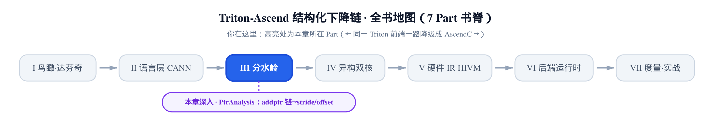
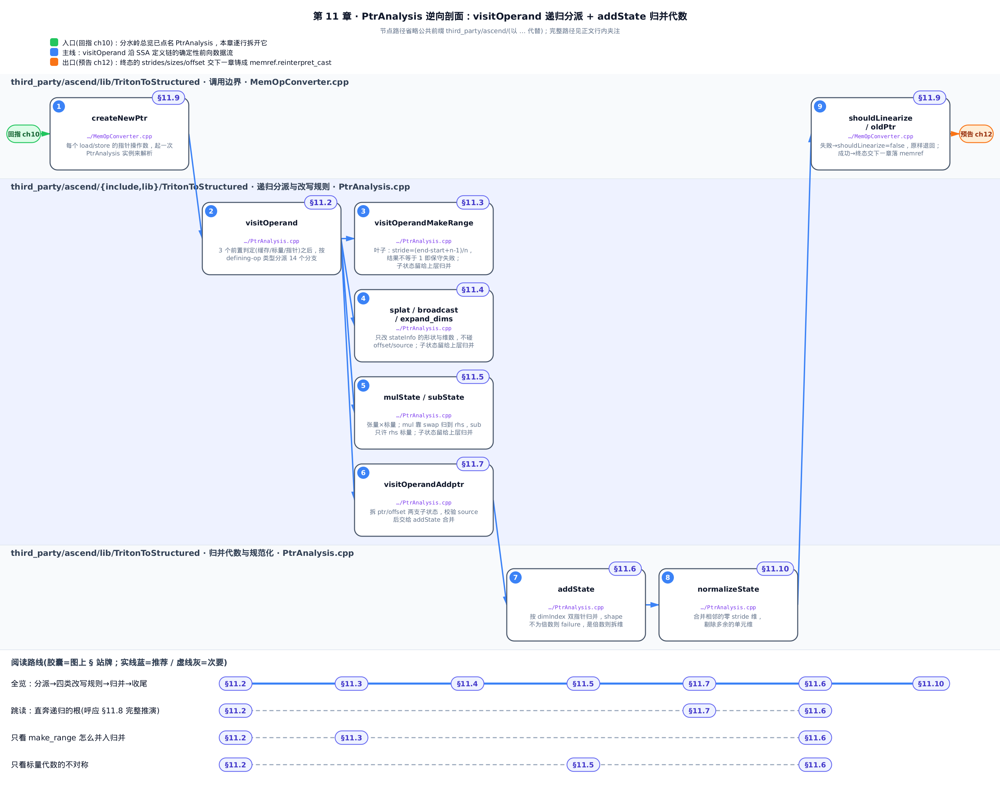
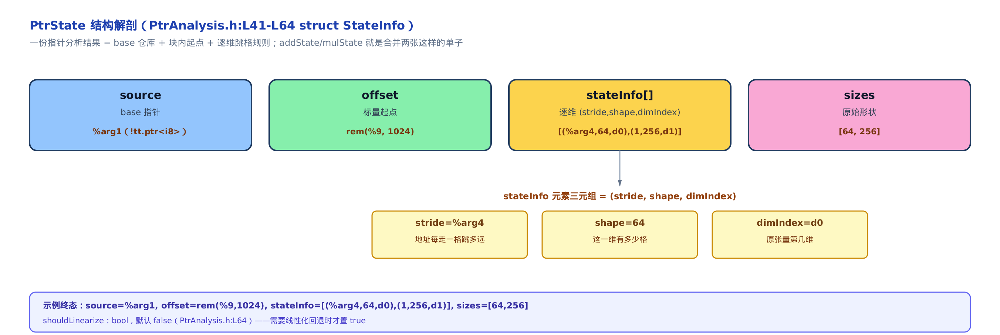
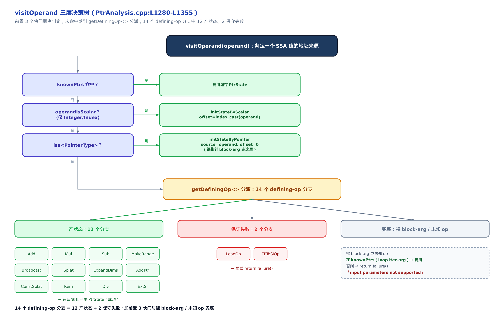
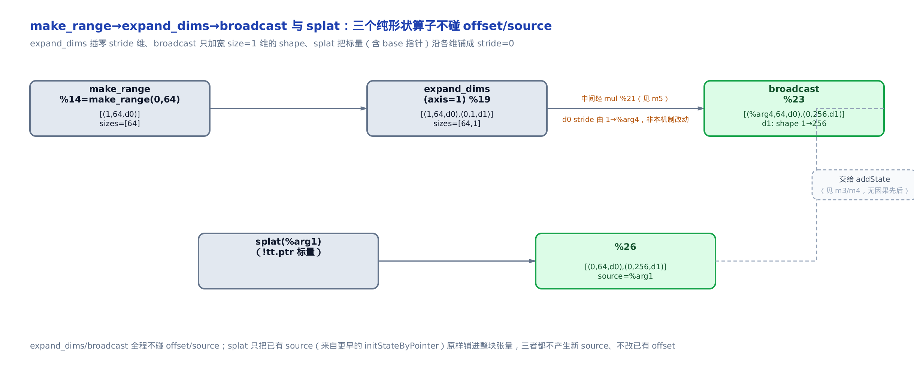
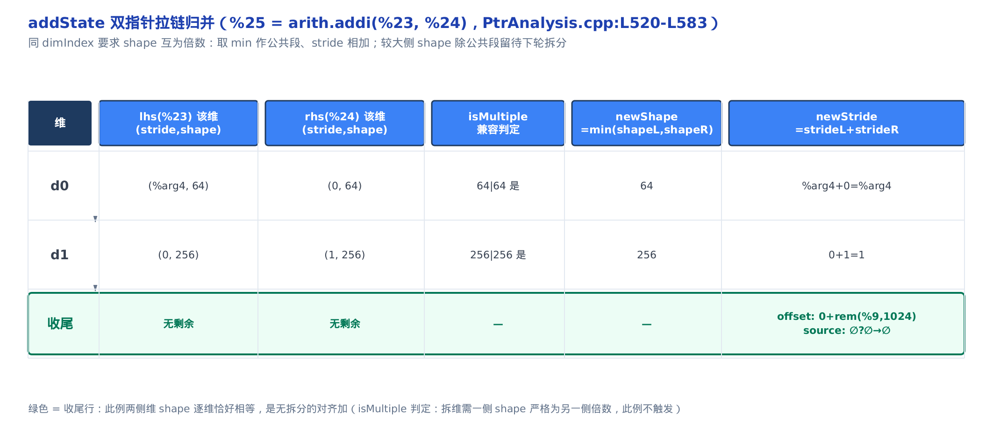
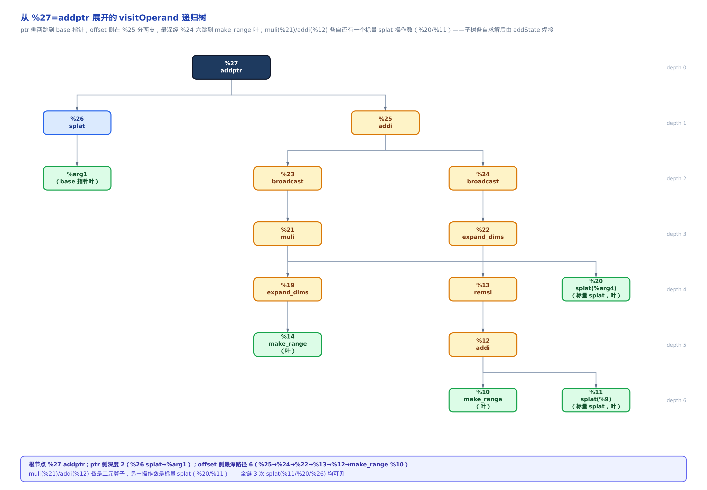

# 指针算术的逆向工程：PtrAnalysis 把 addptr 链还原成 stride/offset



> 上一章：[分水岭总览](../../ch10-watershed-triton-to-linalg/narrative/chapter.md)点了名——`PtrAnalysis` 是把指针算术还原成结构化访存的逆向侦探。
> 本章：把这位侦探的「算法上半」一行一行拆开看透。
> 下一章：把还原出的 stride/offset 铸成真正的访存指令（memref.reinterpret_cast）。

一个 Triton kernel 写 `x_ptr + offsets`，编译器前端会把它摊成一大堆算子：`tt.make_range` 生成索引、`tt.splat` 把标量铺成张量、`arith.muli` 乘上步幅、`tt.broadcast` 撑开维度、最后一个 `tt.addptr`（指针加偏移算子）收口。地址算术被打散进十几个 SSA（静态单赋值，每个值只被定义一次）值里，谁也不知道它们其实描述的是「从某个 base 起、按 `[行 stride，列 stride]` 铺开的一块 2D 张量」。

`PtrAnalysis` 要做的，就是把这堆碎片重新拼回一句话。上一章用一个 1D 的 `add_kernel` 例子走了五步、点了名分派器的存在，也给了 `make_range→stride=1`、`splat→stride=0` 这几条直觉结论。这些[本章不重复](../../ch10-watershed-triton-to-linalg/narrative/chapter.md)。

**本章往深里挖的，是上一章一笔带过的算法本体**：

- `visitOperand` 递归分派器的**每一个分支**——14 个 `getDefiningOp<>` 里哪 12 个产状态、哪 2 个保守失败；
- `addState` 的**完整代数**——远不止「逐维 stride 相加」，还有 dimIndex 归并、shape 兼容校验、维拆分；
- `make_range` 的**精确步幅公式**，以及 `mulState`/`subState` 只支持「张量 × 标量」的边界；
- 一条**真实的 2D matmul 指针链**，走完整棵递归树，看 PtrState 逐节点长成结构化三元组；
- 认不出算子时的**失败语义**，以及失败如何一路冒泡、体面退场。

> 想先建立地基，按序读 §11.1（状态词汇）→ §11.2（分派器）；只关心「一条链怎么走完」，可直接跳 §11.8 看完整推演，再回头补代数细节。

> 全章说明：host 上没有昇腾 NPU、没有 CANN 工具链，`triton-opt` 编不动、跑不出真实 dump。下文所有数值推演**不是**运行时观测，而是按 pin 源码的还原规则、逐算子手工代入仓库自带的 lit 测试夹具（`unittest/Conversion/General/TritonAscendAllPass/simplify_for_loop.mlir`）真实 IR 推导得出，每步常量都锚定到 `PtrAnalysis.cpp` 的具体行号。内嵌的 C++ 片段为便于讲解加了中文行内注释、个别处重排换行，**控制流与 pin 源码逐字一致**，完整原文见每块块首标注的行号。



只想看这套递归怎么收口，盯紧图上「分派→四类改写规则→addState 归并→normalizeState 出口」这条主链就够；要弄清每条分支各自的代数细节，再回来按 §11.2 到 §11.10 逐节读。

---

## 11.1 逆向的对象：先看清「还原成什么」

在拆算法之前，先把目标钉死：分析器最终要产出的是什么？答案是一个叫 **PtrState** 的结构体——上一章把它叫「三元组」，本章要看清它的全部槽位，因为**全章一切代数都是在改这个结构体**。

### 直觉：一张逐维填写的「收货单」

把一整块张量指针想成一张收货单：

- **source**（base 指针）：发货仓库在哪；
- **offset**（标量整型偏移）：从仓库门口先走几步，也就是块内起点；
- **stateInfo**：逐维的「跳格规则」——每走一格地址跳多远（stride）、这一维有多少格（shape）、这是原张量第几维（dimIndex）；
- **sizes**：原始逐维形状，做兼容性对账用。

逆向分析的全部工作，就是把散在 `make_range`/`mul`/`add`/`broadcast` 里的地址算术，一格一格填进这张单子。



图里「示例终态」那组具体数值（`source=%arg1`、`stride=%arg4`、`offset=rem(%9,1024)`）取自本章 §11.8 走完的 matmul `b_ptrs` 链，此处先睹为快、暂不必深究来源，读到 §11.8 自然对得上。

### 机制：三个谓词决定一个状态处于哪种「形态」

PtrState 在算法里有三种关键形态，靠三个谓词区分，后面每条规则都要用它们分支：

- **isEmpty**：空初态。每个 `visitOperand*` 被调用时，传进来的目标 PtrState 必须是空的——这是「从零开始填单子」的前提，违反即内部错误。
- **isScalar**：所有 stride 静态为 0、且带 offset/source。它表示「这不是一块有跳格规则的张量，而是一个被铺开的标量」——`mul`/`sub`/`splat` 全靠它判分支。
- **hasSource**：单子上已经填了发货仓库（base 指针）。

### 源码：状态词汇的定义

先看承载一切的两个结构体。`StateInfo` 是 stateInfo 向量的元素——一维上的三元组；`PtrState` 把若干个 `StateInfo` 加上 source/offset 组装成完整的一张单子：

```cpp
// third_party/ascend/include/TritonToStructured/PtrAnalysis.h:L41-L64
struct StateInfo {
    OpFoldResult stride;         // 每走一格,地址跳多远
    OpFoldResult shape;  // rem value  // 这一维有多少格
    size_t dimIndex;             // 属于原张量的第几维——归并/拆分全靠它对齐

    StateInfo() : dimIndex(0) {}
    StateInfo(OpFoldResult stride, OpFoldResult shape, size_t dimIndex = 0)
        : stride(stride), shape(shape), dimIndex(dimIndex) {}
    void dump() const;
};

struct PtrState {
    SmallVector<StateInfo> stateInfo;  // shape info when load, maintained with visitOps
    SmallVector<OpFoldResult> sizes;    // original shape, maintained with visitOps
    SmallVector<size_t> permuteIds;
    SmallVector<size_t> order;   // the order of the original data format, only used for block_ptr
    SmallVector<OpFoldResult> dimOffsets; // the offsets per dimension, only used for block_ptr

    Value source;                // base address (ptr), maintained with visitOps
    OpFoldResult offset;        // scalar offset (int), maintained with visitOps

    // whether the record needs to be processed in the current pass, when ignore is true,
    // it indicates that this scenario should not be processed within the current pass
    bool shouldLinearize = false;
    // … 省略：isPermuted 标志与一批成员方法声明（isEmpty/isScalar/hasSource/
    //          mulState/subState/addState/createAddPtrOp 等），见 PtrAnalysis.h:L65-L99 …
```

有几个字段值得单独点破：

- **stride/shape 的类型是 `OpFoldResult`**（MLIR 里「要么是编译期常量属性、要么是运行期 SSA 值」的二选一句柄）。为什么不用 `int64`？因为 stride 常常是运行期量——比如后面例子里的行 stride 就是 kernel 入参 `%arg4`，编译期根本不知道它的值，必须能携带一个 Value。静态可折的走 attr，方便做 `isMultiple`/`isEqual` 这类编译期判定。
- **`permuteIds`/`order`/`dimOffsets`** 只服务 `block_ptr`（块指针）与转置分析，是下一章 memref 落地与旁支的主题，本章主线只碰 `stateInfo`/`sizes`/`source`/`offset`/`shouldLinearize` 这五个。
- **`shouldLinearize`** 是个布尔标志，默认 `false`；它是「成功结构化」还是「放弃、留给线性化回退」的开关，§11.10 会看到它被置位的时刻。

单子的形状认清了，接下来看这张单子是怎么被一格一格填出来的。

---

## 11.2 递归分派器：visitOperand 怎么顺着定义链问上去

### 直觉：一个顺着「谁算出了这个地址」问上去的侦探

`visitOperand` 拿到一个 SSA 值，像侦探查案：

1. 先翻笔记本（`knownPtrs` 缓存，一张 Value→PtrState 的表）——这个值以前查过没有？查过就直接抄答案。
2. 没查过，看它是不是**标量**、是不是**裸指针**——这两种是「叶子」，当场就能给答案。
3. 都不是，就看它是被**哪个算子**造出来的（`getDefiningOp`，取定义这个值的算子），转交对应的子侦探去解析它的上游。

一路问到叶子（`make_range` 或裸指针），答案确定，再逐层回填。



### 机制：三层决策，14 个 defining-op 分支

分派器是一个三层结构：**3 个前置快门 → 14 个 defining-op 分支 → 2 个兜底**。把它对一个真实例子的各类操作数走一遍，落点看得最清楚。取 matmul 夹具里最外层的 `%27`（一个 `tt.addptr` 结果）和它链上几种典型操作数——这条从 `%27` 往上追的链，在原始 Triton kernel 源码里对应变量 `b_ptrs`（matmul 里指向矩阵 B 的那块 2D 索引张量），本章后面反复用这个名字代指它：

<!-- trace: m2-visitoperand-dispatch -->

| 被分派的 operand | 命中的判定 | 转交/落点 | 结果 |
|---|---|---|---|
| `%27`（tt.addptr 结果） | `getDefiningOp<AddPtrOp>` | `visitOperandAddptr` | 递归拆 ptr+offset |
| `%arg1`（!tt.ptr block-arg） | `operandIsScalar` 否（只认 Int/Index）→ `isa<PointerType>` 是 | `initStateByPointer` | 成功：source=%arg1，offset=0 |
| `%9`（i32 标量） | `operandIsScalar` 是 | `initStateByScalar` | 成功：offset=index_cast(%9) |
| `%14`（make_range 结果） | `getDefiningOp<MakeRangeOp>` | `visitOperandMakeRange` | 叶子：stride=1，shape=64 |
| 一个 tt.load 结果当 offset 源 | `getDefiningOp<LoadOp>` | 显式 `return failure()` | 保守失败，冒泡回退 |
| 非指针非标量裸 block-arg 且不在 knownPtrs | `!getDefiningOp() && !knownPtrs.contains` | `return failure()` | 「input parameters not supported」 |

这里有一个**极容易读错的点，务必看清**：`%arg1` 是 kernel 的 base 指针入参，它是个没有定义算子的 block-arg（块参数，如 kernel 入参，没有产生它的算子）。但它**不是失败入口，恰恰是成功入口**——`operandIsScalar`（判定是否为整型/索引标量的谓词）只认 Integer/Index，`!tt.ptr` 不是标量、走不中；紧接着 `isa<PointerType>` 命中，走 `initStateByPointer`，得到 `source=该指针、offset=0` 的叶子状态。真正触发「input parameters not supported」失败的，是**非指针、非标量**的裸 block-arg（比如没被父循环 populate 进 `knownPtrs` 的张量迭代参数），§11.9 细说。

**为什么这个递归一定停机？** 这是「不会骗人」的第一半保证。每层递归的 operand，严格是当前 operand 的定义算子的操作数——也就是在 SSA 的 use-def（使用-定义）图上向定义方向单调前进。Triton IR 的 use-def 图是有向无环的（SSA 支配 + 无循环依赖），向定义方向的路径长度有上界；叶子（`make_range`/常量/裸指针）没有上游操作数，递归到此返回。所以沿任一路径有限步必达叶子，`knownPtrs` 缓存进一步把重复子树剪成常数。

计数核清楚：分派表里一共 **14 个 `getDefiningOp<>` 分支**——12 个产状态（`Add`/`Mul`/`Sub`/`MakeRange`/`Broadcast`/`Splat`/`ExpandDims`/`AddPtr`/`ConstSplat`/`Rem`/`Div`/`ExtSI`），2 个显式保守失败（`LoadOp`/`FPToSIOp`）；再加前置 3 判定（缓存/标量/指针）和 2 兜底（裸 block-arg / 其余未知 op）。

### 源码：分派器全貌

上一章只给了这个函数的骨架、省略了大半分支。本章把它完整摊开——注意末段那几个 `failure()` 分支，它们是整套「保守失败」纪律的落点：

```cpp
// third_party/ascend/lib/TritonToStructured/PtrAnalysis.cpp:L1280-L1355
    if (knownPtrs.find(operand) != knownPtrs.end()) {   // ① 缓存命中:直接复用
        state = knownPtrs.lookup(operand);
        return success();
    }

    if (operandIsScalar(operand)) {                      // ② 标量叶子(仅 Integer/Index)
        return initStateByScalar(operand, state, loc, builder);
    }

    if (isa<triton::PointerType>(operand.getType())) {   // ③ 指针叶子(base 指针走这里)
        return initStateByPointer(operand, state, loc, builder);
    }

    if (auto op = operand.getDefiningOp<arith::AddIOp>()) {
        return visitOperandAdd(op, state, loc, builder);
    } else if (auto op = operand.getDefiningOp<arith::MulIOp>()) {
        return visitOperandMul(op, state, loc, builder);
    } else if (auto op = operand.getDefiningOp<arith::SubIOp>()) {
        return visitOperandSub(op, state, loc, builder);
    } else if (auto op = operand.getDefiningOp<triton::MakeRangeOp>()) {
        return visitOperandMakeRange(op, state, loc, builder);
    } else if (auto op = operand.getDefiningOp<triton::BroadcastOp>()) {
        return visitOperandBroadcast(op, state, loc, builder);
    } else if (auto op = operand.getDefiningOp<triton::SplatOp>()) {
        return visitOperandSplat(op, state, loc, builder);
    } else if (auto op = operand.getDefiningOp<triton::ExpandDimsOp>()) {
        return visitOperandExpandDims(op, state, loc, builder);
    } else if (auto op = operand.getDefiningOp<triton::AddPtrOp>()) {
        return visitOperandAddptr(op, state, loc, builder);
    } else if (auto op = operand.getDefiningOp<arith::ConstantOp>()) {
        return visitOperandConstSplat(op, state, loc, builder);
    } else if (auto op = operand.getDefiningOp<arith::RemSIOp>()) {
        return visitOperandRem(op, state, loc, builder);
    } else if (auto op = operand.getDefiningOp<arith::DivSIOp>()) {
        return visitOperandDiv(op, state, loc, builder);
    } else if (auto op = operand.getDefiningOp<arith::ExtSIOp>()) {
        return visitOperandExtSI(op, state, loc, builder);
    } else if (auto op = operand.getDefiningOp<triton::LoadOp>()) {
        // 保守失败①:offset 依赖另一个 load 的结果,编译期不可知
        LLVM_DEBUG({
            op.emitRemark("TritonToStructured: Invalid dynamic offset"
                        "The load operation's offset cannot be derived from another load result.");
        });
        return failure();
    } else if (auto op = operand.getDefiningOp<arith::FPToSIOp>()) {
        // 保守失败②:浮点转整参与地址计算,精度不可控
        LLVM_DEBUG({
            op.emitWarning("IllegalTypeConversionInAddressCalculation"
                        "float-to-int precision conversion is not supported during address computation.");
            llvm::dbgs() << "Operand: \n";
            operand.dump();
            llvm::dbgs() << "----------------------------------------------\n";
        });
        return failure();
    } else if (!operand.getDefiningOp()) {               // 无定义算子的裸 block-arg
        if (!knownPtrs.contains(operand)) {
            // 非指针非标量、且未被父循环 populate → 保守失败③
            LLVM_DEBUG({
                llvm::dbgs() << "TritonToStructured: Pointer analysis is not supported for input parameters\n";
            });
            return failure();
        }
        // 否则:它是嵌套循环的 iter-arg,PtrState 已在父循环 rewriteForOp 时填好,复用
        state = knownPtrs[operand];
        return success();
    } else {                                             // 保守失败④:其余未知 op
        auto op = operand.getDefiningOp();
        LLVM_DEBUG({
            op->emitWarning("TritonToStructured: encountered addptr operand produced by an unsupported operation");
            llvm::dbgs() << "Operand: \n";
            operand.dump();
            llvm::dbgs() << "----------------------------------------------\n";
        });
        return failure();
    }
    return success();
```

`knownPtrs` 开头一查是记忆化，同一个值不重复还原；也是嵌套循环里 iter-arg（循环迭代参数，`for` 每转一圈更新的值）复用状态的入口。源码注释里提到的 `rewriteForOp` 是循环结构化改写的入口、不是本章主题，这里只需知道嵌套循环场景下 iter-arg 的 PtrState 由外层提前算好，本章分析器本身不管这一层。中段 12 个 `else-if` 各对应一条还原规则，下面几节逐一拆。末段 `LoadOp`/`FPToSIOp`/裸入参/未知 op 四条 `failure()`，就是「不认识就整体失败、绝不猜」——这条纪律 §11.9 单独讲。

接下来从叶子开始，一条规则一条规则往上装：先看凭空长出第一维的 `make_range`。

---

## 11.3 叶子：make_range 的精确步幅公式

### 直觉：一道是非题——这串索引是不是步长 1 连续铺满？

`tt.make_range(start, end)`（生成等差索引的算子）造的是 `[start, start+1, …, end-1]` 这条等差为 1 的索引。逆向只需回答一个是非题：**这 n 个数是不是恰好步长 1、连续铺满？** 是，就能结构化；不是（比如「跳着取」），就保守失败。

上一章的直觉结论是 stride=1。真实的判定是一道天花板除法。

### 机制：ceil 除法压成一次整数判定

公式是：

```math
\mathrm{stride} = \frac{end - start + n - 1}{n} = \left\lceil \frac{end-start}{n} \right\rceil
```

其中 `` $`n`$ `` 是结果张量长度 `shape[0]`（整型除法）。对合法的 `make_range(start, end)`，结果长度恒等于跨度，也就是 `` $`n = end - start`$ ``，于是 stride 恒等于 1；任何「跳着取」使结果长度小于跨度的情形，都会让 stride 大于 1，直接被拒。这把「一维是否 unit-stride 连续」压缩成一次整数除法加一次 `!=1` 判定，O(1)。

代两个真实的 range，再加一个反例：

<!-- trace: m6-makerange-stride-formula -->

| make_range | start | end | n=shape[0] | stride=(end-start+n-1)/n | 判定 | 叶子 stateInfo |
|---|---|---|---|---|---|---|
| `%14`（夹具 L52） | 0 | 64 | 64 | (64-0+63)/64=1 | ==1 通过 | [(1, 64)] offset=0 source=∅ |
| `%10`（夹具 L48） | 0 | 256 | 256 | (256-0+255)/256=1 | ==1 通过 | [(1, 256)] offset=0 source=∅ |
| 反例（跨度128取64个） | 0 | 128 | 64 | (128-0+63)/64=2 | !=1 保守失败 | `return failure()` |

**这是分析的叶子，也是递归的基例**：`visitOperandMakeRange` 不调 `visitOperand`（没有上游要解析），直接从 `start`/`end`/结果 shape 读常量算出三元组，`source` 记 `nullptr`（无 base）、`offset=start`、单维 `stateInfo=(stride, size=n)`。所有指针链的 stride=1 连续段，最终都追溯到某个 `make_range` 叶子——§11.2 那条「递归必停机」的论证，落脚点正是这里。

### 源码

```cpp
// third_party/ascend/lib/TritonToStructured/PtrAnalysis.cpp:L774-L796
    // … 省略：state 必须 isEmpty 的防御性报错（L767-L772）…
    auto shape = cast<ShapedType>(rangeOp.getType()).getShape();

    auto start = rangeOp.getStart();
    auto end = rangeOp.getEnd();
    auto stride = (end - start + shape[0] - 1) / shape[0];   // 天花板除法
    if (stride != 1) {
        // 非单位步长:不支持,保守失败
        LLVM_DEBUG({
            rangeOp.emitError("PtrAnalysis: make_range op with stride != 1 is not supported");
        });
        return failure();
    }

    auto infoStride = builder.getIndexAttr(stride);
    auto size = builder.getIndexAttr(shape[0]);   // size = 结果长度 n（仅 start=0 时才 = end）
    auto offset = builder.getIndexAttr(start);

    SmallVector<StateInfo> stateInfo;
    SmallVector<OpFoldResult> sizes;
    stateInfo.emplace_back(infoStride, size);
    sizes.emplace_back(size);

    state.updatePtrState(stateInfo, sizes, nullptr, offset, loc, builder);
    return success();
```

一处细节别读错：`size` 取的是 `shape[0]`（结果张量长度 `n`），**不是 `end`**——只有 `start=0` 时二者才相等。夹具里 `%14 = make_range(0, 64)` 进来：`stride=(64-0+63)/64=1`、`size=64`、`offset=0`，落成 `[(1, 64)] offset=0 source=∅`，正是推演表第一行。

叶子有了 stride=1 的裸索引，接下来要把它变成 2D 块的一个维度——这需要三个「只改形状、不动基向量」的算子。

---

## 11.4 三个纯形状算子：splat / broadcast / expand_dims

### 直觉：改形状，但一个字都不碰 offset 和 source

这三个算子是同一类：**只重排/加宽维度，不改地址算术本身**。一句话总起它们仨——

- **splat**（标量→张量）：把一个标量沿每一维铺开，每维 stride=0（处处同址）。base 指针正是靠 splat 从标量 `!tt.ptr` 变成整块张量的 source。
- **broadcast**：把某个 size=1 的维加宽到目标宽度，stride 保持不变（通常是 0，所以被广播的维偏移恒 0）。
- **expand_dims**：在指定 axis 插入一个 stride=0、shape=1 的新维，其余维 dimIndex 右移。

三者都不碰 `offset` 和 `source`——它们只搬 `stateInfo` 的形状与维数。



### 机制：splat 是把 base 指针从标量搬进整块张量的关键一步

三个里 **splat 最关键**，因为它是把 base 指针搬进张量的那一步。但要说清楚一件事：source 的真正来源始终是 `initStateByPointer`（§11.2 三个前置快门里的第③个）——`%arg1` 这种裸指针 block-arg 不经过任何 splat 就能直接被它赋予 `source`。splat 并不产生新的 source，它只是把已经拿到的 source 原样铺进整块张量。`visitOperandSplat` 先递归解析 splat 的源（一个标量子状态），再把它沿目标 shape 的每一维铺成 stride=0：

- 源是整型/索引 → 铺成一块「处处偏移相同」的张量，offset 从子状态继承；
- 源是 `!tt.ptr` → 子状态由 `initStateByPointer` 给出 `source=该指针`，splat 把它铺满各维，`source` 原样带出——这就是 `%arg1` 变成 `%26`（`tensor<64x256x!tt.ptr>`）的 base 的那一步。

`broadcast` 只在 `stateInfo` 里改被广播维的 shape，不改 stride；`expand_dims` 只插一条 `(0, 1)` 的新维。所以一个被 broadcast 出来的维，其 stride 保持原样（通常是 expand_dims 插进来的 0），沿该维偏移恒为 0。

### 源码：splat 与 broadcast

```cpp
// third_party/ascend/lib/TritonToStructured/PtrAnalysis.cpp:L899-L922
    // … 省略：isEmpty 守卫 + visitOperand(src) 递归得到标量子状态 + DEBUG dump（L873-L897）…
    if (!state.isScalar()) {                    // splat 的源必须是标量
        LLVM_DEBUG({
            splatOp.emitRemark("PtrAnalysis: splat source should be scalar");
        });
        return failure();
    }

    SmallVector<StateInfo> newStateInfo;
    SmallVector<OpFoldResult> newSizes;
    auto zeroAttr = builder.getIndexAttr(0);
    if (isa<IntegerType, IndexType, triton::PointerType>(src.getType())) {
        for (size_t i = 0; i < dstShape.size(); ++i) {   // 每一维铺成 stride=0
            auto currentSize = builder.getIndexAttr(dstShape[i]);
            newSizes.emplace_back(currentSize);
            newStateInfo.emplace_back(zeroAttr, currentSize, i);
        }
    } else {
        LLVM_DEBUG({
            splatOp.emitRemark("PtrAnalysis: unsupported splat pattern");
        });
        return failure();
    }
    // 关键:offset/source 原样从标量子状态取,不改
    state.updatePtrState(newStateInfo, newSizes, state.source,
                         state.offset, loc, builder, state.shouldLinearize);
```

```cpp
// third_party/ascend/lib/TritonToStructured/PtrAnalysis.cpp:L848-L865
    // … 省略：isEmpty、dst 必须 ShapedType、src/dst 同 rank、visitOperand(src) 递归（L803-L847）…
    for (size_t i = 0; i < dstShape.size(); ++i) {
        newSizes.emplace_back(builder.getIndexAttr(dstShape[i]));
        if (srcShape[i] == dstShape[i]) {
            continue;                                    // 该维不变
        } else if (srcShape[i] < dstShape[i] && srcShape[i] == 1) {
            for (auto &info : newStateInfo) {            // 只把 size=1 维的 shape 撑宽
                if (info.dimIndex != i)  continue;
                info.shape = builder.getIndexAttr(dstShape[i]);   // stride 不动!
            }
        } else {
            LLVM_DEBUG({
                broadcastOp.emitRemark("unexpected dimensions used in broadcast");
            });
            return failure();
        }
    }
    state.updatePtrState(newStateInfo, newSizes, state.source,
                         state.offset, loc, builder, state.shouldLinearize);
```

两段代码里 `source`/`offset` 都是原样传给 `updatePtrState`——形状算子只动 `newStateInfo`。记住这一点，后面看完整推演时才不会奇怪「为什么 broadcast 那一步 offset 没变」。

形状对齐好了，接下来是真正改写 stride/offset 的两类算子：乘法和加法。

---

## 11.5 张量 × 标量：mulState 与 subState

### 直觉：乘法只干一件事——把索引变成真正的跨步

地址算术里的乘法几乎总是「逐元素索引 × 一个 stride 标量」，比如 `row_idx * stride_bk`。所以 `mulState` 只处理「张量 × 标量」这一种形态：它让张量侧每一维的 stride 都乘上那个标量——`make_range` 原本 stride=1 的维，乘 `%arg4` 之后就变成真正的行 stride。`subState` 更严：减法不可交换，只允许右操作数是标量。

### 机制：swap 归一 + 逐维乘

`mulState` 有三道守卫和一步归一：

1. 两侧都不能 `hasSource`——乘一个 base 指针没有意义；
2. 两侧不能都非标量——只支持「张量 × 标量」；
3. `swap` 把标量挪到 rhs，于是循环只需遍历 lhs（非标量侧）每一维、`stride × rhs.offset`。

`subState` 则要求 rhs 必须 `isScalar`、且两侧不能都带 source，`stateInfo` 照抄 lhs、只把 offset 相减。把这两条走一遍（`b_ptrs` 这条链没有用到减法，所以下面 `sub-` 两行改用抽象的 lhs/rhs 讲规则，不绑定具体 `%`-编号值）：

<!-- trace: m5-mulstate-substate -->

| 步骤 | 算子/守卫 | 关键判定 | 结果 stateInfo / offset |
|---|---|---|---|
| mul-1 | swap 归一 | %20 isScalar（全 0 stride+offset=%arg4）；%19 非 scalar → 不 swap，rhs=%20 | lhs=%19 |
| mul-2 | 逐维 stride×rhs.offset | d0：1×%arg4=%arg4；d1：0×%arg4=0 | stateInfo=[(%arg4,64,d0),(0,1,d1)] |
| mul-3 | offset×offset | %19.offset(0) × %20.offset(%arg4) = 0 | offset=0 |
| sub-守卫 | 两侧 hasSource? / rhs isScalar? | 两侧同带 source→failure；rhs 非标量→failure | 仅 tensor−scalar 放行 |
| sub-算 | offset 相减，stateInfo 照抄 lhs | newOffset=lhs.offset−rhs.offset | stateInfo=lhs.stateInfo 不变 |

**这一步是「索引 → 字节/元素跨步」转换的唯一发生点。** 输出的 `stateInfo` 恒来自非标量侧，标量侧只贡献一个乘数、不引入任何新维——维数、dimIndex 布局与 lhs 完全一致。这个不变式后面很有用：它保证 `mul` 不会打乱维度对齐，`addState` 的归并才能稳稳按 dimIndex 对齐。

### 源码：mulState 与 subState 的不对称

```cpp
// third_party/ascend/lib/TritonToStructured/PtrAnalysis.cpp:L437-L460
    // … 省略：三道守卫（L413-L435）——this 必须 isEmpty；两侧都不能 hasSource；
    //          两侧不能都非标量。这三条正是 mulState 的适用边界 …
    PtrState const *lhs = &lhsState;
    PtrState const *rhs = &rhsState;

    if (!rhs->isScalar() && lhs->isScalar()) {
        std::swap(lhs, rhs);                     // 归一:让标量落在 rhs
    }

    SmallVector<StateInfo> newStateInfo;
    for(auto info : lhs->stateInfo) {            // 只遍历非标量侧
        OpFoldResult newStride = mulOpFoldResult(info.stride, rhs->offset, loc, builder);  // stride×标量
        newStateInfo.emplace_back(newStride, info.shape, info.dimIndex);
    }

    auto newOffset = mulOpFoldResult(lhsState.offset, rhsState.offset, loc, builder);       // offset×offset
    updatePtrState(newStateInfo, lhs->sizes, lhs->source,
                   newOffset, loc, builder, lhs->shouldLinearize);
    // … 省略：DEBUG dump …
    return success();
```

```cpp
// third_party/ascend/lib/TritonToStructured/PtrAnalysis.cpp:L474-L494
    // … 省略：this 必须 isEmpty 的守卫（L467-L472）…
    if (lhsState.hasSource() && rhsState.hasSource()) {   // 减法两侧都带 base:不支持
        LLVM_DEBUG({
            op->emitError("PtrAnalysis: do not support both sides have base pointers in sub");
        });
        return failure();
    }

    if (!rhsState.isScalar()) {                           // 减法的 rhs 必须是标量(减不可交换)
        LLVM_DEBUG({
            op->emitError(
                "PtrAnalysis: only support sub when one of "
                "them represents a scalar");
        });
        return failure();
    }

    auto newOffset = subOpFoldResult(lhsState.offset, rhsState.offset, loc, builder);  // offset 相减
    updatePtrState(lhsState.stateInfo, lhsState.sizes, lhsState.source,
                   newOffset, loc, builder, lhsState.shouldLinearize);
    return success();
```

注意 `sub` 与 `mul` 的**不对称**：`mul` 允许任一侧是标量（靠 `swap` 归一，因为乘法可交换）；`sub` 只允许 rhs 是标量（减法不可交换，`a - b ≠ b - a`）。这不是疏忽，是代数正确性的直接体现。

现在两类改写规则齐了，可以看整套代数里最硬的一块——`addState` 的维归并。

---

## 11.6 核心归并：addState 的完整代数

### 直觉：像拉链一样按维度对齐，同一维还可能被拆开

上一章的直觉版只说「逐维 stride 相加」。真相远不止于此——因为两个加数的 `stateInfo` **可能维数不同**、同一维的 shape **也可能一个是另一个的整数倍**（broadcast/expand_dims 造成的）。

`addState` 像拉链一样按 dimIndex 对齐两侧：编号小的维先各走各的；编号相同就要求两侧 shape 互为倍数，取二者较小的 shape 作公共段、stride 相加，较大的那侧把 shape 除掉公共段、留待下一轮——**这就是「维拆分」**，它让「一维恰好是另一维若干倍」的情形也能正确合并。



### 机制：双指针归并的五步走法

用两个迭代器 `lIt`/`rIt` 沿两侧 stateInfo 推进，每轮按三种情况走：

1. **dimIndex 不等**：取编号小的那维原样推进（另一侧还没到这一维）；
2. **dimIndex 相等、shape 不兼容**：若两 shape 互不为倍数（`isMultiple` 双向都否），`incompatible → failure`；
3. **dimIndex 相等、shape 兼容**：`newShape = min(两 shape)`；若某侧被 min 缩小、且其 stride≠0，`failure`（Valid dimensions are split——不能把一个有非零 stride 的维切开）；否则 `newStride = 两 stride 相加`，谁的 shape 等于 newShape 谁前进，另一侧 `shape /= newShape`（维拆分）。

收尾把剩余维直接搬入，`offset` 相加、`source` 取非空的一方、`shouldLinearize` 取或。

拿夹具里 `%25 = arith.addi(%23, %24)` 这一步走归并——它是「行索引块」和「列索引块」两条 stateInfo 的合并：

<!-- trace: m4-addstate-algebra -->

| 维 dimIndex | lhs(%23) 该维 (stride,shape) | rhs(%24) 该维 (stride,shape) | isMultiple 兼容？ | newShape=min | newStride=lhs+rhs | 前进侧 |
|---|---|---|---|---|---|---|
| d0 | (%arg4, 64) | (0, 64) | 64\|64 是 | 64 | %arg4+0=%arg4 | 两侧同前进 |
| d1 | (0, 256) | (1, 256) | 256\|256 是 | 256 | 0+1=1 | 两侧同前进 |
| 收尾 | 无剩余 | 无剩余 | - | - | offset: 0 + rem(%9,1024) | source: ∅?∅→∅ |

这个例子两侧逐维恰好等长，是**无拆分的对齐加**：d0 把 `%arg4` 和 0 合成 `%arg4`（行 stride 来自 `%23`）、d1 把 0 和 1 合成 1（列 stride 来自 `%24`），offset 只有一侧非空。真正触发拆分，需要一侧 shape 是另一侧的严格倍数——比如 contiguous 段和 broadcast 段的合并。

**为什么归并一定停机、且 source 唯一？** 两个不变式撑起整套代数的正确性：

- **停机**：每轮循环至少令某个指针严格前进，或令某侧 shape 严格变小（除以 `newShape ≥ 2`）。两指针位置（单调不减）与各 shape（单调减）构成字典序单调量，有限步归并完 ≤rank 个维。
- **source 唯一**：`mulState`/`subState` 都禁止两侧同时 `hasSource`；`addState` 里两加数唯一可能带 source 的入口是 `addptr`（ptr 侧带 source、offset 侧不带）。所以 `source = lhs ? lhs : rhs` 永远只有一侧非空——**base 指针在整条链上唯一**。

复杂度 O(rank + 拆分次数)：双指针沿两侧 stateInfo（长度 ≤ rank，实际 rank≤3 量级）线性推进，每步 O(1) 的 `OpFoldResult` 代数。

### 源码

```cpp
// third_party/ascend/lib/TritonToStructured/PtrAnalysis.cpp:L520-L583
    // … 省略：this 必须 isEmpty、lhsState.isSameSizeAs(rhsState)（原始 sizes 逐维一致）
    //          两道前置校验（L507-L518），否则 failure …
    SmallVector<StateInfo> newStateInfo;
    auto lIt = lhsState.stateInfo.begin();
    auto rIt = rhsState.stateInfo.begin();
    while (lIt != lhsState.stateInfo.end() && rIt != rhsState.stateInfo.end()) {
        if (lIt->dimIndex != rIt->dimIndex) {            // ① 维不对齐:取小编号的先走
            auto newInfo = lIt->dimIndex < rIt->dimIndex ? *lIt++ : *rIt++;
            newStateInfo.emplace_back(newInfo);
            continue;
        }
        if (!isMultiple(lIt->shape, rIt->shape) &&       // ② 同维:shape 必须互为倍数
            !isMultiple(rIt->shape, lIt->shape)) {
            LLVM_DEBUG({ /* … dump lhs/rhs … */ });
            LLVM_DEBUG({
                op->emitError("PtrAnalysis: the add operation have incompatible sizes");
            });
            return failure();
        }

        auto newShape = minOpFoldResult(lIt->shape, rIt->shape, loc, builder);   // 公共段取 min
        if ((isLess(newShape, lIt->shape) && !isZero(lIt->stride) ||             // 有非零 stride 的维不可切
            isLess(newShape, rIt->shape) && !isZero(rIt->stride))) {
            LLVM_DEBUG({ /* … dump … */ });
            LLVM_DEBUG({
                op->emitError("PtrAnalysis: the add operation have incompatible sizes."
                            "Valid dimensions are split.");
            });
            return failure();
        }

        auto newStride = addOpFoldResult(lIt->stride, rIt->stride, loc, builder);  // ③ stride 相加
        newStateInfo.emplace_back(newStride, newShape, lIt->dimIndex);

        if (isEqual(lIt->shape, newShape))  ++lIt;                                 // 谁等于公共段谁前进
        else    lIt->shape = divOpFoldResult(lIt->shape, newShape, loc, builder);  // 否则维拆分
        if (isEqual(rIt->shape, newShape))  ++rIt;
        else    rIt->shape = divOpFoldResult(rIt->shape, newShape, loc, builder);
    }

    while (rIt != rhsState.stateInfo.end()) {            // 收尾:搬入剩余维
        newStateInfo.push_back(*rIt++);
    }
    while (lIt != lhsState.stateInfo.end()) {
        newStateInfo.push_back(*lIt++);
    }

    auto newSource = source = lhsState.source ? lhsState.source : rhsState.source;   // source 取非空
    auto newOffset = addOpFoldResult(lhsState.offset, rhsState.offset, loc, builder);  // offset 相加
    auto newShouldLinearize = lhsState.shouldLinearize || rhsState.shouldLinearize;
    auto newSizes = lhsState.sizes;

    updatePtrState(newStateInfo, newSizes, newSource,
        newOffset, loc, builder, newShouldLinearize);
    // … 省略：DEBUG dump + return success()（L585-L591）…
```

代码里那句 `newSource = source = lhs ? lhs : rhs` 就是「谁有 base 取谁」；`isMultiple`（判断一个 shape 是否为另一个整数倍的谓词）和 `minOpFoldResult`/`divOpFoldResult` 撑起了维拆分。这套代数是整个逆向的心脏——它一被调用，就意味着两块子状态要焊成一块。

那么谁来调它、把 base 指针和偏移这两块焊到一起？答案是每条链最外层的那个根节点。

---

## 11.7 根节点：visitOperandAddptr

### 直觉：把「仓库在哪」和「叠多少偏移」拆成两个子问题

`addptr` 是「在某个 base 指针上再叠一层偏移」。逆向时它把自己拆成两个独立子问题：

- 左手 `getPtr()`：解析出「仓库在哪」——必须带 source 的子状态；
- 右手 `getOffset()`：解析出「这一步叠多少地址算术」——纯偏移子状态；

再用 `addState` 把两张单子焊在一起。**它是整棵递归树的根**：每条指针链最外层都是一个 `addptr`。

### 机制：拆两支、校验 source、再合并

对夹具最外层的 `%27 = tt.addptr(%26, %25)` 走一遍：

<!-- trace: m3-visitoperand-addptr -->

| 步骤 | 动作 | 得到的子状态关键值 | 判定/返回 |
|---|---|---|---|
| 1. 拆 ptr | visitOperand(%26=splat(%arg1)) | ptrState.source=%arg1, offset=0, stateInfo=[(0,64,d0),(0,256,d1)] | 成功 |
| 2. 拆 offset | visitOperand(%25) | offsetState.source=∅, offset=rem(%9,1024), stateInfo=[(%arg4,64,d0),(1,256,d1)] | 成功 |
| 3. 校验 source | if(!ptrState.source) | ptrState.source=%arg1 非空 | 通过（否则 'ptr field should provide source'） |
| 4. 合并 | state.addState(ptrState, offsetState) | source=%arg1, stateInfo=[(%arg4,64,d0),(1,256,d1)], offset=rem(%9,1024) | 成功，返回终态 |

第 3 步的 source 校验很关键：如果 ptr 侧解析不出 source（比如 base 由一个 load 得来），整个 `addptr` 立即失败，根本不进 `addState`。这也回收了上一节 source 唯一性的另一半保证——**唯一可能引入 source 的入口只在 ptr 侧**，offset 侧由纯整型地址算术构成、永不引入 source。

### 源码

```cpp
// third_party/ascend/lib/TritonToStructured/PtrAnalysis.cpp:L250-L279
    // … 省略：函数开头（L238-L249）先断言 state.isEmpty()，否则 emitError+failure …
    PtrState ptrState;
    if (visitOperand(addptrOp.getPtr(), ptrState, addptrOp.getLoc(), builder)   // 左手:拆 ptr 侧
            .failed()) {
        return failure();
    }

    PtrState offsetState;
    if (visitOperand(addptrOp.getOffset(), offsetState, addptrOp.getLoc(),      // 右手:拆 offset 侧
                     builder)
            .failed()) {
        return failure();
    }

    LLVM_DEBUG({ /* … dump ptrState / offsetState … */ });

    if (!ptrState.source) {                          // ptr 侧必须提供 base 指针
        LLVM_DEBUG({
            addptrOp.emitError("ptr field should provide source / base pointer");
        });
        return failure();
    }
    return state.addState(ptrState, offsetState, addptrOp, builder);            // 焊接成终态
```

两个 `visitOperand` 就是那两支递归；`.failed()` 一旦命中就立刻上抛，这是「全或无」纪律的体现（§11.9 展开）。所有零件都齐了，下面把它们串成一条真实的链，从头走到尾。

---

## 11.8 走完一整条 2D 指针链

### 直觉：一条 matmul 的 b_ptrs，散在 14 个算子里的地址算术

前面把每条规则单独拆过了，现在把 matmul 夹具里 `b_ptrs` 这条真实的 2D 块指针链，从头到尾走一遍逆向。它散在 **14 个算子**里：两个 `make_range`、三次 `splat`、两次 `expand_dims`、一次 `mul`、两次 `broadcast`、一次 `rem`、两次 `addi`、一个 `addptr`。每个把上游 PtrState 确定性地映成下游，终点自动浮现出「base=%arg1、行 stride=%arg4、列 stride=1、块内 offset=rem(%9,1024)」——正是行主序（按行连续存储）2D 块 `base + row×stride_bk + col×1`（这里的 `stride_bk` 就是一路追出来的 kernel 入参 `%arg4`——矩阵 B 按 K 维分块的行步幅）的结构化还原。

这条链在夹具里长这样（`third_party/ascend/unittest/Conversion/General/TritonAscendAllPass/simplify_for_loop.mlir`；为聚焦 `b_ptrs` 只摘出这条链，并略去每个整型属性的 `: i32` 类型后缀，语义不变，完整原文见夹具对应行）：

```mlir
%10 = tt.make_range {end = 256, start = 0} : tensor<256xi32>
%11 = tt.splat %9 : i32 -> tensor<256xi32>
%12 = arith.addi %11, %10 : tensor<256xi32>
%13 = arith.remsi %12, %cst_7 : tensor<256xi32>              // %cst_7 = dense<1024>
%14 = tt.make_range {end = 64, start = 0} : tensor<64xi32>
%19 = tt.expand_dims %14 {axis = 1} : tensor<64xi32> -> tensor<64x1xi32>
%20 = tt.splat %arg4 : i32 -> tensor<64x1xi32>
%21 = arith.muli %19, %20 : tensor<64x1xi32>
%22 = tt.expand_dims %13 {axis = 0} : tensor<256xi32> -> tensor<1x256xi32>
%23 = tt.broadcast %21 : tensor<64x1xi32> -> tensor<64x256xi32>
%24 = tt.broadcast %22 : tensor<1x256xi32> -> tensor<64x256xi32>
%25 = arith.addi %23, %24 : tensor<64x256xi32>
%26 = tt.splat %arg1 : !tt.ptr<i8> -> tensor<64x256x!tt.ptr<i8>>
%27 = tt.addptr %26, %25 : tensor<64x256x!tt.ptr<i8>>, tensor<64x256xi32>
```

### 机制：递归树 + 逐节点 PtrState 演化

`visitOperand` 从 `%27` 进去，展开成一棵递归树：ptr 侧（`%26 → %arg1`）浅，offset 侧（`%25 → … → make_range`）深。



把递归树的每个节点求解结果按拓扑顺序摆出来，就是这条链完整的 PtrState 演化表——一步步看 stride/offset 怎么长出来（14 个算子里，标量 `splat %9`（即 `%11`）只贡献一个 offset，被折进了 `%12` 那一行，所以表里是 13 行）：

<!-- trace: m8-forward-prop-2d-chain -->

| 节点 | 算子 | stateInfo(stride,shape,dim) | offset | source |
|---|---|---|---|---|
| %14 | make_range(0,64) | [(1,64,d0)] | 0 | ∅ |
| %19 | expand_dims(ax=1) | [(1,64,d0),(0,1,d1)] | 0 | ∅ |
| %20 | splat(%arg4:i32) | [(0,64,d0),(0,1,d1)] | %arg4 | ∅ |
| %21 | muli(%19,%20) | [(%arg4,64,d0),(0,1,d1)] | 0 | ∅ |
| %23 | broadcast(%21) | [(%arg4,64,d0),(0,256,d1)] | 0 | ∅ |
| %10 | make_range(0,256) | [(1,256,d0)] | 0 | ∅ |
| %12 | addi(splat %9,%10) | [(1,256,d0)] | %9 | ∅ |
| %13 | remsi(%12,1024) | [(1,256,d0)] | rem(%9,1024) | ∅ (shouldLinearize=true) |
| %22 | expand_dims(ax=0) | [(0,1,d0),(1,256,d1)] | rem(%9,1024) | ∅ |
| %24 | broadcast(%22) | [(0,64,d0),(1,256,d1)] | rem(%9,1024) | ∅ |
| %25 | addi(%23,%24) | [(%arg4,64,d0),(1,256,d1)] | rem(%9,1024) | ∅ |
| %26 | splat(%arg1:!ptr) | [(0,64,d0),(0,256,d1)] | 0 | %arg1 |
| %27 | addptr(%26,%25) | [(%arg4,64,d0),(1,256,d1)] | rem(%9,1024) | %arg1 |

![b_ptrs 子链 %14→%27 逐节点 PtrState 演化：14 个地址算子把散落的 stride/offset 归并成 base=%arg1、strides=[%arg4,1]、offset=rem(%9,1024)](../diagrams/fig-m8-chain-evolution.png)

一行一行读下来，前面每条规则都在这里兑现（每步落点都能对回 `PtrAnalysis.cpp:L1280-L1355` 的分派器与 `PtrAnalysis.cpp:L520-L583` 的 addState）：

- `%14 → %19`：expand_dims 插一维 `(0,1,d1)`，stride/offset 不动（§11.4）；
- `%20`：splat(%arg4) 铺成 stride=0 的两维、offset=%arg4（§11.4）；
- `%21`：mulState 把 d0 的 stride 从 1 提成 %arg4，这是全链唯一一次「索引 → 跨步」转换（§11.5）；
- `%23`：broadcast 把 d1 的 shape 从 1 撑到 256，stride 仍 0（§11.4）；
- 另一支 `%10 → %12 → %13`：make_range(0,256)、加上 splat(%9) 的 offset、再 remsi 折叠（§11.10 讲 rem）；
- `%25`：addState 把两支逐维归并，就是 §11.6 那张 d0/d1 对齐加的表；
- `%26`：source 首现于 `%arg1`——由 `initStateByPointer` 落定，`splat` 只沿各维把它铺满（stride=0）、不产生新 source（§11.4）；
- `%27`：addptr 焊接，终态出炉。

终态还原出 3 个结构化量：**strides=[%arg4, 1]、sizes=[64, 256]、offset=rem(%9,1024)**。下一章就据这 3 个量发一条 `memref.reinterpret_cast`（把一段裸内存重解释成带 offset/sizes/strides 的结构化视图的算子）。

**一条关键不变式**：整条链的终态 PtrState 是其算子序列的**纯函数**——不依赖遍历顺序，`knownPtrs` 缓存只做加速、不改结果。因为每个 `visitOperand*` 把子状态确定性地映成父状态（无随机、无外部可变态），`addptr` 的两个子递归相互独立、结果由 `addState` 合并、lhs/rhs 的角色由调用结构固定（ptr 侧恒 lhs）。这正是「把从 base 到最终地址的正向算术，在分析域一次性重演」的体现。全程 0 次 failure。

这是一条走得通的链。但不是所有链都走得通——接下来看走不通时会发生什么。

---

## 11.9 保守失败：认不出就体面退场

### 直觉：能结构化就结构化，不能就体面退场

`PtrAnalysis` 的信条是「**能结构化就结构化，不能就体面退场**」——它从不因为看不懂一条指针链而报错中断整个 pass，而是标记 `shouldLinearize=false`、原样把 `tt.addptr` 链交回去，让下游的 mask/discrete 线性化路径接手。

哪些情况会退场？offset 依赖另一个 load 的结果（编译期不可知）、地址里掺了浮点转整、或者一个非指针非标量的裸入参凭空出现。**再强调一次那个易错点**：base 指针 block-arg 反而是成功入口，不在此列。

### 机制：四类失败触发点 + 一个回退落点

<!-- trace: m9-failure-conservative -->

| 触发点 | 源码判定 | 为什么拒 | 落点 |
|---|---|---|---|
| offset 来自 tt.load 结果 | `getDefiningOp<LoadOp>` → failure | 地址依赖运行期加载值，编译期无法推 stride/offset | 冒泡 → createNewPtr 回退 oldPtr |
| 地址掺 float→int | `getDefiningOp<FPToSIOp>` → failure | 浮点转整精度不可控，破坏可折叠性 | 同上，回退 |
| 非指针非标量裸 block-arg | `!getDefiningOp() && !knownPtrs.contains` → failure | 「input parameters not supported」：无上游可解析且未被父循环 populate | 同上，回退 |
| 其余未知 defining-op | else 兜底 → failure | 无对应 visitOperand* 规则 | 同上，回退 |
| 对照：base 指针 block-arg | operandIsScalar 否 → isa\<PointerType\> 是 → initStateByPointer | 裸指针 !getDefiningOp() → newSource=operand，offset=0 | 成功，非失败 |

**为什么失败不会留下半成品？** 这是「不会骗人」的另一半保证。所有 `visitOperand*` 在改写前只在栈上的 PtrState 里累积，不碰 IR；失败即 `return failure()`，调用者检测到 `.failed()` 立刻上抛、不落任何 `knownPtrs`。所以失败路径无副作用——`createNewPtr` 拿到 failure 时，`oldPtr` 仍是原始未改的指针，原样返回给下游线性化，**不存在半结构化的中间态**。回退代价只是「这条链放弃结构化访存的收益」，正确性丝毫不受损。

### 源码：失败在哪落地

分派器末段那四条 `failure()` 已在 §11.2 看过。现在看失败冒泡到最外层、真正被接住的地方——`MemOpTransformer::createNewPtr`。`MemOpTransformer` 是遍历每个 `tt.load`/`tt.store`、为其指针操作数各起一次 `PtrAnalysis` 的驱动类，`createNewPtr` 就是 `PtrAnalysis` 的真实调用入口：

```cpp
// third_party/ascend/lib/TritonToStructured/MemOpConverter.cpp:L343-L359
Value MemOpTransformer::createNewPtr(Value oldPtr,
                                     const Location loc, PatternRewriter &rewriter) {
    TritonToStructured::PtrAnalysis ptrAnalysis(optimizeDynamicOffset);

    LLVM_DEBUG({
        llvm::dbgs() << "----------------------------------------------\n";
        llvm::dbgs() << "PtrAnalysis: analyzing load/store's ptr.\n";
    });

    if (ptrAnalysis.visitOperand(oldPtr, ptrState, loc, rewriter).failed()) {
        ptrState.shouldLinearize = false;      // 放弃结构化
        LLVM_DEBUG({
            InFlightDiagnostic diag =
            emitWarning(loc) << "PtranAlysis: failed to analyze load/store ptr.";
        });
        return oldPtr;                         // 原样交回,留给 mask/discrete 回退
    }
    // … 省略：L360 起是成功路径——据 stateInfo 反推缺失 stride、造结构化访存，
    //          那部分是 ch12 的 memref 落地主题,本章只讲到 failure 分叉这一步 …
```

每个 `tt.load`/`tt.store` 的指针操作数进来，起一个 `PtrAnalysis` 实例、调 `visitOperand`。成功走 memref 落地（下一章的主题），失败就置 `shouldLinearize=false`、`return oldPtr`——分叉点就在这一行。构造参数 `optimizeDynamicOffset`（决定动态 offset 能否靠 `tt.divisibility` 注解放行的开关）会在下一节的 rem/div 里再登场。

---

## 11.10 规范化与进阶：normalizeState 与 rem/div

前面所有 `visitOperand*` 里 `emplace` 出的中间 `stateInfo`，落地前都会先被一道「整理书架」的手续压平；还有两个把地址「按块折叠」的进阶算子 rem/div。这两块是支线内容、难度不高，点到即可。

### normalizeState：让中间态始终是规范形

每次改写完 `stateInfo`，都像收拾货架——把同类的商品（同一维、零 stride 的条目）并进一箱、把空纸箱（多余的单元维）扔掉，货架永远保持整齐。

每次 `updatePtrState` 收尾都调 `normalizeState`，做两件事：把相邻的、同 dimIndex 的零 stride 条目乘并成一条；再剔除那些「shape=1 且原始维本来就不是 1」的多余单元维。这保证 `stateInfo` 始终是规范形——所以各 `visitOperand` 里 emplace 出的中间态，你在推演表里看到的相邻两行才对得上。

<!-- trace: m10-normalize-state -->

| 轮次 | 输入 stateInfo(stride,shape,dim) | 规则命中 | 输出 stateInfo |
|---|---|---|---|
| 合并零 stride | [(0,4,d0),(0,32,d0),(1,16,d1)] | 前两条同 dim0 零 stride → 乘并 shape 4×32=128 | [(0,128,d0),(1,16,d1)] |
| 保留孤立单元维 | [(0,1,d0),(1,128,d1)] sizes=[1,128] | isOne(shape=1) 但 sizes[d0]=1 → 不删 | [(0,1,d0),(1,128,d1)] |
| 剔除多余单元维 | [(0,64,d0),(0,1,d0)] sizes=[64] | 第二条 shape=1 且 sizes[d0]=64≠1 → 跳过 | [(0,64,d0)] |

`normalizeState` 是**幂等的**：对已规范的 stateInfo 再跑一次不改变它——规范形的定义即「无相邻同 dim 零 stride 条目、无 shape=1 且 sizes≠1 的条目」，而它恰好消除这两类。

源码（源码里的注释示例正是上表第一、二行）：

```cpp
// third_party/ascend/lib/TritonToStructured/PtrAnalysis.cpp:L209-L228
    SmallVector<StateInfo> newStateInfo;
    auto zeroAttr = builder.getIndexAttr(0);

    // merge continuous zero strides
    // e.g., stride [0, 0, 1] shape [4, 32, 16]  --> stride [0, 1] shape [128, 16]
    for (auto it = this->stateInfo.begin(); it != this->stateInfo.end(); ++it) {
        while (it != this->stateInfo.end() && isZero(it->stride)) {
            auto newShape = it->shape;
            auto dimIndex = it->dimIndex;
            for (++it; it != this->stateInfo.end() && isZero(it->stride)
                   && it->dimIndex == dimIndex; ++it) {          // 相邻同 dim 零 stride:乘并
                newShape = mulOpFoldResult(newShape, it->shape, loc, builder);
            }
            newStateInfo.emplace_back(zeroAttr, newShape, dimIndex);
        }
        if (it == this->stateInfo.end())    break;
        // if the info is the only one with oriSize 1 in this dimension, skip it
        // e.g., stride [0, 1] shape [1, 128] sizes [1, 128] do not delete the first info
        if (isOne(it->shape) && !isOne(sizes[it->dimIndex]))    continue;   // 剔除多余单元维
        newStateInfo.emplace_back(*it);
```

### rem / div：把一维按除数拆成两段

`arith.remsi`（有符号取模）/`arith.divsi`（有符号整除）是把地址「按块折叠」的进阶算子。取模 `i % 128` 的效果是：一条长 256 的连续索引，被折成「`[0..127]` 重复 2 遍」——逆向就把它拆成两段：一个 stride=1 长 128 的连续段（块内）+ 一个 stride=0 长 2 的重复段（块间被取模抹平）。

规则：除数必须是标量；某维 stride 是除数倍数 → 该维置 0（取模抹平）；除数是 stride 倍数 → 按 `divisor/stride` 拆出 contiguous（连续，stride=1）段；都不整除 → 保守失败。当 offset 动态、且非除数倍数时，靠构造参数 `optimizeDynamicOffset`（读 `tt.divisibility`——Triton 给指针入参标的「可被 N 整除」注解）放行，否则也保守失败。

拿仓库另一个夹具 `parseRem.mlir` 里 `@kernel_with_rem_safe` 的 1D 安全路径走一遍（`%1 = make_range(0,256)`、除数 128）：

<!-- trace: m11-rem-div-split -->

| 步骤 | 动作 | 关键判定 | 结果 stateInfo / offset |
|---|---|---|---|
| 1 | 解析 rhs 除数 | %cst_2=128，isScalar 且无 source | divisor=128 |
| 2 | 解析 lhs %1=make_range(0,256) | stride=1，shape=256，offset=0 | state=[(1,256,d0)] off=0 |
| 3 | 静态 offset 兼容 | staticOffset=0，isMultiple(0,128)=true | 放行（否则需 annotation） |
| 4 | 逐维拆分 | isMultiple(1,128)? 1%128≠0 否；isMultiple(128,1)? 128%1=0 是 | 走 divisor/stride 拆分支 |
| 5 | 算 contiguous 段 | contig=min(128/1,256)=128；nonContig=256/128=2(>1 保留) | emplace (0,2,d0) 再 (1,128,d0) |
| 6 | 算 offset | rem(0,128)=0；shouldLinearize=true | state=[(0,2,d0),(1,128,d0)] off=0 |

拆分**保持元素总数**：拆出的各段 shape 之积等于原维 shape（此例 2×128=256）——取模只是把线性地址重排成「重复 × 块」两级，不改张量元素数。

回到 §11.8 主链的 `%13`：它的除数 1024 大于 shape 256，`contig=min(1024,256)=256`、`nonContig=1` 不加，等价于 rem 不改 stateInfo，只改 offset（记 `rem(%9,1024)`）与 `shouldLinearize`——这就是为什么演化表里 `%13` 那行 stateInfo 与 `%12` 一样。注意 `%13` 把 `shouldLinearize` 置成了 `true`，这个标志会一路带到终态，下一章落 memref 时要读它。

---

## 小结：上半场把地址说回一句话

这一章把 `PtrAnalysis` 的算法上半拆透了。回头看，整套逆向就是一个确定性的前向数据流（主入口 `PtrAnalysis.cpp:L1280-L1355`、调用点 `MemOpConverter.cpp:L343-L359`）：

- **对象**是 `PtrState`——source + offset + 逐维 stateInfo 的一张收货单（§11.1）；
- **骨架**是 `visitOperand` 递归分派器——3 快门 + 14 个 defining-op 分支，沿 SSA 定义链向叶子问上去（§11.2）；
- **叶子**是 `make_range`（ceil 除法判 unit-stride，§11.3）和 splat 引入的 base 指针；
- **规则**是三个纯形状算子（§11.4）、`mulState`/`subState` 的张量×标量（§11.5）、`addState` 的 dimIndex 归并 + 维拆分（§11.6）；
- **根节点** `visitOperandAddptr` 把 ptr 侧和 offset 侧焊成终态（§11.7）；
- 一条真实 matmul 的 `b_ptrs` 链走完，散在 14 个算子里的地址算术还原成 `base=%arg1、strides=[%arg4,1]、offset=rem(%9,1024)`（§11.8）；
- 认不出就保守失败、体面退场，绝不产半成品（§11.9）；`normalizeState` 保规范形、rem/div 按块折叠是进阶（§11.10）。

逆向已经把「一堆散开的门牌号」重新说成了「起点、每维步长、每维长度」这一句话。但这句话此刻还只是分析器内存里的一组 `OpFoldResult`——它还没变成 IR 里一条下游能拿去 load/store 的真实算子。

**下半场**——把这组三元组铸成 `memref.reinterpret_cast`、处理 block_ptr 的转置与维序、并让 load/store 落成对 memref 的搬运——是下一章《落到 memref：BlockPtrAnalysis 与 reinterpret_cast》的主题。那里会用到本章终态里的 strides/sizes/offset，也会读那个一路带过来的 `shouldLinearize` 标志。
