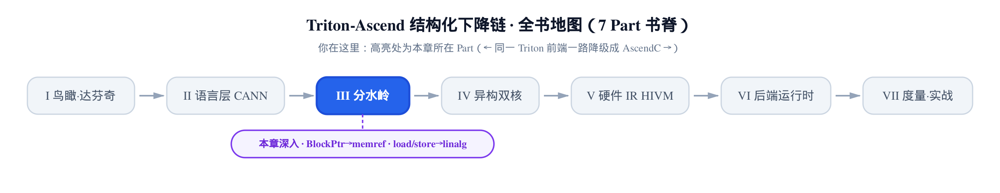
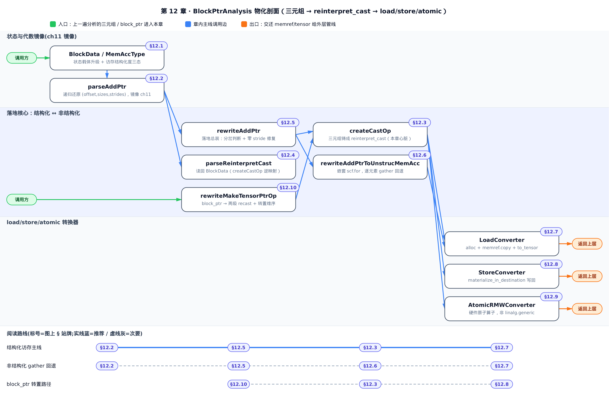
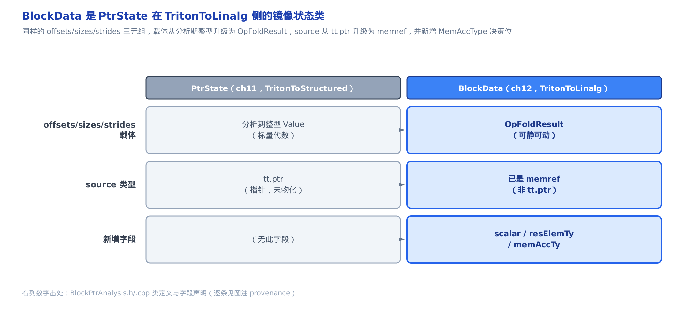
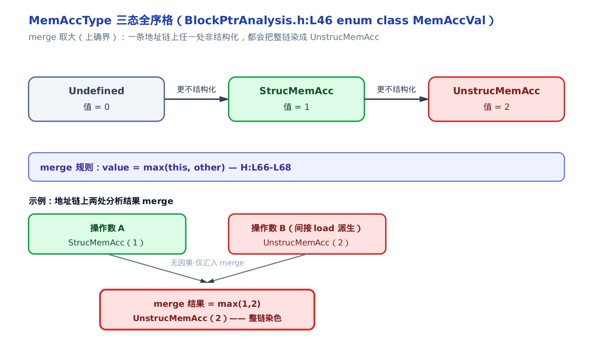
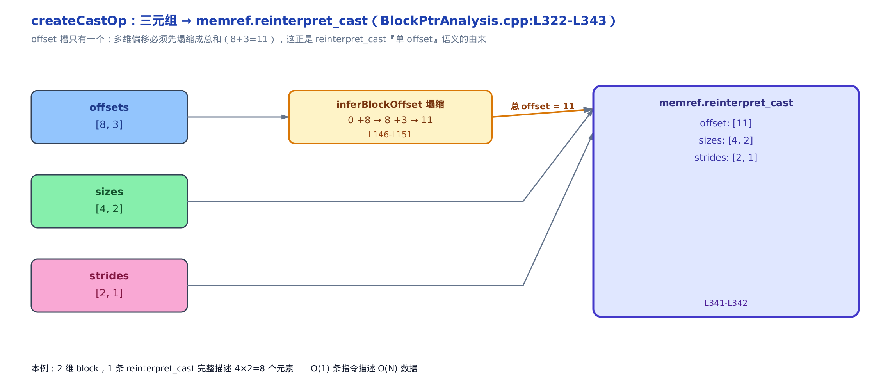
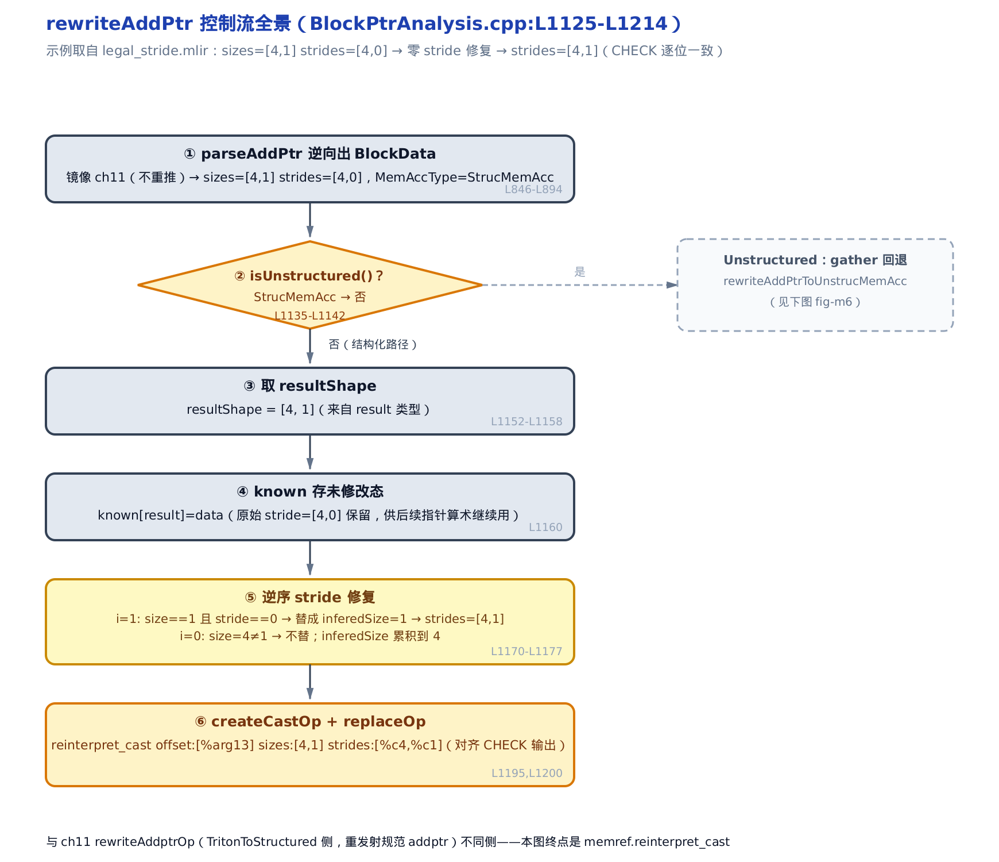
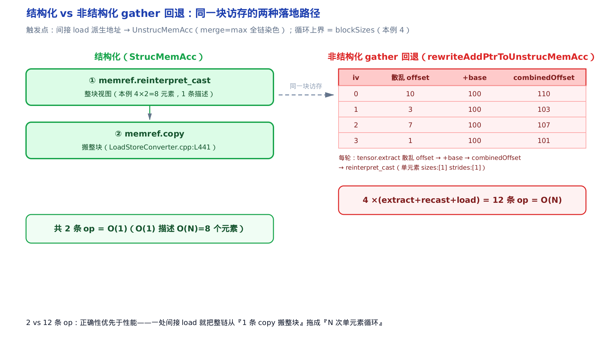
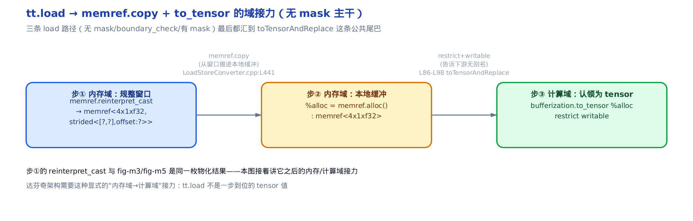

# 落到 memref：BlockPtrAnalysis、reinterpret_cast 与 load/store→linalg

> **你在这里**：分水岭的下半场。
> 上一章把地址算术说回了一句 (offset, sizes, strides)。
> 本章把这句话铸成真正的内存算子，让 `tt.load`/`tt.store` 落地。



上一章的 [PtrAnalysis](../../ch11-ptranalysis/narrative/chapter.md) 干的是「翻译」——把一坨散在十几个算子里的指针算术，逆向还原成一句结构化的话：从第几个元素起（offset）、每维取几个（sizes）、每维隔几个取一个（strides）。但那句话还只是一份**分析结论**，是登记表里的三个数，内存里什么都没发生。

本章干的是「施工」。同一套逆向算法，这次跑在 `TritonToLinalg` 这一侧，终点不再是重新发射一条规范的 `tt.addptr`，而是**真的开出一条 `memref.reinterpret_cast`**——把一段裸内存重新解释成带 offset/sizes/strides 的结构化视图（memref = MLIR 里记着「哪块内存、多大、每步跨多远」的内存引用，[第 9 章](../../ch09-mlir-linalg-primer/narrative/chapter.md)立、[第 10 章](../../ch10-watershed-triton-to-linalg/narrative/chapter.md)已给总览）。发完这条 `reinterpret_cast`，`tt.load` 才有地方可搬、`tt.store` 才有窗口可写。

> **选读指引**：只想看「三元组到底怎么变成一条内存算子」，直接跳 [§12.3](#123-createcastop三元组铸成-memrefreinterpret_cast)（本章心脏）；想知道「地址太散了怎么办」，看 [§12.6](#126-结构化不成就逐元素memacctype-与-gather-回退) 的 gather 回退；想跟全程，按序读。

本章讲的是分水岭机制（[triton_adapter](../../ch10-watershed-triton-to-linalg/narrative/chapter.md)）的后一遍——对位到 GPU 基座，这里正是二者分道扬镳之处：GPU 路把裸指针一路带到底、靠 SIMT 的 layout/warp 编码访存；达芬奇 NPU 不是 SIMT 架构，早早换轨成结构化 memref。所以基座那侧「往 shared memory 与向量化」的落地，在这里对应的是「往 memref 与 `reinterpret_cast`」。



只想看三元组怎么变成一条内存算子，盯紧图上「BlockData→createCastOp」这条主链，直接读 §12.3；想弄清结构化撑不住时怎么办，跳到「gather 回退」那一支即 §12.6；不挑读法，按序读完 §12.1 到 §12.10，图上每一站都会在正文对应小节里逐一兑现。

---

## 12.1 换一侧落地：BlockData 与 MemAccType

### 直觉

登记表还是那张登记表。上一章用 `PtrState`（TritonToStructured 侧的指针状态类）记「从哪起、取几个、隔多远」，这一侧换成一个叫 `BlockData`（TritonToLinalg 侧的指针状态类）的东西，记的还是同样三件事。差别只有两处：

- 格子里填的东西**升级了**。`PtrState` 里是分析期的整型或 `Value`；`BlockData` 里是 `OpFoldResult`（MLIR 的一个联合类型，一个槽要么装编译期常量、要么装运行期 `Value`）。为什么升级？因为它马上就要拿去建 memref，得能直接当 memref 的参数用。
- 多带一枚**访存体检章** `MemAccType`（memory access type，访存类型）。它回答一个是非题：这块地址能不能整整齐齐排成一个规整块（结构化），还是散乱到只能一个一个捡（非结构化）。



### 机制

先说那枚体检章，它是本章后半程所有分岔的开关。`MemAccType` 只有三态，是一个**全序格**：

```math
\mathrm{Undefined}(0) \;<\; \mathrm{StrucMemAcc}(1) \;<\; \mathrm{UnstrucMemAcc}(2)
```

`Undefined` 是还没定；`StrucMemAcc` 是结构化访存（能用一句三元组描述整块）；`UnstrucMemAcc` 是非结构化访存（地址散乱，得逐元素）。关键在合并规则——两段分析结果 merge 时**取大**：

```math
\mathrm{value} = \max(\mathrm{this},\ \mathrm{other})
```

取大意味着「一颗老鼠屎坏一锅汤」：一条地址链上只要出现**一处**非结构化，整条链就被染成 `UnstrucMemAcc`。这不是保守过头，是诚实——只要有一处说不清，硬把整块当规整的处理就会算错地址。



这个 max 的选择还带来一个好性质：`max` 满足结合律与交换律，所以递归 merge 的结果**与遍历顺序无关**——不管沿地址链先访问谁后访问谁，最终结构化度都是所有子表达式结构化度的上确界。这让「结构化度」成为一个良定义的量，而不是依赖走法的偶然结果。

### 源码

`MemAccType` 的定义就藏着上面这两条规则。先说清一层壳：`MemAccType` 是个**外层包装** struct，真正的三态枚举叫 `MemAccVal`，`MemAccType` 只在内部裹一个 `MemAccVal value` 字段——后文说「`MemAccType` 三态」，实际比较的就是这个 `MemAccVal`。壳加上一个取大的 `merge`：

```cpp
// third_party/ascend/include/TritonToLinalg/BlockPtrAnalysis.h:L46-L75
enum class MemAccVal { Undefined = 0, StrucMemAcc = 1, UnstrucMemAcc = 2 };

struct MemAccType {

  MemAccVal value;

  explicit constexpr MemAccType(MemAccVal v = MemAccVal::Undefined)
      : value(v) {}

  constexpr operator MemAccVal() const { return value; }
  explicit operator bool() = delete;

  constexpr bool isUndefined() const { return value == MemAccVal::Undefined; }
  constexpr bool isStructured() const {
    return value == MemAccVal::StrucMemAcc;
  }
  constexpr bool isUnstructured() const {
    return value == MemAccVal::UnstrucMemAcc;
  }

  void merge(MemAccType &other) {
    this->value = (this->value > other.value) ? this->value : other.value;
  }

  std::string_view toString() const {
    static constexpr std::string_view names[] = {"Undefined", "StrucMemAcc",
                                                 "UnstrucMemAcc"};
    return names[static_cast<int>(value)];
  }
};
```

`merge` 那行 `(this->value > other.value) ? this->value : other.value` 就是 `max` 的手写展开：枚举底层是 `0/1/2`，比大小即比结构化度。`isUnstructured()` 这个谓词，正是下一段 `rewriteAddPtr` 决定走哪条路的判据。

这里还要接上一章留下的一个口径。[第 11 章](../../ch11-ptranalysis/narrative/chapter.md)的分析终态里，`PtrState` 上带着一枚 `shouldLinearize` 布尔位——它是 **TritonToStructured 那条平行管线**上的决策标志，由 `MemOpConverter` 读取。本章这一侧的 `BlockData` **没有** `shouldLinearize`；结构化与否的对应决策，改由 `MemAccType` 承担。两条管线平行独立（[第 10 章「为什么做两遍」](../../ch10-watershed-triton-to-linalg/narrative/chapter.md#为什么做两遍)已立），别把两侧的字段混为一谈：那侧读 `shouldLinearize`，这侧看 `MemAccType`。

---

## 12.2 逆向代数是上一章的镜像

在物化之前，`BlockData` 要先被填满——`tt.addptr` 的地址算术得先逆向回三元组。这一步由 `parseAddPtr` 驱动，往下递归分派到 `addBlock`/`mulBlock`/`parseMakeRange`/`parseSplat`/`parseBroadcast` 一族方法。

但这套代数**和上一章一模一样**。入口 `parseAddPtr`（`third_party/ascend/lib/TritonToLinalg/BlockPtrAnalysis.cpp:L846-L894`）把 ptr、offset 两个操作数各自 parse 成子 `BlockData` 再 `addBlock` 合并——这就是 [§11.6 的 `addState`](../../ch11-ptranalysis/narrative/chapter.md#116-核心归并addstate-的完整代数)（按 `dimIndex` 双指针归并、同维要求 shape 互为倍数）；`mulBlock` 就是 [§11.5 的 `mulState`](../../ch11-ptranalysis/narrative/chapter.md#115-张量--标量mulstate-与-substate)（标量乘进每维 stride）；递归分派器 `parse`（`BlockPtrAnalysis.cpp:L392-L498`）对应 [§11.2 的 `visitOperand`](../../ch11-ptranalysis/narrative/chapter.md#112-递归分派器visitoperand-怎么顺着定义链问上去)。数据流一字不差，唯一的差别是**状态载体**：那边填 `PtrState`（分析期整型），这边填 `BlockData`（`OpFoldResult`，能直接建 memref）；那边的终点是重发射规范 `tt.addptr`，这边的终点是发射 `memref.reinterpret_cast`。

所以「(offset, sizes, strides) 究竟怎么从一坨算子里逆向出来」，上一章已经逐算子推透，本章不重推。我们只需记住：`parseAddPtr` 跑完，`BlockData` 里就躺着一组三元组，外加一枚 `MemAccType`。从这里开始，是本章的增量——**物化**。

---

## 12.3 createCastOp：三元组铸成 memref.reinterpret_cast

### 直觉

三元组 `(offset, sizes, strides)` 是一张**抓药配方**：从第 offset 个元素起、每维取 sizes 个、每维相邻元素隔 strides 个。`createCastOp` 就是照方抓药——把这张配方铸成一条 `memref.reinterpret_cast`，开出一扇看进底层内存的规整窗口。

只有一个坎要过：`reinterpret_cast` 的 offset 槽**只有一个**。可多维 block 每一维都有自己的起始偏移，怎么办？先把各维偏移**塌缩**成一个总偏移，再填进那唯一的槽。



### 机制

拿一个具体的二维 block 走一遍。设 `offsets=[8, 3]`、`sizes=[4, 2]`、`strides=[2, 1]`，source 是一块 `memref<?xf32>`（这些是为讲解选的一组小而具体的非退化值）：

<!-- trace: m3-createcastop-materialize -->

| 步骤 | 源码 | 输入 | 计算 | 输出/发射 |
| --- | --- | --- | --- | --- |
| inferBlockOffset 塌缩 | L144-L151 | offsets=[8,3] | retOffset: 0 +8 → 8 +3 → 11 | 总 offset = 11（单一线性偏移） |
| getResultMemrefType 组类型 | L153-L165 | offset=11, sizes=[4,2], strides=[2,1] | StridedLayoutAttr(offset=11, strides=[2,1]) | memref<4x2xf32, strided<[2,1], offset:11>> |
| size==1 维 stride 抬升检查 | L325-L339 | sizes=[4,2] | 无 resultShape[i]==1 的维 → MaxSIOp 不触发 | strides 保持 [2,1] |
| 发射 reinterpret_cast | L341-L342 | 以上三元组 + source | create<memref::ReinterpretCastOp> | memref.reinterpret_cast %src to offset:[11], sizes:[4,2], strides:[2,1] |

第一行是全章最该记住的一步：`inferBlockOffset` 把 `[8, 3]` 从 0 起逐项相加，得**总 offset = 11**。这就是「reinterpret_cast 只有一个 offset 参数」的由来——多维偏移必须先加总成一个线性偏移。第二行用 strides 组一个 `StridedLayoutAttr`（strided layout attribute，记「每维跨多远、从哪起」的布局属性），拼出结果 memref 的类型。第三行是一道安全阀，本例没触发，[§12.5](#125-rewriteaddptr落地总装--零-stride-修复) 会看到它触发的样子。第四行发射。

**不变量**：`createCastOp` 发出的 `reinterpret_cast`，其单一 offset 恒等于 `BlockData` 各维 offset 之和。证明很短——`inferBlockOffset` 从 0 起对 offsets 逐项相加，结果与相加顺序无关（加法结合律）。本例 2 维 block、`offsets=[8,3]` 塌缩成 1 个 `offset=11`，**1 条 `reinterpret_cast` 就完整描述了 $`4\times 2 = 8`$ 个元素的规整视图**——用 $`O(1)`$ 条指令描述了 $`O(N)`$ 的数据。这是结构化访存值得追求的根本原因。

### 源码

`createCastOp` 本体，三步：塌缩总 offset、抬升退化维 stride、发射。

```cpp
// third_party/ascend/lib/TritonToLinalg/BlockPtrAnalysis.cpp:L322-L343
memref::ReinterpretCastOp BlockData::createCastOp(ArrayRef<int64_t> resultShape,
                                                  const Location &loc,
                                                  OpBuilder &builder) const {
  OpFoldResult resOffset = this->inferBlockOffset(loc, builder);
  auto resultType = this->getResultMemrefType(
      isa<Attribute>(resOffset) ? getConstantIntValue(resOffset).value()
                                : ShapedType::kDynamic,
      resultShape);

  SmallVector<OpFoldResult> strides(this->strides);
  for (size_t i = 0; i < strides.size(); i++) {
    if (resultShape[i] == 1) {
      if (auto strideValue = dyn_cast<Value>(strides[i])) {
        auto oneIdx = builder.create<arith::ConstantOp>(loc, builder.getIndexAttr(1));
        strides[i] = builder.create<arith::MaxSIOp>(loc, strideValue, oneIdx).getResult();
      }
    }
  }

  return builder.create<memref::ReinterpretCastOp>(
      loc, resultType, this->source, resOffset, this->sizes, strides);
}
```

`resOffset` 来自 `inferBlockOffset`（多维塌缩）。中间那个 for 循环是安全阀：对 `resultShape[i]==1`（该维只取一个元素）且 stride 是动态 `Value` 的维，用 `arith.maxsi` 把 stride 抬成 `max(stride, 1)`——避免退化维产生零 stride 让下游 memref 非法。offset 是编译期常量就传常量，否则传 `ShapedType::kDynamic`（动态占位符）。最后 `create<memref::ReinterpretCastOp>`，三元组正式落地。

支撑它的两个私有辅助，`inferBlockOffset`（塌缩）与 `getResultMemrefType`（组类型）：

```cpp
// third_party/ascend/lib/TritonToLinalg/BlockPtrAnalysis.cpp:L144-L165
OpFoldResult BlockData::inferBlockOffset(const Location &loc,
                                         OpBuilder &builder) const {
  OpFoldResult retOffset = builder.getIndexAttr(0);
  for (auto ofr : offsets) {
    retOffset = addOpFoldResult(retOffset, ofr, loc, builder);
  }
  return retOffset;
}

MemRefType BlockData::getResultMemrefType(int64_t offset,
                                          ArrayRef<int64_t> resultShape) const {
  SmallVector<int64_t> staticStrides;
  SmallVector<Value> dynamicStrides;
  dispatchIndexOpFoldResults(strides, dynamicStrides, staticStrides);

  auto baseMemrefType = dyn_cast<BaseMemRefType>(this->source.getType());
  assert(baseMemrefType && "Invalid element type. It should be a base memref type.");
  auto elementType = baseMemrefType.getElementType();
  auto layout =
      StridedLayoutAttr::get(this->source.getContext(), offset, staticStrides);
  return MemRefType::get(resultShape, elementType, layout);
}
```

`inferBlockOffset` 就是那个「从 0 起逐项累加」的循环。`getResultMemrefType` 把 strides 拆成静态/动态两拨，组一个 `StridedLayoutAttr`，拼出 `memref<...x..., strided<[...], offset: ...>>` 这个类型。至此，一份分析结论变成了一条真正的 IR 指令。

---

## 12.4 往返自洽：parseReinterpretCast

有正就有反。`createCastOp` 是「三元组 → `reinterpret_cast`」的正映射；当一条地址链里**已经**含着一条 `reinterpret_cast`（比如 block_ptr 链走了多趟 recast），就需要把它**读回** `BlockData`。这是 `parseReinterpretCast`，逆映射。

它的关键语义，就是回收 [§12.3](#123-createcastop三元组铸成-memrefreinterpret_cast) 那个「offset 只有一个」的坎：既然正向把多维 offset 塌缩成了一个总和，逆向就只能把这个总和填回**第一维**，其余维补零。

```cpp
// third_party/ascend/lib/TritonToLinalg/BlockPtrAnalysis.cpp:L896-L915
void BlockDataParser::parseReinterpretCast(
    memref::ReinterpretCastOp op, BlockData &data, const Location &loc,
    ConversionPatternRewriter &rewriter,
    const llvm::SmallDenseMap<Value, BlockData> &known) {
  assert(data.isEmpty());

  data.setOffsets(op.getMixedOffsets());
  data.setSizes(op.getMixedSizes());
  data.setStrides(op.getMixedStrides());
  data.setSource(op.getSource());

  // In memref::ReinterpretCastOp, offset means the total of collapsing multiple
  // dimensions, which corresponds to first dim offset in block data.
  // Here populate the rest of the dimensions with zeroes.
  assert(data.getOffsetsRef().size() == 1);
  size_t loopLimit = data.getSizesRef().size();
  for (size_t i = 1; i < loopLimit; i++) {
    data.getOffsetsRef().push_back(rewriter.getIndexAttr(0));
  }
}
```

源码注释把话说死了：`reinterpret_cast` 的 offset 是「多维塌缩后的总和」，对应 `BlockData` 的第一维 offset，其余维在这里补零。这正是 `createCastOp` 的逆运算——两者构成一对互逆映射。正逆自洽，是 block_ptr 链能多趟 recast 折叠而**不丢寻址信息**的前提：无论中间套了几层 recast，塌缩与还原总能对上账。

---

## 12.5 rewriteAddPtr：落地总装 + 零 stride 修复

### 直觉

`createCastOp` 是零件，`rewriteAddPtr` 是**总装车间**。每一条 `tt.addptr` 落地，都要在这里走完一条流水线：先 `parseAddPtr` 逆向出三元组（[§12.2](#122-逆向代数是上一章的镜像) 说过，这步是上一章代数的镜像，不重推），再决定走结构化还是 gather，然后做一道「零 stride 修复」，最后交给 `createCastOp` 发射、`replaceOp` 替掉原 op。

「零 stride 修复」是本侧独有的一道工序：`size==1` 那种「只取一个元素」的退化维，它的 stride 常常是 0（隔 0 个元素取下一个——反正只取一个，隔多远都无所谓）。可零 stride 会让下游 memref 非法，所以要把它抬成一个合法的非零值。**微妙点**：修好的 stride 只用于物化，登记表 `known` 里存的仍是原始 0 stride——因为后续的指针算术还得用原值。分析态与物化态，故意解耦。



### 机制

拿一个**为讲解构造**的具体 `tt.addptr` 走一遍（同 [§12.3](#123-createcastop三元组铸成-memrefreinterpret_cast) 那样选一组小而具体的值）：设 `sizes=[4, 1]`、`strides=[4, 0]`（含一个零 stride——它来自那个 `size==1` 的退化维）、`MemAccType=StrucMemAcc`，看这条零 stride 怎么被就地抬成 `[4, 1]`：

<!-- trace: m5-rewriteaddptr-driver -->

| 步骤 | 源码 | 动作 | 关键值 | 结果 |
| --- | --- | --- | --- | --- |
| 1 parseAddPtr | L846-L894 | 逆向出 BlockData（镜像 ch11，链接回指） | sizes=[4,1] strides=[4,0] | MemAccType=StrucMemAcc |
| 2 Unstructured 分岔 | L1135-L1142 | isUnstructured()？ | StrucMemAcc → 否 | 走结构化路径 |
| 3 取 resultShape | L1152-L1158 | 从 result 类型取 shape | [4,1] | resultShape=[4,1] |
| 4 known 存未修改态 | L1160 | known[result]=data（原始 stride） | strides=[4,0]（原始 0 保留） | 分析态/物化态解耦 |
| 5 逆序 stride 修复 i=1 | L1170-L1177 | size==1 且 stride==0 → 替成 inferedSize | inferedSize=1 → strides[1]=1 | strides=[4,1]，inferedSize 累积 1 |
| 5 逆序 stride 修复 i=0 | L1170-L1177 | size=4≠1 → 不替；inferedSize×=4 | strides[0]=4 不变 | strides=[4,1]，inferedSize 累积 4 |
| 6 createCastOp + replaceOp | L1195,L1200 | 发射 reinterpret_cast 替掉 tt.addptr | offset:[base] sizes:[4,1] strides:[4,1] | 修好的 strides:[4,1] 交 createCastOp 物化 |

第 5 步是逆序扫维，`inferedSize` 是「所有比当前维低的维的 size 之积」，用公式写就是：

```math
\mathrm{inferedSize}_i = \prod_{j>i} \mathrm{size}[j]
```

`i=1`（最低维）时低维之积是空积 = 1，该维 `size==1 && stride==0`，命中，抬成 1；`i=0` 时 `size=4≠1`，不命中，只把 `inferedSize` 乘上 4。最终 `strides [4,0]→[4,1]`，退化维那条非法的零 stride 被就地抬成合法值。

顺带澄清一处**极易混淆**的点：仓库自带的 lit 夹具 `legal_stride.mlir` 里能看到一处**形态完全一样**的零 stride 修复（输入 `strides:[%c4, %c0]` → 输出 `strides:[%c4, %c1]`）——但那条 IR 里**根本没有 `tt.addptr`**，抬升它的也**不是**这里的 `rewriteAddPtr`，而是另一条独立的规范化 pass。[§12.7](#127-ttload-落地memrefcopy--to_tensor) 展示那段夹具时会点破这个「同形不同源」。

**不变量**：零 stride 修复不改变实际寻址。被抬的一定是 `size==1` 维，该维寻址表达式是 $`\mathrm{offset} + \mathrm{stride}\times k`$，而 $`k \in \{0\}`$，恒等于 offset——无论 stride 取何值都只落在同一个地址。所以抬 stride 只让 memref layout 合法，语义不变。而 `known` 存原始 0 stride，保证后续指针算术仍见原值。

### 源码

`rewriteAddPtr` 的挂载点极薄——`AddPtrConverter` 每匹配一条 `tt.addptr`，就 new 一张空登记表，把活儿全交出去：

```cpp
// third_party/ascend/lib/TritonToLinalg/LoadStoreConverter.cpp:L78-L84
LogicalResult
AddPtrConverter::matchAndRewrite(triton::AddPtrOp op, OpAdaptor adaptor,
                                 ConversionPatternRewriter &rewriter) const {
  llvm::SmallDenseMap<Value, BlockData> known;
  BlockDataParser::rewriteAddPtr(op, adaptor, rewriter, known);
  return success();
}
```

`AddPtrConverter`（`tt.addptr` 的转换模式）是本章 C++ 侧的 pass 挂载点，对应 [第 10 章 18 趟管线](../../ch10-watershed-triton-to-linalg/narrative/chapter.md#101-分水岭在哪里ttir_to_linalg-的一条管线) 里 `ttir_to_linalg` 那一趟。`known` 是这张地址链上「哪个 `Value` 对应哪份 `BlockData`」的登记表。

`rewriteAddPtr` 本体较长，下面为讲解分段加了带圈中文注释，控制流与 pin 一致、完整原文见 `BlockPtrAnalysis.cpp:L1125-L1214`。为聚焦逻辑做了两处删减，均非控制流：⑨ 处省略了 L1205-L1210 的 `LLVM_DEBUG` 打印（仅调试用），并把原 L1200 的一行注释 `// ToDo: need to handle module scenario` 换成了讲解注释。

```cpp
// third_party/ascend/lib/TritonToLinalg/BlockPtrAnalysis.cpp:L1125-L1214
void BlockDataParser::rewriteAddPtr(
    triton::AddPtrOp op, triton::AddPtrOp::Adaptor &adaptor,
    ConversionPatternRewriter &rewriter,
    llvm::SmallDenseMap<Value, BlockData> &known) {
  auto insertPoint = rewriter.saveInsertionPoint();
  rewriter.setInsertionPoint(op);

  // ① 逆向出 BlockData（镜像 ch11 的前向代数，不重推）
  BlockData data;
  parseAddPtr(op, data, op.getLoc(), rewriter, known);

  // ② 分岔：非结构化且源不是 intToPtr → 转 gather 回退，早返回
  if (auto src = data.getSource();
      data.getMemAccTypeRef().isUnstructured() &&
      !(src && isa_and_nonnull<triton::IntToPtrOp>(src.getDefiningOp()))) {
    // TODO: Based on more info, try to create a performant IR
    rewriteAddPtrToUnstrucMemAcc(op, adaptor, rewriter, data);
    LLVM_DEBUG({ llvm::dbgs() << *getModuleOpFromOperation(op) << "\n"; });
    return;
  }

  // ③ 空 size 补一个单元（单指针的 stub 形状 {1}）
  if (data.getSizesRef().size() == 0) {
    data.getSizesRef().push_back(rewriter.getIndexAttr(1));
    data.getStridesRef().push_back(rewriter.getIndexAttr(0));
    data.getOffsetsRef().push_back(data.getScalarRef());
  }

  // ④ 取 resultShape
  ArrayRef<int64_t> resultShape;
  // shape {1,} is stub for single ptr
  SmallVector<int64_t> stubScalarTypeShape(1, 1);
  if (auto shapedType = dyn_cast<ShapedType>(op.getResult().getType())) {
    resultShape = shapedType.getShape();
  } else {
    assert(data.getRank() == 1);
    resultShape = stubScalarTypeShape;
  }

  // ⑤ known 存未修改态（原始 0 stride，供后续指针算术继续用）
  known[op.getResult()] = data;

  // ⑥ 零 stride 修复：size==1 或 hoist_dim 命中且 stride 常量 0 → 抬成低维 size 之积
  // If there are dimensions with size 1 and stride 0, replace 0 stride with the
  // product of sizes of all lower dimensions. This avoids creating memref with
  // zero stride.
  // And here store the unmodified state into known ptrs, since any following
  // pointer arithmetic operations should still use the original 0 stride.
  auto inferedSize = 1;
  auto hoistDim = op->getAttrOfType<IntegerAttr>("hoist_dim");
  for (int i = data.getSizesRef().size() - 1; i >= 0; i--) {
    auto strideConst = getConstantIntValue(data.getStridesRef()[i]);
    auto sizeConst = getConstantIntValue(data.getSizesRef()[i]);
    assert(sizeConst.has_value());
    bool shouldReplaceStride = (sizeConst.value() == 1) || (hoistDim && hoistDim.getValue() == i);
    if (shouldReplaceStride && strideConst && strideConst.value() == 0) {
      data.getStridesRef()[i] = rewriter.getIndexAttr(inferedSize);
    }
    inferedSize *= sizeConst.value();
  }

  // ⑦ intToPtr 源 → hivm.pointer_cast
  if (auto intToPtrOp =
          dyn_cast<triton::IntToPtrOp>(data.getSourceRef().getDefiningOp())) {
    auto rtype = cast<triton::PointerType>(intToPtrOp.getResult().getType());
    auto memrefType =
        MemRefType::get({ShapedType::kDynamic}, rtype.getPointeeType());
    auto hivmPointCastOp = rewriter.create<hivm::PointerCastOp>(
        intToPtrOp.getLoc(), memrefType, ValueRange{intToPtrOp.getSrc()});
    data.setSource(hivmPointCastOp.getResult());
  }

  // ⑧ bitcast 改元素类型 → unrealized_conversion_cast
  if (data.hasResElemTy()) {
    // Handle bitcast scenario
    auto memrefType = dyn_cast<BaseMemRefType>(data.getSourceRef().getType())
                          .cloneWith(std::nullopt, data.getResElemTyRef());
    UnrealizedConversionCastOp castOp =
        rewriter.create<mlir::UnrealizedConversionCastOp>(
            op.getLoc(), memrefType, data.getSourceRef());
    data.setSource(castOp.getOutputs()[0]);
  }

  // ⑨ createCastOp 发射 reinterpret_cast → ⑩ replaceOp（此处即原 L1200 ToDo 注释的位置）
  memref::ReinterpretCastOp castOp =
      data.createCastOp(resultShape, op.getLoc(), rewriter);
  Value src = castOp.getResult();
  // … 省略 L1205-L1210 的 LLVM_DEBUG 打印 …
  rewriter.replaceOp(op, src);
  rewriter.restoreInsertionPoint(insertPoint);
}
```

十步串成一条线。②是那个分岔开关（下一节展开）；⑤和⑥的顺序刻意——**先**把未修改态存进 `known`，**再**在 `data` 上改 stride，物化态与分析态就此分家。⑥的判据 `shouldReplaceStride` 除了 `size==1`，还用 `||` 并列一个 `hoist_dim` 命中：`hoist_dim` 是 `HoistBroadcast`（一趟把广播维提出来单独处理的 pass）在提升某个广播维时标在 `tt.addptr` 上的整数属性，记下被提升的那一维维号——该维逻辑上也只对应一个元素，故和 `size==1` 维走同一条零 stride 修复。本例没有这枚属性，纯靠 `size==1` 触发，不深入展开。⑦处理 `tt.int_to_ptr`（整数强转指针）来源，落 `hivm.pointer_cast`（昇腾方言里的指针转 memref 算子）；⑧处理 `tt.bitcast`（改元素类型不改比特）来源，落 `unrealized_conversion_cast`（MLIR 的类型桥接占位 op）。⑨⑩收尾。

值得点破一处**边界**：②的分岔条件里有个 `&& !(src 是 IntToPtrOp)` 的例外——即使 `MemAccType` 判了非结构化，只要源头是 `intToPtr`，就仍走结构化路径。这跟上一章的 [`rewriteAddptrOp`](../../ch11-ptranalysis/narrative/chapter.md#117-根节点visitoperandaddptr) **不是同一个函数**：那边在 TritonToStructured 侧、重发射规范 `tt.addptr`；这边在 TritonToLinalg 侧、终点是 `memref.reinterpret_cast`。名字像，侧不同，别混。

---

## 12.6 结构化不成就逐元素：MemAccType 与 gather 回退

### 直觉

回到 [§12.5](#125-rewriteaddptr落地总装--零-stride-修复) 那个分岔②。绝大多数流水能整整齐齐填进规整表格——一条 `reinterpret_cast` 搞定整块。可一旦出现「金额得去另一张表里逐笔查」的间接项，麻烦就来了。

这个「间接项」在 Triton 里就是 **gather**（聚集访存）：地址本身来自**另一次** `tt.load`，比如 `tl.load(base + idx_tensor)`，其中 `idx_tensor` 是运行期才知道的一串下标。这种地址没法用一个 `(offset, sizes, strides)` 静态描述——你根本不知道下一个元素跳到哪。`MemAccType` 的 merge 取大，就是在这里把整条链染成 `UnstrucMemAcc`。于是 `rewriteAddPtr` 退化成逐元素循环：按块大小建嵌套 `scf.for`（结构化控制流的 for 循环），每轮捡一个散乱 offset、造一个单元素 `reinterpret_cast`，把原 `tt.load` 挪进循环、打上 `IndirectLoad` 标。正确但慢——这是不肯瞎猜的兜底。



### 机制

设一个 gather：`base=100`，下标张量 `idx=[10, 3, 7, 1]`（`N=4`，且 `idx` 来自前一次 `tt.load`，故标 `UnstrucMemAcc`）。回退循环逐轮这样跑：

<!-- trace: m6-memacc-decision-gather-fallback -->

| 循环 iv | extract 散乱 offset | + base | combinedOffset | 发射（单元素） |
| --- | --- | --- | --- | --- |
| 0 | 10 | 100 | 110 | reinterpret_cast offset:[110] sizes:[1] strides:[1] |
| 1 | 3 | 100 | 103 | reinterpret_cast offset:[103] sizes:[1] strides:[1] |
| 2 | 7 | 100 | 107 | reinterpret_cast offset:[107] sizes:[1] strides:[1] |
| 3 | 1 | 100 | 101 | reinterpret_cast offset:[101] sizes:[1] strides:[1] |

每轮 `tensor.extract`（从 tensor 里取一个标量）拿到散乱 offset，加 base 得 `combinedOffset`，造一个 `sizes:[1] strides:[1]` 的单元素 `reinterpret_cast`。

**复杂度对比**，这是「为何要尽量判成结构化」的量化答案。结构化路径：1 条 `reinterpret_cast` + 1 条 `memref.copy` = **2 条 op**，用 $`O(1)`$ 指令描述 $`O(N)`$ 数据。gather 回退：4 次循环 ×（1 `tensor.extract` + 1 `reinterpret_cast` + 1 `memref.load`）= **12 条 op**，外加循环开销，是 $`O(N)`$。**2 vs 12** 这个差，就是保守兜底的代价。

**终止性**：gather 的嵌套 `scf.for` 上界取自 `blockSizes`——那是编译期已知的有限维度积 $`\prod \mathrm{size}[i]`$，每层步长为 1，故迭代次数有限、必停。

### 源码

先看 `UnstrucMemAcc` 从哪来。`parseIndirectLoad` 是产生点之一：地址若派生自 `tt.load`，结果无法静态描述，标 `UnstrucMemAcc`；只有 `<1>` 形状单元素或标量 load（用作 scalar offset）才降回 `StrucMemAcc`：

```cpp
// third_party/ascend/lib/TritonToLinalg/BlockPtrAnalysis.cpp:L962-L1003
template <typename OpTy>
void parseIndirectLoad(OpTy op, BlockData &data, const Location &loc,
                       ConversionPatternRewriter &rewriter,
                       const llvm::SmallDenseMap<Value, BlockData> &known,
                       unsigned resultIdx)
{
  assert(resultIdx < op->getNumResults() &&
         "resultIdx out of range for parseIndirectLoad");
  auto opRes = op->getResult(resultIdx);
  auto opResTy = opRes.getType();
  std::vector<int64_t> resShape;
  if (auto shapedResTy = dyn_cast<ShapedType>(opResTy)) {
    // For now, we consider this is UnstrucMemAcc because we have no other info.
    // Visiting other ops may change the type due to more info.
    resShape = shapedResTy.getShape().vec();
    auto numOperands = 3;
    if (resShape.size() == 1 && resShape[0] == 1 && op->getNumOperands() == numOperands) {
        Value zeroIdx = rewriter.create<arith::ConstantIndexOp>(loc, 0);
        Value extracted = rewriter.create<tensor::ExtractOp>(loc, opRes, ValueRange{zeroIdx});
        Value scalarIdx = rewriter.create<arith::IndexCastOp>(loc, rewriter.getIndexType(), extracted);
        data.setMemAccVal(MemAccVal::StrucMemAcc);
        data.setScalar(scalarIdx);
        data.getSizesRef().push_back(rewriter.getIndexAttr(1));
        data.getStridesRef().push_back(rewriter.getIndexAttr(0));
        data.getOffsetsRef().push_back(scalarIdx);
        return;
    }
    data.setMemAccVal(MemAccVal::UnstrucMemAcc);
  } else {
    // scalar load means this is used as offset. It is StrucMemAcc.
    data.setMemAccVal(MemAccVal::StrucMemAcc);
    resShape.push_back(1);
  }
  for (auto &s : resShape) {
    data.getOffsetsRef().push_back(rewriter.getIndexAttr(0));
    data.getSizesRef().push_back(rewriter.getIndexAttr(s));
    data.getStridesRef().push_back(rewriter.getIndexAttr(1));
  }
  // set the source in BlockData so that we know an indirect-load op exists in
  // the chain.
  data.setSource(opRes);
}
```

末尾 `setSource(opRes)` 让链上留下「存在间接 load」的痕迹；这个 `UnstrucMemAcc` 标志经 `addBlock`/`parseAddPtr` 的 merge 一路带到 [§12.5](#125-rewriteaddptr落地总装--零-stride-修复) 那个分岔判断。

再看回退落地 `rewriteAddPtrToUnstrucMemAcc`：按 `blockSizes` 建嵌套 `scf.for`，循环体里逐元素造单元素 `reinterpret_cast`，并把 `tt.load` 挪进循环：

```cpp
// third_party/ascend/lib/TritonToLinalg/BlockPtrAnalysis.cpp:L2158-L2232
void BlockDataParser::rewriteAddPtrToUnstrucMemAcc(
    triton::AddPtrOp op, triton::AddPtrOp::Adaptor &adaptor,
    ConversionPatternRewriter &rewriter, BlockData &data) {
  auto loc = op.getLoc();
  auto &offsets = data.getOffsetsRef();
  auto &blockSizes = data.getSizesRef();
  auto &strides = data.getStridesRef();
  Value ptrOffset = adaptor.getOffset();
  Value zeroIdx =
      rewriter.create<arith::ConstantOp>(loc, rewriter.getIndexAttr(0));
  Value oneIdx =
      rewriter.create<arith::ConstantOp>(loc, rewriter.getIndexAttr(1));
  auto addptrRes = op.getResult();
  assert(addptrRes.hasOneUse() && "Invalid: tt.addptr has multiple users");
  auto loadOp = *(addptrRes.user_begin());

  // Prepare empty tensor for loop based scalar load
  // FIXME: We use cast here because addptr must return tensor<?x!tt.ptr<f32>>.
  // True?
  auto resTy = cast<ShapedType>(addptrRes.getType());
  auto resEPtrTy = resTy.getElementType();
  auto resETy = cast<triton::PointerType>(resEPtrTy).getPointeeType();
  Value loaded = rewriter.create<tensor::EmptyOp>(loc, blockSizes, resETy);
  SmallVector<Value> initArgs;
  initArgs.push_back(loaded);

  SmallVector<Value> forLBs;
  SmallVector<Value> forUBs;
  SmallVector<Value> forSteps;
  for (auto &s : offsets) {
    forLBs.push_back(zeroIdx);
  }
  for (auto &s : blockSizes) {
    forUBs.push_back(getValueOrCreateConstantIndexOp(rewriter, loc, s));
  }
  for (auto &s : strides) {
    forSteps.push_back(oneIdx);
  }
  SmallVector<Value> ivs;
  OpBuilder builder(op);
  auto loop = createNestedLoops(
      builder, loc, 0, blockSizes.size(), forLBs, forUBs, forSteps, ivs,
      initArgs,
      [&](OpBuilder &bB, Location bLoc, SmallVector<Value> &allIVs,
          ValueRange iterArgs) {
        OpBuilder::InsertionGuard g(bB);
        bB.setInsertionPointToStart(bB.getBlock());

        Value scalarOffsetRaw =
            bB.create<tensor::ExtractOp>(bLoc, ptrOffset, allIVs);
        Value scalarOffset = bB.create<arith::IndexCastOp>(
            bLoc, bB.getIndexType(), scalarOffsetRaw);
        OpFoldResult baseOffset = bB.getIndexAttr(0);
        for (auto ofr : data.getOffsetsRef()) {
          baseOffset = addOpFoldResult(baseOffset, ofr, bLoc, bB);
        }
        Value baseVal =
            getValueOrCreateConstantIndexOp(bB, bLoc, baseOffset);
        Value combinedOffset =
            bB.create<arith::AddIOp>(bLoc, baseVal, scalarOffset);
        // Replace offset & size. Only single element.
        data.getOffsetsRef().clear();
        data.getOffsetsRef().push_back(combinedOffset);
        data.getSizesRef().clear();
        data.getSizesRef().push_back(bB.getIndexAttr(1));
        data.getStridesRef().clear();
        data.getStridesRef().push_back(bB.getIndexAttr(1));
        memref::ReinterpretCastOp castOp = data.createCastOp({1}, bLoc, bB);
        rewriter.replaceOp(op, castOp);
        // Move tt.load using this tt.addptr into this block
        loadOp->moveAfter(castOp);
        loadOp->setAttr("IndirectLoad", UnitAttr::get(op.getContext()));
        bB.create<scf::YieldOp>(bLoc, iterArgs);
      });
}
```

循环体那段 lambda 就是表格里每一行：`tensor.extract` 拿散乱 offset → `arith.addi` 加 base 得 `combinedOffset` → `data` 重置成单元素三元组 `sizes:[1]/strides:[1]` → `createCastOp({1})` 造单元素 `reinterpret_cast`。末尾 `loadOp->moveAfter(castOp)` 把 `tt.load` 挪进循环、`setAttr("IndirectLoad")` 打标——这个标由 `LoadConverter` 接手，在循环里补 `memref.load`+`tensor.insert`。注意 `hasOneUse()` 那个断言：回退只处理单用户的 `tt.addptr`，这是保守简化。

---

## 12.7 tt.load 落地：memref.copy + to_tensor

### 直觉

地址落成 `reinterpret_cast` 之后，`tt.load` 才有活干。它落地分三步——把外部内存里的一块数据先「搬」进一块本地缓冲，再把缓冲「认领」成 tensor 值供后续计算用：

1. `memref.alloc` 开一块本地缓冲。
2. `memref.copy` 从 `reinterpret_cast` 出的规整 memref 把数据搬进来。
3. `bufferization.to_tensor` 把缓冲变回 tensor 值，替换掉原 `tt.load`。

为什么要这么绕？因为达芬奇架构需要显式的「内存域 → 计算域」接力：`tt.load` 不是一步到位的 tensor 值，中间那块 `alloc` 对应硬件上的本地缓冲（[第 5 章的 buffer↔tensor 桥](../../ch05-explicit-memory-hierarchy/narrative/chapter.md)立过这对搬运/计算原语）。



### 机制

`tt.load` 落地实际有三条路径——无 mask 主干、`boundary_check` 分支（`boundary_check` 是边界检查——block_ptr 的块超出张量边缘时如何裁剪，[§12.10](#1210-block_ptr-与转置make_tensor_ptr--reinterpret_cast) 详展）、有 mask 分支——它们最后都汇到同一条公共尾巴 `toTensorAndReplace`。这里只主讲最干净的**无 mask 主干**：此刻地址已是 `reinterpret_cast` 出的规整 memref，落地就是上面直觉说的「开缓冲 → `memref.copy` 搬进来 → `to_tensor` 认领成 tensor」这三步。

### 源码

主干（无 mask、无 boundary_check 情形）的核心几行——此刻 `ptr` 已是 `reinterpret_cast` 出的 memref：

```cpp
// third_party/ascend/lib/TritonToLinalg/LoadStoreConverter.cpp:L425-L453（无 mask 主干；
//   省略 scalar 分支 L240-L259、boundary_check 分支 L344-L423、有 mask 分支 L455-L519）
  if (!mask) {
    assert(!other && "can not input 'other' when 'mask' is not set");
    if (auto unrealizedCastOp =
            ptr.getDefiningOp<UnrealizedConversionCastOp>()) {
      // TODO : not support handle  associate with "module"
      // hint : can be handled in Linearize
      op->emitError("meeting unexpected UCC in LoadConverter!");
      return failure();
    } else {
      // If last dimension stride equals 2, try deinterleave optimization.
      auto [ptrStrides, ptrOffsets] = getStridesAndOffset(memRefType);
      if (ptrStrides.back() == 2 && (memRefShape.back() % 2 == 0) &&
          mlir::triton::DeinterleaveStatusOptimization(op, adaptor, rewriter)
              .succeeded()) {
        return success();
      }
      auto copyOp = rewriter.create<memref::CopyOp>(loc, ptr, allocOp);
      propagateWasBoolToInt8Attr(op.getOperation(), copyOp.getOperation(), rewriter);
      if (mayImplicitTransposeWithLastAxis && allocOp.getDefiningOp<memref::AllocOp>()) {
        auto markOp = rewriter.create<annotation::MarkOp>(loc, allocOp);
        markOp->setAttr(MayImplicitTransposeWithLastAxisTAG, UnitAttr::get(rewriter.getContext()));
      } else if (mayImplicitTransposeWithLastAxis && allocOp.getDefiningOp<memref::SubViewOp>()) {
        auto markOp = rewriter.create<annotation::MarkOp>(loc, allocOpTmp);
        markOp->setAttr(MayImplicitTransposeWithLastAxisTAG, UnitAttr::get(rewriter.getContext()));
      }
    }

    return this->toTensorAndReplace(op, tensorType, allocOp, mayImplicitTransposeWithLastAxis, loc, rewriter);
  }
```

主线只有一句 `memref.copy`：把 `ptr`（结构化 memref）搬进前文 `alloc` 的本地缓冲 `allocOp`。紧跟的 `propagateWasBoolToInt8Attr` 是把 `tt.load` 原有的 bool-was-int8（布尔张量在底层以 int8 承载的记账属性）透传到新算子上的记账调用，与主线搬运无关，略过。前面那个 `末维 stride==2` 的分支是 deinterleave（去交织）优化，本章不主讲；`mayImplicitTransposeWithLastAxis` 那段是给可能的隐式转置打注解，也是旁支。搬完，`toTensorAndReplace` 收尾——这是三条 load 路径（无 mask / boundary_check / 有 mask）共用的公共尾巴：

```cpp
// third_party/ascend/lib/TritonToLinalg/LoadStoreConverter.cpp:L86-L98
LogicalResult LoadConverter::toTensorAndReplace(
    triton::LoadOp &op, RankedTensorType &tensorType, Value localMem,
    bool mayImplicitTransposeWithLastAxis, const Location &loc, ConversionPatternRewriter &rewriter) const {
  Value loadedTensor = rewriter.create<bufferization::ToTensorOp>(loc, tensorType, localMem, true, true);
  propagateWasBoolToInt8Attr(op.getOperation(), loadedTensor.getDefiningOp(), rewriter);

  if(mayImplicitTransposeWithLastAxis){
    auto markOp = rewriter.create<annotation::MarkOp>(loc, loadedTensor);
    markOp->setAttr(MayImplicitTransposeWithLastAxisTAG, UnitAttr::get(rewriter.getContext()));
  }
  rewriter.replaceOp(op, loadedTensor);
  return success();
}
```

`bufferization.to_tensor` 的两个 `true` 是 `restrict`（无别名保证）和 `writable`（可写）——这两个标注告诉下游 bufferization「这块缓冲没别名、能就地写」，省掉别名分析。`replaceOp` 把 `tt.load` 替成这个 tensor 值，落地完成。

不变量：`memref.copy` 逐元素复制、`bufferization.to_tensor` 只做视图/所有权转换（restrict + writable 免别名分析）——搬运前后张量的元素值与逻辑形状不变，变的只是所在地址空间：从 `reinterpret_cast` 出的 memref（内存域）换到 tensor（计算域）。

这一整套在 `legal_stride.mlir` 里看得最清楚——`reinterpret_cast` → `memref.alloc` → `memref.copy` → `bufferization.to_tensor` 四行紧挨着，正是上面代码跑出来的形态：

```mlir
// third_party/ascend/unittest/Conversion/General/TritonToLinalg/legal_stride.mlir
%reinterpret_cast = memref.reinterpret_cast %arg2 to offset: [%arg13], sizes: [4, 1], strides: [%c4, %c0] : memref<?xf32> to memref<4x1xf32, strided<[?, ?], offset: ?>>
%alloc = memref.alloc() : memref<4x1xf32>
memref.copy %reinterpret_cast, %alloc : memref<4x1xf32, strided<[?, ?], offset: ?>> to memref<4x1xf32>
%2 = bufferization.to_tensor %alloc restrict writable : memref<4x1xf32>
```

（这段夹具的输入 stride 是 `%c0`，因为它是 `RUN` 前的原始 IR；跑完 pass 后的 CHECK 输出把它抬成了 `%c1`。这里要**点破一处同形不同源**：这道 `%c0→%c1` 抬升**不是** [§12.5](#125-rewriteaddptr落地总装--零-stride-修复) 那条 `rewriteAddPtr` 内联修复干的——本夹具函数体一进来就是 memref 级 IR，压根没有 `tt.addptr` 可匹配。真正干活的是一条**独立**的规范化 pass `ReinterpretCastStrideCanonicalizer`（`third_party/ascend/lib/TritonToLinalg/LoadStoreConverter.cpp:L1182-L1236`），由 `processLegalStrideOperations`（`third_party/ascend/lib/TritonToLinalg/TritonToLinalgPass.cpp:L746-L758`）直接扫 `memref.reinterpret_cast` 触发。它和 §12.5 的修复逻辑同形、触发点不同：§12.5 在 `tt.addptr` 上就地把 stride 烤成**静态属性**（结果类型里落一个具体数字）；这条 canonicalizer 则新造一个 `arith.constant 1` 当**动态 stride 操作数**——所以上面 CHECK 里看到的是 `%[[C1]] = arith.constant 1`、而 memref 类型仍是 `strided<[?, ?], offset: ?>`（stride 位保持动态 `?`）。）

---

## 12.8 tt.store 落地：materialize_in_destination

### 直觉

`tt.store` 是 `tt.load` 的镜像：load 把数据从 memref 搬进 tensor 计算域，store 把算完的 tensor 值**就地写回** `reinterpret_cast` 出的 memref。落地算子是 `bufferization.materialize_in_destination`（把 tensor 值物化进目标 memref）。

### 机制

落地分两条路径。**无 mask**：一步到位，直接 `materialize_in_destination(val in ptr)` 把整块 tensor 写回目标 memref。**有连续 mask**：先解析出实际要搬的那段区间，只 `materialize` 那一片。下面源码依次就是这两条。

### 源码

```cpp
// third_party/ascend/lib/TritonToLinalg/LoadStoreConverter.cpp:L1124-L1150
//   （省略 boundary_check 分支 L1064-L1122，含 original_order 维序置换）
  // 2. Simple load with no mask
  if (!mask) {
    auto storeOp = rewriter.create<bufferization::MaterializeInDestinationOp>(
        loc, val, ptr);
    storeOp.setWritable(true);
    rewriter.eraseOp(op);
    return success();
  }

  // 3. Continuous masked stores.
  // Analyze the mask operand to determine at runtime the size of the data we
  // are moving.
  MaskState mstate;
  auto isContMask = mstate.parse(mask, loc, rewriter);

  if (isContMask.failed()) {
    return failure();
  }
  LLVM_DEBUG({ llvm::dbgs() << *getModuleOpFromOperation(op) << "\n"; });
  auto srcSlice = mstate.getExtractSlice(val, loc, rewriter);
  auto dstSubview = mstate.getSubview(ptr, loc, rewriter);
  auto storeOp = rewriter.create<bufferization::MaterializeInDestinationOp>(
      loc, srcSlice, dstSubview);
  storeOp.setWritable(true);
  rewriter.eraseOp(op);
  return success();
```

无 mask 时最直接：一条 `materialize_in_destination(val in ptr)`，`setWritable(true)`，`eraseOp` 删掉原 `tt.store`。有连续 mask 时多一步——先用 `MaskState`（掩码状态，解析连续掩码搬运区间的分析类）解析出实际要搬的区间，`getExtractSlice(val)` 从源 tensor 取那一片、`getSubview(ptr)` 从目标 memref 取那一窗，再 `materialize`。这道 `MaskState` 解析，正是下一章《MaskAnalysis：边界语义》的主题。

顺带一提，第一行注释 `2. Simple load with no mask` 是源码原文的笔误——这里明明是 store。逐字保留，不替读者「修正」。`legal_stride.mlir` 末尾那条 `bufferization.materialize_in_destination %2 in writable %reinterpret_cast_0` 就是无 mask 分支的真实产物。

---

## 12.9 tt.atomic_rmw 落地：硬件原子算子

### 直觉

`tt.atomic_rmw`（atomic read-modify-write，原子读-改-写，如原子加）落地，值得单独澄清一处**常见误解**。老文档注释里画的是「落成 `linalg.generic` + `GenericAtomicRMW`」的形态——但**现行代码不是这样**。为什么？昇腾有原生原子指令，直接映射比软件模拟循环高效得多；只有硬件不支持的 kind×dtype 组合才退回软件模拟。

### 机制

`AtomicRMWConverter` 按硬件支持度 `isHardwareSupported`（哪些 kind×dtype 组合有原生原子指令）分派，落到**硬件原子算子**，全程没有 `linalg.generic`。分派逻辑三层：硬件支持 → `hivm.hir.store`（昇腾方言的原子 store，带 `atomic=<kind>`）；是 `XCHG`（原子交换）→ `hfusion.atomic_xchg`；否则软件模拟，还要按芯片分岔——`91095`（一款昇腾芯片代号）走 `hfusion.store`、其余走 `hfusion.atomic_rmw`。`hivm`/`hfusion` 是昇腾自研的两个方言，其中 HFusion 是 Linalg 的扩展集。

这不是空口——lit 夹具 `atomic_rmw.mlir` 顶部的 CHECK 就把话钉死了：

```mlir
// third_party/ascend/unittest/Conversion/General/TritonToLinalg/atomic_rmw.mlir
// CHECK-LABEL: func.func @matmul_atomic_add
// CHECK-NOT: GenericAtomicRMW
// CHECK: tensor.extract_slice
// CHECK: hivm.hir.store ins(%{{.*}} : tensor<?x?xf32>) outs(%{{.*}} : memref<?x?xf32{{.*}}>) atomic = <add>
```

`CHECK-NOT: GenericAtomicRMW` 明确否掉了 `linalg.generic` 形态，`CHECK` 坐实落到 `hivm.hir.store ... atomic = <add>`。（真正用 `linalg::GenericOp` 的是 `AtomicCASConverter`（compare-and-swap），不是 RMW——那是另一个 converter 的事。）

### 源码

分派落到硬件原子算子的核心几行——注意源码里创建的是 `hivm::StoreOp`，`hivm::StoreOp` 打印成文本 IR 时算子名是 `hivm.hir.store`（hivm 方言下的 hir 子命名空间），正与上面 CHECK 里的 `hivm.hir.store` 对应：

```cpp
// third_party/ascend/lib/TritonToLinalg/LoadStoreConverter.cpp:L664-L686
//   （省略前文 atomicKindMap 建表 L568-L595、mask/discrete-mask 处理 L616-L663）
  } else {
    if (isHardwareSupported)
      rewriter.create<hivm::StoreOp>(op.getLoc(), TypeRange {}, inputVal, dstMemref, atomicKind);
    else if (rmwOp == RMWOp::XCHG)
      rewriter.create<hfusion::AtomicXchgOp>(op.getLoc(), TypeRange(), inputMemref, dstMemref);
    else {
      if (rmwOp == RMWOp::OR || rmwOp == RMWOp::XOR || rmwOp == RMWOp::AND) {
        if (!elementType.isSignlessIntOrIndex()) {
          return op->emitOpError() << "must be signless-integer-like, but got " << elementType;
        }
      }
      // Currently, for atomic kind and element type that is not supported by the hardware, we use software to simulate
      // the computation. However, decompose now happens in both HFusion and HIVM, and is not consistent for 910B and
      // 91095. Therefore, we convert to different atomic/store ops for now. This should be unified and refactored
      // later.
      if (compileOn91095Flag) {
        rewriter.create<hfusion::StoreOp>(op.getLoc(), TypeRange {}, ValueRange {inputMemref}, ValueRange {dstMemref},
                                          hfusionAtomicKind, ArrayRef<NamedAttribute> {});
      } else {
        rewriter.create<hfusion::AtomicRMWOp>(op.getLoc(), TypeRange(), inputMemref, dstMemref, hfusionAtomicKind);
      }
    }
  }
```

---

## 12.10 block_ptr 与转置：make_tensor_ptr → reinterpret_cast

### 直觉

到这里，上一章埋下的一处伏笔可以兑现了。[第 11 章结尾](../../ch11-ptranalysis/narrative/chapter.md#小结上半场把地址说回一句话)说：把三元组铸成 `memref.reinterpret_cast`、并处理 block_ptr 的转置与维序，是本章的活。前面 [§12.3](#123-createcastop三元组铸成-memrefreinterpret_cast) 已经兑现了「铸成 `reinterpret_cast`」，这一节兑现「block_ptr 的转置与维序」。

`block_ptr`（块指针，Triton 里用 `tl.make_block_ptr` 造）是一张**整块搬运的施工图**：它给出大张量的 shape/strides、这一块的起始 offset 和块尺寸。`rewriteMakeTensorPtrOp` 把它落成 `reinterpret_cast`，比普通 `addptr` 多两件事：

- **算线性起点**：各维起始 offset 乘对应 stride 再累加，得这块砖在大楼里的线性位置。
- **留一张全楼平面图**：特意多发一条带 `tensor_ptr_full_shape` 标的**冗余** `reinterpret_cast`，记着 parent 的全 shape——供后续 load/store 做 `boundary_check`（边界检查，块超出张量边缘时的裁剪）。

**转置**则是交换「楼层号与房间号」的读法：`tl.make_block_ptr` 的 `order` 参数决定按哪个维序读，落到 IR 上就记成 `make_tensor_ptr` 的 `original_order` 属性——下文源码与表格统一用后者这个名字。数据本身不搬，只是 `boundary_check` 的轴号要按 `original_order` 公式回改。

### 机制

设一个 row-major 的 parent：`shape=[128, 64]`、`strides=[64, 1]`，取一块 `block_sizes=[16, 32]`、起始 `block_offsets=[2, 1]`，base recast offset = 0：

<!-- trace: m10-make-tensor-ptr-block -->

| 步骤 | 源码 | 动作 | 关键值 | 结果 |
| --- | --- | --- | --- | --- |
| 1 parse base + 映射 | L1287-L1308 | base→source memref；offsets 过 max(v,0)；strides 映射 | offsets=[2,1] strides=[64,1] | source=memref<?xf32> |
| 2 offset×stride | L1311-L1313 | newOffsets[i]=offset[i]×stride[i] | [2×64, 1×1] | newOffsets=[128,1] |
| 3 累加 base 于 front | L1327 | newOffsets[0]+=base recast offset | 128 + 0 | newOffsets=[128,1] |
| 4 冗余全 shape op | L1232-L1275,L1354-L1355 | sizes←parent [128,64]，offsets=[0,0]，打 tensor_ptr_full_shape 标 | 记全 shape 供 boundary_check | 第 1 条 reinterpret_cast（全 shape） |
| 5 目标块 createCastOp | L1360,L144 | inferBlockOffset 塌缩 + 发射目标块 | 128 + 1 = 129 | 第 2 条 reinterpret_cast offset:[129] sizes:[16,32] strides:[64,1] |
| 6 转置维序 boundary_check | LoadStoreConverter.cpp:L350-L353 | original_order 置换 boundary_check 轴 | order=(0,1) bc=(1,) → new_bc[0]=2-1-1=0 | 边界检查轴回改为 0 |

第 1 步里那个 `offsets 过 max(v,0)` 是一道**防御性钳制**：block_ptr 的各维起始 offset 理应非负（一块砖不该起在整张量的边界之外），源码用 `arith.maxsi(v, 0)` 把可能算出的负偏移夹回 0，与本节主线（offset×stride 合成线性偏移）无关，点到为止。第 2 步是关键：block_ptr 的 offset 不是元素个数，是「第几行第几列」，得乘上 stride 才成线性偏移——`[2, 1]` 乘 `[64, 1]` 得 `[128, 1]`。第 3 步把 base 累加进最高维（front）——本例 base 是原始张量、无前序 recast，其 offset 为 0，这步是恒等操作（`128 + 0`）；若 block_ptr 链上 base 本身来自前一次 recast（如多层 `make_block_ptr` 嵌套），`accumulatePotentialOffsetOnBase` 就会把那次 recast 的 offset 累加进来，这正是它存在的意义。第 5 步再经 `inferBlockOffset` 塌缩：`128 + 1 = 129`，就是目标块的总 offset。

**不变量**：每个 block_ptr 恒物化出**两条** `reinterpret_cast`——一条记 parent 全 shape（各维 offset=0，仅 front 累加 base）、一条记目标块。目标块的总 offset 由下式合成：

```math
\mathrm{offset}_{\mathrm{block}} = \sum_i \mathrm{block\_offset}[i]\times\mathrm{stride}[i] + \mathrm{base}
```

本例代入：

```math
\mathrm{offset}_{\mathrm{block}} = 2\times 64 + 1\times 1 + 0 = 129
```

各步互不依赖维序——转置只在事后调 `boundary_check` 轴号，无数据搬运。本例块视图 $`16\times 32 = 512`$ 元素，由 1 条 recast 描述。

### 源码

`rewriteMakeTensorPtrOp` 的核心段——offset×stride、累加 base、冗余全 shape op、目标块 recast：

```cpp
// third_party/ascend/lib/TritonToLinalg/BlockPtrAnalysis.cpp:L1277-L1361（节选核心；
//   省略 base 由 tt.bitcast 定义的 resElemTy 分支、nd2nz 布局特化，
//   另省略一段解释 accumulatePotentialOffsetOnBase 由来的源码注释（对讲解无增量）
//   及函数开头未使用的 orderSize 局部变量）
void BlockDataParser::rewriteMakeTensorPtrOp(
    triton::MakeTensorPtrOp op, Value base,
    ConversionPatternRewriter &rewriter,
    llvm::SmallDenseMap<Value, BlockData> &known) {
  Location loc = op.getLoc();
  BlockData data;
  // … 省略：parse base、bitcast 分支、offsets 过 max(v,0)、strides 映射 …

  SmallVector<OpFoldResult> newOffsets;
  for (auto [offset, stride] :
       llvm::zip(data.getOffsetsRef(), data.getStridesRef()))
    newOffsets.push_back(mulOpFoldResult(offset, stride, loc, rewriter));

  // Base of MakeTensorPtrOp has been seen as origin base, so it should
  // reserve offset of first recast if it exists.
  // Here extract the offset of first recast and add it to highest dimension
  newOffsets.front() = accumulatePotentialOffsetOnBase(
      op, base, newOffsets.front(), rewriter);

  data.getOffsetsRef().clear();
  for (auto offset : newOffsets) {
    data.getOffsetsRef().push_back(offset);
  }

  // … 省略：从 result 类型取 resultShape、重置 data.sizes …

  // special handling for davinci
  // create redundant reinterpret_cast op for record shape info
  auto redundantOp = createRedundantOp(op, rewriter, data);
  redundantOp->setAttr("tensor_ptr_full_shape", rewriter.getUnitAttr());

  // create reinterpret_cast op for the target block
  data.setSource(redundantOp.getResult());
  known[op.getResult()] = data;
  auto castOp = data.createCastOp(resultShape, loc, rewriter);
  rewriter.replaceOp(op, castOp.getResult());
}
```

`mulOpFoldResult` 那个循环是「offset×stride」，`accumulatePotentialOffsetOnBase` 把 base recast 的 offset 累加进 front。`createRedundantOp` + `setAttr("tensor_ptr_full_shape")` 就是那张「全楼平面图」——注释 `special handling for davinci` 说明这是达芬奇专属：它把 parent 全 shape 记进一条冗余 recast，`data.setSource(redundantOp.getResult())` 让目标块 recast 挂在它后面，最后 `createCastOp` 发目标块。两条 recast，井然。

转置的落点不在这里，而在 `LoadConverter`/`StoreConverter` 处理 `boundary_check` 时——`make_tensor_ptr` 若带 `original_order` 属性（表示做过维序置换），`boundary_check` 的轴号要按公式回改：

```cpp
// third_party/ascend/lib/TritonToLinalg/LoadStoreConverter.cpp:L346-L353
  if (!boundaryCheck.empty()) {
    auto makeTensorPtrOp = op.getPtr().getDefiningOp<triton::MakeTensorPtrOp>();
    if (makeTensorPtrOp && makeTensorPtrOp->hasAttr("original_order")) {
      /*
       if make_tensor_ptr has an 'original_order', which means it has been permuted, then 'boundary_check' should follow:
       new_boundarycheck[i] = ((rank-1)-pos) * [original_order[pos] == boundaryCheck[i]], to keep the boundary_check axis correct;
       e.g. original_order = (0, 1) boundary_check = (1,) -> new_boundaryCheck[0] = 2-1-1 = 0 
            because original_order[1]==boundary_check[0]==1
      */
```

源码注释里那个例子 `original_order=(0,1)`、`boundary_check=(1,)` → `new_bc[0] = 2-1-1 = 0`，就是表格第 6 步。转置只动轴号、不动数据——正因为前面第 5 步的目标块 offset 计算和维序处理**解耦**，这一步才能安全地事后修正。

---

## 小结：三元组，落地成真

分水岭的两章到此收束。上一章把地址算术**说回**一句 `(offset, sizes, strides)`；这一章把这句话**铸成**真正的内存算子——

- `createCastOp` 是心脏：三元组塌缩总 offset，铸成一条 `memref.reinterpret_cast`，$`O(1)`$ 指令描述 $`O(N)`$ 数据（`third_party/ascend/lib/TritonToLinalg/BlockPtrAnalysis.cpp:L322-L343`，[§12.3](#123-createcastop三元组铸成-memrefreinterpret_cast)）。
- `MemAccType` 是开关：结构化就一条 copy 搬整块，非结构化就退化成逐元素 gather 循环——正确性优先于性能（`BlockPtrAnalysis.cpp:L2158-L2232`，[§12.6](#126-结构化不成就逐元素memacctype-与-gather-回退)）。
- `tt.load`/`tt.store`/`tt.atomic_rmw` 各归其位：copy+to_tensor、materialize_in_destination、硬件原子算子（`third_party/ascend/lib/TritonToLinalg/LoadStoreConverter.cpp:L86-L98,L664-L686`，[§12.7](#127-ttload-落地memrefcopy--to_tensor)–[§12.9](#129-ttatomic_rmw-落地硬件原子算子)）。
- block_ptr 铸两条 recast、转置只调轴号（`BlockPtrAnalysis.cpp:L1277-L1361`，[§12.10](#1210-block_ptr-与转置make_tensor_ptr--reinterpret_cast)）。

跑通这一章，Triton 那套「一堆裸指针」就彻底换成了达芬奇要的「规规整整的货架」。但货架上的搬运还差一道边界语义——`tt.load` 有 mask、block_ptr 有 `boundary_check`，块超出张量边缘时到底搬多少、越界处填什么？这道 `MaskState` 解析，是下一章《MaskAnalysis：边界语义》的主题。
