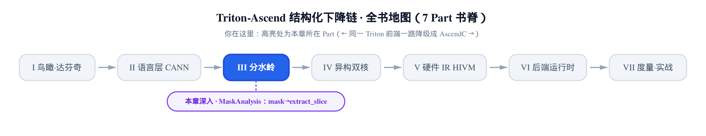
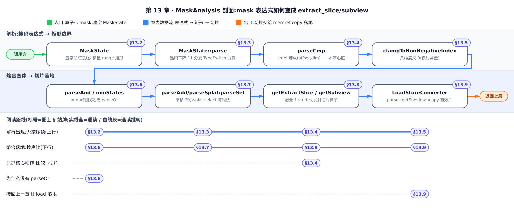
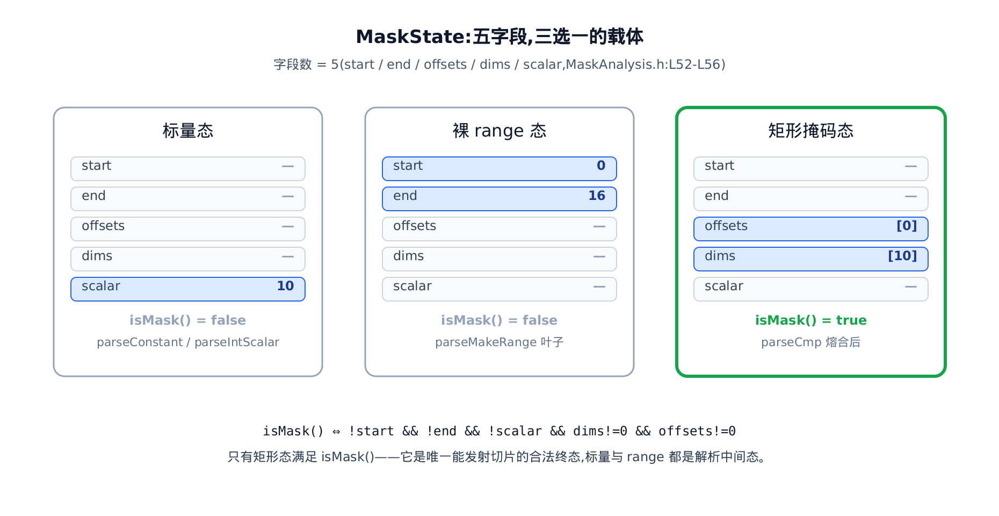
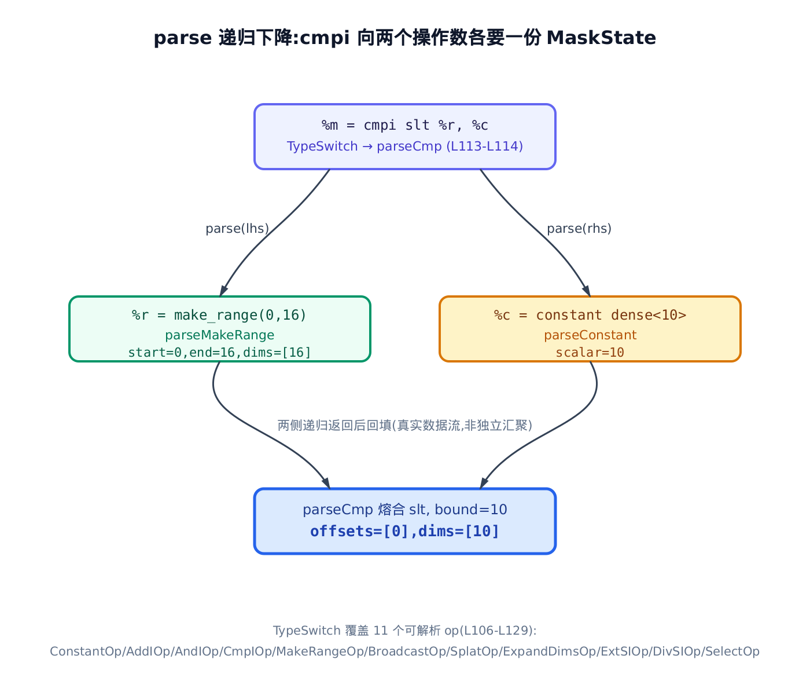
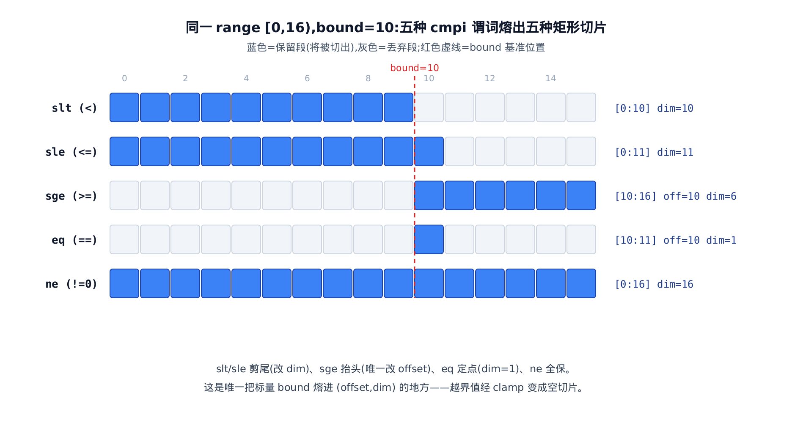
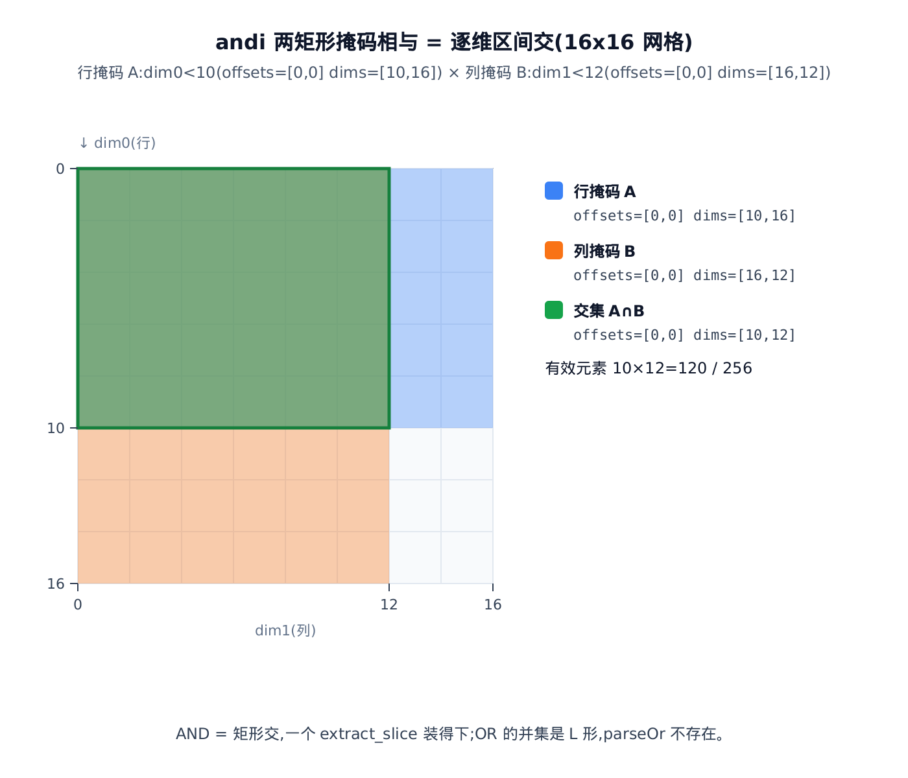
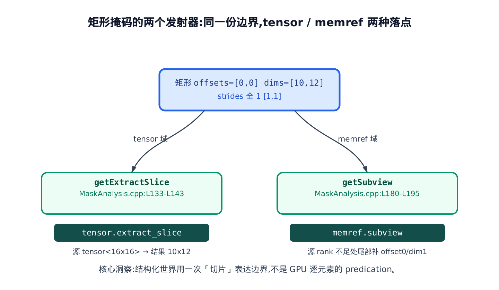

# 边界的语义：MaskAnalysis 把 mask 还原成 extract_slice

> **你在这里**：分水岭里最后一块拼图。
> 上一章把地址算术铸成了 `memref.reinterpret_cast`，让 `tt.load`/`tt.store` 落地。
> 本章讲那条落地路上一直没展开的岔口——带 mask 的访存，怎么变成一次切片。



上一章《落到 memref》在 [§12.7 `tt.load` 落地](../../ch12-blockptranalysis-memref/narrative/chapter.md#127-ttload-落地memrefcopy--to_tensor)里留了一个口子：`tt.load` 搬运时，如果算子带着一个 `mask`，就走「有 mask 分支」——当时只说了一句「据它只 copy 有效的一片」，没展开。这一章就是把那条岔口彻底讲清。

先把问题摆正。Triton 核里的 mask 你早在向量加法里见过（[第 3 章的块掩码算术](../../ch03-first-kernel-vector-add/narrative/chapter.md)立过：`mask = offsets < n_elements`，尾块靠它拦掉越界的 lane）。在 GPU 上，这个 mask 是一张**逐元素的通行证**：每个 lane 各拿一位布尔，True 的读、False 的跳过。这套「逐元素 predication（谓词化，即每个元素带一个开关决定它参不参与）」在 SIMT 架构上天经地义——反正每个线程本来就各算各的。

可达芬奇 NPU 不是 SIMT（[第 11 章](../../ch11-ptranalysis/narrative/chapter.md)、[第 12 章](../../ch12-blockptranalysis-memref/narrative/chapter.md)反复强调过这条最根本的分道）。它早早换轨到了结构化 `memref`——一整块规规整整的货架，靠 tiling、bufferization、循环变换来优化。在这套世界里，「逐元素的开关」是个麻烦：它是运行期的位图，编译器的张量层变换根本看不透一张随机的布尔图案该怎么切分、怎么搬。

`MaskAnalysis` 的核心主张只有一句：**在结构化世界里，边界不该用逐元素谓词表达，而该用「切片」表达**。如果一个 mask 的作用只是「前 10 个元素能访问、后 6 个越界」，那它本质上就是把访存范围**收缩成一个连续的矩形子区间**——从第 0 个起、切 10 个长。这样的收缩，正好是 `tensor.extract_slice` / `memref.subview` 能表达的东西，而这些切片算子是后续 tiling 与 bufferization 认得、能继续优化的一等公民。整章都在回答一个问题：**怎么从一个 mask 张量的 SSA 表达式，反解出这个矩形？**

> **选读指引**：只想抓住「一次比较怎么变成一次切片」这一个核心动作，直接跳 §13.4（本章心脏）；想知道「为什么只支持 AND 不支持 OR」，看 §13.6；只关心它怎么接回上一章的 `tt.load`，跳 §13.9。想跟全程，按序读。



只想抓「一次比较怎么变成一次切片」这个核心动作，盯紧图上 §13.2→§13.4 这条主链；想看变体怎么处理，图右下 §13.6~§13.8 三支各对应一节。跟全程就从 §13.1 顺着读到 §13.9，图上每一站都会在对应小节里逐一兑现。

## 13.1 入口：runMaskAnalysisImpl

分析的入口是一个模板函数 `runMaskAnalysisImpl`。它守在每个访存算子（load / store / atomic）前面，先看有没有 mask，没有就直接放行，有才启动解析：

> 本章内嵌的 C++ 片段逐字取自 pin 源码（`MaskAnalysis.cpp` / `MaskAnalysis.h`）。为讲解，无关分支会删去并用 `// … 省略：… ` 标出、个别加一行中文旁注；控制流、花括号与原文一致，完整原文见所标行号。

```cpp
// third_party/ascend/lib/TritonToLinalg/MaskAnalysis.cpp:L48-L64
template <typename MemAccOpTy>
std::optional<MaskState> runMaskAnalysisImpl(MemAccOpTy op, OpBuilder &builder)
{
  auto mask = op.getMask();
  if (!mask) {
    return std::nullopt;              // 没 mask，与本章无关，交回主路径
  }

  PatternRewriter::InsertionGuard insertGuard(builder);
  builder.setInsertionPoint(op);      // 把插入点钉在访存算子前

  MaskState mstate;                   // 一个空白的「许可证」
  if (mstate.parse(mask, op.getLoc(), builder).failed()) {
    return std::nullopt;              // 解析不出矩形 → 放弃，交给别的路径
  }
  return mstate;
}
```

两个细节值得记住。其一，`setInsertionPoint(op)` 把 builder（MLIR 里「往哪儿写新算子」的游标）钉在被分析的 load/store 之前——因为解析边界时要即时建一些 `min`/`max`/`sub` 的整型算子，它们必须插在访存之前才语义正确。其二，`parse` 一旦失败，整个分析返回 `nullopt`（空），意味着「这个 mask 我这条路铸不出矩形」——它不是错误，是**主动认输**，把活让给别的路径（后面 §13.9 会看到认输后发生什么）。

这里的 `runMaskAnalysisImpl` 是个模板，只管「有 mask 就解析」；至于对外按算子类型（load / store / atomic）真正分派的自由函数 `runMaskAnalysis`，是同一机制面向消费端的另一半，留到 §13.9 与它的调用点一起看。

一切的核心，是那个被反复填写的 `mstate`——`MaskState`。先看它是什么。

## 13.2 MaskState：掩码的三种表格

### 直觉

把 `MaskState` 想成一张**访存许可证**。它不逐个盖章说「第 3 个元素能读、第 4 个不能」，而是只填三种表格之一：

- 要么写一个**标量数字**（`scalar`）——比如一个 bound 值 10；
- 要么写一段**闭开区间** `[start, end)`（range）——比如下标 0 到 16；
- 要么写一个**矩形**（矩形掩码）：从 `offsets` 起、切 `dims` 长。

一张许可证同一时刻只可能是其中一种形态，五个字段（`start`/`end`/`dims`/`offsets`/`scalar`）按当前是哪种表格各有取值，其余留空。只有**矩形**这一种，是最终能拿去发切片的合法终态；标量和 range 都是解析途中的中间态，最后要么被熔进矩形，要么被丢弃。



### 机制

五个字段各表达一种形态，靠两个判定谓词区分：`isEmpty()`（刚 new 出来、什么都没填）和 `isMask()`（纯矩形）。下表把三种形态摊开——同一个 `MaskState` 对象在不同解析阶段的字段取值：

<!-- trace: m1 -->

| 形态 | start | end | offsets | dims | scalar | `isMask()` | 谁产出 |
|---|---|---|---|---|---|---|---|
| 标量 scalar | — | — | — | — | 10 | false | `parseIntScalar`/`parseConstant`（L339/L309） |
| 裸 range | 0 | 16 | — | — | — | false | `parseMakeRange` 叶子（L560-L582） |
| 矩形掩码 | — | — | [0] | [10] | — | true | `parseCmp` 熔合后（L498-L500） |

读这张表的关键：`isMask()` 只对最后一行为真。它的定义就写在头文件里——「start、end、scalar 三者皆空，且 dims、offsets 都非空」。换句话说，**矩形态是唯一「干净」的形态**：没有半个标量或裸 range 的残留。

一个**不变量**贯穿全章：三种形态互斥，同一个 `MaskState` 不会既是标量又是矩形。为什么成立？基例是空 `MaskState` 满足 `isEmpty()`（rank 为 0、无 scalar/start/end）。归纳步是每个 `parseXxx` 都以 `assert(isEmpty())` 开头——它们只往一张白纸上写，且只写一种形态：`parseMakeRange` 写 range 的四个字段，`parseCmp` 结束时只留 offsets/dims（把 range 的 start/end 丢弃），`parseConstant` 的标量分支只写 scalar。所以 `isMask()` 的那个合取式对矩形唯一为真。

量化一下这套表示的省：结构上只需 5 个字段就能表达任意 N 维轴对齐矩形掩码——offsets/dims 各 N 项，start/end/scalar 各 1（只在一维 range 或标量时用）。对一张 16×16=256 元素的掩码，逐元素位图要存 256 位，矩形表示只存 2 组 `(offset, dim)`＝4 个整数。这就是「切片胜过 predication」在存储上的第一层体现。

### 源码

```cpp
// third_party/ascend/include/TritonToLinalg/MaskAnalysis.h:L50-L104
class MaskState {
public:
  OpFoldResult start;
  OpFoldResult end;
  SmallVector<OpFoldResult> dims;
  SmallVector<OpFoldResult> offsets;
  OpFoldResult scalar;

  int64_t getRank() const {
    assert(dims.size() == offsets.size() && "dims and offsets rank mismatch!");
    return dims.size();
  }

  // … 省略：getMaskPosition(L63-L98) —— 把已解析的矩形按 offset 是否全 0
  //    归类成 Head/Middle/Unknown（枚举里还有 Tail 但从不返回）；仅 select
  //    下沉时用到，本章点名不展开 …

  bool isEmpty() const { return getRank() == 0 && !scalar && !start && !end; }

  bool isMask() const {
    return !start && !end && !scalar && dims.size() != 0 && offsets.size() != 0;
  }
```

上面省略的 `getMaskPosition` 只有 **select 下沉**这条支路才用得到——所谓 select 下沉，指一个值同时挂着 true / false 两个候选切片、要在结构化世界里兑现 `arith.select`（按条件二选一）语义时，把两分支各自切出的区间再合并；那是另一条独立机制，本书不展开，此处只需知道它是 `getMaskPosition` 唯一的客户。

字段的类型是 `OpFoldResult`——MLIR 里一个「二选一」的句柄：要么是编译期就定死的常量属性（`Attribute`），要么是运行期才知道的 SSA 值（`Value`）。掩码边界大多是编译期常量（形状是静态的），偶尔（动态 bound）才落成运行期值，`OpFoldResult` 让同一份代码两种都能装。这个「常量 or 运行期值」的分叉，在 §13.5 讲负索引夹 0 时会变成一处关键的正确性权衡。

## 13.3 parse：顺着配方图倒着做菜

### 直觉

`parse` 像顺着一张**配方图倒着做菜**。你手里是最终这盘 mask，要搞清它怎么来的，就看它的「上一道工序」——在 MLIR 里叫 defining op（定义这个 SSA 值的算子）。按工序类型（`cmpi`/`andi`/`make_range`/`splat`…）分头去问它的原料，一路递归到叶子（`make_range` 或常量），再把答案往回拼。

这套「沿着 use-def 链（值—定义链，即每个值追溯到产它的算子）递归下降」你在 [第 11 章的 `visitOperand`](../../ch11-ptranalysis/narrative/chapter.md#112-递归分派器visitoperand-怎么顺着定义链问上去) 已经见过一模一样的骨架——那边解析的是指针算术，这边解析的是掩码表达式，但都是「顺着定义链问上去、在叶子返回、往回归并」。

### 机制

分派靠一张 `TypeSwitch`——「看到这道工序就翻到这一页」的索引表。用最典型的一维掩码 `arith.cmpi slt, tt.make_range(0,16), 10` 走一遍递归，看每一层做了什么：

<!-- trace: m2 -->

| 递归深度 | 当前 operand | operand 类型 | 分派到（TypeSwitch） | 返回后 MaskState |
|---|---|---|---|---|
| 0 | `%m = cmpi slt %r, %c` | `tensor<16xi1>`（有 defining op） | `parseCmp`（L440） | 待子结果 |
| 1a | `%r = make_range(0,16)` | `tensor<16xi32>` | `parseMakeRange`（L560） | start=0,end=16,dims=[16],offsets=[0] |
| 1b | `%c = constant dense<10>` | `tensor<16xi32>`（splat 整数） | `parseConstant`（L309） | scalar=10 |
| 0（回填） | 熔合 slt，bound=10 | — | `parseCmp` switch slt（L501） | offsets=[0],dims=[10] |

根节点 `cmpi` 向左要一份 range、向右要一个标量 bound，两个叶子返回后在 `parseCmp` 内熔合成矩形——这是一次「表达式 DAG（有向无环图）→ 矩形」的**线性遍历**，没有不动点迭代。



**为什么一定会停？** 单调量是「从当前 operand 到 `make_range`/常量叶子的最长定义链长度」。每进一层 `parseXxx`（`parseCmp` 去 parse 左右操作数、`parseAnd` 去 parse 两侧），这个长度严格减 1；叶子 `parseMakeRange`/`parseConstant` 内部不再递归；整数标量与循环 iter_arg（循环体入口那个随迭代更新的块参数）在 `parse` 开头就短路返回。use-def 图无环由 SSA 支配关系保证，所以有限步必停。本例的 DAG 只有 3 个节点，`parse` 递归 3 次。

### 源码

```cpp
// third_party/ascend/lib/TritonToLinalg/MaskAnalysis.cpp:L81-L130
LogicalResult MaskState::parse(Value operand, const Location &loc,
                               OpBuilder &builder) {
  if (isa<IntegerType>(operand.getType())) {
    return parseIntScalar(operand, loc, builder);   // 光秃秃的整数 → 标量态
  }

  if (auto blockArgument = dyn_cast<BlockArgument>(operand)) {
    auto parentOp = blockArgument.getOwner()->getParentOp();
    if (auto loopOp = dyn_cast<LoopLikeOpInterface>(parentOp)) {
      OpOperand *initArgOperand = loopOp.getTiedLoopInit(blockArgument);
      if (initArgOperand) {
        Value initArg = initArgOperand->get();
        return parse(initArg, loc, builder);          // 循环块参数 → 回溯到初值
      }
    }
  }

  auto definingOp = operand.getDefiningOp();
  if (!definingOp)
    return failure();

  // … 省略：LLVM_DEBUG 调试打印（L102-L105）…
  return TypeSwitch<Operation *, LogicalResult>(definingOp)
      .Case<arith::ConstantOp>(
          [&](auto op) { return this->parseConstant(op, loc, builder); })
      .Case<arith::AddIOp>(
          [&](auto op) { return this->parseAdd(op, loc, builder); })
      .Case<arith::AndIOp>(
          [&](auto op) { return this->parseAnd(op, loc, builder); })
      .Case<arith::CmpIOp>(
          [&](auto op) { return this->parseCmp(op, loc, builder); })
      .Case<triton::MakeRangeOp>(
          [&](auto op) { return this->parseMakeRange(op, loc, builder); })
      .Case<triton::BroadcastOp>(
          [&](auto op) { return this->parseBroadcast(op, loc, builder); })
      .Case<triton::SplatOp>(
          [&](auto op) { return this->parseSplat(op, loc, builder); })
      .Case<triton::ExpandDimsOp>(
          [&](auto op) { return this->parseExpandDims(op, loc, builder); })
      .Case<arith::ExtSIOp>(
          [&](auto op) { return this->parse(op.getIn(), loc, builder); })
      .Case<arith::DivSIOp>(
          [&](auto op) { return this->parseDiv(op, loc, builder); })
      .Case<arith::SelectOp>(
          [&](auto op) { return this->parseSel(op, loc, builder); })
      .Default([&](Operation *op) { return failure(); });
}
```

这张分派表有 **11 个 Case 分支**，它就是「哪些 mask 表达式被支持」的完整清单。两个例外要点破：`arith.extsi`（有符号扩位）只是**透传**——它不改边界，直接 parse 它的输入；`arith.divsi`（有符号整除）虽然挂了 `parseDiv`，但那个函数体第一句就是 `return failure()`（源码注释 `temporarily disable`），也就是说**整除目前不被当作合法掩码构造**，其后的 `divStates` 是死代码。表里没有的算子，一律走 `Default → failure`。

**叶子：parseMakeRange。** `make_range` 是掩码分析的原料。它一出场就带着 `[start, end)` 这段连续下标，`parseMakeRange` 把它抄进 `start`/`end`，记下这一维长 `shape[0]`、从 0 起。它坚持一个隐含约定：下标必须**步长为 1**（连续），否则不认。

<!-- trace: m5 -->

| make_range(start,end) | shape[0] | stride=(end−start+shape−1)/shape | 判定 | start/end/dims/offsets |
|---|---|---|---|---|
| (0,16) | 16 | (16+15)/16=1 | 通过 | 0/16/[16]/[0] |
| (0,128) | 128 | (128+127)/128=1 | 通过 | 0/128/[128]/[0] |
| (0,32) 反例 | 16 | (32+15)/16=2 | warning+failure | —（拒绝） |

那个 stride 公式是整数向上取整式：

```math
\mathrm{stride} = \frac{\mathrm{end} - \mathrm{start} + \mathrm{shape} - 1}{\mathrm{shape}}
```

当 `end−start == shape` 时它恒等于 1（因为 `2·shape−1 < 2·shape`，整除得 1）。而 Triton 的 `make_range` 验证器本就强制 `end−start == 张量长度`，所以合法 IR 里这道守卫恒通过——那个 `(0,32)/shape16` 的反例现实中不会出现，这条 `stride != 1` 分支是纯防御性拦截：

```cpp
// third_party/ascend/lib/TritonToLinalg/MaskAnalysis.cpp:L560-L582
LogicalResult MaskState::parseMakeRange(triton::MakeRangeOp rangeOp,
                                        const Location &loc,
                                        OpBuilder &builder) {
  assert(this->isEmpty());
  auto shape = cast<ShapedType>(rangeOp.getType()).getShape();
  auto start = rangeOp.getStart();
  auto end = rangeOp.getEnd();
  auto stride = (end - start + shape[0] - 1) / shape[0];

  if (stride != 1) {
    InFlightDiagnostic diag =
        emitWarning(loc)
        << "stride must be 1 for make_range whose result is used "
           "as load or store masks";
    return failure();               // 步长非 1 → 认输
  }

  this->start = builder.getIndexAttr(start);
  this->end = builder.getIndexAttr(end);
  this->dims.push_back(builder.getIndexAttr(shape[0]));   // dims[0] = 长度
  this->offsets.push_back(builder.getIndexAttr(0));       // offsets[0] = 0
  return success();
}
```

**形状传播：splat / broadcast / expand_dims。** 真实的二维掩码，`make_range` 之后还要经 `tt.expand_dims`（插一维长度 1 的轴）、`tt.broadcast`（把长度 1 的轴铺成目标长度）才够形状。这三个 `parseXxx` 都不改边界语义，只沿张量形状把每维的 dims/offsets 补齐或改写——`parseExpandDims` 在指定 axis 插一维长 1，`parseBroadcast` 把被展的那维 dims 改成目标长度，`parseSplat` 一般情况把标量铺成满维。它们是纯形状记账，其中 `parseSplat` 有一个特别的「布尔当掩码」特判，留到 §13.7 单讲。举个最小例：`(16,)` 的一维 range 先经 `tt.expand_dims`（axis=1）变成 `dims=[16,1]`，再经 `tt.broadcast` 铺到 `(16,12)`，把第二维的 dim 从 1 改成 12（`dims=[16,12]`）——边界一步没动，只是把形状撑开。

## 13.4 parseCmp：把「和谁比」熔进「从哪切」

### 直觉

`make_range` 只知道自己是 `[0,16)` 这 16 个下标，但「能不能访问」要等它和一个 bound 比一比才定。`parseCmp` 就是那一次比较，它把「和谁比」这个信息**熔进**「从哪切、切多长」：

- `< 10` 把尾巴剪短，留前 10 个；
- `>= 10` 把头抬高，留后 6 个；
- `== 10` 只留 1 个点；
- `!= 0` 全留。

这是全章唯一一处把标量 bound 真正熔进 `(offset, dim)` 的地方——头文件把它直言为「fuse scalar, start and end into dims and offset」。range 是「我是谁」，cmpi 是「我和谁比」，比完才知道「切哪一片」。

### 机制

对同一个 range `[0,16)`、同一个 bound=10，五种谓词各熔出一个不同的矩形（`ne` 是唯一的例外——它比的不是 bound=10，而是 `arith.select` 物化出的值是否 `!= 0`，所以下表 `ne` 行的输出与 bound 无关，机制见 [§13.7](#137-三种不直白的掩码平移布尔-splatselect-障眼法)）。这张表是本章最该盯住的：

<!-- trace: m3 -->

| 谓词 | 语义 | 关键运算（start=0,end=16,b=10） | offset | dim | → 切片 [off:off+dim) |
|---|---|---|---|---|---|
| slt (<) | range<10 | newEnd=min(16,max(0,10))=10；dim=10−0 | 0 | 10 | [0:10] |
| sle (<=) | range<=10 即 <11 | newEnd=min(16,max(0,11))=11；dim=11−0 | 0 | 11 | [0:11] |
| sge (>=) | range>=10 | newStart=min(16,max(0,10))=10；off=10−0；dim=16−10 | 10 | 6 | [10:16] |
| eq (==) | range==10 | off=10−0；dim=1 | 10 | 1 | [10:11] |
| ne (!=0) | range!=0（仅支持 !=0） | 保持 start/end 不变 | 0 | 16 | [0:16] |



看出规律没有：`slt`/`sle` **剪尾**（改 dim）、`sge` **抬头**（是唯一改 offset 的比较）、`eq` **定点**（dim=1）、`ne` **全保**。以 `slt` 为例，边界推导就一行：

```math
\mathrm{newEnd} = \min(\mathrm{end},\ \max(\mathrm{start},\ b)),\qquad \mathrm{dim} = \mathrm{clamp}(\mathrm{newEnd} - \mathrm{start})
```

`max(start, b)` 保证新终点不会小于起点（bound 比 range 起点还小时不至于算出负的），`min(end, ·)` 保证不会超出原区间，二者夹出真实的新终点，减去起点就是新长度。`sle` 只是把 bound 换成 `b+1`（因为 `≤b` 等价 `<b+1`）。`sge` 对称地算新起点、抬 offset。

一个**不变量**：`parseCmp` 只在「恰有一维长度 >1」的那一维（源码叫 `cmpDim`）上改边界，其余维原样；且所有算出的 dim 都过一道 clamp，保证非负。为什么 `cmpDim` 唯一？源码遍历各维找长度非 1 的维，一旦发现**第二个**就直接 failure（报 `more than one dimension with size larger than 1`）——多维同时比较它不支持。

量化：受支持的谓词恰 **5 种**（slt/sle/sge/eq/ne），源码开头显式列举；其余如 `sgt`/`ult` 一律 failure。本例 bound=10 落在 `[0,16)` 内部，五种谓词切出的矩形互不相同、无退化重合，正好把五条推导路径全照亮。

### 源码

先看开头的守门与 `cmpDim` 定位，再看熔合的 switch。这里把 `ne` 的特判一并展示——下面那两行 `selOp` 检查，是在识别「先用 `arith.select` 把布尔条件物化成一个张量、再拿它去比较」这一模式（`ne` 分支要求左操作数必须来自 `arith.select`，否则直接 failure），它的来龙去脉见 [§13.7](#137-三种不直白的掩码平移布尔-splatselect-障眼法)：

```cpp
// third_party/ascend/lib/TritonToLinalg/MaskAnalysis.cpp:L440-L558
LogicalResult MaskState::parseCmp(arith::CmpIOp cmpOp, const Location &loc,
                                  OpBuilder &builder) {
  assert(this->isEmpty());
  auto predicate = cmpOp.getPredicate();
  // Only support <, <=, >=, =, !=
  if (predicate != arith::CmpIPredicate::slt &&
      predicate != arith::CmpIPredicate::sle &&
      predicate != arith::CmpIPredicate::sge &&
      predicate != arith::CmpIPredicate::eq &&
      predicate != arith::CmpIPredicate::ne) {
    LLVM_DEBUG({ llvm::dbgs() << "Unsupported cmpi predicate\n"; });
    return failure();
  }

  MaskState lhsState;
  MaskState rhsState;
  auto lhs = cmpOp.getLhs();
  auto rhs = cmpOp.getRhs();

  if (predicate == arith::CmpIPredicate::ne) {
    auto selOp = lhs.getDefiningOp<arith::SelectOp>();     // != 只认「select 出来的」
    auto constantOp = rhs.getDefiningOp<arith::ConstantOp>();
    if (!selOp || !constantOp) {
      return failure();
    }
  }

  if (failed(lhsState.parse(lhs, loc, builder))) { return failure(); }
  if (failed(rhsState.parse(rhs, loc, builder))) { return failure(); }

  // 必须是「左边是区间、右边是标量」，反了就不认
  if (!(!lhsState.scalar && rhsState.scalar)) {
    InFlightDiagnostic diag = emitWarning(loc)
                                << "[MaskState] Unsupported cmpi scenario";
    return failure();
  }

  int32_t cmpDim = -1;                                     // 找出唯一那维长度 >1
  for (int32_t i = 0; i < lhsState.getRank(); i++) {
    auto constDimLength = getConstantIntValue(lhsState.dims[i]);
    if (!constDimLength || constDimLength.value() != 1) {
      if (cmpDim != -1) {
        InFlightDiagnostic diag = emitWarning(loc)
                                  << "Unsupported cmpi with more than one  "
                                     "dimension with size larger than 1";
        return failure();
      }
      cmpDim = i;
    }
  }
  assert(cmpDim != -1 && "...");

  this->offsets = lhsState.offsets;
  this->dims = lhsState.dims;
  switch (predicate) {
  case arith::CmpIPredicate::slt: {
    auto realBound = maxOpFoldResult(lhsState.start, rhsState.scalar, loc, builder);
    auto newEnd = minOpFoldResult(lhsState.end, realBound, loc, builder);
    auto newDim = subOpFoldResult(newEnd, lhsState.start, loc, builder);
    this->dims[cmpDim] = clampToNonNegativeIndex(newDim, loc, builder);
    break;
  }
  case arith::CmpIPredicate::sle: {
    // lhs <= rhs  <=>  lhs < rhs + 1
    auto rhsPlusOne = addOpFoldResult(rhsState.scalar, builder.getIndexAttr(1), loc, builder);
    auto realBound = maxOpFoldResult(lhsState.start, rhsPlusOne, loc, builder);
    auto newEnd = minOpFoldResult(lhsState.end, realBound, loc, builder);
    auto newDim = subOpFoldResult(newEnd, lhsState.start, loc, builder);
    this->dims[cmpDim] = clampToNonNegativeIndex(newDim, loc, builder);
    break;
  }
  case arith::CmpIPredicate::sge: {
    auto realBound = maxOpFoldResult(lhsState.start, rhsState.scalar, loc, builder);
    auto newStart = minOpFoldResult(lhsState.end, realBound, loc, builder);
    auto newOffset = subOpFoldResult(newStart, lhsState.start, loc, builder);
    auto newDim = subOpFoldResult(lhsState.end, newStart, loc, builder);
    this->offsets[cmpDim] = newOffset;                    // 唯一抬 offset 的分支
    this->dims[cmpDim] = clampToNonNegativeIndex(newDim, loc, builder);
    break;
  }
  case arith::CmpIPredicate::eq: {
    this->offsets[cmpDim] = subOpFoldResult(rhsState.scalar, lhsState.start, loc, builder);
    this->dims[cmpDim] = builder.getIndexAttr(1);         // 单点，长度 1
    break;
  }
  case arith::CmpIPredicate::ne: {
    // only support lhs != 0
    auto rhsScalar = dyn_cast<IntegerAttr>(rhsState.scalar.get<Attribute>());
    if (!rhsScalar || rhsScalar.getInt() != 0) { return failure(); }
    start = lhsState.start;                               // 全保，只透传 start/end
    end = lhsState.end;
    break;
  }
  default:
    return failure();
  }
  return success();
}
```

注意 switch 之前那两行 `this->offsets = lhsState.offsets; this->dims = lhsState.dims;`——先把左侧 range 的形状原样搬过来，再让每个 case 只动 `cmpDim` 那一维。这就是「其余维原样」不变量在代码里的落点。还有 `slt`/`sle`/`sge` 的 newDim 末尾都套了 `clampToNonNegativeIndex`——下一节专讲这道夹子。

## 13.5 clampToNonNegativeIndex：负长度夹成空切片

### 直觉

算出来的「切多长」可能是负数。比如 bound 比区间起点还小（`range < -5`），或者两个矩形根本不重叠（下一节的 AND）。负长度没意义，`clampToNonNegativeIndex` 把它夹到 0——**0 长度就是「空切片，一个都不读」**，语义正好对：越界比较本就该什么都访问不到。

但它有个脾气：只对**能当场算出常量**的值这么夹；算不出常量的动态值，它选择**原样放行**，不生成 `max`。原因很实在——给动态值套 `max(value, 0)` 会让 atomic max/min 的单元测试挂掉，作者留了个 TODO，暂时妥协。

### 机制

三种输入走三条路：

<!-- trace: m7 -->

| 输入 value | 来源 | getConstantIntValue | clamp 后 | 含义 |
|---|---|---|---|---|
| -6 | 不相交 AND：[0,4)∩[10,16)，newDim=4-10 | 成功（常量） | max(0,-6)=0 | 空切片（dim=0） |
| 10 | 正常 slt 后 newDim | 成功（常量） | max(0,10)=10 | 10 长切片 |
| %dyn（非常量） | 动态 bound 参与的 newDim | 失败（非常量） | 原样返回 %dyn | 不夹（TODO：atomic UT 回归） |

这是一处**有意识的正确性妥协**，值得点破：对动态越界的 size，这道夹子放行了负值，把问题留给更下游处理，换取 atomic UT 通过。凡编译期能定形状的掩码——本章所有例子——都走常量分支，负值必被夹 0，稳。

### 源码

```cpp
// third_party/ascend/lib/TritonToLinalg/MaskAnalysis.cpp:L68-L79
OpFoldResult MaskState::clampToNonNegativeIndex(const OpFoldResult value,
                                                const Location &loc,
                                                OpBuilder &builder) const
{
  if (auto cst = getConstantIntValue(value)) {
    return builder.getIndexAttr(std::max<int64_t>(0, *cst));   // 常量：夹到 max(0,·)
  }

  // For non-constant value, we could generate max(value, 0) to ensure the value is non-negative.
  // But this caused error in atomic max/min ut test. We need to investigate more on this.
  return value;                                                // 非常量：原样放行
}
```

代码只有两条分支，但那段英文注释把权衡讲得明明白白：本可以对非常量也发 `max(value, 0)`，但它会让 atomic max/min 的 UT 报错，所以暂缓。这不是 bug，是标注在案的已知局限——初学者读到这里最容易误以为「clamp 覆盖了一切」，其实动态维会漏过负值。

## 13.6 parseAnd = 矩形交，以及为什么没有 parseOr

### 直觉

两个矩形掩码用 `andi`（按位与）相与，几何上就是求这两个矩形的**重叠区域**。重叠矩形的每一维：起点取两者靠右的那个（`max`），终点取两者靠左的那个（`min`）。这正是源码里 `minStates` 干的事——逐维取区间交。

这也顺带回答了一个自然的疑问：**为什么只有 parseAnd，没有 parseOr？** 因为两矩形的**并集**一般不是矩形（是个 L 形），一个 `extract_slice` 装不下。交集永远是矩形，并集不是——这条几何事实直接决定了哪种掩码能走结构化路、哪种得认输。

### 机制

拿一个 16×16 掩码：行方向 `dim0 < 10`、列方向 `dim1 < 12`，两个约束 `andi` 到一起。逐维求交：

<!-- trace: m4 -->

| 维 | 左矩形 [off,off+dim) | 右矩形 [off,off+dim) | newOff=max | newEnd=min | newDim=clamp(end−off) |
|---|---|---|---|---|---|
| dim0（行） | [0,10) | [0,16) | 0 | min(10,16)=10 | 10 |
| dim1（列） | [0,16) | [0,12) | 0 | min(16,12)=12 | 12 |

交完得 offsets=[0,0]、dims=[10,12]，即左上角一个 10×12 的子矩形——120 个有效元素（256 里的 46.9%），用一个 `tensor.extract_slice offset=[0,0] size=[10,12] stride=[1,1]` 就表达完了。



每维的交，一行代数：

```math
\mathrm{newOff} = \max(o_1, o_2),\quad \mathrm{newEnd} = \min(o_1{+}d_1,\ o_2{+}d_2),\quad \mathrm{newDim} = \mathrm{clamp}(\mathrm{newEnd} - \mathrm{newOff})
```

**不变量**：`minStates` 要求两侧 rank 相等，逐维输出的 dim 恒非负。若两区间相交，`newEnd ≥ newOff`，dim 非负；若不相交，`newEnd < newOff`，dim 变负——正好被 §13.5 的 clamp 夹成 0，得整块空切片。所以无论怎么交，结果都是合法矩形。而 `parseAnd` 有一道前置门槛：两侧 parse 完都必须 `isMask()`（纯矩形、无标量残留），`minStates` 才有 offsets/dims 可取。

### 源码

先看 `parseAnd` 的两道门槛，再看 `minStates` 的逐维交：

```cpp
// third_party/ascend/lib/TritonToLinalg/MaskAnalysis.cpp:L378-L399
LogicalResult MaskState::parseAnd(arith::AndIOp andOp, const Location &loc,
                                  OpBuilder &builder) {
  assert(this->isEmpty());
  MaskState lhsState;
  if (failed(lhsState.parse(andOp.getLhs(), loc, builder)) ||
      !lhsState.isMask()) {                     // 左侧必须是纯矩形
    return failure();
  }

  MaskState rhsState;
  if (failed(rhsState.parse(andOp.getRhs(), loc, builder)) ||
      !rhsState.isMask()) {                     // 右侧必须是纯矩形
    return failure();
  }

  if (!lhsState.isMask() && !rhsState.isMask()) {
    return failure();
  }

  // Only support both lhs and rhs satisfy `isMask` condition
  return this->minStates(lhsState, rhsState, loc, builder);
}
```

```cpp
// third_party/ascend/lib/TritonToLinalg/MaskAnalysis.cpp:L280-L306
LogicalResult MaskState::minStates(const MaskState &lhsState,
                                   const MaskState &rhsState,
                                   const Location &loc, OpBuilder &builder) {
  if (lhsState.getRank() != rhsState.getRank()) {
    InFlightDiagnostic diag =
        emitError(loc)
        << "Unexpected case where lhs and rhs have different ranks";
    return failure();
  }

  for (uint32_t i = 0; i < lhsState.getRank(); i++) {
    auto lhsOffset = lhsState.offsets[i];
    auto rhsOffset = rhsState.offsets[i];
    auto newOffset = maxOpFoldResult(lhsOffset, rhsOffset, loc, builder);   // 起点取靠右
    auto lhsDim = lhsState.dims[i];
    auto rhsDim = rhsState.dims[i];
    auto lhsEnd = addOpFoldResult(lhsOffset, lhsDim, loc, builder);
    auto rhsEnd = addOpFoldResult(rhsOffset, rhsDim, loc, builder);
    auto newEnd = minOpFoldResult(lhsEnd, rhsEnd, loc, builder);            // 终点取靠左
    auto newDim = subOpFoldResult(newEnd, newOffset, loc, builder);
    auto clampedNewDim = clampToNonNegativeIndex(newDim, loc, builder);     // 不相交 → 0

    offsets.push_back(newOffset);
    dims.push_back(clampedNewDim);
  }
  return success();
}
```

`parseAnd` 里没有对应的 `parseOr`，这不是遗漏，是设计——`ori` 不在 §13.3 那张 11 分支表里，两段 `cmpi` 用 `ori` 拼出的掩码，`parse` 会直接 `Default → failure`，然后认输。认输之后去哪，是 §13.9 与下一章的事。

## 13.7 三种「不直白」的掩码：平移、布尔 splat、select 障眼法

前面几节的掩码都很「直白」：range 直接和 bound 比。但真实 IR 里掩码常绕着来。这一节收三种绕法，每种给一个直觉加一段轨迹——它们都是 supporting 情形，例子的数字按源码整型公式手推（宿主无 CANN，非真机 dump）。

**其一，平移：`(make_range(0,16) + 5)`。** 掩码的下标常不是光秃秃的 range，而是「range 加一个偏移」——比如从第 5 个元素起的一段。`parseAdd` 遇到「一段区间 + 一个标量」时不改形状，只把区间整体平移：start/end 各加 5，长度不变。

<!-- trace: m9 -->

| 步 | 当前 operand | 分派 | 结果 MaskState |
|---|---|---|---|
| 0 | `%a = addi %r, %c` | `parseAdd`（L347） | 递归两侧 |
| 1a | `%r = make_range(0,16)` | `parseMakeRange` | start=0,end=16,dims=[16],offsets=[0],scalar=∅ |
| 1b | `%c = constant dense<5>` | `parseConstant`（整数） | scalar=5 |
| 0（回填） | addStates：rhs 是标量 | `addStateScalar`（L209） | start=5,end=21,dims=[16],offsets=[0] |

背后的 `addStates` 要求**恰有一侧是标量**（异或）：两侧都标量 failure，两侧都非标量也 failure；只有「区间 + 标量」才把标量平移进区间的 start/end。本例 `[0,16)` 平移 +5 得 `[5,21)`，dims 仍 [16]。这段平移后的 range 通常再喂给一个 `cmpi`（如 `(range+5) < 21`），由 §13.4 的 `parseCmp` 熔成最终矩形。

**其二，布尔 splat 当整块掩码。** `tt.splat` 把一个 i1（1 位布尔）标量铺成整张张量，可能表示「全 True / 全 False」的整块掩码。但 `parseSplat` 不会见了 i1 就当掩码——它只在**所有用户都把这张量当掩码用**时才特判：把布尔值（0/1）乘进每维长度，True → 满维、False → 0 维（整块空切片），再清掉 scalar 让它成为纯矩形：

```cpp
// third_party/ascend/lib/TritonToLinalg/MaskAnalysis.cpp:L612-L661
LogicalResult MaskState::parseSplat(triton::SplatOp splatOp,
                                    const Location &loc, OpBuilder &builder) {
  assert(this->isEmpty());
  auto src = splatOp.getSrc();
  auto dst = splatOp.getResult();
  auto dstShape = cast<ShapedType>(dst.getType()).getShape();

  if (!isa<IntegerType>(src.getType())) {           // 掩码用的 splat 源必须是整数标量
    InFlightDiagnostic diag = emitWarning(loc)
        << "splat source must be an integer scalar for load/store masks";
    return failure();
  }
  if (failed(this->parse(src, loc, builder))) return failure();

  auto splatAsMask = [&](Operation *userOp) -> bool {     // 判定：这个 user 拿它当掩码吗
    return TypeSwitch<Operation *, bool>(userOp)
        .Case<arith::AndIOp>([&](arith::AndIOp andOp) { return true; })
        .Case<arith::SelectOp>([&](arith::SelectOp selectOp) {
          return selectOp.getCondition() == dst;
        })
        .Case<triton::LoadOp>(
            [&](triton::LoadOp loadOp) { return loadOp.getMask() == dst; })
        .Case<triton::StoreOp>(
            [&](triton::StoreOp storeOp) { return storeOp.getMask() == dst; })
        .Default([&](Operation *op) { return false; });
  };

  // 仅当：源是 i1、有用户、且「所有」用户都把它当掩码
  if (src.getType().isInteger(1) && !splatOp->use_empty() &&
      llvm::all_of(splatOp->getUsers(), splatAsMask)) {
    for (auto s : dstShape) {
      auto currentDim =
          mulOpFoldResult(builder.getIndexAttr(s), this->scalar, loc, builder);  // 长度 × 布尔
      this->dims.push_back(currentDim);
      this->offsets.push_back(builder.getIndexAttr(0));
    }
    this->scalar = nullptr;             // 清掉标量 → 成为纯矩形掩码
    return success();
  }

  for (auto s : dstShape) {             // 否则退化为普通 splat：满维
    this->dims.push_back(builder.getIndexAttr(s));
    this->offsets.push_back(builder.getIndexAttr(0));
  }
  return success();
}
```

那个 `all_of(getUsers(), splatAsMask)` 是关键护栏：只有当 splat 结果的**每一个** user 都是 `andi` / select 的 condition / load 或 store 的 mask 时，才认定它是掩码语义。否则它就是一个普通的值铺张量，按满维处理。

**其三，select 障眼法：`select(cond, 1, 0) != 0`。** 有时 mask 不是直接比出来的，而是先用 `arith.select` 把布尔条件**物化**成 0/1 张量（True→1、False→0），再拿 `!= 0` 变回布尔掩码。`parseSel` 加上 §13.4 见过的 `cmpi` 的 `ne` 特判，就是识破这套障眼法——`select(cond,1,0) != 0` 语义上等于 `cond` 本身，于是把 `cond` 那个矩形原封不动还原出来。

<!-- trace: m10 -->

| 步 | 当前算子 | 分派 / 判定 | 结果 MaskState |
|---|---|---|---|
| 0 | `%m = cmpi ne %s, %c0` | `parseCmp`：ne 特判 lhs 须 select、rhs 须 const（L459-L465）✓ | 待子结果 |
| 1 | `%s = select %cond,1,0` | `parseSel`（L401）：cond 须 cmpi、true/false 须标量 1/0 | 复制 cond 的 offsets/dims |
| 2 | `%cond = cmpi slt(range,10)` | `parseCmp` slt | offsets=[0],dims=[10] |
| 0（回填） | ne，rhs=0 | ne case：rhsScalar==0 ✓，保持不变（L544-L553） | offsets=[0],dims=[10]（还原 cond） |

两道窄门保证只有「物化后又比 0」的规范形能被还原：`parseSel` 要求 condition 由 `cmpi` 定义、true 值是标量 1、false 值是标量 0；`cmpi` 的 `ne` 要求 lhs 来自 `select`、rhs 是常量 0，且只支持 `!= 0`（比其他常量一律 failure）。本例 cond 掩码 offsets=[0]/dims=[10] 经 `select → ne!=0` 原样还原——一条无信息损失的恒等回路。这也是五谓词里唯一不改 offset/dim、只透传 start/end 的分支。

## 13.8 getExtractSlice / getSubview：同一份边界，两种落点

### 直觉

前面七节都在解析——把 mask 表达式反解成一个矩形 `(offsets, dims)`。这一节是**发射**：把这个矩形真正变成一条切片算子。同一份边界有两个落点，取决于当前在哪个方言域：

- 在 **tensor 域**（值语义），发 `tensor.extract_slice`；
- 在 **memref 域**（内存语义），发 `memref.subview`。

两者都给矩形配上**全 1 的 strides**（因为掩码切的是连续块，步长恒 1），推断出结果类型后建算子。这就是核心主张的落点：结构化世界用一次「切片」表达边界，而不是 GPU 那样逐元素 predication。



### 机制

接 §13.6 那个 10×12 的交集矩形，看它两种落法：

| 落点 | 发射器 | 源 | 结果 | strides |
|---|---|---|---|---|
| tensor 域 | `getExtractSlice`（L133-L158） | `tensor<16x16>` | `tensor.extract_slice` → 10×12 | 全 1 [1,1] |
| memref 域 | `getSubview`（L180-L195） | `memref<...>` | `memref.subview`（rank 不足补 offset0/dim1） | 全 1 [1,1] |

一个命名约定务必分清（[第 6 章](../../ch06-ascend-builtin-ops/narrative/chapter.md)在讲片上切片内建时也强调过同一件事）：**IR 文本名**用两段点分的方言名加助记符——`tensor.extract_slice`、`memref.subview`；**C++ 类名**才带双冒号——`tensor::ExtractSliceOp`、`memref::SubViewOp`。别把类名写进 IR 的点号后面。

`getSubview` 比 `getExtractSlice` 多一手：memref 的源 rank 可能比解析出的 offsets/dims 长（掩码只约束了前几维），它就在尾部补 `offset=0`/`dim=1`，把维数对齐。

### 源码

```cpp
// third_party/ascend/lib/TritonToLinalg/MaskAnalysis.cpp:L133-L158
tensor::ExtractSliceOp MaskState::getExtractSlice(Value source,
                                                  const Location &loc,
                                                  OpBuilder &builder) const {
  auto sourceRType = cast<RankedTensorType>(source.getType());
  SmallVector<OpFoldResult> strides(getRank(), builder.getIndexAttr(1));   // 全 1 strides

  auto dstRType = tensor::ExtractSliceOp::inferResultType(sourceRType, offsets,
                                                          dims, strides);
  return builder.create<tensor::ExtractSliceOp>(loc, dstRType, source, offsets,
                                                dims, strides);
}

// … 省略：第二个重载（L145-L158）—— offsets/dims 由调用方显式传入，
//    函数体逐字相同；TritonOpConverter 处理 select 下沉时，对 false 张量切另一块区间用 …
```

```cpp
// third_party/ascend/lib/TritonToLinalg/MaskAnalysis.cpp:L180-L195
memref::SubViewOp MaskState::getSubview(Value source, const Location &loc,
                                        OpBuilder &builder) const {
  auto sourceType = cast<MemRefType>(source.getType());
  int64_t rank = sourceType.getRank();
  SmallVector<OpFoldResult> strides(rank, builder.getIndexAttr(1));

  SmallVector<OpFoldResult> fixedOffsets(offsets.begin(), offsets.end());
  SmallVector<OpFoldResult> fixedDims(dims.begin(), dims.end());
  fixedOffsets.resize(rank, builder.getIndexAttr(0));     // 尾部补 offset=0
  fixedDims.resize(rank, builder.getIndexAttr(1));        // 尾部补 dim=1

  auto dstType =
      memref::SubViewOp::inferResultType(sourceType, fixedOffsets, fixedDims, strides);
  return builder.create<memref::SubViewOp>(loc, cast<MemRefType>(dstType),
                                           source, fixedOffsets, fixedDims, strides);
}
```

两个发射器一个吃 tensor、一个吃 memref，但骨架一样：配全 1 strides、`inferResultType` 推结果类型、`create` 建算子。到这一步，一个掩码就彻底脱掉了「逐元素布尔」的外衣，变成一句「从这儿切这么大一块」——张量层变换认得的语言。

## 13.9 消费端：LoadStoreConverter 的「有 mask 分支」

前面八节讲的是 `MaskAnalysis` 内部怎么把 mask 变成矩形。最后一节把它接回上一章——上一章 [§12.7](../../ch12-blockptranalysis-memref/narrative/chapter.md#127-ttload-落地memrefcopy--to_tensor) 指过来的那条「有 mask 分支」，就在 `LoadStoreConverter` 里：

```cpp
// third_party/ascend/lib/TritonToLinalg/LoadStoreConverter.cpp:L455-L498
  MaskState mstate;
  auto isContMask = mstate.parse(mask, loc, rewriter);
  if (isContMask.failed()) {
    return rewriter.notifyMatchFailure(
        op, "can not lower uncontinuout masked loads");   // 认输：不连续掩码这条路铸不出
  }

  // … 省略：other 缺省值填充分支（L462-L471）、deinterleave 去交织优化（L473-L489）、
  //    越界/一致性防御检查（L491-L495），本章不展开 …

  } else {
    memref::SubViewOp srcSubView = mstate.getSubview(ptr, loc, rewriter);      // 源切一片
    memref::SubViewOp dstSubView = mstate.getSubview(allocOp, loc, rewriter);  // 本地缓冲切一片
```

逻辑很干脆：先 `parse` 掩码。**失败就 `notifyMatchFailure`**——报 `can not lower uncontinuout masked loads`（不连续掩码下沉不了），这条转换模式主动退出。成功就对源 `memref` 和本地缓冲各切一个 `memref.subview`，只 `copy` 那有效的一片。带 mask 的 `tt.load` 从此不再是「读一整块再逐元素丢弃」，而是「只搬需要的那个矩形」。

这里也补上入口的另一半。§13.1 的 `runMaskAnalysisImpl` 是模板，对外真正分派算子类型的是自由函数 `runMaskAnalysis`——它按 `LoadOp`/`StoreOp`/`AtomicRMWOp` 三类分派（其余算子返回空），atomic 那条路就靠它取 mask。而解析途中即时建的那些 `min`/`max`/`sub` 算子，若最终没被用上，会由一个 `eraseInsertedOps` 收尾回收，不留死代码在 IR 里。

**那认输之后去哪？** `parse` 失败，意味着这个 mask 装不进「每维一个连续区间」的矩形——最典型的就是两段 `cmpi` 用 `ori` 拼出的**不连续掩码**（§13.6 说过，并集是 L 形，没有 `parseOr`）。这类离散访存，结构化路径彻底放弃，交给下一条兜底路径去标量化处理。那是下一章《结构化装不下时：Unstructure 兜底路径》的主题——当指针算术连结构化访存都还原不出来时，编译器怎么退到逐元素的 `scf.for` 循环，以及那条路的性能代价。

## 小结

这一章把上一章 `tt.load` 落地时那条「有 mask 分支」彻底讲清了，核心就一句话：**在结构化世界里，边界用「切片」表达，不用逐元素 predication。**

顺着这条主线，`MaskAnalysis` 做的是：

- 用一个 `MaskState`（五字段、三形态：标量 / range / 矩形）当解析的状态载体，只有矩形态能发射切片；
- `parse` 顺着掩码表达式的 use-def 链递归下降，`TypeSwitch` 的 11 个分支就是「哪些 mask 被支持」的完整清单；
- 心脏是 `parseCmp`——唯一把标量 bound 熔进 `(offset, dim)` 的地方，5 种谓词各有剪尾 / 抬头 / 定点 / 全保的边界推导；
- `parseAnd` 靠 `minStates` 求逐维矩形交，而**没有 `parseOr`**，因为矩形的并不是矩形；
- 任何算出的负长度经 `clampToNonNegativeIndex` 夹成空切片（常量必夹、非常量为 atomic UT 妥协放行）；
- 最终 `getExtractSlice`/`getSubview`（`third_party/ascend/lib/TritonToLinalg/MaskAnalysis.cpp:L133-L195`）把矩形配全 1 strides，发射成 `tensor.extract_slice` / `memref.subview`，由 `LoadStoreConverter`（`third_party/ascend/lib/TritonToLinalg/LoadStoreConverter.cpp:L455-L498`）在有 mask 分支消费。

分水岭到这里就走完了：从指针算术还原成 `(offset, sizes, strides)`、铸成 `memref.reinterpret_cast`、到 mask 还原成切片，结构化访存的正向路径全部打通。但结构化不是万能的——当访存太散、连矩形都装不下时，会发生什么？那是下一章的事。
