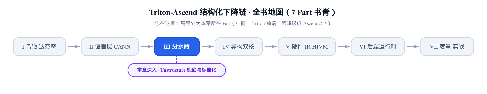
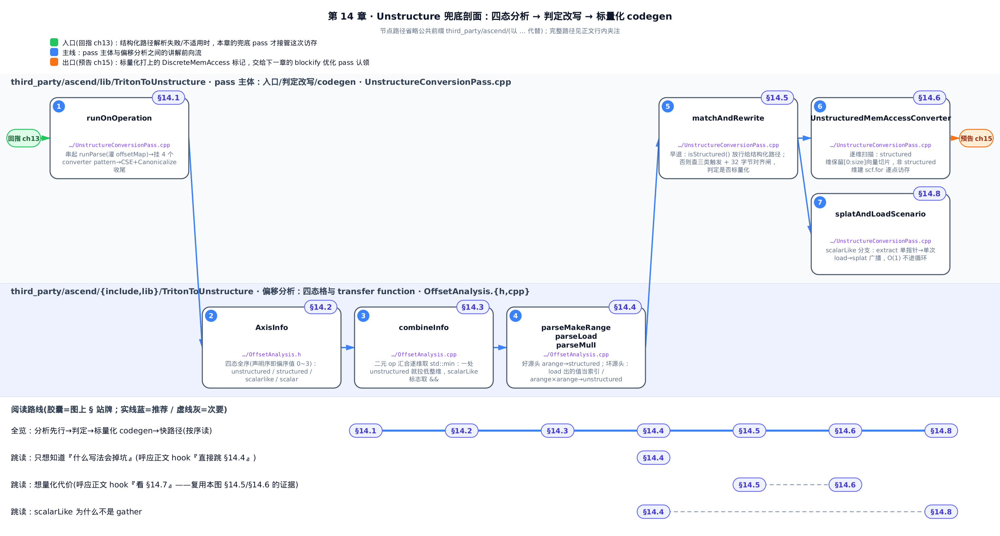
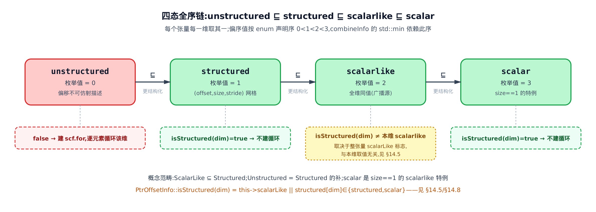
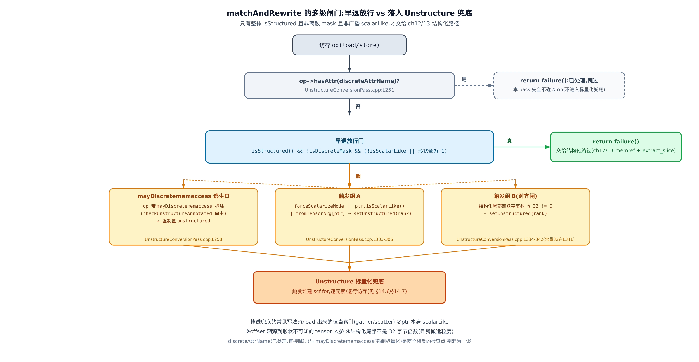
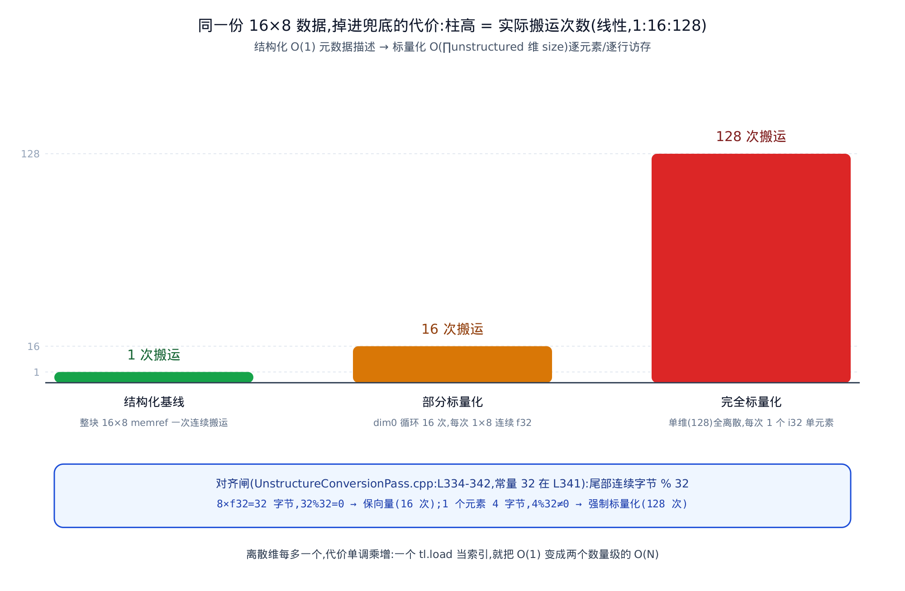

# 结构化装不下时：Unstructure 兜底路径与 gather/scatter 标量化



> 上一章打通了结构化访存的正向路径。
> 本章讲反面：装不下时怎么退。
> 下一章起，进入昇腾侧的优化 pass。

前三章讲的都是「成功」。[第 11 章](../../ch11-ptranalysis/narrative/chapter.md)把 `tt.addptr` 链逆向成 `(offset, sizes, strides)` 三元组；[第 12 章](../../ch12-blockptranalysis-memref/narrative/chapter.md)把三元组铸成 `memref.reinterpret_cast`；[第 13 章](../../ch13-maskanalysis-extractslice/narrative/chapter.md)把 mask 还原成 `tensor.extract_slice`。三步走完，一整块张量的访存被压成一条连续搬运指令。

但结构化不是万能的。有些访存天生就装不进「每维一个连续区间」的模子——比如按运行期算出的索引去 gather，或者两个等差数列相乘得到的非线性偏移。这时正向路径彻底放弃，把活儿交给本章的兜底 pass：`--triton-to-unstructure`。

这条 pass 干一件事：**把装不下结构化的访存，标量化成 `scf.for` 逐元素循环**。它先用一套四态分析判断「这个访存到底能不能结构化」，判不能，就生成循环逐点访存。代价是实打实的——结构化路径 O(1) 描述整块搬运，标量化后循环 trip 数等于离散维尺寸的乘积。一个 `tl.load` 当索引，就能把一次搬运变成 128 次。

先看这条 pass 自己在头文件里给的例子。它把一个用 loaded 值当偏移的间接 `tt.load`，翻成双层 `scf.for`：

> 下面几个代码块为讲解做了换行重排与注释添加，控制流与语义逐字对齐 pin，完整原文见所标行号。

```
// third_party/ascend/include/TritonToUnstructure/UnstructureConversionPass.h:L56-L82（pass 头文件自带示例注释，已整理换行）

// 转换前：%structured 是一个结构化索引张量，
//   把它 load 出来的值 %0 当作第二次 load 的偏移（间接寻址）。
%0 = tt.load %structured : tensor<128x128x!tt.ptr<i32>>
%ptr_2 = tt.splat %arg1 : !tt.ptr<f32> -> tensor<128x128x!tt.ptr<f32>>
%1 = tt.addptr %ptr_2, %0 : tensor<128x128x!tt.ptr<f32>>, tensor<128x128xi32>
%2 = tt.load %1 : tensor<128x128x!tt.ptr<f32>>          // ← 这次访存装不下结构化
tt.store %output %2 : tensor<128x128x!tt.ptr<f32>>

// 转换后：%2 那次 load 被拆成双层 scf.for 逐元素访存
%0 = tt.load %structured : tensor<128x128x!tt.ptr<i32>>
%1 = tensor.empty() : tensor<128x128xf32>
%2 = scf.for %arg2 = %c0 to %c128 step %c1 iter_args(%arg3 = %1) -> (tensor<128x128xf32>) {
  %4 = scf.for %arg4 = %c0 to %c128 step %c1 iter_args(%arg5 = %arg3) -> (tensor<128x128xf32>) {
    %extracted = tensor.extract %10[%arg3, %arg5] {DiscreteMemAccess} : tensor<128x128xi32>
    %5 = arith.extsi %extracted : i32 to i64
    %6 = tt.addptr %arg1, %5 : !tt.ptr<f32>, i64
    %7 = tt.load %6 {DiscreteMemAccess} : tt.ptr<f32>   // ← 一次只读一个元素
    %inserted_slice = tensor.insert_slice %7 into %arg5[%arg2, %arg4] [1, 1] [128, 1] {DiscreteMemAccess} : tensor<1x1xf32> into tensor<128x128xf32>
    scf.yield %inserted_slice : tensor<128x128xf32>
  }
  scf.yield %4 : tensor<128x128xf32>
}
tt.store %output %2 : tensor<128x128x!tt.ptr<f32>>
```

> 这段是 pass 作者手写在头文件里的示意注释，编号偏松，照录原文即可、不必逐个对号入座：`tensor.extract %10[...]` 里的 `%10` 指的就是转换前那个被 load 出来的索引张量（对应上面的 `%0`，作者在示意里另给了个号）；`tensor.extract` 的下标写成了累积用的 `iter_args`（`%arg3`／`%arg5`），而真实生成的 IR 用的是两层循环的归纳变量 `%arg2`／`%arg4`——严谨的逐行对照见 [§14.6](#146-部分标量化离散维循环连续维切片) 的夹具 CHECK，那里的编号是编译器实际吐出来的。

这里先解释一个后文反复出现的语法：`iter_args(%arg3 = %1) -> (tensor<128x128xf32>)` 是 `scf.for` 的**循环携带变量**——`%arg3` 每轮迭代读到上一轮 `scf.yield` 出的新值，初值是 `%1`（一块 `tensor.empty`），循环结束后整个 `scf.for` 的结果就是最后一轮 yield 的值。这就是循环体「边搬边攒」、最终写回一整块 tensor 的方式；load 场景带 `iter_args`（累积结果张量），store 场景不带（无值可攒）。

`{DiscreteMemAccess}` 是标量化后每个逐点访存被打上的属性标记（下游据此识别离散访存），全章的 IR 里到处是它。这段 128×128 的张量，转换后有 128×128 = 16384 次单元素 `tt.load`。这就是「掉进兜底」的代价，也是本章要讲清的三件事：**四态分析怎么判、什么写法会掉坑、掉坑之后代价多大**。

> 取证口径：host 上没有昇腾 NPU、没有 CANN 工具链，本章不存在真机数值。所有 IR 与数字都取自两处——① `triton-opt --triton-to-unstructure` 对 lit 夹具的确定性输出（已由 FileCheck 钉死前后对照）；② pin 源码里的常量（如对齐粒度 32）。表格里的态、循环次数、字节数都据此得出。



盯紧图上两条轨就够：下轨「偏移分析」给每一维发能否连续搬的通行证，上轨「pass 主体」据此放行给结构化路径、或按进逐元素 `scf.for`；每道闸的代数细节再按 §14.1 到 §14.8 逐节读。

只想知道「什么写法会掉坑」，直接跳 [§14.4](#144-通行证发给谁transfer-function-与掉坑的写法)；想量化代价，看 [§14.7](#147-代价从-o1-到-o离散维乘积)；想跟全程，按序读。

---

## 14.1 分水岭的另一面

结构化和兜底是同一枚硬币的两面。判定发生在同一个地方：每个 `tt.load`／`tt.store`／atomic 访存 op，pass 都先沿它的指针定义链往上分析，算出一份**逐维的结构化标注**。标注说「整块都能结构化」，就 `return failure()` 放行，交给上一章那条 memref 路径；标注说「某些维装不下」，才留在本 pass 里标量化。

这份分析的载体是一个 C++ 类 `PtrOffsetInfo`（指针偏移信息）。它给一个指针／偏移 Value 记四样东西：关联的基指针、i64 偏移值、一个 `scalarLike`（全同值）布尔标志、以及**逐维的结构化态**。头两样（基指针、i64 偏移）是字段级承接 [第 11 章](../../ch11-ptranalysis/narrative/chapter.md) `PtrState` 的 `source`／`offset`；`scalarLike` 布尔标志是本章新增，概念上呼应 `PtrState::isScalar()`（`PtrState` 里它是个方法、不是同名存储字段）。本章的增量全在最后一样：那个「逐维的结构化态」到底有几个态、每个态什么意思、态之间怎么汇合。

pass 的主入口把这套流程串起来：

```cpp
// third_party/ascend/lib/TritonToUnstructure/UnstructureConversionPass.cpp:L672-L732
//   （runOnOperation，省略 LLVM_DEBUG 打印、compileOn91095/forceSimtTemplate flag 赋值）
void TritonToUnstructurePass::runOnOperation() {
  ModuleOp moduleOp = getOperation();
  MLIRContext *ctx = &getContext();

  // ① 把指针型函数参数登记进 offsetMapForLoopArgs；规整 if/yield/add；预解析循环 iter_args
  moduleOp->walk([this](triton::FuncOp funcOp) {
    replacePtrArguments(funcOp, offsetMapForLoopArgs);
  });
  offsetMapForLoopArgs.clear();
  if (failed(processIfYieldAddHoistOperations(moduleOp)))    // 规整失败只告警，不中断
    moduleOp.emitWarning("Failed to process IfYieldAddHoist operations");
  moduleOp->walk([this](LoopLikeOpInterface op) { runPreparse(op); });

  // ② 遍历每个访存 op，沿其指针定义链求偏移态，灌进 offsetMap
  moduleOp->walk([this](Operation *op) {
    if (auto loadOp = dyn_cast<triton::LoadOp>(op))            runParse(loadOp);
    else if (auto storeOp = dyn_cast<triton::StoreOp>(op))     runParse(storeOp);
    else if (auto atomicRMWOp = dyn_cast<triton::AtomicRMWOp>(op)) runParse(atomicRMWOp);
    else if (auto atomicCASOp = dyn_cast<triton::AtomicCASOp>(op)) runParse(atomicCASOp);
  });

  // ③ 挂 4 类访存的转换 pattern（load/store/atomicRMW/atomicCAS 各一份），贪婪应用
  RewritePatternSet patterns(ctx);
  patterns.add<UnstructuredMemAccessConverter<triton::LoadOp>,
               UnstructuredMemAccessConverter<triton::StoreOp>,
               UnstructuredMemAccessConverter<triton::AtomicRMWOp>,
               UnstructuredMemAccessConverter<triton::AtomicCASOp>>(
      ctx, forceScalarizeMode, offsetMap, fromTensorArg);
  if (failed(applyPatternsAndFoldGreedily(moduleOp, std::move(patterns)))) {
    moduleOp->emitError("failed to apply Patterns");
    signalPassFailure();                 // 改写失败：显式传播，不吞
  }

  // ④ 收尾：CSE + Canonicalize 清理
  PassManager pm(&getContext(), moduleOp.getOperationName());
  pm.addPass(createCSEPass());
  pm.addPass(createCanonicalizerPass());
  if (failed(runPipeline(pm, getOperation())))
    signalPassFailure();
}
```

这里有几个术语先点明。`runParse`（每个访存 op 触发一次）沿指针定义链递归，把路径上每个 Value 的 `PtrOffsetInfo` 算出来存进 `offsetMap`（一张 Value → 偏移信息的表）。`UnstructuredMemAccessConverter<MemAccOpTy>`（离散访存转换器）是个模板 pattern，`MemAccOpTy` 取 4 类访存之一，它的 `matchAndRewrite` 依 `offsetMap` 判定该访存要不要兜底，要则生成标量化循环。`forceScalarizeMode`（强制标量化开关）是个 pass 选项，后面会用到。

分析（②）和判定改写（③）分两趟：先把全模块每个访存的偏移态都算好，再统一改写。下面顺着这条脉络，从「态」本身讲起。

## 14.2 四态格：不是「结构化／否」两个格子

**直觉**：给张量的每一维发一张「能不能连续搬」的通行证，你以为只有「能」和「不能」两种。其实这里发四种。为什么要四种？因为「能连续搬」内部还有区别：一个尺寸为 1 的单点轴，和一个「32 个元素全是同一个值」的广播轴，都能当结构化处理，但下游重排偏移维度时得把它俩分开——不然 `broadcast`／`expand_dims` 的维度对不上。四态就是为这份精度留的。



**机制**：四个态排成一条全序链，声明顺序就是它们的偏序值：

```math
\mathrm{unstructured}(0) \sqsubseteq \mathrm{structured}(1) \sqsubseteq \mathrm{scalarlike}(2) \sqsubseteq \mathrm{scalar}(3)
```

越往右越「结构化」，越往左越接近「彻底离散」。每个张量的每一维取其中一个态。四个态的含义：

- `unstructured`（值 0，格底）：偏移没法用单一 stride 描述。比如从内存 load 出来的索引、两个等差数列相乘的结果。这一维掉坑。
- `structured`（值 1）：偏移是 $`\mathrm{base} + \mathrm{stride}\cdot i`$ 的仿射网格，可以用 `(offset, sizes, strides)` 三元组描述。这是「好」的态。
- `scalarlike`（值 2）：这一维所有元素同值，且宽度大于 1（广播出来的轴）。
- `scalar`（值 3）：尺寸为 1 的单点轴，是 `scalarlike` 的特例。

**留意一处同名不同物**：这里逐维的 `scalarlike` 态（值 2），和 [§14.1](#141-分水岭的另一面) 提到的那个整张量 `scalarLike`（`isScalarLike()`）布尔标志，是两个不同粒度的量——一个是对**单一维度**的四态取值之一，一个是对**整个张量**是否全同值的布尔判断。两条线各自独立传播（下一节会看到：逐维态取 `std::min` 逐层合并，整体布尔取 `&&` 逐层合并），不互相派生，也不能互推。后文 [§14.5](#145-兜底判定的多级闸门) 的早退门用的是整体布尔 `isScalarLike()`，别和逐维态混作一谈。

**源码**：这个四态枚举定义在头文件里，声明顺序即偏序——记住这点，下一节的 `std::min` 就靠它。

```cpp
// third_party/ascend/include/TritonToUnstructure/OffsetAnalysis.h:L76-L81
enum class AxisInfo {
  unstructured,   // 0
  structured,     // 1
  scalarlike,     // 2
  scalar          // 3
};
```

概念层面其实只有三个范畴，pin 的头注释说得很清楚：

```cpp
// third_party/ascend/include/TritonToUnstructure/OffsetAnalysis.h:L41-L73（PtrOffsetInfo 头注释，节选）
/**
Possible status of the ptr offset:
 - ScalarLike:
    - Tensor's elements are all the same such as [[2.0,2.0,2.0],[2.0,2.0,2.0]]
    - Constant integer or floating-point such as 2, 2.0, and `load tensor<1xptr>`
 - Unstructured:
    - Not a `ScalarLike` ptr offset
    - Or satisfy any below conditions:
      - Incontinuous stride such as
        - `muli [0,1,2,3] [0,1,2,3]` => [0,1,4,9]
        - `divsi [9,8,7] [3,2,1]`   => [3,4,7]
        - `minsi [3,4,5] [5,4,3]`   => [3,4,3]
      - From non-`scalarLike` floating point element type such as
        - `fptosi [1.0,2.0,3.0]` => [1,2,3]
      - Compilation time unknown value
        - `load %ptr, %offset` => %value
  - Structured:
    - orthongonal to `Unstructured`
      - if PtrOffsetInfo isn't `Unstructured`, it is `Structured`

In short:
ScalarLike ⊆ Structured
Unstructured = {x| x ∉ Structured}
*/
```

`ScalarLike` 是 `Structured` 的子集，`Unstructured` 是 `Structured` 的补——概念上二分，实现上四态。四态里 `scalar` 是 `scalarlike` 的特例（宽度 1），`scalarlike` 和 `scalar` 都归在概念的「ScalarLike」下。四态多出来的精度，只为了正确重排广播维度。

这里埋一个后面要用的细节：**`scalarlike` 这个逐维态，在整体「能否结构化」的判定里其实不算数**。判定用的是另一个布尔短路——具体机制留到 [§14.5](#145-兜底判定的多级闸门)，那正是「全同值的张量为什么会被整体强制标量化」的原因。

## 14.3 汇合取更差：combineInfo 的逐维 min

**直觉**：两个人合租一间房，只要有一个人半夜不睡，这间房就算「吵」。偏移的两个操作数相加相减时也一样——汇合时取「更差」的那个。任一操作数在某维是离散的，结果那一维就是离散的。宁可误判成「要循环」，也不敢误判成「能连续搬」，后者会生成错的连续访存指令。

**机制**：格的汇合（meet）用逐维 `std::min`。因为偏序值 unstructured=0 最小，min 会把结果拉向格底。看一个真实例子。夹具 `unstructure_mix.mlir` 里有这么一步加法：

```
%16 = arith.addi %14, %15 : tensor<16x8xi64>
```

`%14` 和 `%15` 的态是分析沿定义链推出来的。`%14` 来自 `arange` 乘一个标量再广播：dim0 是广播出来的轴（`scalarlike`），dim1 保住了 `arange` 的连续性（`structured`）。`%15` 来自一个 loaded 索引 expand 再广播：dim0 直接继承了 load 的 `unstructured`，dim1 是广播轴（`scalarlike`）。两者逐维取 min：

<!-- trace: m2 -->

| 维 | lhs（`%14`）态=值 | rhs（`%15`）态=值 | min 结果=值 | codegen 含义 |
|---|---|---|---|---|
| dim0（size 16） | scalarlike=2 | unstructured=0 | **unstructured=0** | 建 `scf.for` 0→16，逐行循环 |
| dim1（size 8） | structured=1 | scalarlike=2 | **structured=1** | 保留为 [0:8] 向量切片 |
| scalarLike 布尔标志 | false | false | false && false = false | 整体非全同值，不走 splat 快捷路径 |

dim0 上 `min(2, 0) = 0`，一个 `scalarlike` 撞上一个 `unstructured`，结果被拉成 `unstructured`——这就是「一处离散污染整维」。dim1 上 `min(1, 2) = 1`，两个「好」的态汇合还是「好」的态，连续访存不被无谓打散。结果 `[unstructured, structured]` 决定了下游：dim0 循环 16 次，每次搬 dim1 的 8 个连续元素（见 [§14.6](#146-部分标量化离散维循环连续维切片)）。

**源码**：

```cpp
// third_party/ascend/lib/TritonToUnstructure/OffsetAnalysis.cpp:L192-L204
PtrOffsetInfo combineInfo(const PtrOffsetInfo &lhs, const PtrOffsetInfo &rhs) {
  PtrOffsetInfo info;
  assert(lhs.getRank() == rhs.getRank() && "Rank must be same to be combined");

  info.setScalarLike(lhs.isScalarLike() && rhs.isScalarLike());   // 布尔标志取 &&
  auto &structuredRef = info.getStructuredRef();
  auto lhsStructured = lhs.getStructured();
  auto rhsStructured = rhs.getStructured();
  structuredRef.resize(lhs.getRank());
  for (size_t i = 0; i < structuredRef.size(); i++)
    structuredRef[i] = std::min(lhsStructured[i], rhsStructured[i]);   // 逐维 meet
  return info;
}
```

两条线独立传播：逐维态取 `std::min`，`scalarLike` 布尔标志取 `&&`（只有两个操作数都全同，结果才全同）。

**这个 min 为什么是对的（不变量）**：对全序链，`min(a, b) ≤ a` 且 `min(a, b) ≤ b` 恒成立。所以结果每一维的态都不高于任一输入维——「高」是更结构化，「低」是更接近离散。因此只要有一个输入维是 `unstructured`（=0，格底），min 必为 0，结果那维一定被判离散。这保证了分析**永不高估结构化程度**：不会把真离散的偏移误判成能连续搬。基例是两输入都 `structured` 时 min 仍 `structured`，连续访存不被误伤。本例走两次 min 加一次布尔与：`dim0 = min(2,0)=0`、`dim1 = min(1,2)=1`、标志 `false && false = false`。若 dim1 也被某个 `unstructured` 输入污染，min 会把它也拉成 0，退化成 16×8 = 128 次单元素访存。

## 14.4 通行证发给谁：transfer function 与「掉坑的写法」

**直觉**：`combineInfo` 管的是「两个态怎么汇合」，但源头的态从哪来？编译器给每种 Triton 写法发一张「能否连续搬」的通行证，这些「发证规则」就是 transfer function（转移函数）。`tl.arange` 是等差数列，天生连续，发 `structured`；但只要偏移里混进「运行期才知道的值」或「破坏等差性的运算」，通行证就被吊销，发 `unstructured`。想避开兜底，就别让访存的偏移沾上这两类来源。

**机制**：`runParse` 触发的 `parse` 沿定义链递归下降，按方言把每个 op 分派给对应的 `parse*` 函数，由它填这个 op 结果的偏移态。先看这个分派骨架——它就是下面所有 `parseXxx` 的总机：

```cpp
// third_party/ascend/lib/TritonToUnstructure/OffsetAnalysis.cpp:L206-L284（parse 主体骨架，省略 LLVM_DEBUG 与 tensor/scf 各细分支）
void parse(Value operand, const Location &loc, RewriterBase &rewriter,
           llvm::DenseMap<Value, PtrOffsetInfo> &offsetMap) {
  if (offsetMap.contains(operand))
    return;                                 // 已算过则复用，避免重复递归
  if (auto *defOp = operand.getDefiningOp()) {
    if (isa<arith::ArithDialect>(defOp->getDialect())) {
      parseArithOp(defOp, loc, rewriter, offsetMap);   // → parseAddI / parseMulI …
    } else if (isa<triton::TritonDialect>(defOp->getDialect())) {
      parseTritonOp(defOp, loc, rewriter, offsetMap);  // → parseSplat / parseMakeRange / parseLoad …
    } else {
      if (auto ifOp = dyn_cast<scf::IfOp>(defOp))
        parseIf(ifOp, loc, rewriter, offsetMap, operand);
      // … 省略：scf.yield / 循环 / tensor.extract / insert_slice 等分派 …
    }
  }
  // … 省略：defOp 为空（block 参数）等兜底路径 …
}
```

`parseArithOp`／`parseTritonOp` 再按具体 op 二次分派：加法给 `parseAddI`、乘法给 `parseMulI`、`tt.make_range` 给 `parseMakeRange`、`tt.load` 给 `parseLoad`……本节下面逐个讲的就是这些末端函数——它们不是凭空触发的，都是 `parse` 顺着某个访存指针的定义链下降时点到的。下表把最关键的几条发证规则摆出来（写法、对应函数、产出态、能否结构化）：

<!-- trace: m3 -->

| Triton 写法 | 对应 parse 函数 | 产出偏移态 | 能否结构化 | 出处 |
|---|---|---|---|---|
| `tl.arange(0, 16)` | `parseMakeRange → setStructured(1)` | `structured`（1 维连续 stride=1） | 能（好写法） | `OffsetAnalysis.cpp:L591` |
| `idx = tl.load(p); base[idx]` | `parseLoad → setUnstructured(rank)` | `unstructured`（编译期未知，gather 索引源头） | 不能→兜底 | `OffsetAnalysis.cpp:L641` |
| `arange * 标量`（splat） | `parseMulI`：一侧 scalarLike → 透传另一侧 | `structured`（仿射性保住） | 能 | `OffsetAnalysis.cpp:L666-L668` |
| `arange * arange`（`[0,1,2,3]*[0,1,2,3]=[0,1,4,9]`） | `parseMulI`：两侧非 scalarLike → unstructured | `unstructured`（相邻差 [1,3,5] 非常数） | 不能→兜底 | `OffsetAnalysis.cpp:L670-L671` |
| `tl.full` / splat 广播 | `parseSplat`：size1→scalar，size>1→scalarlike | `scalarlike`（全同值） | 能（走 O(1) 快路径，见后文） | `OffsetAnalysis.cpp:L493-L499` |

一头一尾是「好」的源头，中间藏着两类「掉坑」的源头——load 当索引、`arange × arange`。逐个看源码。

**好源头一：`arange` 天生连续**。`tl.arange` 降成 `tt.make_range`，`parseMakeRange` 直接给它一维 `structured`：

```cpp
// third_party/ascend/lib/TritonToUnstructure/OffsetAnalysis.cpp:L585-L592
void parseMakeRange(triton::MakeRangeOp op, const Location &loc,
                    RewriterBase &rewriter,
                    llvm::DenseMap<Value, PtrOffsetInfo> &offsetMap) {
  auto dst = op.getResult();
  offsetMap[dst] = PtrOffsetInfo();
  offsetMap[dst].setStructured(1);   // arange = stride 1 的仿射源
}
```

**掉坑源头一：loaded 值当索引（gather）**。从内存 load 出来的张量，内容运行期才定，编译期没有静态仿射式可写，所以整体 `setUnstructured`：

```cpp
// third_party/ascend/lib/TritonToUnstructure/OffsetAnalysis.cpp:L629-L642
void parseLoad(triton::LoadOp op, const Location &loc, RewriterBase &rewriter,
               llvm::DenseMap<Value, PtrOffsetInfo> &offsetMap) {
  auto ptr = op.getPtr();
  parse(ptr, op.getLoc(), rewriter, offsetMap);
  auto dst = op.getResult();
  offsetMap[dst] = PtrOffsetInfo();
  offsetMap[dst].setScalarLike(offsetMap[ptr].isScalarLike());   // scalarLike 只从 ptr 继承
  auto tensorType = dyn_cast<RankedTensorType>(dst.getType());
  if (!tensorType)
    return;
  offsetMap[dst].setUnstructured(tensorType.getRank());   // loaded 值 = gather 索引源头
}
```

这就是 `base[idx]` 里 `idx = tl.load(...)` 那个 `idx`。它一旦被拿去当另一次 `tt.addptr` 的偏移，那次访存的对应维必然 `unstructured`。`parseLoad` 和 `parseMakeRange` 是一对对偶：一个是「好」源头，一个是「坏」源头。

**掉坑源头二：不连续 stride（`arange * arange`）**。乘法是判定的核心。`parseMulI` 特判：若一侧是 `scalarLike`（常数样），就透传另一侧的结构（常数×仿射仍是仿射）；两侧都随 $`i`$ 变，乘积是二次的，那一维 `unstructured`：

```cpp
// third_party/ascend/lib/TritonToUnstructure/OffsetAnalysis.cpp:L644-L672（省略 lhs/rhs 的 parse 递归取值）
void parseMulI(arith::MulIOp op, const Location &loc, RewriterBase &rewriter,
               llvm::DenseMap<Value, PtrOffsetInfo> &offsetMap) {
  // … 省略：parse(lhs)、parse(rhs)，取出各自逐维态与 scalarLike 标志 …
  bool lhsScalarLike = lhsOffsetInfo.isScalarLike();
  bool rhsScalarLike = rhsOffsetInfo.isScalarLike();

  size_t maxSize = std::max(lhsStructured.size(), rhsStructured.size());
  auto dst = op.getResult();
  offsetMap[dst] = PtrOffsetInfo();
  offsetMap[dst].setScalarLike(lhsScalarLike && rhsScalarLike);
  auto &dstStructured = offsetMap[dst].getStructuredRef();
  dstStructured.resize(maxSize);
  for (size_t i = 0; i < maxSize; i++)
    if (lhsScalarLike)
      dstStructured[i] = rhsStructured[i];       // 一侧常数样 → 透传另一侧（仿射保住）
    else if (rhsScalarLike)
      dstStructured[i] = lhsStructured[i];
    else
      dstStructured[i] = PtrOffsetInfo::AxisInfo::unstructured;   // 两侧都变 → 不连续
}
```

对照头注释那个算例：`muli [0,1,2,3] [0,1,2,3] => [0,1,4,9]`，相邻差是 `[1,3,5]`，不是常数，没有单一 stride 能描述——所以 `unstructured`。`divsi`、`minsi`、`fptosi` 破坏仿射性的道理相同（头注释都列了）。

**这条规律的不变量**：偏移态只由「仿射性是否保住」决定。能写成 $`\mathrm{base} + \mathrm{stride}\cdot i`$ 的一维／多维网格就是 `structured`；值编译期未知、或运算破坏仿射性，就是 `unstructured`。`make_range` 是 stride=1 的仿射源；`muli` 只在「一侧常数样」时保住仿射（常数×仿射仍仿射），两侧都随 $`i`$ 变则乘积二次、相邻差非常数、仿射性破坏；`load` 的内容运行期才定，无静态仿射式可写，必 `unstructured`。

回到夹具看这条规律怎么落地。`unstructure_mix.mlir` 里，`%8 = tt.load(...)` 是一个结构化索引 `arg1` load 出来的值 → `unstructured`。**这正是 [§14.3](#143-汇合取更差combineinfo-的逐维-min) 里 `%15` 的更早源头**：`%8` 经 expand、broadcast 变成 `%15`，`%14 + %15` 汇合出的 `%16`（就是 §14.3 那步 `arith.addi`）正是第二次 load（`%18`）用的行偏移。这条 load 的 dim0 因此被拉成 `unstructured`，触发 16 次循环兜底。反例是同一个 kernel 里的 `store`（`%28`）：它的偏移全由 `make_range` 组合而成，全 `structured`，直接放行，0 次循环。**一个 `tl.load` 当索引，就是「掉坑」的分水岭。**

## 14.5 兜底判定的多级闸门

**直觉**：偏移态算好了，但「要不要兜底」还得过一道多级闸门。这道闸门在 `matchAndRewrite` 里：先看能不能早退放行给结构化路径，放不了，再看是哪一类触发条件把它按进标量化。本节重点讲四类会掉坑的 Triton 写法，外加一条处理上游离散 mask 中间表示的分支。



**机制**：闸门的第一道是早退放行。整体 `isStructured()` 为真、且不是离散 mask、且（不是广播 `scalarLike` 或形状全为 1），就 `return failure()`，把这个访存交回结构化路径（上一章处理）。反过来，只有过不了这道早退的，才留下来标量化。

这里的「离散 mask」（`is_discrete_mask` 属性，`op->hasAttr("is_discrete_mask")` 命中）由更上游的 `--discrete-mask-access-conversion` pass 标注（`third_party/ascend/lib/DiscreteMaskAccessConversion/DiscreteMaskAccessConversionPass.cpp:L243`）：那条 pass 专门处理 **mask 表达式本身不连续**的情形——即便 `ptr` 的偏移是 structured，只要掩码依赖一个离散来源（如 mask 里嵌了 gather 出来的索引），它就打上这个标记。本章不展开那条 pass，只需知道它和四态分析判离散一样，是把访存压向标量化的一票——所以早退门里显式排除了它（`!isDiscreteMask`）。

```cpp
// third_party/ascend/lib/TritonToUnstructure/UnstructureConversionPass.cpp:L251-L263（matchAndRewrite 前半，省略 LLVM_DEBUG）
  if (!ptrType || op->hasAttr(ConverterUtils::discreteAttrName))
    return failure();
  if (!offsetMap.contains(ptr))
    return op.emitError() << "PtrOffsetInfo should be computed\n" << ptr;

  auto ptrOffsetInfo = offsetMap.at(ptr);

  if (checkUnstructureAnnotated(op, rewriter))          // 上游显式标注 → 强制离散
    ptrOffsetInfo.setUnstructured(ptrOffsetInfo.getRank());

  if (ptrOffsetInfo.isStructured() && !isDiscreteMask &&
      (!ptrOffsetInfo.isScalarLike() ||
       llvm::all_of(ptrType.getShape(), [](int64_t dim) { return dim == 1; })))
      return failure();                                 // ← 早退：交给结构化路径
```

（这里先点破第一行的 `ConverterUtils::discreteAttrName`：它的字符串值就是 `"DiscreteMemAccess"`，也就是本章 IR 里到处出现、标量化后每个逐点访存都带的那个 `{DiscreteMemAccess}` 标记（`third_party/ascend/include/Utils/Utils.h:L47`）。所以第一行的意思是「这个 op 已经带 `{DiscreteMemAccess}` 了 → 是本 pass 自己上一轮生成的标量化叶子，别再碰」——`applyPatternsAndFoldGreedily` 是贪婪改写器，会反复重访 pass 新造出来的子 op（循环体里那些 `tt.load {DiscreteMemAccess}` 本身也是 `triton::LoadOp`），这条检查就是防止对已处理结果重复改写。它和紧接着的 `if (checkUnstructureAnnotated(op, rewriter))` 是两个不同的检查点、效果正相反：`discreteAttrName` 命中直接 `return failure()` 跳过整个 op、本 pass 不碰它；`checkUnstructureAnnotated`（上游 `mayDiscretememaccess` 标注的逃生口，本节末尾细讲）命中则强制把偏移置 `unstructured`、继续往下按离散处理。别把两者当成一回事。）

这里 `isStructured()`（不带维度参数的那个重载）是把四态坍缩成一个布尔的关键谓词。它的实现是理解「广播张量为什么被强制标量化」的钥匙：

```cpp
// third_party/ascend/lib/TritonToUnstructure/OffsetAnalysis.cpp:L150-L171
bool PtrOffsetInfo::isStructured(int dim) const {
  return this->scalarLike || structured[dim] == AxisInfo::structured ||
         structured[dim] == AxisInfo::scalar;
}

bool PtrOffsetInfo::isStructured() const {
  return this->scalarLike || llvm::all_of(structured, [](auto dim) {
           return dim == AxisInfo::structured || dim == AxisInfo::scalar;
         });
}

bool PtrOffsetInfo::isUnstructured() const {
  return llvm::all_of(structured,
                      [](auto dim) { return dim == AxisInfo::unstructured; });
}

bool PtrOffsetInfo::isUnstructuredOrScalarlike() const {
  return llvm::all_of(structured, [](auto dim) {
    return dim == AxisInfo::unstructured || dim == AxisInfo::scalarlike ||
           dim == AxisInfo::scalar;
  });
}
```

注意 `isStructured()` 的 `all_of` 里只认 `structured` 和 `scalar` 两个态——**逐维的 `scalarlike` 并不算数**。这正是 [§14.2](#142-四态格不是结构化否两个格子) 埋下的细节兑现：一个逐维标了 `scalarlike` 的轴，只能靠 `this->scalarLike` 那个整体布尔标志短路进「结构化」。而早退条件里又写了「是 `scalarLike` 且形状非全 1 就不放行」——于是广播出来的 `scalarlike` 张量过不了早退，被下面第二道闸按进标量化（走 [§14.8](#148-广播不是-gatherscalarlike-的-o1-快捷路径) 的单点快路径，不是真循环）。

三个坍缩谓词各管一件事：`isStructured` 决定「整体放不放行」；`isUnstructured` 判「是不是全维离散」；`isUnstructuredOrScalarlike` 后面决定「codegen 用逐元素 `tensor.extract` 还是切片 `tensor.extract_slice`」。四态精确传播，codegen 只问这两三个布尔。

**第二道闸：三类强制标量化**。过不了早退的，看这几个条件：

```cpp
// third_party/ascend/lib/TritonToUnstructure/UnstructureConversionPass.cpp:L303-L306
  if (forceScalarizeMode || ptrOffsetInfo.isScalarLike() ||
      fromTensorArg.at(ptr)) {
    ptrOffsetInfo.setUnstructured(ptrOffsetInfo.getRank());
  }
```

三个触发：`forceScalarizeMode`（pass 选项强制全标量化）、`ptr` 本身 `scalarLike`（广播张量，走单点快路径）、`fromTensorArg[ptr]` 为真。最后这个 `fromTensorArg`（偏移溯源自 tensor 入参）需要解释：如果偏移递归溯源到一个 tensor 类型的函数参数或循环参，它的静态形状／连续性编译期不可知，保守当 `unstructured` 处理，免得对不可分析的偏移做错误的结构化假设。这段沿操作数递归上溯、命中无定义 op 的 tensor 值即置真的逻辑，在 `isFromTensorArg`（`UnstructureConversionPass.cpp:L628-L644`）。

**第三道闸：32 字节对齐**。这道最特别——它针对的不是「分析判离散」，而是「能结构化，但对齐不够，退化更安全」。从最内维往外累乘「结构化尾部」的连续字节数，一旦碰到非 `isStructured` 的维就停；这段连续字节若不是 32 的倍数（昇腾内存搬运的对齐粒度），强制整体标量化：

```cpp
// third_party/ascend/lib/TritonToUnstructure/UnstructureConversionPass.cpp:L334-L342
  for (int i = ptrOffsetInfo.getRank() - 1; i >= 0; i--) {
    if (!ptrOffsetInfo.isStructured(i))
      break;
    sizeInByte *= resultShape[i];   // 累乘结构化尾部的连续字节
  }

  // Force scalarize if memory is not aligned
  if (sizeInByte % 32 != 0)
    ptrOffsetInfo.setUnstructured(ptrOffsetInfo.getRank());
```

`sizeInByte` 起初是单个元素的字节数（`f32` 是 4）。这道闸后面 [§14.7](#147-代价从-o1-到-o离散维乘积) 会用真实形状算给你看：8 个 `f32` = 32 字节，正好整除，向量切片放行；只有 4 个 `f32` = 16 字节，不整除，退化逐元素。

还有一道**逃生口**：op 若带 `mayDiscretememaccess` 标注（就是上面 `checkUnstructureAnnotated` 认的那个），上游可以显式强制它走离散路径，即便分析判它结构化。这给前端／上游 pass 留了个手动开关。它跟本节开头那个 `discreteAttrName` 不是一回事：`discreteAttrName`（`"DiscreteMemAccess"`）是「已经处理过、别再碰」的跳过标记（命中即 `return failure`），`mayDiscretememaccess` 才是「按离散来处理」的强制标记——名字都带 discrete，作用却相反。

**还有第五条独立分支：离散 mask 访存的 `select` 解包。** 前面 [早退门](#145-兜底判定的多级闸门)提到的上游 `--discrete-mask-access-conversion` pass，处理 **mask 本身离散**的 `tt.store`／`atomicRMW` 时，会把带离散掩码的访存改写成 `select(mask, val, other)` 的表示、并在 op 上打一个 `DiscreteMask` 属性（`ConverterUtils::discreteMaskAttrName`，字符串就是 `"DiscreteMask"`，`third_party/ascend/include/Utils/Utils.h:L46`；由 `DiscreteMaskAccessConversionPass.cpp:L199`／`L220`／`L319` 打上）。注意它和早退门里那个 `is_discrete_mask` 是**同一条上游 pass 打的两个不同属性**：`DiscreteMask` 打在 store／atomicRMW 上，`is_discrete_mask` 打在 load 上，名字近、来源同、指向的 op 却不同。`matchAndRewrite` 在 `UnstructureConversionPass.cpp:L284-L301` 专门认这个 `DiscreteMask`：把 `select` 解回普通的带 mask 访存（store 取 `select` 的 true 值与条件重建一个带 mask 的 `tt.store`，atomicRMW 同理），再无条件 `setUnstructured` 把它压进标量化。这条分支不在上面「四类写法」里——它处理的不是某种 Triton 源码写法，而是上游 pass 产出的一种中间表示，本章不展开它的细节，只需知道它是除早退门／第二道闸／对齐闸之外、`matchAndRewrite` 里又一个强制离散的入口。

把本章聚焦的四类写法归一句：**① 用 load 出来的值当索引（gather/scatter）；② `ptr` 本身 `scalarLike`；③ offset 溯源自形状不可知的 tensor 入参；④ 结构化尾部连续区间不是 32 字节倍数。** 前三类是「分析判离散」，第四类是「能结构化但对齐不够」；再加上刚讲的那条离散 mask `select` 解包分支，以及前面提过的两个手动开关（`mayDiscretememaccess` 逃生口、`forceScalarizeMode` pass 选项），就凑齐了 `matchAndRewrite` 里全部的强制离散入口。

**这几道闸为什么「不漏判、也不误伤」（不变量）**：早退门（`UnstructureConversionPass.cpp:L251-L263`）放行的充要条件是 `isStructured() && !isDiscreteMask && (!isScalarLike || 全维 size=1)`。它为假，当且仅当至少命中「某维已是 `unstructured`」「是离散 mask」「是广播 `scalarLike` 且非全 1 形状」三者之一。于是两个方向都封死：**放行的一定安全**——过了早退的访存必然全维 `structured`（或全 1 广播），不会把真离散的连续访存误判成能连续搬（这一步的保守性由 [§14.3](#143-汇合取更差combineinfo-的逐维-min) 的 `min` 不高估、[§14.4](#144-通行证发给谁transfer-function-与掉坑的写法) 的 transfer function 只在仿射保住时发 `structured` 联合保证）；**留下的一定被接住**——第二、三道闸（`L303-L306` 的 `scalarLike`/tensor 入参、对齐闸）以及离散 mask `select` 解包分支，都是对「过不了早退但仍不安全」的场景做进一步收紧，不存在「既没放行、也没被任何门标记」的中间地带。合起来：早退门筛掉安全的，其余每条访存都被某道闸接住。

## 14.6 部分标量化：离散维循环，连续维切片

**直觉**：gather 常常只是「按行乱序，每行内部还是连续的」。所以别把整块打成散粒。对乱序的那一维用 `scf.for` 逐行循环，对连续的那一维仍整段向量搬。就像图书馆按乱序的索书号一本本找架子（循环），但每个架子上的一排书还是一次抱走（向量切片）。这叫**部分标量化**。

![混合态 [unstructured(16), structured(8)] 的部分标量化：dim0 逐行循环、dim1 每行 8 个连续 f32 一次搬](../diagrams/fig-ch14-m6-partial-scalarize.png)

**机制**：拿 [§14.3](#143-汇合取更差combineinfo-的逐维-min) 那个例子的结果续讲。`unstructure_mix.mlir` 里第二次 load 的指针 `%18` 是 `tensor<16x8x!ptr<f32>>`，态 `[unstructured(dim0=16), structured(dim1=8)]`。codegen 逐维扫描，对每维二选一：

<!-- trace: m6 -->

| 维（size） | 四态 | `isStructured(i)`？ | codegen 分支 | 生成的 IR（CHECK） |
|---|---|---|---|---|
| dim0（16） | unstructured | 否 | 建 `scf.for`（step 1） | `scf.for %28 = %c0 to %c16 step %c1 iter_args(%29 = tensor.empty)` |
| dim1（8） | structured | 是 | 保留向量切片 [0:8] | `tensor.extract_slice %25[%28,0][1,8][1,1] {DiscreteMemAccess}` |
| 循环体访存 | - | - | splat ptr + addptr + 访存 + 写回 | `tt.addptr → tt.load {DiscreteMemAccess} : tensor<1x8x!ptr<f32>> → tensor.insert_slice %33 into %29[%28,0][1,8][1,1]` |

dim0 离散，建一层 `scf.for` 循环 0→16，该维退化成单元素（`sizes=1`），循环变量当偏移。dim1 结构化，整段保留为 `[0:8]` 的向量切片（`offsets=0, sizes=8`）。循环体里 splat 出指针、`addptr`、`tt.load` 一次搬 1×8，再 `insert_slice` 写回累积。

**源码**：codegen 骨架就是这个「逐维二选一」的循环。

```cpp
// third_party/ascend/lib/TritonToUnstructure/UnstructureConversionPass.cpp:L408-L466（省略 MakeTensorPtr 夹逼与 mask 收窄的分支）
  for (size_t i = 0; i < resultShape.size(); i++) {
    auto size = resultShape[i];
    auto structured =
        ptrOffsetInfo.getStructuredRef()[i] == PtrOffsetInfo::AxisInfo::structured;
    strides.push_back(rewriter.getIndexAttr(1));
    Value sizeVal =
        rewriter.create<arith::ConstantOp>(loc, rewriter.getIndexAttr(size));
    if (structured) {
      offsets.push_back(rewriter.getIndexAttr(0));   // 整段 [0:size] 向量切片
      sizes.push_back(rewriter.getIndexAttr(size));
      extractedShape.push_back(size);
    } else {
      scf::ForOp forOp;
      // … 省略：MakeTensorPtr 时 minsi 夹逼真实 shape；有 mask 时用 MaskAnalysis 收窄上下界 …
      Value loopLower = zeroIdx;
      Value loopUpper = sizeVal;
      if (isLoadLike) {
        forOp = rewriter.create<scf::ForOp>(loc, loopLower, loopUpper, oneIdx,
                                            ValueRange({iterArg}));   // load 带 iter_args 累积
        // … 省略：结果张量穿线 newOpResult / yield …
        iterArg = forOp.getRegionIterArg(0);
      } else {
        forOp = rewriter.create<scf::ForOp>(loc, loopLower, loopUpper, oneIdx);   // store 无累积
      }
      sizes.push_back(rewriter.getIndexAttr(1));       // 离散维退化成单元素
      offsets.push_back(forOp.getInductionVar());      // 循环变量当偏移
      extractedShape.push_back(1);
      forOp->setAttr("ExtractedLoadOrStore", UnitAttr::get(rewriter.getContext()));
      rewriter.setInsertionPointToStart(forOp.getBody());
    }
  }
```

`structured` 维走 `if` 分支（一次切满），非 `structured` 维走 `else` 分支（建 `scf.for`，`C++` 类是 `scf::ForOp`，IR 是 `scf.for`）。`else` 里对 load 场景带 `iter_args`（累积结果张量），对 store 场景不带。省略的两段分支：`MakeTensorPtr` 指针用 `arith.minsi` 把循环上界夹到真实 shape；带 mask 时用 [第 13 章](../../ch13-maskanalysis-extractslice/narrative/chapter.md)的 `MaskState` 把循环上下界收窄到掩码窗口——两者都不改「离散维循环、连续维切片」的骨架。

循环体里生成逐点访存指令。全维离散（`isUnstructuredOrScalarlike` 为真）时用 `tensor.extract` 逐元素取偏移标量；部分结构化时用 `tensor.extract_slice` 取整段偏移切片再 splat 指针。（下面省略的 `MakeTensorPtr` 分支是个例外：它的偏移不是一块物化的 tensor，没有可 `extract` 的容器，所以改用 `stride · 归纳变量` 逐维累加、现算出 i64 线性偏移——同样得到逐点的标量偏移，只是来路不同。）

```cpp
// third_party/ascend/lib/TritonToUnstructure/UnstructureConversionPass.cpp:L468-L512（省略 MakeTensorPtr 按 stride 重算 i64 偏移的分支与 LLVM_DEBUG）
  bool fullyUnstructured = ptrOffsetInfo.isUnstructuredOrScalarlike();
  auto extractedType = RankedTensorType::get(extractedShape, resultElementType);

  Value extractedOffset;
  if (fullyUnstructured) {
    // … 省略：MakeTensorPtr 时按 stride·indVar 重算 i64 线性偏移 …
    extractedOffset = createExtractOp(loc, ptrOffset, rewriter, offsets);   // 逐元素 tensor.extract
  } else {
    extractedOffset =
        createExtractOp(loc, ptrOffset, rewriter, offsets, sizes, strides); // tensor.extract_slice 取切片
  }

  assert(isa<triton::PointerType>(srcPtr.getType()) && "src must be ptr type");
  if (!fullyUnstructured) {
    srcPtr = rewriter.create<triton::SplatOp>(
        loc, RankedTensorType::get(extractedShape, srcPtr.getType()), srcPtr); // splat 成 1×8 指针
  }
  Value ptrToAccess = rewriter.create<triton::AddPtrOp>(
      loc, srcPtr.getType(), srcPtr, extractedOffset);
  // … 后续 createMemAccOp 发射带 {DiscreteMemAccess} 的 tt.load/store，insert_slice 写回 iter_arg …
```

**这套改写为什么正确（不变量）**：部分标量化保结果形状。逐维 `sizes` 之积等于原 tensor 形状——`structured` 维贡献整个 size，`unstructured` 维贡献 `1 ×` 循环 trip（trip = size）。写回 `insert_slice` 覆盖全域无重叠：`unstructured` 维循环 size 次、每次写偏移 `[iv]`，`iv` 遍历 0..size-1 恰好铺满且不重叠；`structured` 维一次切满。所以所有 `(dim0_iv, dim1_slice)` 的并集 = 完整 16×8。基例是全 `structured`——退化成单次整块切片，正好是结构化路径。单调量是「已写回元素数 = ∏sizes」，循环每轮严格增，满则终止。

**代入 16×8**：dim0 离散 → 16 次 `scf.for` 迭代；dim1 结构化且 8×`f32` = 32 字节对齐（下一节讲对齐闸）→ 每次 1×8 向量 load。总计 16 次「带宽为 8 个 `f32`」的搬运，而非 16×8 = 128 次单元素。如果这同一个 16×8 张量的 dim1 也 `unstructured`（两维全离散），才退化成 16×8 = 128 次单元素——那是完全标量化。下一节的 `nested_loop` 是完全标量化的另一个例子，但它是**单维 128** 的张量，不是这里 16×8 的变体，别把两者的形状搞混。

## 14.7 代价：从 O(1) 到 O(离散维乘积)

**直觉**：结构化路径给整块张量开一张「一句话收据」——起点 + 尺寸 + 步长，一条连续搬运指令搞定，O(1) 元数据。标量化是撕掉收据，给每个离散维派一个 for 循环去逐个点名。收据能不能开，取决于偏移连不连续、对不对齐；开不成，代价就从 O(1) 涨到 O(∏离散维尺寸)。



**机制**：拿三个场景对比——结构化基线、部分标量化、完全标量化。数字全来自 lit 夹具的 CHECK 前后对照：

<!-- trace: m7 -->

| 场景 | 结构化态 | 循环 trip = ∏(unstructured 维) | 尾维连续字节 vs 32 | 每轮搬运量 | vs 结构化 O(1) |
|---|---|---|---|---|---|
| 结构化基线（[ch12](../../ch12-blockptranalysis-memref/narrative/chapter.md)/[ch13](../../ch13-maskanalysis-extractslice/narrative/chapter.md)） | 全 structured | 0（无循环） | 整块 memref 连续 | 整块 16×8 一次 | **1 次搬运** |
| `unstructure_mix`（部分） | [unstructured(16), structured(8)] | 16 | 8×f32 = 32 字节，32%32=0 对齐 → dim1 保向量 | 1×8 = 8 个连续 f32 | **16 次搬运** |
| `nested_loop`（完全） | [unstructured(128)] | 128 | 尾维即 unstructured，连续字节 = 元素 4，4%32≠0 | 1 个 i32 单元素 | **128 次搬运** |

柱高比 1:16:128，跨了两个数量级。差距完全由「离散维个数与尺寸」决定。

**对齐闸的算例**（用 [§14.5](#145-兜底判定的多级闸门) 那段 32 字节代码）：`unstructure_mix` 的 dim1 = 8×4（`f32`）= 32 字节，`32 % 32 = 0`，通过，dim1 保向量，总 16 次 × 8 元素。反事实（同一闸门，纯常量算，非 trace）：若尾维只有 4 个 `f32` = 16 字节，`16 % 32 = 16 ≠ 0`，强制整体标量化——两维都被置 `unstructured`，退化 16×4 = 64 次单元素（尾维已按假设改成 4）。`nested_loop` 的唯一维是 `unstructured`，尾部连续字节 = 单元素 4 字节 < 32，完全标量化，128 次单元素 load。

`nested_loop.mlir` 是完全标量化最尖锐的一例。它把一个 loaded 索引 `%10` 当偏移、`addptr` 得到完全 `unstructured` 的 `tensor<128xi64>` 间接指针，还携带进 `scf.for` 循环。转换后循环体里单层 `scf.for` 0→128，逐元素 `tensor.extract` + 标量 `addptr` + `tt.load {DiscreteMemAccess}`：

```
// third_party/ascend/unittest/Conversion/General/TritonToUnstructure/nested_loop.mlir CHECK（节选，@test_kernel 内层）
%42 = scf.for %43 = %c0 to %c128 step %c1 iter_args(%44 = %41) -> (tensor<128xi32>) {
  %45 = tensor.extract %35[%43] {DiscreteMemAccess} : tensor<128xi64>   // 逐元素取偏移
  %46 = tt.addptr %3, %45 : !tt.ptr<i32>, i64                            // 标量 addptr
  %47 = tt.load %46 {DiscreteMemAccess} : !tt.ptr<i32>                   // 一次读一个 i32
  %49 = tensor.insert_slice %{{.*}} into %44[%43] [1] [1] : tensor<1xi32> into tensor<128xi32>
  scf.yield {DiscreteMemAccess} %49 : tensor<128xi32>
}
```

同一个 kernel 里还有另一处 load：它的偏移不是 loaded 索引，而是循环携带的结构化整数（`arange` 与循环变量的组合），四态分析判它全 `structured`，于是**不被标量化**——那条 `tt.load` 在转换后仍是一次整块 `tensor<128x...>` 访存、不带 `{DiscreteMemAccess}`，结构化路径照常放行（同一夹具的另一条 CHECK，本章不逐行列出）。这印证了判定是逐访存独立的：同一个循环体里，一个 load 走兜底、另一个走结构化。128 次单元素 load vs 结构化 1 次连续 load——代价放大 128 倍。同一份夹具里还有一个 `@test_kernel2`，逻辑等价、但用 `scf.while` 而非 `scf.for` 表达循环——四态判定与标量化 codegen 对两种循环结构一视同仁（`while` 的 iter_args 走同一套 preparse 态传播），转换后一样是逐元素 `tensor.extract` + 标量 `addptr` + `tt.load {DiscreteMemAccess}`，本章不重复展开。

**代价公式的不变量**：标量化 trip 数 = ∏(unstructured 维的 size)，连续带宽只在最内连续的 `structured` 尾维上保住。codegen 对每个 `unstructured` 维恰建一层 `scf.for`（`UnstructureConversionPass.cpp:L408-L466` 那段），嵌套循环总迭代 = 各层 size 之积；`structured` 尾维不建循环、留向量切片，它的 `size ×` 元素字节就是每轮连续搬运量。对齐闸（`UnstructureConversionPass.cpp:L334-L342`）从最内维累乘连续字节、遇非 `structured` 维即停，所以连续带宽被第一个 `unstructured` 维截断。`unstructure_mix` 只有 dim0 离散 → 16；`nested_loop` 唯一维离散 → 128；结构化基线无离散维 → ∏空集 = 1。**每多一个离散维，代价单调乘增。** 一个 `tl.load` 当索引，就把 O(1) 变成两个数量级的 O(N)。

## 14.8 广播不是 gather：scalarLike 的 O(1) 快捷路径

**直觉**：如果一整队人都要读同一个信箱地址，没必要排队各读一次——派一个人读一次，复印给所有人。`scalarLike` 偏移意味着所有「线程」读同一地址，走单点 load + splat 广播，而不是 N 次冗余访存。这把 `scalarLike` 和真 gather 在 codegen 上彻底分开。

**机制**：`scalarLike` 偏移全同，128 个地址其实是同一个。所以只 extract 第 0 个指针、单次 load、再 splat 广播成整张量。`splat.mlir` 这个最小夹具证得清楚：

<!-- trace: m8 -->

| 步骤 | 生成的 IR（CHECK） | 访存次数 | 对比真 gather |
|---|---|---|---|
| 取单指针 | `tensor.extract %ptr[%c0] {DiscreteMemAccess} : tensor<128x!ptr<f32>>` | 0（仅取地址） | gather 要 extract 128 次 |
| 单次 load | `tt.load %ext : !tt.ptr<f32>`（标量 load） | 1 次 | gather 要 load 128 次 |
| 广播 | `tt.splat %val : f32 -> tensor<128xf32>` | 0（纯广播） | gather 无此步 |

一次标量 load + 一次 splat = O(1)，对比真 gather（[§14.7](#147-代价从-o1-到-o离散维乘积) 的 `nested_loop`）128 次单元素 load。

**源码**：这条快路径在 `matchAndRewrite` 早退失败后、真正建循环之前就分流走了——load 且 `isScalarLike`，直接调 `splatAndLoadScenario`，`return success()`，根本不进 `scf.for`：

```cpp
// third_party/ascend/lib/TritonToUnstructure/UnstructureConversionPass.cpp:L211-L225（splatAndLoadScenario 函数体）
  auto loc = op.getLoc();
  SmallVector<OpFoldResult> idx(rank, rewriter.getIndexAttr(0));
  auto extractedPtr = createExtractOp(loc, op.getPtr(), rewriter, idx);   // extract 第 0 个指针
  Value mask = op.getMask();
  Value other = op.getOther();
  Value loadedValue = rewriter.create<triton::LoadOp>(
      loc, extractedPtr, /*mask=*/nullptr, /*other=*/nullptr,
      /*boundaryCheck=*/ArrayRef<int32_t>(),
      /*PaddingOptionAttr=*/nullptr);                                     // 单次标量 load
  loadedValue = rewriter.create<triton::SplatOp>(loc, op.getResult().getType(),
                                                 loadedValue);            // splat 广播成整张量
  if (mask)
    rewriter.replaceOpWithNewOp<arith::SelectOp>(op, mask, loadedValue, other); // 带 mask 时 select
  else
    rewriter.replaceOp(op, loadedValue);
```

**不变量**：`scalarLike` load 结果与逐元素 load 逐位相等，但只访存 1 次。偏移全同 ⇒ 128 个地址相等 ⇒ `load[i]` 对所有 `i` 返回同值 ⇒ 读第 0 个再广播 = 读全部。带 mask 时多一条 `arith.select(mask, loaded, other)`，仍 O(1)。这就是 [§14.5](#145-兜底判定的多级闸门) 那道「`ptr.isScalarLike()` 命中却不落进循环」的闸门背后的省法。

顺带提一条更特殊的分流：当昇腾编译目标是特定架构、且开了 SIMT（单指令多线程，Single Instruction Multiple Threads）模板选项时（`compileOn91095 && forceSimtTemplate`），完全离散或离散 mask 的访存不走 `scf.for`，而是直接改写成 `ascend.indirect_load`／`ascend.indirect_store`（C++ 类 `triton::ascend::IndirectLoadOp`／`IndirectStoreOp`），把逐点访存交给 SIMT 模板处理。这是 `ascend` 方言的两个内建 op，属于后续昇腾优化的范畴，本章不展开。

## 14.9 小结：分水岭到此走完

从 [第 10 章](../../ch10-watershed-triton-to-linalg/narrative/chapter.md) 的总览，到 ch11–13 的结构化正向路径，再到本章的兜底对偶路径，triton_adapter 这条分水岭走完了。回顾这一章立的几件事：

- **四态格**（`unstructured ⊑ structured ⊑ scalarlike ⊑ scalar`，定义在 `OffsetAnalysis.h:L76-L81`）是分析的地基。四个态而非布尔二分，为的是正确区分单点轴与广播轴、正确重排偏移维度；codegen 时再靠 `isStructured`／`isUnstructuredOrScalarlike`（`OffsetAnalysis.cpp:L150-L171`）坍缩成两三个布尔。
- **`combineInfo` 的逐维 `std::min`**（`OffsetAnalysis.cpp:L192-L204`）是「一处离散污染整维」的机制，保证分析永不高估结构化程度。
- **transfer function** 决定「什么写法掉坑」：`arange` 是好源头（`structured`），loaded 值当索引（`parseLoad`）和 `arange * arange`（`parseMulI`）是坏源头（`unstructured`）。判据是偏移的仿射性是否保住。
- **多级闸门**：早退放行给结构化路径，四类写法（gather 索引／`scalarLike`／tensor 入参溯源／非 32 字节对齐）落进兜底，外加一条处理上游离散 mask `select` 表示的分支。
- **部分标量化**只对离散维建 `scf.for`、连续尾维保向量切片，代价 = ∏(离散维 size)。同一份 16×8 数据，结构化 1 次搬运、部分标量化 16 次、完全标量化 128 次。

一句话记住这条路：**结构化装不下时，编译器退到逐元素的 `scf.for`，用带宽换正确性；离散维每多一个，代价乘该维尺寸。**

分水岭之后，源码就进入昇腾侧的优化了。相邻的网格实例还能不能折成一条循环少建几趟？离散访存除了标量化还有没有更聪明的拆分？这些是接下来几章的事——本章标下的 `{DiscreteMemAccess}` 标记，正是下游那些优化 pass 用来认领「离散访存」的入口。下一章从「把多个网格实例折成一条 blockify 循环」讲起。
