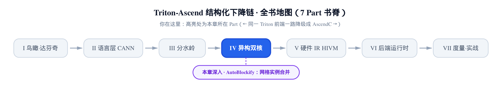
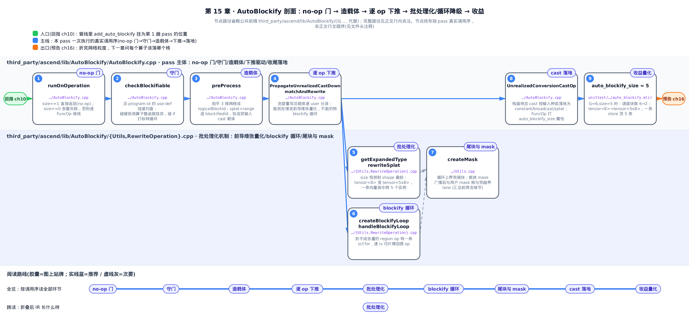
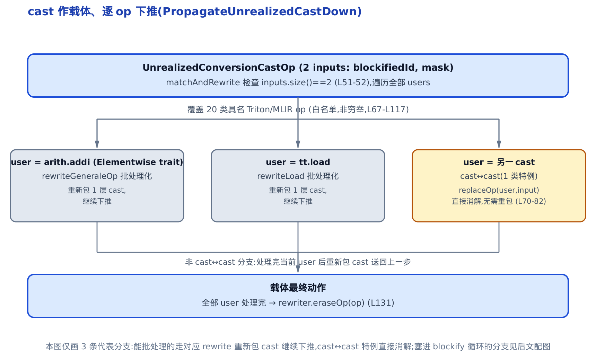
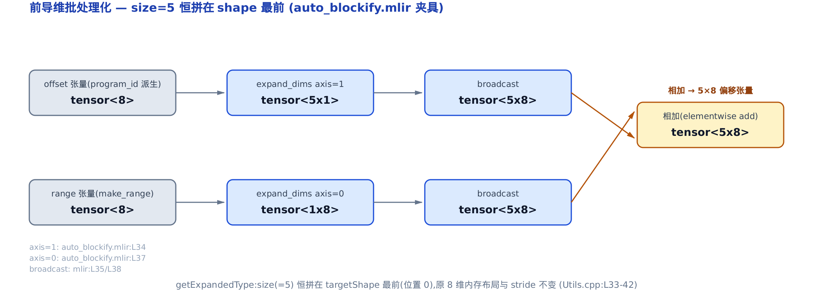
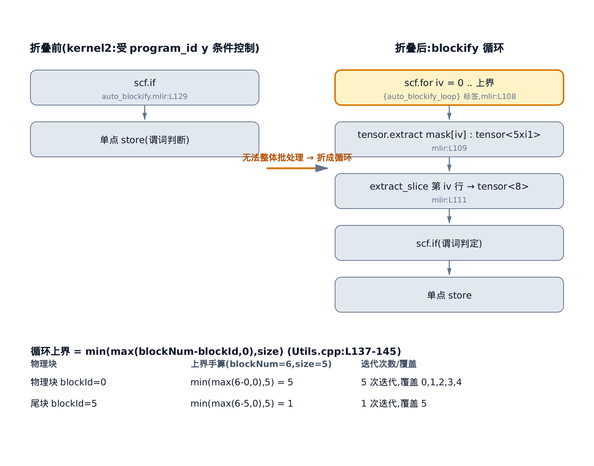
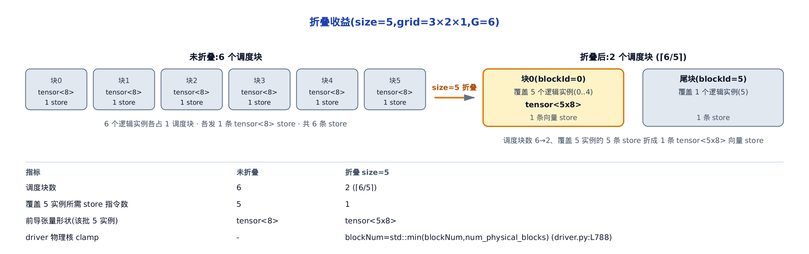

# AutoBlockify：把多个网格实例折成一条 blockify 循环



> 上一章收了 triton-to-linalg 子系统：裸指针怎么还原成结构化访存。
> 本章开 ascend-opt 子系统第一站：不碰指针，改**重塑网格粒度**。
> 下一章接着问：每个算子该落 cube 核还是 vector 核。

拿一个最普通的向量加 kernel 想一下。你写 `pid = tl.program_id(0)`，Triton 按网格（grid，启动时给出的逻辑实例阵列）铺开成成千上万个逻辑 **program 实例**（一个格点、一份 `program_id`、各算各的一小块数据）。在 GPU 上，硬件有 **warp**（把 32 个线程绑成一束、同一条指令一起走的执行单元）替你把这一束线程的访存合并成一次宽访存——这是基座那本《Triton 源码解读》里 TritonGPU 后端一路依赖的物理前提，也是[第 10 章：分水岭](../../ch10-watershed-triton-to-linalg/narrative/chapter.md)里反复提到的 **SIMT**（Single Instruction Multiple Threads，同一条指令喂一大片线程）模型的底座。

昇腾达芬奇没有 warp。它的[向量单元](../../ch02-davinci-npu-hardware-model/narrative/chapter.md)吃的是一整块规整张量，一条向量指令跨一排数据。于是问题来了：如果每个逻辑实例都单独启动一个物理块、各发一条只覆盖自己那一小片的短向量指令，会有两笔浪费——**每次启动/收尾的固定开销按逻辑实例个数一份份地付**，而且**向量单元喂不饱**（一次只处理一个实例的窄数据）。

AutoBlockify 就是补这个缺口的编译器变换。它的想法一句话说清：**把连号的多个逻辑 program 实例折成一批，塞进同一个物理块，让它们的运算堆到张量的前导维、用一条宽向量指令一起做**。这和 GPU 靠 warp 合并访存是**同一个优化目标在两种硬件模型下的两种实现**——GPU 交给硬件、昇腾交给编译器。

它在管线里的位置，[第 10 章：分水岭](../../ch10-watershed-triton-to-linalg/narrative/chapter.md)已经点过：`ttir_to_linalg` 那串 pass 里，**打头的第 1 趟**就是 `add_auto_blockify`。那章一句带过，本章把它拆开讲透。

> **选读指引**：只想知道「折叠后 IR 长什么样」，直接跳到[前导维批处理化](#前导维批处理化把-size-拼到-shape-最前)看夹具前后对照；想跟完整机制，按序读——从 no-op 门 → 造载体 → 逐 op 下推 → 守门 → 批处理化 → 循环降级 → 收益，覆盖 pass 执行涉及的全部环节。（出于讲解顺手，守门 `checkBlockifiable` 的细节被安排在「造载体/下推」之后展开；但它在真实调用里其实**最先**跑——第一节 `runOnOperation` 代码就能看到：对每个函数先守门、全通过才 `preProcess` 造载体，别被小节排布误导成它更靠后。）

一句边界话先立在这：本章讲的是**逻辑实例怎么被折成一批**，**不是** Unified Buffer（UB，昇腾片上缓存）的容量 tiling——那件事在下游闭源的 bishengir 里做，不在 AutoBlockify 的职责范围。



图分两条泳道：上道是 pass 主体（`AutoBlockify.cpp`）从入口到收尾的调用序，下道是批处理化机制本身（`Utils.cpp`/`RewriteOperation.cpp`）。只想看「折叠后 IR 长什么样」，盯图上「逐 op 下推 → 批处理化」这一段就够；想看全部九站怎么串成一次 pass 执行，按图底「全览」路线对照下文各小节读。

---

## autoBlockifySize：折叠粒度，与那扇 no-op 门

**直觉**。整个 pass 只有一个旋钮：`autoBlockifySize`——一个物理块要批处理多少个逻辑实例。它默认是 `1`，`1` 就是「一个块只装一个实例」，也就是**什么都不做**。所以这扇门的第一条规则很朴素：`size == 1` 直接原样返回，pass 是个 no-op。

**机制**。旋钮从哪来？从编译期。管线组装时，`compiler.py` 把 `add_auto_blockify` 挂进 `ttir_to_linalg`，并把 `auto_blockify_size` 传进去。关键是它前面那道闸：没开 `TRITON_ALL_BLOCKS_PARALLEL` 这个环境开关时，`auto_blockify_size` 被强制压回 `1`。

第 1 趟 pass 的挂载：

```python
# third_party/ascend/backend/compiler.py:L113-L124
        auto_blockify_size = metadata["auto_blockify_size"]
        if not _is_auto_map_parallel_blocks_enabled():
            auto_blockify_size = 1
        pm = ir.pass_manager(mod.context)
        pm.enable_debug()
        ascend.passes.ttir.add_auto_blockify(
            pm,
            auto_blockify_size
        )
```

注意最窄的事实：**这个 pass 自己不算最优 size**。它只接收上层传进来的编译期值。「size 取多少合适」是上层策略的事（大致要把逻辑实例总数收敛到物理核数附近），追到源码最里层就是 `metadata["auto_blockify_size"]`——本 pass 不参与决策。

pass 的声明也印证只有这一个选项：

```cpp
// third_party/ascend/include/AutoBlockify/Passes.td:L6-L19
def AutoBlockify : Pass<"auto-blockify", "mlir::ModuleOp"> {
    let summary = "Apply auto blockify v2";
    let constructor = "triton::createAutoBlockifyPass()";
    let dependentDialects = [
        "mlir::arith::ArithDialect",
        "mlir::tensor::TensorDialect",
        "mlir::triton::TritonDialect"
    ];
    let options = [
        Option<"autoBlockifySize", "auto-blockify-size", "int", "1",
           "Apply auto blockify v2 when TRITON_ALL_BLOCKS_PARALLEL is 1."
           "Expand highest dimension with blockify size">
    ];
}
```

摘要那句 `Expand highest dimension with blockify size`（在最高维展开 size 份）是整个 pass 的口号——后面处处能对上。

**源码**。pass 主体是 `AutoBlockifyPass::runOnOperation`。开头就是那扇门：`size == 1` 走人；`size <= 0` 是非法配置，告警后失败：

```cpp
// third_party/ascend/lib/AutoBlockify/AutoBlockify.cpp:L286-L311
void AutoBlockifyPass::runOnOperation() {
  if (autoBlockifySize == 1)
    return;
  ModuleOp moduleOp = getOperation();
  if (autoBlockifySize <= 0) {
    moduleOp->emitWarning("[AutoBlockify V2] AutoBlockifySize cannot be "
                          "negative integer, skipping.");
    return signalPassFailure();
  }

  MLIRContext *ctx = &getContext();

  moduleOp.walk([&](triton::FuncOp func) {
    LogicalResult result = success();
    func.walk([&](triton::GetProgramIdOp id) {
      if (!checkBlockifiable(id.getResult())) {
        result = failure();
        return WalkResult::interrupt();
      }
      return WalkResult::advance();
    });
    if (failed(result)) {
      func->emitWarning("Cannot apply auto blockify");
      return WalkResult::skip();
    }
    preProcess(func);
```

这段还铺开了整个 pass 的骨架：逐个 `FuncOp`（`triton::FuncOp`，Triton 的函数 op），先对每个 `GetProgramIdOp`（`tt.get_program_id`，取当前实例在网格某维的坐标）跑 `checkBlockifiable` 守门；**任一不可批处理就整函数跳过**（告警 `Cannot apply auto blockify`），通过了才进 `preProcess`。守门逻辑放到[后面单独讲](#checkblockifiable沿-program-id-一路查下去)，先看通过之后发生什么。

---

## 网格拍平 + blockifiedId：造一个「已批处理」的载体

这是全章第一个核心机制，也是理解后面一切的地基。

**直觉**。Triton 网格最多三维（x/y/z）。要「折 size 个逻辑实例」，如果对三维笛卡尔积逐维处理会很乱。`preProcess` 的第一步是**把三维拍平成一维**：像三位混合进制的车牌号那样，把 `(idX, idY, idZ)` 编成一个线性块号 `logicalBlockId`。折叠就变得极简单——从当前块号起**连号取 size 个**：`blockifiedId = [id, id+1, …, id+size-1]`。谁下游还要用原始的 `program_id x/y/z`，再用除法/取余把这个线性号**反解**回三维坐标，正是车牌拆回省份加城市加序号。

![网格拍平 + 载体构造：3×2×1 网格拍平成线性块号 0..5，第 0 号物理块折出 blockifiedId=[0,1,2,3,4]，与 ori 合成的 mask 一起被双输入 cast 包成「类型不变、语义已批处理」的载体](../diagrams/fig-m2-flatten-carrier.png)

**机制**。跟一遍数值。取一个 `3×2×1` 的网格（`numX=3, numY=2, numZ=1`，逻辑实例总数 `G = 6`），`size = 5`，看第 0 号物理块（`idX=idY=idZ=0`）折出什么。下表每一步都对着源码行号和夹具断言，数字是按源码常量手算的（这一章没有真机——它是纯 C++ MLIR pass，宿主编不动 `triton-opt`，所有数字要么是源码常量、要么对着 pin 内的 lit 测试夹具 `third_party/ascend/unittest/Conversion/General/AutoBlockify/auto_blockify.mlir` 的 `CHECK` 断言核对）：

<!-- trace: m2 -->

| 步骤 | 算子（源码 / 夹具锚） | 输入 | 输出（手算） |
| --- | --- | --- | --- |
| 拍平总块数 | `logicalBlockNum = numX·numY·numZ`（L204-205 / 夹具 L13-14） | `3·2·1` | `6` |
| 拍平块号 | `logicalBlockId = idX·(numY·numZ)+idY·numZ+idZ`（L217-220 / 夹具 L18-21） | `0·2 + 0·1 + 0` | `0` |
| 连号折叠 | `blockifiedId = splat(id)+range(0,5)`（L222-231 / 夹具 L16-24） | `splat(0)+[0,1,2,3,4]` | `[0,1,2,3,4]` |
| 上界谓词 | `upperboundMask = blockifiedId slt 6`（L235-236 / 夹具 L26） | `[0,1,2,3,4] < 6` | `[T,T,T,T,T]` |
| 下界谓词 | `lowerboundMask = blockifiedId sge 0`（L240-241 / 夹具 L27） | `[0,1,2,3,4] >= 0` | `[T,T,T,T,T]` |
| 合成 mask（`ori`！） | `blockifiedIdMask = upper ORI lower`（L242-243 / 夹具 L28） | `ori([T…],[T…])` | `[T,T,T,T,T]` |
| 反解 X | `(blockifiedId / yzNum=2) % numX=3`（L258-260 / 夹具 L29-32） | `[0,0,1,1,2] % 3` | `[0,0,1,1,2]` |
| 反解 Y | `(blockifiedId / zNum=1) % numY=2`（L262-264） | `[0,1,2,3,4] % 2` | `[0,1,0,1,0]` |
| 反解 Z | `blockifiedId % zNum=1`（L268-269） | `[0,1,2,3,4] % 1` | `[0,0,0,0,0]` |

有一处**必须逐字照实、极易看反**：合成 mask 用的是 `arith.ori`（**或**），不是 `and`。因为 `blockifiedId = logicalBlockId + range(0,size)`，它恒 `>= 0`，所以下界谓词 `lowerboundMask` 永远全 `True`，`ori` 出来的 mask 也就**永远全 True**——注意这是**结构性、与配置无关**的结论（`ori` 一侧恒真则结果恒真），不是本例夹具特有，下面尾块一节还会再对齐一次。换句话说，这个载体里携带的 mask 对折叠**从不做屏蔽**——真正处理尾块的是[后面 blockify 循环的上界](#blockify-循环把-region-op-折成一条-scffor)（循环路径）和反解取余把越界 lane 折回合法坐标（向量化路径），都不是这个 mask。别凭直觉把它脑补成「越界屏蔽必然是 and」而写反。

反解那三行是拍平的逆运算。把 `blockifiedId=[0,1,2,3,4]` 反解出的网格坐标是 `(x,y,z) = (0,0,0),(0,1,0),(1,0,0),(1,1,0),(2,0,0)`——正好是 6 个逻辑实例里连号的前 5 个，互不相同。

**不变量**：拍平 `k = idX·(numY·numZ)+idY·numZ+idZ` 与反解 `x = k/(numY·numZ) % numX`、`y = k/numZ % numY`、`z = k % numZ` 互为逆，是 `[0,G)` 与三维坐标 `[0,numX)×[0,numY)×[0,numZ)` 之间的**双射**。

```math
k = \mathrm{idX}\cdot(\mathrm{numY}\cdot\mathrm{numZ}) + \mathrm{idY}\cdot\mathrm{numZ} + \mathrm{idZ}
```

为什么成立：这是一个**混合进制**（mixed-radix，各数位进制不同的位值编码）。三个数位 `idX/idY/idZ` 各限在 `[0,numX)/[0,numY)/[0,numZ)`，权重分别是 `numY·numZ`、`numZ`、`1`。位值编码在数位范围内唯一可逆（逐位 div/rem 解码），所以 `k` 与 `(x,y,z)` 一一对应。上表把 `[0,1,2,3,4]` 反解出 5 个互异坐标，就是这条双射的见证。

**源码**。`preProcess` 前半段把上面每一步落成 IR：

```cpp
// third_party/ascend/lib/AutoBlockify/AutoBlockify.cpp:L197-L249
  // Get logical block num
  auto xNum =
      rewriter.create<triton::GetNumProgramsOp>(loc, triton::ProgramIDDim::X);
  auto yNum =
      rewriter.create<triton::GetNumProgramsOp>(loc, triton::ProgramIDDim::Y);
  auto zNum =
      rewriter.create<triton::GetNumProgramsOp>(loc, triton::ProgramIDDim::Z);
  auto yzNum = rewriter.create<arith::MulIOp>(loc, yNum, zNum);
  logicalBlockNum = rewriter.create<arith::MulIOp>(loc, yzNum, xNum);

  // Get logical block id
  auto xDim =
      rewriter.create<triton::GetProgramIdOp>(loc, triton::ProgramIDDim::X);
  auto yDim =
      rewriter.create<triton::GetProgramIdOp>(loc, triton::ProgramIDDim::Y);
  auto zDim =
      rewriter.create<triton::GetProgramIdOp>(loc, triton::ProgramIDDim::Z);
  xDim->setAttr(logicalBlockIdAttr, rewriter.getUnitAttr());
  yDim->setAttr(logicalBlockIdAttr, rewriter.getUnitAttr());
  zDim->setAttr(logicalBlockIdAttr, rewriter.getUnitAttr());
  auto xFlatten = rewriter.create<arith::MulIOp>(loc, xDim, yzNum);
  auto yFlatten = rewriter.create<arith::MulIOp>(loc, yDim, zNum);
  logicalBlockId = rewriter.create<arith::AddIOp>(loc, xFlatten, yFlatten);
  logicalBlockId = rewriter.create<arith::AddIOp>(loc, logicalBlockId, zDim);

  // get blockified block id
  auto blockifyTensorType =
      RankedTensorType::get({autoBlockifySize}, rewriter.getI32Type());
  auto blockfyRange = rewriter.create<triton::MakeRangeOp>(
      loc, blockifyTensorType, 0, autoBlockifySize);
  auto splatedLogicalBlockId = rewriter.create<triton::SplatOp>(
      loc, blockfyRange.getType(), logicalBlockId);
  Value blockifiedId =
      rewriter.create<arith::AddIOp>(loc, splatedLogicalBlockId, blockfyRange);

  // get mask
  auto splatedBlockNum = rewriter.create<triton::SplatOp>(
      loc, blockfyRange.getType(), logicalBlockNum);
  auto upperboundMask = rewriter.create<arith::CmpIOp>(
      loc, arith::CmpIPredicate::slt, blockifiedId, splatedBlockNum);
  auto splatedZero = rewriter.create<arith::ConstantOp>(
      loc, DenseElementsAttr::get(blockifyTensorType,
                                  rewriter.getI32IntegerAttr(0)));
  auto lowerboundMask = rewriter.create<arith::CmpIOp>(
      loc, arith::CmpIPredicate::sge, blockifiedId, splatedZero);
  Value blockifiedIdMask =
      rewriter.create<arith::OrIOp>(loc, upperboundMask, lowerboundMask);

  blockifiedId = rewriter
                     .create<UnrealizedConversionCastOp>(
                         loc, logicalBlockId.getType(),
                         ValueRange({blockifiedId, blockifiedIdMask}))
                     ->getResult(0);
```

三处细节值得停一下。第一，`GetNumProgramsOp`（`tt.get_num_programs`，取某维的实例总数）三维相乘得 `logicalBlockNum`。第二，新建的三个 `GetProgramIdOp` 被打上 `logicalBlockIdAttr` 标签——这是 pass **自己造的**取坐标 op，打标签是为了区别于用户 kernel 里写的那些，免得下一步反解时误改它们。第三，也是最点睛的一步：最后那个 `UnrealizedConversionCastOp`。

**这就是全章的枢纽，值得就地绑定一次**：`UnrealizedConversionCastOp` 是 MLIR builtin 方言里的类型转换占位 op；它的 C++ 类名是 `mlir::UnrealizedConversionCastOp`（代码里带 `::`），IR 文本里的名字是 `builtin.unrealized_conversion_cast`（两段点分小写助记符）。这里它被**双输入**创建：输入是 `(blockifiedId, blockifiedIdMask)`，而**结果类型仍是 `logicalBlockId` 那个标量类型**。这个反差是刻意的——下节详解为什么。

`preProcess` 后半段做反解 + 建循环：

```cpp
// third_party/ascend/lib/AutoBlockify/AutoBlockify.cpp:L251-L284
  // replace program id to be computed from blockified id
  SmallVector<triton::GetProgramIdOp> toReplace;
  func.walk([&](triton::GetProgramIdOp id) {
    if (id->hasAttr(logicalBlockIdAttr))
      return;
    toReplace.push_back(id);
  });
  for (auto id : toReplace) {
    rewriter.setInsertionPoint(id);
    Value newId;
    if (id.getAxis() == triton::ProgramIDDim::X) {
      newId = rewriter.create<arith::DivSIOp>(id.getLoc(), blockifiedId, yzNum);
      newId = rewriter.create<arith::RemSIOp>(id.getLoc(), newId, xNum);
    } else if (id.getAxis() == triton::ProgramIDDim::Y) {
      newId = rewriter.create<arith::DivSIOp>(id.getLoc(), blockifiedId, zNum);
      newId = rewriter.create<arith::RemSIOp>(id.getLoc(), newId, yNum);
    } else {
      newId = rewriter.create<arith::RemSIOp>(id.getLoc(), blockifiedId, zNum);
    }
    rewriter.replaceOp(id, newId);
  }

  // Create for loop for region ops
  func.walk<WalkOrder::PreOrder>([&](Operation *op) {
    if (op->hasAttr(autoBlockifyRegionOpAttr)) {
      auto *newOp = createBlockifyLoop(
          op, blockifiedId.getDefiningOp<UnrealizedConversionCastOp>(),
          logicalBlockId, logicalBlockNum, autoBlockifySize, rewriter);
      newOp->removeAttr(autoBlockifyRegionOpAttr);
      return WalkResult::skip();
    }
    return WalkResult::advance();
  });
}
```

第一个 `walk` 收集**用户写的** `program_id`（没有 `logicalBlockIdAttr` 标签的），把每个从 `blockifiedId` 用 div/rem 反解回来替换掉——这就是上表「反解 X/Y/Z」三行。注意替换后 `program_id` 已经不是标量了，它变成了 size 长的张量（因为 `blockifiedId` 是张量）。第二个 `walk` 把 `checkBlockifiable` 阶段打了 `autoBlockifyRegionOpAttr` 标签的 region op（带嵌套 region 的算子，如 `scf.if`/`scf.for`）折成 blockify 循环——那也留到[后面](#blockify-循环把-region-op-折成一条-scffor)。

---

## UnrealizedConversionCast 作载体：把批处理沿 def-use 逐 op 下推

**直觉**。上一节留了个悬念：为什么要造一个「输入是批处理数据、结果类型却还是原标量」的 cast？因为这是 MLIR 里一种经典的**渐进改写**手法——用一个「类型上说不通」的 cast 当**类型防火墙**。

打个比方：你要把一栋楼的水管全换成粗管，但不能一次全停水。于是先在总阀门那儿装一个「转接头」，对外接口还是细管口径（下游谁都不用改、局部合法），转接头内部其实已经通了粗管。然后你顺着水路一段一段往下游改，每改完一段就把转接头往下挪一格。等所有下游都换成粗管了，转接头就可以拆掉。这个转接头，就是双输入的 `UnrealizedConversionCastOp`；「粗管」就是批处理后的张量。



**机制**。驱动这套下推的是 MLIR 的贪婪重写引擎 `applyPatternsAndFoldGreedily`，装的模式是 `PropagateUnrealizedCastDown`（一个 `OpRewritePattern<UnrealizedConversionCastOp>`，即「专门匹配这种 cast」的重写模式类——注意这是 C++ 类名，不是 IR 算子名）。它的核心不变量有两条：

1. **载体永远恰好 2 个输入**：`(value, mask)`。`matchAndRewrite` 第一行就是 `op.getInputs().size() != 2` 则 `return failure()`——不满足直接不管。这把「携带批处理语义的边沿」和普通 cast 区分开。
2. **处理即消解**：一个载体 cast 的所有 user 逐个批处理化后，这个 cast 被 `eraseOp` 删掉。下推是单调推进的——每一步把防火墙往下游挪，最终所有防火墙都消失，IR 里不再有双输入 cast，改写就完成了。

**源码**。`matchAndRewrite` 是一张巨大的分派表：取这个 cast 的全部 user，逐个按 op 类型 `dyn_cast` 分派到对应的 `rewrite*`：

```cpp
// third_party/ascend/lib/AutoBlockify/AutoBlockify.cpp:L48-L132
LogicalResult
PropagateUnrealizedCastDown::matchAndRewrite(UnrealizedConversionCastOp op,
                                             PatternRewriter &rewriter) const {
  if (op.getInputs().size() != 2)
    return failure();
  auto funcOp = op->getParentOfType<triton::FuncOp>();
  auto input = op.getInputs()[0];
  auto res = op->getResult(0);
  SmallPtrSet<Operation *, 8> users(op->user_begin(), op->user_end());
  // … 省略：LLVM_DEBUG 打印块（把当前 cast 及其 user 列表打到 dbgs），只在 -debug-only 构建输出，与逻辑无关 …
  for (auto *user : users) {
    PatternRewriter::InsertionGuard guard(rewriter);
    rewriter.setInsertionPoint(user);
    if (auto uccOp = dyn_cast<UnrealizedConversionCastOp>(user)) {
      if (uccOp->getResultTypes()[0] != input.getType()) {
        // … 省略：LLVM_DEBUG 打印 …
        return op.emitError("UnrealizedConversionCastOp cannot be resolved\n");
      }
      rewriter.replaceOp(user, input);
    } else if (auto blockifyLoop = getBlockifyLoop(user)) {
      handleBlockifyLoop(blockifyLoop.value(), user, rewriter);
    } else if (auto splatOp = dyn_cast<triton::SplatOp>(user)) {
      rewriteSplat(op, splatOp, rewriter);
    } else if (auto expandDimsOp = dyn_cast<triton::ExpandDimsOp>(user)) {
      rewriteExpandDims(op, expandDimsOp, rewriter);
    } else if (auto reduceOp = dyn_cast<triton::ReduceOp>(user)) {
      rewriteReduce(op, reduceOp, rewriter);
    } else if (auto scanOp = dyn_cast<triton::ScanOp>(user)) {
      rewriteScan(op, scanOp, rewriter);
    } else if (auto loadOp = dyn_cast<triton::LoadOp>(user)) {
      rewriteLoad(op, loadOp, rewriter);
    } else if (auto storeOp = dyn_cast<triton::StoreOp>(user)) {
      rewriteStore(op, storeOp, rewriter);
    } else if (auto atomicRMWOp = dyn_cast<triton::AtomicRMWOp>(user)) {
      rewriteAtomicRMW(op, atomicRMWOp, rewriter);
    } else if (auto assertOp = dyn_cast<triton::AssertOp>(user)) {
      rewriteAssert(op, assertOp, rewriter);
    } else if (auto extractSliceOp = dyn_cast<tensor::ExtractSliceOp>(user)) {
      rewriteExtractSlice(op, extractSliceOp, rewriter);
    } else if (auto insertSliceOp = dyn_cast<tensor::InsertSliceOp>(user)) {
      rewriteInsertSlice(op, insertSliceOp, rewriter);
    } else if (auto whileOp = dyn_cast<scf::WhileOp>(user)) {
      rewriteWhile(op, whileOp, rewriter);
    } else if (auto loopOp = dyn_cast<LoopLikeOpInterface>(user)) {
      rewriteLoop(op, loopOp, rewriter);
    } else if (auto yieldOp = dyn_cast<scf::YieldOp>(user)) {
      rewriteYield(op, yieldOp, rewriter);
    } else if (auto conditionOp = dyn_cast<scf::ConditionOp>(user)) {
      rewriteCondition(op, conditionOp, rewriter);
    } else if (user->hasTrait<OpTrait::Elementwise>() ||
               isa<triton::BroadcastOp, triton::JoinOp,
                   triton::ReshapeOp, triton::PrintOp,
                   triton::ascend::AnnotationOp>(user)) {
      rewriteGeneraleOp(op, user, rewriter);
    } else if (isa<triton::AtomicCASOp>(user)) {
      auto *newOp =
          createBlockifyLoop(user, op, logicalBlockId, logicalBlockNum,
                             autoBlockifySize, rewriter);
      rewriter.setInsertionPoint(newOp);
      handleBlockifyLoop(*getBlockifyLoop(newOp), newOp, rewriter);
    } else {
      // … 省略：LLVM_DEBUG 打印 Unhandled Op …
      llvm_unreachable("Unhandled operation");
    }
  }
  // … 省略：LLVM_DEBUG 打印转换后的 funcOp …
  rewriter.eraseOp(op);
  return success();
}
```

读这张表要抓三档：

- **`cast → cast` 直接消解**（第一个分支）：如果 user 又是一个 cast，且它的结果类型正好等于当前载体的原始输入类型，说明这条链走到头了——直接 `replaceOp(user, input)`，把批处理数据接出去。这是防火墙拆除的收口。
- **能批处理的走 `rewrite*`**：`splat/expandDims/reduce/scan/load/store/atomicRMW/assert/extractSlice/insertSlice/while/loop/yield/condition`，以及所有 `Elementwise` op 和 `broadcast/join/reshape/print/annotation` 走通用的 `rewriteGeneraleOp`。它们的共同套路是「结果类型前拼 size 维、mask 同步广播、结果重新包一层 cast 继续下推」——下节细讲。
- **批处理不了的塞循环**：`atomicCAS` 现造一条 [blockify 循环](#blockify-循环把-region-op-折成一条-scffor)；已经在某条 blockify 循环体内的 user 走 `handleBlockifyLoop`，把批张量按归纳变量切回逐个。

最后一句要挑明诚实边界：这张分派表是**白名单式的穷举当前支持的 op**，`else` 分支是 `llvm_unreachable`。所以它**不等于**覆盖所有 Triton op——不在名单里的 op 会撞上 `unreachable`。真正决定「哪些 kernel 能进这张表」的，是入口的 `checkBlockifiable` 守门。

---

## checkBlockifiable：沿 program-id 一路查下去

**直觉**。`matchAndRewrite` 是「怎么改」，但改之前得先问「这个 kernel 能不能改」。`checkBlockifiable` 就是那个门卫。它从每个 `program_id` 出发，沿着这个值派生出的每一条 use-def 边（SSA 里「谁用了它、又派生出谁」的链）一路查下去。规则很硬：

- 碰到一个**批处理不了**的算子——矩阵乘 `tt.dot`、指针↔整数互转 `tt.int_to_ptr`、条件分支 `cf.cond_br`、`scf.while`，或**任何带 tensor-ptr 类型**（block pointer，把一整块张量当一个指针值传递的类型）操作数的 op——整个函数**放弃折叠**。
- 碰到 `if/for` 这类控制流，不整体折叠，只贴一张「改天用循环处理」的标签 `autoBlockifyRegionOpAttr`，留给 blockify 循环。

**机制**。跟一遍夹具里的两个 kernel。`kernel`（干净的向量 store，折叠前源码见[后面](#前导维批处理化把-size-拼到-shape-最前)）和 `kernel2`（store 藏在 `scf.if` 里）。`kernel2` 的折叠前源码长这样（为聚焦守门路径省去与 `kernel` 相同的偏移计算，控制流与 pin 一致，完整原文见行号）：

```mlir
// third_party/ascend/unittest/Conversion/General/AutoBlockify/auto_blockify.mlir:L117-L133
tt.func @kernel2(%arg0: !tt.ptr<f32>) {
  %cst = arith.constant dense<0.000000e+00> : tensor<8xf32>
  %c8_i32 = arith.constant 8 : i32
  %0 = tt.get_program_id x : i32
  %a = tt.get_program_id y : i32
  %b = arith.cmpi slt, %a, %c8_i32 : i32
  // … 省略：%1..%6 由 %0 算偏移到 addptr，与 kernel 同 …
  scf.if %b {
    tt.store %6, %cst : tensor<8x!tt.ptr<f32>>
    scf.yield
  }
  tt.return
}
```

下表里的 `%a`/`%b` 不是临时记号，就是这段源码里的真实 SSA 名——`%a` 是 `program_id y`（`tt.get_program_id y`）、`%b` 是它上面那条 `arith.cmpi`，守门正是从 `%a` 出发沿 use-def 一路查到 `scf.if %b`：

<!-- trace: m4 -->

| 起点值 | 当前 user | 命中分支（源码锚） | 动作 | 返回 |
| --- | --- | --- | --- | --- |
| `kernel`: `program_id x` | `muli→splat→addi→addptr→store` | 通用 else：遍历 user 结果（L184-188） | 递归下探；`store` 无结果，链末回 true | `true` |
| `kernel` 整函数 | （全链无硬拒绝、无 region） | `runOnOperation` 守门通过（L298-306） | `preProcess` 整体批处理，无 blockify 循环 | 可 blockify |
| `kernel2`: `program_id y`（`%a`） | `arith.cmpi`（`%b`） | 通用 else：递归 cmpi 结果（L184-188） | 继续下探 `%b` | （继续） |
| `kernel2`: `cmpi`（`%b`） | `scf.if` | `dyn_cast<scf::IfOp>` 命中（L154-156） | 给 `scf.if` 打 `autoBlockifyRegionOpAttr`，`return true` | `true`（该 if 降级循环） |
| 硬拒绝（本夹具未触发） | `tt.dot` / `tt.int_to_ptr` / `cf.cond_br` / `scf.while` / 带 tensor-ptr | `isa<…>` 或任一 tensor-ptr（L149-150） | `return false` → 整函数 `emitWarning 'Cannot apply auto blockify'` skip（L306-309） | `false` |

`kernel` 全链干净，整体批处理成功、零降级循环。`kernel2` 里 `program_id y` 派生出的谓词流进了 `scf.if`，于是那个 `if` 被贴标降级为循环，函数其余部分照常批处理。硬拒绝那一档在这两个夹具里没触发，但只要出现 `tt.dot` 等，整函数就退出折叠。

**不变量**：这个递归**一定终止**。为什么：入口第一行 `checkedValues.insert(v).second` 去重——每个 `Value` 至多被深入一次，已访问过就立即 `return true`。IR 里 `Value` 数量有限，去重集合单调只增、以 `Value` 总数为上界，所以递归深度有限。注意终止**不等于**「可 blockify」：命中硬拒绝会提前 `return false`，命中 region 白名单会提前 `return true`。

**源码**：

```cpp
// third_party/ascend/lib/AutoBlockify/AutoBlockify.cpp:L137-L191
bool AutoBlockifyPass::checkBlockifiable(Value v) {
  if (!checkedValues.insert(v).second)
    return true;
  // … 省略：LLVM_DEBUG 打印当前 v …
  for (auto &use : v.getUses()) {
    auto *user = use.getOwner();
    auto opNum = use.getOperandNumber();
    // … 省略：LLVM_DEBUG 打印 user …
    if (isa<cf::CondBranchOp, triton::IntToPtrOp, scf::WhileOp, triton::DotOp>(user) ||
        llvm::any_of(user->getOperandTypes(), isTensorPtrType))
      return false;
    if (auto ifOp = dyn_cast<scf::IfOp>(user)) {
      user->setAttr(autoBlockifyRegionOpAttr, UnitAttr::get(v.getContext()));
      return true;
    } else if (auto whileOp = dyn_cast<scf::WhileOp>(user)) {
      if (!checkBlockifiable(whileOp.getBeforeArguments()[opNum]))
        return false;
    } else if (auto loopOp = dyn_cast<LoopLikeOpInterface>(user)) {
      auto regionIterArg = loopOp.getTiedLoopRegionIterArg(&use);
      auto loopResult = loopOp.getTiedLoopResult(&use);
      if (!regionIterArg || !loopResult) {
        user->setAttr(autoBlockifyRegionOpAttr, UnitAttr::get(v.getContext()));
        return true;
      }
      if (!checkBlockifiable(regionIterArg) || !checkBlockifiable(loopResult))
        return false;
    } else if (auto conditionOp = dyn_cast<scf::ConditionOp>(user)) {
      auto whileOp = cast<scf::WhileOp>(user->getParentOp());
      if (opNum == 0) {
        whileOp->setAttr(autoBlockifyRegionOpAttr,
                         UnitAttr::get(v.getContext()));
        return true;
      }
      if (!checkBlockifiable(whileOp.getAfterArguments()[opNum - 1]) ||
          !checkBlockifiable(whileOp->getResult(opNum - 1)))
        return false;
    } else if (auto conditionOp = dyn_cast<scf::YieldOp>(user)) {
      if (auto loopOp = dyn_cast<LoopLikeOpInterface>(user->getParentOp());
          loopOp && !checkBlockifiable(loopOp.getInits()[opNum]))
        return false;
    } else {
      for (auto res : user->getResults()) {
        if (!checkBlockifiable(res))
          return false;
      }
    }
  }
  return true;
}
```

那行 `isa<cf::CondBranchOp, triton::IntToPtrOp, scf::WhileOp, triton::DotOp>` 加上 `isTensorPtrType` 的判断，就是硬拒绝集合——**这是一张显式列出的拒绝名单（denylist）、恰这 4 类 op 加 tensor-ptr**，不宜说成「穷举了所有不可折叠情形」（注意：它是「命中即拒」的拒绝名单，方向与前一节那张「命中即支持」的分派表白名单相反，别把两处的「名单」混为一谈）。`scf.if` 那个分支只打标签就 `return true`（把这条 region 交给循环处理），是 `kernel2` 走的路。其余落到最后的通用 `else`，递归下探 user 的结果。

这里有一处**看似矛盾**要接住：下面那个 `else if (auto whileOp = dyn_cast<scf::WhileOp>(user))` 分支，其实**走不到**——因为 `scf::WhileOp` 已经在上面 `isa<>` 拒绝名单里，凡是 `scf.while` 的 user 早在那一行就 `return false` 了。本章只关心可达路径（`if` 打标 / 一般 loop 递归 / 普通算子下探）怎么走，不深究这个 `while` 分支是冗余残留还是为将来放宽拒绝名单预留，读者对着代码看到它不必以为自己漏读了让它可达的条件。

---

## 前导维批处理化：把 size 拼到 shape 最前

**直觉**。前面反复说「结果类型前拼 size 维」，现在把它讲实。`rewrite*` 家族批处理化一个 op 时，一律把 size **拼到 shape 的最前面**：一个 `tensor<8>` 变成 `tensor<5x8>`，一个标量变成 `tensor<5>`。为什么是最前而不是最后？因为这样**原张量的内存布局和访存 stride 完全不动**，只在最外层套了一层批维；下游要按逻辑实例切片时，`extract_slice` 的 `offsets[0]=iv` 代价最低。这正对上 `Passes.td` 那句口号 `Expand highest dimension`。



**机制**。地基是两个工具函数。`getExpandedType` 定义「拼 size 维」这条类型规则；`rewriteValue` 给一个操作数补上一层批处理 cast（如果它正好是当前 cast 的结果，就直接取原输入，避免自环）：

```cpp
// third_party/ascend/lib/AutoBlockify/Utils.cpp:L33-L54
RankedTensorType getExpandedType(Type type, UnrealizedConversionCastOp op) {
  auto target = op.getInputs()[0];
  auto targetType = cast<RankedTensorType>(target.getType());
  SmallVector<int64_t> targetShape{targetType.getShape()[0]};
  if (auto valueType = dyn_cast<RankedTensorType>(type)) {
    targetShape.append(valueType.getShape().begin(),
                       valueType.getShape().end());
  }
  return RankedTensorType::get(targetShape, getElementTypeOrSelf(type));
}

Value rewriteValue(Value value, UnrealizedConversionCastOp op,
                   OpBuilder &builder) {
  if (value == nullptr)
    return nullptr;
  if (value == op->getResult(0))
    return op.getInputs()[0];
  return builder
      .create<UnrealizedConversionCastOp>(
          value.getLoc(), getExpandedType(value.getType(), op), value)
      ->getResult(0);
}
```

`targetShape{targetType.getShape()[0]}` 就是把 size（载体第一输入的前导维长度）放在最前，再把原类型的 shape 接在后面。一句话：**size 永远在位置 0**。

**不变量**：批处理化前后原张量在 shape 中的相对位置与访存 stride 不变——size 恒拼在 shape 位置 0、其余维整体右移一位。原本 `tensor<8>` 那一维仍是最内维、stride 不动，只在最外层多套一层长 size 的批维。

`rewrite*` 家族全都是这个套路的变体。看最小的一个 `rewriteSplat`——原 `splat` 把标量摊成张量，批处理版先 `expand_dims` 到当前维尾、再 `broadcast` 到目标形状，逐维推进，最后连 mask 一起 `replaceValue` 重新包 cast：

```cpp
// third_party/ascend/lib/AutoBlockify/RewriteOperation.cpp:L93-L111
void PropagateUnrealizedCastDown::rewriteSplat(
    UnrealizedConversionCastOp op, triton::SplatOp splatOp,
    PatternRewriter &rewriter) const {
  auto input = op.getInputs()[0];
  auto mask = op.getInputs()[1];
  auto resType = cast<RankedTensorType>(splatOp.getResult().getType());
  auto curShape =
      llvm::to_vector(cast<RankedTensorType>(input.getType()).getShape());
  auto splatedShape = resType.getShape();
  for (auto dim : splatedShape) {
    input = rewriter.create<triton::ExpandDimsOp>(input.getLoc(), input,
                                                  curShape.size());
    curShape.push_back(dim);
    input = rewriter.create<triton::BroadcastOp>(
        input.getLoc(),
        RankedTensorType::get(curShape, getElementTypeOrSelf(input)), input);
  }
  replaceValue(input.getDefiningOp(), splatOp, mask, rewriter);
}
```

**源码 + 夹具对照**。空口说无凭，看夹具真实的前后 IR。先是输入——`kernel` 是最朴素的 vector-store：用 `program_id x` 算偏移，把长 8 的 0 张量存回。所有形状是一维 `tensor<8x...>`：

```mlir
// third_party/ascend/unittest/Conversion/General/AutoBlockify/auto_blockify.mlir:L47-L59
tt.func @kernel(%arg0: !tt.ptr<f32>) {
  %cst = arith.constant dense<0.000000e+00> : tensor<8xf32>
  %c8_i32 = arith.constant 8 : i32
  %0 = tt.get_program_id x : i32
  %1 = arith.muli %0, %c8_i32 : i32
  %2 = tt.splat %1 : i32 -> tensor<8xi32>
  %3 = tt.make_range {end = 8 : i32, start = 0 : i32} : tensor<8xi32>
  %4 = arith.addi %2, %3 : tensor<8xi32>
  %5 = tt.splat %arg0 : !tt.ptr<f32> -> tensor<8x!tt.ptr<f32>>
  %6 = tt.addptr %5, %4 : tensor<8x!tt.ptr<f32>>, tensor<8xi32>
  tt.store %6, %cst : tensor<8x!tt.ptr<f32>>
  tt.return
}
```

folding 后（`size=5`）的偏移→store 段，是夹具的期望输出。下面这段逐行是 lit 测试的 `CHECK` 断言，**行首 `// CHECK:` 是 FileCheck 语法**（把它逐字比对 pass 的真实输出），`%[[VAL_NN:.*]]` 是 FileCheck 的 SSA 占位捕获；去掉前缀就是折叠后的 IR：

```mlir
// third_party/ascend/unittest/Conversion/General/AutoBlockify/auto_blockify.mlir:L33-L44
// CHECK:           %[[VAL_27:.*]] = arith.muli %[[VAL_26]], %[[VAL_2]] : tensor<5xi32>
// CHECK:           %[[VAL_28:.*]] = tt.expand_dims %[[VAL_27]] {axis = 1 : i32} : tensor<5xi32> -> tensor<5x1xi32>
// CHECK:           %[[VAL_29:.*]] = tt.broadcast %[[VAL_28]] : tensor<5x1xi32> -> tensor<5x8xi32>
// CHECK:           %[[VAL_30:.*]] = tt.make_range {end = 8 : i32, start = 0 : i32} : tensor<8xi32>
// CHECK:           %[[VAL_31:.*]] = tt.expand_dims %[[VAL_30]] {axis = 0 : i32} : tensor<8xi32> -> tensor<1x8xi32>
// CHECK:           %[[VAL_32:.*]] = tt.broadcast %[[VAL_31]] : tensor<1x8xi32> -> tensor<5x8xi32>
// CHECK:           %[[VAL_33:.*]] = arith.addi %[[VAL_29]], %[[VAL_32]] : tensor<5x8xi32>
// CHECK:           %[[VAL_34:.*]] = tt.splat %[[VAL_0]] : !tt.ptr<f32> -> tensor<5x8x!tt.ptr<f32>>
// CHECK:           %[[VAL_35:.*]] = tt.addptr %[[VAL_34]], %[[VAL_33]] : tensor<5x8x!tt.ptr<f32>>, tensor<5x8xi32>
// CHECK:           %[[VAL_36:.*]] = tt.expand_dims %[[VAL_22]] {axis = 1 : i32} : tensor<5xi1> -> tensor<5x1xi1>
// CHECK:           %[[VAL_37:.*]] = tt.broadcast %[[VAL_36]] : tensor<5x1xi1> -> tensor<5x8xi1>
// CHECK:           tt.store %[[VAL_35]], %[[VAL_1]], %[[VAL_37]] : tensor<5x8x!tt.ptr<f32>>
```

对照着看：`program_id` 派生的偏移（`VAL_27`，`tensor<5xi32>`）`expand_dims{axis=1}` 抬成 `tensor<5x1>`、`broadcast` 到 `tensor<5x8>`；原范围张量（`VAL_30`，还是 `tensor<8>`）`expand_dims{axis=0}` 抬成 `tensor<1x8>`、`broadcast` 到 `tensor<5x8>`；二者相加得 `5×8` 偏移。**注意 store 那行多了第三个操作数 `VAL_37`——那是 mask**（原 `kernel` 的 `tt.store` 只有两个操作数、无 mask），批处理后凭空多出来的 5×8 谓词张量。这个 mask 从哪来、为什么此处非要它不可，是[下一节](#尾块与-mask越界折叠-lane-不写)的事。整个 5 个逻辑实例被批处理成前导维=5 的张量，**一条 `tt.store` 写完**。这就是「向量化」的字面兑现。

---

## blockify 循环：把 region op 折成一条 scf.for

**直觉**。不是所有 op 都能这么干净地张量化。藏在 `scf.if` 里、受某个 `program_id` 条件控制的 store，就没法一次性向量化——每个逻辑实例的谓词可能不同，得分别判。这时只能**排队逐个办**：把 size 个逻辑实例摆成一列，用**一条 `scf.for`** 每转一圈从批张量里 `extract_slice` 切出一片喂进原 op、办完 `insert` 回去。这正是章名「折成一条 blockify 循环」的字面落地。这是「能并就并、不能并才循环」两档降级策略里的第二档。



**机制**。循环转几圈？看那个上界。它是 `min(max(blockNum-blockId,0), size)`——本物理块实际要覆盖的、落在合法区间内的逻辑实例数。这里的 `blockNum`/`blockId` 就是[前面](#网格拍平--blockifiedid造一个已批处理的载体)那个 `logicalBlockNum`/`logicalBlockId`（源码 `createBlockifyLoop` 里上界正是 `logicalBlockNum - logicalBlockId`，只是行文简写）。跟一遍三档 blockId（网格还是 `3×2×1`，`blockNum=6`，`size=5`）：

<!-- trace: m6 -->

| 物理块 blockId | `subi=blockNum-blockId` | `maxsi(.,0)` | `index_cast` | `minsi(.,size=5)` | 迭代次数 | 覆盖逻辑实例 |
| --- | --- | --- | --- | --- | --- | --- |
| `0` | `6` | `6` | `6` | `5` | `5` | `0,1,2,3,4` |
| `5`（尾块） | `1` | `1` | `1` | `1` | `1` | `5` |
| `6`（越界·理论） | `0` | `0` | `0` | `0` | `0` | 无（`maxsi` 防负→空循环） |

**不变量**：迭代次数 `min(max(blockNum-blockId,0), size)` 恰等于本物理块覆盖的、落在 `[0,blockNum)` 内的逻辑实例个数。

论证：本块折叠的逻辑 id 区间是 `[blockId, blockId+size)`；它与合法区间 `[0,blockNum)` 的交集大小 = `max(0, min(blockId+size, blockNum) − blockId)`。当 `blockId < blockNum`（正常调度）时等于 `min(size, blockNum−blockId)`；那个 `max(·,0)` 专防 `blockId >= blockNum`（被 driver 过度调度）时出现负上界。源码 `minsi(maxsi(subi,0),size)` 逐字对应这个式子。上表三档——`blockId=0`→5、尾块 `blockId=5`→1、越界 `blockId=6`→0——就是三个见证。

**源码**。`createBlockifyLoop` 造这条循环：

```cpp
// third_party/ascend/lib/AutoBlockify/Utils.cpp:L125-L202
Operation *createBlockifyLoop(Operation *targetOp,
                              UnrealizedConversionCastOp op,
                              Value logicalBlockId, Value logicalBlockNum,
                              int autoBlockifySize, RewriterBase &rewriter) {
  auto loc = targetOp->getLoc();
  rewriter.setInsertionPoint(targetOp);
  auto initVal =
      rewriter.create<arith::ConstantOp>(loc, rewriter.getIndexAttr(0));
  auto stepVal =
      rewriter.create<arith::ConstantOp>(loc, rewriter.getIndexAttr(1));
  auto blockifySizeVal = rewriter.create<arith::ConstantOp>(
      loc, rewriter.getIndexAttr(autoBlockifySize));
  Value upperBound =
      rewriter.create<arith::SubIOp>(loc, logicalBlockNum, logicalBlockId);
  auto i32Zero =
      rewriter.create<arith::ConstantOp>(loc, rewriter.getI32IntegerAttr(0));
  upperBound = rewriter.create<arith::MaxSIOp>(loc, upperBound, i32Zero);
  upperBound = rewriter.create<arith::IndexCastOp>(loc, rewriter.getIndexType(),
                                                   upperBound);
  upperBound =
      rewriter.create<arith::MinSIOp>(loc, upperBound, blockifySizeVal);
  SmallVector<Value> inits;
  if (auto loopOp = dyn_cast<LoopLikeOpInterface>(targetOp)) {
    inits = llvm::map_to_vector(loopOp.getInits(),
                                [&rewriter, &op](Value v) -> Value {
                                  return rewriteValue(v, op, rewriter);
                                });
  } else {
    auto resultTypes =
        llvm::map_to_vector(targetOp->getResultTypes(), [&op](Type type) {
          return getExpandedType(type, op);
        });
    inits =
        llvm::map_to_vector(resultTypes, [&rewriter, &loc](Type type) -> Value {
          auto tensorType = cast<RankedTensorType>(type);
          return rewriter.create<tensor::EmptyOp>(loc, tensorType.getShape(),
                                                  tensorType.getElementType());
        });
  }
  auto mask = op.getInputs()[1];
  Operation *newOp;
  auto blockifyLoop = rewriter.create<scf::ForOp>(
      loc, initVal, upperBound, stepVal, inits,
      [&](OpBuilder &b, Location loc, Value iv, ValueRange args) {
        newOp = b.clone(*targetOp);

        SmallVector<Value> newResults;
        for (auto [arg, res] : llvm::zip_equal(args, newOp->getResults())) {
          auto tensorType = cast<RankedTensorType>(arg.getType());
          auto rank = tensorType.getRank();
          Value newRes;
          if (rank > 1) {
            SmallVector<OpFoldResult> offsets(tensorType.getRank(),
                                              b.getIndexAttr(0));
            SmallVector<OpFoldResult> sizes(1, b.getIndexAttr(1));
            SmallVector<OpFoldResult> strides(tensorType.getRank(),
                                              b.getIndexAttr(1));
            offsets[0] = iv;
            for (auto dim : llvm::drop_begin(tensorType.getShape()))
              sizes.push_back(b.getIndexAttr(dim));
            newRes = b.create<tensor::InsertSliceOp>(loc, res, arg, offsets,
                                                     sizes, strides);
          } else {
            newRes = b.create<tensor::InsertOp>(loc, res, arg, ValueRange{iv});
          }
          newResults.push_back(newRes);
        }
        b.create<scf::YieldOp>(loc, newResults);
      });

  replaceValue(blockifyLoop, targetOp, mask, rewriter);
  blockifyLoop->setAttr(autoBlockifyLoopAttr, rewriter.getUnitAttr());
  // … 省略：尾部 LLVM_DEBUG 打印 + return newOp …
```

上界那五行（`SubIOp → MaxSIOp → IndexCastOp → MinSIOp`）就是上表的算子链。循环体 `b.clone(*targetOp)` 复制原 op，把结果按 iv `insert_slice`（高维）或 `insert`（一维）回批处理张量。最后 `setAttr(autoBlockifyLoopAttr…)` 给循环打上 `auto_blockify_loop` 标签——这个标签有用：下推驱动碰到已经在循环体内的 user 时，靠 `getBlockifyLoop` 查这个标签认出「我在循环里」，走 `handleBlockifyLoop` 而非批处理化。

`handleBlockifyLoop` 是循环体内的反操作：把批张量按 iv 切一片喂回去（高维 `extract_slice` 取第 iv 行、一维 `extract` 取标量），把「批」又还原成「逐个」：

```cpp
// third_party/ascend/lib/AutoBlockify/RewriteOperation.cpp:L34-L69
void PropagateUnrealizedCastDown::handleBlockifyLoop(
    scf::ForOp blockifyLoop, Operation *op, PatternRewriter &rewriter) const {
  SmallVector<Value> newOperands;
  for (auto opr : op->getOperands()) {
    auto uccOp = opr.getDefiningOp<UnrealizedConversionCastOp>();
    if (!uccOp) {
      newOperands.push_back(opr);
      continue;
    }
    auto input = uccOp.getInputs()[0];
    auto tensorType = cast<RankedTensorType>(input.getType());
    Value newOperand;
    if (tensorType.getRank() > 1) {
      SmallVector<OpFoldResult> offsets(tensorType.getRank(),
                                        rewriter.getIndexAttr(0));
      SmallVector<OpFoldResult> sizes(1, rewriter.getIndexAttr(1));
      SmallVector<OpFoldResult> strides(tensorType.getRank(),
                                        rewriter.getIndexAttr(1));
      offsets[0] = blockifyLoop.getInductionVar();
      for (auto dim : llvm::drop_begin(tensorType.getShape()))
        sizes.push_back(rewriter.getIndexAttr(dim));
      newOperand = rewriter.create<tensor::ExtractSliceOp>(
          input.getLoc(), cast<RankedTensorType>(opr.getType()), input, offsets,
          sizes, strides);
    } else {
      newOperand = rewriter.create<tensor::ExtractOp>(
          input.getLoc(), input, ValueRange{blockifyLoop.getInductionVar()});
      if (isa<IndexType>(opr.getType())) {
        newOperand = rewriter.create<arith::IndexCastOp>(
            input.getLoc(), rewriter.getIndexType(), newOperand);
      }
    }
    newOperands.push_back(newOperand);
  }
  rewriter.modifyOpInPlace(op, [&]() { op->setOperands(newOperands); });
}
```

**源码 + 夹具对照**。`kernel2` 里 store 藏在 `scf.if`（受 `program_id y` 控制），folding 后落成这条循环。同样是 `CHECK` 断言，去 `// CHECK:` 前缀即折叠后 IR，`{{\[}}` 是 FileCheck 的正则转义、对应实际 IR 里的 `[`：

```mlir
// third_party/ascend/unittest/Conversion/General/AutoBlockify/auto_blockify.mlir:L108-L116
// CHECK:           scf.for %[[VAL_44:.*]] = %[[VAL_5]] to %[[VAL_43]] step %[[VAL_4]] {
// CHECK:             %[[VAL_45:.*]] = tensor.extract %[[VAL_30]]{{\[}}%[[VAL_44]]] : tensor<5xi1>
// CHECK:             scf.if %[[VAL_45]] {
// CHECK:               %[[VAL_46:.*]] = tensor.extract_slice %[[VAL_39]]{{\[}}%[[VAL_44]], 0] [1, 8] [1, 1] : tensor<5x8x!tt.ptr<f32>> to tensor<8x!tt.ptr<f32>>
// CHECK:               tt.store %[[VAL_46]], %[[VAL_6]] : tensor<8x!tt.ptr<f32>>
// CHECK:             }
// CHECK:           } {auto_blockify_loop}
// CHECK:           tt.return
// CHECK:         }
```

一圈的动线看得很清楚：`tensor.extract` 从 `tensor<5xi1>` 里取出第 `VAL_44`（即 iv）个谓词 → `scf.if` 判定 → `extract_slice` 从 `tensor<5x8x!tt.ptr>` 切出第 iv 行 `tensor<8>` → 单点 `tt.store`。循环末尾那个 `{auto_blockify_loop}` 就是刚才打的标签。对比[上一节](#前导维批处理化把-size-拼到-shape-最前) `kernel` 的一条向量 store：**能并的一条指令搞定，不能并的转 5 圈**——这就是两档降级的代价差。

---

## 尾块与 mask：越界折叠 lane 不写

这一节把前面欠的两笔账还上，都是 supporting 级别的细节。**直觉**先立住：批处理省下了单实例的启动/收尾开销，但多折出来的东西未必都合法——多折的**实例**可能超出真实网格边界（尾块），多折的 **lane** 也可能对应越界逻辑实例（mask 那笔账）。先说清楚结论：这两笔账各有各的处理路子，而载体里那个 `blockifiedIdMask` 恒真、其实哪笔都没真正管——下面逐一交代。

**尾块**。逻辑块总数不一定是 size 的整数倍。`3×2×1` 网格 `G=6`、`size=5`，第 0 号物理块盖了 `[0,5)` 共 5 个，剩下 1 个（id=5）由尾块盖。走 blockify 循环那条路的尾块，上一节的循环上界 `min(max(blockNum-blockId,0),size)` 已经收干净——尾块 `blockId=5` 时上界 `min(max(6-5,0),5)=1`，只转一圈。

那批处理化那条路（不进循环、一条向量指令写完的）怎么办尾块？它的前导维恒是满 size（本例 5），尾块里多折出来的 lane（`blockifiedId` 落进 `[G, blockId+size)`、越过真实网格）**不靠 mask 拦**——上面刚说过 `blockifiedIdMask` 恒真、从不屏蔽。这些 lane 之所以不越界写内存，靠的是[载体构造](#网格拍平--blockifiedid造一个已批处理的载体)那三行反解：`program_id` 用 `% numX`/`% numY`/`% numZ` 从 `blockifiedId` 取余算出，取余把任何越界的 `blockifiedId` 都折回一个合法网格坐标 `[0,numX)×[0,numY)×[0,numZ)`。对 kernel 而言这些 lane 与某个真实实例的坐标无异，算出的地址仍落在合法实例的地址空间内，**根本不会形成越界地址**（代价是这些 lane 会重复落到某个已被别的物理块覆盖的合法实例上；这类重复写的语义要不要收拾，是下游的事，本章不展开）。

要分清楚：这和**运行期 driver 的物理核 clamp 是两码事**。clamp 处理的是「逻辑块数超过物理核数」的过度调度，把发出去的**物理调度块数**（另一个量，不是编译期的 `logicalBlockNum`）截到物理核数——`third_party/ascend/backend/driver.py:L788` 那行 `blockNum = std::min(blockNum, num_physical_blocks)`（开了并行块映射才生成）。它只决定发多少个物理块，不负责已派发块内部的 lane 边界，别让它看起来在回答尾块 lane 的越界问题。

**mask**。[前导维批处理化](#前导维批处理化把-size-拼到-shape-最前)那段里，批处理后的 `tt.store` 凭空多出一个 `tensor<5x8xi1>` 的 mask 操作数。它是 `createMask` 造的：把载体里携带的 `uccMask`（size 长）逐维 `expand`+`broadcast` 到数据张量的形状，再与算子自带的用户 mask 做 `AndIOp` 合并：

```cpp
// third_party/ascend/lib/AutoBlockify/Utils.cpp:L75-L93
Value createMask(Value mask, Value uccMask, ArrayRef<int64_t> targetShape,
                 RewriterBase &rewriter) {
  SmallVector<int64_t> curShape{targetShape[0]};
  for (auto [idx, dim] : llvm::drop_begin(llvm::enumerate(targetShape))) {
    curShape.push_back(dim);
    uccMask =
        rewriter.create<triton::ExpandDimsOp>(uccMask.getLoc(), uccMask, idx);
    uccMask = rewriter.create<triton::BroadcastOp>(
        uccMask.getLoc(),
        RankedTensorType::get(curShape, getElementTypeOrSelf(uccMask)),
        uccMask);
  }
  if (mask) {
    mask = rewriter.create<arith::AndIOp>(mask.getLoc(), mask, uccMask);
  } else {
    mask = uccMask;
  }
  return mask;
}
```

设计意图看着很直白：批处理后前导维里可能有 lane 对应越界逻辑实例，于是把携带的 `uccMask` 广播到数据形状、与算子原有的用户 mask 用 `and` 合并（**这里落地是 `and`**，和[载体构造](#网格拍平--blockifiedid造一个已批处理的载体)那个 `ori` 是两处、别混），看着就能把越界 lane 屏蔽掉。但必须和第一节的证明对齐、把话说死：`uccMask` 就是那个 `blockifiedIdMask`，它**在任何配置下都恒全 `True`**（`lowerboundMask = blockifiedId sge 0` 恒真、`ori` 一侧恒真则结果恒真），**不是本例夹具特有**。所以 `uccMask` 这一支分量永远不屏蔽任何 lane，`blockifiedIdMask` 从不参与边界屏蔽——越界 lane 的内存安全不归它管，而是本节尾块那段说的反解取余（地址恒落在合法实例空间）在兜底。这个 `and` 真正能屏蔽的只有算子**原有的用户 mask**；`kernel` 那种 store 本就没带用户 mask，合出来的 mask 于是全 `True`，一条 `tt.store` 把 5×8 全写。`uccMask` 这一路，是结构性恒真的空通道。

---

## 终态 cast 落地：防火墙拆除

**直觉**。贪婪重写跑完，绝大多数载体 cast 都在下推中被消解了。但会残留一些「终态」cast——它们的下游已经没有可继续批处理的 op 了。收尾要把这些残留 cast 按输入种类**落地**成真正合法的 IR，把最后一道防火墙拆掉。

**机制 + 源码**。三种落地：常量→按结果类型造 dense splat 常量；张量→`expand_dims(0)`+`broadcast`（把张量批处理成 size 份）；标量→`splat`。最后给整个 `FuncOp` 打上 `auto_blockify_size` 属性，供下游 pass 读：

```cpp
// third_party/ascend/lib/AutoBlockify/AutoBlockify.cpp:L328-L349
    IRRewriter rewriter(ctx);
    func->walk([&](UnrealizedConversionCastOp op) {
      rewriter.setInsertionPoint(op);
      auto input = op.getInputs()[0];
      auto resType = cast<RankedTensorType>(op->getResultTypes()[0]);
      if (auto constantOp = input.getDefiningOp<arith::ConstantOp>()) {
        Attribute val = constantOp.getValue();
        if (auto denseAttr = dyn_cast<DenseElementsAttr>(val))
          val = denseAttr.getSplatValue<Attribute>();
        rewriter.replaceOpWithNewOp<arith::ConstantOp>(
            op, DenseElementsAttr::get(resType, val));
      } else if (auto tensorType =
                     dyn_cast<RankedTensorType>(input.getType())) {
        input = rewriter.create<triton::ExpandDimsOp>(input.getLoc(), input, 0);
        rewriter.replaceOpWithNewOp<triton::BroadcastOp>(op, resType, input);
      } else {
        rewriter.replaceOpWithNewOp<triton::SplatOp>(op, resType, input);
      }
    });
    func->setAttr(autoBlockifySizeAttr,
                  rewriter.getI32IntegerAttr(autoBlockifySize));
```

那个 `auto_blockify_size` 属性正是夹具 `kernel` 头上 `attributes {auto_blockify_size = 5 : i32}` 断言的来源——它是 pass 对下游留下的字条：「这个函数已经按 size 折叠过了」。落地之后，pass 尾部再跑一遍 CSE（公共子表达式消除）+ Canonicalizer（规范化）清理冗余，一次执行到此结束。

---

## 收益：启动开销摊薄 + 向量化

**直觉**。回到最初的动机，量化一下买到了什么。与其派 6 个跑腿的各送一件快递（每次都有出门/回程的固定开销），不如让 1 个人一次拎 5 件：启动/尾声的固定开销从「每件一次」摊薄到「每 5 件一次」，而且这 5 件还能在向量单元里一并处理。昇腾没有 GPU 的 warp，靠编译器把多个逻辑实例批处理成一个物理块的向量运算，达到与基座 Triton 里 GPU **warp 内合并访存**同样的目的——这就是本章开头那句「同一优化目标、两种硬件模型」的收束。



**机制**。用夹具真实形状做前后对照（`grid=3×2×1` 是选定的示意网格，`size=5` 与张量形状是源码/夹具常量；块数是按定义手算的量级对照，不是真机 benchmark）。下表与配图里的「调度块」就是前面各节说的**物理块**（一个逻辑实例批被调度占用的一个物理执行单元），这里换个偏调度视角的叫法，指的是同一个东西：

<!-- trace: m9 -->

| 指标 | 未折叠 | 折叠 size=5 | 出处 |
| --- | --- | --- | --- |
| 调度块数 | `6` | `2` | `G = 3×2×1`；`⌈6/5⌉ = 2` |
| 前导张量形状 | `tensor<8>` | `tensor<5x8>` | `auto_blockify.mlir:L48` vs `L7` |
| 一条 `tt.store` 覆盖实例数 | `1` | `5` | `auto_blockify.mlir:L57` vs `L44` |
| 覆盖这 5 实例的 store 指令数 | `5` | `1` | 派生自上一行 |

**不变量**：调度块数随 size **单调不增**——`ceil(G/size) ≤ G` 对一切 `size ≥ 1` 恒成立，且 `size=1` 时取等。

论证：`size ≥ 1` ⇒ `G/size ≤ G` ⇒ `ceil(G/size) ≤ ceil(G) = G`（G 为正整数）；`size=1` 时 `ceil(G/1)=G` 取等——正好对应本章开头那扇 [no-op 门](#autoblockifysize折叠粒度与那扇-no-op-门)（`autoBlockifySize == 1` 直接返回）。所以折叠只会减少或持平调度块数，绝不增多。本例 `G=6`、`size=5`：`6 → ⌈6/5⌉ = 2`，约 3× 收敛。

启动/调度开销从 `O(G)` 摊薄到 `O(⌈G/size⌉)`；向量化侧，前导张量 `tensor<8> → tensor<5x8>`，一条 `tt.store` 完成原本 5 条标量/短向量 store 的写，喂饱达芬奇向量单元。运行期 driver 再把**物理调度块数** `blockNum`（另一个量，不是编译期的 `logicalBlockNum`）截到物理核数收尾（`third_party/ascend/backend/driver.py:L788` 的 `std::min`，仅在开了并行块映射时生成）。

---

## 小结

AutoBlockify 是 ascend-opt 子系统的第一站，也是「昇腾没有 warp、靠编译器重塑网格粒度」这条主线的开篇。回头看它一次执行的时间线：

1. **no-op 门**：`autoBlockifySize == 1`（默认、未开并行块映射）直接返回（`third_party/ascend/lib/AutoBlockify/AutoBlockify.cpp:L286-L294`）。
2. **preProcess**：三维网格拍平成线性 `logicalBlockId`；`splat(id)+range(size)` 折出 `blockifiedId`；连同 `ori` 合成的 mask 用**双输入 `UnrealizedConversionCastOp`** 包成「类型不变、语义已批处理」的载体（`third_party/ascend/lib/AutoBlockify/AutoBlockify.cpp:L193-L249`）。
3. **逐 op 下推**：`PropagateUnrealizedCastDown` 把载体当类型防火墙沿 def-use 一段段往下推，能并的走前导维批处理化（size 拼最前）、不能并的（`if`/`while`/`tt.dot`/tensor-ptr）由 `checkBlockifiable` 守门拦下或折成 `scf.for` blockify 循环（`third_party/ascend/lib/AutoBlockify/Utils.cpp:L125-L202`）。
4. **落地收尾**：残留 cast 按种类落地，`FuncOp` 打 `auto_blockify_size` 属性，CSE + Canonicalize 清理（`third_party/ascend/lib/AutoBlockify/AutoBlockify.cpp:L328-L349`）。

收益是启动开销从 `O(G)` 摊到 `O(⌈G/size⌉)`、把多个实例的运算堆到向量单元一次做完。

它折叠的是**执行粒度**（多少个逻辑实例挤一个物理块）。下一个第一性问题是**执行载体**：昇腾 AI Core 是 cube（矩阵）+ vector（向量）异构双核，每个算子该落哪个核？那需要另一套数据流分析。下一章从「Cube 还是 Vector：给每个 op 判核亲和」讲起——用一个定点传播在算子图上传染核亲和标记。
