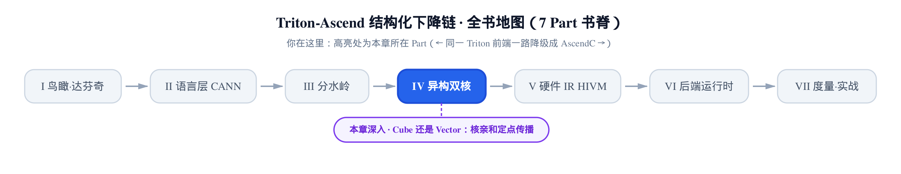
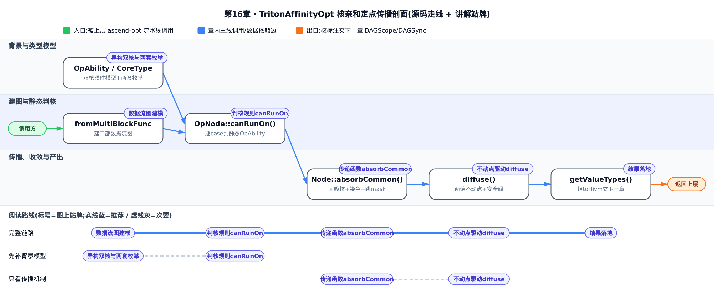
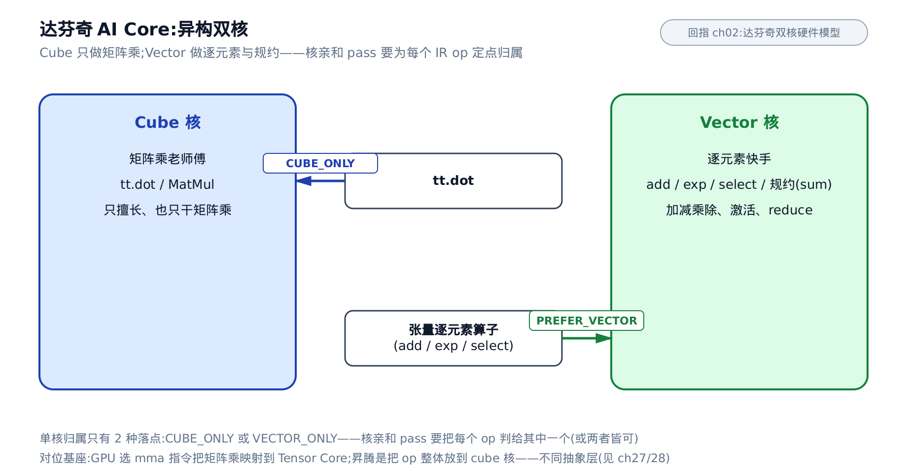
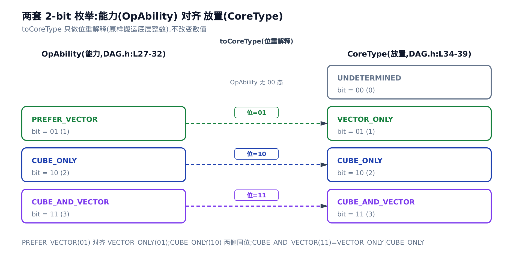
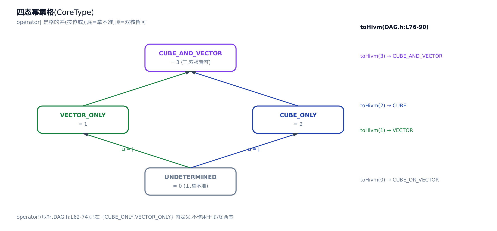
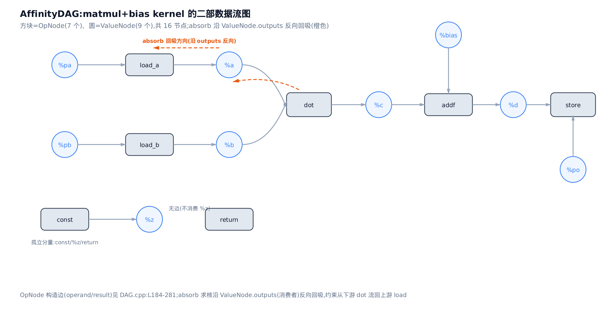
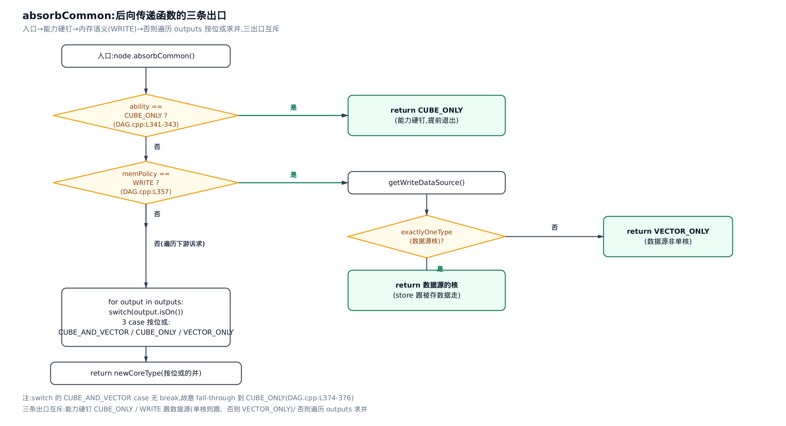
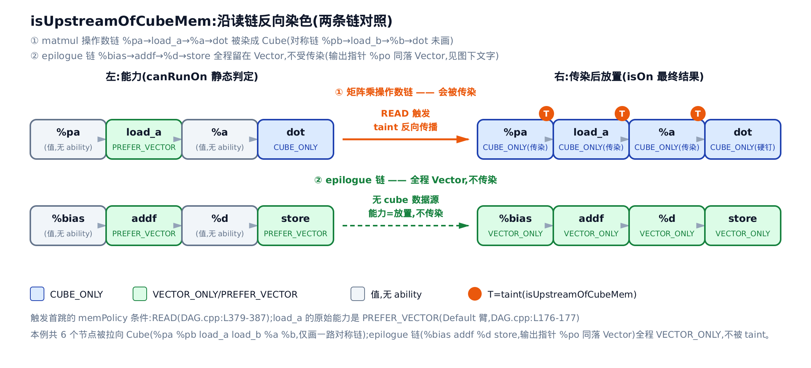
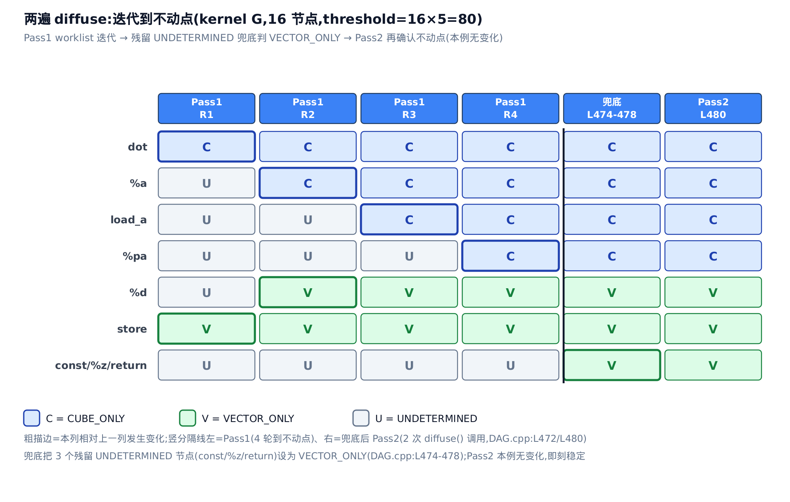

# Cube 还是 Vector：AI Core 异构双核与核亲和定点传播



> 上一章 AutoBlockify：把多个网格实例折成一条循环。
> 本章问：每个算子该落 cube 核还是 vector 核。
> 下一章：把核决策落进 IR，切 scope、插同步搬运。

拿一段最普通的 matmul 收尾 kernel 想一下：

```mlir
%a = tt.load %pa          // 读 A
%b = tt.load %pb          // 读 B
%c = tt.dot %a, %b        // 矩阵乘
%d = arith.addf %c, %bias // 加偏置（逐元素）
tt.store %po, %d          // 写回
```

（`%pa`/`%pb`/`%po`/`%bias` 都是这段 kernel 的函数参数（block parameter，即 MLIR 基本块入口处直接就位的实参），已经在寄存器/内存里、不必 `tt.load` 就能直接用——这也是为什么 `%bias` 没有对应的 load。）

昇腾的 AI Core（达芬奇架构的计算核心，见[第 2 章：达芬奇 NPU 硬件模型](../../ch02-davinci-npu-hardware-model/narrative/chapter.md)）不是一块铁板——它内部住着两个专才：**Cube**（矩阵计算单元，只擅长也只干矩阵乘）和 **Vector**（向量计算单元，做加减乘除、激活、规约这类逐元素与规约运算）。上面这段里，`tt.dot` 只能给 Cube，`arith.addf` 更适合 Vector。问题来了：**`tt.load` 该放哪个核？** 它读进来的数据马上要喂给矩阵乘，摆错核就得多搬一趟。

这就是本章主角——`TritonAffinityOpt` 子系统（`affinity` = **核亲和**，即「算子亲哪个核」，注意它与 MLIR 里的 affine 方言、多面体/仿射调度**毫无关系**，纯粹是「op 该落在哪类硬件单元上」的意思）。它是一个纯 C++ 的 MLIR pass（编译期对中间表示 IR 做的一趟变换），任务只有一件：**为函数里每个 IR op 决定它的落核归属**。

本章讲三层增量：① 异构双核怎么用两套枚举建模；② 核约束如何沿数据流用**定点传播**（fixpoint propagation，反复迭代到不再变化的那个「不动点」；下文多称「不动点」，与「定点」同义、不是「定点数」）求解；③ 判核的规则与传染路径。上一章 AutoBlockify 折的是**执行粒度**（多少逻辑实例挤一个物理块），本章定的是**执行载体**（每个 op 落哪类单元）——同属 ascend-opt 子系统的两站，互不相扰。

对位到基座那本《Triton 源码解读》：GPU 侧讲 Tensor Core 与 mma 布局优化的那两章，做的是「为矩阵乘**选一条 mma 指令**」；昇腾这里做的是「把 op **整体放到某个核**」。都跟矩阵乘硬件强相关（Cube 就是 Tensor Core 的物理近亲），但抽象层不同：一个选指令，一个放算子。

> 本章是纯 C++ 的编译器 pass，宿主机上没有 CANN 工具链编不动它，triton-ascend 树内也没有针对它的编译器测试夹具。所以下文所有数值追踪，都是**照钉版源码 `@2badfc89e` 的控制流逐行手算**得到的，不是编译器真实 dump——每处引用源码常量的数字都标了 `文件:Lxxx` 供你对眼。下文内嵌的源码均逐字截取自该钉版，仅用 `# … 省略 …` 删去与当前讨论无关的分支，不改写任何一行的内容。



图分三条泳道：上道是背景（异构双核模型与两套枚举，对应下文一~二节），中道是建图与静态判核（`fromMultiBlockFunc` 建图、`canRunOn` 判能力，三~四节），下道是传播收敛与产出（`absorbCommon` 回吸、`diffuse` 不动点、`getValueTypes` 落地，五~九节）。只想弄清一个 op 最终怎么被判给某个核，直接跳下道「传播收敛」对应的五~八节看传染怎么走；想跟完整机制，按序从上道读到下道。

---

## 一、异构双核：Cube 专做矩阵，Vector 专做逐元素

**直觉**。把一颗 AI Core 想成一个二人小作坊：Cube 是「矩阵乘老师傅」，手艺精但偏科，只会也只干矩阵乘；Vector 是「逐元素快手」，加减乘除、`exp`、`sum` 这类活儿都利索。派活看谁擅长——矩阵乘只能交 Cube，逐元素后处理交给 Vector。硬件为什么这么分、两个单元各自的流水结构，[第 2 章](../../ch02-davinci-npu-hardware-model/narrative/chapter.md)已经讲透，本章不重复，只把它当作「为什么要分核」的前提。



**机制**。单个 op 的最终落点其实只有两种「单核态」：要么 `CUBE_ONLY`（只落 cube），要么 `VECTOR_ONLY`（只落 vector）。判核规则的种子有两颗，都来自源码里最短的两条分支：

- **矩阵乘钉死 cube**。`tt.dot`（IR 里矩阵乘算子的助记名；它对应的 C++ 算子类是 `triton::DotOp`——注意二者是同一个 op 的两个名字，一个是 IR 文本名、一个是编译器里的类名）在判核里直接返回 `CUBE_ONLY`（`third_party/ascend/lib/TritonAffinityOpt/DAG.cpp:L144-L146`）。这是硬约束，谁也拉不动。
- **张量逐元素偏向 vector**。像 `arith.addf` 这种在张量上逐元素算的 op，判成 `PREFER_VECTOR`（`third_party/ascend/lib/TritonAffinityOpt/DAG.cpp:L176-L177`）——注意用词是「偏向」不是「只能」，它留了被拉走的余地，这个余地正是后面传染机制的入口。

**源码**。为什么「偏向」而非「只能」要分两个词？因为「一个 op 能跑在哪个核」和「它最终被放到哪个核」是**两码事**——下一节就把这两码事拆成两套枚举。

---

## 二、「能干」和「被派去干」是两回事：两套枚举

**直觉**。你有本事干一件活（能力），和你今天被排班去干这件活（放置），是两回事。核亲和 pass 把这两件事拆得干干净净：`canRunOn` 算的是「这个 op **能**上哪个核」，是 op 类型决定的静态本事、一次算定；而 `CoreType` 记的是「不动点最后把它**放到**哪个核」，是要沿数据流求解的动态结果。

**机制**。两个概念对应两个枚举，`OpAbility`（op 的静态能力）与 `CoreType`（op 的已决放置）：

```cpp
// third_party/ascend/include/TritonAffinityOpt/DAG.h:L27-L44
enum class OpAbility {
  PREFER_VECTOR = 1 << 0,
  CUBE_ONLY = 1 << 1,
  CUBE_AND_VECTOR = PREFER_VECTOR | CUBE_ONLY

};

enum CoreType {
  UNDETERMINED = 0,
  VECTOR_ONLY = 1 << 0,
  CUBE_ONLY = 1 << 1,
  CUBE_AND_VECTOR = VECTOR_ONLY | CUBE_ONLY
};

inline constexpr CoreType toCoreType(OpAbility ct) {
  using U = std::underlying_type_t<OpAbility>;
  return static_cast<CoreType>(static_cast<U>(ct));
}
```
（`third_party/ascend/include/TritonAffinityOpt/DAG.h:L27-L44`）

两套枚举**同底不同名**，位编码是故意对齐的：`OpAbility::PREFER_VECTOR`（位 = 1）对齐 `CoreType::VECTOR_ONLY`（位 = 1），`CUBE_ONLY` 两侧都 = 2。于是 `toCoreType` 什么都不用算，把底层整数**原样位重解释**一下，「能力」就变成了「放置」格上的一个约束值。唯一的不对称：`OpAbility` 没有 `00` 态（一个 op 总有本事跑在某处），而 `CoreType` 的 `00` 是 `UNDETERMINED`（还没判、拿不准）。



**源码**。分成两套的**收益**是：传递函数（transfer function，即第五节要讲的 `absorbCommon`——按下游诉求算出本节点该落哪个核的那个函数）可以拿「能力」当约束条件——`CUBE_ONLY` 能力硬钉、`PREFER_VECTOR` 能力可被下游拉走——而「放置」在格上自由地按位或合并。要理解「格上自由合并」，先看 `CoreType` 这个格长什么样。

### CoreType：一个只有四档的旋钮

**直觉**。把「放哪个核」想成一个只有四档的旋钮：空（`UNDETERMINED`，还没定）、只向量（`VECTOR_ONLY`）、只 cube（`CUBE_ONLY`）、两个都行（`CUBE_AND_VECTOR`）。合并两个诉求就是**按位或**：谁要 cube，合并结果就得带上 cube。空是格的底 $`\bot`$，两个都行是格的顶 $`\top`$。



**机制**。`CoreType` 是下面这个 2-bit 幂集格，偏序 $`\sqsubseteq`$ 是位包含、并 $`\sqcup`$ 就是 `operator|`（按位或）：

```math
\{\,\varnothing,\ \{V\},\ \{C\},\ \{V,C\}\,\}
```

格上还挂了三个工具函数：

```cpp
// third_party/ascend/include/TritonAffinityOpt/DAG.h:L62-L98
inline CoreType operator!(CoreType ct)
{
    CoreType newCt = UNDETERMINED;
    if ((ct & CoreType::CUBE_ONLY) == UNDETERMINED) {
        newCt = newCt | CoreType::CUBE_ONLY;
    }

    if ((ct & CoreType::VECTOR_ONLY) == UNDETERMINED) {
        newCt = newCt | CoreType::VECTOR_ONLY;
    }

    return newCt;
}

inline hivm::TCoreType toHivm(CoreType ct)
{
    switch (ct) {
        case UNDETERMINED:
            return hivm::TCoreType::CUBE_OR_VECTOR;
        case CUBE_ONLY:
            return hivm::TCoreType::CUBE;
        case VECTOR_ONLY:
            return hivm::TCoreType::VECTOR;
        case CUBE_AND_VECTOR:
            return hivm::TCoreType::CUBE_AND_VECTOR;
        default:
            llvm_unreachable("Invalid CoreType that cannot convert to hivm");
    }
}

# … 省略：intersects(OpAbility, CoreType) 重载（L92-94），与 L54-56 的 intersects(CoreType, CoreType) 是不同重载，同属相交判定，与本节讨论的格运算无关 …

inline bool exactlyOneType(CoreType ct) {
  return (ct == CUBE_ONLY) || (ct == VECTOR_ONLY);
}
```
（`third_party/ascend/include/TritonAffinityOpt/DAG.h:L62-L98`，其上的 `operator|` / `operator&` / `intersects` 是标准的格并、格交与相交判定，此处省略）

三个函数各管一件事：`operator!` 是这个 2-bit 域上完整的位补运算——两个单核态互补（`CUBE_ONLY` ↔ `VECTOR_ONLY`），顶与底也互补对调（`UNDETERMINED` ↔ `CUBE_AND_VECTOR`），不是只在单核态之间起作用；`exactlyOneType` 判「是否恰好落单核」，后面写操作定核要用它；`toHivm` 是本 pass 结果对外的**唯一出口**——它把内部 `CoreType` 翻成 HIVM 方言（AscendNPU-IR 的底层方言，见术语表）的 `hivm::TCoreType`，特别地把 `UNDETERMINED` 翻成 `CUBE_OR_VECTOR`（拿不准就交给下游两核都可）。

**源码**。格和格上运算备齐了，`operator|` 是合并约束的工具、`toHivm` 是收尾的出口。但格本身不会自己动——得有规则往格里塞值。第一批值来自静态判核规则 `canRunOn`。

---

## 三、判核规则 canRunOn：一次算定的静态能力

**直觉**。先别管数据流，就问每种活儿「能在哪个核上干」：矩阵乘只有 Cube 干得了（专用硬件）；逐元素加减 Cube/Vector 都行但更适合 Vector；纯标量的索引运算谁都能干；控制流（`scf` 方言的 `if`/`for`，是结构不是算子）不占核。这是**纯静态**的一次判定，还没决定最终放哪。

**机制**。`canRunOn` 逐 case 给每个 op 一个 `OpAbility`。下表把它的每条出口都走一遍（`arith.select` 的标量/张量两分支、`Default` 的张量/全标量两结局都覆盖到）：

<!-- trace: m4-judge-rules-canRunOn -->

| # | op（IR 名） | 命中分支（源码行） | 关键判定 | OpAbility 返回 |
|---|-----------|------------------|----------|----------------|
| 1 | `scf.for` | scf 早返回 L140-142 | `opIsScf(op)`==true | CUBE_AND_VECTOR |
| 2 | `tt.dot`  | DotOp 臂 L144-146 | 是 triton::DotOp | **CUBE_ONLY** |
| 3 | `arith.constant` | 常量流臂 L147-149 | Case<arith::ConstantOp,...> | CUBE_AND_VECTOR |
| 4 | `tt.trans` | 常量流臂 L147-149 | Case<...,triton::TransOp,...> | CUBE_AND_VECTOR |
| 5 | `arith.select`（cond=`tensor<...xi1>`） | SelectOp 臂 L150-155 | `valueIsScalar(cond)`==false | **PREFER_VECTOR** |
| 6 | `arith.select`（cond=`i1` 标量） | SelectOp 臂 L150-155 | `valueIsScalar(cond)`==true | CUBE_AND_VECTOR |
| 7 | `tt.load` → `tensor<128x128xf16>` | Default 臂 L156-181 | result 非标量→isVector=true | PREFER_VECTOR |
| 8 | `arith.addi`（全 `i32` 标量） | Default 臂 L156-181 | 全 operand/result 标量→isVector=false | CUBE_AND_VECTOR |

`OpAbility` 一共只有 3 种取值（`PREFER_VECTOR` / `CUBE_ONLY` / `CUBE_AND_VECTOR`），`canRunOn` 的结构是 **1 条 scf 早返回 + 4 条 TypeSwitch 臂**（`triton::DotOp` 臂 / 4 类常量流臂 / `arith::SelectOp` 臂 / `Default` 臂）。

**源码**。下面是 `canRunOn` 全文（`canRunOn` 是绑定在每个算子节点——即下一节要正式介绍的 `OpNode`——上的成员方法，这里先只看它怎么判 op 的能力）。**声明**：`Default` 臂里原本还有两处判 tensor-of-ptr（元素类型是指针的张量）的分支，在钉版源码里被 `//` 注释掉了（`third_party/ascend/lib/TritonAffinityOpt/DAG.cpp:L160-L162` 与 `L169-L171` 的 `// if (valueIsTensorOfPtr(...)) return SCALAR;`），当前不生效，下面**如实删去**这两处，以免读者误以为它们在跑：

```cpp
// third_party/ascend/lib/TritonAffinityOpt/DAG.cpp:L139-L182
OpAbility OpNode::canRunOn() const {
  if (opIsScf(op)) {
    return OpAbility::CUBE_AND_VECTOR;
  }
  return llvm::TypeSwitch<Operation*, OpAbility>(op)
    .Case<triton::DotOp>([](auto) {
      return OpAbility::CUBE_ONLY;
    })
    .Case<arith::ConstantOp, triton::AdvanceOp, triton::TransOp, annotation::MarkOp>([](auto) {
      return OpAbility::CUBE_AND_VECTOR;
    })
    .Case<arith::SelectOp>([](arith::SelectOp op) {
      // when cond is vector, selectOp should be vector, otherwise scalar
      return (
        valueIsScalar(op.getCondition()) ? OpAbility::CUBE_AND_VECTOR : OpAbility::PREFER_VECTOR
      );
    })
    .Default([](Operation* op) {
      auto isVector = false;
      for(auto operand : op->getOperands()) {
        if (!valueIsScalar(operand)) {
          isVector = true;
        }
      }

      for(auto result : op->getResults()) {
        if (!valueIsScalar(result)) {
          isVector = true;
        }
      }

      if (isVector) {
        return OpAbility::PREFER_VECTOR;
      }

      return OpAbility::CUBE_AND_VECTOR;
    });
}
```
（`third_party/ascend/lib/TritonAffinityOpt/DAG.cpp:L139-L182`）

逐段读：`scf` op 一律早返回 `CUBE_AND_VECTOR`（控制流是结构，双核都能承载，绝不误钉某核去阻断传染）；`triton::DotOp` 硬返回 `CUBE_ONLY`；`arith.constant` / `tt.advance` / `tt.trans` / `annotation.mark` 四类判 `CUBE_AND_VECTOR`；`arith.select` 看条件是不是标量——标量条件双核皆可、张量条件（逐元素选择）偏向 vector；其余全部落 `Default` 臂：任一 operand 或 result 非标量（即张量）就 `PREFER_VECTOR`，全是标量才 `CUBE_AND_VECTOR`。

「标量 vs 张量」怎么判？靠底层谓词 `valueIsScalar`：

```cpp
// third_party/ascend/lib/TritonAffinityOpt/DAG.cpp:L109-L137
bool valueIsScalar(Value value) {
  auto type = value.getType();

  if (type.isIntOrIndexOrFloat()) {
    return true;
  }

  if (auto tensorType = llvm::dyn_cast<RankedTensorType>(type)) {
    return tensorType.getRank() == 0;
  }

  if (auto _ = llvm::dyn_cast<triton::PointerType>(type)) {
    return true;
  }

  return false;
}

# … 省略：valueIsTensorOfPtr（判元素类型为指针的张量），其唯一调用点在 canRunOn 的
#     Default 臂里已被注释掉，当前不参与判核，此处不展开 …
```
（`third_party/ascend/lib/TritonAffinityOpt/DAG.cpp:L109-L137`）

`i32`/`index`/`f32` 是标量；rank-0 张量算标量；标量指针 `!tt.ptr` 算标量；其余（rank≥1 的张量）判非标量，即向量候选。

**不变量**。`canRunOn` 是 op 类型的**纯函数**：无内部状态、不读放置结果，同一 op 多次调用返回同一 ability，且对**任意** op 都有返回值。这个全覆盖不是靠「把所有 op 类型枚举穷举」——前三臂没命中的一律落 `Default` 臂兜底返回。是 `Default` 兜住了尾巴，不是清单列全了所有 op。

---

## 四、把 IR 画成数据流图

**直觉**。要沿数据流求解，先得把 IR 画成一张图。每个算子是一个「工序节点」`OpNode`，每个中间值是一个「零件节点」`ValueNode`。零件记得自己「谁造的」（`source`，定义它的 op）和「谁要用」（`outputs`，消费它的 op）。求核时沿「谁要用」**往回吸**——下游要 cube，上游就得往 cube 靠。这是**后向**数据流（方向从消费者指回生产者；下文的「反向回吸」「反向染色」说的都是这同一个方向）。



上图用的就是本章开头那段 matmul+bias kernel（记作 kernel G，形状 128×128 只是示意、与核决策无关）。它建出 **16 个节点**：4 个 block 参数值（`%pa`/`%pb`/`%po`/`%bias`）+ 7 个 op（`load_a`/`load_b`/`dot`/`addf`/`store`/`const`/`return`）+ 5 个 op 结果值（`%a`/`%b`/`%c`/`%d`/`%z`）。这里要提醒一句：开头那段精简 IR 只列了 5 条语句，并没有常量定义、也没有终止符；为了在第八节完整演示「残留 `UNDETERMINED` 被兜底成 `VECTOR_ONLY`」这一步，这里给 kernel G 额外挂了一个不参与 matmul 的孤立 `arith.constant`（记作 `const`，其结果值 `%z`）和函数体末尾必有的终止符 `return`——这三个节点在开头的精简展示里被省略，但建图与后文计数都要计入。方块是 `OpNode`、圆是 `ValueNode`；实线是 operand/result 构造边，橙色箭头示意求核时 `absorb` 沿消费者反向回吸的方向——约束从下游 `dot` 流回上游 `load`。

**机制**。节点的公共骨架在基类 `Node`：

```cpp
// third_party/ascend/include/TritonAffinityOpt/DAG.h:L176-L223
class Node : MoveOnly {
protected:
  friend class Graph;
  friend class ValueNode;
  bool isUpstreamOfCubeMem = false;
  virtual CoreType absorbImpl() = 0;
  llvm::SmallVector<Node*, 4> outputs;

public:
  CoreType isOnPrivate = UNDETERMINED;

  inline CoreType isOn() const {
    return isOnPrivate;
  }

  bool absorb() {
    auto newCoreType = absorbImpl();
    auto changed = newCoreType != isOnPrivate;
    isOnPrivate = newCoreType;

    return changed;
  };

  virtual llvm::SmallVector<Node*, 4> getAffected() const = 0;
  virtual OpNode* getSourceOpNode() = 0;

  ArrayRef<Node*> getOutputs() const {
    return outputs;
  }

  CoreType absorbCommon();

  # … 省略：NodeKind 枚举 / getKind() / 构造样板 …
};
```
（`third_party/ascend/include/TritonAffinityOpt/DAG.h:L176-L223`）

三个字段是全章的核心状态：`isOnPrivate` 是当前已决核（`CoreType` 格上的值，初值 `UNDETERMINED`）；`isUpstreamOfCubeMem` 是一个**传染标记**，意思是「我位于喂给 cube 内存的上游」（下一节主角）；`outputs` 是下游节点表。`absorb()` 是单步迭代单元：跑一次 `absorbImpl()` 算出新核，跟旧值比对，写回，返回**是否变化**——第八节的 worklist（`diffuse` 用来调度迭代顺序的待处理队列，这里只需知道它靠这个布尔返回值决定谁要被重新计算）就靠这个布尔值决定要不要唤醒邻居。`absorbImpl` 是抽象的，`OpNode` 和 `ValueNode` 各自实现，具体逻辑都汇到公共的 `absorbCommon`。

连边由 `OpNode` 构造器建立（`third_party/ascend/lib/TritonAffinityOpt/DAG.cpp:L184-L281`）：每个 operand 连一条 input 边（并把自己记进那个 `ValueNode` 的 `outputs`）、每个 result 连一条 output 边（`source` 指向自己）；遇到 `scf.if`/`scf.for` 这类带 region 的 op（实现了 `RegionBranchOpInterface`），还会递归建子图、跨区连 `yield`/`iter_arg` 的边，让核约束能穿过控制流边界。

**源码**。图建好了，每个节点有了 `outputs`（下游）和 `source`（上游）。真正把核「吸」进来的，是 `absorbImpl` 背后的传递函数 `absorbCommon`。

---

## 五、传递函数 absorbCommon：从下游回吸核

**直觉**。一个节点该放哪个核，不看它自己想干嘛，看它「下游消费者」要它在哪：矩阵乘死活要 cube（能力硬钉）；存操作跟着被存的数据走；其余把所有下游的诉求**按位或**起来。这三句话就是 `absorbCommon` 的三条出口。



**机制**。先看代码，再逐条对应：

```cpp
// third_party/ascend/lib/TritonAffinityOpt/DAG.cpp:L323-L399
CoreType Node::absorbCommon() {

  auto sourceNode = getSourceOpNode();
  auto op = sourceNode ? sourceNode->op : nullptr;

  if (!sourceNode || !op) {
    CoreType newCoreType = isOnPrivate;
    for(auto output : outputs) {
      newCoreType = newCoreType | output->isOn();
      isUpstreamOfCubeMem = isUpstreamOfCubeMem || output->isUpstreamOfCubeMem;
    }
    return newCoreType;
  }

  CoreType newCoreType = sourceNode->isOn();

  OpAbility ability = sourceNode->canRunOn();

  if (ability == OpAbility::CUBE_ONLY) {
    return CUBE_ONLY;
  }

  auto memIface = llvm::dyn_cast<MemoryEffectOpInterface>(op);
  auto memPolicy = MemPolicy::NONE;

  if (memIface) {
    # … 省略：一句关于 policy 可依 shape/输入输出进一步改进的开发者注记，不影响控制流 …
    if (memIface.hasEffect<MemoryEffects::Write>()) {
      memPolicy = MemPolicy::WRITE;
    } else if (memIface.hasEffect<MemoryEffects::Read>()) {
      memPolicy = MemPolicy::READ;
    }
  }

  if (memPolicy == MemPolicy::WRITE) {
    if (auto data = getWriteDataSource(sourceNode)) {
      auto currCt = data->isOn();
      if (exactlyOneType(currCt)) {
        if (currCt == CUBE_ONLY) {
          isUpstreamOfCubeMem = true;
        }
        return currCt;
      }
    }

    // data is not cube_only
    return VECTOR_ONLY;
  }

  for(auto output : outputs) {
    switch (output->isOn()) {
      case CUBE_AND_VECTOR:
        newCoreType = newCoreType | VECTOR_ONLY;
        // not breaking the switch because we need to handle cube
      case CUBE_ONLY:
        if (
          ability != OpAbility::PREFER_VECTOR ||
          output->isUpstreamOfCubeMem ||
          memPolicy == MemPolicy::READ
        ) {
          isUpstreamOfCubeMem = (
            isUpstreamOfCubeMem ||
            output->isUpstreamOfCubeMem ||
            memPolicy == MemPolicy::READ
          );
          newCoreType = newCoreType | CUBE_ONLY;
        }
        break;
      case VECTOR_ONLY:
        newCoreType = newCoreType | VECTOR_ONLY;
      default: // UNDETERMINED, skip
        break;
    };
  }

  return newCoreType;
}
```
（`third_party/ascend/lib/TritonAffinityOpt/DAG.cpp:L323-L399`）

逐段拆：

1. **无 source（block 参数/图边界）**：没有定义它的 op，就纯粹把所有下游的核并进来（`newCoreType | output->isOn()`），并把下游的传染标记也析取过来。block 参数（如指针 `%pa`）就走这条。
2. **有 source**：起点取当前值，算出 `ability`。若能力是 `CUBE_ONLY`——直接返回 `CUBE_ONLY`（这是矩阵乘的硬钉出口，压根不进后面的循环）。
3. **定 memPolicy**：按 op 的 `MemoryEffect`（MLIR 的内存副作用接口）判 `WRITE`/`READ`/`NONE`。
4. **WRITE 出口**：写操作（`tt.store`）的核跟随「被写的数据」——`getWriteDataSource` 取到数据源，若它恰好落单核（`exactlyOneType`）就跟它走（若是 cube，顺手给自己打上 `isUpstreamOfCubeMem`）；否则退回 `VECTOR_ONLY`。
5. **遍历 outputs 出口**：把每个下游的诉求按位或进来。`CUBE_AND_VECTOR` 的 case **故意不写 `break`**（源码注释 `// not breaking...`），fall-through 到 `CUBE_ONLY` 一起处理；`CUBE_ONLY` 这个 case 有个守卫——只有当「本 op 能力不是 `PREFER_VECTOR`，**或**下游已被传染，**或**本 op 是读」时，才把 `CUBE_ONLY` 并进来并传染标记。这个守卫就是下一节的传染门。

两个 `absorbImpl` 只是薄壳，把 `scf` 特判掉、其余都委托给 `absorbCommon`：

```cpp
// third_party/ascend/lib/TritonAffinityOpt/DAG.cpp:L401-L419
CoreType OpNode::absorbImpl() {
  if (opIsScf(op)) {
    return CUBE_AND_VECTOR;
  }

  auto newCoreType = absorbCommon();

  # … 省略：canRunOn==CUBE_AND_VECTOR 时并入 inputs 的 4 行实验代码，钉版已被注释、不生效 …

  return newCoreType;
}

CoreType ValueNode::absorbImpl() {
  return absorbCommon();
}
```
（`third_party/ascend/lib/TritonAffinityOpt/DAG.cpp:L401-L419`）

**逐轮数值推演**。拿 kernel G 走几步，把三条出口都触发一遍（`taint` 列 = 该节点求值后 `isUpstreamOfCubeMem` 是否置位）：

<!-- trace: m6-transfer-function-absorb -->

| 轮 | 求值节点 | source/ability | memPolicy | 命中分支（源码行） | 读到的 outputs 状态 | 返回 CoreType | taint |
|----|---------|----------------|-----------|-------------------|--------------------|--------------|-------|
| R1 | dot | dot / CUBE_ONLY | — | 能力硬钉 return CUBE_ONLY L341-343 | （未进 output 循环） | CUBE_ONLY | F |
| R1 | store | store / PREFER_VECTOR | WRITE | WRITE 分支 L357-370；数据源 %d=UNDETERMINED，非单核 | %d=UNDETERMINED | VECTOR_ONLY | F |
| R2 | %a | load_a / PREFER_VECTOR | READ | output 遍历 case CUBE_ONLY L377；条件靠 memPolicy==READ 命中 L379-388 | dot=CUBE_ONLY | CUBE_ONLY | T |
| R2 | %d | addf / PREFER_VECTOR | NONE | output 遍历 case VECTOR_ONLY L391-392 | store=VECTOR_ONLY | VECTOR_ONLY | F |
| R3 | store | store / PREFER_VECTOR | WRITE | WRITE 分支 L357-365；数据源 %d=VECTOR_ONLY 单核 | %d=VECTOR_ONLY | VECTOR_ONLY | F |

读法：`dot` 走能力硬钉、`store` 走 WRITE（第一轮 `%d` 还没定、退回 vector，等 `%d` 稳定成 vector 后 R3 跟它走稳）、`%a` 走 outputs 遍历被 READ 条件拉成 cube、`%d` 走 outputs 遍历随 `store` 判 vector——三条出口全覆盖。

**不变量**。`absorbCommon` **恰有三条返回路径**（① 能力硬钉 `CUBE_ONLY` ② WRITE 跟数据源 ③ 遍历 outputs 求并），任意节点求值必走其一、必返回一个 `CoreType`。但要**诚实标注**：这个传递函数**不是纯单调 join**——WRITE 分支（L357-370）是**覆盖式**返回数据源的核，不并入本节点旧值，所以不保证在格上单调上升，不能宣称严格单调收敛证明。整体收敛靠 diffuse 的硬上限兜底（第八节讲），不靠理论单调性。

**源码**。三条出口里最微妙的是第五节那个「守卫」：`PREFER_VECTOR` 的 op 明明偏向 vector，怎么会被下游拉成 cube？这就是核亲和最关键的传染机制。

---

## 六、isUpstreamOfCubeMem：喂给 cube 的读链被反向染色

**直觉**。矩阵乘要用的操作数，得摆在 cube 手边，不然每次搬运太贵。所以「喂给 cube 的那条读取链」——`load` 以及算它地址的那串 op——哪怕本来更适合 vector，也会被一路「染色」拉到 cube。染色只会加深、不会褪色。



**机制**。染色的载体就是 `isUpstreamOfCubeMem` 这个布尔标记，它的传播逻辑就藏在上一节那段 `absorbCommon` 的 outputs 遍历里（`third_party/ascend/lib/TritonAffinityOpt/DAG.cpp:L357-L396`）。它的首跳发生在那个守卫的第三个条件 `memPolicy == MemPolicy::READ`：一个 `load`（READ）的下游若是 cube，就满足守卫、把自己拉成 cube 并打上 taint。之后这个 taint 沿 use-def 链**反向**逐跳传上去（下游 taint 为真也能命中守卫的 `output->isUpstreamOfCubeMem` 条件），一直传到算地址的 block 参数。

**逐轮数值推演**。沿 kernel G 的一条操作数链 `dot → %a → load_a → %pa` 看 taint 怎么反向爬：

<!-- trace: m7-isUpstreamOfCubeMem-taint -->

| 轮 | 节点 | 触发 taint 的条件（源码行） | isOn 变化 | taint（isUpstreamOfCubeMem） |
|----|------|---------------------------|-----------|------------------------------|
| R1 | dot | 能力 CUBE_ONLY 早返回 L341-343，不进 output 循环 | → CUBE_ONLY | F（dot 自身不被 taint） |
| R2 | %a | output=dot=CUBE_ONLY，条件 memPolicy==READ 命中 L381/L386 | UNDETERMINED → CUBE_ONLY | F → T |
| R3 | load_a | output=%a 的 isUpstreamOfCubeMem==T 命中 L380/L385 | UNDETERMINED → CUBE_ONLY | F → T |
| R4 | %pa | 无 source 分支：isUpstreamOfCubeMem \|= load_a.taint L332 | UNDETERMINED → CUBE_ONLY | F → T |

注意一个细节：`dot` 本身 **taint = F**。它是能力硬钉、走早返回出口，压根没进 output 循环去置标记；被染色的是它上游那条读链。首跳靠 `READ` 触发（`%a` 是 `load_a` 的结果、`load_a` 是 READ），此后靠下游 taint 为真接力。

**不变量**。`isUpstreamOfCubeMem` **单调递增**：一旦置 `true` 便不再回退。三处赋值——无 source 分支（L332）与 outputs 遍历分支（L383-387）写成显式析取 `taint = taint || ...`；WRITE 分支（数据源恰为 `CUBE_ONLY` 时，L362）是直接赋值 `= true`，但赋 `true` 恒不小于原值——合起来在布尔格 $`\{F \sqsubset T\}`$ 上只升不降。每个节点至多翻转一次 `F → T`，节点数有限，所以 taint 传播必在有限步稳定——与 `isOn` 的求核迭代同步收敛。

本例里 taint 沿 `dot → %a → load_a → %pa` 反向三跳，把 matmul 两路操作数链共 **6 个节点**（`%pa` `%pb` `load_a` `load_b` `%a` `%b`）拉成 `CUBE_ONLY`，其中原本 `PREFER_VECTOR` 能力的 `load_a`/`load_b` 被强行改到 cube。而 epilogue 那条链（`%bias → addf → %d → store`，加上输出指针 `%po`）没有 cube 数据源，全程留在 `VECTOR_ONLY`，不被传染。

**源码**。这解释了为什么核决策**不能一遍前向扫定死**——约束是从消费者回吸的，`load` 的核取决于它下游是不是矩阵乘。而 WRITE 出口里那个 `getWriteDataSource`，还藏着一个「跳过 mask」的小规则。

---

## 七、store 核跟随数据源：跳过 i1 mask

**直觉**。存东西这个动作本身不挑核，它该待在「算出被存数据」的核旁边。`tt.store` 的三个操作数里，第一个是「存到哪」（地址），可能还有个 mask（存不存的开关），都不是数据；跳过它们，剩下第一个非 bool 的才是真要存的货。

**机制**。这条规则就是 `getWriteDataSource`：

```cpp
// third_party/ascend/lib/TritonAffinityOpt/DAG.cpp:L305-L315
ValueNode* getWriteDataSource(OpNode* op) {
  auto inputRange = op->getInputs();
  for(auto node : inputRange.drop_front()) {
    auto typ = getElementTypeOrSelf(node->value);
    if (!typ.isInteger(1)) {
      return node;
    }
  };

  return nullptr;
}
```
（`third_party/ascend/lib/TritonAffinityOpt/DAG.cpp:L305-L315`）

`drop_front()` 跳过第一个 operand（约定是写入目标/地址），在其余 input 里找第一个 element 类型非 `i1`（`i1` = 1 位整数 = bool = mask）的值返回；全是 `i1` 或没有就返回 `nullptr`。判 `i1` 用 `getElementTypeOrSelf(...).isInteger(1)`（取张量的元素类型，标量则取自身）。

**逐 case 推演**：

<!-- trace: m8-write-datasource -->

| # | store 形态（operands 顺序） | drop_front 后逐个看 | 命中（返回） | 后续 WRITE 分支结局 |
|---|---------------------------|---------------------|-------------|------------------------------|
| 1 | `tt.store %po, %d`；[ptr, f32 张量] | [%d]：f32≠i1 ✓ | 返回 **%d** | %d 单核则 store 跟 %d，否则 VECTOR_ONLY |
| 2 | `tt.store %po, %d, %mask`；[ptr，f32 张量，i1 张量] | [%d, %mask]：%d f32≠i1 先命中 | 返回 **%d**（mask 未看到就已返回） | mask 不参与定核 |
| 3 | `tt.store %po, %pred, %mask`；[ptr，i1 张量，i1 张量] | [%pred, %mask]：i1 跳、i1 跳、耗尽 | 返回 **nullptr**（L314） | 数据源为空 → return VECTOR_ONLY（L369） |

case 2 是关键：mask 排在数据**之后**，遇到数据先返回，循环根本走不到 mask——这就是「跳过 mask」的实现方式。case 3 是个诚实的边界：被存的数据本身就是 bool 谓词张量（元素类型 `i1`）时，它会和 mask 一样被判真跳掉，最后返回空、store 退回判 `VECTOR_ONLY`。也就是说「存 bool 数据」这种少见情形下 store 一律落 vector——`i1` 判定分不清「是 mask 还是本来就是 bool 数据」。

**不变量**。`getWriteDataSource` 在有限步必返回：要么中途命中第一个非 `i1` operand，要么走完列表返回 `nullptr`。终止来自 operand 列表有限，不构成迭代不动点问题、没有收敛性负担。

**源码**。`getWriteDataSource` 只是 WRITE 出口里的取数细节。真正把前面这些传递函数反复驱动到收敛的，是下一节的 `diffuse` 迭代器。

---

## 八、不动点驱动 diffuse：两遍 + 兜底 + 安全阀

**直觉**。核约束像染料在管网里扩散：cube 从矩阵乘往上游渗，vector 从兜底默认往下游渗，你来我往得反复涮几遍才稳。涮一遍不够（还有节点没被染到），先把这些「没主」的默认判给最省的 vector，再涮第二遍让默认值继续扩散，直到没人再变色。

**机制**。驱动器是一个 lambda `diffuse` 加两遍策略：

```cpp
// third_party/ascend/lib/TritonAffinityOpt/DAG.cpp:L452-L481
  auto diffuse = [&]() {
    // Not sure if determinism is required
    llvm::SmallSetVector<Node*, 16> worklist(nodes.begin(), nodes.end());

    size_t threshold = worklist.size() * 5;

    for(size_t i = 0; i< threshold; i++) {
      if (worklist.empty()) {
        break;
      }

      auto node = worklist.pop_back_val();

      if (node->absorb()) {
        auto affected = node->getAffected();
        worklist.insert(affected.begin(), affected.end());
      }
    }
  };

  diffuse();

  for(auto node : nodes) {
    if (node->isOn() == UNDETERMINED) {
      node->isOnPrivate = VECTOR_ONLY;
    }
  }

  diffuse();
```
（`third_party/ascend/lib/TritonAffinityOpt/DAG.cpp:L452-L481`，其后一整段仅打印调试信息、不改结果，省略）

`diffuse` 把全部节点塞进 `SmallSetVector`（自动去重的 worklist），每轮 `pop` 一个节点跑 `absorb()`；若核**变化**，就把 `getAffected()`（受影响的邻居——inputs+outputs 或 outputs+source）重排回 worklist。三步走：先 `diffuse` 一遍；再把仍 `UNDETERMINED` 的节点**兜底**成 `VECTOR_ONLY`（拿不准就放最省的向量核）；最后再 `diffuse` 一遍，让这批默认值继续沿数据流传染到不动点。

`threshold = worklist.size() * 5` 是一道**安全阀**：worklist 靠「核变化才重排」自然收敛，但上一节说过传递函数不是纯单调 join（WRITE 覆盖式返回），万一遇到病态输入不收敛，这个硬上限强制退出、不至于死循环。



**逐轮数值推演**。kernel G 有 16 个节点，`threshold = 16 × 5 = 80`。整个求解过程：

<!-- trace: m9-fixpoint-diffuse -->

| 阶段/轮 | dot | %a | load_a | %pa | %d | store | const/%z/return | worklist 动作 |
|---------|-----|----|--------|-----|-----|-------|-----------------|---------------|
| Pass1 R1 | CUBE_ONLY | U | U | U | U | VECTOR_ONLY | U | dot/store/%c 先定，唤醒邻居 |
| Pass1 R2 | CUBE_ONLY | CUBE_ONLY | U | U | VECTOR_ONLY | VECTOR_ONLY | U | %a/%b 被 READ 拉向 cube，%d 判 vector |
| Pass1 R3 | CUBE_ONLY | CUBE_ONLY | CUBE_ONLY | U | VECTOR_ONLY | VECTOR_ONLY | U | load_a/load_b 随 %a taint 转 cube |
| Pass1 R4 | CUBE_ONLY | CUBE_ONLY | CUBE_ONLY | CUBE_ONLY | VECTOR_ONLY | VECTOR_ONLY | U | 地址 block-arg 转 cube；R5 无变化=不动点 |
| 兜底 L474-478 | CUBE_ONLY | CUBE_ONLY | CUBE_ONLY | CUBE_ONLY | VECTOR_ONLY | VECTOR_ONLY | UNDETERMINED→VECTOR_ONLY | 3 个残留 U 节点默认判 vector |
| Pass2 L480 | CUBE_ONLY | CUBE_ONLY | CUBE_ONLY | CUBE_ONLY | VECTOR_ONLY | VECTOR_ONLY | VECTOR_ONLY | 再 diffuse：本例无有下游的默认节点，即刻稳定 |

Pass1 约 4 轮到不动点：matmul 链（`dot` 及被 taint 拉过去的 `%a`/`load_a`/`%pa` 等）沿传染定到 cube，epilogue（`%d`/`store`）定到 vector。此时还剩 3 个孤立标量节点（`const`/`%z`/`return`，没有需要 cube 的下游）残留 `UNDETERMINED`；兜底把它们判成 `VECTOR_ONLY`。

**为什么要第二遍？** 因为兜底出的默认值本身还可能作为**别人的下游**继续影响传染。**诚实说明**：本 kernel 里 pass2 恰好没改动任何「有下游」的节点——这 3 个兜底节点都没有下游消费者，它们的 `V` 传不出去。pass2 的存在是为了处理那些「确实有下游、又落到兜底默认」的情形，本例只是没触发那条路径。

**不变量**。`diffuse` 必在有限步停。两道防线：① 除 WRITE 覆盖分支外，核在四元格 $`\{U, V, C, CV\}`$ 上按位或只增，格高为 2，每节点至多升两步 $`U \to \cdots \to CV`$，变化次数有界；② 即便 WRITE 覆盖分支破坏单调，`for(i < threshold)` 也把迭代截断在 `threshold = 节点数 × 5`——不收敛也强制退出。所以必然终止。

**理论谱系**。这套「节点反复应用传递函数、变则唤醒邻居、迭代到不动点」的 worklist 算法，属经典的单调数据流分析框架（可追到 Kildall 1973 年那篇《A unified approach to global program optimization》）。但要**如实标注边界**：教科书框架要求传递函数在格上单调、以此保证收敛；本实现的 WRITE 分支是覆盖式返回、并不满足严格单调，所以代码没依赖理论收敛，而是用 `threshold` 硬上限兜底。理论谱系可以点出，严格单调收敛证明这里**不成立**，不宜硬套。

**源码**。不动点求完，每个节点的 `isOnPrivate` 就是最终核。这份 `Value → CoreType` 标注怎么导出、谁来接手，下一节收尾交接。

---

## 九、结果落地：交给下沉链

**直觉**。核决策算完了，这份结果由谁串起来、又交给谁接手？

前面所有工序，都由对外入口 `Graph::fromMultiBlockFunc` 串起来（`third_party/ascend/lib/TritonAffinityOpt/DAG.cpp:L421-L532`）：建 dummy 图 + 逐 block 建子图 → 两遍 `diffuse` 求不动点 → 把结果落到每个节点的 `isOnPrivate`。之后 `Graph::getValueTypes()` 把整张图的核标注导成一个 `DenseMap<Value, CoreType>`，经 `toHivm` 翻成 HIVM 方言的 `hivm::TCoreType`（`UNDETERMINED` 若残留就落 `CUBE_OR_VECTOR`）对外。

拿到这份核标注的是**下一章**的主角：`DAGScope` 按核把 op 切进 vector-scope / cube-scope、打上 `hivm::TCoreTypeAttr` 属性（`third_party/ascend/lib/TritonAffinityOpt/DAGScope.cpp:L140-L148`），`DAGSync` 在跨核边界插同步搬运。而 `GraphManager`（一个按函数名注册/取回已建图的单例）保证这几个 pass 复用**同一张图**、不重复建图。核亲和 pass 到此收工——它只回答「每个 op 落哪个核」，不负责怎么落。

---

## 小结

核亲和 pass 一次执行的时间线，回头串一遍：

1. **建图**：`fromMultiBlockFunc` 把函数建成二部数据流图，`OpNode` 持 inputs/outputs、`ValueNode` 持 source/outputs，`scf` 子图跨区连边（`third_party/ascend/lib/TritonAffinityOpt/DAG.cpp:L184-L281`）。
2. **静态判核**：`canRunOn` 给每个 op 一个 `OpAbility`——`tt.dot` 硬钉 `CUBE_ONLY`、张量逐元素 `PREFER_VECTOR`、`scf`/常量流 `CUBE_AND_VECTOR`，靠 `Default` 兜底做到全覆盖（`third_party/ascend/lib/TritonAffinityOpt/DAG.cpp:L139-L182`）。
3. **后向传播**：`absorbCommon` 三条出口——能力硬钉 / WRITE 跟数据源（跳 i1 mask）/ 遍历 outputs 按位或；`isUpstreamOfCubeMem` 沿「喂 cube 的读链」反向染色，把 `PREFER_VECTOR` 的 load 拉向 cube（`third_party/ascend/lib/TritonAffinityOpt/DAG.cpp:L323-L399`）。
4. **两遍不动点**：`diffuse` worklist 迭代到不动点 → 残留 `UNDETERMINED` 兜底 `VECTOR_ONLY` → 再 `diffuse`；`threshold = 节点数 × 5` 作安全阀（`third_party/ascend/lib/TritonAffinityOpt/DAG.cpp:L452-L481`）。

一句话收束：核约束**双向牵连**——cube 从矩阵乘沿 use-def 回吸到上游、vector 从兜底默认往下扩散、taint 把喂 cube 的读链染色——单遍扫无法同时满足这些互相依赖的约束，只能用定点迭代求解。这正是「异构双核该有的切法」：matmul 链留 cube，逐元素后处理去 vector。

本章只回答了「每个 op 该落哪个核」，得到的是一份 `Value → CoreType` 的核标注。下一个第一性问题是**怎么把这份标注落进 IR**：按核把算子切成 cube-scope 与 vector-scope 两片，再在两片交界处插上跨核的同步搬运——那需要另一套 pass。下一章从「把双核落到 IR：Scope 切分与 cube↔vector 同步搬运」讲起。
