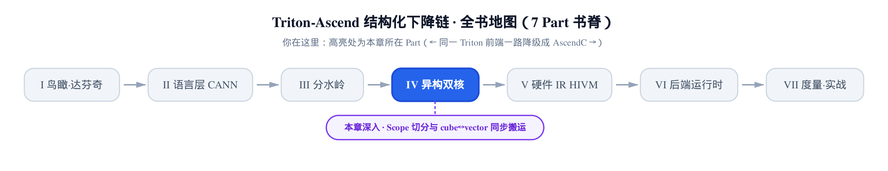
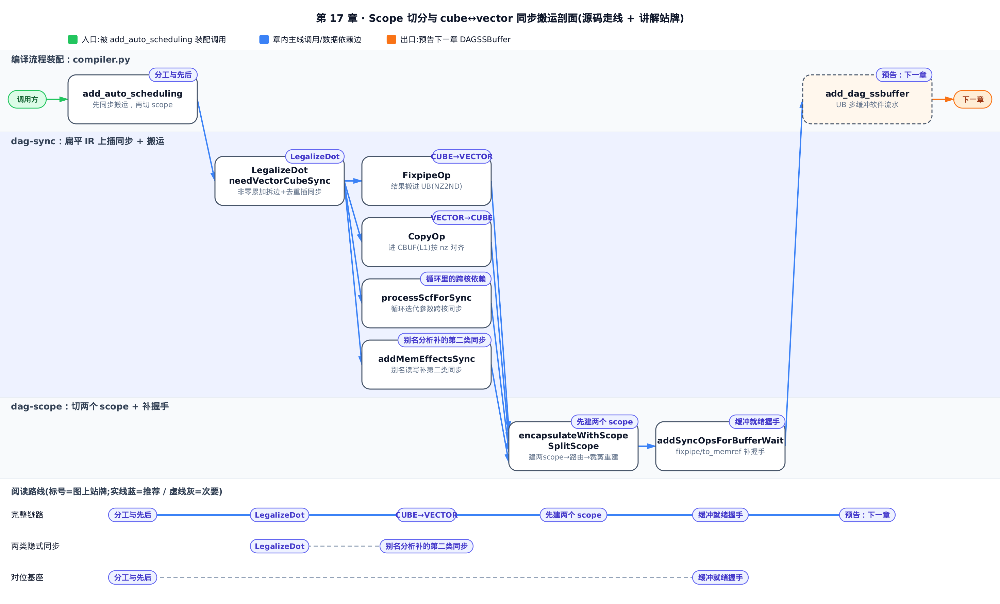
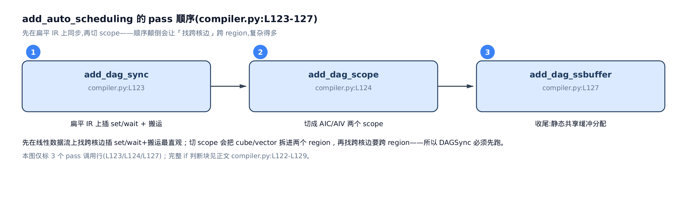
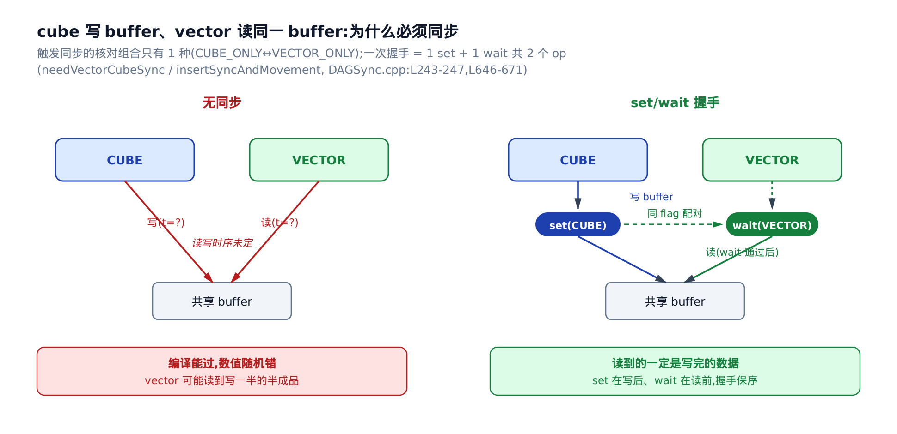
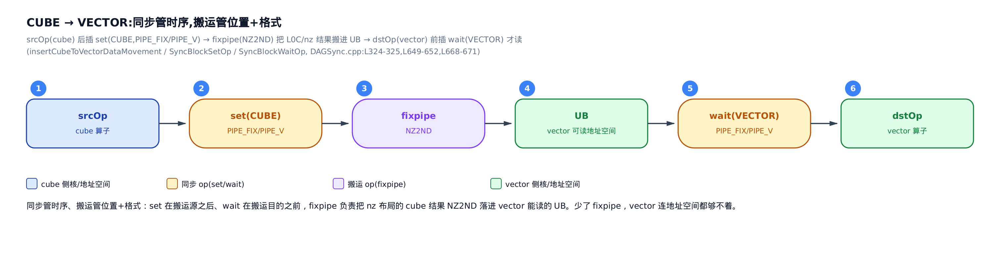
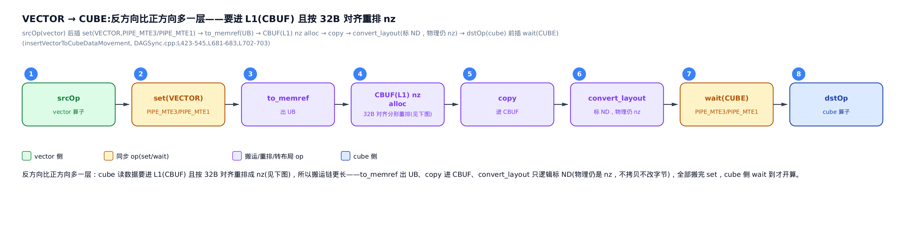
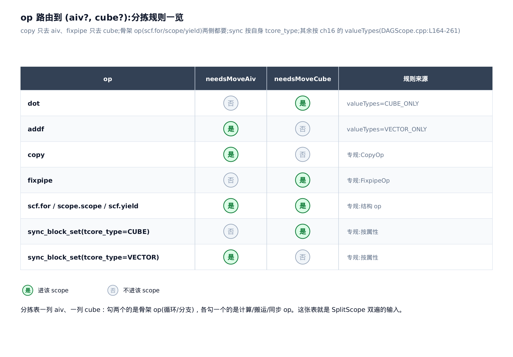
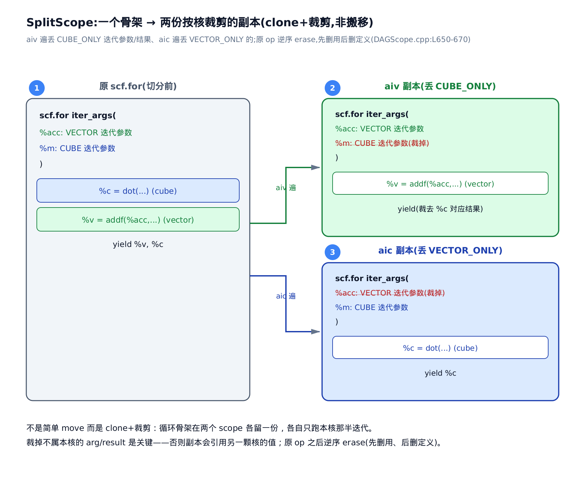
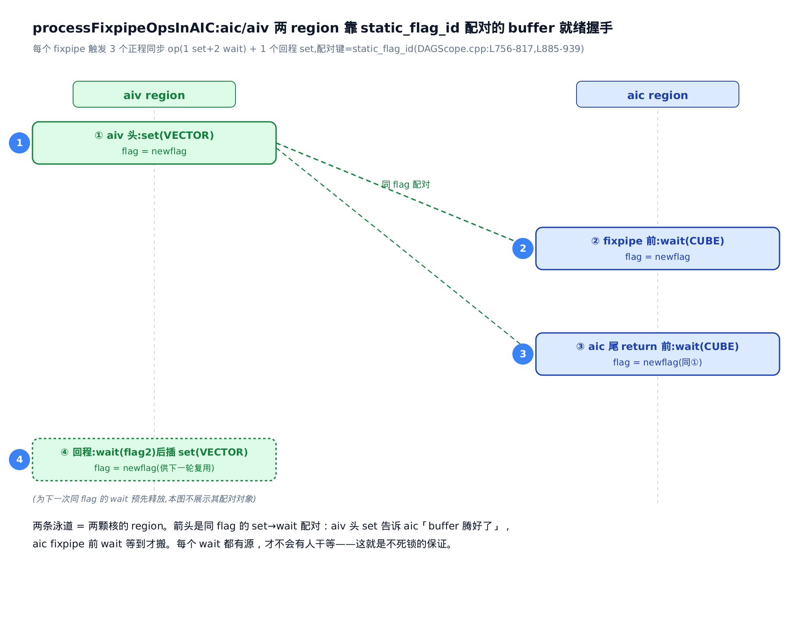
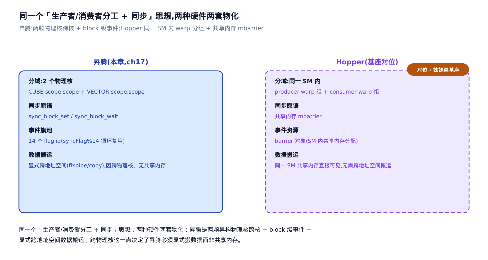

# 把双核落到 IR：Scope 切分与 cube↔vector 同步搬运



> 上一章：核亲和 pass 算出每个 op 想落哪颗核。
> 本章：把这份决策真正切进 IR，并在跨核处补同步。
> 下一章：在切好的 scope 上做 UB 多缓冲软流水。

回到那条最朴素的算子：`out = a @ b + bias`。

矩阵乘 `a @ b` 只能交给 **Cube**（矩阵计算单元，达芬奇 NPU 里只干矩阵乘的专才），逐元素的 `+ bias` 更适合 **Vector**（向量计算单元，做加减乘除、激活、规约）。[上一章：Cube 还是 Vector](../../ch16-core-affinity/narrative/chapter.md) 已经算清楚了：每个 op 该落哪颗核，得到一份 `Value → CoreType` 的核标注。

可核标注只是一份「意向清单」，它还没进 IR。真机要跑起来，得回答两个更硬的问题：

1. **怎么把两颗核的活儿在 IR 里分开？** Cube 的 op 归一堆、Vector 的 op 归一堆，各跑各的。
2. **两堆活儿在交界处怎么衔接？** Cube 算完 `a @ b` 的结果，Vector 要拿去加 bias——数据要**搬**过去，时序还得**对上**，不能 Vector 抢在 Cube 写完之前就开读。

这两个问题就是本章的全部。第一个由 **`dag-scope`** pass（把函数体切成两个 scope）回答，第二个由 **`dag-sync`** pass（在跨核边插搬运和事件同步）回答。跑起来会发现：跨核这件事，昇腾比 GPU 麻烦得多——因为它跨的是两颗**物理上独立**的核。

---



图分三条泳道：上道是编译流程的装配入口和出口（对应下文一节的挂载顺序，以及末尾指向下一章 `add_dag_ssbuffer` 的预告），中道是 `dag-sync` 在扁平 IR 上插同步和搬运（LegalizeDot 拆边、CUBE→VECTOR、VECTOR→CUBE、循环里的跨核依赖、别名分析补的第二类同步，对应三~九节），下道是 `dag-scope` 切两个 scope 并补缓冲握手（先建两个 scope、按核路由、裁剪重建、缓冲就绪握手，对应十~十三节）。十四、十五两节是贯穿全章的事件旗池正确性论证和跨书对照，图上不单设站牌，正文紧跟在裁剪重建之后。只想弄清跨核同步怎么触发、数据具体怎么搬，直接跳中道对应的三~九节；只想弄清两个 scope 怎么切开、怎么补握手，跳下道的十~十三节；想跟完整链路，按序从一读到十五节。

## 一、两趟 pass 的分工与先后

**直觉**。这活儿拆成两步做：先在「还没切开」的扁平 IR 上，沿数据流找出所有跨核的交界，把搬运和同步插进去；再把整个函数体切成两个盒子，按核标注把 op 分进各自的盒子。顺序不能反——先切盒子，跨核的边就被切到两个盒子里去了，再找交界得跨盒子翻，麻烦。

这两趟 pass 由编译器主流程按固定顺序挂载。看 `add_auto_scheduling`（自动调度分支，昇腾把双核编排都放在这里）装配的这一段：

```python
# third_party/ascend/backend/compiler.py:L122-L129
        if (metadata["add_auto_scheduling"]):
            ascend.passes.ttir.add_dag_sync(pm)
            ascend.passes.ttir.add_dag_scope(pm)
            passes.common.add_cse(pm)
            passes.common.add_canonicalizer(pm)
            ascend.passes.ttir.add_dag_ssbuffer(pm)
            passes.common.add_cse(pm)
            passes.common.add_canonicalizer(pm)
```

顺序清清楚楚：`add_dag_sync` 先、`add_dag_scope` 后，最后才 `add_dag_ssbuffer`（下一章的主角，UB 多缓冲软流水）。前两趟就是本章的两位主角：

- **`dag-sync`**（C++ 里是 `DAGSyncPass`，pass 标识 `dag-sync`）：在扁平 IR 上插同步 + 搬运。
- **`dag-scope`**（C++ 里是 `DAGScopePass`，pass 标识 `dag-scope`）：把函数体切成 AIC / AIV 两个 scope。这里 **AIC** 指 AI Core 的 cube 侧、**AIV** 指 vector 侧，是两颗物理核在编译期的代号。



**为什么先同步后切分**。同步和搬运要看的是「跨核数据边」和相邻算子的自然先后。在一条还没被 scope 切开、还是线性数据流的 IR 上，找跨核边最直观：上游一个 op、下游一个 op，中间就是边。一旦 `dag-scope` 把 cube / vector 拆进两个 region（MLIR 里带独立作用域的代码区），跨核边的两端就分处两个 region，再找就得跨 region 遍历，复杂得多。所以让 `dag-sync` 先跑，把 set/wait 事件都插好；`dag-scope` 后跑时，只需按事件自带的核属性把它们分发进对应 scope，再补一层缓冲级握手即可。

**对位基座**。这套「一颗核干矩阵乘、另一颗干后处理，中间同步」的思路，基座那本《Triton 源码解读》里也有——它讲 Hopper GPU 的 **warp specialization**（把一个线程块的 warp 分成 producer / consumer 两组，各司其职）时，做的就是同一件事的 GPU 版。差别在硬件：GPU 是同一个 SM（流多处理器）里的 warp 分组，昇腾是两颗**异构物理核**跨核。这个差别贯穿全章，最后一节再回来细说。

---

## 二、跨核为什么必须同步

**直觉**。Cube 和 Vector 是两颗**独立异步推进**的物理核，各有各的节拍。Cube 算完 `a @ b`，把结果写进某块 buffer；Vector 要读这块 buffer 去加 bias。要是没人管时序，Vector 可能在 Cube 还没写完时就开读——读到旧值、读到写了一半的半成品，结果就随机错。这不是编译报错能拦住的：IR 完全合法、编译照过，只有真机跑起来数值才莫名其妙不对。这类 bug 叫**数据竞争**（data race），是本章存在的根本理由。



解法是一对**事件**：Cube 写完发一个信号（`set`），Vector 等到这个信号再读（`wait`）。这对握手就是昇腾的跨核同步原语，在 IR 里是两个算子：

- `hivm.hir.sync_block_set`（C++ 里是 `SyncBlockSetOp`）——某颗核**发信号**：我这步干完了。
- `hivm.hir.sync_block_wait`（C++ 里是 `SyncBlockWaitOp`）——另一颗核**等信号**：等你干完我再动。

`hivm` 是昇腾的硬件方言（op 带 `hir.` 前缀，直接暴露片上存储、流水线、双核这些硬件细节）。这两个算子在真实 IR 里长这样（取自方言自带的语法测试夹具，展示合法文本形态）：

```mlir
// third_party/ascend/AscendNPU-IR/bishengir/test/Dialect/HIVM/IR/sync-ops.mlir:L45-L48
  hivm.hir.sync_block_set[#hivm.tcore_type<CUBE>, #hivm.pipe<PIPE_FIX>, #hivm.pipe<PIPE_FIX>]
    flag = 1
    ffts_base_addr = %ffts_base_addr
    sync_instr_mode = #hivm.sync_block_instr_mode<INTER_BLOCK_SYNCHRONIZATION>
```

方括号里三段是事件的「地址」：`tcore_type`（哪颗核，CUBE 或 VECTOR）、加两条 `pipe`（片上流水线队列，稍后细说），`flag = 1` 是**事件号**——同一个 flag 的 set 与 wait 才配成一对。这一节先记住形状，配对细节留到讲搬运和死锁时展开。

**机制：什么时候才需要同步**。不是所有相邻 op 都要插事件。同核内部靠硬件流水天然有序，无需 block 级事件；只有数据从一颗核流到**另一颗**核，才有跨核可见性问题。判据就一行代码：

```cpp
// third_party/ascend/lib/TritonAffinityOpt/DAGSync.cpp:L243-L247
bool DAGSyncPass::needVectorCubeSync(CoreType src, CoreType dst)
{
    return (src == CoreType::VECTOR_ONLY && dst == CoreType::CUBE_ONLY) ||
           (src == CoreType::CUBE_ONLY && dst == CoreType::VECTOR_ONLY);
}
```

`CoreType` 就是[上一章](../../ch16-core-affinity/narrative/chapter.md)算出的核标注类型。只有**一端纯 cube、另一端纯 vector**（`CUBE_ONLY` ↔ `VECTOR_ONLY`）这一种组合返回 `true`。同核、标量、或「两核都能跑」的 op 都不触发。一句话：**跨核才同步，同核靠流水**。

---

## 三、LegalizeDot：制造一条干净的 cube→vector 边

**直觉**。Cube 是只擅长纯矩阵乘的车间。带偏置的 `a @ b + bias` 里，`+ bias` 是逐元素加，本该 Vector 车间干。可 `triton.dot`（Triton 的矩阵乘算子）允许带一个**累加器**——`dot(a, b, c)` 算的是 `a @ b + c`。如果 `c` 就是 bias 且非零，那这步逐元素加会被裹在 dot 里、一起压给 Cube。`LegalizeDot` 把它拆开：像把「印刷 + 装订」拆成两个工位，dot 只留纯矩阵乘、bias 加法剥出来单独做，中间自然冒出一条 cube→vector 的交接边。

**机制**。看拆分的核心逻辑。先判累加器是不是常量零，不是就拆：

```cpp
// third_party/ascend/lib/TritonAffinityOpt/DAGSync.cpp:L805-L840
      if (auto constantOp = c.getDefiningOp<arith::ConstantOp>()) {
        if (auto denseAttr = dyn_cast<DenseElementsAttr>(constantOp.getValue())) {
          if (denseAttr.isSplat() && denseAttr.getSplatValue<FloatAttr>().getValueAsDouble() == 0.0) {
            isZeroAccumulator = true;
          }
        }
      }

      if (!isZeroAccumulator) {
        // 创建新的零累加器
        Location loc = dotOp.getLoc();
        auto resultType = dotOp.getResult().getType();

        Value originalResult = dotOp.getResult();
        builder.setInsertionPoint(dotOp);
        // 创建全零张量
        auto zeroAttr = DenseElementsAttr::get(
            dyn_cast<RankedTensorType>(resultType),
            APFloat(0.0f));
        auto zeroConstant = builder.create<arith::ConstantOp>(loc, zeroAttr);

        // 创建新的dot操作，使用零作为累加器
        auto newDot = builder.create<triton::DotOp>(
            loc, resultType, a, b, zeroConstant);

        // 创建加法操作，将新的dot结果与原来的累加器c相加
        auto addOp = builder.create<arith::AddFOp>(loc, newDot, c);

        // 用addOp替换原来的dotOp
        originalResult.replaceAllUsesWith(addOp.getResult());

        // 删除原dotOp（如果它没有其他用途）
        if (dotOp.use_empty()) {
            dotOp.erase();
        }
      }
```

代码里的中文注释是源码自带的。`c` 是原累加器（也就是 bias）；`isSplat()` 判它是不是「所有元素同一个值」的常量；只有当它是 splat 且值为 `0.0` 才算「零累加器」，保持原样。否则：建一个全零常量当新累加器 → 用它建一个新 dot（`newDot = a @ b + 0`，纯矩阵乘）→ 建一个 `arith.addf`（浮点加算子）把 bias 加回去 → 让所有用到原结果的地方改用加法结果 → 原 dot 没人用了就删掉。

**逐拍推演**。拿贯穿全章的例子走一遍：`a` 是 `[16,32]` 的 fp16、`b` 是 `[32,16]`、累加器 `c` 是非零的 `bias[16,16]`。

<!-- trace: m3-legalize-dot -->

| 步 | 动作 | 判定/值 | IR 结果 |
|---|---|---|---|
| 1 | 取 dot 三操作数 a/b/c，判累加器 c 是否 dense splat 0 (L805-812) | bias 非零 → isZeroAccumulator=false | 进入拆分分支 (L813) |
| 2 | 建全零常量作新累加器 (L820-822) | zeroConstant = arith.constant splat-0 [16,16] | 新增 1 个 constant op |
| 3 | 建新 dot，累加器换成零 (L825-826) | newDot = triton.dot(a,b,zeroConstant) | newDot 结果核 = CUBE_ONLY |
| 4 | 建加法把 bias 加回 (L829) | addOp = arith.addf(newDot, bias) | addOp 结果核 = VECTOR_ONLY |
| 5 | replaceAllUsesWith(addOp)；原 dot use_empty→erase (L834,L837-839) | 原 dot 被 addf 顶替并删除 | 产出 1 条 dot(cube)→addf(vector) 数据边 |

**不变量**。拆分后新 dot 的累加器**恒为 splat-0**，dot 回归「纯乘累加」这一 Cube 唯一职责；bias 加法被剥离成独立 `addf` 落到 Vector。为什么这过程不会没完没了地拆下去？基例：累加器已是 splat-0 的 dot 不进拆分分支（`isZeroAccumulator=true`），保持原样。归纳步：非零累加器的 dot 被替换成 `constant + dot(零) + addf` 三个 op，且原 dot 被 erase；新 dot 的累加器是**刚建的** splat-0，不会再次触发拆分。`walk` 对每个 dot 恰处理一次、原 dot 删除后不再被匹配——单调收敛，无重复展开。

一句话收益：拆分把 1 个「兼做乘 + 加」的 dot 变成 3 个 op（constant、dot、addf），净增 2 个 op，换来 1 条边界清晰的 cube→vector 边。**后续所有同步 / 搬运机制都挂在这条边上**。

---

## 四、主遍历：逐边判定、去重触发

**直觉**。种子边有了，`dag-sync` 接下来沿数据流走一遍，逐条边问：「上游在一颗核、下游在另一颗，且一 cube 一 vector 吗？」是就补一次同步。已经处理过的 `(上游、下游)` 对用一个集合记下，避免重复插。

**机制**。主遍历对当前 op 的每个输入边判定：

```cpp
// third_party/ascend/lib/TritonAffinityOpt/DAGSync.cpp:L1258-L1273
            for (ValueNode *inputValNode : currentNode->getInputs()) {
                auto inputOp = inputValNode->value.getDefiningOp();
                if (!inputOp || !opMap->contains(inputOp)) {
                    continue;
                }

                auto inputNode = (*opMap)[inputOp];

                // 获取输入节点的设备类型
                CoreType inputType = getNodeDeviceType(inputNode, valueTypes);

                // 5. 判断是否需要插入同步和数据搬运
                if (needVectorCubeSync(inputType, currentType)) {
                    // 检查是否已经处理过这对操作
                    auto opPair = std::make_pair(inputOp, op);
                    if (processedPairs.insert(opPair).second) {
```

`valueTypes` 就是上一章导出的 `Value → CoreType` 核标注表。对每个输入边，取输入核和当前核，过一遍 `needVectorCubeSync`；跨核就把 `(inputOp, op)` 塞进 `processedPairs`（已处理对的集合）。`insert(...).second` 为 `true` 表示首见——只有首见才真正插同步。插入成功后，再按上下游是否同一个 block（基本块）分派到同 block 或跨 block 的处理函数；跨 block 只处理「外层→内层」这一种情形（省略：`srcBlock==dstBlock` 分派 `insertSyncAndMovement`、否则走跨 block 版，L1274-L1308）。

**逐拍推演**。接第三节产出的 IR：`newDot(cube) → addf(vector) → store(vector)`，`syncFlag`（全局事件计数器）从 0 起：

<!-- trace: m4-sync-walk-trigger -->

| 轮 | 当前 op(核) | 输入 op(核) | needVectorCubeSync? | 去重(processedPairs) | 动作 |
|---|---|---|---|---|---|
| 1 | addf (VECTOR) | newDot (CUBE) | true (一 cube 一 vector) | 首见，insert 成功 | 插 set/wait，flag=syncFlag%14=0，之后 syncFlag++ →1 (L1281) |
| 2 | addf (VECTOR) | bias (VECTOR) | false (同核 VECTOR) | 不触发 | 跳过，不插 |
| 3 | store (VECTOR) | addf (VECTOR) | false (同核 VECTOR) | 不触发 | 跳过，不插 |
| 4 | (设想)addf 二次遇同一 (newDot,addf) 对 | newDot (CUBE) | true | 已在集合中，insert 返回 false | 去重命中，不重复插 |

**不变量**。`processedPairs` 是只增不减的集合，每个 `(inputOp, op)` 对最多插一次同步。单调量：集合大小随每次成功 `insert` 严格 +1，上界是「跨核边总数」这个有限值。`needVectorCubeSync` 只对 `CUBE_ONLY ↔ VECTOR_ONLY` 返回 `true`，同核 / 标量边永不触发；每条跨核边首见插一次、再见被 `insert` 的 `false` 挡掉——集合单调有界，必然有限步收敛、无重复同步。

本例 3 条数据边里只有 1 条（`newDot → addf`）跨核、插 1 组 set/wait，另 2 条同核不插。`flag = syncFlag % 14` 保证取值恒落在 0 到 13（为什么是 14、多了会怎样，见第十四节《事件旗池与死锁》）。

---

## 五、CUBE→VECTOR：同步管时序，搬运管位置

**直觉**。同步只解决了「时序」，还有「位置 + 格式」没解决。Cube 的结果躺在 **L0C**（cube 计算结果专用的片上存储）里、是 **nz**（一种把矩阵切成分形小块的物理布局，cube 硬件专用）；Vector 只会读 **UB**（Unified Buffer，vector 侧的通用片上存储）里的 **ND**（普通的按行铺开布局）。地址空间不通、布局不同——光有 set/wait，Vector 连数据在哪、长什么样都够不着。所以每条跨核边不是只插事件，还要插一段**数据搬运**。

**机制**。CUBE→VECTOR 方向，`insertSyncAndMovement` 里这一支同时插事件和搬运：

```cpp
// third_party/ascend/lib/TritonAffinityOpt/DAGSync.cpp:L646-L671
    // CUBE -> VECTOR
    if (srcType == CoreType::CUBE_ONLY && dstType == CoreType::VECTOR_ONLY) {

        // 2. 插入同步指令
        auto coreAttr = hivm::TCoreTypeAttr::get(builder.getContext(), hivm::TCoreType::CUBE);
        auto setPipe = PipeAttr::get(builder.getContext(), hivm::PIPE::PIPE_FIX);
        auto waitPipe = PipeAttr::get(builder.getContext(), hivm::PIPE::PIPE_V);
        // … 省略：lastSetPipe / lastWaitPipe / flagAddId / lastFlagAddId 四个局部变量声明后未被使用（死变量），仅 flagId 生效 …
        auto flagId = builder.getIntegerAttr(builder.getI64Type(), flag);

        // set 在 srcOp 后
        builder.setInsertionPointAfter(srcOp);
        builder.create<SyncBlockSetOp>(loc, coreAttr, setPipe, waitPipe, flagId);

        // wait 在 dstOp 前
        auto posOp = FindEarliestPosition(dstOp, mainGraph, builder);
        builder.setInsertionPoint(posOp);
        coreAttr = hivm::TCoreTypeAttr::get(builder.getContext(), hivm::TCoreType::VECTOR);
        builder.create<SyncBlockWaitOp>(loc, coreAttr, setPipe, waitPipe, flagId);

        // 1. 插入数据搬运
        insertCubeToVectorDataMovement(srcOp, dstOp, srcResult, builder, loc, nullptr);
```

三件事：**在 srcOp（cube 那个 op）之后插 `set`**，核属性 CUBE、两条 pipe 是 `PIPE_FIX` 和 `PIPE_V`；**在 dstOp（vector 那个 op）之前插 `wait`**，核属性 VECTOR、同 flag。这里 **PIPE** 是片上的流水线队列，昇腾用它区分不同类型的搬运 / 计算——`PIPE_FIX` 是 cube 的搬出通道（fixpipe 走这条）、`PIPE_V` 是 vector 计算通道。set 挂 `PIPE_FIX` 表示「fixpipe 搬完了」、wait 挂 `PIPE_V` 表示「vector 计算前等」，两条 pipe 精确描述了「等谁、放谁」。wait 的落点不是死贴 dstOp，而是经 `FindEarliestPosition` 微调（见第八节）。

夹在 set 和 wait 中间的，是 `insertCubeToVectorDataMovement`——真正把数据搬过去的算子链：

```cpp
// third_party/ascend/lib/TritonAffinityOpt/DAGSync.cpp:L313-L338
    auto srcTensorType = getTensorType(srcResult);
    if (!srcTensorType) {
        return;
    }

    // 1. 在 srcOp 之后创建 UB 空间的 memref.alloc
    builder.setInsertionPointAfter(srcOp);
    mlir::Value ubAlloc = getOrCreateAllocation(srcOp, srcTensorType,
                                                hivm::AddressSpace::UB, builder, loc);

    // 2. 创建 fixpipe 指令
    builder.setInsertionPointAfter(srcOp);
    FixpipeDMAModeAttr dmaModeAttr = FixpipeDMAModeAttr::get(builder.getContext(), FixpipeDMAMode::NZ2ND);

    auto fixpipeOp = builder.create<hivm::FixpipeOp>(
        loc,
        mlir::TypeRange{}, // 没有返回值
        srcResult,         // src
        ubAlloc,           // dst
        /*unit_flag_cond=*/mlir::ValueRange{},
        /*dma_mode=*/dmaModeAttr,
        // … 省略：dual_dst_mode / pre_quant / pre_relu / channel_split / unit_flag_mode 五个可选属性均传空 …
        );
```

两步：**在 UB 里开一块 alloc**（目标地址空间 `AddressSpace::UB`），**建一个 `fixpipe`**（IR 里是 `hivm.hir.fixpipe`，C++ 是 `FixpipeOp`）——cube 侧的 DMA 搬出算子，把 cube 结果搬进 UB。关键是它的 `dma_mode` 取 `NZ2ND`：搬的同时把 nz 分形布局**转成** ND，正好落成 Vector 能读的格式。搬完后再补 `memory_space_cast`（地址空间转换）+ `bufferization.to_tensor`（memref 转回 tensor），把 dstOp 的操作数换成搬运结果（省略：L343-L371）。



记住这个配对：**set 在搬运源之后、wait 在搬运目的之前**。数据先搬完，事件才保证对端看到的是搬完的数据。

---

## 六、VECTOR→CUBE：反方向多一层

**直觉**。反方向更麻烦。Cube 读数据不能直接读 UB，得先进 **CBUF**（也叫 L1，cube 的输入片上缓存），而且要按 **32 字节对齐**重排成 nz 布局。所以 VECTOR→CUBE 的搬运链比正方向长一截。

**机制**。同步这一支和正方向对称，只是核和 pipe 反过来：

```cpp
// third_party/ascend/lib/TritonAffinityOpt/DAGSync.cpp:L676-L707
    else if (srcType == CoreType::VECTOR_ONLY && dstType == CoreType::CUBE_ONLY) {

        // 2. 插入同步指令
        auto coreAttr = hivm::TCoreTypeAttr::get(builder.getContext(), hivm::TCoreType::VECTOR);
        auto setPipe = PipeAttr::get(builder.getContext(), hivm::PIPE::PIPE_MTE3);
        auto waitPipe = PipeAttr::get(builder.getContext(), hivm::PIPE::PIPE_MTE1);
        // … 省略：lastSetPipe / lastWaitPipe / flagAddId / lastFlagAddId 四个死变量（声明后未用），仅 flagId 生效 …
        auto flagId = builder.getIntegerAttr(builder.getI64Type(), flag);

        // set 在 srcOp 后
        auto posOp = FindLastestPosition(srcOp, mainGraph, builder);
        if (posOp) {
            builder.setInsertionPoint(posOp);
        } else {
            builder.setInsertionPointAfter(srcOp);
        }
        auto setOp = builder.create<SyncBlockSetOp>(loc, coreAttr, setPipe, waitPipe, flagId);

        // wait 在 dstOp 前
        builder.setInsertionPoint(dstOp);
        coreAttr = hivm::TCoreTypeAttr::get(builder.getContext(), hivm::TCoreType::CUBE);
        builder.create<SyncBlockWaitOp>(loc, coreAttr, setPipe, waitPipe, flagId);

        // 1. 插入数据搬运
        insertVectorToCubeDataMovement(srcOp, dstOp, setOp, srcResult, builder, loc, valueMap);
    }
```

`set` 的核属性是 VECTOR、两条 pipe 是 `PIPE_MTE3` / `PIPE_MTE1`（MTE 是搬运引擎的几条队列，MTE3 管往外搬、MTE1 管往 cube 输入搬），落点经 `FindLastestPosition` 微调；`wait` 的核属性是 CUBE，插在 dstOp 前。中间夹的 `insertVectorToCubeDataMovement` 就是那条更长的搬运链。

搬运链 `insertVectorToCubeDataMovement` 有四步（省略细节，L423-L545）：`to_memref`（tensor 转回 memref，出 UB）→ 在 CBUF/L1 里按 nz 布局开 alloc → `copy`（IR 里是 `hivm.hir.copy`，把 UB 数据搬进 CBUF）→ `convert_layout`（转成 ND）。比正方向多的那一层，就是「进 L1 + nz 对齐重排」。

这里得消一个字面上的矛盾：前一步 `copy` 已经把数据按 nz 布局码进了 CBUF（物理内存里就是 nz 分形块），末尾却又来一步 `convert_layout(ND)`——看着像把刚排好的 nz 又转回 ND，跟「cube 要 nz」正相反。核对源码：`hivm.hir.convert_layout`（C++ 是 `ConvertLayoutOp`）在方言定义里标了 `ViewLikeOpInterface`（视图类算子接口），文档原话是「数据不复制、不修改」（the data is not copied or modified），源码调用里 srcLayout 和 dstLayout 也都传的 ND、输出类型直接沿用原 2D 类型。所以这步**只改逻辑布局标注 / 类型、不动物理字节**：CBUF 里的物理排布仍是 `copy` 码进去的 nz，`convert_layout` 只是给下游一个 ND 的逻辑视图，让类型对得上。cube 真机读到的还是它要的 nz——字面的「转成 ND」是逻辑层的重新标注，不与「cube 需要 nz」冲突。



和正方向一样，这里那条 **set 在搬运源之后、wait 在搬运目的之前** 的不变量照样成立：`set` 落在 srcOp 之后（只是这回经 `FindLastestPosition` 微调落点）、`wait` 落在 dstOp 之前，数据先搬完事件才放行。VECTOR→CUBE 只是在这条骨架上多插了一层「进 L1 + nz 对齐重排」而已。

为什么正反不对称？因为两颗核的「进料口」不同：Vector 直接吃 UB，Cube 要先把料码进 L1 的分形货架。下一节就把这个「32 字节对齐的分形货架」算清楚。

---

## 七、CBUF 的 32 字节对齐 nz 布局

**直觉**。Cube 读 L1（CBUF）要求最内维凑满 **32 字节**整块，像货架每格必须放满 32 字节才好取。所以把 2D 矩阵重排成 4D「分形块」nz 布局：每块 16 行高、最内维 `blk` 个元素，`blk` 恰好让最内维等于 32 字节。

**机制**。算这个 4D 形状的就是 `newCbubAllocShape`：

```cpp
// third_party/ascend/lib/TritonAffinityOpt/DAGSync.cpp:L398-L419
static std::optional<SmallVector<int64_t, 4>> newCbubAllocShape(memref::AllocOp allocOp) {
  auto type = dyn_cast<MemRefType>(allocOp.getType());
  // 仅支持静态 2D MemRef
  if (!type || type.getRank() != 2)
    return std::nullopt;

  auto shape = type.getShape();
  int64_t M = shape[0];
  int64_t N = shape[1];
  auto elemType = type.getElementType();
  auto blkOr = getBlockElemsFor32BAlign(elemType);
  int64_t blk = (int64_t)*blkOr;
  // 必须是静态且 16 对齐
  if (ShapedType::isDynamic(M) || ShapedType::isDynamic(N))
    return std::nullopt;
  if (M % 16 != 0)
    return std::nullopt;

  // 新 shape: (N/16, M/16, 16, 16)
  SmallVector<int64_t, 4> newShape = {N / blk, M / 16, 16, blk};

  return newShape;
```

`blk`（block elems，一个对齐块里的元素个数）由 `getBlockElemsFor32BAlign(elemType)` 给出，等于 `32 / 元素字节数`：fp16 每元素 2 字节 → blk=16，fp32 → blk=8，int8 → blk=32。2D 的 `[M, N]` 重排成 4D nz：`(N/blk, M/16, 16, blk)`——`16` 是 Cube 的分形基本块高，`blk` 是对齐后的最内维宽。前置门槛：只支持静态 2D、且 `M % 16 == 0`（不满足就返回 `std::nullopt` 不重排，避免不整除的分形）。

**逐类推演**。取 `memref[M=32, N=64]`，看三种元素类型：

<!-- trace: m7-cbuf-nz-align -->

| 元素类型 | elem_bytes | blk=32/elem_bytes | nz shape=(N/blk, M/16, 16, blk) | 最内维字节=blk*elem_bytes |
|---|---|---|---|---|
| fp16 | 2 | 16 | (4, 2, 16, 16) | 32 |
| fp32 | 4 | 8 | (8, 2, 16, 8) | 32 |
| int8 | 1 | 32 | (2, 2, 16, 32) | 32 |

![fp16 下 memref[32,64] 重排为 4D nz (4,2,16,16)：最内维 16 元素 ×2B=32B 对齐，16 是 cube 分形块高、blk 是对齐后最内维宽](../diagrams/fig-m7-nz-layout.png)

**不变量**。`blk × elem_bytes` **恒等于 32**（因为 `blk = 32 / elem_bytes`），所以重排后最内维必然 32 字节对齐；且总元素数守恒——`(N/blk) × (M/16) × 16 × blk = N × M`，`blk` 与 `16` 各自约去，数据不丢不增。三种类型最内维字节都是 32，三例总元素都守恒为 `32 × 64 = 2048`（用源码同式脚本在 host 复算一致）。

一个诚实提醒：源码 L417 那句注释写的 `(N/16, M/16, 16, 16)` 是按 fp16 举的特例（blk 恰好 16）；非 fp16 时要以代码里的 `blk` 为准——注释是特例、代码是通式。这一节的例子选 fp16，图上标注也是 fp16，正是为对齐那句注释；换成 fp32 / int8 就得代回 `blk = 32 / elem_bytes`。

---

## 八、循环里的跨核依赖与落点微调

前面讲的都是「一条明线数据边」。可循环里还有一类跨核依赖藏得更深，以及同步点该插在哪也值得一调。这两件事是 supporting 级细节，快速过。

**循环迭代参数跨核（`processScfForSync`，`third_party/ascend/lib/TritonAffinityOpt/DAGSync.cpp:L106-L212`）**。`scf.for`（结构化的 for 循环算子）带 `iter_args`（迭代参数，每轮循环携带、绕过 `yield` 传给下一轮）。要是「这一轮某核算出的值，下一轮喂给另一颗核用」，跨核依赖就藏在迭代参数里——数据不走一条明线，而是绕过 `yield` 再从 iter_arg 回到循环体。处理办法：在 `yield` 定义处 `set`、在循环体里第一个用它的 op（`firstUser`）前 `wait`。

<!-- trace: m8-scf-for-sync -->

| 迭代参数 i | firstUser(核)=iterType | yield 定义 op(核)=yieldType | 匹配分支 | 插入 |
|---|---|---|---|---|
| 0 (%acc) | addf → VECTOR_ONLY | dot → CUBE_ONLY | yieldType=CUBE && iterType=VECTOR (L164) | yieldDefiningOp 后 set(CUBE,PIPE_FIX/PIPE_V)；firstUser 前 wait(VECTOR)；插 cube→vector 搬运 |
| 1 (设想 %m) | dot → CUBE_ONLY | dot → CUBE_ONLY | 两核同为 CUBE，无匹配 | 不插 |
| 2 (设想 %n) | dot → CUBE_ONLY | addf → VECTOR_ONLY | yieldType=VECTOR && iterType=CUBE (L190) | set(VECTOR,PIPE_MTE3/PIPE_MTE1)+wait(CUBE)；注意此支数据搬运调用被注释掉(源码 L202) |

不变量：每个迭代参数最多插一次同步；`firstUser` 由「循环体内首个 use」唯一确定（找到即 break，L142-145）；只有 `(yieldType, iterType)` 恰为 `(CUBE, VECTOR)` 或 `(VECTOR, CUBE)` 两种异核组合才插，其余跳过——无重复、无遗漏地覆盖每个跨核迭代参数。本例 3 个迭代参数里 2 个跨核（各插 1 组）、1 个同核（不插）。

**落点微调（`FindEarliestPosition` / `FindLastestPosition`，`third_party/ascend/lib/TritonAffinityOpt/DAGSync.cpp:L547-L602`）**。前面 set/wait 的插入点都调用了这两个函数。它们干的是：wait 尽量往前挪、set 尽量往「数据最小」处挪（回溯到 `broadcast` / `expand_dims` 这类**扩维**算子之前），让跨核 buffer 在 UB 里存活时间最短、占用最小；一旦撞上已有的同类 sync 就停，绝不越过既有屏障。

<!-- trace: m9-set-wait-placement -->

| 函数 | 方向 | 扫描 | 命中/停止条件 | 落点 |
|---|---|---|---|---|
| FindEarliestPosition(dstOp) | CUBE→VECTOR 的 wait | 从 dstOp 向上 getPrevNode，insertPos 逐步上移(L594-599) | 遇 SyncBlockSetOp(VECTOR) 立即返回 insertPos(L596-598)；跨 block 的 prevOp 跳过(L595) | wait 插在 broadcast 前(即既有 set 之后)——比贴 dstOp 前更早，UB 存活更短 |
| FindLastestPosition(srcOp) | VECTOR→CUBE 的 set | 从 srcOp 向下 getNextNode 找首个「非 cube 且操作数有 cube 定义」的 op(L552-560) | 命中后向上回溯到首个 BroadcastOp(其前若 ExpandDimsOp 取之)(L562-569)；遇 SyncBlockWaitOp(VECTOR) 即返回(L580-583) | set 插在 expand_dims 前——shape 最小处，防 UB 溢出 |

**不变量**。落点微调只在**同一个 block 内**移动，且遇到反向 sync 立即停止、绝不越过已有屏障；回溯目标（broadcast / expand_dims 的最小 shape 点）由 IR 结构唯一确定，故必然收敛。有界性：向上 / 向下扫描都以 `getPrevNode` / `getNextNode` 为步、以 block 边界为界（撞到 `nullptr` 或跨 block 即止），步数不超过 block 内的 op 数。安全性：一旦撞到反向的 `SyncBlockSet` / `SyncBlockWait` 就立刻返回当前 `insertPos`，保证新插的同步不会被挪到既有屏障的另一侧而破坏顺序。收敛性：回溯锁定「首个 broadcast（其前若有 expand_dims 则取之）」这个 shape 收缩点，由 IR 结构唯一确定、可达。

直觉上，`broadcast` 常把 `[1,N]` 扩成 `[M,N]`；把同步插到 broadcast 前的小 shape 处，跨核 buffer 的 UB 占用就省下被广播的那一维（源码注释原话「prevent UB overflow, break at the point where the result shape is minimized」，L560-563）。

---

## 九、别名分析补的第二类同步

**直觉**。到这里所有同步都跟着 SSA（静态单赋值，IR 里「值直接传给下一个 op」的明线）use-def 边走。但有些跨核依赖**不走明线**：两颗核先后读 / 写了同一块内存（**别名**，alias），SSA 的 use-def 根本看不见。像两人往同一个信箱塞信 / 取信，即使没直接把信递给对方，也得约定先后，否则取到空信箱或旧信。这类隐式依赖靠 `addMemEffectsSync` 用别名分析额外补同步。

**机制**。它遍历所有内存效应（读 / 写），两两配对，符合三条件就登记候选：

```cpp
// third_party/ascend/lib/TritonAffinityOpt/DAGSync.cpp:L1085-L1105
            bool isWrite = isa<MemoryEffects::Write>(effect.getEffect());
            for (auto &[prevNode, prevEffect] : memOps) {
                if ((isa<MemoryEffects::Write>(prevEffect.getEffect()) || isWrite) &&
                    mayAlias(solver, prevEffect.getValue(), effect.getValue()) &&
                    prevNode->isOn() != currNode->isOn() // write is forced on single core type, so we are safe to judge
                                                         // based on whether the core types are different
                ) {
                    CoreType srcCoreType = isWrite ? !currNode->isOn() : prevNode->isOn();
                    auto opPair = findAncestorCommonBlock(prevNode->op, currNode->op);
                    if (!opPair.has_value()) {
                        op->emitWarning(
                            llvm::formatv("Unable to find ancestors in common block with {0}\n", *prevNode->op));
                        continue;
                    }
                    auto [setAfter, waitBefore] = opPair.value();
                    if (setAfter == waitBefore) {
                        continue;
                    }
                    candidates.push_back(SyncCandidate {srcCoreType, prevNode->op, setAfter, op, waitBefore});
                }
            }
```

三条件是个合取门：**至少一方是写**（`prevWrite || isWrite`，纯读-读无冲突）、**可能别名**（`mayAlias`，`solver` 来自 `SharedMemoryAliasAnalysis`，共享内存别名分析）、**异核**（`prevNode->isOn() != currNode->isOn()`）。三者同真才登记一条 `SyncCandidate`。落点取两个 op 的公共祖先 block；若 `setAfter == waitBefore`（同一点）无需同步、直接跳过。「至少一方是写」这一条要挡的，正是 **WAR / WAW / RAW** 三类内存依赖（写后读 / 写后写 / 读后写）——都是「同一块内存的先后访问必须保序」，唯独纯读-读没有这层依赖。下表的第二行「纯读无 WAR/WAW/RAW」就是这个意思。

<!-- trace: m10-mem-effects-sync -->

| 读写对(prev,curr) | (prevWrite\|\|curr isWrite) | mayAlias? | 异核(isOn 不同)? | 登记候选？ |
|---|---|---|---|---|
| cube-Write buf, vector-Read buf | true(prev 是 Write) | true | true(CUBE≠VECTOR) | 登记：srcCoreType=prevNode->isOn()=CUBE(L1092)，push SyncCandidate(L1103) |
| vector-Read bufA, vector-Read bufB | false(两个都是 Read) | - | - | 不登记(纯读无 WAR/WAW/RAW) |
| cube-Write buf, vector-Write buf(setAfter==waitBefore) | true | true | true | 不登记：公共祖先里 setAfter==waitBefore 直接 continue(L1100-1102) |

**不变量**。三重合取门是充要过滤——纯读-读、不别名、同核，任一命中即跳过，杜绝无谓同步。之后按支配序（dominance / postDominance，「谁在前谁在后」的偏序）排序去重，保证每对隐式依赖至多一组 set/wait。登记的事件 pipe 是 `srcPipe = (srcCoreType==CUBE ? PIPE_FIX : PIPE_MTE2)`、`dstPipe = PIPE_S`，`flag = syncFlag % 14`（L1114-1117）。这里 `PIPE_MTE2` 是 MTE（搬运引擎）家族里另一条搬入队列，和前面见过的 `PIPE_MTE1` / `PIPE_MTE3` 同属搬运引擎、只是队列身份（方向）不同；`PIPE_S` 是标量 / 同步队列，这里表示「等这条访存序列化完成」——和前面那些 `PIPE_*` 一样，都只是片上流水线的一条具体队列。这是数据流边同步之外的**第二类同步来源**。

到这里，`dag-sync` 的活儿讲完了：拆 dot 制造边、逐边插 set/wait、两个方向的搬运链、循环与别名两类特殊依赖。IR 现在还是**扁平的一条线**，但跨核处都插好了搬运和事件。接下来轮到 `dag-scope` 把这条线切成两个盒子。

---

## 十、encapsulateWithScope：先建两个 scope

**直觉**。`dag-scope` 第一步先造两个空车间：一个贴 VECTOR 牌、一个贴 CUBE 牌。然后把函数体所有 op 一股脑塞进 VECTOR 车间，CUBE 车间暂时空着——后面 `SplitScope` 再往 CUBE 里复制 / 裁剪。像先把所有工具堆进一个房间，再分拣到两个工位。

装 op 的容器叫 `scope.scope`（IR 算子，C++ 是 `ScopeOp`）——一个带单 region 的中性容器，靠挂 `tcore_type`（核归属属性）标记它归哪颗物理核。真实文本形态（取自方言语法夹具）：

```mlir
// third_party/ascend/AscendNPU-IR/bishengir/test/Dialect/Scope/ops.mlir:L8-L14
func.func @test_scope_scope() {
  // CHECK: scope.scope
  scope.scope : () -> () {
    // CHECK: scope.return
    scope.return
  // CHECK: {tcore_type = #hivm.tcore_type<CUBE>}
  } {tcore_type = #hivm.tcore_type<CUBE>}
```

一个 `scope.scope`、里面一个 `scope.return`（scope 的终结符）、尾部挂 `{tcore_type = #hivm.tcore_type<CUBE>}` 属性——这就是「把核归属物化进 IR」的载体。

**机制**。`encapsulateWithScope` 的收尾把两个 scope 打上属性并返回：

```cpp
// third_party/ascend/lib/TritonAffinityOpt/DAGScope.cpp:L139-L150
    // 设置属性
    auto vecAttr = hivm::TCoreTypeAttr::get(
        builder.getContext(),
        hivm::TCoreType::VECTOR);
    auto aicAttr = hivm::TCoreTypeAttr::get(
        builder.getContext(),
        hivm::TCoreType::CUBE);

    scopeOp->setAttr(hivm::TCoreTypeAttr::name, vecAttr);
    newScopeOp->setAttr(hivm::TCoreTypeAttr::name, aicAttr);

    return std::make_pair(scopeOp, newScopeOp);
```

前半（省略，L69-L138）把函数体里非 constant / programid / alloc 的 op 按原序收集、搬进第一个 scope（`scopeOp`）、补 `scope.return`，再建一个空的第二个 scope（`newScopeOp`）。收尾这段给第一个打 **VECTOR**、第二个打 **CUBE**，返回 `(aivScope, aicScope)`。这里 `aivScope` 挂的就是 VECTOR 属性、`aicScope` 挂的就是 CUBE 属性——`aiv` / `aic` 前缀正是第一节说的 AIV（vector 侧）/ AIC（cube 侧）缩写，和属性层的 `#hivm.tcore_type<VECTOR|CUBE>` 是同一件事的两套写法：下文源码变量爱用 `aivScope` / `aicScope`，物化进 IR 的属性值则写 VECTOR / CUBE。

<!-- trace: m11-encapsulate-scope -->

| 步 | 动作 | scope 状态 |
|---|---|---|
| 1 | 收集 lastBlock 内非 constant/programid/alloc 的 op 按原序(L69-138) | 待搬清单 = [dot, addf, store, …] |
| 2 | 建第一个 scope.scope=scopeOp，全部搬入并补 scope.return | scopeOp = { 全部 op } |
| 3 | scopeOp.setAttr(tcore_type=VECTOR) (L146-148) | scopeOp 贴 VECTOR 牌(aivScope) |
| 4 | 建第二个空 scope.scope=newScopeOp，setAttr(tcore_type=CUBE) (L149) | newScopeOp = { 空 }(aicScope) |
| 5 | return {scopeOp(aiv), newScopeOp(aic)} (L150) | 两 scope 就位，待 SplitScope 填 CUBE |

![encapsulateWithScope：扁平函数体 → [VECTOR scope 含全部 op] + [CUBE scope 空]，两 scope 靠 tcore_type 属性区分归属](../diagrams/fig-m11-encapsulate.png)

**不变量**。`encapsulateWithScope` 恰建 2 个 scope，顺序**固定**为 VECTOR 先、CUBE 后（L146-149 硬编码）；constant / programid / alloc 不搬进 scope（留在函数头）。「第一个=aiv、第二个=aic」这个不变式被后续 `addSyncOpsForBufferWait` 按 `tcore_type` 反查时依赖。此时 aivScope 含全部 op、aicScope 为空——真正的按核分发在第十二节完成。

为什么先全塞 VECTOR、CUBE 留空？因为下一步要用「复制 + 裁剪」而非「搬移」来填 CUBE——保留一份完整的作为母本，复制出裁剪版，比来回搬更安全。

---

## 十一、collectOpsToMove：每个 op 去哪个车间

**直觉**。分拣规则决定每个 op 进哪个车间：`copy` 只去 vector、`fixpipe` 只去 cube、循环 / scope 这种骨架两边都要，其余按上一章的核标注（`valueTypes`）走。像按工序把零件分到不同工位，而传送带（骨架）两个工位都得有一截。

**机制**。规则分几组。先看计算类和结构类：

```cpp
// third_party/ascend/lib/TritonAffinityOpt/DAGScope.cpp:L186-L200
  // 检查特定操作类型
  if (isa<hivm::CopyOp>(op)) {
    needsMoveAiv = true;
  }

  // 检查特定操作类型
  if (isa<hivm::FixpipeOp>(op)) {
    needsMoveCube = true;
  }

  // 检查特定操作类型
  if (isa<scf::YieldOp>(op) || isa<scope::ScopeOp>(op) || isa<scf::ForOp>(op)) {
    needsMoveAiv = true;
    needsMoveCube = true;
  }
```

`copy` 归 aiv、`fixpipe` 归 cube；`scf.yield` / `scope.scope` / `scf.for` 这三类结构 op **两侧都要**（`needsMoveAiv` 和 `needsMoveCube` 同时置真）。前置（省略，L164-185）先按 op 结果的 `valueTypes` 交位——`VECTOR_ONLY` 置 aiv、`CUBE_ONLY` 置 cube。

同步 op 特殊，按自己的 `tcore_type` 属性归位：

```cpp
// third_party/ascend/lib/TritonAffinityOpt/DAGScope.cpp:L251-L261
  // 检查 Sync 操作的 tcore_type 属性
  if ((isa<hivm::SyncBlockSetOp>(op) || isa<hivm::SyncBlockWaitOp>(op))) {
    mlir::OpBuilder builder(op);
    auto coreAttr = hivm::TCoreTypeAttr::get(builder.getContext(), hivm::TCoreType::CUBE);
    if (op->getAttr("tcore_type") == coreAttr) {
      needsMoveCube = true;
    }
    else {
      needsMoveAiv = true;
    }
  }
```

`sync_block_set` / `sync_block_wait` 挂 CUBE 的归 cube、否则归 aiv——这正是第一节说的「`dag-sync` 先把 set/wait 的核属性标好，`dag-scope` 只需按属性分发」。

<!-- trace: m12-collect-ops-routing -->

| op | 规则来源 | needsMoveAiv | needsMoveCube |
|---|---|---|---|
| dot | valueTypes=CUBE_ONLY (L164-185) | false | true |
| addf | valueTypes=VECTOR_ONLY (L164-185) | true | false |
| copy | isa CopyOp 专规 (L186-189) | true | false |
| fixpipe | isa FixpipeOp 专规 (L191-194) | false | true |
| scf.for / scope.scope / scf.yield | 结构 op 专规 (L196-200) | true | true |
| sync_block_set(tcore_type=CUBE) | sync 按 tcore_type 属性 (L251-261) | false | true |
| sync_block_set(tcore_type=VECTOR) | sync 按 tcore_type 属性 (L251-261) | true | false |



**不变量**。结构 op（`scf.for` / `if` / `scope` / `yield`）**必两侧都要**，骨架在两个 scope 里都不能缺；纯计算 op 按 `valueTypes` 或专规恰选一侧（copy→aiv、fixpipe→cube）；sync op 按自身属性归位。路由是「先按 `valueTypes` 置位、再让专规覆盖」的确定映射，每个 op 走完这一段后 `(needsMoveAiv, needsMoveCube)` 唯一确定。结构 op 强制两侧，是为保证循环 / 分支骨架在两个 scope 各有一份可裁剪的副本（下一节才裁 arg / result）。这张 `(aiv?, cube?)` 二元标记表，就是下一步 `SplitScope` 双遍的输入。（`valueTypes` 怎么算出来的，见[上一章](../../ch16-core-affinity/narrative/chapter.md)，本章不重推导。）

---

## 十二、SplitScope：按核裁剪重建

**直觉**。真正分拣时，把 op **复制**进目标 scope。循环 / 分支这种带迭代参数和结果的骨架不能整个照搬——得按核裁剪：aiv 侧丢掉 `CUBE_ONLY` 的结果 / 参数、aic 侧丢掉 `VECTOR_ONLY` 的，各留半个数据流；最后**逆序**删掉原 op（先删用、后删定义，不留悬空引用）。

**机制**。`SplitScope` 是两遍，aiv 遍和 aic 遍对称：

```cpp
// third_party/ascend/lib/TritonAffinityOpt/DAGScope.cpp:L650-L670
  llvm::SmallVector<mlir::Operation*> aivUsedOp; // 改为函数内静态，保持原有逻辑
  for (const auto& info : aivToMove) {
    if (std::find(aivUsedOp.begin(), aivUsedOp.end(), info.op) != aivUsedOp.end()) {
      return;
    }
    aivUsedOp.push_back(info.op);
    processOperationToMove(info, aivparentMap, builder, aivmapper, aivBlock, terminator, graph, AffinityDAG::CoreType::CUBE_ONLY);
  }

  llvm::DenseMap<Operation*, Operation*> aicparentMap;
  mlir::IRMapping aicmapper;
  mlir::Block* aicBlock = &aicScope->getRegion(0).front(); // 或者使用合适的block
  terminator = aicBlock->getTerminator();
  llvm::SmallVector<mlir::Operation*> aicUsedOp; // 改为函数内静态，保持原有逻辑
  for (const auto& info : cubeToMove) {
    if (std::find(aicUsedOp.begin(), aicUsedOp.end(), info.op) != aicUsedOp.end()) {
      return;
    }
    aicUsedOp.push_back(info.op);
    processOperationToMove(info, aicparentMap, builder, aicmapper, aicBlock, terminator, graph, AffinityDAG::CoreType::VECTOR_ONLY);
  }
```

两遍传给 `processOperationToMove` 的最后一个参数是 **`MoveType`**（这一遍要**丢弃**哪种核的结果）：aiv 遍传 `CUBE_ONLY`（丢 cube 的）、aic 遍传 `VECTOR_ONLY`（丢 vector 的）。`processOperationToMove` 对 `scf.for` / `if` / `yield` 按 `MoveType` 逐个结果过滤重建（省略，L378-462）。`aivUsedOp` / `aicUsedOp` 是去重集合，防同一个 op 被处理两次。之后把两个待搬清单里的原 op 汇总逆序 erase（省略，L672-688）。

<!-- trace: m13-split-scope-rebuild -->

| 遍 | MoveType | 处理集 | scf.for 迭代参数怎么裁 | 去重 |
|---|---|---|---|---|
| 1 (aiv) | CUBE_ONLY(丢 cube) | aivToMove | 重建时丢掉 CUBE_ONLY 迭代参数/结果，保留 vector 的 | aivUsedOp 已含则 return，防同 op 处理两次(L652-657) |
| 2 (aic) | VECTOR_ONLY(丢 vector) | cubeToMove | 重建时丢掉 VECTOR_ONLY 迭代参数/结果，保留 cube 的 | aicUsedOp 同上(L666-670) |
| 3 (收尾) | - | aivToMove∪cubeToMove 原 op | - | 汇入 deleteOp 逆序 erase(L672-688) |



**不变量**。逆序 erase 保证先删使用者、后删定义者，无悬空引用——被删 op 的结果此时已无使用者（用它的 op 更靠后、已先被删或已 clone 进 scope 并改指到副本）。`MoveType` 过滤保证每个 scope 只含本核该有的迭代参数 / 结果；两遍 `MoveType` 恰互为对方的补（`CUBE_ONLY` vs `VECTOR_ONLY`），两副本的迭代参数互补、合起来恰是原骨架。裁掉不属本核的 arg / result 是**关键**——否则副本会引用另一颗核的值。一个 `scf.for` 就这样变成两份按核裁剪的副本，各自只跑本核那半迭代。

到这里，函数体切成了两个盒子：aivScope 装 vector 的活儿、aicScope 装 cube 的活儿，各带自己那半个数据流和裁剪好的循环骨架。但还差最后一层握手。

---

## 十三、addSyncOpsForBufferWait：缓冲就绪握手

**直觉**。scope 切好后，cube 车间里的 `fixpipe`（往 UB 搬结果）和 vector 车间里的 `to_memref`（往 cube 交数据）还需要一层「缓冲就绪」握手：fixpipe 前先等 vector 把 buffer 腾空（wait）、cube 尾也等、vector 头 set——形成「我腾好了 / 我用完了」的双向闭环，靠 `static_flag_id`（事件的静态编号）跨两个 region 配对。

**机制**。先按 `tcore_type` 属性找到两个 region，再分别处理 fixpipe 和 to_memref：

```cpp
// third_party/ascend/lib/TritonAffinityOpt/DAGScope.cpp:L1054-L1072
        funcOp.walk([&](scope::ScopeOp scopeOp) {
          auto coreTypeAttr = scopeOp->getAttrOfType<hivm::TCoreTypeAttr>(
              hivm::TCoreTypeAttr::name);
          if (!coreTypeAttr) return;

          if (coreTypeAttr.getTcoretype() == hivm::TCoreType::CUBE) {
            aicRegion = &scopeOp.getRegion();
          }
          if (coreTypeAttr.getTcoretype() == hivm::TCoreType::VECTOR) {
            aivRegion = &scopeOp.getRegion();
          }
        });

        if (!aicRegion || !aivRegion) {
          continue;
        }

        processFixpipeOpsInAIC(aicRegion, aivRegion);
        processToMemrefOpsInAIV(aivRegion, aicRegion);
```

靠 `tcore_type` 反查——这正依赖第十节那条「第一个 scope=VECTOR、第二个=CUBE」的不变式。`processFixpipeOpsInAIC` 对每个 fixpipe 补三步正程同步：

```cpp
// third_party/ascend/lib/TritonAffinityOpt/DAGScope.cpp:L885-L903
      for (auto fixpipeOp : fixpipes) {

      auto newflag = findFixPipeFlagSafe(fixpipeOp);
        // 1. 在 FixpipeOp 前插 Wait
        builder.setInsertionPoint(fixpipeOp);
        createSyncBlockWaitOp(
          builder,
          fixpipeOp->getLoc(),
          hivm::TCoreType::CUBE,
          hivm::PIPE::PIPE_V,
          hivm::PIPE::PIPE_FIX,
          newflag);
        bool coretypebool = true;

        // 2. 在 aicRegion 末尾 Return 前插 Wait
        insertWaitBeforeFinalReturn(aicRegion, builder, newflag, coretypebool);

        // 3. 在 aivRegion 开头插 Set
        insertSetAtRegionStart(aivRegion, builder, newflag, coretypebool);
```

`newflag = findFixPipeFlagSafe(fixpipeOp)` 取的是 fixpipe 下一行 `sync_block_set` 的 `static_flag_id`（复用现存事件号）。三步：**fixpipe 前插 wait(CUBE)**、**aic 尾 return 前插 wait(CUBE)**、**aiv 头插 set(VECTOR)**——都用同一个 `newflag`。之后还有回程（省略，L905-939）：找 fixpipe 后的下一个 set 的 flag，在 aiv 里对应位置补一个 set，把 aiv→aic 的回程事件也配上。

<!-- trace: m14-buffer-wait-sync -->

| 步 | 位置 | 插入 op | flag |
|---|---|---|---|
| 1 | aic 内 fixpipe 前 | wait(CUBE, PIPE_V/PIPE_FIX) | newflag=findFixPipeFlagSafe(fixpipe)(取其下一行 sync_block_set 的 static_flag_id，L848-866) |
| 2 | aic 尾 return 前 | wait(CUBE, PIPE_V/PIPE_FIX) (insertWaitBeforeFinalReturn, L725-753) | newflag |
| 3 | aiv 头 | set(VECTOR, PIPE_V/PIPE_FIX) (insertSetAtRegionStart, L756-782) | newflag |
| 4 (回程) | aiv 内同 flag2 的 wait 之后 | set(newflag) | flag2 = fixpipe 后下一个 sync_block_set 的 flag(L905-939) |



**不变量**。每个 `wait` 都有配对的、同 `static_flag_id` 的 `set`（正程：aiv 头 set ↔ aic fixpipe / 尾 wait；回程：aiv set ↔ 后续 wait），跨 region 靠 flag 唯一标识，所以**没有孤儿 wait**。配对是成对生成的：`processFixpipeOpsInAIC` 对每个 fixpipe 一次性插「aiv 头一个 set + aic 两处 wait」，同 `newflag`、分处两 region，`findWaitOpInRegionWithFlag` 按 flag 精确匹配（L806-817）。`newflag` 取自 `findFixPipeFlagSafe`——找不到既存 set 就返回 -1、该 fixpipe 不配（退化保护），绝不插出「等不到的 wait」。每个 fixpipe 触发 3 个正程同步 op（1 set + 2 wait）+ 回程 1 set，这层 pipeline 级 buffer 握手，叠加在前面数据流级 set/wait 之上。

---

## 十四、事件旗池与死锁

前面反复提到 `flag = syncFlag % 14`。这个 14 和取模，藏着「为什么不会死锁」的最后一块拼图。

**直觉**。昇腾跨核事件靠有限个「信号旗」（flag id）标识：每次 `set` 举一面旗、对应 `wait` 落一面同号旗。旗只有 14 面（0 到 13），用 `syncFlag % 14` 循环复用（取模三处一致：`third_party/ascend/lib/TritonAffinityOpt/DAGSync.cpp:L1116` / `L1241` / `L1281`）。要是某个 `wait` 等的旗**永远没人举**（配对丢失），或两颗核互等成环，对应核就永久卡住——这就是**死锁**。

<!-- trace: m15-flag-pool-deadlock -->

| 第几条跨核边 | syncFlag | flag=syncFlag%14 | 配对状态 |
|---|---|---|---|
| 第 1 条 | 0 | 0 | set flag0 ↔ wait flag0 ✓ |
| 第 14 条 | 13 | 13 | 举到旗池最后一面 flag13 ✓ |
| 第 15 条 | 14 | 0 | 旗号回绕复用 flag0(须前一个 flag0 握手已完成才安全) |
| (故障)wait flag=5 无对应 set | - | 5 | 该核永久阻塞 → 死锁 |

**不变量**。`set` 与 `wait` 一一按 flag 配对，每个 `wait` 终会被某个同 flag 的 `set` 释放，故无死锁；旗号 `flag` 恒落在 0 到 13（`= syncFlag % 14`，三处一致：L1116 / L1241 / L1281）。活性论证：只要每个 `wait` 都能追溯到一个先行的同 flag `set`（由第四节成对插入、第十三节按 `static_flag_id` 配对保证），且同号旗不被两组未完成握手同时占用（顺序结构 + 计数器递增保证），则每个等待终被释放。破坏任一前提——丢 set / 复用未完成的旗 / 交叉成环——即死锁。这正是**配对**与**取模**两条规则要防的。旗池 14、第 k 条跨核边用旗 `k % 14`，超过 14 条边就开始复用同号旗（用源码同式脚本复算：`syncFlag` 0 / 13 / 14 → flag 0 / 13 / 0，一致）。

这就回答了本章开头那个隐忧的另一半：少了同步会数据竞争（第二节），而同步本身配不成对、或旗号复用太急，则会死锁。两个 pass 一路小心地成对插、按 flag 配，就是在两头都不踩雷。

---

## 十五、对位基座：scope+事件 vs warp+mbarrier

**直觉**。回到第一节埋的那个对照。昇腾这套「cube / vector 分域 + 生产者 / 消费者同步」，落在 IR 上就是两个 `scope.scope` 加两个方向的 `sync_block_set` / `sync_block_wait`（`third_party/ascend/lib/TritonAffinityOpt/DAGScope.cpp:L139-L150`、`third_party/ascend/lib/TritonAffinityOpt/DAGSync.cpp:L647-L707`）。它和基座那本《Triton 源码解读》讲 Hopper GPU 的 **warp specialization** 是同一个思想，两种硬件、两套物化。

- **昇腾**：分域靠两个 `scope.scope`（CUBE / VECTOR），跨越的是**两颗异构物理核**；同步用 block 级 `sync_block_set` / `sync_block_wait` 事件，事件旗池 14 个；数据要**显式跨地址空间搬运**（fixpipe / copy），因为两颗物理核不共享内存。
- **Hopper**：分域靠 **warp 分组**（producer warp 组 + consumer warp 组），都在同一个 SM 内；同步用共享内存 **mbarrier**（memory barrier，SM 内的内存屏障对象）；数据在 SM 的共享内存里直接可见，**无需跨地址空间搬运**。



最本质的差别就一句：**跨物理核这一点，决定了昇腾必须显式搬数据、而非共享内存**。GPU 的 producer / consumer 隔着一层共享内存握手就行；昇腾的 cube 和 vector 隔着物理边界，数据得真的从 L0C 搬到 UB、或从 UB 码进 L1，才谈得上「另一颗核能读到」。本章前十四节讲的所有搬运链和事件配对，归根结底都是在补这条物理鸿沟。

---

## 小结

`out = a @ b + bias` 这条边，一路被两趟 pass（挂载顺序见 `third_party/ascend/backend/compiler.py:L122-L129`）物化进了 IR：

1. **`dag-sync` 先跑**，在扁平 IR 上动手：`LegalizeDot` 把带 bias 的 dot 拆成「纯 dot（cube）+ addf（vector）」，制造干净的跨核边；主遍历逐边判 `needVectorCubeSync`、去重后插 set/wait；CUBE→VECTOR 用 `fixpipe(NZ2ND)` 搬进 UB，VECTOR→CUBE 用 `to_memref → copy → convert_layout` 进 L1 并按 32 字节对齐重排 nz；循环迭代参数和内存别名两类隐式依赖另行补同步。
2. **`dag-scope` 后跑**，切盒子：`encapsulateWithScope` 建 VECTOR / CUBE 两个 `scope.scope`、打 `tcore_type` 属性；`collectOpsToMove` 按核标注 + 专规给每个 op 定路由；`SplitScope` 用「复制 + 裁剪」把结构骨架分进两个 scope；`addSyncOpsForBufferWait` 再补一层 buffer 就绪握手。
3. 贯穿始终的**事件旗池**（`syncFlag % 14`）和**成对 set/wait**，一头防数据竞争、一头防死锁。

一句话收束：核亲和 pass 回答了「每个 op 落哪颗核」，本章回答的是「怎么把这份决策真的切进 IR、并让两颗独立物理核在交界处对上时序」。跨物理核这个昇腾特有的物理事实，把 GPU 一层共享内存就能了事的同步，撑成了「显式搬运 + 事件握手」的一整套机制。

切好的两个 scope 里，跨核 buffer 还只是「够用就好」的单块分配。真机要榨干双核的并行度，得让 cube 算第 N 块的同时、vector 处理第 N-1 块——这需要给 UB 上多缓冲、把两颗核的流水叠起来。那正是管线里第三趟 `add_dag_ssbuffer` 的活儿。下一章从「DAGSSBuffer：UB 多缓冲与昇腾的软件流水线」讲起。
