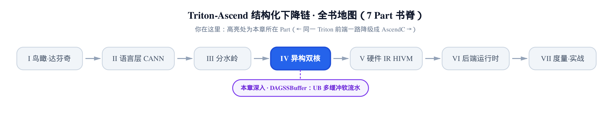
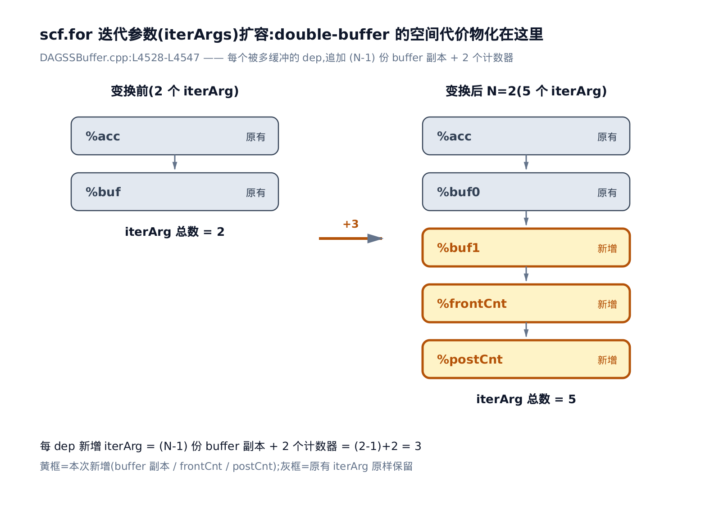
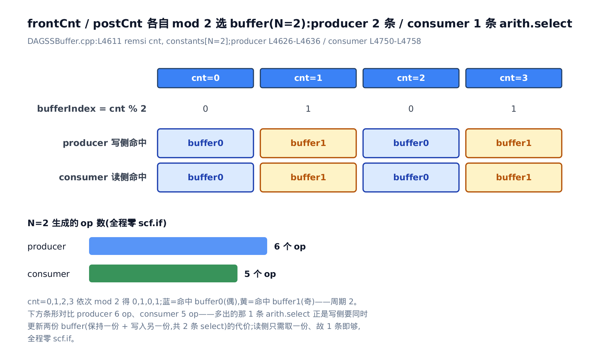
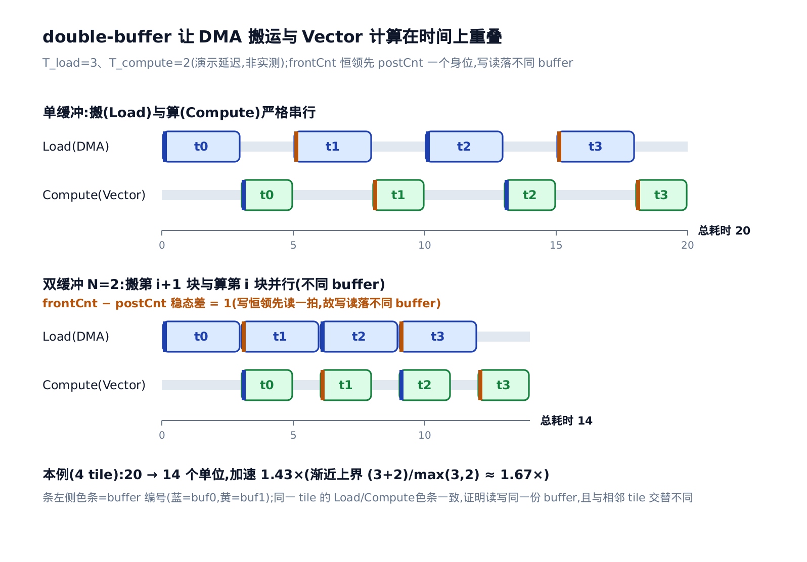

# DAGSSBuffer：UB 多缓冲与昇腾的软件流水线



> 上一章：把双核决策切进 IR，跨核处补同步搬运。
> 本章：在单核循环内部给 UB 上多缓冲，让搬运和计算重叠。
> 下一章：驯服不规则访存——离散掩码拆分与交错优化。

[上一章](../../ch17-scope-sync/narrative/chapter.md)结尾留了个尾巴：切好的两个 scope 里，跨核 buffer 还只是「够用就好」的单块分配。真机要榨干双核的并行度，光把 op 分到两颗核上还不够——**每颗核自己的循环内部，也在浪费时间**。

看一段最朴素的 vector 核循环：每一轮先从片外把一块数据搬进片上 UB（Unified Buffer，服务 vector 核的统一片上缓冲，容量固定 192KB，[第 2 章](../../ch02-davinci-npu-hardware-model/narrative/chapter.md)钉过这个数字），再对这块数据做逐元素计算。搬（load）和算（compute）用的是两套物理单元——搬归 DMA（Direct Memory Access，直接内存访问搬运单元）管，算归 Vector 计算单元管。可如果只有一块 buffer，这两套单元只能**轮流上工**：搬的时候计算单元干等，算的时候 DMA 干等。一半的硬件永远在空转。

本章的主角 `DAGSSBuffer` pass 就来补这个洞。它在**单核循环内部**，把一份 UB buffer 扩成两份，让 DMA 搬「下一块」的同时 Vector 算「这一块」——两套单元同时上工，这就是**软件流水线**（software pipelining）。这条思路 GPU 上也有，基座那本《Triton 源码解读》讲 `num_stages` 时讲的就是它；差别在于 GPU 靠硬件的异步拷贝隐式重叠，昇腾没有这层硬件，必须在 IR 里**显式**把 buffer 复制成两份、手写轮转指针。本章最后一节回来细说这个对照。

> ⚠️ 边界划清：本章讲的重叠是**单核循环内部**的访存↔计算重叠，和上一章的跨核 scope/sync 是**正交**的两件事。上一章解决「cube 和 vector 两颗核之间怎么切、怎么同步」；本章解决「一颗核自己的循环里，搬和算怎么叠起来」。两者不重复。

`DAGSSBuffer.cpp` 是本书至今最大的单文件——5534 行。全覆盖既不可能也没必要。本章只抓**双缓冲变换本身**这条脊梁：怎么把 buffer 扩成两份、怎么决定每轮写哪份读哪份、两份怎么让搬算叠起来。边界处理、多层嵌套、缓冲份数大于 2 的各种变体，如实标注省略。

> 📖 交叉验证口径（诚实边界）：host 上没有昇腾 NPU，也没有 CANN 工具链，这个 5534 行的纯 C++ pass 编不动，全书不存在真机 dump。本章所有逐轮数字都是**手工推演**——照 pin 源码 `@2badfc89e` 的 `select` 逻辑逐行推出，再用一段忠实重写这套逻辑的 Python 交叉核对。正文里的 IR 片段是按变换前后语义**手工构造的最小示例**，用来演示，不是编译器真吐出来的。凡引用源码常量的数字都标了 `文件:Lxxx`。时间线里的延迟数（`T_load`、`T_compute`）是演示所选的单位、不是实测。

---


图上七站对应下文一、三、四、五、六节：定位 pass 挂载位置与五段分工（一节）→ buffer 扩容与计数器新增（三节）→ 按计数器奇偶分叉出写侧、读侧两条逻辑（四节）→ 两个计数器错开一位、接线回填让搬算重叠（五节）→ 收尾对照基座 GPU 的 `num_stages`（六节）。只想抓住双缓冲怎么让搬和算叠起来，直接跳三到五节；想先弄清这个 pass 在整条自动调度链里摆在哪一环，从一节按序读起。

## 一、这趟 pass 站在流水线的哪一环

**直觉**。先定位：`DAGSSBuffer` 不是孤立跑的，它挂在昇腾自动调度链的**第三站**——前两站正是上一章的 `dag-sync`（插跨核同步）和 `dag-scope`（切两个 scope）。顺序有讲究：得先把双核切开、同步补好，再在切好的单核循环里做多缓冲。

> 说明：以下代码块均逐字取自 pin 源码，保留原有中文注释；非相邻的代码段之间用 `// … 省略 …` 标注省略的分支；引用行首以 `// <路径>:Lxxx` 给出规范源码位置。

看编译主流程的装配段，这几行昇腾把双核编排都塞在 `add_auto_scheduling`（自动调度分支）里：

```python
# third_party/ascend/backend/compiler.py:L122-L129
        if (metadata["add_auto_scheduling"]):
            ascend.passes.ttir.add_dag_sync(pm)
            ascend.passes.ttir.add_dag_scope(pm)
            passes.common.add_cse(pm)
            passes.common.add_canonicalizer(pm)
            ascend.passes.ttir.add_dag_ssbuffer(pm)
            passes.common.add_cse(pm)
            passes.common.add_canonicalizer(pm)
```

顺序一目了然：`add_dag_sync`、`add_dag_scope` 先跑（上一章两位主角），中间夹一遍 `cse`（公共子表达式消除）和 `canonicalizer`（规范化）把 IR 收拾干净，最后才轮到 `add_dag_ssbuffer`——本章的主角。而且它只在 `metadata['add_auto_scheduling']`（是否走自动调度）为真时才挂上。

这个 pass 在方言里叫 `dag-ssbuf`，声明里一句话点破它干什么：

```tablegen
// third_party/ascend/include/TritonAffinityOpt/Passes.td:L11-L15
def DAGSSBuffer : Pass<"dag-ssbuf", "mlir::ModuleOp"> {
  let summary = "Convert vector operations to shared storage buffer operations";
```

「把 vector 操作转成共享存储缓冲操作」——注意是 **vector**。矩阵乘那条路（cube 核，用 L0A/L0B/L0C 那套缓冲）不归它管，这条边界后面会在源码里再确认一次。

进到 pass 内部，`runOnOperation`（每个 pass 的入口方法）把活儿分成清清楚楚的五段：

```cpp
// third_party/ascend/lib/TritonAffinityOpt/DAGSSBuffer.cpp:L5513-L5528
void DAGSSBufferPass::runOnOperation() {
  auto module = getOperation();

  AddIfCondition(module);

  FlowSssbuf(module);
  ControlSsbufV2(module);

  // advance不能出现在if里, 规避处理
  ChangeAdvanceOpForm(module);

  DenseMap<scf::IfOp, SmallVector<Value>> ifResultDeps;
  WalkAIVNestedForAndProcess(module, ifResultDeps, 2);

  return;
}
```

五段各司其职。前四段都是**准备**，本章点到为止；最后一段 `WalkAIVNestedForAndProcess` 才是真正的双缓冲变换、本章主攻：

1. **`AddIfCondition`**——把循环体切成「搬运的 `scf.if`」和「计算的 `scf.if`」两个分区。这一步是后面多缓冲改写的**骨架**：稍后写侧逻辑接到「搬运 if」上，读侧逻辑接到「计算 if」上。（内部按 wait-set 做的一大坨合并/扩展细节，本章省略。）
2. **`FlowSssbuf`**——做 buffer 的流分析，识别哪些循环带着待多缓冲的 buffer。
3. **`ControlSsbufV2`**——在流分析结果上做控制处理。
4. **`ChangeAdvanceOpForm`**——把 `tt.advance`（指针步进算子）挪出 `if`，规避非法嵌套，正如那行中文注释所说。
5. **`WalkAIVNestedForAndProcess(module, ifResultDeps, 2)`**——真正的双缓冲变换在这里。注意最后那个实参 `2`：它是缓冲份数 `bufferNum`，全流程写死为 **2**，也就是最经典的双缓冲（double-buffer）。「AIV」是 AI Vector core（vector 核）的缩写——名字直接点明它只碰 vector 核的循环。

这个驱动函数怎么逐层触发变换，看它的核心循环（节选，滤掉了外层的 scope 遍历、`isCube` 过滤、根 for 筛选和诊断打印）：

```cpp
// third_party/ascend/lib/TritonAffinityOpt/DAGSSBuffer.cpp:L5497-L5508
      for (int level = 1; level <= maxLevels; level++) {
        auto uniqueDeps = collectIfInfo(currentFor, ifResultDeps, level);
        llvm::outs()<<"maxLevels:"<<maxLevels<<"\n";
        if (uniqueDeps.empty()) {
          continue;
        }
        llvm::outs()<<"uniqueDeps:"<<uniqueDeps.size()<<"\n";
        auto newForOp = addDoubleBuffForArgs(module, uniqueDeps, bufferNum);
        DenseMap<scf::IfOp, SmallVector<Value>> newIfResultDeps;
        auto uniqueList = collectIfInfo(newForOp, newIfResultDeps, level);
        addMultiBuffCaculate(module, uniqueList, newIfResultDeps, newForOp, bufferNum);
      }
```

这里的 `maxLevels` 是这颗循环嵌套的层数，`level` 是当前处理到第几层——变换按层从外到内逐层跑。本章后面只挑**单层**看双缓冲怎么做，层间调度不展开。聚焦到单层，循环体里那三个动作就串起本章后三节的脊梁，正好对应下面三步：

- `collectIfInfo(currentFor, …, level)`——找出该嵌套层里「前一个 if 产出、后一个 if 消费」的 buffer 依赖 `uniqueDeps`（即要多缓冲的那些 buffer）。
- `addDoubleBuffForArgs(module, uniqueDeps, bufferNum)`——把这些 buffer 在循环里扩成 N 份 + 2 个计数器（§三）。
- `addMultiBuffCaculate(…)`——装上写侧、读侧逻辑，并回填 `yield` 让缓冲轮转（§四、§五）。

驱动函数只处理 `isCube` 为假、也就是**非 cube 的 vector scope**（`isCube` 判断一个 scope 里有没有 `tt.dot` 矩阵乘）。这就把「只对 vector 核做 UB 多缓冲」这条职责边界钉死在代码里——和刚才 `Passes.td` 里那句 summary 对上了。

铺垫完了，进正题：为什么值得费这个劲。

## 二、为什么要双缓冲：从串行到重叠

**直觉**。单缓冲像一条**单车道**：搬完这块料才能开算，算完才能腾出 buffer 搬下一块，搬和算永远一个等一个。DMA 忙的时候 Vector 干瞪眼，Vector 忙的时候 DMA 干瞪眼——任何一刻都有一套单元空转。

双缓冲把单车道修成**两条车道**：备两份 buffer，一份叫 buffer0、一份叫 buffer1。稳态下，DMA 往 buffer B 搬「第 i+1 块」的同时，Vector 正从 buffer A 读「第 i 块」来算——两件事同时干。一轮的墙钟时间，从「搬 + 算」缩到「搬和算里较慢的那个」。

拿一个演示例子把账算清。设一轮搬要 3 个时间单位、算要 2 个单位，一共 4 块数据（tile）。这些延迟数是为讲解挑的、不是实测：

- **单缓冲（串行）**：每块都得「搬 3 + 算 2 = 5」，4 块就是 `4 × 5 = 20` 个单位。
- **双缓冲（重叠）**：先花 3 个单位暖机搬第 0 块（此时没什么可算的），之后三轮里搬和算并行、每轮只受较慢的搬（3 个单位）约束，最后再花 2 个单位算完最后一块——`3 + 3×3 + 2 = 14` 个单位。

`20 → 14`，加速约 `1.43×`。tile 数越多，暖机和收尾的固定开销被摊薄，加速比逼近渐近上界：

```math
\mathrm{speedup} \to \frac{T_{\mathrm{load}} + T_{\mathrm{compute}}}{\max(T_{\mathrm{load}}, T_{\mathrm{compute}})} = \frac{3 + 2}{\max(3, 2)} = \frac{5}{3} \approx 1.67
```

分母取两者的较大值——稳态每轮被慢的那条车道卡住；这里 $`T_{\mathrm{load}}`$ 是搬一块的耗时、$`T_{\mathrm{compute}}`$ 是算一块的耗时。这就是双缓冲「买」到的东西，也是这趟 pass 存在的全部理由。**代价**是 UB 占用翻倍：本来一份 buffer，现在两份——这个翻倍正源于 pass 把缓冲份数写死为 2（`DAGSSBuffer.cpp:L5525` 的 `WalkAIVNestedForAndProcess(module, ifResultDeps, 2)`）。呼应 [第 2 章](../../ch02-davinci-npu-hardware-model/narrative/chapter.md)：double-buffer 默认开启，把可用 UB 从 192KB 砍到约 96KB。

至于「让这个重叠成立的机理到底是什么」——是两个计数器错开一位，保证任一时刻写的 buffer 和读的 buffer 不是同一份。这个 invariant 留到 §五 讲透。先看它是怎么一步步搭出来的。

## 三、第一步：一份 buffer 扩成两份 + 两个计数器

**直觉**。本来循环每轮只揣一个饭盒（一份 buffer），现在改成揣两个饭盒轮流用，外加两个小计数器，记「这轮该往哪个饭盒装、从哪个饭盒取」。多带的饭盒副本和两个计数器，都塞进循环的「随身行李」里跟着每轮往下传。「空间换时间」的那个空间，就花在这里。

这个「随身行李」在 MLIR 里有个正式名字：`scf.for` 的**迭代参数** `iter_args`（loop-carried values，循环携带值）——每轮循环结束时 `yield` 出新值，下一轮作为参数传进来。要给 buffer 上双缓冲，就得往 `iter_args` 里加东西。

**机制**。看变换前后 `iter_args` 的布局。设变换前循环带着两个携带值：`%acc`（某个已有的累加器）和 `%buf`（要多缓冲的那份 UB tile）：

<!-- trace: m1-iterarg-expand -->

| 场景 | `scf.for` 的 iter_args 布局 | iter_args 总数 | 相对变换前新增 |
|---|---|---|---|
| 变换前 | `%acc, %buf` | 2 | — |
| 变换后（N=2） | `%acc, %buf0, %buf1, %frontCnt, %postCnt` | 5 | +3 =（N−1）=1 份 buffer 副本 + 2 个计数器 |

原来那份 `%buf` 变成了 `%buf0`；新增了一份副本 `%buf1`，外加两个计数器 `%frontCnt`（写指针游标）和 `%postCnt`（读指针游标）。原有的 `%acc` 原样保留、位置不动。总数从 2 涨到 5，净增 3。

**这个 +3 从哪来**——看源码里干脆利落的两层 push（省略了前面对 `%buf` 的反查定位、循环边界读取、以及后面克隆循环体、替换旧循环这些机械步骤）：

```cpp
// third_party/ascend/lib/TritonAffinityOpt/DAGSSBuffer.cpp:L4528-L4547
    // 添加和depValueForIdxs相同的迭代参数和计数器
    for (int64_t idx : depValueForIdxs) {
        for (int i = 0; i < bufferNum - 1; i++) {
            iterArgs.push_back(originalInitArgs[idx]);
        }
        
        // 在迭代参数中添加计数器
        for (int i = 0; i < 2; i++) {
            iterArgs.push_back(counterInit);
        }
    }

    builder.setInsertionPoint(forOp);
    // 创建新的for循环
    auto newForOp = builder.create<scf::ForOp>(
        forOp.getLoc(),
        originalLowerBound,
        originalUpperBound,
        originalStep,
        iterArgs);
```

对每个要多缓冲的 buffer（`depValueForIdxs` 里的每个下标 `idx`）：

- 第一层循环 `i < bufferNum - 1`：压进 `bufferNum - 1` 份**同一初值**的 buffer 副本。`bufferNum = 2`，就压 1 份——加上原有那份，共 2 份。
- 第二层循环 `i < 2`：压进 2 个初值为 0 的计数器 `counterInit`（一个 `arith.constant 0`）。

所以每个 buffer 净增 `(bufferNum - 1) + 2` 个 iter_args。N=2 时恰好 `1 + 2 = 3`。最后用扩容后的 `iterArgs`、配上**原封不动**的循环边界（`originalLowerBound` / `UpperBound` / `Step`）重建 `scf.for`。

**不变量**。扩容只增不改：原有 iter_args 一个不动，每个被多缓冲的 buffer 恰好追加 `(N−1)` 份副本 + 2 个计数器。用公式记，每个 buffer 净增 $`(N-1) + 2 = N + 1`$ 个 iter_args；N=2 即 +3。

这个 +3 不是随口说的常数——后面 `addMultiBuffCaculate` 反算 iter_args 起点时，用的步长正是 `(2 + bufferNum - 1) = 3`（§五会看到这行）。两处必须逐位对齐：要是扩容时每个 buffer 加的不是 3 个，反算就会错位、读到别的携带值。所以这个 3 是写侧和读侧的一条硬契约。



*上图：黄框是本次新增的 3 个 iter_args（1 份 buffer 副本 + 2 个计数器），灰框是原样保留的。空间代价就落在这三个黄框上。*

若把 N 调到 3，每个 buffer 就净增 `(3−1)+2 = 4` 个 iter_args、UB 占用 3 倍——更深的流水能掩藏更长更抖的访存延迟，但更吃 UB。本 pass 固定 N=2，是容量和收益的折中。

## 四、第二步：谁写哪份、谁读哪份——按计数器 mod 2 选 buffer

**直觉**。两份 buffer 就像**一排只有两格的储物柜**（buffer0 / buffer1）。搬运工按自己手里的号码牌 `frontCnt` 决定东西塞哪格——双数塞左格、单数塞右格；取货的人按自己的号码牌 `postCnt` 决定开哪格。各数各的牌、各开各的格，互不打断。正因为只有两格，「二选一」都靠 `arith.select`（按布尔条件在两个值里挑一个的算子）解决，连 `scf.if` 都不用生成——不过两边条数不一样：取货的人只要**挑一份来读**，一条 `select` 就够；搬运工存货却要把**两份 buffer 都更新到位**（新数据落进的那份 + 保持不动的那份各写一次），得用两条 `select`。

**机制**。写侧叫 producer，读侧叫 consumer。两边都先算 `bufferIndex = cnt % N`，再据此选 buffer。逐轮跑一遍，把账摆出来：

<!-- trace: m2-producer-consumer-select -->

| 计数器值 cnt | bufferIndex = cnt % 2 | isBuffer0（==0） | producer 写侧命中 buffer | consumer 读侧命中 buffer |
|---|---|---|---|---|
| 0 | 0 | true | buffer0 | buffer0 |
| 1 | 1 | false | buffer1 | buffer1 |
| 2 | 0 | true | buffer0 | buffer0 |
| 3 | 1 | false | buffer1 | buffer1 |

规律很干净：偶数轮碰 buffer0、奇数轮碰 buffer1，周期为 2。

**写侧源码**（producer，N>2 时那条嵌套 `scf.if` 链已省略——本章只讲 N=2）：

```cpp
// third_party/ascend/lib/TritonAffinityOpt/DAGSSBuffer.cpp:L4602-L4636
SmallVector<Value> buildNBufferProducer(OpBuilder &builder, Location loc,
                                        Value frontCnt, Value newDepVal,
                                        ArrayRef<Value> buffs,
                                        ArrayRef<Value> constants) {
  // N-buffer producer: determines which buffer is written to newDepVal based on frontCnt % N
  const int N = buffs.size();
  SmallVector<Value> results;

  // idx = frontCnt % N
  Value bufferIndex =
      builder.create<arith::RemSIOp>(loc, frontCnt, constants[N]);

  // 1. buffer0: handle the first buffer separately
  Value isBuffer0 = builder.create<arith::CmpIOp>(loc, arith::CmpIPredicate::eq,
                                                  bufferIndex, constants[0]);

  auto dstShapedType = mlir::dyn_cast<ShapedType>(newDepVal.getType());
  auto maskType = RankedTensorType::get(dstShapedType.getShape(), isBuffer0.getType());
  Value mask = builder.create<tensor::SplatOp>(loc, maskType, isBuffer0);
  Value newBuff0 = builder.create<arith::SelectOp>(loc, mask, newDepVal, buffs[0]);

  results.push_back(newBuff0);

  // 2. Double-buffer specialization (when N == 2, a direct select is sufficient)
  if (N == 2) {

    Value newBuff1 = builder.create<arith::SelectOp>(loc, mask, buffs[1], newDepVal);

    auto nextCnt = builder.create<arith::AddIOp>(loc, frontCnt, constants[1]);

    results.push_back(newBuff1);
    results.push_back(nextCnt.getResult());

    return results;
  }
```

逐行拆开，`newDepVal` 是本轮新搬进来/算出来的数据：

1. `arith.remsi`（有符号取模）算 `bufferIndex = frontCnt % constants[N]`——`constants[N]` 就是 N 本身，这里等于 2。
2. `arith.cmpi`（整数比较）判 `isBuffer0 = (bufferIndex == 0)`，得到一个标量布尔 `i1`。
3. 被多缓冲的 buffer 是**张量**，`arith.select` 要求挑选掩码和被选值同形。所以先用 `tensor.splat`（把标量摊成同形张量）把标量 `isBuffer0` 摊成和 buffer 同 shape 的布尔张量 `mask`。
4. `newBuff0 = select(mask, newDepVal, buffs[0])`——轮到 0 号（`mask` 为真），就把新数据写进 buffer0；否则保持 buffer0 旧值不动。
5. **N==2 特化**：`newBuff1 = select(mask, buffs[1], newDepVal)`——注意方向和上面**相反**：轮到 0 号写 buffer0 时，buffer1 保持旧值；不轮到 0 号（该写 buffer1）时，新数据落 buffer1。一份新数据，两条 `select` 分别决定它落哪份、另一份怎么保持。
6. `nextCnt = frontCnt + 1`（`arith.addi` 整数加法），把号码牌 +1 传给下一轮。

返回三个值：`[newBuff0, newBuff1, nextCnt]`——正好对上 iter_args 里那 3 个新增位。

**读侧源码**（consumer，同样只看 N=2）：

```cpp
// third_party/ascend/lib/TritonAffinityOpt/DAGSSBuffer.cpp:L4732-L4758
SmallVector<Value> buildNBufferConsumer(OpBuilder &builder, Location loc,
                                        Value postCnt, ArrayRef<Value> oldBuffs,
                                        ArrayRef<Value> constants) {
  // Consumer: selects which buffer to read based on postCnt % N
  const int bufferNum = oldBuffs.size();
  SmallVector<Value> results;

  // idx = postCnt % N
  Value bufferIndex =
      builder.create<arith::RemSIOp>(loc, postCnt, constants[bufferNum]);

  Value isBuffer0 = builder.create<arith::CmpIOp>(loc, arith::CmpIPredicate::eq,
                                                bufferIndex, constants[0]);
  auto dstShapedType = mlir::dyn_cast<ShapedType>(oldBuffs[0].getType());
  auto maskType = RankedTensorType::get(dstShapedType.getShape(), isBuffer0.getType());
  auto mask = builder.create<tensor::SplatOp>(loc, maskType, isBuffer0);

  // 1. Double-buffer specialization (avoid generating scf.if)
  if (bufferNum == 2) {
    Value selected = builder.create<arith::SelectOp>(loc, mask, oldBuffs[0], oldBuffs[1]);
    auto nextCnt = builder.create<arith::AddIOp>(loc, postCnt, constants[1]);

    results.push_back(selected);
    results.push_back(nextCnt);

    return results;
  }
```

读侧比写侧简单：`bufferIndex = postCnt % 2`，然后一条 `selected = select(mask, oldBuffs[0], oldBuffs[1])`——轮到 0 号就读 buffer0、否则读 buffer1；`postCnt + 1`。返回 `[selected, nextCnt]`。它只需**取一份**（读一份来算），所以只有一条 `select`；而写侧要**同时更新两份**（写的那份 + 保持不动的那份），所以有两条。

**关键**：consumer 用的是 `postCnt`，和 producer 的 `frontCnt` 是**两个独立的计数器**。这个「独立」是下一节整个重叠机理的地基。

**不变量**。N==2 时，写侧和读侧「选哪份」都退化成 `bufferIndex = cnt % 2 ∈ {0, 1}`，命中的 buffer 编号恒等于 `cnt % 2`，周期为 2，全程只用 `arith.select`、不生成 `scf.if`。基例 cnt=0：`bufferIndex=0`、`isBuffer0=true`，写落 buffer0、读取 buffer0；归纳步：cnt 每轮 +1，`cnt % 2` 在 0/1 间严格交替。N>2 才走那条被省略的嵌套 `scf.if` 链。

控制流零膨胀：producer 一共生成 6 个 op（1 取模 + 1 比较 + 1 splat + 2 select + 1 加法），consumer 5 个（少一条 select）。两侧都是零 `scf.if`。



*上图：cnt=0,1,2,3 依次 mod 2 得 0,1,0,1；蓝格=命中 buffer0（偶数轮）、黄格=命中 buffer1（奇数轮）。下方条形对比 producer 6 个 op、consumer 5 个 op。*

## 五、第三步：两个计数器错开一位，搬算就叠起来了

**直觉**。回到 §二 那个「两条车道」的画面。现在有了写侧、读侧两套 `select`，还有 `frontCnt`、`postCnt` 两个独立计数器。让重叠真正成立的**唯一秘密**是：写指针永远比读指针**领先一个身位**。领先一位，`frontCnt % 2` 和 `postCnt % 2` 奇偶就永远相反，于是任一刻「正在写的那份 buffer」和「正在读的那份 buffer」保证不是同一份——写不会踩着读、读不会等着写，两件事才敢同时干。

**机制：领先一位是怎么建立又保持的**。两个计数器都从 0 出发。开跑前先做一次暖机 load：搬第 0 块进 buffer0，这一步让 `frontCnt` 从 0 走到 1，而 `postCnt` 还是 0（还没东西可算）。差值 = 1，领先建立。之后稳态每一轮，「搬运 if」命中让 `frontCnt + 1`、「计算 if」命中让 `postCnt + 1`，两者同步各 +1，**差值恒保持 1**。

把整条时间线逐轮摊开（延迟仍取演示值 `T_load=3`、`T_compute=2`、4 块 tile；这套值算出的 20→14、约 1.43×/渐近 1.67× 的速度对比已在 §二 给过，这里只看它逐轮是怎么错开的）：

<!-- trace: m3-load-compute-overlap -->

| 阶段 | 本轮动作 | frontCnt（前→后） | 写 buffer | postCnt（前→后） | 读 buffer | 写读同块？ | 搬算重叠？ |
|---|---|---|---|---|---|---|---|
| prologue | load tile0 | 0→1 | buffer0 | 0 | — | — | 否（暖机） |
| iter0 | load tile1 + compute tile0 | 1→2 | buffer1 | 0→1 | buffer0 | 否 | 是 |
| iter1 | load tile2 + compute tile1 | 2→3 | buffer0 | 1→2 | buffer1 | 否 | 是 |
| iter2 | load tile3 + compute tile2 | 3→4 | buffer1 | 2→3 | buffer0 | 否 | 是 |
| epilogue | compute tile3 | — | — | 3→4 | buffer1 | — | 否（收尾） |

盯住中间三行 iter0/1/2：每一轮「写 buffer」和「读 buffer」都是一蓝一黄、绝不撞车——「写读同块？」全是「否」。这就是那条不变量在逐轮兑现：`frontCnt` 领先 `postCnt` 一位 ⇒ 两者奇偶相反 ⇒ 写读落不同 buffer ⇒ DMA 搬第 i+1 块和 Vector 算第 i 块可以并行。把这条时间线画成两条泳道：



*上图：上半单缓冲严格串行（总耗时 20），下半双缓冲两条泳道并行推进（总耗时 14，约 1.43×，渐近 1.67×）；同一 tile 的搬/算色条一致表示落同一份 buffer，相邻 tile 蓝黄交替。延迟为演示值。*

反过来看**少了会怎样**：如果写和读共用**一个**计数器（退回单缓冲），`bufferIndex` 时时相同、写读永远同一份 buffer——compute 必须等 load 写完才能读，load 必须等 compute 读完才能覆写，硬生生退回串行。这正是 §二 那 20 个单位的来历。双计数器错位，是把串行掰成重叠的那一下。

**源码：两个计数器和两份 buffer 到底从哪来接线**。前面 producer/consumer 是两个纯函数，得有人把它们接到真实的循环上——这是 `addMultiBuffCaculate` 的活儿。它最要紧的一段，是明确 N 份 buffer 和 2 个计数器分别取自哪里（省略了前面收集 if、匹配依赖，和后面回填 `yield` 的步骤）：

```cpp
// third_party/ascend/lib/TritonAffinityOpt/DAGSSBuffer.cpp:L5170-L5184
      // Collect all buffers
      SmallVector<Value> buffers;

      // buffer0 来自 else yield
      buffers.push_back(frontIfOp.elseYield()->getOperand(depResultIndex));

      // Other buffers come from for iter args
      for (int i = 1; i < bufferNum; ++i) {
        buffers.push_back(newForOp.getRegionIterArgs()[extraArgBaseIdx + i - 1]);
      }

      // Two counters
      Value frontCnt =
          newForOp.getRegionIterArgs()[extraArgBaseIdx + bufferNum - 1];
      Value postCnt = newForOp.getRegionIterArgs()[extraArgBaseIdx + bufferNum];
```

三处来源交代得清清楚楚：

- **buffer0** 取自「搬运 if」（`frontIfOp`）的 else 分支 yield——也就是上一轮循环带进来的那份旧值。这里为什么单单 buffer0 要绕一圈、和 §三 那个「buf0/buf1 对称两份 iter_args」的画面不一样？因为 buffer0 就是**变换前那份原始** `%buf`：早在 `AddIfCondition` 把循环体切成搬运 if / 计算 if 时（§一第 1 步），它已经被接进搬运 if——本轮命中搬运就更新、不命中（else 那一路）就照原样把旧值传出去。所以在这儿要拿它当前的携带值，得从搬运 if 的 else 分支 yield 里取。
- **buffer1..N−1** 取自 §三 新加的那些 for iter_args——buffer1 是本 pass **新建**的 iter_arg，没有 buffer0 那层「切 if 时已经接进去」的历史包袱，直接从 iter_args 原位取即可。这也正对上 §三「每份 buffer 净增 N−1 个副本」：净增的那 N−1 份走 iter_args，原始那份 buffer0 走 else yield。
- **两个计数器** `frontCnt`、`postCnt` 紧跟在这些 buffer iter_arg 之后取出。

注意那个 `extraArgBaseIdx`——它是本 buffer 在 iter_args 里的起点。反算这个起点用的步长，正是 §三 那个「每个 buffer 净增 3」的契约：`bufferNum` 份里有 `bufferNum - 1` 份来自 iter_args，加 2 个计数器，`frontCnt` 落在 `extraArgBaseIdx + bufferNum - 1`、`postCnt` 落在其后一位。要是 §三 扩容时加的不是 3 个，这里就会读串位。写侧扩容和读侧接线，靠这个 3 严丝合缝地咬合。

接下来（本章省略的后续步骤）`addMultiBuffCaculate` 把 producer 结果接到「搬运 if」、consumer 结果接到「计算 if」，再把两份 buffer 和两个计数器的新值回填进 `scf.for` 的 `yield`——于是第 i 轮写进的那份 buffer，在第 i+1 轮被读出来算，计数器也带着「领先一位」的关系跨轮传下去。搬和算，就此在时间上稳稳错开、重叠。

**不变量收束**。只要 `frontCnt` 恒比 `postCnt` 领先 1（两者奇偶相反），写侧 buffer（`frontCnt % 2`）与读侧 buffer（`postCnt % 2`）必为不同块，读写无冲突，搬与算可并行；退回单计数器则写读同块、必须串行。逐轮表里 iter0/1/2 三行「写读同块？」全「否」，就是这条不变量的现场兑现；循环 0..3 有界，终止性自然保证。

## 六、对位基座：GPU 的 cp.async + num_stages vs 昇腾的显式多缓冲

**直觉**。「让搬运和计算重叠」这个目标，GPU 和昇腾都要，做法却两条路。基座那本《Triton 源码解读》里讲软件流水线的那两章，主角是一个旋钮 `num_stages`——写 matmul 的人调它到 3、4，吞吐就上一个台阶。你只填一个「几级流水」的数字，剩下的交给编译器：它自动把循环体重排、跨迭代预取、生成新循环，底层靠 GPU 的 `cp.async`（异步拷贝指令）让 DMA 搬运和计算天然重叠——搬运是异步发起的，硬件自己在后台跑，计算不用等它。

昇腾没有这层「异步 DMA + cache」的硬件便利。所以同一个软件流水线，昇腾得在 IR 里**手工**把每一份 buffer、每一步轮转都物化出来：

| | GPU（基座 `num_stages`） | 昇腾（`DAGSSBuffer`） |
|---|---|---|
| 流水深度怎么定 | 填一个数字 `num_stages` | pass 写死 `bufferNum = 2`（双缓冲） |
| buffer 多份怎么来 | 编译器隐式分配多级共享内存 | 显式把 buffer 复制进 `scf.for` iter_args（§三） |
| 轮转指针 | 编译器自动生成 | 手写 `frontCnt`/`postCnt` 两个计数器 + `select`（§四、§五） |
| 重叠靠什么 | `cp.async` 异步拷贝，硬件后台重叠 | 两计数器错位 + 跨核事件同步（[上一章](../../ch17-scope-sync/narrative/chapter.md)的 `sync_block` 保证读到的是搬完的数据） |

一句话概括这个差别：**GPU 是隐式声明 stage 数、昇腾是显式物化每一份 buffer 与每一步搬运**。GPU 把「怎么重叠」藏进硬件和编译器，你只管调深浅；昇腾把同一件事摊在 IR 里，每一份 buffer 副本、每一次「写哪份读哪份」都是看得见摸得着的 `arith.select`（`DAGSSBuffer.cpp:L4621`、`L4751`）。本章五节读下来的这一整套扩容、选择、错位，GPU 上其实也在发生，只是被 `cp.async` 一条指令包起来了。

## 小结

`DAGSSBuffer` 兑现了[上一章](../../ch17-scope-sync/narrative/chapter.md)结尾埋的那个尾巴：切好的 scope 里跨核 buffer 还只是单块分配，本章补上的正是那趟 UB 多缓冲——不过口径要落准：它优化的是**单核循环内部**的访存↔计算重叠，和跨核并行是正交的两件事。cube 算第 N 块、vector 算第 N−1 块那种跨核流水，属于[上一章](../../ch17-scope-sync/narrative/chapter.md)的 scope + 事件同步；本章这套 `frontCnt`/`postCnt` 双缓冲，管的是一颗核自己循环里 DMA 和 Vector 的重叠。

三步串起来回顾一遍：

1. **`addDoubleBuffForArgs`**（`DAGSSBuffer.cpp:L4528`）——把一份 buffer 扩成两份、外加两个计数器，全塞进 `scf.for` 迭代参数。空间代价（2× UB）落在这里。
2. **`buildNBufferProducer` / `buildNBufferConsumer`**（`DAGSSBuffer.cpp:L4602`、`L4732`）——写侧按 `frontCnt % 2` 选写哪份，读侧按 `postCnt % 2` 选读哪份；N=2 时 producer 两条、consumer 一条 `arith.select` 搞定，零 `scf.if`。
3. **`addMultiBuffCaculate`**（`DAGSSBuffer.cpp:L5170`）——把写侧、读侧接到「搬运 if / 计算 if」上，回填 `yield` 让两份 buffer 与两个计数器跨轮轮转。两计数器错开一位，搬和算就此在时间上叠起来。

至此，昇腾把「一颗核该干什么、两颗核怎么协作、一颗核内部怎么榨干并行度」这三层都在 IR 里落定了。但真实 kernel 里的访存远不止「整块搬进搬出」这么规整——掩码是离散的、地址是交错的、步长是不规则的。这些不规则访存怎么在编译期驯服成硬件跑得动的形态，是下一章的题目。
