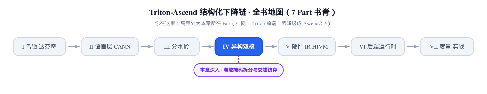
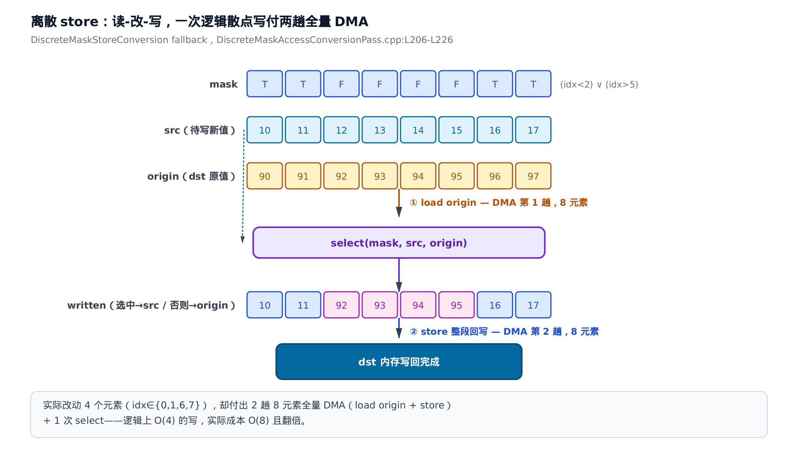
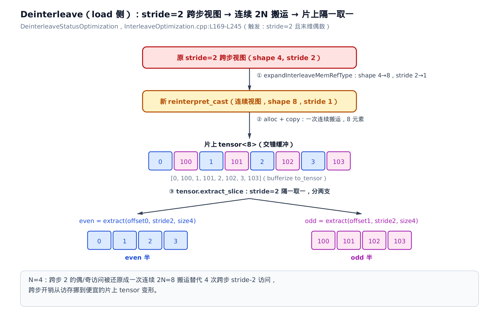
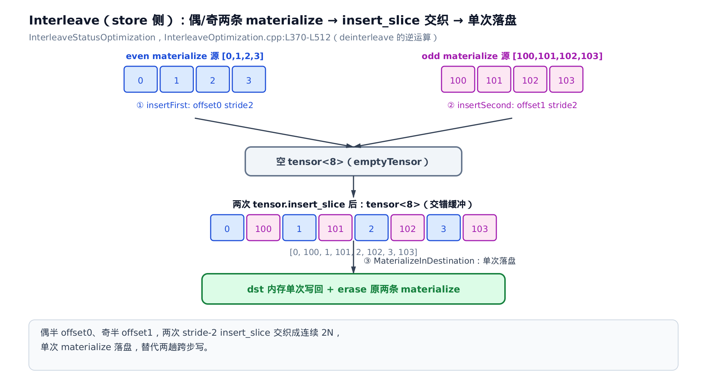

# 不规则访存的驯服：离散掩码拆分与交错访存优化



> 上一章把访存与计算在单核循环里重叠成软件流水线。
> 但真实 kernel 的访存往往不规整：掩码离散、步长交错。
> 本章讲昇腾编译器怎么在下降链里把这些不规则访存驯服成硬件跑得动的形态。

达芬奇架构的向量搬运是**块粒度**的——一次 DMA（Direct Memory Access，直接内存访问，绕过计算单元在片上与全局内存之间搬数据）搬走一整段连续元素，效率最高。可 Triton 里随手写的 `tl.load(ptr, mask=...)` 并不保证 mask 连续：它可能是「东一个、西一个」的散点，也可能是隔一个取一个的交错步长。这两类**不规则访存**没有对应的高效硬件指令，如果放任不管，要么读越界、要么直接编不出来。

[上一章的 DAGSSBuffer](../../ch18-ssbuffer-pipeline/narrative/chapter.md) 处理的是规整循环里「整块搬进搬出」的重叠。本章补上另一半：当访存**不**规整时怎么办。答案分两块，机制上彼此独立，但同属「驯服不规则访存」这一个主题：

- **离散掩码**（mask 画不成一个连续矩形）——`--discrete-mask-access-conversion` 这个 MLIR pass（Pass 是 MLIR 里一趟 IR 变换的基本单位）把它拆成「读-改-写」或「全载 + 屏蔽」，逐元素补救。
- **交错步长**（stride=2 的偶/奇访问）——`InterleaveOptimization` 把它还原成连续 2N 段一次搬完，再在片上 tensor 里做偶奇拆分。

> 只想搞懂「连续 vs 离散为什么决定 DMA 效率」，读 §一 的总闸即可；想跟越界与代价的论证，加读 §四、§五（离散写为什么加倍亏就在 §五）；交错优化是相对独立的第二块，从 §九 起。

一句话先埋在这里：**连续访存一趟 DMA 就够；离散访存的每一次逻辑散点写，实际都要付两趟全量搬运的带宽。** 这就是「离散多亏」的定量答案，后面会一步步算给你看。

---


图上十二个站对应正文一到十二节。入口是 ch13 建立的 `MaskState::parse`——parse 失败才轮到 ①`isDiscreteMask` 判离散（一节），经 ②`collectAndLeaves` 拍平掩码树（二节）、③`decomposeAndMask` 拆出连续护栏与离散选择两组（三节），⑧`runOnOperation` 把三条改写规则组装起来驱动（八节），再扇出到 ④`DiscreteMaskLoadConversion` 安全全载（四节）、⑤`DiscreteMaskStoreConversion` 读-改-写（五节）、⑥`DiscreteMaskAtomicConversion` 选幺元填充（六节）三条改写，其中 ⑤⑥ 都会打上 ⑦`discreteMaskAttrName` 这个跨章标签（七节——[第 14 章](../../ch14-unstructure-fallback/narrative/chapter.md)与[第 17 章](../../ch17-scope-sync/narrative/chapter.md)消费的正是它）。第二块是相对独立的交错访存优化：⑨`expandInterleaveMemRefType` 把末维翻倍（九节）与 ⑩`recountReinterpretCastOffset` 判偶奇（十节）喂给 ⑪`DeinterleaveStatusOptimization` 隔一取一拆偶奇（十一节）和它的逆运算 ⑫`InterleaveStatusOptimization` 交织回一次落盘（十二节），末尾预告下一章。只想抓住「连续 vs 离散为什么决定 DMA 效率、离散为什么多亏」，跳读一、二、五节；只想看跨章打标签这条接线，直奔七节；交错优化是独立的第二块，从九节读起；想跟全程，按序从一读到十二节。

## 一、连续与离散的分水岭：复用 MaskState 判连续

**直觉**：判断一张掩码「连续还是离散」，昇腾没有另造一套分析，而是直接问[上一部分建立的 MaskAnalysis](../../ch13-maskanalysis-extractslice/narrative/chapter.md)——`MaskState::parse` 能不能把这张 mask 还原成一个矩形连续区间？能，就是连续，交给结构化 DMA 路径（也就是 ch13 里把 mask 变成 `extract_slice` 那条）；不能，才是离散，本 pass 接管。判据零重复、与结构化路径天然互斥。

> `MaskState` 是 ch13 建立的掩码解析状态载体：`parse` 把 `arith.cmpi`/`arith.andi` 拼成的掩码表达式递归下降，成功时得到每一维的矩形区间 `offsets`/`dims`。这里只借它的**成败**当分水岭，parse 的内部细节回看 ch13。

**机制**：闸门 `isDiscreteMask` 是个自由函数，只回答一个是非题——「这个访存要不要本 pass 接管」。它有三条出口：

1. 无 mask，或 op 上已经打过 `is_discrete_mask` 标记 → `failure()`（不接管，防重入）。
2. `MaskState::parse` 成功（能还原成矩形连续区间）→ 撤销 parse 产生的副作用 op、再 `failure()`（放行给结构化 DMA）。
3. parse 失败（画不成矩形）→ `success()`（离散，本 pass 接管）。

第 2 条里有个容易漏的细节：`parse` 为了分析会往 IR 里插入辅助 op（常量、算术），**判连续时得先 `eraseInsertedOps` 把这些副作用撤回**，否则放行给下游的 IR 里会残留一堆没人用的死 op。离散分支（第 3 条，parse 失败）走完本 pass 后同样可能留下这类死 op，但不必在这里手动清——本 pass 收尾时统一跑一趟 CSE + Canonicalize（见 §八）会把它们扫掉；只有放行给下游连续路径的这一支，因为要立刻把干净 IR 交出去，才需要在这里当场 `eraseInsertedOps`。


**源码**：总闸只有十四行，把上面三条出口逐字对上：

```cpp
// third_party/ascend/lib/DiscreteMaskAccessConversion/DiscreteMaskAccessConversionPass.cpp:L59-L72
LogicalResult isDiscreteMask(Operation *op, Value mask,
                             PatternRewriter &rewriter) {
  if (!mask || op->hasAttr("is_discrete_mask")) {
    return failure();
  }

  MaskState mstate;
  auto isContMask = mstate.parse(mask, op->getLoc(), rewriter);
  if (!isContMask.failed()) {
    mstate.eraseInsertedOps(op, rewriter);
    return failure();
  }
  return success();
}
```

`isContMask.failed()` 为假，就是 parse 成功、mask 连续——`eraseInsertedOps` 撤回副作用后 `return failure()`，把这个访存交回结构化路径。只有 parse 真的失败，才走到最后一行 `return success()`。判据就这么一句：**连续性 = parse 能否成功**，与 ch13 的结构化下降链共用同一把尺子。而这把尺子只有三种读数、恰好穷尽：顺着 `isDiscreteMask` 的 if / if / return 读下来——「无 mask 或已打 `is_discrete_mask` 标记」「parse 成功（连续）」「parse 失败（离散）」——三者两两互斥、合起来全覆盖，每次调用必落其一；打头那条的 `is_discrete_mask` 早退，还顺手挡掉了同一个 op 被本 pass 二次接管。

---

## 二、拆掩码：andi 树拍平 + broadcast 分配律下推

**直觉**：一张掩码常常是好几个条件用 `&` 串起来的，比如「idx 在有效范围内」`&`「值大于阈值」。要单独判断每个条件是连续还是离散，得先把这串 `&` 像剥洋葱一样拆成一条条独立的原子条件。只有一层特殊——藏在 `broadcast` 里的 `&`，要先像乘法分配律那样把 `broadcast` 分发到每个因子上，才能看清里面的每个条件。

**机制**：`collectAndLeaves` 递归遍历掩码这棵表达式树，把 `arith.andi` 的两枝分别递归、把非 `andi` 节点当叶子收进 `leaves`。关键在 `broadcast(andi(a, b))` 这种形状：`broadcast` 是把小张量沿某维复制放大，如果它的源恰好是个 `&`，就用分配律把它改写成 `broadcast(a) & broadcast(b)`，再各自递归——这样藏在 `broadcast` 里的每个 `&` 因子都能被单独拎出来分析。

拿 `mask = broadcast(a & b) & c`（a、b、c 各是一条 `arith.cmpi` 掩码）走一遍：

<!-- trace: m2 -->

| 轮次 | 当前节点 | defining op 类型 | 动作 | leaves 累积 |
|---|---|---|---|---|
| 1 | andi(broadcast(a&b), c) | arith.andi | 拆两枝：recurse lhs、rhs | [] |
| 2 | broadcast(a&b) | tt.broadcast(src 是 andi) | 分配律下推：造 broadcast(a)、broadcast(b) 各自 recurse | [] |
| 3 | broadcast(a) | tt.broadcast(src 非 andi) | 叶子，push | [bc(a)] |
| 4 | broadcast(b) | tt.broadcast(src 非 andi) | 叶子，push | [bc(a), bc(b)] |
| 5 | c | 非 andi/非 broadcast | 叶子，push | [bc(a), bc(b), c] |

三个 `&` 因子拍平成三个叶子 `[bc(a), bc(b), c]`。


**为什么递归一定停、且不漏不重（不变量）**：每次递归的实参都是原表达式更小的子式——`andi` 递归到它的两个操作数，`broadcast(andi)` 递归到把源的两个操作数各包一层新 `broadcast`（内层比原来的源更小）。子式规模严格下降、有下界（非 `andi`、非 `broadcast(andi)` 的叶子），所以有限步内每条路径都抵达一个叶子并恰好 push 一次。`k` 个 `&` 因子的树拍平成 `k` 个叶子，一次后序遍历 `` $`O(k)`$ ``。

**源码**：

```cpp
// third_party/ascend/lib/DiscreteMaskAccessConversion/DiscreteMaskAccessConversionPass.cpp:L78-L102
static void collectAndLeaves(Value mask, SmallVectorImpl<Value> &leaves,
                             Location loc, PatternRewriter &rewriter)
{
  if (auto andOp = mask.getDefiningOp<arith::AndIOp>()) {
    collectAndLeaves(andOp.getLhs(), leaves, loc, rewriter);
    collectAndLeaves(andOp.getRhs(), leaves, loc, rewriter);
  } else if (auto broadcastOp = mask.getDefiningOp<triton::BroadcastOp>()) {
    // Distribute broadcast over andi so we can inspect each factor separately.
    if (auto innerAnd = broadcastOp.getSrc().getDefiningOp<arith::AndIOp>()) {
      Type dstType = mask.getType();
      Value broadcastA =
          rewriter.create<triton::BroadcastOp>(loc, dstType, innerAnd.getLhs())
              .getResult();
      Value broadcastB =
          rewriter.create<triton::BroadcastOp>(loc, dstType, innerAnd.getRhs())
              .getResult();
      collectAndLeaves(broadcastA, leaves, loc, rewriter);
      collectAndLeaves(broadcastB, leaves, loc, rewriter);
    } else {
      leaves.push_back(mask);
    }
  } else {
    leaves.push_back(mask);
  }
}
```

第一个 `if` 是 `andi` 两枝递归；`else if` 里嵌的 `if (innerAnd)` 就是分配律下推——只有 `broadcast` 的源是 `andi` 时才拆，否则整个 `broadcast` 当一个叶子 push。拍平只是为下一步做准备：把每个叶子单独拿去判连续还是离散。

---

## 三、混合掩码拆 contMask 与 discMask：收窄防越界

**直觉**：拍平后的叶子里，有的能画成一个连续区间（比如「idx < 有效长度」这种尾块边界），有的画不成（比如运行期算出来的值谓词，真值位置东一个西一个）。聪明的做法不是「只要有一个离散因子就全盘当离散」，而是把能画成连续区间的因子挑出来当**安全护栏**，用它收窄搬运范围；剩下管不了的留给逐元素挑选。既不越界，又不放弃能连续的那半。

**机制**：`decomposeAndMask` 先用 `collectAndLeaves` 拍平，再逐个叶子跑 `MaskState::parse`：

- parse 成功**且** `isMask()`（是个纯矩形掩码）→ 归入 `contLeaves`（连续因子）；
- parse 成功但不是 mask（如标量条件），或 parse 失败（离散/运行期）→ 归入 `discLeaves`（离散因子）。

然后把两组各自 `&` 回一张掩码：`contMask`（所有连续因子的与）负责收窄全局内存（GM，Global Memory，片外主存）的访问范围，`discMask`（所有离散因子的与）负责逐元素选择。两组任一为空时对应的掩码是 `nullptr`。

拿 `BLOCK=8`、`contMask = (idx < 6)`（尾块边界，有效长度 6）、`discMask` 真值位置 `{1,3,4,6}` 走一遍。关键看最后一列——如果不拆、直接全载会不会越界：

<!-- trace: m3 -->

| idx | contMask (idx<6) | discMask | combined = cont & disc | 无 contMask 全载是否 OOB |
|---|---|---|---|---|
| 0 | T | F | F | 安全 |
| 1 | T | T | T（选中） | 安全 |
| 2 | T | F | F | 安全 |
| 3 | T | T | T（选中） | 安全 |
| 4 | T | T | T（选中） | 安全 |
| 5 | T | F | F | 安全 |
| 6 | F | T | F（被护栏挡） | OOB（idx≥6） |
| 7 | F | F | F | OOB（idx≥6） |

idx=6 的 `discMask` 虽然为真，但 `contMask` 为假，被护栏挡在外面——它落在 `[validLen, N)` 的越界区，绝不能碰。


**为什么这样收窄零越界（不变量）**：`combined = contMask & discMask`（按位与）意味着 `combined` 为真必有 `contMask` 为真，也就是 combined 的真值集是 contMask 真值集的子集：

```math
\mathrm{combined} \subseteq \mathrm{contMask}
```

load 用 `contMask` 当 mask 参数，硬件只搬 `contMask` 为真的 `[0,6)`；idx=6 虽然 `discMask` 为真但被排除，不触碰 `[validLen, N)` 的未初始化/越界内存。8 元素、有效长度 6：不拆则全载会触碰 idx∈{6,7} 共 2 个越界位置；拆后 load 收窄到 `[0,6)`、`combined` 选中 {1,3,4} 共 3 个，零越界。

**源码**：数据结构 `MaskDecomposition` 装 `contMask`/`discMask` 两个字段，算法逐叶子分流后各自 `&` 回：

```cpp
// third_party/ascend/lib/DiscreteMaskAccessConversion/DiscreteMaskAccessConversionPass.cpp:L104-L151
struct MaskDecomposition {
  // AND of all leaves that MaskState::parse() can analyze as a rectangle mask.
  // nullptr when no such leaves exist.
  Value contMask;
  // AND of all leaves that MaskState::parse() cannot analyze (discrete/runtime).
  // nullptr when no such leaves exist.
  Value discMask;
};

// Decompose an AND-tree mask into its continuous and discrete leaf components
// so that we can use contMask to bound GM accesses while discMask still drives
// the per-element selection.
static MaskDecomposition decomposeAndMask(Operation *op, Value mask,
                                          const Location &loc,
                                          PatternRewriter &rewriter)
{
  SmallVector<Value> leaves;
  collectAndLeaves(mask, leaves, loc, rewriter);

  SmallVector<Value> contLeaves;
  SmallVector<Value> discLeaves;

  for (Value leaf : leaves) {
    MaskState st;
    if (st.parse(leaf, loc, rewriter).succeeded()) {
      if (st.isMask())
        contLeaves.push_back(leaf);
      else
        discLeaves.push_back(leaf);
    } else {
      discLeaves.push_back(leaf);
    }
  }

  Value contMask = nullptr;
  for (Value v : contLeaves)
    contMask = contMask
                   ? rewriter.create<arith::AndIOp>(loc, contMask, v).getResult()
                   : v;

  Value discMask = nullptr;
  for (Value v : discLeaves)
    discMask = discMask
                   ? rewriter.create<arith::AndIOp>(loc, discMask, v).getResult()
                   : v;

  return {contMask, discMask};
}
```

注意分流用的是**同一把尺子**——又是 `MaskState::parse` + `isMask()`，和 §一 总闸的判据完全一致，只是这里逐叶子问、总闸整体问。分好的 `contMask`/`discMask` 接下来会被 load / store / atomic 三条改写路径各取所需。

---

## 四、离散 Load 改写：安全全载 + select 屏蔽

**直觉**：达芬奇的向量搬运没有高效的散点读——想读「东一个、西一个」的元素，硬件做不到只读被选中的那几个。唯一的办法是把整段先全读回来，再把没选中的位置就地擦成缺省值 `other`。

**机制**：`DiscreteMaskLoadConversion` 是一个 `OpRewritePattern<triton::LoadOp>`（MLIR 里匹配并改写某类 op 的重写规则）。它先过 `isDiscreteMask` 早退门，然后给 op 打上 `is_discrete_mask` 标记防重入，再分两条路：

- **分流路径**（`contMask && discMask` 都非空）：用 `contMask` 收窄的安全 load + `arith.select(contMask & discMask, safeLoad, other)`——组合掩码避免选到 load 没覆盖的未初始化内存。
- **fallback 路径**（纯离散，无 `contMask`）：无条件全载 + `arith.select(mask, load, other)`。

拿一个纯离散的例子（掩码是两段区间的「或」，`(idx<2) ∨ (idx>5)`，画不成矩形所以无 `contMask`，走 fallback）：内存值 `mem[idx] = 10+idx`，缺省 `other = 0`。

<!-- trace: m4 -->

| idx | mask = (idx<2)∨(idx>5) | 全载 loaded = 10+idx | select 后 result |
|---|---|---|---|
| 0 | T | 10 | 10 |
| 1 | T | 11 | 11 |
| 2 | F | 12 | 0 |
| 3 | F | 13 | 0 |
| 4 | F | 14 | 0 |
| 5 | F | 15 | 0 |
| 6 | T | 16 | 16 |
| 7 | T | 17 | 17 |

**为什么改写后语义不变（不变量）**：全载拿到每个位置的真实值 `loaded[i]`；`arith.select(mask, loaded, other)` 逐位取舍——`mask[i]` 真取 `loaded[i]`，假取 `other`。对外可见的结果与「只读选中点、其余填 other」逐位相等——多读进来的未选中值被 select 丢弃，不进结果。代价是：为服务 4 个选中点，搬了 8 元素一整趟，2 倍冗余读带宽。

**源码**（省略前面的取值与 `is_discrete_mask` 早退见 §一，以及紧随其后、与 §五 同源的一条 `compileOn91095Flag && forceSimtTemplateFlag` 特殊架构早退分支——该配置下 Load 直接放弃本 pass 的改写、`return failure()`）：

```cpp
// third_party/ascend/lib/DiscreteMaskAccessConversion/DiscreteMaskAccessConversionPass.cpp:L249-L285
    // When mask = contMask & discMask, load only the safe range defined by
    // contMask and use discMask for the per-element select, avoiding OOB reads.
    auto [contMask, discMask] = decomposeAndMask(op, mask, loc, rewriter);
    if (contMask && discMask) {
      if (!other) {
        FailureOr<Value> constant = specializeTypelessValueToConstant(
            TypelessValue::Zero, ptr.getType(), loc, rewriter);
        if (failed(constant)) {
          llvm_unreachable("Unsupported type for constant creation");
        }
        other = *constant;
      }
      auto safeLoad = rewriter.create<triton::LoadOp>(
          loc, ptr, contMask, op.getCache(), op.getEvict(), op.getIsVolatile());
      // Use combined mask to select the result, avoid the uninitialized memory access.
      auto combinedMask = rewriter.create<arith::AndIOp>(loc, contMask, discMask);
      auto discreteMaskOp =
          rewriter.create<arith::SelectOp>(loc, combinedMask, safeLoad.getResult(), other);
      rewriter.replaceOp(op, discreteMaskOp);
      return success();
    }

    // Fallback: original full load + select (contMask absent, pure discrete).
    if (!other) {
      FailureOr<Value> constant = specializeTypelessValueToConstant(
          TypelessValue::Zero, ptr.getType(), loc, rewriter);
      if (failed(constant))
        llvm_unreachable("Unsupported type for constant creation");
      other = *constant;
    }

    auto newLoadOp = rewriter.create<triton::LoadOp>(
        loc, ptr, op.getCache(), op.getEvict(), op.getIsVolatile());
    auto discreteMaskOp =
        rewriter.create<arith::SelectOp>(loc, mask, newLoadOp, other);
    rewriter.replaceOp(op, discreteMaskOp);
    return success();
```

`other` 缺省时用 `specializeTypelessValueToConstant` 造一个 0 常量（`TypelessValue::Zero` 是「幺元」——identity element，参与运算却不改变结果的中性值，比如加法的 0——的类型无关抽象值，§六 会展开讲它怎么按运算类型选取）。两条路的骨架一样：`triton::LoadOp` 全载 → `arith::SelectOp` 屏蔽 → `replaceOp` 换掉原 op，只差 load 用不用 `contMask` 收窄。这段可以对着 lit 测试夹具 `discrete_load` 的 CHECK 印证：原来一条带 mask 的 load，改写后变成「无 mask 全载 + select」，缺省常量正是 `dense<0>`。

---

## 五、离散 Store 改写：读-改-写 + 临界区序列化

**直觉**：离散写比离散读更亏——硬件同样不能只写散点。做法是把目标整段先读回来（origin），在寄存器里用 select 把选中处换成新值、其余保留原值，再整段写回去。**一次逻辑散点写 = 一读一写两趟全量搬运。**

**机制**：`DiscreteMaskStoreConversion` 是 `OpRewritePattern<triton::StoreOp>`。离散 store 无法「部分写」，改成读-改-写三步：load 目标原值 → `arith.select` 拼新值 → store 整段回写。同样分流：`contMask && discMask` 时用 `contMask` 收窄 load 与 store 的范围，防止无保护全载读过尾块边界；否则 fallback 全载。两条都用 `hivm.sync_block_lock`/`unlock` 把这段非原子的读-改-写包成临界区，并给新 store 打上 `DiscreteMask` 属性（下一节会看到它的跨章去向）。

> `hivm.sync_block_lock`/`unlock` 是昇腾 HIVM 方言的一对临界区锁原语（与 [ch08 讲的核间同步 `sync_block_set`/`wait`](../../ch08-scope-sync-pipeline-hints/narrative/chapter.md) 不是一回事：那是点对点事件通知，这是给一段内存加互斥锁）。读-改-写不是原子操作，多核并发写同一段 GM 会丢更新，加锁把它序列化。

拿 `(idx<2) ∨ (idx>5)`、新值 `src = 10+idx`、目标原值 `origin = 90+idx` 走一遍：

<!-- trace: m5 -->

| idx | mask | src（待写新值） | origin（dst 原值） | written = select(mask, src, origin) |
|---|---|---|---|---|
| 0 | T | 10 | 90 | 10 |
| 1 | T | 11 | 91 | 11 |
| 2 | F | 12 | 92 | 92 |
| 3 | F | 13 | 93 | 93 |
| 4 | F | 14 | 94 | 94 |
| 5 | F | 15 | 95 | 95 |
| 6 | T | 16 | 96 | 16 |
| 7 | T | 17 | 97 | 17 |

未选中位置（idx 2–5）写回的正是刚读回来的原值 90+idx，整段写回后它们纹丝不动。



**为什么对未选中位置是恒等（不变量）**：`written[i] = select(mask, src, origin)`——`mask[i]` 假取 `origin[i]`（刚读回的 dst 原值），整段写回后该位置的值不变；真取 `src[i]`。净效果等价于「只改选中点」。`sync_block_lock`/`unlock` 把这段读-改-写序列化，保证并发下「读 origin」与「写回」之间目标段不被别的核改写而丢更新（仅在 `enableSyncBlockLock` 打开时插入）。

代价定量：改 4 个元素，付出 2 趟 8 元素全量 DMA（load origin + store 回写）+ 1 次 select。逻辑上是 `` $`O(4)`$ `` 的写（4 = 选中数），实际成本 `` $`O(8)`$ `` 且翻倍（8 = N）——这就是**离散写「有多亏」的定量答案**。

**源码**（省略前面的 `isDiscreteMask` 早退与一条特定架构的 `IndirectStoreOp` 特殊分支）：

```cpp
// third_party/ascend/lib/DiscreteMaskAccessConversion/DiscreteMaskAccessConversionPass.cpp:L183-L226
    // When mask = contMask & discMask, use contMask to bound GM accesses and
    // discMask to select the final per-element value. This prevents the
    // unguarded full-load from reading past the tail-block boundary.
    auto [contMask, discMask] = decomposeAndMask(op, mask, loc, rewriter);
    if (contMask && discMask) {
      // insert sync_block_lock
      auto lockVar = MemOpConverter::createSyncBlockLockVar(rewriter, loc);
      if (enableSyncBlockLockFlag) {
        rewriter.create<hivm::SyncBlockLockOp>(loc, lockVar);
      }
      auto safeLoad = rewriter.create<triton::LoadOp>(
          loc, dst, contMask, op.getCache(), op.getEvict(), false);
      auto selOp = rewriter.create<arith::SelectOp>(
          loc, discMask, src, safeLoad.getResult());
      auto newStore = rewriter.create<triton::StoreOp>(
          loc, dst, selOp, contMask, op.getCache(), op.getEvict());
      newStore->setAttr(ConverterUtils::discreteMaskAttrName,
                        UnitAttr::get(rewriter.getContext()));
      if (enableSyncBlockLockFlag) {
        rewriter.create<hivm::SyncBlockUnlockOp>(loc, lockVar);
      }
      rewriter.replaceOp(op, newStore);
      return success();
    }

    // Fallback: original full load + select (contMask absent, pure discrete).
    // insert sync_block_lock
    auto lockVar = MemOpConverter::createSyncBlockLockVar(rewriter, loc);
    if (enableSyncBlockLockFlag) {
      rewriter.create<hivm::SyncBlockLockOp>(loc, lockVar);
    }
    auto loadFromDstOp = rewriter.create<triton::LoadOp>(
        loc, dst, op.getCache(), op.getEvict(), false);
    auto selOp = rewriter.create<arith::SelectOp>(loc, mask, src,
                                                  loadFromDstOp.getResult());
    auto newStore = rewriter.create<triton::StoreOp>(
        loc, dst, selOp, op.getCache(), op.getEvict());
    newStore->setAttr(ConverterUtils::discreteMaskAttrName,
                      UnitAttr::get(rewriter.getContext()));
    if (enableSyncBlockLockFlag) {
      rewriter.create<hivm::SyncBlockUnlockOp>(loc, lockVar);
    }
    rewriter.replaceOp(op, newStore);
    return success();
```

两条路都是「lock → load 目标 → select → store → 打属性 → unlock」的对称骨架，只差分流路径的 load/store 带 `contMask`、select 用 `discMask`。这段可以对着 lit 夹具 `discrete_store` 的 CHECK 印证：

```mlir
// third_party/ascend/unittest/Conversion/General/DiscreteMaskAccess/loadstore.mlir:L47-L67
// CHECK-LABEL: tt.func @discrete_store
// CHECK: %[[loaded_value:.*]] = tt.load %[[load_ptr:.*]] : tensor<1024x!tt.ptr<i32>>
// CHECK: %[[origin_value:.*]] = tt.load %[[store_ptr:.*]] : tensor<1024x!tt.ptr<i32>>
// CHECK: %[[store_value:.*]] = arith.select %[[mask:.*]], %[[loaded_value]], %[[origin_value]]
// CHECK: tt.store %[[store_ptr]], %[[store_value]]
tt.func @discrete_store(%arg0: !tt.ptr<i32>, %arg1: !tt.ptr<i32>) {
  %cst = arith.constant dense<0> : tensor<1024xi32>
  %cst_0 = arith.constant dense<200> : tensor<1024xi32>
  %cst_1 = arith.constant dense<400> : tensor<1024xi32>
  %0 = tt.make_range {end = 1024 : i32, start = 0 : i32} : tensor<1024xi32>
  %1 = arith.cmpi slt, %0, %cst_0 : tensor<1024xi32>
  %2 = arith.cmpi sgt, %0, %cst_1 : tensor<1024xi32>
  %3 = arith.ori %1, %2 : tensor<1024xi1>
  %4 = tt.splat %arg0 : !tt.ptr<i32> -> tensor<1024x!tt.ptr<i32>>
  %5 = tt.addptr %4, %0 : tensor<1024x!tt.ptr<i32>>, tensor<1024xi32>
  %6 = tt.splat %arg1 : !tt.ptr<i32> -> tensor<1024x!tt.ptr<i32>>
  %7 = tt.addptr %6, %0 : tensor<1024x!tt.ptr<i32>>, tensor<1024xi32>
  %8 = tt.load %5 : tensor<1024x!tt.ptr<i32>>
  tt.store %7, %8, %3 : tensor<1024x!tt.ptr<i32>>
  tt.return
}
```

掩码 `%3 = ori(slt %0, 200; sgt %0, 400)` 是两段区间的「或」，画不成一个连续矩形 → 判离散。CHECK 印出改写后的三步：`tt.load` 源、`tt.load` 目标原值、`arith.select` 二选一、`tt.store` 回写——正是 fallback 读-改-写路径的最小可核对样例。

---

## 六、离散 Atomic 改写：按运算类型选幺元填充

**直觉**：原子加、原子取最值也不能只挑散点做。诀窍很妙：对整段做原子操作，但把没选中的位置填成该运算的**幺元**（identity element，一个「参与运算却不改变结果」的中性值）——加法填 0、取最小填最大值——让它们参与也不改变结果。

**机制**：`DiscreteMaskAtomicConversion` 是 `OpRewritePattern<triton::AtomicRMWOp>`（RMW = read-modify-write，原子读-改-写）。它查一张幺元表 `initMap`：每种 RMW 运算对应一个类型无关的幺元抽象值，`specializeTypelessValueToConstant` 把它实例化成具体类型的常量，再用 `arith.select(mask, src, 幺元)` 把选中处填 `src`、未选中处填幺元，最后对整段发一条 `tt.atomic_rmw`。

拿 `atomic min i32`、掩码 `(idx<2) ∨ (idx>5)`、`src = [5,3,7,2,9,1,4,8]` 走一遍。min 的幺元是类型最大值 `2147483647`（i32 的最大值）：

<!-- trace: m6 -->

| idx | mask | src | maskedValue = select(mask, src, MAX) | 对全段 atomic min 的影响 |
|---|---|---|---|---|
| 0 | T | 5 | 5 | 参与 |
| 1 | T | 3 | 3 | 参与 |
| 2 | F | 7 | 2147483647 | 无影响（min(t,MAX)=t） |
| 3 | F | 2 | 2147483647 | 无影响 |
| 4 | F | 9 | 2147483647 | 无影响 |
| 5 | F | 1 | 2147483647 | 无影响 |
| 6 | T | 4 | 4 | 参与 |
| 7 | T | 8 | 8 | 参与 |

未选中位置填 MAX，`min(target, MAX) = target`，对目标毫无影响；选中位置填 `src` 正常参与。整段 atomic min 的净效果 = 只 min 那几个选中点。

**为什么幺元填充等价于只做选中点（不变量）**：对可结合运算 `` $`\oplus`$ `` 与它的幺元 `` $`e`$ ``，恒有 `` $`x \oplus e = x`$ ``。给未选中位置填 `` $`e`$ ``，则该位置参与运算却不改结果。所以 add/or/xor 填 0、min/and 填类型 Max、max 填类型 Min，各自的幺元都满足 `` $`x \oplus e = x`$ ``。唯一例外是 `xchg`（交换写）——它没有幺元（任何值都会覆盖目标），这招用不了，只能给它打 `DiscreteMask` 属性 + `return failure()`，把这块延后交给下游的 AscendNPU-IR 后端拆解。

**源码**（省略前面的取值与 `isDiscreteMask` 早退）：

```cpp
// third_party/ascend/lib/DiscreteMaskAccessConversion/DiscreteMaskAccessConversionPass.cpp:L303-L334
    const std::map<RMWOp, TypelessValue> initMap = {
        {RMWOp::FADD, TypelessValue::Zero},
        {RMWOp::ADD, TypelessValue::Zero},
        {RMWOp::UMAX, TypelessValue::Zero},
        {RMWOp::OR, TypelessValue::Zero},
        {RMWOp::MIN, TypelessValue::Max},
        {RMWOp::UMIN, TypelessValue::Max},
        {RMWOp::AND, TypelessValue::Max},
        {RMWOp::MAX, TypelessValue::Min},
        {RMWOp::XOR, TypelessValue::Zero},
        {RMWOp::XCHG, TypelessValue::Undefined},
    };
    assert(initMap.find(rmwOp) != initMap.end());
    auto typelessVal = initMap.at(rmwOp);
    if (typelessVal == TypelessValue::Undefined) {
      // Undefined default value atomic op will be decomposed in AscendNPU-IR
      op->setAttr(ConverterUtils::discreteMaskAttrName,
                  UnitAttr::get(rewriter.getContext()));
      return failure();
    }

    FailureOr<mlir::Value> fill = specializeTypelessValueToConstant(
        typelessVal, src.getType(), loc, rewriter);
    if (failed(fill))
      op->emitError("Unsupported atomic operation.");

    auto maskedValue = rewriter.create<arith::SelectOp>(loc, mask, src, *fill);
    auto newAtomicOp = rewriter.create<mlir::triton::AtomicRMWOp>(
        loc, src.getType(), rmwOp, ptr, maskedValue, mlir::Value(), op.getSem(),
        op.getScope());
    rewriter.replaceOp(op, newAtomicOp);
    return success();
```

`initMap` 就是那张幺元表：`Zero`/`Max`/`Min` 是类型无关的抽象值，`Undefined` 专给 `xchg`。lit 夹具 `atomic.mlir` 逐类型印证 default 常量对得上——比如 `atomic_min_i32`：

```mlir
// third_party/ascend/unittest/Conversion/General/DiscreteMaskAccess/atomic.mlir:L83-L101
// CHECK-LABEL: tt.func @atomic_min_i32
// CHECK: %[[default:.*]] = arith.constant dense<2147483647> : tensor<1024xi32>
// CHECK: %[[value:.*]] = arith.select %[[mask:.*]], %[[origin:.*]], %[[default]]
// CHECK: %[[result:.*]] = tt.atomic_rmw min, acq_rel, gpu, %[[ptr:.*]], %[[value]]
tt.func @atomic_min_i32(%arg0: !tt.ptr<i32>, %arg1: !tt.ptr<i32>) {
  %cst = arith.constant dense<200> : tensor<1024xi32>
  %cst_0 = arith.constant dense<400> : tensor<1024xi32>
  %0 = tt.make_range {end = 1024 : i32, start = 0 : i32} : tensor<1024xi32>
  %1 = arith.cmpi slt, %0, %cst : tensor<1024xi32>
  %2 = arith.cmpi sgt, %0, %cst_0 : tensor<1024xi32>
  %3 = arith.ori %1, %2 : tensor<1024xi1>
  %4 = tt.splat %arg0 : !tt.ptr<i32> -> tensor<1024x!tt.ptr<i32>>
  %5 = tt.addptr %4, %0 : tensor<1024x!tt.ptr<i32>>, tensor<1024xi32>
  %6 = tt.splat %arg1 : !tt.ptr<i32> -> tensor<1024x!tt.ptr<i32>>
  %7 = tt.addptr %6, %0 : tensor<1024x!tt.ptr<i32>>, tensor<1024xi32>
  %8 = tt.load %7 : tensor<1024x!tt.ptr<i32>>
  %9 = tt.atomic_rmw min, acq_rel, gpu, %5, %8, %3 : (tensor<1024x!tt.ptr<i32>>, tensor<1024xi32>, tensor<1024xi1>) -> tensor<1024xi32>
  tt.return
}
```

`min` 的 default 常量 `dense<2147483647>` 正是 i32 max。对照夹具里其它类型可以逐条核对幺元表：`max_i32` default = `-2147483648`（i32 min）、`add_i32` = 0、`and_i32` = `2147483647`、`or_i32` = 0——正好对上 `initMap` 的 `MIN→Max`/`MAX→Min`/`ADD→Zero`/`AND→Max`/`OR→Zero`。

---

## 七、DiscreteMask 属性：本章打上、下游消费的跨章接头

**直觉**：前面几节反复出现一句「给新 store／atomic 打 `DiscreteMask` 属性」。这个属性不是给本 pass 自己看的，而是**贴给下游的一张标签**——告诉后面的 pass「这块访存我判成离散了、已经改写成 select 表示，你接手时得据此处理」。

**机制**：属性名 `discreteMaskAttrName` 的字符串值就是 `"DiscreteMask"`（定义在 `third_party/ascend/include/Utils/Utils.h:L46`）。它是**字符串属性、不是 IR 算子**——别把它当成一个 op 名。本章在两处打上它：离散 store 改写后的新 store（§五）、`xchg` 类无幺元的 atomic（§六）。打上之后，两个下游消费方认这张标签：

- [ch14 的 Unstructure 兜底路径](../../ch14-unstructure-fallback/narrative/chapter.md)——`UnstructureConversionPass` 在 `third_party/ascend/lib/TritonToUnstructure/UnstructureConversionPass.cpp:L284` 见到 `DiscreteMask` 时，把 `select` 表示解回带 mask 的访存、再无条件压进标量化逐点处理。
- `UseAnalysis`（下降链里的一趟分析，判定每个值该走标量路径还是结构化指针路径——细节留给后面讲 TritonToLinalg 下降的章节）——`third_party/ascend/lib/TritonToLinalg/UseAnalysis.cpp:L537` 在见到带 `DiscreteMask` 的 op 时，据此把 mask 的定义链纳入分析；它若不认这张标签，就可能把这处离散访存误当成能走**结构化偏移**（规整、可整块 DMA 的地址表达）的规整访存、生成错误代码。

> ch14 里还有一个名字很像、来源相同、指向的 op 却不同的属性 `is_discrete_mask`（本章 §四给离散 load 打的防重入标记）。两者都由本 pass 打出：`DiscreteMask` 打在 store/atomic 上、`is_discrete_mask` 打在 load 上。名字近、别搞混。还有一个更容易混的是 ch14 自己的 `DiscreteMemAccess`（标量化叶子标记），那是 ch14 内部的东西、与本章无关。

**源码**：属性名的定义与打点，前面几节的代码块里已多次出现（`newStore->setAttr(ConverterUtils::discreteMaskAttrName, ...)`）。定义处只有一行：

```cpp
// third_party/ascend/include/Utils/Utils.h:L46
const std::string discreteMaskAttrName = "DiscreteMask";
```

一根字符串把三个 pass 串成接力：本章判离散、改写、贴标签；ch14 认标签、解包、标量化。这就是把「离散掩码」这个信息从一趟 pass 传给下一趟的最轻量方式——不改数据结构，只在 op 上挂一个单位属性。

---

## 八、Pass 驱动：三个 pattern greedy 应用 + 清死码

**直觉**：前面三条改写规则（load/store/atomic）怎么被真正跑起来？

**机制**：`runOnOperation` 把它们装进一个 `RewritePatternSet`，用 `applyPatternsAndFoldGreedily` 贪婪应用到整个 module，直到没有 op 可改。收尾还额外跑一趟 CSE（公共子表达式消除）+ Canonicalize（规范化），把 `MaskState::parse` 分析时留下的、没人用的辅助 op（常量、算术）清掉——这些是 trivially-dead 的死码，`parse` 作为副作用造出来的。

**源码**：

```cpp
// third_party/ascend/lib/DiscreteMaskAccessConversion/DiscreteMaskAccessConversionPass.cpp:L342-L364
void DiscreteMaskAccessConversionPass::runOnOperation() {
  compileOn91095Flag = this->compileOn91095;
  forceSimtTemplateFlag = this->forceSimtTemplate;
  enableSyncBlockLockFlag = this->enableSyncBlockLock;
  auto moduleOp = getOperation();

  RewritePatternSet patterns(&getContext());
  patterns.add<DiscreteMaskLoadConversion, DiscreteMaskStoreConversion,
               DiscreteMaskAtomicConversion>(patterns.getContext());
  if (failed(applyPatternsAndFoldGreedily(moduleOp, std::move(patterns)))) {
    moduleOp->emitError("failed to apply discrete mask access patterns");
    signalPassFailure();
  }

  // Clean up dead analysis ops left behind by MaskState::parse().
  // These are trivially-dead auxiliary ops (constants, arithmetic) with no
  // users that parse() creates as side effects of mask analysis.
  PassManager pm(&getContext(), moduleOp.getOperationName());
  pm.addPass(createCSEPass());
  pm.addPass(createCanonicalizerPass());
  if (failed(runPipeline(pm, getOperation()))) {
    moduleOp->emitWarning("DiscreteMaskAccessConversion: dead-code cleanup failed");
  }
```

开头三行把 pass 选项拷进文件级 flag（`enableSyncBlockLock` 就是 §五 那个决定要不要加锁的开关；`compileOn91095Flag`、`forceSimtTemplateFlag` 是另一套硬件变体/SIMT 模板的编译开关，与本章离散掩码机制无关，只在 §四/§五 那条特殊架构早退分支里被合起来当条件，读到这里略过即可）。离散掩码这一块到此收尾。下面转向第二块——同属不规则访存、但机制完全独立的交错优化。

---

## 九、交错视图末维翻倍：把 stride=2 还原成连续 2N

离散掩码讲的是「mask 不连续」；交错优化讲的是另一种不规则——**步长交错**。地址本身是规整的，只是隔一个取一个（stride=2，只取偶数位或只取奇数位），常见于复数的实部/虚部分离、或通道交织的布局。stride=2 的 DMA 是跨步搬运，效率远低于连续搬运。

**直觉**：与其跨着步搬，不如把「整段连续的 2N」一次搬回来，再在便宜的片上 tensor 里做偶奇拆分。第一步就是改造 memref（MLIR 描述一块带 shape/stride/offset 内存视图的类型）的描述：把末维的 shape 翻倍、stride 归 1——原本 stride=2 的交错视图，就被重新描述成对「整段连续 2N」的视图。

**机制**：`expandInterleaveMemRefType` 只做一件事——复制原 memref 类型，把末维 shape 乘 2、末维 stride 设为 1，静态 offset 归 0。


**源码**：

```cpp
// third_party/ascend/lib/Utils/InterleaveOptimization.cpp:L49-L68
MemRefType expandInterleaveMemRefType(MemRefType originType) {
  // Double the last dimension shape
  SmallVector<int64_t> shape(originType.getShape());
  shape.back() = shape.back() * 2;

  // Adjuest layout attribute
  StridedLayoutAttr originLayout =
      llvm::dyn_cast<StridedLayoutAttr>(originType.getLayout());
  // If offset is static, just reset it to 0
  auto offset = originLayout.getOffset() == ShapedType::kDynamic
                    ? originLayout.getOffset()
                    : 0;
  // Set last dimension stride to 1
  SmallVector<int64_t> stride(originLayout.getStrides());
  stride.back() = 1;

  return MemRefType::get(
      shape, originType.getElementType(),
      StridedLayoutAttr::get(originType.getContext(), offset, stride));
}
```

`shape.back() *= 2`、`stride.back() = 1`——就这两行是关键。末维 shape 从 4 变 8、stride 从 2 变 1，跨步 2 的交错视图就变成整段连续 2N。DMA 从跨步搬运恢复成一次连续搬运。

**为什么改类型描述不丢数据（不变量）**：原 stride=2 视图覆盖的是 `base + offset·elemSize` 起、步长 `2·elemSize` 的 N 个地址点；新视图把这 N 个点连同它们中间被跳过的另 N 个点一起，用 stride=1 描述成连续的 2N。同一块内存的两种切法而已——被翻倍视图多描述进来的那 N 个点，随后会在片上被隔一取一地筛掉。为什么这样搬回来再筛，取到的下标与原访问逐元素相等，完整证明留到 §十一 的 `extract_slice` 等价论证。

---

## 十、偶还是奇：靠 offset 里的那个「+1」判定

**直觉**：翻倍之后，怎么知道这次交错访问取的是偶数位还是奇数位？看指针 offset 里有没有一个孤零零的「+1」。Triton 生成的地址里，偶列是 `dim*2`、奇列是 `dim*2+1`，那个加 1 就是奇数位的唯一胎记。

**机制**：`recountReinterpretCastOffset` 追 offset 的定义链，配合 `checkIsCaseOffsetValid` 做前置校验。分三种情形：offset 是常量 0（偶）、常量 1（奇）、或者是一个 `arith.addi(x, 1)` 的运行期值（奇，靠 `traceOffset` 追那个常量 1）。判定为奇（`ODD_MODE`）时把末维 offset 归 0，把偶奇的区别交给后续 `insert_slice`/`extract_slice` 的 offset（0 或 1）去承载。

<!-- trace: m10 -->

| 情形 | originOffset | isa 类型 | 有『+1』? | IndexMode | newOffset |
|---|---|---|---|---|---|
| 偶 | dim*2 → 常量 0 | Attribute(IndexAttr) | 无 | EVEN_MODE | 复用原 offset（0） |
| 奇（常量） | 常量 1 | Attribute(IndexAttr) | 有（=1） | ODD_MODE | 归 0 |
| 奇（值） | addi(x, 1) | Value(arith.addi) | 有（traceOffset 命中） | ODD_MODE | 取『+1』前的累加结果 |

**为什么二值判定既互斥又完备（不变量）**：`checkIsCaseOffsetValid` 断言常量 offset 只可能是 0 或 1；值型 offset 的 `addi` 常量操作数必为 1。于是「有『+1』↔ODD、无『+1』↔EVEN」二值互斥、全覆盖。枚举值 `EVEN_MODE=0` / `ODD_MODE=1`（`IndexMode`，`third_party/ascend/include/Utils/InterleaveOptimization.h:L69`），成对的偶/奇 materialize（§十二会展开的「把 tensor 写回 memref」这类搬运算子）用异或校验保证两条恰好互补、不重叠不遗漏：

```math
\mathrm{EVEN} \oplus \mathrm{ODD} = 1
```


**源码**（省略前面 `traceOffset` lambda 的定义，它断言 `addi` 的常量操作数必为 1）：

```cpp
// third_party/ascend/lib/Utils/InterleaveOptimization.cpp:L143-L166
  IndexMode evenOrOdd = IndexMode::EVEN_MODE;
  // Reuse origin offset if there's no 'add constant one'
  OpFoldResult newOffset = originOffset;
  if (llvm::isa<Attribute>(originOffset)) {
    // If offset is constant int(IndexAttr),
    // the int value could only be 0 or 1
    int64_t intOffset = getConstantIntValue(originOffset).value();
    assert((intOffset == 0 || intOffset == 1));
    if (intOffset == 1) {
      evenOrOdd = IndexMode::ODD_MODE;
      newOffset = builder.getIndexAttr(0);
    }
  } else if (llvm::isa<Value>(originOffset)) {
    if (!traceOffset(originOffset.get<Value>().getDefiningOp())) {
      evenOrOdd = IndexMode::ODD_MODE;
      Operation *traceResult = findFirstMatchingOperandDef(
          originOffset.get<Value>().getDefiningOp(), traceOffset);
      assert(traceResult->getNumResults() == 1 &&
             "Offset defining operation must have one result");
      newOffset = traceResult->getResult(0);
    }
  }

  return {newOffset, evenOrOdd};
```

常量分支断言 `intOffset ∈ {0,1}`、值分支靠 `traceOffset` 命中那个 `addi(_,1)`。一个「+1」定偶奇，无需额外传参或元数据。

---

## 十一、Deinterleave（load 侧）：翻倍搬回 + 片上隔一取一

**直觉**：把前两节拼起来——stride=2 的偶/奇访问，先用末维翻倍（§九）把它描述成连续 2N，一次搬回片上，再用 `tensor.extract_slice`（片上 tensor 的切片算子，走 offset/size/stride 三元组）隔一个取一个，分出偶半和奇半。跨步的代价从访存（贵）挪到片上 tensor 变形（便宜）。

**机制**：`DeinterleaveStatusOptimization` 是 load 侧的主流程，触发条件在 `third_party/ascend/lib/TritonToLinalg/LoadStoreConverter.cpp:L436`——末维 stride==2 且末维为偶数时才试。五步：末维翻倍造新 srcType → 新 `reinterpret_cast`（size×2、stride=1、按偶/奇定 offset）→ alloc + copy 把连续 2N 搬上片 → bufferize 回 tensor → `extract_slice`（offset 0 或 1、stride=2、size=N）取出偶/奇半。

拿 N=4、交错缓冲 `[0,100,1,101,2,102,3,103]`（偶半 `[0,1,2,3]` 与奇半 `[100,101,102,103]` 交织）走一遍：

<!-- trace: m11 -->

| 步 | 动作 | 末维 shape / stride | 结果 |
|---|---|---|---|
| 1 | expandInterleaveMemRefType 末维翻倍 | shape 4→8, stride 2→1 | 描述整段连续 2N |
| 2 | 新 reinterpret_cast（size 8, stride 1, offset 由偶/奇定） | 8 / 1 | 连续视图 |
| 3 | alloc + copy 连续 2N 搬上片 | 8 | 片上 [0,100,1,101,2,102,3,103] |
| 4 | bufferize to_tensor | 8 | tensor<8> |
| 5a | extract_slice offset0 stride2 size4 → even | 4 / 2 | [0,1,2,3] |
| 5b | extract_slice offset1 stride2 size4 → odd | 4 / 2 | [100,101,102,103] |



**为什么翻倍 + extract_slice 与原访问逐元素等价（不变量）**：原 stride=2 从 offset `` $`o \in \{0,1\}`$ `` 取 N 个，就是整段 2N 的下标 `` $`o, o+2, \dots, o+2(N-1)`$ ``；扩成连续 2N 搬回后，`extract_slice(offset=o, stride=2, size=N)` 取的正是同一组下标 → 逐元素相等。那 `extract_slice` 的 size 从哪定？看源码 L235：`extractSizes.back() = srcType.getShape().back() / 2`——`srcType` 是**末维翻倍后**的类型（末维 2N），对半一分正好取回 N，就是偶半、奇半各自的长度、两半 size 相等。**能干净对半的根在翻倍这一步**：`expandInterleaveMemRefType` 把末维乘 2，被除的末维恒为偶数（2N），`/2` 必得整数。触发前置里那个「末维为偶数」管的是另一头——它要求**原始末维**（`reinterpret_cast` 上 stride-2 真正读的元素个数，本例的 4）为偶数，是这条交错优化的启用闸：原始末维为奇数就不进这条优化，退回逐元素 copy 那条老路。N=4：一趟连续 2N=8 的搬运替代 4 次跨步 stride-2 访问，even/odd 各抽 4 个。

**源码**（`ptr` 是 `reinterpret_cast` 才进这条优化，否则最后一行 `return failure()` 放弃）：

```cpp
// third_party/ascend/lib/Utils/InterleaveOptimization.cpp:L173-L244
  auto ptr = adaptor.getPtr();
  if (auto reinterpretCast = ptr.getDefiningOp<memref::ReinterpretCastOp>()) {
    auto loc = op.getLoc();

    // 1. Get new source memref type
    auto srcType = expandInterleaveMemRefType(reinterpretCast.getType());

    // 2. Create new ReinterpretCastOp
    auto originCastOffset = reinterpretCast.getConstifiedMixedOffset();
    auto castSize = reinterpretCast.getConstifiedMixedSizes();
    auto castStride = reinterpretCast.getConstifiedMixedStrides();
    // Actually, `castSize` is always constant value as `MemRefType` result
    if (auto lastDimSize = getConstantIntValue(castSize.back())) {
      castSize.back() = rewriter.getIndexAttr(lastDimSize.value() * 2);
    } else {
      return failure();
    }
    // Last element of castStride is also constant value as prerequisite
    // is that last dimension stride of casted memref type is always 2.
    castStride.back() = rewriter.getIndexAttr(1);
    if (!checkIsCaseOffsetValid(originCastOffset)) {
      return failure();
    }
    auto [castOffset, indexMode] =
        recountReinterpretCastOffset(originCastOffset, rewriter);
    auto newCastOp = rewriter.create<memref::ReinterpretCastOp>(
        loc, srcType, reinterpretCast.getViewSource(), castOffset, castSize,
        castStride);

    // 3. Create new memref allocOp
    auto newAllocOp = rewriter.create<memref::AllocOp>(
        loc, MemRefType::get(srcType.getShape(), srcType.getElementType()));

    // 4. Implement memref copy and bufferization back to tensor
    rewriter.create<memref::CopyOp>(loc, newCastOp.getResult(), newAllocOp);
    Value newTensor = rewriter.create<bufferization::ToTensorOp>(
        loc,
        RankedTensorType::get(srcType.getShape(), srcType.getElementType()),
        newAllocOp, true /* restrict */, true /* writable */);

    // 5. Implement tensor extract_slice to represent deinterleave
    // Here use `castOffset` to determine whether even index deinterleave or
    // odd index.
    SmallVector<OpFoldResult> extractOffsets(srcType.getRank(),
                                             rewriter.getIndexAttr(0));
    SmallVector<OpFoldResult> extractStrides(srcType.getRank(),
                                             rewriter.getIndexAttr(1));
    SmallVector<OpFoldResult> extractSizes = llvm::to_vector(
        llvm::map_range(srcType.getShape(), [&](int64_t dim) -> OpFoldResult {
          return rewriter.getIndexAttr(dim);
        }));

    // Adjust extract_slice shape
    switch (indexMode) {
    case IndexMode::EVEN_MODE:
      extractOffsets.back() = rewriter.getIndexAttr(0);
      break;
    case IndexMode::ODD_MODE:
      extractOffsets.back() = rewriter.getIndexAttr(1);
      break;
    }
    extractStrides.back() = rewriter.getIndexAttr(2);
    extractSizes.back() = rewriter.getIndexAttr(srcType.getShape().back() / 2);

    Value deinterleaveSlice = rewriter.create<tensor::ExtractSliceOp>(
        loc, newTensor, extractOffsets, extractSizes, extractStrides);

    rewriter.replaceOp(op, deinterleaveSlice);
    return success();
  }

  return failure();
```

五步逐一对上：`expandInterleaveMemRefType` → `ReinterpretCastOp` → `AllocOp` + `CopyOp` → `ToTensorOp` → `ExtractSliceOp`。`switch (indexMode)` 是偶/奇模式落到 `extract_slice` 末维 offset 的地方——EVEN 取 0、ODD 取 1，`stride=2`、`size=N`。跨步开销就此从访存挪到片上。

---

## 十二、Interleave（store 侧）：两条 materialize 交织成一次落盘

**直觉**：store 侧是 deinterleave 的逆运算。有两条要写的数据——偶半和奇半，各自是一条 `materialize`（把 tensor 落到 memref 的搬运）。与其分两趟跨步写，不如先在片上把它们用 `insert_slice`（`extract_slice` 的逆，往 tensor 里塞一段）交织成连续 2N，再一次落盘。

**机制**：`InterleaveStatusOptimization` 收集成对的偶/奇 materialize（前置校验确认两条的 size/stride 相等、offset 偶奇互补，异或校验为真），造一个 2N 空 tensor，两次 `tensor.insert_slice` 分别把偶半按 offset=0、奇半按 offset=1、都以 stride=2 塞进去，reinterpret_cast 回 memref，单次 `MaterializeInDestinationOp` 落盘，最后 erase 掉原来那两条 materialize。



**源码**（省略前段 L370-L456 的函数签名、两个 `reinterpret_cast` 提取、成对 materialize 校验，以及 2N 目标类型 `dstType` 与空 tensor 的构造）：

```cpp
// third_party/ascend/lib/Utils/InterleaveOptimization.cpp:L457-L511
  // 3. New insert_slice from materialization source into new empty tensor
  SmallVector<OpFoldResult> insertOffsets(dstType.getRank(),
                                          builder.getIndexAttr(0));
  SmallVector<OpFoldResult> insertStrides(dstType.getRank(),
                                          builder.getIndexAttr(1));
  SmallVector<OpFoldResult> insertSizes = llvm::to_vector(
      llvm::map_range(dstType.getShape(), [&](int64_t dim) -> OpFoldResult {
        return builder.getIndexAttr(dim);
      }));
  insertStrides.back() = builder.getIndexAttr(2);
  insertSizes.back() = builder.getIndexAttr(dstType.getShape().back() / 2);
  if (indexModeRecord.first == IndexMode::ODD_MODE) {
    insertOffsets.back() = builder.getIndexAttr(1);
  } else {
    insertOffsets.back() = builder.getIndexAttr(0);
  }
  auto insertFirst = builder.create<tensor::InsertSliceOp>(
      loc,
      llvm::dyn_cast<bufferization::MaterializeInDestinationOp>(
          materializeVec[0])
          .getSource(),
      emptyTensor.getResult(), insertOffsets, insertSizes, insertStrides);

  if (indexModeRecord.second == IndexMode::ODD_MODE) {
    insertOffsets.back() = builder.getIndexAttr(1);
  } else {
    insertOffsets.back() = builder.getIndexAttr(0);
  }
  auto insertSecond = builder.create<tensor::InsertSliceOp>(
      loc,
      llvm::dyn_cast<bufferization::MaterializeInDestinationOp>(
          materializeVec[1])
          .getSource(),
      insertFirst.getResult(), insertOffsets, insertSizes, insertStrides);

  // 4. Reinterpret_cast block arg
  auto newCastSize = firstReinterpretCastOp.getConstifiedMixedSizes();
  auto newCastStride = firstReinterpretCastOp.getConstifiedMixedStrides();
  newCastSize.back() = builder.getIndexAttr(dstType.getShape().back());
  newCastStride.back() = builder.getIndexAttr(1);
  auto newCastOp = builder.create<memref::ReinterpretCastOp>(
      loc, dstType, firstReinterpretCastOp.getViewSource(), newCastOffset,
      newCastSize, newCastStride);

  // 5. Create new bufferization::MaterializeInDestinationOp
  auto newStoreOp = builder.create<bufferization::MaterializeInDestinationOp>(
      loc, insertSecond.getResult(), newCastOp.getResult());
  // Setting writable is necessary as dst is memref type
  newStoreOp.setWritable(true);

  // 6. Erase origin materialization
  materializeVec[0]->erase();
  materializeVec[1]->erase();

  return success();
```

两次 `InsertSliceOp` 一偶一奇（offset 0/1、stride 2），把 `[0,1,2,3]` 与 `[100,101,102,103]` 交织成 `[0,100,1,101,2,102,3,103]`，然后单次 `MaterializeInDestinationOp` 落盘、`erase` 原来那两条跨步写。

**为什么交织不重不漏（不变量）**：`insertFirst` 按 offset∈{0,1}、stride=2 落满偶位或奇位共 N 个槽，`insertSecond` 用互补的 offset 落满剩下 N 个槽——§十 已证的异或校验（EVEN 与 ODD 异或恒为 1）保证成对的这两条 offset 恰好一偶一奇，它们的下标并集正好覆盖 `[0, 2N)` 且互不重叠。所以交织结果与「分两趟按原 stride=2 各写各的」逐元素等价，正是 §十一 deinterleave 的逆运算。触发点在 `third_party/ascend/lib/TritonToLinalg/TritonToLinalgPass.cpp:L1044`——那里收集成对 materialize 来试这条优化。

**带 mask 的变体**：load 侧还有 `DeinterleaveStatusWithMaskOptimization`、store 侧有 `InterleaveStatusWithMaskOptimization`，思路一样，只是多用 mask 的 `scf.if`+`linalg.fill` 并按 subview 收窄范围、额外核对 subview 与 slice 的 offset/size/stride 一致。属于同一机制的细化，这里不展开。

---

## 小结

本章把两类不规则访存分别驯服：

- **离散掩码**：总闸 `isDiscreteMask`（`third_party/ascend/lib/DiscreteMaskAccessConversion/DiscreteMaskAccessConversionPass.cpp:L59`）复用 `MaskState::parse` 判连续 vs 离散（判据零重复）；拆掩码把 `andi` 树拍平、混合掩码分成 `contMask`（护栏收窄防越界）+ `discMask`（逐元素选择）；三条改写路径各有招——load 全载 + select、store 读-改-写 + 临界区锁、atomic 幺元填充；离散写的代价定量为一次逻辑散点写付两趟全量 DMA。
- **交错步长**：末维翻倍把 stride=2 还原成连续 2N，一次搬完；偶/奇靠 offset 里的「+1」判定；load 侧 deinterleave 用 `extract_slice` 隔一取一、store 侧 interleave 用 `insert_slice` 交织，把跨步开销从访存挪到片上 tensor 变形。

这条「连续 = 高效、离散 = 退化」的分流，和基座 Triton 的思路一脉相承——基座（另一本《Triton 源码解读》里的 Coalesce/AxisInfo 一章）靠 `AxisInfo` 分析指针的连续性来决定能否向量化访存；triton-ascend 换到 MLIR 层，用 `MaskState` 的连续性做同一件事。载体不同，判据同源。

离散掩码改写后打上的 `DiscreteMask` 属性，会被 [ch14 的 Unstructure 兜底路径](../../ch14-unstructure-fallback/narrative/chapter.md) 接住，解回 select 表示后压进逐点标量化——那是本条接力的下一棒。

下一章转向另一个方向：Triton 方言表达不了的那些 NPU 专属语义（特殊内存、专用指令）怎么注入进来——TritonAscend 方言与它的几条逃生舱。
