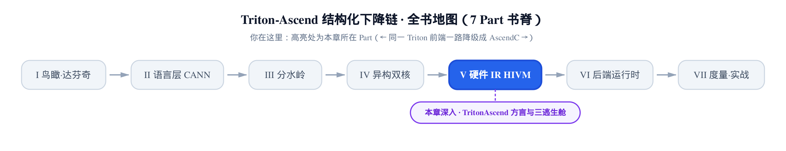
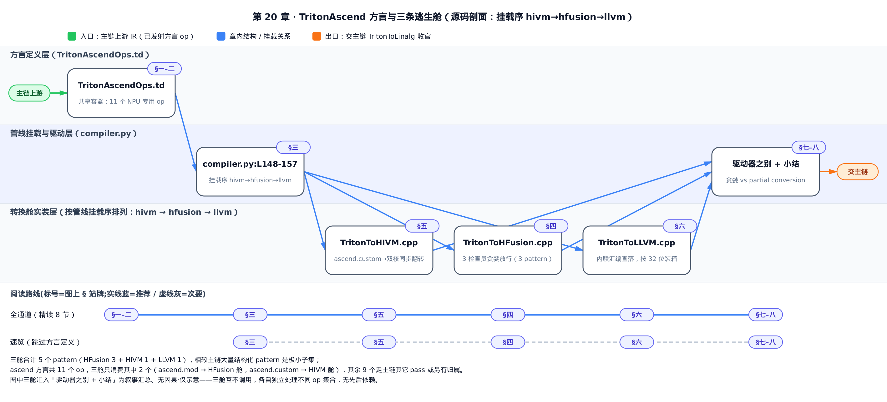
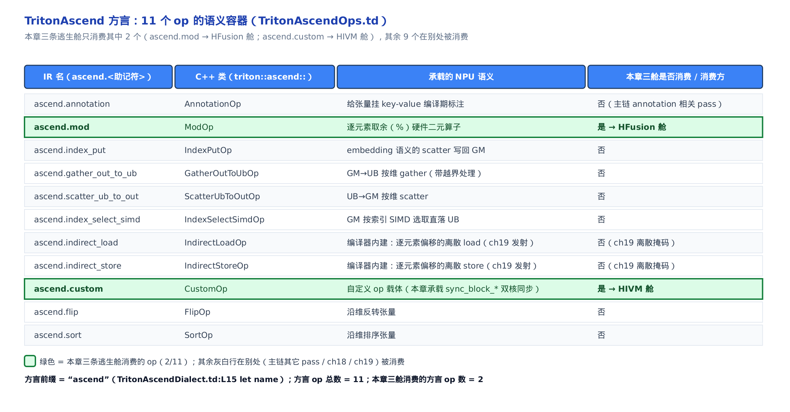
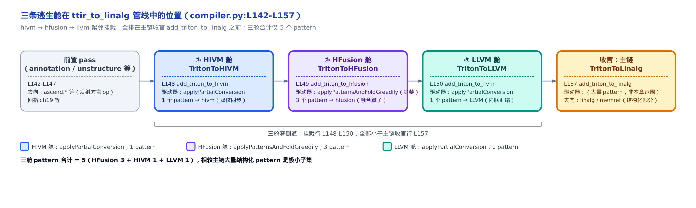

# TritonAscend 方言与三条逃生舱：Triton 表达不了的 NPU 语义如何注入



> 上一部分把指针张量结构化下降成了 linalg。
> 可总有几个 op，主链的结构化下降怎么都吞不下。
> 本章讲这些 op 走的三条窄逃生舱，以及承载它们的 TritonAscend 方言。

[第 10 章的分水岭](../../ch10-watershed-triton-to-linalg/narrative/chapter.md)里，我们数过 `ttir_to_linalg` 这条管线一共 18 趟 pass（Pass 是 MLIR 里一趟 IR 变换的基本单位；MLIR 即 Multi-Level IR，LLVM 系的多层中间表示框架）。那一章的主角是收官的 `add_triton_to_linalg`——它把结构化的指针张量统一下降成 linalg 与 memref。但在它之前，还紧挨着挂了三趟当时一笔带过的小 pass：`add_triton_to_hivm`、`add_triton_to_hfusion`、`add_triton_to_llvm`。这三趟就是本章的主角。

它们存在的理由很简单：**有些 op 主链吞不下**。取一个数的余数、让 cube 核和 vector 核互相同步、用户手写的一段内联汇编——这些要么是 Triton 核心方言（`tt.*`，即上游 Triton 的 IR 词汇表）根本没有的硬件语义，要么形态天生结构化不了。主链 `TritonToLinalg` 是个「通用结构化下降器」，让它去啃这些奇形怪状的硬件专用 op，既不划算也做不对。于是昇腾后端的做法是：**先开一个专门的方言把这些 op 都装起来，再各开一趟窄 pass 把它们分别翻译走**。

这个「专门的方言」叫 **TritonAscend 方言**——它是本部分（HFusion / HIVM 硬件 IR 子系统，即达芬奇 NPU 自己的硬件中间表示；NPU 即 Neural Processing Unit，昇腾的 AI 加速芯片）的开篇。对位到基座那本《Triton 源码解读》，GPU 侧也有一个承载硬件专用语义的方言 `ttng`（Triton Nvidia GPU 方言，装 warp 组、异步拷贝、mbarrier 这些 Hopper 专属 op）；本章讲的 ascend 方言加三条硬件下降舱，就是 NPU 侧的对应物。两边都在解同一个问题：**通用 IR 装不下的硬件语义，得有个地方安放、有条通道下降。**

先约定一个贯穿全章的读法。这一章会反复出现两种名字：一个 op 的 **C++ 类名**（带命名空间，如 `triton::ascend::ModOp`）和它在 IR 里**打印出来的名字**（如 `ascend.mod`）。这两者不是一回事，怎么从前者推出后者、为什么不能想当然，是本章第二节要专门讲的命门。凡是给出一段 IR，我都会标清它处在管线哪个阶段、用的是哪个方言前缀。



想从头把方言容器、命名规则、管线挂载位置一路看到三舱细节，走「全通道」；已经知道方言是什么、只想看三条舱各自具体怎么转换、驱动器有何不同，走「速览」，从 §三管线定位直接跳到三舱与小结。

---

## 一、ascend 方言：主链装不下的 NPU 语义的共享容器

**直觉**。把 ascend 方言想成一个**杂物抽屉**：凡是 Triton 核心方言 `tt.*` 表达不了、主链 `TritonToLinalg` 又结构化不了的 NPU 语义——硬件取余、双核同步、离散 gather/scatter、编译期标注……——都先塞进这一个方言里当共享容器，之后再由各自的窄 pass 分别取走翻译。抽屉本身不干活，它只负责「有个统一的地方安放」。

**机制**。一个 MLIR 方言（dialect，一组自成体系的 op 与类型的命名空间）由一段 `.td` 文件（TableGen 定义，MLIR 用它声明式地生成 op 的 C++ 代码）声明。TritonAscend 方言的声明只有十几行，但两个字段是命门：`let name`（方言登记的名字）和 `cppNamespace`（生成的 C++ 类放进哪个命名空间）。

```tablegen
// third_party/ascend/include/Dialect/TritonAscend/IR/TritonAscendDialect.td:L14-L29
def TritonAscend_Dialect : Dialect {
  let name = "ascend";
  let cppNamespace = "::mlir::triton::ascend";
  let summary = "The TritonAscend dialect in Triton.";

  let description = [{
    TritonAscend is a dialect for representing operations on Ascend NPUs.
  }];

  let dependentDialects = [
    "mlir::LLVM::LLVMDialect",
    "triton::TritonDialect",
  ];

  let extraClassDeclaration = [{}];
}
```

盯住第二行：`let name = "ascend";`。这一个字符串决定了本方言**所有** op 打印出来时点号前的前缀——不是 `tt`、不是 `triton.ascend`，就是干干净净的 `ascend`。第三行 `cppNamespace = "::mlir::triton::ascend"` 是另一码事：它只管生成的 C++ 类塞进哪个命名空间（于是类名写成 `triton::ascend::XxxOp`）。**前缀来自 `name`、命名空间来自 `cppNamespace`，两者互不换算**——这个区分是下一节的地基，先记住。

这个方言里具体定义了几个 op？答案是 **11 个**，全部从同一个 ODS 基类（ODS 即 Operation Definition Specification，MLIR 声明 op 的 TableGen 规范）派生：

```tablegen
// third_party/ascend/include/Dialect/TritonAscend/IR/TritonAscendOps.td:L34-L35
class TT_Ascend_Op<string mnemonic, list<Trait> traits = []> :
  Op<TritonAscend_Dialect, mnemonic, traits>;
```

这个基类 `TT_Ascend_Op` 的第一个模板参数 `mnemonic`（助记符），就是这个 op 打印时点号**后面**那一截。每定义一个 op，都填一个字面字符串给它——后面会看到，正是这个字符串、而非 C++ 类名，决定了 IR 名的后缀。

先看抽屉里最简单的一个 op，`triton::ascend::AnnotationOp`（IR 名 `ascend.annotation`，给张量挂 key-value 编译期标注）：

```tablegen
// third_party/ascend/include/Dialect/TritonAscend/IR/TritonAscendOps.td:L47-L62
def AnnotationOp : TT_Ascend_Op<"annotation", [Pure, MemoryEffects<[MemWrite]>]> {
  let summary = "Annotate a tensor with key-value attribute pairs";
  let description = [{
    `ascend.annotation` operation can be used to annotate a tensor with
    key-value attribute pairs.

    Example:
    ```mlir
    ascend.annotation %target {key : val}
    ```
  }];
  let arguments = (ins TT_Tensor:$src);
  let assemblyFormat = [{
    $src attr-dict `:` type($src)
  }];
}
```

`TT_Ascend_Op<"annotation", ...>`——尖括号里那个 `"annotation"` 就是助记符。它的 C++ 类叫 `AnnotationOp`（放在 `::mlir::triton::ascend` 里，故写全名是 `triton::ascend::AnnotationOp`），但 IR 里印出来是 `ascend.annotation`。注意 `description` 里作者自己写的示例也用的是 `ascend.annotation`——方言登记的名字和实际打印的前缀在这里对上了。

这 11 个 op 各承载一类 NPU 语义，但**它们的消费方是分散的**——不是都由本章这三条舱处理。这一点最容易看混，专门画一张表点清楚：



图里每一行是一个 op，四列分别是 IR 名、C++ 类、承载的 NPU 语义、以及**本章三条舱是否消费它**。绿色高亮的两行——`ascend.mod`（`triton::ascend::ModOp`，逐元素取余）和 `ascend.custom`（`triton::ascend::CustomOp`，自定义 op 载体，本章用它装双核同步）——就是本章三舱会取走的两个。其余 9 个各有归宿：`ascend.annotation` 由主链的 annotation 相关 pass 消费；`ascend.indirect_load` / `ascend.indirect_store` 是[第 19 章离散掩码 pass](../../ch19-discrete-mask-interleave/narrative/chapter.md)发射的编译器内建 op；`ascend.gather_out_to_ub` 这类按维搬运 op 则在 mem_ops 相关的 pass 里落地。

这里要立一个观念，它比「11 这个数」重要得多：**方言是「语义容器」，不是某一条 pass 的私有清单**。11 个 op 定义在一处，但取走它们的 pass 散在各处。所以一看到「ascend 方言有 11 个 op」就以为「这三条舱要处理 11 个 op」，是把「定义」和「消费」混为一谈了——本章三舱其实只消费 2 个。

顺带看一眼「编译器内建 op」长什么样，`ascend.indirect_load`（`triton::ascend::IndirectLoadOp`，用逐元素偏移做离散 load）就是典型：

```tablegen
// third_party/ascend/include/Dialect/TritonAscend/IR/TritonAscendOps.td:L299-L344
def IndirectLoadOp : TT_Ascend_Op<"indirect_load", [
  DeclareOpInterfaceMethods<MemoryEffectsOpInterface>,
  AttrSizedOperandSegments
]> {
  let summary = "Built-in: indirect load from global memory using per-element offsets with optional mask/other";

  let description = [{
    Built-in operation emitted by the compiler for unstructured (discrete) memory
    accesses.These are not written directly in the user IR.
    // … 省略：src / offsets / mask / other 四个参数的逐项说明 …
  }];

  let arguments = (
    ins TT_Ptr:$src,
        TT_IntTensor:$offsets,
        Optional<TT_BoolLike>:$mask,
        Optional<TT_Type>:$other
  );

  let results = (outs TT_Tensor:$result);
  // … 省略：assemblyFormat 与 builders …
}
```

`summary` 和 `description` 里那句 **"emitted by the compiler … not written directly in the user IR"** 是关键：这个 op 用户从来不会自己写，它是[第 19 章](../../ch19-discrete-mask-interleave/narrative/chapter.md)那个离散掩码 pass 在下降过程中**自动发射**出来的。方言在这里扮演的角色，正是「承载主链吞不下的离散访存」——用户写的 `tl.load(ptr, mask=...)` 一旦掩码是散点，就会被拆成这类 `ascend.indirect_load`，暂存在方言里等后续处理。抽屉的用法，到这里就具体了：**它既装用户语义的产物（如 `ascend.mod`），也装编译器自己发射的内建 op（如 `ascend.indirect_load`）。**

## 二、IR 算子名怎么读：方言前缀 + 助记符，绝不从 C++ 类名倒推

这一节是全章的命门。上一节反复强调「C++ 类名」和「IR 打印名」是两回事，这一节把「怎么从前者得到后者」讲死——读错一次，后面所有 IR 就全错了。

**直觉**。C++ 类名是一个 op 的**大名**（`triton::ascend::CustomOp`），IR 里打印出来的是它**名牌上的昵称**（`ascend.custom`）。名牌上写什么，只由两处字面决定：方言登记的 `let name`（前缀）＋ op 定义里 `TT_Ascend_Op<"…">` 尖括号里那个字符串（后缀）。你必须去**读名牌**，绝不能把大名小写一下就当昵称——很多昵称是 snake_case（下划线连词），从驼峰大名根本还原不出来。

**机制**。MLIR 的 AsmPrinter（把 IR 打印成文本的组件）印一个 op 时，规则是固定的：`<方言名>.<助记符>`。这两截各从哪来，上一节的两段源码已经交代：

- 方言名 = `TritonAscendDialect.td:L15` 的 `let name = "ascend"` —— 一个字面常量。
- 助记符 = 每个 op 的 `def` 里 `TT_Ascend_Op<mnemonic>` 那个模板首参 —— 也是一个字面常量。

两截都是 `.td` 里写死的字符串，**跟 C++ 类名、跟 `cppNamespace` 没有任何数据依赖**。C++ 类名 `ModOp` / `CustomOp` 是 tablegen 另外按驼峰约定生成的标识符，它和助记符 `"mod"` / `"custom"` 是**两套独立的字面**，只是碰巧长得像而已。

把这条规则套到几个 op 上，就能看清「倒推」为什么危险：

<!-- trace: m2 -->

| C++ 类（triton::ascend::） | ODS def 行 | 助记符字面（模板首参） | 拼出的 IR 名 = ascend.<助记符> | 从类名倒推会错成 |
|---|---|---|---|---|
| ModOp | TritonAscendOps.td:L68 | `"mod"` | ascend.mod | tt.mod（错方言）/ triton.ascend.mod（三段） |
| CustomOp | TritonAscendOps.td:L388 | `"custom"` | ascend.custom | tt.custom（错方言） |
| IndexPutOp | TritonAscendOps.td:L84 | `"index_put"` | ascend.index_put | ascend.indexput（丢下划线） |
| GatherOutToUbOp | TritonAscendOps.td:L136 | `"gather_out_to_ub"` | ascend.gather_out_to_ub | ascend.gatherouttoub（丢全部下划线） |

前两行看着「小写一下就对了」——`ModOp` → `ascend.mod`、`CustomOp` → `ascend.custom`，好像把类名小写、加个前缀就成。但这是**退化的巧合**：`mod`、`custom` 本身就是单词，小写后恰好等于助记符。真正的坑在后两行：`IndexPutOp` 的助记符是 `"index_put"`（带下划线），`GatherOutToUbOp` 的是 `"gather_out_to_ub"`（三个下划线）。**驼峰类名里没有下划线这个信息**——机械地把 `IndexPutOp` 小写成 `indexput`，就丢了下划线、错成 `ascend.indexput`。而且，就算前缀，从类名也看不出来到底是 `tt.`、`ascend.` 还是别的；只有去读方言的 `let name` 才知道。

**不变量**。本方言全部 11 个 op 的 IR 名，恒等于 `"ascend."` 加上其 `def` 里 `TT_Ascend_Op` 的第一个模板实参——前缀不来自 C++ 命名空间，后缀不来自 C++ 类标识符。论证是基例加结构归纳：基类 `TT_Ascend_Op<mnemonic>` 展开为 `Op<TritonAscend_Dialect, mnemonic>`（上一节 L34-L35 那段），AsmPrinter 的打印规则是 `<dialect.name>.<op.mnemonic>`；`dialect.name` 被 `let name="ascend"` 固定，`op.mnemonic` 就是每个 `def` 尖括号里的字面串——两者都是 `.td` 里的字面常量，与 C++ 类名/命名空间**无任何数据依赖**。故只要经此基类派生（这 11 个全经），IR 名一律 `ascend.<助记符>`，无一例外。`IndexPutOp` → `index_put`、`GatherOutToUbOp` → `gather_out_to_ub` 就是反证：snake_case 助记符里的下划线信息在驼峰类名里已经丢了，机械小写还原必错。

而且这不是苛求细节。11 个 op 里，`index_put`、`gather_out_to_ub`、`scatter_ub_to_out`、`index_select_simd`、`indirect_load`、`indirect_store` 至少 6 个是 snake_case——占了 6/11。也就是说，**多数 op 的名字，从类名倒推就是错的**。所以「去读名牌、别从大名猜」不是洁癖，是正确性要求。本章后面凡出现一个 op，我都会当场把它的 C++ 类名和 IR 名绑一次，就是这个道理。

## 三、三条逃生舱在管线里的位置：主链收官前先把硬件专用 op 舀走

前两节把「抽屉」和「怎么读抽屉里 op 的名字」讲清了。这一节回答：这些 op 是**在什么时候、被谁**从抽屉里取走的。

**直觉**。把 `ttir → linalg` 这条下降链想成一条安检传送带，末端是主链 `add_triton_to_linalg`——它把结构化的东西统一打包。三条逃生舱（hivm / hfusion / llvm）像末端之前的三个**专用侧道**：先把硬件专用、结构化不了的 op 从带上「舀走」各自处理，等主链收官时，带上只剩结构化的部分。三条侧道紧挨着排在主链之前，顺序是 hivm → hfusion → llvm。

**机制**。管线的挂载顺序写在编译器驱动里，一段挨着一段：

```python
# third_party/ascend/backend/compiler.py:L148-L157
        ascend.passes.ttir.add_triton_to_hivm(pm)
        ascend.passes.ttir.add_triton_to_hfusion(pm)
        ascend.passes.ttir.add_triton_to_llvm(pm)
        ascend.passes.ttir.add_bubble_up_operation(pm)
        ascend.passes.ttir.add_triton_to_structure(
            pm,
            enable_mask_fallback_conversion,
            optimize_dynamic_offset
        )
        ascend.passes.ttir.add_triton_to_linalg(
```

`pm` 是 PassManager（MLIR 里按顺序编排 pass 的管理器）。三条舱 `add_triton_to_hivm`（L148）、`add_triton_to_hfusion`（L149）、`add_triton_to_llvm`（L150）紧邻挂载，而主链收官的 `add_triton_to_linalg` 在 L157。行号本身就说明了位置关系：**三舱全排在主链之前（L148、L149、L150 都小于 L157）**。含义就是那句直觉——先把硬件专用 op 从 IR 里舀走（各转成对应的硬件方言），主链再去下降剩下的结构化部分。（L151-156 之间还挂着 `add_bubble_up_operation` 和 `add_triton_to_structure` 两趟 pass，它们不处理 ascend 方言 op、不在本章讨论范围内，图里从简省略；所以这里说的「紧邻」，严格讲是指三条舱彼此背靠背，而非三舱与主链之间零间隔。）



图里从左到右五个框，把这条侧道关系画全了（图里开始出现的 **pattern**：一条「匹配某类 op 就改写成另一形态」的重写规则，下面三节会逐条看）：前置 pass（发射出 `ascend.*` 等方言 op）→ ①HIVM 舱（L148，`applyPartialConversion` 驱动，1 个 pattern，去向 hivm 双核同步）→ ②HFusion 舱（L149，`applyPatternsAndFoldGreedily` 贪婪驱动，3 个 pattern，去向 hfusion 融合算子）→ ③LLVM 舱（L150，`applyPartialConversion`，1 个 pattern，去向 LLVM 内联汇编）→ 收官主链（L157，大量 pattern，去向 linalg / memref）。底部那道大括号点出全章的量化结论：**三舱合计只挂 5 个 pattern（3 + 1 + 1）**，相较主链的大量结构化 pattern 是极小子集。

这三趟，正是[第 10 章分水岭](../../ch10-watershed-triton-to-linalg/narrative/chapter.md)那条 18 趟管线里的三趟——当时只列了名字没展开，本章就是来还这笔账的。也顺带把「逃生舱窄在哪」量化了：一条通用主链管着绝大多数结构化下降，三条窄舱各自只兜几个硬件专用 op，合起来 5 个 pattern。下面三节，一舱一节，逐条看它们各治什么、怎么治。

**先说清一件事：下面三节的讨论顺序，不等于三舱在管线里的挂载顺序。** 管线里三舱按 hivm → hfusion → llvm 挂（见上图，对应 L148 / L149 / L150）；但下面为了循序渐进，改按**转换逻辑从简到繁**排——先讲 HFusion（三名检查员、直接映射，最简），再讲 HIVM（双核同步、落核翻转），最后讲 LLVM（内联汇编、32 位装箱，最繁）。哪一舱先挂载以图为准，节的先后只是讲解次序。

## 四、TritonToHFusion 舱：三名检查员、贪婪放行

**直觉**。HFusion 舱（HFusion 是达芬奇的张量级融合硬件 IR，比 linalg 更贴硬件的一层融合算子）像一个只有 3 名检查员的关口：一名管 `ascend.mod`、一名管 `tt.histogram`、一名管 `tt.fp_to_fp`。它用**贪婪驱动器** `applyPatternsAndFoldGreedily`（MLIR 里反复套用 pattern 直到不动点的重写驱动），检查员遇到不归自己管、或本该走主链的「默认件」（比如默认舍入模式的 `tt.fp_to_fp`），就返回 `failure()` 原样放行，而不是掀翻整个关口——`failure()` 在贪婪驱动下不使整趟 pass 失败。

**机制**。三条 pattern（上一节说过，一条 pattern 就是一条「匹配某类 op 就改写成另一形态」的重写规则）治三类源 op：

- `ascend.mod`（`triton::ascend::ModOp`）→ HFusion 的逐元素二元算子。取余是逐元素的硬件二元运算，直接对应 hfusion 的 elemwise binary，不必绕道 linalg。
- `tt.histogram`（`triton::HistogramOp`，直方图，注意这是 Triton **核心** op、不是 ascend 方言 op）→ `hfusion.histogram`。直方图是 bin 计数，表达不成结构化 linalg，需要专用的 hfusion 直方图算子。
- `tt.fp_to_fp`（`triton::FpToFpOp`，浮点到浮点转换，也是核心 op）**在非默认舍入时** → `hfusion.cast`（带 round_mode 属性）。

注意这里出现一个反直觉的事：三条 pattern 里只有 `ascend.mod` 是 ascend 方言 op，另外两个 `tt.histogram`、`tt.fp_to_fp` 是 Triton **核心** op。它们之所以也走这条舱，是因为主链的结构化下降拿它们没办法、需要专用硬件算子来接。**「走逃生舱」的判据是「主链吞不下」，不是「属不属于 ascend 方言」**——这一点对理解整章的边界很关键。

逐个输入走一遍控制流，就能看清检查员怎么判、怎么放行（表里 RTZ = Round Toward Zero 向零取整、RTNE = Round to Nearest Even 就近取偶，是浮点转换的两种舍入模式，下面详说）：

<!-- trace: m4 -->

| 输入 op | 命中 pattern | 关键分支/判据（行号） | 动作 | 产物 / 返回 |
|---|---|---|---|---|
| ascend.mod（lhs/rhs = tensor<128xi32>） | TritonModToHFusionConversion | L37-38 lhs/rhs 均 RankedTensorType → 不进 L39 failure | L43 tensor.empty(128,i32) + L45 createBinaryOp(BinaryFn::mod) | hfusion.elemwise_binary（mod）→ success（L53） |
| tt.histogram（result = tensor<64xi32>，static） | TritonHistogramToHFusionConversion | L68-70 static 且 numElements=64>0 → numBins=64（非 256 缺省 L67） | L74 create hfusion.histogram(numBins=64) | hfusion.histogram（64 bin）→ success（L77） |
| tt.fp_to_fp（rounding = RTZ） | TritonFpToFpToHFusionConversion | L103 RTZ ≠ RTNE → 不放行；L111-112 RTZ→RoundMode::TRUNC | L129 replaceOpWithNewOp<hfusion::CastOp>(mode=TRUNC) | hfusion.cast（TRUNC）→ success（L132） |
| tt.fp_to_fp（rounding = RTNE，默认） | TritonFpToFpToHFusionConversion | L103 roundingMode==RTNE 成立 → L105 return failure() | op 原样留存，交主链用 arith.truncf/extf（L92-93 注释） | failure()——贪婪下不致 pass 失败（L155-156） |

第一行是最直白的转换：`ascend.mod` 的左右操作数都是带秩张量类型（RankedTensorType），检查员建一个空张量当输出、调 `createBinaryOp` 发一个取余的 elemwise binary，替换掉原 op，返回 `success()`。第二行 histogram 这里特意取 `result = tensor<64xi32>`（静态形状），走的是「静态元素数 = 64 > 0，就用 64 当 bin 数」这条分支——不是缺省回退的 256。

真正体现「逃生舱只兜主链兜不住的窄情形」的，是最后两行的对比。同一个 `tt.fp_to_fp` pattern，**舍入模式（rounding mode，浮点转换时的取整规则）不同、命运两样**：

- RTZ 是**非默认**舍入。arith 方言表达不了它，得靠 hfusion 的 `cast` 带 round_mode 属性来做。于是检查员接手，映射成 `RoundMode::TRUNC`（截断），返回 `success()`。
- RTNE 是**默认**舍入。arith 方言原生支持、能结构化——所以检查员**主动不接**，L105 直接 `return failure()`，把这个 op 原样留在 IR 里，交给主链 `TritonToLinalg` 用 `arith.truncf` / `arith.extf` 去处理。

把这两条 fp_to_fp pattern 的 C++ 源码摊开，`failure()` 放行分支看得更清楚：

```cpp
// third_party/ascend/lib/TritonToHFusion/TritonToHFusion.cpp:L82-L134（裁剪）
struct TritonFpToFpToHFusionConversion
  : OpRewritePattern<triton::FpToFpOp> {
  using OpRewritePattern<triton::FpToFpOp>::OpRewritePattern;

  LogicalResult matchAndRewrite(triton::FpToFpOp op,
    PatternRewriter &rewriter) const final {
    // … 省略：取 input / resultType、校验 srcType/dstType 是 int-or-float …

    // Check if this has a non-RTNE rounding mode
    auto roundingMode = op.getRounding();
    if (!roundingMode.has_value() || roundingMode.value() == triton::RoundingMode::RTNE) {
      // RTNE or no rounding mode specified: let TritonToLinalg handle it
      return failure();
    }

    // Map non-RTNE rounding modes to HFusion rounding mode
    hfusion::RoundMode hfusionRoundMode;
    switch (roundingMode.value()) {
      case triton::RoundingMode::RTZ:
        hfusionRoundMode = hfusion::RoundMode::TRUNC;
        break;
      default:
        return op.emitError("Unsupported rounding mode for HFusion conversion");
    }
    // … 省略：建 destination 张量、按 round_mode 属性发 hfusion::CastOp …
  }
};
```

那句注释 **"RTNE (default) rounding is handled by TritonToLinalg pass using arith.truncf/extf"** 把设计意图写在了脸上：**逃生舱只兜主链兜不住的窄情形**，默认能力范围内的（RTNE）留给主链。当前非 RTNE 里也只支持 RTZ 一种映射，其余非 RTNE 舍入直接 `emitError` 报错。

再看这个 `failure()` 为什么不会搞垮整趟 pass——关键在驱动器。三条 pattern 是这样组装、这样跑的：

```cpp
// third_party/ascend/lib/TritonToHFusion/TritonToHFusion.cpp:L145-L160
void TritonToHFusionPass::runOnOperation() {
  auto module = getOperation();

  // Use greedy pattern rewriter for simpler pattern matching
  // Patterns decide themselves whether to convert (via returning success/failure)
  RewritePatternSet patterns(&getContext());
  patterns.add<TritonHistogramToHFusionConversion>(patterns.getContext());
  patterns.add<TritonFpToFpToHFusionConversion>(patterns.getContext());
  patterns.add<TritonModToHFusionConversion>(patterns.getContext());

  // Apply patterns with greedy rewriting
  // This allows patterns to return failure() without causing pass failure
  if (failed(applyPatternsAndFoldGreedily(module, std::move(patterns)))) {
    signalPassFailure();
  }
}
```

三条 pattern 全 `add` 进一个集合，用 `applyPatternsAndFoldGreedily` 驱动。代码里那两句注释——**"Patterns decide themselves whether to convert"** 和 **"This allows patterns to return failure() without causing pass failure"**——就是 RTNE 放行合法的依据：贪婪驱动下，pattern 返 `failure()` 只表示「这一件我不接」，不是错误。

**不变量**。这趟 pass 有两个性质要论证。一是**放行的合法性**：`applyPatternsAndFoldGreedily` 的语义就是「pattern 自决是否转换」，只有当它整体返回 failed 才 `signalPassFailure`；RTNE 的 fp_to_fp 返 `failure()` 属正常放行、留给主链，不是错误。二是**终止性**：每次 `success` 的重写都用非本类的 op（`hfusion.*` / `tensor.empty`）替换掉源 op，产物不再匹配这 3 条 pattern（它们只匹配 `ascend.mod` / `tt.histogram` / `tt.fp_to_fp`）；于是「可匹配的源 op 集合」严格单调递减、且非负，贪婪重写在有限步内到达不动点。

**量化一下这条舱的宽度**：3 个 pattern，治 3 类源 op；其中只有 `ascend.mod` 是 ascend 方言 op（1/3），histogram、fp_to_fp 是核心 `tt.*` op（2/3，因需专用硬件下降也走此舱）。对照 ascend 方言的 11 个 op，这条舱只消费其中 1 个。

## 五、TritonToHIVM 舱：ascend.custom→双核同步，落核翻转

**直觉**。达芬奇是异构双核架构——cube 核专做矩阵乘、vector 核做逐元素与规约（这套双核模型[第 16、17 章](../../ch16-core-affinity/narrative/chapter.md)已建立）。两核之间要同步，靠一对原语：`sync_block_set` 和 `sync_block_wait`。它们像两户人家之间的门铃：`set` 是「按铃」——发生在按铃人自己的门口（sender 自身核）；`wait` 是「听铃」——发生在对门那户的门口（对端核），对门要一直等到铃响才继续。所以同一个 sender 下，`set` 和 `wait` 天然落在**相反**的两个核上——绝不会自己给自己按铃。

**机制**。要先划清这条舱的边界：它处理的，是**较早一代、不带 pipe 参数的裸 `sync_block_set` / `sync_block_wait` / `sync_block_all`**（用户 API，定义在 `third_party/ascend/language/cann/extension/aux_ops.py`，现已标 `DeprecationWarning`、引导改用 `al.sync_block_*`）。这一代原语在 IR 里不各占一个 op，而是统一塞进 `ascend.custom`（`triton::ascend::CustomOp`，自定义 op 的通用载体）里——全仓唯一创建 `ascend.custom` 的地方，正是给这条裸同步用的（`triton_ascend.cc:L124` 的 `create_custom_op_for_inter_core_sync`）。先看它的定义：

```tablegen
// third_party/ascend/include/Dialect/TritonAscend/IR/TritonAscendOps.td:L388-L400
def CustomOp : TT_Ascend_Op<"custom",  [Pure, MemoryEffects<[MemWrite]>]> {
  let summary = "self-defined custom operation";
  let description = [{
    `ascend.custom` triton custom op is designed to pass self-defined custom operation.

    Example:
    ```ascend.custom {str_args = ["sync_block_wait", "cube"]}
    ```
  }];
  let arguments = (ins StrAttr:$op_name, ArrayAttr:$str_args, Variadic<AnyType>:$args);

  let assemblyFormat = "$op_name attr-dict ($args^ `:` type($args))?";
}
```

`summary` 明写它是「self-defined custom operation」——一个通用自定义 op 通道，同步只是它承载的一类。它有三个参数：`op_name`（字符串，说这是哪种自定义 op）、`str_args`（属性数组，装参数）、`args`（变长操作数）。承载同步时的约定是：`op_name` 放同步动词（`"sync_block_all"` / `"sync_block_set"` / `"sync_block_wait"`），`str_args[0]` 放发起核（`"cube"` / `"vector"` 或 all 模式的 `"all_cube"` 等），`str_args[1]` 放事件号（整数）。（`description` 里那行 `Example` 只是随手示意的语法样子，别按它的字面去数参数——真正的同步载荷布局，以下面 HIVM pass 实际读取的为准。）

这里必须挑明一件事，否则容易把这条舱当成「双核同步入 IR 的主路」：**它其实只服务这一条已废弃的窄用户路径**。真正推荐的新一代 `al.sync_block_set` / `al.sync_block_wait`（带 `sender_pipe` / `receiver_pipe` 参数，`extension/core.py` 的 `create_sync_block`）是在**前端**就直接把 `hivm::SyncBlockSetOp` / `SyncBlockWaitOp` 建出来的；[第 17 章](../../ch17-scope-sync/narrative/chapter.md)讲过的核亲和 pass `DAGSync.cpp` 更是在分析后**自动插入**这两个 hivm 同步 op。这两条路都不经过 `ascend.custom`、也用不到本节这条 pass。换句话说，这条舱窄到只兜一个 deprecated API——这恰是「逃生舱有多窄」最有力的一个例证。

HIVM 舱（HIVM 是达芬奇的硬件 IR，直接建模内存层级、流水线与双核）只挂 1 条 pattern，就是把这个 `ascend.custom` 翻译成具体的 hivm 同步 op。翻译前先要决定：这条同步落在哪个核、配哪个 pipe（pipe 即流水线通道，如 MTE2/MTE3 是搬运通道、FIX 是 cube 的定点通道，[第 7、17 章](../../ch17-scope-sync/narrative/chapter.md)已建立这套 pipe 词汇）。这个决定由一个辅助函数 `GetCoreAndPipes` 两步做出：

```cpp
// third_party/ascend/lib/TritonToHIVM/TritonToHIVM.cpp:L71-L99
static CoreAndPipes GetCoreAndPipes(MLIRContext *ctx,
                                    llvm::StringRef opName,
                                    llvm::StringRef sender) {
  // Step 1: Decide pipes
  PipeAttr producer;
  PipeAttr consumer = PipeAttr::get(ctx, PIPE::PIPE_MTE2);

  if (sender == "cube") {
    producer = PipeAttr::get(ctx, PIPE::PIPE_FIX);
  } else {
    producer = PipeAttr::get(ctx, PIPE::PIPE_MTE3);
  }

  // Step 2: Decide core type
  TCoreTypeAttr core;
  if (sender == "cube") {
    if (opName == "sync_block_set")
      core = TCoreTypeAttr::get(ctx, TCoreType::CUBE);
    else
      core = TCoreTypeAttr::get(ctx, TCoreType::VECTOR);
  } else {
    if (opName == "sync_block_set")
      core = TCoreTypeAttr::get(ctx, TCoreType::VECTOR);
    else
      core = TCoreTypeAttr::get(ctx, TCoreType::CUBE);
  }

  return {core, producer, consumer};
}
```

两步看得很清楚。**Step 1 定 pipe**：consumer（消费侧）无条件设 `PIPE_MTE2`；producer（生产侧）只看 sender——cube 用 `PIPE_FIX`、否则 `PIPE_MTE3`。**Step 2 定核**：在每个 sender 分支里，`opName == "sync_block_set"` 走 if 臂、否则（wait）走 else 臂，两臂赋**相反**的核类型。这就是「门铃」直觉的代码落地——set 落在 sender 自身核、wait 落在对端核。

把两个 sender、两种 op 的 2×2 组合全代进去，落核翻转一目了然：

<!-- trace: m5 -->

| op_name | arg（sender） | producer pipe（step1） | consumer pipe（step1） | core（step2 分支） | 产物 hivm op |
|---|---|---|---|---|---|
| sync_block_set | cube | PIPE_FIX（L79） | PIPE_MTE2（L76） | CUBE（L87-88，落 sender 自身核） | hivm.hir.sync_block_set[CUBE, FIX, MTE2, id=3] |
| sync_block_wait | cube | PIPE_FIX（L79） | PIPE_MTE2（L76） | VECTOR（L90，落对端核） | hivm.hir.sync_block_wait[VECTOR, FIX, MTE2, id=3] |
| sync_block_set | vector | PIPE_MTE3（L81） | PIPE_MTE2（L76） | VECTOR（L92-93，落 sender 自身核） | hivm.hir.sync_block_set[VECTOR, MTE3, MTE2, id=3] |
| sync_block_wait | vector | PIPE_MTE3（L81） | PIPE_MTE2（L76） | CUBE（L95，落对端核） | hivm.hir.sync_block_wait[CUBE, MTE3, MTE2, id=3] |

（表里 `id=3` 是示例事件号，取自 `ascend.custom` 的 `str_args[1]`；产物列的真实 IR 名是三段的 `hivm.hir.sync_block_set[…]`——这仍然是第二节那条「方言前缀 + 助记符」规则：hivm 方言的 op 基类 `HIVM_Op` 给每个助记符都强制拼了个 `hir.` 中缀，所以助记符本身就是 `hir.sync_block_set`，前缀 `hivm.` 加上去正好三段，方括号是它的 `assemblyFormat`。）看第一、二行：sender 都是 cube，`set` 落在 CUBE（自身核）、`wait` 落在 VECTOR（对端核）。三、四行 sender 换成 vector，翻转跟着换向：`set` 落 VECTOR、`wait` 落 CUBE。producer pipe 则只跟 sender 走（cube→FIX、vector→MTE3），跟是 set 还是 wait 无关；consumer pipe 恒是 MTE2。

`GetCoreAndPipes` 算出核和 pipe 之后，pattern 主体按 `op_name` 三分派，发出对应的 hivm 同步 op：

```cpp
// third_party/ascend/lib/TritonToHIVM/TritonToHIVM.cpp:L111-L165（裁剪）
struct TritonCustomOpToHIVMSyncOpConversion
    : OpRewritePattern<triton::ascend::CustomOp> {
  using OpRewritePattern<triton::ascend::CustomOp>::OpRewritePattern;

LogicalResult matchAndRewrite(triton::ascend::CustomOp op,
                              PatternRewriter &rewriter) const final {
  // … 省略：取 args = op.getStrArgs()、arg = str_args[0]、id = str_args[1]（整数） …
  llvm::StringRef opName = op.getOpName();

  if (opName == "sync_block_all") {
    // … 省略：按 arg = all_cube / all_vector / all 三子模式建 SyncBlockOp，未知则报错 …
  }

  if (opName == "sync_block_set") {
    auto [coreAttr, prodPipe, consPipe] = GetCoreAndPipes(ctx, opName, arg);
    rewriter.replaceOp(op, rewriter.create<hivm::SyncBlockSetOp>(
                                loc, coreAttr, prodPipe, consPipe,
                                rewriter.getIndexAttr(id)));
    return success();
  }

  if (opName == "sync_block_wait") {
    auto [coreAttr, prodPipe, consPipe] = GetCoreAndPipes(ctx, opName, arg);
    rewriter.replaceOp(op, rewriter.create<hivm::SyncBlockWaitOp>(
                                loc, coreAttr, prodPipe, consPipe,
                                rewriter.getIndexAttr(id)));
    return success();
  }

  return EmitUnknownOpError(op, opName);
}
};
```

三分派清清楚楚：`sync_block_all` → `hivm::SyncBlockOp`（内部再按 all_cube / all_vector / all 分三子模式）；`sync_block_set` → `hivm::SyncBlockSetOp`；`sync_block_wait` → `hivm::SyncBlockWaitOp`。每条 set/wait 都先调 `GetCoreAndPipes` 拿到落核与 pipe，再把它们连同事件号一起塞进新的 hivm op。`op_name` 或 `arg` 认不出来，一律 `EmitUnknownOpError` 报错——不静默放过。

**不变量**。固定 sender，`sync_block_set` 与 `sync_block_wait` 的落核**恒相反**（set→sender 自身核、wait→对端核）；producer pipe 只由 sender 决定（cube→FIX、否则 MTE3），consumer pipe 恒 `PIPE_MTE2`。落核对称性来自 Step2 的结构：同一 sender 分支里，set 走 if 臂、wait 走 else 臂，两臂赋相反 `TCoreType`——sender=cube 下 set→CUBE / wait→VECTOR，sender=vector 下 set→VECTOR / wait→CUBE。四行全枚举落核为 {CUBE, VECTOR, VECTOR, CUBE}，每个 sender 内成对互补，故 set 核 ≠ wait 核恒成立——语义上保证信号在一核发、在另一核等，绝不自等。pipe 恒定性则来自 Step1：consumer 无条件 MTE2，producer 只依 sender 二选一、与 opName 无关。

**这条舱的宽度**：1 个 pattern，只消费 `ascend.custom` 这 1 个 ascend 方言 op。它落地的这套「set/wait 相对翻转落核」语义，和[第 17 章](../../ch17-scope-sync/narrative/chapter.md) `DAGSync.cpp` 自动插入同步时用的翻转逻辑是同一套直觉（都保证信号在一核发、在另一核等），只是**两处代码各建各的**：那一章是核亲和分析后直接建 `hivm::SyncBlockSetOp` / `WaitOp`，本节则是把废弃 API 落成的 `ascend.custom` 经这条 pass 中转成同样的 hivm op。理解成「同一种双核同步语义的两条独立落地路径」即可，别以为它们共用创建代码。

## 六、TritonToLLVM 舱：内联汇编直落 LLVM，按 32 位装箱

**直觉**。用户有时会在 kernel 里手写一段内联汇编（inline asm，直接嵌进代码的硬件指令）来榨性能。这段汇编是**不透明**的——编译器看不懂它在算什么，没法参与结构化下降，只能旁路直接落成 LLVM 的 inline asm op。落的时候有个装箱问题：硬件寄存器按 32 位一「格」装货。`tt.elementwise_inline_asm` 里每个元素要塞进这些格子——32 位的 f32 正好一格一个；16 位的 f16 两个拼满一格；8 位的 i8 四个拼满一格。`packOperands` 就是这个装箱工。

**机制**。这条舱同样只挂 1 条 pattern。顶层先分两路：

```cpp
// third_party/ascend/lib/TritonToLLVM/TritonToLLVM.cpp:L235-L257
struct ElementwiseInlineAsmOpConversion : OpRewritePattern<triton::ElementwiseInlineAsmOp> {
    using OpRewritePattern<triton::ElementwiseInlineAsmOp>::OpRewritePattern;

    LogicalResult matchAndRewrite(triton::ElementwiseInlineAsmOp op,
                                  PatternRewriter &rewriter) const final
    {
      return op.getOperands().empty() ? processScalarInlineAsm(op, rewriter)
                                      : processVectorInlineAsm(op, rewriter);
    }
};

void TritonToLLVMPass::runOnOperation()
{
    auto module = getOperation();
    ConversionTarget target(getContext());
    target.addLegalDialect<tensor::TensorDialect, LLVM::LLVMDialect, arith::ArithDialect>();

    RewritePatternSet patterns(&getContext());
    patterns.add<ElementwiseInlineAsmOpConversion>(patterns.getContext());
    if (failed(applyPartialConversion(module, target, std::move(patterns)))) {
        signalPassFailure();
    }
}
```

（`runOnOperation` 里的 `ConversionTarget` / `applyPartialConversion` 是什么语义，下一节「驱动器之别」会专门展开；这里只需先信任一点：`addLegalDialect` 声明的方言之外，被 pattern 命中的 op 必须转换成功，否则算失败。）匹配到 `tt.elementwise_inline_asm`（`triton::ElementwiseInlineAsmOp`，逐元素内联汇编，也是核心 op、非 ascend 方言）后：无操作数走标量捷径 `processScalarInlineAsm`，有操作数才走向量路径 `processVectorInlineAsm`（拆元素 → 按格打包 → 逐格发 inline asm → 重排回填）。装箱的核心算术在 `packOperands`：

```cpp
// third_party/ascend/lib/TritonToLLVM/TritonToLLVM.cpp:L52-L77（裁剪）
SmallVector<Value> packOperands(mlir::triton::ElementwiseInlineAsmOp op,
                                const SmallVector<SmallVector<Value>> &operands, RewriterBase &rewriter, Location loc)
{
    SmallVector<Value> packedOperands;
    unsigned numPackedElements = op.getPackedElement();
    for (int i = 0, e = op.getNumOperands(); i < e; i++) {
        Type elemTy = getElementType(op.getOperand(i));
        unsigned bitWidth = elemTy.isIntOrFloat() ? elemTy.getIntOrFloatBitWidth() : 64;
        unsigned numElementPerReg = std::max(32 / bitWidth, 1u);
        numElementPerReg = std::min(numElementPerReg, numPackedElements);
        for (int j = 0; j < numPackedElements; j += numElementPerReg) {
            if (numElementPerReg == 1) {
                packedOperands.push_back(operands[j][i]);
                continue;
            }
            // … 省略：建 vector<numElementPerReg × elemTy>，逐个 InsertElement 填满一格 …
        }
    }
    return packedOperands;
}
```

一格装几个元素，由一行算术定：`numElementPerReg = min(max(32/bitWidth, 1), packedElement)`。先按位宽算「32 位能装几个」，再和 `packedElement`（这条汇编声明的每寄存器元素数）取小。得到每格元素数后，按格步进循环：只装 1 个就直接推进去（不打包），装多个就建一个小向量逐个填满再推。

取 `packedElement = 4`，三种元素类型给三种不同结果：

<!-- trace: m6 -->

| 元素类型 | bitWidth（L59） | max(32/bitWidth,1)（L60） | numElementPerReg=min(·,4)（L61） | packed 操作数个数 = 4 / 该值 | 每寄存器打包形态 |
|---|---|---|---|---|---|
| f32 | 32 | 1 | 1 | 4 | 1 元素/reg（标量，L63-65 不打包） |
| f16 | 16 | 2 | 2 | 2 | vector<2xf16>/reg（L67-72） |
| i8 | 8 | 4 | 4 | 1 | vector<4xi8>/reg（L67-72） |

f32 每格恰好装 1 个（32/32 = 1），走「不打包」的标量分支，4 个元素发 4 格。f16 每格装 2 个（32/16 = 2），打成 `vector<2xf16>`，4 个元素占 2 格。i8 每格装 4 个（32/8 = 4），打成 `vector<4xi8>`，4 个元素塞进 1 格。位宽越小、每格装得越满、发的格数越少。

**不变量**。任一寄存器打包不超 32 位：`numElementPerReg × bitWidth ≤ 32`；打包循环在有限步内终止。位宽界来自 `numElementPerReg = min(max(32/bitWidth,1), packedElement)`——对 bitWidth ≤ 32 有 `numElementPerReg ≤ 32/bitWidth`，故乘回去 `≤ 32`（f16: 2×16=32、i8: 4×8=32、f32: 1×32=32，都恰好或不超一格）。终止性来自循环 `for (j=0; j<numPackedElements; j += numElementPerReg)`：步长 `numElementPerReg ≥ 1`、上界固定，`j` 每轮至少增 1，故有限步到界，每个元素恰被分入一格。

**这条舱的宽度**：1 个 pattern，消费核心 op `tt.elementwise_inline_asm`，不碰任何 ascend 方言 op。至此三条舱数齐：HFusion 3 + HIVM 1 + LLVM 1 = 5 个 pattern。

## 七、驱动器之别：贪婪 vs partial conversion

三条舱数完了，还剩一个细节值得点破：**它们用的驱动器不一样**。HFusion 用 `applyPatternsAndFoldGreedily`（贪婪），HIVM 和 LLVM 用 `applyPartialConversion`（部分转换）。这不是随手选的，是被各自的需求逼出来的。

回看两种 pass 的 `runOnOperation` 尾部。HIVM 是这样收尾的：

```cpp
// third_party/ascend/lib/TritonToHIVM/TritonToHIVM.cpp:L168-L178
void TritonToHIVMPass::runOnOperation() {
  auto module = getOperation();
  ConversionTarget target(getContext());
  target.addLegalDialect<hivm::HIVMDialect>();

  RewritePatternSet patterns(&getContext());
  patterns.add<TritonCustomOpToHIVMSyncOpConversion>(patterns.getContext());
  if (failed(applyPartialConversion(module, target, std::move(patterns)))) {
    signalPassFailure();
  }
}
```

`applyPartialConversion` 要先立一个 `ConversionTarget`（转换目标），声明「哪些方言算合法」——HIVM 把 `hivm::HIVMDialect` 设成 legal，LLVM 把 tensor/LLVM/arith 三方言设 legal。它的语义是：**命中的 op 必须被转成 legal 方言**，转不动就是失败。这贴合 HIVM/LLVM 的处境——它们要么把 `ascend.custom` 转成 hivm 同步 op、要么把 `tt.elementwise_inline_asm` 落成 LLVM inline asm，**命中即必须转**，没有「留在原地」这个选项。

而 HFusion 恰恰需要「留在原地」这个选项。回想第四节：`tt.fp_to_fp` 的 RTNE 分支要主动 `failure()` 放行，把 op 原样留给主链。这在 `applyPartialConversion` 下会被判成「该转没转成 = 失败」；只有 `applyPatternsAndFoldGreedily` 的语义才允许「pattern 自决 success/failure、返 failure 不使 pass 失败」。所以 HFusion 必须用贪婪驱动——**它的 pattern 需要「我不接、放行」这个合法出口**。

一句话收束：**「命中即必须转」的用 partial conversion（HIVM、LLVM），「pattern 要能选择放行」的用贪婪（HFusion）**。驱动器的选择，直接由「这条舱允不允许 pattern 放行」决定。

## 八、对位基座与小结

**对位基座**。这套「专门开一个方言装硬件专用语义、再各开窄 pass 下降」的思路，基座那本《Triton 源码解读》里也有对应物。GPU 侧的 `ttng` 方言（Triton Nvidia GPU 方言）装的是 warp 组、异步拷贝、mbarrier 这些 Hopper 专属 op——同样是「核心 IR 装不下的硬件语义，单开一个方言安放」。差别在硬件：GPU 侧的硬件方言服务于同一个 SM 内的 warp 分工，昇腾侧的 ascend 方言 + 三条舱服务于 cube / vector 两颗**异构物理核**的分工与同步。两边解的是同一个抽象问题，落到两套硬件、两套方言。

**小结**。本章把[第 10 章](../../ch10-watershed-triton-to-linalg/narrative/chapter.md)那 18 趟管线里当时一笔带过的三趟还了账：

1. **TritonAscend 方言是共享容器**（`let name = "ascend"`，11 个 op）——凡主链 `TritonToLinalg` 吞不下的 NPU 语义都先塞进来，消费方分散在各处，本章三舱只取走 `ascend.mod`、`ascend.custom` 两个。
2. **IR 名的读法是命门**：IR 名 = 方言前缀 `ascend.` + ODS 助记符（`TT_Ascend_Op` 尖括号里那个字面串），**绝不从 C++ 类名倒推**——11 个 op 里 6 个是 snake_case，机械倒推必错。
3. **三条逃生舱共 5 个 pattern**：HFusion（3，贪婪，治 `ascend.mod` / `tt.histogram` / `tt.fp_to_fp` 非 RTNE）、HIVM（1，partial conversion，治 `ascend.custom` 里的双核同步）、LLVM（1，partial conversion，治 `tt.elementwise_inline_asm`）。它们全排在主链收官之前，先把硬件专用 op 舀走，主链再下降剩下的结构化部分。
4. **驱动器之别不是偶然**：需要放行的用贪婪，命中即必须转的用 partial conversion。

一个反复出现的判据值得再敲一遍：**「走逃生舱」的标准是「主链吞不下」，不是「属不属于 ascend 方言」**——5 类源 op 里只有 2 类是 ascend 方言 op，另外 3 类是核心 `tt.*` op，因需专用硬件下降也走了这几条窄舱。

三条舱把硬件专用 op 各转成了 hivm / hfusion / LLVM 三种硬件方言。其中 hfusion 与 hivm 这两个方言，本章只当「去向」提了一句，它们自己是什么、里面有哪些 op、怎么继续往下降到 AscendC 库调用——正是本部分接下来要一层层展开的主题。下一章先从 **HFusion 方言**本身讲起：linalg 之上这一层张量级融合 IR，怎么把结构化算子上抬成可融合的形态。
