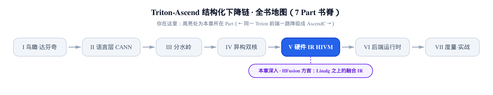
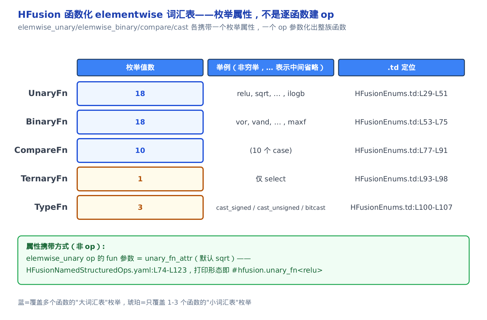
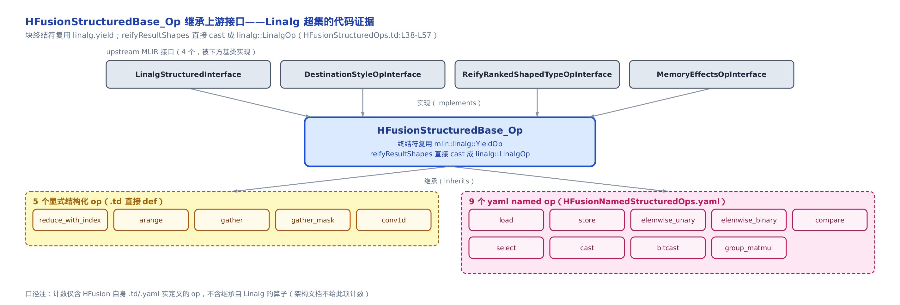
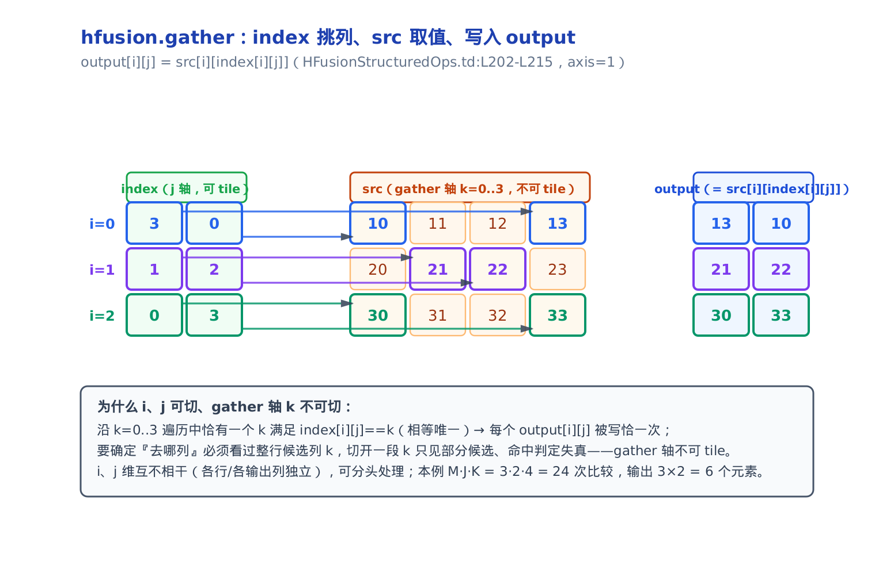
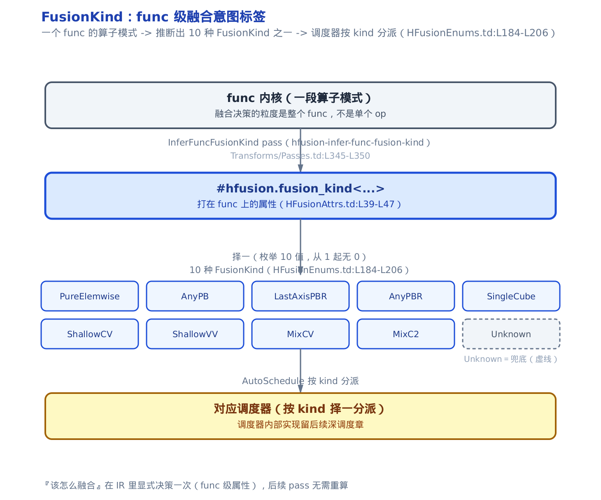
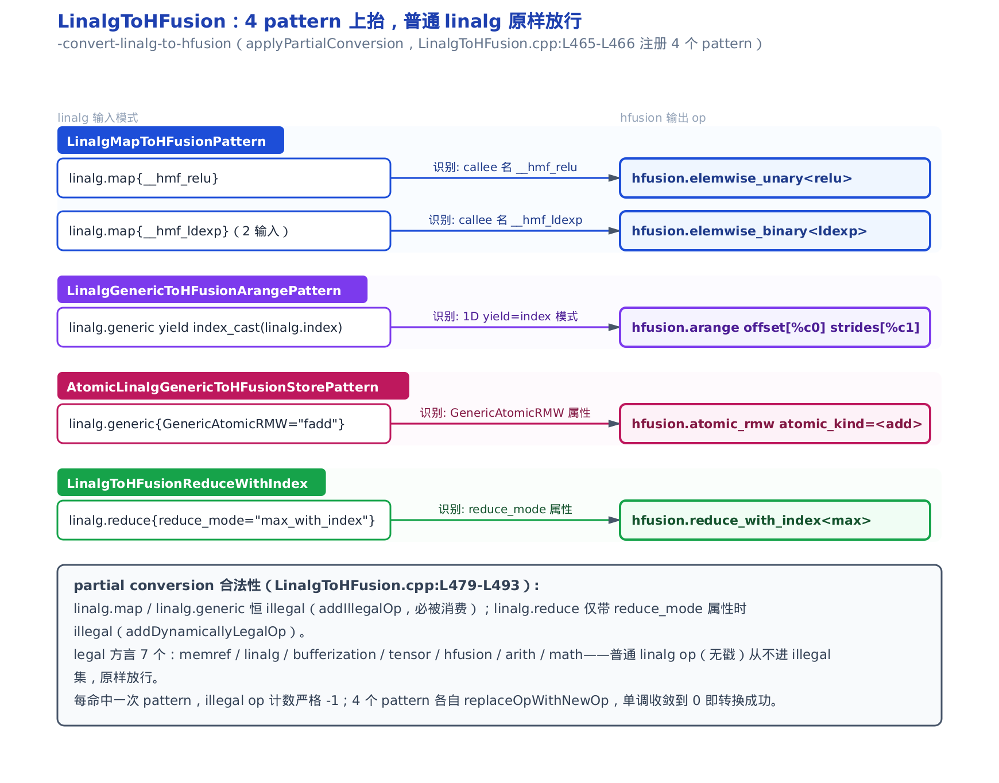

# HFusion 方言：Linalg 之上的张量级融合 IR 与算子上抬



> 上一章开了 TritonAscend 方言，三条舱把硬件专用 op 送去了 hivm / hfusion / llvm。
> 其中 hfusion 是什么、里面有哪些 op，当时只当「去向」提了一句。
> 本章把 HFusion 方言本身摊开：它比 Linalg 多了什么，又怎么继承 Linalg。

[上一章](../../ch20-tritonascend-dialect-escapes/narrative/chapter.md)结尾，三条逃生舱把 Triton 表达不了的硬件专用 op 各自转成了 hivm / hfusion / LLVM 三种硬件方言。其中一条舱（`add_triton_to_hfusion`）把 `tt.histogram`、`ascend.mod`、`tt.fp_to_fp` 这些 op 送进了一个叫 **HFusion** 的方言。当时我们只说了它们「去了 hfusion」，没说 hfusion 里到底住着什么。

这一章就住进去看。HFusion（Hybrid Fusion，昇腾自研的融合方言）是达芬奇下降链上承前启后的一层：往上，它建在 [第 9 章](../../ch09-mlir-linalg-primer/narrative/chapter.md)讲的 **Linalg 方言**之上（Linalg 是 MLIR 里做结构化张量 codegen 的核心方言，codegen 即 code generation、代码生成）；往下，它再降到硬件细节感知的 HIVM 方言。它夹在中间，专门干一件 Linalg 干不了的事：**把「这一坨算子该怎么融合成一个内核」这件意图，显式写进 IR**（IR 即 Intermediate Representation，编译器的中间表示）。

对位到基座那本《Triton 源码解读》，GPU 侧也有一章讲方言的 op 词汇表——[第 19 章](../../../../triton/artifacts/ch19-tt-dialect-vocabulary/narrative/chapter.md)把 `tt.*`（上游 Triton 核心方言）的算子逐个数了一遍。本章是昇腾侧的对应物，也是一张「方言词汇表」。但有个关键差别：`tt.*` 是块级编程模型的通用词汇，HFusion 却站在 Linalg 之上、还额外背着**融合意图**。所以它不是「又一张平级词汇表」，而是「Linalg 超集 + 一层融合语义」。这一层多出来的东西，正是本章要讲清的。

先约定读法，和上一章一致。凡给出一段 IR，我都标清它用的是哪个方言前缀。HFusion 的所有 op 一律打印成 `hfusion.<助记符>`（如 `hfusion.gather`、`hfusion.atomic_rmw`）——这个前缀来自方言定义里的一行 `let name = "hfusion"`，助记符来自每个 op 定义的 `def XxxOp : HFusion_Op<"助记符">`，**不从 C++ 类名倒推**（上一章第二节把这条命门讲透了）。还要分清一件事：`UnaryFn`、`FusionKind` 这些不是 op，是**枚举属性**——本章会反复强调这条界线。

想按顺序把方言身份、词汇表、结构化基类、融合意图、上抬 pass 一路看下来，顺读即可；只想搞懂「HFusion 比 Linalg 到底多了什么」，读完下面第一节就有了主干答案，再挑第七、第八节看融合意图与上抬。


图上「完整通读」和「只读主干」两条路线，就是上一段文字选读指引的可视化版：完整通读对应第一节到第十节逐站不漏；只读主干只经第一节，再跳到第七节「FusionKind」与第八节「上抬」收尾。

## 一、为什么 Linalg 之上还要再加一层融合 IR

先问一个直觉问题：Linalg 已经能表达张量上的 elementwise、reduce、matmul 了，为什么还要在它头上再搭一层 HFusion？

答案是三件 Linalg 缺的东西，HFusion 各补一件。

**第一，词汇不够。** Linalg 的 elementwise 只覆盖通用数学函数（abs / exp / log 这类）。可昇腾 NPU（Neural Processing Unit，昇腾的 AI 加速芯片）硬件直算的函数远不止这些——`relu`、`rsqrt`、`tan`、`tanh`、`atan`、`ilogb`、`log1p`、`ldexp` 都是硬件一条指令能出的。还有 `gather`、`sort`、`histogram`、微缩放矩阵乘（后面会讲）这类算子，Linalg 社区压根没有。HFusion 以「扩展集」的身份把这些补齐。

**第二，意图缺失。** Linalg 只描述「这个算子算什么」，不携带「这一坨算子该怎么融合成一个内核」。而在 NPU 上，融合成什么形态、cube 核和 vector 核怎么配合，是决定性能的大事。HFusion 用一个叫 **FusionKind** 的枚举（10 种）把融合意图显式写进 IR，让后续调度器照着办。

**第三，得兼容。** 补了词汇、加了意图，可不能把 Linalg 那套成熟的变换栈（tiling、融合、bufferization、shape 推断）丢掉。HFusion 的做法很干脆：它的结构化 op **直接实现 Linalg 的上游接口**（基类定义在 `HFusionStructuredOps.td`，第四节逐行拆）。于是它加了新词汇、新意图，却对上游整套结构化 codegen 变换天然合法。

一句话收束：**HFusion = 保住 Linalg 全部能力 + 扩展 NPU 词汇 + 注入融合意图**。这三件事，就是本章接下来五节的骨架——身份（它凭什么算 Linalg 之上一层）、词汇表（扩展了哪些函数）、结构化基类（怎么保住 Linalg 能力）、专属 op（补了哪些新算子）、融合意图（FusionKind），最后两节讲 Linalg 怎么一步步上抬进 HFusion。

> 一个诚实边界要先交代：本章所有「前后 IR 对照」的数值，都不是真机跑出来的。host 上没有昇腾编译器 `bishengir-opt`，跑不了这些 pass。所以下面凡出现「上抬后长这样」，取的是项目**自带的 lit 测试夹具**里作者写死的 `// CHECK` 期望——那是 pass 的**合约输出**，是权威值，但不是真机 emit 的指令。gather 那张数值表则是按 `.td` 里写的三重循环语义，用纯 host Python 复算坐实的。

## 二、hfusion 方言的身份：一行 name，一串依赖

方言（dialect）说白了就是一个命名空间加一套 op 的容器。HFusion 的容器定义只有短短十几行，却把三件身份信息都点清了。

```tablegen
# third_party/ascend/AscendNPU-IR/bishengir/include/bishengir/Dialect/HFusion/IR/HFusionBase.td:L30-L47
def HFusion_Dialect : Dialect {
  let name = "hfusion";
  let description = [{
    Hybrid Fusion (HFusion) dialect.
  }];
  let cppNamespace = "::mlir::hfusion";
  let dependentDialects = [
    "hacc::HACCDialect",
    "linalg::LinalgDialect",
    "mathExt::MathExtDialect",
#ifndef __LLVM_MAJOR_VERSION_22_COMPATIBLE__
    "mesh::MeshDialect",
#endif
    "symbol::SymbolDialect"
  ];
  let hasCanonicalizer = 1;
  let useDefaultAttributePrinterParser = 1;
}
```

`let name = "hfusion"` 这一行就是全章的命名权威：这个方言里所有 op，打印出来一律是 `hfusion.` 打头。`cppNamespace = "::mlir::hfusion"` 说的是 C++ 侧代码住在 `mlir::hfusion` 这个命名空间——写 IR 时用 `hfusion.gather`，写 C++ 类时用 `hfusion::GatherOp`，两者井水不犯河水。

真正泄露身份的是 `dependentDialects` 那串依赖，尤其里头明晃晃写着 `"linalg::LinalgDialect"`。这不是随手加的——它是「HFusion 建在 Linalg 之上」在代码层的**第一处硬证据**：HFusion 的 op 在定义与下降中会直接引用 Linalg 的类型、接口、甚至复用它的块终结符（下一节就会看到）。所以加载 HFusion 时，MLIR 会确保 Linalg 也一并注册。（末尾 `hasCanonicalizer = 1`、`useDefaultAttributePrinterParser = 1` 是常规 dialect 配置项——一个声明本方言带规范化 pattern、一个让属性用默认打印/解析器，跟本章主题无关，略过不展开。）

紧跟这段之后（这里省略未展开），Base.td 还定义了 7 个枚举属性的包装：`UnaryFnAttr` / `BinaryFnAttr` / `CompareFnAttr` / `TernaryFnAttr` / `TypeFnAttr` / `RoundModeAttr` / `AtomicKindAttr`。它们的作用是把「枚举值」包成能挂在 op 上的「属性」，打印成 `#hfusion.unary_fn<relu>` 这种形态。这里头的 `RoundModeAttr` 用于 `cast` 类 op 的舍入模式（浮点转定点/低精度时朝哪个方向取整），本章后面不再用到、有意搁置。记住其余这几个名字——下一节的主角就是它们背后的枚举。

## 三、函数化 elementwise 词汇表：一个 op 参数化整族函数

假设你要给方言加 18 个一元数学函数。最笨的办法是造 18 个 op：`hfusion.relu`、`hfusion.sqrt`、`hfusion.rsqrt`……每加一个函数，方言就胖一圈，pattern 和调度器都得跟着改 18 处。

HFusion 不这么干。它只造**一个** op `elemwise_unary`，让这个 op 背一个枚举属性 `fun`——`fun` 取 `relu` 就是 relu，取 `sqrt` 就是 sqrt。一个 op 参数化出整族一元函数。这就是「函数化 elementwise」：**用属性扩展词汇表，而不是用 op 数量**。

这些可选的函数值，全登记在一个枚举里。以一元函数枚举 `UnaryFn` 为例：

```tablegen
# third_party/ascend/AscendNPU-IR/bishengir/include/bishengir/Dialect/HFusion/IR/HFusionEnums.td:L28-L51
// Define the function attribute enums matching the OpDSL functions.
def UnaryFn : I32EnumAttr<"UnaryFn", "", [
  I32EnumAttrCase<"relu", 0>,
  I32EnumAttrCase<"sqrt", 1>,
  I32EnumAttrCase<"rsqrt", 2>,
  I32EnumAttrCase<"rec", 3>,
  I32EnumAttrCase<"vnot", 4>,
  I32EnumAttrCase<"tanh", 5>,
  I32EnumAttrCase<"sin", 6>,
  I32EnumAttrCase<"cos", 7>,
  I32EnumAttrCase<"atan", 8>,
  I32EnumAttrCase<"tan", 9>,
  I32EnumAttrCase<"absi", 10>,
  I32EnumAttrCase<"erf", 11>,
  I32EnumAttrCase<"log2", 12>,
  I32EnumAttrCase<"log10", 13>,
  I32EnumAttrCase<"log1p", 14>,
  I32EnumAttrCase<"exp2", 15>,
  I32EnumAttrCase<"expm1", 16>,
  I32EnumAttrCase<"ilogb", 17>
]> {
  let genSpecializedAttr = 0;
  let cppNamespace = "::mlir::hfusion";
}
```

`I32EnumAttr` 就是「用一个 32 位整数编码的枚举属性」（ODS 里定义枚举的标准写法；ODS 即 Operation Definition Spec，MLIR 用 TableGen 声明 op 的规范）。数一下：`relu`(0) 到 `ilogb`(17)，整整 **18** 个一元函数，全塞在这一个 `UnaryFn` 枚举里。同文件紧接着定义了二元函数枚举 `BinaryFn`（`vor` / `vand` / `minf` / `maxf` / `powf` / `ldexp` / `powi` 等 **18** 个）、比较枚举 `CompareFn`（**10** 个）、三元枚举 `TernaryFn`（只有 `select` 一个）、类型转换枚举 `TypeFn`（`cast_signed` / `cast_unsigned` / `bitcast`，**3** 个）。

下面这张图把五个枚举的规模、举例值、`.td` 出处一并摆出来——注意每一格都在强调同一件事：**这些是属性值，不是 op**。



那这个枚举怎么挂到 op 上？看承载它的 named op `elemwise_unary` 是怎么声明的。HFusion 的 named 结构化 op 用一种 OpDSL 风格的 YAML 声明（OpDSL 是 MLIR 用来声明式定义结构化 op 的领域特定语言，DSL 即 Domain-Specific Language），构建期展开成 op 定义：

```yaml
# third_party/ascend/AscendNPU-IR/bishengir/include/bishengir/Dialect/HFusion/IR/HFusionNamedStructuredOps.yaml:L72-L100（节选）
--- !HFusionOpConfig
metadata: !HFusionOpMetadata
  name: elemwise_unary
  cpp_class_name: ElemwiseUnaryOp
  doc: |-
    Applies the unary function fun elementwise.
    ...
structured_op: !HFusionStructuredOpConfig
  args:
  - !HFusionOperandDefConfig
    name: I
    kind: input_tensor
    ...
  - !HFusionOperandDefConfig
    name: O
    kind: output_tensor
    ...
  - !HFusionOperandDefConfig
    name: fun
    kind: unary_fn_attr
    default_fn: sqrt
  - !HFusionOperandDefConfig
    name: cast
    kind: type_fn_attr
    default_fn: cast_signed
```

看 `fun` 这个 operand：它的 `kind` 是 `unary_fn_attr`，默认值 `sqrt`。这就是把 `UnaryFn` 枚举当属性携带的地方——IR 里写出来是 `hfusion.elemwise_unary ... {fun = #hfusion.unary_fn<relu>}`。旁边那个 `cast` operand（`kind` 为 `type_fn_attr`、默认 `cast_signed`）是可选的类型转换，复用上一段数过的 `TypeFn` 枚举，用于函数计算前后需要变换数据类型的场景，本章不展开。这个 YAML 一共声明了 **9** 个 named op（`load` / `store` / `elemwise_unary` / `elemwise_binary` / `compare` / `select` / `cast` / `bitcast` / `group_matmul`），下一节讲它们和显式定义的结构化 op 共享同一个基类。

一句话收尾这一节：HFusion 把「NPU 扩展的一元/二元函数族」全塞进 `elemwise_unary` / `elemwise_binary` 两个 op 里，靠枚举参数化。别把 `relu` 看成 `hfusion.relu` 那样的 op——它是 `#hfusion.unary_fn<relu>` 这个属性值。这条界线（op 名 vs 枚举值）后面还会用到。

## 四、named 结构化 op：Linalg 超集在代码层的硬证据

上一节说 HFusion「建在 Linalg 之上」，第二节从依赖列表看到了它 depend on Linalg。但「超集」到底是口号还是实打实？这一节给出决定性证据：**HFusion 结构化 op 的基类，直接实现 Linalg 的上游接口**。

先讲直觉。什么叫「结构化 op」？[第 9 章](../../ch09-mlir-linalg-primer/narrative/chapter.md)讲过：结构化 codegen 的思路是把变换搬到张量层去做，让算子保住「循环嵌套 + 索引映射」这种高层结构，编译器才好判断 tiling（把大张量切成小块并行处理）、融合等变换是否合法。Linalg 的 op 全是这种结构化 op。HFusion 想蹭这套现成变换栈，就得让自己的结构化 op 长得「让上游认得出」——办法就是实现上游那几个接口。

看基类定义：

```tablegen
# third_party/ascend/AscendNPU-IR/bishengir/include/bishengir/Dialect/HFusion/IR/HFusionStructuredOps.td:L38-L57
class HFusionStructuredBase_Op<string mnemonic, list<Trait> props = []>
  : Op<HFusion_Dialect, mnemonic, !listconcat([
       SingleBlockImplicitTerminator<"mlir::linalg::YieldOp">,
       DeclareOpInterfaceMethods<MemoryEffectsOpInterface>,
       DestinationStyleOpInterface,
       LinalgStructuredInterface,
       ReifyRankedShapedTypeOpInterface], props)> {
  code structuredOpsBaseDecls = [{
    // Return whether the op accesses the iteration indices.
    bool hasIndexSemantics() {
      return !this->getBody()->getOps<mlir::linalg::IndexOp>().empty();
    }

    LogicalResult reifyResultShapes(OpBuilder &b,
        ReifiedRankedShapedTypeDims &reifiedReturnShapes) {
      return llvm::cast<mlir::linalg::LinalgOp>(
               getOperation()).reifyResultShapes(b, reifiedReturnShapes);
    }
  }];
}
```

三处细节，处处指向 Linalg：

- 基类的 trait 列表里，`LinalgStructuredInterface` 和 `DestinationStyleOpInterface` 是**上游 MLIR 的接口**（前者是 Linalg 结构化算子的通用接口，后者是 destination-passing style 的接口，DPS 在 [第 12 章](../../ch12-blockptranalysis-memref/narrative/chapter.md)讲过——`outs` 传进来的输出张量是给 bufferization 的编译期约束，不是顺手传个 buffer）。HFusion op 实现了它们，上游的 tiling / 融合 / bufferization pass 就当它们是自家 Linalg op 一样处理。
- `SingleBlockImplicitTerminator<"mlir::linalg::YieldOp">`：块终结符**直接复用 `linalg.yield`**，连自己的 yield op 都懒得造。
- `reifyResultShapes` 里 `llvm::cast<mlir::linalg::LinalgOp>(getOperation())`：算输出形状时，直接把自己 cast 成 `linalg::LinalgOp` 再调它的方法——这只有在「我本来就是个合法的 LinalgOp」时才成立。

这三处合起来就是「超集」的实证：不是文档里写一句「HFusion 兼容 Linalg」，而是接口继承、终结符复用、类型可 cast。

基类里还贴了个方法 `hasIndexSemantics()`，值得点一句：它检查 op 的 body 里是否出现 `linalg.index`（读取循环迭代索引的 op），返回 op 是否依赖「当前算到第几个位置」这类位置信息。后续 pass 靠它判断一个结构化 op 能不能随便重排/切块——像 `arange`、`reduce_with_index` 这种输出跟索引挂钩的 op，它就返回真。

顺带说清基类 trait 列表里第 4 个接口 `MemoryEffectsOpInterface`（前面三个 bullet 只覆盖了另外三个）：它让 op 显式声明自己读写哪些内存，供上游的副作用分析（判断能否消除、能否重排）使用。这跟本节「HFusion 是 Linalg 超集」的主题无关，只是结构化 op 的常规配置，略过不展开。

下面这张图把基类和它上下的接口/op 关系画出来：



挂在这个基类下的，是 `.td` 里显式定义的 **5** 个结构化 op（`reduce_with_index` / `arange` / `gather` / `gather_mask` / `conv1d`）加上上一节 YAML 里的 **9** 个 named op，共 14 个都天然合法于上游变换栈。

这里有个计数纪律必须挑明：**不要说「HFusion 一共 N 个算子（含继承的 linalg）」**。项目架构文档只写了一句「HFusion 继承 Linalg 全部算子并扩展社区尚不支持的算子」，**不给任何计数**。所以能数的只有 HFusion 自己 `.td` / `.yaml` 里**实定义**的 op（后面会数到 33 个），继承自 Linalg 的那一大票算子没有计数可言。图右下角那行小字「计数仅含 HFusion 自身实定义的 op」就是这个意思。

## 五、hfusion.gather：把 tiling 判据写进语义

前两节讲的是「怎么保住 Linalg 能力」。这一节看一个具体的扩展算子 `hfusion.gather`，体会结构化 op 的另一个好处：**把「哪一维能切、哪一维不能切」写进语义，让编译器自己判 tiling 合法性**。

先给直觉。gather 像「按点菜单抓菜」：每一行有自己的一张点单（`index` 的一行），点单上写第几列，就把那一列的菜端到输出对应位置。行与行互不相干（可以分头上菜，等价于可 tile），但「去哪一列取」这件事，必须看过整行候选列才敢定（gather 轴不可切）。

这套语义，`.td` 的 description 直接用一段三重循环写死了：

```tablegen
# third_party/ascend/AscendNPU-IR/bishengir/include/bishengir/Dialect/HFusion/IR/HFusionStructuredOps.td:L202-L222
  let description = [{
    Gathers one axis of the src tensor into a different with the same shape in
    all but the gather axis. Corresponds to triton.language.gather.

    Given src:tensor<16x16> and index:tensor<16x4> with axis = 1, the op is
    equivalent to:
    ```
    for i in 0 to 16 {
      for j in 0 to 4 {       // Can be tiled without consequence
        for k in 0 to 16 {    // Cannot be tiled without result potentially
                              //   becoming partial, define as gather axis
          output[i][j] = (index[i][j] == k) ? src[i][k] : output[i][j];
        }
      }
    }
    ```
    }];
  let arguments = (ins AnyShaped:$src,
                       AnyShaped:$index,
                       AnyShaped:$init,
                       I64Attr:$axis);
```

注意那两行注释：`j` 维标着 `Can be tiled without consequence`（可放心切），`k` 维标着 `Cannot be tiled ...`（不可切，定为 gather 轴）。这不是文档随口一说——它是写进 op 语义的 tiling 判据，下游 tiling pass 会照着办。

拿一个小例子把这段循环走一遍。取 `src` 为 3×4、`index` 为 3×2、`axis=1`，`src[i][k] = 10*(i+1)+k`，`index = [[3,0],[1,2],[0,3]]`。按三重循环逐个输出位算：

<!-- trace: m4 -->

| 输出位 (i,j) | index[i][j]=选中列 k | 沿 gather 轴扫 k=0..3 命中 | 取 src[i][k] | 写入 output[i][j] |
|---|---|---|---|---|
| (0,0) | 3 | k=3 命中 | src[0][3]=13 | 13 |
| (0,1) | 0 | k=0 命中 | src[0][0]=10 | 10 |
| (1,0) | 1 | k=1 命中 | src[1][1]=21 | 21 |
| (1,1) | 2 | k=2 命中 | src[1][2]=22 | 22 |
| (2,0) | 0 | k=0 命中 | src[2][0]=30 | 30 |
| (2,1) | 3 | k=3 命中 | src[2][3]=33 | 33 |

（数值按 `.td` 三重循环用纯 host Python 复算，非真机 dump。）读下来，三重循环其实等价于一句话：

```math
\mathrm{output}[i][j] = \mathrm{src}[i][\mathrm{index}[i][j]]
```

输出是 3×2，形状跟着 `index` 走。

为什么 `k` 轴不能切？看内层那个条件 `index[i][j] == k`。沿 gather 轴 `k` 从 0 扫到 K−1，因为 `index[i][j]` 是 $`[0, K)`$ 里一个确定整数，恰好有一个 `k` 命中，每个 `output[i][j]` 被写恰一次。可要是把 `k` 轴切开、某个 tile 只看到部分候选列，命中判定就失真了——这一片可能一个都不命中，结果变成「部分值」。所以 gather 轴天生不可切。而 `i`（行）和 `j`（输出列位）互不相干，随便切。本例总比较次数是 $`M \cdot J \cdot K`$，代进去就是 $`3 \cdot 2 \cdot 4 = 24`$ 次，输出 6 个元素。

下面这张图把 src 选列、index 指向、output 写入，连同「i/j 可切、gather 轴 k 不可切」的着色，一起画出来：



这就是结构化 op 的价值：`gather` 没有把自己降成一堆裸循环，而是保住高层语义 + 显式标注 tiling 判据，编译器据此安全地做块切分。它的兄弟 `gather_mask`（按 mask 非零收集、额外返回 `dst_size`）、`conv1d`（对齐 `triton.language.extra.cann.extension` 的 conv1d 语义）也是同款结构化扩展算子。

## 六、专属 op 目录：Linalg 结构不了的语义

有些语义天生结构化不了——原子读改写、排序、直方图计数、微缩放矩阵乘。这些 op 不走结构化基类，而是挂在另一个更朴素的基类 `HFusion_Op` 下。`HFusionOps.td` 里一共 **19** 个这样的 op：`print` / `assert` / `barrier` / `symbolic_dim` / `mulext` / `interleave` / `deinterleave` / `flip` / `isinf` / `isnan` / `isfinite` / `cumsum` / `cumprod` / `atomic_cas` / `atomic_xchg` / `atomic_rmw` / `sort` / `histogram` / `matmul_mx`。这里两个统计类算子顺带点清语义：`sort` 沿指定轴排序，一次同时吐出排序后的值张量与各元素在原张量里的下标（argsort 语义）；`histogram` 按等宽 bin 区间对输入计数，产出各 bin 的频次直方图。这类「排序 / 直方图统计」上游 Linalg 都没有，正是专属 op 目录要补的语义。

挑两个有代表性的看。先是原子读改写 `atomic_rmw`（RMW 即 Read-Modify-Write，原子地读一个内存位、按操作改它、返回旧值）：

```tablegen
# third_party/ascend/AscendNPU-IR/bishengir/include/bishengir/Dialect/HFusion/IR/HFusionOps.td:L414-L449（节选）
def AtomicRMWOp : HFusion_Op<"atomic_rmw",
    [SameOperandsAndResultRank, AllTypesMatch<["output"]>, DeclareOpInterfaceMethods<MemoryEffectsOpInterface>]> {
  let summary = [{
    Atomic RMW Op
  }];
  let description = [{
      Atomic RMW is an atomic operation that consists of three steps:
      1. Read the current value of the specified memory address
      2. Perform action depending on atomic_kind attr
      3. Return the old value read previously
      ...
      Examples:
      ```mlir
      hfusion.atomic_rmw ins(%src : memref<?xf32>) outs(%dst : memref<?xf32>) atomic_kind = <add>
      %result = hfusion.atomic_rmw ins(%src : tensor<?xf32>) outs(%dst : tensor<?xf32>) atomic_kind = <or> -> tensor<?xf32>
      ```
  }];
  let arguments = (ins TensorOrMemref:$input,
                       TensorOrMemref:$dst,
                       AtomicKindAttr:$atomic_kind);
  let results = (outs Optional<TensorOrMemref>:$output);
  # … 省略：assemblyFormat 打印格式 …
}
```

眼熟的手法：`atomic_rmw` 也用一个枚举 `AtomicKind` 参数化出整族原子操作——`atomic_kind = <add>` 是原子加、`<or>` 是原子或。`AtomicKind` 一共 **11** 个值（`none` / `add` / `max` / `min` / `and` / `or` / `xor` / `cas` / `xchg` / `umax` / `umin`）。那为什么 `atomic_cas`（compare-and-swap，比较并交换）和 `atomic_xchg`（交换）又被单拆成独立 op？因为它们的操作数结构和 `atomic_rmw` 不一样（cas 要额外一个「期望值」），塞不进同一个 op 形态，只好独立。于是 `AtomicKind` 里那两个取值就出现了一个小错位：全方言唯一携带 `atomic_kind` 属性的 op 是 `atomic_rmw`（`.td` 里只有它挂 `AtomicKindAttr`），而 `atomic_rmw` 实际只会用到 `add`/`max`/`min`/`and`/`or`/`xor`/`umax`/`umin` 这 8 种读-改-写语义；`cas`/`xchg` 虽然在枚举里占了名额，真正落地却是上面那两个独立 op，并不作为 `atomic_rmw` 的 kind 出现。这是「枚举定义」与「op 实际消费」不完全重合的一例，数枚举值时把它们数进去、但别以为 `atomic_rmw` 能取到它们。这三个 op 正是 [第 12 章](../../ch12-blockptranalysis-memref/narrative/chapter.md)那个 `AtomicRMWConverter` 的下降去向——当时说「原子 store 转成硬件原子算子」，那个「硬件原子算子」就是这里的 `hfusion::AtomicRMWOp` / `AtomicXchgOp`。

再看一个纯粹「Linalg 没有」的扩展算子，微缩放矩阵乘 `matmul_mx`：

```tablegen
# third_party/ascend/AscendNPU-IR/bishengir/include/bishengir/Dialect/HFusion/IR/HFusionOps.td:L531-L536
def MatMulMxOp : HFusion_Op<"matmul_mx", [Pure, DestinationStyleOpInterface]> {
  let summary = "Performs a block-scaled matrix multiplication";
  let description = [{
  Performs matrix multiplication in microscaling format where the inputs are implicitly scaled using provided scale factors, which are often used in quantized data types like FP8/FP4. The operation computes C = (A * scale_a) dot (B * scale_b) directly in hardware (Tensor Cores).
  ...
  }];
```

`matmul_mx` 做的是微缩放格式（MX，microscaling，一种给 FP8/FP4 低精度量化数据配缩放因子的块级格式；FP8/FP4 即 8 位/4 位浮点）的矩阵乘，直接走 Tensor Core（张量计算核心）：

```math
C = (A \cdot \mathrm{scale}_a) \cdot (B \cdot \mathrm{scale}_b)
```

这类量化矩阵乘上游 Linalg 没有，正是「HFusion 扩展社区尚不支持的算子」的一个活例。注意它带 `DestinationStyleOpInterface`——累加器 `acc` 就是 DPS 的 init 输出，承前面 destination-passing 那条脉络。

把词汇表这几节合起来数一下 HFusion 自身实定义的 op：`HFusionOps.td` 里 19 个 + `HFusionStructuredOps.td` 里 5 个显式结构化 op + YAML 里 9 个 named op，共 **33** 个。这是能数的部分；继承自 Linalg 的那些，文档不给计数，我们也不硬编。

## 七、FusionKind：把「该怎么融合」写进 IR

到这里，「HFusion = Linalg 超集 + 扩展词汇」已经讲全了。剩下最后一件 Linalg 没有的东西：**融合意图**。这是 HFusion 之所以叫「Fusion」的地方。

先讲直觉。融合是**内核整体的决策**，不是单个 op 的事。一段 func（一个内核函数）里有一坨算子，它们该融合成什么形态——纯 elementwise 一路做完？还是 cube 核算矩阵乘、vector 核做后处理，两颗核配合流水？这个决策一旦定了，整个内核的调度策略就定了。HFusion 的做法是：**推断出一个融合类别，打成属性贴在整个 func 上**，后续 pass 照标签办事，不用重算。

这个类别枚举叫 `FusionKind`，一共 10 种：

```tablegen
# third_party/ascend/AscendNPU-IR/bishengir/include/bishengir/Dialect/HFusion/IR/HFusionEnums.td:L184-L207
def HFUSION_FUSION_KIND_PURE_ELEMWISE : I32EnumAttrCase<"PureElemwise", 1, "PURE_ELEMWISE">;
def HFUSION_FUSION_KIND_ANY_PB : I32EnumAttrCase<"AnyPB", 2, "ANY_PB">;
def HFUSION_FUSION_KIND_LAST_AXIS_PBR : I32EnumAttrCase<"LastAxisPBR", 3, "LAST_AXIS_PBR">;
def HFUSION_FUSION_KIND_ANY_PBR : I32EnumAttrCase<"AnyPBR", 4, "ANY_PBR">;
def HFUSION_FUSION_KIND_SINGLE_CUBE : I32EnumAttrCase<"SingleCube", 5, "SINGLE_CUBE">;
def HFUSION_FUSION_KIND_SHALLOW_CV : I32EnumAttrCase<"ShallowCV", 6, "SHALLOW_CV">;
def HFUSION_FUSION_KIND_SHALLOW_VV : I32EnumAttrCase<"ShallowVV", 7, "SHALLOW_VV">;
def HFUSION_FUSION_KIND_MIX_CV : I32EnumAttrCase<"MixCV", 8, "MIX_CV">;
def HFUSION_FUSION_KIND_MIX_C2 : I32EnumAttrCase<"MixC2", 9, "MIX_C2">;
def HFUSION_FUSION_KIND_UNKNOWN : I32EnumAttrCase<"Unknown", 10, "UNKNOWN">;

def HFusion_FusionKindEnum :
  HFusion_I32Enum<"FusionKind", "HFusion fused kernel kind", [
  HFUSION_FUSION_KIND_PURE_ELEMWISE,
  HFUSION_FUSION_KIND_ANY_PB,
  HFUSION_FUSION_KIND_LAST_AXIS_PBR,
  HFUSION_FUSION_KIND_ANY_PBR,
  HFUSION_FUSION_KIND_SINGLE_CUBE,
  HFUSION_FUSION_KIND_SHALLOW_CV,
  HFUSION_FUSION_KIND_SHALLOW_VV,
  HFUSION_FUSION_KIND_MIX_CV,
  HFUSION_FUSION_KIND_MIX_C2,
  HFUSION_FUSION_KIND_UNKNOWN,
]> {}
```

数一下：`PureElemwise`(1) 到 `Unknown`(10)，从 1 起、没有 0，共 10 种。注释写着 `HFusion fused kernel kind`——它是**整个融合内核**的类别，不是某个 op 的属性值。

这十种怎么分？跟着推断代码（`InferFuncFusionKind` 落到 `FusibleHelper`）看，名字里其实藏着两条正交的区分轴。第一条是**这坨算子用哪颗核、配合多深**：前四种是纯 vector 核（cube 核算矩阵乘、vector 核做逐元素，[第 2 章](../../ch02-davinci-npu-hardware-model/narrative/chapter.md)讲过这对异构核）——`PureElemwise` 是纯逐元素，`AnyPB`（Parallel-Broadcast，并行 + 广播）加了广播，`LastAxisPBR` / `AnyPBR`（Parallel-Broadcast-Reduce，再加规约）加了规约；`SingleCube` 是单颗 cube 核独算一个矩阵乘；`ShallowCV` / `ShallowVV` 是 cube+vector、vector+vector 的**浅层**拼接（fusion 只在边界搭一下），`MixCV` 则是 cube 打头、后接一串纯逐元素的**深度**混排（源码限制矩阵乘只能出现在开头），`MixC2` 是矩阵乘与集合通信（AllGather / AllReduce / ReduceScatter）的跨卡混合融合。第二条区分轴是 **`LastAxis` 前缀**：规约落在最后一轴（`LastAxisPBR`）还是任意轴（`AnyPBR`），落点不同、调度策略不同，所以拆成两种。`Unknown` 是兜底类——推断兜遍前九种都不匹配时贴它。每种 kind 具体的调度差别是下一章的事，这里只需知道名字是「核配合形态 + 规约轴位」两维拼出来的。

枚举怎么变成 func 上的属性？靠一层薄包装：

```tablegen
# third_party/ascend/AscendNPU-IR/bishengir/include/bishengir/Dialect/HFusion/IR/HFusionAttrs.td:L39-L47
def HFusion_FusionKindAttr : HFusion_Attr<"FusionKind", "fusion_kind"> {
  let parameters = (ins
    EnumParameter<HFusion_FusionKindEnum>:$fusion_kind
  );
  let assemblyFormat = "`<` params `>`";
  let description = [{
    HFusion fused kernel kind.
  }];
}
```

包完打印成 `#hfusion.fusion_kind<PureElemwise>` 这种属性。谁来产生它、谁来消费它？产生者是一个叫 `InferFuncFusionKind` 的 pass（命令行名 `hfusion-infer-func-fusion-kind`，登记在 `Transforms/Passes.td:L345`）——它扫一个 func 内的算子模式，推断出十种 kind 之一贴上去。消费者是后续的 AutoSchedule 调度器：它看 func 上贴的 kind，分派到对应的调度策略（`PureElemwise` 走 `PureElemwiseSchedule`、`AnyPBR` 走 `AnyPBRSchedule`……）。

下面这张图把这条链画成三级：func 的算子模式 → `InferFuncFusionKind` 推断 → 十种 kind 择一 → AutoSchedule 按 kind 分派。



一句话点透这个设计：**把「该怎么融合」在 IR 里显式决策一次（func 级属性），后续 pass 无需重算**。这正是 HFusion 相对 Linalg 多出的那层——Linalg 只说算什么，HFusion 还说该怎么融合。至于每种 kind 具体怎么调度、cube 与 vector 怎么排流水，是下一章「算子融合与自动调度」的主题，这里只需知道意图从哪来、贴到哪、驱动谁。

## 八、LinalgToHFusion 上抬：4 个 pattern，一次 partial conversion

前面七节讲的是「HFusion 方言长什么样」。最后两节讲「Linalg 怎么变成 HFusion」——上抬（uplift）这一步由 `LinalgToHFusion` pass 完成。

先讲直觉。这个 pass 像海关的 4 个专窗：只放行盖了「昇腾语义戳」的货，把它们改造成 HFusion 专属 op；没戳的普通 linalg 货原样放行、继续走主链。四个戳、四个专窗：

- `linalg.map` 里包着一个 `func.call @__hmf_<fn>`（`__hmf_` 是昇腾数学函数库的调用前缀）——戳在 callee 名上。
- `linalg.generic` 里 yield 的是 `index_cast(linalg.index)`——这是 arange 的模式戳。
- `linalg.generic` 带着 `GenericAtomicRMW` 属性——原子操作戳。
- `linalg.reduce` 带着 `reduce_mode` 属性——带索引规约戳。

这里要点明一件事：后两个戳里的 `GenericAtomicRMW`、`reduce_mode` 都不是 Linalg 官方 op 自带的属性，而是更早一步的 Triton→Linalg 下降阶段附加上去、专供本 pass 识别的标记。`LinalgToHFusion` 只负责认出它们、消费掉（在源码里全程只有 `getAttrOfType` 读取、没有一处写入），不负责生成它们；所以本节可以放心假设它们已经在那儿。

四个窗各对应一个 `OpRewritePattern`（MLIR 里「匹配一种 op 模式、改写成另一种」的重写规则单位）。先看第一个专窗的匹配逻辑：

```cpp
# third_party/ascend/AscendNPU-IR/bishengir/lib/Conversion/LinalgToHFusion/LinalgToHFusion.cpp:L45-L69
struct LinalgMapToHFusionPattern : public OpRewritePattern<linalg::MapOp> {
  using OpRewritePattern<linalg::MapOp>::OpRewritePattern;

  LogicalResult matchAndRewrite(linalg::MapOp op,
                                PatternRewriter &rewriter) const final {
    Region &mapper = op.getMapper();
    if (!mapper.hasOneBlock())
      return failure();
    Block &block = mapper.front();
    if (block.getOperations().size() !=
        2) // only process maximum operations inside linalg map of 2
      return failure();
    auto &mapped = *block.getOperations().begin();
    auto callOp = dyn_cast<func::CallOp>(mapped);
    if (callOp == nullptr)
      return failure();
    StringRef funcName = callOp.getCallee();
    if (funcName.starts_with("__hmf_relu")) {
      auto unaryAttr =
          rewriter.getAttr<hfusion::UnaryFnAttr>(hfusion::UnaryFn::relu);
      auto fnAttr = rewriter.getNamedAttr("fun", unaryAttr);
      rewriter.replaceOpWithNewOp<hfusion::ElemwiseUnaryOp>(
          op, op.getInputs(), ValueRange{op.getInit()}, ArrayRef{fnAttr});
      return success();
    }
    # … 省略：log1p/sqrt/rsqrt/tan/tanh/atan/ldexp/powf … 等同款分支 …
```

逻辑很直白：先确认这是个 body 恰好含 2 个 op（一个 `func.call` 一个 yield）的 `linalg.map`，取出被调函数名 `funcName`，按名字分派。`__hmf_relu` → 造一个 `hfusion.elemwise_unary`，`fun` 属性设成 `#hfusion.unary_fn<relu>`，`replaceOpWithNewOp` 把原 `linalg.map` 换掉。后面是一长串同款分支，每个扩展函数一个。

四个 pattern 各认一种戳、各产一种 hfusion op，用一张前后对照表看得最清楚。下面这张表的「上抬后」取自项目自带的 lit 测试夹具（`third_party/ascend/AscendNPU-IR/bishengir/test/Conversion/LinalgToHFusion/` 下的 `linalg-to-hfusion.mlir` 与 `arange.mlir`），RUN 行跑 `-convert-linalg-to-hfusion`，`// CHECK` 行是作者写死的期望 IR，也就是 pass 的合约输出：

<!-- trace: m7 -->

| 匹配的 linalg 模式 | pattern | 识别的昇腾语义戳 | 上抬后 hfusion op | 夹具锚 |
|---|---|---|---|---|
| linalg.map{func.call @__hmf_reluDh} | LinalgMapToHFusionPattern | callee 名 __hmf_relu | hfusion.elemwise_unary <relu> | linalg-to-hfusion.mlir:L4-L10 |
| linalg.map{func.call @__hmf_ldexpDh}（2 输入） | LinalgMapToHFusionPattern | callee 名 __hmf_ldexp | hfusion.elemwise_binary <ldexp> | linalg-to-hfusion.mlir:L151-L157 |
| linalg.generic yield index_cast(linalg.index) | LinalgGenericToHFusionArangePattern | 1D yield=index 模式 | hfusion.arange offset[%c0] strides[%c1] | arange.mlir:L9-L15 |
| linalg.generic attrs{GenericAtomicRMW="fadd"} | AtomicLinalgGenericToHFusionStorePattern | GenericAtomicRMW 属性 | hfusion.atomic_rmw atomic_kind=<add> | linalg-to-hfusion.mlir:L162-L176 |
| linalg.reduce {reduce_mode="max_with_index"} | LinalgToHFusionReduceWithIndex | reduce_mode 属性 | hfusion.reduce_with_index <max> | linalg-to-hfusion.mlir:L218-L243 |

（前后 IR 取自 lit 夹具的 CHECK 期望，非真机 dump。）四个 pattern 就是那四个专窗：`map` 里的 `__hmf_` 调用上抬成 `elemwise_unary`/`elemwise_binary`，`generic` 的 index 模式上抬成 `arange`，`generic` 的原子戳上抬成 `atomic_rmw`/`cas`/`xchg`，`reduce` 的 `reduce_mode` 戳上抬成 `reduce_with_index`。

那「没戳的普通 linalg 原样放行」是怎么保证的？看 pass 的合法性框架——这是 partial conversion（部分转换：只把非法 op 转掉，合法的留着）的核心：

```cpp
# third_party/ascend/AscendNPU-IR/bishengir/lib/Conversion/LinalgToHFusion/LinalgToHFusion.cpp:L463-L499
void mlir::hfusion::populateLinalgToHFusionConversionPatterns(
    RewritePatternSet &patterns) {
  patterns.add<LinalgMapToHFusionPattern, LinalgGenericToHFusionArangePattern,
               AtomicLinalgGenericToHFusionStorePattern,
               LinalgToHFusionReduceWithIndex>(patterns.getContext());
}

# … 省略：pass struct 声明 …

void LinalgToHFusionConversionPass::runOnOperation() {
  auto *module = getOperation();
  ConversionTarget target(getContext());
  target.addLegalDialect<memref::MemRefDialect, linalg::LinalgDialect,
                         bufferization::BufferizationDialect,
                         tensor::TensorDialect, hfusion::HFusionDialect>();
  // also add dialects that maybe created by hfusion dialect ops
  target.addLegalDialect<arith::ArithDialect, math::MathDialect>();
  target.addDynamicallyLegalOp<linalg::ReduceOp>([](Operation *op) {
    StringAttr linalgReduceAttr =
        op->getAttrOfType<StringAttr>(StringRef("reduce_mode"));
    return !linalgReduceAttr;
  });
  // Mark linalg.map and libclc func decls as illegal
  target.addIllegalOp<linalg::MapOp>();
  target.addIllegalOp<linalg::GenericOp>();

  RewritePatternSet patterns(&getContext());
  populateLinalgToHFusionConversionPatterns(patterns);
  if (failed(applyPartialConversion(module, target, std::move(patterns)))) {
    signalPassFailure();
  }
}
```

`ConversionTarget`（转换目标：声明哪些 op 合法、哪些必须消掉）设了三档：

- **无条件 illegal**：`linalg.map` 和 `linalg.generic`（`addIllegalOp`）。它们是承载 `__hmf_` / 原子 / arange 三种戳的载体，必须被 pattern 消费掉。
- **条件 illegal**：`linalg.reduce` 只有带 `reduce_mode` 属性时才 illegal（`addDynamicallyLegalOp` 里返回 `!linalgReduceAttr`，即没这属性就合法）。普通规约原样保留。
- **legal 方言 7 个**：`memref` / `linalg` / `bufferization` / `tensor` / `hfusion` / `arith` / `math`。普通 linalg op 从不进 illegal 集，一路放行。

这套设定保证 pass 收敛：每命中一个 pattern，`replaceOpWithNewOp` 就用一个 legal op 换掉一个 illegal op，illegal 计数严格 -1；非负整数单调递减，有限步降到 0，`applyPartialConversion` 成功返回。而且它选择性上抬、不误伤——不带戳的普通 linalg 压根不进 illegal 集。下面这张图把四条泳道和底部的合法性设定一起画出来：



## 九、扩展词汇上抬、原生词汇留守：hfusion↔linalg 边界

上一节看到 `__hmf_relu` 上抬成了 `hfusion.elemwise_unary`。但不是每个 `__hmf_` 函数都上抬——这里藏着一条 HFusion 设计哲学最见功力的边界。

直觉是这样：翻译时遇到目标语言**已有的现成词**就直接用（`abs` / `exp` / `log` 用 Linalg 原生的），只有目标语言**没有、昇腾硬件特有的词**才造新词上抬（`relu` / `rsqrt` / `tan`…）。不重复造 Linalg 已有的轮子——这正是「扩展集」三个字的本意。

同一个 `LinalgMapToHFusionPattern`（`LinalgToHFusion.cpp` 里那条 `starts_with("__hmf_...")` 的 if-else 链），按 callee 名分派时就走了两条岔路。看 lit 夹具逐个 case 的 CHECK 期望：

<!-- trace: m8 -->

| __hmf_ 函数 | 落点方言 | 产出 op | 为何在这一侧 | 夹具锚 |
|---|---|---|---|---|
| relu | hfusion | hfusion.elemwise_unary <relu> | NPU 扩展词汇（Linalg 无 relu 一元 fn） | linalg-to-hfusion.mlir:L7 |
| rsqrt | hfusion | hfusion.elemwise_unary <rsqrt> | NPU 扩展词汇 | linalg-to-hfusion.mlir:L58 |
| log1p | hfusion | hfusion.elemwise_unary <log1p> | NPU 扩展词汇 | linalg-to-hfusion.mlir:L94 |
| ldexp | hfusion | hfusion.elemwise_binary <ldexp> | NPU 扩展二元词汇 | linalg-to-hfusion.mlir:L154 |
| fabs | linalg | linalg.elemwise_unary <abs> | 上游 Linalg 原生词汇，直接复用 | linalg-to-hfusion.mlir:L27 |
| exp | linalg | linalg.elemwise_unary <exp> | 上游 Linalg 原生词汇 | linalg-to-hfusion.mlir:L37 |
| log | linalg | linalg.elemwise_unary <log> | 上游 Linalg 原生词汇 | linalg-to-hfusion.mlir:L47 |
| recip | linalg | linalg.fill(1.0)+linalg.elemwise_binary <div> | 1/x 用 Linalg 已有 fill+div 组合表达，不造新 op | linalg-to-hfusion.mlir:L68-L71 |

（每 case 前后 IR 取自 lit 夹具的 CHECK 期望，非真机 dump。）读这张表：上半区 `relu` / `rsqrt` / `log1p` / `ldexp` 全上抬到 hfusion，因为 Linalg 没有这些函数；下半区 `fabs` / `exp` / `log` 落回 `linalg` 原生具名 op，因为上游本来就有。最妙的是 `recip`（倒数 1/x）——它连新 op 都不上抬，直接降解成 Linalg 已有的 `linalg.fill`（填常量 1.0）加 `linalg.elemwise_binary<div>` 两个原生 op 组合表达。

这条边界是确定性的：判定只读 `func.call` 的 callee 名，同名恒同去向，没有「既上抬又保留」的歧义。它把「扩展集」落到了实处——HFusion 不是把 elementwise 全揽过来重造一遍，而是**只补 Linalg 缺的那些，缺的才上抬，有的就留给 Linalg**。这也解释了上一节为什么 pass 是 partial conversion 而非全量替换：绝大多数 linalg op 本来就该留在 linalg。

## 十、对位基座与小结

**对位基座**。基座那本《Triton 源码解读》的[第 19 章](../../../../triton/artifacts/ch19-tt-dialect-vocabulary/narrative/chapter.md)也数过一张方言词汇表——`tt.*` 核心方言的算子。两章都在回答「这个方言里有哪些 op」。差别在于层次：`tt.*` 是块级编程模型的通用 IR 词汇，跟具体硬件、跟 Linalg 都没关系；而 HFusion 站在 Linalg 之上，它的结构化 op 是 Linalg 接口的实现体，还额外背着 FusionKind 这层融合意图。所以本章不只是「又数了一张词汇表」，而是讲清了一层 IR 凭什么算「Linalg 超集 + 融合语义」。

**小结**。回到开头那个问题：Linalg 之上为什么还要 HFusion？三件事：

- **词汇**——`elemwise_unary`/`elemwise_binary` 用 `UnaryFn`(18)/`BinaryFn`(18) 等枚举参数化整族函数，再加 `gather`/`sort`/`histogram`/`matmul_mx` 这些 Linalg 没有的算子，共 33 个自定义 op 补齐 NPU 扩展词汇。
- **意图**——`FusionKind`(10 种) 把「该怎么融合」推断成属性贴在 func 上，驱动 AutoSchedule。
- **兼容**——结构化 op 直接实现 `LinalgStructuredInterface`/`DestinationStyleOpInterface`（`HFusionStructuredOps.td` 基类），加了词汇和意图却不丢上游变换栈。

外加一步上抬：`LinalgToHFusion` 用 4 个 pattern + partial conversion，把带昇腾语义戳的 linalg op 选择性上抬进 HFusion，原生词汇原样留守。

FusionKind 我们只讲到「它是什么、从哪来、贴到哪」。可十种 kind 各自具体怎么调度——cube 核和 vector 核怎么分工、怎么排流水、tiling 怎么定——那是一整套自动调度机制。下一章就接着 FusionKind 往下走，把算子融合与自动调度这层展开：从「贴了标签」到「照标签真把内核调度出来」。
