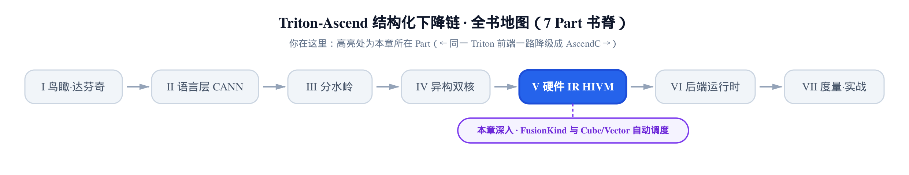
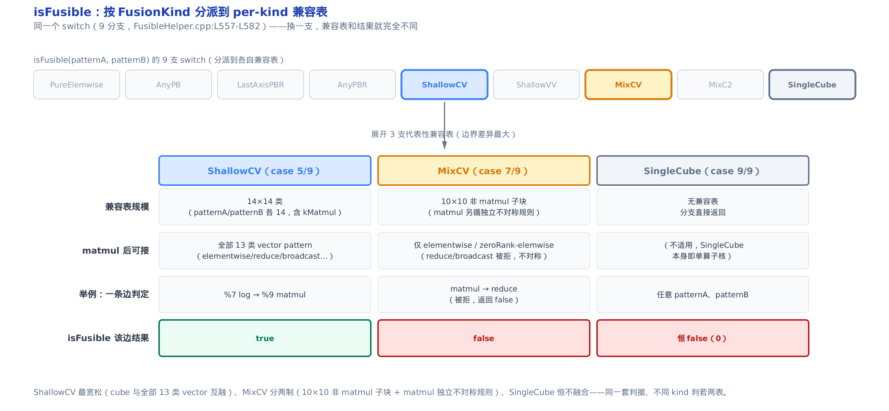
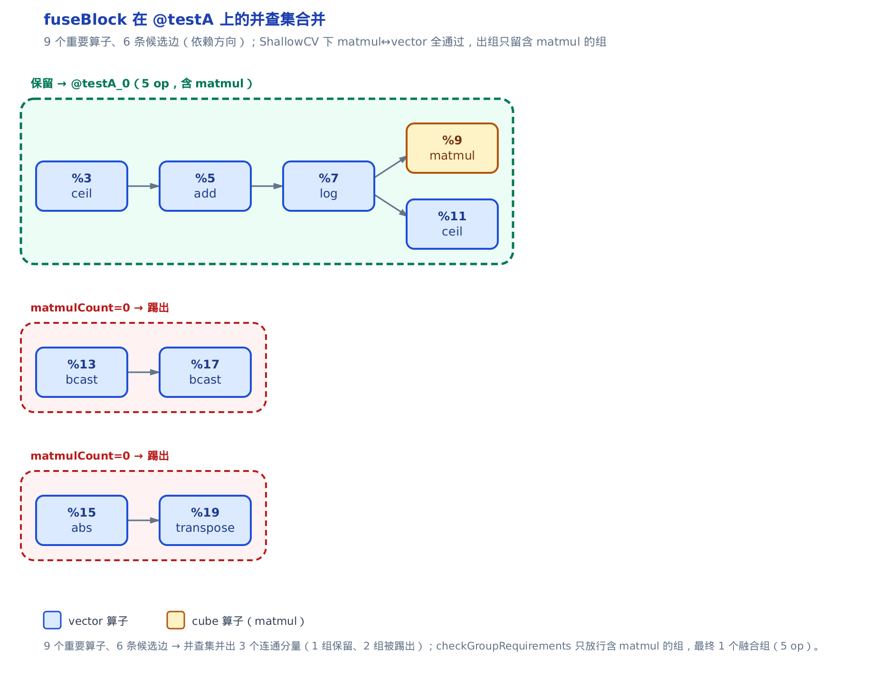
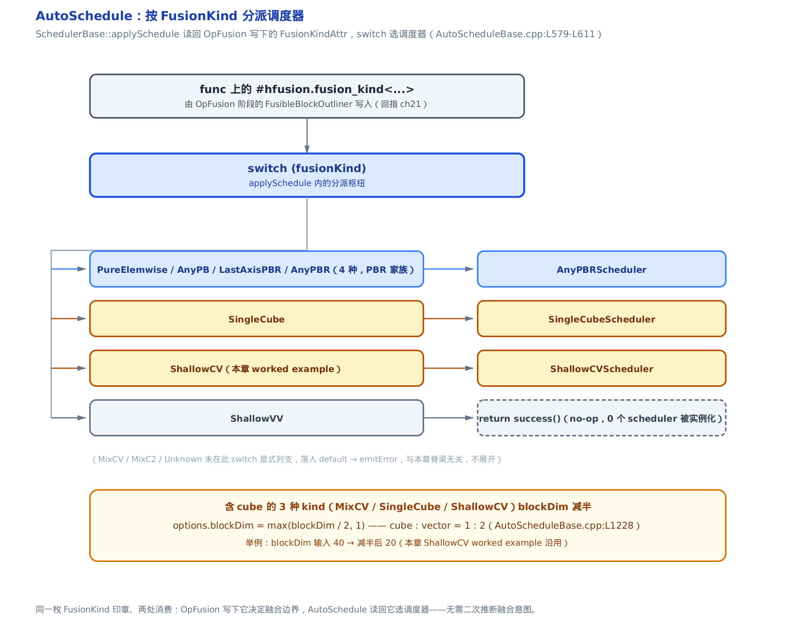
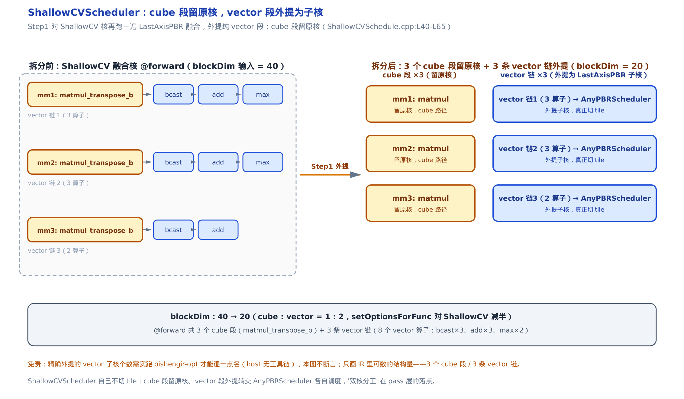

# 算子融合与自动调度：FusionKind 分类与 Cube/Vector 分工的 tile 策略




> 图上两条虚线路线就是上一段选读指引的可视化版：只想看融合边界怎么定，走脊梁①第二到第六节；只想看调度怎么分双核，从第七节起走脊梁②。

> 上一章：HFusion 方言登场，`FusionKind` 是贴在每个 func 上的「融合意图」枚举。
> 本章：这枚意图怎么**驱动**——OpFusion 拿它定融合边界，AutoSchedule 拿它选调度器、切 tile、分双核。
> 下一章：融合核往下降到 HIVM 方言，显式内存层级与流水线。

上一章[《HFusion 方言》](../../ch21-hfusion-dialect/narrative/chapter.md)把 `FusionKind`（融合意图枚举，`#hfusion.fusion_kind` 属性，十个取值贴在 func 级）讲清了两件事：它**是什么**（十种融合意图的语义），以及它**从哪来**（`InferFuncFusionKind` 怎么推断出来、挂到 func 上）。那一章末尾留了个悬念：这十种 kind 的**调度差异**——Cube 和 Vector 两颗核怎么分工、tile 策略怎么按 kind 变——留到本章。

这就是本章要还的账。一句话概括：`FusionKind` 是一枚**印章**，盖在融合核的额头上，被两个下游阶段**各读一次**。

- **脊梁①（OpFusion）**：读印章决定**融合边界**——哪些相邻算子能挤进同一个核。
- **脊梁②（AutoSchedule）**：读同一枚印章决定**调度策略**——这个核派给哪位调度师、怎么切 tile、cube 段和 vector 段怎么分。

六千多行的 `AutoSchedule` 子系统摊在 12 个 `.cpp` 文件里，但其中**只有 4 个是具体的 `Scheduler` 子类**（承载某种调度策略的类，均继承 `SchedulerBase` 基类）：`AnyPBRScheduler`／`PureElemwiseScheduler`／`SingleCubeScheduler`／`ShallowCVScheduler`，各对应一组 `FusionKind`。其余 8 个文件是共享基础设施（切 tile、收集 kernel 信息、调度算子等），不绑定某一种融合意图。本章**不逐个展开**：第二条脊梁只挑 `ShallowCVScheduler`（ShallowCV = cube 与 vector 浅配合）这一条做样例——它正好扣住「双核分工」的主题；那 4 个 `Scheduler` 子类机制同构，本章点名不铺开。

只想看融合边界怎么定，读第二到第六节；只想看调度怎么分双核，直接跳第七节起的第二条脊梁。想跟全程，按序读。

---

## 一、承上启下：印章从哪读出来

`FusionKind` 这枚印章，上一章已经由 `InferFuncFusionKind` 盖在了每个 func 上。OpFusion pass 进门第一件事，就是把它读出来：

```cpp
# third_party/ascend/AscendNPU-IR/bishengir/lib/Dialect/HFusion/Transforms/OpFusion.cpp:L56-L66
inline std::optional<HFusionOpFusionOptions>
getOptionFromLabel(func::FuncOp func, const HFusionOpFusionOptions &options) {
  HFusionOpFusionOptions newOptions = options;
  auto fusionKindAttr =
      func->getAttrOfType<FusionKindAttr>(FusionKindAttr::name);
  if (!fusionKindAttr)
    return std::nullopt;
  auto fusionKind = fusionKindAttr.getFusionKind();
  newOptions.fusionMode = fusionKind;
  return newOptions;
}
```

`func::FuncOp` 是 MLIR 内建的函数算子；`getAttrOfType<FusionKindAttr>` 按属性名取回那枚 `FusionKindAttr`（上一章讲过的 func 级属性载体）。没盖印章的 func（`!fusionKindAttr`）直接返回 `std::nullopt`，OpFusion 不碰它——**只有带融合意图的 func 才进入融合流程**。读出来的 `fusionKind` 塞进 `newOptions.fusionMode`，往下的整条融合流水都以这个字段为准。

一句话：OpFusion 只是印章的**消费者**，它不推断意图，只执行意图。`HFusionOpFusionOptions` 是这趟融合的配置包，`fusionMode` 是其中最关键的一格——它决定接下来「谁能和谁融」的整套判据。

---

## 二、脊梁①核心：一个 switch，十把剪刀

**直觉**。把 `FusionKind` 想成十把不同的剪刀模板。同一堆算子摆在案上，换一把模板就剪出不同的融合边界。判断「这两个相邻算子能不能挤进一个核」的那个函数叫 `isFusible`，它做的第一件事就是**看当前是哪把剪刀**，再查这把剪刀专属的「谁能和谁挨着」兼容表。



来看这个分派枢纽本身：

```cpp
# third_party/ascend/AscendNPU-IR/bishengir/lib/Dialect/HFusion/Transforms/OpFusion/FusibleHelper.cpp:L557-L582
bool FusibleHelper::isFusible(const OpPattern &patternA,
                              const OpPattern &patternB) const {
  switch (fusionKind_) {
  case FusionKind::PureElemwise:
    return isPureElemwiseFusible(patternA, patternB);
  case FusionKind::AnyPB:
    return isAnyPBFusible(patternA, patternB);
  case FusionKind::LastAxisPBR:
    return isLastAxisPBRFusible(patternA, patternB);
  case FusionKind::AnyPBR:
    return isAnyPBRFusible(patternA, patternB);
  case FusionKind::ShallowCV:
    return isShallowCVFusible(patternA, patternB);
  case FusionKind::ShallowVV:
    return isShallowVVFusible(patternA, patternB);
  case FusionKind::MixCV:
    return isMixCVFusible(patternA, patternB);
  case FusionKind::MixC2:
    return isMixC2Fusible(patternA, patternB);
  case FusionKind::SingleCube:
    // single cube is not considered as fusible because there is only one op
    return false;
  default:
    llvm_unreachable("Invalid fusion mode");
  }
} // namespace opfusion
```

这就是「`FusionKind` 驱动融合」的落点。九个 `case`（`SingleCube` 单算子无融合可言，恒 `return false`），每个 kind 分派到自己那张 `isXxxFusible` 兼容表。`fusionKind_` 是这个 `FusibleHelper`（承载所有 `FusionKind` 相关规则的辅助类）的成员，就是第一节读出来的那枚印章。

两个入参 `patternA`／`patternB` 是 `OpPattern`——算子被 `getOpPattern` 归类后的**大类标签**（`kMatmul`／`kElementWise`／`kLastAxisReduce`／`kOtherBroadcast`…）。融合判据不看具体是哪个 op，只看它属于哪一**类**：判断粒度是「模式对模式」，不是「算子对算子」。

**为什么用分表，不用一套带参数的通用规则？** 因为不同意图对「什么能进一个核」的判据差异巨大——ShallowCV 允许矩阵乘和任何向量算子挨着，MixCV 只准矩阵乘后面接纯逐元素运算，PureElemwise 干脆不含矩阵乘。把差异摊成一张张独立的表，比塞进一堆 `if (kind == ... && ...)` 可读、可改得多。

### ShallowCV 这把剪刀：cube 与全部 vector 互融

本章主题是「双核浅配合」，对应的剪刀正是 `isShallowCVFusible`。把它摊开看：

```cpp
# third_party/ascend/AscendNPU-IR/bishengir/lib/Dialect/HFusion/Transforms/OpFusion/FusibleHelper.cpp:L673-L712
bool FusibleHelper::isShallowCVFusible(const OpPattern &patternA,
                                       const OpPattern &patternB) const {
  switch (patternA) {
  case OpPattern::kElementWise:
  case OpPattern::kZeroRankElemwise:
  case OpPattern::kExtractSlice:
  case OpPattern::kInsertSlice:
  case OpPattern::kInterleave:
  case OpPattern::kLastAxisBroadcast:
  case OpPattern::kLastAxisReduce:
  case OpPattern::kLoadStore:
  case OpPattern::kMatmul:
  case OpPattern::kMidFusionAuxiliary:
  case OpPattern::kMidFusionImportantAux:
  case OpPattern::kOtherBroadcast:
  case OpPattern::kReshape:
  case OpPattern::kTranspose:
    switch (patternB) {
    case OpPattern::kElementWise:
    case OpPattern::kZeroRankElemwise:
    case OpPattern::kExtractSlice:
    case OpPattern::kInsertSlice:
    case OpPattern::kInterleave:
    case OpPattern::kLastAxisBroadcast:
    case OpPattern::kLastAxisReduce:
    case OpPattern::kLoadStore:
    case OpPattern::kMatmul:
    case OpPattern::kMidFusionAuxiliary:
    case OpPattern::kMidFusionImportantAux:
    case OpPattern::kOtherBroadcast:
    case OpPattern::kReshape:
    case OpPattern::kTranspose:
      return true;
    default:
      return false;
    }
  default:
    return false;
  }
}
```

这是一张 14×14 的兼容表：`patternA` 的 case 集合和 `patternB` 的 case 集合**完全一样**，各 14 类，都含 `kMatmul`（矩阵乘，走 cube）加十三类 vector 模式。任意一对落在这 14 类里的模式——包括 `matmul → 任意 vector`、`任意 vector → matmul`——都返回 `true`。

这张「谁都能挨谁」的宽松表，就是「cube 与 vector 浅配合」的**结构根据**：矩阵乘可以和它前后的广播、加法、reduce、transpose 自由融进一个核。

对照一下更严的 `isMixCVFusible`（同文件 L719 起）：MixCV 里矩阵乘只准后接**纯 elementwise**，接 reduce／broadcast 就被拒。同样是 cube+vector 协同，ShallowCV 和 MixCV 的分类边界差异，就藏在这两张表的 case 集合里——一个放行十三类 vector，一个只放行一类。

---

## 三、脊梁①核心：并查集 + 拓扑秩的融合主循环

`isFusible` 只回答「这一对模式**兼容不兼容**」。真正把一堆算子**并成若干核**的活儿，在 `FusibleBlockAnalyzer::fuseBlock`。

**直觉**。融合像给流水线上的工位分组。能连着干的工位并成一个班组（一个核），装进同一台机器一次做完，省得数据在核之间来回搬。**并查集**（union-find，一种记录「谁和谁一组」的账本数据结构）就是那本账本：初始每个算子自成一组，每确认一对能合并就把两组并起来。**拓扑秩**（topo rank，算子在数据流 DAG 上的先后序号）保证只顺着数据流方向合并，不会把上下游接成环。

```cpp
# third_party/ascend/AscendNPU-IR/bishengir/lib/Dialect/HFusion/Transforms/OpFusion/FusibleBlockAnalyzer.cpp:L177-L221
SmallVector<SetVector<Operation *>> FusibleBlockAnalyzer::fuseBlock() {
  reInitEdges();
  reinitTopoRank();
  SmallVector<NodeNodePair> fusionCandidates;
  for (size_t nodeU = 0; nodeU < ops_.size(); ++nodeU) {
    // Fusing
    Operation *op = ops_[nodeU];
    // Restricted the fusion if it's shallowCV and shape is dynamic
    if (fusibleHelper_->isRestrictedByDynamicShape(op))
      continue;

    for (Operation *user : op->getUsers()) {
      int32_t nodeV = static_cast<int32_t>(opIdx_[user]);
      fusionCandidates.emplace_back(nodeU, nodeV);
    }
  }

  // Sort all users based on its ascending topoRank
  llvm::sort(fusionCandidates.begin(), fusionCandidates.end(),
             [&](const NodeNodePair &a, const NodeNodePair &b) {
               if (topoRank_[a.second] != topoRank_[b.second])
                 return topoRank_[a.second] < topoRank_[b.second];
               return topoRank_[a.first] < topoRank_[b.first];
             });
  for (const NodeNodePair &candidate : fusionCandidates) {
    Operation *nodeU = ops_[candidate.first];
    Operation *nodeV = ops_[candidate.second];
    if (fusibleHelper_->isRestrictedByDynamicShape(nodeV))
      continue;

    if (fusibleHelper_->isFusible(nodeU, nodeV)) {
      // Verify graph and parent rules
      verifyRulesAndJoin(candidate.first, candidate.second);
    }
  }
  # … 省略：横向融合段（L223-L266，把彼此无依赖的重要 op 两两尝试 verifyRulesAndJoin，受 maxHorizontalFusion 上限约束） …
  # … 省略：按并查集根收集 group（L272-L284，group.size()>1 且 checkGroupRequirements 通过才 push 进 fusedGroups） …
}
```

（为聚焦纵向融合，这里删去了后半段的横向融合与出组收集，各以省略标注。原函数三段：纵向 → 横向 → 出组。）

主干读法分三步：

1. **建候选边**。外层双循环枚举每个算子 `nodeU` 的每个使用者 `user`，把 `(nodeU → nodeV)` 这条 use 边收进 `fusionCandidates`。注意开头那句 `isRestrictedByDynamicShape`：ShallowCV 遇到动态 shape 直接跳过——静态 shape 才允许这类融合。
2. **按被消费者拓扑秩升序排**。`llvm::sort` 的比较器先比 `topoRank_[a.second]`（消费端的秩）。为什么按消费端排？因为要**从上游往下游**依次尝试合并，保证融合方向始终顺着数据流，不制造环。
3. **逐边过关**。对每条候选边，先 `isFusible`（第二节那张兼容表）判模式兼容，兼容再进 `verifyRulesAndJoin`（下一节的五道关卡）真正合并。

### 一次融合的逐轮追踪

拿一个 ShallowCV 的静态夹具 `@testA` 走一遍。它有 9 个重要算子、6 条候选融合边。下表逐轮记录 `fuseBlock` 纵向阶段的并查集变化（每步结论对到 `@testA` 的 `FileCheck` 断言与源码常量；host 上没有昇腾工具链，跑不出编译器 dump，这张表是照源码逻辑手工推演的，标为示意）：

先打个预告：这张表会提前用到两个下文才展开的概念——`verifyRulesAndJoin` 的**五道关卡**（第四节细讲）和出组时的 `checkGroupRequirements`（这一步靠 `matmulCount`＝矩阵乘个数把无 matmul 的组筛掉，第五节细讲）。这里先按结论把每轮追踪过一遍，抠细节可读完那两节再回看。

<!-- trace: fusible-unionfind -->

| 轮次 | 候选边（生产者→消费者） | isFusible? | 五道关卡判定 | 并查集组变化 |
| --- | --- | --- | --- | --- |
| 1 | %3 ceil → %5 add | T（vector↔vector） | ShallowCV 只剩 dependency 关卡活动；indegree=1 通过 | {3,5} |
| 2 | %5 add → %7 log | T | 通过 → join | {3,5,7} |
| 3 | %7 log → %9 matmul | T（vector↔matmul，ShallowCV 允许） | 通过 → join | {3,5,7,9} |
| 4 | %7 log → %11 ceil | T | 通过 → join | {3,5,7,9,11} |
| 5 | %13 bcast → %17 bcast | T | 通过 → join | {13,17} |
| 6 | %15 abs → %19 transpose | T | 通过 → join | {15,19} |
| 出组 | checkGroupRequirements 过滤 | - | {13,17}/{15,19} matmulCount=0 被拒；{3,5,7,9,11} 有 matmul+important>1 保留 | fusedGroups=[{3,5,7,9,11}] |



读这张表要抓住两点。其一，**六次 join 把 9 个初始单元素分量并成 3 个连通分量**（大小 5+2+2）：一条含 matmul 的主链 {3,5,7,9,11}，加两串纯 vector {13,17} 和 {15,19}。其二，**出组过滤把无 matmul 的两个分量丢掉**——这是下一节要讲的 ShallowCV 专属约束。最终只剩一个融合组，含 5 个算子，物化成子核 `@testA_0`（夹具的 `FileCheck` 断言 `@testA_0` 恰含 elemwise_unary／elemwise_binary／elemwise_unary／matmul／elemwise_unary 五个算子，`@testA` 调 `@testA_0`）。

### 为什么它一定停、且分组不重叠

**不变量**：`fuseBlock` 必然终止，且产出的融合组两两不相交。

**论证**（单调量 + 结构保证）。终止靠一个严格递减的非负整数：每次成功 `join` 都合并两棵不同根的树，并查集的**连通分量数严格减 1**。分量数初值等于算子数、下界是 1、每步至少减 1，所以有限步内再无可 join 的候选边。候选边集合本身有限（每条 use 边只进一次），横向融合另受 `maxHorizontalFusion` 上限硬截。不相交则由并查集结构天然保证：每个算子经 `find` 只归属唯一根，最后按根收集成组，一个算子不可能同时落进两个组。

**复杂度**。`find` 带路径压缩、`join` 按 union-by-size（大小挂载），并查集操作均摊近线性 $`O(\alpha(n))`$（$`\alpha`$ 是反阿克曼函数，实践中不超过 4）。对 `@testA` 的 $`n=9`$，实际就是近 $`O(n)`$——融合决策本身不是瓶颈。

---

## 四、脊梁①核心：五道关卡

`isFusible` 说「模式兼容」，还只是**放行的必要条件**。两个班组真要合并，得再过一道安检门。`verifyRulesAndJoin` 就是这道门：

```cpp
# third_party/ascend/AscendNPU-IR/bishengir/lib/Dialect/HFusion/Transforms/OpFusion/FusibleBlockAnalyzer.cpp:L86-L147
bool FusibleBlockAnalyzer::verifyRulesAndJoin(int nodeU, int nodeV,
                                              bool horizontal) {
  // Try to join
  int parentU = find(nodeU);
  int parentV = find(nodeV);
  // Already in one set, skip fusing
  if (parentU == parentV)
    return false;

  // Reduce dimension checker
  if (fusibleHelper_->isRestrictedByReduceRank(opMaxRank_[parentU],
                                               opMaxRank_[parentV])) {
    return false;
  }

  if (fusibleHelper_->isRestrictedByReduceDim(opReduceDim_[parentU],
                                              opReduceDim_[parentV])) {
    return false;
  }

  // Node type checker
  if (fusibleHelper_->isRestrictedByNodeType(setType_[parentU],
                                             setType_[parentV], horizontal)) {
    return false;
  }

  if (horizontal) {
    if (isRestrictedByShapePivot(parentU, parentV)) {
      return false;
    }
  }

  // Restricted by dependency
  if (isRestrictedByDependency(parentU, parentV, horizontal)) {
    return false;
  }

  if (horizontal) {
    // Check the opposite as well
    if (isRestrictedByDependency(parentV, parentU, horizontal)) {
      return false;
    }
    if (importantSize_[parentU] == 0 || importantSize_[parentV] == 0) {
      return false;
    }
  }

  join(parentU, parentV, horizontal);
  return true;
}
```

（原函数每道 `if` 里都有一行 `LLVM_DEBUG` 打印，为聚焦逻辑已省去。）

**直觉**。安检门上装了五把锁——`reduceRank`／`reduceDim`／`nodeType`／`shapePivot`／`dependency`。但每把锁只对**特定 `FusionKind`** 上锁。同一道门，换个 kind 就换一套开着的锁。这就是「一套流程、各 kind 差异化」的实现手法：融合循环只写一遍，差异内联在每个谓词里。

入口先 `find` 两端的根 `parentU`／`parentV`，同根直接 `return false`（已经一组，不重复合并）。然后五道 `if`，逐把锁试：

- **前两把（reduceRank / reduceDim）** 只对 `LastAxisPBR`／`AnyPBR` 这类含 reduce 的 kind 生效——`isRestrictedByReduceRank` 内部先判 `fusionKind_` 是不是这两种，不是就直接放行（返 false = 不受限）。
- **第三把（nodeType）** 只对 `MixCV` 生效。
- **第四把（shapePivot）** 只在横向融合（`horizontal`）时查。
- **第五把（dependency）** 对所有 kind 都查：`isRestrictedByDependency` 用诱导子图的入度检测——融合后若引入多重依赖（入度 >1）就是要成环，拒绝。横向融合还要双向都查、且两端都得有重要算子（`importantSize > 0`）。

五道全越过，才走到 `join`。

### 同一条边，换 kind 就换判定

把这五把锁在不同 kind 下的开合摆成一张表看（判定对到源码守卫常量，示意）：

<!-- trace: fusion-rule-gauntlet -->

| 场景 | 活动关卡 | 关卡输入 | 判定 | join? |
| --- | --- | --- | --- | --- |
| ShallowCV：%5 add→%7 log | 仅 dependency（reduceRank/reduceDim 非 PBR 关闭、nodeType 非 MixCV 关闭、shapePivot 仅横向） | 诱导子图 indegree(%7)=1 | ≤1 不受限 | JOIN |
| ShallowCV：%7 log→%9 matmul | 仅 dependency | indegree(%9)=1 | ≤1 不受限 | JOIN |
| AnyPBR 反例：两 reduce 秩 1 vs 2 | reduceRank 打开（kind∈{LastAxisPBR,AnyPBR}） | a=1, b=2, a≥0∧b≥0∧a≠b | isRestrictedByReduceRank=true 受限 | NO JOIN |

前两行是 `@testA` 的真实边：ShallowCV 下五把锁只有 dependency 一把活动，两条边入度都是 1，全部放行。第三行是反例——同样两条 reduce 边，如果这个核是 `AnyPBR` 类且两端 reduce 秩不同（1≠2），reduceRank 这把锁就合上，直接拦下。**同一套 `verifyRulesAndJoin` 流程，ShallowCV 只开 1 把锁，AnyPBR 多开 2 把，MixCV 多开 nodeType 一把。**

**不变量**：`verifyRulesAndJoin` 返回 `true`（发生 join）当且仅当五道关卡全部放行，且 join 只合并两个原本不同的根。

**论证**。基例是入口的 `parentU == parentV` 早退（同组不重复合并）。归纳步：五个 `if` 守卫任一命中就 `return false`，只有全部越过才走到 `join(parentU, parentV)`——所以「全过」是 join 的**充要**前置。方向安全由 dependency 关卡兜底：纵向要求诱导子图 `indegree(endNode) ≤ 1`，横向两向都查 `indegree`，合并后不可能成环。

---

## 五、出组约束：ShallowCV/MixCV 必须含 matmul

第三节那张追踪表的最后一行，两个纯 vector 分量 {13,17}／{15,19} 被踢掉了。踢它们的是出组的最后一道 `FusionKind` 相关约束：

```cpp
# third_party/ascend/AscendNPU-IR/bishengir/lib/Dialect/HFusion/Transforms/OpFusion/FusibleBlockAnalyzer.cpp:L149-L173
bool FusibleBlockAnalyzer::checkGroupRequirements(
    const SetVector<Operation *> &group) {
  // Count vv ops here
  int importantCount = 0;
  int matmulCount = 0;
  for (Operation *op : group) {
    if (FusibleHelper::isImportantPattern(op))
      importantCount++;
    if (FusibleHelper::getOpPattern(op) == OpPattern::kMatmul) {
      matmulCount++;
    }
  }
  // If its shallow cv, check if there is a matmul
  if (fusibleHelper_->getFusionKind() == FusionKind::ShallowCV ||
      fusibleHelper_->getFusionKind() == FusionKind::MixCV) {
    if (matmulCount == 0)
      return false;
  }
  if (importantCount <= 1) {
    return false;
  }
  return true;
}
```

`importantCount` 数组里有几个「重要算子」（`isImportantPattern`——真正吃算力的 vector/cube 运算，区别于纯搬运/reshape 这类辅助 op）；`matmulCount` 数矩阵乘的个数。

关键在中间那个 `if`：**当前 kind 是 ShallowCV 或 MixCV 时，`matmulCount == 0` 直接 `return false`**。为什么？ShallowCV／MixCV 存在的意义就是 cube+vector 协同；如果某融合组退化成纯 vector（一个 matmul 都没有），它就不该占用 cube 的调度路径，应该交给纯 vector 的 kind 去管。所以 {13,17}（两个 broadcast）和 {15,19}（abs→transpose）这两串纯 vector 分量，`matmulCount=0`，当场被踢回。

最后那道 `importantCount <= 1` 是通用门槛：组里至少要有 2 个重要算子才值得融——就一个算子，融了也没省下核间搬运，不如不融。

---

## 六、脊梁①落地：外提成核 + 回写印章

融合决策算完了，产物是若干 `SetVector<Operation*>`（每个是一个融合组）。要变成真正的 IR，得把每组算子**外提**成一个独立 device func，并在原处建一个 call 替换。这是脊梁①的最后一步：

```cpp
# third_party/ascend/AscendNPU-IR/bishengir/lib/Dialect/HFusion/Transforms/OpFusion/FusibleBlockOutliner.cpp:L211-L235
bool FusibleBlockOutliner::outline(const std::string &prefixOutline) {
  for (FusibleBlock &curBlock : fusibleBlocks_) {
    func::FuncOp fusedFunc = outlineFunc(curBlock, prefixOutline);
    if (!fusedFunc)
      return false;
    outlinedFuncs_.push_back(fusedFunc);

    func::CallOp fusionInvoke = createInvoke(fusedFunc, curBlock);
    if (!fusionInvoke)
      return false;
  }
  return true;
}

void FusibleBlockOutliner::setOutlineFuncAttributes(
    func::FuncOp &func, const FusionKind &fusionKind, OpBuilder &builder,
    bool isCallerHost) {
  func->setAttr(FusionKindAttr::name,
                FusionKindAttr::get(func->getContext(), fusionKind));
  // Set outlined function to be a device function.
  hacc::utils::setDevice(func);
  // If the caller is a host function, the device function has to be an entry.
  if (isCallerHost)
    hacc::utils::setDeviceEntry(func);
}
```

`outline` 循环很直白：每个融合块 `outlineFunc` 克隆进一个新 device func（`device` 指昇腾侧的核函数，对应会在 NPU 上跑的代码），`createInvoke` 在原处建 `func::CallOp` 调它。

真正的关键在 `setOutlineFuncAttributes` 的第一行：`func->setAttr(FusionKindAttr::name, ...)`——**把这枚 `FusionKind` 印章原样盖到新 func 上**。这不是可有可无的元数据：正是这一行，让 `FusionKind` 从 OpFusion **传递到下游的 AutoSchedule**。融合时确定的意图，被写进外提核的属性里；调度时不必再推断一遍，读回来就是。

这是一个刻意的解耦设计：OpFusion 和 AutoSchedule 是两个独立 pass，中间**只靠这枚属性对齐**。写在 `setOutlineFuncAttributes`，读在下一节要讲的 `applySchedule`——同一枚 `FusionKindAttr`，一写一读。

至此脊梁①走完：印章读出 → 兼容表定候选 → 并查集融合 → 五关卡把守 → 出组过滤 → 外提回写印章。IR 里现在躺着一批带 `FusionKind` 属性的融合核，等着被调度。

---

## 七、脊梁②核心：AutoSchedule 按印章选调度师

**直觉**。OpFusion 阶段在每个融合核额头上盖了印章；AutoSchedule 阶段进门先看印章，再分配「调度师」。这是同一枚印章的**第二次消费**，和脊梁①的 `isFusible` 分派对偶。



```cpp
# third_party/ascend/AscendNPU-IR/bishengir/lib/Dialect/HFusion/Transforms/AutoSchedule/AutoScheduleBase.cpp:L579-L611
  auto fusionKind = fusionKindAttr.getFusionKind();
  std::unique_ptr<SchedulerBase> scheduler;
  funcOp->setAttr(utils::kEnableAutoMarkBufferSize, opBuilder.getUnitAttr());
  switch (fusionKind) {
  case FusionKind::PureElemwise:
  case FusionKind::AnyPB:
  case FusionKind::LastAxisPBR:
  case FusionKind::AnyPBR:
    scheduler = std::make_unique<AnyPBRScheduler>(funcOp);
    break;
  case FusionKind::SingleCube:
    scheduler = std::make_unique<SingleCubeScheduler>(funcOp);
    break;
  case FusionKind::ShallowCV:
    scheduler = std::make_unique<ShallowCVScheduler>(funcOp);
    break;
  case FusionKind::ShallowVV:
    return success();
  case FusionKind::Unknown:
  default:
    return funcOp.emitError("Unknown kernel fusion kind");
  }
  return scheduler->runOnOperation(opBuilder);
}
```

`fusionKindAttr.getFusionKind()` 读回的，正是上一节 outliner 盖上的那枚印章。`SchedulerBase` 是所有具体调度器的基类；这个 switch 把十种 kind **收敛到三类真调度器加一个空转**：

- **PBR 家族四种**（`PureElemwise`／`AnyPB`／`LastAxisPBR`／`AnyPBR`）共用一位 `AnyPBRScheduler`——这四种意图的切 tile 规则同构，一位调度师全包。
- **`SingleCube`／`ShallowCV`** 各有专属调度器。
- **`ShallowVV`** 直接 `return success()`——no-op，不调度。
- 其余（含 `MixCV`／`MixC2`）没在这个 switch 显式列，落进 `default` 报错，与本章脊梁无关，不展开。

这也是本章「4 个 `Scheduler` 子类只讲 ShallowCV 一条」的源头依据：所有 `FusionKind` 都在这**一个 switch** 汇合分派，选到的那位调度师编排骨架同构，讲透一条即可。

### 沾 cube 就把核数砍半

选完调度师，还有一步资源侧的配置。凡是沾 cube 的 kind，`blockDim`（本次 kernel 启动分到的核数）要减半：

```cpp
# third_party/ascend/AscendNPU-IR/bishengir/lib/Dialect/HFusion/Transforms/AutoSchedule/AutoScheduleBase.cpp:L1221-L1231
  auto maybeFusionKind = hfusion::tryGetFusionKind(func);
  // For cube and mix fusion kind, the block dim is set to half because cube
  // and vector is 1:2 for now.
  if (maybeFusionKind.has_value() &&
      ((*maybeFusionKind) == FusionKind::MixCV ||
       (*maybeFusionKind) == FusionKind::SingleCube ||
       (*maybeFusionKind) == FusionKind::ShallowCV)) {
    options.blockDim = std::max(this->blockDim / 2, (unsigned int)1);
  } else {
    options.blockDim = this->blockDim;
  }
```

注释说得直白：`cube and vector is 1:2 for now`。这对上了[第 2 章](../../ch02-davinci-npu-hardware-model/narrative/chapter.md)建立的硬件事实——一颗达芬奇 AI Core 里 cube 单元和 vector 单元的数量比恒为 **1:2**（一个矩阵核配两个向量核）。所以调度含 cube 的核时，给 cube 侧核数取半（`max(blockDim/2, 1)`），剩下的算力留给配套的两个 vector 核。触发减半的正是 `MixCV`／`SingleCube`／`ShallowCV` 这三种沾 cube 的 kind。

这是把硬件 PE 配比直接映射到核数分配的最简近似——注释里的 `for now` 也坦承这是当前的粗粒度策略。

---

## 八、调度骨架：pre → schedule → post

选到调度师后，标准调度器（如 `AnyPBRScheduler`）跑的是一条固定主干。基类 `SchedulerBase` 把它编排成三步：

```cpp
# third_party/ascend/AscendNPU-IR/bishengir/lib/Dialect/HFusion/Transforms/AutoSchedule/AutoScheduleBase.cpp:L245-L256
LogicalResult SchedulerBase::runScheduleProcedure(OpBuilder &opBuilder) {
  func::FuncOp currentFunc = getOriginalKernel();
  if (failed(calculateTiling(opBuilder)))
    return currentFunc->emitWarning("Failed to calculate tiling.");

  if (failed(selectTiling()))
    return currentFunc->emitWarning("Failed to select tiling.");

  if (failed(createAndApplySchedules(opBuilder)))
    return currentFunc->emitWarning("Failed to create and apply schedule.");
  return success();
}
```

三步各司其职：

1. **`calculateTiling`**——造一个 host 端的 tiling 函数。动态 shape 下 tile 尺寸得运行期才能算，所以不写死一套固定 tile，而是生成一段 host 代码算出「tiling key」（选哪套 tile 参数的索引）。
2. **`selectTiling`**——静态 shape 时，把 tiling key 常量化，剪掉用不到的分支。
3. **`createAndApplySchedules`**——逐个 tiling case 生成一段 transform 序列（MLIR transform 方言的调度脚本），再解释执行它，真正把循环切成 tile。device 侧则用 `scf.index_switch` 按 tiling key 分派到对应 case 的 kernel。

这条主干是「怎么切 tile」的通用框架，具体切法由派生类的 `calculateTilingImpl`／`createScheduleImpl` 填。本章不深挖单个 tile 的算法（那是各个 `Scheduler` 子类各自的活儿），只需记住：**标准调度器都走这条 pre→schedule→post 主干**。下一节的 ShallowCV 是个例外——它不亲自切 tile。

---

## 九、脊梁②样例：ShallowCVScheduler 拆双核

来到本章的 worked example，也是「双核分工」在 pass 层最直接的形态。

**直觉**。ShallowCV 调度器自己不切 tile，它更像个**包工头**。接到一个「矩阵乘和向量运算浅交替」的融合核，它先把里面的纯向量段拆成独立小包，矩阵乘段留作 cube 大包；然后把每个向量小包转包给成熟的向量调度师，cube 大包走 cube 路线。一个核就这样分成「cube 子核 + vector 子核」，各归各调度。

先看它接手的典型输入——一个三层 MLP 的融合核（这是仓库自带的 lit 夹具，带 `RUN: bishengir-opt -hfusion-auto-schedule` + `FileCheck`，是可信的结构真相源）：

```mlir
# third_party/ascend/AscendNPU-IR/bishengir/test/Dialect/HFusion/AutoSchedule/test-shallow-cv.mlir:L4-L32
func.func @forward(%arg0: tensor<2x10xf32>, %cst : tensor<2x20xf32>, %cst_0 : tensor<20x10xf32>, ...)
    attributes {hacc.function_kind = #hacc.function_kind<DEVICE>, hfusion.fusion_kind = #hfusion.fusion_kind<SHALLOW_CV>} {
  %1 = linalg.matmul_transpose_b ins(%arg0, %cst_0 ...) outs(%0 ...)          // 第 1 层 cube
  %broadcasted = linalg.broadcast ins(%cst_1 ...) dimensions = [0]           // bias 广播 (vector)
  %4 = linalg.elemwise_binary {fun = #linalg.binary_fn<add>} ins(%1, %broadcasted ...)   // +bias (vector)
  %6 = linalg.elemwise_binary {fun = #linalg.binary_fn<max_signed>} ins(%4, %cst ...)    // relu (vector)
  %8 = linalg.matmul_transpose_b ins(%6, %cst_2 ...) outs(%7 ...)            // 第 2 层 cube
  # … 省略：第 2 层的 bcast+add+max 三个 vector 算子（结构同第 1 层）…
  %15 = linalg.matmul_transpose_b ins(%13, %cst_4 ...) outs(%14 ...)         // 第 3 层 cube
  %broadcasted_7 = linalg.broadcast ins(%cst_5 ...) dimensions = [0]         // bias 广播 (vector)
  %18 = linalg.elemwise_binary {fun = #linalg.binary_fn<add>} ins(%15, %broadcasted_7 ...) // +bias (vector)
  return %18 : tensor<2x10xf32>
}
```

（为聚焦结构，中间第 2 层的三个 vector 算子以省略标注，它和第 1 层同构。）

整个 func 挂着 `hfusion.fusion_kind = #hfusion.fusion_kind<SHALLOW_CV>` 属性——正是 cube 与 vector 逐层浅交替的典型 ShallowCV 图：三个 `matmul_transpose_b`（cube 段），每个后面跟一串 `broadcast + add [+ max]`（vector 链）。

再看 `ShallowCVScheduler` 怎么处理它：

```cpp
# third_party/ascend/AscendNPU-IR/bishengir/lib/Dialect/HFusion/Transforms/AutoSchedule/ShallowCVSchedule.cpp:L40-L65
LogicalResult ShallowCVScheduler::runOnOperation(OpBuilder &opBuilder) {
  func::FuncOp shallowCVFunc = getOriginalKernel();
  // Step 1: Apply LastAxsiPBR opfusion
  HFusionOpFusionOptions options;
  options.fusionMode = FusionKind::LastAxisPBR;
  options.alwaysInline = true;
  // Fuse all tensor.empty inside and let TensorResultToOutParam do its work.
  options.moveOutToParam = false;
  FailureOr<SmallVector<func::FuncOp>> outlinedFuncs =
      applyOpFusionOutline(shallowCVFunc, options);
  if (failed(outlinedFuncs))
    return shallowCVFunc->emitError("Failed to apply LastAxisPBR fusion.");

  // Step 2: Apply Schedule for outlined kernels.
  for (auto funcOp : *outlinedFuncs) {
    LDBG("Scheduling outlined func: " << *funcOp);
    if (failed(applySchedule(funcOp, opBuilder)))
      return failure();
  }

  // Step 3: Apply TensorResultToOutParam to the original ShallowCV kernel.
  if (failed(applyTensorResultToOutParamsPass(shallowCVFunc)))
    return failure();

  return success();
}
```

三步，正好对应包工头的三个动作：

1. **Step 1 拆包**。对这个 ShallowCV 核**再跑一遍 OpFusion**，但这次把 `fusionMode` 强设为 `LastAxisPBR`（纯 vector 的融合意图）。效果是把里面的纯向量段外提成独立的 vector 子核（`applyOpFusionOutline` 就是把第二到第六节那套融合流程再走一遍）。矩阵乘段不属于 LastAxisPBR 的兼容范围，留在原核。
2. **Step 2 转包**。逐个外提子核 `applySchedule`——注意这是第七节那个 `applySchedule` 的**递归调用**。这些子核带着 `LastAxisPBR` 印章，于是走到 `AnyPBRScheduler`，由它真正切 tile。cube 段则另行处理。
3. **Step 3 收尾**。对原 ShallowCV 核跑 `TensorResultToOutParam`，把结果转成出参形式。

这就是「cube/vector 分工」在 pass 层的具体样子：一个 CV 核被拆成 cube 子核 + vector 子核，各归各的调度器。

### 拆分的逐步账

把 `@forward` 走一遍（断言的是夹具 IR 里可数的结构量和源码常量，示意）：

<!-- trace: shallowcv-metaschedule -->

| 步骤 | 动作 | 关键标量 | 判定/返回 |
| --- | --- | --- | --- |
| blockDim | setOptionsForFunc：ShallowCV∈{MixCV,SingleCube,ShallowCV}→核数减半 | 40 → max(40/2,1)=20 | blockDim=20（cube:vector=1:2） |
| Step 1 | 对 ShallowCV 核再跑 LastAxisPBR opfusion，外提纯 vector 段 | 3 条 vector 链（bcast+add[+max]）→ vector 子核；3 个 matmul cube 段留原核 | outlinedFuncs 成功 |
| Step 2 | 逐外提子核 applySchedule | 子核带 LastAxisPBR 标 → AnyPBRScheduler 切 tile；cube 段独立处理 | 各子核调度成功 |
| Step 3 | applyTensorResultToOutParamsPass(原核) | ShallowCV 原核结果转出参 | success |



`@forward` 这个三层 MLP，拆完是 3 个 cube 段（`matmul_transpose_b`）加 3 条 vector 链——第 1、2 层各是 `bcast+add+max` 三个算子，第 3 层是 `bcast+add` 两个，一共 8 个 vector 算子（broadcast×3 + add×3 + max×2）。这里数的都是 IR 里明摆着、host 上就能点清的**结构量**（3 个 cube 段、3 条 vector 链、8 个 vector 算子）；至于每条 vector 链最终被外提成几个独立子核，得实跑 `bishengir-opt` 才能逐一点名——host 上没有昇腾工具链，本章不把「子核个数」写死。blockDim 由 40 减到 20：cube 侧占 20 个 block，留一半算力给配套 vector 核。

对照标准调度器（`AnyPBR` 直接跑第八节那条三步主干切 tile），ShallowCV **多了一层外提**——把 cube 和 vector 两套本质不同的 tiling 规则，解耦到两类子核里各自处理。源码注释里也标着 `TODO: refactor ShallowCV`，说明这是当前的过渡设计：与其在一个调度器里塞两套 tiling 逻辑，不如把 vector 段外提复用成熟的 PBR 调度、cube 段走 cube 路径。这正是「shallow（浅）配合」的字面含义。

**不变量**：`ShallowCVScheduler` 把一个 CV 核**确定性地**划分为若干互不重叠的子核，且划分终止。

**论证**。Step 1 的 LastAxisPBR opfusion 本身就是 `fuseBlock`（并查集），第三节已证它终止且产出不相交组。`ShallowCVScheduler` 在其上只做有限次遍历：Step 2 对「外提子核」这个**长度固定**的列表逐个 `applySchedule`，Step 3 是单次 pass。无回环、无重入，故整体有限步终止。子核不重叠，继承自 opfusion 并查集的不相交性。cube 段和 vector 段落到不同子核、不同调度器，是 pass 编排的结果，不是对源码语义的改写。

### 其余几个 Scheduler 子类

到这里两条脊梁都走完了。回头看：具体调度器只有 4 个 `Scheduler` 子类（`AnyPBRScheduler`／`SingleCubeScheduler`／`ShallowCVScheduler`／`PureElemwiseScheduler`），各对应一组 `FusionKind`，机制同构——都继承 `SchedulerBase`、都靠 `runScheduleProcedure` 或类似编排、都最终切 tile 分核。本章只展开了 `ShallowCVScheduler` 一条，因为它最贴「双核浅配合」的主题。其余 3 个不再逐一铺开——理解了 ShallowCV 这一条的分派→切分→转包骨架，其余子类是同一套流程换一张 tiling 规则表。

---

## 十、对位基座与小结

**对位基座**。triton-ascend 是上游 Triton 的 fork，这条「按融合意图分类、再给 cube/vector 双核切 tile 分工」的路子，在基座那本《Triton 源码解读》里也有对应物——只是硬件不同、做法不同。基座讲 GPU 侧的[软件流水线与模调度](../../../../triton/artifacts/ch29-software-pipelining-primer/narrative/chapter.md)（`num_stages` 调度了什么、模调度怎么重排循环）和[warp specialization](../../../../triton/artifacts/ch31-prefetch-warp-specialization-cleanup/narrative/chapter.md)（把一个线程块的 warp 分成 producer／consumer 两组各司其职）。GPU 那套是同一个 SM 里同构 warp 的软件层分工，靠 `cp.async` 隐式重叠；昇腾这套是两颗**异构物理核**（cube 专啃矩阵乘、vector 专啃逐元素/规约）的硬分工，靠编译期把融合核显式拆成 cube 子核 + vector 子核。同一个「让不同单元并行、各干各的」的思想，两种硬件、两套物化——GPU 调一个 `num_stages` 旋钮，昇腾在 IR 里把双核的边界、核数配比、tile 规则全显式摊开。

**小结**。本章还清了上一章留的账：`FusionKind` 这枚印章怎么**驱动**融合与调度。

- 脊梁①（OpFusion）读印章定**融合边界**：`isFusible` 按 kind 查兼容表（ShallowCV 让 cube 与全部 vector 互融），`fuseBlock` 用并查集+拓扑秩融合，`verifyRulesAndJoin` 五道关卡各 kind 开不同锁，`checkGroupRequirements` 强制 ShallowCV/MixCV 组含 matmul，最后外提成 device func 并**回写同一枚印章**。
- 脊梁②（AutoSchedule）读回印章选**调度策略**：`applySchedule` 的 switch（`third_party/ascend/AscendNPU-IR/bishengir/lib/Dialect/HFusion/Transforms/AutoSchedule/AutoScheduleBase.cpp:L579-L611`）把十种 kind 收敛到三类调度器，cube 类核数减半匹配硬件 1:2 配比，`ShallowCVScheduler`（`third_party/ascend/AscendNPU-IR/bishengir/lib/Dialect/HFusion/Transforms/AutoSchedule/ShallowCVSchedule.cpp:L40-L65`）把 CV 核拆成 cube 子核 + vector 子核各自调度。

一枚属性、两处消费，OpFusion 与 AutoSchedule 由此解耦却对齐。

融合和调度决定了「哪些张量 op 挤进一个核、核内怎么切 tile 分双核」。但这些还都停在 HFusion 这层张量级 IR 上。下一章往下走一层：融合核落到 **HIVM 方言**——达芬奇硬件 IR，显式的片上内存层级、流水线与 Cube/Vector 双核建模，把「双核分工」从调度决策变成真正能跑的硬件指令。
