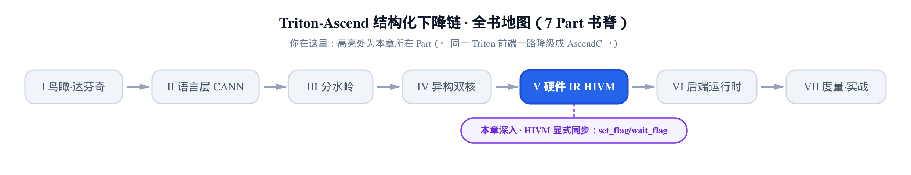
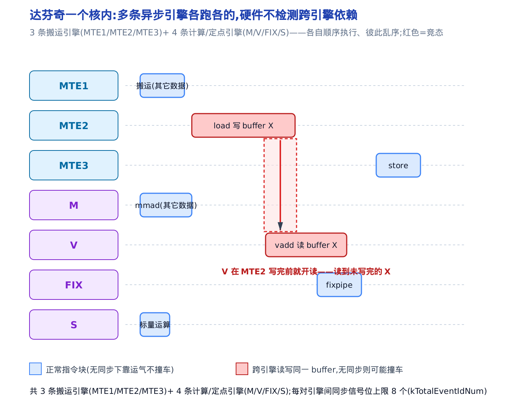
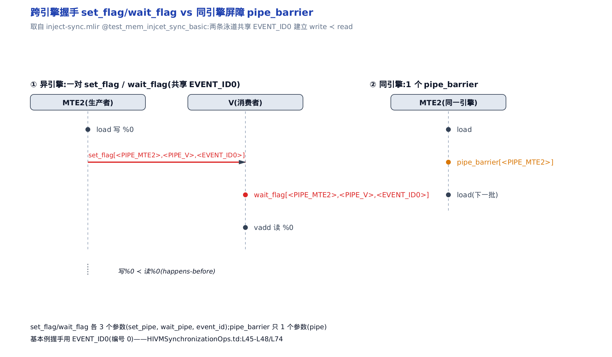
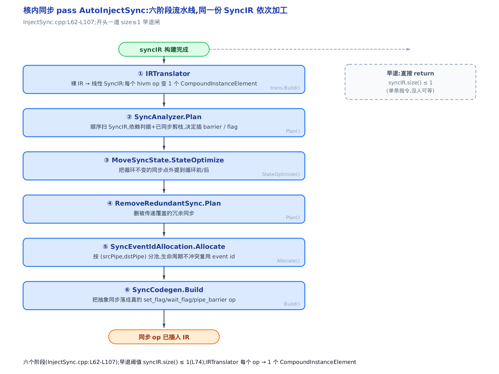
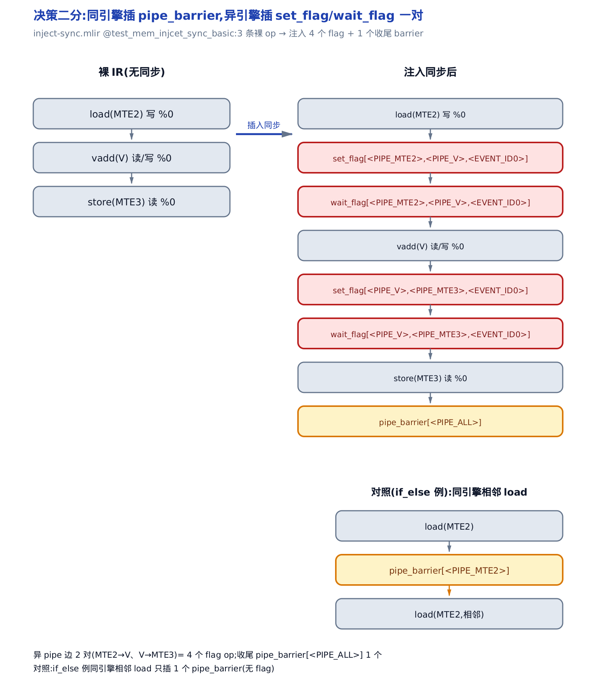
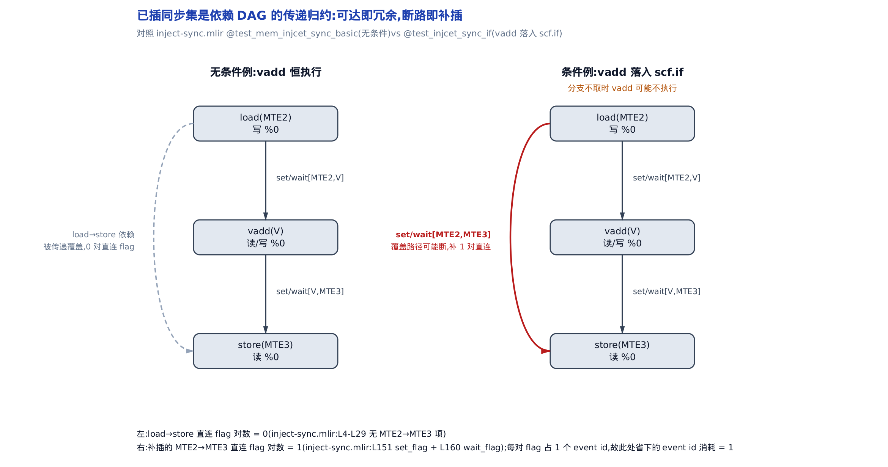
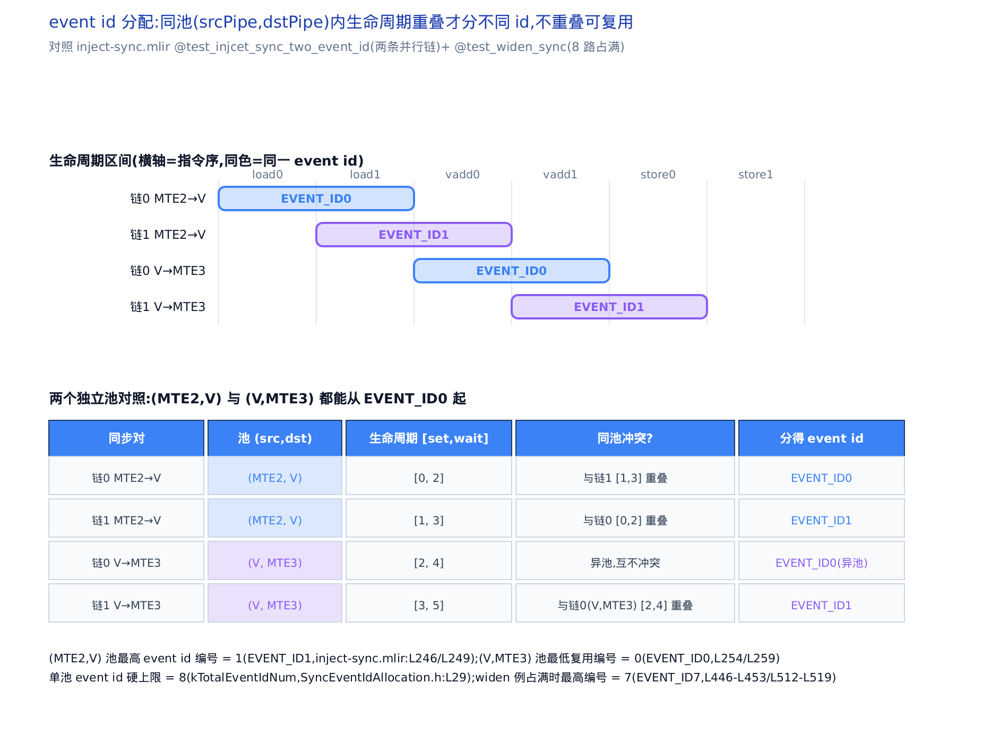
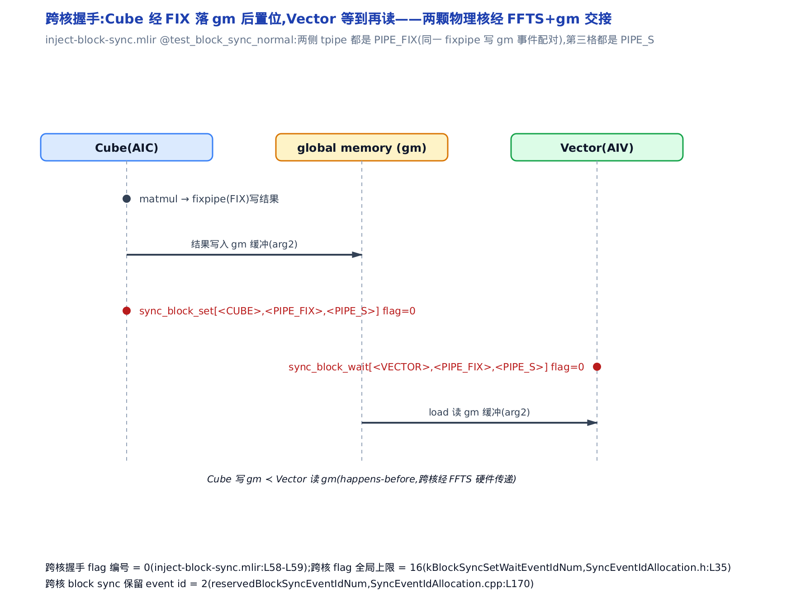

# 第 24 章　HIVM 显式同步——达芬奇为什么必须把同步摆到 IR 里、怎么摆




> 只想先弄懂核内流水怎么显式同步，读第 24.1 到 24.8 节即可；跨核 Cube↔Vector 握手与块间锁是独立的第二层，可直接跳到第 24.9 节起。

> 上一站：HIVM 把六级内存与 Cube／Vector 双核刻进了 IR 类型。
> 这一站：让这些互不知情的引擎和双核之间不打架。
> 下一站：走出 HIVM，把整条链降到 AscendC 库调用。

上一章 [第 23 章](../../ch23-hivm-dialect/narrative/chapter.md) 把达芬奇的硬件事实写进了 IR：一个 AI Core 里有 MTE2／MTE3 等搬运引擎、M（矩阵）与 V（向量）计算引擎、FIX（定点）引擎，数据分住 `gm`（片外显存）／`L1`／`UB`（片上缓冲）等六级内存；Cube 核（AIC）与 Vector 核（AIV）是两颗物理核。那一章讲的是**这些部件各是什么**。

本章讲的是**它们之间怎么不打架**。这里有一个上一章没点破的硬事实：达芬奇的这些引擎**各跑各的指令流、彼此乱序，而且硬件不做任何自动数据依赖检测**。在一台带缓存的 CPU 或带记分牌（scoreboard）的 GPU 上，「A 写完 X、B 才读 X」这件事多半由硬件替你盯着；达芬奇不盯。于是「等 MTE2 把数据搬完，V 再动手算」这句话，必须由**编译器显式地写成 IR 里的一条同步指令**——否则 V 会读到搬了一半的 buffer。

> **写给读过第一本 Triton 书的你**：HIVM 与它的编译器栈 bishengir 是昇腾后端**独有**的，上游 Triton 的 NVIDIA 路径里没有对位方言——GPU 靠硬件记分牌隐式解决大部分引擎间依赖，编译器只在共享内存屏障、warp 专精这类少数场景显式插栏。达芬奇把这件事**全部**推给编译器，所以本章讲的同步注入，在 NVIDIA 那条链上是没有对应 pass 的。这是两种硬件哲学的分水岭，不是简单的顶替关系。

本章有两层同步要讲：

1. **核内流水同步**——同一颗核里，MTE2 写完、V 才能读，用 `set_flag`／`wait_flag`／`pipe_barrier` 三件套，由 `-hivm-inject-sync` 这个 pass（MLIR 里对 IR 做一趟变换的处理单元）自动插。
2. **跨核同步**——Cube 核算完、Vector 核才能用，两颗物理核经片外显存交接数据，用 `sync_block` 系列 op，由 `-hivm-inject-block-sync` pass 自动插。

> **取证边界（一次性交代）**：host 上没有昇腾 NPU，也没有构建出 `bishengir-opt` 可执行文件，本章所有「同步前 / 同步后」的 IR **不是真机 dump**。地面真相取自仓库已提交的 lit 夹具（LLVM 的回归测试文件，`.mlir` 里写着输入 IR 与期望输出）：`test/Dialect/HIVM/inject-sync.mlir`（核内）与 `test/Dialect/HIVM/inject-block-sync.mlir`（跨核）。它们的 `// CHECK:` 行就是对应 pass 的期望输出，CI 每次跑 FileCheck（LLVM 的输出比对工具）逐字核对，权威性等价于真机 trace。源码常量（枚举、上限、Trait）标 `file:Lxxx`，可回溯到 `.td`／`.cpp` 定义。

> 只想搞清楚「同步到底插在哪、长什么样」，直接跳 §24.5 的决策二分和 §24.9 的跨核握手；想跟完整的分析→规划→分配全过程，从 §24.1 顺读。

---

## 24.1　为什么达芬奇非把同步摆进 IR

**直觉。** 把一颗达芬奇核想成一条厨房流水线上并排的几个师傅：MTE2 从冷库（`gm`）把食材搬到备料台（`L1`），M 师傅炒（矩阵），V 师傅拌（向量），FIX 师傅摆盘，MTE3 端菜出去（搬回 `gm`）。每个师傅只顾埋头按自己的清单干活、彼此不看对方进度；更要命的是这间厨房没有领班盯着谁等谁。于是 V 师傅可能在 MTE2 还没把食材搬上台时就伸手去拌——拌到一半的空气。谁都不会自动喊停，得有人把「等 MTE2 摆好再动手」这句话明写在清单上。

**机制。** 这条流水线有几条泳道？搬运有三条引擎（MTE1／MTE2／MTE3），计算与定点有四条（M／V／FIX／S 标量），加起来七条实体引擎在一颗核里同时跑。每条引擎**内部**顺序执行自己那串指令，引擎**之间**却完全乱序——硬件不建立跨引擎的先后关系。下面这张图把这个竞态钉死：



图里红色那条：`load` 在 MTE2 上写 buffer X，`vadd` 在 V 上读 buffer X，两条引擎没有任何强制先后。硬件既不会让 V 等 MTE2，也不会在 X 没写完时拦住 V。结果就是 V 大概率读到脏数据。正常情况下（蓝色）碰不碰得上纯靠运气——两个 op 恰好没读写同一块内存，就相安无事。

这就逼出了本章的全部动机：**跨引擎、跨核的生产者-消费者关系，必须由编译器显式地插一条同步指令来建立先后。** 而且这些同步用的信号是稀缺硬件资源——每对引擎之间的同步信号位（下文的 event id）只有 `8` 个（`SyncEventIdAllocation.h:L29` 的 `kTotalEventIdNum = 8`）。既不能不插（读脏数据），也不能乱插（占满信号位、拖慢流水）。怎么精确地插、插到最少，就是接下来九节的主题。

---

## 24.2　核内同步三件套：set_flag / wait_flag / pipe_barrier

**直觉。** `set_flag` 和 `wait_flag` 就像两个师傅之间的一面小旗：生产者干完活把旗立起来（set），消费者动手前先盯着这面旗、没立起来就干等（wait）。一面旗 = 一个 event id（硬件里的一个同步信号位）。`pipe_barrier` 则是同一个师傅对自己说「把手上这批全做完再做下一批」——同一条引擎本就排队，不需要旗，一句串行令即可。

**机制。** 这三件套是 HIVM 里的**一等 op**——同步不是注释、不是元数据，而是和 `load`／`vadd` 平级、能被 verifier 校验、能被后端翻成真指令的 IR 结点。它们定义在 HIVM 同步 op 的 TableGen 文件里（`.td`，MLIR 声明方言与 op 的领域语言）：

```cpp
// third_party/ascend/AscendNPU-IR/bishengir/include/bishengir/Dialect/HIVM/IR/HIVMSynchronizationOps.td:L43-L81
def SetFlagOp : HIVM_SynchronizationOp<"set_flag"> {
  let summary = "hivm set flag.";
  let arguments = (ins HIVM_PipeAttr:$set_pipe,
                       HIVM_PipeAttr:$wait_pipe,
                       OptionalAttr<HIVM_EventAttr>:$static_event_id,
                       Optional<I64>:$dynamic_event_id
  );
  let assemblyFormat = [{
    `[`
    $set_pipe
    `,` $wait_pipe
    `,` custom<EventID>($static_event_id, $dynamic_event_id)
    `]` attr-dict
  }];
  let hasVerifier = 1;
}

def WaitFlagOp : HIVM_SynchronizationOp<"wait_flag"> {
  // … 省略：参数与 assemblyFormat 与 SetFlagOp 逐字相同 …
  let hasVerifier = 1;
}

def PipeBarrierOp : HIVM_SynchronizationOp<"pipe_barrier"> {
  let summary = "hivm pipe barrier.";
  let arguments = (ins HIVM_PipeAttr:$pipe);
  let assemblyFormat = "`[` $pipe `]` attr-dict";
}
```

逐段读它的设计：

- `SetFlagOp` 拿三个关键参数：`set_pipe`（生产者引擎）、`wait_pipe`（消费者引擎）、`event_id`（这对握手用的信号位号）。在 IR 里写出来长这样：`set_flag[<PIPE_MTE2>, <PIPE_V>, <EVENT_ID0>]`——读作「MTE2 对 V 立起 0 号旗」。`event_id` 支持静态属性（`static_event_id`）或动态 SSA 值（`dynamic_event_id`）二选一，编译期能定就用静态。
- `WaitFlagOp` 参数与 `SetFlagOp` **逐字相同**（我省略了重复的一段）——因为一次握手就是一 set 一 wait 配对，两者必须带同一组 `(set_pipe, wait_pipe, event_id)` 才能对上号。`wait_flag[<PIPE_MTE2>, <PIPE_V>, <EVENT_ID0>]` 读作「V 干等 MTE2 立起的 0 号旗」。
- `PipeBarrierOp` 只有**一个** `pipe` 参数。因为它是同一条引擎内部的串行屏障，不存在「谁对谁」，只需说「拦住哪条引擎的流水」。它也没有 `hasVerifier`——参数太简单，无需额外校验。

下图把「异引擎用一对旗、同引擎用一条屏障」的对照摆在一起：



左半边：生产者 MTE2 干完 `load` 后立 `set_flag`，消费者 V 在 `vadd` 前等 `wait_flag`，两者 `set_pipe`／`wait_pipe` 一致、共用 `EVENT_ID0`，于是建立了「写 %0 发生在读 %0 之前」的先后关系（happens-before，即一个内存操作的效果对另一个可见的强制次序）。右半边：同一条 MTE2 引擎内两批活，只需一条 `pipe_barrier[<PIPE_MTE2>]` 把前一批拦完再放后一批，一面旗都不用。

`SetFlagOp` 那句 `hasVerifier = 1` 也不是摆设。event_id 支持静态属性和动态 SSA 值两种写法，但**二者只能给一个**——校验函数把这条规矩钉死：

```cpp
// third_party/ascend/AscendNPU-IR/bishengir/lib/Dialect/HIVM/IR/HIVMSynchronizationOps.cpp:L90-L100
LogicalResult SetFlagOp::verify() {
  auto eventIDAttr = getStaticEventId();
  auto eventID = getDynamicEventId();
  if (eventIDAttr.has_value() && eventID != TypedValue<IntegerType>{}) {
    return emitOpError("Only one Event ID is supported!");
  }

  if (!eventIDAttr.has_value() && eventID == TypedValue<IntegerType>{}) {
    return emitOpError("Event ID is needed!");
  }
  return success();
}
```

两条 `emitOpError` 各堵一个洞：静态、动态都给了，报「只支持一个」；都没给，报「必须要一个」。一面旗必须恰有一个可辨认的编号——`WaitFlagOp::verify()` 是逐字相同的一份（此处省略）。这保证了 §24.7 分配 event id 时，每对握手的信号位号总是唯一确定的。

这个「参数个数」的差别（旗要 3 个参数、屏障只要 1 个）不是随意的，它精确对应两种同步的物理本质：跨引擎握手需要「源、目的、信号」三要素，同引擎串行只需要「拦谁」。记住这个二分，§24.5 会看到编译器就是靠它选择插旗还是插屏障。

---

## 24.3　同步 pass 的六道工序：一张总览图

**直觉。** 把裸 IR 变成带同步的 IR，不是一锤子买卖，而是一条六道工序的小流水线：先把弯弯绕绕的 IR 拍平成一串指令（翻译），再逐条往前找谁跟谁有依赖（规划），把能提出循环的同步往外挪（外提），删掉重复的（去冗余），给每对握手发旗号（分配 event id），最后把抽象的「这里要同步」落成真的 `set_flag`／`wait_flag`（codegen）。

**机制。** 核内同步 pass 的入口函数 `AutoInjectSync` 把这六步一字排开：

```cpp
// third_party/ascend/AscendNPU-IR/bishengir/lib/Dialect/HIVM/Transforms/InjectSync/InjectSync.cpp:L62-L107
void InjectSyncAnalysis::AutoInjectSync(bool enableUnitFlag,
                                        bool assumeAliveLoops) {
  MemoryDependentAnalyzer memAnalyzer;
  SyncIRs syncIR;
  SyncOperations syncOperations;
  Buffer2MemInfoMap buffer2MemInfoMap;

  IRTranslator trans(syncIR, memAnalyzer, buffer2MemInfoMap, func_,
                     SyncAnalysisMode::NORMALSYNC);
  trans.Build();

  // Single instruction or no instruction, no need to insert synchronization.
  if (syncIR.size() <= 1) {
    return;
  }

  SyncAnalyzer syncAnalyzer(syncIR, memAnalyzer, syncOperations, func_,
                            SyncAnalysisMode::NORMALSYNC, enableUnitFlag,
                            assumeAliveLoops);
  syncAnalyzer.SetBuffer2ParentAliasBuffer(trans.GetBuffer2ParentAliasBuffer());
  syncAnalyzer.Plan();

  MoveSyncState syncMove(syncIR, syncOperations);
  syncMove.StateOptimize();

  RemoveRedundantSync removeRedundantSync(syncIR, syncOperations);
  removeRedundantSync.Plan();

  SyncEventIdAllocation eventIdAllocation(syncIR, syncOperations);
  eventIdAllocation.Allocate();

  SyncCodegen syncCodegen(syncIR, func_, SyncAnalysisMode::NORMALSYNC);
  syncCodegen.Build();
}
```

这段短短几十行（`third_party/ascend/AscendNPU-IR/bishengir/lib/Dialect/HIVM/Transforms/InjectSync/InjectSync.cpp:L62-L107`）就是整条核内同步的骨架，六个对象依次登场：

1. `IRTranslator.Build()`——把裸 IR 翻成线性的 `SyncIR`（一个内部中间表示，把 IR 拍平成一串带读写信息的元素），每个计算 op 变成一个 `CompoundInstanceElement`（携带它读了哪些 memref、写了哪些 memref、落在哪条 pipe）。
2. `SyncAnalyzer.Plan()`——顺序扫这串元素，分析谁跟谁有内存依赖，决定哪里要插同步。这是最核心的一步，§24.4／§24.5 拆开讲。
3. `MoveSyncState.StateOptimize()`——把循环里恒定的同步点外提出去（§24.8）。
4. `RemoveRedundantSync.Plan()`——删被传递覆盖的冗余同步（§24.6）。
5. `SyncEventIdAllocation.Allocate()`——把抽象的同步对分配到有限的 event id（§24.7）。
6. `SyncCodegen.Build()`——把前面攒下的抽象同步（`SyncOperation`）落成真正的 `set_flag`／`wait_flag`／`pipe_barrier` op，插进 IR。

紧接翻译之后那道 `if (syncIR.size() <= 1) return` 是最朴素的早退：整个函数只有一条（或零条）指令时，根本没有「谁等谁」，直接收工。这个阈值 `1` 后面图里会再点到。

| 阶段 | 对象·方法 | 干什么 |
| --- | --- | --- |
| ① 翻译 | `IRTranslator.Build()` | 裸 IR → 线性 SyncIR，每个 hivm op 变 1 个 `CompoundInstanceElement`（带 def/use + pipe） |
| ② 规划 | `SyncAnalyzer.Plan()` | 顺序扫 SyncIR，依赖判据 + 已同步剪枝，决定插 barrier / flag |
| ③ 外提 | `MoveSyncState.StateOptimize()` | 把循环不变的同步点外提到循环前/后 |
| ④ 去冗余 | `RemoveRedundantSync.Plan()` | 删被传递覆盖的冗余同步 |
| ⑤ 分配 | `SyncEventIdAllocation.Allocate()` | 按 `(srcPipe, dstPipe)` 分池，生命周期不冲突复用 event id |
| ⑥ 落地 | `SyncCodegen.Build()` | 把抽象同步落成真的 `set_flag`/`wait_flag`/`pipe_barrier` op |

这张表的六行数与源码里六个对象一一对齐；早退阈值 `syncIR.size() <= 1` 见 `InjectSync.cpp:L74`；「每个 op 变 1 个 element」的翻译比例见 `IRTranslator.cpp:L356-L484`。下图把这条流水线画成一串方框，附带那道早退闸：



看清了骨架，接下来三节把第 ② 步（规划）拆开——这是全章的心脏。

---

## 24.4　谁跟谁有依赖：内存别名分析

**直觉。** 编译器判「两步之间要不要同步」，全看它们碰的是不是同一块内存。就像判两个人会不会撞手，只需看他们伸向哪个抽屉：抽屉不在同一个柜子（不同内存空间，比如一个在 `UB`、一个在 `L1`）——绝不可能撞；同一个柜子里，再看抽屉编号区间有没有交叠。地址说不准（变量地址）就宁可假定会撞。

**机制。** 但要判「同一块内存」，先得知道每个 op 落在**哪条引擎**——因为同步的 `set_pipe`／`wait_pipe` 归根到底来自「生产者、消费者各自跑在哪条 pipe」。多数 op 的 pipe 是静态标注的（`HIVMDMAOps.td` 里 `load` 标 MTE2、`store` 标 MTE3、`fixpipe` 标 FIX）；少数搬运 op 得看**搬运方向**动态判：

```cpp
// third_party/ascend/AscendNPU-IR/bishengir/lib/Dialect/HIVM/IR/OpPipeInterface/GetPipe.cpp:L32-L56
PIPE CopyOp::getPipe() {
  assert(hasPureBufferSemantics() && "Operating on tensor, please bufferize.");
  MemRefType srcMemrefType = dyn_cast<MemRefType>(getSrcOperandType());
  MemRefType dstMemrefType = dyn_cast<MemRefType>(getDstOperandType());
  auto srcMemSpaceAttr = srcMemrefType.getMemorySpace();
  auto dstMemSpaceAttr = dstMemrefType.getMemorySpace();
  // … 省略：两个 assert 检查内存空间非空 …

  const DenseMap<std::pair<AddressSpace, AddressSpace>, PIPE> kSrcDstSpace2Pipe{
      {std::make_pair(AddressSpace::UB, AddressSpace::UB), PIPE::PIPE_V},
      {std::make_pair(AddressSpace::L0C, AddressSpace::GM), PIPE::PIPE_FIX},
      {std::make_pair(AddressSpace::GM, AddressSpace::L1), PIPE::PIPE_MTE2},
      {std::make_pair(AddressSpace::UB, AddressSpace::L1), PIPE::PIPE_MTE3},
  };

  auto nowSrcDstSpace =
      std::make_pair(cast<AddressSpaceAttr>(srcMemSpaceAttr).getAddressSpace(),
                     cast<AddressSpaceAttr>(dstMemSpaceAttr).getAddressSpace());
  auto iter = kSrcDstSpace2Pipe.find(nowSrcDstSpace);
  if (iter != kSrcDstSpace2Pipe.end()) {
    return iter->second;
  }
  llvm_unreachable("Unknown PIPE!");
}
```

这张 `kSrcDstSpace2Pipe` 表就是「搬运方向决定引擎」的最直接证据：从 `GM`（片外显存）搬到 `L1` 走 MTE2、从 `UB` 搬到 `L1` 走 MTE3、`L0C`（矩阵累加缓冲）搬到 `GM` 走 FIX、`UB` 内部算走 V。知道了每个 op 的 pipe，才谈得上「跨 pipe 依赖」。

pipe 定好，就轮到依赖判据本身——两块 buffer 到底算不算「碰同一块内存」：

```cpp
// third_party/ascend/AscendNPU-IR/bishengir/lib/Dialect/HIVM/Transforms/InjectSync/MemoryDependentAnalyzer.cpp:L42-L91
bool MemoryDependentAnalyzer::MemAlias(const BaseMemInfo *a,
                                       const BaseMemInfo *b) {
  assert(a != nullptr && b != nullptr);
  hivm::AddressSpace addressSpaceA = a->addressSpace;
  hivm::AddressSpace addressSpaceB = b->addressSpace;
  if (addressSpaceA != addressSpaceB) {
    return false;
  }
  if (addressSpaceA == hivm::AddressSpace::GM &&
      addressSpaceB == hivm::AddressSpace::GM) {
    return isGMBufferOverlap(a, b);
  }
  if (a->rootBuffer == b->rootBuffer) {
    return true;
  }
  return isBufferAddressRangeOverlap(a, b);
}

bool MemoryDependentAnalyzer::isBufferAddressRangeOverlap(
    const BaseMemInfo *a, const BaseMemInfo *b) {
  assert(a != nullptr && b != nullptr);
  if (a->hasVariableAddress || b->hasVariableAddress) {
    // conservatively assume overlap if any buffer has variable address
    return true;
  }
  // … 省略：双重循环遍历 a、b 的 baseAddresses，任一对 isBufferOverlap 即返回 true …
  return false;
}
```

`MemAlias` 是三分支穷尽判断，逐条读：

- **第一支**：`addressSpaceA != addressSpaceB` → 直接 `return false`。不同内存空间物理上不可能是同一块——一个在 `UB`、一个在 `L1`，永远撞不上。这是最省事、也最常命中的短路。
- **第二支**：两块都在 `GM`（片外显存共享给所有核）→ 交给 `isGMBufferOverlap` 按地址判（不同根 buffer 不冲突，workspace——编译器为中间结果在 `gm` 上另开的暂存区，与用户传入的输入／输出 buffer 分开记账——才细查）。
- **第三支**：同一片上空间，先看 `rootBuffer` 是不是同一块，是就直接算冲突；否则 `isBufferAddressRangeOverlap` 按 `[addr, addr+size)` 区间相交判。这里有个关键的**保守回退**：只要任一 buffer 是变量地址（`hasVariableAddress`），就直接 `return true`——地址说不准时宁可多插一次同步，也不能漏。

拿两个夹具走一遍。基本例 `test_mem_injcet_sync_basic` 是一条 `load(MTE2) → vadd(V) → store(MTE3)` 单链，每块 `memref<16x16x16xf16>` 占 `16×16×16×2 = 8192` 字节，本例真正读写的 buffer 经 `pointer_cast` 落在 `UB` 偏移 0（`%0`）与 8192（`%4`，`vadd` 的第二个输入）处（另有落在 0、16384 的 `%2`／`%5` 两块在这个函数里未被读写）。为了讲清「两条独立链之间不必同步」，下表还借了另一个夹具 `test_injcet_sync_two_event_id`（§24.7 会细讲）——它把四块 buffer 摆在偏移 0／8192／16384／24576 上、跑两条并行的 `load→vadd→store` 链。下表的候选对分别取自这两个夹具，逐条看 `MemAlias` 判它们该不该建生产者-消费者边：

<!-- trace: m3 -->

| 候选对 | 空间A / 空间B | 区间A（字节） | 区间B（字节） | 重叠？ | 建生产者-消费者边？ |
| --- | --- | --- | --- | --- | --- |
| load 写 %0 ↔ vadd 读 %0 | UB / UB | [0, 8192) | [0, 8192) | 是（同址） | 是 → load→vadd |
| vadd 读 %4 ↔ load 写 %0 | UB / UB | [8192, 16384) | [0, 8192) | 否（相邻不交） | 否 |
| 链0 vadd 写 %0 ↔ 链1 vadd 写 %2（借 `two_event_id` 例） | UB / UB | [0, 8192) | [8192, 16384) | 否 | 否（两条链独立，无跨链同步） |
| （反例）UB 里的 buffer ↔ L1/gm 里的 buffer | UB / L1 | 任意 | 任意 | 否（异空间短路） | 否 |

三个计算 op 最多有 `` $`\binom{3}{2}=3`$ `` 个候选对，实际只建 2 条边（`load→vadd`、`vadd→store`）——第三对 `load %0` 与 `vadd %4` 因区间 `[0,8192)` 与 `[8192,16384)` 首尾相邻但不相交被剔除。表最后一行是异空间短路的活证：跨内存空间的两块 buffer 连区间都不用比，第一支 `return false` 就否了。

**不变量（保守性）**：凡真有数据重叠的一对（同空间且区间相交）必被判为有依赖；地址／大小不确定时退化为「有依赖」（宁多勿漏）。**漏判——真重叠却判无依赖——不可能发生。** 论证很直接：`MemAlias` 唯一返回 `false` 的两条路径是「确定不同空间」与「确定区间不交」，两者都真无重叠；其余情形（同 rootBuffer、变量地址）一律保守判 `true`。所以正确性由「不漏」保证，代价只是可能多判（不同 rootBuffer 却被保守假定冲突时会多插一次同步）。对同步而言，多插一次浪费一点性能，漏插一次就是读脏数据——这个偏向选得毫不含糊。

---

## 24.5　插 barrier 还是插 flag：决策二分

**直觉。** 拿到一条「A 产、B 消」的依赖，编译器只问一句：A 和 B 是不是同一个师傅？是——一句 `pipe_barrier` 让这个师傅把前半批做完再做后半批就够（同引擎本就排队）；不是——才需要立旗，在 A 后面 `set_flag`、在 B 前面 `wait_flag`，一对信号跨引擎建立先后。

**机制。** 这个决策的落地是全章最关键的一个函数 `InsertSyncOperation`——它是一个干净的二分：

```cpp
// third_party/ascend/AscendNPU-IR/bishengir/lib/Dialect/HIVM/Transforms/InjectSync/SyncAnalysis.cpp:L846-L890
void SyncAnalyzer::InsertSyncOperation(
    CompoundInstanceElement *nowCompound,
    CompoundInstanceElement *frontCompound,
    DepBaseMemInfoPairVec &depBaseMemInfosVec,
    const std::optional<unsigned> &forEndIndex) {
  // … 省略：CheckUnlikelyScope 处理 unlikely 分支的特殊落点 …

  auto nowPipe = nowCompound->kPipeValue;
  auto frontPipe = frontCompound->kPipeValue;
  ChangeToVirtualMTE2IfNeed(nowCompound, frontCompound, nowPipe, frontPipe,
                            depBaseMemInfosVec);
  if (nowPipe == frontPipe) {
    unsigned insertBarrierId = nowCompound->GetIndex();
    auto barrierSyncOp = std::make_unique<SyncOperation>(
        SyncOperation{SyncOperation::TYPE::PIPE_BARRIER, frontPipe, nowPipe,
                      syncIndex, nowCompound->GetIndex(), forEndIndex});
    barrierSyncOp->SetDepSyncIRIndex(frontCompound->GetIndex());
    syncIR[insertBarrierId]->pipeBefore.push_back(barrierSyncOp.get());
    barrierSyncOp->SetSyncIRIndex(insertBarrierId);
    SmallVector<std::unique_ptr<SyncOperation>> newSync;
    newSync.emplace_back(std::move(barrierSyncOp));
    syncOperations.emplace_back(std::move(newSync));
  } else {
    unsigned insertWaitId = nowCompound->GetIndex();
    unsigned insertSetId = frontCompound->GetIndex();
    auto setFlag = std::make_unique<SyncOperation>(
        SyncOperation{SyncOperation::TYPE::SET_EVENT, frontPipe, nowPipe,
                      syncIndex, insertSetId, forEndIndex});
    auto waitFlag = setFlag->GetMatchSync(insertWaitId);
    UpdateBackSyncMultiBufferInfo(setFlag.get(), waitFlag.get(),
                                  depBaseMemInfosVec, forEndIndex);
    syncIR[insertSetId]->pipeAfter.push_back(setFlag.get());
    syncIR[insertWaitId]->pipeBefore.push_back(waitFlag.get());
    SmallVector<std::unique_ptr<SyncOperation>> newSync;
    newSync.emplace_back(std::move(setFlag));
    newSync.emplace_back(std::move(waitFlag));
    syncOperations.emplace_back(std::move(newSync));
  }
  syncIndex++;
  // … 省略：结尾的 syncOperations.size() 与 syncIndex 一致性 assert …
}
```

`nowCompound` 是消费者（now，当前扫到的 op），`frontCompound` 是它向前找到的、有依赖的生产者（front）。开头那句 `ChangeToVirtualMTE2IfNeed` 处理一种特殊搬运场景下的 pipe 归一化（把某类搬运的 pipe 统一改记成虚拟 MTE2），它不改变本节要讲的 barrier-vs-flag 二分，也不影响紧接着的 `nowPipe == frontPipe` 判断，可略过。撇开它，整个函数就一个 `if (nowPipe == frontPipe)`：

- **同 pipe 分支**：造一个 `TYPE::PIPE_BARRIER`，压进消费者的 `pipeBefore`（即挂在这个 op 之前执行）。一条屏障，`event_id` 都不需要。
- **异 pipe 分支**：造一对。`setFlag`（`TYPE::SET_EVENT`）挂进生产者的 `pipeAfter`（生产者之后立旗），`waitFlag = setFlag->GetMatchSync(...)` 挂进消费者的 `pipeBefore`（消费者之前等旗）。`GetMatchSync` 保证这一 set 一 wait 带同一个 `syncIndex`，天生配对；两者的 `set_pipe = frontPipe`、`wait_pipe = nowPipe`。

拿 `test_mem_injcet_sync_basic` 对账，逐条依赖走这个二分：

<!-- trace: m4 -->

| 生产者→消费者 | front pipe | now pipe | 同引擎？ | 注入的同步 op |
| --- | --- | --- | --- | --- |
| load → vadd | MTE2 | V | 否 | `set_flag[<PIPE_MTE2>,<PIPE_V>,<EVENT_ID0>]`（挂 load 后）+ `wait_flag[<PIPE_MTE2>,<PIPE_V>,<EVENT_ID0>]`（挂 vadd 前） |
| vadd → store | V | MTE3 | 否 | `set_flag[<PIPE_V>,<PIPE_MTE3>,<EVENT_ID0>]` + `wait_flag[<PIPE_V>,<PIPE_MTE3>,<EVENT_ID0>]` |
| load → load（if_else 例首两个 load 同引擎） | MTE2 | MTE2 | 是 | `pipe_barrier[<PIPE_MTE2>]`（仅 1 个，无 flag） |

两条异 pipe 边各产一对 flag，共 4 个 flag op（2 条边 × 每条 1 set + 1 wait）；夹具末尾另有一条 `return` 前的 `pipe_barrier[<PIPE_ALL>]` 收尾——`PIPE_ALL` 不是一条真实引擎，而是「等所有引擎都完工」的伪值，常用作函数收尾处把全部流水拦齐的整体屏障。合计 5 个同步 op——正好对上夹具里的 5 行 `// CHECK:`。第三行是同引擎对照：`if_else` 例里两个相邻 `load` 同属 MTE2，只需一条 `pipe_barrier[<PIPE_MTE2>]`。下图把这个「3 条裸 op → 4 个 flag + 1 个收尾 barrier」的转换和同引擎对照一起画出：



**不变量（覆盖计数确定）**：每条有依赖的边被**恰好一种**同步覆盖——同 pipe 恰 1 个 `pipe_barrier`；异 pipe 恰 1 对 `set_flag`／`wait_flag`（共享同一 `syncIndex` 配对）。无第三种出口。论证就是这个二分本身全分支穷尽：`if` 走 barrier、`else` 走 flag，各只产一组，`GetMatchSync` 保证 set／wait 同号。要是把这两条异 pipe 边都错当同引擎，只需 2 个 barrier——但会漏掉跨引擎的 happens-before，读脏数据。计数的确定性正是「不多不少插对」的形式保证。

---

## 24.6　最小同步集：可达即冗余，断路即补插

**直觉。** 如果 A 已经通过 B 间接跟 C 排好了先后（`A→B`、`B→C` 都插了同步），那 `A→C` 再单独立一面旗就是浪费——旗子本就稀缺。所以编译器只在「没有任何已有路径能把 A 排到 C 前面」时才补直连同步。但有个陷阱：如果中间那步 B 藏在 `if` 里、可能根本不执行，这条间接路径就断了，`A→C` 必须补上直连。

**机制。** 这道剪枝就在规划的入口 `MemAnalyze` 里，是两道门：

```cpp
// third_party/ascend/AscendNPU-IR/bishengir/lib/Dialect/HIVM/Transforms/InjectSync/SyncAnalysis.cpp:L527-L566
void SyncAnalyzer::MemAnalyze(CompoundInstanceElement *nowCompound,
                              CompoundInstanceElement *frontCompound,
                              SyncRecordList &syncRecordList,
                              const std::optional<unsigned> &forEndIndex) {
  if (isAlreadySync(nowCompound, frontCompound, syncRecordList, 0)) {
    // already sync by checking single buffer records, no need to insert sync
    // any more
    return;
  }
  DepBaseMemInfoPairVec depBaseMemInfosVec;
  if (!IsMemInfoHasDependency(nowCompound, frontCompound, depBaseMemInfosVec)) {
    //  no need to insert sync if no dependency.
    return;
  }
  // … 省略：forEndIndex 多缓冲同步记录预判（非主线）…
  if (syncAnalysisMode == SyncAnalysisMode::BLOCKSYNC) {
    InsertBlockSyncOperation(nowCompound, frontCompound, depBaseMemInfosVec,
                             forEndIndex);
  } else {
    assert(syncAnalysisMode == SyncAnalysisMode::NORMALSYNC);
    // … 省略：unit-flag 特化分支，非主线 …
    InsertSyncOperation(nowCompound, frontCompound, depBaseMemInfosVec,
                        forEndIndex);
  }
  UpdateSyncRecordInfo(frontCompound, syncRecordList);
}
```

两道门顺次把关：

1. **`isAlreadySync`**——若这对依赖已被更近的同步记录传递覆盖（`A→B`、`B→C` 已同步则 `A→C` 免插），直接 `return`。这是「最小同步集」的关键剪枝。
2. **`IsMemInfoHasDependency`**——就是 §24.4 的 `MemAlias`，没内存依赖就 `return`。

顺带留意末尾的 `if (syncAnalysisMode == BLOCKSYNC)` 分岔：**同一个 `SyncAnalyzer` 靠一个模式开关，既服务核内（`NORMALSYNC` 产 flag/barrier）、也服务跨核（`BLOCKSYNC` 产 sync_block）。** 依赖分析逻辑同构，只是产出的 op 种类不同——这个复用是 §24.10 跨核路径能白捡核内那套分析的原因，先记住。

拿 `test_mem_injcet_sync_basic`（无条件）对比 `test_injcet_sync_if`（`vadd` 落在 `scf.if` 内）看剪枝生效与失效：

<!-- trace: m5 -->

| 场景 | 待判依赖边 | 中间节点 vadd | 被传递覆盖？ | 补插 MTE2→MTE3 直连同步？ |
| --- | --- | --- | --- | --- |
| 基本例（无条件） | load → store | vadd(V) 无条件夹在中间 | 是：load→vadd(MTE2→V) 与 vadd→store(V→MTE3) 两跳已同步 | 否 — 夹具里 0 对 MTE2→MTE3 flag |
| if 例（条件） | load → store | vadd 落在 scf.if 内，分支不取时不执行 | 否：间接路径可能断 | 是 — 补 1 对 `set_flag[<PIPE_MTE2>,<PIPE_MTE3>]` + `wait_flag[<PIPE_MTE2>,<PIPE_MTE3>]` |

基本例里 `load→store` 这条边被 `load→vadd→store` 覆盖，省下 1 对 flag——否则总同步 op 会从实际的 5 个涨到 7 个（多 1 对 MTE2→MTE3）。`if` 例里因 `vadd` 条件化，恰好把这 1 对补回来（夹具 `L151` 的 set、`L160` 的 wait 各 1 条），印证「覆盖失效即补插」。下图把这组对照画成两个三节点链：



**理论视角：这就是依赖 DAG 的传递归约（transitive reduction，删掉所有能由其他边间接得到的冗余边、保持可达性不变）。** 把依赖看作偏序 DAG，已插同步是覆盖边；若边 `(u,w)` 可由 `(u,v)`、`(v,w)` 传递得到，则 `(u,w)` 冗余。删去所有这种冗余边、可达性（happens-before 闭包）不变，剩下的就是传递归约。

老一代的 `isAlreadySync` 是靠「单 buffer 同步记录」做这件事；新一代的 `GraphSyncSolver` 把它升级成了图论问题——在 `(core, pipe)` 图上跑 Dijkstra（单源最短路算法）判可达性：

```cpp
// third_party/ascend/AscendNPU-IR/bishengir/lib/Dialect/HIVM/Transforms/GraphSyncSolver/GraphSolver.cpp:L122-L177
std::optional<int> GraphSolver::runDijkstra(CorePipeInfo corePipeSrc,
                                            CorePipeInfo corePipeDst,
                                            int startIndex, int endIndex) {
  llvm::DenseMap<CorePipeInfo, int> distance;
  std::priority_queue<std::pair<int, CorePipeInfo>,
                      std::vector<std::pair<int, CorePipeInfo>>,
                      std::greater<std::pair<int, CorePipeInfo>>>
      que;
  que.emplace(startIndex, corePipeSrc);
  auto [coreDst, pipeDst] = corePipeDst;
  // … 省略：LLVM_DEBUG 打印起止 index …
  while (!que.empty()) {
    auto [curIndex, curCorePipe] = que.top();
    auto [curCore, curPipe] = curCorePipe;
    que.pop();
    // … 省略：LLVM_DEBUG 打印 + distance 单调性剪枝（已有更优距离则跳过、越界则停）…
    if (curCore == coreDst &&
        ((curIndex != startIndex && curPipe == hivm::PIPE::PIPE_S) ||
         curPipe == hivm::PIPE::PIPE_ALL)) {
      distance[corePipeDst] = curIndex;
      break;
    }

    for (auto &[endCorePipe, edges] : adjacencyList[curCorePipe]) {
      auto it = edges.lower_bound(Edge(curCorePipe, endCorePipe, curIndex, -1));
      for (; it != edges.end(); it++) {
        if (!distance.count(endCorePipe) ||
            (distance[endCorePipe] > (it->endIndex))) {
          distance[endCorePipe] = it->endIndex;
          que.emplace(it->endIndex, endCorePipe);
        }
      }
    }
  }

  return distance.count(corePipeDst) ? distance[corePipeDst]
                                     : std::optional<int>();
}
```

读它的意思：把每个 `(core, pipe)` 当作图的结点，现有的每条同步 op 是一条带时序窗口 `[startIndex, endIndex]` 的边。对一条待满足的生产者→消费者依赖，从 `src` 结点起跑最短路——`while` 循环沿邻接边松弛，`edges.lower_bound(...)` 保证只走时序上「够得着」的边（起点不早于当前时刻）。**若能在时序窗内从 `src` 走到 `dst`，说明这条依赖已被现有同步传递覆盖，返回可达、跳过；走不到才补新同步。** 这就是把 `isAlreadySync` 的记账升级成了一句「可达即冗余」的图论表述——比单 buffer 记录更一般，也更适合跨核这种多维图。

---

## 24.7　event id 分配：分池与生命周期复用

**直觉。** event id 是稀缺的信号旗，每对引擎之间只有 8 面。分配像给会议室排班：同一对引擎（同池）里，两个握手只要「占用时段」（set 到 wait 的指令区间）不重叠，就能共用一面旗；重叠就得各拿一面。不同引擎对之间是不同的旗架，编号可以各自从 0 数起、互不干扰。

**机制。** 「同一对引擎一个旗架」这件事，落在 `ScopePair`——它算出一个同步对该到哪个池里领号：

```cpp
// third_party/ascend/AscendNPU-IR/bishengir/lib/Dialect/HIVM/Transforms/InjectSync/SyncEventIdAllocation.cpp:L360-L372
int SyncEventIdAllocation::ScopePair(const SyncOperation *s) {
  if (s->GetType() == SyncOperation::TYPE::SYNC_BLOCK_SET ||
      s->GetType() == SyncOperation::TYPE::SYNC_BLOCK_WAIT) {
    // For inter block synchronization, event id is global shared and then the
    // scope pair is always same.
    return 0;
  }
  // For intra block synchronization, each pipe pair has fixed number event ids
  // and then scope pair make a difference between each pipe pair.
  auto srcT = static_cast<unsigned int>(s->GetActualSrcPipe()); // [8:15]
  auto dstT = static_cast<unsigned int>(s->GetActualDstPipe()); // [0:7]
  return static_cast<int>((dstT << 8) | srcT);
}
```

逻辑分两路：跨核 block sync（`SYNC_BLOCK_SET/WAIT`）恒返回 `0`——它们的信号是全局共享的，不分池（§24.11 细说）。核内 flag 则把 `(srcPipe, dstPipe)` 编码成池键 `(dstT << 8) | srcT`——每对 pipe 一个独立池。「在该池里找生命周期不冲突的空闲位复用」这件事由 `SyncEventIdAllocation::SetEventId`（逐个同步对分配 event id 的核心函数）完成——它先算出池内每个 id 的「生命周期空闲 / 完全空闲」状态，再连续分配该同步对所需数目的空闲 id；找不到空闲位就占新位，每池上限 `kTotalEventIdNum = 8`。

拿 `test_injcet_sync_two_event_id`（两条并行 `load→vadd→store` 链）看复用与分池。按 op 序 `load0=0, load1=1, vadd0=2, vadd1=3, store0=4, store1=5`，每个同步对的生命周期是它 set 到 wait 的指令区间：

<!-- trace: m6 -->

| 同步对 | 池 (src,dst) | 生命周期区间 [set 序，wait 序] | 同池内冲突 | 分得 event id |
| --- | --- | --- | --- | --- |
| 链0 MTE2→V | (MTE2, V) | [0, 2] | 与链1 [1,3] 重叠 | EVENT_ID0 |
| 链1 MTE2→V | (MTE2, V) | [1, 3] | 与链0 [0,2] 重叠 | EVENT_ID1 |
| 链0 V→MTE3 | (V, MTE3) | [2, 4] | 与链1 [3,5] 重叠；但与 (MTE2,V) 池异池、互不冲突 | EVENT_ID0（异池复用同号，是不同物理信号位） |
| 链1 V→MTE3 | (V, MTE3) | [3, 5] | 与链0 [2,4] 重叠 | EVENT_ID1 |

读这张表的两个关键：`(MTE2, V)` 池里链0 `[0,2]` 与链1 `[1,3]` 时段重叠，只好一个拿 `EVENT_ID0`、一个拿 `EVENT_ID1`；而 `(V, MTE3)` 是**另一个池**，哪怕它的两个对也重叠、也从 `EVENT_ID0` 重新起——同号在不同池是不同的物理信号位，井水不犯河水。下图把这四个对画成甘特图，同池同色，一眼看出重叠错开、异池复用：



**不变量（复用充要条件）**：同一 `(srcPipe, dstPipe)` 池内，两同步对共享 event id `` $`\iff`$ `` 生命周期区间不相交；所需 id 数 = 池内冲突图的色数 `` $`\le`$ `` `kTotalEventIdNum = 8`。这就是一个图着色 / 线性扫描寄存器分配问题：每个 set→wait 对是一个「变量」、生命周期是它的「活跃区间」、event id 是「寄存器」，区间重叠就冲突。新一代 `EventIdSolver` 把它显式写成图着色（冲突对为结点、生命周期重叠连边、颜色数 `` $`\le`$ `` `eventIdsNumMax`）。它与 §24.6 那个 `GraphSyncSolver` 同属一套新一代的图论化重写、前后接力：`GraphSyncSolver` 管**可达性剪枝**（在 `(core, pipe)` 图上跑 Dijkstra 求最小同步集），`EventIdSolver` 管 **event id 着色**（在冲突图上做图着色分配信号位）——前者决定「留哪些同步对」，后者决定「每个同步对发哪面旗」，合起来把老一代那套逐条记账整体换成了图算法。

这个 `8` 的上限是硬约束。`test_widen_sync` 里 8 路展开把单个池的并发顶到 8，`EVENT_ID0..7` 全部占满，恰达 `kTotalEventIdNum = 8`——再多一路就得触发加宽（widen）、回退多缓冲、或降级成 `pipe_all` 兜底。稀缺资源用满是有代价的，这也是 §24.6 拼命剪最小同步集的现实理由：每省一对 flag，就省一个 event id。

---

## 24.8　循环里的同步外提

**直觉（承 §24.3 第 ③ 步）。** 循环里每轮都「先等上一轮把 buffer 腾出来、再装新数据」——这是双缓冲的 **WAR 依赖**：WAR 即 Write-After-Read（写在读之后，先读后写），要求「消费者读完某块 buffer、生产者才能覆写它」；它与 RAW（Read-After-Write，写完才能读）方向恰好相反。这里要防的具体竞态是：新一轮 `load` 在上一轮 `store` 把共用 buffer 读完之前就抢着覆写它。如果每轮都完整立旗+等旗，开销白白重复。聪明的做法：把「第一次的预置」提到循环外头一次搞定、把「最后一次的收尾等待」挪到循环外末尾，循环体内每轮只留必要的那一次续期握手。总账不变，每迭代的净成本降下来。这正是 `MoveSyncState.StateOptimize()`（六阶段里的第 ③ 步）干的事。

**机制。** 外提逻辑在 `third_party/ascend/AscendNPU-IR/bishengir/lib/Dialect/HIVM/Transforms/InjectSync/MoveSyncState.cpp:L1-L232`，地面真相取自夹具 `third_party/ascend/AscendNPU-IR/bishengir/test/Dialect/HIVM/inject-sync.mlir:L31-L56`。拿 `test_injcet_sync_loop` 看：一个 `scf.for %c0 to %c1024 step %c128`（8 次迭代）循环体里 `load(MTE2) → store(MTE3)`，buffer `%0` 跨迭代复用，于是产生一条 WAR back-edge：`store` 用完 `%0`、下一轮 `load` 才能覆写它（MTE3→MTE2）。外提后五个同步 op 的落点：

<!-- trace: m12 -->

| 同步 op | 位置 | 方向 | 作用 |
| --- | --- | --- | --- |
| `set_flag[<PIPE_MTE3>,<PIPE_MTE2>,<EVENT_ID0>]` | 循环前（L42） | MTE3→MTE2 | 预置「buffer 空闲」信号，让第 0 轮 load 不空等 |
| `wait_flag[<PIPE_MTE3>,<PIPE_MTE2>,<EVENT_ID0>]` | 循环体首（L44） | MTE3→MTE2 | 每轮 load 前等上轮 store 用完 buffer（WAR） |
| `set_flag[<PIPE_MTE2>,<PIPE_MTE3>]` + `wait_flag[<PIPE_MTE2>,<PIPE_MTE3>]` | 循环体中（L47-L48） | MTE2→MTE3 | load 写完 → store 读（RAW），留体内每轮跑 |
| `set_flag[<PIPE_MTE3>,<PIPE_MTE2>,<EVENT_ID0>]` | 循环体尾（L51） | MTE3→MTE2 | store 用完 buffer，置位供下一轮 load |
| `wait_flag[<PIPE_MTE3>,<PIPE_MTE2>,<EVENT_ID0>]` | 循环后（L53） | MTE3→MTE2 | 收尾等末轮 store 完成 |

关键看那条 MTE3→MTE2 的 WAR back-edge 怎么被拆：`set` 分成「循环前预置一次」（L42）+「体尾每轮续期」（L51），`wait` 分成「体首每轮等」（L44）+「循环后收尾一次」（L53）。稳态下第 k 轮体尾的 set（L51）→ 第 k+1 轮体首的 wait（L44）构成跨迭代握手链；边界由循环前 set（喂第 0 轮 wait）和循环后 wait（收末轮 set）补齐。

**不变量（外提语义等价）**：外提后每次迭代的 `load` 前仍恰有一个与其配对 set 建立 happens-before 的 wait；MTE3→MTE2 的 set 数 = wait 数（体内各 1 + 边界各 1），配对不丢。外提只是把「恒定的首置位 / 末收尾」从每迭代提到循环边界。量化上：8 次迭代若不外提，首置位与末收尾这 2 次握手要在每轮重复，多付约 8 倍冗余；外提后它俩变成与迭代数无关的 2 次固定开销。event id 始终复用 `EVENT_ID0`——单缓冲、区间不跨轮重叠。

---

## 24.9　跨核同步 op：Cube↔Vector 经显存握手

到这里核内那套讲完了。但达芬奇还有第二层：Cube 核和 Vector 核是**两颗物理核**。

**直觉。** 两颗核各自的片上小仓库（`L1`／`UB`）对方看不见，唯一能交接货的地方是公共大仓库 `gm`（片外显存）。所以跨核握手比核内更重：Cube 把算好的结果经 FIX（定点）引擎落到 `gm`，立一面「跨核旗」（`sync_block_set`）；Vector 要用这批数据前先等这面旗（`sync_block_wait`），等到了再从 `gm` 搬进自己的 `UB`。这套旗走的是专门的 FFTS（昇腾用于跨核任务与同步的硬件调度机制）通道，全核只有 16 面。

**机制。** 跨核同步的核心一对 op 也定义在同一份 `.td` 里，但参数比核内 flag 多：

```cpp
// third_party/ascend/AscendNPU-IR/bishengir/include/bishengir/Dialect/HIVM/IR/HIVMSynchronizationOps.td:L129-L179
def SyncBlockSetOp : HIVM_SynchronizationOp<"sync_block_set", [AttrSizedOperandSegments]> {
  let summary = "hivm set block sync.";
  let arguments = (ins HIVM_TCoreTypeAttr:$tcore_type,
                       HIVM_PipeAttr:$tpipe,
                       HIVM_PipeAttr:$pipe,
                       OptionalAttr<Builtin_IntegerAttr>:$static_flag_id,
                       Optional<I64>:$dynamic_flag_id,
                       Optional<I64>:$ffts_base_addr,
                       DefaultValuedOptionalAttr<HIVM_SyncBlockInstrModeAttr,
                         "INTRA_BLOCK_SYNCHRONIZATION">:$tsync_instr_mode
  );
  let assemblyFormat = [{
    attr-dict `[` $tcore_type `,` $tpipe `,` $pipe`]`
    `flag` `=` custom<FlagID>($static_flag_id, $dynamic_flag_id)
    (`ffts_base_addr` `=` $ffts_base_addr^)?
    (`sync_instr_mode` `=` $tsync_instr_mode^)?
  }];
  ...
}

def SyncBlockWaitOp : HIVM_SynchronizationOp<"sync_block_wait"> {
  let summary = "hivm wait block sync.";
  let arguments = (ins HIVM_TCoreTypeAttr:$tcore_type,
                       HIVM_PipeAttr:$tpipe,
                       HIVM_PipeAttr:$pipe,
                       OptionalAttr<Builtin_IntegerAttr>:$static_flag_id,
                       Optional<I64>:$dynamic_flag_id
  );
  // … 省略：assemblyFormat 与 builders …
  ...
}
```

对照核内 `set_flag` 的三参数，跨核 `sync_block_set` 多了一层「哪颗核」的信息：

- `tcore_type`（哪颗核发起，`CUBE` 或 `VECTOR`）；
- `tpipe`（该核**等哪条引擎**完成——数据经这条引擎落 `gm` 才算就绪）；
- `pipe`（等待侧被阻塞的引擎）；
- `flag`（跨核信号位号）。

`tpipe` 有个容易卡壳的地方：它在 set 侧和 wait 侧指代的对象并不相同。set 侧的 `tpipe` 指**本核**（`tcore_type` 那颗核）自己产出数据的引擎——如 Cube 的 FIX；wait 侧则只是把生产者的这条引擎号**原样抄一份**用来跟 set 配对，并不是等待核自身的引擎。所以后文 `sync_block_wait[<VECTOR>, <PIPE_FIX>, …]` 里的 `PIPE_FIX` 记的是对岸 Cube 的引擎，Vector 自己并没有、也不需要有 FIX 引擎。

在 IR 里写出来是 `sync_block_set[<CUBE>, <PIPE_FIX>, <PIPE_S>] flag = 0`——读作「Cube 核，等它的 FIX 引擎把结果写完，立起 0 号跨核旗」。这里第三格填 `<PIPE_S>`（标量 S 引擎）：在 `test_block_sync_normal` 这条 MIX_CV／新一代 GraphSyncSolver 路径里，set 侧和 wait 侧的第三格都恒填 `<PIPE_S>`，因为发出并观察这条 `sync_block` 指令的都是标量流水——这一格记的是「指令发起／被阻塞的引擎」，在这条路径上两侧取值一致，跨核的「谁等谁」信息全落在前两格（`tcore_type` 哪颗核、`tpipe` 等哪条引擎）和 `flag` 号上。**但第三格并非对所有跨核 op 都固定为 `<PIPE_S>`**：§24.10 会看到浅融合（ShallowCV）路径的 `generateCVSyncOp` 把这一格硬编码成生产者／消费者实际所在的搬运引擎（`<PIPE_MTE2>`），届时再对照——所以「第三格恒为 `<PIPE_S>`」只对本节这条路径成立，不是整个 op 家族的通则。

跨核同步还有一个整核粗粒度的 `SyncBlockOp`（`ALL_CUBE`／`ALL_VECTOR` 整核 barrier），它的 verifier 把「引擎必须匹配核类型」这条硬规矩写死了：

```cpp
// third_party/ascend/AscendNPU-IR/bishengir/lib/Dialect/HIVM/IR/HIVMSynchronizationOps.cpp:L211-L232
LogicalResult SyncBlockOp::verify() {
  auto synBlockMode = getSyncBlockModeAttr().getSyncMode();
  // … 省略：BARRIER_CUBE/BARRIER_VECTOR 分支要求 pipe 一律不给 …
  if (synBlockMode == SyncBlockMode::ALL_CUBE ||
      synBlockMode == SyncBlockMode::ALL) {
    if (getTcubePipeAttr() == nullptr) {
      return emitOpError("tcube_pipe should be defined!");
    }
    if (!checkPipeInferredCoreType(getTcubePipeAttr().getPipe(),
                                   TCoreType::CUBE)) {
      return emitOpError("tcube_pipe of should match CUBE core type!");
    }
  }
  // … 省略：ALL_VECTOR 分支对称地校验 tvector_pipe 属于 VECTOR 核 …
  return success();
}
```

`checkPipeInferredCoreType(pipe, CUBE)` 保证 `ALL_CUBE` 模式给的 `tcube_pipe` 确实是 Cube 核上的引擎（比如 FIX），`ALL_VECTOR` 对称地校验 Vector 侧。这就从类型系统层面堵死了「给 Cube barrier 却填了 Vector 引擎」这种错配——跨核同步的正确性一部分靠 verifier 静态兜底。

拿 `test_block_sync_normal` 看最小闭环。它是一个 MIX 核（同一 kernel 里既有 Cube 段又有 Vector 段）：Cube 侧 `mmadL1` 做矩阵乘、`fixpipe` 把结果经 FIX 落到 `gm` 上的 `arg2`；随后 Vector 侧 `load` 读这块 `arg2`。夹具的 `// CHECK:` 断言在这两段之间插了一对：

```mlir
// third_party/ascend/AscendNPU-IR/bishengir/test/Dialect/HIVM/inject-block-sync.mlir:L57-L60
    hivm.hir.fixpipe {enable_nz2nd} ins(%2 : memref<256xf32, #hivm.address_space<cc>>)
                     outs(%arg2 : memref<256xf32, #hivm.address_space<gm>>)
    // CHECK: hivm.hir.sync_block_set[<CUBE>, <PIPE_FIX>, <PIPE_S>] flag = 0
    // CHECK: hivm.hir.sync_block_wait[<VECTOR>, <PIPE_FIX>, <PIPE_S>] flag = 0
```

`sync_block_set[<CUBE>, <PIPE_FIX>, <PIPE_S>] flag = 0` 挂在 `fixpipe` 之后：Cube 把结果落 `gm` 后置位；`sync_block_wait[<VECTOR>, <PIPE_FIX>, <PIPE_S>] flag = 0` 挂在 `load` 之前：Vector 等这面旗才去读。两者共用 `flag = 0`，建立「Cube 写 `gm` `` $`\prec`$ `` Vector 读 `gm`」（这依然是 §24.2 讲的 happens-before 关系——一个内存操作的效果对另一个可见的强制次序，只是这里换成 `` $`\prec`$ `` 符号简写）。下图把这场三泳道握手画出来：



图底部三个数字值得记：跨核握手用 `flag = 0`（`inject-block-sync.mlir:L58-L59`）；跨核 flag 全局上限 `16`（`SyncEventIdAllocation.h:L35` 的 `kBlockSyncSetWaitEventIdNum = 16`）；跨核 block sync 另有 `2` 个保留 event id（`SyncEventIdAllocation.cpp:L170` 的 `reservedBlockSyncEventIdNum = 2`）。这 2 个保留位不归下文 §24.11 那个逐依赖递增的 `flag_id` 计数器管，而是留给 §24.10 会讲到的整核 barrier（`SYNC_BLOCK_ALL`，即 `sync_block[<ALL_CUBE>]`／`<ALL_VECTOR>`）的两个固定编号——且只有当 kernel 里真出现整核 barrier 时才预留（`SyncEventIdAllocation.cpp:L169-L171`），此时可供 set／wait 对轮用的位就从 16 缩到 `16 − 2 = 14`。换句话说，§24.11 里 `0x0f & flagIdCnt++` 在 0–15 全域取模，是不含整核 barrier 时的常规路径；一旦有整核 barrier，顶上那 2 个位被划走。跨核旗只有 16 面、还比核内旗重得多——这是编译器「尽量把计算留同核、只在必须跨核的边界插 block sync」的成本动机。

---

## 24.10　跨核同步注入：只对 MIX 核，两条融合路径

**直觉。** 跨核同步只在「一颗 kernel 里既有 Cube 段又有 Vector 段」（MIX 核）时才需要；纯 Cube 或纯 Vector 的 kernel 根本没有跨核交接，pass 直接跳过。真要插时，先给这颗核设好 FFTS 基址（跨核旗走 FFTS 硬件收集，得知道去哪写），再看融合方式分两条路。

**机制。** 跨核 pass 的入口 `runOnOperation` 把这套判定一字排开：

```cpp
// third_party/ascend/AscendNPU-IR/bishengir/lib/Dialect/HIVM/Transforms/InjectBlockSync.cpp:L468-L508
void InjectBlockSyncPass::runOnOperation() {
  func::FuncOp funcOp = getOperation();
  if (hacc::utils::isHost(funcOp)) {
    return;
  }
  auto funcCoreType = queryFuncCoreType(funcOp);
  if (!funcCoreType.has_value() ||
      (funcCoreType.value() != TFuncCoreType::MIX)) {
    return;
  }

  // get && set ffts base addr
  std::optional<Value> baseAddr = getFFTSBaseAddrFromFunc(funcOp);
  assert(baseAddr.has_value() &&
         "The mix kernel parameter must have a ffts_addr value");
  insertSetFFTSBaseAddrOp(baseAddr.value());
  ...
  InjectBlockSyncAnalysis injectBlockSyncAnalysis(funcOp);
  auto fusionKind = mlir::hfusion::tryGetFusionKind(funcOp);
  if (this->blockAllSync) {
    injectBlockSyncAnalysis.InjectAllBlockSync();
  } else if (fusionKind.has_value() &&
             fusionKind.value() == mlir::hfusion::FusionKind::ShallowCV) {
    injectBlockSyncAnalysis.InjectBlockShallowSync();
  } else {
    if (failed(checkWorkSpaceValidity())) {
      return signalPassFailure();
    }
    injectBlockSyncAnalysis.InjectBlockMixSync(assumeAliveLoops);
  }
}
```

两道早退闸 + 两条分派，逐段读：

- **`isHost(funcOp)` → return**：host 侧函数根本不在 NPU 上跑，无核可同步。
- **`queryFuncCoreType` 非 MIX → return**：纯 AIC（Cube）或纯 AIV（Vector）核没有跨核边界。这一闸是全章「跨核 op 仅现于双核并存的 MIX kernel」的守门人。
- 过了两闸才 `insertSetFFTSBaseAddrOp`——先埋下 FFTS 基址（`hacc.arg_type = ffts_base_address` 的那个参数），跨核旗才有地方收集。
- 再按 `fusion_kind`（上一章讲的融合意图印章）二分派：`ShallowCV`（浅层融合，如 matmul 后接一段逐元素）走 `InjectBlockShallowSync` 逐 matmul/call 简单插；否则走 `InjectBlockMixSync`——**复用核内那套 `SyncAnalyzer` 的 `BLOCKSYNC` 模式**（还记得 §24.6 那个模式开关吗），把跨 Cube/Vector 且经 `gm` 交换的依赖翻成 sync_block。

拿三个夹具对照这套分派：

<!-- trace: m9 -->

| 夹具 | fusion_kind | 生产者（核，引擎） | 消费者（核，引擎） | 交换缓冲 | 注入的跨核 op（flag） |
| --- | --- | --- | --- | --- | --- |
| test_block_sync_normal | MIX_CV | Cube, FIX（fixpipe 写 gm） | Vector, MTE2（load 读 gm） | arg2 (gm) | `sync_block_set[<CUBE>,<PIPE_FIX>,<PIPE_S>]` + `sync_block_wait[<VECTOR>,<PIPE_FIX>,<PIPE_S>]`（flag=0） |
| matmul_add_mul | SHALLOW_CV | Cube, FIX（matmul→fixpipe） | Vector, MTE2（add_mul 段） | SSA tensor + gm | `sync_block[<ALL_CUBE>,0] tcube_pipe=<PIPE_FIX>` + set/wait[<CUBE/VECTOR>,<PIPE_FIX>,<PIPE_MTE2>]（flag=1） |
| add_mul_0（纯 AIV 子函数） | PURE_ELEMWISE | — | — | — | 无：func_core_type≠MIX，runOnOperation 早退 |

第三行是早退闸的活证：`add_mul_0` 标 `hivm.func_core_type = AIV`（纯 Vector），第二道闸直接把它 return 掉、零注入。第一二行则展示两条路径产出不同粒度的跨核 op：`MIX_CV` 走细粒度 set/wait 一对；`SHALLOW_CV` 除 set/wait 外还多一个整核粗粒度 `sync_block[<ALL_CUBE>]`。

这些跨核 op 的引擎参数是哪来的？看构造函数 `generateSyncBlockOp`：

```cpp
// third_party/ascend/AscendNPU-IR/bishengir/lib/Dialect/HIVM/Transforms/InjectBlockSync.cpp:L132-L153
SyncBlockOp InjectBlockSyncAnalysis::generateSyncBlockOp(OpBuilder opBuilder,
                                                         Location loc,
                                                         IntegerAttr flagId,
                                                         TCoreType coreType) {
  assert(coreType != TCoreType::CUBE_OR_VECTOR);
  auto syncCubeBlockMode = hivm::SyncBlockModeAttr::get(
      opBuilder.getContext(), hivm::SyncBlockMode::ALL_CUBE);
  auto syncVectorBlockMode = hivm::SyncBlockModeAttr::get(
      opBuilder.getContext(), hivm::SyncBlockMode::ALL_VECTOR);
  auto cubePipeAttr =
      hivm::PipeAttr::get(opBuilder.getContext(), hivm::PIPE::PIPE_FIX);
  auto vectorPipeAttr =
      hivm::PipeAttr::get(opBuilder.getContext(), hivm::PIPE::PIPE_MTE3);
  if (coreType == TCoreType::CUBE) {
    return opBuilder.create<hivm::SyncBlockOp>(loc, syncCubeBlockMode, flagId,
                                               Value{}, cubePipeAttr,
                                               hivm::PipeAttr{});
  }
  return opBuilder.create<hivm::SyncBlockOp>(loc, syncVectorBlockMode, flagId,
                                             Value{}, hivm::PipeAttr{},
                                             vectorPipeAttr);
}
```

这里钉死了两个默认：Cube 侧的整核 barrier 用 `PIPE_FIX`（`cubePipeAttr`）——Cube 的计算结果最后经定点引擎落 `gm`，故等 FIX 完成才是数据就绪；Vector 侧用 `PIPE_MTE3`（`vectorPipeAttr`）——Vector 经搬出引擎落 `gm`，故等 MTE3。这解释了跨核夹具里 Cube 的 sync_block 为什么总带 `<PIPE_FIX>`、Vector 带 `<PIPE_MTE3>`。

---

## 24.11　跨核旗的记账，与更重的块间锁

**直觉。** 核内每对引擎有自己的一小架旗（§24.7 的分池复用），跨核旗却是**另一套账**：把它想成整栋楼共用的一本挂号簿——不管你要挂哪个科室的号，都从同一本簿子上顺次撕号；而核内 event id 是每个科室桌上的小挂号本，各科从 0 号自己数起、互不相干。跨核旗少（全楼一本、只 16 页）、也贵，记账方式自然跟核内截然不同。

**机制。** 跨核 flag 的分配跟核内 event id 不是一套账。回看 §24.7 的 `ScopePair`：它对 `SYNC_BLOCK_SET/WAIT` 恒返回 `0`——跨核旗不按 pipe pair 分池，而是一个**全局大池**，上限 `16`。`flag_id` 由 `InjectBlockSync.cpp:L129` 的 `0x0f & flagIdCnt++` 生成：一个全局计数器每分配一个新跨核依赖就 `++1`、对 16 取模。

所以哪怕是两个方向完全相反的跨核依赖，它们的旗号也是从同一个全局计数器顺次发下来的。拿 `sync-solver-cross-core.mlir` 里循环内 Cube/Vector 交替的例子看：

<!-- trace: m10 -->

| 同步对 | 方向（核→核） | 引擎 tpipe | flag id | 全局池（scope=0）？ | 外提循环？ |
| --- | --- | --- | --- | --- | --- |
| flag=0 set/wait | Cube → Vector（RAW） | PIPE_FIX（等定点写完 gm） | 0 | 是 | 否，留在循环体（每轮 fixpipe→load） |
| flag=1 set/wait | Vector → Cube（WAR back-edge） | PIPE_MTE2（Vector 读完 arg2 才可覆写） | 1 | 是 | 是：set 提到循环前、wait 沉到循环后 |

两条不同方向的跨核依赖（Cube→Vector 的 RAW、Vector→Cube 的 WAR back-edge）共用同一全局计数器领到 `flag=0`、`flag=1`，占掉全局 16 个位里的 2 个。计数器只跟「不同跨核依赖数」挂钩，与循环迭代次数无关——同一依赖跨迭代复用同号。`flag=1` 那条 back-edge 的外提与 §24.8 核内的循环外提同构，只是这里挪的是跨核旗。

**不变量（跨迭代复用安全）**：跨核 flag 与核内 event id（§24.7 的生命周期不重叠才可复用）同理——同一面旗跨迭代反复复用不会串轮取到脏数据，前提是生产者的 set 与消费者的 wait 在同一轮次内严格配对完成，即下一轮 set 发生前、上一轮 wait 已经消费掉信号。§24.8 的循环外提恰好保证了这一点：`wait` 挂在体首、`set` 挂在体尾，同一迭代内先 wait 后 set，相邻两轮的信号首尾衔接、占用区间不重叠，故 `flag=1` 这面旗跨全部迭代反复复用仍然安全。

**直觉。** flag 像路口的红绿灯——只管「货到了没有、这一步能不能走」；可有些场景要的不是「货到没到」，而是「一整队 block 必须严格排队、一个接一个进同一道门」（比如多个 block 对同一块 `gm` 做原子累加，谁先谁后有讲究）。这里的 `block` 指同一段 kernel 被派发到的多个并行执行实例——由 block 编号区分，是 SPMD 意义上的「一份程序跑多份」，不同于本章前面反复讲的一颗 kernel 内 Cube／Vector 两颗核的划分；块间锁解决的是这些并行实例之间「谁先谁后」，不是「Cube 等 Vector」那层关系。红绿灯管不了整队排号，得换成门禁卡：一次只放一个进、进去的把门锁上、出来才轮到下一个。这就是比 flag 更重的**块间锁**。

**机制。** flag 只解决「数据就绪」，不解决「多个 block 必须严格按序执行」的场景。这时用 `create_sync_block_lock` 一族。它的下降很能说明本质：

```cpp
// third_party/ascend/AscendNPU-IR/bishengir/lib/Dialect/HIVM/Transforms/LowerCreateSyncBlockLock.cpp:L56-L80
  LogicalResult matchAndRewrite(hivm::CreateSyncBlockLockOp op,
                                PatternRewriter &rewriter) const override {
    if (!op.getLockArg()) {
      return op->emitOpError("failed to bind sync block lock argument");
    }

    auto loc = op.getLoc();
    // create viewOp
    auto constantOffset =
        rewriter.create<arith::ConstantIndexOp>(loc, localOffset);
    auto viewOp = rewriter.create<memref::ViewOp>(
        loc, op.getType(), op.getLockArg(),
        /*byte_shift*/ constantOffset, /*dynamic_sizes*/ ValueRange{});

    // calculate offset of the next CreateSyncBlockLockOp
    auto bindArgTypeWith =
        getElementTypeOrSelf(op.getLockArg()).getIntOrFloatBitWidth();
    auto lockResTypeWith =
        getElementTypeOrSelf(op.getMemref().getType()).getIntOrFloatBitWidth();
    auto perOffset = CEIL_DIV(lockResTypeWith, bindArgTypeWith);
    localOffset += perOffset;

    rewriter.replaceOp(op, viewOp);
    return success();
  }
```

`create_sync_block_lock` 本身只是一句声明「我需要一块锁内存」；真正下降时，它被替换成对已绑定的公共锁参数（`getLockArg()`）的 `memref::view`（从一块大 buffer 里切出一段视图，不复制数据）——`localOffset` 累进，多个锁排排坐、各占一段。切出来的这块 `i64` 内存，由 `sync_block_lock`／`sync_block_unlock` 拿来做块间顺序互斥：锁变量等于本 block 编号时才放行。这是比 flag 更强的保证——flag 只管「数据到没到」，锁管「轮没轮到你」。

---

## 24.12　小结：两层同步，一套分析

回头看整章，达芬奇的显式同步就是在回答一个问题：**硬件不替你盯依赖，编译器怎么把「谁等谁」精确地、最省地写进 IR。**

答案分两层，共享同一套内存别名分析（`MemAlias`：同空间 + 地址区间重叠）和同一个 `SyncAnalyzer`（靠 `NORMALSYNC`／`BLOCKSYNC` 模式开关切换产出）：

- **核内**：`-hivm-inject-sync` 六道工序。同引擎依赖插一条 `pipe_barrier`、异引擎插一对 `set_flag`／`wait_flag`；靠传递归约剪出最小同步集；event id 按 `(srcPipe, dstPipe)` 分池、生命周期不冲突就复用，每池 8 面旗。
- **跨核**：`-hivm-inject-block-sync` 只对 MIX 核。Cube 经 FIX 落 `gm`、Vector 经 MTE3 落 `gm`，用 `sync_block_set`／`sync_block_wait` 经 FFTS + 显存握手；flag 全局 16 面；需要严格顺序时再上块间锁。

新一代 `GraphSyncSolver`（`third_party/ascend/AscendNPU-IR/bishengir/lib/Dialect/HIVM/Transforms/GraphSyncSolver/GraphSolver.cpp:L122-L177`）把这两层统一进图论框架——Dijkstra 判可达求最小同步集、图着色分配 event id——但内核决策没变：**依赖判据（`MemoryDependentAnalyzer.cpp` 的 `MemAlias`）、barrier-vs-flag 二分（`SyncAnalysis.cpp:L846-L890` 的 `InsertSyncOperation`）、生命周期复用（`SyncEventIdAllocation.cpp:L360-L372` 的 `ScopePair`）**，是理解这整套机器的三把钥匙。

同步插完，HIVM 这一层的活就干净了：数据依赖被显式化、引擎和双核不再打架。再往下，就该走出 HIVM，把这条带同步的 IR 一路降到 AscendC 库调用，交给后端译成达芬奇真正能跑的指令。那是下一段旅程的事了。
