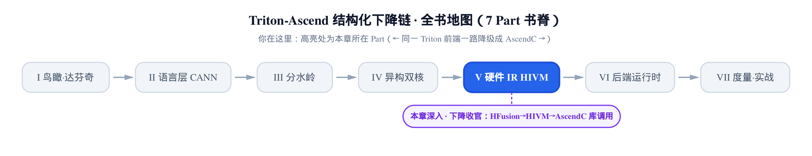
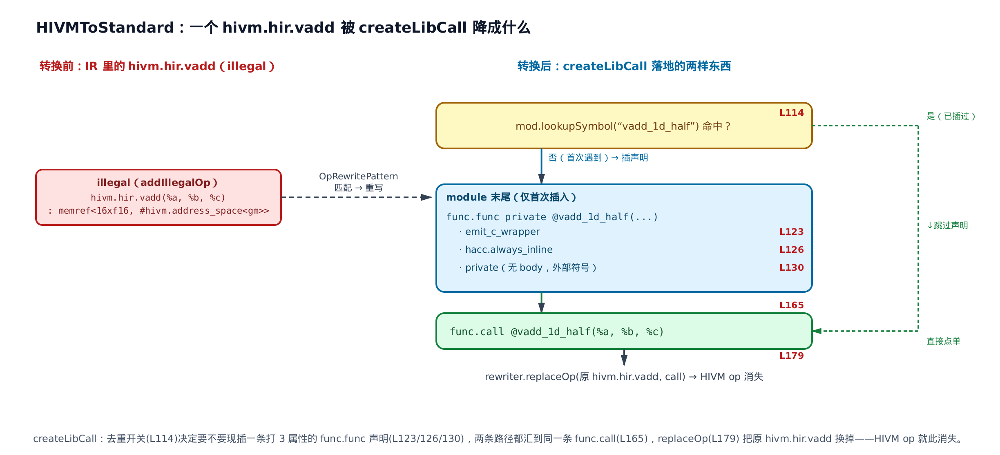
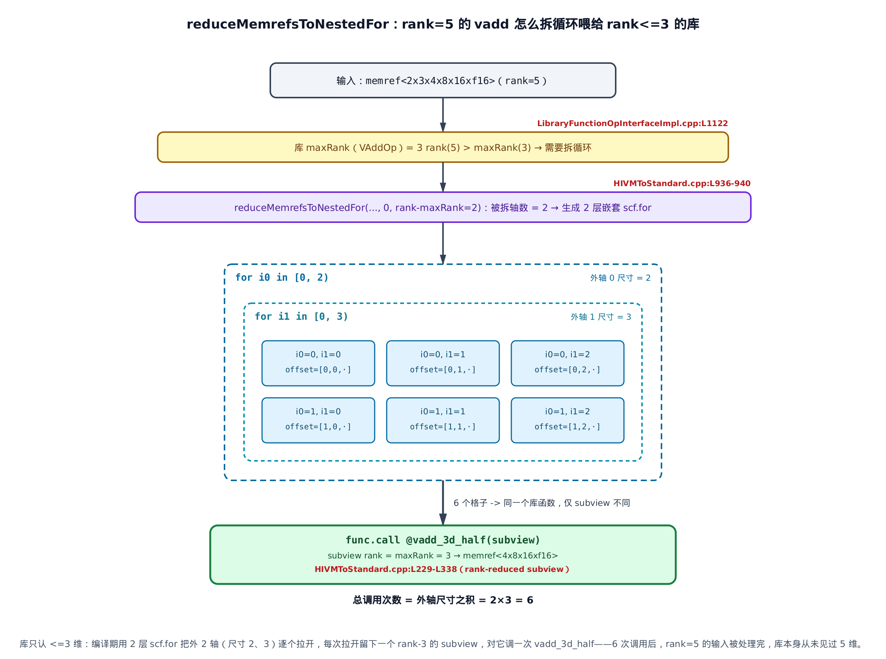
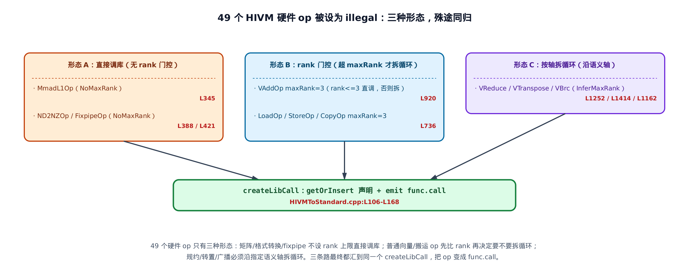

# 第 25 章　下降链收官——把带同步的 HIVM IR 一路降成 AscendC 库调用



> 上一站：编译器已经把「谁等谁」的同步指令显式写进了 HIVM IR。
> 这一站：走出 HIVM——每个硬件 op 变成一条对 AscendC 运行库的 `func.call`。
> 下一站：只剩标准方言的 IR 继续降到 LLVM／AscendC C。

上一章 [第 24 章](../../ch24-hivm-explicit-sync/narrative/chapter.md) 讲的是**同步**：达芬奇的搬运引擎、Cube 核（AIC，矩阵计算核）与 Vector 核（AIV，向量计算核）各跑各的、硬件不做依赖检测，于是编译器用 `set_flag`／`wait_flag` 把「等 MTE2 搬完，V 再算」显式插进了 IR。到本章开头，手里的 IR 已经是一堆**带同步标记的 HIVM 硬件 op**——它们还都说着 HIVM 这门方言（dialect，MLIR 里一组自定义 op／类型／属性的集合）。

本章讲**最后一跳**：让 HIVM 方言彻底消失。核心 pass 叫 `ConvertHIVMToStandardPass`（`HIVMToStandard.cpp`，一个 MLIR conversion pass——把一门方言的 op 系统性改写成另一门方言的处理单元），它把每个 HIVM 硬件 op 重写成一条 `func.call @<外部库函数>`。张量级的 `hivm.hir.vadd`、`hivm.hir.mmadL1` 不再被展开成一堆标量循环，而是变成对 **AscendC**（昇腾 C++ 算子编程库，里面是手工优化好的 kernel）里一个预编译函数的调用。降完之后，IR 里只剩 `func`／`scf`／`memref`／`arith` 这些标准方言，外加对 AscendC 运行库的一串 `call`——这就是 HFusion→HIVM→Standard 这条结构化下降链的终点。

> **写给读过第一本 Triton 书的你**：把硬件算子降成「对预编译库函数的调用」是昇腾这条链**独有**的收尾方式。上游 Triton 的 NVIDIA 路径最终降到 PTX／LLVM 指令，靠 `libdevice` 补少量数学函数；昇腾则把整片张量运算都交给 AscendC 运行库的 kernel，编译器只负责**生成正确的调用点**，把微架构优化（用满 Cube／Vector 单元、流水、对齐）全部留给库。这是两条链在收尾哲学上的分岔。

> **取证边界（一次性交代）**：host 上没有昇腾 NPU，也没有构建出 `bishengir-opt` 可执行文件，本章所有「降之前 / 降之后」的 IR **不是真机 dump**。降之前的 IR 取自仓库已提交的 lit 夹具（LLVM 回归测试文件，`.mlir` 里写着真实输入 IR）`test/Dialect/HIVM/hivm-pipeline.mlir`；降之后的库函数名与拆循环结构，是**把源码里的 mangle 规则与 rank 门控逐字段套算**得出的（各字段规则标 `file:Lxxx`，可回溯到 `.cpp`／`.td` 定义），不是 FileCheck 断言过的输出。凡推演结论都在正文就近标注来源。


> 只想知道「一个硬件 op 到底变成什么」，直接看 §25.3；想搞懂 49 个 op 怎么被归成三类一网打尽，跳 §25.6；想跟完整的 pass 主流程，从 §25.2 顺读。

---

## 25.1　最后一跳在哪里落下

先看这一跳在整条流水线的什么位置。HIVM 侧的优化流水线由 `buildOptimizeHIVMPipeline` 串起来，它的**最后一行**就是本章的主角：

```cpp
// third_party/ascend/AscendNPU-IR/bishengir/lib/Dialect/HIVM/Pipelines/HIVMPipelines.cpp:L365
void buildOptimizeHIVMPipeline(OpPassManager &pm,
                               const HIVMPipelineOptions &options) {
  pm.nest<func::FuncOp>().addPass(createInitEntryKernelPass());
  if (!options.disableHIVMTensorCompile) {
    hivmPreBufferizationOptimizationPipeline(pm, options);
    bufferizationPipeline(pm, options);
  }
  hivmPostBufferizationOptimizationPipeline(pm, options);
  # … 省略：中间的 bufferization / 内存规划 / 显式同步注入（上一章的活），
  #        以及收尾前的几个辅助 pass（C 兼容打印 / 注解下降 / 调试 init-finish / DisableLoad 标记，均与本章无关）…
  pm.addPass(createConvertHIVMToStandardPass());   // ← 收官这一跳
}
```

前面所有站——bufferization（把 tensor 语义换成 memref 内存语义，`memref` 即带类型和内存布局的多维内存块）、内存层级规划、上一章的显式同步注入——跑完之后，IR 是一堆**带 `set_flag`／`wait_flag` 的 HIVM 硬件 op、且已经是 memref 语义**。`createConvertHIVMToStandardPass` 接手这份 IR，把 HIVM op 全换成库调用。

它的上游喂料是另一条流水线 `convert-to-hivm-pipeline`：把 HFusion／Linalg／tensor 一路降成 HIVM op。所以本章的位置很清楚——**HIVM 方言的生命在这里终结**：上游把张量运算抬进 HIVM，同步注入给它插好同步，本章把它降出去。

拿一个真实夹具当全章的贯穿例子。`test/Dialect/HIVM/hivm-pipeline.mlir` 里有一个最小的设备侧函数，做的事就是「两个数组逐元素相加」：

```mlir
// third_party/ascend/AscendNPU-IR/bishengir/test/Dialect/HIVM/hivm-pipeline.mlir:L9
func.func @test(%arg0: memref<16xf16, #hivm.address_space<gm>>,
                %arg1: memref<16xf16, #hivm.address_space<gm>>,
                %arg2: memref<16xf16, #hivm.address_space<gm>>)
    attributes {hacc.entry, hacc.function_kind = #hacc.function_kind<DEVICE>} {
  %alloc   = memref.alloc() : memref<16xf16, #hivm.address_space<ub>>
  hivm.hir.load  ins(%arg0 …) outs(%alloc …)      // gm → UB
  %alloc_0 = memref.alloc() : memref<16xf16, #hivm.address_space<ub>>
  hivm.hir.load  ins(%arg1 …) outs(%alloc_0 …)    // gm → UB
  %alloc_1 = memref.alloc() : memref<16xf16, #hivm.address_space<ub>>
  hivm.hir.vadd  ins(%alloc, %alloc_0 …) outs(%alloc_1 …)   // UB 上逐元素加
  hivm.hir.store ins(%alloc_1 …) outs(%arg2 …)    // UB → gm
  return
}
```

这里 `gm`（片外显存，global memory）、`ub`（片上统一缓冲，unified buffer）是 [第 23 章](../../ch23-hivm-dialect/narrative/chapter.md) 讲的六级内存里的两级，写在 memref 的 `#hivm.address_space<…>` 属性里；`hacc.function_kind<DEVICE>` 把这个函数标成设备侧（跑在 NPU 上的）代码，`hacc` 是昇腾的编译支持层命名空间。三个 `hivm.hir.load`／`vadd`／`store` 就是三个 HIVM 硬件 op，正是本章要降掉的东西。

套上后面几节的规则，这个函数降完会变成（库函数名由 mangle 规则推演，见 §25.4）：

```mlir
func.func @test(%arg0…, %arg1…, %arg2…) attributes {…} {
  %alloc   = memref.alloc() : memref<16xf16, …ub…>
  func.call @load_gm_to_ubuf_1d_half(%arg0, %alloc)     // hivm.hir.load 没了
  %alloc_0 = memref.alloc() : memref<16xf16, …ub…>
  func.call @load_gm_to_ubuf_1d_half(%arg1, %alloc_0)
  %alloc_1 = memref.alloc() : memref<16xf16, …ub…>
  func.call @vadd_1d_half(%alloc, %alloc_0, %alloc_1)   // hivm.hir.vadd 没了
  func.call @store_ubuf_to_gm_1d_half(%alloc_1, %arg2)  // hivm.hir.store 没了
  return
}
// module 末尾还会多出三条外部声明：func.func private @load_gm_to_ubuf_1d_half(...) 等
```

`memref.alloc` 这些标准 op 原封不动，三个 HIVM op 各变成一条 `func.call`。（这里只画出 op→call 的**主体替换**：真实 IR 里每条 call 的参数还会更长——同步相关参数会追加到参数尾、每个 memref 实参外面还套一层 `memref.cast`，这两笔透传与类型规范化留到 §25.7 才补全。）整章要回答三个问题：**这一步替换是怎么落地的（§25.3）、那些库函数名是怎么拼出来的（§25.4）、张量太大装不进库怎么办（§25.5）**。先从驱动这一切的 pass 主流程说起。

---

## 25.2　主 pass：把每个硬件 op 判成「非法」

**直觉。** 把这个 pass 想成一道海关。它先立一张**白名单**：`func`／`memref`／`arith`／`scf` 这些标准方言的 op，一律放行（合法）。再立一张**黑名单**：每一个 HIVM 硬件 op，一律扣下（非法），不许留在最终 IR 里。然后开闸——MLIR 的转换引擎会反复应用改写规则，直到海关里再没有一个被扣的 op。因为每个 HIVM op 都在黑名单上，引擎被逼着必须把它们**全部**改写成白名单里的东西，一个都不能剩。这就是「HIVM 方言消失」的机制根据：不是碰巧降干净了，是**规则强制**降干净。

**机制。** MLIR 管这套叫 partial conversion（部分转换）：给定一个 `ConversionTarget`（转换目标——哪些 op 合法、哪些非法），引擎贪心地对每个非法 op 找一条能把它改写成合法 op 的规则（`OpRewritePattern`，匹配一个 op、把它重写掉的规则对象），反复应用直到无非法 op 残留。它保证收敛：每条规则都把一个非法 op 换成一堆合法 op（一条 `func.call` 加可选的 `scf.for`／`memref.subview`），非法 op 只减不增，故必然终止且终态无 HIVM 方言。

来看主流程：

```cpp
// third_party/ascend/AscendNPU-IR/bishengir/lib/Conversion/HIVMToStandard/HIVMToStandard.cpp:L1823
void ConvertHIVMToStandardPass::runOnOperation() {
  auto module = getOperation();
  ConversionTarget target(getContext());
  target.addLegalDialect<func::FuncDialect, memref::MemRefDialect,
                         arith::ArithDialect, scf::SCFDialect,
                         LLVM::LLVMDialect>();
  target.addLegalOp<hivm::PointerCastOp>();
  // Abstract Intrinsic Ops must be converted.
  target.addIllegalOp<hivm::MmadL1Op,
                      hivm::ND2NZOp,
                      hivm::NZ2NDOp,
                      hivm::FixpipeOp,
                      hivm::MatmulOp,
                      hivm::CopyOp,
                      hivm::CustomOp,
                      hivm::LoadOp,
                      hivm::StoreOp,
                      hivm::VAddOp,
                      hivm::VMulOp,
                      # … 省略：约 40 个向量 / 规约 / 转置 / 同步 op 同样列为 illegal …
                      hivm::VSortOp
                      >();

  RewritePatternSet patterns(&getContext());
  SmallVector<func::FuncOp> deviceFuncs;
  module->walk([&](func::FuncOp func) {
    if (hacc::utils::isDevice(func)) {
      deviceFuncs.push_back(func);
    }
  });

  for (auto deviceFunc : deviceFuncs) {
    patterns.clear();
    populateHIVMToStandardConversionPatterns(
        patterns,
        /*isOpsAligned=*/deviceFunc->hasAttr(hivm::StrideAlignDimsAttr::name) ||
            this->isOpsAligned);
    if (failed(
            applyPartialConversion(deviceFunc, target, std::move(patterns)))) {
      signalPassFailure();
    }
  }
```

逐段读设计。`addLegalDialect<func, memref, arith, scf, LLVM>` 就是那张白名单——降到这几门方言就算到位。`addLegalOp<hivm::PointerCastOp>` 是唯一的例外：HIVM 里的指针转换 op 保留不降。接着 `addIllegalOp<…>` 把每个硬件 op 显式列进黑名单——真实源码里这里排了 **49** 个 op（`MmadL1`／`ND2NZ`／`Copy`／`Load`／`Store`／`VAdd` … 一直到 `SyncBlockLock`／`VSort`），正文只留头尾。「每个硬件 op 都被显式设为 illegal」正是**逼着** partial conversion 把它们全降掉的那把锁。

下半段是驱动。`module->walk` 收集所有设备侧函数（`hacc::utils::isDevice` 判定），然后**逐个函数**跑转换。注意每次循环先 `patterns.clear()` 再 `populateHIVMToStandardConversionPatterns` 重建规则集——因为传进去的 `isOpsAligned` 是那行 `||` **或**出来的两部分：该函数自己是否带 `StrideAlignDims` 对齐属性，**或**整条 pass 是否被全局开关 `-is-ops-aligned`（pass 的 Option 字段，默认 `false`，调用时可整体置 `true`）强制打开。它会影响后面某些库函数名的拼法（对齐变体的具体后缀本章不展开）。这个布尔值被存进 pattern 对象随构造带走，但真正把它喂进拼名的**只有广播类 op（`VBrc`）的 pattern**——本章 §25.5／§25.6 展示的 `vadd`／`mmadL1`／`nd2nz` 这几类 pattern 调 `getOpLibraryCallName` 时一律传 `std::nullopt`（意为「不指定对齐、由接口按默认拼名」），根本不消费这个每函数布尔值。所以下文那几处调用点你会看到清一色的 `nullopt`，别以为和这里矛盾：`isOpsAligned` 只在广播这类对齐敏感的 op 上才落到名字里。逐函数重建规则集，是为了让每个 kernel 各自拿到正确的这个布尔值——哪怕全局开关没开，某个函数自带属性也得生效。最后 `applyPartialConversion(deviceFunc, target, patterns)` 真正驱动转换；失败就 `signalPassFailure`。

一个自然的问题：`populateHIVMToStandardConversionPatterns` 里塞的那些规则，到底把一个 op 改写成了什么？这是下一节的核心。

---

## 25.3　一个 op 落地成一条 call：createLibCall

这是全章的核心机制，也是全书**唯一**真正把「张量级硬件 op」变成「C 库调用」的地方。

**直觉。** 想象餐厅前台不自己下厨。`hivm.hir.vadd` 这道「菜」不再被展开成一堆标量循环，而是前台做两件事：先在**菜单末尾登记一次**这道菜的名字（往 module 里插一条外部函数声明），再在座位上写一张**点单**（一条 `func.call`）。同名的菜只登记一次，后面再点直接复用同一行菜单。真正的烹饪——用满 Cube／Vector 单元的手工优化 kernel——留给后厨（AscendC 运行库）。前台的活只有两样：登记声明、写点单。

**机制。** 拿 §25.1 那个 1 维 f16 的 `hivm.hir.vadd` 走一遍。它的库函数名（下一节讲怎么拼）是 `vadd_1d_half`。改写分两条路：

| 步骤 | 做什么 | 触发条件 |
|---|---|---|
| ① 查重 | `mod.lookupSymbol("vadd_1d_half")` 是否命中 | 每次都查 |
| ② 插声明 | 只有**首次**遇到才在 module 末尾插一条 `func.func private @vadd_1d_half(...)`，打三个属性 | 查重未命中 |
| ③ 写点单 | emit 一条 `func.call @vadd_1d_half(操作数)` | 每次都做 |
| ④ 替换 | `replaceOp` 把原 `hivm.hir.vadd` 换成这条 call | 每次都做 |

第一次遇到 `vadd_1d_half` 时四步全走，module 里多一条声明、原地多一条 call；第二次再遇到同规格的 vadd，第 ① 步查重命中，跳过 ② 直接 ③④——所以**同名库函数全局只声明一条**，call 却可以有很多条。下面这张图把这两条路径画在一起：



**源码。** 这套逻辑全在 `createLibCall` 里：

```cpp
// third_party/ascend/AscendNPU-IR/bishengir/lib/Conversion/HIVMToStandard/HIVMToStandard.cpp:L106
static func::CallOp createLibCall(PatternRewriter &rewriter, Operation *op,
                                  ModuleOp mod, const std::string &libCallName,
                                  const SmallVector<Value> &inputOperands,
                                  TypeRange resultTypes) {
  Location loc = op->getLoc();
  MLIRContext *ctx = rewriter.getContext();

  FlatSymbolRefAttr fnNameAttr = SymbolRefAttr::get(ctx, libCallName);
  if (!mod.lookupSymbol(fnNameAttr.getAttr())) {          // ① 查重
    auto libFnType = rewriter.getFunctionType(
        extractOperandTypes(inputOperands), resultTypes);
    OpBuilder::InsertionGuard guard(rewriter);
    rewriter.setInsertionPoint(mod.getBody(), std::prev(mod.getBody()->end()));

    func::FuncOp funcOp = rewriter.create<func::FuncOp>(   // ② 插声明
        mlir::FileLineColLoc::get(ctx, "internal", 0, 0), fnNameAttr.getValue(),
        libFnType);
    funcOp->setAttr(LLVM::LLVMDialect::getEmitCWrapperAttrName(),
                    UnitAttr::get(ctx));                    // 属性1：emit_c_wrapper
    auto haccAlwaysInlineAttr = hacc::stringifyHACCToLLVMIRTranslateAttr(
        hacc::HACCToLLVMIRTranslateAttr::ALWAYS_INLINE);
    funcOp->setAttr(haccAlwaysInlineAttr, rewriter.getUnitAttr());  // 属性2：always_inline
    funcOp.setPrivate();                                    // 属性3：private（外部符号）
    # … 省略：根据原 op 的核类型（CUBE→AIC / VECTOR→AIV）给这条声明再打一个核类型标签 …
  }

  return rewriter.create<func::CallOp>(                     // ③ emit call
      loc, fnNameAttr.getValue(), resultTypes,
      createTypeCanonicalizedMemRefOperands(rewriter, loc, inputOperands));
}
```

三个属性各有分工，正是「为什么这是一次 **C** 库调用」的答案：

- **`emit_c_wrapper`**（`getEmitCWrapperAttrName`）：告诉后端按 C ABI（应用二进制接口——函数参数怎么排布、怎么传）给这个符号生成一层 wrapper，让 AscendC 那侧的 C++ 实现能被这条 call 按 C 约定接上。
- **`always_inline`**（hacc 侧）：库实现最终会被后端**内联回来**，所以「一条 call」不是运行期真的跳一次函数——是编译期的一个占位，让手工 kernel 在最后阶段就地展开。
- **`private`**：这是个只有声明、没有函数体的外部符号，body 在预编译的 AscendC 库里。

`replaceOp` 那一步封在 `replaceWithLibCall` 里，所有「直接调库」的规则都经它落地：

```cpp
// third_party/ascend/AscendNPU-IR/bishengir/lib/Conversion/HIVMToStandard/HIVMToStandard.cpp:L170
template <typename OpType>
static void replaceWithLibCall(PatternRewriter &rewriter, OpType op,
                               const std::string &libCallName,
                               const SmallVector<Value> &inputOperands,
                               TypeRange resultTypes) {
  ModuleOp mod = op->template getParentOfType<ModuleOp>();
  func::CallOp call =
      createLibCall(rewriter, op, mod, libCallName, inputOperands, resultTypes);
  rewriter.replaceOp(op, call);
}
```

先 `createLibCall`（拿到那条 call），再 `rewriter.replaceOp(op, call)` 把原 HIVM op 抹掉、用 call 顶替。到这一步，`hivm.hir.vadd` 就从 IR 里彻底消失了。

这里还藏着一个类型上的讲究：emit call 传的不是原始操作数，而是 `createTypeCanonicalizedMemRefOperands` 处理过的。库函数是按 C ABI 声明的、**不带静态 shape 信息**，所以调库前要把每个 memref 操作数的类型统一成「全动态 strided layout」（形状与步长都不写死的内存布局），再插一条 `memref.cast`。这样同一条库声明能吃不同静态 shape 的实参，不必为每种 shape 各声明一个。这段类型规范化是配角，§25.7 再收。

眼下最紧的悬念是：`vadd_1d_half`、`load_gm_to_ubuf_1d_half` 这些名字到底是**怎么拼出来**的？

---

## 25.4　库函数名怎么拼：mangle 规则

**直觉。** 库函数名就像螺丝的规格标签。同一种「加法」螺丝，1 毫米和 3 毫米、不锈钢和铜、装这个孔还是那个孔，都是不同型号，必须把规格写全才能领对货。名字生成器就是那台打标机——把 op 名、维度、数据类型（搬运还要加源／目的内存域）逐字段拼成一个确定的字符串。规则里 pattern 只管拿这个名字去点货，**不自己拼名**。

**机制。** 拼名的入口是一个 op 接口 `OpWithLibraryFunction`——让每个硬件 op 自报「我对应哪个库函数名」和「库支持的最大维度」：

```cpp
// third_party/ascend/AscendNPU-IR/bishengir/include/bishengir/Dialect/HIVM/Interfaces/LibraryFunctionOpInterface.td:L27
def LibraryFunctionOpInterface : OpInterface<"OpWithLibraryFunction"> {
  let cppNamespace = "::mlir::hivm";
  let methods = [
    InterfaceMethod<
      /*desc=*/[{ Get the name registered for this op when lowering to an
                  external library call. }],
      /*retTy=*/"std::string",
      /*methodName=*/"getOpLibraryCallName",          // ← 拼名入口
      /*args=*/(ins "std::optional<bool>":$isOpsAligned)>,
    InterfaceMethod<
      /*retTy=*/"std::optional<int>",
      /*methodName=*/"getOpLibraryMaxRank",            // ← 库支持的最大维度
      /*args=*/(ins), /*methodBody=*/"",
      /*defaultImplementation=*/[{
        llvm_unreachable("getOpLibraryMaxRank not implemented"); }]>,
    # … 省略：rank clamp 的两个辅助方法 …
  ];
}
```

把拼名逻辑收进 op 自己的实现（而不是硬编码在每个 pattern 里），是因为同一个 op 的库名依赖一堆**运行期属性**：维度、元素类型、内存域、对齐、变体。规则只负责「收操作数 → 调 `getOpLibraryCallName` → emit call」这套通用骨架，谁都不用重复拼名。

`getOpLibraryCallName` 内部按 op 种类分派——搬运类走一条规则、比较类走另一条，普通向量 op 落到默认分支：

```cpp
// third_party/ascend/AscendNPU-IR/bishengir/lib/Dialect/HIVM/IR/LibraryFunctionOpInterface/LibraryFunctionOpInterfaceImpl.cpp:L511
std::string getOpLibraryCallName(Operation *op, std::optional<bool> isOpsAligned) const {
  ConcreteOp concreteOp = cast<ConcreteOp>(op);
  # … 省略：VCumsum/VSort/VCmp/VCast/VSel/NZ2ND/VGather/Debug 等 op 各有专门分支 …
  if constexpr (std::is_same_v<ConcreteOp, LoadOp> ||
                std::is_same_v<ConcreteOp, StoreOp> ||
                std::is_same_v<ConcreteOp, CopyOp>) {
    return getCopyLikeOpLibraryCallName(concreteOp, isOpsAligned);   // 搬运类
  } else {
    // 默认分支：普通向量 op（vadd/vmul/…）
    std::string baseCallName = concreteOp.getOpName().str();         // op 助记符，如 "vadd"
    # … 省略：VDiv/VSub 的 _vs/_sv 标量变体后缀处理 …
    Type elemType = getElementTypeOrSelf(concreteOp.getDpsInits().front().getType());
    std::string elemTypeName = getTypeName(concreteOp.getLoc(), elemType);   // f16 → "half"
    int rank = static_cast<int>(concreteOp.getNumLoops());
    return concatVectorOpLibraryCallName(
        baseCallName + suffix, getOpLibraryCallRank(op, rank), elemTypeName);
  }
}
```

拼名规则本身很朴素，就是把字段用下划线串起来。向量 op 用 `concatVectorOpLibraryCallName`：

```cpp
// third_party/ascend/AscendNPU-IR/bishengir/lib/Dialect/HIVM/IR/LibraryFunctionOpInterface/LibraryFunctionOpInterfaceImpl.cpp:L30
std::string concatVectorOpLibraryCallName(const std::string &baseCallName,
                                          int rank, const std::string &elemTypeName) {
  std::stringstream ss;
  ss << baseCallName << "_" << rank << "d" << "_" << elemTypeName;   // <op>_<rank>d_<type>
  return ss.str();
}
```

即 `<op名>_<rank>d_<元素类型>`。搬运类多带源／目的内存域：

```cpp
// third_party/ascend/AscendNPU-IR/bishengir/lib/Dialect/HIVM/IR/LibraryFunctionOpInterface/LibraryFunctionOpInterfaceImpl.cpp:L91
std::string getLibraryCallNameForCopyLikeOp(std::string baseCallName,
                                            Type srcType, Type dstType,
                                            Location loc, int rank) {
  auto srcScope = getHIVMAddressSpace(srcType);
  auto dstScope = getHIVMAddressSpace(dstType);
  std::string srcScopeName = kAddressSpace2LibraryName.at(srcScope);   // UB→ubuf / GM→gm / L1→cbuf
  std::string dstScopeName = kAddressSpace2LibraryName.at(dstScope);
  std::string src2DstName = llvm::formatv("{0}_to_{1}", srcScopeName, dstScopeName);
  std::string dataTypeStr = getTypeName(loc, getElementTypeOrSelf(srcType));
  std::string libCallDim = std::to_string(rank) + "d";
  return llvm::formatv("{0}_{1}_{2}_{3}",                              // <op>_<src>_to_<dst>_<rank>d_<type>
                       baseCallName, src2DstName, libCallDim, dataTypeStr);
}
```

三张查表把符号翻成库名里的串：元素类型 `f16→half`、`f32→float`、`bf16→bfloat16_t`；内存域 `UB→ubuf`、`GM→gm`、`L1→cbuf`（`L1` 也是 [第 23 章](../../ch23-hivm-dialect/narrative/chapter.md) 六级内存里的一级，本章贯穿例子用不到，列出仅为补全这张映射）。维度那位不是原始 rank，而是**钳过**的 `rank' = min(rank, maxRank)`——库只实现到某个最大维度，超出的那部分靠下一节拆循环补，这里先把名字里的维度后缀压到库能认的范围。

把七个代表性 op 逐字段套一遍，就得到下面这张对照表。每一列都是上面某条规则的输出：

<!-- trace: m2 -->

| op | 原始 rank | 库 maxRank | rank′=min | 元素类型→库名 | 内存域 | 拼出的库函数名 |
|---|---|---|---|---|---|---|
| `hivm.hir.vadd` | 1 | 3 | 1 | f16→half | UB | `vadd_1d_half` |
| `hivm.hir.vadd` | 5 | 3 | 3 | f16→half | UB | `vadd_3d_half` |
| `hivm.hir.vmul` | 2 | 3 | 2 | f32→float | UB | `vmul_2d_float` |
| `hivm.hir.load` | 1 | 3 | 1 | f16→half | gm→ubuf | `load_gm_to_ubuf_1d_half` |
| `hivm.hir.store` | 1 | 3 | 1 | f16→half | ubuf→gm | `store_ubuf_to_gm_1d_half` |
| `hivm.hir.mmadL1` | — | NoMaxRank | — | f16→float | — | `mmadL1_half_to_float` |
| `hivm.hir.nd2nz` | — | NoMaxRank | — | f16→half | — | `nd2nz_half` |

> 这张表的名字是**套算**结果，不是真机 dump：把源码里的字段规则（`getTypeName`、`kAddressSpace2LibraryName`、`min(rank, maxRank)`）逐项代入常量得出，各字段行号见正文。矩阵 op `mmadL1` 与格式转换 op `nd2nz` 标 `NoMaxRank`——它们不设维度上限、名字里也不带 `rank`d 后缀（`mmadL1` 走「源类型_to_目的类型」、`nd2nz` 走「op_元素类型」的专门分支）。另注意「元素类型→库名」这一列在 `mmadL1` 行的读法与别行不同：其余行是「单个类型翻译成一个库名串」（f16→half），而 `mmadL1` 行的 `f16→float` **不是**「f16 被翻成 float」，是它名字里 `_to_` 两侧的**源类型／目的类型**（输入 f16、累加输出 float）——同一个箭头在这行承载的是 mangle 名的源→目的字段，不是类型到库名的翻译。

看第 1 行和 §25.1 的贯穿例子对上了：夹具里那个 1 维 f16 的 vadd，拼出来正是 `vadd_1d_half`；两个 load 都是 gm→UB 的 1 维 f16，拼出同一个 `load_gm_to_ubuf_1d_half`——同名，所以 module 里只声明一条、点两次 call（§25.3 的查重去重在这里兑现）。

这个拼名过程是个**确定性函数**：字段有限、顺序固定、无循环无递归，同输入必同输出。配合 `createLibCall` 的 `lookupSymbol` 查重——字符串相等就是符号命中、就不重复插声明——于是「名字确定」直接推出「同规格 op 全局只插一条声明」。拼名本身对每个 op 是 `` $`O(1)`$ `` 的字符串拼接，与张量多大无关。

表里第 2 行留了个尾巴：5 维的 vadd，rank′ 被钳成 3、名字变成 `vadd_3d_half`——可张量明明是 5 维的，那多出来的两维去哪了？

---

## 25.5　库只认低维：拆循环喂库

**直觉。** 库函数只会处理最多 3 维的小盒子，可你手里是个 5 维的大柜子。办法不是重造库，而是把最外两层抽屉一层层拉开：外层每拉开一格（一层 `scf.for` 循环），就露出里面一个 3 维小盒子（一个降到 rank-3 的 `subview`，即原 memref 的一块切片视图），对这个小盒子调一次库。拉完所有外层组合，整柜就处理完了——库只需懂小盒子，编译器负责一格格喂。

**机制。** 门控在向量类规则的 `matchAndRewrite` 里（模板形参 `HIVMVectorOp` 泛指 `VAdd`／`VMul` 这类普通向量 op，§25.6 会讲它们共用同一个 pattern 模板），就一个 `if`：够矮直接调、太高先拆循环。

```cpp
// third_party/ascend/AscendNPU-IR/bishengir/lib/Conversion/HIVMToStandard/HIVMToStandard.cpp:L920
LogicalResult matchAndRewrite(HIVMVectorOp op, PatternRewriter &rewriter) const final {
  auto opWithLibCall = cast<OpWithLibraryFunction>(op.getOperation());
  int64_t rank = op.getNumLoops();
  int maxOpRank = opWithLibCall.getOpLibraryMaxRank().value();
  std::string fnName = opWithLibCall.getOpLibraryCallName(/*isOpsAligned=*/std::nullopt);
  if (rank <= maxOpRank) {
    // 够矮：直接一条 call
    replaceWithLibCall(rewriter, op, fnName,
                       this->getLibraryCallOperands(rewriter, op), {});
    return success();
  }
  // 太高：先把超出的高维拆成嵌套 scf.for
  SmallVector<Value> reducedVals = reduceMemrefsToNestedFor(
      rewriter, op.getLoc(),
      this->getLibraryCallOperands(rewriter, op, /*includeExtraBuffer=*/false),
      0, rank - maxOpRank);
  # … 省略：给某些 elementwise 库函数补一块临时 buffer 的细节 …
  ModuleOp mod = op->template getParentOfType<ModuleOp>();
  createLibCall(rewriter, op, mod, fnName, reducedVals, {});
  rewriter.eraseOp(op);
  return success();
}
```

`rank <= maxOpRank` 时走上半段，就是 §25.3 讲过的一条 call。否则调 `reduceMemrefsToNestedFor(..., 0, rank - maxOpRank)`——参数 `rank - maxOpRank` 就是**要拆掉的轴数**，也就是要生成的循环层数。拆完拿到降 rank 的操作数 `reducedVals`，再 `createLibCall` 调库。

拆循环的活在 `reduceMemrefsToNestedFor` 里，它的源码自带一段最好的 worked example：

```cpp
// third_party/ascend/AscendNPU-IR/bishengir/lib/Conversion/HIVMToStandard/HIVMToStandard.cpp:L300
// reduce the rank of the values(with type MemRefType) inside memrefValsMaybe,
// by wrapping them inside nested for loops. ...
// Example:
//   memrefValsMaybe = {v1 : memref<1x8x16x32x64x128xi16>,
//                      v2 : memref<10x8x16x32x64x128xi16>, v3 : i16}
//   forRangeStart = 1, forRangeEnd = 4
//   will generate:
//     for i in [0, 8]
//       for j in [0, 16]
//         for k in [0, 32]
//           v1' = subview of v1 : memref<1x64x128xi16>
//           v2' = subview of v2 : memref<10x64x128xi16>
//     return {v1', v2', v3}
static SmallVector<Value> reduceMemrefsToNestedFor(PatternRewriter &rewriter,
    Location loc, ValueRange memrefValsMaybe, int forRangeStart, int forRangeEnd) {
  std::set<int> indices;
  for (int i = forRangeStart; i < forRangeEnd; ++i) indices.insert(i);
  return reduceMemrefsToNestedForUsingAxes(rewriter, loc, memrefValsMaybe, indices);
}
```

注释里 `[forRangeStart, forRangeEnd)` 就是**要拆哪几根轴**：例子里 `[1,4)` 表示拆第 1、2、3 轴，生成 3 层 `for`（上界 8、16、32），循环体里对每个 memref 切一个降到 rank-3 的 subview（`memref<1x64x128xi16>`）；标量 `v3` 原样透传。真正建 subview 的是 `reduceMemrefsToNestedForUsingAxes`：

```cpp
// third_party/ascend/AscendNPU-IR/bishengir/lib/Conversion/HIVMToStandard/HIVMToStandard.cpp:L229
static SmallVector<Value>
reduceMemrefsToNestedForUsingAxes(PatternRewriter &rewriter, Location loc,
                                  ValueRange memrefValsMaybe, std::set<int> reducedAxes) {
  # … 省略：找到第一个 memref 操作数、取它的 rank；各 memref rank 不一致则原样返回 …
  auto buildLoopBody = [&](llvm::SmallVector<Value> indexes) -> void {
    for (auto val : memrefValsMaybe) {
      MemRefType vecType = dyn_cast<MemRefType>(val.getType());
      if (!vecType) { reducedVals.push_back(val); continue; }   // 标量原样透传
      SmallVector<OpFoldResult> viewOffset, viewSize, viewStride(rank, rewriter.getIndexAttr(1));
      int nestedForIdx = 0;
      for (int dim = 0; dim < rank; dim++) {
        if (reducedAxes.count(dim)) {           // 被拆的轴：offset 取循环变量、size 取 1
          viewOffset.push_back(indexes[nestedForIdx++]);
          viewSize.push_back(rewriter.getIndexAttr(1));
        } else {                                // 保留的轴：整根切下
          viewOffset.push_back(rewriter.getIndexAttr(0));
          viewSize.push_back(memref::getMixedSize(rewriter, loc, val, dim));
        }
      }
      # … 省略：inferRankReducedResultType 算出降 rank 后的结果类型 …
      reducedVals.push_back(rewriter.create<memref::SubViewOp>(
          loc, reducedType, val, viewOffset, viewSize, viewStride));   // 建 subview
    }
  };
  createNestedLoops(rewriter, loc, memrefVal, reducedAxes, buildLoopBody);
  return reducedVals;
}
```

一句话读懂那个双分支：**被拆的轴** offset 取当前循环变量、size 取 1（切出单片再丢维）；**保留的轴** offset 取 0、size 取整根（原样切下）。于是每个 subview 的 rank 恰好等于 maxRank。

拿一个具体张量走完整轮次：`hivm.hir.vadd` 作用于 `memref<2x3x4x8x16xf16>`（rank=5），VAddOp 的库 maxRank=3。`rank - maxOpRank = 2`，拆外两轴（尺寸 2 与 3），保留内三轴（`4x8x16`）。逐轮如下：

<!-- trace: m3 -->

| 轮次 | i0∈[0,2) | i1∈[0,3) | subview offset | subview 类型 | 生成的调用 |
|---|---|---|---|---|---|
| 1 | 0 | 0 | [0,0,·] | `memref<4x8x16xf16>` | `func.call @vadd_3d_half` |
| 2 | 0 | 1 | [0,1,·] | `memref<4x8x16xf16>` | `func.call @vadd_3d_half` |
| 3 | 0 | 2 | [0,2,·] | `memref<4x8x16xf16>` | `func.call @vadd_3d_half` |
| 4 | 1 | 0 | [1,0,·] | `memref<4x8x16xf16>` | `func.call @vadd_3d_half` |
| 5 | 1 | 1 | [1,1,·] | `memref<4x8x16xf16>` | `func.call @vadd_3d_half` |
| 6 | 1 | 2 | [1,2,·] | `memref<4x8x16xf16>` | `func.call @vadd_3d_half` |

外两轴组合 `` $`2\times3=6`$ `` 格，每格一条 `func.call @vadd_3d_half`，每条 call 的操作数都是 rank-3 的 `memref<4x8x16xf16>`——正好卡在库能认的维度上。这也解释了 §25.4 表里那个悬念：5 维 vadd 的名字是 `vadd_3d_half`，因为**每次实际调库的都是 rank-3 的切片**，5 维只活在外层循环里，库自始至终没见过 5 维。下图把这条拆循环链画全：



这个过程必然停机、且终态没有超库调用。给定 op 的 rank 记 `` $`R`$ ``、库支持的 maxRank 记 `` $`M`$ ``：rank 不超过 maxRank 时不进拆循环分支，直接一条 call（本就合法）；超过时拆掉多出的 `` $`R-M`$ `` 层循环，每层 for 的上界是该轴的静态尺寸（有限），循环体内 subview 把这些轴 rank-reduce 掉，结果 rank 严格降到 maxRank。库调用次数就是外层各被拆轴尺寸之积：

```math
\mathrm{calls} = \prod_{i \in [0,\, R-M)} \dim_i, \qquad \mathrm{depth} = R - M
```

代入本例（`` $`R=5,\, M=3`$ ``）：depth=2、calls=`` $`2\times3=6`$ ``，与上表逐轮对得上——等价于把张量沿高维**串行化**、内层交给库**并行**。若 rank 本就不超过 maxRank（如 3 维 vadd），calls=1、depth=0，退化成直接一条 call。

至此三个核心动作齐了：一条 call 落地（§25.3）、名字怎么拼（§25.4）、装不下怎么拆（§25.5）。可黑名单上有 49 个 op，难道每个都要单独读一遍规则？

---

## 25.6　三张脸：49 个 op 归三形态

**直觉。** 49 个硬件 op 看着吓人，其实只有三张脸。认得这三张脸，整章的 pattern 就都对上号了：

- **形态 A — 直接调库**：操作数拿来就能点单，不设 rank 上限。矩阵 op（`MmadL1`）、格式转换 op（`ND2NZ`／`NZ2ND`）、`Fixpipe` 都是这张脸。
- **形态 B — rank 门控**：先量身高，够矮（rank≤maxRank）直接点、太高先拆几层循环再点。普通向量 op（`VAdd`／`VMul`…）、搬运 op（`Load`／`Store`／`Copy`）是这张脸，就是 §25.5 那个 `if`。
- **形态 C — 按轴拆循环**：这类 op 天生沿某条**语义轴**才有意义（规约沿被约减轴、转置沿被交换轴、广播沿被扩展轴），必须按指定轴拆循环再点。`VReduce`／`VTranspose`／`VBrc` 是这张脸——和形态 B 的区别只是「拆哪些轴」由语义定死，而非由 rank 高低决定。

三张脸殊途同归：不管哪一种，最后都汇到同一个 `createLibCall` 出口，把 op 变成 `func.call`。下图是这套分类的全景：



**源码。** 形态 A 最干净，看矩阵 op 的规则：

```cpp
// third_party/ascend/AscendNPU-IR/bishengir/lib/Conversion/HIVMToStandard/HIVMToStandard.cpp:L345
class MmadL1OpToLibraryCallPattern : public OpRewritePattern<hivm::MmadL1Op> {
  LogicalResult matchAndRewrite(MmadL1Op op, PatternRewriter &rewriter) const final {
    SmallVector<Value> libParams =
        op.getInputOperands(/*includeSyncRelatedArgs=*/false);   // 收输入
    libParams.push_back(op.getC());                              // 收输出
    SmallVector<Value> additionalArgs;
    genAdditionalFunctionArgs(op, additionalArgs, rewriter);     // 追加同步参数（§25.7）
    libParams.append(additionalArgs.begin(), additionalArgs.end());
    replaceWithLibCall(rewriter, op,
                       cast<OpWithLibraryFunction>(op.getOperation())
                           .getOpLibraryCallName(/*isOpsAligned=*/std::nullopt),
                       libParams, {});
    return success();
  }
```

收操作数、调 `getOpLibraryCallName` 拿名字、`replaceWithLibCall` 一步到位——没有 rank 判断，因为矩阵 op 是 `NoMaxRank`。格式转换 op 更短，几乎就是「一条 call」的裸模板：

```cpp
// third_party/ascend/AscendNPU-IR/bishengir/lib/Conversion/HIVMToStandard/HIVMToStandard.cpp:L388
class ND2NZOpToLibraryCallPattern : public OpRewritePattern<hivm::ND2NZOp> {
  LogicalResult matchAndRewrite(ND2NZOp op, PatternRewriter &rewriter) const final {
    if (!op.getDstContinuous()) {   // 前置约束：库实现要求连续 dst
      op->emitError("ND2NZOp's library function implementation requires continuous dst!");
      return failure();
    }
    replaceWithLibCall(rewriter, op,
                       cast<OpWithLibraryFunction>(op.getOperation())
                           .getOpLibraryCallName(/*isOpsAligned=*/std::nullopt),
                       op->getOperands(), {});
    return success();
  }
};
```

`ND2NZ`（把 ND 普通布局转成 NZ 分形布局的格式转换 op，Cube 输入要的排布）除了一个「dst 必须连续」的前置检查，主体就是一条 `replaceWithLibCall`。49 个 op 里，凡是形态 A 的，规则都长这样。

这些规则怎么进到转换引擎里？靠 `populateHIVMToStandardConversionPatterns` 把它们一次性塞进同一个规则集：

```cpp
// third_party/ascend/AscendNPU-IR/bishengir/lib/Conversion/HIVMToStandard/HIVMToStandard.cpp:L1751
void mlir::hivm::populateHIVMToStandardConversionPatterns(
    RewritePatternSet &patterns, bool isOpsAligned) {
  patterns.add<
               MmadL1OpToLibraryCallPattern,             // 形态 A
               ND2NZOpToLibraryCallPattern,              // 形态 A
               NZ2NDOpToLibraryCallPattern,              // 形态 A
               FixpipeOpToLibraryCallPattern,            // 形态 A
               # … 省略：Matmul／MixMatmul／MixGroupMatmul 等形态 A pattern 逐行 add …
               CopyOpToLibraryCallPattern<hivm::CopyOp>,     // 形态 B
               CopyOpToLibraryCallPattern<hivm::LoadOp>,     // 形态 B
               CopyOpToLibraryCallPattern<hivm::StoreOp>,    // 形态 B
               VectorOpToLibraryCallPattern<hivm::VAddOp>,   // 形态 B
               VectorOpToLibraryCallPattern<hivm::VMulOp>,   // 形态 B
               # … 省略：30+ 个 VectorOpToLibraryCallPattern<hivm::VXxxOp>
               #        以及 Reduce/Transpose/Cum/Brc（形态 C）逐行 add …
      >(patterns.getContext());
}
```

注意搬运 op（`Copy`／`Load`／`Store`）和普通向量 op 都用**同一个模板**的不同实例化——它们是同一张脸（形态 B），只是模板参数不同。整表 49 个 op 就这样各挂一个规则、全进同一个规则集，等 `applyPartialConversion` 逐个匹配。看懂这张三形态分类图，就不必逐个啃 49 段规则。

这也回答了「三形态会不会漏掉某个 op、会不会有第四种」这个疑问。`patterns.add<…>` 里能实例化的 pattern 只有**两支血统**：一支直接继承 `OpRewritePattern`（形态 A，如 `MmadL1OpToLibraryCallPattern`），操作数拿来就点单；另一支全部继承同一个 `MultiDimOpToLibraryCallPattern`——形态 B 的 rank 门控子类（如 `VectorOpToLibraryCallPattern`／`CopyOpToLibraryCallPattern`）与形态 C 的按语义轴拆循环子类（如 `ReduceOpToLibraryCallPattern`）都挂在这个父类之下，**并不是两个互不相干的基类**。它俩的差别不在继承谁，而在各自 `matchAndRewrite` 里怎么决定拆哪些轴——rank 门控看维度高矮，语义轴拆循环看被约减轴／转置轴／广播轴这类 op 自带的语义信息。换句话说，形态 B／C 是同一个多维 pattern 骨架下 `matchAndRewrite` 的两种写法，落到 C++ 类层级上只有「直接 pattern」和「多维 pattern」两支。一个 HIVM 硬件 op 想被降掉，就**必须**在 populate 里挂上这两支中的一个模板——挂上哪个、内部走哪条 `matchAndRewrite` 分支，就落进哪一形态，不存在三者都不占的「第四种」。所以三形态穷尽 49 个 op 是这张 populate 表结构上的必然，不是数出来的巧合。

还剩一个尾巴：这些是**带同步的** IR，`set_flag`／`wait_flag` 的信息去哪了？

---

## 25.7　带同步的 IR 怎么降：两个配角

本章降的不是干净 IR，是上一章插好同步的 IR。两个配角机制收尾。

**同步参数透传。** 回看 §25.6 那个矩阵 op 规则里的 `genAdditionalFunctionArgs`——它把上一章插进 op 的同步相关参数（`syncRelatedArgs`，`set_flag`／`wait_flag` 用的 event id 等）从 op 上拷出来，追加到库调用的参数尾：

```cpp
// third_party/ascend/AscendNPU-IR/bishengir/lib/Conversion/HIVMToStandard/HIVMToStandard.cpp:L370
// （MmadL1OpToLibraryCallPattern 的私有成员函数，只吃 MmadL1Op 这一个具体类型）
void genAdditionalFunctionArgs(MmadL1Op op, SmallVector<Value> &additionalArgs,
                               PatternRewriter &rewriter) const {
  # … 省略：若 op.getSyncRelatedArgs() 为空，先给它填一串 -1 默认值 …
  auto syncRelatedArgs = op.getSyncRelatedArgs();          // ch24 插好的同步参数
  std::copy(syncRelatedArgs.begin(), syncRelatedArgs.end(),
            std::back_inserter(additionalArgs));           // 拷进库调用参数尾
  additionalArgs.push_back(op.getUnitFlagModeLibValue(rewriter));  // 再追加 unit-flag 模式
}
```

这是矩阵 op 那个 pattern 的私有成员函数——只服务 `MmadL1Op`；`Fixpipe` 另有一份同名但结构不同的实现（处理 preQuant／preRelu／channelSplit），两者各自独立，不是共享模板。硬件同步在库函数内部按这些实参执行——event id 作为额外参数透传给 AscendC，库里的 kernel 拿它去 `set_flag`／`wait_flag`。若某个 op 没有同步参数就填 `-1` 默认值；末尾再追一个 unit-flag 模式（`unitFlagMode`，另一个同步配套标志位，本章不展开）。所以「降的是带同步的 IR」这句话，落到实处就是**同步信息随操作数一起被打包进 `func.call`**，而不是丢掉。

**类型规范化。** §25.3 提过的那半句在这里补齐。库声明按 C ABI 生成、不带静态 shape，所以 `createLibCall` 用 `extractOperandTypes` 把声明签名里的 memref 类型统一成全动态 strided layout，emit call 时又用 `createTypeCanonicalizedMemRefOperands` 给每个实参插一条 `memref.cast` 转到同一动态 layout。落到 §25.1 那个贯穿例子上：操作数原本是 `memref<16xf16, #hivm.address_space<ub>>`（静态尺寸 16、带地址空间属性），规范化后被 cast 成 `memref<?xf16, strided<[?], offset: ?>>`——尺寸、步长、偏移全变问号。两半合起来保证：同一条库声明能吃不同静态 shape 的实参，而且这步转换不引入方言外的 cast op，全在标准 memref 方言内闭合。配合 `emit_c_wrapper` 属性，后端就能按 C 约定把这条 call 接到 AscendC 的 C++ 实现上。

---

## 25.8　收官：HIVM 方言就此消失

把这一跳从头连起来。带同步的 HIVM 硬件 op（memref 语义）进来，`ConvertHIVMToStandardPass` 立一张白名单（`func`／`scf`／`memref`／`arith` 合法）、一张黑名单（49 个硬件 op 全非法），逐个设备函数跑 partial conversion。每个非法 op 被对应规则匹配：形态 A 直接调库、形态 B 按 rank 门控、形态 C 按语义轴拆循环，三条路都汇到 `createLibCall`——查重后 getOrInsert 一条外部声明、emit 一条 `func.call`、`replaceOp` 抹掉原 op。库函数名由 op 自己按「op 名＋维度＋类型（＋内存域）」mangle 出来；装不进库的高维靠嵌套 `scf.for` 一格格喂；同步参数随操作数打包进 call。

降完，`hivm.hir.*` 一个不剩，IR 里只有 `func`／`scf`／`memref`／`arith` 标准方言，外加一串对 AscendC 运行库的 `call` 和 module 末尾几条外部声明。这就是 HFusion→HIVM→Standard 结构化下降链的终点——张量级的硬件语义，被翻译成了「调哪个库、传什么参数、循环几次」这种后端能直接吃的形式。再往下，只是把这些标准方言的 op 继续降到 LLVM／AscendC C 的机械活了。

回望第 V 部分：[第 23 章](../../ch23-hivm-dialect/narrative/chapter.md) 把达芬奇的硬件事实写进 IR 类型，[第 24 章](../../ch24-hivm-explicit-sync/narrative/chapter.md) 让互不知情的引擎和双核之间不打架，本章把这套带着硬件语义和同步的 IR 交还给手工优化的运行库。编译器的职责到此很清楚——**不替库下厨，只把菜点对**。
