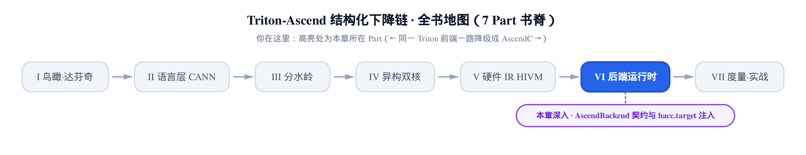
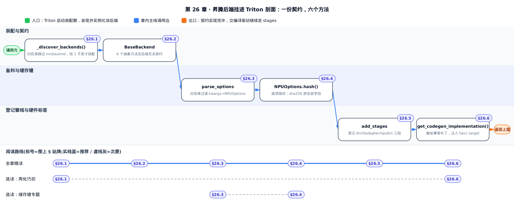
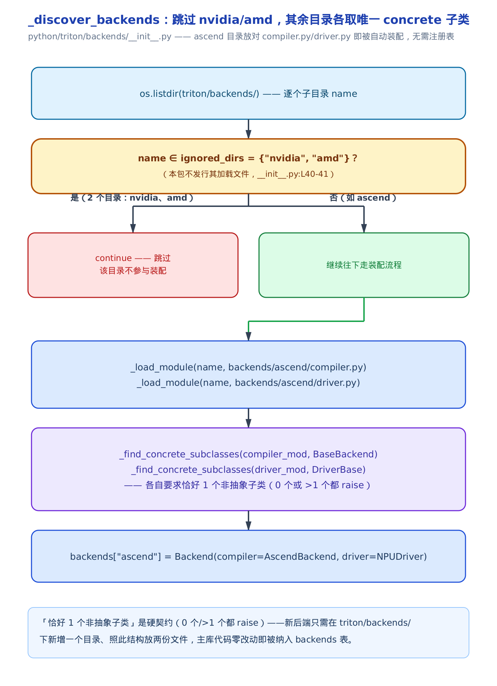
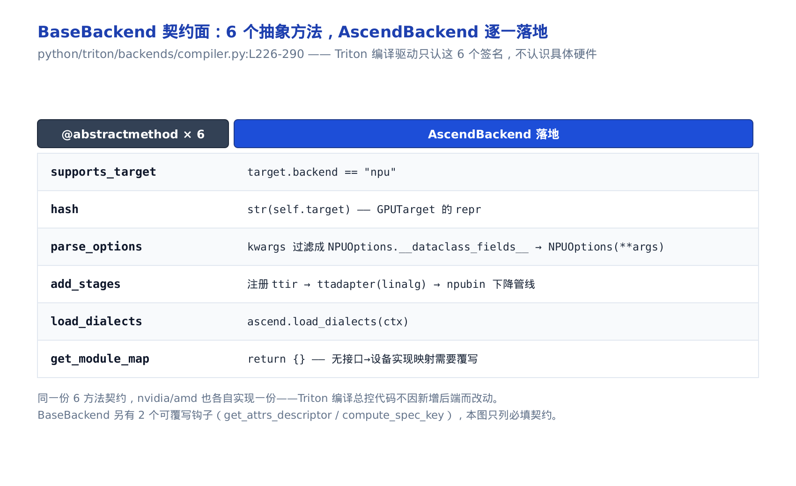
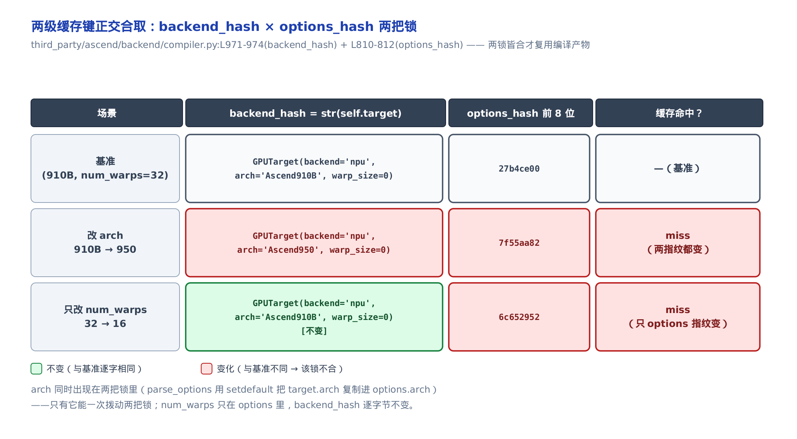
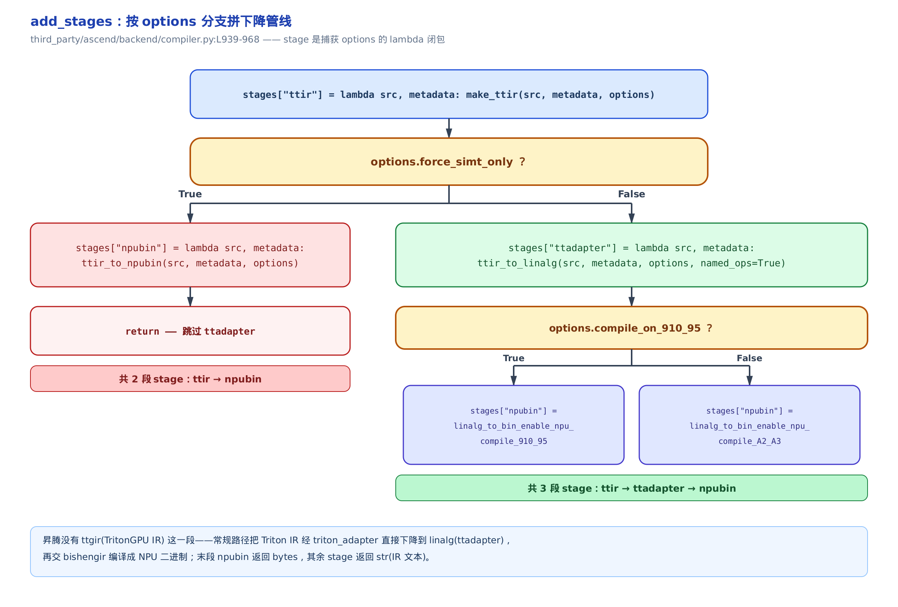
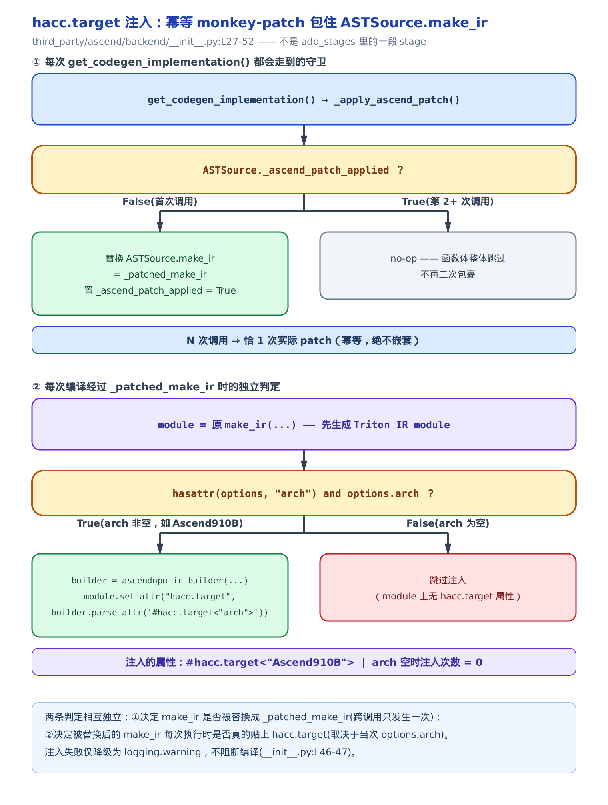

# 第 26 章　昇腾后端如何挂进 Triton——AscendBackend 契约、NPUOptions 与 hacc.target 注入



> 上一站：HIVM IR 一路降成 AscendC 库调用，结构化下降链收官。
> 这一站：退一步——整个昇腾后端怎么被 Triton **发现**、挂进那条后端无关的编译流水。
> 下一站：三段下降链每段内部的编排，与闭源边界 `bishengir-compile`。

前面二十多章，我们一直**站在下降链里面**看：`ttir_to_linalg` 怎么把张量 op 拆成结构化 Linalg，HIVM 怎么把硬件事实写进类型，`ConvertHIVMToStandardPass` 怎么把 op 降成库调用。上一章 [第 25 章](../../ch25-lowering-to-ascendc/narrative/chapter.md) 把最后一门方言也降没了，结构化下降链正式收官。

本章往后退一步，问一个更基础的问题：**这一整套昇腾编译逻辑，是怎么挂进 Triton 的？** Triton 的编译器本身是**后端无关**的——它不认识达芬奇、不认识 910B，只认识一份叫 `BaseBackend` 的契约。昇腾这一侧要做的，就是原位实现这份契约，让通用编译驱动在完全不知道 NPU 存在的情况下，把 kernel 一路编到 NPU 二进制。

这一章读三样东西：**后端怎么被自动发现**（一个目录一份实现，免注册表）、**契约的几个必需方法怎么落地**（`parse_options`／`add_stages`／`hash`／`get_codegen_implementation`）、以及**目标硬件型号怎么在编译一开始就贴进 IR**（`hacc.target` 注入）。焦点源码是 `third_party/ascend/backend/compiler.py`（977 行）加它旁边的 `__init__.py`。

> **写给读过基座书的你**：姊妹篇《Triton 源码解读》里有一章讲**编译驱动**——上游 `CompiledKernel` 那条主循环怎么按顺序跑 `stages` 字典里的每一段、把 kernel 源码走完一条编译流水。那条驱动是**后端无关**的：它只面向 `BaseBackend` 契约，GPU 路挂的是 `CUDABackend`。本章讲的是**同一份契约的昇腾实现** `AscendBackend`——它和 `CUDABackend` 是平级的兄弟，昇腾没有改动那条驱动一行代码，只是又实现了一遍契约、把自己的三段 stage 塞进同一个 `stages` 字典。这正是全书 fork（把整棵上游拷进自己仓库原地改）主线的落点：**换整条下降链靠的是原位实现契约，不是插件式的注册表顶替**。



只想抓「后端到底是怎么免注册表挂进来的」和「hacc.target 那层猴子补丁怎么保证只贴一次」这两处最出人意料的巧劲，直接跳 §26.1 和 §26.6；只关心缓存键怎么算、`arch` 为什么同时拨动两把锁，读 §26.3 和 §26.4 就够；不挑读法，按顺序走下来，六节会在最后「小结」自然拼成一条完整装配链。

---

## 26.1　后端自动发现：一个目录，一份后端

先看昇腾后端是怎么被 Triton **找到**的——在任何编译发生之前，装配期就已经把它登记好了。

**直觉**。没有中央注册表，也不需要谁去 `import` 昇腾后端。规则简单到近乎粗暴：在 `python/triton/backends/` 底下放一个目录，里面塞一份 `compiler.py` 和一份 `driver.py`，各自恰好定义一个非抽象类——Triton 启动时扫一遍这个目录，就把你这份后端装进来了。放对位置、把类写具体，就算挂上了。

**机制**。装配的全部逻辑在 `_discover_backends` 一个函数里：



```python
# python/triton/backends/__init__.py:L35-L55
def _discover_backends():
    backends = dict()
    root = os.path.dirname(__file__)
    # The package does not ship the files required to load the
    # upstream nvidia and amd backends, so skip discovering them here.
    ignored_dirs = {"nvidia", "amd"}
    for name in os.listdir(root):
        if name in ignored_dirs:
            continue
        if not os.path.isdir(os.path.join(root, name)):
            continue
        if name.startswith('__'):
            continue
        compiler = _load_module(name, os.path.join(root, name, 'compiler.py'))
        driver = _load_module(name, os.path.join(root, name, 'driver.py'))
        backends[name] = Backend(_find_concrete_subclasses(compiler, BaseBackend),
                                 _find_concrete_subclasses(driver, DriverBase))
    return backends


backends = _discover_backends()
```

逐段看。`os.listdir(root)` 列出 `backends/` 下的每个子目录名。`ignored_dirs = {"nvidia", "amd"}` 把 GPU 两家**显式跳过**——注释说得很直白：这个发行包不带加载 nvidia／amd 后端所需的文件，所以扫描阶段就不去发现它们了。**两个目录被跳过**，剩下的（比如 `ascend`）才继续走。

对每个存活的目录，`_load_module` 按路径把 `compiler.py`、`driver.py` 两个文件 import 进来（这里省略了它的实现，就是照文件路径动态载入一个 Python 模块）。然后 `_find_concrete_subclasses` 在这个模块里找 `BaseBackend`（编译侧）和 `DriverBase`（驱动侧）的**非抽象子类**——这个辅助函数要求**恰好一个**：目录里 0 个或多于 1 个具体子类，它都直接抛异常。这条「恰 1 个」是硬约束，它把「一个目录只能装一份后端」钉死。

最后一句 `backends[name] = Backend(...)` 把编译类与驱动类打包登记。对昇腾这个目录，结果就是 `backends['ascend'] = Backend(AscendBackend, NPUDriver)`。模块级最后一行 `backends = _discover_backends()` 在 import 时就跑完，装配一次到位。

**不变量**：`_find_concrete_subclasses` 要求每个目录里**恰好 1 个**非抽象子类——0 个或多于 1 个都当场 raise。因此每次成功装配后，`backends[name]` 里的 `(compiler_cls, driver_cls)` 二元组**必然唯一确定**：既不依赖 `os.listdir` 的遍历顺序，也不容许同一目录挂两份实现（那会因「多于 1 个」直接抛异常，装配根本走不到登记这一步）。这条硬约束把「一目录一后端」从一句心智约定升成了机器保证。

**为什么这么设计**。这是一套**免注册表**的插件发现：新增一个后端，不用去改上游任何一处「注册中心」代码，只要在约定目录下新增一个文件夹、照结构放两份文件、把类写成具体的，主库代码零改动就把它纳进 `backends` 表。「恰 1 个非抽象子类」这条约束是它的守门——它保证「一目录一后端」这个心智模型不会被打破，也让装配结果确定、无歧义。

## 26.2　BaseBackend：后端无关契约的 6 个方法

后端被发现之后，Triton 编译驱动怎么**使用**它？答案是：只通过一份抽象契约。

**直觉**。把 `BaseBackend` 想成一份接口清单。上游那条通用编译驱动，从头到尾只调用清单上的几个方法名——它不知道方法背后是给 NVIDIA 编还是给昇腾编，就像插座只认插头形状、不管墙里接的是水电还是风电。昇腾要挂进来，就得把清单上每一格都填上自己的实现。

这里先消一个可能的疑惑：nvidia／amd 的 `compiler.py`／`driver.py` 源码其实仍在本仓库里、也都实现着同一份 6 方法契约——它们和 `AscendBackend` 是平级的兄弟。26.1 讲的 `_discover_backends` 只是在**运行时装配阶段**主动跳过了这两个目录（发行包不随附加载它们所需的其余文件），这跟「它们有没有实现契约」是两码事，并不矛盾（为什么源码在、装配却跳过，26.5 对照 `make_ttir` 时会再落实一次）。

**机制**。契约是一个用 `ABCMeta`（抽象基类元类，Python 里用来强制子类必须实现某些方法的机制）定义的抽象类，一共 6 个必须实现的抽象方法（5 个 `@abstractmethod`，外加 `supports_target` 这个 `@abstractclassmethod`——它是抽象类方法，语义上仍是「子类必须实现」，只是首参为类而非实例）：



```python
# python/triton/backends/compiler.py:L226-L290
class BaseBackend(metaclass=ABCMeta):

    def __init__(self, target: GPUTarget) -> None:
        self.target = target
        assert self.supports_target(target)

    @abstractclassmethod
    def supports_target(target: GPUTarget):
        raise NotImplementedError

    @abstractmethod
    def hash(self) -> str:
        """Returns a unique identifier for this backend"""
        raise NotImplementedError

    @abstractmethod
    def parse_options(self, options: dict) -> object:
        """
        Converts an `options` dictionary into an arbitrary object and returns it.
        This function may contain target-specific heuristics and check the legality of the provided options
        """
        raise NotImplementedError

    @abstractmethod
    def add_stages(self, stages: dict, options: object) -> None:
        """
        Populates `stages` dictionary with entries of the form:
        ir_name [str] => Function[(src: str, metadata: dict) -> str|bytes]
        The value of each entry may populate a `metadata` dictionary.
        Stages will be run sequentially (in inseriton order) and can communicate using `metadata`.
        All stages are expected to return a `str` object, except for the last stage which returns
        a `bytes` object for execution by the launcher.
        """
        raise NotImplementedError

    @abstractmethod
    def load_dialects(self, context):
        """
        Load additional MLIR dialects into the provided `context`
        """
        raise NotImplementedError

    @abstractmethod
    def get_module_map(self) -> Dict[str, ModuleType]:
        """
        Return a map of interface modules to their device-specific implementations
        """
        raise NotImplementedError
```

**6 个方法**各管一件事：`supports_target` 认领「这个 target 是不是我的」；`hash` 返回后端指纹、参与编译缓存键；`parse_options` 把用户传的选项字典（`options: dict`）转成一个后端自定义的选项对象，顺便查合法性；`add_stages` 往 `stages` 字典里填入下降管线的各段；`load_dialects` 把后端专属的 MLIR（Multi-Level Intermediate Representation，一套搭建编译器中间表示的开源框架，见 [第 1 章](../../ch01-birdseye-ascend-backend/narrative/chapter.md)）方言（dialect，MLIR 里一组自定义 op／类型／属性的集合）注册进上下文；`get_module_map` 给出「接口 → 设备实现」的映射。

注意基类构造函数里那句 `assert self.supports_target(target)`——任何后端一被实例化，就先自检「你真能编这个 target 吗」，编不了当场断言失败。除这 6 个必填方法外，`BaseBackend` 还有两个带默认实现的可覆写钩子（`get_attrs_descriptor`／`compute_spec_key`，默认落到通用的属性描述），不实现也能跑，本章不展开。

**不变量**：`ABCMeta` 保证——只要 `AscendBackend` 没把这 6 个抽象方法**全部**覆写掉，`AscendBackend(target)` 在类定义／实例化阶段就直接抛 `TypeError: Can't instantiate abstract class`，根本走不进构造函数。反过来说，代码能顺利跑到 `super().__init__(target)` 那一行，本身就是「契约已被完整实现」的证据：一个方法没填，程序在此之前就崩了，不会带着半份实现继续往下编。抽象契约把「实现不全」这类错误从运行期深处提前到了类装配的最外层。

**target 从哪来**。契约里反复出现的 `target`，是一个描述「要编到哪块卡」的结构体 `GPUTarget`。它的产地在昇腾驱动侧：

```python
# third_party/ascend/backend/driver.py:L166-L174
    def get_current_target(self):
        backend = "npu"
        env_target = get_ascend_arch_from_env()
        if env_target:
            arch = env_target
        else:
            arch = self.utils.get_arch()
        warp_size = 0
        return GPUTarget(backend, arch, warp_size)
```

`backend` 硬编成 `"npu"`；`arch`（架构字符串，如 `Ascend910B`／`Ascend950`）优先取环境变量覆盖，否则由 `self.utils`（驱动侧封装的底层探测工具，内部落到 `npu_utils.so` 这个 C 扩展）调 `get_arch()` 探测硬件得到；`warp_size`（一个 warp 里的线程数，GPU 概念）在 NPU 上恒填 `0`——昇腾不是 SIMT（Single Instruction Multiple Threads，GPU 的单指令多线程执行模型）架构，没有 warp 这回事，填 0 是占位。这三样打包成 `GPUTarget('npu', arch, 0)`，就是喂给后端的 target。

**昇腾这一侧怎么认领**。契约的实现方 `AscendBackend` 直接从上游 `import BaseBackend` 并继承它——**原位复用上游，不顶替**：

```python
# third_party/ascend/backend/compiler.py:L877-L887
class AscendBackend(BaseBackend):

    @staticmethod
    def supports_target(target: GPUTarget):
        return target.backend == "npu"

    def __init__(self, target: GPUTarget) -> None:
        super().__init__(target)
        if target.backend == "npu":
            self.binary_ext = "npubin"
```

`supports_target` 的判据只有一句：`target.backend == "npu"`。这就是昇腾「认领」target 的全部逻辑——凡 backend 字段是 `npu` 的，归我编。构造时 `super().__init__(target)` 会触发基类那句 `assert supports_target(target)` 自检，然后把 `binary_ext`（后端产物扩展名）钉成 `"npubin"`——整条下降链的终点从此确定：一份 `.npubin`（NPU 二进制）。

还剩两个方法本章不专门展开：`load_dialects` 在昇腾侧就是一句 `ascend.load_dialects(ctx)`（把昇腾专属方言注册进上下文）；`get_module_map` 目前落地成一个**空字典** `return {}`——说明昇腾这一步暂时不需要「接口 → 设备实现」的重定向，配图里标的「无接口→设备实现映射需要覆写」就是这个意思。契约的其余几个方法——`parse_options`、`add_stages`、`hash`、外加触发 `hacc.target` 注入的 `get_codegen_implementation`——才是本章接下来四节（26.3–26.6）的主角。

## 26.3　parse_options：把 kwargs 过滤成 NPUOptions

用户调用 kernel 时能传一大把编译选项（`num_warps=8`、`num_stages=2`……）。这些散装的关键字参数（kwargs），要先被拢成一个规整的选项对象，才能往下传。这活儿归 `parse_options`。

**直觉**。像海关的白名单：用户递上一大袋 kwargs，`parse_options` 只放行护照（`NPUOptions` 的字段名）上登记过的键，其余当场丢弃；如果你忘了带 arch，就用 target 上的默认给你补一张。

**机制**。看它对一组具体输入怎么处理。假设用户传进来 5 个 kwarg，target 的 arch 是 `Ascend910B`：

<!-- trace: parse-options -->

| 键=值 | 是否 NPUOptions 字段名 | 动作 | 进入 NPUOptions 的键 |
|---|---|---|---|
| `num_warps=8` | 是 | 保留 | `num_warps=8` |
| `num_stages=2` | 是 | 保留 | `num_stages=2` |
| `enable_fp_fusion=False` | 是 | 保留 | `enable_fp_fusion=False` |
| `block_size=128` | 否（非字段名） | 丢弃 | — |
| `foo=bar` | 否（非字段名） | 丢弃 | — |
| `arch` 缺席 → setdefault | — | 从 `target.arch` 补（`compiler.py:L896`） | `arch=Ascend910B` |

5 个用户 kwarg 里，3 个命中字段名被保留，2 个（`block_size`／`foo`）在白名单外被丢弃；用户没传 `arch`，`setdefault`（字典方法：键不存在才写入默认值）从 `target.arch` 补上一个。最终 **4 个键**进入 `NPUOptions`。

**不变量**：过滤后交给 `NPUOptions(**kept)` 的每个键，都保证是合法的 dataclass 字段名，构造绝不会因为「未知参数」抛 `TypeError`。理由看源码就明白：

```python
# third_party/ascend/backend/compiler.py:L888-L903
    def parse_options(self, opts) -> Any:
        # TODO: get available targets when building options?
        if self.target.backend == "npu":
            args = {
                k: opts[k]
                for k in NPUOptions.__dataclass_fields__.keys()
                if k in opts
            }
            args.setdefault("arch", self.target.arch)
            options = NPUOptions(**args)
        else:
            raise NotImplementedError(
                f"Backend '{self.target.backend}' is not supported. "
                "Please ensure the target backend is set to 'npu'."
            )
        return options
```

关键是那个字典推导的**遍历方向**：它遍历的是 `NPUOptions.__dataclass_fields__.keys()`（dataclass 的全部字段名），再用 `if k in opts` 筛「用户也传了这个键」。也就是说，`args` 的键**只可能来自字段名全集**——用户多递的 `block_size`／`foo` 根本不在遍历范围里，永远进不来。唯一额外注入的 `arch` 也是字段之一，经 `setdefault` 补入。两个来源都是合法字段，所以 `NPUOptions(**args)` 构造必然成功。这是「先按护照过滤，再放行」带来的安全性。

**选项对象本体**。被构造出来的 `NPUOptions` 是一个冻结数据类（`@dataclass(frozen=True)`，实例一旦建成任何字段都不能再改）：

```python
# third_party/ascend/backend/compiler.py:L704-L742
@dataclass(frozen=True)
class NPUOptions:
    debug: bool = False
    sanitize_overflow: bool = True
    llvm_version: int = 15
    kernel_name: str = "triton_"
    arch: str = ""

    cluster_dims: tuple = (1, 1, 1)
    num_warps: int = 32
    num_ctas: int = 1
    num_stages: int = 1
    warp_size: int = 32
    # … 省略：num_buffers_warp_spec / reg_dec_producer 等 warp spec 相关字段 …

    auto_blockify_size: int = 1
    compile_on_910_95: bool = is_compile_on_910_95
    # … 省略：enable_persistent / optimize_epilogue / allow_fp8e4nv 等布尔开关 …
    supported_fp8_dtypes: Tuple[str] = ("fp8e5", "fp8e4b15", "fp8e4nv", "fp8e4b8", "fp8e5b16")
    default_dot_input_precision: str = "ieee"
    max_num_imprecise_acc_default: int = 0
    extern_libs: dict = None
    bisheng_options: str = "-cce-link-aicore-ll-module " + get_libdevice()
    # … 省略：另有约 60 个 bishengir/hivm 编译开关字段，绝大多数默认 None 表示「不透传该 flag」…
```

真实的 `NPUOptions` 有近 80 个字段——从 `num_warps` 这类通用旋钮，到一大片透传给 `bishengir-compile`（华为闭源的昇腾编译器）的开关（`compile_on_910_95`、`bisheng_options`……）。这里只截了开头一段代表性字段，其余约 60 个开关都按同一模式排列，绝大多数默认 `None`，意思是「不给底层编译器加这个 flag」。要记住的一点：**每一个字段都是这个 dataclass 的成员，因而全都会进入下一节讲的 `hash()`**——每个开关都参与缓存键。

**派生字段**。`NPUOptions` 有个 `__post_init__`，把一个高层旋钮 `compile_mode` 展开成几个底层标志：

```python
# third_party/ascend/backend/compiler.py:L793-L808
    def __post_init__(self):
        # Parse compile_mode and set related fields
        if self.compile_mode == "simd":
            object.__setattr__(self, "parallel_mode", "simd")
        elif self.compile_mode == "unstructured_in_simt":
            # For historical compatibility reasons, force_simt_template will still be used.
            object.__setattr__(self, "force_simt_template", True)
        elif self.compile_mode == "simt_only":
            object.__setattr__(self, "force_simt_only", True)
            object.__setattr__(self, "parallel_mode", "simt")

        if self.force_simt_only:
            if self.shared_mem_dynamic_size is None:
                object.__setattr__(self, "shared_mem_dynamic_size", 122880)
        else:
            object.__setattr__(self, "shared_mem_dynamic_size", 221184)
```

用户只设一个 `compile_mode`（`simd`／`unstructured_in_simt`／`simt_only`），`__post_init__` 自动派生出 `parallel_mode`、`force_simt_only`（强制只走 SIMT 模板的快路径开关，旁路细节见 [第 20 章](../../ch20-tritonascend-dialect-escapes/narrative/chapter.md)）以及 `shared_mem_dynamic_size`（122880 或 221184）。这样把「多个底层标志要保持一致」的负担收进一处，降低误配。

这里有个 Python 细节值得点破：`NPUOptions` 是 `frozen=True` 的，普通赋值 `self.x = ...` 会因为冻结而抛异常。所以 `__post_init__` 里派生字段必须用 `object.__setattr__(self, name, val)` **绕过**冻结机制直接写入——这是「构造期允许微调、构造后彻底只读」的标准写法。

**佐证**。仓库自带一个测试夹具用简化的选项对象把 kernel 直接编到 Triton MLIR，正好印证 arch 串和字段名的真实形状：

```python
# third_party/ascend/unittest/pytest_ut/test_arch.py:L35-L53
class Options:
    num_warps = 4
    num_stages = 3
    num_ctas = 1
    cluster_dims = (1, 1, 1)
    enable_fp_fusion = True
    debug = False
    arch = "Ascend950"


def compile_kernel(kernel, signature, constants):
    """Helper to compile a kernel to MLIR."""
    src = ASTSource(kernel, signature, constants)
    context = ir.context()
    ir.load_dialects(context)
    buffer_ir.load_dialects(context)
    ascend_ir.load_dialects(context)
    module = ast_to_ttir(kernel, src, context, Options(), {}, {})
    return str(module)
```

这个夹具的 `Options` 字段名（`num_warps`／`num_stages`／`arch`……）与 `NPUOptions` 对齐，`arch = "Ascend950"` 正是一个真实的达芬奇型号串。夹具里的 `ASTSource`（上游对「kernel 源码 ＋ 签名 ＋ 常量」三件套的封装，是编译驱动的入口对象；它的 `make_ir` 方法负责生成最初的 Triton IR module，26.6 还会再遇到它）先包住 kernel，再由 `ast_to_ttir` 编出 IR。它还 `load_dialects` 装了三套方言（`ir`／`buffer_ir`／`ascend_ir`），把 kernel 编到 Triton MLIR——印证了两件事：arch 就是 `Ascend950` 这种字符串，选项对象确实承载 `num_warps` 等字段。它只走到 Triton IR 这一步、不经全链路，故不涉及 `bishengir`。

## 26.4　两级缓存键：选项指纹 × 目标指纹

编译很贵，所以要缓存：同样的 kernel、同样的选项、同样的目标，第二次编译应当直接命中缓存、复用产物。命中与否，由**两个哈希**联合决定——一个来自选项，一个来自目标。

**直觉**。两把独立的锁。一把是**选项指纹**（`NPUOptions.hash`），把所有开关串成一行再压成哈希；一把是**目标指纹**（`AscendBackend.hash`），干脆就是把 `GPUTarget` 打印成字符串。两把锁都对上，才复用编译产物；任一把不合，就重编。

**选项指纹**。先看它怎么算：

```python
# third_party/ascend/backend/compiler.py:L810-L812
    def hash(self):
        key = "_".join([f"{name}-{val}" for name, val in self.__dict__.items()])
        return hashlib.sha256(key.encode("utf-8")).hexdigest()
```

两行：把每个字段拼成 `名-值`、用下划线连成一行长字符串 `key`，再对 `key` 做 sha256（一种把任意输入压成 64 位十六进制摘要的哈希算法），取十六进制摘要。任何一个字段拨动一格，`key` 串就变一处，sha256 输出就整个变样——这就是所谓**雪崩效应**（输入改一 bit，输出平均翻转半数 bit）。

拿具体数字看雪崩：

<!-- trace: npuoptions-hash -->

| 场景（相对 base 的改动） | key 字符串（节选） | sha256 前 8 位 | 与 base digest 的公共前缀 |
|---|---|---|---|
| base（默认） | `debug-False_num_warps-32_..._arch-Ascend910B_compile_mode-simd` | `27b4ce00` | —（基准） |
| 仅 `num_warps` 32→16 | `..._num_warps-16_...` | `6c652952` | 0 字符（首字符即不同） |
| 仅 `arch` 910B→950 | `..._arch-Ascend950_...` | `7f55aa82` | 0 字符（首字符即不同） |

> **取证边界**：host 上没有昇腾环境，也没有 `bishengir` 那套编译期 C 扩展，真实的近 80 字段 `NPUOptions` 在 host 上根本实例化不出来。上表的 digest 是**真的 sha256**，但算的是一个**缩减到 5 字段**的 key 串（字段值逐字取自 `compiler.py` 的默认值），用来示教雪崩，**不等于**真机上全字段对象的字面哈希。要看的不是这几个十六进制值本身，而是它们**互不相同**这个事实。

**不变量**：只改一个字段值，新 digest 与原 digest 的十六进制公共前缀长度就是 **0**（雪崩），所以不同选项必得不同缓存键、不会误命中同一份编译产物。反过来，key 相同则 digest 必相同（哈希是函数），即**选项完全一致才可能命中**。表里 `num_warps` 变体、`arch` 变体与 base 的公共前缀都是 0——64 位摘要里没有一位可复用。

**目标指纹**。另一把锁简单得多：

```python
# third_party/ascend/backend/compiler.py:L970-L974
    @functools.lru_cache()
    def hash(self):
        # TODO fetch compiler version
        version_key = self.target
        return str(version_key)
```

`AscendBackend.hash` 就是 `str(self.target)`——把 `GPUTarget` 打印成字符串（`backend` + `arch` + `warp_size`）。外面套的 `@functools.lru_cache()`（把函数返回值缓存起来的装饰器）让它算一次就记住。注意它和上面的 `NPUOptions.hash` 是**两个不同维度**的键：这个是「后端／目标」维度，那个是「编译选项」维度。

**两把锁怎么联动**。把两个维度并排看：



<!-- trace: backend-hash -->

| 改动维度 | `AscendBackend.hash = str(target)` | `NPUOptions.hash` 前 8 位 | 缓存命中？ |
|---|---|---|---|
| 基准（910B, `num_warps=32`） | `GPUTarget(backend='npu', arch='Ascend910B', warp_size=0)` | `27b4ce00` | —（基准） |
| 改 arch 910B→950 | `GPUTarget(backend='npu', arch='Ascend950', warp_size=0)` | `7f55aa82` | miss（两指纹都变） |
| 只改 `num_warps` 32→16 | `GPUTarget(backend='npu', arch='Ascend910B', warp_size=0)` [不变] | `6c652952` | miss（只 options 指纹变） |

**不变量**：缓存命中 ⟺ 目标指纹相等**且**选项指纹相等（两维正交，合取）。任一维不等就 miss——只改 `num_warps` 时目标指纹逐字节不变（`str(target)` 里根本没有 `num_warps` 这一项），但选项指纹从 `27b4ce00` 变成 `6c652952`，合取要求两者都等，所以仍 miss。

需要挑明的是：本章看到的是两个**各自独立定义**的 hash 方法，源码里并没有一行「`key = backend.hash() + options.hash()`」当场把它俩拼成一个联合查找键——真正把两把指纹合到一起判定命中，是在编译驱动的产物缓存里做的（那是姊妹篇《Triton 源码解读》讲 `CompiledKernel` 编译缓存时的题材），本章不展开到那一行。所以这里的「合取」是从两把哈希各自的语义**推**出来的结论，不必去本章源码里找一处并不展示的「合并键」代码；你只需要拿住这一点：两者中任一把变了，产物就不能安全复用。

这里有个微妙点：**`arch` 是唯一同时拨动两把锁的量**。回看上一节的 `parse_options`——它用 `args.setdefault("arch", self.target.arch)` 把 `target.arch` **复制进** `options.arch`。于是 arch 一变，`str(target)` 变（目标指纹变），`options.arch` 也变（选项指纹也变）。表里 910B→950 那一行两列同时翻红，就是这个道理。其余选项专属字段（`num_warps` 之类）只出现在选项指纹里，改它只翻一列。

## 26.5　add_stages：把三段下降链登记进 stages 字典

选项备齐、缓存键说清，现在轮到契约里分量最重的一个方法：`add_stages`——它决定编译**分几段、每段调什么**。

**直觉**。`add_stages` 不亲自编译，它只**登记菜单**：往一个有序字典 `stages` 里塞几个键，每个键对应一段编译，值是一个只吃 `(src, metadata)` 的小函数（lambda 闭包，捕获了当前的 `options`）。上游那条通用驱动拿到这个字典后，按插入顺序一段段跑，前一段的输出喂给后一段。昇腾要做的，就是把自己的三段塞进去。

**机制**。塞哪几段，由 `options` 动态决定：



```python
# third_party/ascend/backend/compiler.py:L939-L968
    def add_stages(self, stages, options):
        if self.target.backend == "npu":
            stages["ttir"] = lambda src, metadata: make_ttir(src, metadata, options)
            if options.force_simt_only:
                stages["npubin"] = (
                    lambda src, metadata: ttir_to_npubin(
                        src, metadata, options
                    )
                )
                return
            stages["ttadapter"] = lambda src, metadata: ttir_to_linalg(
                src, metadata, options, named_ops=True
            )
            if options.compile_on_910_95:
                stages["npubin"] = (
                    lambda src, metadata: linalg_to_bin_enable_npu_compile_910_95(
                        src, metadata, options
                    )
                )
            else:
                stages["npubin"] = (
                    lambda src, metadata: linalg_to_bin_enable_npu_compile_A2_A3(
                        src, metadata, options
                    )
                )
        else:
            raise NotImplementedError(
                f"Backend '{self.target.backend}' is not supported. "
                "Please ensure the target backend is set to 'npu'."
            )
```

**常规路径共 3 段**：`ttir`（跑通用 TTIR 优化）→ `ttadapter`（把 Triton IR 经 triton_adapter 下降成结构化 Linalg，`named_ops=True`）→ `npubin`（交 `bishengir` 出二进制）。这条链**没有 `ttgir`**（TritonGPU IR）——对照基座 GPU 路的五段 `ttir→ttgir→llir（LLVM IR）→ptx（NVIDIA GPU 汇编中间层）→cubin（NVIDIA GPU 二进制）`，昇腾在第二段就分叉了：它不走 TritonGPU IR，而是直接经 triton_adapter 下降到 Linalg。分叉的根因是 NPU 不是 SIMT 架构，TritonGPU 那套围绕 warp 的 IR 用不上。

两处 `if` 决定管线的形状：

- `options.force_simt_only` 为真时，注册完 `ttir` 直接塞 `npubin`（走 `ttir_to_npubin`）然后 `return`——**跳过 `ttadapter`，共 2 段**。这是不经 Linalg 的旁路快路径。
- `options.compile_on_910_95` 决定 `npubin` 段挂哪个实现：为真走 `linalg_to_bin_enable_npu_compile_910_95`，为假走 `linalg_to_bin_enable_npu_compile_A2_A3`——两者是不同硬件代际（910_95 与 A2／A3）的变体，末段职责相同（拼 `bishengir` 命令行、出二进制），只是命令行开关有别。注意它并非恒为假：回看 26.3 贴出的 `compile_on_910_95: bool = is_compile_on_910_95`（第 229 行），它的默认值是模块级常量 `is_compile_on_910_95`，由运行时探测 PCI id／npu-smi 得到的硬件代际决定，可能真也可能假。

**不变量**：这两处 `if` 互斥地把管线钉成两种形状之一——`force_simt_only` 为真时函数在注册完 `npubin` 后当场 `return`，`stages` 最终恰是 `{ttir, npubin}` 两段；否则必然继续走到 `ttadapter`，再由 `compile_on_910_95` 二选一挂上某个 `linalg_to_bin` 实现，`stages` 恰是 `{ttir, ttadapter, npubin}` 三段。两个分支各自封闭、无交叠，所以 `stages` 字典的最终形状只可能是这两种，不存在中间态，也没有第四种组合。

**stage 契约**。为什么每段能这样串起来？看契约那段 docstring 定的类型规矩：每个 stage 是 `(src, metadata) -> str|bytes`；除**最后一段**返回 `bytes`（可执行的 NPU 二进制、交给 launcher 发射）外，其余都返回 `str`（IR 文本）。段与段之间唯一的旁路通道是那个可变的 `metadata` 字典——前一段往里写副产物（`kernel_name`／`hash`／各种 tensor 信息），后一段和最终的 launcher 从里面读。上游驱动就靠「按插入序跑、`str` 接力、末段吐 `bytes`」这套约定，把互不相识的几段拼成一条完整流水。

**第一段共享，从第二段才分叉**。第一段 `ttir` 挂的 `make_ttir`，是理解「后端无关」最好的一处实证：

```python
# third_party/ascend/backend/compiler.py:L73-L93
def make_ttir(mod, metadata, opt):
    if "hash" not in metadata:
        metadata["hash"] = hashlib.sha256(f"{mod}-{metadata}".encode()).hexdigest()
    # the same optimize pass for triton-ir as all other backends
    pm = ir.pass_manager(mod.context)
    pm.enable_debug()
    passes.common.add_inliner(pm)
    passes.ttir.add_combine(pm)
    passes.common.add_canonicalizer(pm)
    passes.ttir.add_reorder_broadcast(pm)
    passes.common.add_cse(pm)
    passes.common.add_licm(pm)
    passes.common.add_symbol_dce(pm)
    passes.ttir.add_loop_unroll(pm)
    pm.run(mod)
    if opt.debug:
        dump_manager = get_dump_manager(metadata["hash"])
        print(f"Dumping intermediate results to {dump_manager.cache_dir}")
        dump_manager.put(str(mod), "kernel.ttir.mlir", binary=False)

    return mod
```

源码注释自己写明了：`# the same optimize pass for triton-ir as all other backends`。这一段跑的 inliner／combine／canonicalizer／reorder_broadcast／cse／licm／symbol_dce／loop_unroll，与 nvidia／amd 后端**基本相同**——Triton IR 层的优化本就是所有后端共享的。这里说「基本」而非「完全」：拿同一份上游 Triton 里 nvidia／amd 的 `make_ttir` 逐条比对，它们在 `add_inliner` 之后还多跑一道 `add_rewrite_tensor_pointer`（改写 tensor 指针语义），昇腾这条链路不需要处理它，故略去——两边差的只是这一道 pass，主干的公共优化完全一致。（这不是推断：nvidia 后端的 `make_ttir` 就在本仓库同一份 checkout 里，可直接翻开 `third_party/nvidia/backend/compiler.py:L188-199` 对照——它在 `add_inliner` 之后紧跟一道 `add_rewrite_tensor_pointer`，随后的 `add_combine`／`add_canonicalizer`／`add_reorder_broadcast`／`add_cse`／`add_licm`／`add_symbol_dce`／`add_loop_unroll` 这八道与昇腾这里逐条一致。26.1 讲的「发行包不随附加载 nvidia／amd 后端所需的文件」说的是 `_discover_backends` 运行时装配阶段跳过这两个目录，并不代表它们的 `.py` 源码在仓库里缺席；这段公共 pass 逻辑连同「与所有后端共享」这条注释，都是从上游完整版 Triton 原样继承、未做改动的。）昇腾真正的差异从**第二段 `ttadapter`（Linalg 下降）才开始**。这具体印证了「编译器前端后端无关」：越靠上游越通用，越往下越贴硬件。

至于每段内部到底做了什么——`ttir_to_linalg` 怎么经 triton_adapter 一步步把 TTIR 降成 Linalg、`linalg_to_bin` 怎么拼命令行调 `bishengir` 出二进制——是本部分后续两章的题材，本章只需看清「三段是如何被**登记进** `stages` 字典的」。

## 26.6　hacc.target 注入：一层幂等 monkey-patch

最后一块拼图：目标硬件型号（`Ascend910B`）是怎么在编译一开始就贴进 IR 的？答案有点出人意料——它**不是**一段 stage，而是靠一层猴子补丁。

**直觉**。昇腾在门口给 IR 贴标签。上游的 `ASTSource.make_ir`（26.3 见过的那个入口方法：编译驱动靠它生成最初的 Triton IR module）只会生成通用的 Triton IR，它不认识昇腾芯片型号。这里先厘清时序：`make_ir` 跑在 26.5 那些 `add_stages` 登记的 stage —— 含第一段 `ttir` —— **之前**（是它的输出喂给第一段 stage），且它是上游的代码。昇腾用一层 monkey-patch（猴子补丁：运行时把一个已有函数替换成自己的包装版）包住 `make_ir`——module 一生成，就给它贴上 `#hacc.target<"Ascend910B">` 这张便签，后面每道 pass 抬头就知道该给哪代芯片生成代码。正因为要赶在所有 stage 之前贴，在这里贴比塞进任何一段 stage 都更早、更通用。贴一次就够，重复调只是空转。

**触发点**。这层补丁由契约方法 `get_codegen_implementation` 引出：

```python
# third_party/ascend/backend/compiler.py:L925-L931
    def get_codegen_implementation(self):
        # Note: a dict of functions is required to generate vendor-specific code piecies
        #       e.g. convert custom types like fp8e4b15
        from triton.backends.ascend import _apply_ascend_patch
        _apply_ascend_patch()
        codegen_fns = {"min_dot_size": min_dot_size(self.target)}
        return codegen_fns
```

上游驱动在准备 codegen 时会调 `get_codegen_implementation`，这里趁机调一把 `_apply_ascend_patch()`——`hacc.target` 注入的所有玄机都在这个函数里（`min_dot_size` 目前是占位实现，返回恒为 `(1,1,1)`，本章不展开）。

**注入体**。

```python
# third_party/ascend/backend/__init__.py:L27-L52
def _apply_ascend_patch():
    from triton.compiler.compiler import ASTSource

    if not getattr(ASTSource, "_ascend_patch_applied", False):
        _original_make_ir = ASTSource.make_ir

        def _patched_make_ir(self, options, codegen_fns, module_map, context):
            """
            Monkey Patch for Ascend:
            Injects 'hacc.target' attribute into the module after generation.
            """
            module = _original_make_ir(self, options, codegen_fns, module_map, context)

            if hasattr(options, "arch") and options.arch:
                try:
                    builder = ascend_ir.ascendnpu_ir_builder(context, options.arch)

                    target_attr_str = f'#hacc.target<"{options.arch}">'
                    module.set_attr("hacc.target", builder.parse_attr(target_attr_str))
                except Exception as e:
                    logging.warning(f"[Ascend Patch] Failed to set hacc.target: {e}")

            return module

        ASTSource.make_ir = _patched_make_ir
        ASTSource._ascend_patch_applied = True
```

拆成两层判定看，正好对应机制里两个不同的问题：



**第一层：补丁装没装（幂等守卫）**。函数一进来先查 `getattr(ASTSource, "_ascend_patch_applied", False)`。首次调用这个标志缺省为 `False`，于是进入函数体：把 `ASTSource.make_ir` 换成 `_patched_make_ir`，末尾置 `_ascend_patch_applied = True`。此后再调，守卫为真、整个函数体跳过——`make_ir` 不会被二次包裹。

**第二层：便签贴不贴（每次编译各判一次）**。被替换后的 `_patched_make_ir` 每次执行时：先调原 `make_ir` 生成 module，再独立判断 `hasattr(options, "arch") and options.arch`——arch 非空才 `set_attr` 注入 `#hacc.target<"...">`，arch 为空就跳过。注入失败也只降级为一条 `logging.warning`，**不阻断编译**（后续 pass 拿不到目标信息而已）。

这里 `hacc` 是昇腾的编译支持层命名空间——[第 25 章](../../ch25-lowering-to-ascendc/narrative/chapter.md) 里给函数打的 `hacc.function_kind<DEVICE>` 标记也是同一个命名空间。目标型号写成 module 上的 `hacc.target` 属性，就是让整条下降链的每道 pass 都能读到「在给哪块卡生成」。

把两层判定摆成时序，看它对多次调用怎么反应：

<!-- trace: hacc-target-injection -->

| 轮次 | 事件 | `_ascend_patch_applied` | make_ir 实际行为 | module 上的 hacc.target |
|---|---|---|---|---|
| 1 | 首次 `get_codegen_implementation` → `_apply_ascend_patch` | False → True | 把 `ASTSource.make_ir` 换成 `_patched_make_ir`（L51） | （patch 装上，尚未编译） |
| 2 | 编译 kernel（`arch='Ascend910B'`），走 `_patched_make_ir` | True | 先调原 make_ir 生成 module，再 set_attr（L42,L45） | `#hacc.target<"Ascend910B">` |
| 3 | 再次 `get_codegen_implementation` → `_apply_ascend_patch` | True（守卫命中，L30） | no-op，不再包裹 | 不变（不重复嵌套） |
| 4 | 编译另一 kernel（`arch=''`），走 `_patched_make_ir` | True | 生成 module；`if options.arch` 为空 ⇒ 跳过注入（L43） | 无（arch 空，便签不贴） |

**不变量**：无论 `get_codegen_implementation` 被调多少次，`ASTSource.make_ir` 只被真正包裹**一次**（幂等），绝不层层嵌套。归纳看：首次进入时守卫为 `False`，替换并置 `True`（基例）；此后任意调用守卫恒为真、函数体整体跳过（归纳步）。所以包裹次数恒为 1，不会出现 `_patched_make_ir` 套 `_patched_make_ir` 的嵌套——那既低效又会重复注入。而每次编译在 module 生成后至多 1 次 `set_attr`：arch 非空贴 1 张便签，arch 为空贴 0 张。

为什么不做成一段 stage、非要用 monkey-patch？因为目标属性必须在 module **一生成就挂上**，供后续所有 pass 读取，而生成 module 的 `make_ir` 是**上游**的代码、它不认识昇腾。要在「上游生成」与「第一段 stage」之间插一手，最不侵入的办法就是幂等地包住上游那个 `make_ir`——上游一行不改，昇腾照样把便签贴进去。这又是一处 fork 思路的缩影：不改上游、只在外面裹一层。

## 26.7　小结：一份契约，六个方法，两处巧劲

回头看这一整章，昇腾后端「挂进 Triton」这件事，就是一条清晰的装配链：

1. **发现**——`_discover_backends` 扫 `backends/` 目录，跳过 nvidia／amd，靠「一目录恰一个非抽象子类」把 `AscendBackend`／`NPUDriver` 免注册表地装进来。
2. **认领**——`supports_target` 只认 `target.backend == "npu"`，构造时把产物钉成 `.npubin`。
3. **备料**——`parse_options` 用字段名白名单把 kwargs 过滤成冻结的 `NPUOptions`，`arch` 缺省从 target 补入。
4. **缓存键**——`NPUOptions.hash`（选项指纹，sha256）与 `AscendBackend.hash`（目标指纹，`str(target)`）两把锁正交合取，`arch` 是唯一双重敏感的量。
5. **登记管线**——`add_stages` 按 `options` 分支，把 `ttir→ttadapter→npubin` 三段（或 `force_simt_only` 的两段）塞进 `stages` 字典；第一段 `make_ttir` 与所有后端共享，分叉从第二段起。
6. **贴标签**——`get_codegen_implementation` 触发一层幂等 monkey-patch，包住上游 `make_ir`，让 `#hacc.target<"arch">` 在 module 一生成就挂上。

这 6 步里，第 1 步（免注册表的目录发现）和第 6 步（monkey-patch 贴 `hacc.target`）是标题所说全章最反直觉的**两处巧劲**——其余 4 步都是照契约老实填空。而这 6 步全都是**原位实现上游 `BaseBackend` 契约**（注意这个「六」是装配链的六步，与 26.2 里 `BaseBackend` 那 6 个抽象方法不是同一组数）——上游那条通用编译驱动一行没改，只是又多认了一个兄弟后端。这正是全书 fork 主线在后端这一层的落点：想把 GPU 的五段下降链换成 NPU 的三段，靠的不是插件式的注册表顶替，而是原地实现整份契约、再把三段 stage 塞进同一个字典。

契约讲清了，`stages` 字典也登记好了。至于驱动真正开跑之后，`ttadapter` 段内部怎么经 triton_adapter 一步步把 TTIR 降成 Linalg、`npubin` 段怎么拼命令行把活儿交给闭源的 `bishengir-compile`——那些下降链每一段的内部编排，是本部分接下来几章要拆开的。
