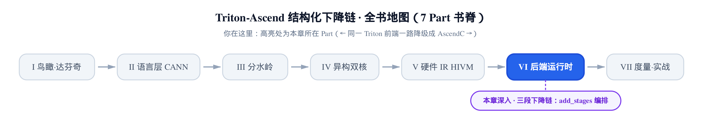
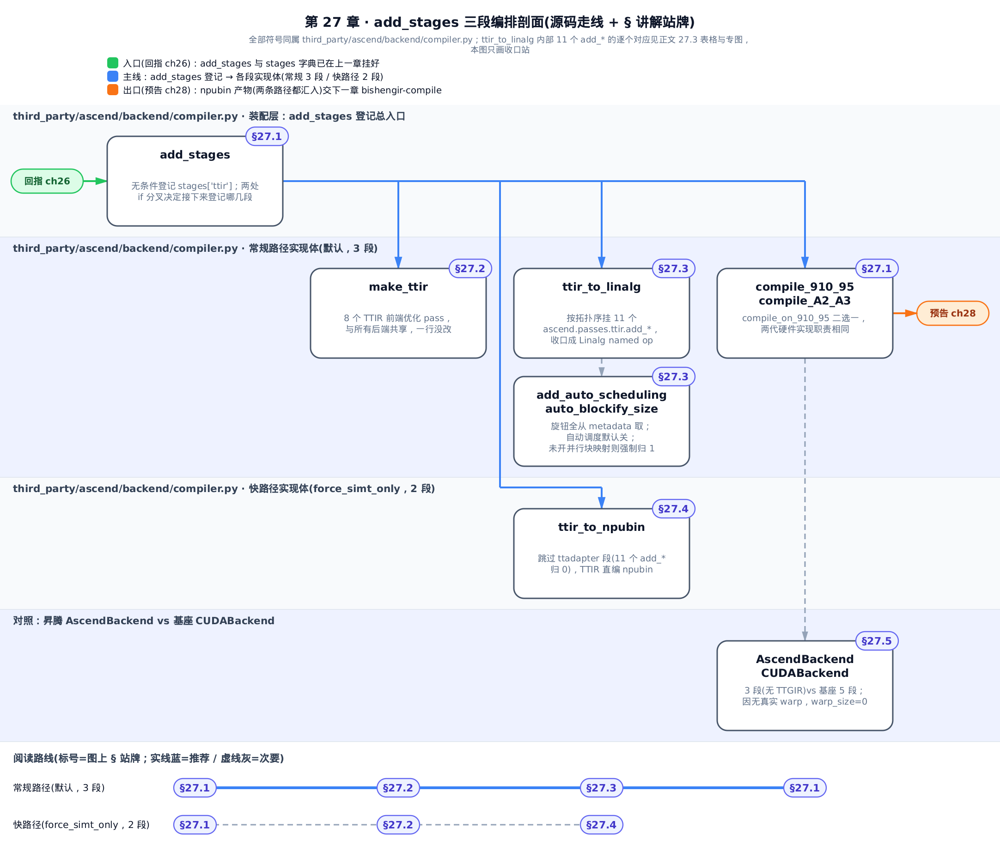
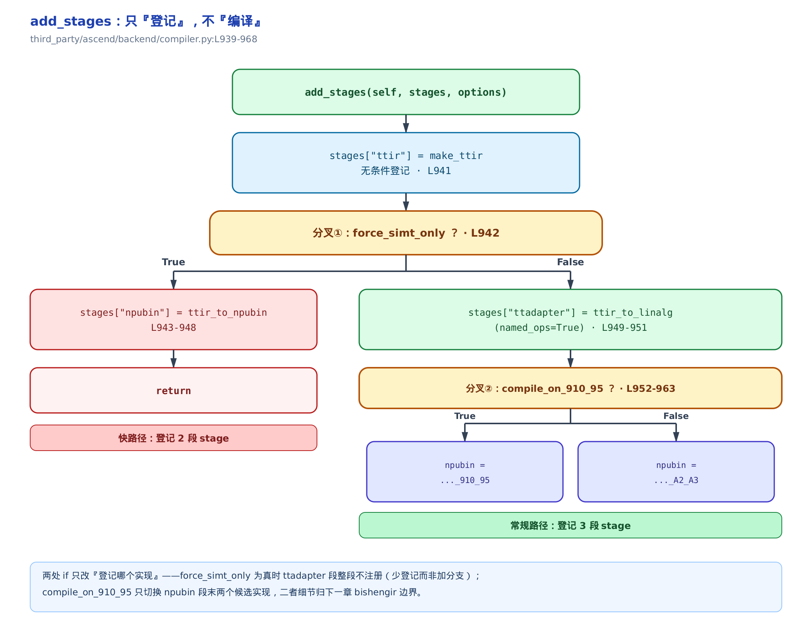
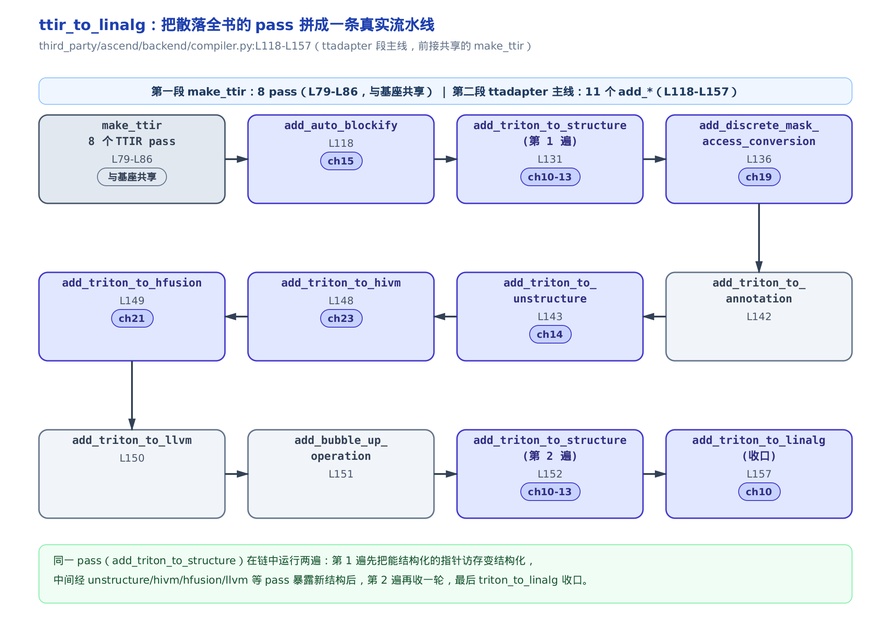
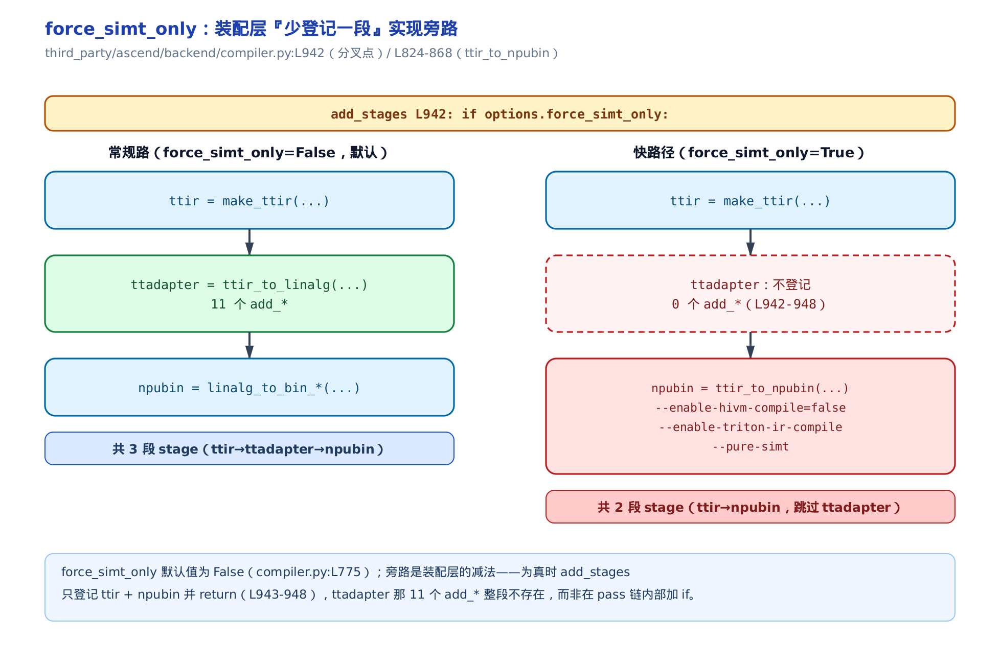
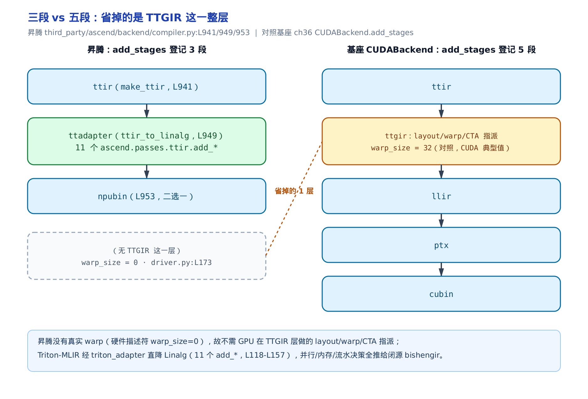

# 第 27 章　三段下降链：add_stages 与 Triton-MLIR→Linalg 的编排



> 上一章把 `AscendBackend` 挂进了 Triton，`stages` 字典也登记好了三段。
> 本章钻进这张登记表：每一段内部到底按什么顺序跑哪些 pass。
> 下一章接手最后一段——把中间产物交给闭源 `bishengir-compile` 出二进制。

前面十几章，我们一直**盯着一块拼图看**：ch10 讲 `triton_to_linalg` 怎么收口成结构化张量，ch15 讲 `auto_blockify` 怎么把网格折成一条循环，ch23 讲 `triton_to_hivm` 怎么把硬件事实写进类型……每一章都在放大看某个 pass（编译器里一趟「读入 IR、原地改写、吐出 IR」的变换）内部怎么工作。

但拼图盒子的**盒盖**——那张告诉你「这些块首尾相接是什么样」的完成图——一直没打开。这一章就是那张完成图。

[上一章](../../ch26-ascend-backend-plugin/narrative/chapter.md) 结尾埋了个引子：`add_stages` 只是把 `ttir→ttadapter→npubin` 三段**登记进** `stages` 字典，至于每段内部怎么把 Triton IR 一步步降下去，留给后续几章。本章正是那个承诺的兑现——我们打开 `ttadapter` 段（`ttir_to_linalg`），看它按真实顺序把散落全书的十来个 `add_*` pass 拼成一条能跑通的流水线；`npubin` 段怎么拼命令行交给 `bishengir-compile`，本章只讲到分叉与边界，完整命令行构造顺延给下一章。

读完本章，你应该能回答一个问题：给定一个 Triton kernel，它从 Python DSL 到昇腾 NPU 二进制，一共过几段、每段谁负责、分叉点在哪几行代码。



只想知道真实流水线常规下怎么走，跟常规路径（§27.1→27.2→27.3→27.1）走一遍就够；想看 `force_simt_only` 到底绕过了什么，直接跳快路径那条虚线（§27.1→27.2→27.4）；不挑读法，按顺序读下来，两条路径会在 §27.5 的对照站汇合，看清昇腾比基座省的到底是哪一层。

## 27.1　登记表：add_stages 只排班、不炒菜

**直觉**。`add_stages` 像餐厅后厨的**排班表**。它自己不炒菜，只把「谁负责哪道工序」写进班表。昇腾这张班表永远只排三个岗：`ttir`（前端优化）→ `ttadapter`（降到 Linalg）→ `npubin`（出二进制）。两个 `if` 开关决定最后一岗谁上、中间那岗要不要排。

**机制**。所谓「登记」，就是往 `stages` 这个字典里，按段名塞进一个可调用体（lambda，一小段延迟执行的代码）。`add_stages` 本身是上游 `BaseBackend` 契约里的一个抽象钩子（`python/triton/backends/compiler.py:L267` 声明，昇腾原位实现），塞进去的一刻什么都还没编译——真正开跑要等上游那条**后端无关**的编译驱动挨个取出这些 lambda 来调。`add_stages` 的全部职责，是**决定往字典里塞哪几个键、每个键绑哪个实现**：

- 无条件塞 `stages["ttir"] = make_ttir`；
- 分叉① `if force_simt_only`：只再塞 `stages["npubin"] = ttir_to_npubin` 然后 `return`——`ttadapter` 那一整段**根本不登记**，退化成两段快路径；
- 否则塞 `stages["ttadapter"] = ttir_to_linalg`；
- 分叉② `if compile_on_910_95`：末段 `npubin` 在两个硬件代际实现间二选一。

数一下就是：常规路径登记 **3** 段，快路径登记 **2** 段。两个 `if` 都只改「登记哪个实现」，谁都没有钻进 pass 链内部去加分支——这是本章第一个要记住的设计取舍。就分叉①而言，这两条路径**互斥且穷尽**——`force_simt_only` 为真时 `ttadapter` 键永不被写入 stages，为假时必被写入，二者没有交集也没有遗漏。



**源码**。把这张排班表的真身贴出来：

```python
# third_party/ascend/backend/compiler.py:L939-L968
def add_stages(self, stages, options):
    if self.target.backend == "npu":
        stages["ttir"] = lambda src, metadata: make_ttir(src, metadata, options)
        if options.force_simt_only:
            stages["npubin"] = (
                lambda src, metadata: ttir_to_npubin(
                    src, metadata, options
                )
            )
            return
        stages["ttadapter"] = lambda src, metadata: ttir_to_linalg(
            src, metadata, options, named_ops=True
        )
        if options.compile_on_910_95:
            stages["npubin"] = (
                lambda src, metadata: linalg_to_bin_enable_npu_compile_910_95(
                    src, metadata, options
                )
            )
        else:
            stages["npubin"] = (
                lambda src, metadata: linalg_to_bin_enable_npu_compile_A2_A3(
                    src, metadata, options
                )
            )
    else:
        # 非 npu target 直接抛错——supports_target 已保证只有 npu 走到这，属防御性代码
        raise NotImplementedError(...)
```

几个值得留意的点。第一，三个 `stages[...]` 赋值就是「三段」的字面来源——`ttir`（L941）、`ttadapter`（L949）、`npubin`（L953 或 L959）。第二，`ttir_to_linalg` 被调用时写死了 `named_ops=True`（L950）——`named_ops`（是否让收口产出具名 Linalg 算子而非泛化的 `linalg.generic`）这个开关，生产路径永远是 `True`，虽然函数签名默认是 `False`。第三，末段的 `compile_on_910_95`（编译目标是否为 910_95 这一代硬件的开关）只是在 `linalg_to_bin_enable_npu_compile_910_95` 与 `..._A2_A3` 两个实现间切换，二者职责相同（把 Linalg 交 `bishengir` 出 `.npubin` 二进制），只是命令行开关有别——细节归下一章。

排班表读完了。接下来把每一岗**推门进去**，看它内部排了哪些 pass。

## 27.2　第一段 make_ttir：与所有后端共享的 8 个前端优化 pass

第一岗最省事，因为它**根本不是昇腾特有的**。

**直觉**。前端优化——内联、化简、删死代码——跟你最后要生成 GPU 指令还是 NPU 指令毫无关系。所以昇腾这一段逐字复用了基座的实现，一行没改。源码里那条注释就是最好的自证。

```python
# third_party/ascend/backend/compiler.py:L73-L93
def make_ttir(mod, metadata, opt):
    if "hash" not in metadata:
        metadata["hash"] = hashlib.sha256(f"{mod}-{metadata}".encode()).hexdigest()
    # the same optimize pass for triton-ir as all other backends
    pm = ir.pass_manager(mod.context)
    pm.enable_debug()
    passes.common.add_inliner(pm)
    passes.ttir.add_combine(pm)
    passes.common.add_canonicalizer(pm)
    passes.ttir.add_reorder_broadcast(pm)
    passes.common.add_cse(pm)
    passes.common.add_licm(pm)
    passes.common.add_symbol_dce(pm)
    passes.ttir.add_loop_unroll(pm)
    pm.run(mod)
    # … 省略：opt.debug 为真时把中间 TTIR dump 到磁盘，不影响主数据流 …
    return mod
```

那句 `# the same optimize pass for triton-ir as all other backends`（与其它所有后端相同的 triton-ir 优化 pass）就是全书主叙事「**同一前端、两条下降链**」里，**共享的那一半**的活证据。

**机制**。`pass_manager`（pass 管理器，一个按登记顺序依次执行 pass 的容器）先 `new` 出来，然后八个 `add_*` 把 pass 一个个挂上去，最后 `pm.run(mod)` 一次性跑完。这八个 pass 都来自 `passes.common` 和 `passes.ttir` 两个命名空间——和基座 GPU 路是同一套，顺序也一样：

1. `add_inliner`——内联函数调用；
2. `add_combine`——TTIR 层的算子组合化简；
3. `add_canonicalizer`——规范化（把等价写法收敛成标准形）；
4. `add_reorder_broadcast`——把广播（broadcast）操作往后挪，暴露更多化简机会；
5. `add_cse`——公共子表达式消除（Common Subexpression Elimination，重复计算只算一次）；
6. `add_licm`——循环不变量外提（Loop-Invariant Code Motion，把循环里不变的计算挪到循环外）；
7. `add_symbol_dce`——符号级死代码消除（Dead Code Elimination，删掉没人用的符号）；
8. `add_loop_unroll`——循环展开。

TTIR（Triton IR，Triton 编译器最前端、硬件无关的中间表示）进来，还是 TTIR 出去——这一段不改变 IR 的**方言**（dialect，MLIR 里一组自定义 op／类型／属性的集合），只做等价优化。它输出的优化后 TTIR，就是下一段 `ttir_to_linalg` 的输入。

分叉一直没发生。**分叉从第二段才开始**。

## 27.3　第二段 ttadapter：把散落全书的 pass 拼成流水线

这是本章的主脊，也是 `ttadapter` 段的实现体 `ttir_to_linalg`。

**直觉**。如果说 ch10–24 每一章都在放大看一块拼图，那 `ttir_to_linalg` 就是拼图盒盖上的**完成图**——它按真实顺序把这些 pass 一块块拼进 `pass_manager`。你第一次会看到：`auto_blockify`、`triton_to_structure`、`hivm`、`hfusion`……原来是这样首尾相接成一条真实流水线的。本章是这条流水线的**边框**，各专章是**拼图块**。



**机制**。先跟一次最普通的编译，把主线上的 pass 一趟数下来。取的配置是默认生产路径：不走快路径（`force_simt_only=False`）、不开激进的自动调度（`add_auto_scheduling=False`，是 `NPUOptions` 的默认值，`compiler.py:L770`）、未开自动并行块映射（于是 `auto_blockify_size` 被强制归 1，`compiler.py:L114-L115`）、`named_ops=True`（`add_stages` 写死）。选这个组合，是为了让主线的 11 个 `add_*` 全部按序执行、没有可选块插进来干扰，读者能顺着数下来。

下面这张表把这一趟走完：每一轮挂哪个 pass（含行号）、它对应全书哪一章、IR 形态怎么变、带什么关键参数。IR 形态一列是**概念性**描述——真实 pass 内部行为见各自专章，本章只讲编排。

<!-- trace: ttadapter-pass-orchestration -->

| 轮次 | add_* pass（行号） | 对应章 | IR 形态：入 → 出（概念） | 关键参数 / 条件 |
|---|---|---|---|---|
| 0（前置） | make_ttir 8 个 TTIR pass（L79-L86） | 与基座共享 | Triton-MLIR → 优化后 Triton-MLIR | inliner→combine→canonicalizer→reorder_broadcast→cse→licm→symbol_dce→loop_unroll |
| 1 | add_auto_blockify（L118） | ch15 | 多网格实例 → blockify 循环 | auto_blockify_size=1（未开自动并行块映射，L114-L115 归 1，不折叠） |
| 2 | add_triton_to_structure（L131，第一遍） | ch10-13 | 指针访存 → 结构化张量访存 | enable_mask_fallback_conversion / optimize_dynamic_offset（是否优化动态偏移计算） |
| 3 | add_discrete_mask_access_conversion（L136） | ch19 | 连续掩码 → 离散掩码访存拆分 | compile_on_910_95 / force_simt_template / enable_sync_block_lock（是否启用同步块锁） |
| 4 | add_triton_to_annotation（L142） | （无专章）结构化轨道标注 | 结构化张量 → 带标注的结构化张量 | 无额外开关 |
| 5 | add_triton_to_unstructure（L143） | ch14 | 结构化装不下的部分 → 非结构化兜底形态 | compile_on_910_95 / force_simt_template |
| 6 | add_triton_to_hivm（L148） | ch23 | → HIVM 达芬奇硬件方言 | 无额外开关 |
| 7 | add_triton_to_hfusion（L149） | ch21 | → HFusion 张量级融合方言 | 无额外开关 |
| 8 | add_triton_to_llvm（L150） | （无专章）标量/控制流下降 | 标量与控制流部分 → LLVM 方言 | 无额外开关 |
| 9 | add_bubble_up_operation（L151） | （无专章）清理/重排 | 操作上抬重排后的 IR | 无额外开关 |
| 10 | add_triton_to_structure（L152，第二遍） | ch10-13 | 新暴露的可结构化模式 → 再结构化一轮 | 与第一遍参数完全相同（L131 vs L152） |
| 11 | add_triton_to_linalg（L157，收口） | ch10 | → Linalg named-op 形态（不再有 triton.* op） | named_ops=True → 产 linalg named op 而非 linalg.generic |

把这条链和对应章号一一对上：`add_auto_blockify` 是 [第 15 章](../../ch15-autoblockify/narrative/chapter.md) 的网格折叠；`add_triton_to_structure` 是 [第 10–13 章](../../ch10-watershed-triton-to-linalg/narrative/chapter.md) 讲的指针→结构化张量那道**分水岭**；`add_discrete_mask_access_conversion` 是 [第 19 章](../../ch19-discrete-mask-interleave/narrative/chapter.md) 的离散掩码拆分；`add_triton_to_unstructure` 是 [第 14 章](../../ch14-unstructure-fallback/narrative/chapter.md) 讲的、结构化装不下时的非结构化兜底；`add_triton_to_hivm` 下降到 [第 23 章](../../ch23-hivm-dialect/narrative/chapter.md) 的 HIVM（华为达芬奇硬件的 MLIR 方言）；`add_triton_to_hfusion` 是 [第 21 章](../../ch21-hfusion-dialect/narrative/chapter.md) 的 HFusion（张量级融合方言）；最后 `add_triton_to_linalg` 收口成 [第 10 章](../../ch10-watershed-triton-to-linalg/narrative/chapter.md) 讲的 Linalg（MLIR 的线性代数方言，以 named op 形态承载高层算子）。整条链上只有 `add_triton_to_annotation`（结构化轨道上的标注）、`add_triton_to_llvm`（标量与控制流部分下降到 LLVM 方言）、`add_bubble_up_operation`（把操作上抬重排的清理 pass）没有独立专章，它们是把前后两块拼图接稳的过渡件。

**不变量：这条链有限、有序、单向收敛。** 先看终止性：pass 链是编译期就写死的固定长度列表（主线 11 项，`compiler.py:L118-L157`），`pm.run` 把列表遍历一次就停，步数上界等于登记的 pass 数，必然有限。再看正确性——**顺序不能任意打乱**，因为存在前置依赖。收口的 `add_triton_to_linalg` 要求输入已经是「结构化 + 已下降到 HIVM／HFusion」的形态，所以它必然排在 `add_triton_to_structure`（把指针变结构化）和 `add_triton_to_hivm`／`hfusion` 之后；同理 `annotation`／`unstructure` 也依赖 `structure` 先跑。这是一条**拓扑序**（topological order，按依赖偏序排的线性化），不是可以随意交换的序列——把 `triton_to_linalg` 提前，它会因为输入里还留着没降的 `triton.*` op 而失败。

那 `add_triton_to_structure` 为什么跑**两遍**（L131 与 L152，参数完全相同）？这不是冗余。第一遍先把当下能结构化的指针访存变成结构化张量；中间经 `unstructure`／`hivm`／`hfusion`／`llvm`／`bubble_up` 几道 pass 折腾之后，可能又**暴露出新的可结构化模式**，第二遍再收一轮，最后才轮到 `triton_to_linalg` 收口。这是 MLIR pass 编排里「同一 pass 多次运行、迭代收敛」的常见手法。

**数一下总量。** 默认路径一次 kernel 编译，共挂 8（`make_ttir`，L79-L86）+ 11（`ttir_to_linalg` 主线，L118-L157）= **19** 个 pass 调用。如果打开自动调度（`add_auto_scheduling=True`），`ttadapter` 段会再插入 7 个 pass（3 个 ascend pass 加 4 个清理 pass，下面 27.3.2 细说），合计 8 + 18 = 26。反过来，若走 `force_simt_only` 快路径，`ttadapter` 段整段不注册，这 11 个 `add_*` 直接**归 0**（27.4 讲）。

**源码**。现在把 `ttir_to_linalg` 的真身贴出来，对着上面的表逐段看：

```python
# third_party/ascend/backend/compiler.py:L96-L171
def ttir_to_linalg(mod, metadata, opt, *, named_ops=False):
    # use triton_adapter to lower Triton-MLIR to linalg
    ttir_code = str(mod)                              # 把 TTIR 转成字符串
    with tempfile.TemporaryDirectory() as tmpdir:
        src_path = os.path.join(tmpdir, "kernel.ttir.mlir")
        Path(src_path).write_text(ttir_code)
        # … 省略：dst_path / triton_adapter_opt_path 两个局部量在本函数体内未再被用到 …

        # ① 从 metadata 取出各 pass 要用的开关（下面只列代表性的三个）
        enable_mask_fallback_conversion = metadata["enable_mask_fallback_conversion"]
        force_simt_template = metadata["force_simt_template"]
        # … 省略：其余 5 个开关字段同样从 metadata 取出 …
        auto_blockify_size = metadata["auto_blockify_size"]
        if not _is_auto_map_parallel_blocks_enabled():
            auto_blockify_size = 1

        pm = ir.pass_manager(mod.context)
        pm.enable_debug()
        # ② 按拓扑序逐个挂 pass
        ascend.passes.ttir.add_auto_blockify(pm, auto_blockify_size)
        if (metadata["add_auto_scheduling"]):
            ascend.passes.ttir.add_dag_sync(pm)
            ascend.passes.ttir.add_dag_scope(pm)
            passes.common.add_cse(pm)
            passes.common.add_canonicalizer(pm)
            ascend.passes.ttir.add_dag_ssbuffer(pm)
            passes.common.add_cse(pm)
            passes.common.add_canonicalizer(pm)

        ascend.passes.ttir.add_triton_to_structure(
            pm, enable_mask_fallback_conversion, optimize_dynamic_offset)
        ascend.passes.ttir.add_discrete_mask_access_conversion(
            pm, compile_on_910_95, force_simt_template, enable_sync_block_lock)
        ascend.passes.ttir.add_triton_to_annotation(pm)
        ascend.passes.ttir.add_triton_to_unstructure(
            pm, compile_on_910_95, force_simt_template)
        ascend.passes.ttir.add_triton_to_hivm(pm)
        ascend.passes.ttir.add_triton_to_hfusion(pm)
        ascend.passes.ttir.add_triton_to_llvm(pm)
        ascend.passes.ttir.add_bubble_up_operation(pm)
        ascend.passes.ttir.add_triton_to_structure(          # 第二遍
            pm, enable_mask_fallback_conversion, optimize_dynamic_offset)
        ascend.passes.ttir.add_triton_to_linalg(
            pm, False, named_ops, enable_nd2nz_on_vector,
            enable_select_analysis, compile_on_910_95)
        pm.run(mod)
        # … 省略：opt.debug 为真时 dump 中间 ttadapter IR …
        return str(mod)
```

整个函数就干三件事：把 TTIR 字符串化（供 pass 库读入）、从 `metadata` 取出开关、在 `pass_manager` 上按序挂 pass 再 `run`。真正的「变换」全在那十来个 `ascend.passes.ttir.add_*` 各自的 C++ 实现里——那些是 ch10–24 的题材，本章只负责讲清**编排**。

### 27.3.1　pass 参数从 metadata 来：编排与旋钮解耦

上面代码里 `# ①` 那一段值得单拎出来。所有开关——`enable_mask_fallback_conversion`（是否启用掩码兜底转换）、`force_simt_template`（是否强制用 SIMT 模板）、`auto_blockify_size` 等等——都不是硬编码在 pass 逻辑里的，而是先从 `metadata`（承载编译选项的字典，源头是上一章讲的 `NPUOptions`）里取出成局部量，再逐个作实参喂给对应的 `add_*`（`compiler.py:L131-L164`）。

这么写是**故意的解耦**：同一条 pass 链，可以被 `compile_on_910_95`、`force_simt_template` 这些开关参数化出不同的具体行为，而 `add_stages` 只管「登记」、`ttir_to_linalg` 只管「按序挂」。旋钮和链条分开——链条固定，旋钮可调。

### 27.3.2　可选的自动调度块：默认关着的激进优化

代码里 `if (metadata["add_auto_scheduling"]):` 那一整块（`compiler.py:L122-L129`），是主线里唯一的**可选段**。它挂的三个 ascend pass——`add_dag_sync` 与 `add_dag_scope`（合称 [第 17 章](../../ch17-scope-sync/narrative/chapter.md) 的 scope 切分与同步）、`add_dag_ssbuffer`（[第 18 章](../../ch18-ssbuffer-pipeline/narrative/chapter.md) 的多缓冲软件流水）——都是比较激进的调度优化。

它默认**关着**（`NPUOptions.add_auto_scheduling` 默认 `False`，`compiler.py:L770`），普通编译根本不进这块。留意块内 `add_dag_scope` 和 `add_dag_ssbuffer` 之间穿插了 `add_cse`／`add_canonicalizer`——这两个正是 27.2 里 `make_ttir` 用过的清理 pass，在这里被复用，作用是在两个重 pass 之间把 IR 收敛干净，免得中间态越滚越乱。

### 27.3.3　auto_blockify_size 的默认归 1

还有个小细节容易漏。`auto_blockify_size` 从 `metadata` 取出后，紧跟一句：

```python
# third_party/ascend/backend/compiler.py:L114-L115
if not _is_auto_map_parallel_blocks_enabled():
    auto_blockify_size = 1
```

`auto_blockify` 的活是把多个网格实例折叠成一条 blockify 循环（[第 15 章](../../ch15-autoblockify/narrative/chapter.md)）。但只有当全局开启了「自动并行块映射」时，折叠才有意义；否则 `auto_blockify_size` 被强制归 1——size=1 就是**不折叠**，保证一个语义安全的默认。这也是我们那趟数 pass 时取的值。

## 27.4　force_simt_only 快路径：装配层的一次减法

现在回到 27.1 埋下的分叉①。

**直觉**。常规路要过一支**装修队**（`ttadapter` 段那十来个 pass 把 IR 降成 Linalg），装修完才交给楼下的**施工队**（`bishengir`）。`force_simt_only`（强制只走 SIMT 纯路的快路径开关）是一条**毛坯直交**的旁路——房子（TTIR）不装修，直接甩给施工队，让它用 SIMT 模式自己搞。分叉就发生在 `add_stages` 的**一行 `if`** 上：为真时，就少登记 `ttadapter` 这一整段。



**机制**。旁路是在装配层做**减法**，而不是在 pass 链里加分支。回看 27.1 的 `add_stages`：`if options.force_simt_only:` 为真时，只登记 `stages["npubin"] = ttir_to_npubin` 然后立刻 `return`（`compiler.py:L942-L948`）——`ttir_to_linalg` 那个键**压根没被写进字典**。于是：

| | 常规路 | 快路径 |
|---|---|---|
| 登记的 stage 数 | 3（ttir→ttadapter→npubin） | 2（ttir→npubin） |
| ttadapter 段的 add_* 数 | 11 | 0 |

`ttadapter` 段的 11 个 `add_*` 从 11 直接归 0。这种「把一整条下降链的取舍收进一个 `if`」的干净劲儿，正是 27.1 强调的设计取舍的第二次兑现：分叉不钻进 pass 链，只改登记。这两条路径**互斥且穷尽**——stages 字典里 ttadapter 键要么被写入（常规路）要么被跳过（快路径），二者必居其一。

**源码**。快路径的末段 `ttir_to_npubin` 长这样（只截开头，够证明分叉即可）：

```python
# third_party/ascend/backend/compiler.py:L824-L874
def ttir_to_npubin(mod, metadata, opt):
    ttir_code = str(mod)
    metadata = _parse_ttir_metadata(ttir_code, metadata)
    with tempfile.TemporaryDirectory() as tmpdir:
        src_path = os.path.join(tmpdir, "kernel.ttir.mlir")
        Path(src_path).write_text(ttir_code)
        # … 省略：准备输出路径 …
        _compile_option_list = get_common_bishengir_compile_options(metadata)
        if opt.force_simt_only:
            _compile_option_list += ["--enable-hivm-compile=false"]
            _compile_option_list += ["--enable-triton-ir-compile"]
            _compile_option_list += ["--pure-simt"]
            _compile_option_list += [f"--num-warps={opt.num_warps}"]
            _compile_option_list += [f"--threads-per-warp={opt.warp_size}"]
            # … 省略：其余 SIMT 子开关与 subprocess 调 bishengir，归下一章 …
```

关键是那三个开关：`--enable-hivm-compile=false`（关掉 HIVM 编译）、`--enable-triton-ir-compile`（直接编译 Triton IR）、`--pure-simt`（纯 SIMT 模式）。它们向 `bishengir` 明确声明：**别走 Linalg 那套，直接拿 TTIR 按 SIMT 编**。SIMT（Single Instruction Multiple Threads，单指令多线程，GPU 那种线程模型）在这里是一条模拟路径，而非昇腾的原生执行模型。

这里要就近**避一个坑**。倒数第二行 `--threads-per-warp={opt.warp_size}` 里的 `opt.warp_size`，是 `NPUOptions` 的字段，值为 32（`compiler.py:L716`）——它只在拼这个 SIMT 选项字符串时用得上，是给模拟 SIMT 用的一个旋钮。它和下一节要讲的、代表「昇腾没有真实 warp」的**硬件描述符** `warp_size=0` 是**两个不同的对象**，别混为一谈。一个是 SIMT 模拟的配置量，一个是硬件事实。

`ttadapter` 段整段不登记，`bishengir` 命令行怎么拼、子进程怎么调——这些是下一章（闭源边界那一章）的核心材料，本章到此为止。

## 27.5　三段 vs 五段：昇腾省掉的是 TTGIR 整整一层

最后退远一步，把昇腾这三段和基座 GPU 路的五段并排看。这也是本章对位 [基座《Triton 源码解读》里 CUDABackend 那一章](../../ch26-ascend-backend-plugin/narrative/chapter.md#写给读过基座书的你) 的地方——同一份 `BaseBackend` 契约，两个平级的兄弟后端，`add_stages` 各登记各的段数。

**直觉**。同一个 Triton kernel，GPU 后端要过**五道关**（`ttir→ttgir→llir→ptx→cubin`），昇腾只过**三道**（`ttir→ttadapter→npubin`）。少的正是 TTGIR 那一道。



**机制**。GPU 为什么需要 TTGIR（TritonGPU IR，比 TTIR 更靠近 GPU 硬件的中间表示）这一层？因为它要在这层**显式**地为线程模型分派 layout（数据在寄存器／共享内存里的排布）、warp（GPU 里 32 个协同执行的线程）和 CTA（Cooperative Thread Array，一个线程块）。这些决策是喂给 SIMT 硬件必须做的功课。

昇腾**没有真实的 warp**——它的硬件描述符里 `warp_size = 0`（`third_party/ascend/backend/driver.py:L173`），用 `mix_mode`（aiv／aic／mix，向量核／立方核／混合的执行模式）加达芬奇 AI Core 取代了 warp 概念。既然没有 warp，GPU 在 TTGIR 层做的那套 layout／warp／CTA 指派就用不上，于是这一层被整个省掉：Triton-MLIR 经 `triton_adapter` 直降 Linalg（就是 27.3 那 11 个 `add_*`）。对照一下，GPU 的 warp 典型是 32 个线程——同样是 32 这个数，含义和昇腾 `NPUOptions.warp_size=32` 完全不同，一个是真实硬件的线程分组，一个只是 SIMT 模拟的旋钮。

| | 昇腾 AscendBackend | 基座 CUDABackend |
|---|---|---|
| add_stages 登记的段数 | 3 | 5 |
| 下降链 | ttir → ttadapter → npubin | ttir → ttgir → llir → ptx → cubin |
| 硬件描述符 warp_size | 0（无真实 warp） | 32（真实线程分组） |
| layout/warp/CTA 指派 | 无（省掉 TTGIR 层） | 在 ttgir 层显式做 |

**但段少绝不等于简单。** 这是本章最想留给你的一句话。GPU 把并行、内存、流水的决策**显式**摊在 TTGIR 那层的 pass 里，你能一趟趟读出来；昇腾把这些决策**推进了闭源的 `bishengir` 内部**。复杂度没有消失，只是从「前端可见的 pass」转移到了「闭源二进制内部」。三段比五段短，是因为一大块工作沉到了水面以下——而不是因为昇腾的活儿更少。

## 27.6　小结：一份排班表，两段可读，一道闭源边界

回头看这一整章，一个 Triton kernel 从 Python DSL 到昇腾 `.npubin`，走的是一条清清楚楚的三段链：

1. **登记**——`add_stages` 只排班不炒菜：无条件登记 `ttir`，两个 `if` 决定登记 `ttadapter`＋`npubin`（常规 3 段）还是只登记 `npubin`（`force_simt_only` 快路 2 段）。分叉靠「换登记 / 少登记一段」，不钻进 pass 链。
2. **第一段 ttir**——`make_ttir` 的 8 个前端优化 pass 与所有后端**共享**，一行没改；分叉从第二段才起。
3. **第二段 ttadapter**——`ttir_to_linalg` 按拓扑序挂 11 个 `ascend.passes.ttir.add_*`：`auto_blockify`（ch15）→ `structure`（ch10-13）→ `discrete_mask`（ch19）→ `annotation` → `unstructure`（ch14）→ `hivm`（ch23）→ `hfusion`（ch21）→ `llvm` → `bubble_up` → `structure` 第二遍 → `triton_to_linalg` 收口（ch10）。默认一趟 8+11=19 个 pass。
4. **第三段 npubin**——把 `ttadapter` 的产物交 `bishengir` 出二进制；`compile_on_910_95` 决定挂哪个实现（`third_party/ascend/backend/compiler.py:L952-L963`）。

散落全书十几章的 pass，在这一章被这条真实流水线**拼成了一整幅完成图**。每一块拼图的内部你早已在专章看过，本章给的是把它们串起来的**边框**：顺序、开关、分叉点各在哪几行代码。

还差最后一段没打开。第三段 `npubin` 怎么把 Linalg 产物拼成 `bishengir-compile` 的命令行、子进程怎么调、`compile_on_910_95` 那两个候选实现到底差在哪——那是本部分下一章的题材，也是我们第一次真正撞上华为闭源工具链的**边界**。三段链的前两段都是开源可读的 MLIR pass，最后一段起，路就通向水面以下了。
