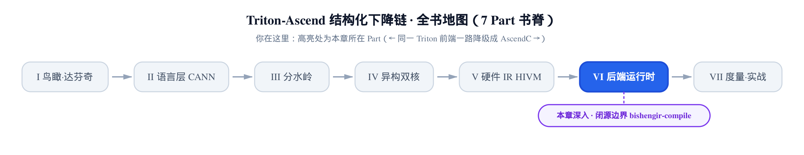
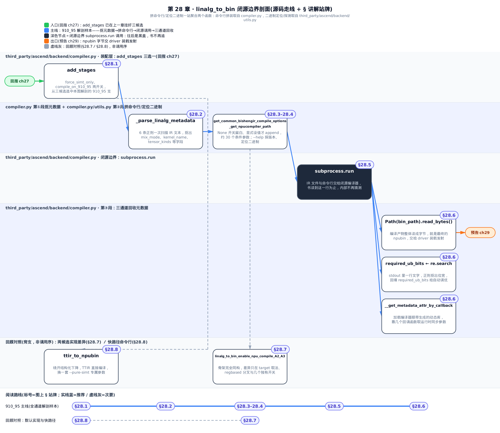
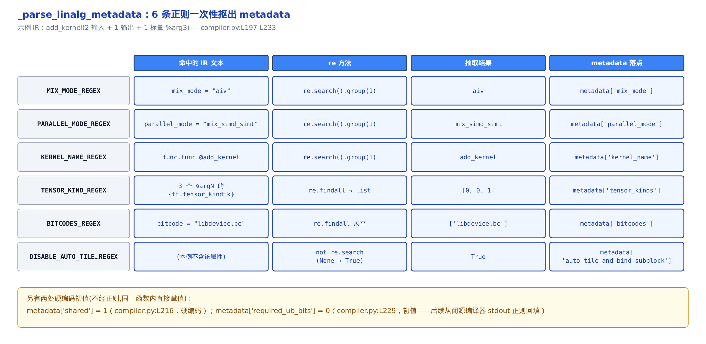
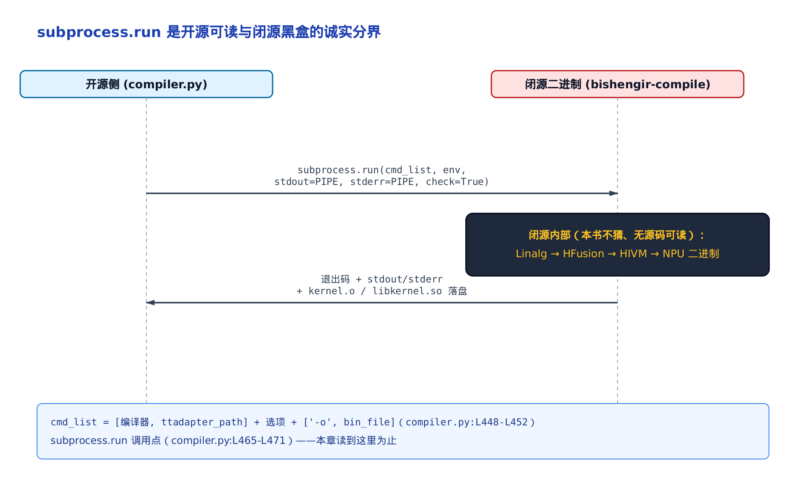
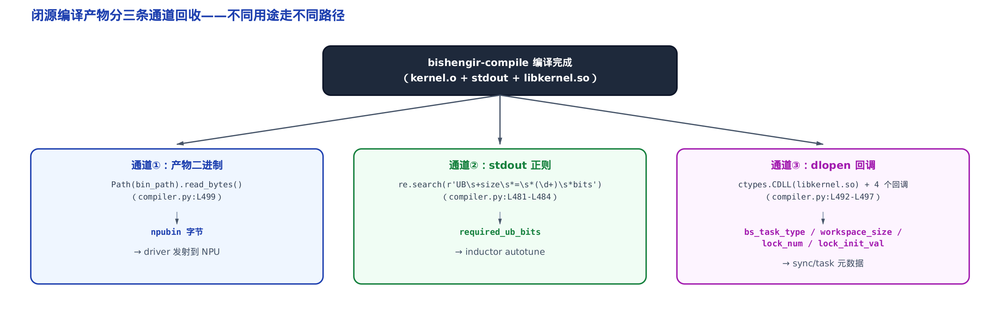
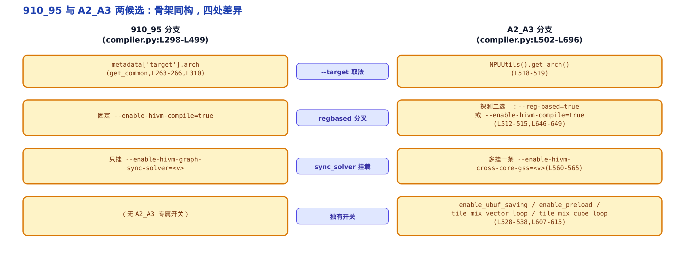

# 第 28 章　闭源边界 bishengir-compile：编译选项、子进程调用与元数据回收



> 上一章打开三段下降链，看清 `ttadapter` 段把 IR 降成结构化 Linalg。
> 本章走最后一跳：把 Linalg 交给闭源的 `bishengir-compile` 编出 NPU 二进制。
> 再往后就离开编译期，看运行时怎么把这块二进制发射到核上跑起来。

**姊妹篇约定**。这本书全程对照基座《Triton 源码解读》（读上游 Triton v3.2.0）。本章对位基座里[讲 `ptxas` 把 PTX 编成 cubin、再发射 kernel 的那一章](../../../../triton/artifacts/ch37-ptx-cubin-launch/narrative/chapter.md)——那里 NVIDIA 的编译末段也是一个闭源二进制 `ptxas`（NVIDIA 的 PTX 汇编器，把 PTX 文本编成 GPU 机器码 cubin），Triton 同样只能拼命令行、`subprocess` 喂进去、把 cubin 读回来。昇腾这一站换成华为的 `bishengir-compile`（毕昇编译器的命令行驱动，把 Linalg 编成 NPU 二进制），套路惊人地像：都是一道**开源可读到此为止、闭源黑箱从此接手**的诚实分界。本章讲的就是昇腾侧这道边界前后，开源代码到底做了什么、又停在了哪一行。

[上一章](../../ch27-add-stages-orchestration/narrative/chapter.md)结尾埋了个引子：第三段 `npubin`（三段下降链的终点段，产出 `.npubin` 二进制）怎么把 Linalg 产物拼成 `bishengir-compile` 的命令行、子进程怎么调、`compile_on_910_95` 那两个候选实现到底差在哪——那一章只讲到了分叉点，把闭源边界的完整细节留给了这里。本章正是这份承诺的兑现，一次把三件事讲透：

- **第①段**：从 Linalg IR 的文本表示里，用一组正则把运行时要用的元数据「抠」出来；
- **第②段**：按元数据里十几个开关，拼出几十个命令行参数，`subprocess.run` 喂给 `bishengir-compile`——边界精确停在这一行；
- **第③段**：编译产物从二进制、`stdout`、`dlopen` 回调三条通道回收运行时要用的元数据。

只想抓住这本书为什么在这里「读到子进程调用点为止」，直接跳 §28.5 那道边界；想跟全程，按序读。



图里深色的 `subprocess.run` 节点就是那道边界——图上只走一条主线（910_95），A2_A3 和 `force_simt_only` 两条虚线旁支是对照读法，不算在主线时序里。只想看边界本身，盯住图中 §28.5 那一格；想看完整脉络，跟着图上的箭头顺序读正文即可。

## 28.1　从上一章的分叉点接过：三个候选实现

**直觉**。上一章的 `add_stages`（后端注册各编译段的钩子）像一张排班表，它给第三段 `npubin` 登记的实现，不是写死的一个，而是**三选一**。挑哪个，由两个布尔开关拍板：`force_simt_only`（强制只走 SIMT 模板的快路径开关）和 `compile_on_910_95`（是否运行在 910_95 芯片上的开关）。

**机制**。把上一章那段登记代码再贴一次，这回只盯着它挑的是哪个 `npubin` 实现：

```python
# third_party/ascend/backend/compiler.py:L939-L963
def add_stages(self, stages, options):
    if self.target.backend == "npu":
        stages["ttir"] = lambda src, metadata: make_ttir(src, metadata, options)
        if options.force_simt_only:
            stages["npubin"] = (
                lambda src, metadata: ttir_to_npubin(
                    src, metadata, options
                )
            )
            return
        stages["ttadapter"] = lambda src, metadata: ttir_to_linalg(
            src, metadata, options, named_ops=True
        )
        if options.compile_on_910_95:
            stages["npubin"] = (
                lambda src, metadata: linalg_to_bin_enable_npu_compile_910_95(
                    src, metadata, options
                )
            )
        else:
            stages["npubin"] = (
                lambda src, metadata: linalg_to_bin_enable_npu_compile_A2_A3(
                    src, metadata, options
                )
            )
```

三个候选，一目了然：

1. `ttir_to_npubin`——`force_simt_only` 为真时的快路径，绕过 Linalg 直编 TTIR（Triton 的第一层 MLIR 中间表示），§28.8 收尾讲它；
2. `linalg_to_bin_enable_npu_compile_910_95`——`compile_on_910_95` 为真时走，服务 910_95 这代芯片；
3. `linalg_to_bin_enable_npu_compile_A2_A3`——默认实现，服务 A2／A3 系列芯片。

后两个是本章主线，它们**骨架完全同构**：抠元数据 → 拼命令行 → `subprocess` 调 `bishengir-compile` → 三通道回收。差异只集中在几处，正是上一章埋的那个问题——「两个候选到底差在哪」，§28.7 会逐条回收。为把机制讲清，本章正文以 `linalg_to_bin_enable_npu_compile_910_95` 为解剖样本（它的开关拼装最完整、源码最集中）；但要记住：`compile_on_910_95` 默认为假，**真正跑在多数机器上的默认实现是 A2_A3 那一支**，两者结构一致，读懂一个就读懂另一个。

## 28.2　第①段：从 Linalg IR 文本正则抠元数据

**直觉**。闭源编译器不吃 Python 对象，它只认「命令行 + 一个 IR 文件」。而 `ttadapter` 段交出来的 Linalg IR，本身就是一大段文本。运行时要用的那些信息——「这个 kernel 叫啥、用哪拨核、每个参数是入还是出」——早已作为属性写在这段文本里。与其去绑 MLIR 的 C++ API，不如把 IR 当成普通字符串，用几条正则各圈一处关键词，像拿记号笔在打印稿上划重点。这就是 `_parse_linalg_metadata`（从 Linalg 文本抽元数据的函数）干的活。

**机制**。它准备了 6 条正则，各管一处。拿一段典型的 `add_kernel`（两个输入张量、一个输出张量、外加一个标量 `%arg3`）的 IR 喂进去，看每条正则抠出什么、落进 `metadata`（贯穿编译全程、收集内核信息的字典）的哪个字段：

<!-- trace: regex-metadata-extraction -->

| 正则（compiler.py:L197-L212） | 命中的 IR 文本 | `re` 方法 | 抽取结果 | metadata 落点 |
|---|---|---|---|---|
| `MIX_MODE_REGEX` | `mix_mode = "aiv"` | `re.search().group(1)` | `aiv` | `metadata['mix_mode']` |
| `PARALLEL_MODE_REGEX` | `parallel_mode = "mix_simd_simt"` | `re.search().group(1)` | `mix_simd_simt` | `metadata['parallel_mode']` |
| `KERNEL_NAME_REGEX` | `func.func @add_kernel` | `re.search().group(1)` | `add_kernel` | `metadata['kernel_name']` |
| `TENSOR_KIND_REGEX` | 3 个 `%argN` 的 `{tt.tensor_kind=k}` | `re.findall` → list | `[0, 0, 1]` | `metadata['tensor_kinds']` |
| `BITCODES_REGEX` | `bitcode = "libdevice.bc"` | `re.findall`（后续展平） | `['libdevice.bc']` | `metadata['bitcodes']` |
| `DISABLE_AUTO_TILE…REGEX` | （本例不含该属性） | `not re.search`（None → True） | `True` | `metadata['auto_tile_and_bind_subblock']` |

读表要点：`mix_mode`（内核用哪拨核的三态标记，`aic`=只用 cube 立方核、`aiv`=只用 vector 向量核、`mix`=两者都用，[第 2 章](../../ch02-davinci-npu-hardware-model/narrative/chapter.md)建立）、`parallel_mode`、`kernel_name` 三个字段各用一次 `re.search`——只取**首处命中**；`tensor_kinds`（每个参数是入还是出的方向标签列表）和 `bitcodes`（要链进来的 bitcode 库路径，`bitcode` 即 LLVM 位码文件）用 `re.findall` **收集成列表**。另有两个字段不走正则、在同一函数里直接硬编码初值：`metadata['shared'] = 1`（compiler.py:L216，NPU 后端不限共享内存，占位）和 `metadata['required_ub_bits'] = 0`（compiler.py:L229，初值，稍后从编译器 `stdout` 回填，§28.6 见分晓）。



**不变量**。这一步是**纯函数**：同一段 IR 文本恒映射到同一份 `metadata`。为什么？6 条正则各对一段固定的、有限长的字符串跑一次扫描，无状态、无循环依赖、单遍走完就终止，因此可重放。`re.findall` 的返回顺序就是扫描顺序，而参数在 Linalg 文本里按 `%arg0`、`%arg1`…… 递增排列，所以 `tensor_kinds[i]` 恒对应第 `i` 个带 `tt.tensor_kind` 属性的参数——不重不漏。本例：6 条正则、IR 文本约 400 字符、每条一次线性扫描，产出 7 个正则字段外加 2 个硬编码初值；`tensor_kinds` 长度为 3，标量 `%arg3` 不计入（下面马上解释为什么）。

**源码**。把这段抽取的真身贴出来，先是 6 条正则的定义，再是逐字段赋值：

```python
# third_party/ascend/backend/compiler.py:L197-L233
    DISABLE_AUTO_TILE_AND_BIND_SUBBLOCK_REGEX = r'hivm.disable_auto_tile_and_bind_subblock'

    # Example: mix_mode = "aiv" -> aiv
    MIX_MODE_REGEX = r'mix_mode\s*=\s*"([^"]+)"'

    # Example: parallel_mode = "mix_simd_simt" -> mix_simd_simt
    PARALLEL_MODE_REGEX = r'parallel_mode\s*=\s*"([^"]+)"'

    # Example: func.func @gather_sorted_kernel(%arg0: ...) -> gather_sorted_kernel
    KERNEL_NAME_REGEX = r"func\.func\s+@(\w+)"

    # Example: %arg1: memref<?xf32> {tt.divisibility = 16 : i32, tt.tensor_kind = 0 : i32} -> ('1', '0')
    TENSOR_KIND_REGEX = r'%arg(\d+):[^,)]*?\{[^}]*?tt\.tensor_kind\s*=\s*([^:\s}]+)\s*:[^}]*?\}'

    # Example: bitcode = "a.bc"
    BITCODES_REGEX = r'bitcode\s*=\s*(?:"([^"]+)"|\'([^\']+)\'|(\w+))'

    metadata["shared"] = 1
    # Force disable auto tile and bind subblock if attribute is present in module
    metadata["auto_tile_and_bind_subblock"] = not re.search(DISABLE_AUTO_TILE_AND_BIND_SUBBLOCK_REGEX, linalg)
    # the mix mode is also encoded into metadata['name'] for runtime to distinguish
    metadata["mix_mode"] = re.search(MIX_MODE_REGEX, linalg).group(1)
    metadata["parallel_mode"] = re.search(PARALLEL_MODE_REGEX, linalg).group(1)
    metadata["kernel_name"] = re.search(KERNEL_NAME_REGEX, linalg).group(1)
    metadata["name"] = metadata["kernel_name"] + "_" + metadata["mix_mode"]
    # Parse all tensor kinds from arguments
    metadata["tensor_kinds"] = [int(kind) for _, kind in re.findall(TENSOR_KIND_REGEX, linalg)]
    # init the ub bits of triton kernel for inductor autotune using
    metadata["required_ub_bits"] = 0

    # Parse all bitcode paths
    bitcodes = re.findall(BITCODES_REGEX, linalg)
    metadata["bitcodes"] = [val for group in bitcodes for val in group if val]
```

有两个细节值得盯一眼。`auto_tile_and_bind_subblock` 这行用的是 **`not re.search`**——IR 里若**没有** `hivm.disable_...` 这个属性，`re.search` 返回 `None`，取 `not` 得 `True`（表「允许自动切块并绑子块」）；反过来 IR 里显式禁用了，才得 `False`。这是一处「缺省即开启」的默认语义。`bitcodes` 那行的双层列表推导 `[val for group in bitcodes for val in group if val]`，是因为 `BITCODES_REGEX` 用了三选一分组（双引号／单引号／裸词），`findall` 返回的每条是三元组、其中两个是空串，展平时用 `if val` 把空串滤掉，只留真正命中的那一个。

### 拆解最难的一条：TENSOR_KIND_REGEX

**直觉**。6 条正则里 `TENSOR_KIND_REGEX` 最难，因为它要一次抓两样东西：**是第几个参数**（`%argN` 的 `N`）和**它的方向标签**（`0`=入／`1`=出），还得在一段挤满属性的花括号里精确锁定 `tt.tensor_kind`，不被相邻的 `tt.divisibility`（另一个参数属性，标对齐字节数）干扰。最关键的是：**没贴 `tensor_kind` 标签的参数（比如纯标量）根本不该被圈中**。

**机制**。把上例四个参数逐个过一遍这条正则：

<!-- trace: tensor-kind-regex -->

| 参数 | IR 属性片段 | `group(1)`=idx | `group(2)`=kind | `int(kind)` | 进 tensor_kinds？ |
|---|---|---|---|---|---|
| `%arg0` | `{tt.divisibility=16, tt.tensor_kind=0}` | `0` | `0` | `0` | 是 → `[0]` |
| `%arg1` | `{…, tt.tensor_kind=0}` | `1` | `0` | `0` | 是 → `[0, 0]` |
| `%arg2` | `{…, tt.tensor_kind=1}` | `2` | `1` | `1` | 是 → `[0, 0, 1]` |
| `%arg3` | `i32`（标量，无 `tt.tensor_kind`） | — | — | — | 否（结构不匹配，跳过） |

**不变量**。`findall` 的命中数恒等于**带 `tt.tensor_kind` 属性的 `%argN` 个数**；缺该属性的参数（如标量 `%arg3`）绝不进列表。为什么？正则的核心结构 `%arg(\d+):[^,)]*?\{[^}]*?tt\.tensor_kind\s*=\s*([^:\s}]+)...\}` 强制要求：同一参数段内必须出现 `{...tt.tensor_kind...}` 这个结构才算匹配。标量 `%arg3` 后面是 `i32`、没有这套花括号属性，结构对不上，`findall` 直接跳过。而匹配上的参数，靠 `[^}]*?` 这个**非贪婪限定符**（尽量少吞字符、遇到第一个 `}` 就收手），把匹配牢牢锁在**单个花括号块**内，恰好贡献一个 `(idx, kind)` 对，不会越界吞到相邻参数。`tt.divisibility=16` 虽和 `tt.tensor_kind` 同框，但被 `tt\.tensor_kind` 这个字面锚点精确区分开——正则只认后者。本例 4 个参数，3 个匹配、1 个标量跳过。

### 名字和混算模式怎么粘成一个字符串

**直觉**。`kernel_name` 和 `mix_mode` 都要带到运行时，但运行时拿到的是**一个字符串**。约定很简单：用一个下划线把两者粘起来 `name = kernel_name + '_' + mix_mode`，运行时再从**最右边**切一刀还原。为什么必须从右切？因为 `kernel_name` 内部可能自带下划线（比如 `gather_sorted_kernel`），从左切会把名字本身切碎。

**机制**。看三个例子分别怎么编码、怎么还原：

<!-- trace: kernel-name-mix-mode-encoding -->

| kernel_name | mix_mode | encode → name | `rsplit('_', 1)` | 截断后长度 | 触发 49 截断？ |
|---|---|---|---|---|---|
| `add_kernel` | `aiv` | `add_kernel_aiv` | `('add_kernel', 'aiv')` | 10 | 否 |
| `gather_sorted_kernel` | `mix` | `gather_sorted_kernel_mix` | `('gather_sorted_kernel', 'mix')` | 20 | 否（内部 3 个 `_` 不受影响） |
| 55 字符超长名 | `aic` | `…_aic`（len 59） | `(len 55, 'aic')` | 49 | 是（取后 49） |

**不变量**。`decode(encode(kn, mm))` 还原出的模式段恒等于 `mm`，且 `kn` 内部的下划线不受影响——round-trip（编码后再解码回原值）对任意含内部 `_` 的名字都成立。理由：`encode` 只在末尾追加一个 `'_'+mm`；运行时侧的 `rsplit('_', 1)`（从右切、只切一次）恰好还原这最后一段 `mm`，前缀（含任意内部 `_`）整体保留。本例 `gather_sorted_kernel` 含 3 个内部下划线仍被正确还原，这正是**必须用 `rsplit` 而非 `split`** 的证明。

**源码**。编码这一行就在上面那段 L225；还原和长度约束在 `pack_metadata`（打包元数据交给运行时的方法）里：

```python
# third_party/ascend/backend/compiler.py:L905-L917
    def pack_metadata(self, metadata):
        # …（省略函数说明性注释）
        # CANN runtime limits the length of kernel name <= 50.
        # Considering '\n' is appended, thus the real kernel name <= 49.
        KERNEL_NAME_MAX_LEN = 49
        kernel_name_orig, _ = metadata.name.rsplit("_", 1)
        if len(kernel_name_orig) > KERNEL_NAME_MAX_LEN:
            kernel_name = kernel_name_orig[-KERNEL_NAME_MAX_LEN:]
        else:
            kernel_name = kernel_name_orig
```

`KERNEL_NAME_MAX_LEN = 49` 是因为 CANN（Compute Architecture for Neural Networks，昇腾的异构计算软件栈）运行时限内核名不超过 50 字符，末尾要留一位给 `'\n'`，所以有效名长 ≤49；超长就取**后 49 个字符**。这个截断只作用于前缀长度，不破坏上面那个还原不变量——切多长，`mix_mode` 那段照样能从右边精确还原。

## 28.3　第②段：按开关条件拼几十个命令行参数

**直觉**。`bishengir-compile` 有几十个开关，绝大多数默认「不填、由编译器自己决定」。triton 侧的做法很规整：为每个开关准备一行 `if metadata[x] is not None:`，只有上游或用户**显式设了值**，才把对应的 `--enable-xxx=val` 追加进列表，`None` 就整行跳过。像点菜——默认套餐不动，只把你特别指定的加菜写进单子，其余留白交给厨房。

**机制**。这条拼装流水线的地基有两个小函数。一个给出恒加的 `--target=`：

```python
# third_party/ascend/backend/compiler.py:L263-L277
def get_common_bishengir_compile_options(metadata):
    bishengir_target = metadata['target'].arch
    bishengir_target_opt = f"--target={bishengir_target}"
    return [bishengir_target_opt]


def get_auto_bind_sub_block_option(metadata):
    # auto_tile_and_bind_subblock is read from the module.
    # enable_auto_bind_sub_block is set by the user and has a higher priority.
    enable_auto_bind_sub_block = metadata["enable_auto_bind_sub_block"]
    return (
        metadata["auto_tile_and_bind_subblock"]
        if enable_auto_bind_sub_block is None
        else enable_auto_bind_sub_block
    )
```

第二个 `get_auto_bind_sub_block_option` 体现一条优先级规则：**用户开关高于模块属性**。`enable_auto_bind_sub_block`（用户设的开关）非 `None` 时用它；否则才回退到 §28.2 从 IR 模块里读到的 `auto_tile_and_bind_subblock`。用户没表态，就听 IR 的；用户表了态，用户说了算。

有了地基，拼装就是几十个近乎同构的 `if`。拿一段代表性的 `metadata` 走一遍，看每个开关怎么判、落成什么参数：

<!-- trace: cmdline-conditional-assembly -->

| 开关（metadata 键） | 本例取值 | 判定 | 落地参数 |
|---|---|---|---|
| `get_common` → target | `Ascend910B` | 恒加 | `--target=Ascend910B` |
| `multibuffer` | `2` | `is not None` → 加 | `--enable-auto-multi-buffer=2` |
| `disable_tightly_coupled_buffer_reuse` | `False` | 假值 → 跳过 | （无） |
| `enable_auto_bind_sub_block`（用户开关） | `None` | `is None` → 跳过，改用模块值 | （无，取下一行） |
| `auto_tile_and_bind_subblock`（模块读到的值） | `True` | 用户为 `None` → 采用此值 | `--enable-auto-bind-sub-block=True` |
| `sync_solver` | `None` | `is None` → 跳过 | （无） |
| `unit_flag` | `1` | `is not None` → 加 | `--enable-hivm-unit-flag-sync=1` |
| `enable_vf_fusion` | `True` | 真值 → 裸 flag | `--enable-vf-fusion` |
| bitcodes（循环） | `libdevice.bc` | 逐个 → 加 | `--link-aicore-bitcode=libdevice.bc` |

![命令行按 `if metadata[x] is not None` 逐项拼接：None 开关不产生参数，只有显式设值才 append](../diagrams/fig-ch28-cmdline-assembly.png)

**不变量**。最终命令行的选项数，恒等于「值非 `None`（或真值）的开关数 + 固定项」。任何 `None` 开关都不产生参数、互不干扰。理由：每个 `if` 分支彼此独立——命中则恰 `append` 一项、未命中则完全跳过，没有跨开关副作用，所以落地项数单调等于命中开关数。`--target` 与编译器结尾的 `--enable-hfusion-compile=true` 等属于恒加固定项。本例考察 9 个开关，落地 6 个（3 个因 `None`／假值被跳过）；910_95 分支全体约 30 个条件开关（compiler.py:L312-L446）。

值得记住的是这些开关有**三种取值形态**：环境探测出的裸 flag（如 `force_disable_ffts`，`ffts` 即昇腾的任务下发调度机制，探到就加 `--disable-ffts`）、`metadata` 的三态值（`None` 跳过／数值或布尔拼成 `--x=val`）、以及编译器结尾无条件补的固定 flag。

**源码**。把拼装的开头一段贴出来——前四五个开关就能看清套路，其余十几个是同一模式的重复：

```python
# third_party/ascend/backend/compiler.py:L310-L334
        _compile_option_list = get_common_bishengir_compile_options(metadata)

        multibuffer = metadata["multibuffer"]
        if multibuffer is not None:
            _compile_option_list += [
                f"--enable-auto-multi-buffer={multibuffer}",
            ]

        disable_tightly_coupled_buffer_reuse = metadata["disable_tightly_coupled_buffer_reuse"]
        if disable_tightly_coupled_buffer_reuse:
            _compile_option_list += ["--disable-tightly-coupled-buffer-reuse"]

        _compile_option_list += [
            f"--enable-auto-bind-sub-block={get_auto_bind_sub_block_option(metadata)}",
        ]

        if force_disable_ffts():
            _compile_option_list += ["--disable-ffts"]
        if _is_ascend_sanitizer_enabled():
            _compile_option_list += ["--enable-sanitizer=true"]
        if not _is_debug_line_info_disabled():
            _compile_option_list += ["--enable-debug-info=true"]

        if _enable_print_ub_bits():
            _compile_option_list += ["--enable-print-memory-allocated-size"]
        # … 省略：enable_hivm_auto_cv_balance / sync_solver / unit_flag /
        #    inject_barrier_all / … 十几个同构 if metadata[x] is not None 分支 …
```

`multibuffer`（multiBuffer，ping-pong 双缓冲开关，[第 18 章](../../ch18-ssbuffer-pipeline/narrative/chapter.md)建立）走的是「三态值」形态：非 `None` 就拼成 `--enable-auto-multi-buffer={值}`。`force_disable_ffts()` 走「裸 flag」形态：函数返回真就加一个无值的 `--disable-ffts`。中间还夹着 `_is_ascend_sanitizer_enabled()`（是否开昇腾内存检查器）、`_enable_print_ub_bits()`（是否让编译器打印 UB 分配位数）这类环境探测——后者尤其关键，它决定了 §28.6 那条 `stdout` 回收通道有没有东西可抠。

## 28.4　拼命令行之前：定位闭源二进制、探它的能力

命令行拼好只是半成品，还得知道**去哪找 `bishengir-compile`**，以及**它是哪个版本**。这两件准备事各由一个小函数扛。

先看定位。`_get_npucompiler_path` 按 `is_compile_on_910_95`（本章反复出现的全局开关，§28.7 讲它怎么算出来）选目录，再逐级回退：

```python
# third_party/ascend/backend/utils.py:L154-L173
def _get_npucompiler_path() -> str:
    ascend_dir = os.path.dirname(os.path.abspath(__file__))
    env = os.environ.copy()
    if is_compile_on_910_95:
        npu_compiler_path = os.path.join(ascend_dir, "bishengir-a5", "bin", "bishengir-compile")
    else:
        npu_compiler_path = os.path.join(ascend_dir, "bishengir", "bin", "bishengir-compile")
    if os.path.exists(npu_compiler_path):
        npuir_env_path = os.path.dirname(npu_compiler_path)
        env["PATH"] = npuir_env_path + ":" + env["PATH"]
    else:
        npu_compiler_path = shutil.which("bishengir-compile")
        if npu_compiler_path is None:
            npu_compiler_root = os.getenv("TRITON_NPU_COMPILER_PATH", None)
            if npu_compiler_root is None:
                raise EnvironmentError(
                    "Couldn't find executable bishengir-compile or TRITON_NPU_COMPILER_PATH."
                )
            npu_compiler_path = os.path.join(npu_compiler_root, "npuc")
    return npu_compiler_path, env
```

两个细节。一是**910_95 用 `bishengir-a5` 目录、其余用 `bishengir` 目录**——两代芯片配的是不同的编译器二进制。二是找到后，把它所在目录**前插进子进程的 `PATH`**（`env["PATH"]`）——因为 `bishengir-compile` 内部还会调它同目录下的其它工具，得让子进程能找到。返回的 `env` 稍后原样交给 `subprocess.run`。

再看探能力。闭源二进制会**悄悄演进**：老版本产出 `kernel_reloc.o`，新版本改叫 `kernel.o`；有的版本支持 `reg-based`（基于寄存器的编译模式），有的只有 `membased`（基于内存）。开源侧读不到它的版本号，只能跑一次 `--help`、在 `stdout` 里 grep 特性字符串来判断：

```python
# third_party/ascend/backend/utils.py:L198-L221
# grep bishengir-compile's option limit-auto-multi-buffer-buffer to check
# if bishengir-compile is a newer version which does not generate kernel_reloc.o
# any more.
def _check_bishengir_api_change() -> bool:
    bishengir_path, _ = _get_npucompiler_path()
    if not _is_valid_bishengir_path(bishengir_path):
        print(f"ERROR: Invalid bishengir path format: {bishengir_path}")
        return False
    try:
        result = subprocess.run(
            [bishengir_path, "--help"],
            stdout=subprocess.PIPE,
            stderr=subprocess.PIPE,
            text=True,
        )
        if result.returncode == 0 and 'limit-auto-multi-buffer-buffer' in result.stdout:
            # bishengir-compile is newer version
            return True
        else:
            # bishengir-compile is older version
            return False
    except Exception as e:
        print(f"ERROR: {e}")
        return False
```

这就是 §28.2 那个 `linalg_to_bin_910_95` 开头 `if _check_bishengir_api_change(): bin_file_with_ext = "kernel.o" else: "kernel_reloc.o"` 的来历——**产物名是探出来的，不是写死的**。它的姊妹函数 `_check_bishengir_is_regbased`（grep `'reg-based'`）是同一套路，§28.7 会用到。这是一种很务实的设计取舍：把「适配闭源二进制演进」的负担放在**运行时探测**，而不是在开源代码里硬编码版本号——版本号读不到，特性字符串却能问出来。

## 28.5　闭源边界：subprocess.run 停在这一行

**直觉**。前面所有的前戏——抠元数据、拼几十个命令行参数、定位二进制——都是为了这一行 `subprocess.run`。它把 IR 文件和命令行交给闭源的 `bishengir-compile`，然后就是黑盒：Linalg 怎么降到 HFusion（昇腾的融合方言，[第 21 章](../../ch21-hfusion-dialect/narrative/chapter.md)建立）、HIVM（达芬奇硬件 IR 方言，[第 23 章](../../ch23-hivm-dialect/narrative/chapter.md)建立）、再到 NPU 机器码，全在二进制内部，开源侧看不到、也不猜。**这是这本书诚实的分界线——读到子进程调用点为止。**

**机制**。先把命令行的最终形态拼齐，再调用。`cmd_list` 是「编译器路径 + IR 文件 + 一大串选项 + 输出参数」的拼接：

```python
# third_party/ascend/backend/compiler.py:L448-L475
        cmd_list = (
            [npu_compiler_path, ttadapter_path]
            + _compile_option_list
            + ["-o", bin_file]
        )
        vf_merge_level = metadata["vf_merge_level"]
        if vf_merge_level is not None:
            cmd_list += [f"--enable-vf-merge-level={vf_merge_level}"]

        hfusion_enable_multiple_consumer_fusion = metadata["hfusion_enable_multiple_consumer_fusion"]
        if hfusion_enable_multiple_consumer_fusion:
            cmd_list += [f"--hfusion-enable-multiple-consumer-fusion={hfusion_enable_multiple_consumer_fusion}"]

        if opt.debug:
            print(f"[DEBUG] cmd_list: {' '.join(cmd_list)}")

        try:
            ret = subprocess.run(
                cmd_list,
                env=env,
                stdout=subprocess.PIPE,
                stderr=subprocess.PIPE,
                check=True
            )
        except subprocess.CalledProcessError as e:
            if opt.debug:
                _save_npuir_debug_output(e.stdout, e.stderr, tmpdir, metadata["hash"])
            raise
```

`ttadapter_path` 是上一步把 Linalg 文本落成的临时文件 `kernel.ttadapter.mlir`；`bin_file` 是编译器该往哪写产物。`env` 就是 §28.4 里注了 `PATH` 的那份。`check=True` 是一处关键选择：编译失败（返回非零）**直接抛 `CalledProcessError`**，不静默吞掉；`debug` 打开时先把 `stdout`／`stderr` 存盘再抛，方便定位。`stdout=PIPE, stderr=PIPE` 则把两股输出都截流回来——`stdout` 稍后要抠 UB 位数，`stderr` 编译失败时要打印。以 §28.3 那个示例的 6 个落地选项为例，`cmd_list` 的骨架 `[npu_compiler_path, ttadapter_path] + 选项 + ["-o", bin_file]` 就是 2 + 6 + 2 = 10 项（若 `vf_merge_level`／`hfusion_enable_multiple_consumer_fusion` 也设了值，会在其后再各追加一项）。

**不变量**。无论走 910_95／A2_A3／`force_simt_only` 哪条分支，闭源边界的调用形态恒同：`subprocess.run(cmd_list, check=True)`——失败恒抛异常、从不静默吞错。三个候选实现拼出的 `cmd_list` 内容各异，但喂进闭源二进制的这一行、以及「非零返回即抛」的失败语义完全一致。



这道边界怎么界定它的复杂度？调用**之前**的一切都可数：命令行参数几个、元数据字段几个、回收通道几条，全是纯 Python，本章逐一点清了。调用**之后**，Linalg → HFusion → HIVM → NPU 二进制 的编译过程是闭源二进制的内部行为——无源码、不做复杂度分析，也不臆测它内部怎么排布指令。对照基座那本书里 `ptxas` 的位置：Triton 同样只能把 PTX 喂进 `ptxas`、把 cubin 读回来，`ptxas` 内部的寄存器分配、指令调度也一样是闭源黑箱。两本书在各自的编译末段，撞上的是同一种边界。

## 28.6　第③段：产物、UB-bits、dlopen 三通道回收

**直觉**。闭源编译器跑完后，运行时要用的信息散落在**三个地方**：主产物（NPU 二进制文件）、编译器打在 `stdout` 里的一行 UB size、以及它顺带生成的一个 `.so` 里的几个导出函数。triton 就分三条路把它们收回来——像收快递：主包裹直接搬走，单据从纸条上抄，贵重件要用钥匙（`dlopen`，运行时动态加载共享库的系统调用）开柜子取。

**机制**。三条通道依次是：

- **通道①（产物二进制）**：`Path(bin_path).read_bytes()`，把编译出的 `kernel.o` 整个读成字节——这就是 `.npubin`，最终交给 driver 发射到核上；
- **通道②（stdout 的 UB size）**：编译器在 `stdout` 里打印一行 `UB size = N bits`（UB 即 Unified Buffer，达芬奇的统一缓冲，[第 5 章](../../ch05-explicit-memory-hierarchy/narrative/chapter.md)建立），triton 用正则抠出 `N` 回填 `metadata['required_ub_bits']`，供 torch inductor（PyTorch 图编译器的一个后端，这里只是 `required_ub_bits` 的下游消费者，不影响本章机制）的 autotune（自动调优器，估算 kernel 片上内存占用）用；
- **通道③（dlopen 回调）**：编译器还可能生成一个 `libkernel.so`，里面几个导出函数一调就返回运行时要用的整数——这些值只能 `dlopen` 加载、`ctypes`（Python 调 C 函数的桥）回调取。



**源码**。先厘清这里三个路径名的关系：上节 `["-o", bin_file]` 里的 `bin_file` 是 `<临时目录>/kernel`（交给编译器的输出前缀，不带后缀）；`bin_path` 是同一临时目录下带后缀的实际产物 `<临时目录>/kernel.o`（或旧版 `kernel_reloc.o`，后缀由 §28.4 探出），也就是编译器真正写出、这里要读回的那个文件；`callback_path` 则是同一临时目录下的 `<临时目录>/libkernel.so`——三者都在函数开头、拼命令行之前就近算好，同处一个临时目录。三条通道就在 `subprocess.run` 之后一气呵成：

```python
# third_party/ascend/backend/compiler.py:L480-L499
        stdout_str = ret.stdout.decode('utf-8') if ret.stdout else ''
        match = re.search(r'UB\s+size\s*=\s*(\d+)\s*bits', stdout_str)
        if match:
            # get the ub bits of triton kernel from bisheng for inductor autotune using
            metadata["required_ub_bits"] = int(match.group(1))

        if not Path(bin_path).exists():
            error_msg = ret.stderr.decode('utf-8') if ret.stderr else ''
            print(f"[DEBUG] {bin_path} is not found")
            print(f"[DEBUG] Stderr:\n{error_msg}")
            raise subprocess.CalledProcessError(ret.returncode, cmd_list, ret.stdout, ret.stderr)

        if Path(callback_path).is_file():
            lib = ctypes.CDLL(callback_path)
            __get_metadata_attr_by_callback(lib, "_infer_task_type_function", metadata, "bs_task_type")
            __get_metadata_attr_by_callback(lib, "_infer_workspace_shape_function", metadata, "workspace_size")
            __get_metadata_attr_by_callback(lib, "_infer_sync_block_lock_num_function", metadata, "lock_num")
            __get_metadata_attr_by_callback(lib, "_infer_sync_block_lock_init_function", metadata, "lock_init_val")

        return Path(bin_path).read_bytes()
```

通道②的正则 `r'UB\s+size\s*=\s*(\d+)\s*bits'` 只在 `_enable_print_ub_bits()`（§28.3 那个环境探测）打开、编译器真打印了那行时才命中；没命中就沿用 §28.2 的初值 `0`。中间那段 `if not Path(bin_path).exists()` 是道保险：产物没生成就把 `stderr` 打出来、抛错，绝不返回一个空壳。

**不变量**。`bin_path` 的存在性与异常抛出互斥——产物不存在则恒抛 `CalledProcessError`、绝不返回空壳；而 `libkernel.so`（即 `callback_path`）缺失则优雅跳过、不构成失败条件。换言之，主产物是硬约束、`dlopen` 回调是可选增量，两者对失败语义的贡献截然不同。

**通道③的细节**：`libkernel.so` 存在时，`ctypes.CDLL` 加载它，再对 4 个字段各调一次回调 helper `__get_metadata_attr_by_callback`：

```python
# third_party/ascend/backend/compiler.py:L174-L180
def __get_metadata_attr_by_callback(lib, postfix: str, metadata, meta_key: str):
    func_symbol = metadata["kernel_name"] + postfix
    if hasattr(lib, func_symbol):
        callback_func = getattr(lib, func_symbol)
        callback_func.restype = ctypes.c_int64
        callback_func.argtypes = []
        metadata[meta_key] = callback_func()
```

它按 `kernel_name + postfix` 拼出导出符号名（比如 `add_kernel` + `_infer_task_type_function`），`hasattr` 确认符号在、才设好 ctypes 签名（返回 `int64`、无参）调用，把返回值回填。取回的 4 个字段——`bs_task_type`（任务类型）、`workspace_size`（工作区大小）、`lock_num`（同步锁数量）、`lock_init_val`（锁初值）——都是运行时发射内核时要用的同步／任务参数。它们藏在闭源生成的 `.so` 导出函数里，开源侧只能这样一个个「问」出来。

三条通道对应三种用途，泾渭分明：npubin 字节给 driver 发射、`required_ub_bits` 给 inductor autotune、4 个同步字段给运行时发射。信息在哪、就从哪取——这是这一段的设计取舍。

## 28.7　两候选到底差在哪：910_95 vs A2_A3

**直觉**。前面为把机制讲透，一直拿 `linalg_to_bin_enable_npu_compile_910_95` 当样本。现在回收上一章埋的那个问题：它和默认实现 `..._A2_A3` 到底差在哪？答案是——**骨架完全同构**（抠元数据 → 拼开关 → subprocess → 三通道回收，一模一样），差异只集中在几处。由 `is_compile_on_910_95` 在 `add_stages` 时二选一——这里得把两个名字打通：§28.1 的 `add_stages` 源码里做判断的是 `options.compile_on_910_95`（`NPUOptions`，即昇腾后端的编译选项配置类的一个字段），而它的默认值 `compile_on_910_95: bool = is_compile_on_910_95` 就取自这个导入期全局常量。换句话说，`add_stages` 里读到的 `options.compile_on_910_95`，在无人覆盖时本质就是 `is_compile_on_910_95`。

**机制**。四处差异，逐条摆开：



1. **`--target` 怎么取**：910_95 走 `get_common_bishengir_compile_options`，取 `metadata['target'].arch`；A2_A3 直接 `NPUUtils().get_arch()`。
2. **regbased 分叉**：910_95 固定用 `--enable-hivm-compile=true`；A2_A3 多一步——用 §28.4 的 `_check_bishengir_is_regbased()` 探一下，二选一 `--reg-based=true`（新版）或 `--enable-hivm-compile=true`（旧版）。
3. **`sync_solver` 挂几条**：910_95 只挂 `--enable-hivm-graph-sync-solver=<v>`；A2_A3 同一个值**多挂一条** `--enable-hivm-cross-core-gss=<v>`（跨核图同步求解）。
4. **独有开关**：A2_A3 还有一批 910_95 没有的开关，如 `enable_ubuf_saving`（UB 节省）、`enable_preload`（预加载）、`tile_mix_vector_loop`／`tile_mix_cube_loop`（混算时给 vector／cube 核各切 tile）。

**源码**。把 A2_A3 相对 910_95 多出来的那两处切片贴出来。先是开头的 regbased 探测：

```python
# third_party/ascend/backend/compiler.py:L508-L520
        if _check_bishengir_api_change():
            bin_file_with_ext = "kernel.o"
        else:
            bin_file_with_ext = "kernel_reloc.o"
        if _check_bishengir_is_regbased():
            bishengir_hivm_opt = "--reg-based=true"
        else:
            bishengir_hivm_opt = "--enable-hivm-compile=true"
        bin_path = os.path.join(tmpdir, bin_file_with_ext)
        callback_path = os.path.join(tmpdir, "libkernel.so")
        _compile_option_list = [
            f"--target={NPUUtils().get_arch()}",
        ]
```

再是 `sync_solver` 那处多挂一条的差异：

```python
# third_party/ascend/backend/compiler.py:L560-L565
        sync_solver = metadata["sync_solver"]
        if sync_solver is not None:
            _compile_option_list += [
                f"--enable-hivm-graph-sync-solver={sync_solver}",
                f"--enable-hivm-cross-core-gss={sync_solver}",
            ]
```

对照 §28.3 里 910_95 的 `sync_solver` 只 `append` 一项，这里同一个 `if` 里塞了两项——这就是「A2_A3 多挂一条 cross-core-gss」的实锤。

**不变量**。两份实现对同一份合法 `metadata`，恒产出结构同构的命令行——四段骨架（抠元数据、拼开关、subprocess、三通道回收）逐一对应，差异恒限定在本节枚举的四处（`--target` 取法、regbased 分叉、`sync_solver` 挂几条、A2_A3 独有开关），不外溢到其它开关。

**这两支为什么不合并成一份带 `if` 的实现？** 因为两代硬件的开关集差异够大（A2_A3 独有一批、regbased 还要探、`--target` 取法不同、用的还是不同的二进制目录 `bishengir` vs `bishengir-a5`），拆成两个骨架同构的函数，比一份满是分支的更好读。这是一处「重复换清晰」的取舍。

那 `is_compile_on_910_95` 这个决定命运的开关本身怎么来的？它是**导入期**就算好的模块常量，探物理设备定音：

```python
# python/triton/tools/get_ascend_devices.py:L52-L55
ascend_devices = get_ascend_devices()
pci_condition = any("0xd806" in dev for dev in ascend_devices)
npu_smi_condition = check_npu_smi_device()
is_compile_on_910_95 = pci_condition or npu_smi_condition
```

两条证据任一命中就判「在 910_95 上」：PCI 设备号里有 `0xd806`，或者 `npu-smi info`（昇腾的设备信息命令）报出 910_95 相关型号。算出来这一个布尔，就同时定了三件事：`add_stages` 挑哪个 `linalg_to_bin` 实现、`_get_npucompiler_path` 找哪个二进制目录、以及一批开关的默认取值。一处探测，全局分叉。

## 28.8　补上一章的坑：force_simt_only 快路径的命令行

上一章讲了 `force_simt_only` 快路径「存在」——它绕过 `ttadapter` 段、TTIR 直编，但没展开它的命令行。这里补齐。

**机制**。快路径 `ttir_to_npubin` 的骨架和主线一样（抠元数据 → 拼命令行 → subprocess → read_bytes），只是元数据用简化版 `_parse_ttir_metadata`（从 TTIR 而非 Linalg 抠，`mix_mode` 硬编码为 `aiv`，因为 TTIR 输入只支持 vector kernel），命令行则换成一组 SIMT 专属参数：

```python
# third_party/ascend/backend/compiler.py:L836-L867
        _compile_option_list = get_common_bishengir_compile_options(metadata)
        if opt.force_simt_only:
            _compile_option_list += ["--enable-hivm-compile=false"]
            _compile_option_list += ["--enable-triton-ir-compile"]
            _compile_option_list += ["--pure-simt"]
            _compile_option_list += [f"--num-warps={opt.num_warps}"]
            _compile_option_list += [f"--threads-per-warp={opt.warp_size}"]
            if opt.enable_bishengir_simt_optimization != 000:
                _compile_option_list += [f"--enable-bishengir-simt-optimization={opt.enable_bishengir_simt_optimization}"]
            if opt.simt_stack_limit:
                _compile_option_list += [f"--simt-stack-limit={opt.simt_stack_limit}"]
            if opt.shared_mem_dynamic_size is not None:
                _compile_option_list += [f"--shared-mem-dynamic-size={opt.shared_mem_dynamic_size}"]
            if opt.enable_simt_reorder_instruction:
                _compile_option_list += ["--enable-simt-reorder-instruction=true"]
            if opt.disable_fma:
                _compile_option_list += [f"--disable-fma"]
        # … 省略：libdevice-simt 选项 + _get_npucompiler_path + cmd_list 拼装 …
        npu_compiler_path, env = _get_npucompiler_path()
        cmd_list = (
            [npu_compiler_path, src_path]
            + _compile_option_list
            + ["-o", bin_file]
        )
```

`--pure-simt`、`--num-warps`、`--threads-per-warp` 这些是纯 SIMT（Single Instruction Multiple Threads，单指令多线程，[第 2 章](../../ch02-davinci-npu-hardware-model/narrative/chapter.md)讲过昇腾本身不是 SIMT 架构）场景才有的参数。注意 `--enable-hivm-compile=false`——快路径**主动关掉** HIVM 那套结构化编译，因为纯 SIMT 不需要 Linalg 结构化下降，TTIR 直接交给 `bishengir-compile` 就行。这就是它「快」的来源：省掉了一整段 `ttadapter` 的 pass 链。其余的 `subprocess.run` 与 `read_bytes` 收尾和主线同构，不再重复。

## 28.9　小结：读到子进程调用点为止

回头看这一整章，`npubin` 段从 Linalg 到 NPU 二进制，走的是一条清清楚楚、开源可读的三段路，终点是一道诚实的边界：

1. **第①段 抠元数据**——`_parse_linalg_metadata` 用 6 条正则把 Linalg IR 当文本，抠出 `mix_mode`／`parallel_mode`／`kernel_name`／`tensor_kinds`／`bitcodes` 等字段，硬编码 `shared=1`、`required_ub_bits=0` 两个初值。`TENSOR_KIND_REGEX` 靠非贪婪限定符锁在单个花括号块内，标量参数不匹配即跳过；`name = kernel_name + '_' + mix_mode` 靠 `rsplit` 从右还原，容得下名字内部的下划线。
2. **第②段 拼命令行**——按 `if metadata[x] is not None` 逐项拼接，`None` 留白交给编译器默认，只有显式设值才落地。910_95 分支约 30 个条件开关，本例 9 个里落地 6 个。拼之前先 `_get_npucompiler_path` 定位二进制、`--help` grep 探它的能力与版本，产物名 `kernel.o` vs `kernel_reloc.o` 是探出来的。
3. **闭源边界**——`subprocess.run(cmd_list, check=True)`（`third_party/ascend/backend/compiler.py:L465-L471`）把 IR 文件和命令行喂给 `bishengir-compile`。**书读到这一行为止**：边界之后 Linalg → HFusion → HIVM → NPU 二进制 的过程在闭源二进制内部，不猜、无源码可读。这正对位基座 `ptxas` 把 PTX 编成 cubin 的那道同款边界。
4. **第③段 三通道回收**——`read_bytes` 拿 npubin 字节给 driver、`stdout` 正则抠 `required_ub_bits` 给 inductor autotune、`dlopen` + `ctypes` 从 `libkernel.so` 抠 4 个同步／任务字段给运行时。
5. **两候选差异**（回收上一章埋下的两候选之谜）——910_95 与 A2_A3 骨架同构，差在 `--target` 取法、regbased 分叉、`sync_solver` 挂几条、以及 A2_A3 独有的一批开关；由导入期常量 `is_compile_on_910_95` 一处探测、全局定音。快路径 `ttir_to_npubin` 则关掉 HIVM、TTIR 直编，换一组 SIMT 专属参数。

这一章是整条下降链的收口。从 Python DSL 到昇腾 `.npubin`，开源侧能读的每一步——前端优化、结构化下降、命令行拼装——到此全部走完。再往后，二进制已经在手，故事就从「怎么编出来」转向「怎么发射上核跑起来」了。
