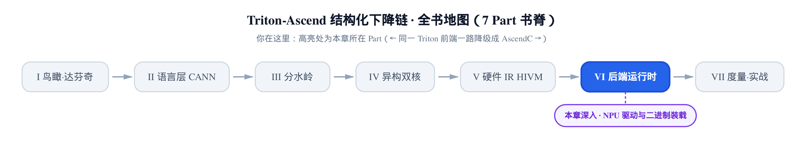
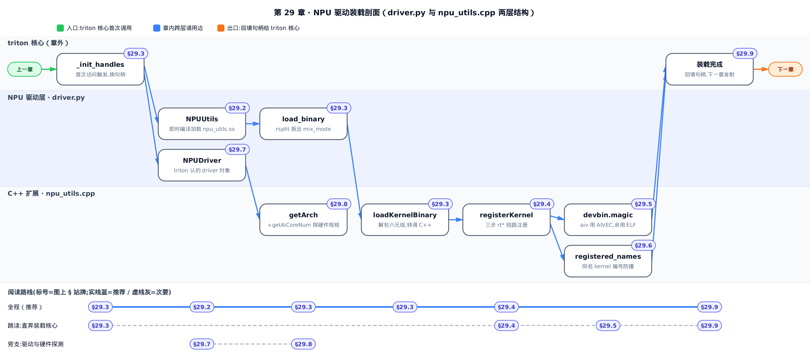
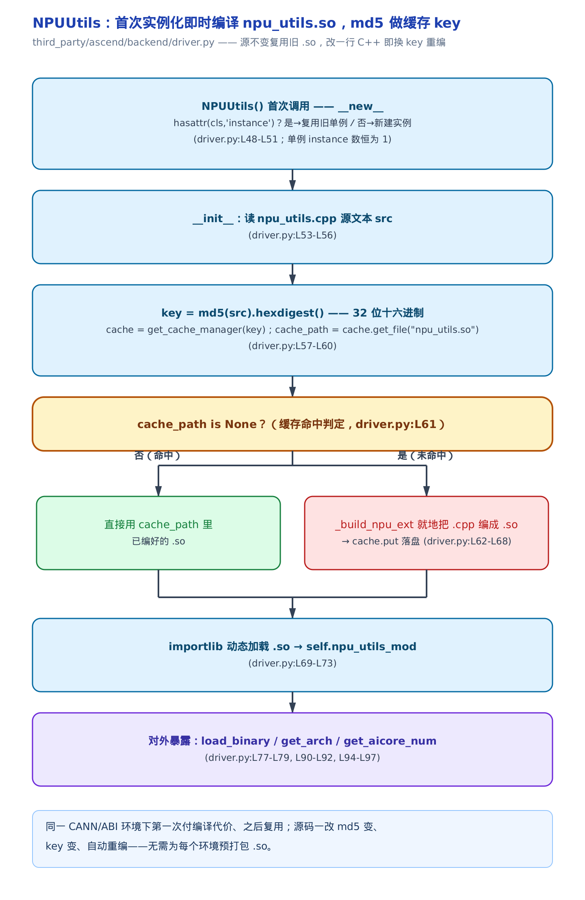
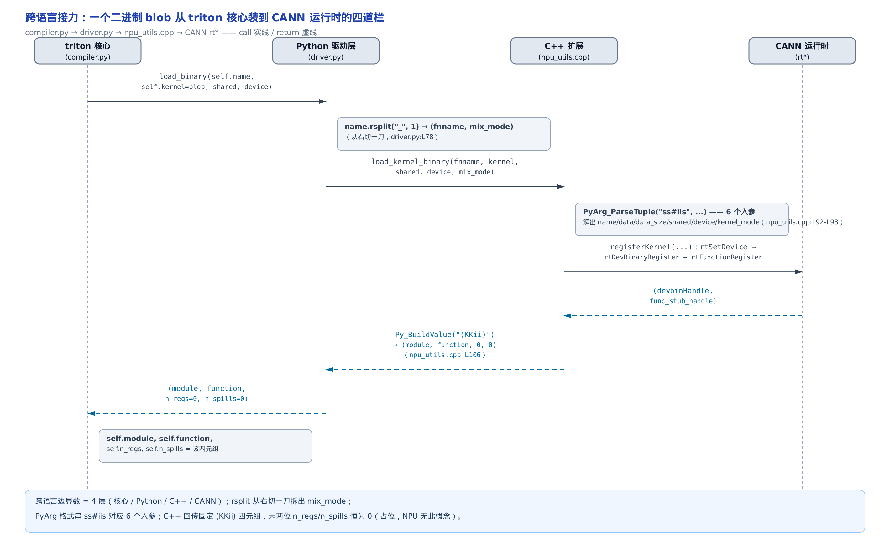
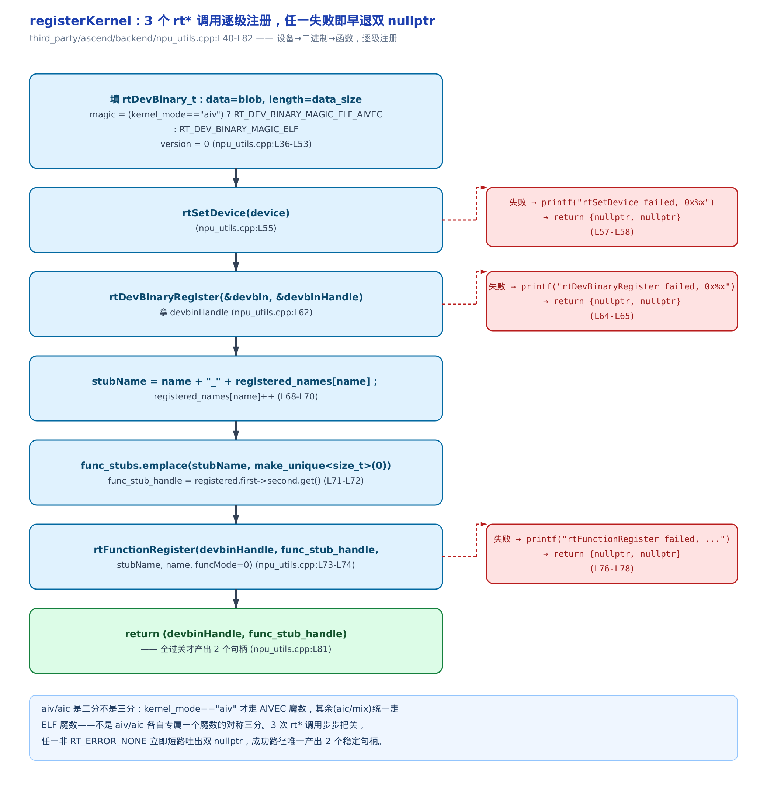

# 第 29 章　NPU 运行时驱动与二进制装载：把编出的 blob 装上达芬奇



> 上一章走完编译链，`bishengir-compile` 吐出一块 NPU 二进制。
> 本章讲运行时侧：这块二进制怎么被注册进设备、换回一个能调用的 kernel 句柄。
> 下一章接着讲发射器——拿着这个句柄，真正把 kernel 发到核上跑起来。

**姊妹篇约定**。这本书全程对照基座《Triton 源码解读》（读上游 Triton v3.2.0）。上一章对位的是基座里[讲 `ptxas` 编出 cubin、再发射 kernel 的那一章](../../../../triton/artifacts/ch37-ptx-cubin-launch/narrative/chapter.md)的**编译末段**；本章对位的是同一章的**装载段**——GPU 路上，Triton 编出 cubin（NVIDIA GPU 二进制）后要调 `cuModuleLoadData` 把它装进 CUDA 上下文、再用 `cuModuleGetFunction` 抠出可调用的函数句柄。昇腾这一步换成华为 CANN（Compute Architecture for Neural Networks，昇腾软件栈）的两个运行时接口：`rtDevBinaryRegister` 顶替 `cuModuleLoadData`、`rtFunctionRegister` 顶替 `cuModuleGetFunction`。两边形状惊人地对称——**都是「先把整块二进制注册成设备认得的模块，再从模块里按名字取出函数」两步走**。本章就逐行读昇腾侧这两步是怎么落地的。

装载这件事，triton-ascend 分成两层来做：上面一层是 Python 的 `driver.py`，下面一层是 C++ 扩展 `npu_utils.cpp`。**只想看一块 blob 怎么装上设备、拿到能调的句柄，直奔 §29.4 那三步 rt\* 注册**（`rt*` 是 CANN 运行时 API 的统一前缀，下面会反复出现）；想跟全程，从两层结构的总览按序读。



图上还标了一条旁支——`NPUDriver` 怎么被 triton 运行时认作当前驱动、`get_arch`/`get_aicore_num` 怎么探硬件规格，对应 §29.7、§29.8；只想抓装载主线的话，这条支线可以先跳过，读完主线再回来补。

## 29.1　两层结构：Python 驱动层 + C++ 扩展

先把地形看清楚。一块二进制从「编出来」到「能调用」，中间要穿过两层代码，各司其职：

- **Python 驱动层**（`third_party/ascend/backend/driver.py`）：面向 triton 运行时。它提供两个东西——`NPUDriver`，triton 运行时认的那个 driver（驱动）对象，实现了 triton 规定的驱动契约；`NPUUtils`，一个工具单例，对外暴露「装二进制」`load_binary` 和「探硬件规格」`get_arch` 等方法。这两者不是平级并列的——`NPUDriver` 实例化时就把 `self.utils` 绑定为一个 `NPUUtils()`，后面所有硬件探测、二进制装载的调用都经 `self.utils` 转发给它。但 Python 自己不碰 CANN，真正干活的活儿它再转手给下一层。
- **C++ 扩展**（`third_party/ascend/backend/npu_utils.cpp`）：一份编译成 `.so`（Linux 动态库）的 CPython 扩展。它才是真正调 CANN `rt*` 接口的地方——`registerKernel` 把二进制注册进设备、拿回句柄。

这两层之间有一道有意思的分界：**C++ 扩展本身也不是预先编好分发的，而是 Python 层第一次用到时，就地把 `.cpp` 编成 `.so`**。所以本章的第一个机制，讲的不是怎么装 kernel，而是**装 kernel 的那个工具自己怎么来的**。

## 29.2　装载扩展自己怎么来的：首次用时即时编译

**直觉**。想象你要用一把螺丝刀，但螺丝刀不在抽屉里现成放着——而是你第一次伸手去拿时，工厂当场按图纸给你车一把、贴上图纸的指纹存进抽屉；下次再拿，指纹一对，直接把上次那把递给你。改一笔图纸，指纹变了，工厂重新车一把。`npu_utils.so` 就是这把螺丝刀：**首次用时即时编译（JIT build），以源码指纹做缓存 key**。

**机制**。`NPUUtils` 是个单例——全进程只有一个实例。第一次实例化时，`__init__` 干四件事：① 读 `npu_utils.cpp` 的源文本；② 拿它的 md5（一种把任意长度输入压成 32 位十六进制指纹的哈希算法）当缓存 key；③ 用这个 key 去问缓存有没有编好的 `npu_utils.so`——命中就直接用，未命中就当场 `_build_npu_ext` 把 `.cpp` 编成 `.so` 再落盘；④ 用 `importlib`（Python 的动态模块加载器）把这个 `.so` 加载成模块，挂到 `self.npu_utils_mod` 上。

关键在第②③步的配合：缓存 key 是**源码本身的 md5**，不是版本号也不是时间戳。这带来一个漂亮的性质——**源码一个字节都没改，key 就不变，永远复用第一次编好的那份 `.so`**；只要改一行 C++，md5 变、key 变、缓存必然未命中、自动触发重编。它免去了为每套 CANN／ABI（Application Binary Interface，二进制接口）组合预先打包一份 `.so` 的麻烦：装载扩展始终跟当前源码、当前编译环境对齐。



**源码**。把 `NPUUtils` 的单例守卫和构造函数一起看：

```python
# third_party/ascend/backend/driver.py:L47-L75
class NPUUtils(object):
    def __new__(cls):
        if not hasattr(cls, 'instance'):
            cls.instance = super(NPUUtils, cls).__new__(cls)
        return cls.instance

    def __init__(self):
        dirname = os.path.dirname(os.path.realpath(__file__))
        src_path = os.path.join(dirname, "npu_utils.cpp")
        src = Path(src_path).read_text()
        key = hashlib.md5(src.encode("utf-8")).hexdigest()
        cache = get_cache_manager(key)
        fname = "npu_utils.so"
        cache_path = cache.get_file(fname)
        if cache_path is None:
            with tempfile.TemporaryDirectory() as tmpdir:
                tmp_src_path = os.path.join(tmpdir, "npu_utils.cpp")
                with open(tmp_src_path, "w") as f:
                    f.write(src)
                so = _build_npu_ext("npu_utils", None, tmp_src_path)
                with open(so, "rb") as f:
                    cache_path = cache.put(f.read(), fname, binary=True)
        import importlib.util
        spec = importlib.util.spec_from_file_location("npu_utils", cache_path)
        mod = importlib.util.module_from_spec(spec)
        spec.loader.exec_module(mod)
        self.npu_utils_mod = mod
        # setup for remote run
        env_arch = get_ascend_arch_from_env()
```

`__new__` 里 `hasattr(cls, 'instance')` 就是那道单例守卫——类上没挂过 `instance` 才新建，否则把老的还回去，保证全进程只有一个 `NPUUtils`。往下 `key = hashlib.md5(src.encode(...)).hexdigest()` 是缓存 key 的来源；`cache_path = cache.get_file(fname)` 去缓存里找 `npu_utils.so`，`if cache_path is None` 就是命中判定——`None` 即未命中，走 `_build_npu_ext` 当场编译、`cache.put` 落盘。末尾 `env_arch = get_ascend_arch_from_env()` 只是触发一次环境校验，本函数拿到后并未再用（读环境变量 `TRITON_ASCEND_ARCH` 有没有设、给远程运行做准备）。

单例只创建一次，可缓存 key 却是每次实例化都算——所以「第一次付编译代价、之后复用」这句话，准确说是**跨进程复用**：缓存落在磁盘上，换个进程再跑，md5 一样就命中同一份 `.so`。

`.so` 加载进来后，Python 怎么调到里面的 C 函数？靠扩展末尾的一张方法登记表：

```cpp
// third_party/ascend/backend/npu_utils.cpp:L322-L334（省略 L328-L333）
static PyMethodDef NpuUtilsMethods[] = {
    {"load_kernel_binary", loadKernelBinary, METH_VARARGS,
     "Load NPU kernel binary into NPU driver"},
    {"get_arch", getArch, METH_VARARGS, "Get soc version of NPU"},
    // sentinel
    {"get_aicore_num", getAiCoreNum, METH_VARARGS, "Get the number of AI core"},
    // … 省略：createStream / read/write/alloc/copy_memory 等旁路内存与流工具 …
    {nullptr, nullptr, 0, nullptr}};
```

这是 CPython 扩展的标准套路：一张表把 C 函数名（如 `loadKernelBinary`）绑到 Python 侧的可见名（`"load_kernel_binary"`）。于是 Python 里的 `self.npu_utils_mod.load_kernel_binary(...)` 就精确调到 C 的 `loadKernelBinary`。本章只关心其中三个——装二进制的 `load_kernel_binary`、探硬件的 `get_arch` 和 `get_aicore_num`；表里其余的 `createStream` 和读写／分配／拷贝内存那几个，是独立的 host／device 内存搬运工具，不在装载主线上。

## 29.3　一块 blob 的跨语言旅程

**直觉**。一块二进制 blob（binary large object，一整坨没有内部结构的字节）从 triton 核心手里出发，到最终变成设备上一个能调的句柄，要依次穿过四层语言／运行时边界：triton 核心（Python）→ NPU 驱动层（Python）→ C++ 扩展 → CANN 运行时。像一场四棒接力，每一棒都对 blob 做一点加工，再递给下一棒。

**机制**。起点在 triton 核心侧。编译产物 `CompiledKernel`（编好的 kernel 对象）第一次被真正要跑时，惰性触发 `_init_handles`，在这里把编译得到的二进制装上设备：

```python
# python/triton/compiler/compiler.py:L403-L415
def _init_handles(self):
    if self.module is not None:
        return
    device = driver.active.get_current_device()
    # create launcher
    self.run = driver.active.launcher_cls(self.src, self.metadata)
    # not enough shared memory to run the kernel
    max_shared = driver.active.utils.get_device_properties(device)["max_shared_mem"]
    if self.metadata.shared > max_shared:
        raise OutOfResources(self.metadata.shared, max_shared, "shared memory")
    # TODO: n_regs, n_spills should be metadata generated when calling `ptxas`
    self.module, self.function, self.n_regs, self.n_spills = driver.active.utils.load_binary(
        self.name, self.kernel, self.metadata.shared, device)
```

这段是 triton 核心通用代码，不分 GPU 还是 NPU。最后两行是本章的入口：`self.kernel` 就是上一章 `bishengir-compile` 吐出的那块二进制 blob，`driver.active.utils.load_binary(...)` 把它交出去装载，换回一个四元组 `(module, function, n_regs, n_spills)`——`module`（装好的设备模块句柄）、`function`（可调用的函数句柄）、`n_regs`／`n_spills`（寄存器数／寄存器溢出数，源自 GPU 侧 `ptxas` 的概念）。`driver.active` 就是 triton 认下的那个当前 driver，在昇腾上即 `NPUDriver`。

第二棒落到 Python 驱动层的 `load_binary`：

```python
# third_party/ascend/backend/driver.py:L77-L79
def load_binary(self, name, kernel, shared, device):
    fnname, mix_mode = name.rsplit("_", 1)
    return self.npu_utils_mod.load_kernel_binary(fnname, kernel, shared, device, mix_mode)
```

只有两行，但第一行藏着关键一刀。`name` 形如 `"<kernel>_aiv"`／`"<kernel>_aic"`／`"<kernel>_mix"`——kernel 名后面缀了一个双核模式后缀。`rsplit("_", 1)` 是「从右边切一刀」：切出真正的函数名 `fnname` 和模式后缀 `mix_mode`。为什么从右切而不是从左？因为 kernel 名内部本身可能带下划线，从右切一刀只认最后那个 `_`，才能稳稳把后缀剥下来、不误伤名字。这个 `mix_mode`（aic／aiv／mix 三态，[第 2 章](../../ch02-davinci-npu-hardware-model/narrative/chapter.md)量化双核时建立：aic 只用 cube 核、aiv 只用 vector 核、mix 两者都用）一路往下传，到 C++ 侧决定用哪个 magic，这是 §29.5 的主角。

第三棒进 C++ 扩展的 `loadKernelBinary`——跨语言的边界就在这里：

```cpp
// third_party/ascend/backend/npu_utils.cpp:L84-L107
static PyObject *loadKernelBinary(PyObject *self, PyObject *args) {
  const char *name;        // kernel name
  const char *data;        // binary pointer
  Py_ssize_t data_size;    // binary size
  int shared;              // shared_memory(meaningless now)
  int device;              // device ID
  const char *kernel_mode; // kernel mode

  if (!PyArg_ParseTuple(args, "ss#iis", &name, &data, &data_size, &shared,
                        &device, &kernel_mode)) {
    return nullptr;
  }

  auto [module_handle, func_handle] =
      registerKernel(name, data, data_size, device, kernel_mode);

  uint64_t mod = reinterpret_cast<uint64_t>(module_handle);
  uint64_t func = reinterpret_cast<uint64_t>(func_handle);
  if (PyErr_Occurred()) {
    return nullptr;
  }

  return Py_BuildValue("(KKii)", mod, func, 0, 0);
}
```

`PyArg_ParseTuple`（CPython 把 Python 参数元组解成 C 变量的接口）的格式串 `"ss#iis"` 正好对上 Python 侧那五个实参再加长度：`s`＝name、`s#`＝data 加它的字节长度 data_size（`s#` 专门解带长度的字节串，二进制里可能含 `\0`，不能当普通 C 字符串）、`i`＝shared、`i`＝device、`s`＝kernel_mode。解完就把活儿交给第四棒 `registerKernel`——那是真正调 CANN 的地方，下一节讲。

`registerKernel` 回来的两个句柄经 `reinterpret_cast`（C++ 里不改比特、只换类型解释的强制转换）变成 64 位整数，最后 `Py_BuildValue("(KKii)", mod, func, 0, 0)` 打包成一个四元组回传：`K`＝无符号 64 位整数（装两个句柄），`i`＝普通 int（两个 0）。**末两位 0 就是 `n_regs`／`n_spills` 的占位**——NPU 没有寄存器溢出这个概念，恒为 0，纯粹为了对齐 triton 核心 `load_binary` 那个四元组契约。同理，参数里的 `shared` 注释直接标了 `meaningless now`，也是为对齐 GPU 接口而保留的空壳。



四棒接力跑完，一块 blob 就从 triton 核心手里的字节，变成了 `self.function` 那个能发射的句柄。中间这一路，`mix_mode` 被 Python 侧拆出来、一路带到 C++；四元组末两位一路补成 0。下面钻进第四棒内部，看真正的装载三步。

## 29.4　装载核心：registerKernel 的三步 rt\* 注册

**直觉**。装一个 kernel，本质是**逐级注册**：先告诉运行时「我要用哪块设备」，再把整块二进制「登记」成设备认得的模块，最后从模块里「按名字取出」那个要调的函数。设备 → 二进制 → 函数，三步，一步都不能少，一步失败就整个作废。这正对应姊妹篇 GPU 侧 `cuModuleLoadData`（登记模块）＋ `cuModuleGetFunction`（取出函数）那两步——昇腾把它拆成了三步，多出来的第一步是显式选设备。

**机制**。这三步对应三个 CANN `rt*` 接口，严格按序调用：

1. `rtSetDevice(device)`——选定要装到哪块设备上。
2. `rtDevBinaryRegister(&devbin, &devbinHandle)`——把二进制 blob 注册成设备二进制，拿回一个模块句柄 `devbinHandle`。这一步顶替 CUDA 的 `cuModuleLoadData`。
3. `rtFunctionRegister(devbinHandle, func_stub_handle, ...)`——在这个模块里把 kernel 函数名注册进去，绑出一个可调用的函数 stub（存根，一个代表远端函数的本地句柄）。这一步顶替 CUDA 的 `cuModuleGetFunction`。

三步是一条**短路链**：任何一步的返回码不是 `RT_ERROR_NONE`（CANN 表示「无错误」的常量），就 `printf` 打出十六进制错误码、立即 `return {nullptr, nullptr}`——吐出一对空句柄，后面的步骤根本不走。只有三步全过，才产出 `(devbinHandle, func_stub_handle)` 两个有效句柄。



**源码**。这是本章最核心的一段，四十行装完一个 kernel：

```cpp
// third_party/ascend/backend/npu_utils.cpp:L36-L82
// Use map to differentiate same name functions from different binary
static std::unordered_map<std::string, size_t> registered_names;
static std::unordered_map<std::string, std::unique_ptr<size_t>> func_stubs;

static std::tuple<void *, void *>
registerKernel(const char *name, const void *data, size_t data_size,
               int device, const char *kernel_mode_str) {
  rtError_t rtRet;

  rtDevBinary_t devbin;
  devbin.data = data;
  devbin.length = data_size;
  const std::string kernel_mode{kernel_mode_str};
  if (kernel_mode == "aiv")
    devbin.magic = RT_DEV_BINARY_MAGIC_ELF_AIVEC;
  else
    devbin.magic = RT_DEV_BINARY_MAGIC_ELF;
  devbin.version = 0;

  rtRet = rtSetDevice(device);
  if (rtRet != RT_ERROR_NONE) {
    printf("rtSetDevice failed, 0x%x\n", rtRet);
    return {nullptr, nullptr};
  }

  void *devbinHandle = nullptr;
  rtRet = rtDevBinaryRegister(&devbin, &devbinHandle);
  if (rtRet != RT_ERROR_NONE) {
    printf("rtDevBinaryRegister failed, 0x%x\n", rtRet);
    return {nullptr, nullptr};
  }

  std::string stubName = name;
  stubName += "_" + std::to_string(registered_names[name]);
  registered_names[name]++;
  auto registered = func_stubs.emplace(stubName, std::make_unique<size_t>(0));
  void *func_stub_handle = registered.first->second.get();
  rtRet = rtFunctionRegister(devbinHandle, func_stub_handle, stubName.c_str(),
                             (void *)name, 0);
  if (rtRet != RT_ERROR_NONE) {
    printf("rtFunctionRegister failed(stubName = %s), 0x%x\n", stubName.c_str(),
           rtRet);
    return {nullptr, nullptr};
  }

  return std::make_tuple(devbinHandle, func_stub_handle);
}
```

从头读。开头填 `rtDevBinary_t`（CANN 描述一块设备二进制的结构体）：`data` 指向 blob、`length` 是它的字节数、`magic`（魔数，一个标识二进制种类的常量）按 `kernel_mode` 二选一（§29.5 详说）、`version = 0`。这个结构体就是喂给 `rtDevBinaryRegister` 的载荷。

接着三步 `rt*` 依次登场，每步都是「调用 → 查返回码 → 不对就打印早退」的同一副骨架。`rtSetDevice` 选设备；`rtDevBinaryRegister(&devbin, &devbinHandle)` 把 `devbin` 注册进去、通过第二个出参 `devbinHandle` 拿回模块句柄；中间那段 `stubName`／`func_stubs` 的账（下一节讲）算完后，`rtFunctionRegister` 把函数名注册进模块、绑出 stub。这里传了两个看似都是「名字」的参数，角色其实不同：`stubName.c_str()` 是本地注册表去重后的 key（`name` 加计数后缀，保证同名不撞车），`(void *)name` 才是设备二进制里要查的那个真实符号名；末尾的 `0` 是 funcMode（函数模式标志），本章不深入。全过则 `make_tuple` 返回两个句柄。

**CANN 边界的诚实交代**。`rtSetDevice`、`rtDevBinaryRegister`、`rtFunctionRegister` 这些 `rt*` 全是 CANN 闭源运行时 API——它们的声明来自 `runtime/runtime/rt.h`，由 CANN 在编译期通过头文件路径提供，仓库里没有源码。所以本章讲到**调用点、参数语义、返回句柄的用途**为止：blob 注册进设备后 CANN 内部怎么排布、句柄背后是什么数据结构，无源码可读，不猜。这和上一章 `bishengir-compile` 闭源边界、以及基座 `ptxas` 内部是同一种诚实边界——开源可读到调用点，黑箱从此接手。

还要点清一件事：`registerKernel` 只做**注册**，不做**执行**。三步跑完，kernel 只是「装好了、拿到句柄了」，一条指令都还没在核上跑。真正的发射——拿 `func_stub_handle` 去调 `rtKernelLaunch`、连着 block 数和参数发到 stream 上——发生在下一章的发射器里。**装载一次，发射多次**：同一个装好的句柄，可以反复发射跑很多遍。

## 29.5　一个 magic 决定这个 kernel 上哪拨核

**直觉**。[第 2 章](../../ch02-davinci-npu-hardware-model/narrative/chapter.md)讲过，达芬奇（DaVinci，昇腾 AI Core 的架构名）不是一堆同构核，而是 cube 核（专啃矩阵乘）＋ vector 核（专啃逐元素／规约）两种工种搭班。前面十几章讲双核分工怎么在 IR 里切分、怎么同步——那些都在编译期。到了运行时装载这一步，双核分工浓缩成了**一个字段的取值**：一块二进制到底是给哪拨核跑的，靠 `rtDevBinary_t.magic` 这个魔数告诉 CANN。

**机制**。回看上一节 `registerKernel` 开头那三行分支：

```cpp
// third_party/ascend/backend/npu_utils.cpp:L48-L52（节选自 §29.4）
  const std::string kernel_mode{kernel_mode_str};
  if (kernel_mode == "aiv")
    devbin.magic = RT_DEV_BINARY_MAGIC_ELF_AIVEC;
  else
    devbin.magic = RT_DEV_BINARY_MAGIC_ELF;
```

这里有一个容易读错的地方，值得盯住：**它是「aiv vs 非 aiv」的二分，不是「aiv / aic 对称」的三分**。`kernel_mode == "aiv"`（纯 vector 核二进制）才用 `RT_DEV_BINARY_MAGIC_ELF_AIVEC` 这个专门的 AIVEC 魔数；其余一切——`aic`（纯 cube 核）和 `mix`（两者都用）——统统落到 `else`，用通用的 `RT_DEV_BINARY_MAGIC_ELF`。

为什么是二分而非三分？因为纯 vector 核的二进制格式在 CANN 里需要单独的魔数标识，而 cube 参与的情形（不管纯 cube 还是混合）共用同一种。这个 `kernel_mode`，正是 §29.3 里 `load_binary` 用 `rsplit("_", 1)` 从 kernel 名尾巴上剥下来的那个 `mix_mode` 后缀——它在 Python 侧就被拆出、一路原样传到 C++，在这里落地成一次 magic 选择。**编译期决定的「这个 kernel 用哪拨核」，到装载这一步，就体现为 `devbin.magic` 填哪个常量。** 一个字段，接住了前面所有关于双核的铺垫。

## 29.6　同名 kernel 不撞车：stubName 计数器

**直觉**。像停车场给同名的车发号牌：同一个函数名 `add_kernel` 可能来自不同的二进制（binA、binB），每来一辆就发下一个递增号（`_0`、`_1`……），号牌永不重复；凭这张号牌背后那个专属车位（`unique_ptr` 管的那块堆内存的地址）就能唯一找回这辆车。这就是 `registerKernel` 中间那几行在干的事——为每次注册造一个全局唯一的 stubName，并给它一个稳定的句柄。

**机制**。核心是两个全局 map 和一个计数器（源码在 §29.4 那段 `registerKernel`，`third_party/ascend/backend/npu_utils.cpp:L68-L72`，这里只盯中间那几行）：

- `registered_names`：`name → 已注册次数`。每注册一次，`registered_names[name]++` 自增一次。
- `stubName = name + "_" + registered_names[name]`：拿「名字 + 当前计数」拼出这次注册的唯一名。
- `func_stubs.emplace(stubName, make_unique<size_t>(0))`：为这个新 stubName 建一块独立的堆对象，`.get()` 取到它的地址，就是 CANN 认的 `func_stub_handle`。

跟一遍三次注册的账，看计数器怎么防同名撞车。下表是把这段控制流用等价的逐拍推演跑出来的（`registerKernel` 依赖 CANN 与达芬奇设备，host 上无法整体真跑；`registered_names[name]++` 是纯计数逻辑、与语言无关，这里用等价的逐拍镜像复现，是**控制流示意**，不是真机 dump）：

<!-- trace: m5 -->

| 轮次 | 注册 name（来自） | `registered_names[name]` 读值 | `stubName = name+'_'+读值` | `++` 后计数 |
|:---:|:---|:---:|:---|:---:|
| 1 | `add_kernel`（binA） | 0 | `add_kernel_0` | 1 |
| 2 | `add_kernel`（binB） | 1 | `add_kernel_1` | 2 |
| 3 | `mul_kernel`（binC） | 0 | `mul_kernel_0` | 1 |

盯住第 2 轮：又来一个 `add_kernel`（这回来自 binB），它读到的 `registered_names["add_kernel"]` 已经是第 1 轮自增后的 `1`，于是拼出 `add_kernel_1` 而不是再一个 `add_kernel_0`——**同名冲突这个非平凡分支，被真实触发了**。第 3 轮换个名字 `mul_kernel`，计数器对它是全新的键，从 `0` 起，拿到 `mul_kernel_0`。三轮下来：三个互异的 stubName、三个互异的 func stub 句柄；`registered_names` 最终 `{add_kernel: 2, mul_kernel: 1}`（键数＝去重后的名字数＝2），`func_stubs` 有 3 个键（＝总注册次数）。

**不变量**：任意注册序列下，每次产出的 stubName 全局唯一（同名 kernel 也不冲突），且每个 func stub 句柄是互异且生命周期内稳定的堆地址。`registered_names` 和 `func_stubs` 都是 `unordered_map`（哈希表），查找与插入均摊 $`O(1)`$，故 N 次注册总代价 $`O(N)`$。

论证靠一个单调量。`registered_names[name]` 是「name 已注册次数」的计数器，每注册一次严格 +1，所以对同一个 name，各次读到的计数 0, 1, 2, … 两两不同；`stubName = name + '_' + 计数`，同名的后缀互异 → stubName 互异，不同名的前缀已互异 → 也互异。故 `(name, 计数)` 这个二元组单射到 stubName，全局唯一。句柄这边：`func_stubs.emplace(stubName, make_unique<size_t>(0))` 为每个新 stubName 建一块独立堆对象，`.get()` 取其地址——不同对象地址必异，且 `unique_ptr`（独占所有权的智能指针）持有期间对象不搬家，地址稳定。这就是为什么 stub 句柄能被后续发射反复使用而不失效。

（func stub 句柄是新建 `unique_ptr<size_t>` 的堆地址，具体数值进程间不同、非确定，所以上表只列号牌、不列地址；地址互异这件事由推演逐轮成立保证。）

## 29.7　NPUDriver：triton 运行时认的那个 driver

装载讲完了，回头补上那个「triton 认下的 driver 对象」到底实现了什么契约。前面 `driver.active` 在昇腾上就是 `NPUDriver`（[第 26 章](../../ch26-ascend-backend-plugin/narrative/chapter.md)后端挂载时首次登场），它继承 triton 的 `DriverBase`（驱动基类，规定一个后端 driver 必须提供哪些方法），把「当前目标／当前设备／当前流」这些运行时要问的事一一答上：

```python
# third_party/ascend/backend/driver.py:L166-L194
def get_current_target(self):
    backend = "npu"
    env_target = get_ascend_arch_from_env()
    if env_target:
        arch = env_target
    else:
        arch = self.utils.get_arch()
    warp_size = 0
    return GPUTarget(backend, arch, warp_size)

def get_current_device(self):
    """
    Get current device
    """
    return get_backend_func("get_current_device")

def set_current_device(self, device):
    """
    Set current device as the given device
    """
    return get_backend_func("set_current_device", device)

def get_current_stream(self, device: Optional[int] = None) -> int:
    """
    Get stream for current device
    """
    # According to torch_npu, the content of a torch.npu.Stream is essentilly an rtStream_t
    # TODO: use CANN API instead of torchnpu
    return get_backend_func("get_current_stream", device)
```

`get_current_target` 产出一个 `GPUTarget`（triton 描述编译目标的三元组，尽管名字带 GPU，昇腾照用）：`backend="npu"`；`arch`（架构描述串）优先取环境变量 `TRITON_ASCEND_ARCH`，没设就落到 `self.utils.get_arch()` 探硬件（下一节讲）；`warp_size=0`。**`warp_size=0` 是一处诚实的留白**——warp（线程束，SIMT 架构里一组锁步执行的线程）是 GPU 概念，达芬奇不是 SIMT 架构、根本没有 warp，所以这个字段填 0，等于告诉上层「此概念在我这儿不适用」。这和 §29.3 里四元组末两位补 0、`shared` 标 meaningless 是同一种手法：**为对齐 GPU 契约而保留字段，用零值／空值诚实标注「不适用」**。

`device` 和 `stream` 三个方法都转手给 `get_backend_func`（一层薄封装，按名字去 `torch_npu` 模块取同名属性再调用，内部机制本章不展开）——分派到 `torch_npu`（昇腾的 PyTorch 扩展，[第 2 章](../../ch02-davinci-npu-hardware-model/narrative/chapter.md)提过 `import torch_npu` 即把加工线切到 NPU 路）。注释点破了缘由：`torch.npu.Stream` 的内容本质就是一个 `rtStream_t`（CANN 的流句柄），既然 `torch_npu` 已经管好了设备与流，直接复用免得自己再封一层；源码那句 `TODO: use CANN API instead` 也老实标了这是权宜、将来想改成直接调 CANN。

## 29.8　探硬件规格：SoC 版本与双核数

`NPUDriver` 里 `arch` 的兜底来源 `self.utils.get_arch()`，最终也落到 C++ 扩展。装载之外，`npu_utils.cpp` 还提供两个探硬件规格的接口，套路和 `registerKernel` 一样——调一个 `rt*`、查返回码、打包回传：

```cpp
// third_party/ascend/backend/npu_utils.cpp:L109-L137
static PyObject *getArch(PyObject *self, PyObject *args) {
  char name[64] = {'\0'};

  rtError_t rtRet = rtGetSocVersion(name, 64);

  if (rtRet != RT_ERROR_NONE) {
    printf("rtGetSocVersion failed, 0x%x", rtRet);
    return nullptr;
  }
  if (PyErr_Occurred()) {
    return nullptr;
  }
  return Py_BuildValue("s", name);
}

static PyObject *getAiCoreNum(PyObject *self, PyObject *args) {
  uint32_t aiCoreCnt;

  rtError_t rtRet = rtGetAiCoreCount(&aiCoreCnt);

  if (rtRet != RT_ERROR_NONE) {
    printf("rtGetAiCoreCount failed, 0x%x", rtRet);
    return nullptr;
  }
  if (PyErr_Occurred()) {
    return nullptr;
  }
  return Py_BuildValue("I", aiCoreCnt);
}
```

`getArch` 调 `rtGetSocVersion`，把 SoC（System on Chip，片上系统）版本字符串（如 `Ascend910B` 之类）读进来当 arch；`getAiCoreNum` 调 `rtGetAiCoreCount`，回一个 AI Core 数量。注意 `rtGetAiCoreCount` 数的是 **cube 核（AIC）** 的数量。vector 核的数量哪来？回到 Python 层：

```python
# third_party/ascend/backend/driver.py:L81-L87
@functools.lru_cache()
def get_device_properties(self, device):
    # temperoarily added "max_shared_mem" properties to avoid triton-compiler complain
    # fetch available memory at runtime
    num_aic = self.get_aicore_num()
    num_aiv = num_aic * 2
    return {"max_shared_mem": 1, "num_aicore": num_aic, "num_vectorcore": num_aiv}
```

`num_aiv = num_aic * 2`——**vector 核数不是探出来的，是按固定比例算出来的**。这正是[第 2 章](../../ch02-davinci-npu-hardware-model/narrative/chapter.md)量化过的达芬奇 1:2 配比（一颗 AI Core 里 cube 核与 vector 核数量比恒为 1:2，一个矩阵核配两个向量核）在运行时的落点：`rtGetAiCoreCount` 只回 cube 核数，vector 核数直接 ×2 推得，因为这个比例是 910B 架构写死的硬件事实、不必再探一次。`NPUUtils.get_aivector_core_num` 就是这个值的对外访问器，直接转调 `get_device_properties("npu")["num_vectorcore"]`。`@functools.lru_cache()`（缓存函数结果、同参不重算）保证这些探测每个 device 只做一次。返回的 `max_shared_mem: 1` 又是一处占位——回想 §29.3 那段 `_init_handles` 里 `if self.metadata.shared > max_shared` 的检查，给个 1 只为让 triton 核心那道 GPU 式的共享内存校验能过。

## 29.9　小结：装载与发射的分界

把这一章的两层结构收一下。上一章 `bishengir-compile` 吐出的那块 NPU 二进制，本章把它一路装上了达芬奇设备：

1. **装载扩展先自举**——`NPUUtils` 首次实例化，以 `npu_utils.cpp` 源码的 md5 为 key，命中就复用、未命中就当场 `_build_npu_ext` 编出 `npu_utils.so`，再 `importlib` 加载。改一行 C++ 即换 key 重编。
2. **一块 blob 跨四道栏**——`_init_handles` 调 `load_binary`，Python 侧 `rsplit` 拆出 `mix_mode`，C++ 侧 `PyArg_ParseTuple("ss#iis")` 解包，返回 `(KKii)` 四元组、末两位 `n_regs`／`n_spills` 恒为 0 只为对齐 triton 契约。
3. **三步 rt\* 注册**——`registerKernel` 里 `rtSetDevice` → `rtDevBinaryRegister`（顶替 `cuModuleLoadData`，拿 `devbinHandle`）→ `rtFunctionRegister`（顶替 `cuModuleGetFunction`，拿 func stub），任一步非 `RT_ERROR_NONE` 即短路吐双 `nullptr`。
4. **一个 magic 接住双核**——`kernel_mode == "aiv"` 用 AIVEC 魔数、其余用通用 ELF 魔数；编译期的双核分工落地成 `devbin.magic` 一个字段。
5. **计数器防同名撞车**——`registered_names[name]++` 给每次注册造唯一 stubName，`func_stubs` 的 `unique_ptr` 地址作稳定句柄。
6. **driver 契约与硬件探测**——`NPUDriver` 答 target／device／stream，`warp_size=0` 诚实留白；`getArch`／`getAiCoreNum` 探 SoC 版本与 cube 核数，vector 核数按 1:2 ×2 推得。

一句话划清边界：**本章只做「装载」——把 blob 注册成设备认得的模块、换回可调用的句柄，一条指令都没跑**。`rt*` 之外的 CANN 内部，无源码、不猜。拿到 `func` 句柄之后，怎么生成 wrapper、怎么调 `rtKernelLaunch` 把 kernel 连同 block 数和参数真正发到 stream 上跑起来——那是下一章发射器的事。装载一次，发射多次，故事就从「怎么装上去」转向「怎么发出去」了。
