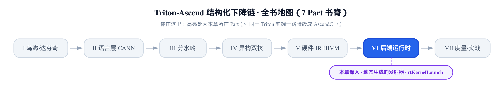
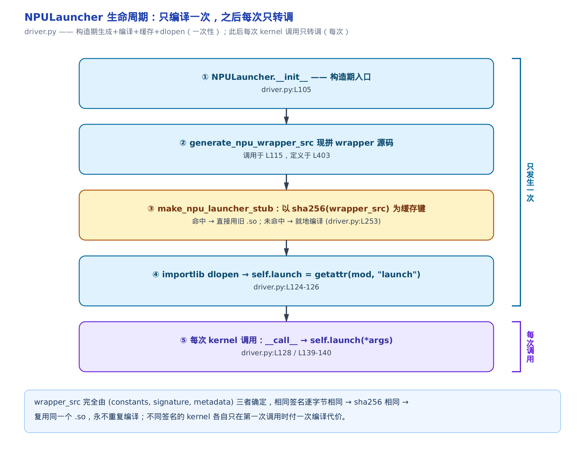
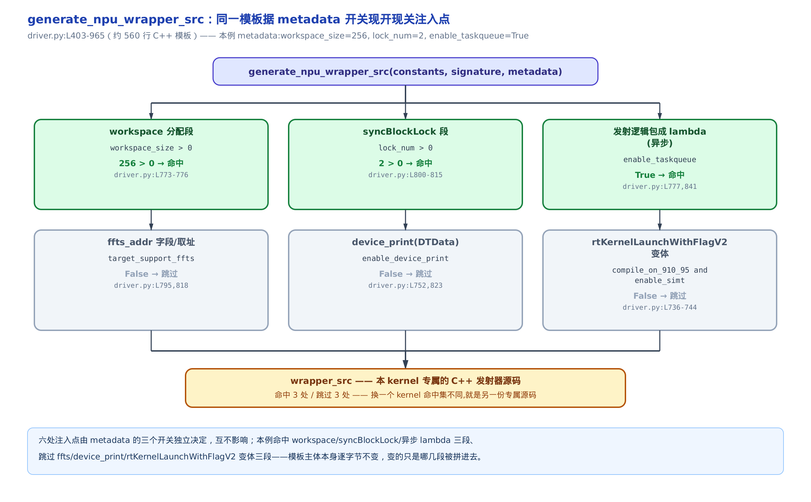
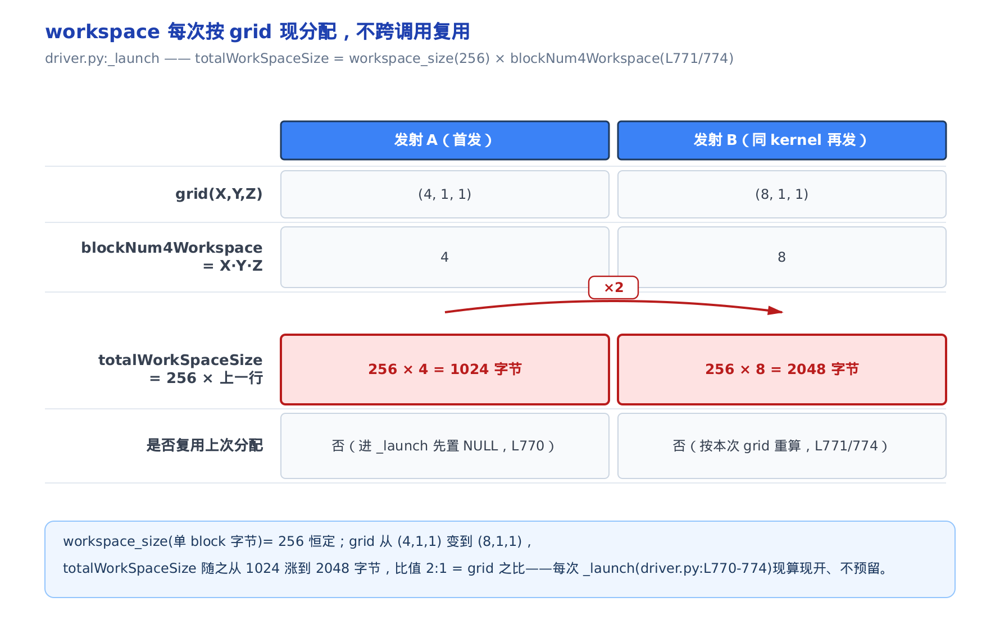
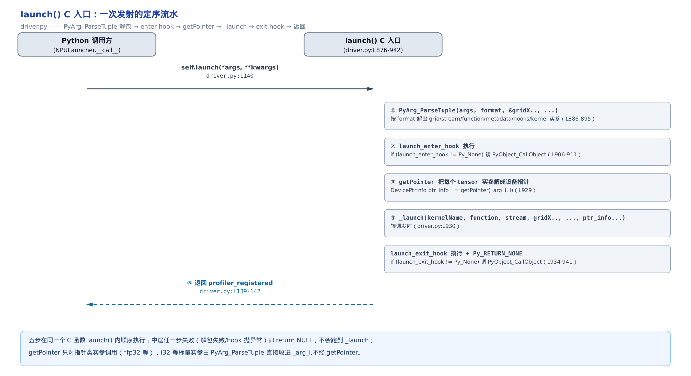

# 第 30 章　动态生成的发射器：编译链的最后一环




> 图上一~五节是「编译一次、拼进 wrapper」的现拼与解包／分配／归零，六~十节是「装箱 → 真正上设备 → 派发 → 定序 → 剖析」的发射核心；只想抓发射主线的读者，可沿实线蓝「全程」路线走一、二、六、七、八、九节，双后端策略表与 __call__ 旁路（十一、十二节）先跳过，读完主线再回来补。

> 上一章把编出的 NPU 二进制装上了达芬奇，拿到了函数句柄。
> 本章讲拿着这个句柄，每次真正「发射」一个 kernel 时发生什么。
> 这是全书编译 → 运行时主线的最后一环。

**姊妹篇约定**。这本书全程对照基座《Triton 源码解读》（读上游 Triton v3.2.0）。上一章[把 NPU 二进制装进设备、抠出函数句柄](../../ch29-npu-driver-load/narrative/chapter.md)，对位的是基座里[讲编译末段与 kernel 发射的那一章](../../../../triton/artifacts/ch37-ptx-cubin-launch/narrative/chapter.md)的**装载段**；本章对位的是同一章的**发射段**——GPU 路上，Triton 也是动态生成一小段 C 扩展、`PyArg_ParseTuple`（CPython 解包 C 函数参数的标准 API）解包、再调 `cuLaunchKernel`（CUDA 把 kernel 派上 GPU 的运行时接口）。昇腾发射器的骨架和基座惊人地像，但**厚得多**：同一条发射路上，昇腾比基座 GPU 多出三样——

1. **workspace 每次现分配**：昇腾把每个 block 的暂存搬到 HBM（High Bandwidth Memory，设备主存）上的 workspace（暂存区），按本次 grid 现算现开；基座 GPU 的 shared/local 由硬件与编译期占用定死，发射路上此步为零。
2. **taskqueue 异步派发**：昇腾默认把整段发射逻辑包成一个 lambda、推入框架的算子队列异步执行，host 不阻塞；基座直调 `cuLaunchKernel`。
3. **msprof 剖析钩子**：昇腾在发射前后内嵌计时与上报，喂给 CANN（Compute Architecture for Neural Networks，昇腾软件栈，ch29 已介绍）的 msprof（昇腾性能剖析工具）；基座无此内嵌。

这三样，就是本章相对基座的全部 divergence（分岔），也是「昇腾发射器为什么厚」的答案。下面逐样读它们怎么落地。



> 想先抓主干，按序读即可；只想看昇腾比基座多出的那三样，直接跳「[workspace 每次按 grid 现分配](#workspace-每次按-grid-现分配)」「[taskqueue：异步派发](#taskqueue异步派发)」「[msprof：内嵌的剖析钩子](#msprof内嵌的剖析钩子)」三节。

**关于本章的数字**。host 上没有昇腾 NPU（Neural-network Processing Unit，华为 AI 处理器）、没有 CANN 工具链——发射器 wrapper 依赖 CANN 闭源运行时（`rtKernelLaunch`、msprof）与真实设备，无法真跑。所以本章所有数值表都是对 `generate_npu_wrapper_src` 这段 Python 拼装逻辑的**手工推演**：选定一个经典向量加 kernel 的签名与 metadata，逐行代入源码常量算出来的，每个数字都标了 `file:Lxxx` 出处。读它们的口径是「这段拼装逻辑**按定义**会拼出什么」，不是「真机 emit 的指令」。

贯穿全章的例子是一个向量加 kernel：

```python
@triton.jit
def add_kernel(x_ptr, y_ptr, out_ptr, n_elements, BLOCK_SIZE: tl.constexpr):
    ...
```

它的签名 `signature = {0:'*fp32', 1:'*fp32', 2:'*fp32', 3:'i32'}`（三个 `*fp32` 指针参数 + 一个 `i32` 长度）；`BLOCK_SIZE` 是编译期 `constexpr`（编译期常量），已在编译期折叠、不进发射器签名。它的 metadata（ch28/ch29 编译期落定的 kernel 元数据）取：`workspace_size=256`、`lock_num=2`、`enable_taskqueue=True`、后端为 `torch_npu`。我们会发射它两次：发射 A 用 `grid=(4,1,1)`，发射 B（同一编译产物第二次调用）用 `grid=(8,1,1)`。

## 发射器的一生：只编译一次

**直觉**。发射器不是写死在仓库里的一份 `.cpp`。它是 kernel 第一次被调用时，据这个 kernel 的样子**现打印**出来的一段 C++ 源码，当场编译成动态库、加载进来，拿到一个可调用的入口。之后每次发射，只走这个入口，不再碰编译。像请人上门装家具：第一次来先据你这一单现打一份安装说明书（生成 + 编译），之后每次挪动都照这份说明书（调用），不重印。

**机制**。发射器主体是 `NPULauncher` 这个类。上一章的 [`NPUDriver`](../../ch29-npu-driver-load/narrative/chapter.md)（昇腾后端 Driver）正是靠一行 `self.launcher_cls = NPULauncher`（`driver.py:L147`）把发射器类登记给自己——Triton 运行时要发射某 kernel 时，就实例化这个 `launcher_cls`，拿到的就是本章的 `NPULauncher`。看它的构造函数：

```python
# third_party/ascend/backend/driver.py:L104-L126
class NPULauncher(object):
    def __init__(self, src, metadata):
        self.compile_only = os.getenv("TRITON_COMPILE_ONLY", 'false').lower() in ('true', '1')
        self.enable_msprof_register_tensor = os.getenv("TRITON_REGISTER_TENSOR_MSPROF", 'false').lower() in ('true', '1')
        debug_mode = metadata.debug
        header_src = generate_npu_header_src()
        constants = src.constants if hasattr(src, "constants") else dict()
        cst_key = lambda i: src.fn.arg_names.index(i) if isinstance(i, str) else i
        constants = {cst_key(key): value for key, value in constants.items()}
        signature = {cst_key(key): value for key, value in src.signature.items()}
        wrapper_src = generate_npu_wrapper_src(constants, signature, metadata)
        so_launcher_path = make_npu_launcher_stub(header_src, wrapper_src, metadata.debug)
        # setup for remote run
        self.mix_mode = metadata.mix_mode      # … 省略：mix_mode/shared 只为远程运行预留，本章不展开 …
        self.shared = metadata.shared
        # initialize launcher
        import importlib.util
        spec = importlib.util.spec_from_file_location("__triton_launcher", so_launcher_path)
        mod = importlib.util.module_from_spec(spec)
        spec.loader.exec_module(mod)
        self.launch = getattr(mod, "launch")
```

四步走，每步一句话：

- `generate_npu_header_src()`：出一份公共头（`rt.h`/`acl.h` 加按后端注入的头），供预编译头 `precompiled.h` 用；
- `generate_npu_wrapper_src(constants, signature, metadata)`：**据本 kernel 的三个入参现拼出 C++ wrapper 源码**——这是本章的核心，下一节展开；
- `make_npu_launcher_stub(...)`：把 wrapper 源码编译成一个 `.so`（Linux 动态库文件），并做缓存；
- 最后三行 `importlib`：把这个 `.so` 当模块动态加载（即 dlopen，运行期把动态库映射进进程），`getattr(mod, "launch")` 抠出里面那个 C 函数入口，存进 `self.launch`。

构造完成，`self.launch` 就是一个可调用体。之后每次 kernel 调用，都从 `__call__` 进、转调它——**编译只在构造期发生这一次**。

**为什么第二次调用不重编译**？关键在 `make_npu_launcher_stub` 的缓存键：

```python
# third_party/ascend/backend/driver.py:L244-L273
def make_npu_launcher_stub(header_src, wrapper_src, debug=False):
    enable_precompile = not os.getenv("TRITON_DISABLE_PRECOMPILE", 'false').lower() in ('true', '1')
    header_path = _precompile_npu_ext_with_lock(header_src, enable_precompile)
    assert header_path is not None, "the precompiled.h path is empty."

    # try to get cached file
    so_cache_key = hashlib.sha256(wrapper_src.encode("utf-8")).hexdigest()
    so_cache_manager = get_cache_manager(so_cache_key)
    use_cxx11_abi = _check_cxx11_abi()
    name = f"launcher_cxx11abi{use_cxx11_abi}"
    suffix = sysconfig.get_config_var('EXT_SUFFIX')
    so_name = f"{name}{suffix}"
    # … 省略：debug 分支把 precompiled.h / .cxx dump 出去便于排错 …
    cache_path = so_cache_manager.get_file(so_name)
    if cache_path is not None:
        return cache_path
    # … 省略：cache miss 时写临时 .cxx → _build_npu_ext 编成 .so → 缓存并返回 …
```

缓存键是 `sha256(wrapper_src)`——**wrapper 源码本身的哈希**。`sha256`（一种 256 位密码学哈希，同样输入必得同样摘要）保证：只要拼出来的源码逐字节相同，缓存键就相同，直接返回上次编好的 `.so`。这是一条严格的不变量：

> **不变量**：同一 `(constants, signature, metadata)` 拼出的 wrapper 源码逐字节确定，故 sha256 相同，复用同一个 launcher `.so`，永不重复编译。
>
> 论证：`generate_npu_wrapper_src` 是纯函数——输出完全由三个入参决定，无随机、无时间、无全局可变输入。相同输入必得逐字节相同的字符串；`make_npu_launcher_stub` 以 `hashlib.sha256(wrapper_src)`（`driver.py:L253`）为键，故相同签名的 kernel 第二次发射直接命中缓存 `.so`、跳过编译。不同签名的 kernel 各自只在第一次调用时付一次编译代价。

上面的[发射器生命周期图](#发射器的一生只编译一次)把这一生画成了两段：`__init__` → `generate_npu_wrapper_src` → `sha256` 缓存 → dlopen 是**只发生一次**的构造段；`__call__ → self.launch` 是**每次调用**都走的发射段。

## 现拼一段 C++ 发射器

**直觉**。上一节说构造期会「现拼」出 wrapper 源码。怎么拼？像宜家按你这一单的家具清单，现打印一份专属安装说明书——螺丝几颗、要不要配某块加固板，都据你这单现列。发射器源码就是这份说明书：据本 kernel 的 metadata，把该有的段现开、不该有的段现关，拼成本 kernel 专属的一份。

**机制**。`generate_npu_wrapper_src` 开头先把 metadata 里的开关全读出来：

```python
# third_party/ascend/backend/driver.py:L402-L416
# the template is from triton-adapter HEAD. Wrapping the generated kernel binary into a python module
def generate_npu_wrapper_src(constants, signature, metadata):
    import os
    workspace_size = int(metadata.workspace_size) \
                          if hasattr(metadata, 'workspace_size') else -1
    lock_init_value = int(metadata.lock_init_value) \
                          if hasattr(metadata, 'lock_init_value') else 0
    lock_num = int(metadata.lock_num) \
                          if hasattr(metadata, 'lock_num') else -1
    bs_task_type = metadata.bs_task_type if hasattr(metadata, 'bs_task_type') else 0
    mix_mode = metadata.mix_mode
    compile_on_910_95 = metadata.compile_on_910_95
    parallel_mode = metadata.parallel_mode
    enable_simt = ("simt" in parallel_mode) or metadata.force_simt_only
```

注意几个缺省值：`workspace_size` 缺省 `-1`、`lock_num` 缺省 `-1`——表示这个 kernel **不用 workspace、不用同步锁**，对应的段整段不拼进去。`enable_simt` 里的 SIMT（Single Instruction Multiple Threads，单指令多线程）是 910_95（昇腾某型号）上的一种并行模式，本例不涉及。这些开关就是「说明书里哪几段现开现关」的旋钮。

函数体最后 `return` 出一段约 560 行的 C++ 源码。它由若干**条件注入点**拼成，每个注入点由一个 metadata 开关控制。对我们的例子逐个判定：

<!-- trace: m1 -->

| 注入点 | 控制条件 | 本例取值 | 命中？ | 源码行 |
|--------|----------|----------|-------|--------|
| workspace 分配段 | workspace_size > 0 | 256 > 0 | 命中 | driver.py:L773-776 |
| syncBlockLock 段 | lock_num > 0 | 2 > 0 | 命中 | driver.py:L800-815 |
| 发射逻辑包成 lambda(异步) | enable_taskqueue | True | 命中 | driver.py:L777,841 |
| ffts_addr 字段/取址 | target_support_ffts | False | 跳过 | driver.py:L795,818 |
| device_print(DTData) | enable_device_print | False | 跳过 | driver.py:L752,823 |
| rtKernelLaunchWithFlagV2 变体 | compile_on_910_95 and enable_simt | False | 跳过 | driver.py:L736-744 |

六个注入点，本例命中三个（workspace / syncBlockLock / 异步 lambda）、跳过三个（ffts / device_print / V2 发射）。模板主体本身逐字节不变，变的只是哪几段被拼进去。换一个命中集不同的 kernel，就是另一份 wrapper 源码、另一个 `.so`。

> **不变量**：六个注入点各自由独立的 metadata 布尔条件门控，互不干扰；给定一组 `(constants, signature, metadata)`，六个开关的取值组合固定，故被拼入/被跳过的段落集合也随之固定——这正是上一节 sha256 缓存能生效的前提（确定的开关组合 → 确定的源码 → 确定的哈希）。



**源码**。看一段真的注入点，体会「条件拼」是怎么写的。这是 `_launch` 函数体的开头：

```python
# third_party/ascend/backend/driver.py:L764-L776
static void _launch(const char* kernelName, const void* func, rtStream_t stream, int gridX, int gridY, int gridZ, std::vector<std::vector<int64_t>> &tensorShapes, std::vector<int> &tensorKinds{', ' + arg_decls if len(signature) > 0 else ''}) {{
  // only 1D parallelization is supported for NPU
  std::string name = "";
  name.append(kernelName);
  void *workspace_addr_ptr = NULL;
  uint32_t blockNum4Workspace = gridX * gridY * gridZ;
  {get_backend_func("pre_launch", True)}
  {f'''
  uint64_t totalWorkSpaceSize = {workspace_size} * blockNum4Workspace;
  {get_backend_func("allocate_memory", "totalWorkSpaceSize", "stream")}
  ''' if workspace_size > 0 else ''}
```

**这是一段 Python f-string 拼出来的 C++ 文本，读的时候要切两层视角**：双花括号 `{{ }}` 是转义后的字面花括号（最终进 C++ 源码），单花括号 `{ }` 是 Python 求值点（拼装时替换）。最后那段 `{f'''...''' if workspace_size > 0 else ''}` 就是一个注入点——`workspace_size > 0` 时拼进 workspace 分配代码，否则拼一个空串。本例 `workspace_size=256`，命中，这段被拼进去。这就是「现开现关」的真身：一个 Python 条件表达式，决定一段 C++ 文本要不要进最终源码。

## format 串：给海关的报关格式单

**直觉**。wrapper 里的 C 入口叫 `launch`，Python 侧调它时得把参数打包传过去。C 侧靠 `PyArg_ParseTuple` 解包，而它需要一张「格式单」告诉它每个位置是什么类型——像报关：先填固定栏位（网格三维、流、函数、两份元数据、两个钩子），再按这批货一件一栏续填每个 kernel 参数。海关照着这串逐栏验货、逐栏落进对应变量，栏数错一位就整批退回。

**机制**。format 串由一个定长前缀加签名逐项拼成：

```python
# third_party/ascend/backend/driver.py:L493-L503
arg_decls = ', '.join(f"{_ty_to_cpp(ty)} arg{i}" for i, ty in signature.items())
"""
args:
    int gridX, gridY, gridZ;
    rtStream_t stream;
    const void *functon;
    PyObject* packed_metadata, *launch_metadata;
    PyObject* launch_enter_hook, *launch_exit_hook;
    *args_expand
"""
format = "iiiKKOOOO" + ''.join([_format_of(_extracted_ty(ty)) for ty in signature.values()])
```

前缀恒为 `"iiiKKOOOO"`——9 个格式符，对应 9 个定长参数：`gridX/Y/Z`（`iii`，三个 int）、`stream`（`K`，无符号长整，即设备流句柄）、`function`（`K`，函数指针）、两份 metadata 加两个 hook（`OOOO`，四个 `PyObject*`）。此后每个签名参数经 `_format_of(_extracted_ty(ty))` 追加一个格式符。`_extracted_ty` 把 Triton 类型翻成 C 解包类型（指针 `*fp32` → `PyObject*`），`_format_of` 再把 C 类型翻成格式符（`PyObject*` → `O`、`int32_t` → `i`）。对我们的四参签名逐格追加：

<!-- trace: m2 -->

| 槽位 | 源类型 | _extracted_ty(L438) | _format_of 格式符(L459) | 累计 format 串 |
|------|--------|---------------------|-------------------------|----------------|
| 定长前缀 | gridXYZ/stream/func/元数据×2/钩子×2 | iii + KK + OOOO | iiiKKOOOO | iiiKKOOOO |
| slot 0 | *fp32 | PyObject* | O | iiiKKOOOOO |
| slot 1 | *fp32 | PyObject* | O | iiiKKOOOOOO |
| slot 2 | *fp32 | PyObject* | O | iiiKKOOOOOOO |
| slot 3 | i32 | int32_t | i | iiiKKOOOOOOOi |

最终 `format = "iiiKKOOOOOOOi"`，长 13 = 9 + 4。三个 `*fp32` 指针用 `O` 收成 `PyObject*`（后面再解成设备指针），`i32` 长度用 `i` 直收。同一趟 `signature.items()` 循环，还生成了 `arg_decls = "void* arg0, void* arg1, void* arg2, int32_t arg3"`（`_ty_to_cpp` 把 `*fp32` → `void*`），这是 `_launch` 的形参声明。

> **不变量**：format 串的格式符个数 = 9（定长前缀）+ len(signature)，且与 `launch()` 里 `PyArg_ParseTuple` 的取址参数个数逐一对应，解包不越界、不错位。
>
> 论证：前缀恒 9 个格式符 ↔ 9 个定长实参；此后每个 signature slot 恰由 `_format_of(_extracted_ty(ty))` 追加 1 个格式符（`driver.py:L503`），而 `launch()` 里也恰好对每个 slot 追加 1 个 `&_argi` 取址（`driver.py:L893`）——两处是同一个 `signature.items()` 循环，故格式符数严格等于取址数，`PyArg_ParseTuple` 一一消费。

**源码**。format 串在 C 入口这样被消费：

```python
# third_party/ascend/backend/driver.py:L876-L895
static PyObject* launch(PyObject* self, PyObject* args) {{
  int gridX, gridY, gridZ;
  rtStream_t stream;
  const void *function;
  PyObject *packedMetadata = NULL;
  PyObject *launch_metadata = NULL;
  PyObject *launch_enter_hook = NULL;
  PyObject *launch_exit_hook = NULL;
  std::vector<std::vector<int64_t>> tensorShapes;
  {' '.join([f"{_extracted_ty(ty)} _arg{i}; " for i, ty in signature.items()])}
  if(!PyArg_ParseTuple(
      args, \"{format}\",
      &gridX, &gridY, &gridZ, &stream, &function,
      &packedMetadata, &launch_metadata,
      &launch_enter_hook, &launch_exit_hook
      {', ' + ', '.join(f"&_arg{i}" for i, ty in signature.items()) if len(signature) > 0 else ''}
      )
    ) {{
    return NULL;
  }}
```

`{format}` 是 Python 求值点，会被替换成 `"iiiKKOOOOOOOi"`。`PyArg_ParseTuple` 按它逐栏解包，前 9 个填定长变量、后 4 个填 `&_arg0..&_arg3`。解包失败（栏数或类型对不上）直接 `return NULL`，整批退回——这就是「报关退单」。

## workspace 每次按 grid 现分配

这是**昇腾相对基座多出的第一样**。

**直觉**。摆流水席：这次来 4 桌就摆 4 桌的碗筷，下次来 8 桌就摆 8 桌；碗筷总数按今晚客人数现算现摆，不像固定餐厅那样预留死数量的餐位。昇腾把每个 block 的暂存搬到 HBM 上的 workspace，每次发射按本次 grid 的总 block 数现开。基座 GPU 没有这一步——它的 shared/local 由硬件与编译期占用定死。

**机制**。回看上一节 `_launch` 开头那两行：

```
void *workspace_addr_ptr = NULL;
uint32_t blockNum4Workspace = gridX * gridY * gridZ;
...
uint64_t totalWorkSpaceSize = {workspace_size} * blockNum4Workspace;
```

`blockNum4Workspace` 是本次 grid 的总 block 数，`totalWorkSpaceSize = workspace_size(单 block 字节) × blockNum4Workspace`。同一 kernel 两次发射，grid 一变，分配量就随之变：

<!-- trace: m4 -->

| 发射 | grid(X,Y,Z) | blockNum4Workspace = X·Y·Z | totalWorkSpaceSize = 256 × 上一列(字节) | 是否复用上次 |
|------|-------------|----------------------------|------------------------------------------|--------------|
| A(首发) | (4,1,1) | 4 | 256 × 4 = 1024 | 否(进 _launch 先置 NULL, L770) |
| B(同 kernel 再发) | (8,1,1) | 8 | 256 × 8 = 2048 | 否(按本次 grid 重算，L771/L774) |

两次发射 workspace 分别 1024 / 2048 字节，比值 = grid 之比 = 8/4 = 2:1。注意「是否复用」两栏都是「否」：每进 `_launch` 先 `void *workspace_addr_ptr = NULL;`（`L770`），再按本次 grid 重算——上次分配不留、不复用。

> **不变量**：`totalWorkSpaceSize` 随本次 grid 严格随动、每次 `_launch` 现算现开，不跨调用复用上次分配。
>
> 论证：每进 `_launch` 先把 `workspace_addr_ptr` 置 `NULL`（`L770`），再 `blockNum4Workspace = gridX*gridY*gridZ`（`L771`）、`totalWorkSpaceSize = workspace_size * blockNum4Workspace`（`L774`），无任何跨调用缓存变量参与；`blockNum4Workspace` 关于 grid 每一维单调不减，故 `totalWorkSpaceSize` 关于 grid 单调不减，grid 变大分配必变大。



**源码**。真正开内存的那句，本身又是一个注入点，落到后端策略表里（`torch_npu` 后端）：

```python
# third_party/ascend/backend/backend_register.py:L298-L300
@backend_strategy_registry.register("torch_npu", "allocate_memory")
def allocate_memory(size, stream):
    return f"workspace_addr_ptr = const_cast<void *>(at::empty({size}, at::TensorOptions().device(at::kPrivateUse1).dtype(at::kByte)).storage().data());"
```

`torch_npu`（PyTorch 的昇腾设备后端）下，workspace 直接用 `at::empty(kPrivateUse1)`（PyTorch 给自定义设备预留的 dispatch key）现开一块字节张量、取它的存储指针，落进 `workspace_addr_ptr`。为什么这句要走策略表、而不是直接写死？因为昇腾还要支持 MindSpore（华为深度学习框架）前端，那边分配 API 完全不同——留到「[双后端策略表](#双后端策略表一套模板两种框架)」一节讲。

## syncBlockLock：发令枪前先归零

**直觉**。发令枪响前先把每条跑道的计时器都归零再发令。block 间同步锁数组进 kernel 前必须写成确定初值（全 0），否则各 block 抢锁时读到设备上一批残留的脏值，同步就乱了。只有用到跨 block 同步的 kernel（`lock_num>0`）才需要这道工序。

**机制**。这段又是一个 `lock_num > 0` 才注入的注入点：

```python
# third_party/ascend/backend/driver.py:L797-L816
    void *syncBlockLock_ptr = NULL;
    uint16_t ModuleId = 0;
    {f'''
    uint64_t syncBlockLockSize = {lock_num} * sizeof(int64_t);
    {get_backend_func("allocate_sync_block_lock", "syncBlockLockSize", "stream")}
    if (!syncBlockLock_ptr) {{
      {alloc_success_code if enable_taskqueue else sync_lock_fail_code}
    }}
    std::vector<int64_t> lockInitData({lock_num}, {lock_init_value});
    ret = rtMemcpy(
        syncBlockLock_ptr, syncBlockLockSize,
        reinterpret_cast<void *>(lockInitData.data()), syncBlockLockSize,
        RT_MEMCPY_HOST_TO_DEVICE
    );
    if (ret != RT_ERROR_NONE) {{
      return {'ret' if enable_taskqueue else ''};
    }}
    ''' if lock_num > 0 else ''}
```

`rtMemcpy` 是 CANN 的运行时拷贝 API（`RT_MEMCPY_HOST_TO_DEVICE` 表示 host → device 方向）。代码里那个 `{alloc_success_code if enable_taskqueue else sync_lock_fail_code}` 是分配失败时的两套早退处理——异步路径把错误码返回给上层、同步路径直接报错——本章只关心锁分配何时被触发，这两条失败分支不展开。对本例 `lock_num=2`、`lock_init_value=0` 逐步走：

<!-- trace: m5 -->

| 步 | 动作 | 关键标量 | 判定/返回 | 源码行 |
|----|------|----------|-----------|--------|
| 1 | 判是否注入 syncBlockLock 段 | lock_num = 2 | 2 > 0 → 注入 | driver.py:L815 |
| 2 | 算锁数组字节数 syncBlockLockSize | 2 × 8 = 16 | 16 字节 | driver.py:L801 |
| 3 | allocate_sync_block_lock 现开 | syncBlockLock_ptr | ptr==NULL 则报错早退 | driver.py:L802-805 / backend_register.py:L311 |
| 4 | 建初值向量 lockInitData(lock_num, lock_init_value) | {0, 0} | 2 个 int64 全为 0 | driver.py:L806 |
| 5 | rtMemcpy 初值 host→device | 16 字节，H2D | ret!=RT_ERROR_NONE 则早退 | driver.py:L807-814 |

`syncBlockLockSize = lock_num × sizeof(int64_t) = 2 × 8 = 16` 字节，`rtMemcpy` 把 16 字节全 0 拷到设备。这是昇腾多出项的一部分——基座 GPU 用硬件 barrier/shared 做 block 内同步，无此步。无锁 kernel（`lock_num` 缺省 `-1`）整段不注入。

> **不变量**：syncBlockLock 仅当 `lock_num>0` 注入；分配的字节数与 `rtMemcpy` 拷贝的字节数同为 `syncBlockLockSize`，锁数组进 kernel 前必被 `lock_num` 个 `lock_init_value` 完整初始化，无越界、无未初始化。
>
> 论证：注入条件是 `... if lock_num > 0 else ''`（`L815`）；分配大小 `syncBlockLockSize = lock_num × sizeof(int64_t)`（`L801`），`rtMemcpy` 的两个长度参数都填 `syncBlockLockSize`（`L808`），`lockInitData` 也恰好 `lock_num` 个元素（`L806`）——三者字节数一致，拷贝范围严格等于分配范围，不多不少。

## packed args struct：给设备的装箱单

**直觉**。给设备寄快递前，把所有零件按固定顺序码进一个不留缝隙的盒子（packed，无补齐紧凑排布）：先放同步锁地址、再放暂存区地址、再三个数据指针、最后放长度和网格三维。设备那头按同一张装箱单（AscendNPU-IR 降级出的 kernel 入参约定）逐格拆——码错一格，拆出来就是错的地址、错的数，直接算错或崩。这张装箱单必须和设备侧的 ABI（Application Binary Interface，二进制接口约定）逐字段吻合。

**机制**。struct 的字段声明与初始化，是同一批条件、同一趟循环拼出来的：

```python
# third_party/ascend/backend/driver.py:L817-L833
    struct __attribute__((packed)) {{
      {'void* ffts_addr __attribute__((aligned(8)));' if target_support_ffts else ''}
      {'void* syncBlockLock __attribute__((aligned(8)));' if not metadata.force_simt_only else ''}
      {'void* workspace_addr __attribute__((aligned(8)));' if not metadata.force_simt_only else ''}
      {' '.join(f'{_ty_to_cpp(ty)} arg{i} __attribute__((aligned({4 if ty[0] != "*" and ty[-2:] != "64" else 8})));' for i, ty in signature.items() if i not in constants)}
      {' '.join(f'{_ty_to_cpp(ty)} grid{mark} __attribute__((aligned(4)));' for mark, ty in grid_info.items())}
      {'void* DTData __attribute__((aligned(8)));' if enable_device_print else ''}
    }} args = {{
      {'static_cast<void*>(ffts_addr),' if target_support_ffts else ''}
      {('static_cast<void*>(syncBlockLock_ptr),' if lock_num > 0 else 'nullptr,') if not metadata.force_simt_only else ''}
      {('static_cast<void*>(workspace_addr_ptr),' if workspace_size > 0 else 'nullptr,') if not metadata.force_simt_only else ''}
      {(lambda _rt: (', '.join(_rt) + ',') if _rt else '')(
        [f'static_cast<{_ty_to_cpp(ty)}>(arg{i})' for i, ty in signature.items() if i not in constants]
      )}
      {', '.join(f'static_cast<{_ty_to_cpp(ty)}>(grid{mark})' for mark, ty in grid_info.items())}
      {', static_cast<void*>(DTData)' if enable_device_print else ''}
    }};
```

`__attribute__((packed))` 是 GCC/Clang 的属性，命令编译器**不插补齐字节**；`aligned(N)` 声明字段按 N 字节对齐。对齐规则在第四行那个 Python 表达式里：`4 if ty[0] != "*" and ty[-2:] != "64" else 8`——指针（`ty[0]=='*'`）与 64 位标量按 8 对齐，其余按 4。本例 `target_support_ffts=False`、`enable_device_print=False`、`force_simt_only=False`，所以 ffts 与 DTData 两字段跳过，syncBlockLock 与 workspace 两个头字段保留。倒数第二行那句 `for mark, ty in grid_info.items()` 里，`grid_info` 就是 `{'X':…, 'Y':…, 'Z':…}`，`mark` 依次取 `X`/`Y`/`Z`，拼出 `gridX`/`gridY`/`gridZ` 三个字段。逐字段代入：

<!-- trace: m6 -->

| 顺 | 字段 | C++ 类型 | 对齐(L821) | 宽度(字节) | 累计偏移 | 初值来源 |
|----|------|----------|------------|------------|----------|----------|
| 0 | syncBlockLock | void* | 8 | 8 | 0 | syncBlockLock_ptr(lock_num>0, L826) |
| 1 | workspace_addr | void* | 8 | 8 | 8 | workspace_addr_ptr(workspace_size>0, L827) |
| 2 | arg0 | void* | 8 | 8 | 16 | x_ptr 设备指针 |
| 3 | arg1 | void* | 8 | 8 | 24 | y_ptr 设备指针 |
| 4 | arg2 | void* | 8 | 8 | 32 | out_ptr 设备指针 |
| 5 | arg3 | int32_t | 4 | 4 | 40 | n_elements |
| 6 | gridX | int32_t | 4 | 4 | 44 | 4 |
| 7 | gridY | int32_t | 4 | 4 | 48 | 1 |
| 8 | gridZ | int32_t | 4 | 4 | 52 | 1 |

`sizeof(args) = 8+8+8+8+8+4+4+4+4 = 56` 字节 = 2 个头指针（syncBlockLock+workspace，16）+ 3 个 tensor 指针（24）+ 1 个 int32 长度（4）+ 3 个 grid int32（12）。注意 `constants`（编译期常量）不进 struct（`if i not in constants`），因为它们早在编译期折进了 kernel 本体。

> **不变量**：packed struct 的字段声明顺序 == 初始化列表顺序，constants 不入 struct，`argsSize` 恒 = `sizeof(args)` 随字段增减自动；host 侧参数块与设备侧入参 ABI 逐字段吻合。
>
> 论证：字段声明（`L818-823`）与初值列表（`L825-832`）是同一批条件、同一个 `signature.items()` 循环、按同一顺序生成，故第 k 个声明对第 k 个初值；两处都带 `if i not in constants`，编译期常量绝不进 struct；发射时传的 `argsSize` 就是 `sizeof(args)`，字段增删时 `sizeof` 自动变、无手写长度可失配；`packed` 保证无补齐，偏移即宽度前缀和。

![打给设备的 packed 参数块共 56 字节，字段顺序固定为 [syncBlockLock, workspace, arg0..arg2, arg3(n_elements), gridX/Y/Z]：指针与 64 位按 8 对齐、其余按 4；argsSize = sizeof(args) 与该布局同源，错一字节即 wrong result 或崩溃](../diagrams/ch30-m6-argstruct.png)

## 真正上设备：rtKernelLaunch

**直觉**。装箱单码好了，现在把盒子交给运输公司。这一步就是发射的核心动作：把 args struct 的地址、大小、blockNum、stream 交给 CANN 运行时，kernel 就派上了设备。

**源码**。发射调用点本身也是条件拼的——默认一条、910_95+SIMT 一条：

```python
# third_party/ascend/backend/driver.py:L733-L744
    cpp_kernel_launch = f"""
    ret = rtKernelLaunch(func, blockNum, static_cast<void*>(&args), sizeof(args), NULL, stream);
"""
    if compile_on_910_95 and enable_simt:
        cpp_kernel_launch = f"""
    rtArgsEx_t argsInfo = {{}};
    argsInfo.args = static_cast<void*>(&args);
    argsInfo.argsSize = sizeof(args);
    rtTaskCfgInfo_t cfgInfo = {{}};
    cfgInfo.localMemorySize = {metadata.shared_mem_dynamic_size};
    ret = rtKernelLaunchWithFlagV2(func, blockNum, &argsInfo, NULL, stream, 0, &cfgInfo);
"""
```

默认走 `rtKernelLaunch(func, blockNum, &args, sizeof(args), NULL, stream)`——六个参数：函数句柄（ch29 里 `rtFunctionRegister` 抠出来的那个）、block 数、args 指针、args 大小、保留位、设备流。对本例即 `rtKernelLaunch(func, blockNum=4, &args, sizeof(args)=56, NULL, stream)`。只有 910_95 且 SIMT 模式，才改用 `rtKernelLaunchWithFlagV2`，多带一个 `rtTaskCfgInfo_t`（其 `localMemorySize` = 动态本地内存大小）。注意这两段是同一个 Python 变量 `cpp_kernel_launch` 的先赋值、后覆盖：`compile_on_910_95 and enable_simt` 为真时整个变量被后一段**整体替换**（而非并存两份），故最终拼出的源码里 `rtKernelLaunch` 与 `rtKernelLaunchWithFlagV2` 恰好留一条、绝不两条都在——二选一、无中间态。两者都是 CANN 闭源运行时 API——和 ch29 里 `rt*` 系列一样，仓库里没有源码，我们讲到**调用点与参数语义**为止：args 交给 CANN 后设备内部怎么排布，黑箱从此接手，不猜。

## taskqueue：异步派发

这是**昇腾相对基座多出的第二样**。

**直觉**。上一节说 `rtKernelLaunch` 把 kernel 派上设备。派上之后，host（发起调用的 CPU 侧）要不要停下来等它跑完？同步直发要，每次都 `rtStreamSynchronize` 阻塞；异步则把整段发射逻辑打包成一个可调用体，推入框架的算子队列，host 立刻返回、不等设备。昇腾默认走异步——贴合 PyTorch/MindSpore 的算子流水，让 host 忙别的、别干等。

**机制**。开关是 `enable_taskqueue`，环境变量 `TRITON_ENABLE_TASKQUEUE` 缺省 `'true'`（`driver.py:L512-513`），即默认异步。它决定 `_launch` 的两处：发射逻辑要不要包 lambda（C++ 匿名可调用体），以及收尾是入队还是阻塞。看这段收尾：

```python
# third_party/ascend/backend/driver.py:L839-L843
    {'return ret;' if enable_taskqueue else 'ret = rtStreamSynchronize(stream);'}
   }};
   {f'''{get_backend_func("async_launch", "launch_call") if enable_taskqueue else ''}'''}
  return;
}}
```

`enable_taskqueue` 为真时：整段发射逻辑此前被包进一个 `auto launch_call = [=]() -> rtError_t {{ ... }}` 的 lambda（`driver.py:L777`），lambda 末尾 `return ret`，随后 `async_launch(launch_call)` 把它推入异步队列。为假时：那段是裸块，末尾直接 `rtStreamSynchronize(stream)` 阻塞等 kernel 完成。

这段 lambda 体的开头还夹了一道网格上限检查：本次 `blockNum` 若超过 `num_physical_blocks`（`driver.py:L518`，昇腾探到的物理核数上限——`mix_mode=="aiv"` 时取 AI Vector 核数、否则取 AI Core 核数），编译期开了 `ENABLE_GRID_WARN_PRINT` 就打一条性能警告，开了 `enable_auto_map_parallel_blocks`（自动把并行 block 数收窄到物理核数的开关）则 `blockNum = std::min(blockNum, num_physical_blocks)` 自动收窄（`driver.py:L783-788`）。本例 grid 只有 4/8 个 block，远未触顶，两条都不生效。

->rtError_t 的 lambda 交 async_launch（torch_npu 走 OpCommand.SetCustomHandler().Run()）异步入队、host 不阻塞；假则同步块末尾 rtStreamSynchronize 阻塞等 kernel 完成——这是昇腾相对基座多出的第二样](../diagrams/ch30-m8-taskqueue.png)

**源码**。异步入队的落地又在后端策略表（`torch_npu`）：

```python
# third_party/ascend/backend/backend_register.py:L333-L336
@backend_strategy_registry.register("torch_npu", "async_launch")
def async_launch(func):
    return f'''at_npu::native::OpCommand cmd;
    cmd.Name(name.c_str()).SetCustomHandler({func}).Run();'''
```

`torch_npu` 下，`async_launch` 就是建一个 `OpCommand`（torch_npu 的算子命令封装），把 `launch_call` 这个 lambda 挂成它的 custom handler，`Run()` 推入 torch_npu 的算子队列。基座 GPU 路没有这一层——它直调 `cuLaunchKernel`，是不是异步交给 CUDA stream 语义。

## launch C 入口：一次发射的定序流水

**直觉**。前面几节像拆零件——format、workspace、锁、struct、发射、收尾。现在把它们串成一次完整发射的流水线，看它们在 `launch` 这个 C 入口里按什么顺序跑。

**机制**。`__call__` 里那句 `self.launch(*args)` 一进 C 入口 `launch`，就按定序走五步：



1. **按 format 解包**：`PyArg_ParseTuple(args, "iiiKKOOOOOOOi", ...)` 把 grid、stream、function、两份 metadata、两个 hook、四个 kernel 实参逐栏落进变量（上面「format 串」一节的那段 `driver.py:L886-895`）。
2. **入口钩子**：`launch_enter_hook` 非 `Py_None` 就 `PyObject_CallObject` 调它——这是 Triton 给 profiler 之类留的回调点。
3. **tensor 解指针**：对每个指针类实参调 `getPointer(_argi, i)`，把 Python tensor 的 `data_ptr` 解成设备指针并校验（`if (!ptr_info.valid) return NULL;`）。注意只有指针类实参（`*fp32`）走 `getPointer`，`i32` 标量已被 `PyArg_ParseTuple` 直接收进 `_arg3`，不经此步。
4. **转调发射**：`_launch(kernelName, function, stream, gridX, gridY, gridZ, ..., ptr_info...)`——进入前面详读的那个发射体（workspace/锁/struct/发射/收尾全在其中）。
5. **返回**：跑 `launch_exit_hook`，返回给 `__call__`。`__call__` 用返回值置 `TRITON_PROFILER_REGISTERED`（是否已注册 profiler 回调的全局标志）。

五步在同一个 C 函数 `launch` 内顺序执行，中途任一步失败（解包失败、hook 抛异常、指针非法）即 `return NULL`，不会跑到 `_launch`。

## msprof：内嵌的剖析钩子

这是**昇腾相对基座多出的第三样**。

**直觉**。想知道每次 kernel 发射有多快、叫什么名、tensor 多大，就得在发射前后各记一笔。昇腾把这套计时与上报**内嵌**进 wrapper，喂给 CANN 的 msprof。开销可控：未开 profiling 时，发射路上只多两个判空 `if`，近零成本。

**机制**。剖析靠两级开关 `__MsprofFlagL0`/`__MsprofFlagL1`（两个静态标志）。它们由一个控制回调按需拨动：

```python
# third_party/ascend/backend/driver.py:L589-L615
    cpp_msprof_extern = """
extern "C" {
  typedef int (* callback)(unsigned int type, void* data, unsigned int len);
  extern int MsprofReportApi(unsigned int  agingFlag, const MsprofApi *api);
  extern unsigned long int  MsprofSysCycleTime();
  extern int MsprofRegisterCallback(unsigned int moduleId, callback handle);
  static unsigned int __MsprofFlagL0  = 0;
  static unsigned int __MsprofFlagL1  = 0;

  int ProfCtrlHandle(unsigned int CtrlType, void* CtrlData, unsigned int DataLen) {
    // … 省略：判空早退 …
    if (CtrlType == 1) {
      MsprofCommandHandle* handle = (MsprofCommandHandle *)(CtrlData);
      if (handle->type >= 6)  // 6 is not used here
        return 1;
      if (handle->type == 1) {  // init - 0  , start - 1
        __MsprofFlagL0 = ((0x00000800ULL & handle->profSwitch) == 0x00000800ULL) ? 1 : 0;
        __MsprofFlagL1 = ((0x00000002ULL & handle->profSwitch) == 0x00000002ULL) ? 1 : 0;
      }
    }
    return 0;
  }
}
"""
```

`MsprofRegisterCallback`、`MsprofReportApi`、`MsprofSysCycleTime` 都是 msprof 的 `extern` 声明（CANN 侧实现，闭源）。`ProfCtrlHandle` 是控制回调：CANN 打开 profiling 时通过它把 `profSwitch` 里的 L0 位（`0x800`，只记起止时间）和 L1 位（`0x2`，额外记 tensor 信息）拨进两个静态标志。模块初始化时 `MsprofRegisterCallback(8, ProfCtrlHandle)` 注册它（8 是 CANN 内部给这类模块分配的一个固定编号，源码注释标为 CCE——昇腾算子计算引擎那一类，具体含义不影响本章的发射逻辑）。

发射前后各夹一段，只在标志开时执行：

```python
# third_party/ascend/backend/driver.py:L621-L650
    cpp_msprof_call_before_launch = """
    unsigned long int beginTime = 0;
    // … 省略：取 kernelName 与 length …
    if (__MsprofFlagL0 || __MsprofFlagL1)
    {
      beginTime = MsprofSysCycleTime();
    }
"""
    cpp_msprof_call_after_launch = f"""
    if (__MsprofFlagL0 || __MsprofFlagL1)
    {{
      endTime = MsprofSysCycleTime();
      opNameHashID = MsprofGetHashId(_kernelName, length);
      // … 省略：组一条 MsprofApi node-launch 记录（level/type/threadId/begin/endTime/itemId）…
      MsprofReportApi(false, &info);
    }}
```

发射前记 `beginTime`、发射后记 `endTime`，以算子名哈希加线程 id 组一条 node-launch 记录上报。L1 开时还进一步上报 tensor 的 shape/dtype/format（由 `_get_tensor_shape` 取形状、`convert_sigtype_to_int` 把签名类型转成 msprof 的 dtype 整数码、`_format_of_msprof_task_type_ratio` 据 `bs_task_type`/`mix_mode` 定上报的 taskType 与 mix block 配比，三个 helper 取值）——那段只在 `__MsprofFlagL1` 分支执行。两标志都为 0 时（未开 profiling），这里只多两个 `if` 判断，几乎不花钱。基座 GPU 路的 launcher 没有内嵌这套——这是第三样。

## 双后端策略表：一套模板，两种框架

**直觉**。前面几节里，`allocate_memory`、`allocate_sync_block_lock`、`async_launch`、`pre_launch`、`header_file` 这五个点都没写死，而是 `get_backend_func(...)` 现取一段 C++ 文本。为什么？因为同一套发射模板要同时伺候两种前端框架——PyTorch（`torch_npu`）和 MindSpore——它们的内存分配、异步派发 API 完全不同。用一张策略表把差异隔离在这五段注入点，模板主体一行不改。

**机制**。这五个点各由后端注册一份实现。看 `torch_npu` 那一套：

```python
# third_party/ascend/backend/backend_register.py:L285-L336
@backend_strategy_registry.register("torch_npu", "header_file")
def header_file(enable_taskqueue):
    return f'''#include <ATen/ATen.h>
#include <torch_npu/csrc/core/npu/NPUWorkspaceAllocator.h>
{'#include <torch_npu/csrc/framework/OpCommand.h>' if {enable_taskqueue} else ''}'''

@backend_strategy_registry.register("torch_npu", "allocate_memory")
def allocate_memory(size, stream):
    return f"workspace_addr_ptr = const_cast<void *>(at::empty({size}, at::TensorOptions().device(at::kPrivateUse1).dtype(at::kByte)).storage().data());"

@backend_strategy_registry.register("torch_npu", "allocate_sync_block_lock")
def allocate_sync_block_lock(size, stream):
    return f"syncBlockLock_ptr = const_cast<void *>(at_npu::native::allocate_workspace({size}, {stream}).storage().data());"

@backend_strategy_registry.register("torch_npu", "pre_launch")
def pre_launch(first_call):
    return ""

@backend_strategy_registry.register("torch_npu", "async_launch")
def async_launch(func):
    return f'''at_npu::native::OpCommand cmd;
    cmd.Name(name.c_str()).SetCustomHandler({func}).Run();'''
```

`backend_strategy_registry` 是这张双后端策略表本体，`@register("torch_npu", "xxx")` 把每个注入点的 `torch_npu` 实现登记进去。每个策略同时还注册了一份 MindSpore 实现（结构同构，本节不列）。选哪套的逻辑在 `get_backend_func`：

```python
# third_party/ascend/backend/utils.py:L40-L53
def get_backend_func(name, *args, **kwargs):
    global backend_policy
    if backend_policy is None:
        backend_policy_env = os.getenv("TRITON_BACKEND", "default").lower()
        if backend_policy_env == "torch_npu" or backend_policy_env == "mindspore":
            backend_policy = backend_policy_env
        if backend_policy is None:
            try:
                import torch
                import torch_npu
                backend_policy = "torch_npu"
            except ImportError:
                backend_policy = "mindspore"
    return backend_strategy_registry.execute_func(backend_policy, name, *args, **kwargs)
```

它先看 `TRITON_BACKEND` 环境变量，没指定就试 `import torch_npu`——成功用 `torch_npu`、失败退到 `mindspore`——再从策略表取那份文本。`pre_launch`（发射前设备绑定注入点）在 `torch_npu` 下是空串、MindSpore 下有实体——这正是策略表存在的意义：差异下沉到这几段，模板主体保持后端无关。

## __call__ 的两条旁路

主发射路走完了。回头补一句 `__call__` 里那两个开关旁路：

```python
# third_party/ascend/backend/driver.py:L127-L142
    def __call__(self, *args, **kwargs):
        if self.compile_only:
            cache_manager = get_cache_manager(args[5]['hash'])
            print("[INFO]: skip running kernel")
            print(f"[INFO]: The compiled kernel cache is in {cache_manager.cache_dir}")
        if self.enable_msprof_register_tensor:
            tensor_params_shape = get_backend_func("get_tensor_params_shape", *args)
            args[5]['tensor_params_shape'] = tensor_params_shape
        else:
            if self.compile_only:
                return
            profiler_registered = self.launch(*args, **kwargs)
            import triton
            triton.backends.ascend.utils.TRITON_PROFILER_REGISTERED = True if profiler_registered == 1 else False
```

两个环境变量开关：`TRITON_COMPILE_ONLY` 开时只编译不发射（`compile_only`，用于 AOT 预编译场景，打印缓存路径就返回）；`TRITON_REGISTER_TENSOR_MSPROF` 开时（`enable_msprof_register_tensor`），先算好各 tensor 形状塞进 `args[5]` 那份 metadata、供 msprof 上报，不走这次实发。默认两个都关，直接落到 `else` 分支的 `self.launch(*args)`——就是前面读了整章的那条主发射路。

## 小结：三样厚出来的运行时收官

回到开篇那句话：昇腾发射器比基座厚，厚在三样。现在它们都落了地——

- **workspace 每次现分配**：`totalWorkSpaceSize = workspace_size × blockNum4Workspace`，两次发射 1024/2048 字节随 grid 现算现开（基座此步为零）；
- **taskqueue 异步派发**：`enable_taskqueue` 默认真，整段发射包成 lambda 交 `async_launch` 入队、host 不阻塞（基座直调 `cuLaunchKernel`）；
- **msprof 剖析钩子**：`__MsprofFlagL0/L1` 两级开关控制的发射前后计时与上报，内嵌进 wrapper（基座无内嵌）。

而托起这三样的骨架，是一个更本质的设计：**发射器源码不写死，据每个 kernel 的 `(constants, signature, metadata)` 用 f-string 现拼、以 sha256 缓存复用**（`third_party/ascend/backend/driver.py:L403-L965` 的 `generate_npu_wrapper_src`）。参数个数、类型、要不要 workspace、锁几个、同步还是异步——全随签名与 metadata 变，动态生成才能对每个签名拼出最紧凑正确的一份。

至此，全书的编译 → 运行时主线走完最后一环：从 Triton 源码，一路降级成 AscendNPU-IR、编成 NPU 二进制（ch28）、装上达芬奇拿到句柄（ch29），到本章拿着句柄现拼发射器、把 kernel 真正派上设备。下一步，就轮到度量与实战了。
