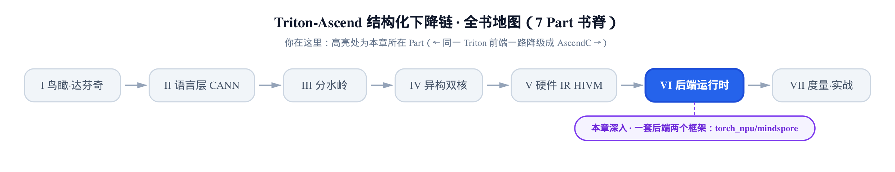
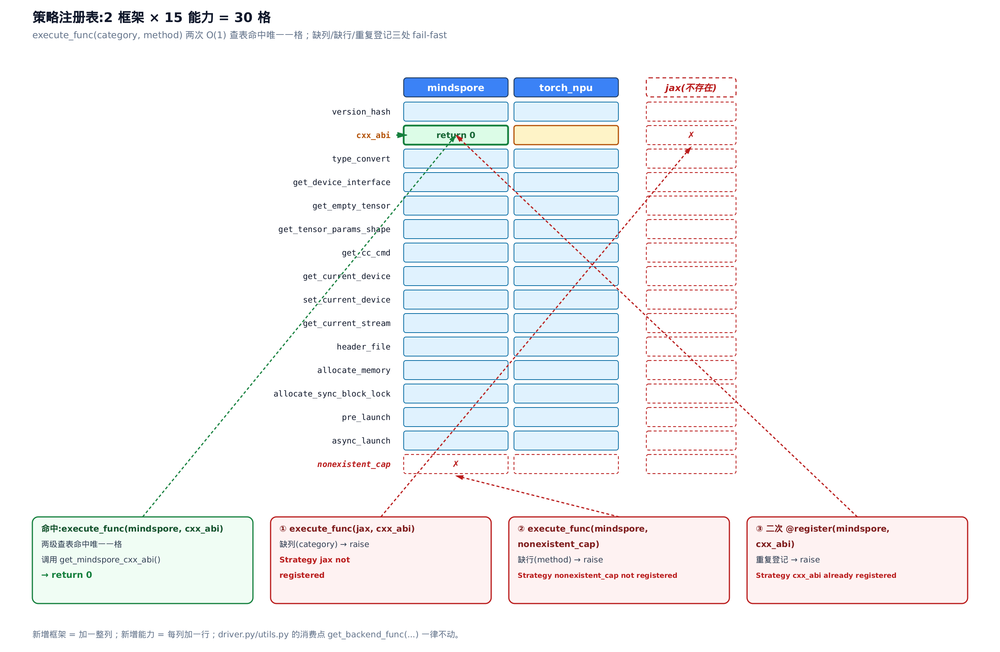
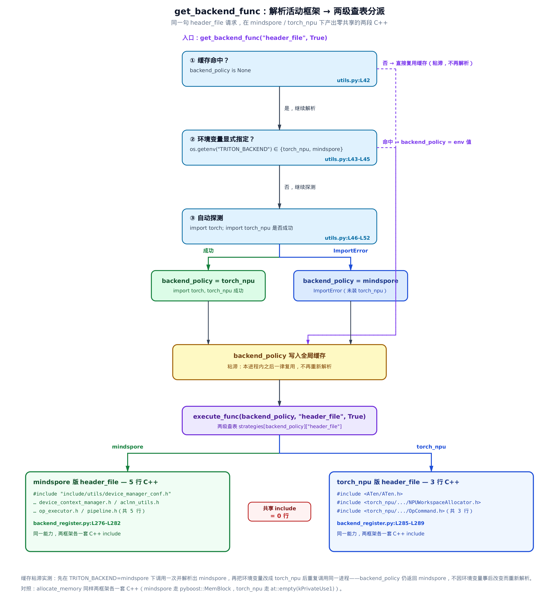

# 第 31 章　一套后端，两个框架：torch_npu / mindspore 策略注册表



![本章地图：两行蛇形泳道剖面——一条从「建表」到「用表」的主线。入口是 ch26／29／30 里反复出现的 get_backend_func 分派点；上排（节一→三，建表）先由 BackendStrategyRegistry 立起一张「框架 × 能力」两级表、用 register 装饰器登记（重复／缺 category／缺 method 三处 fail-fast），再经 _LazyBackendStrategyRegister 懒加载壳导出全模块唯一入口单例 backend_strategy_registry（框架 import 全写在被装饰函数体内、host 可导入），末站是同一能力两框架各一套实现的能力族（cxx_abi／async_launch 等）；下排（节四→五，用表）由 get_backend_func 先按 backend_policy 定活动框架、再 execute_func 两级查表命中唯一实现，节五小结「一张表换来一份昇腾后端不写死框架、torch_npu／mindspore 共用」；出口向下折进 Part 6 收官，接 capstone（ch32）与能力边界（ch33）](../diagrams/chapter-map.png)

> 图上节一、二是「表怎么长成」——注册表类与导出单例；节三是同一能力两框架各一套的能力族；节四、五是「表怎么用」——运行时分派与小结。只想抓「后端如何在运行时选中框架」这条主干的读者，可沿实线蓝「全程」路线顺读，或跳读只走节一、节四两站；对两框架各一套实现的对照细节感兴趣，再回节三专题细读。

> 上一章：发射器末段按框架切两套 C++。
> 本章：那张「框架 × 能力」策略表怎么建、怎么查。
> 下一章：进入第 VII 部分度量与实战。

**姊妹篇约定**。这本书全程对照基座《Triton 源码解读》（读上游 Triton v3.2.0）。前几章我们反复撞见一个函数 `get_backend_func`——[装二进制、抠函数句柄那一章](../../ch29-npu-driver-load/narrative/chapter.md)里，`NPUDriver`（昇腾后端 Driver）的 `get_current_device` / `set_current_device` / `get_current_stream` 全都转手给它；[发射器那一章](../../ch30-dynamic-launcher/narrative/chapter.md)里，wrapper 末段的显存分配、异步派发也都经它取不同的 C++ 片段。当时我们只说「它按名字分派到当前框架」，把内部实现留了个白。本章就来揭开这个白：`get_backend_func` 背后是一张两级**策略注册表**（strategy registry，把「同一件事、不同实现」按键存进表、按键取出的一层间接），它把「昇腾后端要同时服务两个上层框架」这件事收进了一处。

这一层，**基座 GPU/CUDA 侧完全没有**。基座里 kernel 发射的[那一章](../../../../triton/artifacts/ch37-ptx-cubin-launch/narrative/chapter.md)，launch 直接调 `cuLaunchKernel`（CUDA 把 kernel 派上 GPU 的运行时接口），一条线服务 PyTorch，没有「同一能力两套实现」的问题，也就没有这张表。它是昇腾后端为**多服务一个框架**而多长出来的一层抽象。

**这两个框架是谁**。一个是 torch_npu（昇腾的 PyTorch 扩展，`import torch_npu` 即把 PyTorch 的设备后端切到昇腾卡，ch03 已介绍）；另一个是 mindspore（华为自研的深度学习框架，与 PyTorch 并列的一套完整前端）。同一份昇腾 triton 后端，既要能跑在 PyTorch 用户的进程里，也要能跑在 mindspore 用户的进程里。可很多底层能力两框架各说各话：取版本号、读 C++ ABI 标志、把框架 dtype 翻成 numpy dtype、生成 kernel launcher 要 include 哪些头文件、怎么在设备上开一块显存、怎么异步发射——**同一件事，两框架的 API 截然不同**。把这些差异散落成一堆 `if backend == "torch_npu": ... else: ...` 会让每个消费点都长出两条岔路；这张注册表就是来收口的。

**关于本章的数字**。host 上没有昇腾 NPU、没有 CANN（华为昇腾软件栈）工具链，但有个巧妙之处：`backend_register.py` 文件顶层只 `import os` 和 `typing`，所有框架依赖（`torch` / `torch_npu` / `mindspore`）都写在**被装饰函数的函数体内**——所以这个模块可以在普通 host 上直接 `import` 进来、真跑注册与查表。本章表格里，「框架无关」的部分是**真跑**出来的：`mindspore/cxx_abi` 函数体是 `return 0` 不碰任何框架，`header_file` / `allocate_memory` / `async_launch` 是纯字符串拼装，这些都在 host 上取到了真实返回值。需要 `import torch` / `import mindspore` 的能力（`version_hash` / `type_convert`）只登记进表、查表核对对象身份，不在 host 上调用其函数体。运行时框架解析（`backend_policy`）那段逻辑因为它所在的 `utils.py` 携带 triton 重依赖、host 上导不进来，本章在驱动脚本里**逐字复刻**了它的解析分支，但分派用的注册表是真实单例、查表调用与源码字节一致。每张表附近都会再点一次它的口径。

下面按「导入期怎么建表 → 运行期怎么查表分派」的顺序读。

## 策略注册表：一张「框架 × 能力」的两级表

**直觉**。把它想成餐厅的一张点单矩阵：列是厨房（mindspore、torch_npu 两个框架），行是菜名（`version_hash`、`cxx_abi`、`header_file`……每一种能力）。每个格子里放着「这个厨房做这道菜的具体做法」。点单时报一列一行（框架，能力），两步就精确定位到唯一一份做法。要是报了不存在的厨房，或这个厨房没有的菜，前台当场喊错——而不是端上一盘空盘子让你吃出问题。

**机制**。注册表主体是 `BackendStrategyRegistry`，核心是一个两级字典 `strategies[category][method] = func`：外层键 category（框架名，如 `"mindspore"`），内层键 method（能力名，如 `"cxx_abi"`），值是实现函数。它只有三个承重方法——`register`（登记）、`execute_func`（查表并调用）、外加两个只读自省辅助。

先看登记与查表的账本。选 `cxx_abi`（读 C++ ABI 标志的能力；ABI = Application Binary Interface，二进制接口，这里特指 GCC 新旧两套 C++11 ABI 惯例，选哪套决定同一个函数名编出的底层符号名规则，两套混用会在链接期找不到符号）作命中样例，因为 `mindspore/cxx_abi` 的函数体就是 `return 0`、不 `import` 任何框架，可以在 host 上真跑取回真实返回值：

<!-- trace: m1-two-level-registry -->
| 动作 | (category, method) | 对表的作用 / 返回 | 判定 |
| --- | --- | --- | --- |
| 导入期执行 `@register("mindspore", "cxx_abi")` 装饰器 | `(mindspore, cxx_abi)` | `strategies["mindspore"]` 缺则新建空 dict，再存入 method→func；`return func` 原样 | 建表 · 唯一 |
| 全部 `@register` 执行完（2 框架 × 15 能力） | — | `list_categories = [mindspore, torch_npu]`；两框架各 15 个 method，共 30 格 | 登记完成：`2 × 15 = 30` 格 |
| `execute_func("mindspore", "cxx_abi")` 命中 | `(mindspore, cxx_abi)` | 两级查表命中 → 调 `get_mindspore_cxx_abi` → 返回 0 | 命中 · 返回 0 |
| `execute_func("jax", "cxx_abi")` 缺框架 | `(jax, ·)` | category 不在表中 → raise | 缺 category → `ValueError: Strategy jax not registered` |
| `execute_func("mindspore", "nonexistent_cap")` 缺能力 | `(mindspore, nonexistent_cap)` | category 在、method 不在 → raise | 缺 method → `ValueError: Strategy nonexistent_cap not registered` |
| 二次 `@register("mindspore", "cxx_abi")` 重复登记 | `(mindspore, cxx_abi)` | method 已存在 → 登记期 raise，不静默覆盖 | 重复 → `ValueError: Strategy cxx_abi already registered` |

（这张表是 host 真跑 `backend_register.py` 的注册表得出的：命中样例返回值 0 是 `get_mindspore_cxx_abi` 的真实调用结果，三条 raise 是真实触发的异常串。）

读这张表要抓一条**不变量**：每个（category, method）格子至多被登记一次；查表要么命中唯一实现，要么在「缺框架」「缺能力」两处之一 fail-fast（一发现不对就立刻抛错、绝不带病往下走），**绝不返回 `None` 让脏值流下去**。为什么成立？登记侧，`register` 里有 `if method in self.strategies[category]: raise`——第二次写同一格直接抛，所以每格单射。查表侧，`execute_func` 先 `if category not in strategies: raise`、再 `if method not in strategies[category]: raise`，两道守卫都过才 `return strategies[category][method](*args)`。三处 `raise` 恰好覆盖了「缺框架 / 缺能力 / 重复登记」全部三条越界路径（与上表第 4、5、6 行一一对应，各命中一处），返回值那条路只在两级键都在时才走到。

现在把源码摊开对照——这三处 `raise` 就是不变量的物证：

```python
# third_party/ascend/backend/backend_register.py:L25-L52
class BackendStrategyRegistry:
    def __init__(self):
        self.strategies: Dict[str: Dict[str, Callable]] = {}

    def register(self, category: str, method: str):
        def decorator(func: Callable):
            if category not in self.strategies:
                self.strategies[category] = {}
            if method in self.strategies[category]:
                raise ValueError(f"Strategy {method} already registered")
            self.strategies[category][method] = func
            return func
        return decorator

    def execute_func(self, category, method, *args, **kwargs):
        if category not in self.strategies:
            raise ValueError(f"Strategy {category} not registered")
        if method not in self.strategies[category]:
            raise ValueError(f"Strategy {method} not registered")
        return self.strategies[category][method](*args, **kwargs)

    def list_categories(self):
        return list(self.strategies.keys())

    def list_methods(self, category):
        if category not in self.strategies:
            raise ValueError(f"Strategy {category} not registered")
        return list(self.strategies[category].keys())
```

看 `register`：它**不是**直接登记，而是返回一个 `decorator`（装饰器，一个「拿到被定义的函数、把它加工/登记后再交回去」的函数）。这是关键——`@registry.register("mindspore", "cxx_abi")` 写在某个 `def` 头上时，Python 会拿这个 `def` 定义出的函数对象去喂 `decorator`，`decorator` 把它按 `(category, method)` 存进两级字典，再 `return func` 原样交还。所以「用装饰器登记」这一句里，登记和放行是一体两面：既进了表，函数名也还照常能用。`list_categories` / `list_methods` 是只读的自省辅助，调试时列一列表里都有谁，主线不碰它们。

把这张表画出来，就是下面这张网格——列是两个框架、行是十五个能力，绿色那条是 `(mindspore, cxx_abi)` 的命中路径，红色标出的是三条 fail-fast 出口——缺框架（`jax` 列）、缺能力（`nonexistent_cap` 行）、重复登记（同一格二次 `@register`）：



这张表的**工程价值**，一句话是把「新增维度」的成本压到最低。实现空间是 2 框架 × 15 能力 = 30 个（框架，能力）组合。要是散落成 `if/elif` 分派，新增一个能力得去每个消费点改两个分支；注册表把它降为「两框架各加一个 `@register`」，`driver.py` / `utils.py` 里所有 `get_backend_func("...")` 的调用点一律不动。同理，新增一个框架 = 加一整行 `@register`。这就是「对扩展开放、对分派点修改封闭」的开闭原则落到这里的样子——分派的成本永远是两次字典哈希，即 `$`O(1)`$`，与能力数、框架数都无关。

## 一个导出单例，和写在函数体内的 import

上一节的 `strategies` 字典必须只有**一份**——装饰器族往里存、消费方从里取，得是同一张表，否则各存各的就散了。这靠一个懒加载单例来保证。同时还有个更要紧的设计：所有框架 `import` 都藏在函数体内。这两件事一起，让「一份同时支持两框架的代码」在只装了一个框架的机器上也能 `import` 成功。

读代码前先把三个只差大小写和下划线的名字理清，免得读混：`BackendStrategyRegistry` 是上一节那个真正管两级字典的**注册表类**；`_LazyBackendStrategyRegister` 是套在它外面、只做「判空、复用」的**懒加载壳**；`backend_strategy_registry` 则是这个壳的一个**导出单例**，也是全模块对外唯一的入口。三者是「类 → 壳 → 单例」一条包装链。

```python
# third_party/ascend/backend/backend_register.py:L55-L70
class _LazyBackendStrategyRegister:
    def __init__(self):
        self._instance = None

    def _get_instance(self):
        if self._instance is None:
            self._instance = BackendStrategyRegistry()
        return self._instance

    def register(self, *args, **kwargs):
        return self._get_instance().register(*args, **kwargs)

    def execute_func(self, *args, **kwargs):
        return self._get_instance().execute_func(*args, **kwargs)

backend_strategy_registry = _LazyBackendStrategyRegister()
```

`_LazyBackendStrategyRegister`（懒加载单例，「首次用到才真正创建、之后永远复用同一个」的包装）内部持有一个 `_instance`，初始为 `None`。首次调 `register` 或 `execute_func` 时，经 `_get_instance()` 才 `new` 出真正的 `BackendStrategyRegistry`；之后再调，`_instance` 已不为 `None`，直接复用。模块最后一行 `backend_strategy_registry = _LazyBackendStrategyRegister()` 导出这个单例——装饰器族和所有消费方，见到的都是它这一个入口，因此 `strategies` 全局只有一份。**不变量**：无论懒加载有没有真的把创建延迟到首次调用，全局都只此一个 `BackendStrategyRegistry` 实例。（细节上，本模块自己的装饰器在导入期就会触发第一个 `register`，所以真正的注册表其实在导入期就实例化了——也就是说这层「懒加载」在本模块从未真正延迟过什么，命名 **名不副实但无害**，它真正兑现的是「全局唯一实例」这条保证；懒加载在这里更像一层防御式的间接——`_instance` 判空保证「只要有人调 `register` / `execute_func`，就复用同一个实例、绝不第二次 `new`」。它防的是这样的具体场景：假如未来有代码在装饰器还没执行前就抢先 `backend_strategy_registry.execute_func(...)`，或模块被以不同路径重复 `import` 触发重复初始化，判空都能兜住、仍旧只建一份表。）

**框架依赖延后**这件事更值得停一停。这是本章一个反常识的核心设计。**直觉**：两个厨房各锁着自己那一格柜子，只有真点了那道菜、动手去做时才去开对应的那一格——柜子锁没锁，跟你能不能进这家餐厅、点没点菜毫无关系。回头看上一节 `BackendStrategyRegistry` 的定义，文件顶层只有 `import os` 和 `from typing import ...`——**没有** `import torch`、**没有** `import mindspore`。所有框架 `import` 都被推进了被装饰函数的**函数体内**：

```python
# third_party/ascend/backend/backend_register.py:L86-L94
@backend_strategy_registry.register("mindspore", "cxx_abi")
def get_mindspore_cxx_abi():
    return 0


@backend_strategy_registry.register("torch_npu", "cxx_abi")
def get_torch_cxx_abi():
    import torch
    return 1 if torch._C._GLIBCXX_USE_CXX11_ABI else 0
```

`import torch` 写在 `get_torch_cxx_abi` 的函数体里，不在模块顶层。**为什么必须这样**？因为生产环境通常只装一个框架：mindspore 用户的机器上没有 `torch`，PyTorch 用户的机器上没有 `mindspore`。如果这些 `import` 写在模块顶层，`import backend_register` 这一句在只装单框架的机器上就会当场 `ImportError` 挂掉——一份「同时支持两框架」的代码反而哪个框架都装不了。把重依赖 `import` 推迟到「该框架对应的实现真正被调用时」，导入期就只做一件轻活：把函数对象登记进表。至于某支实现体内的 `import mindspore`，只有当前进程真的选了 mindspore、真的调到它时才执行——那时机器上必然装着 mindspore。这就是这个模块能在裸 host 上被本章直接 `import` 进来真跑注册表的原因：登记不碰框架。**不变量**：只要框架 `import` 全部留在被装饰函数的函数体内，导入期就不触碰任何框架依赖——于是只装了一个框架（甚至一个都没装）的机器，也能把这个「同时支持两框架」的模块 `import` 成功。

顺便认一下 `cxx_abi` 这个能力，它是全表**最简的对照例**：mindspore 版 `return 0` 一个常量，torch_npu 版读 `torch._C._GLIBCXX_USE_CXX11_ABI`（GCC 的 libstdc++ 用哪套 ABI 的开关宏，决定编出来的 C++ 符号名规则），装了新 ABI 返 1、否则 0。同一个「取 C++ ABI 标志」，一个是钉死的常量、一个要问框架，两框架实现天差地别——这正是这张表存在的理由。

## 能力族：同一能力，两框架各一套实现

`cxx_abi` 是最简的一对。整张表其实是一个**能力族**：每一种能力都有两框架各一套实现，登记进对应的两个格子。这些实现的返回值大体分三类形态，理解了这三类，就理解了这张表在服务什么。先给一句总起直觉：**这些成对的实现，全是在替消费方吸收「同一件事、两框架 API 不同」的差异——消费方只管报能力名，拿回来的东西已经是当前框架该用的那一份**。下面挨个看这三类。

**第一类，返回一个值（列表）**——比如 `version_hash`（取框架版本号，拼进编译缓存的 hash 键，保证换了框架版本就重编）：

```python
# third_party/ascend/backend/backend_register.py:L73-L83
@backend_strategy_registry.register("mindspore", "version_hash")
def version_hash():
    import mindspore
    return [str(mindspore.version)]


@backend_strategy_registry.register("torch_npu", "version_hash")
def version_hash():
    import torch
    import torch_npu
    return [torch.version.git_version, torch_npu.version.git_version]
```

这里藏着一个第一次读**必然会当成 bug** 的东西：文件里赫然有两个 `def version_hash()`，看着像后一个把前一个覆盖了。**其实没有**。原理在于装饰器的求值时机：Python 先对 `def` 求值、得到函数对象，**立即**把它喂给已经等在外面的 `decorator`（`register` 返回的那个），`decorator` 执行 `strategies[category][method] = func` ——此刻函数对象已经进表存好了。之后第二个同名 `def version_hash` 重走一遍，只是把模块级的名字 `version_hash` 重新绑到 torch 版函数上。注册表里攥着的是两份函数对象的**引用**，跟模块名牌挂在谁身上无关，所以两份实现都活着、各归各的格子。

在 host 上核一下对象身份就一清二楚（只核 `id` / `is` 的相等关系，不调用函数体——体内 `import` 框架跑不了，身份核验本身不触发调用）：

<!-- trace: m4-duplicate-def-name-rebind -->
| 引用来源 | 指向的对象（本次 run 的 id） | 是哪个 def | 身份关系 |
| --- | --- | --- | --- |
| `strategies["mindspore"]["version_hash"]` | `id=139743785337056` | mindspore 版 def（第一个 `version_hash`） | 与 torch_npu 版不同对象 |
| `strategies["torch_npu"]["version_hash"]` | `id=139743785337216` | torch_npu 版 def（第二个 `version_hash`） | 与 mindspore 版不同对象 |
| 模块名 `backend_register.version_hash` | `id=139743785337216` | torch_npu 版（最后一个 def） | `==` torch_npu 版，`≠` mindspore 版 |

（`id` 数值每次 run 都不同，**载荷是三者之间的相等 / 相异关系**，不是具体数值：注册表两格是两个不同对象——`…337056 ≠ …337216`；模块名 `…337216` 恰等于 torch_npu 版、不等于 mindspore 版——被「覆盖」的前一个 def 仍由注册表引用着，一份都没丢。）文件里 `version_hash` 与 `type_convert` 各出现 2 次同名 `def`，共 4 处，对应注册表里 4 个互不相同的函数对象（2 能力 × 2 框架）；模块级只留下 2 个名字，各指向对应能力的最后一个 def。**丢失数 = 0**。看懂这一条，往后再见到成对同名 `def` 就不慌了——它是这张表的常态写法。

**第二类，返回一张映射表**——比如 `type_convert`（把框架的 dtype 对象翻成 numpy dtype）：

```python
# third_party/ascend/backend/backend_register.py:L97-L134
@backend_strategy_registry.register("mindspore", "type_convert")
def type_convert():
    import mindspore
    import numpy as np
    MINDSPORE_TO_NUMPY_DTYPE = {
        mindspore.float32: np.float32,
        # … 省略：float64/float16/int8/uint8/int16/int32/int64/bool/complex64/complex128 同构 …
        mindspore.complex128: np.complex128,
    }
    return MINDSPORE_TO_NUMPY_DTYPE


@backend_strategy_registry.register("torch_npu", "type_convert")
def type_convert():
    import torch
    import numpy as np
    TORCH_TO_NUMPY_DTYPE = {
        torch.float32: np.float32,
        # … 省略：float64/float16/int8/uint8/int16/int32/int64/bool/complex64/complex128 同构 …
        torch.complex128: np.complex128,
    }
    return TORCH_TO_NUMPY_DTYPE
```

两版返回的都是「框架 dtype 对象 → numpy dtype」的映射，键类型不同（`mindspore.float32` vs `torch.float32`）但值域（`np.*`）完全一致。消费方是 `utils.py` 里的 `convert_dtype_to_numpy(dtype)`，一行 `return get_backend_func("type_convert")[dtype]`——拿到当前框架的表后直接 `[dtype]` 索引。消费方不知道也不关心自己拿的是哪套框架的表，它只管「给我 type_convert 表，我要查一个 dtype」。差异被这张表吸收干净了。

**第三类，返回一段 C++ 源码字符串**——这类最能体现「两框架同床异梦」，因为它拼进的是 `driver.py` 现生成的 kernel launcher（发射器 wrapper，ch30 讲过它是每个 kernel 现打印、现编译的一段 C++）。看显存分配和异步发射这两对：

```python
# third_party/ascend/backend/backend_register.py:L292-L300, L328-L336（非相邻，拼示）
@backend_strategy_registry.register("mindspore", "allocate_memory")
def allocate_memory(size, stream):
    return f'''auto work_ptr = std::make_shared<mindspore::kernel::pyboost::MemBlock>(device_context, {size}, reinterpret_cast<uint64_t>({stream}));
    workspace_addr_ptr = work_ptr->ptr_;'''


@backend_strategy_registry.register("torch_npu", "allocate_memory")
def allocate_memory(size, stream):
    return f"workspace_addr_ptr = const_cast<void *>(at::empty({size}, at::TensorOptions().device(at::kPrivateUse1).dtype(at::kByte)).storage().data());"


# … 省略：中间还有 allocate_sync_block_lock / pre_launch 两对，同为「两框架各一套」样本 …


@backend_strategy_registry.register("mindspore", "async_launch")
def async_launch(func):
    return f'''mindspore::runtime::OpExecutor::DispatchLaunchTask({func});'''


@backend_strategy_registry.register("torch_npu", "async_launch")
def async_launch(func):
    return f'''at_npu::native::OpCommand cmd;
    cmd.Name(name.c_str()).SetCustomHandler({func}).Run();'''
```

同一件「在设备上开一块 workspace 显存」，mindspore 走 `pyboost::MemBlock`（它的即时执行显存块），torch_npu 走 `at::empty(...)` 建一个 `kPrivateUse1`（PyTorch 预留给第三方设备后端的设备类型）上的字节张量再抠出裸指针——两段 C++ 一个字符都不重叠。同一件「异步发射」，mindspore 用 `OpExecutor::DispatchLaunchTask`，torch_npu 用 `OpCommand.SetCustomHandler().Run()`。这些字符串会被 f-string 塞进 `driver.py` 生成的 launcher 源码里，编成 kernel 专属的发射代码。ch30 讲发射器时说末段「按 `torch_npu` / `mindspore` 双后端策略表切两套 C++、共五个注入点」——那五个注入点，取的就是这张表里 `header_file` / `allocate_memory` / `allocate_sync_block_lock` / `pre_launch` / `async_launch` 这些能力的当前框架实现。这一章讲的表，就是那五个注入点背后的账本。

## 运行时分派：get_backend_func 先定框架，再查表

导入期把表建好了。运行期，消费方并不直接碰这张表——它们全都经一个统一入口 `get_backend_func`。这个入口干两件事：**先定「今天用哪个框架」，再拿这个框架去查表取实现**。

**直觉**。进程开机时先决定用哪个厨房：墙上贴了指定条（环境变量 `TRITON_BACKEND`）就照它；没贴，就看柜子里装了哪套锅具（能不能 `import torch_npu`）自动判断。决定一次就记在门口小黑板上（全局缓存），之后每道菜都直接去那个厨房、不再重新判断。于是同一句「给我 `header_file`」，在 mindspore 厨房和 torch_npu 厨房端出来的是两段完全不同的 C++。

**机制**。活动框架存在模块级全局 `backend_policy` 里，解析有明确的优先级，且**一个进程只解析一次**。选 `header_file`（两框架实现都是纯 f-string，host 可真跑取回两段真实 C++ 头文件串）作分派样例，走三条路各看一次：

<!-- trace: m2-active-framework-dispatch -->
| TRITON_BACKEND | 解析出的 backend_policy | 命中实现 (policy, header_file) | 返回 C++ 首行 |
| --- | --- | --- | --- |
| `mindspore` | `mindspore` | `mindspore/header_file` | `#include "include/utils/device_manager_conf.h"` |
| `torch_npu` | `torch_npu` | `torch_npu/header_file` | `#include <ATen/ATen.h>` |
| `torch_npu`（已改，但缓存已定） | `mindspore`（缓存不变） | `mindspore/header_file` | `#include "include/utils/device_manager_conf.h"` |

（`header_file` 两框架实现是纯字符串拼装，这三行返回值是 host 真跑取回的真实 C++ 首行。解析出 `backend_policy` 的那段分支逻辑因 `utils.py` 携带 triton 重依赖、host 上导不进来，在驱动脚本里按源码逐字复刻，但分派用的是真实注册表单例、`execute_func` 查表调用与源码字节一致。）

第一、二行是「显式指定哪个就用哪个」。**第三行是要害**：先在 `TRITON_BACKEND=mindspore` 下调用一次、把缓存定成 mindspore，再把环境变量改成 `torch_npu` 重新调用——返回的**仍是 mindspore 版** C++。这就是本节的**不变量**：一次进程内 `backend_policy` 只解析一次，首次调用把结果写进全局后，后续调用即便环境变量已改也一律复用旧值，活动框架进程内恒定。用两拍看得更清楚：

| 调用 | 进入时 `backend_policy` | 走不走解析 | 出来后 `backend_policy` |
| --- | --- | --- | --- |
| 第 1 次（env=mindspore） | `None` | 走：命中 env → 定为 `mindspore` | `mindspore` |
| 第 2 次（env 已改 torch_npu） | `mindspore`（非 None） | **跳过**整段解析 | `mindspore`（不变） |

看源码里这道闸门：

```python
# third_party/ascend/backend/utils.py:L37-L53
backend_policy = None


def get_backend_func(name, *args, **kwargs):
    global backend_policy
    if backend_policy is None:
        backend_policy_env = os.getenv("TRITON_BACKEND", "default").lower()
        if backend_policy_env == "torch_npu" or backend_policy_env == "mindspore":
            backend_policy = backend_policy_env
        if backend_policy is None:
            try:
                import torch
                import torch_npu
                backend_policy = "torch_npu"
            except ImportError:
                backend_policy = "mindspore"
    return backend_strategy_registry.execute_func(backend_policy, name, *args, **kwargs)
```

`if backend_policy is None:` 是**唯一**的解析闸门：只有全局仍为 `None` 才往里走。里面是明确的两级优先级——先读环境变量 `TRITON_BACKEND`，取值是 `torch_npu` / `mindspore` 就用它；否则进**自动探测**：`try` 里 `import torch` + `import torch_npu`，成功就判 `torch_npu`（装了 torch_npu 即视为 PyTorch 线），`ImportError` 就判 `mindspore`（连 torch_npu 都装不上，那就是 mindspore 环境）。一旦被赋成某个值，`backend_policy` 就不再是 `None`，后续调用整段解析被跳过、直落最后一行 `execute_func`。最后一行就是把解析出的 category（`backend_policy`）连同 name（method）一起交给上半章那张表两级查询、命中就调用返回。分派入口和注册表，在这里接上了。

把这条运行时路径画全，就是下面这张流程图——从入口判缓存、解析框架、写全局缓存，到两级查表分叉出两框架各一套 C++：



图里右下那句「共享 include = 0 行」值得点一下：同一个 `header_file` 请求，mindspore 版拼出 5 行（3 行固定 include 加 `op_executor.h` / `pipeline.h` 两行），torch_npu 版拼出 3 行（`ATen`、`NPUWorkspaceAllocator`、`OpCommand`），两版逐行比对**零交集**。这就是「一份后端服务两框架」要收拢的差异的极端样子——连一行头文件都不共享。

把 mindspore 版 `header_file` 的真源码摊开，最后两行藏着一个真实的源码孤例，值得逐字看清：

```python
# third_party/ascend/backend/backend_register.py:L276-L282
@backend_strategy_registry.register("mindspore", "header_file")
def header_file(enable_taskqueue):
    return f'''#include "include/utils/device_manager_conf.h"
#include "include/runtime/hardware_abstract/device_context/device_context_manager.h"
#include "include/mindspore/ops/kernel/ascend/aclnn/pyboost_impl/aclnn_utils.h"
{'#include "include/pynative/utils/runtime/op_executor.h"' if {enable_taskqueue} else ''}
{'#include "include/runtime/pipeline/pipeline.h"' if {enable_taskqueue} else ''}'''
```

前三行是无条件的固定 include；关键在最后两行 `op_executor.h` / `pipeline.h`——它们写成 `... if {enable_taskqueue} else ''` 的形态，**看着**像「taskqueue 开启时才出现」的条件项，**实则不是**。注意 `enable_taskqueue` 外面被作者多套了一层花括号 `{enable_taskqueue}`，在 f-string 表达式里这是一个**单元素集合字面量**（`{x}` 是含一个元素的 `set`，不是取那个形参的值），非空集合恒为真，于是这个 `if` 判的根本不是形参 `enable_taskqueue` 的真伪、而是「一个非空 set 真不真」——永远走 True 支，这两行 include 无论传进来的 `enable_taskqueue` 是 True 还是 False 都照样输出。这是上游一处真实的 set-literal 笔误：`enable_taskqueue` 这个形参在这里名不副实，压根没起作用。坐实它是孤例而非误读的旁证有两条：其一，torch_npu 版 `header_file` 那唯一一行条件 include（`OpCommand.h`）也栽在同一个 `{enable_taskqueue}` 上；其二，同文件其余七处消费 `enable_taskqueue` 的地方（`driver.py` 里）写的都是正确的、不带花括号的 `if enable_taskqueue else`，独此 `header_file` 两版三行出错。本章驱动脚本恰好撞出了反例：显式传 `enable_taskqueue=False` 去调 `header_file`，拿回来的仍是完整 5 行、taskqueue 那两行照样在——材料自己就验证了这两行与形参的值无关。诚实地说，这是一段带 bug 的上游源码，本章照原样内嵌、不美化。

而消费点 `driver.py` 里那句 `get_backend_func("header_file", enable_taskqueue)` 对这些一无所知，它只报能力名，拿回来的已经是当前框架该用的那一份。

**回到消费落点**，把这张表接回全书主线。`utils.py` 里，编译缓存 hash 拼 `get_backend_func("version_hash")`、`convert_dtype_to_numpy` 用 `get_backend_func("type_convert")[dtype]`、算 ABI 用 `get_backend_func("cxx_abi")`；`driver.py` 生成 launcher 时，头文件段 `get_backend_func("header_file", ...)`、显存段 `get_backend_func("allocate_memory", ...)`、异步段 `get_backend_func("async_launch", ...)`。前几章每次撞见 `get_backend_func` 留的那个白，现在补齐了：它每一次都是「先定框架、再查这张表」，把「同一件事两框架各一套」的分派收进了一处。

## 小结：一张表，换来「后端不写死框架」

这一章其实只讲了一个模式：**可插框架的策略注册表**。两级字典 `strategies[category][method]`，category 维选「用哪套框架实现」、method 维选「哪个能力」，`register` 用装饰器登记（重复即 raise 保唯一）、`execute_func` 两级查表分派（缺框架 / 缺能力都 fail-fast）；框架 `import` 全推进函数体、导入期只登记不碰依赖，让单框架机器也能 `import`；懒加载单例保证全表只有一份；运行时 `get_backend_func` 解析一次活动框架、缓存粘滞，之后每次分派都是两次 `$`O(1)`$` 哈希。

它买到的是**结构解耦**：`driver.py` / `utils.py` 里几十处消费点，从头到尾不知道自己跑在 torch_npu 还是 mindspore 上，只报能力名；新增一个框架就加一整行 `@register`、新增一个能力就两框架各加一格，分派点一处不动。这份代价换来的，是一份昇腾后端能同时躺在 PyTorch 用户和 mindspore 用户的进程里跑。

而这整整一层，基座 GPU/CUDA 侧是没有的——CUDA 只服务 PyTorch 一条线，launch 直接 `cuLaunchKernel`，不存在「同一能力两框架」的问题，也就用不着这张表。它是昇腾后端为「多服务一个框架」多长出来的抽象，也是「fork 一份后端、让它可插框架」这件事最干净的一个样本。
