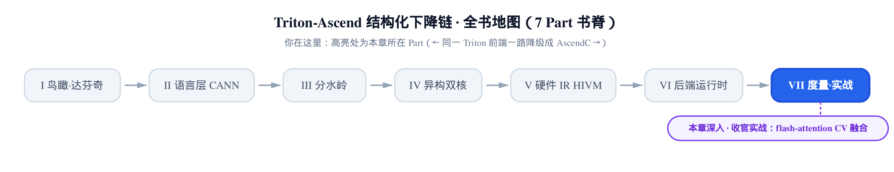
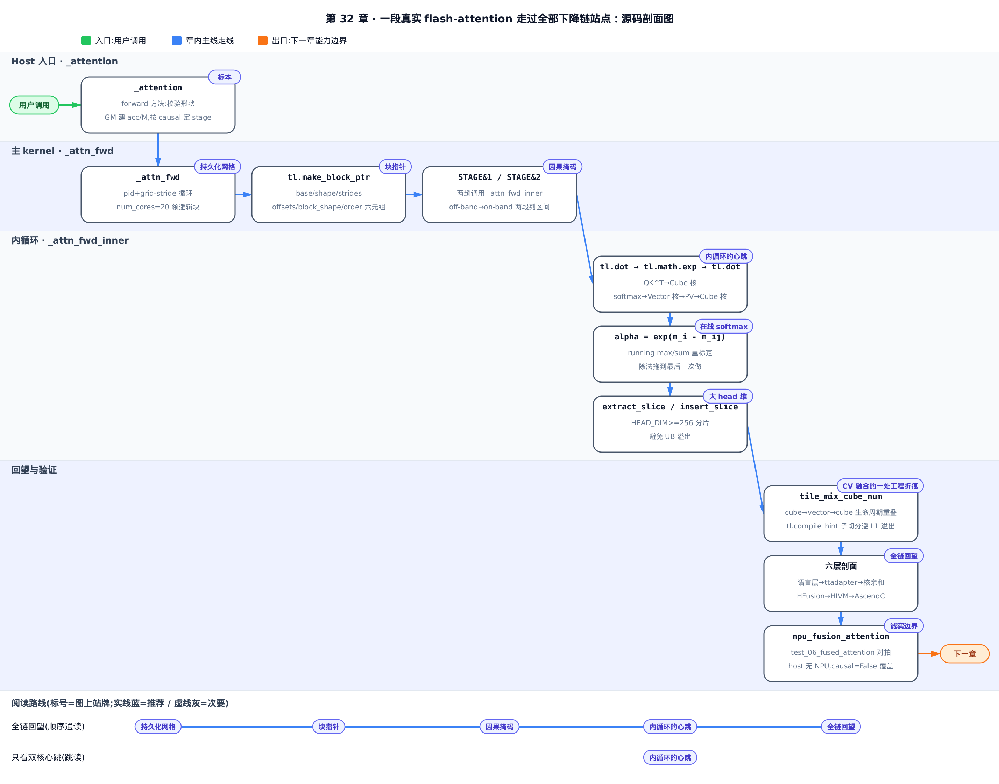
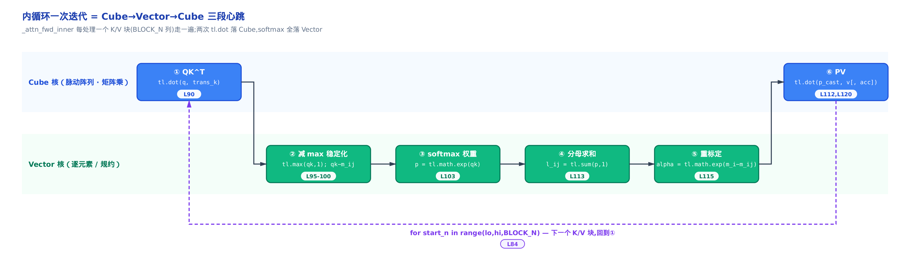
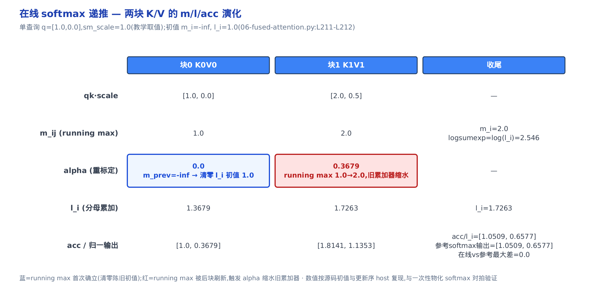
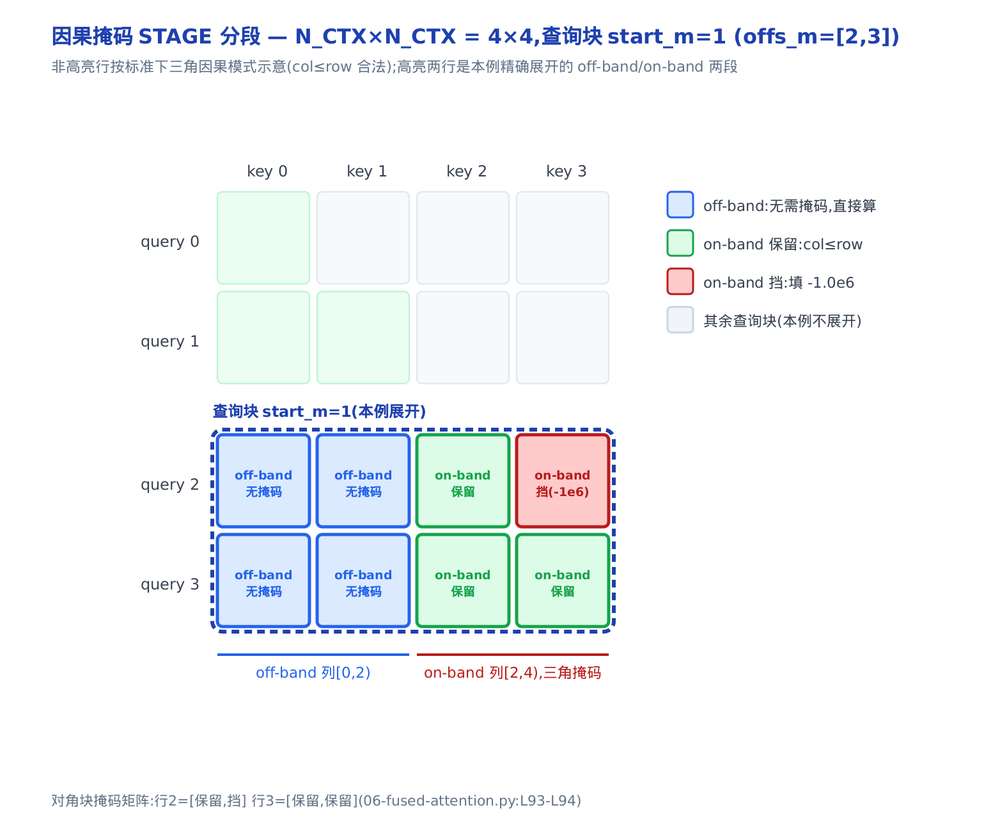
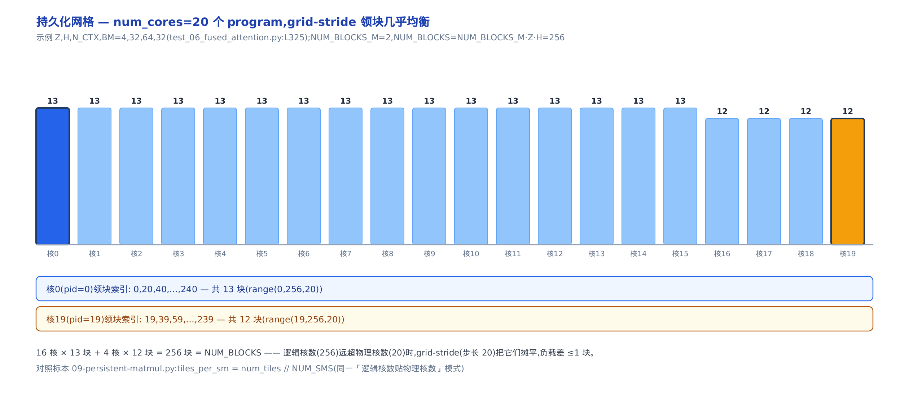
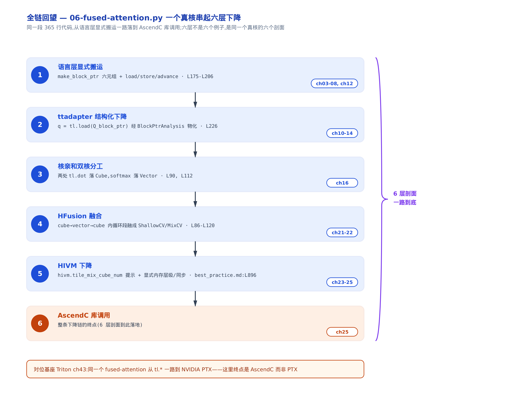

# 实战收官：flash-attention 融合注意力在昇腾的 CV 融合落地



- 上一章把整条下降链在库调用这一站收了口。
- 本章拿一个真核，把前面每一层重新串一遍。
- 下一章接着谈：这套写法到底能覆盖多少情形。

前面三十章，我们像剥洋葱一样把 Triton 到昇腾的下降链一层层拆开：语言层怎么显式搬运、ttadapter 怎么把块访问降成结构化张量、核亲和怎么判该上哪个核、HFusion 怎么把算子融起来、HIVM 怎么下降到内存层级与同步。每一层都用小例子讲透了。但小例子有个通病——读者容易觉得「这些机制是各自为战的」。

这一章不再引入新机制。我们换一种读法：拿仓库自带的一段真实 kernel 当**活体标本**，把散在三十章里的每个机制，用同一个读者熟悉的算子重新串起来，看它们协同起来是什么样子。

标本是 `third_party/ascend/tutorials/06-fused-attention.py`，一段 365 行的 **Flash Attention v2**（一种 IO 感知的分块注意力算法，用在线累加避免物化整张注意力矩阵，出自 Tri Dao，arXiv:2205.14135）真实实现。它足够典型：注意力就是「两次矩阵乘夹一个 softmax」，而这恰好把达芬奇（DaVinci，昇腾 AI Core 的架构名）**cube 核 + vector 核**的双核分工写在了明面上——**cube 核**专啃矩阵乘（内部是脉动阵列，每拍完成一批乘加），**vector 核**专啃逐元素与规约。两次矩阵乘天然归 cube，softmax 天然归 vector，一个真核就把 **CV（cube+vector）融合**这件事讲清了。

> 只想看「注意力如何落成 Cube/Vector 双核心跳」，直接跳到「内循环的心跳」一节；想跟着回望整条下降链，按序读到末尾的「全链回望」。



图上是这条标本从 `_attention` 入口到 `_attn_fwd_inner` 双核心跳、再到「全链回望」六层剖面的完整路线。只想抓住 CV 融合这条主线，看着图跳「内循环的心跳」和「全链回望」两节就够；想连块指针、STAGE 掩码、持久化网格这些旁支细节一起看全，就照图从左到右按序走完每一节。

## 标本：365 行 Triton 里有什么

先鸟瞰这段代码的骨架。它由三个函数搭成，从外到内是：

- `_attention`（一个 `torch.autograd.Function` 前向包装，第 263 行）——用户入口，负责校验形状、分配工作区、发射 kernel。
- `_attn_fwd`（`@triton.jit` 主 kernel，第 148 行）——取核号、建块指针、初始化累加器、按 STAGE 调内循环、收尾写回。
- `_attn_fwd_inner`（`@triton.jit` 设备函数，第 48 行）——注意力内循环，全章的心跳所在。

其中 `@triton.jit`（just-in-time，标记该函数为待即时编译的设备核）是 Triton 声明设备端代码的方式，前面章节已反复见到。

从用户入口看起。`attention = _attention.apply` 是暴露给外部的调用名，真正干活的是它的 `forward`：

```python
# third_party/ascend/tutorials/06-fused-attention.py:L288-L298
        out = torch.empty_like(q)
        stage = 3 if causal else 1
        extra_kern_args = {}

        # Number of NPU cores (adjust based on hardware)
        num_cores = 20
        acc = torch.zeros((q.shape[0], q.shape[1], q.shape[2], HEAD_DIM_K), dtype=torch.float32, device=q.device)
        M = torch.empty((q.shape[0], q.shape[1], q.shape[2]), device=q.device, dtype=torch.float32)

        _attn_fwd[(num_cores,)](
        # … 省略：把 q/k/v/M/out/acc/sm_scale + 全部 stride + Z/H/N_CTX/HEAD_DIM/BLOCK_M/BLOCK_N/STAGE 逐一传进 kernel（L299-L309），实参逐个对应 _attn_fwd 签名，无新语义 …
```

这九行藏着三个后面要展开的设计选择，先记住它们的名字：

- `stage`（下面统一写作 STAGE）：`3 if causal else 1`。它是一个整数开关，编码了「是否因果掩码」，值 3 或 1 后面用位运算拆开。**因果注意力**（causal attention）指每个位置只能看当前及之前的 token，不能偷看未来。
- `num_cores = 20`：**硬编码的物理核数**，直接当作一维网格大小。为什么不按数据量算网格、而是钉死物理核数？这是本章「持久化网格」一节的主角。
- `acc`（accumulator，输出累加器）与 `M`：在 **GM**（Global Memory，片外全局显存）里预开的两块工作区。`acc` 是全零的 f32 缓冲，`M` 存 logsumexp（每行 softmax 的对数归一项，反向传播要用）。

`_attn_fwd[(num_cores,)]` 就是发射：一维网格，只发 `num_cores` 个 program（Triton 的并行单位，一个 program 处理一批数据块，`tl.program_id` 取它的编号）。

再看内循环的签名，它的输入直接告诉你「一次注意力内循环需要什么」：

```python
# third_party/ascend/tutorials/06-fused-attention.py:L47-L53
@triton.jit
def _attn_fwd_inner(acc_ptr, l_i, m_i, q,  # Accumulator, local l, local m, query vector
                    K_block_ptr, V_block_ptr,  # Key and value block pointers for current stage
                    start_m, qk_scale,  # Starting position of current query block, qk scale factor
                    BLOCK_M: tl.constexpr, HEAD_DIM: tl.constexpr, BLOCK_N: tl.constexpr,  # Block size constants
                    STAGE: tl.constexpr, offs_m: tl.constexpr, offs_n: tl.constexpr,  # Current stage flag, m and n offset indices
                    N_CTX: tl.constexpr, fp8_v: tl.constexpr):  # Total context length, whether to enable FP8 for value precision
```

盯住前四个参数：`acc_ptr`、`l_i`、`m_i` 是三个**在线累加器**，`q` 是常驻的查询块。`K_block_ptr` / `V_block_ptr` 是 **block_ptr**（块指针，带形状与步长元信息的结构化指针，见[第 12 章](../../ch12-blockptranalysis-memref/narrative/chapter.md)的 BlockPtrAnalysis）。`start_m` 是当前查询块的起始位置，`qk_scale` 是 `` $`QK^\top`$ `` 的缩放因子，`BLOCK_M`/`BLOCK_N`/`HEAD_DIM` 是编译期常量（`tl.constexpr`）分块尺寸。`fp8_v` 是是否对 V 启用 FP8（一种 8 位浮点省显存格式）的开关——本章被测路径上它恒为假，相关分支略过。

三个累加器 `m_i`、`l_i`、`acc_ptr` 是整段算法的命脉。它们是什么、为什么只需要这三个，是下面两节的核心。

## 内循环的心跳：Cube→Vector→Cube

**直觉**：注意力这件事，剥到底就是一句话——「两次矩阵乘，夹一个 softmax」。第一次矩阵乘算 `` $`QK^\top`$ ``（查询和键的相似度分数），中间做 softmax 把分数变成权重，第二次矩阵乘用权重去加权 V。搬到达芬奇，这句话直接变成硬件分工：两次矩阵乘归 cube 核，中间的 softmax 归 vector 核。一次内循环迭代，就是一次 **Cube→Vector→Cube 的心跳**。

**机制**：把这次心跳拆成六拍，逐拍看它落在哪个核上。



- 第一拍，`tl.dot(q, trans_k)` 算 `` $`QK^\top`$ ``——**矩阵乘 → cube 核**。`trans_k = tl.trans(k)` 先把加载进来的 K 块转置，才能和 q 做点积。
- 第二到五拍，减最大值稳定化（`tl.max` 求每行最大、`qk - m_ij`）、`tl.math.exp` 求指数、`tl.sum` 求分母、`alpha` 重标定——**全是逐元素与规约 → vector 核**。
- 第六拍，`tl.dot(p_cast, v, acc_ptr)` 算加权 V 并累加——**又一次矩阵乘 → cube 核**。

判核依据在[第 16 章](../../ch16-core-affinity/narrative/chapter.md)的核亲和分析里讲透了：有 `tl.dot` 的算子落 cube，逐元素与规约落 vector。这里不是我们人为指派，而是算子的数学性质决定的。这段代码把双核分工写在了明面上：

```python
# third_party/ascend/tutorials/06-fused-attention.py:L84-L120
    for start_n in range(lo, hi, BLOCK_N):  # Process BLOCK_N columns at a time
        start_n = tl.multiple_of(start_n, BLOCK_N)  # Align column start position
        # -- Compute qk ----
        k = tl.load(K_block_ptr)
        # Modify K
        trans_k = tl.trans(k)
        qk = tl.dot(q, trans_k)
        # Apply causal mask for STAGE 2
        if STAGE == 2:
            mask = offs_m[:, None] >= (start_n + offs_n[None, :])  # Construct upper triangular mask
            qk = qk * qk_scale + tl.where(mask, 0, -1.0e6)  # Set invalid positions to -∞
            m_ij = tl.maximum(m_i, tl.max(qk, 1))  # Update m_ij = max(m_i, max(qk))
            qk -= m_ij[:, None]  # Subtract max for softmax stability
        else:
            qk = qk * qk_scale
            m_ij = tl.maximum(m_i, tl.max(qk, 1))  # Scaled max
            qk = qk - m_ij[:, None]  # Stabilize

        # Softmax weights p = exp(qk)
        p = tl.math.exp(qk)

        # Convert softmax weight type depending on FP8 usage
        # … 省略：fp8_v 为真时 p.to(tl.float8e5)（L106-L107），本章被测路径 fp8_v 恒假，走下面 else …
        p_cast = p.to(k.dtype)

        v = tl.load(V_block_ptr)  # Load corresponding V block
        pv = tl.dot(p_cast, v)
        l_ij = tl.sum(p, 1)  # Softmax denominator (sum of each row)
        # -- Update m_i and l_i
        alpha = tl.math.exp(m_i - m_ij)  # Update factor: exp difference between old and new max
        l_i = l_i * alpha + l_ij  # Update softmax denominator
        # -- Update output accumulator --
        if HEAD_DIM < 256:
            acc_ptr = acc_ptr * alpha[:, None]
            acc_ptr = tl.dot(p_cast, v, acc_ptr)
        # … 省略：HEAD_DIM >= 256 的分片路径（L121-L137），留到「大 head 维」一节 …
```

有两处要挑明。其一，两类矩阵乘各出现一次：`qk = tl.dot(q, trans_k)`（第 90 行，`` $`QK^\top`$ ``）和末尾的 PV。PV 在 `HEAD_DIM < 256` 的直白路径里写成融合形式 `tl.dot(p_cast, v, acc_ptr)`（第 120 行，把矩阵乘结果直接累加进 `acc_ptr`）；前面第 112 行那句 `pv = tl.dot(p_cast, v)` 只在大 head 维的分片路径里用到。其二，掩码那段（`STAGE == 2`）暂时先放着，它属于「因果掩码」一节。

**源码里的三个累加器**。`m_i` 是 running max（至今见过的每行最大分数）、`l_i` 是 running sum（softmax 分母）、`acc_ptr` 是输出累加器。`m_ij = tl.maximum(m_i, tl.max(qk, 1))` 更新 running max，`alpha = tl.math.exp(m_i - m_ij)` 是重标定因子——它为什么等于 `` $`e^{m_i - m_{ij}}`$ ``、又凭什么能保证结果正确，是下一节的正题。

这段 `_attn_fwd_inner` 不只是我们拿来举例——昇腾自己的最佳实践文档也正是拿它当 cube→vector→cube 的样板（`third_party/ascend/AscendNPU-IR/docs/source/en/user_guide/best_practice.md:L878`）。这一点在「CV 融合的工程折痕」一节会回收。

## 在线 softmax：不摊开 N×N 的秘诀

**直觉**：想象你在给一叠考卷滚动记总分，但不许留底稿。先按第一批卷子的最高分定一条基准线（running max `m_i`），把每份卷子折算成相对这条线的权重，累加进跑分（`acc`）和权重和（`l_i`）。当第二批冒出更高分，就先把旧基准整体抬到新高分——旧的跑分和权重和统一乘一个缩水因子（旧最大与新最大之差的指数）再继续加。全程只留三个累加器，从不把整叠卷子（整张 `` $`N\times N`$ `` 注意力矩阵）摊在桌上。这就是 **在线 softmax**（online softmax，边扫边累加、不物化中间矩阵的 softmax）。

**机制**。先把递推写成两条式子。设处理到第 `` $`j`$ `` 块，块内局部最大是 `` $`\max_k qk_k`$ ``：

```math
m_{ij} = \max\!\left(m_i,\ \max_k qk_k\right),\qquad \alpha = e^{\,m_i - m_{ij}}
```

第一步把 running max 更新到新块。`` $`\alpha`$ `` 是旧基准相对新基准的换算因子：旧累加器里每一项都是「以旧 `` $`m_i`$ `` 为基」算的，乘上 `` $`\alpha`$ `` 就整体换算成「以新 `` $`m_{ij}`$ `` 为基」，因为下面这条恒等式成立：

```math
e^{\,s - m_i}\cdot e^{\,m_i - m_{ij}} = e^{\,s - m_{ij}}
```

这一步买到的是：新旧两块可以同基相加。

```math
l_i \leftarrow l_i\cdot\alpha + \sum_k e^{\,qk_k - m_{ij}},\qquad \mathrm{acc} \leftarrow \mathrm{acc}\cdot\alpha + e^{\,qk - m_{ij}}\,V
```

第二步就是同基相加：旧累加器缩水，加上本块的新贡献。除法（除以分母 `` $`l_i`$ ``）一直拖着不做，等所有块扫完再一次性归一。

拿一个能心算的小例子走两块。单查询行、head 维为 2、缩放因子取 1.0（教学取值便于心算；真实测试用 0.5，见 `test_06_fused_attention.py:L339`），两块 K/V：

<!-- trace: online-softmax-recurrence -->

| 块 j | qk·scale | m_ij=max(m_i, max qk) | alpha=exp(m_prev−m_ij) | p=exp(qk−m_ij) | l_i←l_i·alpha+Σp | acc←acc·alpha+p·V |
|---|---|---|---|---|---|---|
| 块0 | [1.0, 0.0] | 1.0 | 0.0（m_prev=−inf→exp(−inf)=0，恰把 l_i 初值 1.0 清零） | [1.0, 0.3679] | 1.3679 | [1.0, 0.3679] |
| 块1 | [2.0, 0.5] | 2.0 | 0.3679（running max 从 1.0 升到 2.0，旧累加器缩水） | [1.0, 0.2231] | 1.7263 | [1.8141, 1.1353] |
| 收尾 | — | m_i=2.0，加 log(l_i) 得 logsumexp=2.546（源码 L247） | — | — | l_i=1.7263 | acc/l_i=[1.0509, 0.6577]（源码 L249 归一） |

读法：块0 时 `m_prev` 是初值 `` $`-\infty`$ ``，`` $`\alpha = e^{-\infty} = 0`$ `` 恰好把 `l_i` 的初值 1.0 清零——这正是初值设成 `l_i = 1.0`、`m_i = -inf` 的用意（源码 L211-L212），第一块自动接管。块1 冒出更高分 2.0，`` $`\alpha = 0.3679`$ `` 把块0 攒下的 `acc` 和 `l_i` 整体缩水，再叠加块1 的贡献。收尾一次除法归一，得 `[1.0509, 0.6577]`。（`acc` 列的绝对数值还依赖本例未展开的 V 取值，读者心算时只需验证 `m_ij`/`alpha`/`l_i` 这几列的递推；`acc` 列要看的是「先乘 `alpha` 缩水、再加本块新贡献」这一相对变化，而非绝对值。）



**不变式与正确性**。要证的是：处理完所有块后，`acc/l_i` 恰等于对整段 `` $`QK^\top`$ `` 一次性做 softmax 再乘 V 的结果。归纳来证。

**基例（块0）**：`m` 从 `` $`-\infty`$ `` 变为块0 的最大分，重标定因子 `` $`\alpha`$ `` 退化成 `` $`e^{-\infty}=0`$ ``，把初值 `l = 1`、`acc = 0` 清零，故 `acc/l` 只含块0 的加权，成立。

**归纳步（块 j+1）**：遇新最大值 `` $`m_{j+1}\ge m_j`$ ``，重标定因子把旧 `acc`、`l` 从「以 `` $`m_j`$ `` 为基」整体换算到「以 `` $`m_{j+1}`$ `` 为基」，靠的是下面这条同基换算：

```math
e^{\,s_i - m_j}\cdot e^{\,m_j - m_{j+1}} = e^{\,s_i - m_{j+1}},\qquad e^{\,m_j - m_{j+1}} \le 1
```

换算后与新块项同基，直接相加，不变式保持。

**终止**：块数有限（`N_CTX / BLOCK_N`），末块后 `acc/l` 即以全局最大为基的完整加权和，一次除法归一即得对整段做 softmax 再乘 V 的结果。单调量：`m_i` 逐块非降、块计数逐块严格 +1 到上界即停。

这个小例子里，在线结果和一次性摊开算的参考 softmax 逐位相等，最大差 0.0——省的是显存，不是精度。

**为什么值得**。朴素注意力要物化整张 `` $`N\times N`$ `` 的注意力矩阵，显存是 `` $`O(N^2)`$ ``；在线算法每步只持有一小块 `[BLOCK_M, BLOCK_N]` 的 `qk` 与 `[BLOCK_M, HEAD_DIM]` 的 `acc`，峰值降到 `` $`O(N\cdot d)`$ ``、与序列长度的平方无关。本例序列才 4、差别不显；放大到测试里的 4096（`test_06_fused_attention.py:L327`），朴素约 `` $`1.7\times 10^7`$ ``（即 `4096²=16,777,216`）个分数项常驻，在线仍只按块常驻——这就是 Flash Attention IO 感知的收益来源。

**源码里的收尾**。递推的除法归一、logsumexp 的写回，都在主 kernel 尾部：

```python
# third_party/ascend/tutorials/06-fused-attention.py:L247-L260
        m_i += tl.math.log(l_i)
        if HEAD_DIM < 256:
            accumulator = acc_ptr / l_i[:, None]
        else:
            row = tl.arange(0, BLOCK_M)[:, None]
            col_head_dim = tl.arange(0, HEAD_DIM)[None, :]
            block2d_acc = row * HEAD_DIM + col_head_dim
            accumulator = tl.load(acc_ptr + block2d_acc)
            accumulator = accumulator / l_i[:, None]

        m_ptrs = M + task_hz_idx * N_CTX + offs_m

        tl.store(m_ptrs, m_i)
        tl.store(O_block_ptr, accumulator.to(Out.type.element_ty))
```

`m_i += tl.math.log(l_i)` 把 running max 加上分母的对数，得到 logsumexp（反向传播复原 softmax 要用）。`acc_ptr / l_i[:, None]` 是拖到最后的那次除法。`tl.store` 把 logsumexp 写回 `M`、把归一化输出写回 `O`。至此在线 softmax 的一整个来回闭合。

## 因果掩码：STAGE 位掩码把三种情形编码进一个整数

刚才心跳那段里 `STAGE == 2` 的掩码分支还欠着一笔账，现在还上。

**直觉**：因果注意力等于「只能回头看、不能偷看未来」。与其对每个位置都逐格判断「这列在我之后吗」，不如按查询块的位置把列切成两段——查询块**之前**的整片列必然全部合法（走无掩码快路径），只有查询块**自己那一格对角块**才需要一张下三角掩码逐格挡未来。一个整数 STAGE 的两个二进制位（`&1` 管前段、`&2` 管对角段）就把三种情形干净编码：**off-band**（前段，无需掩码）、**on-band**（对角段，需掩码）、以及非因果时的全序列。

**机制**。先看内循环怎么按 STAGE 定列区间：

```python
# third_party/ascend/tutorials/06-fused-attention.py:L61-L76
    if STAGE == 1:
        # Stage 1: process all tokens before the query block
        tl.static_assert(BLOCK_M >= BLOCK_N)
        lo, hi = 0, start_m * BLOCK_M
    elif STAGE == 2:
        # Stage 2: process the current query block
        tl.static_assert(BLOCK_M >= BLOCK_N)
        lo, hi = start_m * BLOCK_M, (start_m + 1) * BLOCK_M
        lo = tl.multiple_of(lo, BLOCK_M)  # Align starting position
    # causal = False (no need for masking)
    else:
        lo, hi = 0, N_CTX  # Process the entire context

    # Adjust K and V block pointers to the starting position `lo`
    K_block_ptr = tl.advance(K_block_ptr, (lo, 0))  # K is [HEAD_DIM, N_CTX], shift along the second dim by lo
    V_block_ptr = tl.advance(V_block_ptr, (lo, 0))  # V is [N_CTX, HEAD_DIM], shift along the first dim by lo
```

内层收到的 STAGE 是 1 就扫 `[0, start_m*BLOCK_M)`（对角块之前的整片列），是 2 就只扫对角块 `[start_m*BLOCK_M, (start_m+1)*BLOCK_M)`，是 3（else）就扫全序列 `[0, N_CTX)`。`tl.advance` 把块指针推进到列区间起点 `lo`。

外层怎么根据 causal 决定调几趟、传什么 STAGE 进去：

```python
# third_party/ascend/tutorials/06-fused-attention.py:L227-L245
        # stage 1: off-band
        # For causal = True, STAGE = 3 and _attn_fwd_inner gets 1 as its STAGE
        # For causal = False, STAGE = 1, and _attn_fwd_inner gets 3 as its STAGE
        if STAGE & 1:
            acc_ptr, l_i, m_i = _attn_fwd_inner(acc_ptr, l_i, m_i, q, K_block_ptr, V_block_ptr,  #
                                                task_m_idx, sm_scale,  #
                                                BLOCK_M, HEAD_DIM, BLOCK_N,  #
                                                4 - STAGE, offs_m, offs_n, N_CTX, V.dtype.element_ty == tl.float8e5  #
                                                )
        # stage 2: on-band
        if STAGE & 2:
            # barrier makes it easier for compielr to schedule the
            # two loops independently
            acc_ptr, l_i, m_i = _attn_fwd_inner(acc_ptr, l_i, m_i, q, K_block_ptr, V_block_ptr,  #
                                                task_m_idx, sm_scale,  #
                                                BLOCK_M, HEAD_DIM, BLOCK_N,  #
                                                2, offs_m, offs_n, N_CTX, V.dtype.element_ty == tl.float8e5  #
                                                )
```

`4 - STAGE` 是关键的一手：外层 STAGE 是 3（因果）时传 `4 - 3 = 1`（off-band），是 1（非因果）时传 `4 - 1 = 3`（全序列）；on-band 那趟固定传 2。把三种情形排成一张表，对着源码常量逐行核对（下例固定 `N_CTX=4`、`BLOCK_M=2`、`start_m=1`，即查询块覆盖行 `offs_m=[2,3]`）：

<!-- trace: causal-mask-staging -->

| causal | 外层 STAGE | 位测试 | 传入内层 STAGE | 分支/列区间 [lo,hi) | 掩码 |
|---|---|---|---|---|---|
| True | 3 (0b11) | STAGE&1 命中 | 4−3=1（源码 L235） | off-band：lo=0, hi=start_m·BLOCK_M=1·2=2 → 列[0,2)（源码 L64） | 无（前段整片合法） |
| True | 3 (0b11) | STAGE&2 命中 | 2（源码 L244） | on-band：lo=start_m·BLOCK_M=2, hi=(start_m+1)·BLOCK_M=4 → 列[2,4)（源码 L68） | 三角掩码 tl.where(mask,0,−1e6)（源码 L94） |
| False | 1 (0b01) | 仅 STAGE&1 | 4−1=3（源码 L235） | else 全序列：lo=0, hi=N_CTX=4 → 列[0,4)（源码 L72） | 无 |

以查询块 `start_m=1`（覆盖行 `offs_m=[2,3]`）、`` $`4\times 4`$ `` 因果为例：off-band 扫列 `[0,2)` 不加掩码，on-band 扫对角块列 `[2,4)` 套下三角掩码（源码 L94 注释写的是 `upper triangular mask`，指的是被填 `-1e6` 挡掉的那半——列号 > 行号、位于对角线之上；保留下来的合法区正是下三角，同一件事、注释指的是被挡的那一半）。掩码 `mask = offs_m[:, None] >= (start_n + offs_n[None, :])` 把「列号 > 行号」的位置填 `-1e6`（即 `` $`-10^6`$ ``，`exp` 后趋近 0）。对角块里，行2 的两列是「保留、挡」、行3 的两列是「保留、保留」，恰好挡掉「行2 看列3」这一个未来项。



**不变式**：两个位测试对三种情形穷尽且互不重叠地分派，且任何查询行都不会加权到严格未来的 key。穷尽性——`causal=True → STAGE=0b11`，两位均置位，前段与对角段各跑一趟；`causal=False → STAGE=0b01`，仅 `&1` 置位一趟走全序列。无未来泄漏——off-band 区间全严格早于查询块首行，天然合法；on-band 的三角掩码把列号大于行号处填 `` $`-10^6`$ ``，故每行只加权到不超过自身位置的 key。

为什么值得拆两趟？源码注释（L239-L240）说得直白：barrier 让编译器能独立调度两段循环。随查询块序号增大，无掩码的 off-band 列数线性增长，而带掩码的对角块**始终只有一个**——把「少数需掩码列」与「多数免掩码列」拆开，绝大多数列走快路径。这呼应[第 13 章](../../ch13-maskanalysis-extractslice/narrative/chapter.md)讲的掩码下降：`tl.where` 的三角掩码正是在那里被分析、物化的。

顺带交代覆盖真相：本章测试的参数矩阵全部 `causal=False`，也就是说真机测试只走了全序列这一条路径，因果的两趟拆分尚未被对拍覆盖——这个诚实边界，末节还会再提。

## 块指针：语言层「显式搬运」的活例

前面反复出现的 `K_block_ptr`、`Q_block_ptr` 是什么？它们是 **block_ptr**（块指针），语言层「显式搬运」这条主线在真核上的活例。主 kernel 为 Q/K/V/Out 各造一个：

```python
# third_party/ascend/tutorials/06-fused-attention.py:L174-L206
        # Create block pointers for Q, K, V, Output
        Q_block_ptr = tl.make_block_ptr(
            base=Q + qvk_offset,
            shape=(N_CTX, HEAD_DIM),
            strides=(stride_qm, stride_qk),
            offsets=(task_m_idx * BLOCK_M, 0),
            block_shape=(BLOCK_M, HEAD_DIM),
            order=(1, 0),
        )
        V_block_ptr = tl.make_block_ptr(
            base=V + qvk_offset,
            shape=(N_CTX, HEAD_DIM),
            strides=(stride_vn, stride_vk),
            offsets=(0, 0),
            block_shape=(BLOCK_N, HEAD_DIM),
            order=(1, 0),
        )
        K_block_ptr = tl.make_block_ptr(
            base=K + qvk_offset,
            shape=(N_CTX, HEAD_DIM),
            strides=(stride_kn, stride_kk),
            offsets=(0, 0),
            block_shape=(BLOCK_N, HEAD_DIM),
            order=(1, 0),
        )
        O_block_ptr = tl.make_block_ptr(
            base=Out + qvk_offset,
            shape=(N_CTX, HEAD_DIM),
            strides=(stride_om, stride_on),
            offsets=(task_m_idx * BLOCK_M, 0),
            block_shape=(BLOCK_M, HEAD_DIM),
            order=(1, 0),
        )
```

`tl.make_block_ptr` 的六元组把「怎么访问一块张量」写全：`base`（基址）、`shape`（整张形状）、`strides`（各维步长）、`offsets`（块偏移）、`block_shape`（块尺寸）、`order`（维序）。造好之后，`tl.load(Q_block_ptr)` 显式把块从 GM 搬进片上、`tl.store(O_block_ptr, …)` 显式写回、`tl.advance` 显式推进偏移——数据搬运的每一步都写在明面上，没有隐式缓存替你做主。这与 GPU 靠硬件 cache 隐式搬运是两套哲学，也是昇腾这条链子早早换轨的根子。

这六元组不是写给人看的注释，而是编译器的输入。[第 12 章](../../ch12-blockptranalysis-memref/narrative/chapter.md)的 BlockPtrAnalysis 正是靠这六元组，把块指针访问物化成结构化张量（memref），这是 ttadapter 结构化下降的第一手素材。这里只需记住：一条 `q = tl.load(Q_block_ptr)`（第 226 行），到了编译器那头就是一次结构化张量的物化。

## 持久化网格：把逻辑核数贴到物理核数

回到那个 `num_cores = 20`。为什么发射时不按数据量算网格大小，而是钉死物理核数？

**直觉**：GPU 上惯用海量逻辑块，扔给硬件调度器去分发，程序员不用操心。但搬到 NPU，逻辑核数远多于物理核会带来巨大的发射与调度开销。昇腾的做法反过来——直接发跟物理核一样多的 program，每个 program 用一个跨步循环（**grid-stride**，步长等于核数）自己领走属于它的那批逻辑块。这叫**持久化网格**（persistent grid，核发射后常驻、循环领活，而非一核一块用完即散）。

```python
# third_party/ascend/tutorials/06-fused-attention.py:L165-L173
    # Current M-dimension block index
    pid = tl.program_id(0)

    for block_idx in range(pid, NUM_BLOCKS, 20):
        task_hz_idx = block_idx // NUM_BLOCKS_M
        task_m_idx = block_idx % NUM_BLOCKS_M
        off_z = task_hz_idx // H
        off_h = task_hz_idx % H
        qvk_offset = off_z.to(tl.int64) * stride_qz + off_h.to(tl.int64) * stride_qh
```

`pid = tl.program_id(0)` 取核号（0 到 19）。`range(pid, NUM_BLOCKS, 20)` 就是 grid-stride——步长 20（即核数），核 `pid` 领走索引 `pid, pid+20, pid+40, …` 的逻辑块。`NUM_BLOCKS = NUM_BLOCKS_M · Z · H`（序列块数 × 批 × 头，第 161-163 行），是逻辑块总数。领到 `block_idx` 后，`//` 和 `%` 把它解码回 `(off_z, off_h, task_m_idx)` 三元坐标。

**负载有多均衡**？拿测试里的一组参数 `(Z, H, N_CTX, BM) = (4, 32, 64, 32)`（`test_06_fused_attention.py:L325`）算：`NUM_BLOCKS_M = 64 // 32 = 2`，`NUM_BLOCKS = 2 × 4 × 32 = 256` 个逻辑块摊到 20 个核。`256 = 20 × 12 + 16`，于是 16 个核各领 13 块、4 个核各领 12 块，负载差不超过 1 块。



这正是最佳实践文档里「Tiling strategy」的建议——让逻辑核数贴近物理核数。同一个仓库的 `third_party/ascend/tutorials/09-persistent-matmul.py`（`matmul_kernel_persistent`）是这套模式的另一处示范：它同样发 `NUM_SMS` 个 program，每个用软件流水的双重循环领 `tiles_per_sm` 个 tile。两处放在一起看，「持久化 + grid-stride」就不是 flash-attention 的特例，而是昇腾友好 kernel 的通用写法。这套按核分块、循环领活的软件流水，也正是[第 8 章](../../ch08-scope-sync-pipeline-hints/narrative/chapter.md) scope/sync 流水那一套在真核上的落地。

## 大 head 维：分片避 UB 溢出

心跳那段里略过的 `HEAD_DIM >= 256` 分支，现在补上。它是昇腾片上内存约束的直接产物：

```python
# third_party/ascend/tutorials/06-fused-attention.py:L121-L137
        else:
            # 1. Load current slice of accumulator
            acc = tl.load(acc_ptr + block2d_acc)
            # 2. Update in slices (split by 1/4 of BLOCK_M to avoid ub overflow)
            for i in range(4):
                # Calculate start/end rows for current slice
                offset = i * (BLOCK_M // 4)
                # Extract slice data
                acc_i = extension.extract_slice(acc, (offset, 0), (BLOCK_M // 4, HEAD_DIM), (1, 1))
                alpha_i = extension.extract_slice(alpha, [offset], [BLOCK_M // 4], [1])
                pv_i = extension.extract_slice(pv, (offset, 0), (BLOCK_M // 4, HEAD_DIM), (1, 1))
                # Incrementally update slice: acc = acc * alpha + pv
                acc_i = acc_i * alpha_i[:, None] + pv_i
                # Write updated slice back to accumulator
                acc = extension.insert_slice(acc, acc_i, (offset, 0), (BLOCK_M // 4, HEAD_DIM), (1, 1))
            # 3. updated accumulator
            tl.store(acc_ptr + block2d_acc, acc)
```

`HEAD_DIM < 256` 时 `acc` 是片上寄存器里的一整块 `[BLOCK_M, HEAD_DIM]`；一旦 `HEAD_DIM >= 256`，整块 f32 的 `acc` 会撑爆 **UB**（Unified Buffer，服务 vector 核的统一缓冲，容量有限，[第 2 章](../../ch02-davinci-npu-hardware-model/narrative/chapter.md)量化过 192KB 这个硬约束）。对策是把 `acc` 改放 GM 工作区（就是入口预开的那块），再用 `extension.extract_slice` / `insert_slice`（`triton.language.extra.cann.extension` 提供的昇腾扩展算子，按坐标切片读改写）把它按 `1/4 BLOCK_M` 分片更新——每次只把一小片搬进片上算完写回，避免整块常驻。这就是为什么入口要 `torch.zeros` 预开一块 `acc`：它是大 head 维时的溢出安全阀。

## CV 融合的一处工程折痕：tile_mix_cube_num

到这里，flash-attention 的六个构造都过了一遍。但「CV 融合」这个词，到目前还停在「两次矩阵乘归 cube、softmax 归 vector」的算力归属层面。真正把 cube 段与 vector 段**融**到一起，是编译器后端的活，也留下了一处能直接看到的工程折痕。

最佳实践文档正拿本章的 `_attn_fwd_inner`（`third_party/ascend/tutorials/06-fused-attention.py:L48`）举例说明这处折痕：

```python
# third_party/ascend/AscendNPU-IR/docs/source/en/user_guide/best_practice.md:L891-L897
qk = tl.dot(q, trans_k)
# softmax calculation in between
qk = ...
p = tl.math.exp(qk)
pv = tl.dot(p, v)
tl.compile_hint(pv, "hivm.tile_mix_cube_num", 2)
```

问题是这样的：`cube(qk) → vector(softmax) → cube(pv)` 三段的生命周期重叠。编译器当前只对单个矩阵乘分析 tiling，看不到第二个 `tl.dot` 的存在，两个矩阵乘的中间结果挤在一起，可能把 **L1**（服务 cube 核的片上缓存）撑爆。对策是给第二个 `dot` 的结果加一条编译提示 `hivm.tile_mix_cube_num`（`tl.compile_hint` 是喂提示给编译器的钩子），让它对这个矩阵乘子切分。

这处折痕把全书后半段的几层一齐落回了真核上：cube 段与 vector 段融成一个 kernel，是[第 21 章](../../ch21-hfusion-dialect/narrative/chapter.md) HFusion 方言里 FusionKind 干的活（cube 段与 vector 段融成 ShallowCV/MixCV 这类融合体）；而 L1 溢出、子切分、跨核同步这些内存层级细节，是 **HIVM**（达芬奇硬件 IR 方言，细粒度感知 NPU 内存与核）在[第 24 章](../../ch24-hivm-explicit-sync/narrative/chapter.md)下降时治理的——cube 核和 vector 核之间的数据交换要经显存握手同步。`tile_mix_cube_num` 就是这套治理暴露给上层的一个旋钮。

## 全链回望：一个真核的六个剖面

现在做本章真正想做的事——回望这段 `third_party/ascend/tutorials/06-fused-attention.py`。

**直觉**：同一段 365 行代码，从不同的层去看，会看到完全不同的东西。语言层看它，是一串显式的 block_ptr 搬运；ttadapter 看它，是结构化张量；核亲和看它，是 cube/vector 分工；HFusion 看它，是 CV 段融合；HIVM 看它，是内存层级加同步；最后落成 AscendC 库调用。**六层不是六个例子，是同一个真核的六个剖面。** 这就是把三十章串起来后看到的样子。



**机制**：逐层把 kernel 里的构造对回它所属的那一站。

1. **语言层显式搬运**——就是前面那段 `tl.make_block_ptr` 六元组加 `load`/`store`/`advance`（第 175-206 行）。显式搬运、显式流水，是 Part II 语言层（[第 3](../../ch03-first-kernel-vector-add/narrative/chapter.md) 到 [第 8 章](../../ch08-scope-sync-pipeline-hints/narrative/chapter.md)）与 block_ptr 分析（[第 12 章](../../ch12-blockptranalysis-memref/narrative/chapter.md)）反复讲的主线。
2. **ttadapter 结构化下降**——那句 `q = tl.load(Q_block_ptr)`（第 226 行）经 BlockPtrAnalysis 物化成结构化张量，一路降到 linalg，是 Part III（[第 10](../../ch10-watershed-triton-to-linalg/narrative/chapter.md) 到 [第 14 章](../../ch14-unstructure-fallback/narrative/chapter.md)）分水岭的活。
3. **核亲和双核分工**——两处 `tl.dot`（第 90 行，及典型路径的第 120 行；大 head 维分片路径另见第 112 行）落 cube、softmax 落 vector，判核依据是[第 16 章](../../ch16-core-affinity/narrative/chapter.md)的核亲和分析。就是「内循环心跳」那张泳道图。
4. **HFusion 融合**——内循环那段 `cube → vector → cube`（第 86-120 行）融成 ShallowCV/MixCV，是[第 21](../../ch21-hfusion-dialect/narrative/chapter.md)、[第 22 章](../../ch22-opfusion-autoschedule/narrative/chapter.md) HFusion 的战场。
5. **HIVM 下降**——`tile_mix_cube_num` 提示、显式内存层级、跨核同步，是 [第 23](../../ch23-hivm-dialect/narrative/chapter.md) 到 [第 25 章](../../ch25-lowering-to-ascendc/narrative/chapter.md) HIVM 治理的对象。
6. **AscendC 库调用**——整条下降链的终点。**AscendC**（昇腾的核函数编程语言，类似 CUDA C 之于 GPU）是闭源编译器内部下降的落脚点，[第 25 章](../../ch25-lowering-to-ascendc/narrative/chapter.md)把这一站收了口。

六层一路到底。这也正是[第 25 章](../../ch25-lowering-to-ascendc/narrative/chapter.md)下降链收官的意义在真核上的兑现——整条链不是拼在一堆玩具例子上，而是在这一个 flash-attention 上真的从头跑到尾。

**对位基座**。triton-ascend 是 Triton 的昇腾分叉。基座 Triton 姊妹篇里有一章对应的收官实战，同一个 fused-attention 从 `tl.*` 一路降到 NVIDIA PTX。差别只在终点：那边是 PTX，这边是 AscendC。前端那段 Triton 源码是逐字一样的，分叉发生在下降链的后半段——这正是全书反复强调的：**Triton 前端通用，昇腾的独特全在结构化下降之后**。

## 诚实边界：能不能真跑

按全书惯例，最后交代取证口径。host 上没有昇腾 NPU、没有 CANN（昇腾计算架构，编译真核所需的工具链），这段真核编译不了、跑不起来。本章正文里的数值——在线 softmax 那两块 K/V 的演化——是纯标量与矩阵算术、与 NPU 无关，用 host numpy 严格照搬源码的初值与更新序复现，并与一次性物化的 softmax 对拍验证等价（最大差 0.0）。凡引用源码常量的数字都标了行号，可对着 `06-fused-attention.py` 逐行核对。

真核本身的交叉验证，靠仓库自带的对拍夹具：

```python
# third_party/ascend/unittest/pytest_ut/test_06_fused_attention.py:L338-L352
    sm_scale = 0.5
    tri_out = attention(q, k, v, causal, sm_scale, BM, BN)
    ref_out = torch_npu.npu_fusion_attention(
        q, k, v, H,
        padding_mask=None,
        atten_mask=None,
        scale=sm_scale,
        keep_prob=1.0,
        input_layout="BNSD",
        pre_tockens=65535,
        next_tockens=65535,
        sparse_mode=0,
    )[0]

    torch.testing.assert_close(ref_out, tri_out, atol=1e-2, rtol=1e-2, equal_nan=True)
```

它拿 `torch_npu.npu_fusion_attention`（昇腾官方的融合注意力算子）当参考，`input_layout="BNSD"`（批-头-序列-维的张量布局）、按 `atol`/`rtol`（绝对/相对容差）`1e-2` 比对 Triton 版输出。`sm_scale = 0.5`——这就是前面在线 softmax 例子里为便于心算取 1.0、并特意标注「真实测试用 0.5」的出处。

但这里有一条要挑明的覆盖真相：这个夹具的参数矩阵（第 320-327 行）**全部 `causal=False`**。也就是说，真机对拍只覆盖了非因果的全序列这一条路径——「因果掩码」一节讲的 off-band/on-band 两趟拆分，源码写了、逻辑推得通，但尚未被这套测试跑过。这不是 bug，是这段教学 kernel 的测试就到这个程度。这套「测试能证明到哪、证明不了什么」的账，下一章会系统展开。

## 小结

这一章没有新机制。它做的是回望：拿一个 365 行的真实 flash-attention（`third_party/ascend/tutorials/06-fused-attention.py`）当活体标本，让前面三十章讲过的每一层在同一个算子上依次现身。

- 一次内循环，是 `Cube→Vector→Cube` 的心跳——两次矩阵乘夹一个 softmax，把双核分工写在明面上。
- 三个累加器 `m_i`/`l_i`/`acc`，靠在线 softmax 的 `alpha` 重标定，把峰值显存从 `` $`O(N^2)`$ `` 压到 `` $`O(N\cdot d)`$ ``，还逐位不丢精度。
- 一个整数 STAGE 的两个位，把因果的三种情形编码干净。
- block_ptr 六元组、持久化网格、大 head 维分片、`tile_mix_cube_num` 提示，各自对回下降链的一站。

把这些拼起来，就是「一段 Triton kernel 如何落成达芬奇 Cube/Vector 协同的融合注意力核」——六个剖面，同一个真核，一路到底。

上一章在库调用那站收了下降链的口，本章让整条链在一个真核上真的跑了一遍。接下来该问的是：这套写法到底能覆盖多少真实情形、又在哪里露出边界——这是下一章的正题。
