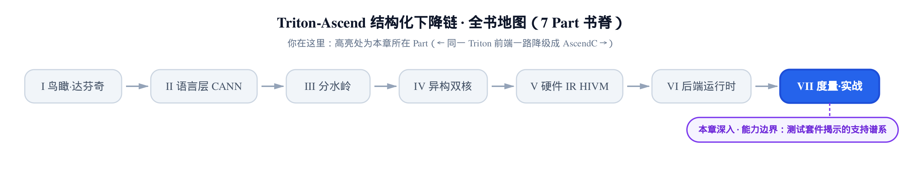
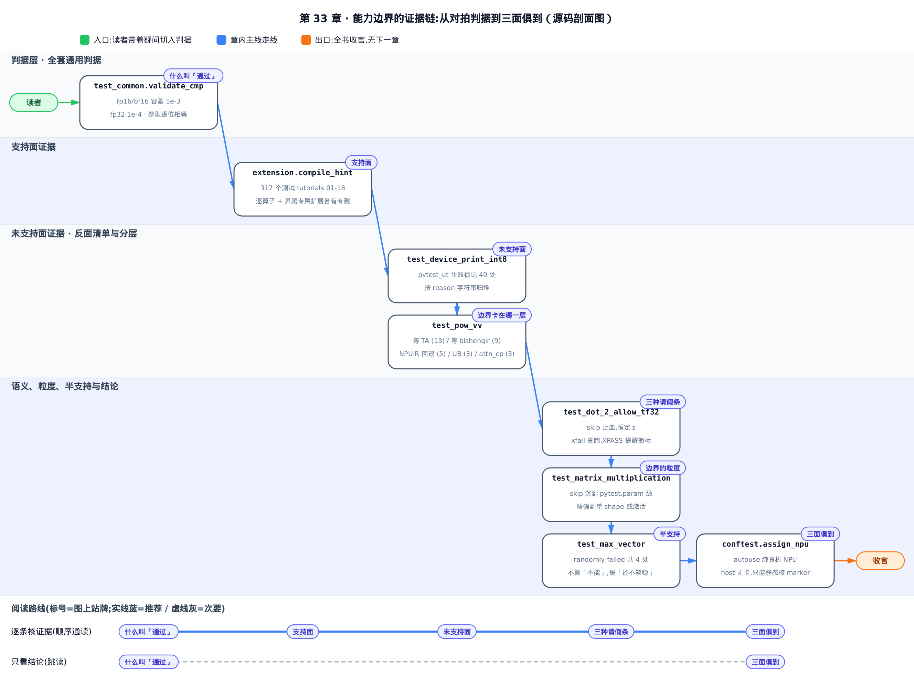
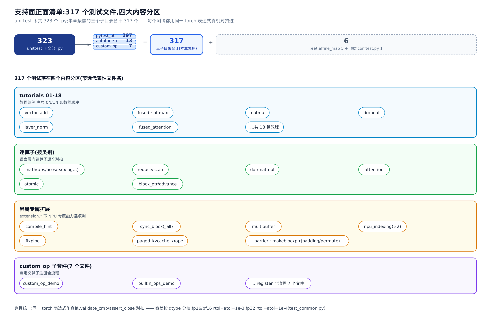
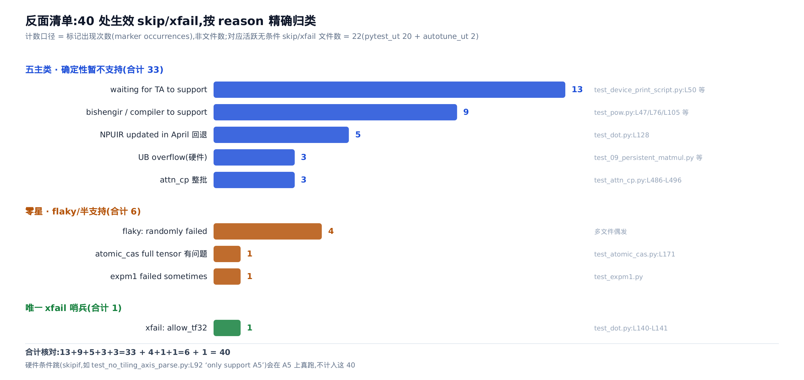
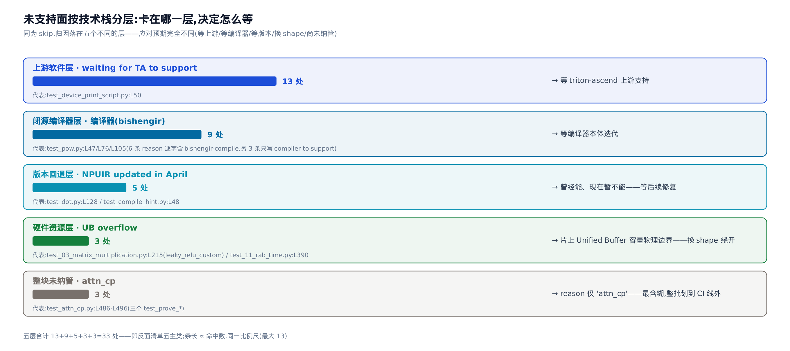
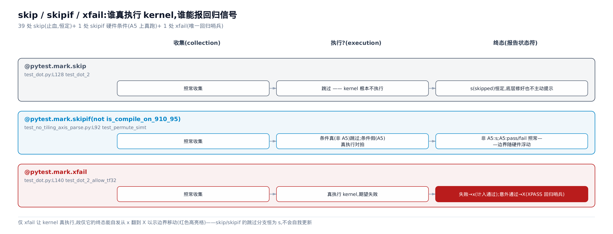

# 昇腾 Triton 的能力边界：测试套件揭示的支持/未支持谱系



> 上一章：语言层拼出完整 Flash Attention。
> 本章：读测试套件，摊开能力边界。
> 下一章：没有了——这是收官。

一本源码解读书讲到最后，总要回答一个不太体面的问题：这套东西，到底能用到什么程度？

README 会夸大，文档会过时。最诚实的答案藏在别处——**测试套件**。能跑的算子，维护者写了测试、用 PyTorch 对拍过；不能跑的，他们没有删掉测试，而是挂上一张「请假条」`@pytest.mark.skip`,并在 `reason` 里写清为什么不来。把这些请假条摊在桌上按理由分堆，就得到一份和代码同版本、可 grep、可回归的**能力谱系**。

这一章不讲新机制。我们把 `third_party/ascend/unittest/` 下的测试当成一份「能力谱系文档」来读：一个后端到底能做什么、还不能做什么、为什么不能、卡在哪一层。全书从 [第 3 章的第一个核 `01_vector_add`](../../ch03-first-kernel-vector-add/narrative/chapter.md) 起步，一路降级、拼装、优化；收官这一站，回到测试套件，清点这一路到底支持了多少。

> 对照上游那本《Triton 源码解读》,本章对位它的「度量与实战」一部。区别在于：triton-ascend(把整条 Triton 编译下降链改道到华为昇腾 NPU 的 fork 项目)有一套**昇腾增量**测试，原位放在 `third_party/ascend/unittest/`。我们读的正是这套昇腾专属的能力普查，而非上游 Triton 自带的 `python/test`。

**只想要结论**,跳到本章末尾的「三面俱到」小节；**想跟着证据一条条核**,从对拍判据读起。



图上把这条证据链摊成一条线：先钉住「什么叫通过」的判据，再摆支持面和未支持面两份清单，接着往下问「卡在哪一层」「用的是哪种请假条」「边界划到多细」「flaky 算不算」，最后在「三面俱到」收口。只想抓论点，跟着图底部那条「结论优先」的路线走，直接看未支持面和三面俱到两节；想核实每一处标记和 reason 怎么来的，就按图从上到下逐节走完。

---

## 什么叫「通过」：对拍判据是支持面的度量

在数「支持了多少」之前，得先把「支持」这个词钉死。否则「支持 matmul」可能只是「不报错」，也可能是「结果和 PyTorch 逐位一致」——差着十万八千里。

**直觉**:测试就像开卷考试对标准答案。同一道题(比如两个张量相加),用 PyTorch 算一遍当**标准答案**,再用 triton 核算一遍当**考生答卷**,两份答案摆在一起比。比得上(在容差内),这道题就算「过」；比不上，这个算子就还没「支持」。整套三百多个测试，全是这一个范式的重复。

范式的起点就是全书的第一个核。看 `01_vector_add` 的测试体：

```python
# third_party/ascend/unittest/pytest_ut/test_01_vector_add.py:L80-L87
def test_vector_addition():
    torch.manual_seed(0)
    size = 98432
    x = torch.rand(size, device='npu')
    y = torch.rand(size, device='npu')
    output_torch = x + y          # 标准答案:PyTorch 同表达式
    output_triton = add(x, y)     # 考生答卷:triton 核
    torch.testing.assert_close(output_triton, output_torch)
```

`size = 98432` 个元素，`x + y` 是标准答案，`add(x, y)` 调的是 triton 核([第 3 章](../../ch03-first-kernel-vector-add/narrative/chapter.md)讲过的那个),最后一行 `torch.testing.assert_close`(PyTorch 自带的近似相等断言，在给定相对/绝对容差内比对两个张量)一锤定音。**没有对拍，就没有「支持」**——这是全套测试的共同骨架。

那「比得上」到底比到多细？容差不是一刀切的，它被抽进一个公共函数 `validate_cmp`(全套测试共享的对拍判据):

```python
# third_party/ascend/unittest/pytest_ut/test_common.py:L127-L157
# moving and comparison ops require no precision error
def validate_cmp(dtype, y_cal, y_ref, overflow_mode: Optional[str] = None):
    y_cal=y_cal.npu()
    y_ref=y_ref.npu()
    # … 省略:overflow_mode == "saturate" 的整型饱和钳位分支,与容差判据无关 …
    if dtype == 'float16':
        torch.testing.assert_close(y_ref, y_cal,  rtol=1e-03, atol=1e-03, equal_nan=True)
    elif dtype == 'bfloat16':
        torch.testing.assert_close(y_ref.to(torch.float32), y_cal.to(torch.float32),  rtol=1e-03, atol=1e-03, equal_nan=True)
    elif dtype == 'float32':
        torch.testing.assert_close(y_ref, y_cal,  rtol=1e-04, atol=1e-04, equal_nan=True)
    elif dtype == 'int32' or dtype == 'int64' or dtype == 'int16' or dtype == 'int8':
        assert torch.equal(y_cal, y_ref)
    # … 省略:uint 系列与 bool 分支,同样要求 torch.equal 逐位相等 …
    else:
        raise ValueError('Invalid parameter \"dtype\" is found : {}'.format(dtype))
```

这几行把「支持」的精确定义写死了，按 dtype(数据类型)分三档：

- **fp16 / bf16**(半精度浮点，各占 16 位):`rtol` 与 `atol`(相对/绝对容差)都放到 `1e-3`——半精度本就有效位少，松一点合理。
- **fp32**(单精度浮点，32 位):容差收紧到 `1e-4`,精度要求高一档。
- **整型 / bool**:不给容差，直接 `torch.equal` 要求**逐位相等**——整数运算容不得半点误差。

一句话：整套测试口中的「通过」= 与 PyTorch 同表达式在这档容差内对齐。这让「支持」有了可执行、可复现的定义，不是嘴上说说。有了这把尺，我们才能开始数。

---

## 支持面：一份可执行的正面清单

**直觉**:一个后端能做什么，最诚实的清单不是菜单，而是后厨每天真出过的订单。判断一家餐馆会做哪些菜，看它真炒过、还尝过味道(对拍)的那些，比看菜单可信得多。每个 `test_*.py` 都是一道「真做过且验过味」的菜。

先把总账摊开。`third_party/ascend/unittest/` 下一共 **323** 个 `.py`。本章聚焦的是其中三个子目录：

| 子目录 | 文件数 | 内容 |
| --- | --- | --- |
| `pytest_ut` | 297 | 主测试套件：tutorials + 逐算子 + 昇腾专属扩展 |
| `autotune_ut` | 13 | autotuning(自动调参)相关测试 |
| `custom_op` | 7 | 自定义算子注册的演示 |
| **三子目录合计** | **317** | 本章的普查范围 |

剩下的 **6** 个散在别处：`affine_map` 目录 5 个，加顶层一个 `conftest.py`(pytest 的目录级夹具文件),`Conversion` 目录里没有 `.py`。**别把 323 说成全在这三个子目录里**——这一章的论点就是「测试套件是最诚实的普查」，数字错一个就自毁论点，所以口径要抠到个位。

这 317 个测试，横跨四大内容分区：



- **tutorials 01-18**:文件名前缀 `0N/1N` 就是教程序号——`vector_add`、`fused_softmax`、`matmul`、`dropout`、`layer_norm`、`fused_attention`、`extern_functions`、`grouped_gemm`、`persistent_matmul`、`gather_sorted`、`hstu_attention`…… 一路十八篇，每篇一个能跑通并对拍过的完整例子（注意第 18 篇 `test_18_gather.py`（`gather`）与第 10 篇 `test_10_gather_sorted.py`（`gather_sorted`）是两个独立教程，别看漏一个）。
- **逐算子**:语言层内建算子被逐个测——`math`(`abs`/`acos`/`exp`/`log`…)、`reduce`/`scan`(归约/扫描)、`dot`/`matmul`、`attention`、`atomic`(原子操作)、`block_ptr`/`advance`(块指针及其推进)。
- **昇腾专属扩展**:这是「支持面广」里昇腾特有的部分，各有专测——`compile_hint`、`sync_block`(_all)、`multibuffer`、`npu_indexing`、`fixpipe`、`paged_kvcache_krope`、`ascend_barrier`、`debug_barrier`、`makeblockptr_negative_padding`/`permute`。
- **custom_op**:`custom_op_demo`、`builtin_ops_demo` 等，演示怎么把一个自定义算子注册进来。

第三块最能说明「支持面广」到哪一步——它是昇腾在标准 Triton 之外加的私货。看一眼这些扩展算子长什么样。`compile_hint` 的测试核里，一口气用了好几个 `extension.*`(即 `triton.language.extra.cann.extension`,昇腾专属扩展算子的命名空间)算子：

```python
# third_party/ascend/unittest/pytest_ut/test_compile_hint.py:L31-L45
@triton.jit
def triton_compile_hint(in_ptr0, out_ptr0, xnumel, XBLOCK: tl.constexpr, XBLOCK_SUB: tl.constexpr):
    xoffset = tl.program_id(0) * XBLOCK
    for xoffset_sub in range(0, XBLOCK, XBLOCK_SUB):
        xindex = xoffset + xoffset_sub + tl.arange(0, XBLOCK_SUB)[:]
        xmask = xindex < xnumel
        x0 = xindex
        tmp0 = tl.load(in_ptr0 + (x0), xmask)
        extension.compile_hint(tmp0, "hint_a")     # 给编译器塞一条提示
        extension.multibuffer(tmp0, 2)             # 多缓冲:双 buffer 流水
        tmp2 = tmp0
        extension.compile_hint(tmp2, "hint_b", 42)
        extension.compile_hint(tmp2, "hint_c", True)
        extension.compile_hint(tmp2, "hint_d", [XBLOCK, XBLOCK_SUB])
        tl.store(out_ptr0 + (xindex), tmp2, xmask)
```

`extension.compile_hint`(向编译器投递一条命名提示)和 `extension.multibuffer`(多缓冲，让片上数据双 buffer 流水)是标准 Triton 里没有的算子。它们**有专门的测试文件**,这本身就是「昇腾专属能力被纳入能力谱系」的证据。正面清单不只是标准算子跑通了，连昇腾的私有扩展也各自立了测。

但这里要立刻埋一个反转：**能写出测试，不等于此刻能过**。这个 `compile_hint` 测试的下半截，恰恰挂着一张请假条——我们下一节就去读它。

---

## 未支持面：一份精确到个位的反面清单

正面清单靠文件名和对拍。反面清单靠什么？靠请假条。

**直觉**:测试没被删，只是挂了张 `@pytest.mark.skip(reason=...)`——请假条上写着为什么不来。把所有请假条摊在桌上按理由分堆，就得到一张「还不能做什么」的清单。它比任何「已知问题」文档都新鲜：和代码同一次提交，可 grep、可回归。

先说清楚要数什么，不然又会数错。三种情况必须分开：

1. **无条件 `skip` / `xfail`**——「根本不支持」或「暂时坏了」。这是反面清单的主体。
2. **`skipif` 硬件条件跳**——「只在某型号昇腾芯片上支持」，在对应硬件上会真跑。它**不是**「不能」，不能混进反面清单。
3. **运行期 `pytest.skip()` 参数守卫**——测试逻辑对非法输入(维度不整除、fp8 块太小)的防御，是测试自己的守卫，**不是能力边界**,也不计入。

第三类长什么样、怎么和第一类一眼区分？看 `fused_attention` 测试体内的一句守卫：

```python
# third_party/ascend/unittest/pytest_ut/test_06_fused_attention.py:L330-L331
    if N_CTX % BM != 0 or N_CTX % BN != 0 or HEAD_DIM % 16 != 0:
        pytest.skip("Skipping non-divisible case")
```

它和第一类的差别在源码形态上就能认出来：无条件 `skip` 是贴在函数头上的**装饰器**(`@pytest.mark.skip`),而这里是**函数体内部**按运行期参数条件调用的 `pytest.skip()`——只有喂进「序列长不被块大小整除」这类非法 shape 才触发。这是测试为自己挡掉无意义输入，跟「这个算子能不能做」无关，所以不进反面清单。

按第一类的口径数：三个子目录里，挂了无条件 `skip`/`xfail` 的**文件**共 **22** 个(`pytest_ut` 20 + `autotune_ut` 2 + `custom_op` 0);grep 还会撞到第 23 个，但那条 marker 是被注释掉的(下面细说),不生效。

不过按文件数还不够细——**一个文件常挂好几条请假条**。所以更精确的口径是**标记的出现次数**(marker occurrences)。单看 `pytest_ut`,生效的无条件标记共 **40** 处。把这 40 处按 `reason` 字符串归堆：



| 归因 | 出现次数 | 代表 |
| --- | --- | --- |
| `waiting for TA to support`(等上游 triton-ascend) | 13 | `test_device_print_script.py:L50` |
| `bishengir` / `compiler to support`(等编译器) | 9 | `test_pow.py:L47` |
| `not supported after the NPUIR is updated in April`(版本回退) | 5 | `test_dot.py:L128` |
| UB overflow(片上内存越界) | 3 | `test_09_persistent_matmul.py` |
| `attn_cp` 整批 | 3 | `test_attn_cp.py:L486` |
| flaky: `randomly failed` | 4 | 多文件偶发 |
| `full tensor has problem`(atomic_cas) | 1 | `test_atomic_cas.py:L171` |
| `expm1 failed sometimes` | 1 | `test_expm1.py` |
| xfail: `allow_tf32` | 1 | `test_dot.py:L140` |
| **合计** | **40** | 13+9+5+3+3+4+1+1+1 |

（表里首次露面的 `NPUIR` = 昇腾 NPU 的中间表示，是下降链中间那层 IR；它四月一次更新引入了回退，下文 `compile_hint` 一例即卡在这里。）

上五行(13+9+5+3+3 = 33)是确定性的「暂不支持」五主类；中三行(4+1+1 = 6)是零星/半支持；末行(1)是唯一的 `xfail`——它是这 40 处里唯一能在底层修好时自发翻 `XPASS`、提醒维护者撤标的**回归哨兵**(为什么单它算「哨兵」，下文「三种请假条」小节详解)。三堆颜色在图里分开，合计恰好 40——个位对得上，论点才立得住。

> 一个数字要拎清：这 40 是**标记出现次数**,不是文件数(反面清单的活跃文件是 22 个)。别把两个口径混着说。

第一主类「等上游 TA」(TA = triton-ascend 上游项目本体，也就是本仓的上游)最能看出请假条的诚实。`device_print`(在核里打印张量、调试用)这个功能，按不同 dtype 逐个挂了 skip:

```python
# third_party/ascend/unittest/pytest_ut/test_device_print_script.py:L50-L88
@pytest.mark.skip(reason="waiting for TA to support")
def test_device_print_int8():
    expected_output = "0,-128,127,0,-1,0,-1,0"
    # … 省略:跑测试脚本、比对日志输出 …

# … 省略:int16 / int32 分支体与 int8 同构,只是 expected_output 字符串不同 …

@pytest.mark.skip(reason="waiting for compiler to support")
def test_device_print_int64():
    expected_output = "???"
    # … 省略:同构测试体 …
```

同一个 `device_print` 功能，不同 dtype 卡在**不同的层**:`int8`/`int16`/`int32`/`fp16`/`fp32` 是 `waiting for TA to support`(等上游 triton-ascend),而 `int64`/`bf16` 是 `waiting for compiler to support`(等编译器)。最扎心的是 `int64` 那行：`expected_output = "???"`——连正确输出长什么样都还不知道。这比任何「TODO」都诚实。

而正面清单里那个漂亮的 `compile_hint` 扩展核，它的测试整体挂的是第三主类：

```python
# third_party/ascend/unittest/pytest_ut/test_compile_hint.py:L48-L60
@pytest.mark.skip(reason="not supported after the NPUIR is updated in April, and will be fixed later")
@pytest.mark.parametrize('param_list',
                         [
                             ['float32', (2, 4096, 8), 2, 32768, 1024],
                         ]
                         )
def test_compile_hint(param_list):
    dtype, shape, ncore, xblock, xblock_sub = param_list
    x0 = test_common.generate_tensor(shape, dtype).npu()
    y_ref = x0
    y_cal = test_common.generate_tensor(shape, dtype).npu()
    triton_compile_hint[(ncore, )](x0, y_cal, x0.numel(), xblock, xblock_sub)
    test_common.validate_cmp(dtype, y_cal, y_ref)
```

`NPUIR` 四月更新之后，这个测试被回退挂起。**「能写测试」和「此刻能过」是两回事**,同框写在一个文件里：上半截的核演示了昇腾专属扩展的存在，下半截的 skip 承认它现在过不了。这就是测试套件的诚实——它不藏。

---

## 边界卡在哪一层：分层归因

数完个数，更值钱的问题是：这些「不能」都是一回事吗？

**直觉**:一份外卖迟迟不到，可能卡在商家没接单、平台系统故障、这个小区不配送、或今天单量爆了。卡在哪一层，你的应对完全不同——催商家、等平台修、换地址、还是干脆改天。`reason` 字符串正好把每条「不能」钉到了具体那一层。

把五主类按技术栈自顶向下摆一遍，未支持谱系落在五个层：



- **上游软件层 · 等 TA(13)**:功能在上游 triton-ascend 还没落地。应对：等版本。代表 `test_device_print_script.py:L50`。
- **闭源编译器层 · 等 bishengir(9)**:卡在编译器本体。`bishengir-compile`(华为毕昇编译器，昇腾下降链末段的闭源黑箱，细节见[第 25 章](../../ch25-lowering-to-ascendc/narrative/chapter.md))还没吃下这个算子。应对：等编译器迭代——你自己改不了，它是闭源的。
- **版本回退层 · NPUIR 四月更新(5)**:`reason` 写的是 `not supported after the NPUIR is updated in April, and will be fixed later`。这是 **「曾经能、现在暂不能」的时间性边界** ——中间表示更新引入的回退。代表 `test_dot.py:L128`、`test_compile_hint.py:L48`。
- **硬件资源层 · UB overflow(3)**:`UB`(Unified Buffer,昇腾核心的片上统一缓冲区)容量的物理边界，与 shape 强相关——同一算子，某个大 shape 一算就把片上内存撑爆。应对：换个 shape 绕开。代表 `test_03_matrix_multiplication.py:L215`(`leaky_relu_custom` 那个 param)、`test_11_rab_time.py:L390`。
- **整块未纳管 · attn_cp(3)**:`test_attn_cp.py:L486-L496` 三个 `test_prove_*`,`reason` 只有一个词 `attn_cp`(attention context parallel,注意力的上下文并行)。这是最含糊的一档——功能成套存在、还配了 kernel,却整批被划到 CI 线外，不解释卡在哪。

最含糊的 attn_cp 这一档，代码形态最能说明「整块未纳管」是什么意思——三个 `test_prove_*` 函数清一色 skip，`reason` 从头到尾只有 `attn_cp` 一个词：

```python
# third_party/ascend/unittest/pytest_ut/test_attn_cp.py:L486-L496
@pytest.mark.skip(reason="attn_cp")
def test_prove_forward_update():
    prove_forward_update()

@pytest.mark.skip(reason="attn_cp")
def test_prove_forward_update_la():
    prove_forward_update_la()

@pytest.mark.skip(reason="attn_cp")
def test_prove_backward_update():
    prove_backward_update()
```

三行 `reason` 摞在一起，没有「等编译器」「等上游」这类归因，只有功能名本身。对比前四层——`waiting for TA`、`bishengir`、`NPUIR 四月更新`、`UB overflow` 都把「卡在哪」说清了；attn_cp 却只丢下一个词，让读者只知道「attention CP 这条线暂不在 CI 覆盖内」，读不出它卡在哪一层。这就是「最含糊」的确切含义。

`bishengir` 这层有个字面口径要抠清楚：**9 条里只有 6 条 `reason` 逐字写了 `bishengir-compile`**(`test_pow.py` 的 L47/L76/L105、`test_device_print.py` 的 L73/L146、`test_min_dim0.py` 的 L32),另外 3 条只写 `compiler to support`。所以可以点名「编译器(bishengir)」，但别声称那 3 条 `reason` 串里出现了 `bishengir` 字样——我们数的是维护者当场写下的字符串，不能替他加字。看一眼逐字写了的那种：

```python
# third_party/ascend/unittest/pytest_ut/test_pow.py:L47-L50
@pytest.mark.skip(reason="waiting for bishengir-compile to support")
@pytest.mark.parametrize("sigtype", types)
@pytest.mark.parametrize("N", shapes)
def test_pow_vv(sigtype, N):
    # … 省略:pow 核的构造与对拍 …
```

分层的意义是**给读者分层的预期**。想用 `device_print` 调 int8？等上游 TA。想用某个被 bishengir 卡住的算子？那是闭源编译器，你只能等。碰上 UB overflow？换个 shape 立刻能绕。三种「不能」，三种活法——这才是「能不能用于我的场景」的真正答案。

---

## 三种请假条：skip、xfail、skipif 的语义分野

细心的读者会发现，前面出现过两种不同的标记：大多数是 `skip`,`test_dot.py` 里却有一个 `xfail`;还有一个 `skipif`。它们不是随手选的——**选哪个，本身就编码了「不能」的确定程度**。

**直觉**,三种请假条：

- `skip` = 「今天我不来」。直接缺席，老师连点名都跳过。
- `skipif` = 「只有下雨天我才不来」。看条件，晴天照常到。
- `xfail` = 「我来了，但预告这次会考砸」。真进考场答题，考砸符合预期；可万一考好了，系统反而提醒老师「这学生进步了，该把差生标签撕了」。

只有 `xfail` 会真答题，所以只有它能告诉你「边界什么时候挪动了」。

`test_dot.py` 里并排放着两个几乎同构的测试，正好是 `skip` 对 `xfail` 的活标本：

```python
# third_party/ascend/unittest/pytest_ut/test_dot.py:L128-L152
@pytest.mark.skip(reason="not supported after the NPUIR is updated in April, and will be fixed later")
@pytest.mark.parametrize("B, C, D", testlist2)
@pytest.mark.parametrize("sigtype", typelist)
def test_dot_2(restore_npu_hf32_setting, sigtype, B, C, D):
    # … 省略:构造 x/y、torch 参考、triton 核、对拍 …
    test_common.validate_cmp(sigtype, z, z_ref)


@pytest.mark.xfail(
    reason="Temporarily disabled: TA backend does not support allow_tf32 yet. Will be fixed in follow-up."
)
@pytest.mark.parametrize("B, C, D", testlist2)
@pytest.mark.parametrize("sigtype", typelist)
def test_dot_2_allow_tf32(restore_npu_hf32_setting, sigtype, B, C, D):
    # … 省略:与上一个同构,区别只在核用了 allow_tf32 …
    test_common.validate_cmp(sigtype, z, z_ref)
```

`test_dot_2` 用 `skip`——NPUIR 四月回退，确定当前不支持，直接不跑。`test_dot_2_allow_tf32` 用 `xfail`——`allow_tf32`(在矩阵乘里允许用 TF32 精度加速)后端还没支持，但**照跑，只是期望它失败**。差别在报告状态符：

<!-- trace: m5 -->

| 标记(marker) | 真实载体 file:Lxxx | 收集期(collection) | 运行期(execution) | 报告状态符 | 撤标信号 |
| --- | --- | --- | --- | --- | --- |
| `@pytest.mark.skip` | `test_dot.py:L128` `test_dot_2` | 照常收集 | 跳过——kernel 根本不执行 | `s` (skipped),恒定 | 无：永远不跑，底层修好了它也不会主动告诉你 |
| `@pytest.mark.xfail` | `test_dot.py:L140` `test_dot_2_allow_tf32` | 照常收集 | 真执行 kernel,期望它失败 | 失败→`x` (xfailed,计入通过);意外通过→`X` (XPASS) | 有：一旦 allow_tf32 被支持、测试意外通过，XPASS 提醒『可以撤标了』 |
| `@pytest.mark.skipif(not is_compile_on_910_95)` | `test_no_tiling_axis_parse.py:L92` `test_permute_simt` | 照常收集 | 条件真(非 A5——A5 是昇腾 910_95 系列芯片的内部代号，故「非 A5」即非该系列芯片)→跳过；条件假(在 A5)→真执行并对拍 | 非 A5:`s` (skipped);A5:pass/fail 照常 | 半自动：换到 A5 硬件即自动转为真跑，边界随硬件浮动 |

这张表的要害是最后两列。`skip` 的报告符恒为 `s`,底层无论怎么修都不变——它是**止血**,不留哨兵。`xfail` 让 kernel 真跑：平时失败记 `x`(符合预期，计入通过);哪天底层修好、测试意外通过，pytest 报 `XPASS`(记 `X`)——这是三者里**唯一能自发翻转、提醒「可以撤标了」的信号**。`skipif` 则看硬件：`is_compile_on_910_95`(是否在 910_95 系列芯片上编译)为真才在 A5 上真跑，否则跳过——边界随硬件浮动，不是「一律不能」。

一个不变量：三种标记在 pytest 的「收集→执行→报告」流水线里各截一处，共同覆盖「当前不会正常通过」的测试空间；而**只有让 kernel 真执行的 `xfail`,报告符才可能从通过侧翻到异常侧**。`skip` 和 `skipif` 的跳过分支不执行 kernel,报告符恒为 `s`,底层再怎么改都不会亮起——所以「带回归追踪的未支持」只能由 `xfail` 表达。



把这套语义代入实际计数，结论很有意思：`pytest_ut` 那 40 处生效标记里，**39 处是 `skip`(止血)、只有 1 处是 `xfail`**(就是这个 `allow_tf32`,唯一的回归哨兵);另有 1 个 `skipif` 硬件条件跳(`test_no_tiling_axis_parse.py:L92` 的 `only support A5`,在 A5 上会真跑，不算进那 40)。维护者对「即将修复」的项才舍得用 `xfail` 留一条哨，对整块回退、硬件越界一律 `skip` 硬止血。**用了哪种标记，泄露了他们对这条边界的判断。**

---

## 边界的粒度：整测、单参数、还是写在注释里

请假条不只挂在整个测试上。skip 的粒度会往下沉，这决定了「支持面」能保住多大。

看矩阵乘法的测试——它不整测跳过，只 skip 参数矩阵里越界的那一个：

```python
# third_party/ascend/unittest/pytest_ut/test_03_matrix_multiplication.py:L204-L218
@pytest.mark.parametrize(
    "shape",
    [
        (512, 512, 512),
        (256, 384, 128),
    ],
)
@pytest.mark.parametrize(
    "activation",
    [
        "",
        pytest.param("leaky_relu_custom", marks=pytest.mark.skip(reason="temporarily skip leaky_relu_custom ub overflow case")),
    ],
)
def test_matrix_multiplication(shape, activation):
    # … 省略:构造 a/b、matmul、对拍 …
```

skip 挂在 `pytest.param`(pytest 给单个参数点单独打标记的方式)上，不是整测：`activation=""`(不带激活函数)照跑，只有 `activation="leaky_relu_custom"` 这一个参数点因 UB overflow 被跳过。**边界精确到「同一算子、某个激活才越界」**,其余参数点该过还过。如果一律整测跳过，会连带埋没本可通过的一大半——param 级 skip 让支持面尽量大、边界尽量准。

粒度还能沉到注释里。`autotune_ut` 子套件的一条 skip,`reason` 干脆写在 docstring:

```python
# third_party/ascend/unittest/autotune_ut/test_mask_parse.py:L97-L104
@pytest.mark.skip
def test_triton_dot_case2(mock_autotuner):
    """
    The current operator is only used for aixs analysis test cases.
    CV fused operators do not support autotuning for now.
    """
    import triton.backends.ascend.runtime
    # … 省略:kernel 与 config 构造 …
```

这条边界的性质又不一样：不是编译器或硬件卡住，而是 **autotuner(自动调参器)的能力范围**——`CV`(Cube + Vector,昇腾把矩阵计算的 Cube 单元与向量计算的 Vector 单元融在一起的算子)融合算子暂不支持 autotuning。`reason` 没写在 `skip()` 参数里，而写在函数 docstring——同样是一手证据，只是藏得深一点。

四种粒度合起来看：**整测级**(`compile_hint`、`gather`、`pow`)、**pytest.param 级**(matmul 的 `leaky_relu_custom`)、**skipif 硬件条件级**(`only support A5`)、**docstring 说明级**(autotune 的 CV 融合)。粒度越细，能守住的支持面越大。

这里的 `gather` 值得单独点破——它恰是「边界精确到个位」最好的活标本。前面支持面清单里，第 18 篇教程 `test_18_gather.py`(gather 教程)是**跑通并对拍过**的，说的是「拿 `gather` 搭一个完整教程例子」这条路走得通。而这里整测级 skip 的是**另一个文件** `test_gather.py`(`test_gather.py:L30`),它测的是**标准 `gather` 算子本身**,`reason` 写 `waiting for the compiler to support.`——整测跳过、等编译器。同一个算子名 `gather`,教程能跑、独立算子测试却被整测跳，两者是两个不同的文件。这不是自相矛盾，恰恰印证了本章的论点：边界不划在「算子」这么粗的粒度上，而是精确到「哪个文件、哪条使用路径」——`gather` 作教程里的一步用法过了，作独立算子的完整测试还没过。

---

## 半支持：flaky 不等于「不能」

有一类请假条容易被误读成「不能」，其实是「还不够稳」。得单独拎出来。

`test_max_vector.py` 的 skip 长这样：

```python
# third_party/ascend/unittest/pytest_ut/test_max_vector.py:L70
@pytest.mark.skip(reason="randomly failed")
```

`randomly failed`(随机失败)——功能是**在**的，只是数值精度或进程稳定性偶尔抖一下。这类 flaky(不稳定、时过时不过)的还有 `test_min_vector`、`test_softmax`、`test_tan`(共 4 处 `randomly failed`),以及 `test_expm1.py` 的 `expm1 failed sometimes, wait for fix`(偶发)。它们是一档更微妙的 **「半支持」** ：不该当作「做不了」，而是「做得了、但还不够稳」。

有一条要和 flaky 分清楚。`test_atomic_cas.py` 那条不是「随机」，是确定性的：

```python
# third_party/ascend/unittest/pytest_ut/test_atomic_cas.py:L169-L172
@pytest.mark.parametrize('dtype,sigtype', types_all)
@pytest.mark.parametrize('n_elements, BLOCK_SIZE', [(4096, 256)])
@pytest.mark.skip(reason="full tensor has problem, skipped")
def test_atomic_cas_with_full(n_elements, BLOCK_SIZE, dtype, sigtype):
    # … 省略:full 张量上的 atomic_cas 对拍 …
```

`full tensor has problem`(全张量用例有问题)是**稳定复现的问题**,不是偶发抖动——所以它单列进零星类，不归入 `randomly failed`。差之毫厘：flaky 是「不稳」，这条是「确定坏」，两种边界不能混。

还有一条更该点明：`test_3Dgrid.py:L70` 有一句 `multi-process error, to be fixed.`,但那行 marker 是**被注释掉的**——当前状态是注释，skip 不生效。所以它不计入前面那 40。要是把它数进去，反面清单就多算了一条——普查的诚实，连注释状态都得看清。

---

## 三面俱到：能、不能、未证

清点到这里，一个方法上的问题绕不过去：上面所有数字，是怎么来的？

答案藏在每个测试模块加载时都会触发的一个夹具里：

```python
# third_party/ascend/unittest/pytest_ut/conftest.py:L24-L40
@pytest.fixture(scope="module", autouse=True)
def assign_npu(request, worker_id):
    marker = request.node.get_closest_marker("backend")
    if marker:
        backend = marker.args[0]
    else:
        backend = "torch_npu"
    if backend == "torch_npu":
        import torch
        npu_count = torch.npu.device_count()
        # … 省略:按 worker_id 轮转分卡的取模细节 …
        torch.npu.set_device(npu_id)
    # … 省略:mindspore 后端的对称分支 …
```

`assign_npu` 是 `scope="module"` 且 `autouse=True` 的夹具——**任何测试模块一 import,就自动绑一张真 NPU**(`torch.npu.set_device`)。(代码里被省略的 `elif backend == "mindspore"` 是对称的另一条分支：triton-ascend 同时支持 `torch_npu` 与 `mindspore`(华为另一套深度学习框架)两套后端，本章只关心前者。)这决定了本章的方法边界：host(开发机)上没有 CANN(昇腾的异构计算软件栈)、没有 NPU,整套测试**根本跑不起来**——测试模块一收集就会因为找不到设备而失败。

所以本章的所有数字，不是「跑一遍测试数出来的」，而是**静态读**出来的：逐一核 `@pytest.mark.{skip,xfail,skipif}` 标记与它们的 `reason` 字符串、清点测试文件名覆盖的算子面。这是 host 上唯一可复现的证据——请假条和代码同版本，grep 一下就在。

这恰好接上了[上一章 Flash Attention 收尾](../../ch32-capstone-flash-attention/narrative/chapter.md)时留的一个悬念：那一章拼出的 `fused_attention`,因果掩码(causal mask,只让每个位置看到自己之前的 token)的 off-band / on-band 两趟拆分(把注意力矩阵按对角线切开：完全落在下三角、不含掩码的整块走 off-band 路径，跨对角线、需要逐元素补掩码的半块走 on-band 路径，两趟各算各的),源码写了、逻辑也推得通——可它被真机对拍覆盖了吗？

翻开它的测试参数矩阵，`test_06_fused_attention.py` 的 shape 参数**全部 `causal=False`**——七行 shape，`causal` 那一列清一色 `False`，一行都没翻过来：

```python
# third_party/ascend/unittest/pytest_ut/test_06_fused_attention.py:L320-L328
@pytest.mark.parametrize("Z, H, N_CTX, HEAD_DIM, causal, dtype, BM, BN", [
    (1, 1, 128, 128, False, torch.float16, 32, 128),
    (1, 1, 128, 128, False, torch.bfloat16, 64, 128),
    (1, 2, 256, 256, False, torch.bfloat16, 32, 256),
    (2, 2, 128, 256, False, torch.float16, 64, 128),
    (4, 32, 64, 64, False, torch.float16, 32, 64),
    (4, 32, 1024, 64, False, torch.bfloat16, 64, 128),
    (4, 32, 4096, 64, False, torch.float16, 128, 128),
])
```

也就是说：因果掩码那两趟拆分的代码路径，**源码在、逻辑通，却从没被参数矩阵触及过**。它不在 skip 名单里(没被判「不能」),也不在对拍覆盖里(没被证「能」)——它落在第三块地带：**未证**。

这就是收官要点题的：一份诚实的能力谱系，**三面俱到**——

- **能**:对拍判据(`validate_cmp`)+ 正面清单(317 个测试文件)证明「覆盖到的能过」；
- **不能**:40 处 `skip`/`xfail` 标出「标了的过不了」，还钉到了具体哪一层；
- **未证**:参数矩阵没触及的路径(比如那个 `causal=True`),源码虽在，却不在这份证据范围内。

测试能证明「覆盖到的能过」，能标出「标了的不能」，却**证明不了「没覆盖的对不对」**。文档会过时、README 会夸大，但 CI 里一条 `@pytest.mark.skip(reason=...)` 是维护者提交那一刻对「此刻真过不了」的当场承认。一本源码解读书的收官，不该只讲能做什么——更该把这份一手的「不能」和「未证」一起摊开，让读者对昇腾 Triton 的成熟度，有一个不打折扣的真实预期。

到这里，全书从第一个 `vector_add` 走到最后一张请假条。愿你带走的不只是「它能做什么」，还有一份读测试套件的眼力：**下次评估任何一个后端，先去翻它的 skip 名单。**
