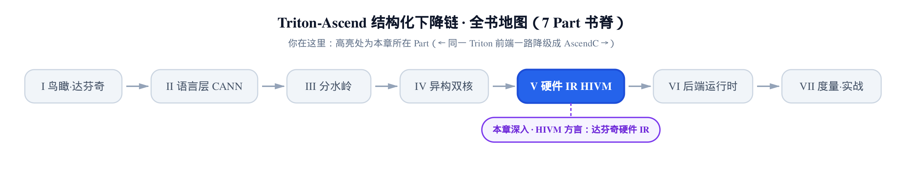
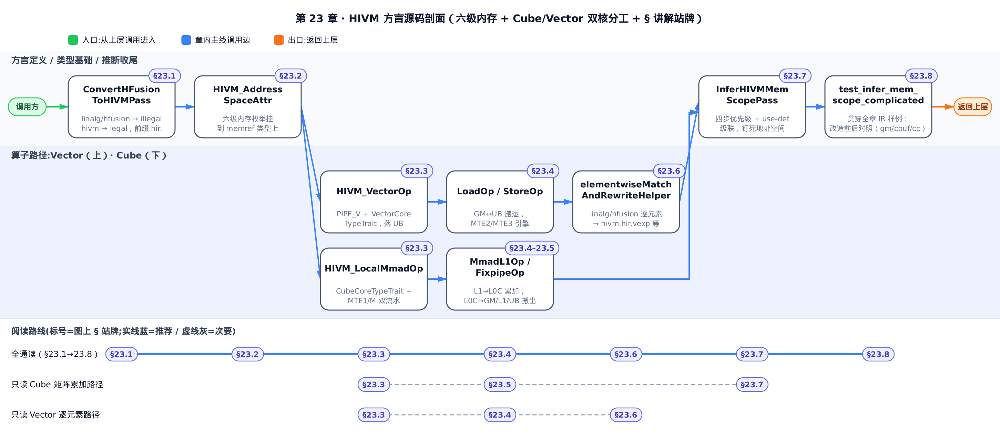
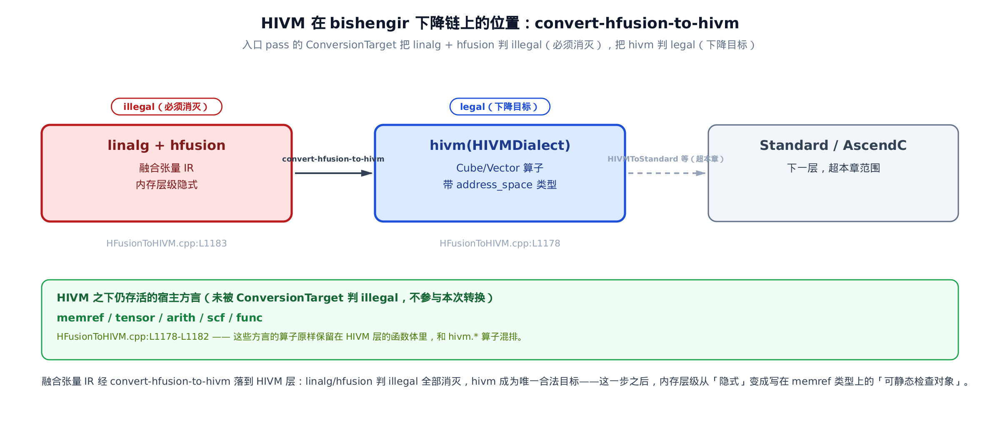
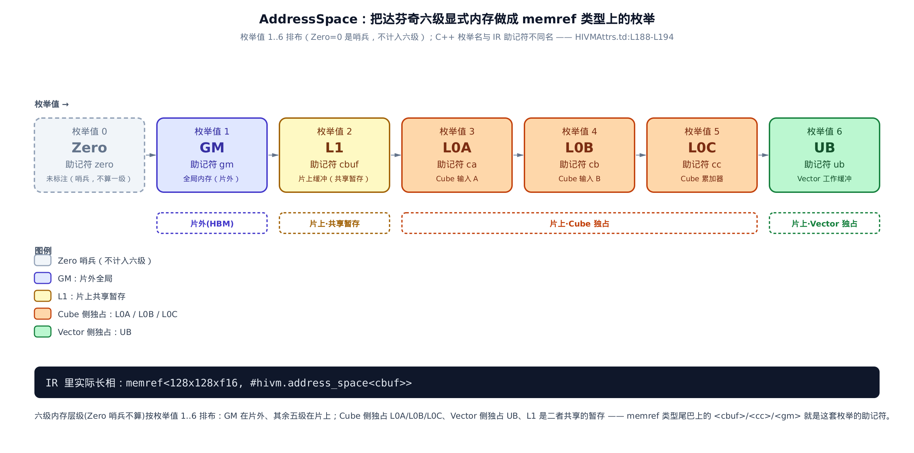
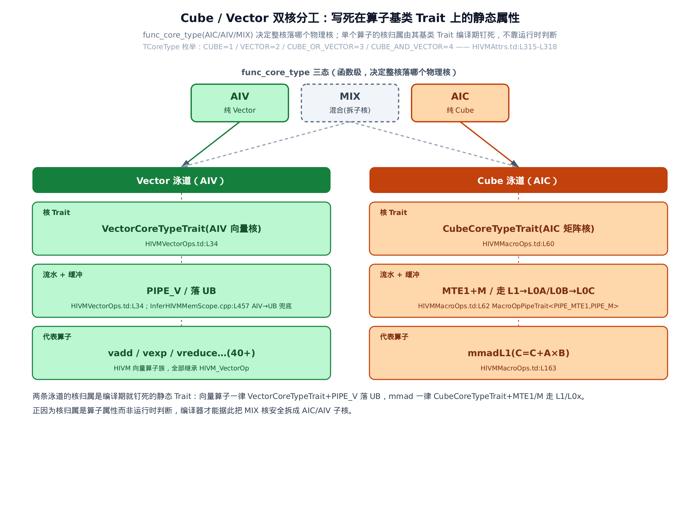
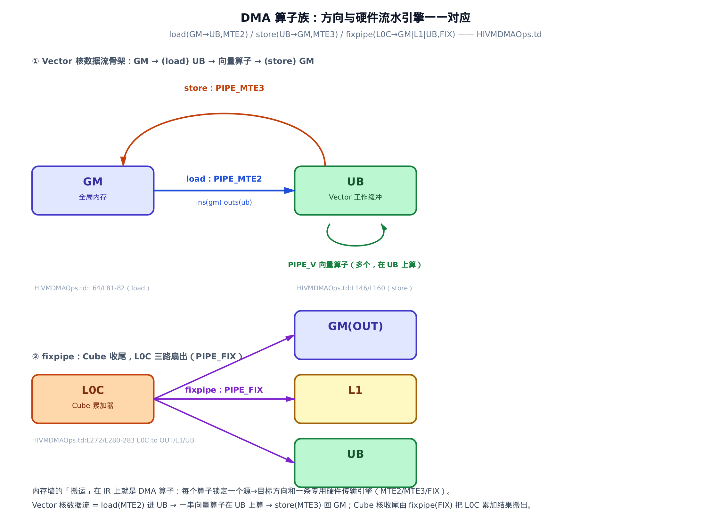
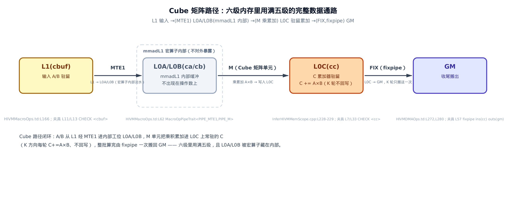
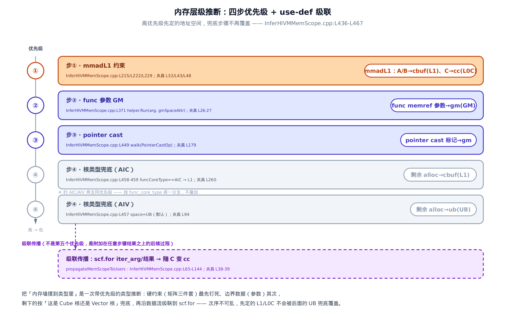

# 第 23 章　HIVM 方言——达芬奇硬件 IR



> 上一站：算子融合按 FusionKind 把 Cube／Vector 的活分好了。
> 这一站：把双核分工与六级内存，真正刻进硬件 IR 的类型里。
> 下一站：走出 HIVM，交给后端译成达芬奇能跑的指令。

前一章讲的是**为什么这么分**——[第 22 章](../../ch22-opfusion-autoschedule/narrative/chapter.md)里，`FusionKind`（融合意图枚举，标在函数上的一枚印章）驱动自动调度，按「这段是矩阵活还是逐元素活」把一个融合核切成 Cube 与 Vector 两条流水。那些决策都还停在**张量**的世界里：算子看起来只是在操作一块块 `memref`（MLIR 里带 offset／size／stride 的内存引用，前几章已反复用它），至于这块数据实际住在片外显存、还是片上某级缓冲——张量 IR 一个字都没说。

本章讲的是**在 IR 里怎么落地**。达芬奇 AI Core 是一台没有透明缓存的机器：它的每一级片上存储都要编译器亲手安排数据进出。HIVM 就是 bishengir（昇腾的 MLIR 编译器栈，负责把 Linalg 一路降到 NPU 二进制）下降链上**第一个把这套内存墙写进 IR 类型系统**的方言。一个融合核降到 HIVM 之后，每个 `memref` 的类型尾巴上都会多出一段 `#hivm.address_space<…>`——数据住在哪一级、Cube 算子和 Vector 算子各落哪块缓冲，从此是可以静态检查的对象，而不再是隐式约定。

> 只想看「一个融合核降完长什么样」，直接跳到 §23.8 的改造前后对照表；想跟完整推断过程，按序读。

本章以一段真实的 lit 回归夹具（bishengir 自带的 `-hivm-infer-mem-scope` pass 的期望输出测试）为主线：一个矩阵核，K 方向分块循环里反复做矩阵乘累加。我们会看着它从「无籍贯」的普通 `memref` 一步步被贴上 `<gm>`／`<cbuf>`／`<cc>` 的地址空间标签，把 HIVM 的方言身份、六级内存、双核分工、DMA 搬运、内存层级推断算法逐个串起来。

> **取证边界（一次性交代）**：host 上没有昇腾 NPU，也没有构建出 `bishengir-opt` 可执行文件，本章所有 IR 落位**不是真机 dump**。地面真相取自仓库已提交的 lit 夹具 `third_party/ascend/AscendNPU-IR/bishengir/test/Dialect/HIVM/infer-hivm-mem-scope.mlir`——它的 `// CHECK:` 断言就是 `bishengir-opt -hivm-infer-mem-scope` 的期望输出，CI 每次运行都逐字核对，权威性等价于真机 trace。源码常量（枚举值／Trait／流水绑定）标 `file:Lxxx`，可回溯到 `.td`／`.cpp` 定义。



只想看 Cube 矩阵累加这条线，按 §23.3→§23.5→§23.7 跳读；只想看 Vector 逐元素这条线，按 §23.3→§23.4→§23.6 跳读；想跟完整下降过程，从 §23.1 顺读到 §23.8 即可。

---

## 23.1　HIVM 是什么，站在下降链的哪一环

**直觉。** 把整条编译流水想成一条传送带：上游方言操心的是「算什么」（矩阵乘、逐元素加、归约），越往下越操心「在这台具体机器上怎么算」。HIVM 就是那个转折点——从这一层起，IR 不再假装内存是一整块平坦的地址空间，而开始正视达芬奇「片外一块、片上五块、各有独立地址」的现实。

**机制。** 在 MLIR 里，一个 pass 要把某种方言「降」成另一种方言，靠的是一张 `ConversionTarget`（下降目标集：声明哪些方言合法、哪些必须被消灭）。`HFusionToHIVM` 这个 pass 的入口把上游的 `linalg` 与 `hfusion` 两个方言标成 **illegal**（非法，必须全部改写掉），把 `hivm` 标成 **legal**（合法，下降的终点）：

```cpp
// third_party/ascend/AscendNPU-IR/bishengir/lib/Conversion/HFusionToHIVM/HFusionToHIVM.cpp:L1173-L1191
  void runOnOperation() override {
    RewritePatternSet patterns(&getContext());
    ConversionTarget target(getContext());
    ConvertHFusionToHIVMOptions options = {this->mmMapMode};

    target.addLegalDialect<hivm::HIVMDialect, memref::MemRefDialect,
                           bufferization::BufferizationDialect,
                           tensor::TensorDialect, arith::ArithDialect,
                           affine::AffineDialect, scf::SCFDialect,
                           func::FuncDialect>();
    target.addIllegalDialect<linalg::LinalgDialect, hfusion::HFusionDialect>();

    populateLowerHFusionToHIVMPattern(patterns);
    populateReductionPatternsAndLegality(patterns, target);
    populateMatmulPatternsAndLegality(patterns, target, options);
    if (failed(applyPartialConversion(getOperation(), target,
                                      std::move(patterns)))) {
      signalPassFailure();
    }
    // … 省略：随后三段 walk 做 HIVM op 局部改写、属性搬运、annotation 清理 …
```

这段短短的合法性声明，其实精确地钉死了 HIVM 在下降链上的坐标。`addIllegalDialect<linalg, hfusion>()` 说的是「本 pass 之后，`linalg` 和 `hfusion` 的算子一个都不许剩」；`addLegalDialect<hivm, …>()` 说的是「hivm 是这一步的产物」。注意合法列表里还有 `memref`／`tensor`／`arith`／`scf`（结构化控制流方言，`scf.for` 等）／`func`——它们**不是**被降的对象，而是 HIVM 之下继续存在的宿主方言：HIVM 算子会和它们混排在同一个函数体里。所以这条转换的一句话总结是：**把 HFusion 融合出来的张量算子，降到 HIVM 这一层**；再往下（降到 Standard／AscendC）就超出本章了。



**源码：方言身份本体。** HIVM 全称 Hybrid Intelligence Virtual Machine（混合智能虚拟机），它的方言定义在一份 TableGen（`.td`，MLIR 用来声明方言／算子的领域特定语言）文件里：

```tablegen
// third_party/ascend/AscendNPU-IR/bishengir/include/bishengir/Dialect/HIVM/IR/HIVMBase.td:L36-L69
def HIVM_Dialect : Dialect {
  let name = "hivm";
  let description = [{
    HIVM (Hybrid Intelligence Virtual Machine) dialect.
  }];
  let cppNamespace = "::mlir::hivm";
  let dependentDialects = [
    "arith::ArithDialect", "bishengir::memref_ext::MemRefExtDialect",
    "math::MathDialect", "memref::MemRefDialect",
    "hacc::HACCDialect",
    "tensor::TensorDialect"
  ];
  let hasCanonicalizer = 1;
  let useDefaultAttributePrinterParser = 1;
}
// … 省略：紧随其后的 HIVM_StructuredOp 基类（L71-L78）讲结构化算子通用能力，与方言身份无关 …

class HIVM_Op<string mnemonic, list<Trait> traits = []>
    : Op<HIVM_Dialect, !strconcat("hir.", mnemonic), traits> {
  // C++ function that returns the op name.
  code opNameDeclaration = [{
    static StringRef getOpName() { return "}] # mnemonic # [{"; }
  }];
}
```

`let name = "hivm"` 定义方言名，`cppNamespace = "::mlir::hivm"` 是它的 C++ 命名空间。`dependentDialects` 列出它依赖的宿主方言——正是上一段合法列表里那批。

**这里有个必须先点破的反直觉命名**（否则你会对不上后面所有 IR 样例）：方言名叫 `hivm`，但每个算子的**助记符前缀却是 `hir.`**。看最后那个 `HIVM_Op` 基类——所有 HIVM 算子都从它派生，而它用 `!strconcat("hir.", mnemonic)` 把前缀硬拼成 `hir.`（hir = Hybrid IR）。于是打印出来的算子长成 `hivm.hir.load`、`hivm.hir.mmadL1`，而**不是**你以为的 `hivm.load`。方言名 `hivm` 是命名空间，`hir.` 才是助记符前缀，两者不同名。记住这一点，下文所有 `hivm.hir.xxx` 就都能对上号了。

---

## 23.2　六级显式内存层级：AddressSpace 枚举

**直觉。** 达芬奇的内存墙不是比喻，是硬件事实。AI Core 是**显式管理的 scratchpad 架构**（片上缓冲要软件亲手调度、没有透明 cache 帮你自动搬）：片外一块大而慢的 GM（global memory，即 HBM 高带宽显存），片上五块小而快的缓冲，各自有独立地址空间和容量。算力要打满，就必须由编译器把数据分块搬进片上、算完再搬出。上游的 Linalg／HFusion 对这堵墙视而不见，HIVM 是第一个正面把它编码进类型的层——办法是做一个枚举，把六级内存写成 `memref` 类型上可以挂的一段属性。

**源码。** 枚举本体在 `HIVMAttrs.td`：

```tablegen
// third_party/ascend/AscendNPU-IR/bishengir/include/bishengir/Dialect/HIVM/IR/HIVMAttrs.td:L188-L214
def HIVM_AddressSpace_Default : I32EnumAttrCase<"Zero", 0, "zero">;
def HIVM_AddressSpace_GM : I32EnumAttrCase<"GM", 1, "gm">;
def HIVM_AddressSpace_L1 : I32EnumAttrCase<"L1", 2, "cbuf">;
def HIVM_AddressSpace_L0A : I32EnumAttrCase<"L0A", 3, "ca">;
def HIVM_AddressSpace_L0B : I32EnumAttrCase<"L0B", 4, "cb">;
def HIVM_AddressSpace_L0C : I32EnumAttrCase<"L0C", 5, "cc">;
def HIVM_AddressSpace_UB : I32EnumAttrCase<"UB", 6, "ub">;

def HIVM_AddressSpaceEnum : HIVM_I32Enum<
  "AddressSpace", "HIVM Address Space", [
    HIVM_AddressSpace_Default,
    HIVM_AddressSpace_GM,
    HIVM_AddressSpace_L1,
    HIVM_AddressSpace_L0A,
    HIVM_AddressSpace_L0B,
    HIVM_AddressSpace_L0C,
    HIVM_AddressSpace_UB
  ]>;

def HIVM_AddressSpaceAttr : HIVM_Attr<"AddressSpace", "address_space",
   [DeclareAttrInterfaceMethods<DeviceMappingAttrInterface>]> {
  let parameters = (ins EnumParameter<HIVM_AddressSpaceEnum>:$address_space);
  let assemblyFormat = "`<` params `>`";
  let description = [{
    HIVM address space mapping attribute. Maps to GM, L1, L0A, L0B, L0C and UB.
  }];
}
```

每一行形如 `I32EnumAttrCase<name, value, mnemonic>`（把一个枚举 case 声明成 32 位整数）定义一级内存。读这份枚举有两个关键点。

**第一，枚举名和 IR 助记符是两套名字。** C++ 代码里用的是逻辑层级名（`GM`／`L1`／`L0A`／`L0B`／`L0C`／`UB`），IR 里打印出来却是硬件手册的物理缓冲名：`L1→cbuf`（convolution buffer，历史命名）、`L0A→ca`、`L0B→cb`（cube matrix A／B，Cube 单元的两个输入缓冲）、`L0C→cc`（cube accumulator，Cube 累加缓冲）、`GM→gm`、`UB→ub`。所以你在 IR 里看到的是 `#hivm.address_space<cbuf>`，而**不是** `<L1>`。这就是为什么后文的 IR 样例满屏 `cbuf`／`cc` 而非 `L1`／`L0C`。

**第二，七个 case 里只有六级是真内存。** 排头的 `Zero`（枚举值 0、助记符 `zero`）是「未标注」哨兵——一个 `memref` 还没被推断出地址空间时就停在这个值上；`GM`（1）到 `UB`（6）这六个才是真实的六级内存层级。最后的 `HIVM_AddressSpaceAttr` 把这个枚举包成一个可挂到 `memref` 上的属性，`assemblyFormat` 定义它打印成 `<助记符>` 的样子。它还实现了 `DeviceMappingAttrInterface`，这让地址空间还能当循环映射维度用，不过那是别的 pass 的故事了。



这张图把六级排成一条线：`GM` 在片外，其余五级在片上；`L0A`／`L0B`／`L0C` 是 Cube 侧独占、`UB` 是 Vector 侧独占、`L1`（cbuf）是二者共享的暂存。底部那行 `memref<128x128xf16, #hivm.address_space<cbuf>>` 就是这套枚举最终在 IR 里的样子——一个再普通不过的 `memref`，类型尾巴上多贴了一张「你住 L1」的户口。**内存墙摆进类型**，说的就是这件事。

---

## 23.3　Cube 与 Vector：双核分工写死在 Trait 里

**直觉。** 达芬奇 AI Core 内部是两台各司其职的机器：Cube 核（AIC，AI Cube core，专做矩阵乘）和 Vector 核（AIV，AI Vector core，专做逐元素与归约）——[第 16 章](../../ch16-core-affinity/narrative/chapter.md)已经讲过每个算子该落哪个核是怎么算出来的。到了 HIVM 这一层，「这个算子属于哪个核」不再是运行时才决定的事，而是**写死在算子基类里的静态标签**：你一看算子类型，就知道它跑 Cube 还是 Vector、占哪条流水、数据落哪块缓冲。之所以要钉得这么死，是因为编译器后续要按核把一个 MIX（混合）核安全拆成两个子核——只有核归属是编译期确定的属性，拆分才有依据。

MLIR 里这种「贴在算子上的静态标签」叫 **Trait**（特征）。HIVM 用两个 Trait 把双核分工钉死。

**源码：Vector 侧。** 所有向量算子都从一个基类派生，基类默认带上 `VectorCoreTypeTrait`（落 Vector 核）和 `PIPE_V`（占用向量流水）：

```tablegen
// third_party/ascend/AscendNPU-IR/bishengir/include/bishengir/Dialect/HIVM/IR/HIVMVectorOps.td:L33-L49
class HIVM_VectorOp<string mnemonic, list<Trait> traits = [],
  list<Trait> vecSpecialTraits=[OpPipeTrait<"PIPE::PIPE_V">, VectorCoreTypeTrait]> :
  HIVM_StructuredOp<mnemonic, !listconcat(!listconcat(
    [AlwaysSpeculatable, SinglePipeOpTrait
    ], vecSpecialTraits), traits)> {
  code vectorOpBaseDecls = [{
    ::mlir::LogicalResult fold(FoldAdaptor adaptor,
        SmallVectorImpl<OpFoldResult> &results) {
      return memref::foldMemRefCast(*this);
    }

    // Implement functions necessary for DestinationStyleOpInterface.
    ::mlir::MutableOperandRange getDpsInitsMutable() {
        return getDstMutable();
    }
  }];
}
```

看那个 `vecSpecialTraits` 默认参数——`[OpPipeTrait<"PIPE::PIPE_V">, VectorCoreTypeTrait]`。`PIPE_V` 是硬件的向量流水引擎，`VectorCoreTypeTrait` 标明「本算子属 Vector 核」。这两个 Trait 被拼进基类的 Trait 列表，于是**每一个**向量算子（`vadd`／`vexp`／`vreduce`／`vcast`／`vsel`……全书统称的四十多个，见 §23.6）一出生就带着它们。这就是「向量路径走 UB」的 IR 根据：向量算子的操作数在后面的内存层级推断里，会兜底落到 UB。

**源码：Cube 侧的对偶。** 矩阵路径的核心算子从 `LocalMmad` 基类派生，基类固定带 `CubeCoreTypeTrait`（落 Cube 核）和一个 `MacroOpPipeTrait<MTE1, M>`：

```tablegen
// third_party/ascend/AscendNPU-IR/bishengir/include/bishengir/Dialect/HIVM/IR/HIVMMacroOps.td:L58-L64
class HIVM_LocalMmadOp<string mnemonic, list<Trait> traits = []> :
  HIVM_MacroOp<mnemonic, !listconcat(
    [AttrSizedOperandSegments,
     CubeCoreTypeTrait,
     HIVMUnitFlagEnabledInterface,
     MacroOpPipeTrait<"PIPE::PIPE_MTE1, PIPE::PIPE_M">,
    ], traits)> {
  // … 省略：基类 arguments（L65-L97）与 assemblyFormat／builders（L121-L161），讲 MmadL1Op 操作数时再展开 …
```

`CubeCoreTypeTrait` 是 Vector 侧的镜像——标明「本算子属 Cube 核」。更耐读的是 `MacroOpPipeTrait<MTE1, M>`：它说明 `LocalMmad` 是个**宏算子**（macro op，内部藏了不止一段硬件流水）。这里藏了两段：`MTE1`（一条存储传输引擎，负责把数据从 L1 搬到 L0A／L0B）和 `M`（Cube 矩阵单元，做乘累加、写 L0C）。这个细节直接解释了一个后面会反复用到的事实——**L0A／L0B 是宏算子的「内部」缓冲，不出现在算子的操作数上**。

核归属除了算子级的 Trait，还有函数级的 `func_core_type`。它有三态：`AIC`（纯 Cube 核）、`AIV`（纯 Vector 核）、`MIX`（两者都有，后续会被拆成 AIC／AIV 两个子核协同）。算子级 Trait 决定单个算子的归属，函数级 `func_core_type` 决定整个核落哪个物理核——两者配合，就是下图两条泳道的全部规则。



两条泳道的核归属是编译期就钉死的：向量算子一律 `VectorCoreTypeTrait + PIPE_V` 落 UB，`mmad` 一律 `CubeCoreTypeTrait + MTE1／M` 走 L1→L0A／L0B→L0C。正因为核归属是算子的静态属性、而非运行时判断，编译器才敢据此把一个 MIX 核安全地拆成 AIC／AIV 两个子核。

---

## 23.4　DMA 算子族：在各级内存间搬数据

**直觉。** 六级内存各自独立，数据不会自己从一级流到另一级——每一次跨级搬运，都要在 IR 上显式写一个算子。这批算子叫 DMA（Direct Memory Access，直接内存访问）算子族。它们有个共同的强约束：**每个算子锁定一个「源→目标」方向，并绑定一条专用的硬件传输引擎**。方向和引擎一一对应，不能混用。

**源码：load（GM→UB）。** 第一个成员 `load`，把数据从 GM 搬进 UB，绑定 `PIPE_MTE2`（专管「片外→片上」的存储传输引擎）：

```tablegen
// third_party/ascend/AscendNPU-IR/bishengir/include/bishengir/Dialect/HIVM/IR/HIVMDMAOps.td:L62-L91
def LoadOp : HIVM_DmaOp<"load", [
  AttrSizedOperandSegments,
  SinglePipeOpTrait, OpPipeTrait<"PIPE::PIPE_MTE2">,
  // … 省略：接口声明与元素类型约束（reassociation／flatten／element-type constraints）…
]> {
  let summary = "HIVM data load operation";
  let description = [{
    Loads the data from the global memory to the local buffer.
    Currently only support loading to the unified buffer.

    Examples:
    ```mlir
    hivm.load ins(%src : memref<16x16xf16, #hivm.address_space<gm>>) outs(%dst : memref<16x16xf16, #hivm.address_space<ub>>)
    ```
    // … 省略：pad_mode／pad_value 等约束条目 …
  }];
```

看它自带的 example——`ins(… <gm>) outs(… <ub>)`：输入是 `gm`（GM）源，输出是 `ub`（UB）目标。这就是「内存层级怎么摆到类型上」最直观的一次示范：算子不用带什么特殊字段，源和目标住哪一级，直接写在各自 `memref` 的地址空间里。`OpPipeTrait<"PIPE::PIPE_MTE2">` 则把它钉在 MTE2 引擎上。

**源码：store（UB→GM）是 load 的对偶。** 方向反过来，引擎换成 `PIPE_MTE3`（专管「片上→片外」）：

```tablegen
// third_party/ascend/AscendNPU-IR/bishengir/include/bishengir/Dialect/HIVM/IR/HIVMDMAOps.td:L145-L168
def StoreOp : HIVM_DmaOp<"store", [
  SinglePipeOpTrait, OpPipeTrait<"PIPE::PIPE_MTE3">,
  // … 省略：接口声明与元素类型约束 …
]> {
  let summary = "HIVM data store operation";
  let description = [{
    Stores the data on local buffer to global memory.
    Currently only support storing data on the unified buffer.

    Examples:
    ```mlir
    hivm.store ins(%src : memref<16x16xf16, #hivm.address_space<ub>>) outs(%dst : memref<16x16xf16, #hivm.address_space<gm>>)
    ```
    // … 省略：atomic_kind 约束条目 …
  }];
```

`load`（MTE2）进、`store`（MTE3）出，成对夹在一个 Vector 核 kernel 的头尾——中间夹着一串在 UB 上算的向量算子，就是一条完整的 Vector 数据流。

**源码：fixpipe（L0C→外）是 Cube 路径的收尾。** 它把 Cube 累加结果从 L0C 搬出去，绑 `PIPE_FIX`（定点搬出引擎），并且带 `CubeCoreTypeTrait`——它是 Cube 侧的算子：

```tablegen
// third_party/ascend/AscendNPU-IR/bishengir/include/bishengir/Dialect/HIVM/IR/HIVMDMAOps.td:L271-L288
def FixpipeOp : HIVM_DmaOp<"fixpipe", [
  SinglePipeOpTrait, OpPipeTrait<"PIPE::PIPE_FIX">,
  HIVMCoreTypeInterface, CubeCoreTypeTrait,
  HIVMUnitFlagEnabledInterface,
  DeclareOpInterfaceMethods<HIVMStructuredOpInterface, ["getIndexingMaps"]>
]> {
  let summary = "HIVM data copy operation from L0C to other memory hierarchies.";
  let description = [{
    Fixpipe is pipeline that performing data movement from L0C to other memory hierarchies,
    with on-the-fly fixed function of pre-stage quantization,
    pre-stage ReLU, element-wise add, post-stage ReLU, post-stage quantization.
    Currently support:
      - L0C to OUT
      - L0C to L1
      - L0C to UB (for Ascend910_95 series)

    Additionally, Fixpipe is also capable of layout transform.
  }];
  // … 省略：arguments（L289-L305）含 dma_mode／pre_quant／pre_relu 等定点功能开关 …
```

`fixpipe` 名副其实——它是一条能顺手做「定点功能」的搬运流水：搬 L0C 结果出去的同时，可以就地做量化、ReLU、element-wise add、layout 变换。它支持的方向是 `L0C → OUT／L1／UB`。



这张图把两条数据流骨架画全了：**Vector 核** = `load`（MTE2）进 UB → 一串向量算子在 UB 上算 → `store`（MTE3）回 GM；**Cube 核**的收尾则由 `fixpipe`（FIX）把 L0C 累加结果三路扇出（GM／L1／UB 择一）。每条搬运绑一条引擎的意义，在于后续 `inject-sync` pass 能据此在不同流水之间插同步——引擎分工是同步编排的依据。

---

## 23.5　Cube 矩阵路径：mmadL1 与 L0C 累加器驻留

**直觉。** 把 Cube 矩阵单元想成一个只有**一个累加托盘**的专用车间。原料 A、B 两块小矩阵先堆在半成品仓 L1（cbuf），传送带 MTE1 把它们送进车间入料口 L0A／L0B（ca／cb），Cube 单元（M 流水）把乘积一轮轮累加到那个固定的托盘 L0C（cc）上——托盘不来回搬，K 方向每来一对新料就 `$`C \mathrel{+}= A \times B`$`；整批算完，才由 FIX 传送带（`fixpipe`）把托盘里的成品一次性搬到成品仓 GM。L0A／L0B 是车间内部工位，不出现在对外的算子接口上。

**机制：一次 K 分块循环的逐轮追踪。** 取一个具体尺寸：A、B 都是 128×128 的 f16，累加器 C 是 128×128 的 f32（形状／dtype 取自贯穿全章的 lit 夹具）。设 `$`K = 256`$`、K 方向按 128 分块，于是有 2 个 K-tile，正好看到 L0C 累加两次。下表逐轮记录数据落在哪一级、C 累加器的状态：

<!-- trace: m6-cube-mmad-path -->

| 轮次（K-tile） | 动作 | A／B 操作数所在层级 | L0A／L0B（内部） | C 累加器（L0C）状态 | 输出去向 |
| --- | --- | --- | --- | --- | --- |
| k=0 | MTE1 载入 A0／B0，M 单元乘累加 | L1（cbuf） | A0→ca，B0→cb | `$`C = A_0 \times B_0`$`（常驻 cc） | 留在 L0C 不回写 |
| k=1 | MTE1 载入 A1／B1，M 单元乘累加 | L1（cbuf） | A1→ca，B1→cb | `$`C \mathrel{+}= A_1 \times B_1`$`（仍在 cc） | 留在 L0C 不回写 |
| 收尾 | fixpipe（FIX）搬出累加结果 | — | — | C 最终值（读一次） | L0C → GM（cc→gm） |

**不变量。** C 累加器全程常驻 L0C，K 方向每轮对它「读—改—写」恰一次（`$`C \mathrel{+}= A_k \times B_k`$`），循环结束才 `fixpipe` 搬出一次；**L0C→GM 的写次数恒为 1，与 K 分块数无关**。为什么成立？`mmadL1` 的语义 `$`C = C + A \times B`$` 让 C 既是输入又是输出（用 MLIR 的话说，它是 DPS init 操作数——destination-passing style，目标即初值的写入位），故每轮更新 C 恰一次；而 C 的地址空间被下一节的推断 pass 钉死为 L0C、循环的迭代参数（iter_arg）级联传播后也保持 `cc`，所以整个 K-loop 里 C 从不离开 L0C；唯一的搬出就是循环后那一个 `fixpipe`。于是 K 分块数增大只增加 L0C 内部的累加轮数，GM 写恒为 1——这正是「累加器驻留、减少回写」的收益。

**量化。** 单个 tile 的内存占用（形状／dtype 取自夹具）——A／B 各驻 L1、C 驻 L0C：

```math
A,\ B:\quad 128 \times 128 \times 2\,\mathrm{B} = 32768\,\mathrm{B} = 32\,\mathrm{KB}
```

```math
C:\quad 128 \times 128 \times 4\,\mathrm{B} = 65536\,\mathrm{B} = 64\,\mathrm{KB}
```

`$`K = 256`$` 分 2 个 128-tile → L0C 累加 2 次、`fixpipe` 搬出 1 次；若朴素地每轮都把 C 回写 GM，则需 2 次 GM 写。累加器驻留把 GM 写从 2 降到 1（K 分 n 块时从 n 降到 1）。

**源码：`mmadL1` 算子定义。** 前面 §23.3 已经看过它的基类 `LocalMmad`（带 `CubeCoreTypeTrait` 和 `MTE1／M` 双流水）。具体算子是 `MmadL1Op`：

```tablegen
// third_party/ascend/AscendNPU-IR/bishengir/include/bishengir/Dialect/HIVM/IR/HIVMMacroOps.td:L163-L185
def MmadL1Op : HIVM_LocalMmadOp<"mmadL1", [
  DeclareOpInterfaceMethods<HIVMStructuredOpInterface, ["getIndexingMaps"]>,
  OpLayoutInterface,
]> {
  let summary = [{
    Matrix Multiply and Add Op with inputs from L1 memory hierarchy.
  }];
  let description = localMmadBaseDes # [{
    Note: the rank of A, B, and C Matrix must be two.
  }];
  let extraClassDeclaration = localMmadBaseDecls # [{
    static StringRef getOpName() { return "mma_tile"; }
    // … 省略：OpLayoutInterface 需要的一组 getOperand*Layout 声明 …
  }];
}
```

`summary` 一句话点题：**inputs from L1 memory hierarchy**——A／B／C 三个矩阵操作数都来自 L1（cbuf）。它复用了一段共享描述 `localMmadBaseDes` 来定义计算语义：

```tablegen
// third_party/ascend/AscendNPU-IR/bishengir/include/bishengir/Dialect/HIVM/IR/HIVMMacroOps.td:L114-L120
  string localMmadBaseDes = [{
    The computation logic is:

    ```
    C = C + A x B + (optional) channel_bias
    ```
  }];
```

`$`C = C + A \times B`$`（加上可选的 channel_bias）——C 是累加器，每次调用做一次累加。这就解释了为什么 C 要落 L0C：L0C 是 Cube 单元的累加缓冲，K 方向分块循环里 C 一直留在 L0C 上累加、不回写。



整条 Cube 路径闭环：A／B 从 L1 经 MTE1 进内部工位 L0A／L0B，M 单元把乘积累加进 L0C 上常驻的 C（K 方向每轮 `$`C \mathrel{+}= A \times B`$`、不回写），整批算完由 `fixpipe` 一次搬回 GM。这是内存墙 IR 化最完整的一条链——六级里用满五级（GM／L1／L0A／L0B／L0C），且 L0A／L0B 被宏算子藏在内部。

---

## 23.6　从 HFusion 到 HIVM：算子逐个映射

**直觉。** 回到 §23.1 那个 `HFusionToHIVM` pass——它把 `linalg` 和 `hfusion` 判 illegal 之后，得有人真的把每个上游算子改写成对应的 HIVM 算子。这个改写像海关的报关窗口：每一件上游「张量货物」（`exp`、`add`、`relu`、`cast`、`compare`、`select`……）到窗口按 op 类型逐个查表，盖章换成对应的硬件向量指令（`vexp`／`vadd`／`vrelu`／`vcast`……），一一对应；查不到就当场报错。换出来的每张「发票」都带 `VectorCoreTypeTrait`，一律落 UB。

**机制：派发表。** 逐元素算子的派发中枢是 `elementwiseMatchAndRewriteHelper`，它是一条覆盖七类的 `isa<>`（类型判定）链。下表挑几个代表分支，覆盖 linalg 与 hfusion 两个来源、以及 unary／binary／cast／ternary 四种元数：

<!-- trace: m8-hfusion-to-hivm -->

| 输入 op | isa<> 命中分支 | 调用的转换器 | 输出 hivm op | 落核／缓冲 |
| --- | --- | --- | --- | --- |
| `linalg.elemwise_unary<exp>` | `isa<linalg::ElemwiseUnaryOp>` | `convertUnaryLinalgOp(kind)` | `hivm.hir.vexp` | Vector 核／UB |
| `linalg.elemwise_binary<add>` | `isa<linalg::ElemwiseBinaryOp>` | `convertBinaryLinalgOp(kind)` | `hivm.hir.vadd` | Vector 核／UB |
| `hfusion.cast` | `isa<hfusion::CastOp>` | `convertCastHFusionOp` | `hivm.hir.vcast` | Vector 核／UB |
| `hfusion.select` | `isa<hfusion::SelectOp>` | `convertTernaryHFusionOp(select)` | `hivm.hir.vsel` | Vector 核／UB |

**源码。** 派发链本体：

```cpp
// third_party/ascend/AscendNPU-IR/bishengir/lib/Conversion/HFusionToHIVM/HFusionToHIVM.cpp:L400-L431
LogicalResult elementwiseMatchAndRewriteHelper(Operation *op,
                                               PatternRewriter &rewriter) {
  OpBuilder b(op);
  ElemwiseOpConvertor builder(b, op);
  Operation *hivmOp = nullptr;

  if (isa<linalg::ElemwiseUnaryOp>(op)) {
    linalg::UnaryFn kind = cast<linalg::ElemwiseUnaryOp>(op).getFun();
    hivmOp = convertUnaryLinalgOp(builder, kind);
  } else if (isa<linalg::ElemwiseBinaryOp>(op)) {
    linalg::BinaryFn kind = cast<linalg::ElemwiseBinaryOp>(op).getFun();
    hivmOp = convertBinaryLinalgOp(builder, kind);
  } else if (isa<hfusion::ElemwiseUnaryOp>(op)) {
    hfusion::UnaryFn kind = cast<hfusion::ElemwiseUnaryOp>(op).getFun();
    hivmOp = convertUnaryHFusionOp(builder, kind);
  } else if (isa<hfusion::ElemwiseBinaryOp>(op)) {
    hfusion::BinaryFn kind = cast<hfusion::ElemwiseBinaryOp>(op).getFun();
    hivmOp = convertBinaryHFusionOp(builder, kind);
  } else if (isa<hfusion::CastOp>(op)) {
    hivmOp = convertCastHFusionOp(builder);
  } else if (isa<hfusion::CompareOp>(op)) {
    hivmOp = convertCompareHFusionOp(builder);
  } else if (isa<hfusion::SelectOp>(op)) {
    hfusion::TernaryFn kind = hfusion::TernaryFn::select;
    hivmOp = convertTernaryHFusionOp(builder, kind);
  } else {
    llvm_unreachable("undhandled conversion");
  }
  convertInvalidScalarOperands(hivmOp);
  rewriter.replaceOp(op, hivmOp->getResults());
  return success();
}
```

七个 `if／else-if` 分支——linalg 的 unary／binary、hfusion 的 unary／binary／cast／compare／select——把一个逐元素 op 派给对应的转换器建出 HIVM 算子；末尾无条件 `rewriter.replaceOp(op, hivmOp->getResults())` 把原 op 替换掉。

**不变量。** 派发对每个进入 helper 的逐元素 op **恰产生一个替换**：要么命中七个分支之一 → 建 `hivmOp` → `replaceOp`，要么触发 `llvm_unreachable` 终止；不存在「原 op 没被替换而残留」的情况。再叠加入口 `ConversionTarget` 把 linalg＋hfusion 判 illegal，`applyPartialConversion` 会一直驱动到再无 illegal op——两者合起来保证：收敛后函数里不残留任何 linalg／hfusion 逐元素 op。复杂度上，派发对每个 op 是 O(1) 常数次类型判定；含 N 个逐元素 op 的融合核就是 O(N) 次派发，一趟 `applyPartialConversion` 扫完。矩阵路径由并列的 `populateMatmulPatternsAndLegality` 处理（`linalg.matmul → mmadL1`），归约由 `populateReductionPatternsAndLegality`（→ `vreduce`）——这两条正是 §23.1 那段入口里紧跟着调用的 `populate*` 函数。

至于向量算子有多少种：它们全部继承同一个 `HIVM_VectorOp` 基类（§23.3 那份），共享 `PIPE_V + VectorCoreTypeTrait`、一律落 UB，所以 `vadd`／`vexp`／`vreduce`／`vsel`／`vcast` 等四十多个算子的核归属结论完全一致——本章不逐个铺开，记住「向量算子族一律 Vector 核、一律 UB」即可。

---

## 23.7　内存层级推断：把地址空间摆进类型

到这里，融合核已经被改写成一堆 HIVM 算子，但它们操作的 `memref` 大多还停在 `Zero` 哨兵——**还没被贴上地址空间标签**。真正把「内存墙摆进类型」的施工，是一个专门的 pass：`InferHIVMMemScope`。

**直觉。** 像给一栋楼里每件家具贴「该放哪层」的标签，规矩分优先级：先按硬约束定死——矩阵机（`mmadL1`）的三件套 A、B 必进 L1、累加器 C 必进 L0C（不然 Cube 单元没法工作）；再给大门口卸的货（函数参数）统一贴「片外仓 GM」；剩下没贴标的家具，按「这层是矩阵车间还是向量车间」兜底（AIC→L1、AIV→UB）。而且标签会顺着家具的搬运路线（`scf.for` 的 iter_arg／yield、subview）一路级联贴到底，保证整条数据流层级自洽。

**机制：四步优先级 + 级联。** 下表用夹具里三个真实函数，覆盖四步优先级与 AIC／AIV 两支兜底：

<!-- trace: m9-infer-mem-scope -->

| 步骤（优先级） | 处理对象 | 规则 | 赋予 address_space | 证据（夹具 CHECK 行） |
| --- | --- | --- | --- | --- |
| ① mmadL1 约束 | A、B 输入 alloc（128×128 f16） | `inferAndPropagateMemScopeForMmadL1`：mA／mB→L1 | `cbuf`（L1） | complicated L43／L48 CHECK `#hivm.address_space<cbuf>` |
| ① mmadL1 约束 | C 累加 alloc（128×128 f32） | 同上：mC→L0C | `cc`（L0C） | complicated L32 CHECK `#hivm.address_space<cc>` |
| ② func 参数 GM | device func 三参数（A／B／C 的 GM 视图） | `inferAndPropagateMemScopeForFunc`：memref 型入参→GM | `gm`（GM） | complicated L26-L27 CHECK-SAME `#hivm.address_space<gm>` |
| ③ use-def 级联 | scf.for 的 iter_arg 与结果类型 | `propagateMemScopeToUsers`：沿 ForOp 传播 C 的 cc | `cc`（L0C） | complicated L38-L39 CHECK-SAME `-> (…<cc>)` |
| ④ 核类型兜底（AIC） | AIC 核里未定的剩余 alloc（8×16 f32） | `queryFuncCoreType=AIC` → 剩余 alloc 落 L1 | `cbuf`（L1） | set_cbuf_for_aic L260 CHECK `#hivm.address_space<cbuf>` |
| ④ 核类型兜底（AIV） | AIV 核里未定的剩余 alloc（16 f32） | `queryFuncCoreType=AIV` → 剩余 alloc 落 UB | `ub`（UB） | fused_kernel_1 L94 CHECK `#hivm.address_space<ub>` |

**源码：步①，`mmadL1` 硬约束。** 对每个 `mmadL1`，把 A／B 操作数回溯到它们的 `memref.alloc` 源头，A、B 打 L1、累加器 C 打 L0C：

```cpp
// third_party/ascend/AscendNPU-IR/bishengir/lib/Dialect/HIVM/Transforms/InferHIVMMemScope.cpp:L177-L233
LogicalResult hivm::inferAndPropagateMemScopeForMmadL1(hivm::MmadL1Op op) {
  if (!op.hasPureBufferSemantics()) {
    return op->emitOpError("Run infer memory scope after bufferization.");
  }

  auto *mA = op.getDpsInputOperand(0);
  auto *mB = op.getDpsInputOperand(1);
  auto *mC = op.getDpsInitOperand(0);

  // mA, mB and mC must originate from an AllocOP
  auto allocA = utils::tracebackMemRefToAlloc(mA->get());
  auto allocB = utils::tracebackMemRefToAlloc(mB->get());
  auto allocC = utils::tracebackMemRefToAlloc(mC->get());

  // … 省略：三处 alloc 回溯失败时的 emitError 早返回 …

  auto l1SpaceAttr =
      AddressSpaceAttr::get(op->getContext(), hivm::AddressSpace::L1);
  auto l0cSpaceAttr =
      AddressSpaceAttr::get(op->getContext(), hivm::AddressSpace::L0C);

  MemScopeInferAndPropagateHelper helper;

  // For MmadL1Op, operand mA should be in L1.
  if (failed(helper.Run(*allocA, l1SpaceAttr))) {
    return op->emitOpError("Failed to infer/propagate memory scope for mA");
  }

  // For MmadL1Op, operand mB should be in L1.
  if (failed(helper.Run(*allocB, l1SpaceAttr))) {
    return op->emitOpError("Failed to infer/propagate memory scope for mB");
  }

  // For MmadL1Op, operand mC should be in L0C.
  if (failed(helper.Run(*allocC, l0cSpaceAttr))) {
    return op->emitOpError("Failed to infer/propagate memory scope for mC");
  }
```

`getDpsInputOperand(0／1)` 取 A／B 输入、`getDpsInitOperand(0)` 取累加器 C（这三个正是 §23.5 说的三件套）。`tracebackMemRefToAlloc` 沿 use-def 链回溯到根 `memref.alloc`，然后 `helper.Run(*allocA, l1SpaceAttr)` 把 L1 地址空间赋给它——`helper` 会顺着 `scf.for`／`yield`／view 把这个地址空间级联传播下去（下面步③会再看这个 helper）。C 单独赋 L0C。这直接对应夹具里两个 f16 alloc 变 `cbuf`、f32 累加 alloc 变 `cc`。

**源码：步②，函数参数打 GM。** device kernel 的每个 `memref` 型入参都住在片外，统一打 GM：

```cpp
// third_party/ascend/AscendNPU-IR/bishengir/lib/Dialect/HIVM/Transforms/InferHIVMMemScope.cpp:L358-L387
LogicalResult hivm::inferAndPropagateMemScopeForFunc(func::FuncOp op) {
  if (op.isExternal())
    return inferAndPropagateMemScopeForExternFunc(op);

  MemScopeInferAndPropagateHelper helper;
  auto gmSpaceAttr =
      AddressSpaceAttr::get(op->getContext(), hivm::AddressSpace::GM);
  auto args = op.getArguments();
  for (auto arg : args) {
    if (!isa<BaseMemRefType>(arg.getType())) {
      continue;
    }
    if (failed(helper.Run(arg, gmSpaceAttr))) {
      return op->emitOpError()
             << "Failed to propagate memory scope for argument #"
             << arg.getArgNumber();
    }
  }
  if (!args.empty()) {
    auto newFt = op.getFunctionType().clone(
        op.getBody().front().getArgumentTypes(), op.getResultTypes());
    op.setFunctionType(newFt);
  }
  // … 省略：非 external 函数带返回值时的 warning …
  return success();
}
```

遍历每个参数，是 `memref` 就 `helper.Run(arg, gmSpaceAttr)` 打 GM，最后把新的地址空间同步回函数签名（`setFunctionType`）。这对应夹具里 device func 签名上出现的 `#hivm.address_space<gm>`。

**源码：四步的总调度与兜底。** 顶层 `runOnOperation` 里，四步按固定优先级次序对每个 device 函数执行：

```cpp
// third_party/ascend/AscendNPU-IR/bishengir/lib/Dialect/HIVM/Transforms/InferHIVMMemScope.cpp:L435-L467
  // Infer and propagate memory scope for device functions.
  for (auto func : deviceFuncList) {
    // Set the memory scope of values related to `hivm::MmadL1Op` to L1 or L0C.
    func->walk([&](mlir::hivm::MmadL1Op op) {
      if (failed(hivm::inferAndPropagateMemScopeForMmadL1(op)))
        signalPassFailure();
    });

    // Set device function arguments' memory scope to GM.
    if (failed(hivm::inferAndPropagateMemScopeForFunc(func)))
      signalPassFailure();

    // Propagate the memory scope by the pointer cast's annotation mark
    func->walk([&](hivm::PointerCastOp op) {
      if (failed(hivm::inferAndPropagateMemScopeForPointerCast(op)))
        signalPassFailure();
    });

    // Finally, set the remaining memory scope in the device kernel.
    auto funcCoreType = queryFuncCoreType(func);
    if (funcCoreType.has_value()) {
      hivm::AddressSpace space = hivm::AddressSpace::UB;
      if (funcCoreType.value() == TFuncCoreType::AIC) {
        space = hivm::AddressSpace::L1;
      }
      func->walk([&](memref::AllocOp op) {
        if (failed(hivm::inferAndPropagateMemScopeForAlloc(op, space))) {
          signalPassFailure();
        }
      });
    }
  }
```

四步一目了然：①`mmadL1` 约束 → ②func 参数 GM → ③pointer cast 标记 → ④剩余 `alloc` 按 `func_core_type` 兜底。兜底那段是双核分工在编译器里的**最终裁决点**：`space` 默认 `UB`，只有当 `funcCoreType == AIC`（纯 Cube 核）时才改成 `L1`——这就是「Cube 核剩余缓冲落 L1、Vector 核落 UB」。

**不变量。** 优先级单调、赋值幂等收敛：高优先级规则（`mmadL1` 约束）先给的地址空间，后续步骤不再覆盖；兜底步只对**仍未标注**的 `alloc` 生效（helper 对已定的 alloc 不改写），所以先定的 L1／L0C 不会被后面的 UB／L1 兜底盖掉。次序若反了，就会把本该在 L1 的矩阵操作数误兜到 UB——这是四步必须有序的根本原因。级联传播则沿 iter_arg／yield／view 把地址空间改写到一致后，`memref` 类型不再不匹配、无新的待传播点 → 单调到不动点、有限步停。量化上，`complicated` 夹具一趟推断定死 7 处地址空间：①给 3 处（2×cbuf 输入 ＋ 1×cc 累加）、②3 个 func 参数→gm、③scf.for 结果级联→cc；级联传播是一遍 use-def 遍历 `$`O(V+E)`$`。核类型兜底把复杂度从「逐 alloc 人工标」降到「一次 `func_core_type` 查询 ＋ 一遍 walk」。



把「内存墙摆到类型里」是一次**带优先级的类型推断**：硬约束（矩阵三件套）最先钉死、边界数据（参数）其次、剩下的按「Cube 核还是 Vector 核」兜底，再沿数据流级联到 `scf.for`。次序不可乱——先定 L1／L0C 的矩阵操作数绝不被后面的 UB 兜底覆盖，否则 Cube 单元拿不到正确层级的数据。

---

## 23.8　贯穿全章的 IR 样例：一个矩阵核降到 HIVM 后长什么样

前面每一节都在拆零件，这一节把它们装回原样——看一个真实的矩阵核，进 `-hivm-infer-mem-scope` 之前和之后到底差在哪。

**直觉。** 这是一张「改造前 vs 改造后」的户口对照表：同一个矩阵核，进 pass 之前所有 `memref` 都是「无籍贯」的普通类型（`memref<128x128xf16>`），出 pass 之后每个都盖上了 `<gm>`／`<cbuf>`／`<cc>` 的户口章——同一段 IR，同样的算子和控制流，只是类型尾巴上多了地址空间。这就是「融合核降到 HIVM 后长什么样」。

**源码：夹具函数 `test_infer_mem_scope_complicated`。** 这是一个标了 `func_core_type = <AIC>`（纯 Cube 核）的 device 函数，K 方向 `scf.for` 循环里对 128×128 分块做 `mmadL1`，收尾 `fixpipe` 把结果写回。CHECK 断言里已经写死了推断后每个 `memref` 该带的地址空间：

```mlir
// third_party/ascend/AscendNPU-IR/bishengir/test/Dialect/HIVM/infer-hivm-mem-scope.mlir:L24-L59
// CHECK: test_infer_mem_scope_complicated(
// CHECK-SAME: %[[A:.*]]: memref<*xf16, #hivm.address_space<gm>>, %[[B:.*]]: memref<*xf16, #hivm.address_space<gm>>
// CHECK-SAME: %[[C:.*]]: memref<*xf32, #hivm.address_space<gm>>
  func.func @test_infer_mem_scope_complicated(%arg0: i32, %arg1: i32, %arg2: i32, %arg3: memref<*xf16>, %arg4: memref<*xf16>, %arg5: memref<*xf32>, %arg6: index, %arg7: index, %arg8: index) attributes {hacc.function_kind = #hacc.function_kind<DEVICE>, hivm.func_core_type = #hivm.func_core_type<AIC>} {
    %c0 = arith.constant 0 : index
    // CHECK: #hivm.address_space<cc>
    %alloc = memref.alloc() {alignment = 64 : i64} : memref<128x128xf32>
    %reinterpret_cast = memref.reinterpret_cast %arg5 to offset: [%c0], sizes: [128, 128], strides: [1, 1] : memref<*xf32> to memref<128x128xf32, strided<[?, ?], offset: ?>>
    // … 省略：alloc_0 与循环外的 some_op 占位 …
    // CHECK: scf.for
    // CHECK-SAME: -> (memref<128x128xf32, #hivm.address_space<cc>>)
    %0 = scf.for %arg9 = %arg0 to %arg1 step %arg2 iter_args(%arg10 = %alloc) -> (memref<128x128xf32>)  : i32 {
      // … 省略：把 A／B 的 GM 视图 subview 后 memref.copy 进 cbuf tile 的两段 …
      // CHECK: #hivm.address_space<cbuf>
      %alloc_3 = memref.alloc() : memref<128x128xf16>
      // CHECK: #hivm.address_space<cbuf>
      %alloc_5 = memref.alloc() : memref<128x128xf16>
      %1 = arith.cmpi eq, %arg9, %arg1 : i32
      hivm.hir.mmadL1 ins(%alloc_3, %alloc_5, %1, %arg6, %arg7, %arg8 : memref<128x128xf16>, memref<128x128xf16>, i1, index, index, index) outs(%arg10 : memref<128x128xf32>)
      scf.yield %arg10 : memref<128x128xf32>
    }
    hivm.hir.fixpipe {enable_nz2nd} ins(%0 : memref<128x128xf32>) outs(%reinterpret_cast : memref<128x128xf32, strided<[?, ?], offset: ?>>)
    return
  }
```

这段 IR 把全章的机制一次性都摆了出来：函数签名上三个 `memref` 参数（A／B／C 的 GM 视图）——步②打 GM；循环里两个 f16 tile `%alloc_3`／`%alloc_5`——步①的 mA／mB→cbuf；累加器 `%alloc`（f32）——步①的 mC→cc；`scf.for` 的结果类型——步③级联随 C 变 cc；末尾的 `hivm.hir.fixpipe ins(%0) outs(...)`——Cube 路径的收尾，把 cc 累加结果搬回 gm。循环里的 `memref.copy` 则把 A／B 的 GM 子视图搬进 cbuf tile，对应 §23.4 的搬运。

下表把改造前后逐元素对齐，每一行都能在夹具的某个 CHECK 断言里找到落位：

<!-- trace: m10-worked-ir-sample -->

| IR 元素 | 改造前类型 | 改造后类型（带 address_space） | 施工规则 |
| --- | --- | --- | --- |
| `%arg3`／`%arg4`（A／B 参数） | `memref<*xf16>` | `memref<*xf16, #hivm.address_space<gm>>` | func 参数→GM（夹具 L26） |
| `%arg5`（C 参数） | `memref<*xf32>` | `memref<*xf32, #hivm.address_space<gm>>` | func 参数→GM（夹具 L27） |
| `%alloc`（C 累加器） | `memref<128x128xf32>` | `memref<128x128xf32, #hivm.address_space<cc>>` | mmadL1 mC→L0C（夹具 L32） |
| `%alloc_3` ／ `%alloc_5`（A／B tile） | `memref<128x128xf16>` | `memref<128x128xf16, #hivm.address_space<cbuf>>` | mmadL1 mA／mB→L1（夹具 L43／L48） |
| scf.for 结果 | `-> (memref<128x128xf32>)` | `-> (memref<128x128xf32, #hivm.address_space<cc>>)` | use-def 级联随 C（夹具 L39） |
| fixpipe outs（C 输出） | `memref<128x128xf32, strided<…>>` | 同 strided ＋ `<gm>`（reinterpret_cast 自 %arg5） | L0C→GM 收尾搬出（夹具 L57） |

**不变量。** pass 结束后每个 `memref` 值恰有一个确定的 address_space（或保持 `Zero` 哨兵），且矩阵三件套与参数的落位被 FileCheck 钉死：A／B tile 必 `cbuf`、C 必 `cc`、func 参数必 `gm`，否则回归失败。理由前面各节已给全——高优先级先定、兜底不覆盖，级联传播把 view-like／iter_arg 改写到与源一致后类型自洽；夹具用三组 CHECK 断言逐处核对，CI 每次运行都验证这组落位恒成立。改造后共 6 类 `memref` 元素带上地址空间：2 个 f16 tile（cbuf）＋ 1 个 f32 累加（cc）＋ 3 个 f32 参数（gm），外加 scf.for 结果级联 cc、fixpipe 输出 gm。整个矩阵核在 HIVM 层用到 gm／cbuf／cc 三级（L0A／L0B 藏在 `mmadL1` 宏算子内部、不显式出现）。

---

## 小结

这一章我们看着一个融合核穿过了 HIVM 这道关。它做的事，一句话说，是**把达芬奇的内存墙从「隐式约定」变成「写在 memref 类型上、可静态检查的对象」**：

- **方言身份**：`hivm` 是下降链上第一个正视内存墙的方言，入口 pass 把 `linalg`／`hfusion` 判 illegal、`hivm` 判 legal；算子助记符前缀是 `hir.`（打印成 `hivm.hir.xxx`）。
- **六级内存**：`AddressSpace` 枚举把 GM／L1／L0A／L0B／L0C／UB 六级（外加 `Zero` 哨兵）挂到 `memref` 上，C++ 枚举名与 IR 助记符（cbuf／ca／cb／cc）不同名。
- **双核分工**：Cube／Vector 的核归属是写死在算子基类 Trait 里的静态属性——向量算子一律 UB，`mmadL1` 走 L1→L0A／L0B→L0C。
- **DMA 搬运**：load（MTE2）／store（MTE3）／fixpipe（FIX）各锁一个方向一条引擎，把跨级搬运摆到 IR 上。
- **内存层级推断**：一次带优先级的类型推断（mmadL1 约束 > 参数 GM > 剩余按核类型兜底），沿 use-def 级联，把每个 `memref` 定型。

上一章按 `FusionKind` 决定「Cube／Vector 该怎么分」，这一章把那份分工连同六级内存**落进了 IR 的类型**——两章互为表里，一个讲策略、一个讲硬件 IR 的落地。再往下，IR 会走出 HIVM，交给后端把这些带地址空间的算子译成达芬奇真正能执行的指令流水。那是下一段旅程的事了。
