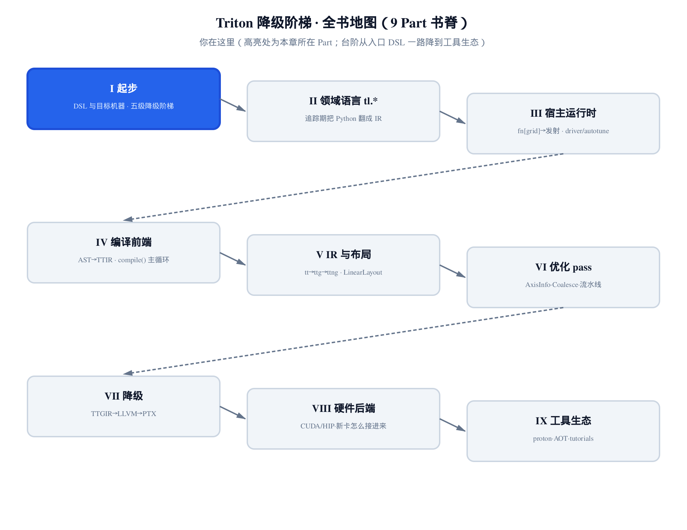
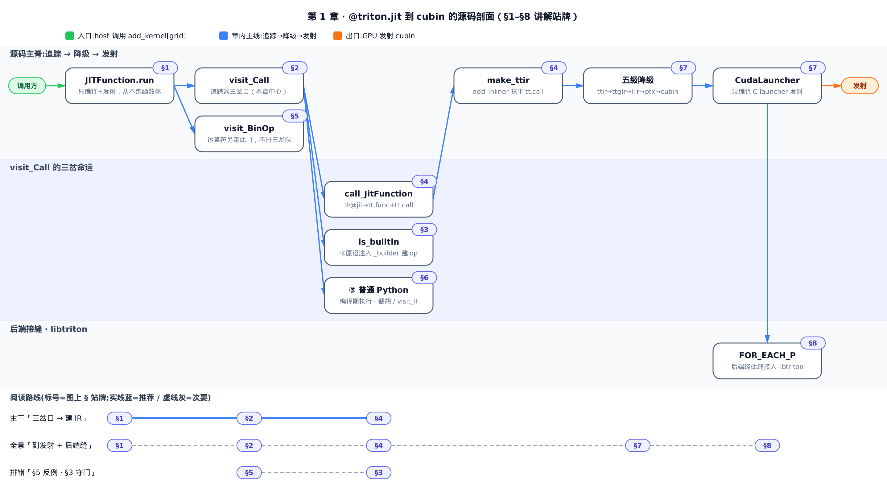
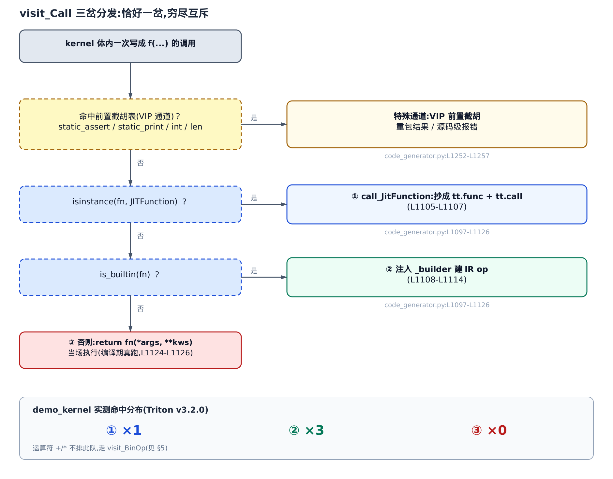
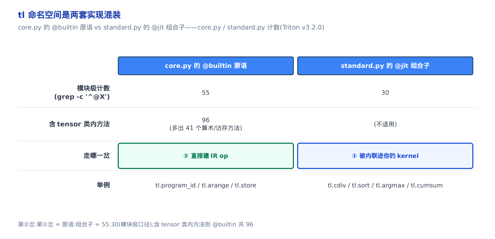
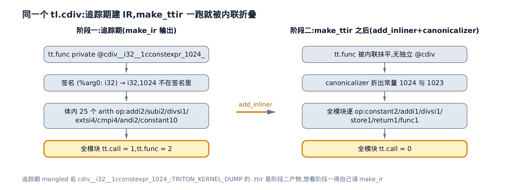
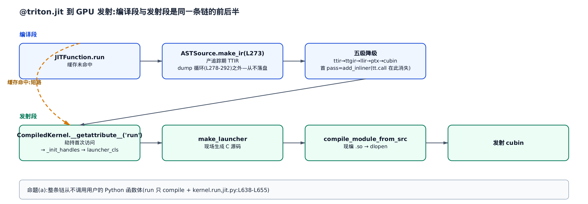
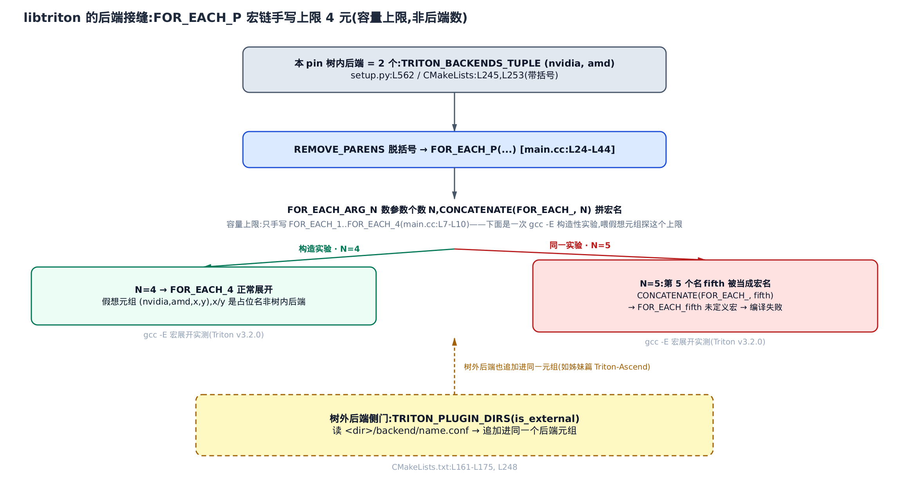

# Triton 是什么，以及本书怎么读



> **你在这里** ——第 I 部分「起步」的第一站。
> 上一章：无，这是全书的起点。
> 本章：立起全书的心智模型——一段 `@triton.jit` 的 Python 到底经历了什么。
> 下一章起：走进 `tl.*` 领域语言，看追踪器怎么把 Python 一路翻成 IR、再降级成 cubin。

你写下一个 `@triton.jit` 函数，`import` 它，`kernel[grid](...)` 一调，GPU 上就跑起来了。这套体验骗过了很多人：它看起来像「Python 被即时编译执行」。**不是的。** `@triton.jit` 里的 Python **从不作为 Python 运行**——它被一个追踪器（tracer）读一遍、翻译成一份中间表示（IR），再一路降级成机器码。真正在 GPU 上跑的，是这份机器码，跟你那段 Python 的调用栈毫无关系（`python/triton/runtime/jit.py:L563`）。

**这件事直接决定你能不能写出更快的 kernel。** 因为「Python 不是在跑、而是在被追踪」，所以哪个参数标了 `tl.constexpr`（编译期常量）、哪个值走编译期、哪个值留到运行期，就成了一道分水岭：标了 `constexpr` 的值在追踪时已经是一个具体数字，编译器能拿它去**特化**——把 `if` 分支在编译期消掉、把循环按已知次数展开、把访存按已知形状向量化；没标的值只是 IR 里一个运行期符号，这些优化统统做不了。本书后面每一章的优化——合并访存、消 bank conflict、`num_stages` 流水、命中 Tensor Core——地基都是这一章：**先看清什么在编译期定死、什么留到运行期。** 学会用 `TRITON_KERNEL_DUMP` 把五级降级产物一层层打出来看，你就有了给自己 kernel 做性能归因的第一把尺子。

**怎么读这一章。** 全章围绕一个中心机制：追踪器遇到 kernel 里一次函数调用时的**三岔分发**（`visit_Call`）。想先抓主干，顺着读 §1→§4 就能建立「Python 怎么变 IR」的完整心智模型；只关心「我的 kernel 报错 `Did you forget to add @triton.jit`」，直接跳 §5 的反例；想知道「五级降级各层长什么样、`.ttir` 里为什么找不到某些东西」，看 §4 与 §7；想给新硬件接后端、或读姊妹篇《Triton-Ascend 源码解读》，看 §8。本书是配对脊柱的**基座端**（姊妹篇是另一本书，讲把 Triton 接到另一款 AI 芯片的树外后端 Triton-Ascend，两本按同一套目录结构对照着写）——它讲的那个树外后端，接入点就在本章 §8 那道缝上。



想抓主干「三岔口怎么把 Python 建成 IR」，顺着 §1→§2→§4 读就够。想看全景一路到 GPU 发射与后端接缝，再续 §7、§8。只为排一个 `Did you forget to add @triton.jit` 的错，直接跳 §5 的反例和 §3 的守门本体，别的可以先不看。

## §1 一段 @triton.jit 的 Python 里，什么在跑、什么没跑

先看全书第一段真源码——官方教程的向量加法 kernel（`python/tutorials/01-vector-add.py`）。盯住三处，它们贯穿全书：

```python
# python/tutorials/01-vector-add.py:L27-L52
@triton.jit
def add_kernel(x_ptr,  # 指向第一个输入向量的指针
               y_ptr,  # 指向第二个输入向量的指针
               output_ptr,  # 指向输出向量的指针
               n_elements,  # 向量长度
               BLOCK_SIZE: tl.constexpr,  # 每个 program 处理多少元素
               ):
    # 多个 program 各处理一段数据，先确定「我是谁」：
    pid = tl.program_id(axis=0)  # 用 1D launch grid，所以 axis=0
    block_start = pid * BLOCK_SIZE
    offsets = block_start + tl.arange(0, BLOCK_SIZE)
    # 掩码：越界的元素不参与访存
    mask = offsets < n_elements
    # 从 DRAM 加载 x、y，被掩掉的位置不读
    x = tl.load(x_ptr + offsets, mask=mask)
    y = tl.load(y_ptr + offsets, mask=mask)
    output = x + y
    # 把 x + y 写回 DRAM
    tl.store(output_ptr + offsets, output, mask=mask)
```

三处是：① `@triton.jit`——这不是普通函数，装饰后它是一个 `JITFunction`（全限定名 `python/triton/runtime/jit.py:L442`）；② `BLOCK_SIZE: tl.constexpr`——它是**编译期常量**，正因为标了 `constexpr`，才能被当成形状值（`tl.arange(0, BLOCK_SIZE)` 里的上界）参与编译期计算；③ `tl.program_id` / `tl.arange` / `tl.load` / `tl.store`——全是语言原语（`@builtin`），它们在追踪时不「算数」，而是往 IR 里**刻一条 op**。

host 侧的调用方长这样：

```python
# python/tutorials/01-vector-add.py:L60-L76
def add(x: torch.Tensor, y: torch.Tensor):
    output = torch.empty_like(x)
    assert x.is_cuda and y.is_cuda and output.is_cuda
    n_elements = output.numel()
    # SPMD（Single Program Multiple Data，多个并行实例各跑同一段程序）launch grid：并行跑多少个 kernel 实例，类比 CUDA 的 launch grid
    grid = lambda meta: (triton.cdiv(n_elements, meta['BLOCK_SIZE']), )
    add_kernel[grid](x, y, output, n_elements, BLOCK_SIZE=1024)
    # 此刻还没 synchronize，kernel 仍在异步执行
    return output
```

`add_kernel[grid](...)` 这一句，落到 `KernelInterface.__getitem__`（`python/triton/runtime/jit.py:L324`）：它把 `grid` 记进闭包、返回一个转调 `self.run` 的 lambda。这里先埋一个反例的种子——`grid` lambda 里的 `triton.cdiv` 是 **host 侧的纯 Python 函数**，跟 kernel 体里能用的 `tl.cdiv` 是两码事，§5 会看到把它俩搞混的下场。

关于「什么没跑」，最硬的证据在 `JITFunction.run` 的收尾。全书的第一条命题——**(a) 运行期从不执行你的函数体**：

```python
# python/triton/runtime/jit.py:L638-L655
        if not warmup:
            # 规整 grid
            assert grid is not None
            if callable(grid):
                grid = grid(bound_args)
            grid_size = len(grid)
            grid_0 = grid[0]
            grid_1 = grid[1] if grid_size > 1 else 1
            grid_2 = grid[2] if grid_size > 2 else 1
            # 发射 kernel
            launch_metadata = kernel.launch_metadata(grid, stream, *non_constexpr_vals)
            kernel.run(grid_0, grid_1, grid_2, stream, kernel.function, kernel.packed_metadata, launch_metadata,
                       self.CompiledKernel.launch_enter_hook, self.CompiledKernel.launch_exit_hook, *non_constexpr_vals)
        return kernel
```

从头到尾，`run` 只做两件事：**编译**（未命中缓存时走 `self.compile`，把你的函数体**追踪**成 IR），和**发射**（`kernel.run(...)` 把编译好的 cubin 交给一个 C launcher）。**没有一处 `self.fn(...)`。** 你写的那段 Python，只在「追踪」这一支里被读一遍，永远不会作为 Python 被执行。这就是命题 (a)。

那么另外两条命题呢——**(b) 张量级语义不执行、被追踪成 IR**（`tl.load` / `x + y` 都是刻 op，不是算数）；**(c) 但 `constexpr` 级 Python 确实在编译期被执行**（`if BLOCK_SIZE > 128:` 这种真的会被 Python 求值）。三条看似矛盾，其实说的是**值的层级不同**：编译期常量在 Python 里算，运行期张量在 IR 里算。接下来三节把这三条逐一钉死，起点是追踪器的那个三岔口。

## §2 追踪器的三岔口：visit_Call

**直觉。** 把追踪器想成一个海关。kernel 里每一次「写成 `f(...)` 的调用」都要过关，而关员只有三个盖章窗口：被调的是 Triton 用 `@jit` 写的函数，走**①号窗口**——把它整段抄进你的 IR、留一条 `tt.call`；是语言原语 `@builtin`，走**②号窗口**——当场刻一条 IR op；是普通 Python 可调用物，走**③号窗口**——当场放行、真在编译期跑一遍。三个窗口之前还有一条 VIP 特殊通道（前置截胡，§6 讲）。



**机制。** 用一个覆盖三岔的最小 kernel（本章自撰，命名 `demo_kernel`，签名里一个运行期 `i32` 加一个 `constexpr`——它与 §4 那个 `num_blocks_kernel` 同构，想对着完整源码核下表就看那节），在追踪时记录每次调用落到哪一岔，实测结果是：

<!-- trace: m01-visit-call-three-way -->

| kernel 体内的调用 | 被调对象身份 | 分类谓词 | 落到哪一岔 | 追踪产物 |
| --- | --- | --- | --- | --- |
| `tl.cdiv(n_elements, BLOCK_SIZE)` | `JITFunction` | `isinstance(fn, JITFunction)` | ① `call_JitFunction` | 递归追踪出 `tt.func` + `tt.call` |
| `tl.program_id(axis)` | `@builtin` | `is_builtin(fn)` | ② 注入 `_builder` 建 op | `tt.get_program_id` |
| `tl.arange(0, BLOCK_SIZE)` | `@builtin` | `is_builtin(fn)` | ② 注入 `_builder` 建 op | `tt.make_range` |
| `tl.store(out_ptr + offs, n_blocks)` | `@builtin` | `is_builtin(fn)` | ② 注入 `_builder` 建 op | `tt.store` |

四次调用的命中分布是 ①×1、②×3、③×0（本例没有普通 Python 调用）。这里有个**关键的不变量**：三岔**互斥且穷尽**——任一「写成 `f(...)` 的调用」恰好落一岔，不多不少。为什么能这么斩钉截铁？看源码：

```python
# python/triton/compiler/code_generator.py:L1097-L1126
    def visit_Call(self, node):
        fn = _unwrap_if_constexpr(self.visit(node.func))
        static_implementation = self.statically_implemented_functions.get(fn)
        if static_implementation is not None:
            return static_implementation(self, node)

        kws = dict(self.visit(keyword) for keyword in node.keywords)
        args = [self.visit(arg) for arg in node.args]
        if isinstance(fn, JITFunction):
            _check_fn_args(node, fn, args)
            return self.call_JitFunction(fn, args, kws)
        if (hasattr(fn, '__self__') and _is_triton_value(fn.__self__)) or language.core.is_builtin(fn):
            extra_kwargs = {"_builder": self.builder}
            sig = inspect.signature(fn)
            if '_generator' in sig.parameters:
                extra_kwargs['_generator'] = self
            try:
                return fn(*args, **extra_kwargs, **kws)
            except Exception as e:
                # … 省略：异常包装的 from e 取舍注释 …
                raise CompilationError(self.jit_fn.src, node, None) from e

        if fn in self.builtin_namespace.values():
            args = map(_unwrap_if_constexpr, args)
        return fn(*args, **kws)
```

整个方法是一串 `if / return`，没有任何 fall-through：前置截胡表命中就 `return`；否则 `isinstance(fn, JITFunction)` 真则走①并 `return`（`call_JitFunction`）；`is_builtin(fn)` 真则走②并 `return`（`extra_kwargs = {"_builder": self.builder}` 就是「注入 `_builder`」的那一行）；其余一律落到最后的 `return fn(*args, **kws)`——③号窗口，当场执行。**恰好一岔**由此保证。（末尾 `if fn in self.builtin_namespace.values(): args = map(_unwrap_if_constexpr, args)` 那两行，是给 `int` / `len` 这类白名单函数在落③前做的一点解包小优化，§6 细讲。**别把这里的 `builtin_namespace` 和上面判 ②号窗口的 `is_builtin` 搞混**——前者是给纯 Python 函数用的另一张白名单，与 `is_builtin` 毫无关系，它到底装了哪些函数见 §5。）

三岔里，**判定谓词就是那两句 `isinstance` 和 `is_builtin`**（`is_builtin` 在 `python/triton/language/core.py`）。①②为什么绝不会同时命中？有一个实测事实：`is_builtin(tl.cdiv)` 为 `False`，而 `tl.cdiv` 是 `JITFunction`——所以它只可能进①、绝不进②。两窗口的判定顺序甚至可以互换而不改变任何行为，这背后是 `_tensor_member_fn`（`python/triton/language/core.py:L55-L83`）的设计：它把一个独立 `wrapper` 挂到 tensor 类上（L82），自己却原样 `return fn`（L83），所以 `tl.cdiv` 在 `tl` 命名空间里从头到尾都是 `JITFunction`，从没伪装成 builtin。

## §3 tl 盒子里是两种零件

**直觉。** 打开 `tl` 这盒工具，其实是两种零件混装：一种是「原厂锻造的原子扳手」（`@builtin`，一个原语直接对应一条 IR op 或硬件动作），另一种是「用原子扳手拼出来的组合套件」（`@jit`，Triton 用**它自己的语言**写的标准库，用时整套焊进你的 kernel 再被内联展开）。`cdiv` / `sort` / `argmax` / `cumsum` 都是后者。



**机制。** 这条分界线可以亲手数出来。在 pin v3.2.0 的源码树上按行首（无缩进）计数：

<!-- trace: m02-tl-namespace-split -->

| 计数口径 | `core.py` 的 @builtin | `standard.py` 的 @jit | 走哪一岔 |
| --- | --- | --- | --- |
| 模块级自由函数（`grep -c '^@builtin'` / `'^@jit'`） | 55 | 30 | @builtin→②、@jit→① |
| 含 tensor 类内缩进方法（`grep -cE '^[[:space:]]*@builtin'`） | 96 | （不适用） | 多出的是 tensor 算术/访存方法 |

原语 `:` 组合子 = 55 `:` 30（模块级口径）。这条分界线**互斥且穷尽**——一个 `tl` 符号只会落在其中一边（要么 `@builtin`、要么 `@jit`，绝不两者都是），正呼应 §2 三岔口里 `isinstance` 与 `is_builtin` 那对判定谓词。**口径必须交代清楚**——如果把 tensor 类内缩进的方法（`__add__` / `__sub__` / `__mul__` …）也算上，`@builtin` 共 96 个，多出的 41 个正是这些算术/访存方法。你若自己数出 96，别以为书写错了，那是把类内方法也数进去了。

`@jit` 那一半长什么样？以 `tl.cdiv` 为例——它就是一段普通的 Triton 代码：

```python
# python/triton/language/standard.py:L29-L40
@core._tensor_member_fn
@jit
def cdiv(x, div):
    """
    Computes the ceiling division of :code:`x` by :code:`div`
    ...
    """
    return (x + div - 1) // div
```

`return (x + div - 1) // div`——上取整除法，用的是 Triton 自己的 `+` / `-` / `//`。**这就是「标准库是用 Triton 写的」的字面证据。**（顶上那行 `@core._tensor_member_fn` 与这里的 `@builtin`／`@jit` 分野无关——上一节说过它原样返回 `fn`，只是额外让 `cdiv` 也能写成 `x.cdiv(y)` 的方法形式。）它被 `@jit`（就是 §1 的 `triton.jit` 本身，只是标准库内部直接引用、不经 `triton.` 前缀，并非另一个机制）装成 `JITFunction`，调用时走①号窗口，递归追踪成 IR 里一个 `tt.func` 再 `tt.call` 进来。这是一个刻意的设计决策：标准库不用 C++、也不用 `@builtin` 另开通道，而是复用「写用户 kernel 的同一套语言、同一条追踪路径」——写标准库和写你的 kernel，对追踪器是一回事。

`@builtin` 那一半的守门本体也值得先看一眼，因为 §5 的反例全靠它：

```python
# python/triton/language/core.py:L25-L39
def builtin(fn: T) -> T:
    """Mark a function as a builtin."""
    assert callable(fn)

    @wraps(fn)
    def wrapper(*args, **kwargs):
        if "_builder" not in kwargs or kwargs["_builder"] is None:
            print(kwargs)
            raise ValueError("Did you forget to add @triton.jit ? "
                             "(`_builder` argument must be provided outside of JIT functions.)")
        return fn(*args, **kwargs)

    setattr(wrapper, TRITON_BUILTIN, True)

    return wrapper
```

`@builtin` 包了一层 `wrapper`：进门先摸一把 `kwargs` 里有没有 `_builder`（那个从 pybind 过来的 MLIR builder；MLIR 是 Triton 用来表示 IR 的通用编译器基础设施，§4 细讲，这里先知道它是「建 IR 的那支笔」即可），没有就直接 `raise ValueError("Did you forget to add @triton.jit ?")`。这道守门是②号窗口的入场券——`visit_Call` 走②时注入的 `_builder`，正是为了让这里能通过。记住这句报错，§5 见。

## §4 一次 tl.cdiv 在 IR 里的两次形态

这是全章的 headline 例子，也是把命题 (b) 讲到底的地方。教程的 `add_kernel` 体内其实**不调用** `tl.cdiv`（它只在 host 侧 `grid` lambda 里出现过），所以要看清 `cdiv` 走①号窗口的全过程，得用一个**本章自撰的最小 kernel**，它体内真的调一次 `tl.cdiv`：

```python
# 本章自撰的最小示例（不是教程原文），用作观测 tl.cdiv 追踪产物的载体
@triton.jit
def num_blocks_kernel(out_ptr, n_elements, BLOCK_SIZE: tl.constexpr):
    n_blocks = tl.cdiv(n_elements, BLOCK_SIZE)
    tl.store(out_ptr, n_blocks)
```

前提钉死：`n_elements` 是运行期 `i32`（进 IR 签名），`BLOCK_SIZE=1024` 是 `constexpr`（编译期常量）。**这个「一个运行期 + 一个编译期」的搭配是例子说服力的全部来源**——如果两个实参都是 `constexpr`，`cdiv` 会在编译期被 `constexpr` 的 `__floordiv__` 直接算完，IR 里连 `tt.call` 都不会有。

**直觉。** `cdiv` 不是编译器内置的除号，而是一小段 `@jit` 函数。追踪器碰到它，像展开一个子程序：先把它单独抄成 IR 里一个私有 `tt.func`、在调用点留一条 `tt.call`；等后面 `make_ttir` 的第一个 pass 一跑，这个子函数又被整段塞回原地、常量折叠成两条算术。**你在 `TRITON_KERNEL_DUMP` 的 `.ttir` 里看到的是折叠之后的样子**——想看①号窗口的原貌，得自己调 `make_ir`。



**机制。** 先看①号窗口的落地——`call_JitFunction` 的前半段，`constexpr` 实参在这里被「请出」IR：

```python
# python/triton/compiler/code_generator.py:L1050-L1062
    def call_JitFunction(self, fn: JITFunction, args, kwargs):
        args = inspect.getcallargs(fn.fn, *args, **kwargs)
        args = [args[name] for name in fn.arg_names]
        args = [arg if _is_triton_value(arg) else constexpr(arg) for arg in args]
        # 生成 function def
        attributes = {}
        constexprs = [i for i, arg in enumerate(args) if _is_constexpr(arg)]
        constants = {i: args[i] for i in constexprs}
        # 生成 call
        args = [None if i in constexprs else arg for i, arg in enumerate(args)]
        arg_vals = [arg.handle for arg in args if arg is not None]
        arg_types = [arg.type for arg in args if arg is not None]
        fn_name = mangle_fn(fn.__name__, arg_types, constants)
```

关键三步：先把 `constexpr` 实参挑出来（`constexprs`）；再把它们从 IR 的 `arg_vals` / `arg_types` 里**抹掉**（`None if i in constexprs`）；最后转手把它们编进函数名（`mangle_fn`）。`mangle_fn` 怎么拼名：

```python
# python/triton/compiler/code_generator.py:L38-L48
def mangle_fn(name, arg_tys, constants):
    # 不 mangle 返回类型，它必须是入参类型的函数
    mangled_arg_names = '_'.join([mangle_ty(ty) for ty in arg_tys])
    mangled_constants = '_'.join([f'{i}c{repr(constants[i])}' for i in sorted(constants)])
    mangled_constants = mangled_constants.replace('.', '_d_')
    mangled_constants = mangled_constants.replace("'", '_sq_')
    # [ 和 ] 在 LLVM 标识符里不合法
    mangled_constants = mangled_constants.replace('[', '_').replace(']', '_')
    ret = f'{name}__{mangled_arg_names}__{mangled_constants}'
    return ret
```

`constants` 的 key 是参数下标（整数），value 是 `constexpr` 对象；`repr(constexpr(1024))` 是 `'constexpr[1024]'`，`[` `]` 被换成 `_`。于是 `cdiv(n_elements: i32, BLOCK_SIZE=1024)` 被调出的函数名是 `cdiv__i32__1cconstexpr_1024_`。在 pin v3.2.0 上真机取到的**追踪期 IR**（`make_ir` 输出，任何 pass 之前）如下。IR 用 MLIR 表示，`tt.` 是 Triton 这门 IR——TTIR（Triton IR）——自己的方言前缀，`arith.` 则是 MLIR 通用算术方言；下面两串溢出消毒 op 以省略号标出，完整计数见后文对照表：

```mlir
module {
  tt.func public @num_blocks_kernel(%arg0: !tt.ptr<i32>, %arg1: i32) attributes {noinline = false} {
    %0 = tt.call @cdiv__i32__1cconstexpr_1024_(%arg1) : (i32) -> i32
    tt.store %arg0, %0 : !tt.ptr<i32>
    tt.return
  }
  tt.func private @cdiv__i32__1cconstexpr_1024_(%arg0: i32) -> i32 attributes {noinline = false} {
    %c1024_i32 = arith.constant 1024 : i32
    // … 省略：sanitize_overflow 引入的 extsi/cmpi/andi 消毒 op 若干 …
    %6 = arith.addi %arg0, %c1024_i32_0 : i32
    // … 省略：第二串消毒 op …
    %13 = arith.subi %6, %c1_i32_1 : i32
    %14 = arith.divsi %13, %c1024_i32_5 : i32
    tt.return %14 : i32
  }
}
```

盯住三个铁证：**①** `cdiv` 变成了一个**独立的** `tt.func private`，调用点是一条 `tt.call`——这就是①号窗口的产物。**②** 名字 `cdiv__i32__1cconstexpr_1024_`：`i32` 来自运行期实参类型，`1cconstexpr_1024_` 来自 `constants={1: constexpr(1024)}`（下标 1 加 repr）。**③** 最硬的一条——被调 `tt.func` 的签名**只有一个参数** `(%arg0: i32)`，`1024` **不在签名里**，它在函数体内被物化成 `arith.constant 1024 : i32`；调用点也只传一个实参 `(%arg1)`（即 `n_elements`）。这就是「`constexpr` 进名字、不进 IR 签名」的 IR 级铁证，也是「编译期常量被特化掉」这句话最具体的样子。

（顺带解释一下那两串「省略」的消毒 op：`tensor` 的 `+` / `-` 默认开 `sanitize_overflow`，会先把 `i32` 提到 `i64` 算一遍、跟 `int32` 的 max/min 比一比。追踪期 `cdiv` 被调体内一共 25 个 `arith` op，一大半是这些消毒 op，§5 会讲它们从哪来。）

现在跑一遍 `make_ttir`，看**阶段二**——同一个模块，逐 op 穷举：

```mlir
module {
  tt.func public @num_blocks_kernel(%arg0: !tt.ptr<i32>, %arg1: i32) attributes {noinline = false} {
    %c1024_i32 = arith.constant 1024 : i32
    %c1023_i32 = arith.constant 1023 : i32
    %0 = arith.addi %arg1, %c1023_i32 : i32
    %1 = arith.divsi %0, %c1024_i32 : i32
    tt.store %arg0, %1 : !tt.ptr<i32>
    tt.return
  }
}
```

`cdiv` 的 `tt.func` / `tt.call` 整个消失了，全模块只剩 `num_blocks_kernel` 自己；那串消毒 op 也被清光。两阶段并排：

<!-- trace: m03-cdiv-traced-then-inlined -->

| 阶段 | cdiv 的形态 | 体内 arith op | 全模块 tt.call | 关键常量 |
| --- | --- | --- | --- | --- |
| 追踪期（`make_ir` 输出，pass 之前） | 独立 `tt.func private @cdiv__i32__1cconstexpr_1024_`，签名 `(%arg0: i32)` 只 1 个参数 | addi 2 / subi 2 / divsi 1 / extsi 4 / cmpi 4 / andi 2 / constant 10 | 1 | 1024 物化成 `arith.constant`，不进签名 |
| `make_ttir` 之后（add_inliner + canonicalizer） | 被内联抹平，全模块只剩 kernel 自身 | constant 2 / addi 1 / divsi 1 / store 1 / return 1 | 0 | 1024 与 1023 |

（顺带对齐口径：配图阶段二那栏比本表多列一个 `func 1`，那是把 kernel 自己的外层 `tt.func` 也算进了全模块统计；本表这一列只数体内的语句，未计外层 `tt.func`——两边口径不同、数值都对。）两件事在 `make_ttir` 里发生：`add_inliner`（它的第一个 pass）把 `cdiv` 的 `tt.func` / `tt.call` 内联抹平；`canonicalizer` 把 `(x + 1024) - 1` 折成一个 `arith.constant 1023`。**读者最容易踩的坑就在这**：`TRITON_KERNEL_DUMP` 出来的 `.ttir` 是**阶段二**的产物（原因 §7 讲——`make_ir` 的输出根本不落盘），你在那里只会看到 `1023`，看不到 `1024 - 1`，更看不到 `cdiv` 的 `tt.func`。想验证①号窗口的存在，只能自己调 `make_ir` 取追踪期 IR。**这条对你调 kernel 的意义**：当你想确认某个 `constexpr` 到底有没有被折进常量、某个分支有没有被消掉，得知道自己该看哪一层 IR——看错层，结论就反了。

## §5 运算符不排队，以及一个只差一个字的反例

上一节留了个尾巴：`cdiv` 体内的 `x + div - 1`，那些 `+` `-` 是怎么进 IR 的？它们**根本不排三岔口的队**。

**直觉。** kernel 里的 `x + y` 看着像「调用加法」，但在 Python 的 AST 里它是 `BinOp` 节点、不是 `Call` 节点——`visit_Call` 压根不管它。追踪器给它另开一条道 `visit_BinOp`，并且**主动把 `_builder` 塞进** `tensor.__add__`，于是加号被刻成一条 IR op。这条「主动注入」是理解下面那个反例的钥匙。

**机制。** 用一个自撰的 `addy_kernel`（一个标准的 load-add-store：`x_ptr+offs` / `y_ptr+offs` 取数、`x + y` 相加、`out_ptr+offs` 写回）同时盯 `visit_Call` 和 `visit_BinOp`，实测：

<!-- trace: m13-binop-not-via-visit-call -->

| kernel 体内的表达式 | AST 节点类型 | 走哪个 visitor | 追踪产物 |
| --- | --- | --- | --- |
| `tl.arange` / `tl.load` / `tl.store` | `ast.Call` | `visit_Call`（三岔分发） | 各自 @builtin 建 op |
| `x + y`（及 `x_ptr+offs` 等） | `ast.BinOp` | `visit_BinOp` → `_apply_binary_method` | 主动注入 `_builder` → `arith.addf` |

`x + y` 追踪成一条 `arith.addf`，全程不经过 `visit_Call`——实测 `addy_kernel` 体内一共 4 处 `+`（`x_ptr+offs` / `y_ptr+offs` / `out_ptr+offs` 三处指针偏移，加上 `x + y` 本身），全部落 `visit_BinOp`、0 处落 `visit_Call`。源码：

```python
# python/triton/compiler/code_generator.py:L536-L552
    def _apply_binary_method(self, method_name, lhs, rhs):
        if _is_triton_tensor(lhs):
            return getattr(lhs, method_name)(rhs, _builder=self.builder)
        if _is_triton_tensor(rhs):
            reverse_method_name = re.sub(r"__(.*)__", r"__r\1__", method_name)
            return getattr(rhs, reverse_method_name)(lhs, _builder=self.builder)
        return getattr(lhs, method_name)(rhs)

    def visit_BinOp(self, node):
        lhs = self.visit(node.left)
        rhs = self.visit(node.right)
        method_name = self._method_name_for_bin_op.get(type(node.op))
        if method_name is None:
            raise self._unsupported(node,
                                    "AST binary operator '{}' is not (currently) implemented.".format(node.op.__name__))
        return self._apply_binary_method(method_name, lhs, rhs)
```

`visit_BinOp` 把 `ast.Add` 映射成 `'__add__'`，交给 `_apply_binary_method`。命门在 `getattr(lhs, method_name)(rhs, _builder=self.builder)`——**追踪器主动注入 `_builder`**。而 `tensor.__add__` 正是一个 `@builtin`：

```python
# python/triton/language/core.py:L763-L765
    @builtin
    def __add__(self, other, _builder=None):
        return add(self, other, sanitize_overflow=True, _builder=_builder)
```

所以 `@jit` 体内的 `x + y` 能建 op，因为 `visit_BinOp` 递上了 `_builder`；而且 `sanitize_overflow=True` 就是上一节那串 `extsi` / `cmpi` / `andi` 消毒 op 的来源（消毒逻辑在 `python/triton/language/semantic.py:L199-L215`，把两个 `i32` 提到 `i64` 比一遍 max/min）。

**反例。** 反例要问的问题很直白：同样是 `x + y`，换个调用者会怎样？现在把这块钥匙插进锁孔。host 侧的 `triton.cdiv` 是一个**纯 Python 函数**，跟 `tl.cdiv` 同名不同物：

```python
# python/triton/__init__.py:L59-L60
def cdiv(x: int, y: int):
    return (x + y - 1) // y
```

注意类型标注是 `int`。它不在追踪器的白名单 `builtin_namespace` 里（那张表只有 `len` / `list` / `range` / `float` / `int` / `isinstance` / `getattr` 加 `print` / `min` / `max`）。要是你手一滑，在 kernel 体里写了 `triton.cdiv(n_elements, BLOCK_SIZE)`，它落到③号窗口被**当场执行**；体内那句 `x + y - 1` 触到 `tensor.__add__`——可这一次是 **Python 解释器自己**在调它，没有任何人注入 `_builder`——`@builtin` 的守门 `if "_builder" not in kwargs` 当场命中，`raise ValueError("Did you forget to add @triton.jit ?")`，再被追踪器兜底包成一条指回你 kernel 源码行的 `CompilationError`。两个 kernel 只差一个字：

<!-- trace: m04-builtin-gate-counterexample -->

| kernel 里写的 | 被调对象身份 | 落哪一岔 | 结果 |
| --- | --- | --- | --- |
| `tl.cdiv(n_elements, BLOCK_SIZE)` | `JITFunction`（`is_builtin=False`） | ① `call_JitFunction` | 编译通过，IR 出现 `tt.call @cdiv` |
| `triton.cdiv(n_elements, BLOCK_SIZE)` | 普通 function（不在 `builtin_namespace`） | ③ 当场执行 | 体内 `x+y` 触 `tensor.__add__` 无 `_builder` → `ValueError` → `CompilationError` |

**不变量**：反例炸的唯一原因是「谁在调 `__add__`、有没有人注入 `_builder`」，跟 `triton.cdiv` 本身对不对毫无关系。`@jit` 体内的 `x + y` 由 `visit_BinOp` 递上 `_builder` 而能建 op；③号窗口里普通 Python 函数体内的 `x + y` 由 Python 解释器直调、递不上 `_builder` 而报错。理解了这条，你以后看到 `Did you forget to add @triton.jit` 就知道去查什么：**是不是把一个 host 侧函数拖进了 kernel 体**。

## §6 三岔之前的 VIP 通道，与「编译期真跑的 Python」

三岔口之前那条 VIP 特殊通道，就是 `visit_Call` 开头那句 `statically_implemented_functions.get(fn)`。表里只有四个成员：

```python
# python/triton/compiler/code_generator.py:L1240-L1257
    def static_executor(python_fn):

        def ret(self, node: ast.Call):
            kws = {
                name: _unwrap_if_constexpr(value)
                for name, value in (self.visit(keyword) for keyword in node.keywords)
            }
            args = [_unwrap_if_constexpr(self.visit(arg)) for arg in node.args]
            return constexpr(python_fn(*args, **kws))

        return ret

    statically_implemented_functions: Dict[object, Callable[[ast.Call], Any]] = {
        language.core.static_assert: execute_static_assert,
        language.core.static_print: static_executor(print),
        int: static_executor(int),
        len: static_executor(len),
    }
```

**直觉。** 这条 VIP 通道对不同乘客意义不同：有的乘客（`int` / `len`）其实走普通的③号窗口也能到站，特殊通道只帮它省一道 `constexpr` 重新包装的手续；但有的乘客（`static_assert`）一旦不走特殊通道，就会被误当成「空壳 `@builtin`」放行——它本该报的错被**无声吞掉**。同一张表，对前者是便利、对后者是必需。

**机制。** 把这张表拆开做二选一对照实验（临时从表里摘掉某个成员，再重新 `make_ir`，headless 无需 GPU），实测三格：

<!-- trace: m05-static-intercept-and-constexpr-python -->

| 实验 | 截胡表状态 | 观测结果 | 结论 |
| --- | --- | --- | --- |
| `int` 作 shape 值 | 摘掉 `int` 截胡 | 照常编译，`tt.make_range` 照常建出 | 截胡是【便利】，非必需 |
| `static_assert` 为假（`BLOCK_SIZE == 999`，实参 16） | 对照组：截胡在（真 pin 行为） | 抛 `CompileTimeAssertionFailure`，指回 kernel 源码行 | 断言如实报错 |
| `static_assert` 为假（同上） | 摘掉 `static_assert` 截胡 | 静默编译通过，断言被吞、无任何报错 | 截胡是【必需】 |

为什么 `static_assert` 非截胡不可？因为它在 `core.py` 里是个 `@builtin` **空壳**——函数体只有一个 `pass`。要是不被前置截胡，它会落到②号窗口被当普通 builtin 调用，执行那个 `pass`，**什么都不发生**，一条为假的断言就这么被扔进了垃圾桶。截胡把它接管给 `execute_static_assert`，后者拿着 `ast.Call` 节点在追踪器手里求值、出源码级报错。`int` 则没这问题：它也在 §5 列过的 `builtin_namespace` 白名单里，所以落③号窗口时会先 `_unwrap_if_constexpr` 再调（就是 `visit_Call` 结尾那两行 `if fn in self.builtin_namespace.values(): args = map(_unwrap_if_constexpr, args)`），`int(1024)` 返回一个编译期裸 `int`，而 `tl.arange` 本来就接受裸 `int`。**这就是本机制的教学眼**：同一张表，`int` 的截胡是便利，`static_assert` 的截胡是不可或缺。

**命题 (c) 的正面证据**在 `visit_If`——`constexpr` 级 Python 确实在编译期被执行：

```python
# python/triton/compiler/code_generator.py:L698-L708
        else:
            cond = _unwrap_if_constexpr(cond)
            # 不是 isinstance——必须是真身，不接受子类、不接受 duck typing
            if type(cond) not in _condition_types:
                raise self._unsupported(
                    node, "`if` conditionals can only accept values of type {{{}}}, not objects of type {}".format(
                        ', '.join(_.__name__ for _ in _condition_types),
                        type(cond).__name__))

            active_block = node.body if cond else node.orelse
            self.visit_compound_statement(active_block)
```

当 `if` 的条件不是运行期 tensor（比如 `if BLOCK_SIZE > 128:`），追踪器 `_unwrap_if_constexpr` 后**在 Python 里把它真的求值一遍**，然后只把选中的那一支 `visit` 进 IR，另一支根本不进 IR。**这就是「标 `constexpr` 就能消分支」的机制原型**：你把开关值标成 `constexpr`，编译器就在这里替你把死分支删掉了——留在最终 IR 里的只有活着的那一支。

顺带堵一个对称的误区：`for i in range(N)` 里的 `range` **也不经过** `visit_Call`。`visit_For` 直接取迭代器类、单独 visit 各实参，普通 `range` 会被建成 `scf.for`，只有 `tl.static_range` 才在 Python 里展开成静态循环：

```python
# python/triton/compiler/code_generator.py:L898-L910
    def visit_For(self, node):
        IteratorClass = self.visit(node.iter.func)
        iter_args = [self.visit(arg) for arg in node.iter.args]
        iter_kwargs = dict(self.visit(keyword) for keyword in node.iter.keywords)
        if IteratorClass == language.static_range:
            iterator = IteratorClass(*iter_args, **iter_kwargs)
            static_range = range(iterator.start.value, iterator.end.value, iterator.step.value)
            for i in static_range:
                self.lscope[node.target.id] = constexpr(i)
                self.visit_compound_statement(node.body)
                # … 省略：orelse 分支 …
            return
        # … 省略：普通 range → 收集 lb/ub/step，随后建 scf.for …
```

所以「三岔口只管**写成 `f(...)` 的调用**」——运算符（`ast.BinOp`）和 `for`（`ast.For`）都各有各的门，别拿它们举例讲三岔。

## §7 从 Python 到 cubin：五级降级与发射

前面五节都在讲「追踪」这一步的产物——**追踪期 TTIR**。现在看它之后的路：五级降级，再发射。

**直觉。** 一段 `@triton.jit` 到 GPU 上真跑起来，中间隔着一条流水线：先追踪成最高层的 TTIR，再经五级降级 `ttir → ttgir → llir → ptx → cubin` 一路往硬件靠，最后由一个**运行时现生成、现编译**的 C launcher 把 cubin 发射出去。编译段和发射段是同一条链的前后半。



**机制（编译段）。** 五级降级的发动机在 `python/triton/compiler/compiler.py`：

```python
# python/triton/compiler/compiler.py:L260-L292
    # 跑编译流水线，填 metadata
    stages = dict()
    backend.add_stages(stages, options)
    first_stage = list(stages.keys()).index(src.ext)
    if ir_source:
        first_stage += 1
    context = ir.context()
    ir.load_dialects(context)
    backend.load_dialects(context)
    codegen_fns = backend.get_codegen_implementation()
    module_map = backend.get_module_map()
    try:
        module = src.make_ir(options, codegen_fns, module_map, context)
    except Exception as e:
        filter_traceback(e)
        raise
    use_ir_loc = os.environ.get("USE_IR_LOC", None)
    for ext, compile_ir in list(stages.items())[first_stage:]:
        next_module = compile_ir(module, metadata)
        ir_filename = f"{file_name}.{ext}"
        # … 省略：TRITON_KERNEL_OVERRIDE 旁路 …
        metadata_group[ir_filename] = fn_cache_manager.put(next_module, ir_filename)
        if fn_dump_manager is not None:
            fn_dump_manager.put(next_module, ir_filename)
        # … 省略：USE_IR_LOC 旁路 …
        module = next_module
```

看清一个决定命运的位置：`src.make_ir(...)`——这个 `src` 是一次编译的输入描述 `ASTSource`（`python/triton/compiler/compiler.py:L67` 起，打包了函数、签名、`constants`），它的 `make_ir` 产出**追踪期 TTIR**，在第 273 行，而落盘 / dump 的循环从第 278 行才开始。**`make_ir` 的输出在循环之外，从不落盘。** 这就是上一节那个坑的结构性根因——`TRITON_KERNEL_DUMP` 只 dump 循环里的产物，追踪期 TTIR 你在磁盘上永远看不到。循环里逐级调用的 `stages`，由后端登记：

```python
# third_party/nvidia/backend/compiler.py:L384-L389
    def add_stages(self, stages, options):
        stages["ttir"] = lambda src, metadata: self.make_ttir(src, metadata, options)
        stages["ttgir"] = lambda src, metadata: self.make_ttgir(src, metadata, options, self.capability)
        stages["llir"] = lambda src, metadata: self.make_llir(src, metadata, options, self.capability)
        stages["ptx"] = lambda src, metadata: self.make_ptx(src, metadata, options, self.capability)
        stages["cubin"] = lambda src, metadata: self.make_cubin(src, metadata, options, self.capability)
```

`stages` 字典的 key（`ttir` / `ttgir` / `llir` / `ptx` / `cubin`）就是 `TRITON_KERNEL_DUMP` 落盘的五个文件后缀，也是五级降级阶梯本身。第一级 `make_ttir` 里第一个 pass 就是 `add_inliner`——上一节 `cdiv` 的 `tt.call` 就在这里被抹掉：

```python
# third_party/nvidia/backend/compiler.py:L187-L201
    @staticmethod
    def make_ttir(mod, metadata, opt):
        pm = ir.pass_manager(mod.context)
        pm.enable_debug()
        passes.common.add_inliner(pm)
        passes.ttir.add_rewrite_tensor_pointer(pm)
        passes.ttir.add_combine(pm)
        passes.common.add_canonicalizer(pm)
        passes.ttir.add_reorder_broadcast(pm)
        passes.common.add_cse(pm)
        passes.common.add_licm(pm)
        passes.common.add_symbol_dce(pm)
        passes.ttir.add_loop_unroll(pm)
        pm.run(mod)
        return mod
```

**机制（发射段）。** 五级跑完，`compile()` 返回一个 `CompiledKernel`。发射这一跳藏得很深——`.run` 的第一次访问被劫持：

```python
# python/triton/compiler/compiler.py:L379-L396
    def _init_handles(self):
        if self.module is not None:
            return
        device = driver.active.get_current_device()
        # 造 launcher
        self.run = driver.active.launcher_cls(self.src, self.metadata)
        # 共享内存不够就报错
        max_shared = driver.active.utils.get_device_properties(device)["max_shared_mem"]
        if self.metadata.shared > max_shared:
            raise OutOfResources(self.metadata.shared, max_shared, "shared memory")
        self.module, self.function, self.n_regs, self.n_spills = driver.active.utils.load_binary(
            self.name, self.kernel, self.metadata.shared, device)

    def __getattribute__(self, name):
        if name == 'run':
            self._init_handles()
        return super().__getattribute__(name)
```

`__getattribute__` 拦下对 `.run` 的首次访问，触发 `_init_handles`，`launcher_cls(...)` 现场造出一个 launcher，`load_binary` 把 cubin 装进 driver。这个 launcher 是什么？是运行时**现生成、现编译的 C 代码**：

```python
# third_party/nvidia/backend/driver.py:L431-L444
class CudaLauncher(object):

    def __init__(self, src, metadata):
        ids = {"ids_of_const_exprs": src.fn.constexprs if hasattr(src, "fn") else tuple()}
        constants = src.constants if hasattr(src, "constants") else dict()
        cst_key = lambda i: src.fn.arg_names.index(i) if isinstance(i, str) else i
        constants = {cst_key(key): value for key, value in constants.items()}
        signature = {cst_key(key): value for key, value in src.signature.items()}
        src = make_launcher(constants, signature, ids)
        mod = compile_module_from_src(src, "__triton_launcher")
        self.launch = mod.launch

    def __call__(self, *args, **kwargs):
        self.launch(*args, **kwargs)
```

`make_launcher` 按这个 kernel 的具体签名**生成一段 C 源码字符串**，`compile_module_from_src` 把它写进临时文件、调编译器编成 `.so`、再 `dlopen` 回来。为什么不预编译进 wheel？因为 launcher 要按参数个数/类型把 Python 对象拆成 `CUdeviceptr` 数组——与其写一个万能可变参数版本，不如按签名现生成一份并缓存。

这条链上串起了**三条双语接缝**（Python 与 C++/MLIR 的缝合处）：缝一，`_builder` 是从 pybind 过来的 MLIR builder 对象，每个 `@builtin` 靠它建 op；缝二，参数校验/合法化在 Python（`semantic.py` 逐条报错），真正建 op、跑 pass 在 C++/MLIR；缝三，就是刚看到的这个运行时现编译的 C launcher。**命题 (a) 在这条链上再确认一遍**：从 `run` 到 `kernel.run` 到 `self.launch`，没有一处调用过你写的 Python 函数体。

**这对你调 kernel 的意义**：`TRITON_KERNEL_DUMP=1` 会把 `ttir → ttgir → llir → ptx → cubin` 五层全落盘。想知道自己的访存有没有被合并、循环有没有按 `num_stages` 排成流水、有没有命中 Tensor Core，就是去这五层里逐级读——这是全书所有性能章共用的观察窗口。

## §8 后端怎么缝进来，以及本书怎么读

最后一站，看 Triton 怎么把各家后端（nvidia / amd / …）缝进 `libtriton`，顺带交代姊妹篇的接入点。

**直觉。** 缝合靠 `python/src/main.cc` 里一条手写的 C 预处理器宏 `FOR_EACH_P`：它给每个后端名展开出一句 `init_triton_<name>` 声明和一个 submodule 注册。但这条宏链只手写到 4 元——想缝第 5 个后端，宏不会「自动拼出 `FOR_EACH_5`」，而是把第 5 个后端的名字**错当成宏名**，撞成一个未定义宏、编译当场失败。



**机制。** 宏本体（自包含所需的全部在此）：

```cpp
// python/src/main.cc:L7-L32
#define FOR_EACH_1(MACRO, X) MACRO(X)
#define FOR_EACH_2(MACRO, X, ...) MACRO(X) FOR_EACH_1(MACRO, __VA_ARGS__)
#define FOR_EACH_3(MACRO, X, ...) MACRO(X) FOR_EACH_2(MACRO, __VA_ARGS__)
#define FOR_EACH_4(MACRO, X, ...) MACRO(X) FOR_EACH_3(MACRO, __VA_ARGS__)

#define FOR_EACH_NARG(...) FOR_EACH_NARG_(__VA_ARGS__, FOR_EACH_RSEQ_N())
#define FOR_EACH_NARG_(...) FOR_EACH_ARG_N(__VA_ARGS__)
#define FOR_EACH_ARG_N(_1, _2, _3, _4, N, ...) N
#define FOR_EACH_RSEQ_N() 4, 3, 2, 1, 0

#define CONCATENATE(x, y) CONCATENATE1(x, y)
#define CONCATENATE1(x, y) x##y

#define FOR_EACH(MACRO, ...)                                                   \
  CONCATENATE(FOR_EACH_, FOR_EACH_NARG_HELPER(__VA_ARGS__))(MACRO, __VA_ARGS__)
#define FOR_EACH_NARG_HELPER(...) FOR_EACH_NARG(__VA_ARGS__)

#define REMOVE_PARENS(...) __VA_ARGS__

#define FOR_EACH_P_INTERMEDIATE(MACRO, ...) FOR_EACH(MACRO, __VA_ARGS__)

#define FOR_EACH_P(MACRO, ARGS_WITH_PARENS)                                    \
  FOR_EACH_P_INTERMEDIATE(MACRO, REMOVE_PARENS ARGS_WITH_PARENS)
```

**真正被调用的是 `FOR_EACH_P`，不是 `FOR_EACH`。** 因为后端名元组是**带括号的** `(nvidia,amd)`，得先由 `REMOVE_PARENS` 脱括号、再多绕一层保证展开顺序，才轮到 `FOR_EACH` 去数参数个数。数参数靠 `FOR_EACH_ARG_N(_1, _2, _3, _4, N, ...)` 取第 5 个位置的 token 当 `N`——4 个后端时第 5 个位置落在 `RSEQ_N` 的 `4` 上，拼出 `FOR_EACH_4`，正常展开；**5 个后端时第 5 个位置落在第 5 个后端的名字上**，`CONCATENATE` 拼成 `FOR_EACH_<那个名字>`（未定义）→ 编译失败。用 `gcc -E` 实测，5 元时得到的正是 `FOR_EACH_fifth(DECLARE_BACKEND, nvidia,amd,ascend,proton,fifth)`——不是 `FOR_EACH_5`。（这里 `nvidia`、`amd` 之后的名字只是这次构造实验凑够 5 元的占位名——本 pin 默认编译进来的树内后端只有 `nvidia`、`amd` 两个；`ascend` 是姊妹篇那样从 `TRITON_PLUGIN_DIRS` 侧门挤入的树外后端，并非本仓库自带。）宏的两个用户在下面：

```cpp
// python/src/main.cc:L34-L44
#define DECLARE_BACKEND(name) void init_triton_##name(pybind11::module &&m);

#define INIT_BACKEND(name) init_triton_##name(m.def_submodule(#name));

void init_triton_env_vars(pybind11::module &m);
void init_triton_ir(pybind11::module &&m);
void init_triton_llvm(pybind11::module &&m);
void init_triton_interpreter(pybind11::module &&m);
void init_triton_passes(pybind11::module &&m);
void init_triton_stacktrace_hook(pybind11::module &m);
FOR_EACH_P(DECLARE_BACKEND, TRITON_BACKENDS_TUPLE)
```

那个带括号的 `TRITON_BACKENDS_TUPLE` 从哪来？CMake 拼好用 `-D` 塞进来：

```cmake
# CMakeLists.txt:L245-L254
  string(JOIN "," TRITON_BACKENDS_TUPLE ${TRITON_CODEGEN_BACKENDS})

  if (DEFINED TRITON_PLUGIN_NAMES)
    string(JOIN "," TRITON_BACKENDS_TUPLE ${TRITON_BACKENDS_TUPLE} ${TRITON_PLUGIN_NAMES})
  endif()

  message(STATUS "Triton backends tuple: ${TRITON_BACKENDS_TUPLE}")

  set(TRITON_BACKENDS_TUPLE "(${TRITON_BACKENDS_TUPLE})")
  add_compile_definitions(TRITON_BACKENDS_TUPLE=${TRITON_BACKENDS_TUPLE})
```

内建后端加上插件后端名拼成逗号串、套上括号，塞给 `main.cc`。**这里就是姊妹篇的接入点**：`TRITON_PLUGIN_NAMES` 来自 `TRITON_PLUGIN_DIRS`（读 `<dir>/backend/name.conf`），这道缝正是树外后端 Triton-Ascend 挤进这个元组的方式。Python 侧还有一个对应的发现机制，扫 `python/triton/backends/` 下每个子目录，各找出一份后端实现：

```python
# python/triton/backends/__init__.py:L35-L50
def _discover_backends():
    backends = dict()
    root = os.path.dirname(__file__)
    for name in os.listdir(root):
        if not os.path.isdir(os.path.join(root, name)):
            continue
        if name.startswith('__'):
            continue
        compiler = _load_module(name, os.path.join(root, name, 'compiler.py'))
        driver = _load_module(name, os.path.join(root, name, 'driver.py'))
        backends[name] = Backend(_find_concrete_subclasses(compiler, BaseBackend),
                                 _find_concrete_subclasses(driver, DriverBase))
    return backends


backends = _discover_backends()
```

这里的 `BaseBackend`（后端抽象基类）规定了每个后端必须实现 `parse_options` / `add_stages` / `load_dialects` 等——本章只**点名**，它是后续「硬件后端」部分和姊妹篇逐章对位的锚。姊妹篇 Triton-Ascend 干的事，就是往 `python/triton/backends/` 塞一个 `ascend/` 目录、再从 `TRITON_PLUGIN_DIRS` 那道缝进 C++ 侧。

**这一整条链，就是本书的目录。** 把 roadmap 那张图从头走一遍：第 I 部分「起步」——你现在这里，看清领域语言 `tl.*` 与目标机器、五级降级阶梯的全貌；第 II 部分「领域语言 `tl.*`」——把 §2/§3 的追踪展开讲透，Python 怎么一句句翻成 IR；第 III 部分「宿主运行时」——`kernel[grid]` 到发射、driver 与 autotune；第 IV 部分「编译前端」——`ast_to_ttir` 与 `compile()` 主循环；第 V/VI 部分「IR 与布局 / 优化 pass」——`ttir → ttgir` 与 `LinearLayout`、合并访存与流水线；第 VII/VIII 部分「降级 / 硬件后端」——`ttgir → llir → ptx`、以及 §8 这道后端缝怎么接新卡；第 IX 部分「工具生态」——`proton` / AOT / 教程。每一章都站在这条链的某一节上。（还有一条旁路没细讲：`TRITON_INTERPRET=1` 时 `@triton.jit` 不返回 `JITFunction` 而是返回一个 `InterpretedFunction`（`python/triton/runtime/interpreter.py:L1198`）——它先由 `FunctionRewriter` 重写 AST，再交给 `GridExecutor` 在 CPU 上串行遍历 grid、逐 program 执行，入口在 `python/triton/runtime/jit.py:L832` 起。本机没 GPU 时用它观察 kernel 行为，后续专章会讲准它「不是原样跑 Python」。）

## 小结

一句话收束全章：**`@triton.jit` 里的 Python 不是在跑，而是在被追踪。** 追踪器 `visit_Call` 的三岔口把每一次调用分成三种命运——`@jit` 组合子抄成 `tt.func` + `tt.call`（①）、`@builtin` 原语注入 `_builder` 当场建 op（②）、普通 Python 编译期真跑一遍（③）；而运算符和 `for` 各走各的门，不排这个队（`python/triton/compiler/code_generator.py:L536`、`L898`）。产物是追踪期 TTIR，再经五级降级 `ttir → ttgir → llir → ptx → cubin`，最后由现场编译的 C launcher 发射——全程从不执行你的函数体（`python/triton/runtime/jit.py:L638`）。

**回到性能这条主线。** 你现在有了三把尺子：其一，**看清 `constexpr` 边界**——标了 `constexpr` 的值在追踪时是具体数字，编译器才能拿它消分支（`visit_If`）、特化函数（`cdiv__i32__1cconstexpr_1024_` 那个只有一个参数的签名）、按已知形状展开与向量化；没标的值只是运行期符号，这些优化全做不了。其二，**看对 IR 的层**——追踪期 IR 和 `.ttir` dump 差着一个 `add_inliner` + `canonicalizer`，想验证某个折叠/消分支到底发生没发生，得知道自己该看哪一层。其三，**会用 `TRITON_KERNEL_DUMP` 逐层读产物**——这是后面每一章做性能归因的公共窗口。地基打到这，就可以往下走了。
