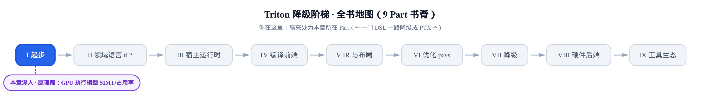
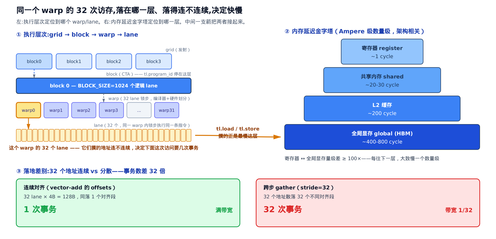
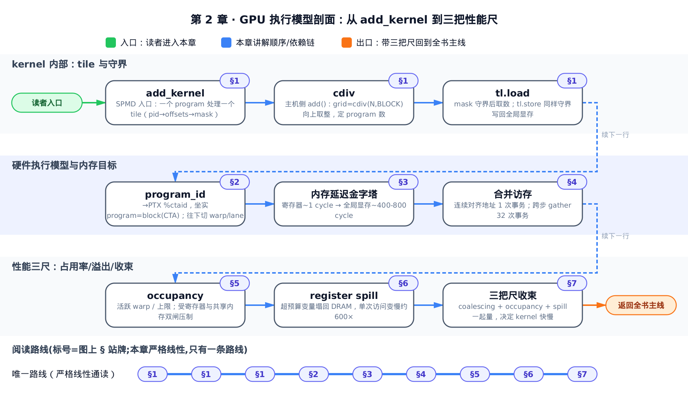
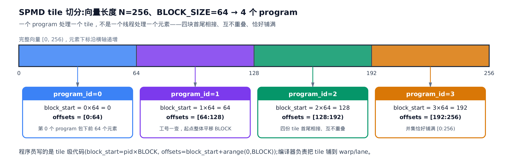
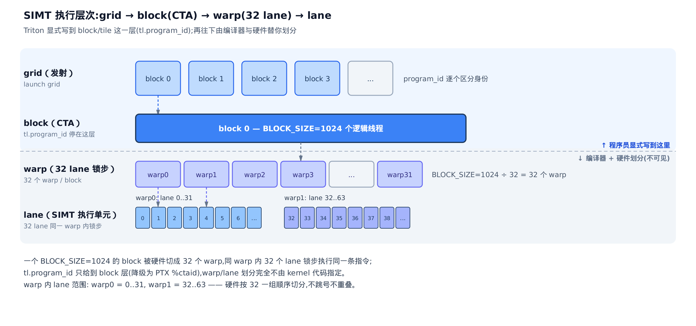
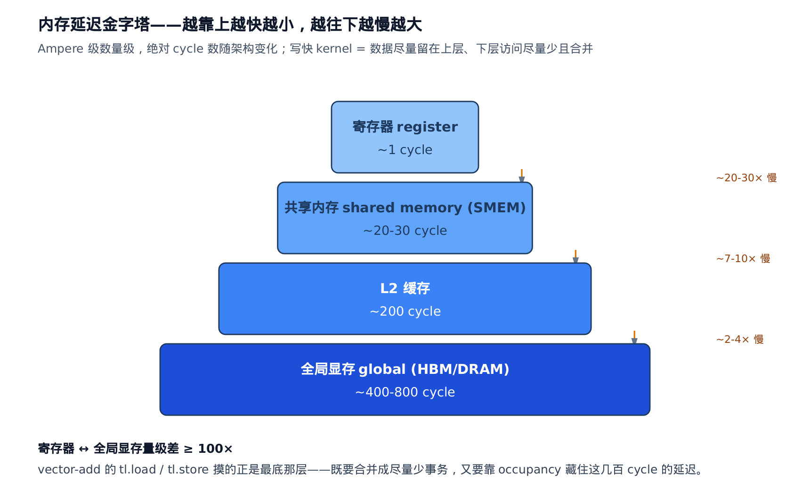
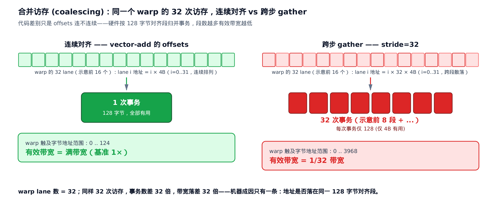
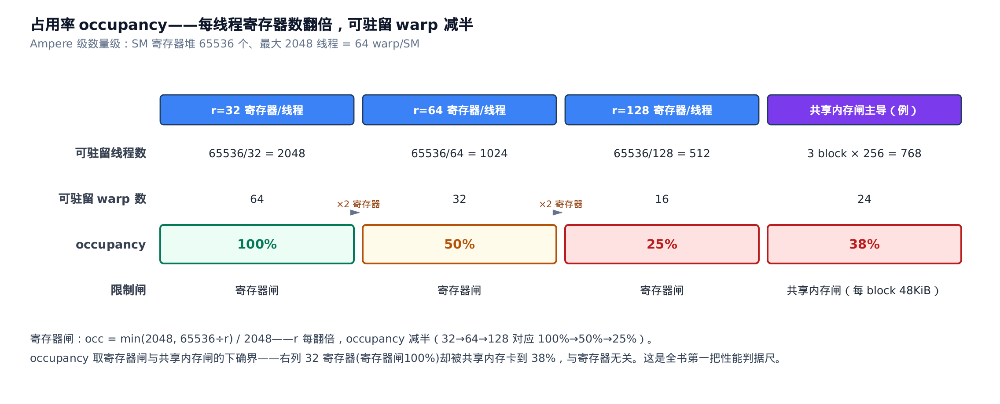

# GPU 执行模型：一张图与三把性能尺



> **你在这里** ——第 I 部分「起步」的第二站。
> 上一章：Python 被追踪成 IR、一路降级成机器码。
> 本章：把跑这份机器码的硬件，铸成脑中的一张图。
> 下一章：[跟一个 kernel 走完一生](../../ch03-kernel-life-birdseye/narrative/chapter.md)。

上一章结束时，你已经能用 `TRITON_KERNEL_DUMP` 把五级降级产物一层层打出来看。但盯着 PTX（GPU 的虚拟汇编，五级降级的第四层）你依然答不了那个真正要紧的问题：**我这个 kernel 为什么慢？** 答案几乎从不在语法里，而在硬件的执行模型里。本章不深入编译器内部——主锚点只是你在[第 1 章](../../ch01-what-is-triton/narrative/chapter.md)已经逐行看过的 26 行 `add_kernel`，把 GPU 执行模型摆成一张图，并交给你三把贯穿全书的性能判据尺：

- **occupancy（占用率）** ——一个 SM（Streaming Multiprocessor，流式多处理器，GPU 的基本计算单元）上驻留的活跃 warp 够不够多，决定几百拍的访存延迟能不能被别人的计算盖住；
- **coalescing（合并访存）** ——同一 warp 的 32 个地址连不连续，决定一次访存是 1 次事务还是 32 次；
- **register spill（寄存器溢出）** ——超出预算的变量被赶去 DRAM，单次访问延迟塌回几百倍。

后面的布局、访存优化、共享内存分配、后端占用率各章做性能决策时，量的都是这三把尺。先看全章的图——它就是本章要在你脑中留下的那张：



左半是执行层次：grid（一次发射的全部并行实例）→ block → warp → lane，逐层往下切，你的一次访存最终由某个 warp 的 32 个 lane 同时发出。右半是内存延迟金字塔：这 32 个访问落在寄存器层是 ~1 cycle，落在全局显存层是 ~400–800 cycle。中间那支箭是全章的枢纽：`tl.load` / `tl.store` 摸的正是最慢那层，所以底部的对比才如此致命——32 个地址连续对齐，硬件并成 1 次事务；散开，就是 32 次。本章逐节把这张图的每个数字讲到你能自己推出来。

先立本章符号，全部只涉及整数算术：

| 符号 | 含义 | 首现 |
|---|---|---|
| $`N`$ | 待处理向量的元素总数（vector-add 里的 `n_elements`） | §1 |
| $`\mathrm{BLOCK\_SIZE}`$ | 一个 program 负责的 tile 大小；vector-add 取 1024 | §1 |
| $`i`$ | tile 内下标：`tl.arange` 生成的 block 内元素编号 0..BLOCK_SIZE−1（§2 按 32 一组对应成 warp 的逻辑 lane） | §1 |
| $`\mathrm{occ}`$ | 占用率：每 SM 活跃 warp 数占硬件上限的比例 | §5 |
| $`W_{a}`$ | 一个 SM 上同时驻留、可供调度器轮转的活跃 warp 数 | §5 |
| $`W_{\max}`$ | 一个 SM 硬件允许的最大驻留 warp 数（Ampere 级约 64） | §5 |
| $`R_{\mathrm{sm}}`$ | 一个 SM 的寄存器堆总容量（Ampere 级约 65536 个 32-bit 寄存器） | §5 |
| $`r`$ | 编译器给 kernel 每个线程分配的寄存器数 | §5 |
| $`T_{\max}`$ | 一个 SM 硬件允许的最大驻留线程数（Ampere 级约 2048） | §5 |

本章的量化基准取 Ampere 级数量级（NVIDIA A100 那一代），绝对值随架构变化，量级与结论不变。



只想直接拿三把尺去量自己的 kernel，跳 §4（合并访存）、§5（占用率）、§6（寄存器溢出）配上 §7 的收束图；想弄清楚这三把尺是怎么从 tile、grid→block→warp→lane、内存延迟金字塔一路推出来的，就从 §1 按顺序读到 §7。

## §1 一个 program 包下一片连续数据——tile 是并行的基本单位

上一章从「代码怎么变 IR」的角度读过 `add_kernel`；现在换硬件视角把它重读一遍。这 26 行是全章的主锚点（`python/tutorials/01-vector-add.py:L27-L52`）：

```python
# python/tutorials/01-vector-add.py:L27-L52
@triton.jit
def add_kernel(x_ptr,  # *Pointer* to first input vector.
               y_ptr,  # *Pointer* to second input vector.
               output_ptr,  # *Pointer* to output vector.
               n_elements,  # Size of the vector.
               BLOCK_SIZE: tl.constexpr,  # Number of elements each program should process.
               # NOTE: `constexpr` so it can be used as a shape value.
               ):
    # There are multiple 'programs' processing different data. We identify which program
    # we are here:
    pid = tl.program_id(axis=0)  # We use a 1D launch grid so axis is 0.
    # This program will process inputs that are offset from the initial data.
    # For instance, if you had a vector of length 256 and block_size of 64, the programs
    # would each access the elements [0:64, 64:128, 128:192, 192:256].
    # Note that offsets is a list of pointers:
    block_start = pid * BLOCK_SIZE
    offsets = block_start + tl.arange(0, BLOCK_SIZE)
    # Create a mask to guard memory operations against out-of-bounds accesses.
    mask = offsets < n_elements
    # Load x and y from DRAM, masking out any extra elements in case the input is not a
    # multiple of the block size.
    x = tl.load(x_ptr + offsets, mask=mask)
    y = tl.load(y_ptr + offsets, mask=mask)
    output = x + y
    # Write x + y back to DRAM.
    tl.store(output_ptr + offsets, output, mask=mask)
```

注意这段代码里**没有线程**。CUDA 教科书的第一课是「一个线程处理一个元素」，而这里的单位大了一号：一个 program 处理 $`\mathrm{BLOCK\_SIZE}`$ 个元素组成的一片连续数据——**tile**（静态形状的多维子数组，这里退化成一维）。这不是教程的简化，而是 Triton 的立论：把 tile 作为程序与 IR 的基本单位，程序员写 tile 级代码，线程映射、合并访存、共享内存分配这些本该手写的苦活交给编译器（Tillet 等人的 Triton 论文，MAPL 2019，[doi.org/10.1145/3315508.3329973](https://doi.org/10.1145/3315508.3329973)）。本章交出的三把尺，正是编译器替你做这些决策时的评判标准。

**每个 program 怎么知道自己该算哪一片？** 全部 program 跑同一段代码（SPMD，上一章已立），唯一的分叉点是 `pid = tl.program_id(axis=0)`——「我是第几个实例」。身份一乘 tile 大小，就是自己的起点：`block_start = pid * BLOCK_SIZE`；再加上 `tl.arange(0, BLOCK_SIZE)` 生成的连续偏移，就是自己那片 tile 的全部下标。源码注释里那个 256/64 的例子，正是最小可心算的推演：

<!-- trace: m02-spmd-tile-model -->

| program_id | block_start = pid×BLOCK | 负责的 offsets（半开区间） | tile 长度 | 说明 |
|---|---|---|---|---|
| 0 | 0 | [0:64) | 64 | 第 0 个 program 包下前 64 个元素 |
| 1 | 64 | [64:128) | 64 | 工号一变，起点整体平移 BLOCK |
| 2 | 128 | [128:192) | 64 | 四份 tile 首尾相接、互不重叠 |
| 3 | 192 | [192:256) | 64 | 并集恰好铺满 [0:256) |



这张表藏着一条不变量：

> **tile 两两不重叠，且并集覆盖 $`[0, N)`$** ——没有元素漏算，也没有元素被算两遍。

措辞上要分清两个集合：tile 的原始并集是 `[0, grid×BLOCK)`，是 $`[0,N)`$ 的超集（表里 256 恰好整除，两者相等；一般情形会多出零头）；真正与 $`[0,N)`$ 恰好相等的，是 mask 削平零头之后实际被读写的集合。论证只需两步：`block_start(pid) = pid×BLOCK` 是步长为 BLOCK 的严格递增序列，每片 tile 长恰好 BLOCK，故第 pid 片的右端点等于第 pid+1 片的左端点——相邻无缝、无叠；基例 pid=0 从 0 起，归纳到最后一片，并集为 `[0, grid×BLOCK)`，包含 $`[0,N)`$，超出 $`N`$ 的零头由 mask 削平（马上讲）。program 之间因此无通信、无同步——这就是 SPMD 可以无脑并行的根。

**要发射多少个 program？** 主机侧的答案在 `add()` 里（`python/tutorials/01-vector-add.py:L60-L76`）：

```python
# python/tutorials/01-vector-add.py:L60-L76
def add(x: torch.Tensor, y: torch.Tensor):
    # We need to preallocate the output.
    output = torch.empty_like(x)
    assert x.is_cuda and y.is_cuda and output.is_cuda
    n_elements = output.numel()
    # The SPMD launch grid denotes the number of kernel instances that run in parallel.
    # It is analogous to CUDA launch grids. It can be either Tuple[int], or Callable(metaparameters) -> Tuple[int].
    # In this case, we use a 1D grid where the size is the number of blocks:
    grid = lambda meta: (triton.cdiv(n_elements, meta['BLOCK_SIZE']), )
    # NOTE:
    #  - Each torch.tensor object is implicitly converted into a pointer to its first element.
    #  - `triton.jit`'ed functions can be indexed with a launch grid to obtain a callable GPU kernel.
    #  - Don't forget to pass meta-parameters as keywords arguments.
    add_kernel[grid](x, y, output, n_elements, BLOCK_SIZE=1024)
    # We return a handle to z but, since `torch.cuda.synchronize()` hasn't been called, the kernel is still
    # running asynchronously at this point.
    return output
```

`grid` 就是 launch grid（发射网格）——并行 program 的个数。它由 `triton.cdiv` 算出，真身只有一行（`python/triton/__init__.py:L59-L60`）：

```python
# python/triton/__init__.py:L59-L60
def cdiv(x: int, y: int):
    return (x + y - 1) // y
```

直觉：把 $`N`$ 个元素按每袋 $`\mathrm{BLOCK\_SIZE}`$ 个装袋，袋数必须向上取整——最后剩几个也得再开一袋，否则尾巴没人算。整数式 `(x + y - 1) // y` 正是天花板函数：

```math
\mathrm{grid} \;=\; \left\lceil \frac{N}{\mathrm{BLOCK\_SIZE}} \right\rceil \;=\; \left\lfloor \frac{N + \mathrm{BLOCK\_SIZE} - 1}{\mathrm{BLOCK\_SIZE}} \right\rfloor
```

由天花板函数定义，grid 是满足「grid × BLOCK_SIZE ≥ N」的最小整数——覆盖完整，且去掉任何一个 program 都会漏算它负责的那片真实元素（该式即教程 L68 的 `grid` lambda，SPMD launch grid 的出处见上方内嵌注释）。拿教程自己做正确性对拍的尺寸 $`N = 98432`$（`python/tutorials/01-vector-add.py:L83`）代入：

<!-- trace: m07-grid-launch-cdiv -->

| N | grid = cdiv(N, 1024) | 满块数 | 尾块真实元素 | 整除？ |
|---|---|---|---|---|
| 98432 | 97 | 96 | 128 | 否（多开 1 个 program 兜零头） |
| 98304 | 96 | 96 | 0 | 是（恰好整除） |
| 1025 | 2 | 1 | 1 | 否（多 1 个元素也要多 1 个 program） |

第一行的算术值得亲手过一遍：96×1024 = 98304 < 98432 ≤ 97×1024 = 99328，所以 grid=97——96 个满块，加 1 个只有 98432−98304 = 128 个真实元素的尾块。

**尾块里多出来的 896 个位置怎么办？** 这就是 `mask = offsets < n_elements` 的活。尾块 program（pid=96）拿到的 offsets 是 98304..99327，共 1024 个；其中不小于 $`N`$ 的那些若真去读写，就是越界访问。mask 是逐元素的出入证。把 tile 内下标记作 $`i`$——`tl.arange` 生成的 0..1023，block 内的元素编号；注意它不是开篇「一个 warp 的 32 个 lane」里那个 lane，§2 会把这 1024 个下标按 32 一组切成 warp。由于 `offset = block_start + i` 关于 $`i`$ 严格递增，谓词 `offset < N` 是一个单调阶跃：存在唯一阈值下标，之前全真、之后全假。阈值就是 $`98432 - 98304 = 128`$：

<!-- trace: m08-mask-bounds -->

| tile 内下标 i | offset = block_start + i | offset < N？ | mask | 动作 |
|---|---|---|---|---|
| 127 | 98431 | 98431 < 98432 → 真 | True | 读/写（最后一个有效元素） |
| 128 | 98432 | 98432 < 98432 → 假 | False | 跳过，不发访存（预测执行摁住） |
| 合计 | 98304..99327 | 阈值在 i = 128 | 128 kept / 896 masked | 尾块 1024 个下标里 896 个被守掉 |

保留数恰好等于尾块的 128 个真实元素——`cdiv`（宁可多开一袋兜住零头）与 mask（袋里越界的摁住）是一对搭档：前者保证不漏算，后者保证不越界。「摁住」不是走 `if` 分支绕路，而是**预测执行（predication）**：mask 为假的下标连访存请求都不发。这层语义写在 `tl.load` 的定义里（`python/triton/language/core.py:L1580-L1624`）：

```python
# python/triton/language/core.py:L1580-L1624
def load(pointer, mask=None, other=None, boundary_check=(), padding_option="", cache_modifier="", eviction_policy="",
         volatile=False, _builder=None):
    """
    Return a tensor of data whose values are loaded from memory at location defined by `pointer`:
    # … 省略：pointer 为标量指针 / 块指针两种情形的说明 …

        (2) If `pointer` is an N-dimensional tensor of pointers, an
            N-dimensional tensor is loaded.  In this case:

            - `mask` and `other` are implicitly broadcast to `pointer.shape`,
    # … 省略：other / boundary_check / padding_option 等参数文档 …

    :param mask: if `mask[idx]` is false, do not load the data at address `pointer[idx]`
        (must be `None` with block pointers)
    :param cache_modifier: changes cache option in NVIDIA PTX
    :type cache_modifier: str, optional, should be one of {"", "ca", "cg"}, where "ca" stands for
        cache at all levels and "cg" stands for cache at global level (cache in L2 and below, not L1), see
        `cache operator <https://docs.nvidia.com/cuda/parallel-thread-execution/index.html#cache-operators>`_ for more details.
    # … 省略：eviction_policy / volatile 参数与函数体 …
    """
```

两处值得停留。`mask[idx]` 为假则「do not load」——这就是预测执行的合同。而 `cache_modifier` 的文档直接链到 NVIDIA PTX ISA 的 cache operators 一节：Triton 的语言原语不是抽象概念，每个都一路通到 PTX 内存指令。这个 mask 直觉也是后面块指针 `boundary_check` 机制的起点，先记住它。

## §2 block 往下：grid → block(CTA) → warp → lane

§1 通篇说 program，现在坐实它在硬件上是什么。看 `tl.program_id` 的定义（`python/triton/language/core.py:L1148-L1163`）：

```python
# python/triton/language/core.py:L1148-L1163
def program_id(axis, _builder=None):
    """
    Returns the id of the current program instance along the given :code:`axis`.

    :param axis: The axis of the 3D launch grid. Must be 0, 1 or 2.
    :type axis: int
    """
    # … 省略：注释掉的多轴线性化历史代码 …
    axis = _constexpr_to_value(axis)
    return semantic.program_id(axis, _builder)
```

它把活交给 semantic 层（`python/triton/language/semantic.py:L28-L31`）：

```python
# python/triton/language/semantic.py:L28-L31
def program_id(axis: int, builder: ir.builder) -> tl.tensor:
    if axis not in (0, 1, 2):
        raise ValueError(f"program_id axis must be 0, 1, or 2 but got {axis}")
    return tl.tensor(builder.create_get_program_id(axis), tl.int32)
```

两条硬信息。其一，axis 限死 0/1/2——launch grid 天生最多三维，这不是 Triton 的发明，是硬件发射接口的形状。其二，`create_get_program_id` 建的 IR op 最终降级为 PTX 的 `%ctaid` 寄存器——硬件 **CTA**（Cooperative Thread Array，线程块在 PTX 里的名字）的索引。所以 Triton 的 program 就是 CUDA 的 block(CTA)：**一个 program 实例 = 一个硬件线程块**。这就接上了执行层次的完整四层（CUDA C++ Programming Guide，"Thread Hierarchy" 与 "Hardware Implementation: SIMT Architecture"）：



- **grid → block**：你已经会了——`cdiv` 定个数，`program_id` 分身份。
- **block → warp**：block 内的线程按 32 个一组切成 **warp**（硬件调度与执行的最小单位）。BLOCK_SIZE=1024 的一个 block 对应 1024 个逻辑 lane——§1 mask 表里那 1024 个 tile 内下标 $`i`$，在这里一一对应成逻辑 lane 编号——按 32 一组顺序切分：warp0 拿 lane 0..31，warp1 拿 lane 32..63，共 $`1024 / 32 = 32`$ 个 warp，不跳号不重叠。整除不是巧合：`tl.arange` 要求区间端点取 2 的幂（§4 会在源码文档里看到这条约束），而不小于 32 的 2 的幂必是 32 的倍数，warp 边界永远切不进 tile 中间。一般情形下硬件按每 32 个向上取整切 warp，线程数不是 32 的倍数时，最后一个 warp 不满员、却仍占一个完整调度槽——这个「不满员也占槽」的直觉，后面数 warp 算占用率时还会用到。
- **warp → lane**：同一 warp 的 32 个 **lane**（执行通道）**锁步**执行同一条指令——这就是 **SIMT**（Single Instruction Multiple Threads，单指令多线程）。32 个 lane 没有独立的程序计数器可言，走到 `if` 分叉时靠 §1 那套预测执行按 mask 摁住不该动的 lane，而不是各走各路。

关键的分界线在图中虚线处：**你显式写到的只有 block/tile 这一层**（`tl.program_id` 停在这里），warp 与 lane 的划分由编译器和硬件接管。1024 个「逻辑 lane」怎么摊到实际驻留的硬件线程上、每个硬件线程背几个元素，是编译器的布局决策——那是 IR 与布局各章的主戏。本章只需记住执行的原子单位：**硬件以 warp 为粒度调度，以 32 lane 锁步为方式执行**。性能上的一切账，都从「一个 warp 同时发出 32 个访问」这个事实开始算。

## §3 内存延迟金字塔——访存的代价地图

`add_kernel` 里 `tl.load` / `tl.store` 读写的 `x_ptr + offsets` 指向全局显存。「全局显存」在存储层级里是哪一层、有多贵？这是三把尺共同的背景板（CUDA C++ Programming Guide，"Memory Hierarchy" 与 "Device Memory Accesses"）：



四层从上往下：**寄存器**（每线程私有，~1 cycle）；**共享内存 SMEM**（shared memory，block 内共享的片上暂存，~20–30 cycle）；**L2 缓存**（全卡共享，~200 cycle）；**全局显存**（global memory，物理上是 HBM/DRAM 颗粒，~400–800 cycle）。把这四层写成一条不变量：延迟严格单调递增，

```math
\mathrm{reg} < \mathrm{SMEM} < \mathrm{L2} < \mathrm{HBM}
```

相邻层大致差一个数量级——寄存器到 SMEM 慢 ~20–30 倍，SMEM 到 L2 慢 ~7–10 倍，L2 到 HBM 慢 ~2–4 倍；首尾拉通，寄存器与全局显存差 **≥100 倍**。

> 直觉：这些 cycle 数不是厂商标称值，是能实测出来的——把不同层级的依赖访问链摆上微基准，逐层量出延迟，Volta 架构的系统测量见 arXiv:1804.06826。你不需要读它，接受「量级如此、绝对值随架构变化」就能往下推。

这座金字塔立刻给出两个问题，分别引出两把尺：

1. **每次去最底层，能不能少跑几趟？** 一个 warp 同时发出的 32 个访问，硬件能不能并成一次搬运——这是合并访存（§4）。
2. **躲不掉的几百拍等待，谁来填？** 一个 warp 在等 HBM 时，SM 上还有没有别的 warp 可以轮转执行——这是占用率（§5）。

写快 kernel 的总纲就一句：**让数据尽量待在上层，让下层的访问尽量少且合并。** vector-add 没有数据复用，救不了「必须去最底层」这件事，但它把两个问题都答对了——往下看。

## §4 合并访存——32 次访问什么时候只算一次

全局显存的一次搬运以**事务**（transaction）为单位：硬件把一个 warp 同时发出的地址按 128 字节对齐段归并，落进同一段的访问合成一次搬运（CUDA C++ Best Practices Guide，"Coalesced Access to Global Memory"）。直觉先行：同一 warp 的 32 个 lane 要的数据若恰好在同一个货架格子里，一趟就全带走；散在 32 个格子里，就得跑 32 趟。机制上，事务数就是不同段号的个数——把 warp 的地址集合 $`\mathcal{A}`$（32 个字节地址）按段号去重：

```math
T(\mathcal{A}) \;=\; \bigl|\{\, \lfloor a / 128 \rfloor \;:\; a \in \mathcal{A} \,\}\bigr|
```

$`T`$ 是事务数，$`a`$ 是单个 lane 访问的字节地址，128 是对齐段大小（字节）。每次事务搬固定 128 字节，其中「有用」的字节越少浪费越大，故有效带宽与事务数成反比：$`T`$ 次事务的有效带宽是满带宽的 $`1/T`$。代入 vector-add：一个 warp 访问 fp32（单精度浮点，4 字节）元素，lane i 的地址是 i×4，32 个地址占 32×4 = 128 字节、恰好压进一个对齐段——事务数 1，下确界。反例取跨步 gather（stride=32）：lane i 的地址是 i×32×4 = i×128，相邻 lane 正好隔一个段，32 个地址落进 32 个段——事务数 32：

<!-- trace: m04-coalescing -->

| 访问模式 | warp 触及的字节地址 | 落入的对齐段数 = 事务数 | 有效带宽 |
|---|---|---|---|
| 连续（vector-add 的 offsets） | 0..124（32×4 = 128 字节，同一 128B 段） | 1 | 满带宽（基准 1×） |
| 跨步 gather（stride=32） | 0..3968（散落在 32 个不同段） | 32 | 1/32 带宽 |



同一份数据、同样 32 次逻辑访问，带宽差 32 倍——而代码的差别只在 offsets 连不连续。这就是「相邻线程必须访问相邻地址才快」的机器成因，也解释了 `tl.arange` 为什么是这一章的主角（`python/triton/language/core.py:L1184-L1200`）：

```python
# python/triton/language/core.py:L1184-L1200
def arange(start, end, _builder=None):
    start = _constexpr_to_value(start)
    end = _constexpr_to_value(end)
    return semantic.arange(start, end, _builder)


arange.__doc__ = f"""
    Returns contiguous values within the half-open interval :code:`[start,
    end)`.  :code:`end - start` must be less than or equal to
    :code:`TRITON_MAX_TENSOR_NUMEL = {TRITON_MAX_TENSOR_NUMEL}`

    :param start: Start of the interval. Must be a power of two.
    :type start: int32
    :param end: End of the interval. Must be a power of two greater than
        :code:`start`.
    :type end: int32
"""
```

「contiguous values within the half-open interval」——`offsets = block_start + tl.arange(0, BLOCK_SIZE)` 天生连续，相邻 lane 拿到相邻地址，vector-add 永远是表里的第一行。这也是 tile 抽象的兑现时刻：你在 tile 层写「一片连续数据」，编译器替你保证 warp 层的访问合并。当访问模式不这么显然（转置、间接索引、多维步长）时，编译器靠什么分析出「怎么摆 lane 才合并」——那是优化 pass 部分 AxisInfo 与 Coalesce 一线的主戏，读到那里你会拿今天这把尺去量它的每个决策。

## §5 占用率——用别人的计算盖住你的等待

合并把 32 趟并成 1 趟，但这 1 趟仍要几百 cycle。单个 warp 对此无能为力——发出访存后它只能停着。硬件的解法不是让等待变短，而是**让等待不空转**：SM（Streaming Multiprocessor，流式多处理器，GPU 的基本计算单元）上驻留着一群 warp，每个的执行上下文（寄存器、程序计数器）全程留在片上，调度器每拍从「已就绪」的 warp 里挑一个发射指令，某个 warp 在等访存，就执行别的——切换零开销（CUDA C++ Programming Guide，"Hardware Implementation: Hardware Multithreading"）。能藏多深的延迟，取决于可轮转的 warp 有多少。占用率就是这个「有多少」的规范化度量——直觉上是「教室坐了几成满」：

```math
\mathrm{occ} \;=\; \frac{W_{a}}{W_{\max}}
```

$`W_{a}`$ 是实际驻留的活跃 warp 数，$`W_{\max}`$ 是硬件上限（Ampere 级：每 SM 最多 2048 线程，即 $`W_{\max} = 2048 / 32 = 64`$）。$`\mathrm{occ}`$ 越高，调度器手里可轮转的 warp 越多，HBM 的几百拍越容易被别的 warp 的计算盖住。

$`W_{a}`$ 为什么到不了上限？因为驻留要占资源，而 SM 的资源是定死的。第一道闸是**寄存器**：整个 SM 的寄存器堆共 $`R_{\mathrm{sm}}`$ 个（Ampere 级 65536），驻留的每个线程要独占 $`r`$ 个，所以：

```math
W_{a} \;=\; \frac{\min\!\bigl(T_{\max},\; \lfloor R_{\mathrm{sm}} / r \rfloor\bigr)}{32}
```

分子是可驻留的线程数——寄存器预算 $`R_{\mathrm{sm}} / r`$ 与硬件线程上限 $`T_{\max}`$ 取小；除以 32 折算成 warp。要害在 $`r`$ 出现在分母上：**寄存器用量翻倍，可驻留 warp 减半**。代入 Ampere 级参数扫一遍（该式与下表取寄存器闸主导、线程粒度的简化形态，即 Programming Guide 引入寄存器/占用率关系时的口径）：

<!-- trace: m05-occupancy -->

| 每线程寄存器 r | 可驻留线程数 = 65536 / r | 可驻留 warp 数 | occupancy |
|---|---|---|---|
| 32 | 2048 | 64 | 100%（满） |
| 64 | 1024 | 32 | 50% |
| 128 | 512 | 16 | 25% |

表的三行只扫了寄存器这一道闸；图中最右边还多出一列 38%——那是另一道闸压出来的，看完图马上拆它：



第二道闸是**共享内存**：它按 block 分配（§3 金字塔的第二层，后面共享内存分配一章会讲编译器怎么用它），每 SM 的总量同样定死。一个 kernel 每 block 要 48 KiB（49152 字节）、每 block 256 线程，Ampere 级 164 KiB 的预算只放得下 ⌊167936/49152⌋ = 3 个 block——3×256 = 768 线程，768/2048 = 0.375，占用率被卡在 37.5%（图上取整标 38%），哪怕它每线程只用 32 个寄存器（寄存器闸给 100%）。两道闸各自给出一个上限，**occupancy 取两者的下确界——谁小谁说了算**（图中最右列即此例）。

回到 vector-add：`BLOCK_SIZE=1024` 走 `tl.constexpr`（编译期常量，上一章立的分水岭）进入编译，决定每个 block 的 tile 尺寸，进而决定每 block 的资源占用——它是你手里第一颗直接压 occupancy 的旋钮。另一头，§1 算出的 grid=97 也要放进这幅图里：97 个 block 被映射到几十个 SM 上排队轮转，而不是同时全跑。所以 **grid 大不等于硬件被占满**——占没占满要看每个 SM 上驻留了几个 warp，即 occupancy。这把尺在真实工程里的读数（每线程实际用了几个寄存器、occupancy 卡在哪道闸）要从编译产物的元数据里看，后端与工具生态各章会把它接到 `TRITON_KERNEL_DUMP` 这条观察链上。

## §6 寄存器溢出——第一把尺的对手

§5 给了一个危险的暗示：既然 $`r`$ 在分母上，那把每线程寄存器压得越低，occupancy 不就越高？这正是第三把尺存在的理由。寄存器数是编译器分配的结果，但 kernel 的**真实需求**是它自己的性质——同时活跃的中间变量就是需要那么多格子。当分配上限压到需求以下，装不下的变量会被 **溢出（spill）** 到 local memory：

```math
\mathrm{spill} \;=\; \max\bigl(0,\; r_{\mathrm{need}} - r_{\mathrm{budget}}\bigr)
```

$`r_{\mathrm{need}}`$ 是 kernel 每线程的真实寄存器需求，$`r_{\mathrm{budget}}`$ 是编译器/硬件给的上限，$`\mathrm{spill}`$ 是装不下、被挤出去的个数——关于需求单调非降。致命的是 local memory 这个名字：它「local」在**作用域**（每线程私有），不在**位置**——物理上它就在设备 DRAM 里，与全局显存同一层，只是有 L1/L2 兜底（CUDA C++ Programming Guide，"Device Memory Accesses: Local Memory"）。被溢出的变量，每次访问从金字塔塔尖跌到塔底：

<!-- trace: m06-register-spill -->

| kernel 需求寄存器 | 预算 | 溢出数 = max(0, 需求−预算) | 溢出变量的访问延迟 | 相对寄存器 |
|---|---|---|---|---|
| 32 | 32 | 0 | 无溢出（全部 ~1 cycle） | 1× |
| 40 | 32 | 8 | 塌回全局显存量级（数百 cycle） | ~600× |
| 64 | 32 | 32 | 塌回全局显存量级（数百 cycle） | ~600× |

按区间中点算，$`(400 + 800) / 2 = 600`$——单次访问慢约 600 倍。而且被溢出的往往正是热路径上反复读写的中间量，每次触碰都要下到 DRAM，双重伤害。

现在把两把尺摆在一起，就看清了那道真正的权衡：**压寄存器提 occupancy，压过头触发 spill**。从 §5 的表里看，$`r`$ 从 64 压到 32，可驻留 warp 从 32 涨到 64——藏延迟的本钱翻倍；但若 kernel 真实需求是 40，压到 32 就挤出 8 个变量，每个都以 ~600 倍的延迟反噬。省下的收益连本带利赔进去。所以这两把尺**必须一起量**：occupancy 告诉你「驻留够不够」，spill 告诉你「为驻留付出的单线程代价」；最优点几乎从不在任何一端的极值上。在 Triton 里你不直接写 $`r`$ ——它是编译器在布局、指令调度之后的产出，但你选的 tile 尺寸、每个 program 攒多少中间量，都在推高或压低 $`r_{\mathrm{need}}`$。后端各章讲占用率相关旋钮时，这对张力会反复出场。

## §7 一张图收束：三把尺怎么用

回到开篇那张图，每个数字现在都应该能自己推出来：一个 program 就是一个 block（`%ctaid` 坐实），往下被切成 32 lane 一组的 warp 锁步执行；warp 的一次访存落进延迟金字塔的某一层，落在最底层时——32 个地址同段则 1 次事务，散开则 32 次；几百拍的等待靠 SM 上驻留的其他 warp 轮转来藏，驻留数被寄存器和共享内存两道闸压制；把寄存器压过头，变量溢出到物理上就是 DRAM 的 local memory，单次访问塌回 ~600 倍。

三把尺各自的读法，一句话版本：

| 尺 | 量什么 | 一句话判据 |
|---|---|---|
| coalescing | 一个 warp 的一次访存要几趟 | 相邻 lane 是否访问相邻地址（事务数 = 地址落入的对齐段数） |
| occupancy | 等待能不能被藏住 | 活跃 warp 数 / 上限；取寄存器闸与共享内存闸的下确界 |
| register spill | 为驻留付出的单线程代价 | 需求超预算的部分溢到 DRAM，单次访问塌回几百倍 |

vector-add 在三把尺上的成绩：offsets 连续——合并满分；BLOCK_SIZE=1024 且几乎不占寄存器与共享内存——驻留不受挤压；无溢出。它慢不了，但也快不到哪去——没有数据复用，性能天花板就是 HBM 带宽。全书后面的主角们（矩阵乘、注意力）恰恰相反：复用多、中间量大，三把尺会同时吃紧，编译器的每一个布局与调度决策都是在这三者之间腾挪。[下一章](../../ch03-kernel-life-birdseye/narrative/chapter.md)先把视角拉回来，跟着这个最小的 vector-add 走完从一行 Python 到上卡执行的一生——你手里已经有了给这趟旅程记账的尺。
