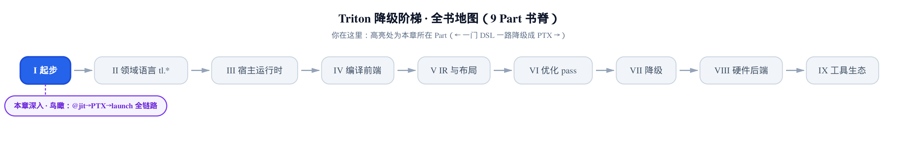
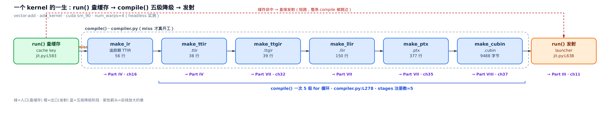
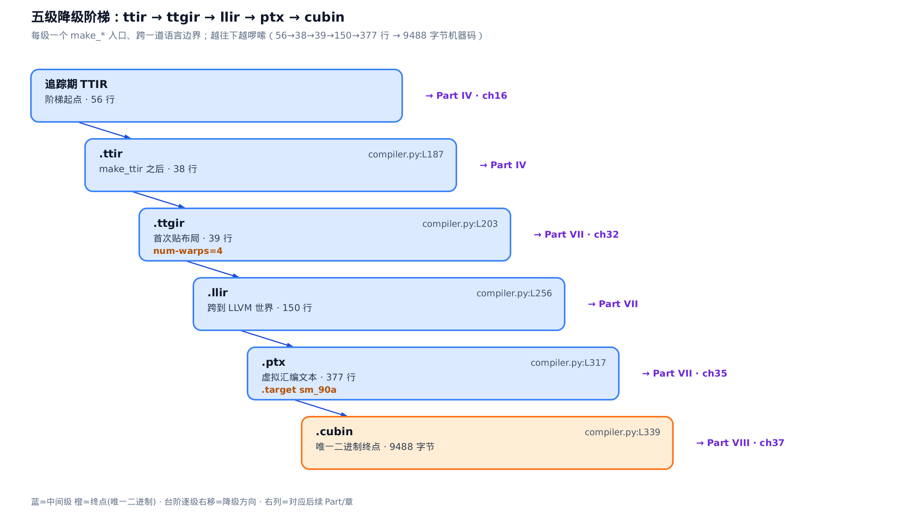
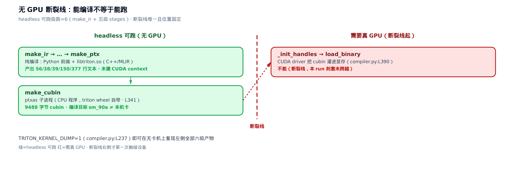
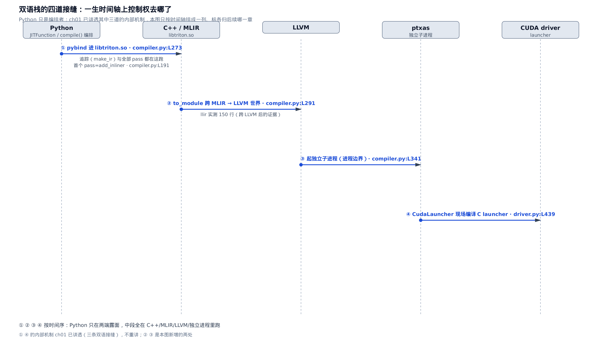
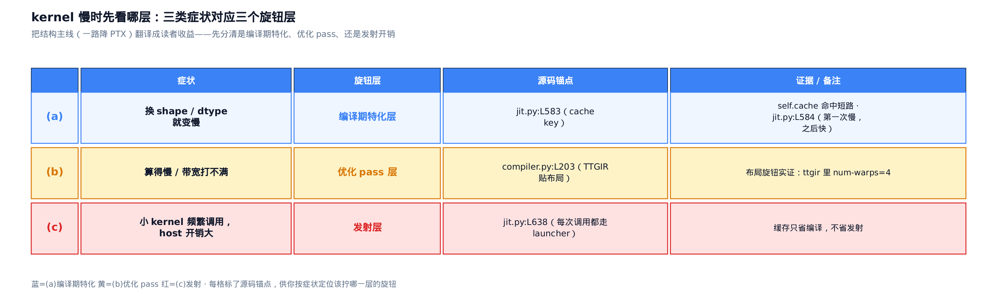

# 一个 kernel 的一生（鸟瞰）

> **你在这里**：全书是一门 DSL 一路降到 PTX 的旅程，这是起步部分的收尾章。
> 上一章把 GPU 执行模型（warp、内存层级、occupancy）摆成了脑中的图。
> 本章用一个最小的 vector-add 核，低分辨率走完它从一行 Python 到上卡执行的一生。
> 下一章起我们钻进 `tl.*` 这层领域语言，看每个 `tl.load` 怎么被追踪成 IR。



你写了一个 Triton 核，跑起来嫌慢。慢在哪？是每次调用都在偷偷重编译，是编译器没帮你把访存合并、算力喂不饱，还是这个核太小、每次发射的胶水开销盖过了计算本身？这三种病，症状像、药方却在完全不同的三层。分不清就只能对着黑盒瞎调参数。

本章不深挖任何一层，只做一件事：把一个 kernel 从被 `@triton.jit` 装饰、到最终在 GPU 上异步跑起来的**整条主线**低分辨率走一遍，给你一张定位地图——**慢的时候先看哪一层**。主线的圆心是 `JITFunction.run`（`python/triton/runtime/jit.py`），编译的心脏是 `compile`（`python/triton/compiler/compiler.py`），逐级降级归 NVIDIA 后端（`third_party/nvidia/backend/compiler.py`）——这三个文件是本章反复回到的地方。地图上每一站都标了它归哪一层、后面哪一部分放大。读完这一章，你手里会多三样东西：一条「装饰 → 触发 → 查缓存 → 五级降级 → 发射」的脊柱、一条「哪里必须真卡、哪里无卡也能看」的断裂线，以及一张「症状 → 旋钮层」的对照表。

> 只想要那张对照表、现在就去定位一个慢核，直接跳到本章最后一节「定位地图」。想跟着一个真核从头走到尾、把每一站看清楚，就按顺序读。

![本章地图：add_kernel[grid] 到定位地图的九站源码剖面，标了三条读法](../diagrams/chapter-map.png)

只想按症状定位到旋钮层，直接跳 §2、§4、§8 配上 §9 的对照表；只关心无卡断裂线和双语接缝，跳 §5 到 §7 这三节；想跟一次真实编译从头走到尾，就从 §1 按顺序读到 §9。

## §1 起点：一行 `add_kernel[grid](...)` 背后的一整条流水线

先看读者视角的起点。tutorials 里的向量加法，主机侧的 `add` 函数只做三件事：

```python
# python/tutorials/01-vector-add.py:L60-L76
def add(x: torch.Tensor, y: torch.Tensor):
    # We need to preallocate the output.
    output = torch.empty_like(x)
    assert x.is_cuda and y.is_cuda and output.is_cuda
    n_elements = output.numel()
    # The SPMD launch grid denotes the number of kernel instances that run in parallel.
    grid = lambda meta: (triton.cdiv(n_elements, meta['BLOCK_SIZE']), )
    add_kernel[grid](x, y, output, n_elements, BLOCK_SIZE=1024)
    # We return a handle to z but, since `torch.cuda.synchronize()` hasn't been called, the kernel is still
    # running asynchronously at this point.
    return output
```

三件事：预分配输出张量；把 `grid`（launch grid，决定并起多少个 kernel 实例）写成一个 lambda——注意它是**发射时才求值**的，`meta['BLOCK_SIZE']` 要等实参齐了才算得出块数；然后 `add_kernel[grid](...)` 触发。最后一行尤其要记住：`add` **在 kernel 还没算完时就返回了**——没调 `torch.cuda.synchronize()`，核此刻正异步跑在 GPU 上。这条「返回 handle、计算在后台」的异步性，是全书反复要碰的主线。

`add_kernel` 不是普通函数——它被 `@triton.jit`（JIT，即时编译装饰器）包成了一个 `JITFunction`（`@triton.jit` 装饰后的核对象，从不作为 Python 执行、只被追踪成 IR）。`fn[grid]` 这个方括号语法记住 `grid`、返回一个可调用物，一调用就落到 `JITFunction.run`。而 `run` 之后，是下面这张骨架图描述的一整条流水线：



*图：一生就是 compile() 里对五级 stages 的一次线性 for 循环，两端被 run 的「查缓存」（左）和「发射」（右）夹住。*
*缓存命中时整条 for 循环被短路，直接跳到发射——这就是「第一次慢、之后快」。*
*每一站右侧标了它归后面哪一 Part、哪一章放大，这张骨架是后续每章放大进去的地图。*

**直觉**：把一个 kernel 的一生想成一条流水线。源码函数是毛坯，经五道加工车间逐级换一种「材料语言」——先是硬件无关的 Triton 方言，再贴上 GPU 布局，降到 LLVM，出 PTX 汇编文本，最后汇成机器码——装配上机执行。`run()` 是车间门口的调度员：先查「这批毛坯以前加工过没」，加工过就直接取成品去装配，只有没见过的签名组合才真开工走完五道。

**机制**：跟着 vector-add 这一个核实测走一遍，看每一站产出什么、多大。下表是在无卡环境（headless，把 GPU 藏起来纯编译）下真跑出来的逐级产物——每一级的入口是一个 `make_*` 函数，产物一级比一级低层：

<!-- trace: m01-end-to-end-spine -->

| 站点 | 入口函数（源码） | 产物 · 规模（headless 实测） |
| --- | --- | --- |
| 追踪期 | `make_ir`（`ast_to_ttir`） | 内存态 TTIR，不落盘 · 56 行 · `tt.func`=1 · `tt.call`=0 |
| `.ttir` | `make_ttir` | TTIR，已内联/优化 · 38 行（比追踪期 56 行更紧） |
| `.ttgir` | `make_ttgir` | TTGIR，首次贴布局 · 39 行 · 出现 `#blocked` · `num-warps`=4 |
| `.llir` | `make_llir` | LLVM-IR 文本 · 150 行 · 出现 `define` |
| `.ptx` | `make_ptx` | PTX 虚拟汇编 · 377 行 · `.version` 8.4 · `.target` sm_90a |
| `.cubin` | `make_cubin` | sm_90 机器码（二进制）· 9488 字节 · ELF |

这里 TTIR（Triton IR，五级里最高层、硬件无关的张量 IR）、TTGIR（Triton GPU IR，贴上布局之后的第二级）、PTX（NVIDIA 的虚拟汇编文本）、cubin（绑定具体 sm 版本的机器码）先混个脸熟，后面各有专章。有意思的是规模**不是单调缩小**的：`.ttir` 收紧到 38 行（优化 pass 做了清理），但 `.llir` 膨到 150 行、`.ptx` 377 行——越往下越啰嗦，因为每下一级都把一个高层 op 摊成好多条低层指令。

**不变量**：无论源码多复杂，一次没命中缓存的编译**恰好经过 5 级**——级数等于后端注册的 stages 条目数，一个不多一个不少。为什么钉死是 5？因为降级是对一个 stages 字典的一次线性 for 循环、单向推进无回退，而 NVIDIA 后端恰好往字典里塞了 5 个 key（`ttir/ttgir/llir/ptx/cubin`）。实测注册出来的就是这五个。这条脊柱的源码，下面三节拆开看：`run()` 的查缓存端（§2）、`compile()` 的 for 循环（§3）、发射端（§8）。

## §2 `run()`：一生的调度员，与「编译期特化」这第一个旋钮

`JITFunction.run` 是这张地图的圆心：绑参、算缓存键、决定编不编、最后发射，全在这一个方法里。开头这段就是**第一个性能旋钮**所在：

```python
# python/triton/runtime/jit.py:L563-L586
    def run(self, *args, grid, warmup, **kwargs):
        # … 省略：debug 开关与 pre_run_hooks 旁路 …
        from ..compiler import make_backend
        device = driver.active.get_current_device()
        stream = driver.active.get_current_stream(device)
        target = driver.active.get_current_target()
        backend = make_backend(target)

        if self.binder is None:
            self.create_binder(backend)

        bound_args, sig_and_spec, constexpr_vals, non_constexpr_vals, excess_kwargs = self.binder(*args, **kwargs)

        # compute cache key
        key = ''.join(sig_and_spec) + str((constexpr_vals, excess_kwargs))
        kernel = self.cache[device].get(key, None)

        if kernel is None:
```

开头那三行 `driver.active.*` 是取当前设备/流/target 的运行时代理（`driver.active` 是 Triton 选中的活动驱动后端对象），`make_backend` 再按 target 挑出对应的后端对象——这条「先摸清跑在哪张卡上」的边界，本章只借它开个头，宿主运行时那一部分（[第 11 章](../../ch11-run-launch-pipeline/narrative/chapter.md)、[第 12 章](../../ch12-driver-backend-autotune-cache/narrative/chapter.md)）再深挖，这里按下不表。

`binder` 把实参绑成几样东西：`sig_and_spec`（签名 + 特化位）、`constexpr_vals`（编译期常量的值），还有 `excess_kwargs`（调用时额外塞进、不在函数签名里的关键字参数，本章不展开）。缓存键 `key` 就由这三样拼出来——看 `L583` 那一行 `''.join(sig_and_spec) + str((constexpr_vals, excess_kwargs))`，三者都在键里，所以连手动改 launch 参数也会触发 miss。算出 `key` 拿去查 `self.cache[device]`——按设备分桶的进程内缓存。命中，直接跳到发射；没命中（`kernel is None`），才真开工。

**这一层解答了读者最常见的困惑：「为什么我的核每次都在编译？」** 答案在缓存键的构成里。`sig_and_spec` 含每个指针实参的 dtype、是否 16 字节对齐、是不是等于 1 这些**特化位**；`constexpr_vals` 是你标了 `tl.constexpr`（编译期常量）的那些值。**这三者任一变化，键就变，缓存就 miss，整条编译重走一遍。** 换 dtype、换对齐、换 `BLOCK_SIZE`，都会触发重编。上一章讲过 constexpr 是全书第一个性能分水岭——它在这里第一次有了物理载体：`self.cache` 这个字典，就是「第一次慢、之后快，换机器/换 shape 又慢」的全部机理。这里要点透一步：`self.cache` 只活在进程内存里，换机器本质是另起一个进程，新进程里它天然是空字典——所以哪怕换到一模一样的 shape，也得从头把整条编译重走一遍。特化位的具体规则、`binder` 怎么预编译出来摊薄开销，是「宿主运行时」那一部分的正题。

没命中之后（`kernel is None`），Python 前端要把接力棒交给编译器。这中间省略的约三十行里，`binder` 吐出的 `sig_and_spec`/`constexpr_vals` 被重组成下面这段用到的四样东西——`signature`（结构化签名）、`constants`（常量字典）、`options`（编译选项，如 `num_warps`）、`configs`（特化配置）：同一批信息换了更结构化的形状，供 `ASTSource` 与 `compile()` 取用：

```python
# python/triton/runtime/jit.py:L619-L628
            if self._call_hook(key, signature, device, constants, options, configs, warmup, before=True):
                return None
            # compile the kernel
            src = self.ASTSource(self, signature, constants, configs[0])
            kernel = self.compile(
                src,
                target=target,
                options=options.__dict__,
            )
            self.cache[device][key] = kernel
```

`ASTSource` 把「这个函数 + 签名 + 常量」打包成编译的「源」，`self.compile(...)` 走完整条降级、拿回 `kernel`，最后一行回填缓存。`ASTSource` 内部记着自己的起点是 `ttir`——这决定了下一节那条流水线从五级里的哪一级开跑。

## §3 `compile()`：五级 for 循环的心脏

接过 `ASTSource`，`compile()` 就是本章地图的本体。它的核心是短短一段——注册五级、追踪出第一版 IR、然后一个 for 循环逐级往下降：

```python
# python/triton/compiler/compiler.py:L260-L292
    # run compilation pipeline  and populate metadata
    stages = dict()
    backend.add_stages(stages, options)
    first_stage = list(stages.keys()).index(src.ext)
    # … 省略：IR 文件入口的 first_stage 微调、context/dialects 加载 …
    try:
        module = src.make_ir(options, codegen_fns, module_map, context)
    except Exception as e:
        filter_traceback(e)
        raise
    use_ir_loc = os.environ.get("USE_IR_LOC", None)
    for ext, compile_ir in list(stages.items())[first_stage:]:
        next_module = compile_ir(module, metadata)
        ir_filename = f"{file_name}.{ext}"
        # … 省略：TRITON_KERNEL_OVERRIDE 用外部文件替换某级 IR 的调试旁路 …
        metadata_group[ir_filename] = fn_cache_manager.put(next_module, ir_filename)
        if fn_dump_manager is not None:
            fn_dump_manager.put(next_module, ir_filename)
        # … 省略：USE_IR_LOC 定位快照 …
        module = next_module
```

读法：`add_stages` 把五级填进 `stages` 字典（下面就看它）；`src.make_ir(...)` 追踪出**第一版 TTIR**（这是「追踪期」产物，任何 pass 之前，§5 细说）；然后 `for ext, compile_ir in ...` 从起点级开始，逐级调 `compile_ir(module)`——每调一次就下降一级，`module = next_module` 把这一级的产物喂给下一级。每级落盘进缓存，若开了 dump 就同时落一份磁盘（`fn_dump_manager.put`，`TRITON_KERNEL_DUMP` 这个开关的细节见 §6）。整条「一生」的降级部分，就是**这个 for 循环转五圈**。

那五级从哪来？NVIDIA 后端的 `add_stages` 是那张「注册表」——一共几站、每站叫什么、归谁管，全看这六行：

```python
# third_party/nvidia/backend/compiler.py:L384-L389
    def add_stages(self, stages, options):
        stages["ttir"] = lambda src, metadata: self.make_ttir(src, metadata, options)
        stages["ttgir"] = lambda src, metadata: self.make_ttgir(src, metadata, options, self.capability)
        stages["llir"] = lambda src, metadata: self.make_llir(src, metadata, options, self.capability)
        stages["ptx"] = lambda src, metadata: self.make_ptx(src, metadata, options, self.capability)
        stages["cubin"] = lambda src, metadata: self.make_cubin(src, metadata, options, self.capability)
```

五个 key、五个 `make_*` 静态方法，一一对应。这里藏着一个漂亮的设计决策：**通用的 `compile()` 根本不知道目标是 NVIDIA 还是别的卡**——它只会对 `stages` 字典做那个 for 循环。把「一共几级、每级怎么降」这件事交给后端的 `add_stages` 去填，意味着换一块新卡，只要实现自己的 `add_stages` 就能插进同一条主循环。这正是姊妹篇昇腾后端要动手的地方：照抄前半段骨架、替换后半段血肉——那是「硬件后端」部分的正题，本书是它对位的基座端。key 名（`ttir/ttgir/llir/ptx/cubin`）还有个副作用：它们正是 dump 出来的文件后缀。

## §4 五级阶梯：每级换一种语言、跨一道边界

把那个 for 循环的五圈平铺开，就是下面这条阶梯。它不是五个平行模块，而是一条单向下坡路——每下一级换一种 IR 语言、跨一道边界：



*图：五级是一条单向阶梯，越往下越啰嗦（56 → 38 → 39 → 150 → 377 行 → 9488 字节机器码）。*
*`num-warps`=4 在 `.ttgir` 首次出现（贴布局这级），`.cubin` 是唯一的二进制终点。*
*每级右侧标了后面哪一 Part、哪一章放大它。*

逐站低分辨率过一遍（每站的入口都在 `third_party/nvidia/backend/compiler.py` 里）：

- **`make_ttgir`**（`third_party/nvidia/backend/compiler.py:L203`）：TTIR → TTGIR，第一次给张量**贴上布局**。`num_warps`（一个 program 用多少个 warp，warp 是 32 线程的调度单位）就是在这一级被写进 IR 的——实测 `.ttgir` 里冒出 `#blocked` 布局标记、`num-warps`=4。**所有跟布局、访存合并、流水线相关的调优都落在这一级。** 这一级贴的布局是「IR 与布局」（Part V）的主题，跑的优化 pass 属「优化 pass」（Part VI）；而这一步本身——第一跳 TTIR → TTGIR——的落地详见「降级」部分的 Part VII·ch32（和上图 `.ttgir` 台阶右侧的代号一致）。
- **`make_llir`**（`third_party/nvidia/backend/compiler.py:L256`）：TTGIR → LLVM-IR。这一步跨过一道大边界——从 MLIR（多级中间表示，Triton 各级 IR 的通用底座）的世界，转成真正的 LLVM-IR，挂上 datalayout、跑 O3 优化。实测 `.llir` 里出现了 `define`、且已不带 `nvptx` 三元组——证明它已站到 LLVM 这边。这是「降级」部分（Part VII）的内容。
- **`make_ptx`**（`third_party/nvidia/backend/compiler.py:L317`）：LLVM-IR → PTX，走 LLVM 的 NVPTX（NVIDIA 的 LLVM 后端目标）出汇编文本。**关键认知：PTX 仍是人可读的文本、还不是机器码。** 实测 `.ptx` 头部是 `.version 8.4`、`.target sm_90a`。这也是「降级」部分（Part VII·ch35）的出口。
- **`make_cubin`**（`third_party/nvidia/backend/compiler.py:L339`）：PTX → cubin，唯一的二进制终点——但它不在 Triton 进程里做，下一节单说。

追踪期那版 56 行的 TTIR，和 `make_ttir` 之后那版 38 行的 TTIR，是**两个不同阶段的东西**。这个区别很要命，下一节专门立个坐标系。

## §5 一个坐标系：追踪期 TTIR vs `make_ttir` 之后

全书会反复用到一条时间轴刻度，这里先钉死。看 §3 的代码：`src.make_ir(...)` 先产出第一版 TTIR，然后 for 循环的第一圈才调 `make_ttir`。这两版都叫 TTIR，但内容不同：

```python
# third_party/nvidia/backend/compiler.py:L187-L201
    @staticmethod
    def make_ttir(mod, metadata, opt):
        pm = ir.pass_manager(mod.context)
        pm.enable_debug()
        passes.common.add_inliner(pm)
        passes.ttir.add_rewrite_tensor_pointer(pm)
        passes.ttir.add_combine(pm)
        passes.common.add_canonicalizer(pm)
        passes.ttir.add_reorder_broadcast(pm)
        passes.common.add_cse(pm)
        passes.common.add_licm(pm)
        passes.common.add_symbol_dce(pm)
        passes.ttir.add_loop_unroll(pm)
        pm.run(mod)
        return mod
```

`make_ttir` 是五级第一站，而它的**第一个 pass 就是 `add_inliner`**（内联）。[第 1 章](../../ch01-what-is-triton/narrative/chapter.md)讲透了追踪器怎么在 `visit_Call` 的三岔口把被调的 `@triton.jit` 函数抄成 `tt.call`——那些 `tt.call` 活在**追踪期**那版 TTIR 里，而 `add_inliner` 一跑就把它们内联抹平。所以一般而言，追踪期 TTIR 里可能出现的 `tt.call`，到 `.ttir` 就没了：

- **追踪期 TTIR**（`make_ir` 的产物，56 行）——从不落盘，只在内存里。
- **`.ttir`**（`make_ttir` 之后，38 行）——这才是你 dump 出来看到的那版，`add_inliner` 等 pass 已跑过。

不过要跟你把话说老实：本章这个 vector-add 的 `add_kernel` **没有调用任何别的 `@triton.jit` 函数**，所以它两版 TTIR 的 `tt.call` **都是 0**（见 §1 实测表：追踪期那行就写着 `tt.call`=0）——`add_inliner` 在这个具体例子里根本无事可抹。想亲眼看到 `tt.call` 从「有」被抹成「无」的对比，请回看[第 1 章](../../ch01-what-is-triton/narrative/chapter.md)那个真会调用别的 jit 函数的例子；本章只在地图上钉下这条分界，不在这个核上重新演示。

**这条刻度的实用含义**：以后凡是有人告诉你「TTIR 里有 XXX」，先问一句「哪一版」。追踪期看得到的东西（比如核里调了别的核时的 `tt.call`），dump 出来的 `.ttir` 里未必还在——因为你手里的是内联、优化之后的版本。给任何 IR 事实都要落在这条刻度上，否则就是不可复现的空话。追踪那一侧的机制（`visit_Call` 三岔、如何抄成 `tt.call`）[第 1 章](../../ch01-what-is-triton/narrative/chapter.md)已经讲透，本章只在地图上钉下这个分界，不重述。至于 `make_ttir` 里这一长串 `add_*` 各自是什么 pass，是「优化 pass」部分逐个拆的活。

> [第 1 章：Triton 是什么，以及本书怎么读](../../ch01-what-is-triton/narrative/chapter.md) 已经讲透了 `visit_Call` 三岔分发、`tl` 命名空间怎么分裂成两套实现，本章不重复；这里只借它一个结论——追踪期若产生 `tt.call`（核里调了别的核时），到 `.ttir` 会被内联抹平。

## §6 cubin 这一站：连 ptxas 都不用真卡

最容易误判的一层来了。很多人以为「要生成 cubin 就得有 GPU」，其实不然。看 `make_cubin` 怎么做：

```python
# third_party/nvidia/backend/compiler.py:L339-L354
    @staticmethod
    def make_cubin(src, metadata, opt, capability):
        ptxas, _ = _path_to_binary("ptxas")
        with tempfile.NamedTemporaryFile(delete=False, mode='w', suffix='.ptx') as fsrc, \
            tempfile.NamedTemporaryFile(delete=False, mode='r', suffix='.log') as flog:
            fsrc.write(src)
            fsrc.flush()
            fbin = fsrc.name + '.o'
            # … 省略：line-info / fmad / opt-level 等命令行开关 …
            suffix = 'a' if capability == 90 else ''
            ptxas_cmd = [
                ptxas, *line_info, *fmad, '-v', *opt_level, f'--gpu-name=sm_{capability}{suffix}', fsrc.name, '-o', fbin
            ]
```

它把 PTX 写进一个临时文件，然后**起一个独立子进程 `ptxas`** 去汇编（真正下 `subprocess.run` 那一行紧接在 `L356`）。`ptxas`（PTX 汇编器）是 CUDA 工具链里的一个 CPU 程序，triton 的 wheel 自带一份——**它跟有没有 GPU 完全无关**。这一层有两层含义：其一，它是一道**进程边界**——控制权离开 Python，交给一个第三方二进制；其二，也是最反直觉的一点，**因为 `ptxas` 是 CPU 工具，无卡也能一路跑到 cubin。**

那真正需要卡的门槛在哪？往前推到发射侧的 `_init_handles`：

```python
# python/triton/compiler/compiler.py:L379-L391
    def _init_handles(self):
        if self.module is not None:
            return
        device = driver.active.get_current_device()
        # create launcher
        self.run = driver.active.launcher_cls(self.src, self.metadata)
        # not enough shared memory to run the kernel
        max_shared = driver.active.utils.get_device_properties(device)["max_shared_mem"]
        if self.metadata.shared > max_shared:
            raise OutOfResources(self.metadata.shared, max_shared, "shared memory")
        self.module, self.function, self.n_regs, self.n_spills = driver.active.utils.load_binary(
            self.name, self.kernel, self.metadata.shared, device)
```

`load_binary` 才是第一次真正碰硬件——把 cubin 灌进显存、拿到 GPU 上的函数句柄。**这就是那条断裂线。** 在它之前，编译产物（各级 IR、PTX、cubin）本身与设备无关，能在无卡环境产出、缓存；只有真要发射时才 `load_binary`。这也解释了为什么句柄是**懒初始化**的：`_init_handles` 延迟到你第一次访问 `.run` 才跑。



*图：能不能看 IR、能不能出 cubin，跟有没有卡无关——连 ptxas 都是 CPU 程序。*
*真正的门槛只有一道，在 `load_binary` 把 cubin 灌进显存那一刻。*
*左区六级 headless 可跑（实测编译目标 sm_90a 与本机卡不符仍成功），右区起才必须真卡。*

**直觉**：把管线想成一条通向「带锁仓库」的流水线。从下料到打包（`make_ir` 一路到 `make_cubin`，连 `ptxas` 都只是台门外的 CPU 机器）全在公共车间完成，谁都能进、不刷卡；只有最后一道「把成品搬进带锁仓库」（`load_binary` 灌进显存）才要门禁卡。

**机制**：这是真跑出来的证据。用与本书全程锚定的那个 Triton 源码版本（即 pin 版本——本书所有源码行号都钉在它上面，这里是 3.2.0）逐字节相同的前端（`pip install triton==3.2.0`），把编译目标显式钉成 `sm_90`（跟本机卡型号不同），并把可见 GPU 藏起来，看每一步能不能跑：

<!-- trace: m11-no-gpu-fracture-map -->

| 步骤 | 谁在算 | headless 能跑？ | 证据（实测） |
| --- | --- | --- | --- |
| `make_ir` → `make_ptx`（纯编译） | Python 前端 + `libtriton.so`（C++/MLIR） | 能 | 产出以 56 行 TTIR 打头的五级文本（各级行数见 §1 表），未建 CUDA context |
| `make_cubin` | `ptxas` 子进程（CPU 程序，triton wheel 自带） | 能 | 9488 字节 cubin · 目标 sm_90a ≠ 本机卡 |
| `_init_handles` → `load_binary` | CUDA driver 把 cubin 灌进显存 | 不能（断裂线） | 本次刻意未跨越此线 |

**不变量**：断裂线唯一且位置固定——`make_ir` 到 `make_cubin` 这**六级**全程零 GPU 依赖，第一处真正触碰设备的是 `load_binary`，在此之前不可能需要卡。反证很直接：既然在无可见 GPU、且编译目标被钉成一块**跟本机不符**的卡型号的情况下，六级产物全部成功产出，那么这六级里就不可能有哪一级偷偷依赖了真实设备——否则早该抛错。设备依赖只可能出现在被刻意跳过的 `load_binary` 及其之后。

这条断裂线是全书可复现性的地基。想在 CI 或无卡笔记本上把一整套产物 dump 出来看，靠的是这个总开关：

```python
# python/triton/compiler/compiler.py:L236-L239
    enable_override = os.environ.get("TRITON_KERNEL_OVERRIDE", "0") == "1"
    enable_ir_dump = os.environ.get("TRITON_KERNEL_DUMP", "0") == "1"
    fn_override_manager = get_override_manager(src.hash()) if enable_override else None
    fn_dump_manager = get_dump_manager(src.hash()) if enable_ir_dump else None
```

`TRITON_KERNEL_DUMP=1` 打开 `fn_dump_manager`，随后 §3 那个 for 循环每一级都会把产物落盘——`.ttir/.ttgir/.llir/.ptx` 四份文本、`.cubin` 二进制、外加一份 `.json` 元数据。全书后续凡是让你「去看某一级 IR」，指的都是这个开关。记住一个坑（呼应上一节）：dump 出来的 `.ttir` 是 `make_ttir` **之后**那版（38 行、已内联），不是追踪期那版（56 行）——追踪期 TTIR 从不落盘。同段那个 `TRITON_KERNEL_OVERRIDE` 是反向操作——不是把某级 IR 导出，而是拿你手改过的 IR 文件塞回流水线、替换掉某级产物（对应 §3 for 循环里省略的那句「用外部文件替换某级 IR 的调试旁路」），手改 IR 验猜想时用，本章不展开。

## §7 双语栈的四道接缝：控制权在一生里几度易主

上面一路走下来，你可能已经发现：Python 其实只是个编排者。真正干活的——追踪、所有 MLIR pass、汇编、发射——分散在 C++、LLVM、独立进程、现编的 C 代码里。把这些「Python 交出控制权」的接缝按一生的时间轴排成一列，就是下面这张图：



*图：一生里 Python 只在两端露面，中段控制权交给 C++/MLIR、LLVM、独立 ptxas 进程、现场编的 C launcher。*
*① 追踪与全部 pass 都在 `libtriton.so` 里跑（经 pybind）；② `to_module` 跨到 LLVM 世界。*
*③ `make_cubin` 起 ptxas 子进程；④ `CudaLauncher` 现场编译 C launcher 作最后一跳。*

四道接缝，按发生顺序：

1. **pybind 进 `libtriton.so`**（`python/triton/compiler/compiler.py:L273` 的 `make_ir`）。`libtriton`（Triton 的 C++ 扩展模块）经 pybind11 桥进来——追踪期建 IR、以及 `make_ttir` 里那一长串 `add_inliner` 等 pass，**全在 C++/MLIR 里跑**，Python 只负责按顺序把 pass 塞进 `pass_manager`。
2. **`to_module` 跨到 LLVM 世界**（`make_llir` 内部，`third_party/nvidia/backend/compiler.py:L291`）。从 MLIR 表示转成真正的 LLVM-IR，控制权从「MLIR 世界」交到「LLVM 世界」。实测 `.llir` 那 150 行就是跨过去之后的证据。
3. **起 `ptxas` 独立子进程**（§6 已见，`third_party/nvidia/backend/compiler.py:L341`）。控制权离开当前进程，交给一个第三方二进制——一道进程边界。
4. **`CudaLauncher` 现场编译 C launcher**（`third_party/nvidia/backend/driver.py:L431` 一带）。发射前，driver 现场生成一段 C 源码、编成 `.so`、`dlopen` 回来，作为 Python → CUDA driver 的最后一跳。

[第 1 章](../../ch01-what-is-triton/narrative/chapter.md)已经拆过其中三道接缝的内部机制（`_builder` 这支笔、Python 校验加 C++ 执行、`_init_handles` 里现编 C launcher）。**本图的增量不是重讲内部，而是第一次把它们按一生的时间轴排成一列**——让你知道任何一个 kernel，控制权都会在这四个点上依次易主。这也是姊妹篇「Python 契约 ↔ C++ 执行」逐章对位要走的那条缝。

## §8 发射：一生的终点，与「发射开销」这第三个旋钮

编译拿到 `kernel` 之后，回到 `run` 的尾巴，才是真正把核下发到 GPU 的地方——也是**第三个性能旋钮**：

```python
# python/triton/runtime/jit.py:L638-L654
        if not warmup:
            # canonicalize grid
            assert grid is not None
            if callable(grid):
                # Arguments are passed as a dict to `grid`, by contract.
                grid = grid(bound_args)
            grid_size = len(grid)
            grid_0 = grid[0]
            grid_1 = grid[1] if grid_size > 1 else 1
            grid_2 = grid[2] if grid_size > 2 else 1

            # launch kernel
            launch_metadata = kernel.launch_metadata(grid, stream, *non_constexpr_vals)
            kernel.run(grid_0, grid_1, grid_2, stream, kernel.function, kernel.packed_metadata, launch_metadata,
                       self.CompiledKernel.launch_enter_hook, self.CompiledKernel.launch_exit_hook, *non_constexpr_vals)
```

这段被开头的 `if not warmup` 守着：`warmup=True` 时只编译、把 kernel 塞进缓存就返回、不真发射（用于预热 / autotune 试跑），本章走的是 `warmup=False` 的正常路径，所以这段发射代码照常执行。还记得 §1 那个写成 lambda 的 `grid` 吗？就是在这一行 `grid = grid(bound_args)` 被求值的——可调用 grid 拿绑好的实参算出块数，再补齐到三维。然后 `kernel.run(...)` 把核异步下发到 stream。注意这个 `kernel.run` 不是本章开头那个圆心 `JITFunction.run`——它是编译产物 `kernel` 自己的 `run` 方法，真正触发 driver 发射的那一层；两者同名，却是两个不同对象上的方法。末尾那三个参数——`launch_metadata` 与 `launch_enter_hook` / `launch_exit_hook`——是留给 profiler 在发射前后挂观测钩子的接口，本章跳过不展开，宿主运行时（[第 11 章](../../ch11-run-launch-pipeline/narrative/chapter.md)）与剖析那一章（[第 39 章](../../ch39-proton-roofline-dobench/narrative/chapter.md)）再接上。

**关键账**：这一段**每次调用都要走一遍**。缓存只省编译（§2 命中就跳过整条 for 循环），**不省发射**——每次调用都得重新算 grid、过 `kernel.run` 这层胶水、触发那个现编的 C launcher。所以如果你的核很小、又被高频调用，瓶颈很可能不是算力，而是这一段 host 侧的发射开销。这条发射热路径每一段的开销来源，是「宿主运行时」部分要逐段拆的；C launcher 的双语接缝[第 1 章](../../ch01-what-is-triton/narrative/chapter.md)也已点名，这里只在地图上标位。

## §9 定位地图：kernel 慢时，先看哪一层

现在把三个旋钮层收进一张表。这就是开篇那个问题的答案——**慢了别瞎调，先按症状定位到层。**



*图：把「一路降 PTX」这条结构主线，翻译成读者收益——先分清是哪一层的病。*
*(a) 换 shape/dtype 就变慢 → 编译期特化层；(b) 算得慢/带宽打不满 → 优化 pass 层；(c) 小核频繁调 → 发射层。*
*每格标了源码锚点和后面哪一部分放大它。*

三类症状、三个旋钮层，对应本章走过的三处源码：

- **(a) 换 shape/dtype 就变慢，或每次都在编译** → **编译期特化层**。病根在 `run` 的缓存键（§2，`python/triton/runtime/jit.py:L583`）：签名、特化位、constexpr 任一变化就 miss、重走整条 `compile`。完整操作面（特化位规则、依赖哈希、autotune）在「宿主运行时」部分。
- **(b) 算得慢、占用率低、带宽打不满** → **优化 pass 层**。病根在 TTGIR 这一级（§4，`third_party/nvidia/backend/compiler.py:L203`）：布局、访存合并、流水线全在这儿——实测 `num-warps`=4 就是在这级首次贴进 IR 的。这是「IR 与布局」「优化 pass」两个部分的正题。
- **(c) 小核频繁调用、host 侧开销大** → **发射层**。病根在 `run` 的发射段（§8，`python/triton/runtime/jit.py:L638`）：每次调用都得过一遍，缓存只省编译不省发射。

配套的动手工具就一个：`TRITON_KERNEL_DUMP=1`。定位到某一层想看究竟，就 dump 出那一级 IR 对着读（记住 `.ttir` 是内联后那版）。这张表把黑盒调优变成了「按层定位」——每一格后面都有专章放大。至此，一个 kernel 从 `@triton.jit` 的一行 Python，到查缓存、五级降级、跨过断裂线上卡异步执行的一生，就低分辨率走完了。下一部分起，我们回到最上面那层，钻进 `tl.*` 领域语言——看你写下的每个 `tl.load`、`tl.dot`，究竟是怎么在追踪期被翻成 IR 的。
