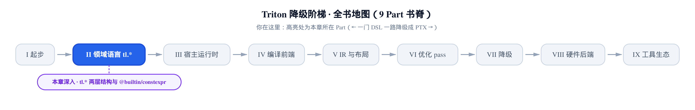
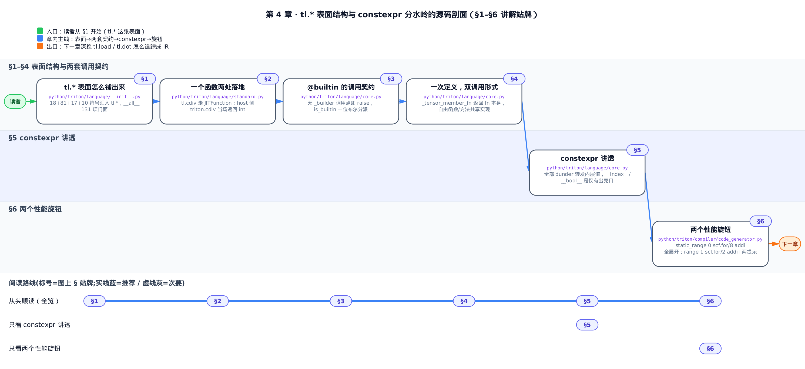
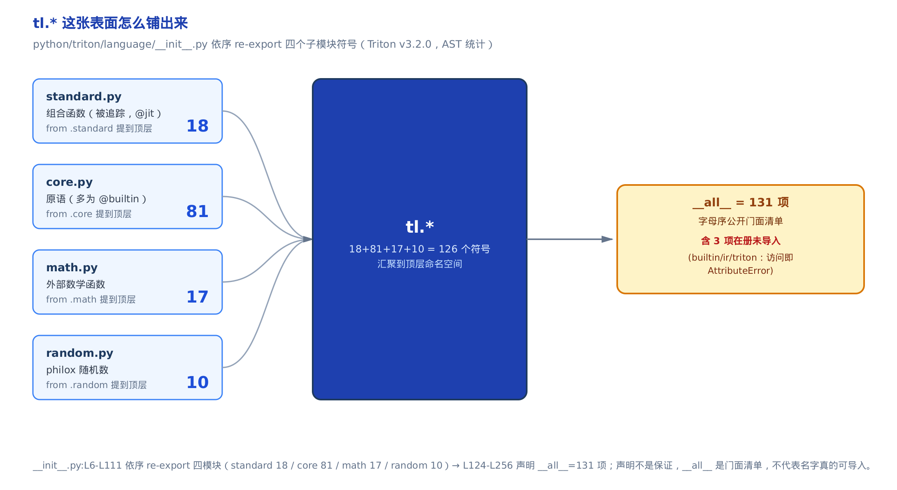
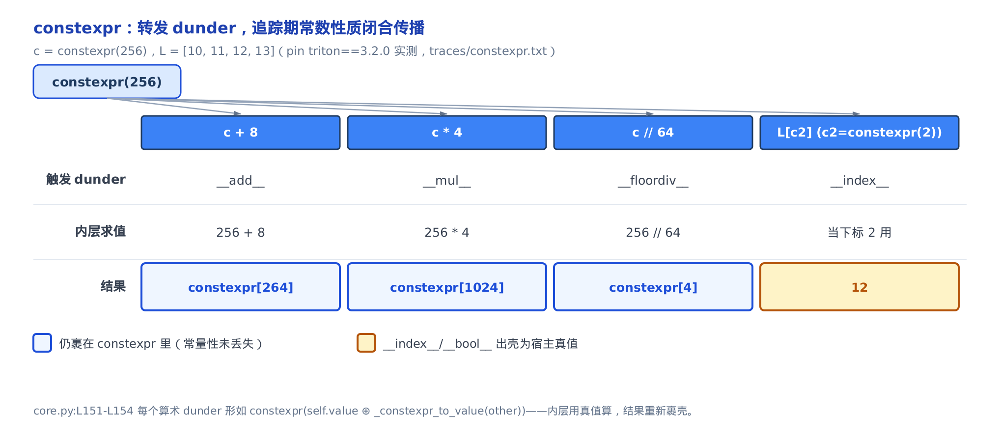
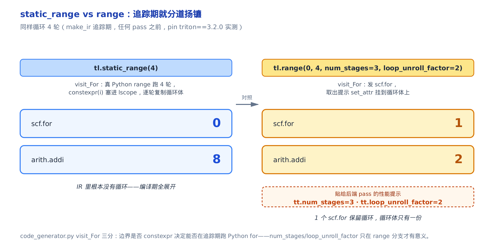

# tl.* 这张表面，与 constexpr 这道分水岭

> **你在这里**：全书是一门 DSL 一路降到 PTX 的旅程，这是「领域语言 tl.*」部分的开篇。
> 上一部分用一个 vector-add 核，鸟瞰走完了它从一行 Python 到上卡的一生。
> 本章拉近看 `tl.*` 这层表面本身，和 `constexpr` 这道编译期／运行期的分水岭。
> 后面几章再逐个钻进 `tl.load` ／ `tl.dot` 怎么被追踪成 IR。



你写 `import triton.language as tl`，然后开始点 `tl.load`、`tl.dot`、`tl.constexpr`。这张表面看着像 numpy —— 一堆函数摆在那儿随便调。但它不是 numpy：有些名字（`tl.program_id`）你在普通 Python 里一调就炸，有些名字（`tl.cdiv`）和顶层的 `triton.cdiv` 同名却是两个东西，还有一个叫 `tl.constexpr` 的标注，你把它贴到 `BLOCK_SIZE` 上、编译器就能把整段循环展平、把除法算成移位、把 tile 尺寸焊死进汇编 —— 不贴，同样的代码慢一截。

**这一章要解锁的性能杠杆，就是最后这件事**：`tl.constexpr` 不是语法糖，是**编译期特化**的开关；`tl.range` 上的 `num_stages` ／ `loop_unroll_factor` 不是注释，是直接喂给后端流水线 pass 的两个旋钮。读完你会知道：哪些参数该标 `constexpr` 才能让编译器特化，循环该用 `static_range` 全展开还是 `range` 加流水提示 —— 这些决定，比你在 kernel 里多写几行算术更能左右它跑多快。本章反复回到两处源码：表面怎么装配在 `python/triton/language/__init__.py`，`constexpr` 与 `@builtin` 两套契约都住在 `python/triton/language/core.py`。



只想搞清 `constexpr` 到底是什么、为什么标了它就快，直接跳「§5 constexpr 讲透」；只想知道循环该用哪个迭代器、`num_stages` 怎么写，跳「§6 两个性能旋钮」；想从这张表面怎么装配起来顺着读，就从 §1 开始。

## §1 tl.* 这张表面怎么铺出来

**直觉**：`tl.*` 不是一个巨大的类，而是**四个分工子模块各自的符号被拼到一处**的一张公开面 —— 像一本书的目录，把散落各章的词条汇到同一页。core 出**原语**（`program_id` ／ `load` ／ `dot` 这类一条对应一个硬件动作的底层函数），standard 出**被追踪的组合函数**（`cdiv` ／ `softmax` ／ `sum`，用原语拼出来的），math 出外部数学库，random 出 philox（一种计数器式伪随机数算法，靠对计数器加密来出随机数、天然可并行，[第 9 章](../../ch09-self-hosted-libraries/narrative/chapter.md)详解）随机数。此外还有一个 `extra` 子模块（各硬件后端各自外挂的扩展原语，不计入这四段汇聚），整体挂到 `tl.extra` 下。你 `tl.` 一点能点出什么，就由这四段汇聚决定。



*图：core／standard／math／random 四段 re-export 把 126 个符号提到 `tl.*` 顶层；右侧 `__all__` 只是字母序门面清单，其中 3 项在册却从未导入。*

装配的入口是 `python/triton/language/__init__.py`。它开头一句注释就把关键点点破了 —— **导入顺序是有讲究的**：

```python
# python/triton/language/__init__.py:L1-L26
"""isort:skip_file"""
# Import order is significant here.

from . import math
from . import extra
from .standard import (
    argmax,
    argmin,
    cdiv,
    # … 省略：cumprod / cumsum / flip / interleave / max / min / ravel / … 共 18 个 standard 符号 …
    zeros,
    zeros_like,
)
from .core import (
    # … 省略：program_id / load / store / dot / arange / constexpr / range / static_range / … 共 81 个 core 符号 …
)
```

`isort:skip_file` 是在告诉自动排序工具「别动这个文件的 import 顺序」。为什么这么在意顺序？因为 standard 里的组合函数是用 core 的原语拼出来的 —— core 必须先于依赖它的 standard 可用，否则拼不出来。这就是「导入顺序 significant」的实义。

**机制**：四段 re-export 各提多少符号？在 pin 的 triton 3.2.0 前端（本书所有编译期事实都在这套配方下实测：`python -m venv v32 && v32/bin/pip install triton==3.2.0`，前端与 pin 源码逐字节相同、无需 GPU）上按 AST 数了一遍 —— `from .standard` 提 18 个、`from .core` 提 81 个、`from .math` 提 17 个、`from .random` 提 10 个，合计 126 个符号被提到 `tl.*` 顶层。

提上来之后，模块用一张 `__all__` 列表定「对外公开门面」：

```python
# python/triton/language/__init__.py:L124-L157
__all__ = [
    "PropagateNan",
    "TRITON_MAX_TENSOR_NUMEL",
    "abs",
    "advance",
    "arange",
    # … 省略：按字母序共 131 项 …
    "builtin",
    "cdiv",
    "constexpr",
    # … 省略 …
]
```

`__all__`（一个模块用来声明「`from module import *` 会导出哪些名字」的列表）共 131 项、按字母序排。但这里有个**教训**：`__all__` 是**声明**，不是**保证**。它列了 `"builtin"`、`"ir"`、`"triton"` 三个名字，可这三个名字在本模块里从未被真正 import —— 追踪期实测 `tl.builtin` 直接抛 `AttributeError`。所以别把 `__all__` 里出现当成「这个 API 可用」，它只是一张字母序清单，个别项是陈旧遗留的空壳。

顺带把账对平：四段 `from … import` 合计 126 个符号，`__all__` 却声明 131 项，多出的 5 项分两类 —— `"builtin"` ／ `"ir"` ／ `"triton"` 这 3 个是上面说的从未导入的死名（点了抛 `AttributeError`）；另外 2 项是 `math` ／ `extra` 这两个**子模块**，由文件开头的 `from . import math` ／ `from . import extra` 挂进来（不算在四段 `from X import 符号` 的 126 里，但 `tl.math.*` ／ `tl.extra.*` 确实可用）。所以 131 − 126 这 5 个缺口，3 个是死名、2 个是活的子模块，没有一个是漏数的普通符号。**不变量**：四段 re-export 之和恒等于 `__all__` 声明数减去陈旧死名与子模块挂载 —— 126 + 3 + 2 = 131，增删符号后该账目仍成立。

这张表面还负责一件小事：把你在 kernel 签名里写的类型字符串翻成 `tl` 的 dtype（数据类型）对象。入口是 `str_to_ty`：

```python
# python/triton/language/__init__.py:L259-L294
def str_to_ty(name):
    if name[0] == "*":
        name = name[1:]
        const = False
        if name[0] == "k":
            name = name[1:]
            const = True
        ty = str_to_ty(name)
        return pointer_type(element_ty=ty, const=const)
    # … 省略：nvTmaDesc 特例 …
    tys = {
        "fp16": float16,
        "bf16": bfloat16,
        "fp32": float32,
        "i32": int32,
        # … 省略：fp8 各变体 / i64 / u32 / int1 等，共约 23 条同构映射 …
    }
    return tys[name]
```

规则很朴素：`*` 前缀是指针、`*k` 前缀是 const 指针（指向只读数据、`store` 不能往里写），递归剥掉前缀后剩下的名字纯查表。`'*fp16'` 就翻成「指向 fp16 的指针」，`'*ki32'` 翻成「指向 i32 的 const 指针」。这是 `tl.*` 表面把用户的类型注解落地成内部类型对象的地方。这类裸字符串（`'*fp16'` 这种前几章没写过的写法）来自 **AOT（ahead-of-time，提前编译：不经 `@triton.jit` 追踪、直接把签名字符串给定后调 `triton.compile`）** 路径——本书「工具生态」部分会专门展开；这里只需知道 `tl.*` 表面顺手管了这层字符串到 dtype 的翻译。

**设计决策**：为什么用「子模块函数提到顶层」而不是一个巨类装所有东西？因为职责分层 —— core 的原语必须直接对底层建 IR，standard 的组合函数可以用原语拼、走正常追踪，math／random 各管一摊。`__init__.py` 只做汇聚 + 用 `__all__` 定门面，谁依赖谁靠 import 顺序显式表达。这层「表面是拼出来的、不是一整块」的认知，是理解下面那些名字为何行为各异的前提。

`tl.*` 是 `triton.language` 这一层的表面；再往上一层，顶层 `triton.*` 是**同一套装配模式**的复用 —— 从 `runtime` ／ `compiler` 汇聚再 re-export。看 `python/triton/__init__.py` 开头：

```python
# python/triton/__init__.py:L1-L26
"""isort:skip_file"""
__version__ = '3.2.0'
# Note: import order is significant here.
from .runtime import (
    autotune,
    Config,
    heuristics,
    JITFunction,
    # … 省略：KernelInterface ／ reinterpret ／ TensorWrapper ／ … 共 10 项 runtime 符号 …
)
from .runtime.jit import jit
from .compiler import compile, CompilationError
# … 省略：from .errors import TritonError …
from . import language
# … 省略：from . import testing ／ from . import tools …
```

你写 `triton.jit`、`triton.autotune`、`triton.compile`，点到的就是这里 re-export 上来的名字 —— `jit` 从 `runtime.jit` 提、`compile` 从 `compiler` 提，整个 `language` 子模块也挂上来（于是 `import triton.language as tl` 才点得到上面那 126 个符号）。顶层同样一句 `isort:skip_file` 守着导入顺序。唯一的例外是 `triton.cdiv` —— 它不是 re-export，而是 `__init__.py` 自己往下定义的一句 host 函数（§2 会把它和 `tl.cdiv` 摆一起对照）。

## §2 一个函数两处落地：triton.cdiv 与 tl.cdiv

上一节说 standard 出「组合函数」，`cdiv`（ceiling division，向上取整除法）就是其一。但顶层还有一个 `triton.cdiv`。**两个都叫 cdiv，是读者最容易混的一对** —— 它们同名、算的也是同一个式子，落点却在编译期／运行期的两侧。

**直觉**：`triton.cdiv` 是你在灶台前口算「1000 个饺子每屉 256 个、要几屉」当场得 4，用来决定开几屉（launch grid，决定并起多少个 kernel 实例）；`tl.cdiv` 是写进菜谱、交给编译器、到蒸的时候才照算的那句话（被追踪进 IR）。同名，一个在 host 当场跑出 Python int，一个在 kernel 里被编译成 IR。

先看 host 侧那个 —— 它就是一句纯 Python 整数运算：

```python
# python/triton/__init__.py:L59-L60
def cdiv(x: int, y: int):
    return (x + y - 1) // y
```

再看 kernel 侧那个 —— 它带着两层装饰器：

```python
# python/triton/language/standard.py:L29-L41
@core._tensor_member_fn
@jit
def cdiv(x, div):
    # … 省略：docstring …
    return (x + div - 1) // div
```

`@jit`（即 `triton.jit`，即时编译装饰器）把这个函数装成一个 [JITFunction（`@triton.jit` 装饰后的函数对象，从不作为 Python 运行、只被追踪器读一遍翻成 IR）](../../ch01-what-is-triton/narrative/chapter.md)。所以 `tl.cdiv` **不是**一个你能当场调出数字的函数，它是个追踪期的载体。`@core._tensor_member_fn` 那层是让它同时能挂成 tensor 方法（下一节讲）。

**机制**：把两条路都实测跑一遍，同一组 `n=1000, BLOCK=256`：

<!-- trace: two-tier-triton-surface -->

| 调用点 | 写法（n=1000, BLOCK=256） | 类型 / is_builtin | 求值 | 结果 |
| --- | --- | --- | --- | --- |
| host 侧算 grid | `triton.cdiv(1000, 256)` | function | `(1000 + 256 - 1) // 256 = 1255 // 256` | 4 |
| kernel 体内 | `tl.cdiv(1000, 256)` | JITFunction / is_builtin=False | 追踪进 IR，不在 host 求值 | 追踪期载体 |
| 同名冲突 | 都叫 cdiv | 同名不同物 | host 当场 int vs kernel 期 IR | - |

**不变量**：**同名不同物，由所在命名空间区分载体**。`triton.*` 里的 `cdiv` 是 host function、当场返回 int；`tl.*` 里的 `cdiv` 是 JITFunction、只在追踪期入 IR。实测 `type(triton.cdiv)` 是 `function` 且 `triton.cdiv(1000, 256)` 当场返回 int 4；`type(tl.cdiv)` 是 `JITFunction` 且 `is_builtin(tl.cdiv)` 为 `False`（走追踪、非直算）。**命名空间即契约**：一个符号从哪个包点出来，就决定了它在编译期还是运行期落地。你写 `grid = lambda meta: (triton.cdiv(n, meta['BLOCK_SIZE']),)` 用的是前者（host 当场算块数），kernel 里 `tl.cdiv(a, b)` 用的是后者（编译进核）—— 用错一边，要么 host 崩要么核里塞了个不该追踪的 Python int。

## §3 @builtin 的调用契约：一位布尔切开 tl.*

`tl.cdiv` 走追踪，那 `tl.program_id`（返回当前 program 实例在某轴上的 id）呢？它是另一套 —— **原语**。原语没有 Python 语义可退化，必须直接对底层那支「建 IR 的笔」发指令。这类函数用 `@builtin` 标记，带一条硬契约。

**直觉**：`@builtin` 原语像只能在施工现场用的电动工具。现场（被 `@triton.jit` 追踪时）框架会替你递上电源线 `_builder`（[从底层 MLIR 过来的「建 IR 那支笔」，见 ch01](../../ch01-what-is-triton/narrative/chapter.md)）；你在现场外空手按开关，它立刻报错提醒你「忘了加 @triton.jit 吗」。

看 `@builtin` 装饰器本体，那条契约就是包在最外层的一句守卫：

```python
# python/triton/language/core.py:L25-L39
def builtin(fn: T) -> T:
    """Mark a function as a builtin."""
    assert callable(fn)

    @wraps(fn)
    def wrapper(*args, **kwargs):
        if "_builder" not in kwargs or kwargs["_builder"] is None:
            print(kwargs)
            raise ValueError("Did you forget to add @triton.jit ? "
                             "(`_builder` argument must be provided outside of JIT functions.)")
        return fn(*args, **kwargs)

    setattr(wrapper, TRITON_BUILTIN, True)

    return wrapper
```

两件事：`wrapper` 进门先查 `kwargs` 里有没有 `_builder`，没有就 `raise`；然后给 `wrapper` 打上 `TRITON_BUILTIN` 标记（`TRITON_BUILTIN` 就是字符串 `"__triton_builtin__"`）。这个标记谁读？`is_builtin`：

```python
# python/triton/language/core.py:L108-L110
def is_builtin(fn) -> bool:
    """Is this a registered triton builtin function?"""
    return getattr(fn, TRITON_BUILTIN, False)
```

就一句 `getattr`。**这一位布尔把整张 `tl.*` 表面切成两半**：`is_builtin` 为 `True` 的是 `@builtin` 原语（直接建 IR），为 `False` 的是 `@jit` 组合函数（递归追踪）。追踪器在处理 kernel 体里每次 `f(...)` 调用时，正是读这一位来分岔 —— 这套 [visit_Call 三岔分派（追踪器对 kernel 体内每次调用的互斥三分派）在 ch01 已经讲透](../../ch01-what-is-triton/narrative/chapter.md)，这里不重推，只把它归位为「`tl.*` 表面的调用契约」。要接上 ch01 的记忆：这一位布尔只管 `tl.*` 内部的**二选一**（builtin 原语还是 jit 组合函数）；三岔分派的第三支 —— 压根不追踪、当场就跑的普通 Python 调用 —— 发生在更早一步，不归这一位布尔管。所以「一位布尔切两半」和「三岔分派」并不矛盾：布尔切的是已经确定要追踪的那两支。

**机制**：把 `program_id` 和 `cdiv` 摆一起，看标记位和「脱离 `@triton.jit` 直接调」两种命运：

<!-- trace: builtin-marker-contract -->

| 函数 | __triton_builtin__ | is_builtin | 脱离 @triton.jit 直接调用 |
| --- | --- | --- | --- |
| `tl.program_id` | True | True | print(kwargs) 后 raise ValueError：Did you forget to add @triton.jit ? |
| `tl.cdiv` | False | False | 无 _builder 守卫，正常被追踪（是 @jit 组合函数） |

**不变量**：**`@builtin` 的调用契约 —— 只能在 `@triton.jit` 追踪上下文里被调用，否则在调用点即 `raise`，绝不静默返回**。守卫是 `wrapper` 首行的 `'_builder' not in kwargs` 判断。追踪时框架会把 `_builder` 作为关键字实参补进来，条件不成立、正常放行；一旦你在普通 Python 里裸调 `tl.program_id(axis=0)`，没人补 `_builder`，条件成立 —— 它先 `print(kwargs)`（实测打出 `{'axis': 0}`）再炸出那句可操作的提示。这行 `print` 看着像调试期忘删的遗留代码，但它确实**原样留在 v3.2.0 的报错路径里**（不是本书抄录时的笔误）—— 报错前会先把 `kwargs` 打到标准输出。这就是 [ch01 里那个「脱离 jit 调原语即报错」的反例](../../ch01-what-is-triton/narrative/chapter.md)，在这里归位成契约：**原语的存在前提是「正在被追踪」**。为什么设计成炸而不是静默返回？因为「在 kernel 外误用 tl 原语」是个高频错误，把它在调用点显式炸出、附上「忘了加 @triton.jit 吗」，比让它悄悄返回个错东西、你半天查不出，友善得多。

## §4 一次定义，双调用形式：_tensor_member_fn

回头看 §2 里 `cdiv` 顶上那层 `@core._tensor_member_fn`。它管的是另一件事：让 `tl.cdiv(x, div)` 和 `x.cdiv(div)` 两种写法都成立 —— 前者是自由函数、后者是把 tensor 当 `self` 的方法。

```python
# python/triton/language/core.py:L42-L83
def _tensor_member_fn(fn: T) -> T:
    """Decorator that adds this free function as a member fn on class tensor.
    # … 省略：docstring 说明与 has_args 生成 doc 的分支 …
    """
    assert callable(fn)
    orig_sig = inspect.signature(fn)

    def wrapper(*args, **kwargs):
        return fn(*args, **kwargs)

    # Match the signature of `fn`, but change the first arg to `self`...
    new_params = list(orig_sig.parameters.values())
    new_params[0] = new_params[0].replace(name='self')
    # … 省略：拼 __signature__ / __doc__ …
    if is_builtin(fn):
        setattr(wrapper, TRITON_BUILTIN, True)

    setattr(tensor, fn.__name__, wrapper)
    return fn
```

骨架就两行：`setattr(tensor, fn.__name__, wrapper)` 把「首参当 `self`」的包装版挂到 `tensor` 类上（`tensor` 是追踪期的值对象，后续章详讲）；`return fn` 原样返回自由函数。所以 `x.cdiv(...)` 走挂上去的 `wrapper`、`tl.cdiv(x, ...)` 走原函数，一次定义、双调用形式。

注意中间那句 `if is_builtin(fn)`：如果被装饰的函数本身是 `@builtin`，就把标记也补到 `wrapper` 上 —— 保证方法版和自由版认的是同一位布尔，不会一个被当原语、一个被当组合函数。

**关键在 `return fn` 而非 `return wrapper`**：装饰器返回的是原函数、identity 不变，`tl.reshape` 还是那个 `tl.reshape`，只是**顺便**在 `tensor` 类上挂了个方法。[ch01 验过这些装饰器叠放时彼此互斥、不打架](../../ch01-what-is-triton/narrative/chapter.md)，根因就在这句「返回 fn 本身」—— 它没有用一层新 wrapper 替换掉原函数，所以叠在它下面的 `@jit` ／ `@builtin` 看到的还是原来那个对象。

## §5 constexpr 讲透

到这里，表面（§1）和它的两套调用契约（§2–§4）讲完了。本章的核心 —— `constexpr` —— 是另一维度的东西：它不区分「哪个函数怎么调」，而是划 **「一个值是编译期已知、还是运行期才有」** 这道分水岭。这道分水岭是你写快 kernel 的核心工具。

**直觉**：`constexpr` 是给一个**编译期就已知的数**套的一层壳。壳把所有算术、比较、取下标、真假判断都**原样转交**给壳里的数 —— 所以你能拿它当 `BLOCK_SIZE` 做乘除、当形状的一维、当 `if` 的条件；但它始终记得「我是编译期常量」这层身份，不会退化成运行期变量。这层身份就是编译器特化的凭据：它知道这个数追踪时就定死了，才敢据此展平循环、把除法优化成移位、把 tile 尺寸焊进汇编。



*图：`constexpr(256)` 经四种运算，前三个（`+8` ／ `*4` ／ `//64`）结果仍裹在 `constexpr` 里，最后一个 `L[constexpr(2)]` 经 `__index__` 出壳成宿主真值 12。*

看这个壳怎么造、怎么转发。`constexpr` 类的开头 + 前几个 dunder（Python 的「双下划线特殊方法」，重载运算符用）：

```python
# python/triton/language/core.py:L134-L168
class constexpr:
    """
    This class is used to store a value that is known at compile-time.
    """

    def __init__(self, value):
        if isinstance(value, constexpr):
            self.value = value.value
        else:
            self.value = value

    def __repr__(self) -> str:
        return f"constexpr[{self.value}]"

    def __index__(self):
        return self.value

    # … 省略：一段注释解释 interpreter 模式下常量不裹 constexpr、故处处要 _constexpr_to_value 兜底 …
    def __add__(self, other):
        return constexpr(self.value + _constexpr_to_value(other))

    def __radd__(self, other):
        return constexpr(_constexpr_to_value(other) + self.value)

    # … 省略：__sub__ ／ __rsub__（同构，L161-164）…
    def __mul__(self, other):
        return constexpr(self.value * _constexpr_to_value(other))
```

每个算术 dunder 都是**同一个模子**：拆开 `self.value`（内层真值）、对 `other` 走 `_constexpr_to_value`（把可能也是 `constexpr` 的对方也解包成真值）、算完把结果**重新裹回 `constexpr(...)`**。类里其后还有约 40 个同构的 dunder（`__sub__` ／ `__floordiv__` ／ 全部比较 ／ `__and__` ／ `__pow__` ／ `__lshift__` …），全是这个模子，源码里成排铺开、这里不逐一列。真正**换一种性质**的是下面这四个：

```python
# python/triton/language/core.py:L218-L264
    def __bool__(self):
        return bool(self.value)

    def __neg__(self):
        return constexpr(-self.value)

    # … 省略：__and__ / logical_and / __or__ / __xor__ / logical_or / __pos__ / __invert__ / __pow__ / __rpow__ / __rshift__ / __lshift__ / __not__ —— 与上面算术 dunder 同一个模子，出壳行为不变

    def __iter__(self):
        return iter(self.value)

    def __call__(self, *args, **kwds):
        return self.value(*args, **kwds)
```

`__bool__` 让 `constexpr` 能直接进 `if` 做**编译期分支**（[ch01 讲的 constexpr 折叠](../../ch01-what-is-triton/narrative/chapter.md)：条件在追踪期就求出 True／False，只保留走到的那一支进 IR）；`__index__`（上面 L148）让它能当 list／tensor 的**下标和形状维度**；`__iter__` 转发内层可迭代对象；`__call__` 让裹了个可调用物的 `constexpr` 仍能被调用。

**机制**：拿 `c = constexpr(256)` 跑一串运算，逐步看每步触发哪个 dunder、结果是什么形态：

<!-- trace: constexpr-dunder-class -->

| 表达式 | 触发 dunder | 内层求值 | 结果 |
| --- | --- | --- | --- |
| `constexpr(256)` | `__init__` | `self.value = 256` | `constexpr[256]` |
| `c + 8` | `__add__` | `256 + 8` | `constexpr[264]` |
| `c * 4` | `__mul__` | `256 * 4` | `constexpr[1024]` |
| `c // 64` | `__floordiv__` | `256 // 64` | `constexpr[4]` |
| `bool(constexpr(0))` | `__bool__` | `bool(0)` | False（可当编译期 if 条件） |
| `L[constexpr(2)]，L=[10,11,12,13]` | `__index__` | 当下标 2 | 12（可当形状/切片维度） |

看前四行：`256 →(+8)→ 264 →(×4)→ 1024 →(//64)→ 4`，每一步结果**都还是 `constexpr[...]`** —— 常量性一路没丢。最后两行不一样：`bool(constexpr(0))` 落成 Python 的 `False`、`L[constexpr(2)]` 落成 int 12，它们**出壳**了，把常量交给了需要真 bool／真 int 的宿主（`if` 和下标）。

**不变量**：**常量性闭合**。基例是 `__init__` 存下真值 `self.value`；归纳步是每个算术 dunder 形如 `constexpr(self.value ⊕ _constexpr_to_value(other))` —— 输入是编译期已知，内层用真值算，输出重新裹壳，所以「编译期已知」这个性质在任意长的算术链上保持不变。破坏闭合的是那几个**非算术** dunder：`__index__` ／ `__bool__` ／ `__iter__` ／ `__call__` 都**不重新裹壳**，而是把裸值交给宿主 —— `__index__` 交真 int（当下标／维度）、`__bool__` 交真 bool（进 `if`）、`__iter__` 交内层迭代器、`__call__` 交内层调用的结果（pin 3.2.0 实测 `iter(constexpr([1,2,3]))` 吐裸 `int`、`constexpr(f)(5)` 吐裸值，均不再是 `constexpr`）。本例演示的是前两条——`if` 与下标这两条最常走的出壳路径。这意味着：你标了 `BLOCK_SIZE: tl.constexpr = 256`，那么 kernel 里 `BLOCK_SIZE // 64`、`offs < BLOCK_SIZE` 这些表达式在**追踪期就被折叠成字面量**，后端拿到的是 `4`、是一个定死的边界，而不是一个运行期变量 —— 这正是「编译期特化」的落地：常量传播开，除法能变移位，边界能定循环上界，tile 尺寸能焊死。**所以 `constexpr` 是性能旋钮**：标了它，编译器多一整层可以做的优化；不标，`BLOCK_SIZE` 只是个运行期传参，这些优化全落空。

### constexpr 与真值在追踪期反复穿梭

上面的 dunder 里到处是 `_constexpr_to_value(other)`。为什么不能直接 `self.value + other`？因为在追踪期，一个值**时而裹在 constexpr 里、时而是裸真值**（interpreter 模式 —— Triton 提供的一种不经编译、直接用普通 Python 解释执行 kernel 逻辑的调试模式 —— 里值不被追踪，也就根本不裹 constexpr）。所以框架各处都要备一手「拿到什么形态都能解包成真值」的兜底。有两个几乎一样的函数在干这事：

```python
# python/triton/language/core.py:L270-L271
def _unwrap_if_constexpr(o):
    return o.value if isinstance(o, constexpr) else o
```

```python
# python/triton/language/core.py:L1141-L1144
def _constexpr_to_value(v):
    if isinstance(v, constexpr):
        return v.value
    return v
```

逻辑完全相同 —— 是 `constexpr` 就取 `.value`，否则原样返回；两个并存是历史遗留。它们出现在每个「只认真值」的下游入口。看 `program_id` 这个 `@builtin` 原语的开头：

```python
# python/triton/language/core.py:L1147-L1163
@builtin
def program_id(axis, _builder=None):
    """
    Returns the id of the current program instance along the given :code:`axis`.
    # … 省略：docstring 与一段被注释掉的 axis==-1 组合逻辑 …
    """
    axis = _constexpr_to_value(axis)
    return semantic.program_id(axis, _builder)
```

入口第一句就是 `axis = _constexpr_to_value(axis)`：不管你传进来的 `axis` 是 `0` 还是 `constexpr(0)`，先解包成真 int，再转发给底层。**这就是 `constexpr` 的落地点** —— 在 §5 开头它还带着「编译期常量」的壳到处参与运算，到了这类需要真值的入口，壳被剥掉、成为一个普通的 Python int 交给下游。壳只活在追踪期的中间地带；一旦要真正建 IR、要当轴号／维度／循环边界，它就出壳成真值。这也解释了 §1 那句设计取舍：`constexpr` 处处兜底，是为了让「编译期常量」能透明地混在追踪期运算里，而调用方不必每次都问一句「这是 constexpr 还是裸值」。

## §6 static_range vs range：本章的两个性能旋钮

`constexpr` 那道分水岭最直接的用武之地，是循环。Triton 给你两个循环迭代器，分踞分水岭两侧：`tl.static_range` 要求边界是 `constexpr`（编译期已知），`tl.range` 不要求。这一个「边界是否编译期已知」的差别，决定了循环在 IR 里是**被展平抹平**还是**保留成一个循环 + 挂两个后端提示** —— 这两个提示就是本章标题里的性能旋钮。

**直觉**：`static_range` 像把菜谱里「重复 4 次」这句话在**印刷时**就抄成 4 段展开的步骤 —— 成品里没有「循环」二字。`tl.range` 则保留「循环 4 次」这句话，另贴一张便签告诉后厨「可以流水 3 道工序、每次并 2 步」（`num_stages` ／ `loop_unroll_factor`）—— 具体怎么排班，交给后厨（后端 pass）定。

先看两个迭代器的源码。`static_range` 的关键是三个边界全断言必须是 `constexpr`：

```python
# python/triton/language/core.py:L2502-L2539
class static_range:
    # … 省略：docstring …

    def __init__(self, arg1, arg2=None, step=None):
        assert isinstance(arg1, constexpr), f"{arg1} used as tl.static_range start value is not a constexpr"
        if step is None:
            self.step = constexpr(1)
        else:
            assert isinstance(step, constexpr), f"{step} used as tl.static_range step value is not a constexpr"
            self.step = step
        if arg2 is None:
            self.start = constexpr(0)
            self.end = arg1
        else:
            assert isinstance(arg2, constexpr), f"{arg2} used as tl.static_range end value is not a constexpr"
            self.start = arg1
            self.end = arg2

    def __iter__(self):
        raise RuntimeError("static_range can only be used in @triton.jit'd functions")

    def __next__(self):
        raise RuntimeError("static_range can only be used in @triton.jit'd functions")
```

`range` 少了断言、多了两个字段：

```python
# python/triton/language/core.py:L2542-L2588
class range:
    # … 省略：docstring，含对 num_stages / loop_unroll_factor 的说明 …

    def __init__(self, arg1, arg2=None, step=None, num_stages=None, loop_unroll_factor=None):
        if step is None:
            self.step = constexpr(1)
        else:
            self.step = step
        if arg2 is None:
            self.start = constexpr(0)
            self.end = arg1
        else:
            self.start = arg1
            self.end = arg2
        self.num_stages = num_stages
        self.loop_unroll_factor = loop_unroll_factor

    def __iter__(self):
        raise RuntimeError("tl.range can only be used in @triton.jit'd functions")

    def __next__(self):
        raise RuntimeError("tl.range can only be used in @triton.jit'd functions")
```

两个类的 `__iter__` ／ `__next__` 都**故意抛 RuntimeError** —— 它们根本不是真迭代器！它们是**标记类**：给追踪器 `visit_For` 认的信号。真正的展开／建循环发生在追踪期，由 `visit_For` 按你用的是哪个类分道处理。这段 `visit_For` 处理 `static_range` 的代码，你在 [ch01 反证「for 不走三岔口」](../../ch01-what-is-triton/narrative/chapter.md)时已见过一次；这里补它当时没细讲的 —— `range` 分支怎么建循环、`num_stages` ／ `loop_unroll_factor` 两个旋钮怎么被取出挂上去：

```python
# python/triton/compiler/code_generator.py:L898-L931
    def visit_For(self, node):
        IteratorClass = self.visit(node.iter.func)
        iter_args = [self.visit(arg) for arg in node.iter.args]
        iter_kwargs = dict(self.visit(keyword) for keyword in node.iter.keywords)
        if IteratorClass == language.static_range:
            iterator = IteratorClass(*iter_args, **iter_kwargs)
            static_range = range(iterator.start.value, iterator.end.value, iterator.step.value)
            for i in static_range:
                self.lscope[node.target.id] = constexpr(i)
                self.visit_compound_statement(node.body)
                # … 省略：orelse 处理 …
            return
        num_stages = None
        loop_unroll_factor = None
        if IteratorClass is language.range:
            iterator = IteratorClass(*iter_args, **iter_kwargs)
            lb = iterator.start
            ub = iterator.end
            step = iterator.step
            num_stages = iterator.num_stages
            loop_unroll_factor = iterator.loop_unroll_factor
        # … 省略：普通 Python range 分支 / 其余抛错 …
```

看 `static_range` 分支：它用**真的 Python `range`** 在追踪期跑一个 for，每一轮把 `constexpr(i)` 塞进符号表 `lscope`、然后 `visit` 一遍循环体 —— 也就是**把循环体复制 N 份**，随后 `return`。（留意这行 `static_range = range(...)`：等号右边是 Python **内置的 `range`** 对象，被存进一个恰好也叫 `static_range` 的局部变量，和上面判断用的 `language.static_range` 类只是撞名、不是同一个东西，更不是把 `tl.static_range` 递归复用了一遍。）跑完这个 Python for，IR 里根本没有循环，只有被抄开的 N 段。而 `range` 分支只是取出 `num_stages` ／ `loop_unroll_factor` 留着，接着往下建一个真正的循环 op，并把两个提示挂上去：

```python
# python/triton/compiler/code_generator.py:L988-L994
            # create ForOp
            self._set_insertion_point_and_loc(ip, last_loc)
            for_op = self.builder.create_for_op(lb, ub, step, [arg.handle for arg in init_args])
            if num_stages is not None:
                for_op.set_attr("tt.num_stages", self.builder.get_int32_attr(num_stages))
            if loop_unroll_factor is not None:
                for_op.set_attr("tt.loop_unroll_factor", self.builder.get_int32_attr(loop_unroll_factor))
```

两个提示在这里变成循环 op 上的 `tt.num_stages` ／ `tt.loop_unroll_factor` 属性。它们**不改变循环语义** —— 只是贴在 op 上的标签，一路传给后端的流水线 pass 和展开 pass 去读。

**机制**：把同样「循环 4 轮」的两种写法，各追踪一遍，数 IR 里的东西（`scf.for` 是 MLIR 表示循环的 op；`arith.addi` 是整数加法 op；数据取自追踪期的 IR，任何优化 pass 之前）：

<!-- trace: static-range-vs-range -->

| 迭代器（循环 4 轮） | 追踪期动作 | scf.for | arith.addi | 后端提示属性 |
| --- | --- | --- | --- | --- |
| `tl.static_range(4)` | visit_For 用真 Python range 跑 4 轮，每轮 constexpr(i) 入 lscope、复制循环体 | 0 | 8 | 无（IR 里根本没有循环） |
| `tl.range(0, 4, num_stages=3, loop_unroll_factor=2)` | visit_For 发 scf.for，取出提示 set_attr 挂上 | 1 | 2 | tt.num_stages = 3, tt.loop_unroll_factor = 2 |



*图左（static_range）：IR 里 0 个循环、循环体被抄了 4 份（8 个 arith.addi）。图右（range）：1 个循环保留，两个后端提示以 tt.num_stages=3 ／ tt.loop_unroll_factor=2 贴在其上。*

`static_range` 那行：循环体被复制 4 份 —— 每轮里一个溢出检查 `addi` 加一个累加 `addi`，`4×2=8` 个 `arith.addi`，`0` 个 `scf.for`。`range` 那行：只发 1 个 `scf.for`、循环体只有一份（`2` 个 `arith.addi`），并把 `num_stages=3` ／ `loop_unroll_factor=2` 挂成属性。实测追踪期确实在那个循环 op 上看到 `{tt.loop_unroll_factor = 2 : i32, tt.num_stages = 3 : i32}`。

**不变量**：**语义分野在追踪期就定死**。`static_range` 边界强制 `constexpr` → 能在追踪期跑一个真 Python for → 全展开、IR 无循环；`range` 边界可运行期 → 保留 `scf.for`，`num_stages` ／ `loop_unroll_factor` 只是贴给后端的标签、不改语义。「边界是否 `constexpr`」是二者不可互换的**根因** —— 只有编译期已知的边界，追踪器才敢跑那个 Python for 把循环体抄开。

**这落到你写 kernel 的决策**：

- **`static_range` 全展开**：无循环开销、常量下标可传播、利于指令级并行；代价是 N 大时 IR 和代码随 N 线性膨胀。所以它只配**小而定**的迭代 —— 比如按固定步数分块的内层循环。
- **`range` 的 `num_stages`**：让循环体的多轮「在飞」（重叠 load 与计算）、拿计算掩住访存延迟，这就是**软件流水线**。你在跑 GEMM 那种被访存卡住的循环时，把 `num_stages` 从默认往上调，往往是最直接的一档提速旋钮。
- **`range` 的 `loop_unroll_factor`**：告诉 IR 级的展开 pass 把循环体展开几份，在「不全展、但摊薄循环控制开销」之间取中间态。

这两个字段就是 Triton 算子调优里最靠前端、最好上手的两个旋钮。它们在这里只是挂上了标签；标签怎么被后端的流水线 pass 真正排成重叠的时间表，是后面讲优化 pass 的部分要回收的事。

## 小结

这一章把 `tl.*` 从「一堆随便调的函数」还原成了有结构、有契约、有分水岭的一张表面：

- **表面是拼出来的**（§1）：core／standard／math／random 四段 re-export 汇成 `tl.*`，`__all__` 只是门面清单、不保证可用。
- **两套调用契约**（§2–§4）：`@builtin` 原语直接建 IR、脱离 `@triton.jit` 即报错；`@jit` 组合函数走追踪；`is_builtin` 那一位布尔就是分岔判据；`_tensor_member_fn` 靠「返回 fn 本身」实现一次定义、双调用形式。同名的 `triton.cdiv`（host）和 `tl.cdiv`（kernel）分踞编译期／运行期两侧。
- **constexpr 是分水岭**（§5，`python/triton/language/core.py`）：一个包装编译期已知值、重载全部 dunder 的壳，常量性经算术 dunder 在追踪期闭合传播，而 `__index__` ／ `__bool__` ／ `__iter__` ／ `__call__` 等非算术 dunder 不裹壳、交出裸值给宿主。标了它，`BLOCK_SIZE` 类参数才能被编译期折叠、驱动特化。
- **两个性能旋钮**（§6，`python/triton/compiler/code_generator.py` 的 `visit_For`）：`static_range` 追踪期全展开（IR 无循环、随 N 膨胀），`range` 保留循环并把 `num_stages` ／ `loop_unroll_factor` 挂成属性喂给后端。

回到开篇那个杠杆：**`constexpr` 标注和 `range` 的两个提示，是你在写下一行算术之前就该做的性能决策**。哪些参数标 `constexpr` 换编译期特化、循环用 `static_range` 抹平还是 `range` 加流水 —— 这些不是语法风格，是直接左右 kernel 快慢的旋钮。它们此刻贴上的标签，会在后面讲编译期特化与 autotune、讲后端流水线 pass 的部分被一一读取、兑现成更快的机器码。
