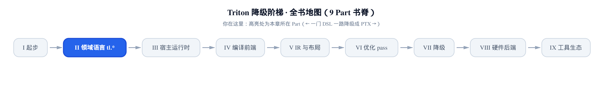
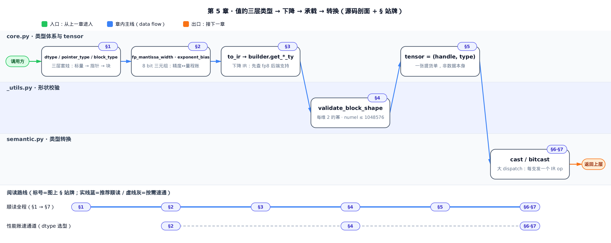
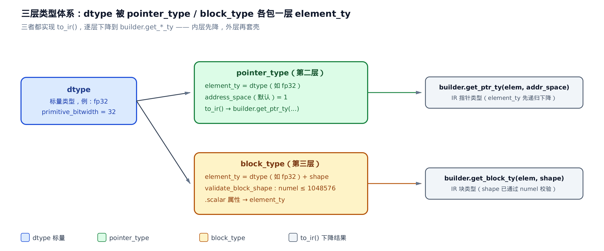
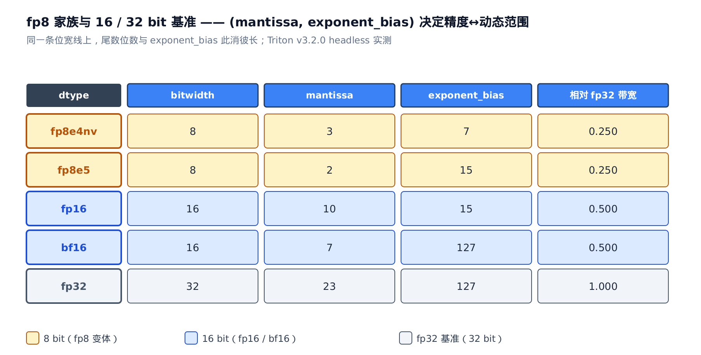
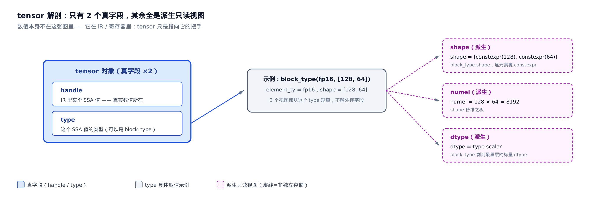
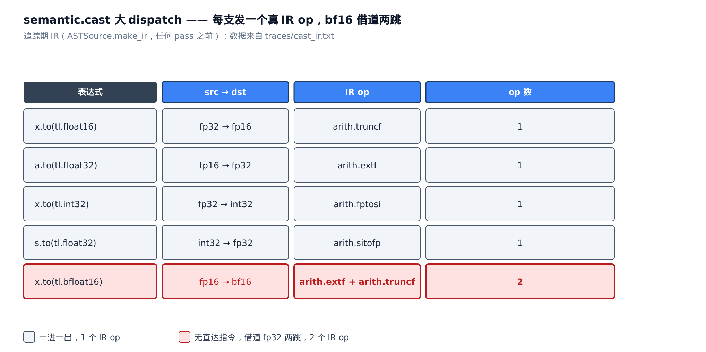

# 值在 Triton 里长什么样：三层类型、tensor 与 cast

> **你在这里**：全书是一门 DSL 一路降到 PTX 的旅程，仍在「领域语言 tl.\*」这一部分。
> 上一章看清了 `tl.*` 这张表面，和 `constexpr` 这道编译期／运行期的分水岭。
> 本章往里一层：你写下的一个值，在 Triton 里到底以什么身份存在。
> 下一章接着讲，每个 `x + y` 背后，两个 dtype 怎么被悄悄对齐。



上一章你学会了把 `tl.constexpr`（编译期常量标注）贴到 `BLOCK_SIZE` 上让编译器特化。但你还没问过一个更基础的问题：当你写下 `x = tl.load(ptr)`，这个 `x` **是什么**？它不是一块 numpy 数组，你没法 `print` 出它的数值——它在追踪期根本还没有值（本章说的**追踪期**，就是上一章那道编译期／运行期分水岭里的编译期那一侧——kernel 被 JIT 追踪、正在搭 IR 的阶段；后文 §4 和小结里说的「编译期」指的是同一件事）。它是一张「提货单」：记着「IR 里某个值」＋「那个值的类型」。而它的类型，又是一套三层嵌套的东西：标量 `dtype`（数据类型对象）、指针、块，一层套一层。

**这一章要解锁的性能杠杆，是 dtype 选型这本账**。三件事你读完就能算：其一，`fp8` ／ `bf16`（brain float 16，一种 16 bit 浮点）／ `fp16` 的位宽与 `exponent_bias`（指数偏置）怎么换算「精度↔带宽」——为什么把 KV cache（大模型推理里缓存的 attention key／value 张量，访存量往往是推理瓶颈）转 `fp8` 能把访存量砍到四分之一，代价是精度掉多少。其二，`validate_block_shape` 的「2 的幂 + `numel`（元素总数）≤ 2^20」是你调大 `BLOCK_SIZE` 撞的那堵墙，撞的时候你会知道墙在哪、为什么在那。其三，`cast`（类型转换）不是免费换个标签——每一次都发一个真 IR op（中间表示里的一条指令），热循环里反复 cast 是实打实的算力浪费。本章反复回到三个文件：类型体系与 `tensor` 都住在 `python/triton/language/core.py`，`cast` ／ `bitcast` 的大 dispatch 在 `python/triton/language/semantic.py`，后端能力那一端在 `third_party/nvidia/backend/compiler.py`。



只想算 dtype 选型那本性能账，直接跳「§2 8 个 bit 怎么分账」和「§6 cast 是真开销」；只想知道 `BLOCK_SIZE` 上限从哪来，跳「§4 block 能开多大」；想从「一个值的类型是什么」顺着读到底，就从 §1 开始。

## §1 三层套娃：dtype、pointer_type、block_type

**直觉**。Triton 的类型体系像一组俄罗斯套娃。最里层是 `dtype`——一个**标量类型**，就说一句话「这是个 `fp32`」。往外套第二层 `pointer_type`（指针类型），里面裹着一个 `element_ty`（被指向的元素类型），意思变成「指向 `fp32` 的指针」。再往外套第三层 `block_type`（块类型），裹着 `element_ty` 再加一个 `shape`（形状），意思是「128×64 个 `fp32` 排成的一块」。后两层都继承 `dtype`，都实现同一个方法 `to_ir`（把类型下降成 IR 类型）——下降时从里往外，先把内层降成 IR 类型，再套一层壳。



*图：读者写下 `tl.float32` ／ `tl.pointer_type(...)` ／ 一个 block 时落成的三层套娃。第一层标量 `dtype`（`fp32` 位宽 32），第二层裹 `element_ty` + `address_space`，第三层裹 `element_ty` + `shape` 并在构造时用 `validate_block_shape` 把关。三层都实现 `to_ir`，下降时从内向外套成 `builder` 的 `get_ptr_ty` ／ `get_block_ty`。*

**机制**。先看第一层 `dtype` 的骨架。它开头就是三张写死的名单——整数、无符号整数、浮点，外加一个 `void`：

```python
# python/triton/language/core.py:L288-L357
class dtype:
    SINT_TYPES = ['int8', 'int16', 'int32', 'int64']
    UINT_TYPES = ['int1', 'uint8', 'uint16', 'uint32', 'uint64']
    FP_TYPES = ['fp8e4b15', 'fp8e4nv', 'fp8e4b8', 'fp8e5', 'fp8e5b16', 'fp16', 'bf16', 'fp32', 'fp64']
    STANDARD_FP_TYPES = ['fp16', 'bf16', 'fp32', 'fp64']
    OTHER_TYPES = ['void']

    class SIGNEDNESS(Enum):
        SIGNED = 0
        UNSIGNED = 1

    class KIND(Enum):
        BOOLEAN = 0
        INTEGRAL = 1
        FLOATING = 2

    def __init__(self, name):
        name = _unwrap_if_constexpr(name)
        self.name = name
        assert name in dtype.SINT_TYPES + dtype.UINT_TYPES + dtype.FP_TYPES + dtype.OTHER_TYPES, name
        if name in dtype.SINT_TYPES:
            self.int_signedness = dtype.SIGNEDNESS.SIGNED
            self.int_bitwidth = int(name.split('int')[-1])
            self.primitive_bitwidth = self.int_bitwidth
        # … 省略：UINT_TYPES 分支同理，从名字尾巴 int(name.split('int')[-1]) 抠出位宽 …
        elif name in dtype.FP_TYPES:
            # … 省略：fp8 五变体 + fp16/bf16/fp32/fp64 逐个填三元组，见 §2 …
            pass
        elif name == 'void':
            self.primitive_bitwidth = 0
```

三张名单就是「哪些标量类型合法」的全集，`__init__` 一进来就 `assert` 名字在册。留意 `UINT_TYPES` 里混着一个 `int1`——那就是 Triton 的布尔类型（`int1` 即 1 bit 整数，后面 §6 `cast` 里的 `is_bool()` 判的就是它），Triton 把它归进无符号整数名单。注意 `FP_TYPES` 头五个全是 `fp8`——它们是本章的主角，下一节专门拆。这里先记住一个字段：`primitive_bitwidth`（原始位宽，单位是 bit），整数类型直接从名字尾巴抠——`int8` 就是 8、`int32` 就是 32。这个字段等下 `cast` 判截断／扩展、`bitcast` 判等宽，全靠它。

第二层 `pointer_type` 继承 `dtype`，但它不填 `primitive_bitwidth`，改包一个 `element_ty`：

```python
# python/triton/language/core.py:L559-L595
class pointer_type(dtype):

    def __init__(self, element_ty: dtype, address_space: int = 1, const: bool = False):
        element_ty = _unwrap_if_constexpr(element_ty)
        if not isinstance(element_ty, dtype):
            raise TypeError(f'element_ty has type `{type(element_ty).__name__}`; expected `dtype`.')
        self.element_ty = element_ty
        self.address_space = address_space
        self.const = const
        self.name = f'pointer<{element_ty}>' if not const else f'const_pointer<{element_ty}>'

    def to_ir(self, builder: ir.builder) -> ir.pointer_type:
        return builder.get_ptr_ty(self.element_ty.to_ir(builder), self.address_space)

    # … 省略：__str__/__eq__/is_ptr()=True/scalar 属性 …

    @property
    def scalar(self):
        return self
```

看 `to_ir` 这一行就懂了「套壳」是什么意思：`builder.get_ptr_ty(self.element_ty.to_ir(builder), ...)`——它先递归调 `element_ty.to_ir(builder)` 把里层的 `fp32` 降成 IR 类型，**再**用 `builder`（IR 构造器，追踪期由 JIT 桥进来的那个 C++ 对象，见[第 4 章的 `@builtin` 契约](../../ch04-tl-surface-and-constexpr/narrative/chapter.md)）套一层指针。`address_space`（地址空间，默认 1 表全局显存）和 `const`（是否只读指针）是指针独有的两个属性。

第三层 `block_type` 也继承 `dtype`，包 `element_ty` 再加 `shape`：

```python
# python/triton/language/core.py:L605-L646
class block_type(dtype):

    def __init__(self, element_ty: dtype, shape: List):
        self.element_ty = element_ty

        # Note that block_type's shape is a list of int
        # while tensor's shape is a list of constexpr.

        # shape can be empty ([]) when an input is a 0D tensor.
        self.shape = _unwrap_shape(shape)
        if not self.shape:
            raise TypeError('0d block_type is forbidden')

        self.numel = validate_block_shape(self.shape)
        self.name = f'<{self.shape}, {self.element_ty}>'

    def to_ir(self, builder: ir.builder) -> ir.block_type:
        return builder.get_block_ty(self.element_ty.to_ir(builder), self.shape)

    # … 省略：is_block()=True / get_block_shapes() / __eq__ …

    @property
    def scalar(self):
        return self.element_ty
```

三个点要记住。其一，源码里那句注释自己点破了：`block_type` 的 `shape` 是 `list[int]`（一串朴素整数），而等下你会看到 `tensor` 的 `shape` 是 `list[constexpr]`——两者不是一回事，`block_type` 这层已经把 `constexpr` 出壳成裸整数了。其二，构造的那一刻就调 `validate_block_shape(self.shape)` 把 `numel` 算出来并把关（§4 专讲）。其三，`scalar` 属性返回 `element_ty`——这是外层剥到最里层标量的入口，等下 `tensor.dtype` 就从这里来。`to_ir` 同样是「内层先降、外层套壳」：`get_block_ty(element_ty.to_ir(...), shape)`。

**不变量**。三层的共同契约是：每一层都实现 `to_ir`，且外层的 `to_ir` 必先调用内层的 `to_ir`。所以无论套多深，下降到 IR 都是一条从内向外的确定链——`fp32` → `ptr<fp32>` → `<[128,64], ptr<fp32>>`（一块指针）也能一层层降下去，不会有哪一层「不知道自己怎么变成 IR 类型」。这套嵌套是后面所有类型操作的地基，先立稳它。

## §2 8 个 bit 怎么分账：fp8 家族与浮点三元组

**直觉**。一个浮点数的 8（或 16、32）个 bit 要在两件事上分账。尾数（`mantissa`）位数决定「分得多细」——也就是精度；指数位数加 `exponent_bias` 决定「量程多宽」——能表示多大多小的数。`fp8` 家族就是**同样 8 个 bit 的不同分法**：`fp8e4nv` 给尾数 3 位、量程窄一点；`fp8e5` 只给尾数 2 位、把省下的一位塞给指数换更宽的量程。选 dtype，就是在这块固定的位宽预算上滑动这个旋钮。

**机制**。回到 `dtype.__init__` 里刚才省略的那段 `FP_TYPES` 分支——它就是逐个浮点类型往对象上钉三个数：

```python
# python/triton/language/core.py:L316-L354（承 §1 的 dtype.__init__，FP_TYPES 分支展开）
        elif name in dtype.FP_TYPES:
            if name == 'fp8e4b15':
                self.fp_mantissa_width = 3
                self.primitive_bitwidth = 8
                self.exponent_bias = 15
            elif name == 'fp8e4nv':
                self.fp_mantissa_width = 3
                self.primitive_bitwidth = 8
                self.exponent_bias = 7
            elif name == 'fp8e4b8':
                self.fp_mantissa_width = 3
                self.primitive_bitwidth = 8
                self.exponent_bias = 8
            elif name == 'fp8e5':
                self.fp_mantissa_width = 2
                self.primitive_bitwidth = 8
                self.exponent_bias = 15
            elif name == 'fp8e5b16':
                self.fp_mantissa_width = 2
                self.primitive_bitwidth = 8
                self.exponent_bias = 16
            elif name == 'fp16':
                self.fp_mantissa_width = 10
                self.primitive_bitwidth = 16
                self.exponent_bias = 15
            elif name == 'bf16':
                self.fp_mantissa_width = 7
                self.primitive_bitwidth = 16
                self.exponent_bias = 127
            elif name == 'fp32':
                self.fp_mantissa_width = 23
                self.primitive_bitwidth = 32
                self.exponent_bias = 127
            elif name == 'fp64':
                self.fp_mantissa_width = 52
                self.primitive_bitwidth = 64
                self.exponent_bias = 1023
```

每个类型就三个数：`fp_mantissa_width`（尾数位数）、`primitive_bitwidth`（总位宽）、`exponent_bias`（指数偏置）。为什么存成三个独立字段、而不是塞进一个枚举？因为 `cast` 和精度分析要**直接查**它们——按 `primitive_bitwidth` 比大小判截断还是扩展，按 `fp_mantissa_width` 判精度，按 `exponent_bias` 判量程。存成三个数，这些判断一行搞定，不用从枚举反推。

这三个数怎么换算成「精度」和「带宽」？先看精度。IEEE-like 浮点的相对精度约由尾数位数定，量级是 `` $`\approx 2^{-(m+1)}`$ ``（`m` 是 `fp_mantissa_width`）——尾数每多一位，精度约细一倍。再看带宽：`primitive_bitwidth` 直接就是每元素占的 bit 数，除以 `fp32` 的 32 就是相对带宽。把五个类型的三元组和这两笔换算摆成一张表：

<!-- trace: m02-fp8-family-encoding -->

| dtype | bitwidth | mantissa | exponent_bias | 相对精度 `` $`\approx 2^{-(m+1)}`$ `` | 相对 fp32 带宽 |
|---|---|---|---|---|---|
| fp8e4nv | 8 | 3 | 7 | 0.0625 | 0.250 |
| fp8e5 | 8 | 2 | 15 | 0.125 | 0.250 |
| fp16 | 16 | 10 | 15 | 0.000488281 | 0.500 |
| bf16 | 16 | 7 | 127 | 0.00390625 | 0.500 |
| fp32 | 32 | 23 | 127 | 5.96046e-08 | 1.000 |

*表：五个 dtype 的三元组与换算，取自 pin v3.2.0 headless 真机读出的字段。*

这张表就是 dtype 选型的性能账，逐行读。同为 8 bit 的两个 `fp8`：`fp8e4nv` 尾数 3 位、相对精度 0.0625，`fp8e5` 尾数 2 位、相对精度 0.125——精度差一倍，`fp8e5` 换来的是多一个指数位、量程更宽。同为 16 bit 的 `fp16` 与 `bf16`：`bf16` 只给尾数 7 位（相对精度 0.00390625，比 `fp16` 的 0.000488281 粗约 8 倍），却把 `exponent_bias` 抬到 127，拿到和 `fp32` 一样的量程。这里有个隐含前提要点破：`bf16` 和 `fp32` 都是 8 个指数位、指数字段结构完全一致（`bf16` 只是把尾数从 23 位裁到 7 位），所以 `exponent_bias` 相同就直接意味着可表示的指数范围（量程）相同——量程是「指数位宽 + `exponent_bias`」共同决定的，两者都对齐了才等价。这就是训练偏爱 `bf16` 的原因——宁可粗一点，也别溢出。



*图：读 dtype 三元组就是读性能账。同为 8 bit 的两行 `fp8` 变体，`mantissa`／`exponent_bias` 分配不同（精度↔量程互换）；同为 16 bit 的 `bf16` 与 `fp16`，`bf16` 靠牺牲尾数（7 vs 10）把 `exponent_bias` 抬到 127 拿到 `fp32` 量程。选 dtype = 在某个位宽预算里挑一组精度／量程的分配。*

**量化**。带宽这笔账最直接：`fp8` 位宽是 `fp16` 的一半（8/16=0.5）、`fp32` 的四分之一（8/32=0.25）。所以把 KV cache 或激活值转 `fp8`，直接把该张量的访存量砍到四分之一——在访存瓶颈的 kernel 里，这往往比任何算术优化都管用。代价就是表里那两个相对精度数字：从 `fp16` 的 0.000488281 掉到 `fp8e4nv` 的 0.0625，精度粗了两个数量级。这笔账值不值，取决于你的数值对精度多敏感——但账本就摆在这三个字段里，不是玄学。

**不变量**。8 bit 的 `fp8` 永远满足一条守恒：符号位 1 + 指数位 + 尾数位 = 8。以 `fp8e4nv` 为例，尾数 3 位、指数 4 位、符号 1 位，`` $`3 + 4 + 1 = 8`$ ``，正好等于 `primitive_bitwidth`；`fp8e5` 是 `` $`2 + 5 + 1 = 8`$ ``。两者位宽都是 8，差别只在把那 7 个非符号位在尾数和指数之间怎么切。这条守恒就是「没有免费午餐」的数学形式——尾数和指数此消彼长，你不可能在 8 bit 里既要高精度又要宽量程。`core.py` 把 `(fp_mantissa_width, exponent_bias)` 存成两个独立字段，正是为了让这个切分能被直接查到，而不必反推。

## §3 类型下降到 IR：to_ir 的 dispatch 与 fp8 后端能力接缝

**直觉**。前面的 `dtype` 对象是纯 Python，跟你用哪块 GPU 无关——你随便构造 `tl.float8e4nv` 都不报错。但它**能不能真的用**，取决于目标显卡支不支持这个 `fp8` 变体。这个检查不放在构造时，而放在 `to_ir`——也就是把类型真正下降成 IR 的那一刻。这是「Python 决策 / C++ 后端能力执行」的一道典型接缝。

**机制**。`to_ir` 本身是一个按名字逐分支的大 dispatch，但它开头先做一件特别的事：

```python
# python/triton/language/core.py:L492-L530
    def to_ir(self, builder: ir.builder) -> ir.type:
        if self.name.startswith("fp8"):
            if self.name not in builder.options.supported_fp8_dtypes:
                raise ValueError(f'type {self} not supported in this architecture. '
                                 f'The supported fp8 dtypes are {builder.options.supported_fp8_dtypes}')
            if self.name in builder.options.deprecated_fp8_dtypes:
                warn(f"{self.name} is deprecated in this architecture and will be removed in a future triton release")

        if self.name == 'void':
            return builder.get_void_ty()
        elif self.name == 'int1':
            return builder.get_int1_ty()
        elif self.name in ('int8', 'uint8'):
            return builder.get_int8_ty()
        # … 省略：int16/int32/int64 各自的 get_int*_ty 分支 …
        elif self.name == 'fp8e5':
            return builder.get_fp8e5_ty()
        elif self.name == 'fp8e4nv':
            return builder.get_fp8e4nv_ty()
        # … 省略：fp8e5b16/fp8e4b8/fp8e4b15 各自的 get_fp8*_ty 分支 …
        elif self.name == 'fp16':
            return builder.get_half_ty()
        elif self.name == 'bf16':
            return builder.get_bf16_ty()
        elif self.name == 'fp32':
            return builder.get_float_ty()
        elif self.name == 'fp64':
            return builder.get_double_ty()
        raise ValueError(f'fail to convert {self} to ir type')
```

两段分开看。开头的 `if self.name.startswith("fp8")`：只要是 `fp8`，就去查 `builder.options.supported_fp8_dtypes`（这块后端支持的 `fp8` 变体清单），不在清单里直接 `ValueError`——**这就是旧卡上某个 `fp8` 变体被拦下的地方**。清单里但被标 `deprecated_fp8_dtypes`（已弃用）的，则 `warn` 一句、放行。后面那一长串 `elif` 是纯粹的按 `name` 派发：每个类型名对应一个 `builder.get_*_ty()`。顺带留意 `int8` 和 `uint8` 都落到 `get_int8_ty()`——有符号性在 IR 这层被抹平了，MLIR（Multi-Level IR，Triton 底层用的编译器基础设施）的整数类型不带符号，符号只活在 Triton 的 `dtype` 层，由 `cast` 和算术分支去解释。

那份 `supported_fp8_dtypes` 清单是谁填的？接缝的另一端在 NVIDIA 后端：

```python
# third_party/nvidia/backend/compiler.py:L106-L158
    supported_fp8_dtypes: Tuple[str] = ("fp8e5", "fp8e4b15")   # ← class CUDAOptions 的字段
    deprecated_fp8_dtypes: Tuple[str] = ()
    # … 省略：CUDAOptions 其余 dataclass 字段与 __post_init__/hash；class CUDAOptions 到此结束 …
    # ↓ 下面另起一个类 class CUDABackend(BaseBackend)，parse_options 是它的方法；
    #   self.capability 是 CUDABackend.__init__ 里从 target.arch 取的 sm_ 版本号，非 CUDAOptions 字段
    def parse_options(self, opts) -> Any:
        args = {k: opts[k] for k in CUDAOptions.__dataclass_fields__.keys() if k in opts}
        if "supported_fp8_dtypes" not in args:
            supported_fp8_dtypes = set(CUDAOptions.supported_fp8_dtypes)
            if self.capability >= 89:
                supported_fp8_dtypes.add("fp8e4nv")
            args["supported_fp8_dtypes"] = tuple(sorted(supported_fp8_dtypes))

        if "deprecated_fp8_dtypes" not in args:
            if self.capability >= 90:
                args["deprecated_fp8_dtypes"] = ("fp8e4b15", )
```

先说清这段代码的结构：它是两个类接力。不可变的选项对象 `CUDAOptions`（frozen dataclass，`supported_fp8_dtypes` ／ `deprecated_fp8_dtypes` 是它的字段、存基线默认清单）被可变的后端对象 `CUDABackend` 在 `parse_options` 里按 `self.capability` 填充——`self.capability` 是 `CUDABackend.__init__` 从 `target.arch` 取到的 `sm_` 版本号，不是 `CUDAOptions` 的字段，两者不是同一个 `self`。看清这点，下面就顺了：清单按 `capability`（计算能力，即 GPU 的 `sm_` 版本号）动态拼。基线两个 `fp8e5` ／ `fp8e4b15` 谁都有；`capability >= 89`（Ada 架构，NVIDIA 2022 年的消费/专业卡世代、RTX 40 系所属，`sm_89`）才补上 `fp8e4nv`；`capability >= 90`（Hopper，NVIDIA 同期的数据中心旗舰、H100 所属，`sm_90`）则把 `fp8e4b15` 标成弃用。把这条接缝的两端接上：`parse_options` 最后一行 `return CUDAOptions(**args)`——它把刚按 `capability` 拼好的 `args` 组装成一个新的 `CUDAOptions` 实例返回，这个实例就被 JIT 编译流程存进 `builder.options`。所以 §3 开头 `to_ir` 里查的那份 `builder.options.supported_fp8_dtypes`，正是这里按 `capability` 动态拼出来的清单——同一个对象，一端填、另一端查。于是同一句 `tl.float8e4nv.to_ir(...)`，在 Ada 卡上顺利下降，在更老的卡上就在 `to_ir` 那道 `ValueError` 被拦。

**不变量**。这道接缝的意义是**关注点分离**：`dtype` 对象与后端解耦，可以在任何机器上自由构造、比较、传递；「能不能用」的判断被推迟到唯一一个拿得到 `builder.options` 的时刻——`to_ir`。这也解释了为什么这个检查不可能提前到 `__init__`：构造时你手里根本没有 `builder`，不知道目标是哪块卡。Python 侧只管描述类型，硬件能力的裁决留给下降那一刻。

## §4 block 能开多大：validate_block_shape 的两道门

**直觉**。`block_type` 的 `shape` 有两道门卫。每一维必须是 2 的幂——这样下游算 tiling、向量化时按位移就能算，不必做通用除法；且所有维乘起来的元素数不许超过 `` $`2^{20} = 1048576`$ ``——约束单个 block 占的寄存器和共享内存不失控。你把 `BLOCK_SIZE` 开太大、或开成非 2 的幂，构造 `block_type` 的那一刻就在这里被拦——注意是**编译期**报错，不是运行期崩。

**机制**。这道门就是 `_utils.py` 里的二十行，`block_type.__init__` 构造时调的正是它：

```python
# python/triton/language/_utils.py:L3-L21
TRITON_MAX_TENSOR_NUMEL = 1048576


def is_power_of_two(x):
    return (x & (x - 1)) == 0


def validate_block_shape(shape: List[int]):
    numel = 1
    for i, d in enumerate(shape):
        if not isinstance(d, int):
            raise TypeError(f"Shape element {i} must have type `constexpr[int]`, got `constexpr[{type(d)}]")
        if not is_power_of_two(d):
            raise ValueError(f"Shape element {i} must be a power of 2")
        numel *= d

    if numel > TRITON_MAX_TENSOR_NUMEL:
        raise ValueError(f"numel ({numel}) exceeds triton maximum tensor numel ({TRITON_MAX_TENSOR_NUMEL})")
    return numel
```

`TRITON_MAX_TENSOR_NUMEL = 1048576` 就是 `` $`2^{20}`$ ``。`is_power_of_two` 用经典位技巧 `(x & (x - 1)) == 0`——2 的幂在二进制里只有一个 1，减 1 后那个 1 及低位全翻转，按位与得 0（`x=1` 也判 `True`，1 本身就是 2 的 0 次幂）。函数遍历每一维：非 2 的幂立刻抛，否则累乘进 `numel`；循环完再一次性判 `numel` 有没有越过这个上限。走一遍四个真实 case：

<!-- trace: m04-validate-block-shape -->

| 2D block shape | 每维 2 的幂？ | numel = ∏dim | ≤ 2^20 (1048576)？ | 结果 |
|---|---|---|---|---|
| [16, 16] | 是 | 256 | 是 | OK，返回 numel=256 |
| [1024, 1024] | 是 | 1048576 | 是（恰等边界，允许） | OK，返回 numel=1048576 |
| [2048, 1024] | 是 | 2097152 | 否 | ValueError: numel (2097152) exceeds triton maximum tensor numel (1048576) |
| [1000, 16] | 否（1000 非 2 的幂） | 首维即失败 | — | ValueError: Shape element 0 must be a power of 2 |

*表：四支覆盖通过／边界／超限／非幂，后两支真触发 ValueError，取自 pin v3.2.0 headless 实跑。*

**量化**。上限卡的是**元素数**，不是字节数。2D block 的 `BLOCK_M × BLOCK_N` 必须 ≤ `` $`2^{20}`$ ``，所以最大的正方 block 是 1024×1024=1048576（恰等边界，实测放行）；再往上一格 2048×1024=2097152 就直接抛。关键推论：这个上限**与 dtype 无关**——`fp8` 也好 `fp32` 也好，都是这 `` $`2^{20}`$ `` 个元素的天花板。所以想在一个 block 里塞下更多**数据量**、省显存，靠的是换小 dtype，不是开更大的 block——block 的元素数上限焊死在这，动不了。

**不变量**。`validate_block_shape` 是一个「全通过或抛错」的守卫，没有中间态。它遍历每一维、单调累乘 `numel`（各维都 ≥ 1，只增不减），要么在某一维非 2 的幂时抛、要么在最后 `numel` 越界时抛、要么正常返回一个「各维皆 2 的幂之积且 ≤ `` $`2^{20}`$ ``」的 `numel`。因为维数有限、循环无回退，它必在有限步内落到这三个出口之一——`[2048,1024]` 累乘到 2097152 落进越界出口，`[16,16]` 累乘到 256 落进正常返回。你调 `BLOCK_SIZE` 撞的，就是这段确定性的墙。

## §5 tensor：一张提货单，不是数据本身

**直觉**。搞清了类型，回到开头那个问题：`x = tl.load(ptr)` 里的 `x` 是什么？它不是数据，是一张**提货单**。它只记两样真东西——`handle`（IR 里某个值的编号，真正的数值在寄存器／IR 里）和 `type`（这个值的类型，就是前面那套三层类型之一）。你在 Python 侧看到的 `shape` ／ `numel` ／ `dtype`，全是从 `type` 现算出来的便利视图。所以 `tensor` 很轻，传来传去只是在传这张单子。

**机制**。`tensor` 继承一个只有 `handle` 字段的基类 `_value`——也就是说，`tensor` 首先「是 IR 里的一个值」。它的 `__init__` 只做一件事：把 `(handle, type)` 落成把手，其余全派生：

```python
# python/triton/language/core.py:L724-L761
class tensor(_value):
    """Represents an N-dimensional array of values or pointers.
    …
    """

    def __init__(self, handle, type: dtype):
        """Not called by user code."""
        # IR handle
        super().__init__(handle)
        # Block shape
        self.shape = type.shape if type.is_block() else ()
        self.numel = 1
        for s in self.shape:
            self.numel *= s
        self.numel = constexpr(self.numel)
        self.type = type  # Tensor type (can be block_type)
        # Following the practice in pytorch, dtype is scalar type
        self.dtype = type.scalar
        self.shape = [constexpr(s) for s in self.shape]
```

`"""Not called by user code."""` 那句注释很关键——用户永远不直接 `tensor(...)`，它是各个 op 内部产出值时才造的。真字段只有两个：`handle` 和 `type`。其余三个都是从 `type` 派生的只读视图。`shape` 取自 `type.shape`（若是 block），`numel` 是各维之积，`dtype` 取自 `type.scalar`——还记得 §1 里 `block_type.scalar` 返回 `element_ty` 吗？这里就是它的落点，「PyTorch 式的 `dtype` 是标量类型」这句注释说的就是这个。

最后一行 `self.shape = [constexpr(s) for s in self.shape]` 尤其要看：`shape` 每个元素被裹成 `constexpr`。为什么？因为形状在追踪期就已知（回指[第 4 章讲的编译期／运行期分野](../../ch04-tl-surface-and-constexpr/narrative/chapter.md)）——把它标成 `constexpr`，下游才能拿它去特化、当循环边界、算向量化宽度。这也呼应 §1 那句源码注释：`block_type.shape` 是裸 `int`，到了 `tensor` 这层才裹回 `constexpr`。



*图：`tensor` 中心只有两格——`handle`（指向 IR 里的 SSA 值）和 `type`（可以是 `block_type`）。以 `block_type(fp16, [128, 64])` 为例，向外派生三个只读视图：`shape=[constexpr(128), constexpr(64)]`、`numel=128×64=8192`、`dtype=type.scalar`。数值本身不在图里——它在 IR／寄存器里，`tensor` 只是它的把手。*

这里的 `handle` 就是 IR 里的一个 SSA 值（Static Single Assignment，静态单赋值——每个值只被赋一次、有唯一编号）。`tensor` 拿着这个编号，等于拿着「IR 里哪个值」的引用；`type` 告诉编译器这个值该怎么解释。两样合起来，就够做追踪期所有的类型决策了——数值本身完全不需要在场。

**直觉**。那 `x + y`、`x < y` 又是怎么回事？`tensor` 定义了约四十个魔术方法，但它们全是薄薄的转发壳，自己不含一点逻辑：

```python
# python/triton/language/core.py:L763-L815
    @builtin
    def __add__(self, other, _builder=None):
        return add(self, other, sanitize_overflow=True, _builder=_builder)

    @builtin
    def __sub__(self, other, _builder=None):
        return sub(self, other, sanitize_overflow=True, _builder=_builder)

    @builtin
    def __mul__(self, other, _builder=None):
        return mul(self, other, sanitize_overflow=True, _builder=_builder)

    # … 省略：__truediv__/__mod__ 转发到 semantic.truediv/mod；
    #        __lt__/__eq__ 等比较、__and__/__lshift__ 等位运算全是同一个模子 …
```

**机制**。每个 dunder 都是 `@builtin`（[第 4 章](../../ch04-tl-surface-and-constexpr/narrative/chapter.md)那个在追踪期注入 `_builder` 的装饰器）套一层，然后把 `self` 递给 `semantic.*` 或 `core` 里同样转发的自由函数。代码里那个 `sanitize_overflow=True`（是否在这次运算里插一道溢出检查）是另一套关注点，这里只需看到它也被原样转发进 `semantic` 层、并不在 `tensor` 这一侧做任何事，不影响「dunder 全是薄壳」这个论点。约四十个魔术方法，无一自带逻辑，全是转发。为什么这么设计？因为类型决策——类型提升、cast 选支、溢出处理——都集中在语义层单点维护，`tensor` 这一侧只负责把 `self` 递进去。`x + y` 里两个 dtype 到底怎么对齐、结果是什么类型，`tensor` 不管，那是下一章 `computation_type_impl` 的活。

**不变量**（转发这一侧）。约四十个魔术方法的方法体只有一种形态：`return <semantic 函数或同名自由函数>(self, ...)`——从不出现分支判断、从不做算术、从不在 `tensor` 侧碰类型规则。所以「`tensor` 只转发不决策」是一条可核对的结构约束：任意 dunder 拆开看都是一层 `@builtin` 壳加一行转发，逻辑的唯一归属地是语义层，`tensor` 这侧的行数与决策数恒为零。

`.to()`（改类型）也是同一个套路，但有个有趣的细节：

```python
# python/triton/language/core.py:L988-L999
    @builtin
    def to(self, dtype: dtype, fp_downcast_rounding: Optional[str] = None, bitcast: bool = False, _builder=None):
        """
        Alias for :py:func:`tensor.cast`.
        """
        # Triton doesn't like core functions calling other core functions, so we
        # just copy-paste the implementation of cast here.  It's not too bad.
        dtype = _unwrap_if_constexpr(dtype)
        bitcast = _unwrap_if_constexpr(bitcast)
        if bitcast:
            return semantic.bitcast(self, dtype, _builder)
        return semantic.cast(self, dtype, _builder, fp_downcast_rounding)
```

那句注释直白得可爱：`Triton doesn't like core functions calling other core functions`——所以 `.to()` 没去调 `.cast()`，而是把 cast 的逻辑原地复刻了一遍。`bitcast=True` 走 `semantic.bitcast`，否则走 `semantic.cast` 加 `fp_downcast_rounding`（降精度时的舍入模式）。两条路都落到 `semantic` 层——下面两节的主角。

**不变量**。`tensor` 一旦由 `__init__` 构造完成，`shape` ／ `numel` ／ `dtype` 就与 `type` 永久一致，绝不会出现「`type` 说是 `fp16`、`dtype` 字段却报 `fp32`」这种分裂。理由有两条。其一，这三个视图只在 `__init__` 里从 `type` 各算一次（`self.shape = type.shape…`、`self.dtype = type.scalar`，见上面 L328-336），此后类里没有任何 setter 会重新赋值它们——派生量与真字段同生共死。其二，`tensor` 在用户代码里不可变造（那句 `"""Not called by user code."""`），任何类型改动（`.to()` ／ `cast`）都返回**一个新 `tensor`**、而非原地改写旧的。所以真字段永远只有 `handle` 和 `type` 两个，加上从 `type` 派生的三个只读视图，在一个 `tensor` 的整个生命周期里锁死一致——传这张提货单，传的始终是一份自洽的类型信息。

## §6 cast 是真开销：semantic.cast 的大 dispatch

**直觉**。`cast` 不是给变量换个类型标签那么免费。`semantic.cast` 是一棵大分岔树，按（源 dtype, 目标 dtype）的组合选一条支，每选中一支就 `builder.create_*(...)` 发一个真的 IR 算术 op——截断、扩展、浮点转整数、整数转浮点……这个 op 会占寄存器、进指令流。个别组合（如 `bf16` 和非 `fp32` 之间）硬件没有直达指令，还得借道 `fp32` 发两个 op。所以热循环里反复 cast，是实打实的算力开销。

**机制**。`cast` 的全貌就是一串按类型谓词排开的分支。它先把两侧的**标量**类型取出来（block 输入只是把目标也套成同 shape 的 block，逐元素 cast），再在标量上做决策：

```python
# python/triton/language/semantic.py:L831-L939
def cast(input: tl.tensor, dst_ty: tl.dtype, builder: ir.builder,
         fp_downcast_rounding: Optional[str] = None) -> tl.tensor:
    src_ty = input.type
    # … 省略：constexpr 出壳；若 src 是 block，把 dst_ty 也套成同 shape 的 block_type …
    if src_ty == dst_ty:
        return input

    src_sca_ty = src_ty.scalar
    dst_sca_ty = dst_ty.scalar

    # For fp downcasting default rounding mode should be RTNE, for all other conversions it should
    # not be set
    fp_downcast_rounding = _str_to_rounding_mode(fp_downcast_rounding)
    use_custom_rounding = False
    if dst_sca_ty.is_floating() and src_sca_ty.is_floating(
    ) and dst_sca_ty.primitive_bitwidth < src_sca_ty.primitive_bitwidth:
        if fp_downcast_rounding is None: fp_downcast_rounding = ir.ROUNDING_MODE.RTNE
        elif fp_downcast_rounding != ir.ROUNDING_MODE.RTNE: use_custom_rounding = True
    # … 省略：非降精度却传了 fp_downcast_rounding 则报错 …

    # … 省略：fp8e4b15 走后端自定义转换 codegen_fns["convert_custom_types"] …
    # Casting with customized floating types involved: fp8 <=> bf16, fp16, fp32, fp64
    if (src_sca_ty.is_fp8() and dst_sca_ty.is_floating()) or \
       (src_sca_ty.is_floating() and dst_sca_ty.is_fp8()) or \
       use_custom_rounding:
        return tl.tensor(builder.create_fp_to_fp(input.handle, dst_ty.to_ir(builder), fp_downcast_rounding), dst_ty)

    # bf16 <=> (not fp32)
    if (src_sca_ty.is_fp16() and not dst_sca_ty.is_fp32()) or \
       (src_sca_ty.is_bf16() and not dst_sca_ty.is_fp32()):
        return cast(cast(input, tl.float32, builder), dst_sca_ty, builder)

    # Standard floating types' casting: truncation  (fp64=>fp32/fp16/bf16, fp32=>fp16/bf16)
    truncate_fp = src_sca_ty.is_floating() and \
        dst_sca_ty.is_floating() and \
        src_sca_ty.primitive_bitwidth > dst_sca_ty.primitive_bitwidth
    if truncate_fp:
        return tl.tensor(builder.create_fp_trunc(input.handle, dst_ty.to_ir(builder)), dst_ty)

    # Standard floating types' casting: extension  (fp32=>fp64, fp16/bf16=>fp32/fp64)
    ext_fp = src_sca_ty.is_floating() and \
        dst_sca_ty.is_floating() and \
        src_sca_ty.primitive_bitwidth < dst_sca_ty.primitive_bitwidth
    if ext_fp:
        return tl.tensor(builder.create_fp_ext(input.handle, dst_ty.to_ir(builder)), dst_ty)

    # Casting between integer types
    if src_sca_ty.is_int() and dst_sca_ty.is_int() and \
       (src_sca_ty.int_bitwidth != dst_sca_ty.int_bitwidth or src_sca_ty.int_signedness != dst_sca_ty.int_signedness):
        sign_extend = src_sca_ty.is_int_signed() and not src_sca_ty.is_bool()
        # … 省略：目标是 bool 则走 not_equal(input, 0) …
        return tl.tensor(builder.create_int_cast(input.handle, dst_ty.to_ir(builder), sign_extend), dst_ty)

    # Casting standard floating types to integer types
    if src_sca_ty.is_standard_floating() and dst_sca_ty.is_int():
        # … 省略：bool 特判 …
        if dst_sca_ty.is_int_signed():
            return tl.tensor(builder.create_fp_to_si(input.handle, dst_ty.to_ir(builder)), dst_ty)
        else:
            return tl.tensor(builder.create_fp_to_ui(input.handle, dst_ty.to_ir(builder)), dst_ty)

    # Casting integer types to standard floating types
    if src_sca_ty.is_int() and dst_sca_ty.is_standard_floating():
        if src_sca_ty.is_bool() or not src_sca_ty.is_int_signed():
            return tl.tensor(builder.create_ui_to_fp(input.handle, dst_ty.to_ir(builder)), dst_ty)
        else:
            return tl.tensor(builder.create_si_to_fp(input.handle, dst_ty.to_ir(builder)), dst_ty)

    # … 省略：指针↔整数、指针↔指针几支，各自 create_ptr_to_int / create_int_to_ptr / create_bitcast …
    assert False, f'cannot cast {input} to {dst_ty}'
```

别被长度吓到，结构非常规整。开头 `src_ty == dst_ty` 直接返回——同类型无需转换，不发 op。往下每一条分支体都长一个样：`tl.tensor(builder.create_XXX(...), dst_ty)`——一次 `builder.create_*` 就是一个 IR op。分支互斥，命中哪支发哪个 op：`fp` 和 `fp8` 之间走 `create_fp_to_fp`；`fp` 截断（高位宽→低位宽）走 `create_fp_trunc`；`fp` 扩展走 `create_fp_ext`；整数间走 `create_int_cast`（`sign_extend` 决定符号位怎么补）；`fp`→整数走 `create_fp_to_si` ／ `create_fp_to_ui`；整数→`fp` 走 `create_si_to_fp` ／ `create_ui_to_fp`。

唯一的异类是 `bf16 <=> (not fp32)` 那支：它不发 op，而是 `cast(cast(input, tl.float32, builder), dst_sca_ty, builder)`——递归成两跳，先把源扩到 `fp32`、再截到目标。为什么？硬件通常只提供 `bf16↔fp32` 的直接转换指令，其余组合借道 `fp32` 才有可用的 IR op。这一跳会发**两个** op。还有一处注意：降精度（如 `fp32→fp16`）默认舍入模式是 `RTNE`（Round To Nearest Even，就近舍入到偶数），也就是 `fp_downcast_rounding` 的默认值。

把五个真实 cast 追到追踪期 IR，数出各发几个 op：

<!-- trace: m07-cast-big-dispatch -->

| cast 表达式 | src → dst | semantic.cast 命中分支 | 发出的 IR op | op 数 |
|---|---|---|---|---|
| x.to(tl.float16) | fp32 → fp16 | fp 截断 truncate（bitwidth 降） | arith.truncf | 1 |
| a.to(tl.float32) | fp16 → fp32 | fp 扩展 extend（bitwidth 升） | arith.extf | 1 |
| x.to(tl.int32) | fp32 → int32 | 标准浮点 → 整数 | arith.fptosi | 1 |
| s.to(tl.float32) | int32 → fp32 | 整数 → 标准浮点（有符号） | arith.sitofp | 1 |
| x.to(tl.bfloat16) | fp16 → bf16 | bf16↔非 fp32：借道 fp32 两跳 | arith.extf + arith.truncf | 2 |

*表：取自 pin v3.2.0 追踪期 IR（`ASTSource.make_ir`，任何 pass 之前）。`arith.truncf` 等是 MLIR `arith` dialect 里的算术 op 名。*



*图：每一行是一条 dispatch 支，右边是追踪期 IR 里真多出来的那个 op。前四行「一进一出」各 1 个 op；最后一行 `fp16→bf16` 缺直达指令，被拆成 `extf`（→fp32）+ `truncf`（→bf16）两个 op——同一次 `.to()` 掉出两块砖。*

**量化**。实测四个不同类型对的 cast 各发恰好 1 个 `arith` op（`truncf` ／ `extf` ／ `fptosi` ／ `sitofp` 计数各 1）；而 `fp16→bf16` 因为走两跳发 2 个（`extf` 1 + `truncf` 1）。换算成开销：一段热循环每迭代做 N 次无谓 cast，就是 N 个额外 IR op 进指令流，`bf16↔非fp32` 的那种还翻倍。这就是「避免无谓 cast」这条性能建议的字面依据——它不是口号，是可数的 op。写 kernel 时若发现同一个值被反复 `fp16→fp32→fp16` 折腾，把中间类型固定下来、少转一次，省的就是这些实打实的指令。

**不变量**。cast 的开销与分支一一对应：语义层每命中一条 dispatch 支就发恰好一个 IR op；唯一例外是 `bf16↔非fp32`，递归成两跳发两个。绝不存在「发 0 个 op 的 cast」——`src_ty == dst_ty` 那条早返回不算 cast（它是「无需转换」）。论证很直接：每条分支体都形如 `tl.tensor(builder.create_XXX(...), dst_ty)`，一次 `create_*` 即一个 op，分支互斥故命中一支等于一个 op；两跳那支体是 `cast(cast(...))`，两层嵌套各自再落到某条 `create_*`，故 2 个 op。

## §7 bitcast：等宽重解释，一分钱不算

**直觉**。`bitcast` 和 `cast` 是两回事。`cast` 会真算——`fp32→fp16` 会舍入、会丢精度。`bitcast` 只是「把同一堆 bit 换个类型标签重新解读」——一分钱不算，但硬前提是**位宽必须相等**：32 bit 的 `fp32` 只能 bitcast 到同样 32 bit 的 `int32`。位数不等就无从对应，`semantic` 层当场 `ValueError`，连一个 IR op 都不发。

**机制**。`bitcast` 比 `cast` 短得多，核心就是一道等宽闸：

```python
# python/triton/language/semantic.py:L812-L828
def bitcast(input: tl.tensor, dst_ty: tl.dtype, builder: ir.builder) -> tl.tensor:
    src_ty = input.type
    if src_ty.is_block():
        dst_ty = tl.block_type(dst_ty.scalar, input.type.get_block_shapes())
    if src_ty == dst_ty:
        return input
    src_sca_ty = src_ty.scalar
    dst_sca_ty = dst_ty.scalar
    if src_sca_ty.is_ptr() or dst_sca_ty.is_ptr():
        return cast(input, dst_ty, builder)
    # Bitcast
    src_bits = src_sca_ty.primitive_bitwidth
    dst_bits = dst_sca_ty.primitive_bitwidth
    if src_bits != dst_bits:
        raise ValueError("Cannot bitcast data-type of size " + str(src_bits) + " to "
                         "data-type of size " + str(dst_bits))
    return tl.tensor(builder.create_bitcast(input.handle, dst_ty.to_ir(builder)), dst_ty)
```

三道处理。其一，block 输入把目标也套成同 shape 的 `block_type`——逐元素重解释。其二，涉及指针就改走 `cast` 的指针分支——指针不是纯位模式，「重解释」的语义对它不成立。其三，也是核心：取两侧的 `primitive_bitwidth`，`src_bits != dst_bits` 就直接 `ValueError`；相等才 `builder.create_bitcast` 发一个 op。走三个 case：

<!-- trace: m08-bitcast-equal-width -->

| 表达式 | src → dst | primitive_bitwidth 比较 | 结果 |
|---|---|---|---|
| x.to(tl.int32, bitcast=True) | fp32 → int32 | 32 == 32 | 发 1 个 tt.bitcast（同 bit 重解释，无计算） |
| x.to(tl.bfloat16, bitcast=True) | fp16 → bf16 | 16 == 16 | 发 1 个 tt.bitcast |
| x.to(tl.float16, bitcast=True) | fp32 → fp16 | 32 ≠ 16 | ValueError: Cannot bitcast data-type of size 32 to data-type of size 16 |

*表：取自 pin v3.2.0 追踪期 IR。`tt.bitcast` 是 Triton IR（`tt` dialect）里的位重解释 op。*

**量化**。`bitcast` 的计算开销为 0：等宽通过时只发一个 `tt.bitcast`（实测 `fp32↔int32`、`fp16↔bf16` 各计数 1），它不改 bit、只改类型解读，无舍入无算术。顺带解释一处方言的差异：§6 的 `cast` 落的是 `arith.truncf` ／ `arith.extf` 这些通用 `arith` dialect 的算术 op，而 `bitcast` 落的是 `tt.bitcast`——因为位重解释根本不对应任何标准算术运算（不加不减不舍入），通用 `arith` 里没有它的位置，于是 Triton 在自己的 `tt` dialect 里专门给它开了一个 op。同一个 `builder`，两种转换按「算不算」落进不同方言。这正是它相对 `cast` 的价值——把 `fp32` 的位模式当 `int32` 做位运算（比如手写符号位翻转、快速 `rsqrt` 的位技巧），再 `bitcast` 回来，全程不丢一个 bit。但等宽是硬约束：`fp32`（32）→`fp16`（16）位数不等，在 `semantic.bitcast` 就抛 `ValueError`，连 IR 都没进。想在 `fp32` 和 `fp16` 之间转、又要保数值，你要的是 `cast` 不是 `bitcast`——前者会舍入、发 `truncf`，后者根本不让你过。

**不变量**。`bitcast` 保位宽：`src` 与 `dst` 的 `primitive_bitwidth` 必须相等，否则报错在 `semantic` 层、不发任何 IR op；相等时发恰好一个 `tt.bitcast`，输入每个 bit 原样保留、只换类型标签。道理是充要的——位宽相等，是「同一堆 bit 能一一对应到新类型的每个 bit」的前提；32 个 bit 无法无损塞进 16 个 bit，故不等即拒。（涉指针的先降级到 `cast` 的指针分支，不走这条等宽闸。）

## 小结：把类型读成一本性能账

这一章你把「一个值在 Triton 里长什么样」拆到了底。类型是三层套娃——标量 `dtype` 被 `pointer_type` ／ `block_type` 各包一层，都靠 `to_ir` 从内向外下降（`python/triton/language/core.py`）；`fp8` 家族的秘密全在 `(mantissa, bitwidth, exponent_bias)` 三元组里；`tensor` 只是 `(handle, type)` 两个字段的一张提货单，`shape` 裹成 `constexpr`、约四十个魔术方法全是薄转发；`cast` ／ `bitcast` 的分岔树住在 `python/triton/language/semantic.py`。

但真正带走的是那本性能账。dtype 选型不是玄学：`fp8` 砍到 `fp32` 四分之一的带宽，代价是相对精度粗两个数量级，账摆在三元组里；`bf16` 用尾数换 `fp32` 量程，所以训练偏爱它。`BLOCK_SIZE` 的天花板是 `validate_block_shape` 那道「2 的幂 + `numel` ≤ 2^20」的编译期闸，与 dtype 无关——想省显存靠换小类型，不是开更大 block。而每一次 `cast` 都是可数的 IR op，`bf16↔非fp32` 还翻倍，热循环里反复转就是白烧算力。这三件事，都是你下次调 kernel 时能直接落手的决策。

这一章只讲了「你显式写 `.to()`」时发生什么。但更多的 cast 是**隐式**的——你写 `x + y`，两个 dtype 不一样，Triton 会悄悄插一次类型提升，一个 `fp16` 遇上标量可能被默默升成 `fp32`。这些规则藏在每个 `x + y` 背后，既反直觉又直接影响性能。下一章就来揭开它。
