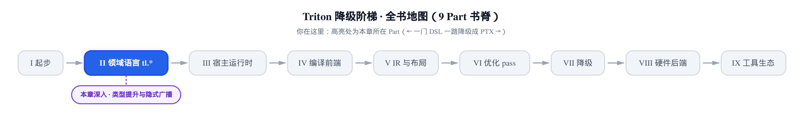
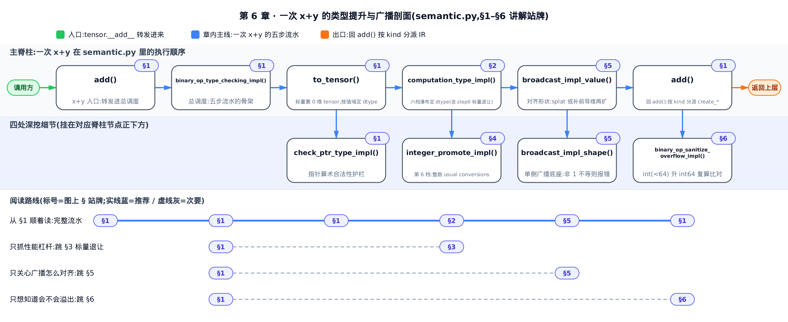
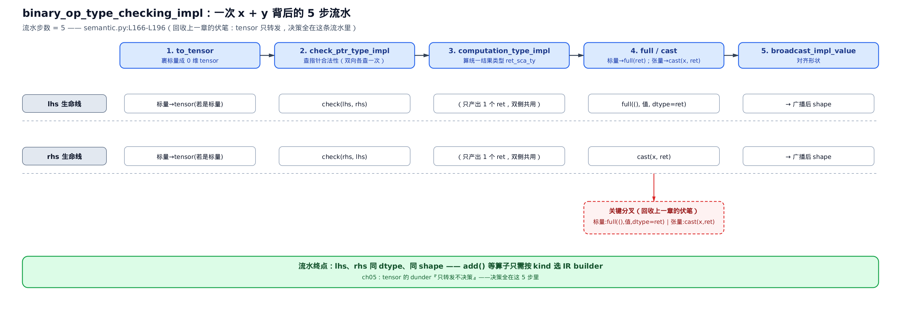
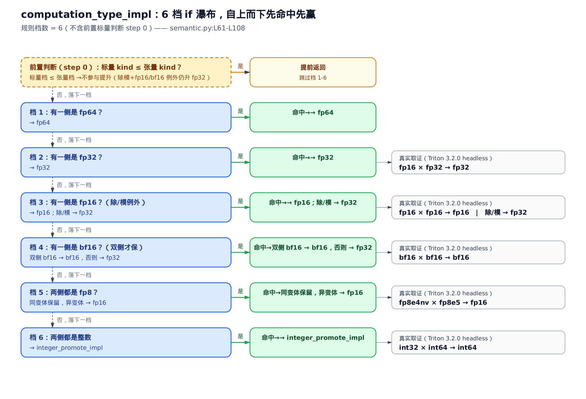
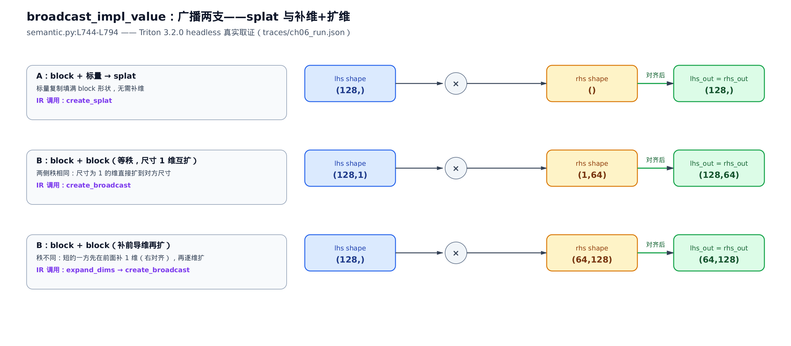

# 类型提升与隐式广播：每个 x+y 背后的语义规则

> **你在这里**：全书从 DSL 一路降到 PTX，仍在「领域语言 tl.\*」这部分。
> 上一章：一个值的类型长什么样、`cast` 是真开销。
> 本章：每个 `x + y` 背后，两个 dtype 怎么对齐、结果什么类型。
> 下一章：造块、形状变换与访存。



[第 5 章](../../ch05-type-system-and-tensor/narrative/chapter.md)结尾埋了一个扣子：`tensor`（提货单，记着「IR 里某个值」＋「那个值的类型」）身上那约四十个魔术方法**只转发、不决策**——你写 `x + y`，`tensor.__add__` 只是把两个操作数原样递进 `semantic` 层，真正干活的在别处。别处是哪？就是本章。所有决策都住在同一个文件 `python/triton/language/semantic.py` 里——这一层是整个 Triton 前端**最纯 Python、也最反直觉**的深水区：没有一行 IR、没有一次访存，全是「两个类型相遇产出什么」的类型代数。

**本章要解锁的性能杠杆，是看穿隐式类型提升。** 一个最常踩的坑：你手里一块 `fp16` 张量（半精度，每元素 2 字节），随手加一个 Python 写死的浮点常量 `0.5`。直觉上结果还是 `fp16`——可如果规则设计得糙，这个常量会把整块悄悄拔高成 `fp32`（每元素 4 字节）：带宽翻倍、寄存器占用翻倍，还平白多一次 `cast`。看懂本章你就知道，Triton 到底怎么判「常量该不该拔高张量」，以及你该怎么写标量，才能主动把这次无谓的 upcast 摁下去。这正是上一章那句「避免无谓 `cast`」第一次落到现金——不是空口号，是 `computation_type_impl` 里一个具体的 `if` 分支。



只想抓性能杠杆那一条，直接跳「§3 标量退让」；想搞清 `x + y` 的完整流水，从 §1 顺着读；只关心广播怎么对齐形状，跳「§5 广播两支」；想知道 `x + y` 会不会整数溢出，看「§6 整数溢出检查」。

## §1 一次 x+y 的完整流水：add 只是转发的落点

**直觉**。你写 `a + b`，脑子里以为是「取两个数、相加」。真相是：在建 IR 之前，Triton 要先答四个问题——谁是裸标量得先裹成张量？指针参与算术合法吗？两侧统一成什么 dtype？形状怎么对齐？答完这四问，两个操作数才变成「同 dtype、同 shape」的一对，最后才轮到「按类型选一条真正的加法指令」。这条流水有五步，`add` 本身只做最后一步的分派，前四步全托付给一个叫 `binary_op_type_checking_impl` 的总调度。

**机制**。先看 `tensor.__add__` 转发进来的落点 `add`。上一章说魔术方法「只转发不决策」，这里就是它转发到的第一站：

```python
# python/triton/language/semantic.py:L218-L242
def add(input: tl.tensor | numbers.Number, other: tl.tensor | numbers.Number, sanitize_overflow: bool,
        builder: ir.builder) -> tl.tensor:
    input, other = binary_op_type_checking_impl(input, other, builder, True, True)
    input_scalar_ty = input.type.scalar
    other_scalar_ty = other.type.scalar
    # … 省略：ptr+ptr 报错、offset+ptr 交换成 ptr+offset 的指针算术支线 …
    if input_scalar_ty.is_ptr():
        return tl.tensor(builder.create_addptr(input.handle, other.handle), input.type)
    # float + float
    elif input_scalar_ty.is_floating():
        return tl.tensor(builder.create_fadd(input.handle, other.handle), input.type)
    # int + int
    elif input_scalar_ty.is_int():
        if sanitize_overflow:
            binary_op_sanitize_overflow_impl(input, other, builder, add)
        return tl.tensor(builder.create_add(input.handle, other.handle), input.type)
    raise TypeError(f"unexpected type {input_scalar_ty}")
```

第一行 `binary_op_type_checking_impl(...)` 是全部重量所在——它一回来，`input` 和 `other` 已经是**同 dtype、同 shape** 的一对了。剩下的 `add` 只做一件轻活：看操作数的 `scalar`（标量类型，即剥掉 block 壳后的元素 dtype）是指针、浮点还是整数，分别落 `create_addptr` ／ `create_fadd` ／ `create_add` 三条不同的 IR builder 调用（`builder` 是搭 IR 的构造器，上一章见过）。指针算术是下一章访存专题的事，本章只跟着浮点和整数这两支走。

那条总调度 `binary_op_type_checking_impl` 长这样：

```python
# python/triton/language/semantic.py:L166-L196
def binary_op_type_checking_impl(lhs: tl.tensor | numbers.Number, rhs: tl.tensor | numbers.Number, builder: ir.builder,
                                 allow_lhs_ptr=False, allow_rhs_ptr=False, arithmetic_check=True,
                                 div_or_mod=False) -> Tuple[tl.tensor, tl.tensor]:
    lhs_is_scalar = isinstance(lhs, numbers.Number)
    rhs_is_scalar = isinstance(rhs, numbers.Number)
    if lhs_is_scalar:
        lhs_scalar = lhs
        lhs = to_tensor(lhs, builder)
    if rhs_is_scalar:
        rhs_scalar = rhs
        rhs = to_tensor(rhs, builder)

    # implicit typecasting
    lhs_sca_ty = lhs.type.scalar
    rhs_sca_ty = rhs.type.scalar
    check_ptr_type_impl(lhs_sca_ty, rhs_sca_ty, allow_lhs_ptr)
    check_ptr_type_impl(rhs_sca_ty, lhs_sca_ty, allow_rhs_ptr)
    if arithmetic_check and not lhs_sca_ty.is_ptr() and not rhs_sca_ty.is_ptr():
        ret_sca_ty = computation_type_impl(lhs_sca_ty, lhs_is_scalar, rhs_sca_ty, rhs_is_scalar, div_or_mod)
        # … 省略：负标量遇 unsigned 结果类型报错的护栏 …
        lhs = full(
            (), lhs_scalar, dtype=ret_sca_ty, builder=builder) if lhs_is_scalar else cast(lhs, ret_sca_ty, builder)
        rhs = full(
            (), rhs_scalar, dtype=ret_sca_ty, builder=builder) if rhs_is_scalar else cast(rhs, ret_sca_ty, builder)

    # implicit broadcasting
    lhs, rhs = broadcast_impl_value(lhs, rhs, builder)
    return lhs, rhs
```

五步一步不落，正是本章的骨架：

1. **裹标量**：`isinstance(x, numbers.Number)` 判定谁是裸的 Python 标量；是标量的先 `to_tensor` 裹成 0 维张量，同时用 `lhs_scalar` ／ `rhs_scalar` 记住原始值，留着后面重建。
2. **查指针**：`check_ptr_type_impl` 两个方向各查一次，拦掉「指针 + 浮点」这类非法组合。
3. **算类型**：`computation_type_impl` 拿两侧 scalar dtype，产出统一的结果类型 `ret_sca_ty`——这是本章核心，§2 专讲。
4. **统一**：这里有个关键分叉——标量走 `full((), lhs_scalar, dtype=ret_sca_ty)` 直接**按结果类型重建**一个常量，张量才走 `cast(x, ret_sca_ty)` 转档。
5. **对齐形状**：`broadcast_impl_value` 把两侧广播到同一 shape，§5 专讲。



*图：一次 `x + y` 的五步流水。关键分叉在第 4 步——标量用 `full` 按结果类型直接重建，省去「先按值域裹成 `int32`、再 `cast` 到结果类型」的中间一跳；张量才走 `cast`。走完这条，`add` 拿到的是同 dtype、同 shape 的一对，只需按类型选一条 IR 指令。这就是上一章「`tensor` 只转发不决策」的答案：决策全在这五步里。*

第 4 步为什么标量走 `full` 而不走 `cast`？因为标量本来就还是「一个 Python 数值」——直接用目标类型重新造一个常量，比「先按值域裹成某个中间 dtype、再 `cast` 到结果类型」少一跳。这个细节在下一节 §3 会变成实打实的性能差别。

**这条流水两头的两个小工具**，顺手在这节收掉。

第一步的 `to_tensor`，把裸 Python 标量裹成 0 维张量、并按值域定 dtype：

```python
# python/triton/language/semantic.py:L111-L146
def to_tensor(x, builder, check_type: bool = True):
    if isinstance(x, bool):
        return tl.tensor(builder.get_int1(x), tl.int1)
    # Note: compile-time const integers are represented by unsigned values
    elif isinstance(x, int):
        if -2**31 <= x < 2**31:
            dtype = tl.int32
        elif 2**31 <= x < 2**32:
            dtype = tl.uint32
        elif -2**63 <= x < 2**63:
            dtype = tl.int64
        elif 2**63 <= x < 2**64:
            dtype = tl.uint64
        else:
            raise ValueError(f'Nonrepresentable integer {x}.')
        return full((), x, dtype=dtype, builder=builder)
    elif isinstance(x, float):
        min_float32 = 2**-126
        max_float32 = (2 - 2**-23) * 2**127
        abs_x = __builtins__['abs'](x)
        if abs_x == float("inf") or\
           abs_x == 0.0 or \
           x != x or \
           min_float32 <= abs_x <= max_float32:
            dtype = tl.float32
        else:
            dtype = tl.float64
        return full((), x, dtype=dtype, builder=builder)
    # … 省略：constexpr 递归解包到 .value、tensor 原样返回两支 …
```

规则很直白：`bool` → `int1`（1 bit 整数，Triton 的布尔）；整数按落在哪个区间贴 `int32` ／ `uint32` ／ `int64` ／ `uint64`；浮点按绝对值能不能塞进 `fp32` 值域，贴 `fp32`、否则 `fp64`（`x != x` 那一支是判 NaN——NaN 不等于自己，也算 `fp32`）。喂六个代表性标量进去，真实产出：

<!-- trace: m06-to-tensor -->

| Python 值 | 落入区间（源码 L116-L138） | dtype | 是否 block |
|---|---|---|---|
| `5` | `[-2147483648, 2147483648)` → int32 段 | `int32` | 否 |
| `3000000000` | `[2147483648, 4294967296)` → uint32 段 | `uint32` | 否 |
| `5000000000` | `[4294967296, 9223372036854775808)` → int64 段 | `int64` | 否 |
| `True` | bool 分支 | `int1` | 否 |
| `3.5` | ⎮x⎮ 落 fp32 值域 | `fp32` | 否 |
| `1e300` | ⎮x⎮ 超 max_float32 → fp64 | `fp64` | 否 |

*表：`to_tensor` 直调真实产出（Triton 3.2.0 headless）。注意最常见的常量 `5` 和 `3.5` 分别落 `int32` ／ `fp32`——这个「初始 dtype 已知」的事实，是下一节「标量退让」能比较档次的前提。* 整数四段区间互斥且覆盖 `` $`[-2^{63},\ 2^{64})`$ ``，超出就直接 `ValueError`——所以 `to_tensor` 对任意可表示的标量，返回的一定是 0 维（非 block）张量，dtype 由值域唯一决定。

第二步的 `check_ptr_type_impl`，是指针算术的一道护栏，本章一句带过：

```python
# python/triton/language/semantic.py:L154-L163
def check_ptr_type_impl(type_a: tl.dtype, type_b: tl.dtype, allow_ptr_a: bool) -> None:
    if type_a.is_ptr():
        if not allow_ptr_a:
            raise IncompatibleTypeErrorImpl(type_a, type_b)
        # T* + U* with T != U
        if type_b.is_ptr() and (type_a != type_b):
            raise IncompatibleTypeErrorImpl(type_a, type_b)
        # T* + float
        if type_b.is_floating():
            raise IncompatibleTypeErrorImpl(type_a, type_b)
```

它只拦三种：不允许指针时冒出指针、两个异类指针相加（`T*` + `U*`）、指针加浮点。加法允许 `ptr + offset`，所以 `add` 调它时 `allow` 传的是 `True`，把真正的「指针 + 指针」报错留到了 `add` 自己里。这一步的存在，是为了让第 3 步「算类型」只需要面对**非指针**的纯数值类型——下面就进那一步。

## §2 六档瀑布：两个 dtype 相遇产出什么

**直觉**。两种货币相遇，先得换成一种能容纳彼此的「共同货币」：谁的表达范围更大（精度更高、位更宽），就都换成谁——`fp64` 压过 `fp32`，`fp32` 压过 `fp16`。`computation_type_impl` 就是这张汇率表，写成一串从最贵的 `fp64` 往下问的 `if` 瀑布：**先命中先成交，命中即返回**。加上最前面一道「标量特判」，一共是「1 道特判 + 6 档规则」。

**机制**。整段规则原样在此，它是本章唯一必须整体读透的一块：

```python
# python/triton/language/semantic.py:L61-L108
def computation_type_impl(a_ty: tl.dtype, a_is_scalar: bool, b_ty: tl.dtype, b_is_scalar: bool,
                          div_or_mod: bool) -> tl.dtype:
    # 0) For scalars we follow semantics similar to PyTorch, namely:
    # - If the scalar is of a lower or equal kind (bool < uint < int < fp),
    #   it doesn't participate in the pomotion
    if a_is_scalar != b_is_scalar:
        scalar_ty, tensor_ty = (a_ty, b_ty) if a_is_scalar else (b_ty, a_ty)
        if scalar_ty.kind().value <= tensor_ty.kind().value:
            # Upcast because of 3) and 4) below!
            if div_or_mod and (tensor_ty in (tl.float16, tl.bfloat16)):
                return tl.float32
            return tensor_ty

    # 1) if one operand is double, the other is implicitly
    #    converted to double
    if a_ty.is_fp64() or b_ty.is_fp64():
        return tl.float64
    # 2) if one operand is float, the other is implicitly
    #    converted to float
    if a_ty.is_fp32() or b_ty.is_fp32():
        return tl.float32
    # 3 ) if one operand is half, the other is implicitly converted to half
    #     unless we're doing / or %, which do not exist natively in PTX for fp16.
    #     Supported PTX op: add, sub, mul, fma, neg, abs, min, max, tanh, ex2, setp
    if a_ty.is_fp16() or b_ty.is_fp16():
        if div_or_mod:
            return tl.float32
        else:
            return tl.float16
    # 4) return bf16 only if both operands are of bf16
    if a_ty.is_bf16() or b_ty.is_bf16():
        if div_or_mod:
            return tl.float32
        if a_ty.is_bf16() and b_ty.is_bf16():
            return tl.bfloat16
        return tl.float32
    # 5) return fp16 if operands are different fp8
    if a_ty.is_fp8() and b_ty.is_fp8():
        return a_ty if a_ty == b_ty else tl.float16
    if not a_ty.is_int() or not b_ty.is_int():
        raise TypeError(f"unexpected type {a_ty} and {b_ty}")
    # 6 ) both operands are integer and undergo
    #    integer promotion
    if div_or_mod and a_ty.int_signedness != b_ty.int_signedness:
        raise TypeError("Cannot use /, #, or % with " + a_ty.__repr__() + " and " + b_ty.__repr__() +
                        " because they have different signedness;"
                        "this is unlikely to result in a useful answer. Cast them to the same signedness.")
    return integer_promote_impl(a_ty, b_ty)
```

`div_or_mod` 是个开关：加减乘传 `False`，除 ／ 取模传 `True`。它在好几档里都拐了个弯，原因写在档 3 的注释里——**PTX 没有原生的 `fp16` ／ `bf16` 除法**（PTX 是 NVIDIA 的虚拟汇编，Triton 最终要降到它），所以只要是除 ／ 模，`fp16` ／ `bf16` 一律升 `fp32` 绕过去。注释还顺手列了 `fp16` 在 PTX 上有原生支持的 op：`add` ／ `sub` ／ `mul` ／ `fma` 等——这些才保得住半精度。

六档从高到低是：`fp64`（档 1）→ `fp32`（档 2）→ `fp16`，除模除外（档 3）→ `bf16`，双侧才保（档 4）→ 异 `fp8` 升 `fp16`（档 5）→ 整数提升（档 6）。喂八组代表性 dtype 对进真函数，逐档命中：

<!-- trace: m06-computation-type -->

| 命中档 | 左操作数 | 右操作数 | 除/模？ | 结果 dtype | 为什么 |
|---|---|---|---|---|---|
| 档 2 | `fp16` | `fp32` | 否 | `fp32` | 一侧是 fp32 → 整体升 fp32 |
| 档 3 | `fp16` | `fp16` | 否 | `fp16` | 一侧是 fp16 且非除模 → 保 fp16 |
| 档 4 | `bf16` | `fp8e5` | 否 | `fp32` | 有 bf16 但非双侧 bf16 → 保守升 fp32 |
| 档 4 | `bf16` | `bf16` | 否 | `bf16` | 两侧都 bf16 才保 bf16 |
| 档 5 | `fp8e4nv` | `fp8e5` | 否 | `fp16` | 两个不同 fp8 变体 → 升 fp16 再算 |
| 档 5 | `fp8e5` | `fp8e5` | 否 | `fp8e5` | 同一 fp8 变体 → 保留自身 |
| 档 6 | `int32` | `int64` | 否 | `int64` | 整数走 usual arithmetic conversions，取更宽 |
| 档 3 | `fp16` | `fp16` | 是 | `fp32` | PTX 无原生 fp16 除/模 → 除模一律升 fp32 |

*表：`computation_type_impl` 直调真实产出（Triton 3.2.0 headless）。*



*图：六档瀑布自上而下，先命中先返回。最上面那道虚线框是「标量退让」特判（下一节讲）；进入正式六档后，`fp16` 只要一侧就保 `fp16`，`bf16` 却要双侧才保——这条**不对称**正是 `bf16` 和别的浮点混算时悄悄升 `fp32` 的根因（表里第 3 行 `bf16 × fp8e5 → fp32` 就是它）。*

这里点破两处最反直觉的设计：

- **`fp16` 与 `bf16` 不对称**。档 3 只要一侧 `fp16` 就返回 `fp16`；档 4 却要求**两侧都是** `bf16` 才返回 `bf16`，否则升 `fp32`。原因是 `bf16`（brain float 16，尾数只有 7 bit）和别的非标准浮点混用时，精度语义不清，Triton 保守地升 `fp32`。所以 `bf16 + fp16`、`bf16 + fp8` 都会给你一个 `fp32`——你以为省了带宽，实际结果比谁都宽。
- **异 `fp8` 无法直接算**。档 5：两个**同变体** `fp8` 保留自身，两个**不同变体**（如 `fp8e4nv` 和 `fp8e5`，指数位 ／ 偏置各异，[第 5 章](../../ch05-type-system-and-tensor/narrative/chapter.md)讲过 fp8 家族）没有共同的 `fp8` 表示，统一升 `fp16` 再算。

**不变量**。`computation_type_impl` 是两侧 dtype 的**确定性函数**：档位从 `fp64` 向整数单调下行，每档是覆盖性判定，不命中就短路落下一档，最后整数档由 `integer_promote_impl` 把 signedness × rank 全枚举收敛。没有 fall-through、没有循环——有限档必停、结果唯一。而且它跟 dtype 种类数无关：不管你有多少种 `fp8` 变体、多少档整数，规则永远是这 6 个常数分支，判定是 O(1)。

## §3 标量退让：性能杠杆就在这一步

**直觉**。把 Python 写死的常量想成「零钱」，张量是一整叠钞票。你手里一叠 `fp16`，加一个常量 `0.5`：Triton 认得它是零钱（`is_scalar` 为真），就把零钱按 `fp16` 重铸，整叠还是 `fp16`——不会因为一个常量把整块抬到 `fp32`。但如果你先把这个常量**物化**成一个真的 `fp32` 张量（比如 `tl.full((), 0.5, tl.float32)`），它就有了逼你升级的资格，整块被拉到 `fp32`。这就是本章的性能杠杆所在。

**机制**。回看 §2 那段代码最上面的特判（档 0），单独拎出来：

```python
# python/triton/language/semantic.py:L66-L72
if a_is_scalar != b_is_scalar:
    scalar_ty, tensor_ty = (a_ty, b_ty) if a_is_scalar else (b_ty, a_ty)
    if scalar_ty.kind().value <= tensor_ty.kind().value:
        # Upcast because of 3) and 4) below!
        if div_or_mod and (tensor_ty in (tl.float16, tl.bfloat16)):
            return tl.float32
        return tensor_ty
```

判据是 `scalar_ty.kind().value <= tensor_ty.kind().value`。`kind()` 把类型分三档：`BOOLEAN`(0) < `INTEGRAL`(1) < `FLOATING`(2)（源码注释里写的 `bool < uint < int < fp` 是更细的心智模型，但 `kind().value` 只分这三档，uint 和 int 都归 `INTEGRAL`）。含义是：**只有当标量的档次不高于张量时，才让标量不参与提升，直接返回张量的类型**。`int` 标量加 `fp16` 张量，`int` 的 kind 是 `` $`1 \le 2`$ ``，标量退让 → 结果 `fp16`；但 `fp` 标量加 `int` 张量，`fp` 的 kind 是 `` $`2 > 1`$ ``，标量不退让 → 落到后面档位按 `fp` 升。

看同一个 `fp32` 常量的两种身份对照——这张表是本章的核心证据：

<!-- trace: m06-scalar-nonpromote -->

| 张量侧 | 另一侧 | 除/模？ | 张量 kind | 另侧 kind | 结果 dtype | 解读 |
|---|---|---|---|---|---|---|
| `fp16` 张量 | `fp32` 标量 | 否 | 2 | 2 | `fp16` | 标量 kind ≤ 张量 kind → 标量退让，保 fp16 |
| `fp16` 张量 | `fp32` 张量（物化） | 否 | 2 | 2 | `fp32` | 非标量，档 0 不触发，落档 2 整块升 fp32 |
| `fp16` 张量 | `int` 标量 | 否 | 2 | 1 | `fp16` | int 标量 kind 1 ≤ 2 → 退让，仍 fp16 |
| `int32` 张量 | `fp32` 标量 | 否 | 1 | 2 | `fp32` | fp 标量 kind 2 > 1，不退让 → 升 fp32 |
| `fp16` 张量 | `fp32` 标量 | 是 | 2 | 2 | `fp32` | 除模例外：张量是 fp16/bf16 时标量档也升 fp32 |

*表：`computation_type_impl` 直调真实产出（Triton 3.2.0 headless）。*

盯住**第 1 行和第 2 行**：两者都是 `fp32` 和 `fp16` 相遇、两侧 kind 都是 2，唯一的变量是 `is_scalar`——一个是标量常量、一个被物化成了真张量。产出却是 `fp16` vs `fp32`。这就证明了：**分岔完全由标量身份决定**，跟数值本身、跟类型档次都无关。

**这一行差别值多少钱**？`fp16` 每元素 2 字节，误升 `fp32` 就是 4 字节——带宽和寄存器占用当场翻倍，还多一次 `cast`。回想 §1 第 4 步的分叉：走标量退让这条路，常量用 `full((), 0.5, dtype=fp16)` 直接按 `fp16` 重建，一次转换都不发；一旦物化成 `fp32` 张量，就得整块 `cast` 上去。这正是[第 5 章](../../ch05-type-system-and-tensor/narrative/chapter.md)那句「避免无谓 `cast`」第一次兑现现金：**看懂这条规则，你写 kernel 时就会主动让常量保持标量身份**（直接写字面量 `x + 0.5`，而不是先造一个 `fp32` 的 `tl.full` 再加），把这次隐式 upcast 摁在源头。

**不变量**。当 `scalar_ty.kind().value <= tensor_ty.kind().value` 时，结果恒等于 `tensor_ty`（标量不改变张量档次），唯一例外是「`div_or_mod` 且张量为 `fp16` ／ `bf16`」——那时连标量档也得升 `fp32`，还是因为 PTX 没有原生半精度除法（表里第 5 行）。

## §4 整数提升：C 语言的老规矩

**直觉**。两个整数容器相加，先看谁的桶更大（位宽）：同号就用大桶；一个有符号、一个无符号时，按 C 语言「usual arithmetic conversions（惯常算术转换）」的老规矩——无符号桶只要不比有符号桶小，就用无符号。这一档 Triton **不自造规则**，直接对齐 C ／ PyTorch，省得给读者又添一套心智负担。

**机制**。第 6 档落到这个纯函数：

```python
# python/triton/language/semantic.py:L45-L58
def integer_promote_impl(a_ty: tl.dtype, b_ty: tl.dtype) -> tl.dtype:
    a_rank = a_ty.int_bitwidth
    b_rank = b_ty.int_bitwidth
    a_sn = a_ty.int_signedness
    b_sn = b_ty.int_signedness
    # Rules for signedness taken from "Usual arithmetic conversions" on
    # https://en.cppreference.com/w/c/language/conversion.
    if a_sn == b_sn:
        return a_ty if a_rank > b_rank else b_ty
    elif a_sn == tl.dtype.SIGNEDNESS.UNSIGNED:
        return a_ty if a_rank >= b_rank else b_ty
    elif b_sn == tl.dtype.SIGNEDNESS.UNSIGNED:
        return b_ty if b_rank >= a_rank else a_ty
    raise TypeError(f"unexpected signedness {a_sn} and {b_sn}")
```

`int_bitwidth`（整数位宽，源码把它当 rank 用）定桶的大小，`int_signedness`（有 ／ 无符号）定用哪条分支。同号取 rank 大者；异号时，无符号那侧的 rank 只要 `` $`\ge`$ `` 有符号侧，就取无符号，否则取有符号。喂四组进去：

<!-- trace: m06-integer-promote -->

| a | a 位宽 | a 符号 | b | b 位宽 | b 符号 | 结果 | 命中规则 |
|---|---|---|---|---|---|---|---|
| `int32` | 32 | signed | `int64` | 64 | signed | `int64` | 同号 → 取更宽 rank |
| `uint32` | 32 | unsigned | `int32` | 32 | signed | `uint32` | 异号，unsigned rank ≥ signed → 取无符号 |
| `int8` | 8 | signed | `uint8` | 8 | unsigned | `uint8` | 异号，unsigned rank ≥ signed → 取无符号 |
| `int16` | 16 | signed | `int32` | 32 | signed | `int32` | 同号 → 取更宽 rank |

*表：`integer_promote_impl` 直调真实产出（Triton 3.2.0 headless）。*

最容易踩的是**第 2 行**：`uint32` 和 `int32` rank 相等（都是 32），按异号规则取无符号 → `uint32`。很多人以为「有符号更保险、会取有符号」，其实反了。顺带一提：`computation_type_impl` 档 6 在进这个函数前还拦了一道——除 ／ 模且两侧符号不同直接报错，因为「无符号除有符号」几乎不可能是你想要的结果。

**不变量**。这条规则保证结果位宽一定 `` $`\ge`$ `` 两侧位宽的最大值（同号取大者、异号两分支也都不缩窄位宽），四种符号组合全枚举、无 fall-through，确定且终止。四种符号组合是常数枚举，判定与操作数宽度无关，恒为 O(1)。

## §5 广播两支：splat 与补维

**直觉**。两个形状不一样的张量要逐元素相加，得先对齐。分两支：一方是标量——把它复制铺满对方的每个格子（splat，即「泼满」）；两方都是块但维数不齐——给短的一方**前面补 1 维**（右对齐，像数字右对齐补零），再把尺寸为 1 的维拉伸到对方尺寸。

**机制**。流水第 5 步的 `broadcast_impl_value`，就是这两支的实现主体：

```python
# python/triton/language/semantic.py:L744-L794
def broadcast_impl_value(lhs: tl.tensor, rhs: tl.tensor, builder: ir.builder) -> tl.tensor:
    lhs_ty = lhs.type
    rhs_ty = rhs.type

    # make_shape_compatible(block, scalar)
    if lhs_ty.is_block() and not rhs_ty.is_block():
        rhs_ty = tl.block_type(rhs_ty.scalar, lhs_ty.shape)
        rhs = tl.tensor(builder.create_splat(rhs.handle, lhs_ty.get_block_shapes()), rhs_ty)
    # make_shape_compatible(scalar, block)
    elif not lhs_ty.is_block() and rhs_ty.is_block():
        lhs_ty = tl.block_type(lhs_ty.scalar, rhs_ty.shape)
        lhs = tl.tensor(builder.create_splat(lhs.handle, rhs_ty.get_block_shapes()), lhs_ty)
    # make_shape_compatible(block, block)
    elif lhs_ty.is_block() and rhs_ty.is_block():
        lhs_shape = lhs_ty.get_block_shapes()
        rhs_shape = rhs_ty.get_block_shapes()

        if len(lhs_shape) < len(rhs_shape):
            # Add new axes to lhs
            for _ in range(len(lhs_shape), len(rhs_shape)):
                lhs = tl.tensor(builder.create_expand_dims(lhs.handle, 0),
                                tl.block_type(lhs_ty.scalar, [1] + lhs_shape))
                lhs_ty = lhs.type
                lhs_shape = lhs_ty.get_block_shapes()
        elif len(rhs_shape) < len(lhs_shape):
            # Add new axes to rhs
            for _ in range(len(rhs_shape), len(lhs_shape)):
                rhs = tl.tensor(builder.create_expand_dims(rhs.handle, 0),
                                tl.block_type(rhs_ty.scalar, [1] + rhs_shape))
                rhs_ty = rhs.type
                rhs_shape = rhs_ty.get_block_shapes()
        assert len(rhs_shape) == len(lhs_shape)

        ret_shape = []
        for i, left in enumerate(lhs_shape):
            right = rhs_shape[i]
            if left == 1:
                ret_shape.append(right)
            elif (right == 1) or (right == left):
                ret_shape.append(left)
            else:
                raise ValueError("Cannot make_shape_compatible: incompatible dimensions "
                                 "at index " + str(i) + ": " + str(left) + " and " + str(right))
        if lhs_shape != ret_shape:
            ret_ty = tl.block_type(lhs_ty.scalar, ret_shape)
            lhs = tl.tensor(builder.create_broadcast(lhs.handle, ret_shape), ret_ty)
        if rhs_shape != ret_shape:
            ret_ty = tl.block_type(rhs_ty.scalar, ret_shape)
            rhs = tl.tensor(builder.create_broadcast(rhs.handle, ret_shape), ret_ty)
    # (scalar, scalar) => returns original blocks
    return lhs, rhs
```

代码块里的 `# make_shape_compatible(block, scalar)` 等注释只是**说明性标签**、不是真的函数调用——它们标出下面三个分支各自处理的局面：标量广播、标量配 block、两个 block 补维再扩。**block + 标量**：标量走 `create_splat`（IR 里的「复制填满」op），一步铺满 block 的 shape，不补维。**block + block**：先补维——秩小的一侧用 `create_expand_dims(..., 0)` 在**最前面**插一个尺寸 1 的维（`[1] + lhs_shape`），循环补到两侧等秩；再逐维定 `ret_shape`——某维 `left == 1` 取对方、`right == 1` 或两者相等取 `left`、否则报错；最后两侧各自 `create_broadcast` 扩到 `ret_shape`。**两个 0 维标量**：仨分支都不进，原样返回。

喂三组 shape 对进去，覆盖三种走法：

<!-- trace: m06-broadcast-value -->

| lhs shape | rhs shape | 走哪支 | lhs 出 | rhs 出 |
|---|---|---|---|---|
| `(128,)` | `()` 标量 | splat 复制填满 | `(128,)` | `(128,)` |
| `(128,1)` | `(1,64)` | 等秩，尺寸 1 维互扩 `create_broadcast` | `(128,64)` | `(128,64)` |
| `(128,)` | `(64,128)` | 补前导维（`expand_dims` 右对齐）再 broadcast | `(64,128)` | `(64,128)` |

*表：`broadcast_impl_value` 直调真实产出（Triton 3.2.0 headless）。*



*图：两支广播。左路标量 `splat` 一步铺满 block 形状，无需补维；右路两个块先右对齐补 1 维、再把尺寸 1 的维拉伸对齐。看第 3 行——`(128,)` 与 `(64,128)` 相加时，前者先补成 `(1,128)`（补在**前导**），才扩到 `(64,128)`。补维永远补在前面，这是右对齐的直接后果。*

**不变量**。`broadcast_impl_value` 输出两张量 shape 相同且唯一确定：补维只在前导补 1，扩维只发生在尺寸为 1 的维，非 1 且不等则报错。补维循环把秩补齐到 `max(rank)`（次数 = 秩差，有限必停），逐维 `ret` 规则让每维尺寸唯一，两侧各自 `create_broadcast` 到同一 `ret_shape` → 形状必然相同。复杂度：block-scalar 是 O(1) 的语义复制，block-block 是 O(rank) 的逐维判定。

**那道「非 1 且不等就报错」的闸门，最终落在哪**？落在它的底座 `broadcast_impl_shape`——「单侧广播到一个给定 shape」：

```python
# python/triton/language/semantic.py:L726-L741
def broadcast_impl_shape(input: tl.tensor, shape: List[int], builder: ir.builder) -> tl.tensor:
    if not input.type.is_block():
        ret_ty = tl.block_type(input.type, shape)
        return tl.tensor(builder.create_splat(input.handle, shape), ret_ty)
    src_shape = input.type.get_block_shapes()
    if len(src_shape) != len(shape):
        raise ValueError(f"Cannot broadcast, rank mismatch: {src_shape}, {shape}")
    if shape == src_shape:
        return input
    for i, item in enumerate(src_shape):
        if shape[i] != item and item != 1:
            raise ValueError(f"Cannot broadcast, the expanded size of the tensor ({shape[i]})"
                             f" must match the existing size ({item}) at non-singleton dimension"
                             f" {i}: {src_shape}, {shape}")
    ret_ty = tl.block_type(input.type.scalar, shape)
    return tl.tensor(builder.create_broadcast(input.handle, shape), ret_ty)
```

核心就是那个循环里的判据 `shape[i] != item and item != 1`：目标某维和源维不等、而源维又不是 1（不是「单例维」），立即 `ValueError`。翻译成人话——**尺寸为 1 的维可以拉成任意大（像橡皮筋），但尺寸已是 2、3 这种「非 1」的维不能改，要么正好等于目标，要么报错**。非 block 输入（标量）则无条件 `create_splat` 填满。两组对照：

<!-- trace: m06-broadcast-shape -->

| 源 shape | 目标 shape | 逐维判定 | 结果 |
|---|---|---|---|
| `(1,64)` | `(128,64)` | 维 0：src=1 可扩 → 128；维 1：64=64 保留 | `(128,64)` 合法 |
| `(2,64)` | `(128,64)` | 维 0：src=2 且 2≠128、2≠1 → 报错 | `ValueError`：非单例维尺寸必须匹配 |

*表：`broadcast_impl_shape` 直调真实产出（Triton 3.2.0 headless）。* 合法样例只扩了维 0，非法样例因维 0 是非单例的 `2` 又不等 `128`，当场中止。这一层解释了为什么你在 kernel 里把 `(2, 64)` 硬广播到 `(128, 64)` 会直接抛异常，而不是给你一个悄悄错位的结果。

**不变量**。判据 `shape[i] != item and item != 1` 只放行「源维等于目标维 或 源维是单例 1」两种情形，其余一律 `ValueError`——输出 shape 唯一确定、绝不静默出错。逐维扫一遍即判完，复杂度 O(rank)。

## §6 整数溢出检查：升 int64 复算比对

**直觉**。`int8` 只能装 `` $`[-128,\ 127]`$ ``。`100 + 100 = 200` 早就爆桶了，硬件加法会悄悄回绕成负数、不报错。`binary_op_sanitize_overflow_impl` 的办法：先把两个数升到 `int64`（桶大到装得下真值），算出真的 `200`，再回头看它是否还在 `int8` 的界内——不在就发一个 `device_assert`（设备侧断言，运行到 GPU 上才触发）报警。这就是[第 1 章](../../ch01-what-is-triton/narrative/chapter.md)里见过的 `add(sanitize_overflow=True)` 在 `semantic` 层的落点——那时你看到追踪期 IR 里冒出一串 `extsi` ／ `cmpi` ／ `andi` 消毒 op，源头就是这个函数。

**机制**。回到 §1 那段 `add`：`int + int` 分支里，`if sanitize_overflow:` 时先调它：

```python
# python/triton/language/semantic.py:L199-L215
def binary_op_sanitize_overflow_impl(lhs: tl.tensor, rhs: tl.tensor, builder: ir.builder, binary_op: callable):
    if lhs.type.scalar.int_bitwidth >= 64 or not builder.options.sanitize_overflow:
        return
    lhs_sca_ty = lhs.type.scalar
    rhs_sca_ty = rhs.type.scalar
    assert lhs_sca_ty == rhs_sca_ty
    assert lhs_sca_ty.is_int()
    lhs = cast(lhs, tl.int64, builder)
    rhs = cast(rhs, tl.int64, builder)
    ret = binary_op(lhs, rhs, False, builder)
    max_value = lhs_sca_ty.get_int_max_value()
    max_value = tl.tensor(builder.get_int64(max_value), tl.int64)
    min_value = lhs_sca_ty.get_int_min_value()
    min_value = tl.tensor(builder.get_int64(min_value), tl.int64)
    cond = and_(less_equal(ret, max_value, builder), greater_equal(ret, min_value, builder), builder)
    msg = f"int{lhs_sca_ty.int_bitwidth} overflow detected for operation {binary_op.__name__}"
    device_assert(cond, msg, builder)
```

两处设计值得盯：

- **开头就短路**。`int_bitwidth >= 64`（已经是最宽的 `int64`，没有更宽的类型可以复算）或者 `sanitize_overflow` 开关没开，直接 `return`——零开销。所以这套检查只对 `int(<64)` 且开关打开时才插入。
- **复算故意关掉自身 sanitize**。`ret = binary_op(lhs, rhs, False, builder)` 里第 3 个参数传 `False`。`binary_op` 就是 `add` 自己——如果这里不关，`int64` 的复算加法又会触发一次自己的溢出检查，**死循环**。关掉它，复算就是一次纯粹的 `int64` 加法。

`get_int_max_value` ／ `get_int_min_value` 取的是**原类型**（`int8`）的上下界，不是 `int64` 的。复算出 `int64` 的真值后，和这对界限比一比，生成一个布尔 `cond`，交给 `device_assert`。喂两组进去：

<!-- trace: m06-sanitize-overflow -->

| dtype | 表达式 | int64 复算真值 | 该类型 max | 该类型 min | 在界内？ | 判定 |
|---|---|---|---|---|---|---|
| `int8` | `100+100` | 200 | 127 | -128 | 否 | `device_assert` 触发（200 > 127 溢出） |
| `int32` | `1000000+1` | 1000001 | 2147483647 | -2147483648 | 是 | 通过，不插断言开销 |

*表：`get_int_max/min_value` 取真值 + `int64` 复算比对（Triton 3.2.0 headless；`device_assert` 本身在 GPU 侧触发，headless 只能看比对结论）。*

`int8` 的 `200` 越出上界 `127` 当场被拦；`int32` 的 `1000001` 远在 `int32` 界内，直接放行。

**不变量**。为什么 `int64` 复算一定装得下？因为 `int(<64)` 的加 ／ 减 ／ 乘真值绝对值远小于 `` $`2^{63}`$ ``，`int64` 头顶空间足够、不会二次溢出——升一档复算，就把「有没有溢出」变成了一个可判定的比较。

对你写 kernel 的意义：调试期开着 `sanitize_overflow` 能逮住隐蔽的整数溢出，但每次 `int(<64)` 加减乘都会多插一次 `int64` 复算 + 一次断言，是实打实的开销——上线前该关就关。

## 小结：把每个 x+y 读成一条决策链

这一章你把「`x + y` 背后发生什么」拆到了底，也接住了上一章留的扣子——`tensor` 的魔术方法确实只转发，决策全在 `python/triton/language/semantic.py` 这一层的五步流水里：`to_tensor` 裹标量、`check_ptr_type_impl` 查指针、`computation_type_impl` 算类型、`full` ／ `cast` 统一、`broadcast_impl_value` 对齐形状。走完这条，`add` 拿到的是同 dtype、同 shape 的一对，只按类型选一条 IR 指令。

真正带走的是那本性能账。类型提升不是黑箱：`computation_type_impl` 是一串「先命中先赢」的六档瀑布，`fp16` 一侧即保、`bf16` 双侧才保的不对称，是混算悄悄升 `fp32` 的根因；整数那档直接搬 C 的 usual arithmetic conversions，异号取无符号是最容易反直觉的一格。而最值钱的一条是「标量退让」——`fp16` 张量加一个 Python 标量常量，只要标量档次不高于张量，结果就保 `fp16`，一次 `cast` 都不发。**看懂它，你下次就会让常量保持标量身份，而不是随手造一个 `fp32` 的 `tl.full` 把整块拖上去**——这就是上一章「避免无谓 `cast`」落到的第一笔现金。

广播则是形状那一侧的对齐术：block-scalar 走 `splat` 一步铺满，block-block 补前导维再逐维扩，「非 1 且不等就报错」保证结果 shape 唯一、绝不静默错位。`sanitize_overflow` 是给整数加的一道安全网，升 `int64` 复算比对——调试期抓溢出、上线期该关就关。

下一章离开「一个值 ／ 一次运算」的粒度，进入**造块、形状变换与访存**：你怎么在 kernel 里真正造出一块 `(128, 64)` 的张量、怎么算地址去 `load` ／ `store`。类型和广播都备齐了，接下来该让数据真正流动起来了。
