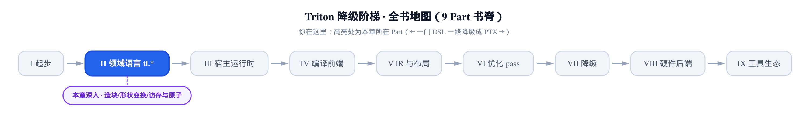
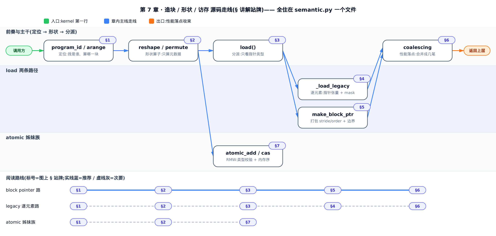
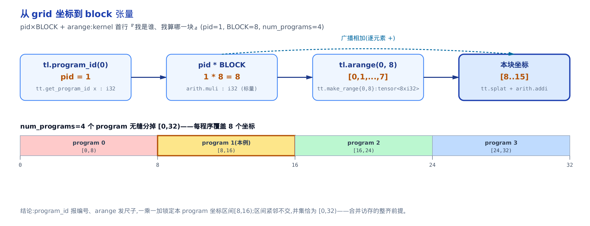
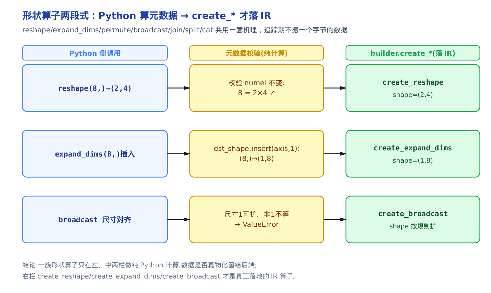
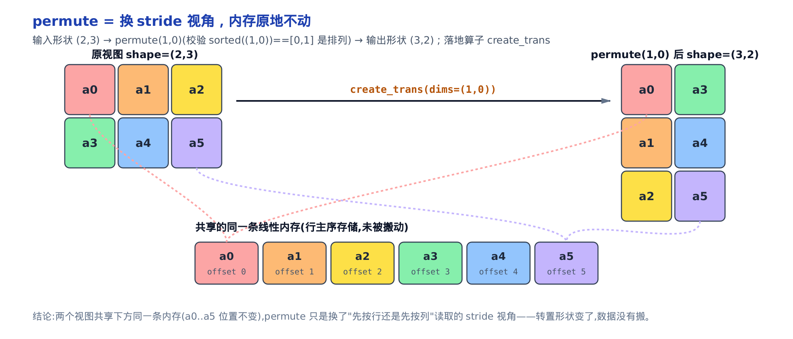
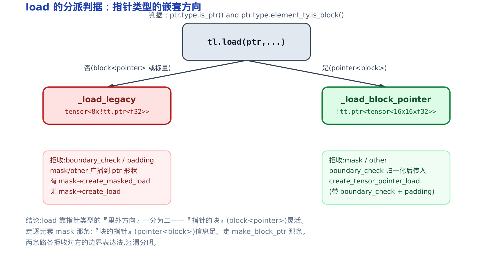
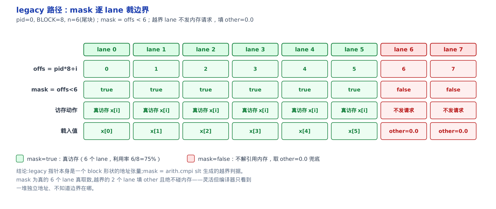
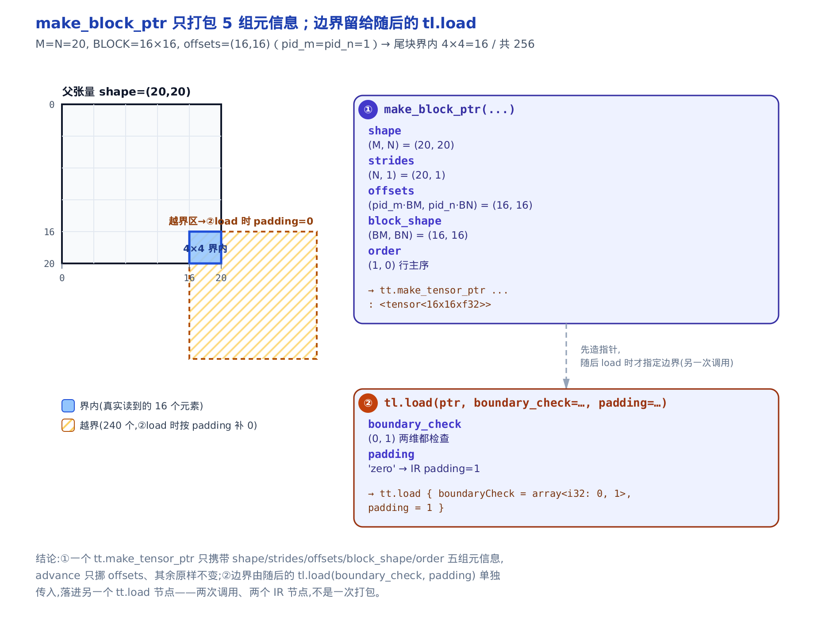
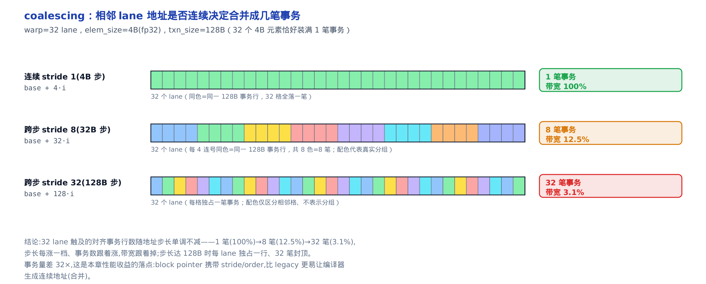

# 造块、形状变换、访存与原子操作：合并访存成不成的第一现场

> **你在这里**：全书从一门 DSL 一路降到 PTX，仍在「领域语言 tl.\*」这一部分。
> 上一章：每个 `x + y` 背后，两个 dtype 怎么对齐、结果什么类型。
> 本章：怎么造出本 program 负责的那块张量、怎么变它的形状、怎么把它读进来写回去，还有原子操作。
> 下一章：块级计算——`dot`、归约与扫描，把 `combine_fn` 变成 IR region。



[上一章](../../ch06-type-promotion-broadcast/narrative/chapter.md)讲完了「两个值相遇怎么统一类型」。但那些值是从哪来的、又要到哪去？答案就是本章：一个 Triton kernel 的生命，从「我是 grid 里的第几块、我该算哪些元素」开始，到「把这些元素从显存读进来、算完写回去」结束。这是**全书出现频率最高的一批 `tl.*` 动作**——`program_id`、`arange`、`load`、`store`、`make_block_ptr`、`atomic_add`——几乎每个 kernel 的每一行都在用它们。

这批动作几乎都住在同一个「翻译中枢」`python/triton/language/semantic.py` 里——你写的每个 `tl.*`，最后都在这里落成一个 IR（intermediate representation，中间表示，编译器内部的程序表示）节点。

**本章要解锁的性能杠杆，是合并访存（coalescing）成不成的第一现场。** 合并访存指的是：一个 warp（见[第 2 章](../../ch02-gpu-execution-model/narrative/chapter.md)，32 条 lane 组成的最小调度单位）里 32 条 lane 同时取数时，若它们要的字节紧挨成一整条，硬件能把 32 笔请求并成一笔内存事务；若散开，最坏退化成 32 笔，有效带宽掉到三十二分之一。而「地址连不连续」这件事，恰恰由你怎么写这一行 `load`——用逐元素的指针张量、还是用 `make_block_ptr` 把步长打包给编译器——直接决定。看懂本章，你就知道该在哪一行、用哪种写法，把访存事务数从 32 摁回 1。

本章走四条主线：先是 kernel 第一行的「我是谁、我算哪一块」（§1）；再是一族形状算子怎么只算元数据、不搬数据（§2）；然后是访存的两条路径——逐元素的 legacy（§3、§4）与打包式的 block pointer（§5），以及它们如何决定合并访存能不能成（§6）；最后是 `atomic_*` 家族的类型校验与内存序下降（§7）。全程用钉死的 Triton v3.2.0 做真编译取证，每段源码落到哪个 IR 节点都有据可查。

下面这张本章地图把这条走线画成一张源码剖面图，也可当作阅读导航：



*读法：想直接抓性能结论，顺着推荐的 block pointer 路 §1 → §2 → §3 → §5 → §6 走；想看两条 load 路径的对照，比较 §4 与 §5 两节；只关心原子操作，直奔 §7 节即可。*

## §1 kernel 第一行：我是谁、我算哪一块

**直觉**。一个 Triton kernel 会被 grid（网格，你启动时指定的一维/二维/三维 program 阵列）里的每个 program（程序实例，可以理解为一份 kernel 的一个副本）各跑一遍——这是 SPMD（single program, multiple data，单程序多数据）模型：同一份代码，喂不同的数据分片。所以 kernel 的第一行永远在回答同一个问题：**「我是谁、我算哪一块？」** `program_id` 像点名，报出我在 grid 里的编号；`arange` 像发一把从 0 开始的尺子；`pid × BLOCK + 尺子`，就量出了这一块负责的元素坐标。

关键在于：**追踪期（编译器 JIT 追踪、正在搭 IR 的阶段，见[第 5 章](../../ch05-type-system-and-tensor/narrative/chapter.md)）只是把这套动作录成一份 IR「剧本」，真实编号要等每个 program 上了 GPU 才各自填进去。** 这就是为什么 kernel 里能用 `pid` 算地址，却永远打印不出它的具体数值。

**机制**。看下面这张表把动作过一遍。参数取 `pid=1`、`BLOCK=8`、`num_programs=4`——即 grid 开了 4 块、每块管 8 个元素，我们是第 1 块。表右两列是用钉版 Triton 真编译出来的追踪期 IR（`tt.*` 是 Triton 方言的算子）与本例代入的具体值：

<!-- trace: m1-grid-to-block -->

| 步骤 | `tl.*` 调用 | 追踪期落的 IR（真编译佐证） | 本例具体值（pid=1, BLOCK=8） | 返回类型 |
|---|---|---|---|---|
| 定位 | `tl.program_id(0)` | `tt.get_program_id x : i32` | 运行期兑现 = 1（追踪期是占位） | `tl.int32` 标量 |
| 网格维度 | `tl.num_programs(0)` | `tt.get_num_programs x : i32` | 运行期兑现 = 4 | `tl.int32` 标量 |
| 造坐标轴 | `tl.arange(0, 8)` | `tt.make_range {start=0, end=8} : tensor<8xi32>` | [0,1,2,3,4,5,6,7] | `tensor<8xi32>` |
| 本块坐标 | `pid*BLOCK + arange` | `tt.splat + arith.addi` | 8 + [0..7] = [8,9,10,11,12,13,14,15] | `tensor<8xi32>` |
| 造常量块 | `tl.full((8,), 1, tl.int32)` | `arith.constant dense<1> : tensor<8xi32>`（splat 常量参数被折叠，无独立 `tt.splat` 节点） | [1,1,1,1,1,1,1,1] | `tensor<8xi32>` |

第一块（pid=1）拿到的坐标是 `[8,9,…,15]`——正好是整块张量的第 8 到第 15 个元素。四块拼起来：program 0 管 `[0,8)`、program 1 管 `[8,16)`、program 2 管 `[16,24)`、program 3 管 `[24,32)`，首尾相接、不重不漏，并集恰好是整块 `[0,32)`。这份「整齐分块」不是巧合，而是后面能合并访存的前提——每块内部坐标连续，映射到显存地址也就连续。



**不变量**。设第 `p` 个 program 的坐标为 `p·BLOCK + i`（`i∈[0,BLOCK)`），则它恰好覆盖区间 `[p·BLOCK, (p+1)·BLOCK)`。program `p` 的右端点 `(p+1)·BLOCK` 正是 program `p+1` 的左端点，故相邻区间紧邻不交；对 `p=0..num_programs-1` 求并即得 `[0, num_programs·BLOCK)`，整块被恰好覆盖一次。本例 `BLOCK=8`、`num_programs=4`，覆盖 `4×8=32` 个坐标，每块各 8 个不重叠。

**源码**。先看点名的两个函数。它们住在 `python/triton/language/semantic.py`——这个文件是整个 Triton 前端的「翻译中枢」，你写的每个 `tl.*` 动作最后都在这里落成一个 IR 节点：

```python
# python/triton/language/semantic.py:L28-L37
def program_id(axis: int, builder: ir.builder) -> tl.tensor:
    if axis not in (0, 1, 2):
        raise ValueError(f"program_id axis must be 0, 1, or 2 but got {axis}")
    return tl.tensor(builder.create_get_program_id(axis), tl.int32)


def num_programs(axis: int, builder: ir.builder) -> tl.tensor:
    if axis not in (0, 1, 2):
        raise ValueError(f"num_programs axis must be 0, 1, or 2 but got {axis}")
    return tl.tensor(builder.create_get_num_programs(axis), tl.int32)
```

两函数骨架完全同构：先校验 `axis∈{0,1,2}`（grid 最多三维），再让 `builder`（搭 IR 的构造器，[第 5 章](../../ch05-type-system-and-tensor/narrative/chapter.md)见过）造一个 `tt.get_program_id` / `tt.get_num_programs` 节点，包成 `tl.int32` 标量返回。**注意返回的是 `tl.tensor`（提货单，记着「IR 里某个值」＋「那个值的类型」，[第 5 章](../../ch05-type-system-and-tensor/narrative/chapter.md)的核心对象），里面没有真实数值。** 无论 grid 开多大，这里都只生成一个占位节点——真编译佐证里 `%0 = tt.get_program_id x : i32` 全程只出现一次。

再看那把尺子 `arange`：

```python
# python/triton/language/semantic.py:L602-L616
def arange(start: int, end: int, builder: ir.builder) -> tl.tensor:
    if not isinstance(start, int) or not isinstance(end, int):
        raise ValueError("arange's arguments must be of type tl.constexpr")
    is_start_int64 = bool(start >> 32)
    is_end_int64 = bool(end >> 32)
    if is_start_int64 or is_end_int64:
        raise ValueError("arange must fit in int32")
    if end <= start:
        raise ValueError("arange's end argument must be greater than the start argument")
    range = end - start
    if (range & (range - 1)) != 0:
        raise ValueError("arange's range must be a power of 2")
    shape = [range]
    ret_ty = tl.block_type(tl.int32, shape)
    return tl.tensor(builder.create_make_range(start, end), ret_ty)
```

三道校验都在追踪期跑、失败即编译报错：`start/end` 必须是 Python `int`（即 `constexpr` 编译期常量，[第 4 章](../../ch04-tl-surface-and-constexpr/narrative/chapter.md)那道编译期／运行期分水岭上编译期那侧的值）、必须放得下 int32、且 **`range` 必须是 2 的幂**（`(range & (range-1)) == 0` 是判 2 的幂的经典位技巧）。最后一行 `create_make_range` 落地成 `tt.make_range {start=0, end=8} : tensor<8xi32>`——一条 `[0,1,…,7]` 的坐标轴。那个「2 的幂」约束不是洁癖：它让 `BLOCK` 尺寸天然对齐到 warp 宽度与向量宽度（vector width，后端一次打包读写的元素个数，如 4/8 路向量化访存）的整数倍，这正是合并访存友好的边界。同一条约束在造 block 张量时也由 `validate_block_shape`（`python/triton/language/_utils.py:L10`）统一把关——它要求每维是 2 的幂、且元素总数不超过 `TRITON_MAX_TENSOR_NUMEL = 1048576`（即 2²⁰），这就是你调大 `BLOCK_SIZE` 会撞上的那堵墙。

最后是造常量块的 `full`：

```python
# python/triton/language/semantic.py:L619-L647
def full(shape: List[int], value, dtype: tl.dtype, builder: ir.builder) -> tl.tensor:
    if isinstance(value, tl.tensor):
        assert value.numel.value == 1, "only accepts size-1 tensor"
        value = cast(value, dtype, builder)
    else:
        # scalar
        if dtype is None:
            raise ValueError("dtype must be specified when value is not a tensor")
        if value == 0:
            value = builder.get_null_value(dtype.to_ir(builder))
        else:
            get_value_fn = getattr(builder, f"get_{dtype.name}")
            value = get_value_fn(value)
        value = tl.tensor(value, dtype)

    return splat(value, shape, builder)


def splat(value: tl.tensor, shape: List[int], builder: ir.builder) -> tl.tensor:
    assert not value.type.is_block(), "Cannot splat a block tensor"
    if len(shape) == 0:
        return value
    ret_ty = tl.block_type(value.dtype, shape)
    return tl.tensor(builder.create_splat(value.handle, shape), ret_ty)
```

主线是：拿一个标量，按值是不是 0 造出常量 handle（0 走 `get_null_value`、非 0 走 `get_{dtype.name}`），再由 `splat`（喷涂）把它铺满整个 `shape`。`splat` 对 `shape==[]` 直接返回标量、不生 block——这个「铺满」动作，本质就是[第 6 章](../../ch06-type-promotion-broadcast/narrative/chapter.md)讲广播时那个把标量拉成块的 `create_splat`。

这里有个值得对照的细节：`full((8,), 1)` 虽然一路调到 `splat`、`splat` 又调 `create_splat`，但它喷的是编译期常量 `1`，`builder` 在追踪期就把这次喷涂**直接常量折叠**成一条 `arith.constant dense<1> : tensor<8xi32>`——真编译佐证里根本看不到独立的 `tt.splat` 节点（这正是上面「造常量块」行的写法）。回头看表里「本块坐标」行 `pid*BLOCK + arange`：那里 `splat` 喷的是运行期才知道的 `pid*BLOCK`，折不掉，于是老实落成 `%10 = tt.splat %8`、再 `arith.addi` 与 `arange` 相加。**同样调 `splat`，落不落成独立的 `tt.splat` 节点，只看操作数是不是编译期常量。**

至此，`program_id` 报编号、`arange` 发尺子、`full` 造常量，kernel 已经知道「我是谁、我算哪一块」了。接下来的问题是：这一块张量，能不能变个形状再用？

## §2 形状算子一族：只算元数据，`create_*` 才落 IR

**直觉**。`reshape`、`expand_dims`、`permute`、`broadcast_to`、`join`、`split`、`cat`——这一串形状算子，第一眼像七种不同的东西，其实共用**同一套两段式机理**：Python 侧只对 `shape` 列表做纯计算和校验（numel 变没变、是不是排列、尺寸 1 能不能扩），`builder.create_*` 才落一个真算子。**追踪期不搬一个字节的数据。** 记住这条，一族算子就一次看懂。

之所以能这样，是因为一个 block 张量在追踪期只是「类型」——`block_type`（块类型 = 标量元素类型 + shape，[第 5 章](../../ch05-type-system-and-tensor/narrative/chapter.md)三层套娃的最外层），压根还没有真实 buffer。所以「变形状」在追踪期就是改类型上那个 shape 列表；数据要不要真的重排，是后端 pass 之后才决定的事。

**机制**。看这一族里四个代表的共同结构：

```python
# python/triton/language/semantic.py:L650-L741
def reshape(input: tl.tensor, dst_shape: List[int], can_reorder: bool, builder: ir.builder) -> tl.tensor:
    numel = 1
    for s in dst_shape:
        numel *= s
    if input.type.numel != numel:
        raise ValueError("reshape() cannot change total number of elements in tensor")
    ret_ty = tl.block_type(input.type.scalar, dst_shape)
    return tl.tensor(builder.create_reshape(input.handle, dst_shape, can_reorder), ret_ty)


def expand_dims(input: tl.tensor, axis: int, builder: ir.builder) -> tl.tensor:
    dst_shape = [tl._constexpr_to_value(x) for x in input.shape]
    dst_shape.insert(axis, 1)

    if not input.type.is_block():
        return splat(input, shape=dst_shape, builder=builder)

    ret_ty = tl.block_type(input.type.scalar, dst_shape)
    return tl.tensor(builder.create_expand_dims(input.handle, axis), ret_ty)


def permute(input: tl.tensor, dims: Tuple[int], builder: ir.builder) -> tl.tensor:
    if len(input.shape) != len(dims):
        raise ValueError("permute dims must have the same length as input shape")
    if sorted(tl._constexpr_to_value(d) for d in dims) != list(range(len(dims))):
        raise ValueError(f"permute dims must be a permutation of 0, 1, ..., n-1, but were {dims}")

    ret_type = tl.block_type(input.type.scalar, [input.shape[d] for d in dims])
    return tl.tensor(builder.create_trans(input.handle, dims), ret_type)


def broadcast_impl_shape(input: tl.tensor, shape: List[int], builder: ir.builder) -> tl.tensor:
    if not input.type.is_block():
        ret_ty = tl.block_type(input.type, shape)
        return tl.tensor(builder.create_splat(input.handle, shape), ret_ty)
    src_shape = input.type.get_block_shapes()
    if len(src_shape) != len(shape):
        raise ValueError(f"Cannot broadcast, rank mismatch: {src_shape}, {shape}")
    if shape == src_shape:
        return input
    for i, item in enumerate(src_shape):
        if shape[i] != item and item != 1:
            raise ValueError(f"Cannot broadcast, the expanded size of the tensor ({shape[i]})"
                             f" must match the existing size ({item}) at non-singleton dimension"
                             f" {i}: {src_shape}, {shape}")
    ret_ty = tl.block_type(input.type.scalar, shape)
    return tl.tensor(builder.create_broadcast(input.handle, shape), ret_ty)
```

看四个函数的骨架，模式一模一样。`reshape` 先累乘 `dst_shape` 求 numel、校验「元素总数不变」，再落 `create_reshape`；`expand_dims`（插入长度 1 维，也是 `x[:, None]` 那个 `None` 索引背后的算子）把 `dst_shape.insert(axis, 1)`，再落 `create_expand_dims`；`permute` 校验 `dims` 是 `0..n-1` 的一个排列，再落 `create_trans`；`broadcast_impl_shape` 逐维检查「尺寸相等，或原尺寸是 1（可扩）」，非 1 又不等就报错，再落 `create_broadcast`。剩下的 `join`/`split`/`cat`（`python/triton/language/semantic.py` 同一区段）与这四个同构，不再单列。**左手 Python 算元数据校验形状，右手 `create_*` 才生 IR——一族算子一套机理。**

**不变量**。形状变换只允许「保总元素数的重排」——`reshape` 直接校验 `numel` 不变、`permute` 要求 `dims` 是排列（元素一个不增不减、只换读序）、`broadcast` 只让尺寸为 1 的维复制铺开，谁都不能无中生有或凭空丢元素。



*图：reshape (8,)→(2,4) 校验 8=2×4；expand_dims 把 (8,) 插成 (1,8)；broadcast 尺寸 1 可扩、非 1 不等则 ValueError。三者共用「先校验形状、后落算子」的两段式。*

这里藏着一个读者最容易混的点：`view` 和 `reshape` 到底差在哪？看表面层：

```python
# python/triton/language/core.py:L1405-L1442
@_tensor_member_fn
@builtin
def view(input, *shape, _builder=None):
    """
    Returns a tensor with the same elements as `input` but a different shape.
    The order of the elements may not be preserved.
    ...
    """
    warn("view is deprecated, please use reshape with can_reorder being true.")
    shape = _shape_check_impl(_unwrap_iterable(shape))
    return semantic.reshape(input, shape, can_reorder=True, builder=_builder)


@_tensor_member_fn
@builtin
def reshape(input, *shape, can_reorder=False, _builder=None):
    """
    Returns a tensor with the same number of elements as input but with the
    provided shape.
    ...
    """
    shape = _shape_check_impl(_unwrap_iterable(shape))
    return semantic.reshape(input, shape, can_reorder, _builder)
```

**两者落的都是同一个 `create_reshape`，唯一差别是一个 flag：`can_reorder`。** `view` 是 `reshape` 的 deprecated（已弃用）别名，硬编码 `can_reorder=True`——允许编译器为了效率打乱元素顺序；`reshape` 默认 `can_reorder=False`——保持行主序（row-major，即最后一维变化最快的线性存储顺序）语义。`can_reorder=True` 只在「你不在乎结果内部顺序」时才安全，比如紧接着做一次归约。看懂这一个 flag，`view` 与 `reshape` 的全部语义差就到此为止。

那 `permute`（转置）呢？它落的是 `create_trans`，而 `create_trans` **不搬数据**——它只是换了个「stride 视角」。stride（步长）指的是「沿某一维走一步，在线性内存里要跳几个元素」。一个 2×3 张量按行主序存，行 stride 是 3、列 stride 是 1；`permute(1,0)` 之后形状变 3×2，但底层那条 `a0,a1,…,a5` 的线性内存原地不动，变的只是「先按行还是先按列读」的读取顺序：



*图：转置在 Triton 里几乎零成本——形状 (2,3)→(3,2) 是元数据变化，数据没有搬。*

形状变完了，这块张量终于要跟显存打交道了——读进来、写回去。这是本章的重头戏，也是性能落点的所在。

## §3 一个 `load`，两条路：分派判据只看指针类型

**直觉**。`tl.load` 表面上是一个函数，底层却分岔成**两条完全不同的访存路径**。分岔的判据只有一句话：**看指针类型的「里外方向」。** 是「块的指针」（一个指针，指向一整块张量）还是「指针的块」（一整块张量，每个元素是一个独立指针）？前者信息足、走打包式的 block pointer 路径；后者灵活、走逐元素的 legacy 路径。

**机制**。先看表面层 `load` 做了什么——几乎什么都没做，只把参数裹一裹就转发：

```python
# python/triton/language/core.py:L1580-L1637
def load(pointer, mask=None, other=None, boundary_check=(), padding_option="", cache_modifier="", eviction_policy="",
         volatile=False, _builder=None):
    """
    Return a tensor of data whose values are loaded from memory at location defined by `pointer`:
        (1) If `pointer` is a single element pointer, a scalar is be loaded. ...
        (2) If `pointer` is an N-dimensional tensor of pointers, an N-dimensional tensor is loaded. ...
        (3) If `pointer` is a block pointer defined by `make_block_ptr`, a tensor is loaded. ...
    """
    # `mask` and `other` can be constexpr
    mask = _constexpr_to_value(mask)
    other = _constexpr_to_value(other)
    if mask is not None:
        mask = semantic.to_tensor(mask, _builder)
    if other is not None:
        other = semantic.to_tensor(other, _builder)
    padding_option = _constexpr_to_value(padding_option)
    cache_modifier = _constexpr_to_value(cache_modifier)
    eviction_policy = _constexpr_to_value(eviction_policy)
    volatile = _constexpr_to_value(volatile)
    return semantic.load(pointer, mask, other, boundary_check, padding_option, cache_modifier, eviction_policy,
                         volatile, _builder)
```

docstring 已经把三种指针形态说清了：`pointer` 是单个标量指针 → 载入一个标量；是 N 维指针张量 → 载入 N 维张量；是 `make_block_ptr` 造的 block 指针 → 载入一块。表面层只做「`mask`/`other` 裹成张量、`constexpr` 拆值」，真正的分派在 `semantic.load`：

```python
# python/triton/language/semantic.py:L1128-L1141
def load(ptr: tl.tensor, mask: Optional[tl.tensor], other: Optional[tl.tensor], boundary_check: Tuple,
         padding_option: str, cache_modifier: str, eviction_policy: str, is_volatile: bool,
         builder: ir.builder) -> tl.tensor:
    # Cache, eviction and padding options
    cache = _str_to_load_cache_modifier(cache_modifier)
    eviction = _str_to_eviction_policy(eviction_policy)
    padding = _str_to_padding_option(padding_option)

    if ptr.type.is_ptr() and ptr.type.element_ty.is_block():
        # Load by a block pointer: `pointer_type<block_type<>>`
        return _load_block_pointer(ptr, mask, other, boundary_check, padding, cache, eviction, is_volatile, builder)
    else:
        # Load by a tensor of pointers or a pointer of scalar: `block_type<pointer_type<>>` or `pointer_type<>`
        return _load_legacy(ptr, mask, other, boundary_check, padding, cache, eviction, is_volatile, builder)
```

判据就是那个 `if`：`ptr.type.is_ptr() and ptr.type.element_ty.is_block()`——**指针的元素类型是不是一整块**。是 `pointer<block>`（`make_block_ptr` 造出来的「块的指针」）→ 走 `_load_block_pointer`；否则是 `block<pointer>`（逐元素的「指针的块」）或裸标量指针 → 走 `_load_legacy`。顺带一提，三个字符串旋钮 `cache`/`eviction`/`padding` 在这里先查表下降成枚举，再往下传。

**不变量**。这个判据互斥且完备：`pointer<block>` 与「非此即彼」的其余情形，任意 `ptr` 类型必落入其中一支、不存在第三态——这也是为什么两条路径能各自拒收对方的边界参数而不会漏判。



这个「里外方向」是本章后半程的总纲：`pointer_type`（指针类型）与 `block_type` 谁套谁，决定了走哪条路、能用哪些旋钮。下面两节各拆一条。

## §4 legacy 逐元素路径：一块指针张量 + mask 四旋钮

**直觉**。legacy 路径像给一整排格子各配一个地址标签——**指针本身就是一个 block 形状的张量，每个元素是一个独立地址。** 而 `mask`（掩码）是「哪些格子真有货」的清单：清单为真的 lane 才真去取数，越界的 lane 直接填占位值 `other`、绝不触碰内存。尾块（tensor 长度不是 `BLOCK` 整数倍时最后那半块）不足一整块时，全靠这张清单裁掉多出来的边。

这条路上有四个旋钮：`mask`（哪些 lane 访存）、`other`（越界 lane 填什么）、`cache_modifier`（缓存策略）、`eviction_policy`（驱逐策略）。前两个管边界与正确性，后两个管缓存行为。本节聚焦前两个——它们直接关系尾块处理与合并访存。（`cache_modifier`/`eviction_policy` 是缓存层面的旋钮——如声明这次访存走不走 L1、数据是否优先被驱逐——本章不展开，只需知道它们和 `mask`/`other` 一样是 `load` 的参数，同样在 `semantic.load` 里查表下降成枚举。）

**机制**。看一个尾块的例子：`pid=0`、`BLOCK=8`，但张量真实长度 `n=6`，`other=0.0`。这一块有 8 条 lane，可只有前 6 个地址在界内：

<!-- trace: m6-legacy-ptr-mask -->

| lane i | offs = pid*8+i | mask = offs < 6 | 访存动作 | 载入值 |
|---|---|---|---|---|
| 0 | 0 | true | `create_masked_load` 真访存 x[0] | x[0] |
| 5 | 5 | true | `create_masked_load` 真访存 x[5]（最后一个有效） | x[5] |
| 6 | 6 | false | 不发内存请求，取 other 兜底 | 0.0 |
| 7 | 7 | false | 不发内存请求，取 other 兜底 | 0.0 |

前 6 条 lane（offs=0..5）`mask=true`，真去取 `x[0..5]`；后 2 条（offs=6,7）`mask=false`，不发内存请求、直接填 `other=0.0`。尾块利用率 `6/8=75%`。真编译佐证里，这一步落成 `tt.load %20, %18, %cst_5`——三个操作数分别是指针张量、mask、`other`（`%cst_5 = dense<0.000000e+00>`）；mask 本身由 `%18 = arith.cmpi slt` 生成（signed less-than 比较，即 `offs < n`）。



**不变量**。凡 `offs[i] ≥ n` 的 lane 恒不解引用内存。因为 `mask[i] = (offs[i] < n)`，而 `create_masked_load` 对 `mask=false` 的 lane 用 `other` 填充、不发内存事务；`offs≥n ⇔ mask=false ⇒ 该 lane 不访存 ⇒ 越界地址永不被解引用`。**这正是 legacy 路径要求你显式给 `mask` 的原因：编译器不知道边界在哪，边界得由你用 mask 逐元素表达出来。**

**源码**。`_load_legacy` 的主干：

```python
# python/triton/language/semantic.py:L1066-L1126
def _load_legacy(ptr, mask, other, boundary_check, padding, cache, eviction, is_volatile, builder):
    # Load by a tensor of pointers or a pointer of scalar: `block_type<pointer_type<>>` or `pointer_type<>`
    if not ptr.type.scalar.is_ptr():
        raise ValueError(f"Unsupported ptr type {ptr.type.__repr__()} in `tl.load`")

    # Check `mask`, `other`, `boundary_check`, and `padding` arguments
    if mask is None and other is not None:
        raise ValueError("`other` cannot be provided without `mask`")
    if padding or boundary_check:
        raise ValueError("`padding_option` or `boundary_check` argument is not supported for loading a tensor of"
                         "pointers or loading a scalar. Because the compiler does not know the boundary; please "
                         "use block pointers (defined by `make_block_ptr`) instead")

    # … 省略：pointer-of-scalar 情形对 mask/other 不得为 block 的护栏校验 …

    # Make `mask` and `other` into the same shape as `ptr`
    if ptr.type.is_block():
        if mask is not None:
            mask = broadcast_impl_shape(mask, ptr.type.get_block_shapes(), builder)
        if other is not None:
            other = broadcast_impl_shape(other, ptr.type.get_block_shapes(), builder)

    # Get `pointer_type<elt_ty>` and `elt_ty`
    ptr_ty = ptr.type.scalar
    elt_ty = ptr_ty.element_ty

    # … 省略：pointer_type<tl.int1> 当作 int8 的位宽护栏 + 末尾 bool 回转 …

    # Cast `other` into `elt_ty` type
    if other is not None:
        other = cast(other, elt_ty, builder)

    # Create loaded result type `dst_ty`
    if ptr.type.is_block():
        shape = ptr.type.get_block_shapes()
        dst_ty = tl.block_type(elt_ty, shape)
    else:
        # Load by de-referencing the pointer of scalar
        dst_ty = elt_ty

    # Build IR
    if mask is None:
        ret = tl.tensor(builder.create_load(ptr.handle, cache, eviction, is_volatile), dst_ty)
    else:
        ret = tl.tensor(
            builder.create_masked_load(ptr.handle, mask.handle, other.handle if other else None, cache, eviction,
                                       is_volatile), dst_ty)
    return ret
```

三个要点。其一，`ptr` 本身是 block 形状的指针张量，所以 `mask`/`other` 要先 `broadcast_impl_shape` 广播到和 `ptr` 同形状（复用 §2 那个广播机理）。其二，末尾一分为二：**有 `mask` 走 `create_masked_load`（带 `other` 兜底），无 `mask` 走 `create_load`**。其三，也是这条路的分水岭——`if padding or boundary_check: raise`：**legacy 路径明确拒收 `boundary_check`/`padding`**，报错信息把原因说得很直白：「the compiler does not know the boundary（编译器不知道边界）」，让你改用 block pointer。灵活是灵活，但编译器只看到一堆独立地址，合并访存与否只能靠它自己反推。

那条「信息足」的路，正是下一节的 block pointer。

## §5 block pointer：把 stride 与边界一次性打包给编译器

**直觉**。block pointer 是换一种下单方式：**不再逐格算地址，而是把「整幅张量多大、行列步长各多少、我这一片的左上角在哪、片有多大、按行还是按列存、哪几条边要防越界」一次性写成一张提货单交给编译器。** 编译器照单抓货，自己决定怎么向量化、怎么合并。`advance` 则是把提货单的左上角往前挪一格、其余信息不变——用来沿维度滑窗。

**机制**。看一个矩阵尾块的例子。父张量 `20×20`（`M=N=20`），block `16×16`（`BM=BN=16`），我们是 `pid=(1,1)` 那一片——左上角落在 `(16,16)`，但父张量只到 20，所以这一片有一大半越界：

这里先说清 `order` 这个字段编码的是什么：它列出的是维度**按变化速度从快到慢的排列**——`(1,0)` 表示维度 1（列）变化最快，也就是同一行里的元素在内存里挨着存，这正是行主序（row-major）；若反过来是 `(0,1)`，就是列主序。看懂这一点，下表 `order=(1,0)→行主序` 这行就有了当场可懂的依据。

<!-- trace: m7-block-pointer -->

| 字段 | 来自哪次调用的参数 | 本例值（M=N=20, pid=1） | 落进的 IR 节点（真编译佐证） |
|---|---|---|---|
| 父张量尺寸 | `make_block_ptr` shape=(M,N) | (20, 20) | `tt.make_tensor_ptr` 的 `[%16, %17]`（arith.extsi 到 int64） |
| 行列步长 | `make_block_ptr` strides=(N,1) | (20, 1) | `tt.make_tensor_ptr` 的 `[%18, %c1_i64]` |
| 本片左上角 | `make_block_ptr` offsets=(pid_m*BM, pid_n*BN) | (16, 16) | `tt.make_tensor_ptr` 的 `[%8, %15]`（pid×16） |
| 片大小 | `make_block_ptr` block_shape=(BM,BN) | (16, 16) | `tt.make_tensor_ptr … : <tensor<16x16xf32>>` |
| 存储序 | `make_block_ptr` order=(1,0) | 行主序 | `tt.make_tensor_ptr` 的 `{order = array<i32: 1, 0>}` |
| 边界+补值 | `tl.load` boundary_check=(0,1), padding='zero' | 两维越界补 0 | **另一个节点** `tt.load {boundaryCheck = array<i32: 0, 1>, padding = 1}` |

前**五**组字段是 `make_block_ptr` 的参数，全塞进**一个** `tt.make_tensor_ptr` 节点，指针类型是 `!tt.ptr<tensor<16x16xf32>>`；`boundary_check`/`padding` 不在其列——它们是随后 `tl.load(ptr, boundary_check=…, padding=…)` 调用单独传入的参数，落进的是另一个 `tt.load` 节点（`make_block_ptr` 的函数签名里根本没有这两个形参，下面的源码可逐字核对）。这一片 `16×16=256` 个元素里，只有 `4×4=16` 个在界内（行列各从 16 到 19），其余 240 个由 `load` 时的 `boundary_check` 在第 0、1 维越界、按 `padding='zero'` 补零。对比一下：legacy 要显式算一个 block 形状的地址张量（`tt.addptr` 生 `tensor<8x!tt.ptr<f32>>`），block pointer 只需一个 `tt.make_tensor_ptr`，零逐元素地址计算。



**源码**。`make_block_ptr` 与 `advance`：

```python
# python/triton/language/semantic.py:L1752-L1796
def make_block_ptr(base: tl.tensor, shape, strides, offsets, block_shape, order, builder: ir.builder) -> tl.tensor:
    # Convert dynamic arguments to IR values
    # NOTES(Chenggang): current `shape/strides` are `int64_t`, while `offsets/block_shape` are `int32_t`
    shape = _convert_to_ir_values(builder, shape)
    strides = _convert_to_ir_values(builder, strides)
    offsets = _convert_to_ir_values(builder, offsets, require_i64=False)

    # Check `base` type
    if not base.type.is_ptr() or base.type.element_ty.is_block():
        raise ValueError("Expected `base` to be a pointer type (but not a block pointer type or others)")

    # … 省略：pointer_type<tl.int1> 当作 int8 的位宽护栏 …

    # Check whether `block_shape` is static
    if not hasattr(block_shape, "__iter__"):
        block_shape = [block_shape]
    block_shape = [elem.value if isinstance(elem, tl.constexpr) else elem for elem in block_shape]
    assert all(isinstance(elem, int) and -2**31 <= elem < 2**31 for elem in block_shape), \
        "Expected a list of constant integers (`int32_t` range) in `block_shape`"

    # Check `order`
    if not hasattr(order, "__iter__"):
        order = [order]
    order = [elem.value if isinstance(elem, tl.constexpr) else elem for elem in order]
    assert sorted(order) == list(range(len(order))), "Expected a permutation of (0, 1, ..., len(order)-1) in order"

    # Must have same length
    assert all(len(block_shape) == len(list_like) for list_like in [shape, strides, offsets, order]), \
        "Expected shape/strides/offsets/block_shape to have the same length"

    # Build value, the type is:
    #   `pointer_type<blocked<shape, element_type>>` in Python
    #   `tt.ptr<tensor<shape, element_type>>` in MLIR
    handle = builder.create_make_block_ptr(base.handle, shape, strides, offsets, block_shape, order)
    return tl.tensor(handle, tl.pointer_type(tl.block_type(base.type.element_ty, block_shape)))


def advance(base: tl.tensor, offsets, builder: ir.builder) -> tl.tensor:
    # Convert dynamic offsets to IR values
    offsets = _convert_to_ir_values(builder, offsets, require_i64=False)

    # Advanced block pointer type is the same as before
    return tl.tensor(builder.create_advance(base.handle, offsets), base.type)
```

留意源码里那条 `NOTES`：`shape`/`strides` 是 `int64`（父张量可能很大），`offsets`/`block_shape` 是 `int32`。中段全是校验：`base` 必须是普通指针（不能已经是 block 指针）、`block_shape` 必须是静态整数（编译期定死片大小）、`order` 必须是 `(0,1,…,n-1)` 的一个排列（谁是最内层变化维）、且五个列表等长。最后 `create_make_block_ptr` 把它们打包，返回类型正是 `pointer_type<block_type<...>>`——对应 §3 分派判据里那个「`pointer<block>`」。

而 `advance` 只做一件事：`create_advance` 改 `offsets`、指针类型原样返回（`base.type`）。所以连续 `advance` 得到的一串 block 指针，共享同一个 `block_type`/`order`/`strides`，只是起点在移动——**编译器可对整条滑窗序列复用同一套向量化/合并策略**，这是块级 GEMM（矩阵乘，常把 `A(M,K)×B(K,N)` 沿 `K` 维切块，`K` 是那条逐步累加的收缩维；下一章会正式展开）里主循环的标准写法：主循环每轮靠 `advance` 沿 `K` 滑到下一块。

**不变量**。`advance` 只用 `create_advance` 平移 `offsets`、把指针类型原样返回（`base.type`），故连续 `advance` 得到的一串 block 指针共享同一个 `block_type`/`order`/`strides`，只有起点在移动——block 的形状与边界元信息在整条滑窗过程中守恒。正因守恒，编译器才敢对整个 K 维循环复用同一套向量化/合并策略，而不必每轮重新推断。

配套的 `_load_block_pointer` 与 legacy 恰好互补：

```python
# python/triton/language/semantic.py:L1044-L1064
def _load_block_pointer(ptr, mask, other, boundary_check, padding, cache, eviction, is_volatile, builder):
    # Load by a block pointer: `pointer_type<block_type<>>`
    # Block pointer can not have `mask` and `other` arguments
    if mask is not None or other is not None:
        raise ValueError("`mask` and `other` arguments cannot be specified for loading block pointers")

    elt_ty = ptr.type.element_ty.element_ty
    assert elt_ty != tl.int1, "`tl.int1` should be rewrited in `tl.make_block_ptr`"
    if elt_ty.is_int() and padding == ir.PADDING_OPTION.PAD_NAN:
        raise ValueError("Padding option `nan` is not supported for integer block pointers")

    # `dst_ty` is de-referenced type of the pointer type
    dst_ty = ptr.type.element_ty

    # Check `boundary_check` argument
    boundary_check = _canonicalize_boundary_check(boundary_check, dst_ty.get_block_shapes())

    # Build IR
    return tl.tensor(
        builder.create_tensor_pointer_load(ptr.handle, boundary_check, padding, cache, eviction, is_volatile), dst_ty)
```

第一句就 `raise`：**block pointer 路径拒收 `mask`/`other`**——边界由 `boundary_check`+`padding` 表达，不用逐元素 mask。回想上一节，legacy 拒收 `boundary_check`/`padding`：两条路各拒对方的边界表达法，泾渭分明。`dst_ty` 直接就是指针解引用出来的 block 类型——形状信息早已打包在指针类型里，编译器据此做向量化/合并。

开篇六件套里的 `store` 到这里就不必单讲了：它与 `load` 结构完全镜像——同样按指针的「里外方向」分岔成 `_store_legacy`/`_store_block_pointer` 两条路，同样是 legacy 用 `mask` 逐元素裁边界、block pointer 用 `boundary_check` 打包边界，两条路同样互拒对方的边界参数。读懂 `load` 就读懂了 `store`，只是数据流向反过来（block → 显存）。

`boundary_check` 那串维号在下降前先归一化：

```python
# python/triton/language/semantic.py:L1031-L1042
def _canonicalize_boundary_check(boundary_check, block_shape):
    if boundary_check:
        if not hasattr(boundary_check, "__iter__"):
            boundary_check = [boundary_check]
        boundary_check = [elem.value if isinstance(elem, tl.constexpr) else elem for elem in boundary_check]
        for dim in boundary_check:
            assert isinstance(dim, int) and 0 <= dim < len(block_shape)
        assert len(boundary_check) > 0
        assert len(boundary_check) == len(set(boundary_check)), "Duplicate dimension in `boundary_check`"
        return sorted(boundary_check)
    return ()
```

它把「要做越界检查的维号」去重、范围校验、排序，归成一个有序元组喂给 `create_tensor_pointer_load`——编译器在这些维上生成边界判断，越界元素按 `padding` 补零/NaN。

**进阶一瞥：Hopper 的 TMA descriptor。** 在最新的 Hopper（NVIDIA H100 那一代 GPU 架构代号）架构上，Triton 还有一条更进一步的 descriptor 化访存路径（`python/triton/language/semantic.py` 里的 `descriptor_load`/`descriptor_store`）——TMA（Tensor Memory Accelerator，张量内存加速器）用一个硬件 descriptor 把整块的搬运交给专用引擎，异步、连片。它和 block pointer 是同一种哲学的极致：把「一块怎么搬」的信息提前打包给硬件。本章点到为止，块级 pipeline 的专题会再展开。

到这里两条路都摆开了：legacy 灵活但编译器信息少，block pointer 信息足更易合并。「更易合并」到底能差多少？下一节把它量化到底。

## §6 coalescing：本章的性能落点

**直觉**。一个 warp 的 32 条 lane 同时伸手取数。若它们要的字节紧挨成一整条货架，搬运工一次搬一整箱（一笔内存事务）就够；若各自散在不同货架，就得跑很多趟。**相邻 lane 的地址是否连续，决定这一次访存能不能合并成一笔——这就是本章性能收益的落点。**

**机制**。设一个 warp 有 32 条 lane，lane `i` 访问地址 `a_i = base + step·i`。当 `step` 恰是元素大小（地址连续）时，32 个 fp32 元素紧挨成 128 字节，正好一笔事务；当 `step` 变大，同样 32 条 lane 就摊到更多的对齐事务行上。地址连续时，事务数按下式估：

```math
N_\mathrm{txn} = \left\lceil \frac{32 \cdot s_\mathrm{elem}}{s_\mathrm{txn}} \right\rceil
```

其中 `` $`s_\mathrm{elem}`$ `` 是元素字节数、`` $`s_\mathrm{txn}`$ `` 是一笔事务的字节数（常见 32/64/128 字节，这里取 128）。地址散开时则要数「触及了几条不同的 128 字节对齐行」。三种步长对比：

<!-- trace: m8-coalescing -->

| 访存模式 | lane i 地址（字节） | 32 lane 跨度 | ≥128B 对齐事务数 | 有效带宽 |
|---|---|---|---|---|
| 连续 stride 1（4B 步） | base + 4·i | 128 B | 1 | 100% |
| 跨步 stride 8（32B 步） | base + 32·i | 1024 B | 8 | 12.5% |
| 跨步 stride 32（128B 步） | base + 128·i | 4096 B | 32 | 3.1% |

连续访问时 32 条 lane 落进同一条 128 字节事务行，1 笔搞定、带宽拉满；步长涨到 32 个元素（128 字节）时，每条 lane 独占一行，退化成 32 笔独立事务、有效带宽掉到 `3.1%`。**从 1 笔到 32 笔，事务量差 32 倍——这就是「相邻 lane 地址是否连续」作为访存效率第一判据的量化落点。**



*图注：上行（stride 1）32 格同色＝同落一条 128B 事务行，故只 1 笔；下行（stride 32）每条 lane 各占一行、共 32 笔，其配色只为区分相邻格子、不代表分组（图内两行图例已分别标注）。*

**不变量**。事务数随 lane 间步长单调不减。一笔事务服务落在同一条 128 字节对齐行内的所有 lane，地址 `base + step·i` 触及的行索引为

```math
r(i) = \left\lfloor \frac{step \cdot i}{128} \right\rfloor
```

`step` 增大，不同的 `i` 更容易落进不同行，触及行数单调增。套到表格中间那档 `step=32` 字节：`r(i)=⌊32i/128⌋=⌊i/4⌋`，`i` 取 0..31 每 4 个连号共享一行、恰好落进 8 个不同的行，故 8 笔事务；每笔 128 字节只装下 4 条 lane×4 字节=16 有效字节，有效带宽 `16/128 = 1/8 = 12.5%`——正是表里那一行。当 `step ≥ 128` 字节时每个 `i` 独占一行，32 笔封顶，有效带宽 = 单元素/事务 = `4/128 = 1/32 ≈ 3.1%`（带宽与事务的硬件量化模型见[第 2 章](../../ch02-gpu-execution-model/narrative/chapter.md)）。

**这跟两条访存路径怎么挂钩？** 关键在编译器拿到的信息量不同——差别的源头，正是 §3 那个 `python/triton/language/semantic.py:L1128-L1141` 的分派判据把两条路引向了不同的 IR 算子。真编译佐证里能直接看出这一分岔——两个 kernel 的地址计算段并排看：

```
# 连续访问：地址 = base + i，addptr 直接吃 make_range，步长隐含为 1
%range = tt.make_range {start = 0 : i32, end = ...} : tensor<...xi32>
%addr  = tt.addptr %base, %range

# 跨步访问：地址 = base + 4·i，先 arith.muli 把索引乘上步长，再 addptr
%off   = arith.muli %0, dense<4> : tensor<...xi32>
%addr  = tt.addptr %base, %off
```

连续那支的地址直接来自 `tt.make_range`、相邻 lane 差 1 个元素；跨步那支多出一条 `arith.muli %0, dense<4>` 把索引乘上步长，相邻 lane 就差 4 个元素。legacy 路径下，编译器看到的就是这样一堆算好的独立地址，要合并得自己反推 stride；而 block pointer 把 `strides`/`order` 直接写在指针类型里，编译器无须反推即可生成连续地址、更容易向量化与合并。**这就是「block pointer 信息足更易合并」那句话的现金价值。** 尾块处理也一样：legacy 用 mask 逐元素关断，越界 lane 可能打破对齐；block pointer 用 `boundary_check` 让编译器在指定维生成规整的边界判断，更利于保持向量化访存。

访存讲完了。最后一块拼图，是当多个 program 要往同一个地址写、必须排队时的 `atomic_*`。

## §7 `atomic_*` 家族：统一类型校验 + 内存序下降

**直觉**。多个 program 同时往同一个地址累加（比如各自算了一部分、要汇总到一个全局计数器），就不能各读各写——会互相覆盖。`atomic_*` 保证「读-改-写」（RMW，read-modify-write）三步作为一个不可分割的整体完成。这一族有两类：一类是 RMW（`add`/`and`/`or`/`xor`/`xchg`/`max`/`min`），另一类是 compare-and-swap（`cas`，比较后再换）。它们**共用一套类型校验**，再各自下降成 IR 的原子 op，附带两个下降参数：`sem`（内存序）和 `scope`（作用域）。

**机制**。类型校验的公共前置是 `atom_red_typechecking_impl`——七个 RMW（`add`/`and`/`or`/`xor`/`xchg`/`max`/`min`）都先过它。这里正是复用[第 5 章](../../ch05-type-system-and-tensor/narrative/chapter.md)那套类型体系、只加 atomic 特有约束的地方。（下面代码块按源文件原序排：`atomic_cas` 在前、`atom_red_typechecking_impl` 在后——我们先读第二个函数 `atom_red_typechecking_impl` 这套公共校验，再回头看头一个 `atomic_cas` 为什么不走它。）

```python
# python/triton/language/semantic.py:L1288-L1321
def atomic_cas(ptr: tl.tensor, cmp: tl.tensor, val: tl.tensor, sem: str, scope: str, builder: ir.builder) -> tl.tensor:
    sem = _str_to_sem(sem)
    scope = _str_to_scope(scope)
    element_ty = ptr.type.scalar.element_ty
    if element_ty.primitive_bitwidth not in [16, 32, 64]:
        raise ValueError("atomic_cas only supports elements with width {16, 32, 64}")
    return tl.tensor(builder.create_atomic_cas(ptr.handle, cmp.handle, val.handle, sem, scope), val.type)


def atom_red_typechecking_impl(ptr: tl.tensor, val: tl.tensor, mask: tl.tensor, op: str,
                               builder: ir.builder) -> Tuple[tl.tensor, tl.tensor, tl.tensor]:
    if not ptr.type.scalar.is_ptr():
        raise ValueError("Pointer argument of store instruction is " + ptr.type.__repr__())
    if ptr.type.is_const() or ptr.type.element_ty.is_const():
        raise ValueError("Cannot store to a constant pointer")
    element_ty = ptr.type.scalar.element_ty
    if element_ty is tl.float16 and op != 'add':
        raise ValueError("atomic_" + op + " does not support fp16")
    if element_ty in [tl.int1, tl.int8, tl.int16, tl.bfloat16]:
        raise ValueError("atomic_" + op + " does not support " + str(element_ty))
    if ptr.type.is_block():
        if mask is not None:
            mask = broadcast_impl_shape(mask, ptr.type.get_block_shapes(), builder)
        if val is not None:
            val = broadcast_impl_shape(val, ptr.type.get_block_shapes(), builder)
    val = cast(val, ptr.type.scalar.element_ty, builder)
    if not mask:
        mask_ir = builder.get_int1(True)
        mask_ty = tl.int1
        if ptr.type.is_block():
            mask_ir = builder.create_splat(mask_ir, ptr.type.get_block_shapes())
            mask_ty = tl.block_type(tl.int1, ptr.type.get_block_shapes())
        mask = tl.tensor(mask_ir, mask_ty)
    return ptr, val, mask
```

五步公共前置：① 拒绝 const 指针（原子操作要写，不能写常量）；② **类型白名单——`fp16` 只许 `add`、`int1`/`int8`/`int16`/`bf16` 全拒**（这是 atomic 特有的硬件约束：窄类型和 bf16 没有原生原子指令）；③ `mask`/`val` 广播到指针形状；④ `val` cast 到指针元素类型（复用[第 5 章](../../ch05-type-system-and-tensor/narrative/chapter.md)的 cast）；⑤ `mask` 缺省补一个全 `True`。真编译佐证里，对 `*fp16` 指针调 `atomic_max` 直接抛 `CompilationError`，而 `atomic_add` 通过——正好印证第 ② 条「fp16 只许 add」。

回头看开头那个 `atomic_cas`：它直接对比特位做「比较-替换」，不涉及 `add`/`max` 这类运算语义，所以用不着 `atom_red_typechecking_impl` 那张**按运算区分**的类型白名单——它只需保证位宽是硬件原子指令支持的 16/32/64（`primitive_bitwidth not in [16, 32, 64]` 就报错），随后 `create_atomic_cas` 落一个 `tt.atomic_cas` 节点，同样带 `sem`/`scope` 两个下降参数。这就是为什么它自带一套精简的独立 typecheck、不并进公共前置。

**不变量**。这张类型白名单由两条互不相关的判据穷举：对任意 `op≠add`，`element_ty=tl.float16` 必被拒；对任意 `op`，`element_ty∈{int1, int8, int16, bfloat16}` 必被拒。七个 RMW op 共享这同一道前置校验，既无遗漏也无重复放行——凡通过校验的 `(op, element_ty)` 三元组，`mask` 一定已被补全为非 `None`（缺省补全全 `True`），下游 `create_atomic_rmw` 拿到的永远是完整三件套。

那两个下降参数 `sem`/`scope` 靠两张查表函数变成 IR 枚举：

```python
# python/triton/language/semantic.py:L1001-L1029
def _str_to_sem(sem_option):
    sem = ir.MEM_SEMANTIC.ACQUIRE_RELEASE
    if sem_option:
        if sem_option == "acquire":
            sem = ir.MEM_SEMANTIC.ACQUIRE
        elif sem_option == "release":
            sem = ir.MEM_SEMANTIC.RELEASE
        elif sem_option == "acq_rel":
            sem = ir.MEM_SEMANTIC.ACQUIRE_RELEASE
        elif sem_option == "relaxed":
            sem = ir.MEM_SEMANTIC.RELAXED
        else:
            raise ValueError(f"Memory semantic {sem_option} not supported")
    return sem


def _str_to_scope(scope_option):
    scope = ir.MEM_SYNC_SCOPE.GPU
    if scope_option:
        if scope_option == "gpu":
            scope = ir.MEM_SYNC_SCOPE.GPU
        elif scope_option == "cta":
            scope = ir.MEM_SYNC_SCOPE.CTA
        elif scope_option == "sys":
            scope = ir.MEM_SYNC_SCOPE.SYSTEM
        else:
            raise ValueError(f"Memory semantic {scope_option} not supported")
    return scope
```

`sem`（memory semantic，内存序）管「这次原子操作前后，别的线程能看到什么顺序」——默认 `ACQUIRE_RELEASE`（最强序、最安全）；`scope`（作用域）管「谁能看到这次写」——默认 `GPU`（整卡可见），可放宽到 `CTA`（cooperative thread array，一个线程块内）或 `SYSTEM`（跨设备）。**放宽到 `relaxed`/`cta` 是性能优化选项**——减少同步开销，代价是你得自己确保正确性。字符串在 Python 侧查表下降成枚举后，直接作为原子 op 的最后两个参数。

把三者串起来，看最干净的代表 `atomic_add`：

```python
# python/triton/language/semantic.py:L1402-L1409
def atomic_add(ptr: tl.tensor, val: tl.tensor, mask: tl.tensor, sem: str, scope: str, builder: ir.builder) -> tl.tensor:
    ptr, val, mask = atom_red_typechecking_impl(ptr, val, mask, 'add', builder)
    sem = _str_to_sem(sem)
    scope = _str_to_scope(scope)
    sca_ty = val.type.scalar
    op = ir.ATOMIC_OP.FADD if sca_ty.is_floating() else ir.ATOMIC_OP.ADD
    return tl.tensor(builder.create_atomic_rmw(op, ptr.handle, val.handle, mask.handle, sem, scope), val.type)
```

四步一气呵成：统一 typecheck → `sem`/`scope` 下降 → 按浮点/整数选 `FADD`/`ADD` → `create_atomic_rmw` 落 op。真编译一个 `tl.atomic_add(..., sem="relaxed", scope="gpu")` 的 kernel，落成 `tt.atomic_rmw fadd, relaxed, gpu, %5, %3, %cst`——`fadd` 是浮点加、`relaxed`/`gpu` 就是你传的那两个旋钮、`%cst` 是缺省补的全 `True` mask。`atomic_and`/`or`/`xor`/`xchg` 结构完全相同，只换 `ATOMIC_OP` 枚举。

**不变量**。任意 RMW 调用落地后恰好生成一个 `create_atomic_rmw` 节点，`op` 由 `val` 是否浮点唯一决定（`FADD`/`ADD`），`sem`/`scope` 直接来自 `_str_to_sem`/`_str_to_scope` 查表——没有第三条分支，一次调用一个原子节点。（唯一的例外是下面浮点 `max`/`min` 的位技巧，它要拼出多个节点，正因如此才被单列为进阶。）

**一个值得单看的算法：浮点 `atomic_max`/`min`。** PTX 没有原生的浮点原子取大/取小指令，Triton 用一个 IEEE754（浮点数的二进制标准）位技巧拼出来。先钉一句 IEEE754 的位布局前提：**最高位是符号位，往后依次是阶码、尾数**——所以一个数的量级主要由「阶码+尾数」这后半段决定，符号位单独站在最前面。有了这个前提，诀窍就藏在位序里：两个正浮点，谁大、谁的整数位模式也大；两个负浮点，谁大（越接近 0），谁的**无符号**位模式反而越小。为什么符号一负就反过来？这是浮点数本身的性质、不是哪种整数读法造成的：负数域里，数值越大（越接近 0），指数尾数的比特值越小。**无符号读法恰好保住了这个「量级」序**——越接近 0 → 比特值越小 → 无符号数也越小，于是 UMIN 挑出的最小无符号数正是最接近 0、也就是最大的那个负数；而有符号补码读法会把这个已经反着的序再读乱一次（负数符号位是 1，补码里被当成很大的数），不能直接用。于是把正数交给「有符号整数取大」、负数交给「无符号整数取小」，最后按符号缝合。看具体的位：

<!-- trace: m11-atomic-float-trick -->

| 值 | IEEE754 hexbits | 按 int32(signed) | 按 uint32 | atomic 走哪支 | 该分支挑中 |
|---|---|---|---|---|---|
| 2.0 | 0x40000000 | 1073741824 | 1073741824 | MAX(signed, val≥0) | |
| 3.0 | 0x40400000 | 1077936128 | 1077936128 | MAX(signed, val≥0) | 3.0(int 更大) |
| -2.0 | 0xC0000000 | -1073741824 | 3221225472 | UMIN(unsigned, val<0) | -2.0(uint 更小) |
| -3.0 | 0xC0400000 | -1069547520 | 3225419776 | UMIN(unsigned, val<0) | |

`max(2.0, 3.0)`：两个正数走有符号 MAX，`int32` 里 `1073741824 < 1077936128`，选中 3.0 ✓。`max(-2.0, -3.0)`：两个负数走无符号 UMIN，`uint32` 里 `3221225472 < 3225419776`，选中 -2.0（更接近 0，即更大）✓。

**不变量**。`pos=(val≥0)` 与 `neg=(val<0)` 互补不交，二者求并覆盖全体 IEEE754 浮点值，故用 `where` 按符号缝合两分支后，对任意输入都有定义、不留空洞。代价是：一条浮点 `atomic_max` 不再是一个 op，而是铺开成一串——2 个 `create_atomic_rmw`（signed MAX + unsigned UMIN）、5 次 `bitcast`（设置阶段 4 次：把 `val`/`ptr` 各切成有符号视角 `i_val`/`i_ptr` 与无符号视角 `ui_val`/`ui_ptr`；结果还原时再 1 次把整数位模式 bitcast 回浮点），外加两次符号比较（`greater_equal`/`less_than`）、两次 `and_` 合掩码、一个 `where` 缝合。单看原子指令是普通 RMW 的 2 倍（2 个 vs 1 个），连同上述辅助算子，总 IR 量还要更多（源码见 `python/triton/language/semantic.py:L1324-L1361`，上面的数值表与叙述即其逐行展开）——这也是为什么它被单列为进阶。

## 小结

这一章走完了一个 Triton kernel 与数据打交道的全流程。四条主线各钉一个心智锚点：

- **kernel 第一行**用 `program_id × BLOCK + arange` 把 grid 编号翻译成本 program 的坐标区间，追踪期只生一个占位节点、真实编号运行期兑现。
- **形状算子一族**共用两段式——Python 算元数据、`create_*` 才落 IR，追踪期不搬数据；`view` 与 `reshape` 只差一个 `can_reorder`，`permute` 只换 stride 视角。
- **访存两条路径**由指针类型的「里外方向」分岔：legacy 是「指针的块」，用 `mask` 逐元素裁边界、灵活但编译器信息少；block pointer 是「块的指针」，把 `strides`/`order`/边界一次性打包，信息足更易合并。两条路各拒收对方的边界参数。
- **`atomic_*` 家族**统一类型校验（`fp16` 只许 add、窄类型全拒），再按 `sem`/`scope` 下降内存序与作用域。这一族连同前三条主线的全部动作，都收束在同一个 `python/triton/language/semantic.py` 里——一个文件，装下了 Triton 前端从「造块」到「访存」的翻译逻辑。

而贯穿全章的那把性能尺子是**合并访存**：相邻 lane 地址连续，32 笔请求并成 1 笔事务、带宽拉满；散开则最坏 32 笔、带宽掉到三十二分之一。你在写 `load` 时选逐元素还是 block pointer、尾块用 mask 还是 `boundary_check`，本质上都是在决定「给编译器多少信息去生成连续地址」。这是你能握在手里、最直接的一根性能杠杆。

下一章往上走一层：数据读进来之后，块与块之间怎么算——`dot`（矩阵乘）、归约与扫描，以及 `combine_fn` 怎么变成一段 IR region。
