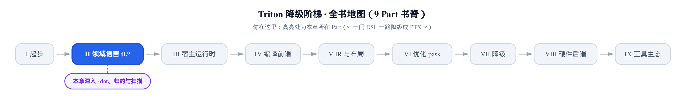
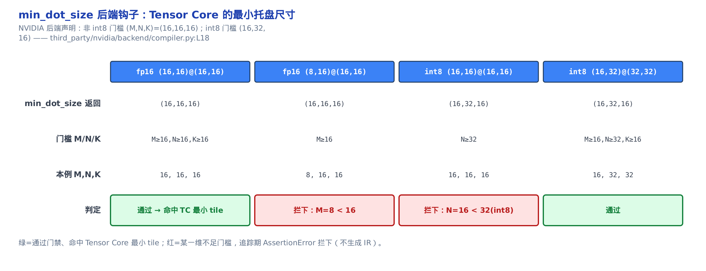
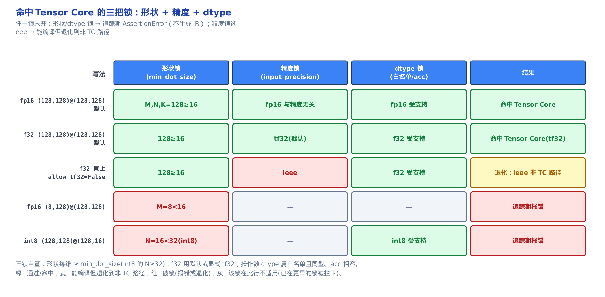
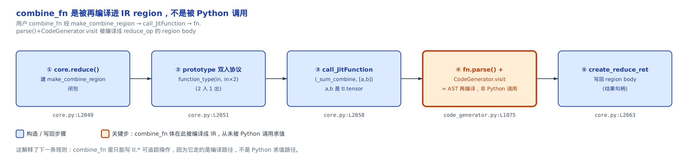
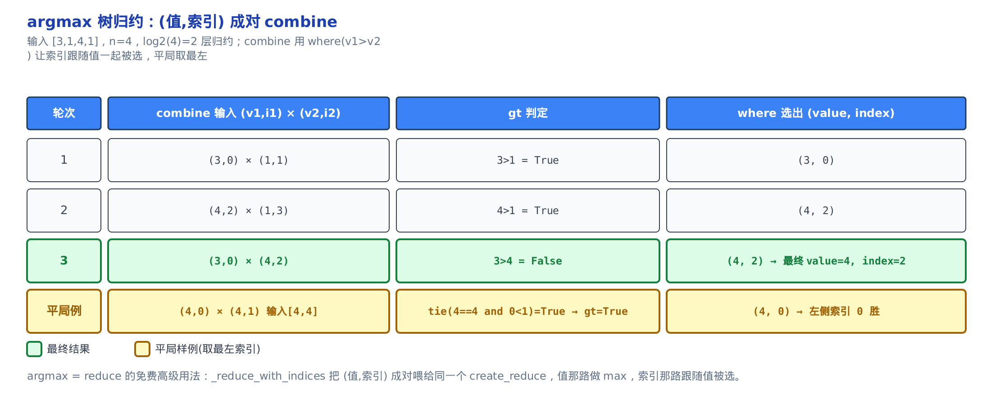

# 块级计算：tl.dot 命不命中 Tensor Core，与把 combine_fn 编成 IR region

> **你在这里**：全书从一门 DSL 一路降到 PTX，仍在「领域语言 tl.\*」这一部分。
> 上一章：怎么造块、变形状、把张量读进来写回去。
> 本章：块级计算的两大主题——`tl.dot` 命不命中 Tensor Core；`combine_fn` 怎么变 IR region。
> 下一章：离开语言表面，进入宿主运行时怎么把 kernel 发射上卡。



[上一章](../../ch07-blocks-shape-and-memory-access/narrative/chapter.md)讲完了单个元素怎么读进来、写回去。但深度学习 kernel 的绝大多数算力，不花在逐元素搬运上——花在**矩阵乘法**上。一个 attention、一个 GEMM，浮点运算量的九成以上都压在一条 `tl.dot` 上。

**本章要解锁的性能杠杆，就是这一条 `tl.dot` 到底命不命中 Tensor Core。** Tensor Core（张量核心）是 NVIDIA 从 Volta 代起，在每个 SM（流式多处理器，见[第 2 章](../../ch02-gpu-execution-model/narrative/chapter.md)）里塞进的一批**固定尺寸的矩阵乘累加硬件单元**——一次吞一小块 `A×B`、直接吐 `A·B` 加到累加器上，比用普通的乘加指令一格一格算快一个数量级。但它有个脾气：只吃**够大、精度对路、类型受支持**的矩阵块，稍有不合就把你退回到慢十倍的普通乘加路径，甚至编译期直接报错。看懂本章前半程，你就能拿着自己的 `dot` 写法对号入座：它命中了 Tensor Core，还是悄悄退化了。

本章的下半程换一个主题，但同样是「你写的普通代码，编译器拿它做了什么」这条追问的延伸：`tl.reduce`、`tl.associative_scan`、`tl.histogram` 这三个归约类原语，怎么把你随手写的一个 `lambda a, b: a + b` **重新编译**成设备上的一段 IR。这解释了一个很多人踩过的坑——为什么归约的 `combine_fn` 里只能写 `tl.*` 操作，写个原生 `if` 就崩。

两条主线各占一半篇幅。想直接抓性能结论，读前半程的 `§1`–`§5`（`tl.dot` 的校验流水线与命中判据）；想弄懂归约/扫描的编译机理，读后半程的 `§6`–`§9`。全程用钉死的 Triton v3.2.0 做真编译取证，每条判据落在哪一行、`min_dot_size` 的数字来自哪个后端，都有据可查。


只想知道自己的 `tl.dot` 命不命中 Tensor Core，按 §1→§5 走；只想弄懂 `combine_fn` 怎么被编译成 IR region，跳到 §6→§9；两条路线各自成篇，读一条或全读都可以。

---

# 上半程：tl.dot 与 Tensor Core

`tl.dot(a, b)` 从你写下到落成一条 `tt.dot` IR 节点，中间要过一整条校验流水线。这条流水线住在 `python/triton/language/semantic.py` 的 `dot` 函数里——它是整个 `tl.dot` 的「真正入口」，前端 `core.py` 里那个 `tl.dot` 只做参数归一，真正的把关和建 IR 全在这里。我们顺着这条流水线走五节：先是三道类型/形状闸门（`§1`），再是决定命不命中的三个关键旋钮——形状门槛（`§2`）、精度档位（`§3`）、累加器类型（`§4`），最后把三者合成一张命中判据自查表（`§5`）。

## §1 两操作数进 dot：先过校验闸门

**直觉**。两个操作数进 `tl.dot`，像两件行李过海关安检：先验类型在不在受理名单里（护照有效），再验两件同型（同一本护照），再验维度阶数（都是 2D 或都是 3D），最后验拼接口对得上（`A` 的列数 = `B` 的行数）。任一道闸不过，追踪期（编译器 JIT 追踪、正在搭 IR 的阶段，见[第 5 章](../../ch05-type-system-and-tensor/narrative/chapter.md)）当场拦下，绝不放进后面的 `create_dot`。

**机制**。拿一对最规矩的操作数走一遍：`lhs` 是 `(16, 32)` 的 fp16、`rhs` 是 `(32, 16)` 的 fp16、不带累加器。下表把每道闸的判据、本例取值、判定摆开——最后一行故意把 `rhs` 换成 fp32，看它在哪一道被拦：

<!-- trace: dot-validation-gauntlet -->

| 闸门 | 判据（源码） | 本例取值 | 判定 |
|---|---|---|---|
| dtype 白名单 | lhs/rhs.dtype ∈ {int8,uint8,fp16,bf16,fp32}（semantic.py:L1466-L1469） | fp16 / fp16 | 通过 |
| 操作数同型 | lhs.dtype == rhs.dtype（semantic.py:L1470） | fp16 == fp16 | 通过 |
| 维度阶数 | lhs_rank == rhs_rank ∈ {2,3}（semantic.py:L1480 附近） | 2 == 2 | 通过 |
| K 维相容 | lhs.shape[-1] == rhs.shape[-2] | 32 == 32 | 通过 → 进 min_dot_size 门 |
| 反例：rhs 换 fp32 | lhs.dtype == rhs.dtype（semantic.py:L1470） | fp16 != fp32 | 追踪期 AssertionError 拦下 |

这里的 dtype（数据类型，见[第 5 章](../../ch05-type-system-and-tensor/narrative/chapter.md)）白名单是硬约束：fp64 直接不在名单里，两个操作数类型不一致（fp16 配 fp32）也当场拦。K 维相容那一行是矩阵乘的定义要求——`(M, K) × (K, N)`，中间那个 K 必须对齐，否则乘法根本没定义。

**不变量**。**只有全部闸门通过，才会走到最终建 IR 的 `create_dot`；任一道失败，追踪期就抛 `AssertionError`，永不生成 `tt.dot` 节点。** 论据在代码形状里：`semantic.dot` 是一条顺序的 `assert` 链，没有任何 `try/except` 兜底，第一个失败的 `assert` 就终止整个函数；而 `create_dot` 排在所有 `assert` 之后的函数末尾。所以「执行到了 `create_dot`」这件事本身，就蕴含「前面每一道 `assert` 都过了」。这些闸门的开销与矩阵规模无关，是 O(1) 的追踪期检查，不占运行时一分一毫。本例 dtype 白名单、同型、阶数、K 相容——4 道闸全过，才建出这 1 个 `tt.dot` IR 节点；上表末行换 fp32 是第 5 行，演示同型闸拦下的样子。

**源码**。把这几道闸从 `semantic.dot` 的开头抠出来看——注意这只是函数的前半段，`min_dot_size` 门禁和后面的类型选型在下几节讲，这里先看类型/形状校验：

```python
# python/triton/language/semantic.py:L1458-L1485
def dot(lhs: tl.tensor, rhs: tl.tensor, acc: tl.tensor, input_precision: Optional[str], max_num_imprecise_acc: int,
        out_dtype: tl.dtype, builder: ir.builder) -> tl.tensor:
    assert lhs.type.is_block() and rhs.type.is_block()

    if lhs.dtype.is_fp8() and rhs.dtype.is_fp8():
        # All combinations of supported fp8 x fp8 are permitted
        pass
    else:
        assert lhs.dtype in (tl.int8, tl.uint8, tl.float16, tl.bfloat16,
                             tl.float32), f"Unsupported lhs dtype {lhs.dtype}"
        assert rhs.dtype in (tl.int8, tl.uint8, tl.float16, tl.bfloat16,
                             tl.float32), f"Unsupported rhs dtype {rhs.dtype}"
        assert lhs.dtype == rhs.dtype, f"Both operands must be same dtype. Got {lhs.dtype} and {rhs.dtype}"

    # … 省略：fp8e4b15 子类型的 cast-to-fp16 预处理，只影响一种边缘 fp8，主线不涉及 …

    if input_precision is None:
        input_precision = builder.options.default_dot_input_precision
    input_precision = _str_to_dot_input_precision(input_precision, builder)

    lhs_rank = len(lhs.shape)
    rhs_rank = len(rhs.shape)
    assert lhs_rank == rhs_rank == 2 or lhs_rank == rhs_rank == 3, f"Both inputs must be either 2D or 3D; (lhs: {lhs.shape} vs rhs: {rhs.shape})"
    assert lhs.shape[-1].value == rhs.shape[-2].value, f"First input shape ({lhs.shape}) ... not compatible for matmul ..."
```

第一行 `assert lhs.type.is_block()` 先确认两个操作数都是块（block，见[第 5 章](../../ch05-type-system-and-tensor/narrative/chapter.md)），标量不能进 dot。接着是那个 `if...else`：**fp8×fp8 走 `pass` 直接放行**（fp8 家族的各种组合都允许，见[第 5 章](../../ch05-type-system-and-tensor/narrative/chapter.md)对 fp8 的介绍），其余类型才走 `else` 分支查白名单 + 验同型。这个提前放行是 dot 支持低精度矩阵乘的入口，本章不展开 fp8 的量化细节。最后两条 `assert` 就是阶数闸和 K 维闸。注意 `lhs.shape[-1].value == rhs.shape[-2].value` 里的 `.value`——形状分量是 `constexpr`（编译期常量，见[第 5 章](../../ch05-type-system-and-tensor/narrative/chapter.md)），追踪期就是具体数字，所以这道校验在追踪期就能算出真假。

过了这三道闸，操作数才有资格去撞下一道、也是本章性能落点的第一把锁：`min_dot_size`。

## §2 min_dot_size：Tensor Core 的最小托盘尺寸

**直觉**。Tensor Core 像一台只吃「整托盘」货的机器，最小托盘尺寸由厂家（后端）钉死。你的矩阵块小于托盘就装不下，只能退回手工的逐格乘加（FMA，fused multiply-add 融合乘加，逐元素算、不走 Tensor Core）。`min_dot_size` 就是 NVIDIA 后端贴在机器上的那张「最小托盘 (M, N, K)」标签，语言层照着它设卡。

为什么会有个最小尺寸？因为 Tensor Core 是**固定形状的硬件电路**——就像[第 2 章](../../ch02-gpu-execution-model/narrative/chapter.md)里 warp 恒为 32 条 lane、不是软件能改的一样，MMA（matrix multiply-accumulate，矩阵乘加——即 Tensor Core 硬件实际执行的那条指令）单元一次吞的 tile 边长也是电路焊死的。喂给它一块比电路还小的矩阵，硬件填不满、语义也对不上，于是干脆在编译期拦下。硬件为什么是这个尺寸，[第 2 章](../../ch02-gpu-execution-model/narrative/chapter.md)的执行模型已经交代，这里只关心语言层怎么把这个硬件事实变成一道门禁。

**机制**。关键设计是：**这个门槛的具体数字不写在语言层，而是由后端声明**。NVIDIA 后端给出两档——普通类型 `(16, 16, 16)`，int8 因为累加位宽的关系要 `(16, 32, 16)`（N 维门槛抬到 32）。下表跑四个场景，看门禁怎么判：

<!-- trace: min-dot-size-hook -->

| 场景 | min_dot_size 返回 | 门槛 M/N/K | 本例 M,N,K | 判定 |
|---|---|---|---|---|
| fp16 (16,16)@(16,16) | (16,16,16)（compiler.py:L18） | M≥16, N≥16, K≥16 | 16, 16, 16 | 通过 → 命中 TC 最小 tile |
| fp16 (8,16)@(16,16) | (16,16,16) | M≥16 | M=8 | 拦下：M<16 |
| int8 (16,16)@(16,16) | (16,32,16)（compiler.py:L18） | N≥32 | N=16 | 拦下：int8 需 N≥32 |
| int8 (16,32)@(32,32) | (16,32,16) | M≥16, N≥32, K≥16 | 16, 32, 32 | 通过 |

第二行是最常见的坑：你把 `BLOCK_M` 设成 8 图省显存，fp16 的 dot 追踪期就 `AssertionError`——因为 M=8 没过 16 的门槛。第三行更隐蔽：int8 矩阵乘的 N 维必须 ≥ 32，写 16 会被拦，而 fp16 同样的 16 却能过。

**不变量**。**门槛数字由后端声明、语言层一字不硬编**：`semantic.dot` 只做两件事——先 `assert` 这个钩子存在，再拿它返回的三元组去比。换个后端（AMD、interpreter），换一套约束，语言层代码不用动一行。论据是钩子的注入路径：NVIDIA 后端在解析阶段把 `min_dot_size` 塞进 `builder.codegen_fns`（后端向语言层注入的一张「代码生成钩子表」）；`semantic.dot` 先 `assert` 它非 None（否则报 `target doesn't provide lower shape bounds for dot.`），再调用它取门槛。**下标次序特别容易记错**：返回的三元组是 `(M_min, N_min, K_min)`，但源码里比的是 `lhs.shape[-2]≥min[0]`（M）、`lhs.shape[-1]≥min[2]`（K）、`rhs.shape[-1]≥min[1]`（N）——K 对应的是第 3 个分量，不是第 2 个。



**源码**。先看语言层这一侧的门禁——接着 `§1` 那段往下：

```python
# python/triton/language/semantic.py:L1486-L1490
    assert builder.codegen_fns.get("min_dot_size") is not None, "target doesn't provide lower shape bounds for dot."
    min_dot_size = builder.codegen_fns["min_dot_size"](lhs.type, rhs.type)
    assert lhs.shape[-2].value >= min_dot_size[0] and lhs.shape[-1].value >= min_dot_size[2] \
        and rhs.shape[-1].value >= min_dot_size[1], \
            f"Input shapes should have M >= {min_dot_size[0]}, N >= {min_dot_size[1]} and K >= {min_dot_size[2]}"
```

语言层只认「有没有这个钩子」和「钩子返回什么」，从不知道具体数字。数字在后端那一侧——NVIDIA 后端 `third_party/nvidia/backend/compiler.py` 里，`min_dot_size` 就是薄薄两行：

```python
# third_party/nvidia/backend/compiler.py:L17-L18
def min_dot_size(target: GPUTarget):
    return lambda lhsType, rhsType: (16, 32, 16) if lhsType.is_int8() else (16, 16, 16)
```

一个三元判断：int8 返回 `(16, 32, 16)`，其余全 `(16, 16, 16)`。它怎么进到语言层的 `builder.codegen_fns` 里？靠后端的 `get_codegen_implementation`——后端把自己能提供的一批代码生成钩子打包成一个字典交出去：

```python
# third_party/nvidia/backend/compiler.py:L171-L178
    def get_codegen_implementation(self):
        import triton.language.extra.cuda as cuda
        codegen_fns = {
            "convert_custom_types":
            cuda.convert_custom_float8_sm80 if self.capability >= 80 else cuda.convert_custom_float8_sm70,
            "min_dot_size": min_dot_size(self.target)
        }
        return codegen_fns
```

`codegen_fns` 是一张「后端能力表」：语言层需要某个硬件相关的决定时，不自己拍板，而是查这张表。`min_dot_size` 只是其中一项。**这个「后端声明能力、语言层照查」的模式，是后面讲硬件后端那部分的一条主线**——不同后端就是靠往这张表里填不同的钩子，让同一套语言层代码跑出不同硬件的约束。这里先记住它作为 `dot` 命中判据的第一把锁：**形状锁**。

## §3 input_precision：f32 走 tf32 还是 ieee

**直觉**。f32×f32 的 dot 有两条路：**tf32**（TensorFloat-32，把尾数从 fp32 的 23 位砍到 10 位——砍掉低 13 位，指数位宽不变，快、走 Tensor Core）和 **ieee**（IEEE-754 全精度 f32，慢、退回逐格乘加式的路径）。Triton 默认帮你选快的 tf32，但留了三层开关，要精度时能手动切回 ieee——像默认上高速，但你随时能改走国道。`input_precision`（f32 矩阵乘的精度档位参数）就是这个开关。

这里说的「精度」只对 **f32 输入**有意义：fp16、bf16、int8 本来就走各自专用的 Tensor Core 路径，与 tf32/ieee 无关。这也是很多人第一次读 `tl.dot` 文档时的困惑点——`input_precision` 只在你喂 f32 时才生效。

**机制**。默认值怎么来的、三层开关谁压谁？下表把常见输入组合走一遍：

<!-- trace: input-precision-selection -->

| 输入组合 | supports_tf32 | 解析出的 input_precision | 命中？ |
|---|---|---|---|
| 全默认（precision=None, allow_tf32=None, 无环境变量） | True（'tf32' 在白名单，compiler.py:L109） | tf32（core.py:L1542） | 命中 TC（tf32） |
| allow_tf32=False | True | ieee（core.py:L1542 default 分支） | 退化：ieee 非 TC 路径 |
| 显式 input_precision='ieee' | —（跳过默认块） | ieee（过白名单 semantic.py:L1450） | 退化：ieee 非 TC 路径 |
| 环境变量 TRITON_F32_DEFAULT='ieee' | True | ieee（core.py:L1543 getenv 覆盖） | 退化：ieee 非 TC 路径 |
| 显式 input_precision='fp64'（非法） | — | AssertionError（不在白名单 semantic.py:L1450） | 拦下 |

第一行是默认路径：你什么都不指定，f32 dot 自动走 tf32、命中 Tensor Core。要全精度得主动切——三种切法：传 `allow_tf32=False`（旧写法）、传 `input_precision='ieee'`（新写法）、或设环境变量 `TRITON_F32_DEFAULT='ieee'`（一把全局切）。最后一行是防呆：乱传个不在白名单里的字符串，追踪期直接拦。

**不变量**。**三层优先级固定：显式 `input_precision` 参数 > 环境变量 `TRITON_F32_DEFAULT` > 由 `allow_tf32`/后端支持推出的默认值；无论走哪条，最终值都必须过 `allowed_dot_input_precisions` 白名单，否则追踪期报错。** 论据在代码结构里：`input_precision` 非 None 时，整个默认块被 `if` 跳过；否则先算默认值，再被 `os.getenv` 覆盖。三条路最后都汇到 `_str_to_dot_input_precision` 那道白名单 `assert`——它是最后一关。

**源码**。默认值的选取在前端 `core.py` 的 `tl.dot` 里，正是那个「你什么都不传时」的逻辑：

```python
# python/triton/language/core.py:L1539-L1548
    assert input_precision is None or allow_tf32 is None, "Only one of input_precision and allow_tf32 can be specified"
    if input_precision is None:
        supports_tf32 = _builder and "tf32" in _builder.options.allowed_dot_input_precisions
        default_precision = "tf32" if (supports_tf32 and (allow_tf32 or allow_tf32 is None)) else "ieee"
        input_precision = os.getenv("TRITON_F32_DEFAULT", default_precision)

    input_precision = _constexpr_to_value(input_precision)
    out_dtype = _constexpr_to_value(out_dtype)
    max_num_imprecise_acc = _constexpr_to_value(max_num_imprecise_acc)
    return semantic.dot(input, other, acc, input_precision, max_num_imprecise_acc, out_dtype, _builder)
```

第一行 `assert` 就把 `input_precision` 和 `allow_tf32` 定成互斥——两个都传会当场报错，`allow_tf32` 是留给老代码的废弃别名。中间三行是默认值三层瀑布：先看后端支不支持 tf32（`supports_tf32`），再结合 `allow_tf32` 定出 `default_precision`，最后 `os.getenv` 给全局环境变量最后一次覆盖机会。定好后转发 `semantic.dot`。而白名单校验在 `semantic.py` 那一侧：

```python
# python/triton/language/semantic.py:L1449-L1455
def _str_to_dot_input_precision(input_precision, builder):
    assert input_precision.lower() in builder.options.allowed_dot_input_precisions, \
        f"input_precision must be one of {builder.options.allowed_dot_input_precisions}. Got {input_precision}"
    input_precision = input_precision.upper()
    if input_precision == "TF32X3":
        input_precision = "TF32x3"
    return getattr(ir.INPUT_PRECISION, input_precision)
```

`assert ... in builder.options.allowed_dot_input_precisions`——这就是白名单闸。白名单本身也是后端声明的，NVIDIA 给的是三档：

```python
# third_party/nvidia/backend/compiler.py:L108-L110
    default_dot_input_precision: str = "tf32"
    allowed_dot_input_precisions: Tuple[str] = ("tf32", "tf32x3", "ieee")
    max_num_imprecise_acc_default: bool = None
```

`default_dot_input_precision = "tf32"` 就是「f32 默认偏性能」这个决定的落点，`allowed_dot_input_precisions` 是那份三档白名单。这是命中判据的第二把锁：**精度锁**。与形状锁不同——精度锁选错（`ieee`）不报错，能编译，只是悄悄退化到没有 Tensor Core 的慢路径。这个「能编译但不命中」的区别，`§5` 会正式点破。

## §4 acc 与 out_dtype：累加器用什么类型攒和

**直觉**。dot 用什么类型攒和（累加器 `acc` / 返回标量 `ret_scalar_ty`）不是你随便定的——它由操作数 dtype 反推。整数进 → int32 出；f32/bf16 进 → f32 出；f16 进 → 看你的 `out_dtype`（dot 输出标量类型参数）。像收银台按进来的是硬币还是纸币，决定用哪种钱箱，你没得挑。`acc`（accumulator 累加器，dot 结果累加到它上面）如果不传，就自动造一个填零的。

**机制**。下表按操作数类型分支，看每种进来的 dtype 反推出什么 `ret_scalar_ty` 和什么零初值：

<!-- trace: acc-out-dtype-selection -->

| 操作数 scalar dtype | out_dtype | 分支（源码） | ret_scalar_ty | acc 初值 _0 |
|---|---|---|---|---|
| int8 | （忽略） | is_int（semantic.py:L1491-1493） | int32 | get_int32(0) |
| fp32 | float32 | is_fp32（semantic.py:L1499） | float32 | get_fp32(0) |
| bf16 | float32 | is_bf16（semantic.py:L1499） | float32 | get_fp32(0) |
| fp16 | float16 | else + out_dtype.is_fp16（semantic.py:L1503-1504） | float16 | get_fp16(0) |
| fp16 | float32 | else + 非 fp16 out（semantic.py:L1503-1504） | float32 | get_fp32(0) |
| 任意 | bfloat16 | out_dtype.is_bf16 → raise（semantic.py:L1495-1497） | ValueError | 拦下 |

读法：int8 进，累加器强制 int32（低精度乘、高精度攒，防溢出），`out_dtype` 被忽略。f32 或 bf16 进，累加器都是 f32。只有 fp16 进的时候，`out_dtype` 才真正说了算——你要 fp16 输出就 fp16 攒，要更稳就 fp32 攒。最后一行是个专门的禁令：`out_dtype=bfloat16` 直接 `raise`，因为 bf16 当累加器精度不够，源码逼你用 f32/f16 攒完再 `.to(tl.bfloat16)`。

**不变量**。**`ret_scalar_ty` 唯一由「操作数 scalar 类别 + out_dtype」决定；`acc` 若显式传入，必须 `acc.type == ret_ty`（同形同 dtype），否则由 `create_splat(0)` 造一个零累加器——不存在「acc 与输出不同型还能进 create_dot」的路径。** 论据是那段 `if/elif/else` 互斥且穷尽：覆盖 int、bf16-out（禁）、fp32|bf16、else（fp16 系）全部 dtype 类别，每条恰好定一个 `ret_scalar_ty` 和一个零初值 `_0`。累加器那一步要么 None 就 splat 零、要么 `assert acc.type == ret_ty`，没有第三种出口。

**源码**。接着 `§2` 的门禁往下，就是这段类型选型：

```python
# python/triton/language/semantic.py:L1491-L1514
    if lhs.type.scalar.is_int():
        assert lhs.type.scalar == tl.int8, "only int8 supported!"
        _0 = builder.get_int32(0)
        ret_scalar_ty = tl.int32
    elif out_dtype.is_bf16():
        raise ValueError(
            "out_dtype=bfloat16 is unsupported. Please use out_dtype=float32/float16 and cast with `.to(tl.bfloat16)`")
    elif lhs.type.scalar.is_fp32() or lhs.type.scalar.is_bf16():
        _0 = builder.get_fp32(0)
        ret_scalar_ty = tl.float32
    else:
        _0 = builder.get_fp16(0) if out_dtype.is_fp16() else builder.get_fp32(0)
        ret_scalar_ty = out_dtype

    M = lhs.type.shape[-2]
    N = rhs.type.shape[-1]
    K = lhs.type.shape[-1]
    B = lhs.type.shape[0] if lhs_rank == 3 else None
    ret_ty = tl.block_type(ret_scalar_ty, [B, M, N] if B else [M, N])
    if acc is None:
        acc_handle = builder.create_splat(_0, [B, M, N] if B else [M, N])
    else:
        acc_handle = acc.handle
        assert acc.type == ret_ty
```

四个分支就是表里的四类。定好 `ret_scalar_ty` 后，从操作数形状里抠出 M/N/K（还有 3D 时的 batch 维 B），拼出输出块类型 `ret_ty`。`acc is None` 时用 `create_splat(_0, ...)` 铺一整块零；否则 `assert acc.type == ret_ty` 强制你传进来的累加器与输出同型。

注意这道 `assert` 卡的是 `== tl.int8`、不含 uint8——uint8 虽在 `§1` 的 dtype 白名单里合法（`is_int()` 对 uint8 同样为 True，走进的是同一个 `if` 分支），真到了这一行却被这条更窄的检查拦下（`AssertionError: only int8 supported!`）。也就是说 uint8 目前实际不能用于 dot 的累加，`§1` 的白名单只是没把它摘掉。（uint8 与 int8 在 IR 层同型这点，[第 5 章](../../ch05-type-system-and-tensor/narrative/chapter.md)已经讲过，这里不重讲。）

再往下还有一小段收尾，处理 fp8 的一个特殊累加控制：

```python
# python/triton/language/semantic.py:L1516-L1526
    # max_num_imprecise_acc only applies to fp8 -> fp32 dot on sm_90
    if max_num_imprecise_acc is None:
        if lhs.dtype.is_fp8() and rhs.dtype.is_fp8():
            max_num_imprecise_acc = builder.options.max_num_imprecise_acc_default
        else:
            max_num_imprecise_acc = 0
    else:
        if lhs.dtype.is_fp8() and rhs.dtype.is_fp8() and max_num_imprecise_acc > K:
            raise ValueError(f"max_num_imprecise_acc ({max_num_imprecise_acc}) must be <= K ({K})")

    return tl.tensor(builder.create_dot(lhs.handle, rhs.handle, acc_handle, input_precision, max_num_imprecise_acc),
                     ret_ty)
```

`max_num_imprecise_acc`（fp8 累加时允许连续几步用低精度攒、多少步刷新一次高精度）只对 **fp8×fp8→fp32、且在 sm_90 上**有意义——sm_90 的 fp8 MMA 累加器有精度上限，允许每若干步刷新一次。默认值也是后端给的：

```python
# third_party/nvidia/backend/compiler.py:L158
        args["max_num_imprecise_acc_default"] = 2**30 if self.capability == 90 else 0
```

`2**30`（sm_90）或 `0`（其余）——非 fp8、非 sm_90 一律 0，即此项对绝大多数 dot 无感。函数最后一行 `builder.create_dot(...)` 才是终点：所有校验都过了，这里才真的建出那条 `tt.dot` IR 节点。这是命中判据的第三把锁：**dtype 锁**（操作数类型受支持、`acc` 相容）。

## §5 三把锁合流：命中判据自查表

**直觉**。命中 Tensor Core 不是单一开关，而是三把锁同时开：**形状够大**（过 `min_dot_size`）、**精度选对**（f32 走 tf32 而非 ieee）、**dtype 受支持且 acc 相容**。任一把锁没开，dot 要么追踪期报错，要么退化到没有 Tensor Core 的慢路径。这就是本章上半程交给你的自查清单。

**机制**。把前四节的判据合成一张对号入座表——每行是一种常见 dot 写法，三列分别是三把锁的状态，最后一列是结果：

<!-- trace: tensor-core-hit-criterion -->

| 写法 | 形状锁（min_dot_size） | 精度锁（input_precision） | dtype 锁 | 结果 |
|---|---|---|---|---|
| fp16 (128,128)@(128,128) 默认 | M,N,K=128≥16 ✓ | fp16 与 tf32/ieee 无关 ✓ | fp16 受支持 ✓ | 命中 Tensor Core |
| f32 (128,128)@(128,128) 默认 | 128≥16 ✓ | tf32（默认）✓ | f32 受支持 ✓ | 命中 Tensor Core（tf32） |
| f32 同上但 allow_tf32=False | ✓ | ieee ✗ | ✓ | 退化：走 ieee 非 TC 路径 |
| fp16 (8,128)@(128,128) | M=8<16 ✗ | — | — | 追踪期报错 |
| int8 (128,128)@(128,16) | N=16<32 ✗（int8 需 32） | — | int8 受支持 ✓ | 追踪期报错 |

前两行是命中的样子：block 边长 128 远大于门槛，f32 默认 tf32。第三行是最该警惕的**静默退化**——你为了精度把 `allow_tf32` 关了，代码照常编译、结果也对，但性能悄悄掉了，没有任何报错提醒你。后两行是硬拦：形状不够（M=8 或 int8 的 N=16）直接追踪期 `AssertionError`。

**不变量**。**`tl.dot` 命中 Tensor Core ⟺ 三把锁同开。** 但三把锁破锁的后果不一样：形状锁、dtype 锁是硬 `assert`，破了当场报错、连 IR 都不生成；精度锁破了（选 ieee）不报错，而是把内部的 `INPUT_PRECISION` 枚举设成 `IEEE`，后续降级据此不选 Tensor Core 的 MMA 路径——所以它是「能编译但不命中」，性质与前两把「直接报错」根本不同。这个区别值得记牢：**形状/dtype 出错你会立刻知道（编译崩了），精度退化你不会知道（一切正常，只是慢）。**



三条自查落到你写 kernel 时的动作：① block 每一维都 ≥ 16（int8 的 N ≥ 32）；② f32 用默认，或显式写 tf32，别无意中传了 `allow_tf32=False`；③ 操作数 dtype 在白名单 `{int8, uint8, fp16, bf16, fp32}` 加 fp8 里、且两操作数同型。

**关于 dot_scaled，点到即止**。除了 `tl.dot`，还有一个 `tl.dot_scaled`（`python/triton/language/core.py:L1552` 起），走的是 microscaling（微缩放，MX 格式）路径——每一小块数据配一个缩放因子，是更激进的低精度量化矩阵乘。它在 `semantic.py` 里有一套自己的校验（格式枚举、K ≥ 64 等），落成 `create_dot_scaled` 而非 `create_dot`。本章不展开它——它是 `tl.dot` 主线之外的一条量化专用支路，知道有这么个东西、命中判据的思路一致（也靠后端能力钩子设卡）即可。

到这里，上半程收束：**你的 `tl.dot` 命不命中 Tensor Core，由 `min_dot_size`（形状）、`input_precision`（精度）、`acc`/`out_dtype`（类型）三者共同决定，全在 `semantic.dot` 的追踪期一次判完。** 下半程换主题：归约与扫描怎么把你写的普通函数编译成 IR。

---

# 下半程：combine_fn 变 IR region

`tl.reduce`、`tl.associative_scan`、`tl.histogram` 是三个「块级归约」原语——把一整块张量沿某个轴压成更小的结果。前两个有个共同特点：**你得给它传一个 `combine_fn`**（两两合并函数），告诉它「两个元素怎么合成一个」。`tl.sum` 底层传 `a + b`，`tl.max` 传取大的那个。这个 `combine_fn` 的命运，是本章下半程的主角。我们分四节走：`combine_fn` 怎么变成 IR region（`§6`）、为什么它只能用 `tl.*` 写（`§7`）、argmax 怎么靠它白嫖出来（`§8`），最后用 histogram 作个对照（`§9`）。

## §6 combine_fn 变 IR region：不是被调用，是被再编译

**直觉**。你写 `lambda a, b: a + b` 交给 `reduce`，Triton **不在 Python 里跑它**。它把这个函数的语法树（AST）抠出来，当成一小段设备程序重新编译，塞进归约算子的 **region**（IR region，MLIR 里算子内部嵌的一段子代码块）里——像把菜谱翻译成机器指令，而不是照着菜谱自己下厨炒一遍。

这一跳是[第 1 章](../../ch01-what-is-triton/narrative/chapter.md)讲透的 `visit_Call` 三岔分发和 CodeGenerator（代码生成器，追踪器的核心）机制的一个高级用法。那里讲过 `@triton.jit` 函数怎么被追踪成 IR，这里是同一套机制被拿来处理 `combine_fn`——机理[第 1 章](../../ch01-what-is-triton/narrative/chapter.md)已经讲过，本节只展示它怎么被复用，不重讲。

**机制**。拿最简单的 `reduce` 求和走一遍：输入是 `(4,)` 的 f32，`combine_fn` 是 `_sum_combine`（就是 `a + b`），沿轴 0 归约。下表把从「建区域构造器」到「区域校验通过」的八步摆开：

<!-- trace: combine-fn-to-region -->

| 步骤 | 动作 | 关键源码 | 产物 |
|---|---|---|---|
| 1 | core.reduce 建闭包 make_combine_region | core.py:L2049 | 区域构造器（尚未执行） |
| 2 | semantic.reduction 建 create_reduce op | semantic.py:L1626 | reduce_op（空 region） |
| 3 | 回调 make_combine_region：定 prototype = function_type([f32], [f32,f32]) | core.py:L2051 | region 双入参协议（2 入 1 出） |
| 4 | 开 block，取两个 block 参数 a, b（tl.tensor） | core.py:L2054-L2056 | region 形参 a, b |
| 5 | _generator.call_JitFunction(_sum_combine, [a,b]) | core.py:L2058 | 进入 AST 再编译 |
| 6 | fn.parse() 取 AST + 新 CodeGenerator.visit | code_generator.py:L1075 | a+b 编译成 add op（非 Python 求值） |
| 7 | create_reduce_ret(结果句柄) | core.py:L2063 | region body 写回归约结果 |
| 8 | reduce_op.verify() | semantic.py:L1628 | region 合法性校验通过 |

关键在步骤 5、6：`combine_fn` 不是被 `combine_fn(a, b)` 调用求值，而是被 `call_JitFunction` 拿去 `fn.parse()` 取 AST，再喂给一个新的 CodeGenerator 走 `visit`——**它的函数体被当作源码再编译了一遍，落成 region 里的 IR 指令**。传进去的 `a`、`b` 也不是 Python 数字，是 region 的两个块参数（`tl.tensor`），所以 `a + b` 里的 `+` 被重载成建一条 add IR 节点，不是 Python 加法。

**不变量**。**`combine_fn` 的函数体从不在 Python 解释器里被调用求值，而是经 `fn.parse()` → `CodeGenerator.visit` 一次性编译进 `reduce_op` 的 region IR。** 论据：`call_JitFunction` 对函数走的是 `inspect.getcallargs` + `fn.parse()` + `generator.visit(fn.parse())`——与普通 `@triton.jit` 内联同一条代码生成路径（见[第 1 章](../../ch01-what-is-triton/narrative/chapter.md)、[第 3 章](../../ch03-kernel-life-birdseye/narrative/chapter.md)，回指不重讲），全程没有 `combine_fn(*args)` 式的 Python 调用。同一个 `combine_fn` 经函数名修饰（`mangle_fn`）去重，编译一次多处复用。



**源码**。先看 `tl.reduce` 前端里那个「区域构造器」闭包，正是它把 `combine_fn` 变成 region body：

```python
# python/triton/language/core.py:L2046-L2064
    if isinstance(input, tensor):
        return reduce((input, ), axis, combine_fn, keep_dims=keep_dims, _builder=_builder, _generator=_generator)[0]

    def make_combine_region(reduce_op):
        in_scalar_tys = [t.type.scalar for t in input]
        prototype = function_type(in_scalar_tys, in_scalar_tys * 2)

        region = reduce_op.get_region(0)
        with _insertion_guard(_builder):
            param_types = [ty.to_ir(_builder) for ty in prototype.param_types]
            block = _builder.create_block_with_parent(region, param_types)
            args = [tensor(block.arg(i), ty) for i, ty in enumerate(prototype.param_types)]
            results = _generator.call_JitFunction(combine_fn, args, kwargs={})
            if isinstance(results, tensor):
                handles = [results.handle]
            else:
                handles = [r.handle for r in results]
            _builder.create_reduce_ret(*handles)
```

开头那个 `if isinstance(input, tensor)`：单个 tensor 会被包成单元素 tuple 再自调一次（统一按「一组 tensor」处理），拆包时取 `[0]`。核心是 `make_combine_region`：它拿到归约算子后，开一个 block、造好形参 `args`，然后 `_generator.call_JitFunction(combine_fn, args, ...)`——这一句就是把 `combine_fn` 送进再编译。最后 `create_reduce_ret` 把结果写回 region。

再看 semantic 层——它建算子、回调这个构造器、校验：

```python
# python/triton/language/semantic.py:L1615-L1630
def reduction(inputs: Sequence[tl.tensor], axis: int, region_builder_fn, builder: ir.builder) -> Tuple[tl.tensor, ...]:
    if axis is None:
        inputs = tuple(reshape(t, [t.numel.value], can_reorder=True, builder=builder) for t in inputs)
        axis = 0
    # … 省略：算 ret_shape、校验所有输入同形 …
    reduce_op = builder.create_reduce([t.handle for t in inputs], axis)
    region_builder_fn(reduce_op)
    reduce_op.verify()
    return tuple(wrap_tensor(reduce_op.get_result(i), inputs[i].type.scalar, ret_shape) for i in range(len(inputs)))
```

三步清清楚楚：`create_reduce` 建一个空 region 的归约算子，`region_builder_fn(reduce_op)`（就是回调 `make_combine_region`）往里填 body，`reduce_op.verify()` 校验这个 region 合法。最后按去掉归约轴后的形状包回 `tl.tensor`。

那被再编译的这一跳，具体在 CodeGenerator 里长什么样？看 `call_JitFunction`：

```python
# python/triton/compiler/code_generator.py:L1050-L1076
    def call_JitFunction(self, fn: JITFunction, args, kwargs):
        args = inspect.getcallargs(fn.fn, *args, **kwargs)
        args = [args[name] for name in fn.arg_names]
        args = [arg if _is_triton_value(arg) else constexpr(arg) for arg in args]
        # … 省略：整理 attributes / constants、把 constexpr 参数分出去 …
        fn_name = mangle_fn(fn.__name__, arg_types, constants)
        # generate function def if necessary
        if not self.module.has_function(fn_name):
            prototype = language.function_type([], arg_types)
            gscope = fn.__globals__
            file_name, begin_line = get_jit_fn_file_line(fn)
            generator = CodeGenerator(self.context, prototype, gscope, attributes, constants, module=self.module,
                                      jit_fn=fn, function_name=fn_name, function_types=self.function_ret_types,
                                      noinline=fn.noinline, file_name=file_name, begin_line=begin_line,
                                      options=self.builder.options, codegen_fns=self.builder.codegen_fns,
                                      module_map=self.builder.module_map)
            generator.visit(fn.parse())
```

`fn.parse()` 取 `combine_fn` 的 AST，新建一个 `CodeGenerator` 去 `visit` 它——**这就是「再编译」的实锤**。注意它把 `self.builder.codegen_fns` 也传给了子 generator：`combine_fn` 编译时同样能查后端能力表（就是 `§2` 那张表）。这条路径和你 kernel 里普通调 `@triton.jit` 函数走的是**同一条**，[第 1 章](../../ch01-what-is-triton/narrative/chapter.md)已经拆透。既然是「再编译」而不是「调用」，一个约束就冒出来了——下一节。

## §7 为什么 combine_fn 必须是可追踪的 Triton 代码

**直觉**。既然 `combine_fn` 是被「再编译」而不是「被调用」，它里面就只能写编译器认得的 `tl.*` 操作。写个 numpy 调用、或对 tensor 用原生 `if`，编译器追踪 AST 时遇到不认识的语法就崩——就像把只懂机器码的编译器喂一份中文菜谱。这不是运行时才发现的错，是**编译期语言约束**。

**机制**。合法与非法的 `combine_fn` 对照，看它们在追踪期各自发生什么：

<!-- trace: why-combine-fn-traceable -->

| combine_fn | 函数体 | 追踪期发生什么 | 结果 |
|---|---|---|---|
| _sum_combine（standard.py:L255） | return a + b | a,b 是 tl.tensor，+ 重载为 create_add | 编译成 add op，合法 |
| _argmax_combine（standard.py:L140） | core.where(gt, v1, v2) 等 | where / > 皆 tl.* 可追踪 | 编译成比较+where op，合法 |
| 假想 lambda a,b: numpy.add(a,b) | 调外部库 numpy | CodeGenerator 追踪到 numpy 调用无法 lower 成 IR | 追踪期报错 |
| 假想 lambda a,b: a if a>b else b | 对 tensor 用 Python if | tl.tensor 无 __bool__，原生 if 求值即失败 | 追踪期报错（须改用 core.where） |

前两行是标准库里真实存在的合法样例。后两行是两个典型坑：调外部库（numpy）编译器没法把它降成 IR；对 tensor 用原生 `a if a>b else b`，因为 `tl.tensor` 没有定义 `__bool__`（一个块不是单个真/假值），Python 的 `if` 求值当场失败。**归约里想「二选一」，必须用 `core.where`**，这就是为什么标准库的 `_argmax_combine` 全用 `where` 而非 `if`。

**不变量**。**`combine_fn` 体内每个操作都必须能被 CodeGenerator 降解成 IR；非 `tl.*` 的 Python 运算（外部库、对 tensor 的原生 if/bool）在追踪期即失败——这是编译期语言约束，不是运行期检查。** 论据：`combine_fn` 走 `fn.parse()` → `visit` 的编译路径（见上一节），CodeGenerator 只认自己内建的 `visit_*` 处理器（`visit_Call`、`visit_If` 等，见[第 1 章](../../ch01-what-is-triton/narrative/chapter.md)）；`a`、`b` 是 `tl.tensor`，其上的 Python `if` 需要 `__bool__` 而 tensor 没有，所以分支必须用 `core.where`。标准库里所有 `combine_fn` 100% 由 `tl.*` 构成，正是这条契约的活样例。

**源码**。看标准库里两个真实的 `combine_fn`——它们就是这条约束的正面教材：

```python
# python/triton/language/standard.py:L140-L148
def _argmax_combine(value1, index1, value2, index2, tie_break_left):
    if tie_break_left:
        tie = value1 == value2 and index1 < index2
    else:
        tie = False
    gt = value1 > value2 or tie
    v_ret = core.where(gt, value1, value2)
    i_ret = core.where(gt, index1, index2)
    return v_ret, i_ret
```

```python
# python/triton/language/standard.py:L254-L256
@jit
def _sum_combine(a, b):
    return a + b
```

`_sum_combine` 就一行 `a + b`——最简 `combine_fn`。`_argmax_combine` 看着有 `if tie_break_left`，但注意：`tie_break_left` 是个**编译期常量（constexpr）**，追踪时就是确定的 True/False，这个 `if` 在追踪期被 CodeGenerator 静态选一条分支、不进 IR（见[第 1 章](../../ch01-what-is-triton/narrative/chapter.md)对 constexpr 分支的处理）。而真正对 tensor 值做「二选一」的地方——`v_ret`、`i_ret`——用的全是 `core.where`，绝不用原生 `if`。这不是巧合，是「被再编译成 IR」强加的硬约束。看懂这条，你写自定义 `combine_fn` 时就知道边界在哪。

**region 的双入参协议**。这里补一个 `§6` 表里出现过、但没细说的点：`combine_fn` 的参数个数是有讲究的。`_sum_combine` 是 `(a, b)` 两入，`_argmax_combine` 却是 `(value1, index1, value2, index2)` 四入——为什么？

<!-- trace: combine-fn-region-protocol -->

| 归约输入 tensor 数 | in_scalar_tys | prototype 参数（×2） | combine_fn 签名 | 样例 |
|---|---|---|---|---|
| 1（纯 reduce sum） | [f32] | [f32, f32] | (a, b) → c | _sum_combine（standard.py:L255） |
| 2（带索引 argmax） | [f32, int32] | [f32, int32, f32, int32] | (v1, i1, v2, i2) → (v, i) | _argmax_combine（standard.py:L140） |
| 1（scan cumsum） | [f32] | [f32, f32] | (a, b) → c | _sum_combine（associative_scan 同协议，core.py:L2152） |

看 `§6` 源码里那行 `prototype = function_type(in_scalar_tys, in_scalar_tys * 2)`：region 收 **2 倍**输入 tensor 数的参数、返回 1 倍。直觉上像「两两 PK」——每次拿两组选手（各是 N 个 tensor 的一份），比出一组胜者。所以纯 sum 是 `(a, b) → c`（N=1，两入一出），带索引的 argmax 是 `(v1, i1, v2, i2) → (v, i)`（N=2，四入两出）。`reduce` 和 `associative_scan` 用的是**同一条** `function_type(in, in*2)` 协议（`core.py:L2051` 与 `L2152` 字面相同）。这条协议正好解释了 argmax 的四入两出——而 argmax 本身，就是下一节。

## §8 argmax/argmin：把索引搭上值一起归约

**直觉**。argmax 要同时报「最大值」和「它在第几位」。技巧很巧：给每个元素配一个身份证号（index），值和号绑成一对一起归约；combine 时谁的值大，就连值带号一起留下。最后值那一路给你 max，号那一路给你 argmax——一次归约白嫖出两个结果。

**机制**。拿 `[3, 1, 4, 1]` 沿轴 0 做 argmax，index 是 `arange(0,4)=[0,1,2,3]`，用左优先的 tie_break。树归约每轮把候选两两 combine，看下表三轮怎么收敛到最终结果，最后一行单独演示平局（输入 `[4, 4]`）怎么取最左：

<!-- trace: reduce-with-indices-argmax -->

| 轮次 | combine 输入 (v1,i1) x (v2,i2) | gt = v1>v2 or tie | where 选出 (v_ret,i_ret) |
|---|---|---|---|
| 1 | (3,0) x (1,1) | 3>1 = True | (3,0) |
| 2 | (4,2) x (1,3) | 4>1 = True | (4,2) |
| 3 | (3,0) x (4,2) | 3>4 = False | (4,2) → 最终 value=4, index=2 |
| 平局例 [4,4] | (4,0) x (4,1) | tie = (4==4 and 0<1) = True → gt=True | (4,0) → 左侧索引 0 胜 |

第 1、2 轮是第一层：`(3,0)` 打 `(1,1)` 留 `(3,0)`，`(4,2)` 打 `(1,3)` 留 `(4,2)`。第 3 轮是第二层：`(3,0)` 打 `(4,2)`，`3>4` 为 False，所以留右边 `(4,2)`——最终 value=4、index=2，正是 `[3,1,4,1]` 里 4 的位置。平局那行演示 `tie_break_left`：两个 4 相等时，`tie = (4==4 and 0<1)` 为 True 让 `gt=True`，于是留下索引更小的那个。这套 combine 逻辑我们用纯 Python 忠实重演过一遍做交叉验证，结果与上表逐行吻合（value=4、index=2；平局取 index=0）。

**不变量**。**带索引归约必终止，且给出全局 argmax：值那一路做 max，索引那一路跟随值的选择；平局取最左。** 论据分两半。终止性：树归约每轮把候选对数减半（n → ⌈n/2⌉ → … → 1），log2(n) 轮必停。正确性用归纳：不变量是「每个部分结果保持 (该段最大值，其索引)」——单元素基例平凡成立；归纳步合并两个各自正确的部分结果时，`where(gt)` 选出全局较大者连同它的索引，tie 分支保证值相等时取较小索引，故合并后仍是 (全局最大值，其索引)。n=4 时 log2(4)=2 层树归约（本例展开成 3 次 pairwise combine）。



**源码**。argmax 的底座是 `_reduce_with_indices`——它造索引、broadcast、然后调普通的 `reduce`：

```python
# python/triton/language/core.py:L2094-L2108
def _reduce_with_indices(input, axis, combine_fn, keep_dims=False, _builder=None, _generator=None):
    axis = _constexpr_to_value(axis)
    n = input.shape[axis]
    index = arange(0, n, _builder=_builder)

    if len(input.shape) > 1:
        # Broadcast index across the non-reduced axes
        axes_to_expand = [constexpr(d) for d in builtins.range(len(input.shape))]
        del axes_to_expand[axis]
        index = expand_dims(index, axes_to_expand, _builder=_builder)
        index = broadcast_to(index, input.shape, _builder=_builder)

    rvalue, rindices = reduce((input, index), axis, combine_fn, keep_dims=keep_dims, _builder=_builder,
                              _generator=_generator)
    return rvalue, rindices
```

`arange(0, n)` 造一把 0 到 n-1 的索引尺；多维输入时用 `expand_dims` + `broadcast_to` 把这把尺铺到与输入同形（沿非归约轴复制）。最关键是最后一句：`reduce((input, index), axis, combine_fn, ...)`——**把 `(值，索引)` 作为一对 tensor 喂给普通的 `reduce`**。这就是 `§7` 那条「N=2 → combine_fn 四入两出」协议的来源：两个输入 tensor，region 收 4 参、返 2 值。argmax 没有新造任何 IR 算子，纯靠 reduce 的双 tensor 能力实现，是 reduce 的一个**免费高级用法**。上层 `standard.max(return_indices=True)` 就把 argmax 的 combine_fn 传给它——注意传的不是 `§7` 里那个五参数的 `_argmax_combine(value1,index1,value2,index2,tie_break_left)` 本身，而是它的两个具体版本：

```python
# python/triton/language/standard.py:L170-L184
@jit
def max(input, axis=None, return_indices=False, return_indices_tie_break_left=True, keep_dims=False):
    input = core._promote_bfloat16_to_float32(input)
    if return_indices:
        if return_indices_tie_break_left:
            return core._reduce_with_indices(input, axis, _argmax_combine_tie_break_left, keep_dims=keep_dims)
        else:
            return core._reduce_with_indices(input, axis, _argmax_combine_tie_break_fast, keep_dims=keep_dims)
    else:
        # … 省略：不带索引时的 dtype 提升，转发普通 reduce(_elementwise_max) …
        return core.reduce(input, axis, _elementwise_max, keep_dims=keep_dims)
```

`_argmax_combine_tie_break_left`/`_argmax_combine_tie_break_fast`（standard.py:L152-158）就是 `_argmax_combine` 把 `tie_break_left` 固定成 True/False 后的两个具体版本——各自内部只是 `return _argmax_combine(value1, index1, value2, index2, True/False)`。固定成 constexpr 后就只剩 `(v1,i1,v2,i2)` 四个入参，正好满足 `§7` 的双入参协议（reduce 只会往 combine_fn 里塞 tensor 参数，塞不进第五个 `tie_break_left`）。知道它俩和 `_argmax_combine` 是同一份逻辑即可，不必当成第三种 combine_fn。

`return_indices=True` 走 `_reduce_with_indices` + `_argmax_combine`（要 argmax），否则走普通 `reduce` + `_elementwise_max`（只要 max）。argmin 与此完全对称，不赘述。

## §9 histogram：没有 combine_fn 的对照

前面两个原语的灵魂都是 `combine_fn`。第三个块级归约类原语 `tl.histogram` 偏偏**没有** `combine_fn`——它把一维整数张量按值分桶计数，落成一个专用的 `create_histogram` 算子，语义是硬编在算子里的，不需要你传合并逻辑。拿它作对照，正好衬出前两个的特殊：

```python
# python/triton/language/semantic.py:L1663-L1666
def histogram(input: tl.tensor, num_bins: int, builder: ir.builder) -> tl.tensor:
    assert len(input.shape) == 1, "histogram only supports 1D input"
    assert input.dtype.is_int(), "histogram only supports integer input"
    return tl.tensor(builder.create_histogram(input.handle, num_bins), tl.block_type(tl.int32, (num_bins, )))
```

两道 `assert`（一维 + 整数）之后直接 `create_histogram`——**没有 region、没有 `call_JitFunction`、没有再编译**。对比 `§6` 的 `reduction`：那里要建空 region、回调构造器、把 `combine_fn` 编译进去、再 verify。histogram 全省了，因为「分桶计数」这件事没有可自定义的余地。这个对照点破了 `reduce`/`associative_scan` 的设计精髓：**它们把「怎么合并」这件事开放给用户，代价就是要跑那套「把用户函数再编译成 region」的机制**；histogram 语义封闭，就走最直的路。

`tl.associative_scan`（扫描/前缀归约）这里不单独展开——它与 `§6` 的 `reduce` 结构完全同构，只是把 `create_reduce`/`create_reduce_ret` 换成 `create_scan`/`create_scan_ret`，并多带一个 `reverse` 方向参数（顺扫还是逆扫）。同样用 `make_combine_region` + `call_JitFunction` 把 `combine_fn` 编进 region，同样是 `function_type(in, in*2)` 双入参协议。`tl.cumsum` 就是给它传 `_sum_combine`。名字里的 associative（结合律）是给你的**使用契约**：因为并行前缀扫描按树形而非顺序求值，`combine_fn` 必须满足 `(a⊕b)⊕c = a⊕(b⊕c)`——源码不强制检查，但你若传个不满足结合律的函数，并行结果会与顺序结果对不上。

---

## 小结：两把尺，一条主线

本章讲了两大主题，看似无关，其实共享同一条追问——**你写的普通代码，编译器在追踪期拿它做了什么**。

**上半程是性能落点**。你的 `tl.dot` 命不命中 Tensor Core，由三把锁在 `semantic.dot`（`python/triton/language/semantic.py:L1458`）追踪期一次判完：

- **形状锁** `min_dot_size`：block 每维 ≥ 后端门槛（NVIDIA 非 int8 为 16/16/16，int8 的 N 需 ≥ 32），不够直接编译报错；
- **精度锁** `input_precision`：f32 默认走 tf32 命中 TC，选 ieee 则**静默退化**到慢路径（不报错、只是慢，最该警惕）；
- **dtype 锁**：操作数在白名单内且同型、`acc`/`out_dtype` 相容。

拿这三条对号入座，你就能判断自己的 dot 写法有没有把算力真正喂进 Tensor Core。而 `min_dot_size` 那个「后端声明能力、语言层照查」的 `codegen_fns` 钩子，是后面讲硬件后端那部分会反复回到的接缝——同一套语言层代码，靠不同后端往这张表里填不同钩子，跑出不同硬件的约束。

**下半程是概念机理**。`reduce`/`associative_scan` 把你传的 `combine_fn` 经 `fn.parse()` → CodeGenerator 重新编译成 IR region，而不是在 Python 里调用它——这解释了为什么 `combine_fn` 里只能写 `tl.*` 可追踪操作，写原生 `if`、调外部库都会追踪期崩。argmax 靠「把索引搭上值一起做双 tensor 归约」白嫖出来，histogram 则因语义封闭而省掉整套 region 机制。这套「把用户函数再编译进 IR」的能力，正是[第 1 章](../../ch01-what-is-triton/narrative/chapter.md) CodeGenerator 机制的一个高级用法。

到这里，「领域语言 tl.\*」这一部分走完：从造块、访存到块级矩阵乘与归约，你已经看全了写一个 kernel 会用到的 `tl.*` 表面。下一章起，我们离开语言层，往下走一级——看宿主运行时怎么把这些追踪出来的 IR 一路发射上卡。
