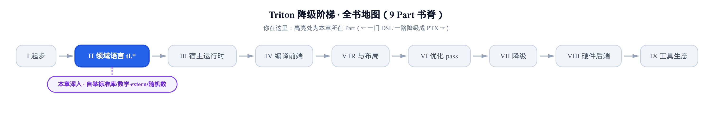
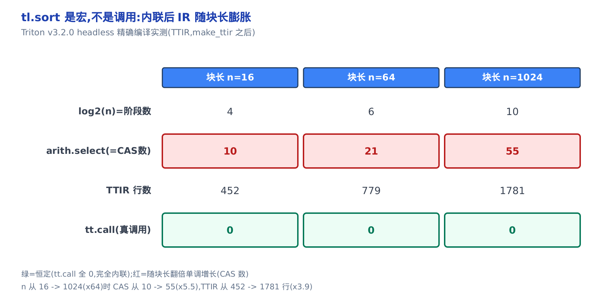
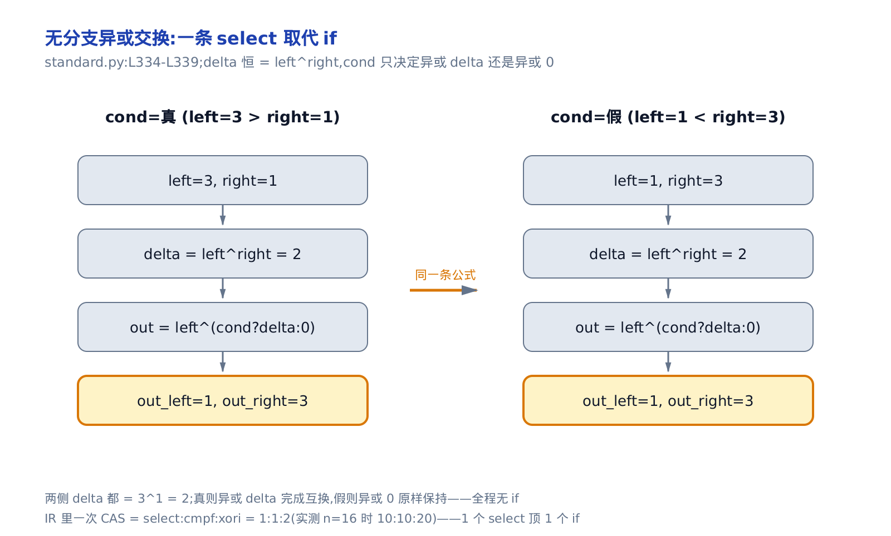
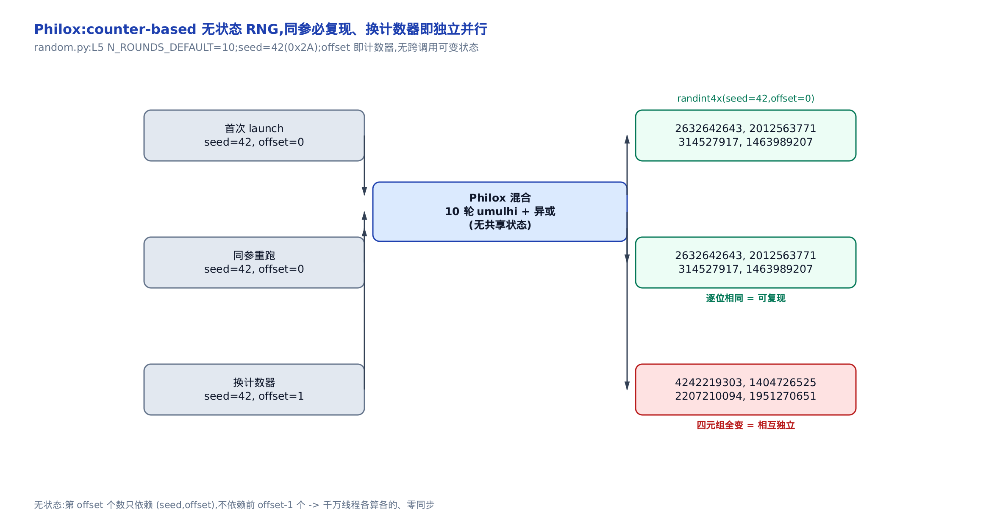
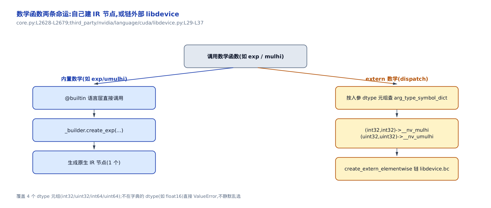
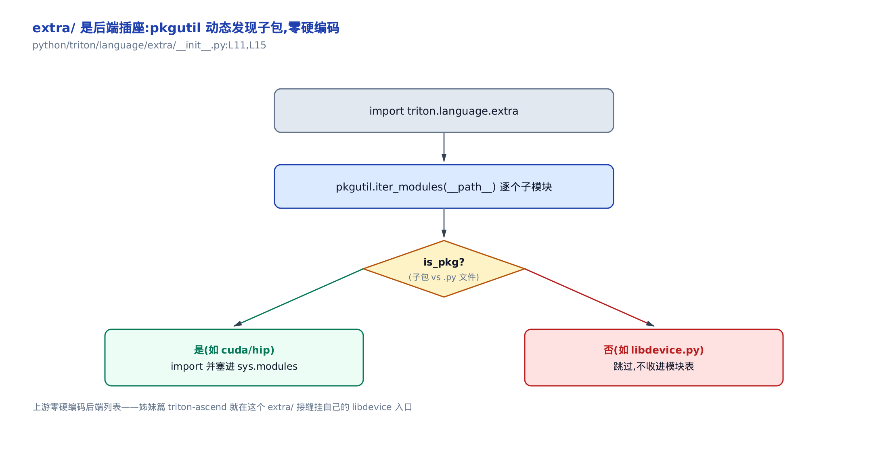
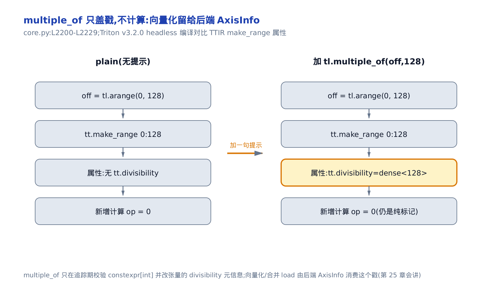

# 在 Triton 里写 Triton：自举的标准库、数学与随机数

> **你在这里**：仍在「领域语言 tl.\*」这一部分。
> 上一章：块级计算 `tl.dot` 与 `combine_fn` 怎么编成 IR。
> 本章：`tl.*` 的上半部怎么用 core 原语自举出来。
> 下一章：离开语言表面，进宿主运行时把 kernel 发射上卡。



你在 kernel 里写下 `tl.sort(x)`，心里默认它是一次便宜的函数调用。**它不是。** 它更像 C 里的一个宏：编译器追踪你的 kernel 时，会把 `sort` 的整个函数体**复制粘贴**进你的 IR（中间表示，intermediate representation——编译器内部对程序的结构化描述）。块开得越大，铺进 IR 的算法网络越大，寄存器压力和编译时长跟着涨。

这件事之所以能发生、也之所以值得你在意，是因为 `tl.*` 的**上半部**根本不是一堆用 C++ 写死的黑盒。`tl.softmax`、`tl.sort`、`tl.cumsum`、`tl.rand`——这些标准库函数，绝大多数是用 `tl.*` 更底层的那批原语、加一个 `@jit`（JIT 编译标记，见[第 4 章](../../ch04-tl-surface-and-constexpr/narrative/chapter.md)）**自举**出来的普通 Triton 代码。它们住在 `python/triton/language/standard.py`、`random.py`、`math.py` 里，你现在就能打开来读。

看懂它是自举的、且调用点会被内联，本章给你两把能直接改 kernel 写法的性能杠杆：

- **杠杆①**：认清 `tl.softmax`/`tl.sort`/`tl.cumsum` 会被**内联进你的 kernel IR**——不是免费调用，是实打实的 IR 膨胀。优化算子时，这笔膨胀要算进预算。
- **杠杆②**：用 `tl.multiple_of`/`tl.max_contiguous` 给张量**贴标签**，把只有你知道的 divisibility（可整除性）/ contiguity（连续性）事实喂给编译器，让原本零散的 `load` 被合并成向量化的宽 `load`。

全章分四段：**一** 讲标准库怎么自举（杠杆①的现场）；**二** 讲随机数 Philox；**三** 讲数学函数为什么分两条路；**四** 收尾编译期诊断与优化提示（杠杆②的现场）。只想拿走能改 kernel 的两条结论，直接看「内联，不是调用」和「给编译器贴张标签」两节；想看 `tl.*` 到底怎么被拼出来的，按序读。全程用钉死的 Triton v3.2.0 做真编译取证，每个 IR 数字都来自一次真实编译。


只想拿走能改 kernel 的两条性能杠杆，跳着看图上标的「内联，不是调用」和「给编译器贴张标签」这两节即可；想看标准库、Philox、数学两条路怎么各自被拼出来的，按一、二、三、四节顺序通读。

---

# 一、在 Triton 里写 Triton：自举的标准库

## cdiv：最小的自举原子

**直觉**。先看最小的一颗原子。99 件货、每箱装 10 件，要几个箱？`99 // 10 = 9` 只装得下 90 件，剩 9 件还得再开一箱——向上取整到 10。这个「不够一箱也算一箱」就是 `cdiv`（ceiling division，向上取整除法）。而它整个函数体只有一行普通算术，没有一句 C++。

**机制**。公式是把「向上取整」翻译成整数运算的经典技巧：先给分子加上 `div - 1`，再做普通的向下取整除法。

```math
\mathrm{cdiv}(x, d) = \left\lceil \frac{x}{d} \right\rceil = \lfloor (x + d - 1) / d \rfloor
```

（公式里的 `d` 就是下面源码签名与验证表里的 `div`，为避免和除号 `/` 混淆才简写成 `d`。）为什么加 `div - 1` 就对了？把 `x` 写成 `x = q·d + r`（`q` 是商，`0 ≤ r < d` 是余数）。那么 `x + d - 1 = q·d + (r + d - 1)`。分两种情况看它除以 `d` 落在哪个商：整除时 `r = 0`，`r + d - 1 = d - 1 < d`，除下来仍是 `q`，**不多给**；有余数时 `r > 0`，`r + d - 1 ∈ [d, 2d-2)`，除下来变 `q + 1`，**正好进一箱**。三组数验证一遍：

<!-- trace: m1-self-hosting-cdiv -->

| x | div | floor = x//div | cdiv = (x+div-1)//div | 为什么不是 floor |
|---|---|---|---|---|
| 10 | 3 | 3 | 4 | floor 少算 1 块（余数被丢），+div-1 把它补回 -> 4 |
| 9 | 3 | 3 | 3 | 整除时 x+div-1 落在同一商内，floor=cdiv=3，不多给 |
| 1 | 4 | 0 | 1 | 不足一块也要一块：floor=0 会丢东西，cdiv=1 |

**不变量**。**`cdiv(x, div)` 恒等于 $`\lceil x/d \rceil`$，且整除时绝不多给一块。** 上面的分情况论证就是证据：整除走 `q`、有余数走 `q + 1`，两条路都精确。

**源码**。看它长什么样——这就是「在 Triton 里写 Triton」的原子证据：

```python
# python/triton/language/standard.py:L29-L40
@core._tensor_member_fn
@jit
def cdiv(x, div):
    # … 省略：docstring …
    return (x + div - 1) // div
```

一个 `@jit` 函数，函数体全是 core 层已有的算术原语（一次加、一次减、一次整除），`@jit` 这一层新增的 C++ 代码是 **0 行**。调用点被内联展开成这 3 个标量算术操作。`cdiv` 只是最干净的一例——同一个模块里的 `softmax`、`sort`、`cumsum` 走的是完全相同的路子：普通 Triton 代码，`@jit` 一裹，调用即内联。这就引出了本章第一把杠杆。

## 内联，不是调用：@jit 库函数在你的 IR 里铺开

**直觉**。`@jit` 函数不像 C 里那种「跳过去执行、再跳回来」的真函数调用。它更像宏：追踪 kernel 时，函数体被原地展开进你的 IR。所以一次 `tl.sort(1024)` 不是 IR 里的一条便宜指令——它是 `sort` 的整套排序网络在你的 IR 里**全铺开**。块越大，铺得越多。

**机制**。用真编译来量。拿一个对长为 `n` 的块调 `tl.sort`（源码 `python/triton/language/standard.py:L367-L387`，下一节细拆）的 kernel，编成 TTIR（Triton IR 的文本形式），数两个东西：`arith.select` 的个数（等于底层 compare-and-swap 的个数，稍后解释，以下简称 CAS），以及 `tt.call`（真函数调用节点）的个数。三档块长比一比：

<!-- trace: m2-inlining-ir-blowup -->

| 块长 n | log2(n) = bitonic 阶段数 | 内联后 arith.select (= CAS 数) | TTIR 行数 | tt.call (真函数调用) |
|---|---|---|---|---|
| 16 | 4 | 10 | 452 | 0 |
| 64 | 6 | 21 | 779 | 0 |
| 1024 | 10 | 55 | 1781 | 0 |

两个信号一眼可见。其一，`tt.call` 那一列**恒为 0**：没有一次真函数调用，`sort` 被完全内联抹平。其二，随块长翻倍，铺进 IR 的 compare-and-swap 数单调猛涨——`n` 从 16 涨到 1024（×64），compare-and-swap 从 10 涨到 55（×5.5），TTIR 从 452 行涨到 1781 行（约 ×3.9）。



**不变量**。**`tt.call` 恒为 0（完全内联），而 IR 里的 compare-and-swap 数随块长单调增长，精确等于阶段数的三角数，其中 $`n_{\mathrm{dims}} = \log_2 n`$。** 为什么是三角数？下一节拆 `sort` 的源码时你会看到：它铺 $`n_{\mathrm{dims}}`$ 个阶段，第 `i` 个阶段铺 `i` 轮 compare-and-swap，逐阶段累加起来就是下一节给出的三角数公式。实测 `n=16 -> 10`、`64 -> 21`、`1024 -> 55`，与公式逐一吻合。

**给你改 kernel 的落点**：`tl.sort`、`tl.softmax` 这类库函数，一次调用等于一整块展开的算法网络。块开到 1024 去排序，你的 IR 里就实打实多了 55 个向量化 compare-and-swap、上千行 TTIR，寄存器压力和编译时长都要为它买单。要排序、要 softmax 没问题，但**把块长当成一个真实的 IR 预算旋钮**，别以为它是免费的一次调用。

## softmax：一个减法买来的数值稳定

**直觉**。`exp` 是个暴脾气：`exp(1000)` 在 fp32 里直接爆成 `inf`，然后 `inf / inf = nan`，softmax 整个作废。技巧极简——先把每个数减去这一行的最大值。最大值变成 0、其余变负数，`exp` 的输入上界被钉在 0，`exp(0) = 1` 永不溢出；而分子分母同乘一个常数会抵消，softmax 的结果一字不变。

**机制**。softmax 的定义与减最大值后的等价形式：

```math
\mathrm{softmax}(x)_i = \frac{e^{x_i}}{\sum_j e^{x_j}} = \frac{e^{x_i - m}}{\sum_j e^{x_j - m}}, \qquad m = \max_j x_j
```

中间到右边这一步，分子分母同乘 $`e^{-m}`$——比值不变，所以**结果恒等**。但右边每个指数的输入 $`x_i - m \le 0`$，于是 $`e^{x_i - m} \le e^0 = 1`$，**绝不会到 inf**。拿一组会撑爆朴素路的输入 `x = [1000, 1001, 1002]` 走两条路对比：

<!-- trace: m3-softmax-stability -->

| x_i | 朴素 exp(x_i) | 减 max 后 z_i = x_i - 1002 | exp(z_i) | 稳定 softmax_i |
|---|---|---|---|---|
| 1000 | inf（溢出） | -2.0 | 0.135 | 0.09 |
| 1001 | inf（溢出） | -1.0 | 0.368 | 0.245 |
| 1002 | inf（溢出） | 0.0 | 1.0 | 0.665 |

朴素路三项 `exp` 全爆成 `inf`，结果全废；稳定路把最大项挪到 `z = 0`，三个 `exp` 都落在 `[0.135, 1.0]` 的安全区，归一化后 `softmax = [0.09, 0.245, 0.665]`，三项和正好 1.0。

**不变量**。**减最大值不改变 softmax 的值，只把 `exp` 的输入上界钉在 0（`exp ≤ 1`），杜绝溢出。** 分子分母同乘常数相消保证「值不变」，`x_i - m ≤ 0` 保证「不溢出」，两件事互不干扰。

**源码**。这套技巧在 `softmax` 里就是一行减法：

```python
# python/triton/language/standard.py:L50-L57
@core._tensor_member_fn
@jit
@math._add_math_1arg_docstr("softmax")
def softmax(x, ieee_rounding=False):
    z = x - max(x, 0)
    num = math.exp(z)
    den = sum(num, 0)
    return math.fdiv(num, den, ieee_rounding)
```

第一行 `z = x - max(x, 0)` 就是数值稳定的全部秘密。往下，`max(x, 0)` 和 `sum(num, 0)` 都是**同一个模块里自举的归约包装**——它们底层落到你在[第 8 章](../../ch08-dot-reduce-scan/narrative/chapter.md)见过的 `reduce`。所以 `tl.softmax` 内联进你 IR 的，不只是一次减法和一次 `exp`，还有两趟 `reduce` 的归约 IR（求 max、求 sum）。这又是杠杆①的一个具体例子：一个看着轻巧的 `tl.softmax`，展开后是「减 + exp + 两趟 reduce + 除」的一整片 IR。

## sort：编译期就铺平的排序网络

**直觉**。GPU 讨厌「看数据决定走哪条分支」——不同线程走不同分支会发散、很慢。bitonic sort（双调排序）绕开了这个问题：它是一张**排序网络**，谁跟谁比、比几轮，完全由块长这个编译期常量定死，与被排的数值无关。既然结构在编译期就定了，就可以在追踪期把它**铺平成定长的 IR**，运行期一个循环都不留，天生适配 SIMT（单指令多线程，见[第 2 章](../../ch02-gpu-execution-model/narrative/chapter.md)）。

**机制**。驱动这套展开的引擎，是一个连 `@jit` 都没有的纯 Python 函数 `_log2`：

```python
# python/triton/language/standard.py:L10-L16
def _log2(i: core.constexpr):
    log2 = 0
    n = i.value
    while n > 1:
        n >>= 1
        log2 += 1
    return core.constexpr(log2)
```

它在**追踪期**（Python 解释器里）就把块长换算成阶段数 `n_dims`，产出一个 `constexpr`（编译期常量，见[第 4 章](../../ch04-tl-surface-and-constexpr/narrative/chapter.md)）。这正是 [第 4 章](../../ch04-tl-surface-and-constexpr/narrative/chapter.md)那套 constexpr 两层结构的应用：一段普通 Python 在追踪期跑完，把结果当常量喂给后面的展开。

顶层 `sort` 拿到 `n_dims` 后，用两层 `static_range`（追踪期展开的循环，边界必须是 constexpr）把网络铺平：

```python
# python/triton/language/standard.py:L342-L387
@jit
def _bitonic_merge(x, stage: core.constexpr, order: core.constexpr, n_dims: core.constexpr):
    # … 省略：docstring …
    n_outer: core.constexpr = x.numel >> n_dims
    core.static_assert(stage <= n_dims)
    if order == 2:
        shape: core.constexpr = [n_outer * 2**(n_dims - 1 - stage), 2, 2**stage]
        flip = core.reshape(core.broadcast_to(core.arange(0, 2)[None, :, None], shape), x.shape)
    else:
        flip = order
    # perform `stage` rounds of `compare-and-swap`
    for i in core.static_range(stage):
        x = _compare_and_swap(x, flip, i + (n_dims - stage), n_dims)
    return x


@core._tensor_member_fn
@jit
def sort(x, dim: core.constexpr = None, descending: core.constexpr = core.CONSTEXPR_0):
    # … 省略：docstring …
    _dim: core.constexpr = len(x.shape) - 1 if dim is None else dim
    core.static_assert(_dim == len(x.shape) - 1, "only minor dimension is currently supported")
    n_dims: core.constexpr = _log2(x.shape[_dim])
    for i in core.static_range(1, n_dims + 1):
        x = _bitonic_merge(x, i, 2 if i < n_dims else descending, n_dims)
    return x
```

先解释那个神秘的字面量 `order`：它编码「这一阶段要往哪个方向拧」。顶层调用给前 `n_dims - 1` 个中间阶段固定传 `order = 2`——这是个哨兵值，表示「还没到最终排序方向」，于是 `_bitonic_merge` 里走 `order == 2` 那条特殊分支，用 `arange` 现造一份交替升 / 降序的 `flip` 张量，把子序列先拧成双调（bitonic）；只有最后一个阶段才传用户真正的 `descending`，由它决定整体最终升序还是降序。细节不必逐行扣，记住这个分工即可：中间阶段搭双调结构、末阶段定方向。

数一数展开出多少个 compare-and-swap：顶层 `static_range(1, n_dims + 1)` 铺 `n_dims` 个 merge 阶段，第 `i` 个 merge 内部 `static_range(stage)` 再铺 `i` 轮 compare-and-swap。累加起来：

```math
\#\mathrm{CAS} = \sum_{i=1}^{n_{\mathrm{dims}}} i = \frac{n_{\mathrm{dims}}(n_{\mathrm{dims}} + 1)}{2} = O(\log^2 n)
```

全部循环边界都是 constexpr，所以这些数在追踪期就定死、展成定长 IR——没有一个运行期循环。这就是上一节 IR 表里「`n=1024 -> 55` 个 compare-and-swap」的出处：`n_dims = log2(1024) = 10`，$`1 + 2 + \dots + 10 = 55`$。

拿最小的 `n = 4`（`n_dims = 2`，`1 + 2 = 3` 次 compare-and-swap）走一遍，看它怎么把乱序块推成有序：

表格「阶段内下标 i」这一列，是喂给 `_compare_and_swap` 第三个形参的换算值，不是 `_bitonic_merge` 内层 `static_range(stage)` 的原始计数器——源码里 `i` 被三层复用：`sort` 顶层循环变量 `i`（取值 1..n_dims，传给 `_bitonic_merge` 时改叫 `stage`）、`_bitonic_merge` 内层 `for i in static_range(stage)` 的循环变量（取值 0..stage-1）、以及换算后喂给 `_compare_and_swap` 的 `i + (n_dims - stage)`。`n=4` 时 `n_dims=2`：`stage=1` 只有内层 `i=0` 一轮，换算成 `0+(2-1)=1`，这就是 CAS#1 的「阶段内下标 i」；`stage=2` 有内层 `i=0,1` 两轮，分别换算成 `0+(2-2)=0` 和 `1+(2-2)=1`，对应 CAS#2 的 `i=0`、CAS#3 的 `i=1`。手算这张表时认准这条换算式，别拿内层原始计数器直接对表。

<!-- trace: m4-bitonic-sort -->

| CAS 调用# | 阶段内下标 i | 调用前 | 调用后 |
|---|---|---|---|
| 1 | 1 | [3, 1, 2, 0] | [1, 3, 2, 0] |
| 2 | 0 | [1, 3, 2, 0] | [1, 0, 2, 3] |
| 3 | 1 | [1, 0, 2, 3] | [0, 1, 2, 3] |

![n=4 的 bitonic sort 用 3 次数据无关的 compare-and-swap 把 [3,1,2,0] 单调收敛为 [0,1,2,3]](../diagrams/fig-ch09-bitonic-n4.png)

**不变量**。**`sort` 铺开的 compare-and-swap 数只依赖块长——即上式推得的三角数公式，与被排的数值无关（data-independent）。** 因为所有循环边界都是 constexpr，网络在追踪期定死；换一组数值进来，走的还是同样的 3 次比较，只是每次比较的结果不同。这正是它适配 SIMT 的根本原因——没有数值相关的分支。

### 无分支的原子：异或条件交换

**直觉**。排序网络的原子操作是「比较两个数，需要就交换」。GPU 上写 `if` 交换会引起分支发散、很贵。bitonic 用一个「异或魔术」做到无分支：注意到 `a` 与 `b` 互换，等价于同时让两者异或 `a ^ b`；交换与否只由一个布尔 `cond` 决定——`cond` 为真就异或 `(a^b)`，为假就异或 0（原样）。一条 `where` 选 `(a^b)` 或 `0`，全程没有 `if`。

**机制**。记 `d = a ^ b`。`cond` 为真时，`a ^ d = a ^ a ^ b = b`、`b ^ d = b ^ a ^ b = a`——两者互换；`cond` 为假时异或 0，`a`、`b` 原样。用升序（`flip = 0`）三组对儿验证，注意三例的 `delta` 都等于 `3 ^ 1 = 2`：

<!-- trace: m5-compare-and-swap -->

| left | right | cond = (left>right)!=0 | delta = left^right | out_left = left^(cond?delta:0) | out_right = right^(cond?delta:0) |
|---|---|---|---|---|---|
| 3 | 1 | 真 -> 交换 | 2 | 1 | 3 |
| 1 | 3 | 假 -> 保持 | 2 | 1 | 3 |
| 2 | 0 | 真 -> 交换 | 2 | 0 | 2 |



**不变量**。**无分支异或交换与「`cond` 时交换、否则保持」语义完全一致，且对任意 dtype 都成立。** 浮点数先 bitcast（按位重解释，不改比特、只改类型看待方式）成同宽整数再异或，故与 dtype 无关。

**源码**。这套魔术就是 `_compare_and_swap` 的最后两行：

```python
# python/triton/language/standard.py:L322-L339
@jit
def _compare_and_swap(x, flip, i: core.constexpr, n_dims: core.constexpr):
    n_outer: core.constexpr = x.numel >> n_dims
    shape: core.constexpr = [n_outer * 2**i, 2, 2**(n_dims - i - 1)]
    y = core.reshape(x, shape)
    # slice left/right with 'stride' 2**(n_dims - i - 1)
    mask = core.arange(0, 2)[None, :, None]
    left = core.broadcast_to(sum(y * (1 - mask), 1)[:, None, :], shape).to(y.dtype)
    right = core.broadcast_to(sum(y * mask, 1)[:, None, :], shape).to(y.dtype)
    left = core.reshape(left, x.shape)
    right = core.reshape(right, x.shape)
    # actual compare-and-swap
    idtype = core.get_int_dtype(bitwidth=x.dtype.primitive_bitwidth, signed=True)
    ileft = left.to(idtype, bitcast=True)
    iright = right.to(idtype, bitcast=True)
    ix = x.to(idtype, bitcast=True)
    ret = ix ^ core.where((left > right) != flip, ileft ^ iright, zeros_like(ix))
    return ret.to(x.dtype, bitcast=True)
```

两个细节值得点破。开头那段 `sum(y * (1 - mask), 1)` / `sum(y * mask, 1)`，是在**不做真正 gather** 的前提下把相邻元素拆成 `left`（偶位）/`right`（奇位）——用乘 mask 再求和代替按下标搬运，对 GPU 更友好。结尾的 `ret = ix ^ where((left > right) != flip, ileft ^ iright, zeros_like(ix))` 就是异或魔术：条件 `(left > right) != flip` 决定升/降序，`where` 选 `ileft ^ iright` 或 0，一条 select 顶掉一个 `if`。到 IR 里，一次 compare-and-swap 展成 1 个 `arith.select` + 1 个比较 + 2 个异或——这就是本章开头那张 IR 表里 select 数等于 compare-and-swap 数的原因。

## cumsum：把 scan 借过来

前缀和 `cumsum` 更省事——它压根不自己写扫描逻辑，直接借[第 8 章](../../ch08-dot-reduce-scan/narrative/chapter.md)的 `associative_scan`，配一个「两数相加」的 combine 函数：

```python
# python/triton/language/standard.py:L293-L299
@core._tensor_member_fn
@jit
@core._add_scan_docstr("cumsum")
def cumsum(input, axis=0, reverse=False):
    # todo rename this to a generic function name
    input = core._promote_bfloat16_to_float32(input)
    return core.associative_scan(input, axis, _sum_combine, reverse)
```

开头 `_promote_bfloat16_to_float32` 是把 bf16 先升到 fp32 做累加、防精度损失，一句带过。核心就一行：`associative_scan(input, axis, _sum_combine, reverse)`。扫描的机理 [第 8 章](../../ch08-dot-reduce-scan/narrative/chapter.md)已经拆透，这里不重讲；要记住的是——它同样是 `@jit` 自举、同样会被内联。`cumsum`、`softmax`、`sort` 三个例子摆在一起，「标准库是普通 Triton 代码、调用即内联」这个事实就立住了。

---

# 二、随机数：无状态的 Philox

## 计数器就是状态：counter-based RNG

**直觉**。传统 RNG（随机数生成器）像一条流水线：要第 100 个数，得先摇出前 99 个，因为它持有一份可变状态。GPU 上千万线程若共享这条流水线，就得加锁同步，并行全毁。Philox 反过来——它是个**纯函数** `rand(seed, counter)`：想要第 `offset` 个随机数，直接把 `offset` 当计数器喂进去，不摇前面的。无状态意味着每个线程各算各的、无需同步，且同样的 `(seed, offset)` 永远给出同一个数（可复现）。

**机制**。三个场景说清「无状态」买到了什么：同参重跑必须逐位复现，换一个计数器必须得到一组独立的数。`seed = 42` 下试：

<!-- trace: m7-philox-counterbased -->

| 场景 | seed | offset（计数器） | randint4x 输出 [c0, c1, c2, c3] |
|---|---|---|---|
| 首次 launch | 42 | 0 | [2632642643, 2012563771, 314527917, 1463989207] |
| 同参重跑（可复现） | 42 | 0 | [2632642643, 2012563771, 314527917, 1463989207] —— 逐位相同 |
| 换计数器（无状态并行） | 42 | 1 | [4242219303, 1404726525, 2207210094, 1951270651] —— 全变 |

`offset = 0` 跑两次，四元组逐位相同——可复现；`offset` 换成 1，四个输出全变、彼此无相关性——这正是「换计数器即得独立随机流」，千万线程各持一个 `offset`、零同步地并行取数。



**不变量**。**输出只是 `(seed, offset)` 的确定性纯函数：无状态，故同参 bit-exact 复现、不同 offset 相互独立可并行。** 第 `offset` 个数与前 `offset-1` 个数之间**没有数据依赖**，这是完美并行的根子。

**源码**。无状态性最直观的出处是入口 `randint4x`——`offset` 是被喂进去的计数器，不是被持有的状态：

```python
# python/triton/language/random.py:L85-L99
@jit
def randint4x(seed, offset, n_rounds: tl.constexpr = N_ROUNDS_DEFAULT):
    # … 省略：docstring …
    # _0 = tl.zeros(offset.shape, offset.dtype)
    _0 = offset * 0
    return philox(seed, offset, _0, _0, _0, n_rounds)
```

`_0 = offset * 0` 造一个同形状的零块，然后把 `(offset, 0, 0, 0)` 作为初始状态喂进 `philox`。没有任何跨调用保存的变量——同一个 `(seed, offset)` 进去，同一批随机数出来。真正的搅拌在 `philox_impl` 里，10 轮混合：

```python
# python/triton/language/random.py:L12-L42
@jit
def philox_impl(c0, c1, c2, c3, k0, k1, n_rounds: tl.constexpr = N_ROUNDS_DEFAULT):
    # … 省略：docstring …
    if c0.dtype == tl.uint32:
        PHILOX_KEY_A: tl.constexpr = 0x9E3779B9
        PHILOX_KEY_B: tl.constexpr = 0xBB67AE85
        PHILOX_ROUND_A: tl.constexpr = 0xD2511F53
        PHILOX_ROUND_B: tl.constexpr = 0xCD9E8D57
    else:
        # … 省略：uint64 一路常量不同，混合结构相同 …
        tl.static_assert(c0.dtype == tl.uint64, "dtype not supported in philox_impl")

    for _ in tl.static_range(n_rounds):
        # update random state
        A = PHILOX_ROUND_A
        B = PHILOX_ROUND_B
        _c0, _c2 = c0, c2
        c0 = math.umulhi(B, _c2) ^ c1 ^ k0
        c2 = math.umulhi(A, _c0) ^ c3 ^ k1
        c1 = tl.mul(B, _c2, sanitize_overflow=False)
        c3 = tl.mul(A, _c0, sanitize_overflow=False)
        # raise key
        k0 = tl.add(k0, PHILOX_KEY_A, sanitize_overflow=False)
        k1 = tl.add(k1, PHILOX_KEY_B, sanitize_overflow=False)
    return c0, c1, c2, c3
```

轮数 `N_ROUNDS_DEFAULT = 10`。每轮用 `math.umulhi`（取两数 2N 位乘积的高 N 位，$`\lfloor (a \cdot b) / 2^N \rfloor`$）加上异或，把状态搅乱——高位乘法负责跨比特的雪崩混合，异或负责扩散。`for _ in tl.static_range(n_rounds)` 又是追踪期展开：10 轮在你的 IR 里同样铺成定长网络，与 `sort` 同理。而这里每个 `tl.mul` / `tl.add` 都带着一个刺眼的参数 `sanitize_overflow=False`——那是下一节的主角。

## 故意让它溢出：环绕算术

**直觉**。RNG 的搅拌，靠的恰恰是「整数算到溢出就绕回去」这套 mod $`2^{32}`$ 的钟表算术——走满一圈从 0 重来。所以 Philox 的每个乘加都刻意传 `sanitize_overflow=False`，主动**要**环绕。这跟[第 6 章](../../ch06-type-promotion-broadcast/narrative/chapter.md)里默认 `sanitize_overflow=True`「防溢出」是同一个开关的**相反用法**：那边把溢出当 bug 拦下，这边把溢出当特性放行。

**机制**。看上一节 `philox_impl` 里那个乘法 `c1 = tl.mul(B, _c2, sanitize_overflow=False)`（`python/triton/language/random.py:L37`），`B = 0xCD9E8D57 = 3449720151`（就是 `PHILOX_ROUND_B`）。`_c2` 取两个值，一个不溢出、一个溢出：

<!-- trace: m8-wraparound-sanitize-off -->

| _c2 | 完整积 B×_c2 | 是否 ≥ 2^32 = 4294967296 | sanitize=False 环绕后 (mod 2^32) |
|---|---|---|---|
| 1 | 3449720151 | 否（不溢出） | 3449720151（不变） |
| 3 | 10349160453 | 是（溢出） | 1759225861（绕回） |

`_c2 = 1` 时完整积 `3449720151 < 2^32`，不溢出、值不变；`_c2 = 3` 时完整积 `10349160453` 超过一圈多，环绕后 `10349160453 - 2×4294967296 = 1759225861`。两个结果都是 RNG 需要的确定性行为。

**不变量**。**关掉 `sanitize_overflow` 使乘加落在 $`\mathbb{Z}/2^{32}`$ 环上做精确模运算；不溢出时值不变，溢出时按 mod $`2^{32}`$ 环绕。** 若在这里开着 [第 6 章](../../ch06-type-promotion-broadcast/narrative/chapter.md)那个默认的 `sanitize_overflow=True`，第二种情况会被判成溢出错误，Philox 赖以生成随机数的置换数学当场崩掉。所以这里必须**显式** `False`——同一个开关，[第 6 章](../../ch06-type-promotion-broadcast/narrative/chapter.md)用它防 bug，这里用它成就正确的 RNG。

---

# 三、数学的两条路

`math.umulhi`、`math.exp` 这些数学函数，实现方式不止一种。有的语言层自己就有对应的 IR 节点，直接建；有的没有，得去链接外部库。这一节把两条路都摊开——它也是理解「后端怎么挂载自己数学实现」的接缝。

## 第一条路：语言层自己建 IR 节点

**直觉**。常见的数学 op，Triton 的语言层自己就有一个对应的 MLIR（Multi-Level IR，多层中间表示框架）节点。这时函数体拿到 IR 构造器 `_builder`，直接 `_builder.create_exp(...)` 建一个原生节点就完事，不需要链任何外部库。

**源码**。`umulhi` 和 `exp` 是这条路的代表——它们是 `@core.builtin` 函数（内建函数，能拿到 `_builder`）：

```python
# python/triton/language/math.py:L85-L101
@core.builtin
@_check_dtype(dtypes=["int32", "int64", "uint32", "uint64"])
@_add_math_2arg_docstr("most significant N bits of the 2N-bit product")
def umulhi(x, y, _builder=None):
    x = semantic.to_tensor(x, _builder)
    y = semantic.to_tensor(y, _builder)
    x, y = core.binary_op_type_legalization(x, y, _builder)
    return core.tensor(_builder.create_umulhi(x.handle, y.handle), x.type)


@core.builtin
@_check_dtype(dtypes=["fp32", "fp64"])
@_add_math_1arg_docstr("exponential")
@core._tensor_member_fn
def exp(x, _builder=None):
    x = semantic.to_tensor(x, _builder)
    return core.tensor(_builder.create_exp(x.handle), x.type)
```

两个函数都干同一件事：把标量归一成 tensor，然后 `_builder.create_umulhi` / `_builder.create_exp` 各建**一个**原生 IR 节点。`@_check_dtype` 那层是入参类型白名单——`exp` 只收 fp32/fp64，`umulhi` 只收整型。语言层原生有这个 op，就自己建，第一条路到此结束。

**不变量**。**语言层原生有对应 MLIR op 时，内置数学函数与 IR 节点是 1:1 直接映射——不查任何符号表、不链接任何外部库。** 这与下一节 extern 路径的「按 dtype 元组查表选符号」正好互斥对照，两条路合起来才是数学函数的全貌。

## 第二条路：链外部的 libdevice

**直觉**。可很多 transcendental（超越函数，如某些特殊三角/指数变体）在语言层**没有**原生 MLIR 节点。这时不建节点，改「链外部库」：按入参的 dtype 元组去一张字典里查出 NVIDIA libdevice（CUDA 自带的一批设备端数学函数的 bitcode 库）里的具名符号，把调用绑上去，编译期链接 `libdevice.bc`（bitcode，LLVM 的中间字节码）拿到高质量实现。

**机制**。以 `libdevice.mulhi` 为例。它按入参 dtype 元组选符号：`(int32, int32)` 走有符号的 `__nv_mulhi`，`(uint32, uint32)` 走无符号的 `__nv_umulhi`，各走各路；查不到的 dtype 直接报错，绝不静默乱选：

<!-- trace: m10-extern-dispatch-path -->

| 入参 dtype 元组 | 查中的外部符号 | 返回 dtype | 命中？ |
|---|---|---|---|
| (int32, int32) | __nv_mulhi | int32 | 命中 |
| (uint32, uint32) | __nv_umulhi | uint32 | 命中 |
| (uint64, uint64) | __nv_umul64hi | uint64 | 命中 |
| (float16, float16) | — | — | 未命中 -> ValueError |



图里只画了命中的路径；上表最后一行的「查不到就 `ValueError`」失败分支未入图——正是这条「不静默乱选」的规则，兜住了 dispatch 的正确性。

**不变量**。**dispatch 以入参 dtype 元组为 key 精确选符号；key 不在字典即报错，不会静默乱选。** 有符号 / 无符号、32 位 / 64 位的区分，全靠这层字典查表。

**源码**。后端的声明是一个 `@core.extern` 薄包装，函数体就是调 `extern_elementwise`、递上一张「dtype 元组映射到（符号，返回 dtype）」的字典：

```python
# third_party/nvidia/language/cuda/libdevice.py:L29-L37
@core.extern
def mulhi(arg0, arg1, _builder=None):
    return core.extern_elementwise(
        "", "", [arg0, arg1], {
            (core.dtype("int32"), core.dtype("int32")): ("__nv_mulhi", core.dtype("int32")),
            (core.dtype("uint32"), core.dtype("uint32")): ("__nv_umulhi", core.dtype("uint32")),
            (core.dtype("int64"), core.dtype("int64")): ("__nv_mul64hi", core.dtype("int64")),
            (core.dtype("uint64"), core.dtype("uint64")): ("__nv_umul64hi", core.dtype("uint64")),
        }, is_pure=True, _builder=_builder)
```

`extern_elementwise` 做完广播/类型对齐后，把活交给 `dispatch`——真正的选符号逻辑在这里：

```python
# python/triton/language/core.py:L2639-L2679
@builtin
def extern_elementwise(lib_name, lib_path, args, arg_type_symbol_dict, is_pure, _builder=None):
    dispatch_args = args.copy()
    ret_shape = None
    # … 省略：把 dispatch_args 逐个 to_tensor、按广播规则对齐到公共 shape，非全标量时把 ret_shape 设成广播 shape …
    func = _builder.create_extern_elementwise
    return dispatch(func, lib_name, lib_path, dispatch_args, arg_type_symbol_dict, ret_shape, is_pure, _builder)
```

```python
# python/triton/language/core.py:L2628-L2636
    if arg_types not in arg_type_symbol_dict:
        raise ValueError(f"input arg type does not match."
                         f"Expect one of {arg_type_symbol_dict.keys()}, got {arg_types}")
    else:
        symbol = arg_type_symbol_dict[arg_types][0]
        ret_type = arg_type_symbol_dict[arg_types][1]
        if ret_shape:
            ret_type = block_type(ret_type, ret_shape)
        return tensor(func(lib_name, lib_path, symbol, arg_list, ret_type.to_ir(_builder), is_pure), ret_type)
```

`dispatch` 先检查 `arg_types` 在不在字典里，不在就 `raise ValueError`（表里 `float16` 那一行就是这么被拦下的）；在，就取出符号名和返回类型，交给 `func`（即 `create_extern_elementwise`）绑定。到 IR 里，第一条路是 1 个 `create_umulhi` 原生节点；第二条路是 1 次 `create_extern_elementwise` 外加链一份外部 bitcode。有原生 op 就自己建、没有就链外部库——这就是数学函数的两条命运。

## extra/：后端的插座

**直觉**。可后端（cuda / hip / …）的 libdevice 是怎么被挂进来的？答案是 `extra/` 目录——一个「插座面板」。谁把后端子包插进来，`pkgutil`（Python 标准库的包遍历工具）就在 import 时逐个发现并挂载，上游不必硬编码「有哪些后端」。

**源码**。

```python
# python/triton/language/extra/__init__.py:L1-L26
import pkgutil
from importlib.util import module_from_spec
from sys import modules

_backends = []
for module_finder, module_name, is_pkg in pkgutil.iter_modules(
        __path__,
        prefix=__name__ + ".",
):
    # skip .py files (like libdevice.py)
    if not is_pkg:
        continue

    # import backends (like cuda and hip) that are included during setup.py
    spec = module_finder.find_spec(module_name)
    if spec is None or spec.loader is None:
        continue
    module = module_from_spec(spec)
    spec.loader.exec_module(module)

    _backends.append(module_name)
    modules[module_name] = module

__all__ = _backends
del _backends
```

`pkgutil.iter_modules` 遍历 `extra/` 下的每个条目，`if not is_pkg: continue` 把 `.py` 文件跳过、只收**子包**（cuda / hip 这种目录形式的后端），逐个 import 进 `sys.modules`（Python 已加载模块表）。注释里被跳过的这个 `libdevice.py` 是直接躺在 `extra/` 目录下的一个普通模块文件——它和上一节 `third_party/nvidia/language/cuda/libdevice.py` 只是同名，是两个不同位置的文件，别搞混：一个是被 `pkgutil` 跳过的顶层占位模块，一个是 NVIDIA 后端真正的 extern 声明。上游代码里没有一处写死「后端有 cuda 和 hip」——它们是被动态发现的。

**不变量**。**`pkgutil.iter_modules` 只发现 `extra/` 目录下真实存在的子包（`is_pkg=True`）——新增 / 删除一个后端只需增删对应目录，`__init__.py` 本身永远不必改动。** 这正是它「后端插座」这个比喻成立的根子。



（题外话：Triton 生态里另有面向昇腾芯片的第三方后端实现，它接进来的方式也不外乎这个接缝——在 `extra/` 下放一个自己的后端子包、接上昇腾的 libdevice 入口，同一个 `pkgutil` 循环就会多发现一个后端。这里不展开，只说明这个动态发现机制正是异构后端得以「插拔」的公共地基。）

---

# 四、编译期诊断与优化提示

标准库、随机数、数学都读完了。最后收两样贴身工具：一样帮你在**编译期**就把错误喊出来，一样帮你把 `load` 喂成向量化——后者就是本章的第二把性能杠杆。

## static_print / static_assert：追踪期就说话

**直觉**。`sort` 源码里那句 `core.static_assert(_dim == len(x.shape) - 1, ...)`，是在**追踪期**（编译还没结束、正在搭 IR 的阶段）就检查块的维度合法性——不合法当场报错，连 IR 都不生成。它跟运行期在设备上打印/断言是两回事。

**源码**。有意思的是，这两个函数的函数体是 `pass`——空的：

```python
# python/triton/language/core.py:L2264-L2291
@builtin
def static_print(*values, sep: str = " ", end: str = "\n", file=None, flush=False, _builder=None):
    # … 省略：docstring …
    pass


@builtin
def static_assert(cond, msg="", _builder=None):
    # … 省略：docstring …
    pass
```

为什么是空的？因为真正的求值不在这里，而在编译器生成 AST（抽象语法树）时对 constexpr 的处理里就完成了。`static_assert` 还有个便利：它**不需要**设 `TRITON_DEBUG` 环境变量就生效。作为对比，运行期在设备上打印 / 断言的那套设施（例如 `tl.device_print`）默认是关的，得设 `TRITON_DEBUG=1` 才打开——本章不展开，只用来映衬 `static_assert` 的「追踪期无条件生效」。

**不变量**：**static_assert / static_print 求值发生在追踪期对 constexpr 的处理里，不产生任何运行期 IR；且 static_assert 不依赖 `TRITON_DEBUG`，可在库函数里无条件生效。** 正因如此，库函数（如 `sort`）能大方地用它在追踪期卡住非法块长，不给你留到运行期才崩的机会。

## multiple_of / max_contiguous：给编译器贴张标签

**直觉**。编译器不总能自动看出「这批地址一定能被 128 整除」这类事实。可它一旦知道，就能把 128 个零散 `load` 合并成一条向量化的宽 `load`。`tl.multiple_of(off, 128)` 就是你把这个只有程序员知道的事实**贴一张标签**塞进 IR——它自己**不做任何计算**，只在张量上盖一个 `tt.divisibility=128` 的戳。真正拿这个戳去做向量化的，是后端的 AxisInfo（逐轴推导对齐 / 连续性的编译器静态分析，第 25 章细讲）。

**机制**。用真编译比一比。一个对 `off = tl.arange(0, 128)` 做 `load` 的 kernel，加不加提示，看 IR 里 `make_range` 节点上的属性差别：

<!-- trace: m12-optimization-hints -->

| 版本 | make_range 上是否有 tt.divisibility 标记 | 标记值 |
|---|---|---|
| 无提示（plain） | 无 | — |
| tl.multiple_of(off, 128) | 有 | 128 |

不加提示时 `make_range` 光秃秃，什么属性都没有；加一句 `tl.multiple_of(off, 128)` 后，同一个节点上多出 `tt.divisibility=dense<128>`。而两个版本新增的**计算** op 都是 0——它纯粹是打标记，不产生任何算术。



**不变量**。**`multiple_of` 只在追踪期校验 `constexpr[int]` 并给张量打 divisibility 标记，本身不产生任何计算 op；标记进入 IR 属性，供后端消费。**

**源码**。`multiple_of` 和它的孪生兄弟 `max_contiguous` 结构一模一样——校验、打标记，仅此而已：

```python
# python/triton/language/core.py:L2200-L2229
@builtin
def multiple_of(input, values, _builder=None):
    # … 省略：docstring …
    if isinstance(values, constexpr):
        values = [values]
    for i, d in enumerate(values):
        if not isinstance(d, constexpr):
            raise TypeError(f"values element {i} must have type `constexpr`")
        if not isinstance(d.value, int):
            raise TypeError(f"values element {i} must have type `constexpr[int]`, got `constexpr[{type(d.value)}]")
    values = [x.value for x in values]
    return semantic.multiple_of(input, values)


@builtin
def max_contiguous(input, values, _builder=None):
    # … 省略：与 multiple_of 同构的 constexpr[int] 校验 …
    values = [x.value for x in values]
    return semantic.max_contiguous(input, values)
```

函数体先逐元素 `assert` 每个值是 `constexpr[int]`（不是就 `TypeError`），然后 `return semantic.multiple_of(...)`——只改张量的 divisibility 元信息、不建一个算术节点。`multiple_of` 打的是「可被 N 整除」，`max_contiguous` 打的是「前 N 个值连续」，都是同一类元信息。

**给你改 kernel 的落点**：这是本章第二把杠杆的把手。当你的偏移量确实满足 divisibility（比如块首地址对齐、`BLOCK` 是 2 的幂），主动 `tl.multiple_of` 把这个事实告诉编译器，后端才敢把 `load` 合并向量化，访存效率成倍提升。但反过来——**标签打错就是未定义行为**：你声称能被 128 整除、实际不能，编译器照单全收去向量化，结果是错的。所以这张标签只在你**确知**成立时贴。至于编译器拿到 `tt.divisibility` 之后具体怎么把 `load` 合并，是后端 AxisInfo 与 Coalesce（把零散 load 合并成宽 load 的优化 pass）的活儿，第 25 章会讲。

---

# 小结

这一章证明了一件事：`tl.*` 的上半部不是黑盒。`cdiv`、`softmax`、`sort`、`cumsum` 是用 core 原语 `@jit` 自举出来的普通 Triton 代码；Philox 是无状态的 counter-based RNG，靠刻意的环绕算术搅拌；数学函数分「自己建 IR 节点」和「链外部 libdevice」两条路，后端经 `extra/` 的 `pkgutil` 接缝动态挂载。

带走两把能直接改 kernel 的杠杆：

- **杠杆①：库函数是宏，不是免费调用。** `tl.sort(1024)` 在你的 IR 里铺开 55 个 compare-and-swap、上千行 TTIR，`tt.call` 恒为 0。块长是一个真实的 IR 预算旋钮——要用这些库函数没问题，但把内联膨胀算进寄存器压力和编译时长的账里。
- **杠杆②：`multiple_of` / `max_contiguous` 是你贴给编译器的标签。** 它不计算，只在张量上盖 divisibility / contiguity 的戳。确知成立时贴上，后端才敢把 `load` 向量化；打错则是未定义行为。

下一章离开语言表面，进入宿主运行时——看 `@triton.jit` 修饰的函数怎么被缓存、怎么按参数特化、怎么最终发射上卡。
