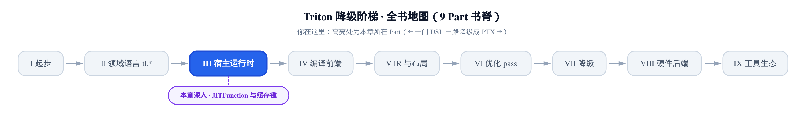
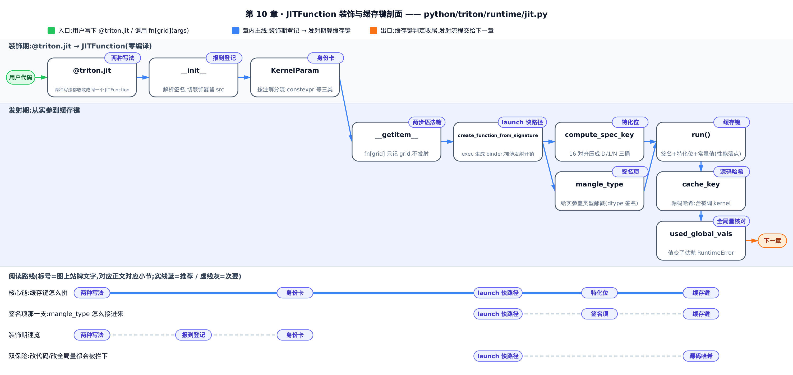
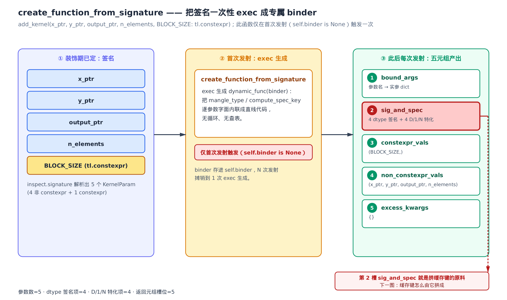
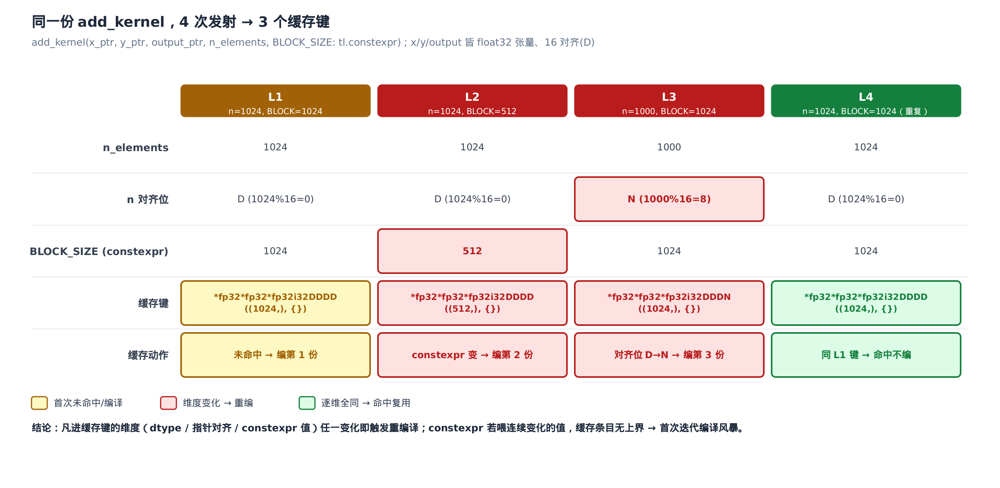

# @triton.jit、JITFunction 与缓存键：什么进了缓存键，什么就会触发重编译

> **你在这里**：全书从一门 DSL 一路降到 PTX，现在跨进第三部分「宿主运行时」。
> 上一章：还在语言表面，看标准库怎么用 Triton 自己写 Triton。
> 本章：离开语言表面，看 `@triton.jit` 怎么把你的函数变成一个能被发射的对象，以及缓存键由什么拼成。



前两部分我们一直站在**语言**这一侧：`tl.load`、`tl.dot`、`tl.constexpr` 这些原语被追踪成 IR 的过程。但你在 Python 里写下的第一行从来不是 `tl.load`——是 `@triton.jit`。这一行装饰器之后，你的函数就不再是普通 Python 函数了：直接 `add_kernel(...)` 调它会抛错，只能用 `add_kernel[grid](...)` 发射上卡。这一章讲的就是这行装饰器背后的 runtime 机制——它几乎全部住在 `python/triton/runtime/jit.py` 这一个文件里。

**本章要解锁的性能杠杆，是一句话：认清什么进了缓存键（cache key），就知道什么会触发重编译。** Triton 对同一份 kernel 源码不是只编一次——它按「这次实参长什么样」算出一个缓存键，键不同就各编一份、各存一格。喂不同的 dtype、不同的指针对齐、不同的 `constexpr` 值，都会算出不同的键。最要命的是 `constexpr`：如果你把一个**逐次变化**的值（比如每个 batch 都不同的 `seqlen`）当 `constexpr` 传进去，缓存键就没有上界——每次发射都未命中、都重编一份，首次迭代直接变成一场编译风暴，把训练/推理的第一步拖到几十秒。看懂缓存键怎么算，你就能一眼看出自己的 kernel 会不会撞上这个坑。

我们分两段走。前半程是**装饰期**：`@triton.jit` 拿到你的函数做了什么（解析签名、切源码、开缓存柜），到手一个 `JITFunction`（`@triton.jit` 的产物对象，见[第 1 章](../../ch01-what-is-triton/narrative/chapter.md)）就打住——一行都还没编译。后半程是**首次发射期**：`fn[grid](...)` 第一次跑起来，runtime 怎么把这次实参算成一个缓存键。到「缓存键怎么算出来、什么让它变」为止；键算出来之后查表、未命中怎么走完整条编译发射流水线，是下一章的主题。

全程用钉死的 Triton v3.2.0 做取证。缓存键相关的这些函数——`compute_spec_key`、`mangle_type`、`create_function_from_signature`、源码哈希——全是纯 Python，不碰 GPU 也能逐字跑出真值，下面每张表的数字都这么来。全章用一个例子贯穿：Triton 教程里的经典向量加。

```python
@triton.jit
def add_kernel(x_ptr, y_ptr, output_ptr, n_elements, BLOCK_SIZE: tl.constexpr):
    ...
```

五个参数：三个指针 `x_ptr / y_ptr / output_ptr`、一个整数 `n_elements`、一个 `constexpr` 的 `BLOCK_SIZE`。装饰期怎么把它们解析成参数元数据，发射期怎么把它们算成缓存键，我们盯着这一个例子看到底。



只想抓住性能杠杆——认清什么会撞上重编译，直接跳「launch 快路径」看完接着读「特化位」「缓存键」两节；只想弄清 `JITFunction` 怎么来的，从「两种写法」顺着读到「身份卡」就够；关心改一行代码为什么也会重编，另看「源码哈希」一节。

---

# 第一段：装饰期——从 `@triton.jit` 到一个 JITFunction

## 两种写法，同一个归宿

先看这行装饰器本身。`@triton.jit` 既能裸用，也能带参数写成 `@triton.jit(debug=True)`——两种写法在源码里怎么收敛到一处？

```python
# python/triton/runtime/jit.py:L803-L855
def jit(
    fn: Optional[T] = None,
    *,
    version=None,
    # … 省略：repr / launch_metadata / do_not_specialize 等关键字参数 …
    noinline: Optional[bool] = None,
) -> Union[JITFunction[T], Callable[[T], JITFunction[T]]]:
    def decorator(fn: T) -> JITFunction[T]:
        assert callable(fn)
        if os.getenv("TRITON_INTERPRET", "0") == "1":
            from .interpreter import InterpretedFunction
            return InterpretedFunction(fn, version=version, ...)
        else:
            return JITFunction(
                fn,
                version=version,
                # … 省略：其余参数原样转交 …
                launch_metadata=launch_metadata,
            )

    if fn is not None:
        return decorator(fn)
    else:
        return decorator
```

关键在最后四行。裸用 `@triton.jit` 时，`fn` 就是你那个函数、非 `None`，直接走 `decorator(fn)` 返回一个 `JITFunction`。带参写 `@triton.jit(debug=True)` 时，`fn` 是 `None`、函数只收到了关键字参数，于是返回 `decorator` 这个闭包本身，等 Python 再拿你的函数去调它——绕一圈，还是落到 `decorator(fn)`。两条路殊途同归，产物都是一个 `JITFunction`。

`decorator` 里还有一道岔口：环境变量 `TRITON_INTERPRET=1`（解释器模式开关，见[第 1 章](../../ch01-what-is-triton/narrative/chapter.md)）时返回的是 `InterpretedFunction`（`python/triton/runtime/interpreter.py`）——一个不碰 GPU 的 CPU 替身，用来在没有卡的机器上调试 kernel 逻辑，本书后面有专章讲它。默认关闭，走 `JITFunction` 这条主路。

从这一刻起，`add_kernel` 这个名字绑定的不再是原函数，而是一个 `JITFunction` 对象。它甚至拒绝被当普通函数调用——直接 `add_kernel(x, y, ...)` 会抛错（见 `__call__`，jit.py:L765-766），逼你走 `add_kernel[grid](...)` 的发射语法。为什么这样设计，看完 `__init__` 就懂：它压根没打算「执行」你的函数体，只想「解析」它。

## `__init__`：报到登记，零编译

**直觉**。装饰期像新员工报到登记，不是上岗干活。`@triton.jit` 拿到你的函数，照签名给每个参数发一张身份卡（`KernelParam`，参数元数据对象），撕掉最上面那行 `@triton.jit` 只留函数正文，再开一个按设备分格的空档案柜（`cache`），就把它放走了——一行 kernel 都没编译。真正的编译推迟到首次发射且缓存未命中时，那是下一章的事。

**机制**。把 `add_kernel` 的五个参数走一遍登记流程，看装饰期结束时 `JITFunction` 手里攥着什么：

<!-- trace: jitfunction-init -->

| 下标 | 参数名 | 注解 | `is_constexpr` | 在缓存键里的角色 |
|---|---|---|---|---|
| 0 | `x_ptr` | （无） | 否 | 签名项 + 特化位 |
| 1 | `y_ptr` | （无） | 否 | 签名项 + 特化位 |
| 2 | `output_ptr` | （无） | 否 | 签名项 + 特化位 |
| 3 | `n_elements` | （无） | 否 | 签名项 + 特化位 |
| 4 | `BLOCK_SIZE` | `tl.constexpr` | 是 | `constexpr` 具体值（单列，不进签名/特化） |

（表格里「特化位」这个词先按下不表——它具体是什么、`compute_spec_key` 怎么算出来，见本章后半程「特化位：`compute_spec_key`」一节；这里只需记住它是缓存键里独立于 dtype 签名的另一维。）

登记完，`JITFunction` 上留下这几样东西：`arg_names = ['x_ptr','y_ptr','output_ptr','n_elements','BLOCK_SIZE']`；`constexprs = [4]`（只有 `BLOCK_SIZE` 这一个 `constexpr` 参数的下标）；`self.src` 从 `def add_kernel(` 起（`@triton.jit` 那行已被切掉）；`self.cache` 是个空的两层字典。注意最后一列已经埋下伏笔：4 个非 `constexpr` 参数进「签名 + 特化位」，唯独 `BLOCK_SIZE` 走「具体值单列」这条另类通道——这个区别是后半程缓存键爆炸的种子。

**不变量**。装饰期是纯登记、零编译。论据在 `__init__` 的每一行里：

```python
# python/triton/runtime/jit.py:L657-L716
    def __init__(self, fn, version=None, do_not_specialize=None, do_not_specialize_on_alignment=None, debug=None,
                 noinline=None, repr=None, launch_metadata=None):
        # … 省略：把 do_not_specialize 缺省成空列表 …
        self.fn = fn
        self.module = fn.__module__
        self.version = version
        self.signature = inspect.signature(fn)
        # … 省略：记住 do_not_specialize 开关 …
        self.starting_line_number = inspect.getsourcelines(fn)[1]
        # … 省略：repr / launch_metadata …

        self.binder = None

        self.params = []
        for i, param in enumerate(self.signature.parameters.values()):
            dns = i in do_not_specialize or param.name in do_not_specialize
            dns_oa = i in do_not_specialize_on_alignment or param.name in do_not_specialize_on_alignment
            self.params.append(KernelParam(i, param, dns, dns_oa))

        # function source code (without decorators)
        self.src = textwrap.dedent(inspect.getsource(fn))
        self.src = self.src[re.search(r"^def\s+\w+\s*\(", self.src, re.MULTILINE).start():]
        # cache of just-in-time compiled kernels
        self.cache = defaultdict(dict)
        self.hash = None
        # … 省略：used_global_vals 的登记说明，后面单讲 …

        self.arg_names = [p.name for p in self.params]
        self.constexprs = [p.num for p in self.params if p.is_constexpr]
        # … 省略：pre_run_hooks 与转发 __doc__/__name__/__globals__ …
```

逐行看做了什么、没做什么：

- `inspect.signature(fn)`（`inspect` 是 Python 标准库的函数内省模块）解析出参数列表——只读签名，不碰函数体。
- `for i, param in ...` 逐参数造 `KernelParam`。这里 `dns`（`do_not_specialize`）的判定值得留意：`i in do_not_specialize or param.name in do_not_specialize`——**下标命中或名字命中都算**，所以你既能写 `do_not_specialize=[3]` 也能写 `do_not_specialize=['n_elements']` 关掉某个参数的特化。
- 同一行还造了 `dns_oa`（`do_not_specialize_on_alignment`），判定方式与 `dns` 对称。它是比 `dns` 更细粒度的开关——关掉的只是**对齐特化**：该参数从此永远拿不到 `D` 这个特化码，但仍可能落 `1` 或 `N`，dtype 签名和其他参数的判据都不受影响。这个开关怎么落到生成的代码里，下半程拼缓存键时会看到。
- `self.src` 两步：`textwrap.dedent` 去掉缩进，再用正则 `re.search(r"^def\s+\w+\s*\(")` 找到第一个 `def` 的位置、从那里切到底——**把 `@triton.jit` 装饰器行整个切掉，只留纯函数源码**。为什么要切？因为这份 `src` 后面要被重新解析成 AST 喂给编译器前端追踪（追踪期怎么把源码变 IR，见[第 1 章](../../ch01-what-is-triton/narrative/chapter.md)与[第 3 章](../../ch03-kernel-life-birdseye/narrative/chapter.md)），装饰器行会碍事。
- `self.cache = defaultdict(dict)`——一个**两层**字典，外层按设备（device）分桶，内层按缓存键存编译产物。装饰期它是空的，键要到发射期才拼出来。

从头到尾没有一次编译入口被调用。编译住在 `run()` 的缓存未命中分支里（下一章），`__init__` 从不碰它。所以 `import` 一个塞了 100 个 `@triton.jit` kernel 的库，装饰开销约等于 100 次「几个参数的 `inspect` + 一次正则切片」，GPU 编译次数是零——全推迟到你真正发射某个 kernel 的那一刻。这就是「Just-In-Time」的字面意思：编译踩着发射的点，不早不晚。

## 每个参数的身份卡：`KernelParam` 怎么读注解

上面每个参数造了一张 `KernelParam` 身份卡。这张卡最重要的活，是看参数戴的**注解牌子**决定它走哪条通道。

**直觉**。参数进门先看注解：牌子写 `constexpr` 的走「编进代码」通道（值单列，追踪期折进 IR）；写 `int32`、`bool` 的走「静态签名」快速通道（编译期就知道 dtype，免运行时探测）；没戴牌子的暂不定，留到发射时当场验货。

**机制**。对若干种注解跑一遍 `KernelParam` 的三个判定属性，看它们怎么分流：

<!-- trace: kernelparam-annotations -->

| 注解 | `is_constexpr` | `is_const` | `annotation_type` | 归宿 |
|---|---|---|---|---|
| `constexpr` | 是 | 否 | （空） | `constexpr` 具体值，不进签名/特化 |
| `int32` | 否 | 否 | `i32` | 静态签名，绕过运行时 mangle |
| `uint32` | 否 | 否 | `u32` | 静态签名 |
| `const int32` | 否 | 是 | `i32` | 静态签名；mangle 时前缀 `*k` |
| `bool` | 否 | 否 | `u1` | 静态签名 |
| `fp16` | 否 | 否 | （空） | `annotation_type` 空 → 发射时运行时 mangle |
| （无注解） | 否 | 否 | （空） | 运行时 mangle 探测实参 |

（表格里出现的「mangle」，源码里这一步专门叫 `mangle_type`——下文「签名项：`mangle_type` 给实参盖类型邮戳」一节细讲，这里先记住它是给没有静态注解的参数当场探测 dtype 的手段。）

看源码怎么算这三列：

```python
# python/triton/runtime/jit.py:L230-L275
class KernelParam:
    """Represents a parameter (name plus metadata) to a @jit'ed function."""

    # … 省略：__init__ 记住 num / inspect.Parameter / 两个特化开关 …

    @cached_property
    def annotation_type(self):
        annotation = self.annotation
        for ty1, ty2 in [("uint", 'u'), ("int", 'i')]:
            width = annotation[annotation.find(ty1) + len(ty1):]
            if width and ty1 in annotation:
                return f"{ty2}{width}"
        if annotation == "bool":
            return "u1"
        return ""

    @cached_property
    def is_constexpr(self):
        return "constexpr" in self.annotation

    @cached_property
    def is_const(self):
        return "const" in self.annotation and not self.is_constexpr
```

**不变量**。三条判定都是字符串包含判断，简单到近乎朴素，但优先级设计得很讲究：

- `is_constexpr = ("constexpr" in annotation)`——注解里含 `constexpr` 就是 `True`。
- `is_const = ("const" in annotation) and not self.is_constexpr`——含 `const` 但**排除掉** `constexpr`。所以 `const int32` 判成 `const`，而 `constexpr` 虽然字面也含 `const`，却因为先被 `is_constexpr` 吃掉而 `is_const` 恒为否。二者互斥，`constexpr` 优先。
- `annotation_type` 只认 `int/uint/bool` 三种模式：找到 `int`/`uint` 就取它后面的宽度拼成 `i32`/`u32`，`bool` 直接给 `u1`，其余（比如 `fp16`）返回空串。

这个空串是关键分水岭。**有 `annotation_type`（非空）的参数走静态签名**：编译期就知道它是 `i32`，缓存键里直接填字面 `"i32"`，发射时不用再猜。**空的参数落到运行时 mangle**：发射时才拿实参去 `mangle_type` 探测。带注解省的这一步，就是每次发射少一次类型分派——对 `add_kernel` 而言，如果给 `n_elements` 标上 `tl.int32`，它的签名项就从「运行时判 `isinstance` + 范围」的 `mangle_type(n_elements, False)` 变成字面 `"i32"`。`is_const` 的 `const`（区别于 `constexpr`，`const` 只是标注「这块内存只读」，不参与追踪期折叠）则决定 mangle 时张量指针加不加 `*k` 前缀，也是签名的一部分——这些先记下，下半程拼缓存键时会用到。

至此装饰期收工：`@triton.jit` 把你的函数换成一个 `JITFunction`，手里有解析好的签名、一叠 `KernelParam` 身份卡、去掉装饰器的源码、一个空缓存柜。一行 IR 没生成。下面按下发射键，看这些登记信息怎么变成缓存键。

---

# 第二段：发射期——从实参到缓存键

## `fn[grid](args)`：两步语法糖

发射的写法是 `add_kernel[grid](x, y, ...)`——一个方括号加一对圆括号。这个奇怪的语法怎么工作？

```python
# python/triton/runtime/jit.py:L321-L331
class KernelInterface(Generic[T]):
    run: T

    def __getitem__(self, grid) -> T:
        """
        A JIT function is launched with: fn[grid](*args, **kwargs).
        Hence JITFunction.__getitem__ returns a callable proxy that
        memorizes the grid.
        """
        return lambda *args, **kwargs: self.run(grid=grid, warmup=False, *args, **kwargs)
```

`JITFunction` 继承 `KernelInterface`。`fn[grid]` 触发 `__getitem__`，它不发射任何东西——只返回一个**记住了 `grid` 的 lambda**（`grid` 即发射网格，决定开多少个并行 program，见[第 2 章](../../ch02-gpu-execution-model/narrative/chapter.md)）。这就是第一步：方括号把「要开多大的网格」记在一张便利贴上。第二步 `(x, y, ...)` 才拿着实参去调那个 lambda，转成 `self.run(grid=grid, warmup=False, *args)`——真正的发射从这里开始。

读作两步是理解后面的关键：**方括号只记 grid，圆括号才发射**。真正干活的是 `run()`，它是发射热路径的入口。本章只截取 `run()` 里跟缓存键相关的三小段——首次惰性建 binder、拼缓存键查表、尾部核对全局值；`run()` 的完整 launch 流程（编译、grid 规范化、把 kernel 推上卡）留到下一章。

## launch 快路径：`create_function_from_signature` 动态生成 binder

`run()` 每次发射都要把这次的实参算成缓存键。算法很直白：逐参数看要不要特化、dtype 是什么、有没有默认值。问题是——**这套逻辑每次发射都跑一遍，是 kernel 发射开销的大头**。Triton 的解法很聪明。

**直觉**。与其每次发射都翻规则手册逐参数查，不如第一次就把这本手册针对这一个 kernel 抄成一张「填空即出结果」的便签——`create_function_from_signature` 用 `exec`（Python 的动态代码执行内置函数）把便签生成出来，以后每次发射照便签一填就吐出缓存键原料。这张便签就是 launch 快路径。

**机制**。这张便签是个叫 `dynamic_func` 的函数（源码里也叫 binder，绑定器）。对 `add_kernel` 生成出来的 binder，每次调用返回一个五元组，五个槽位各装什么：

<!-- trace: binder-codegen -->

| `dynamic_func` 返回槽位 | 内容 | `add_kernel` 实际展开 |
|---|---|---|
| 1  `bound_args` | 参数名 → 实参 dict | `{'x_ptr': x_ptr, ..., 'BLOCK_SIZE': BLOCK_SIZE}`（5 项） |
| 2  `sig_and_spec` | 4 个 dtype 签名项 + 4 个 D/1/N 特化项 | `(mangle_type(x_ptr,False), …, compute_spec_key(x_ptr,align=True), …)` |
| 3  `constexpr_vals` | `constexpr` 参数的具体值 | `(BLOCK_SIZE,)` |
| 4  `non_constexpr_vals` | 非 `constexpr` 实参 | `(x_ptr, y_ptr, output_ptr, n_elements)` |
| 5  `excess_kwargs` | 未在签名内的多余 kwargs | `{}` |

这个五元组不是我编的——它是 binder 真跑出来的。而 binder 本身，是下面这段 `exec` 现场生成的一个函数，源码文本长这样（真跑取证）：

```python
def dynamic_func(x_ptr, y_ptr, output_ptr, n_elements, BLOCK_SIZE, **excess_kwargs):
    return {'x_ptr': x_ptr, 'y_ptr': y_ptr, 'output_ptr': output_ptr, 'n_elements': n_elements, 'BLOCK_SIZE': BLOCK_SIZE}, (mangle_type(x_ptr, False), mangle_type(y_ptr, False), mangle_type(output_ptr, False), mangle_type(n_elements, False), compute_spec_key(x_ptr, align=True), compute_spec_key(y_ptr, align=True), compute_spec_key(output_ptr, align=True), compute_spec_key(n_elements, align=True), ), (BLOCK_SIZE, ), (x_ptr, y_ptr, output_ptr, n_elements, ), excess_kwargs
```

盯着第 2 槽看：`add_kernel` 的 4 个非 `constexpr` 参数，每个都被**字面展开**成两个调用——先 `mangle_type(...)` 出一个 dtype 签名项，再 `compute_spec_key(..., align=True)` 出一个 D/1/N 特化项，一共 4+4=8 项。而 `constexpr` 的 `BLOCK_SIZE`**根本不在第 2 槽里**——它被单独塞进第 3 槽 `(BLOCK_SIZE,)`。这就印证了装饰期埋的那颗种子：`constexpr` 值不进签名、不进特化，单列。

这段函数体是怎么造出来的？看生成器本身：

```python
# python/triton/runtime/jit.py:L345-L410
def create_function_from_signature(sig, kparams, backend):
    """
    Equivalent to sig.bind followed by apply_defaults. This generates a
    native Python function (using exec) which can be memoized on a per-kernel
    basis to avoid having to run these expensive functions -- which constitute
    much of the kernel launch overhead -- every time we run the kernel.
    """
    # … 省略：初始化 func_args / signature_types / specialisations 等空列表 …
    for ((name, sp), kp) in zip(sig.parameters.items(), kparams):
        # … 省略：把 name（或 name=default_name）拼进 func_args 与 dict_entries …
        if kp.is_constexpr:
            constexpr_vals.append(name)
        else:
            non_constexpr_vals.append(name)
            if not kp.do_not_specialize:
                if not kp.do_not_specialize_on_alignment:
                    specialisations.append('compute_spec_key(%s, align=True)' % name)
                else:
                    specialisations.append('compute_spec_key(%s, align=False)' % name)
            if kp.annotation_type:
                signature_types.append('"%s"' % kp.annotation_type)
            else:
                signature_types.append('mangle_type(%s, %s)' % (name, 'True' if kp.is_const else 'False'))

    cache_key = ''.join([x + ', ' for x in signature_types + specialisations])
    constexpr_vals = ''.join([x + ', ' for x in constexpr_vals])
    non_constexpr_vals = ''.join([x + ', ' for x in non_constexpr_vals])
    # … 省略：把 func_args / dict_entries 拼成字符串 …
    func_body = "def dynamic_func(%s):\n    return {%s}, (%s), (%s), (%s), excess_kwargs" % (
        args_str, dict_str, cache_key, constexpr_vals, non_constexpr_vals)

    # … 省略：把默认值注入 func_namespace …
    func_namespace['mangle_type'] = mangle_type
    func_namespace['compute_spec_key'] = backend.compute_spec_key

    exec(func_body, func_namespace)
    return func_namespace['dynamic_func']
```

这是一段「**写代码的代码**」。它不循环处理参数——它把「怎么处理每个参数」的决策**写进一个字符串**，再 `exec` 成真函数。逐段看这些决策：

- 每个参数二选一：`constexpr` 的进 `constexpr_vals`（后面单列进第 3 槽）；非 `constexpr` 的进 `non_constexpr_vals`，并且——如果它要特化（`not kp.do_not_specialize`），就往 `specialisations` 里拼一句代码（这是**字符串**，不是调用）：`dns_oa` 关着拼 `'compute_spec_key(%s, align=True)'`，`dns_oa` 开着拼 `'compute_spec_key(%s, align=False)'`。`align=False` 时这个参数只会落 `1` 或 `N`、永远拿不到 `D`——因为下面「特化位」一节会看到，`compute_spec_key` 判 `D` 的两条路都要求 `align` 为真。`add_kernel` 五个参数都没关 `dns_oa`，所以本章的例子全走 `align=True` 这条路；`align=False` 分支的存在与含义先记下。
- 签名项二选一：有 `annotation_type`（回想上一节，带注解的参数）就拼字面 `'"i32"'`；没有就拼 `'mangle_type(%s, ...)'` 这句**运行时探测代码**——`is_const` 决定第二个参数是 `True` 还是 `False`。这正是上一节「静态签名 vs 运行时 mangle」两条通道在源码里的落点。
- `cache_key = ''.join(...)` 把所有签名项和特化项拼成一长串代码文本，塞进 `func_body` 的第二个返回槽。
- `func_namespace['compute_spec_key'] = backend.compute_spec_key`——注意这里绑的是 **backend 的** `compute_spec_key`，不是本文件里 `jit.py:L278-288` 那个同名函数。不同后端（NVIDIA / AMD / 昇腾）各给一份自己的实现；NVIDIA 默认走 `python/triton/backends/compiler.py` 的 `AttrsDescriptor.get_property_key`（compiler.py:L206-L211——`AttrsDescriptor` 是各后端用来描述参数属性的容器，这里不必深究，只需知道这是一个可覆写的接缝）。三桶（D/1/N）思路相同、逻辑几乎一致，但**不逐字相同**：唯一分歧在 `None` 输入上——`is_divisible_by_16(None)`（compiler.py:L196）显式 `if x is None: return True`，使 `get_property_key(None, align=True)` 落 `D`；而 jit.py 自身这份 `compute_spec_key(None, align=True)`（L278-288）因 `None` 既无 `data_ptr` 也非 `int`，会落到末尾 `return "N"`。这个分歧只在给指针参数传 `None` 时才现形，`add_kernel` 这个例子撞不上。更关键的是——**真正在 launch 路径里跑的是 backend 这一份**：下面「特化位」一节逐行讲解的 `compute_spec_key`（jit.py:L278-288）在默认 NVIDIA 后端下从未被这条 launch 路径实际调用过，它是三桶逻辑的参考定义，绑进 binder 执行体的永远是 `backend.compute_spec_key`。
- `exec(func_body, func_namespace)`——一次性把字符串编译成真函数，返回。

**不变量**。`dynamic_func` 与逐次「通用签名绑定 + 补默认值」语义等价，但把逐参数分派固化成一条直线代码——每次发射 O(1)，没有循环、没有查表、没有解释开销。论据在 `exec` 生成的函数体里：参数名、默认值、每个非 `constexpr` 参数的 `mangle_type`/`compute_spec_key` 调用**全部字面内联**，一条直路走到底。而这次 `exec` 只跑一次——它藏在 `create_binder` 里，`run()` 首次发射（`self.binder is None`）才惰性触发：

```python
# python/triton/runtime/jit.py:L547-L562
    def create_binder(self, backend):
        """
        Precompute as much as possible.
        """
        # … 省略：缓存 CompiledKernel / compile / ASTSource / make_backend 编译器入口 …
        self.binder = create_function_from_signature(self.signature, self.params, backend)
        self.constexpr_indices = [i for (i, p) in enumerate(self.params) if p.is_constexpr]
        self.non_constexpr_indices = [i for (i, p) in enumerate(self.params) if not p.is_constexpr]
        self.specialised_indices = [
            i for (i, p) in enumerate(self.params) if (not p.do_not_specialize) and (not p.is_constexpr)
        ]
```

生成一次、复用无数次：N 次发射的签名解析开销，被摊薄到 1 次 `exec`。docstring 把话说得很直——这套逻辑 "constitute much of the kernel launch overhead"（构成了 kernel 发射开销的大头）。这就是把慢路径预编译成快路径的经典手法。



第 2 槽 `sig_and_spec` 是拼缓存键的原料。它由两半组成：`mangle_type` 出的 dtype 签名项，`compute_spec_key` 出的 D/1/N 特化项。下面两节分别拆开看这两半怎么算。

## 特化位：`compute_spec_key` 把值域压成 D/1/N 三桶

先看特化项这一半。下文可能换着叫它——「特化码」指单个参数算出的 D/1/N 这一个值，「特化位」指拼起来那段缓存键（或笼统指那几个参数的取值维度），「特化项」指 binder 里对应的那一句 `compute_spec_key(...)` 调用，「对齐位」强调它由 16 对齐决定——四个说法指的都是同一件事：`compute_spec_key` 这一步算出来的东西。

**直觉**。编译器对一个指针或整数只关心三件事：它是不是 16 的整倍数（是 → 可以放心发向量化、合并访存的搬运指令，见[第 2 章](../../ch02-gpu-execution-model/narrative/chapter.md)讲的合并访存）、是不是恰好等于 1（是 → 可以把这一维当常量 1 抹掉）、都不是（只能保守处理）。所以 `compute_spec_key` 把千变万化的具体地址和数值压成三张标签——`D`、`1`、`N`——贴上，只记「属于哪一桶」，不记具体值。下面走读的是 jit.py 自己那份 `compute_spec_key`（三桶逻辑的参考定义）；上一节已经点过，`add_kernel` 实际发射时执行的是 `backend.compute_spec_key`，读法不变，只是别把两者当成同一段被执行的代码。

**机制**。拿几种输入走一遍，看它落哪个桶：

<!-- trace: spec-key-alignment -->

| 输入 | 判据 | 特化码 | 编译器可假设 |
|---|---|---|---|
| 张量 base（`data_ptr%16=0`） | align 且 `data_ptr()%16==0` | `D` | 16 对齐 → 可向量化/合并访存 |
| 张量 base[1:]（`data_ptr%16=4`） | `data_ptr()%16 ≠ 0` | `N` | 无对齐假设 |
| int 1024 | `1024 % 16 == 0` | `D` | 可当 16 的倍数 |
| int 16 | `16 % 16 == 0` | `D` | 同上 |
| int 1 | 非对齐但 `v == 1` | `1` | 可折成标量常量 1 |
| int 7 | 非对齐且 `≠ 1` | `N` | 无假设 |

其中张量那两行是真跑取证：拿一个 `torch.empty` 出来的张量，它的首地址天然 16 对齐（`data_ptr()%16==0`）判 `D`；对它切片 `base[1:]`，首地址偏移 4 字节（`%16=4`）就掉进 `N`。源码只有几行：

```python
# python/triton/runtime/jit.py:L278-L288
def compute_spec_key(v, align):

    if align and hasattr(v, "data_ptr") and (v.data_ptr() % 16 == 0):
        return "D"
    elif isinstance(v, int):
        # bool is a subclass of int, so we don't check explicitly above.
        if align and (v % 16 == 0):
            return "D"
        elif v == 1:
            return "1"
    return "N"
```

三个分支互斥穷尽：对齐的指针或对齐的 int → `D`；否则 int 且值恰为 1 → `1`；其余一律 `N`。对张量看的是首地址 `data_ptr() % 16`，对整数看的是值本身 `v % 16`。

**不变量**。这是一个从全序值域到 `{D, 1, N}` 三桶的确定性投影：同一个实参恒得同一个码，因为它只由「是否 16 对齐」和「是否为 1」两个布尔量决定，没有任何副作用。这背后是一个「**特化粒度 ↔ 缓存条目数**」的折中：桶分得越细，编出的核针对性越强、越优，但缓存条目越多、命中率越低。Triton 选了 3 值这个折中——足够让编译器开向量化，又不至于每个具体地址各存一份。

这个折中很重要，先记住：`k` 个可特化参数，特化位最多 `` $`3^k`$ `` 个组合。`add_kernel` 有 4 个可特化参数（三指针 + `n_elements`），特化位上限是 `` $`3^4 = 81`$ ``。但实际用起来远撑不满 81 桶——下面就会看到，几次正常发射只落到两三个键上。

## 签名项：`mangle_type` 给实参盖类型邮戳

再看签名项这一半——`compute_spec_key` 只管对齐，dtype 是什么由 `mangle_type` 定。

**直觉**。给每个运行时实参盖一个「类型邮戳」：指针盖 `*fp32`、标量按大小盖 `i32`/`i64`/`fp32`、bool 盖 `i1`。两次发射要复用同一份已编译 kernel，前提之一是所有实参的邮戳都一样——邮戳不同就寄到不同的缓存格子。

**机制**。走一遍各类实参：

<!-- trace: mangle-dtype -->

| 实参 | 类型判定 | mangle 码 |
|---|---|---|
| `None` | `arg is None` | `none` |
| `True` (bool) | `isinstance bool`（先于 int 判） | `i1` |
| 1024 (int, 32 位范围内) | int 且落在 32 位有符号范围 | `i32` |
| `2**40` (int) | int 超 32 位 | `i64` |
| 3.14 (float) | float | `fp32` |
| float32 张量 | 有 `.dtype` | `*fp32` |
| int8 张量（const） | 有 `.dtype` 且 `is_const` | `*ki8` |
| bf16 张量 | 有 `.dtype` | `*bf16` |

```python
# python/triton/runtime/jit.py:L294-L318
def mangle_type(arg, is_const=False):

    if arg is None:
        return "none"
    elif isinstance(arg, bool):
        return "i1"
    elif isinstance(arg, int):
        if -(2**31) <= arg and arg <= 2**31 - 1:
            return "i32"
        elif 2**63 <= arg and arg <= 2**64 - 1:
            return "u64"
        else:
            return "i64"
    elif isinstance(arg, float):
        return "fp32"
    # … 省略：有 tma_desc_cpu_ptr 的 → "nvTmaDesc" …
    else:
        # dtypes are hashable so we can memoize this mapping:
        dsk = (arg.dtype, is_const)
        res = dtype2str.get(dsk, None)
        if res is None:
            res = ("*k" if dsk[1] else "*") + type_canonicalisation_dict[str(dsk[0]).split('.')[-1]]
            dtype2str[dsk] = res
        return res
```

**不变量**。类型链是互斥有序的：`None` → `bool` → `int` → `float` → 有 `.dtype` 的张量。两个细节值得点破：

- **bool 判在 int 前**——因为 Python 里 `bool` 是 `int` 的子类，`True` 也满足 `isinstance(arg, int)`；不先拦下来，`True` 会被当成整数盖成 `i32`。
- **int 按范围三分**：落在有符号 32 位区间盖 `i32`，更大的按范围盖 `i64` 或 `u64`。这意味着——同一个整数参数，值从小变大跨过 `` $`2^{31}`$ `` 这条线，dtype 邮戳就从 `i32` 变 `i64`，缓存键跟着变、触发重编译。

张量的邮戳 = 前缀 + 规范化 dtype 名。前缀由 `is_const`（上一节那个 `const` 注解）决定：只读的加 `*k`（对照表里 int8 const 张量的 `*ki8`），可写的加 `*`。规范化 dtype 名由 `type_canonicalisation_dict` 把 torch/triton 的 dtype 名统一成短码（`fp16`/`bf16`/`i32`…）。张量映射还带记忆化（`dtype2str` 缓存），同一个 `(dtype, is_const)` 第二次起 O(1) 命中。

现在两半原料齐了：`mangle_type` 出签名项、`compute_spec_key` 出特化位。把它们拼起来，就是缓存键。

## 缓存键：签名 + 特化位 + constexpr 值——同源码不同特化各编一份

这是本章的性能落点。

**直觉**。缓存键像 kernel 的「户口本条目号」：同一份源码，喂进的实参一旦让 dtype、指针对齐、`constexpr` 值任何一维变了，就落到不同的号，各占一格缓存、各编一份；号相同才复用。想避免意外的编译风暴，就要认清「什么进了这个号」——尤其别给 `constexpr` 喂连续变化的值。

**机制**。用 `add_kernel` 连发四次，三个指针都是 16 对齐的 float32 张量，只动 `n_elements` 和 `BLOCK_SIZE`，看每次落哪个键：

<!-- trace: launch-cache-key -->

| 发射 | `n_elements` | n 对齐位 | `BLOCK_SIZE`（constexpr） | 缓存键 | 缓存动作 |
|---|---|---|---|---|---|
| L1 | 1024 | D (1024%16=0) | 1024 | `*fp32*fp32*fp32i32DDDD((1024,), {})` | 未命中 → 编译第 1 份 |
| L2 | 1024 | D | 512 | `*fp32*fp32*fp32i32DDDD((512,), {})` | constexpr 值变 → 未命中 → 编第 2 份 |
| L3 | 1000 | N (1000%16=8) | 1024 | `*fp32*fp32*fp32i32DDDN((1024,), {})` | 对齐位 D→N → 未命中 → 编第 3 份 |
| L4 | 1024 | D | 1024 | `*fp32*fp32*fp32i32DDDD((1024,), {})` | 与 L1 同键 → 命中 → 不编 |

四次发射，三个不同的键，编三份产物、命中复用一次。逐行读键怎么变：

- **L1**：基线。键的组成一目了然——`*fp32*fp32*fp32` 是三个指针的签名，`i32` 是 `n_elements=1024` 的签名，`DDDD` 是四个参数的特化位（都 16 对齐），`((1024,), {})` 是 `constexpr` 值 `(1024,)` 加空 kwargs。
- **L1→L2**：只把 `BLOCK_SIZE` 从 1024 改到 512。签名和特化位一字没变，只有键尾的 `(1024,)` 变成 `(512,)`——`constexpr` 值不同，键就不同，另编一份。
- **L1→L3**：只把 `n_elements` 从 1024 改到 1000。1000 不再 16 对齐（`1000%16=8`），它的特化位从 `D` 掉成 `N`，键尾第四位 `DDDD` 变 `DDDN`——对齐位变了，也另编一份。
- **L4**：`n_elements=1024`、`BLOCK_SIZE=1024`，跟 L1 逐维完全相同，算出的键和 L1 一模一样，直接命中，不编。

看源码，缓存键就是一行拼接：

```python
# python/triton/runtime/jit.py:L577-L584
        if self.binder is None:
            self.create_binder(backend)

        bound_args, sig_and_spec, constexpr_vals, non_constexpr_vals, excess_kwargs = self.binder(*args, **kwargs)

        # compute cache key
        key = ''.join(sig_and_spec) + str((constexpr_vals, excess_kwargs))
        kernel = self.cache[device].get(key, None)
```

三行讲完：首次发射惰性建 binder；调 binder 拿到那个五元组；`key = ''.join(sig_and_spec) + str((constexpr_vals, excess_kwargs))`——把第 2 槽（签名 + 特化位）拼成字符串，再接上第 3 槽（`constexpr` 值）和第 5 槽（多余 kwargs）的 repr。最后 `self.cache[device].get(key)` 去那个两层缓存柜里查。查到就复用，查不到就编——编译分支和查到之后怎么把 kernel 推上卡，是下一章的题目。

**不变量**。缓存键把发射参数单射到缓存槽：两次发射命中同一编译产物，当且仅当它们的（签名、特化位、`constexpr` 值、多余 kwargs）逐分量相等。因为 `key` 由这些分量确定性拼接、纯函数无随机——分量全等则字符串全等（L4=L1 命中），任一分量不同则字符串不同（L1/L2 差在 `constexpr` 值，L1/L3 差在末位特化，各编一份）。「同源码不同特化 → 不同键 → 各编一份」由此坐实。



**这就是本章的性能杠杆，落到具体数字**。发射键的组合空间 = 签名 × 特化位 × `constexpr` 值 × 多余 kwargs。这里假设 dtype 组合与多余 kwargs 都保持不变（各只 1 种，记为因子 1），只让特化位和 `constexpr` 值域这两个因子变化：特化位对 `k` 个可特化参数最多 `` $`3^k`$ `` 个组合，`add_kernel` 是 `` $`3^4 = 81`$ ``；再乘上 `constexpr` 值域——`BLOCK_SIZE` 若在 autotune（自动试跑多组候选参数、按实测耗时选最优的机制，后面有专章细讲）里取 `{128, 256, 512, 1024}` 四个值，就是 81×4=324 个潜在缓存条目。这还是可控的：`constexpr` 值域有限，缓存条目有上界。

真正的坑是把 `constexpr` 喂**连续变化**的值。假设你图省事，把一个逐 batch 变化的 `seqlen` 标成 `tl.constexpr` 传进 kernel。每个 batch 的 `seqlen` 都不同 → 每次算出的键都不同 → 每次都未命中 → 每次都编一份。缓存键没有上界，编译数量随 batch 数线性爆炸——首次跑几十上百个 batch，就是几十上百次编译串在一起，几十秒的编译风暴。**修法也就一句话**：凡是会连续变化的量，别当 `constexpr`，让它当普通运行时参数（它的值不进键，只有 dtype 和对齐进键，特化桶就那么几个）。`constexpr` 留给真正需要在编译期折进 IR、且取值集合小而固定的量（block 尺寸、开关标志、循环展开数）。认清这条线，你就避开了 Triton 用户最常见的一类性能事故。

## 另一把缓存键：`cache_key` 源码哈希——改一行代码就重编

到这里你可能会问：如果我改了 kernel 的**代码**呢？签名没变、实参也没变，缓存键岂不是不变、还在用旧代码编的产物？

不会。因为除了发射期这个「特化缓存键」，`JITFunction` 还有另一把键——`cache_key` 属性，一个**源码哈希**。两把键职责正交：发射键回答「这次实参的特化组合见过没」，源码哈希回答「源码/依赖变了没」。

**直觉**。`cache_key` 像给 kernel 源码拍的指纹照：改一行代码，指纹全变，旧的编译产物立刻作废重编；一个字没动，指纹分毫不差，直接复用。

**机制**。拿 `add_kernel` 改一处运算符，看指纹怎么变：

<!-- trace: source-hash-cachekey -->

| 源码版本 | 改动 | sha256 前 12 位 | `cache_key` 前 12 位 | 缓存动作 |
|---|---|---|---|---|
| v1: `tl.store(..., x + y, ...)` | —（基线） | `58214bcd37f4` | `58214bcd37f4` | 首编 → 存档 |
| v2: `tl.store(..., x * y, ...)` | 一处 `x+y` 改 `x*y` | `2b785191f0ad` | `2b785191f0ad` | 哈希变 → 旧缓存失效 → 重编 |
| v1 再算一次 | 无（幂等） | `58214bcd37f4` | `58214bcd37f4` | 同哈希 → 命中复用 |

改一个字符 `+`→`*`，sha256 摘要从 `58214bcd37f4` 跳到 `2b785191f0ad`，整个变；改回去、或原封不动重算，摘要一位不差。看源码：

```python
# python/triton/runtime/jit.py:L717-L725
    @property
    def cache_key(self):
        # TODO : hash should be attribute of `self`
        if self.hash is None:
            dependencies_finder = DependenciesFinder(name=self.__name__, globals=self.__globals__, src=self.src)
            dependencies_finder.visit(self.parse())
            self.hash = dependencies_finder.ret + str(self.starting_line_number)
            self.used_global_vals = dict(sorted(dependencies_finder.used_global_vals.items()))
        return self.hash
```

`cache_key` 惰性算一次：造一个 `DependenciesFinder`（依赖搜集器，一个 AST 遍历器），让它 `visit` 这份源码解析出的 AST（抽象语法树，源码的树状结构表示），拿到哈希，拼上 `starting_line_number`（函数在文件里的起始行号），存进 `self.hash`。`DependenciesFinder` 干的活不止哈希自身源码：

```python
# python/triton/runtime/jit.py:L36-L98
    def __init__(self, name, globals, src) -> None:
        super().__init__()
        self.name = name
        self.hasher = hashlib.sha256(src.encode("utf-8"))
        self.globals = globals
        # … 省略：used_global_vals 等字段初始化 …

    @property
    def ret(self):
        return self.hasher.hexdigest()

    def _update_hash(self, func):
        if isinstance(func, JITFunction):
            # … 省略：先核对两边共用的全局量取值一致，否则报错 …
            self.used_global_vals.update(func.used_global_vals)
            func_key = func.cache_key
            func_key += str(getattr(func, "noinline", False))
            self.hasher.update(func_key.encode("utf-8"))
```

核心是 `hasher = hashlib.sha256(src.encode)`——对源码字节流算 sha256。遍历 AST 时，如果遇到本 kernel **调用了另一个 `@triton.jit` 函数**，`_update_hash` 会把**对方的 `cache_key` 也混进哈希**。这一步很关键：它让哈希覆盖整个依赖闭包——你改了一个被调的辅助 kernel，外层 kernel 的源码一个字没动，它的 `cache_key` 照样跟着变、照样重编。

**不变量**。源码字节流是缓存键的确定性指纹：`src` 不变则 `cache_key` 恒等（幂等命中），`src` 改任一字节则 sha256 雪崩、`cache_key` 变（旧产物全失效重编）。论据是 sha256 的两条性质——纯函数（同输入同输出，v1 两次算相等）、抗碰撞（改一处字节摘要以约 `` $`1 - 2^{-256}`$ `` 的概率全变，`58214…` ≠ `2b785…`）。还有一道保险：`JITFunction` 的属性赋值钩子里，只要 `self.src` 被重新赋值就把 `self.hash` 置 `None`，强制下次 `cache_key` 重算——防止 monkey-patch 改了源码却还用陈旧指纹。

所以两把缓存键各管一段：改**代码**，源码哈希变、全域重编；改**实参特化**（dtype/对齐/constexpr 值），发射键变、对应那一份重编。两道关卡合起来，才既能在你改代码时失效、又能在同代码不同特化间各存一份。

## 发射前的最后一道核对：全局量变了就抛错

还有一个隐蔽的失效来源：kernel 体里读了一个**全局变量**（比如一个模块级的 flag）。这个全局量在编译时被固化进 IR 了，可它不在签名里、也不在源码字节里（源码只是引用了它的名字）——如果之后你改了这个全局量再发射，两把缓存键都察觉不到。Triton 用第三道机制兜底：

```python
# python/triton/runtime/jit.py:L631-L636
        # Check that used global values have not changed.
        not_present = object()
        for (name, _), (val, globals_dict) in self.used_global_vals.items():
            if (newVal := globals_dict.get(name, not_present)) != val:
                raise RuntimeError(
                    f"Global variable {name} has changed since we compiled this kernel, from {val} to {newVal}")
```

`run()` 每次发射前（缓存命中也走这里）逐个核对：kernel 首次编译时登记的那些「可疑全局量」现在的值，是否还等于当时值；变了就抛 `RuntimeError`，明明白白告诉你 `Global variable X has changed since we compiled`。这些「可疑全局量」由上一节的 `DependenciesFinder` 在算源码哈希时顺带登记——判据是「非模块、非函数、非 builtin 的可变全局量」，也就是那些你可能会中途改、改了会让旧编译产物失真的东西。

设计取舍很明确：宁可当场报错让你察觉，也不给你一个静默用旧代码算出的错误结果。这和两把缓存键是一个哲学——**任何会让编译产物失真的变化，都必须有一道关卡拦住它**，要么重编、要么报错，绝不放行一个过时的 kernel。

---

# 小结：缓存键就是你的重编译地图

这一章我们跟着 `add_kernel` 走完了从 `@triton.jit` 到缓存键的全程：

- **装饰期是纯登记、零编译**。`@triton.jit` 把函数换成 `JITFunction`——解析签名成 `KernelParam`、切掉装饰器留源码、开一个按设备分桶的空缓存柜。`import` 一堆 kernel 不产生一次 GPU 编译。
- **首次发射惰性建 binder**。`create_function_from_signature` 用 `exec` 把这条 kernel 的固定签名一次性抄成一条直线代码，摊薄每次发射的签名解析开销——这是 launch 快路径。
- **缓存键 = 签名 + 特化位 + constexpr 值**。`mangle_type` 出 dtype 签名、`compute_spec_key` 出 16 对齐特化（D/1/N 三桶）、`constexpr` 值单列。三者任一变化 → 键变 → 重编。
- **另有一把源码哈希 `cache_key`**，改代码（含被调 kernel）就雪崩失效；再加一道全局量核对，变了就抛错。三道关卡合起来，绝不放行过时的编译产物。

回到开篇那个性能杠杆：**认清什么进了缓存键，就知道什么会触发重编译**。dtype、指针对齐、`constexpr` 值——这三样进键的维度，每一样变化都各编一份。最该警惕的是 `constexpr`：它的具体值整个进键，喂连续变化的值就是缓存键爆炸、首次迭代编译风暴。写 kernel 时把「会连续变的量」留给运行时参数、把 `constexpr` 留给取值集合小而固定的量，就避开了这一类最常见的性能事故。

缓存键算出来了，接下来呢？未命中要走完整条编译发射流水线——parse options、建 AST 源、五级降级、把 kernel 推上卡；命中要做 grid 规范化再发射。这条从缓存查询到内核发射的完整 launch 流水线，是下一章的主题。这一章我们只到「缓存键怎么算、什么让它变」为止——地图画好了，下一章带你走完全程。
