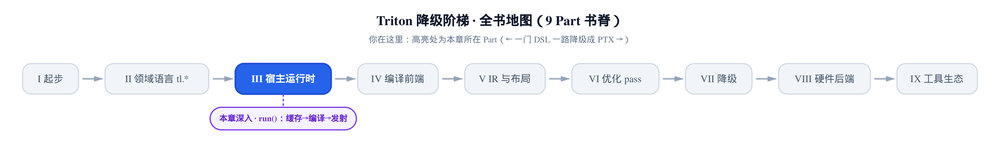
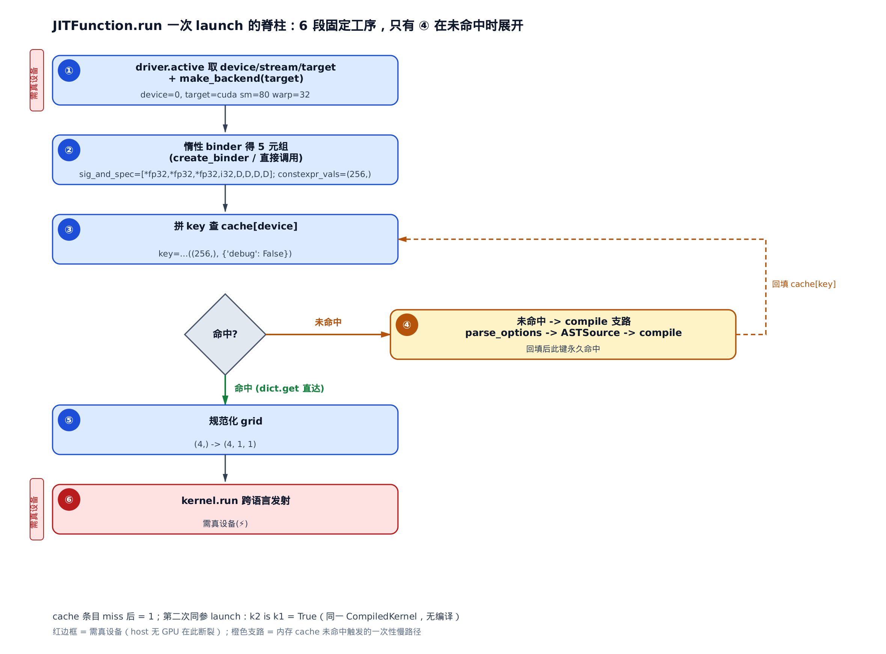
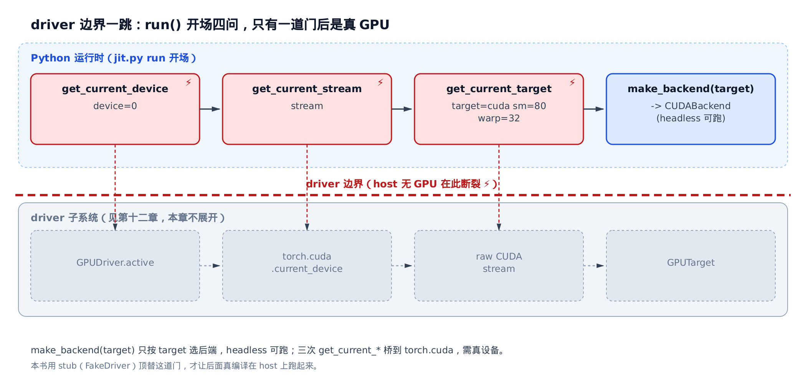
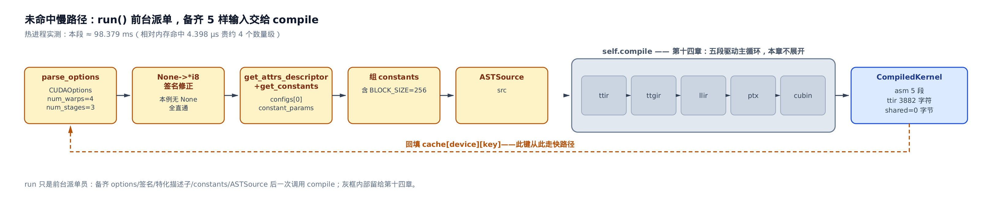
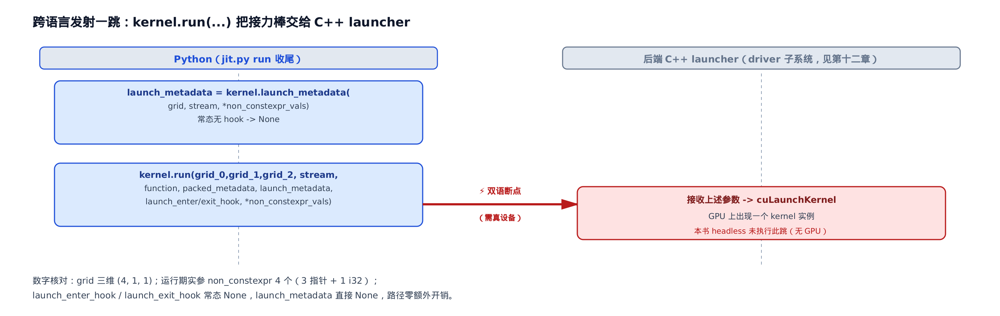
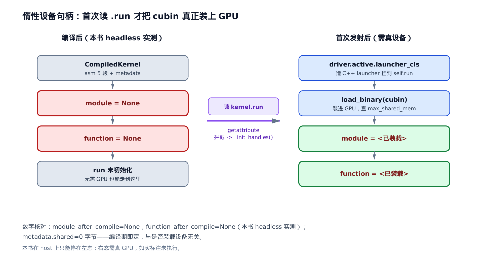
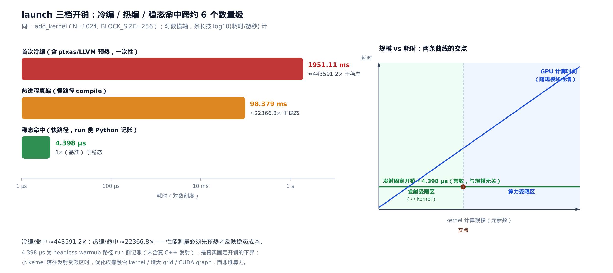

# run()：从缓存查询到编译再到内核发射的一次完整 launch

你写下 `add_kernel[grid](x, y, out, N, BLOCK_SIZE=256)`，回车。GPU 上冒出一个 kernel，几微秒后算完。这一行到那一瞬之间，Python 侧到底跑了多少活？

这一章把这条路拆开。它是全书的**脊柱胶水**——`JITFunction.run`（`@triton.jit` 产物对象的发射入口方法，前一章造好了它，住在 `python/triton/runtime/jit.py`）一个方法，把前一章建好的 binder 与缓存键、后面编译专章的 `compile()`、下一章的 driver/后端，串成一次真实 launch。

**本章解锁的性能杠杆**：看清 launch 热路径每一段的开销来源，你就能回答一个反复出现的问题——**一个小算子跑得慢，到底是 GPU 算力不够，还是 Python 侧的发射固定开销喂不快？** 答错方向，你会去优化本就不是瓶颈的那一半。看完这条脊柱，你能一眼分辨：cache 命中的稳态快路径有多快、未命中触发整条编译有多贵、以及为什么一个 1024 元素的 add，瓶颈常常落在发射而不是计算上。

<!-- roadmap 开篇「你在这里」窄长条横幅 -->


- 上一站立了 `JITFunction` 与缓存键：装饰、绑参、算出一个 key。
- 本章接着走：拿这个 key 查表，未命中就编译、命中就直发。
- 顺着这条脊柱，一路岔到 driver、compile 两大子系统的门口。

> 想直接看性能结论——launch 三档开销与「小 kernel 发射受限」判据——跳到本章最后一节「三档开销与小 kernel 的瓶颈」。想跟全程按脊柱走，从下一节开始按序读。

![本章地图：driver.active 取环境+make_backend 边界一跳(需真设备)→create_binder 惰性绑参→self.cache[device] 拼键查 cache(命中直达⑤)→未命中才展开 compile 慢路径(橙色支路，回填 cache)→grid_0/1/2 规范化 grid→kernel.run 跨语言发射(需真设备)→_init_handles 惰性设备句柄(需真设备)→三档开销判据收官，八段各钉一处源码剖面](../diagrams/chapter-map.png)

只想抓性能杠杆，直接跳「三档开销与小 kernel 的瓶颈」节；只想弄清 Python 到 C++ 的发射断点在哪，看「⑥ 跨语言发射」节；想跟全程按脊柱走，从下一节顺序读起。

## 从 `fn[grid](args)` 落到 `run` 的入口

上一章讲过 `fn[grid](...)` 是两步语法糖：方括号记住 grid，圆括号才带实参发射。这里只把落点抄来，因为本章从 `run` 入口开讲：

```python
# python/triton/runtime/jit.py:L321-L331
class KernelInterface(Generic[T]):
    run: T

    def __getitem__(self, grid) -> T:
        """
        A JIT function is launched with: fn[grid](*args, **kwargs).
        Hence JITFunction.__getitem__ returns a callable proxy that
        memorizes the grid.
        """
        return lambda *args, **kwargs: self.run(grid=grid, warmup=False, *args, **kwargs)
        # return cast(T, functools.partial(cast(Callable, self.run), grid=grid))
```

`grid`（发射网格，决定开多少个并行 program，见[第 2 章](../../ch02-gpu-execution-model/narrative/chapter.md)）被塞进 `run` 的关键字参数，`warmup=False`（此刻是真发射，不是只预热编译）。之后所有工作都在 `run` 里发生。这个 `warmup` 旗标后面会反复出现——它是「编译但不发射」和「编译且发射」的分水岭。

## run() 的六段主脊

先给全景。一次 launch，`run` 从头到尾走六段固定工序，像机场登机口的一次完整放行：

1. **取环境**——先确认「今天在哪块卡、哪条滑行道、这卡长什么样」（`driver.active` 取 device/stream/target，再 `make_backend`）；
2. **惰性绑参**——把这次航班的登机牌一次打好（binder 绑参，得一个五元组）；
3. **拼键查 cache**——去值机系统查「这架飞机之前放行过吗」（拼缓存键，`cache[device].get`）；
4. **未命中才编译**——查到直接放行；查不到才现造一遍全套手续（`compile`，回填 cache）；
5. **规范化 grid**——把网格补齐成三维；
6. **跨语言发射**——`kernel.run` 把接力棒交给后端 C++ launcher，真把 kernel 送上 GPU。

这六段里，只有第 ④ 段在 cache 未命中时才展开成一整条编译。命中时它被整块跳过——一次 dict 查表就放行。下图是这条脊柱的骨架，注意左侧只有 ① 和 ⑥ 标了「需真设备」：



用一个具体例子把六段走一遍。kernel 就是上一章那个标准的 `add_kernel(x_ptr, y_ptr, output_ptr, n_elements, BLOCK_SIZE: tl.constexpr)`（`tl.constexpr` 标记编译期常量参数，见[第 4 章](../../ch04-tl-surface-and-constexpr/narrative/chapter.md)），签名与[第 10 章](../../ch10-jitfunction-and-cache-keys/narrative/chapter.md)完全同一个 kernel，`N=1024`、`BLOCK_SIZE=256`、`grid=(4,)`，目标是一块 A100（`target=cuda sm=80 warp=32`，即计算能力 8.0、每 warp 32 lane）：

<!-- trace: run-orchestration-spine -->
| 阶段 | run() 动作 | 本例产物 / 标量 | 需真设备？ |
| --- | --- | --- | --- |
| ① 取环境 | driver.active 取 device/stream/target + make_backend(target) | device=0，target=cuda sm=80 warp=32，backend=CUDABackend | 是（host 无 GPU 在此断裂） |
| ② 惰性绑参 | binder is None → create_binder；调 binder(*args,debug=False) | 五元组：sig_and_spec=[*fp32,*fp32,*fp32,i32,D,D,D,D]，constexpr_vals=(256,) | 否 |
| ③ 拼键+查 cache | key=签名+特化+constexpr；cache[0].get(key) | key=…((256, ), {'debug': False})；首次 launch 未命中 | 否 |
| ④ 慢路径 compile | parse_options→…→ASTSource→compile→回填 cache | 编出 CompiledKernel，cache 条目=1 | 否（编译不需设备） |
| ⑤ 规范化 grid | (4,) 补齐三维 (grid_0,grid_1,grid_2) | (4, 1, 1) | 否 |
| ⑥ 跨语言发射 | kernel.launch_metadata + kernel.run → C++ launcher | 真发射一个 kernel（headless——本书取数用的无 GPU 环境，下文详述——未跑） | 是 |
| 第二次同参 launch（快路径） | ①–③ 后 cache[0].get 命中 → 跳过④ | 直接拿回同一 CompiledKernel（k2 is k1=True），无编译 | 否 |

D = divisible-by-16 特化标记，详见下文第②段。

这张表就是本章的地图。往下每一节展开其中一段。先记住一个**不变量**：对固定的缓存键（签名 + 特化位 + constexpr 值，键串里还带着 excess_kwargs，如 `debug`——后面表格里那个 `{'debug': False}` 就是它，为省事这里把它并进「constexpr 值」一起说），`run` 生命周期内至多编译一次。为什么？键是实参类型/特化/常量的确定性函数，慢路径入口守卫是 `kernel is None`、出口无条件回填 `cache[key]=kernel`；第一次未命中编完就留下记录，第二次同键进来 `get` 非 None、守卫为假，整块 compile 被跳过。cache 是普通 dict、只增不删，命中一旦成立就不失效。所以下图里这条脊柱的 miss 与 hit 差别，全在第 ④ 段是否触发——本例实测两者相差约 44 万倍，我们在最后一节量化它。

下面按 ①→⑥ 逐段走。先把 `run` 覆盖 ①②③ 三段的这段开场请出来——真正做 ①取环境的只是最前面四行（取 device/stream/target/backend），其后接着做 ②惰性绑参、③拼键查 cache：

```python
# python/triton/runtime/jit.py:L563-L584
    def run(self, *args, grid, warmup, **kwargs):
        kwargs["debug"] = kwargs.get("debug", False) or os.environ.get("TRITON_DEBUG", "0") == "1"

        # parse options
        from ..compiler import make_backend
        device = driver.active.get_current_device()
        stream = driver.active.get_current_stream(device)
        target = driver.active.get_current_target()
        backend = make_backend(target)

        # Execute pre run hooks with args and kwargs
        for hook in self.pre_run_hooks:
            hook(*args, **kwargs)

        if self.binder is None:
            self.create_binder(backend)

        bound_args, sig_and_spec, constexpr_vals, non_constexpr_vals, excess_kwargs = self.binder(*args, **kwargs)

        # compute cache key
        key = ''.join(sig_and_spec) + str((constexpr_vals, excess_kwargs))
        kernel = self.cache[device].get(key, None)
```

## ① 边界一跳：driver.active 取环境 + make_backend

`run` 落笔第一行先把 `debug` 标志钉死——显式传参 `debug=` 或环境变量 `TRITON_DEBUG=1`，两者取或；这就是后面 `excess_kwargs` 里那个 `{'debug': False}` 键的来处（本例两者都没开，故为 `False`）。钉完 debug，`run` 一开口就问三件事：现在是**哪块卡**（device）、往**哪条流**排队（stream）、这卡**长什么样**（target）。这三问全部打到 `driver.active`（当前激活的 GPU 驱动后端对象）这道边界门上，门后就是真 GPU。加上第四行 `make_backend(target)`（按 target 选出对应的编译后端，本例返回 `CUDABackend`），构成 `run` 跨到 driver 子系统的**唯一一跳**。

关键在于：这四行里，前三个 `get_current_*` 桥到 `torch.cuda`——它们的实体住在 `python/triton/backends/driver.py` 的 `GPUDriver` 里，`get_current_device` 就是 `torch.cuda.current_device`，`get_current_stream` 要一条真 CUDA raw stream。host 上没插卡，这道门一推就塌。而 `make_backend(target)` 只按 target 这个纯数据结构选后端类，不碰设备，headless 也能跑。这就是为什么本书能在无 GPU 的机器上真编译 kernel、却唯独跑不到发射：



本例里 `device=0`、`target=cuda sm=80 warp=32`、`make_backend` 返回 `CUDABackend`。取证脚本（本书用来在无 GPU 的 headless 环境下产出这些实测数字的验证脚本）用一个 stub 顶替 `driver.active` 这道门（返回固定 device=0、真实 A100 target），才让后面第 ②–④ 段的真绑参、真查表、真编译都在 host 上跑起来——被顶替的正是这三个 `get_current_*`。

这道门后面是什么——driver 抽象怎么发现并选出后端、`GPUDriver.active` 如何绑定到 torch.cuda、autotune 和磁盘缓存住在哪——是**下一章**的主题。本章只把门推到、标清断裂点，不进门。

`run` 开场还有一行 `for hook in self.pre_run_hooks`：这是外层挂钩点（autotune 等在此插入观测/调参逻辑）。常态下 `pre_run_hooks` 为空，这个循环零成本掠过。

## ② 惰性 binder：一台按 kernel 定做的登机牌打印机

拿到 backend 后，`run` 才第一次建 binder。为什么等到现在——而不是上一章构造 `JITFunction` 时就建好？看 `create_binder`：

```python
# python/triton/runtime/jit.py:L547-L561
    def create_binder(self, backend):
        """
        Precompute as much as possible.
        """
        from ..compiler import CompiledKernel, compile, ASTSource, make_backend
        self.CompiledKernel = CompiledKernel
        self.compile = compile
        self.ASTSource = ASTSource
        self.make_backend = make_backend
        self.binder = create_function_from_signature(self.signature, self.params, backend)
        self.constexpr_indices = [i for (i, p) in enumerate(self.params) if p.is_constexpr]
        self.non_constexpr_indices = [i for (i, p) in enumerate(self.params) if not p.is_constexpr]
        self.specialised_indices = [
            i for (i, p) in enumerate(self.params) if (not p.do_not_specialize) and (not p.is_constexpr)
        ]
```

`binder`（这个 kernel 专属的绑参函数）由 `create_function_from_signature` 用 `exec` 动态生成——它怎么把签名 exec 成一条无分支直线，是上一章 binder 代码生成的主题。这里看的是 `create_binder` 在 `run` 侧的另一半职责：把 `compile` / `ASTSource` / `CompiledKernel` / `make_backend` 这几个编译入口一次性缓存到 `self` 上，之后每次 `run` 直接取；顺带按参数属性算好三张索引表。其中 `specialised_indices` 特意排掉了带 `do_not_specialize` 标记的参数——那是用户显式声明「别对这个参数做对齐/类型特化」的参数（特化机制上一章已讲），它不进特化位、不影响缓存键。这三张表本章不再展开，只当作 binder 就绪的副产物。

**惰性的必然性来自数据依赖**：binder 需要 backend（它内部要调 `backend.compute_spec_key` 算特化键），backend 要 `make_backend(target)`，target 要 `driver.active`——三者都得等第一次真 run、真环境就绪才有。构造期（上一章的 `__init__`）根本拿不到设备，只能把 binder 留成 `None`，第一次 `run` 撞上 `self.binder is None` 才补建。这是个 None→非 None 的单向跃迁：`create_binder` 结尾把 `self.binder` 赋成函数对象，没有任何代码把它重置回 None，所以**至多构建一次**，此后守卫恒假。

建好后，`run` 立刻调它，一步拿到五元组。跟着这个 `add_kernel(x, y, o, N=1024, BLOCK_SIZE=256)` 调用走两拍：

<!-- trace: lazy-binder-invocation -->
| 时刻 | self.binder 状态 | 这一步做了什么 | 得到什么 |
| --- | --- | --- | --- |
| 构造期（前章 __init__） | None | 不建 binder——此刻拿不到 backend（需 make_backend→target→driver） | self.binder is None（惰性守卫成立） |
| 首次 run 进门 | None → built | create_binder(backend)：create_function_from_signature 用 exec 生成 dynamic_func，并把 compile/ASTSource/CompiledKernel/make_backend 缓存到 self | binder 就绪，之后 run 不再重建 |
| 调 binder(x,y,o,N,BLOCK_SIZE=256,debug=False) | built | 一条直线：绑位置参→算 sig_and_spec 与特化键→分拣 constexpr / 非 constexpr | 5 元组：sig_and_spec=[*fp32,*fp32,*fp32,i32,D,D,D,D]，constexpr_vals=(256,)，非 constexpr 4 个，excess={'debug': False} |

五元组里的每一项后面都要用到：`sig_and_spec`（签名 token + 特化位）和 `constexpr_vals`（编译期常量值）拼缓存键；`non_constexpr_vals`（运行期实参）留到发射时传给 kernel；`bound_args`（绑好的完整参数字典）供 callable grid 求值；`excess_kwargs`（多出来的关键字参数，如 `debug`）参与键与选项校验。

**为什么值得动态生成 binder**?本例 5 个形参里 4 个非 constexpr（3 个 `*fp32` 指针 + 1 个 `i32` 标量 `N`）、1 个 constexpr（`BLOCK_SIZE=256`）。三个指针地址都 16 字节对齐、标量 `N=1024` 也是 16 的倍数，各得特化键 `'D'`（divisible-by-16，可放心向量化/合并访存，见[第 2 章](../../ch02-gpu-execution-model/narrative/chapter.md)），共 4 个 `D`。通用的 `inspect.Signature.bind` + `apply_defaults` 每次 launch 都要遍历这 5 个参数做反射匹配、填默认值、再逐参算特化键——全是带分支的反射。`exec` 生成的 binder 把这套在**建 binder 时一次性**展开成硬编码直线，此后每次 launch 只跑这条线。源码注释原文就说，这部分反射「constitute much of the kernel launch overhead」（构成了内核发射开销的大头）。这是本章第一个性能落点：binder 摊薄的，正是每次 launch 都躲不掉的绑参成本。

## ③ 拼键查 cache：登机口桌上的小册子

有了五元组，`run` 拼出内存缓存键：

```
key = ''.join(sig_and_spec) + str((constexpr_vals, excess_kwargs))
```

把签名/特化 token 直接拼成串，再接上 constexpr 值与多余 kwargs 的字符串。键的三桶构成（签名桶、特化位桶、constexpr 桶）上一章已经拆透，这里只看 `run`（`python/triton/runtime/jit.py:L582-L584`）怎么用它查一本「登机口自己桌上的小册子」——`self.cache[device].get(key, None)`。册子**按设备分本**（`cache[device]`），因为一块卡上编出的 CompiledKernel 拿到别的卡上不认。

跟三次调用看命中与未命中怎么分岔：

<!-- trace: runtime-cache-lookup -->
| 调用 | cache 键（末段） | cache[0].get | 结果 / 耗时 |
| --- | --- | --- | --- |
| 第 1 次 add_kernel(BLOCK_SIZE=256) | …((256, ), {'debug': False}) | 未命中（None） | 触发编译→回填，cache 条目=1，≈1951.11 ms（冷进程，含一次性预热） |
| 第 2 次 同参 add_kernel(BLOCK_SIZE=256) | 同上 key | 命中 | 直接返回同一对象（k2 is k1），≈4.398 µs（无编译） |
| 第 3 次 add_kernel(BLOCK_SIZE=128) | …((128, ), {'debug': False})——constexpr 变了→新 key | 未命中（None） | 另编一份，cache 条目=2，≈98.379 ms（热进程真编译） |

这个 ≈4.398 µs 的度量口径——只含 run 侧①-③段的取值/绑参/查键，不含真设备相关的 grid 规范化与发射——细节留本章最后一节「三档开销与小 kernel 的瓶颈」。

三行讲了两件事。其一，**同键只增不减**：第 1 次未命中回填后，第 2 次同键必命中、返回同一个 CompiledKernel 对象（`k2 is k1` 为真）。其二，**不同键落不同槽**：`BLOCK_SIZE` 是 constexpr，进 `constexpr_vals`，256≠128 → 键串末段 `(256, )` vs `(128, )` 不同，映射到 dict 不同条目，互不干扰，cache 长度从 1 涨到 2。命中路径快得离谱——一次 dict 查表约 4.398 µs（2000 次平均），比同键未命中触发的真编译（本例 BLOCK_SIZE=128 那次热进程约 98.379 ms）快约 2.2 万倍。内存 cache 命中是全链路最快的一档，这也是稳态性能测量**必须先预热**的原因：不预热，你量到的是编译时间，不是发射时间。

命中就跳到第 ⑤ 段。下面看未命中怎么走完慢路径。

## ④ 未命中慢路径：run 是前台派单员

`kernel is None` 为真，`run` 进入慢路径——它并不亲自编译，而是**现场备齐一套编译输入**再交给 `compile`：

```python
# python/triton/runtime/jit.py:L586-L629
        if kernel is None:
            # Kernel is not cached; we have to compile.
            options = backend.parse_options(kwargs)

            # deprecated arguments
            assert "device_type" not in kwargs, "device_type option is deprecated; current target will be used"
            assert "device" not in kwargs, "device option is deprecated; current device will be used"
            assert "stream" not in kwargs, "stream option is deprecated; current stream will be used"
            for k in excess_kwargs:
                if k not in options.__dict__:
                    raise KeyError("Keyword argument %s was specified but unrecognised" % k)

            bound_vals = tuple(bound_args.values())

            # `None` is nullptr. Implicitly convert to *i8. This needs to be
            # done here rather than when we build the signature as otherwise
            # the kernel cache key could not distinguish between byte pointers
            # and None arguments, resulting in a downstream mismatch:
            sigkeys = [self.params[i].name for i in self.non_constexpr_indices]
            sigvals = sig_and_spec[:len(sigkeys)]
            signature = {k: ('*i8' if (v == 'none') else v) for (k, v) in zip(sigkeys, sigvals)}

            configs = (backend.get_attrs_descriptor(self.params, bound_vals), )
            constant_params = configs[0].get_constants()
            constants = {
                p.name: v
                for (v, p) in zip(bound_vals, self.params)
                if p.is_constexpr or (p.num in constant_params) or v is None
            }
            for i, arg in constants.items():
                if callable(arg):
                    raise TypeError(f"Callable constexpr at index {i} is not supported")

            if self._call_hook(key, signature, device, constants, options, configs, warmup, before=True):
                return None
            # compile the kernel
            src = self.ASTSource(self, signature, constants, configs[0])
            kernel = self.compile(
                src,
                target=target,
                options=options.__dict__,
            )
            self.cache[device][key] = kernel
            self._call_hook(key, signature, device, constants, options, configs, warmup, before=False)
```

从上到下备五样东西，最后调一次 `compile`：

<!-- trace: compile-slowpath-orchestration -->
| 子步（按 run 源码顺序） | run 调用 | 本例产物 |
| --- | --- | --- |
| parse_options | backend.parse_options(kwargs) | CUDAOptions（本例 num_warps=4, num_stages=3） |
| 签名修正 | sig token 'none' → '*i8' | signature 字典（本例无 None，全直通） |
| 特化描述子 | backend.get_attrs_descriptor + get_constants | configs[0] / constant_params |
| 组 constants | constexpr ∪ 属性常量(num∈constant_params) ∪ None 实参；callable 守卫 | constants 字典（本例含 BLOCK_SIZE=256） |
| 建 IR 源 | ASTSource(self, signature, constants, configs[0]) | src（compile 的输入） |
| 编译 | self.compile(src, target, options.__dict__) | CompiledKernel：asm 五段=[ttir,ttgir,llir,ptx,cubin]，ttir 3882 字符，metadata.shared=0 字节 |
| 回填 | self.cache[device][key] = kernel | 同键下次直达快路径（cache 条目=1） |

逐样说：`parse_options` 把 kwargs 解析成后端选项对象 `CUDAOptions`（本例 `num_warps=4`——每个 program 用 4 个 warp、`num_stages=3`——软件流水线 3 级）；接着校验 `excess_kwargs` 里每个键都被选项认得，不认就抛 `KeyError`；然后是下一小节要单独讲的 None→\*i8 签名修正；`get_attrs_descriptor` 造出特化描述子 `configs[0]`（`AttrsDescriptor`，承载 16 字节对齐等特化属性的容器，上一章铺过）——这跟第②段绑参时 `compute_spec_key` 算出的**特化位**（`sig_and_spec` 里那几个 `D` 标记）不是同一件事：两者背后读的都是同一份对齐/等于 1 的事实（`is_divisible_by_16`/`is_equal_to_1`），但喂给两个不同下游——特化位只用来给缓存键分槽，特化描述子服务于这里的编译期 constants 判定；`get_constants` 从中取出编译期定为常量的参数编号；`组 constants` 把三类参数并起来——constexpr、被判定为常量属性的、以及传了 None 的实参（本例只有 `BLOCK_SIZE=256`），并守卫「callable 不能当 constexpr」；接着那行 `_call_hook(..., before=True)` 是 autotune 等外部钩子的观测点，常态没注册钩子、返回 False，这行直接跳过（它返回 True 时会提前 `return None` 短路整条慢路径——那是留给 autotune 一类外部工具在编译前插桩观测/改写的接口，常态没注册钩子、返回 False）；最后把 `(self, signature, constants, configs[0])` 打包成 `ASTSource`（喂给编译器前端的 IR 源），调 `self.compile` 编出 `CompiledKernel`，回填 cache。



这里划清一条边界：`self.compile` 就是编译入口，它内部把 add_kernel 从 Python AST 一路降到 cubin 的**五段驱动主循环**（make_ir → 逐 stage lowering：ttir → ttgir → llir → ptx → cubin → 写回 metadata → 磁盘缓存读写），是本书后面**编译主循环专章**的主题。这五段各是一层中间表示（ttir=Triton IR、ttgir=Triton GPU IR、llir=LLVM IR、ptx=PTX 汇编、cubin=CUDA 二进制），本章只需知道它们是编译产物的五个阶段、不必记住内部结构——怎么一步步 lowering 留给编译主循环专章。本章只把它当**一次调用**：看 `run` 交给它什么（ASTSource + target + 选项字典）、拿回什么（一个携五段 IR 的 CompiledKernel，本例 ttir 就有 3882 字符，metadata 记 `shared=0` 字节共享内存）。热进程下（借第③段 `BLOCK_SIZE=128` 那次重编的实测）这一整条慢路径约 98.379 ms——同一条编译流水线，量级仍具代表性，相对内存命中的 4.398 µs，贵约 4 个数量级。

慢路径也满足前面那个不变量：入口 `if kernel is None` 与出口 `cache[device][key] = kernel` 配对——进入必因未命中，退出必留命中记录，二者之间除了 `_call_hook(before)` 返回 True 的旁路（那是 autotune 的观测钩子，常态 None → 返回 False）没有其他 return。所以对同一键，慢路径一次性。

### None → \*i8：一个只在缓存键里现形的讲究

签名修正那一行藏着一个精心设计的分寸。传进来的 `None` 代表空指针，编译时要当成 `*i8`（字节指针）。但**缓存键里不能这么抹**——否则分不清「我真传了个 int8 指针」和「我传了 None」，下次可能误命中错 kernel。源码注释（上面那段的 `# None is nullptr...`）把隐患写得很直白。所以规矩是：`*i8` 的翻译只发生在临时构造的 `signature` 字典里（`'*i8' if v == 'none' else v`），**不回写 `sig_and_spec`、不改 key**；缓存键里 None 永远留着 `'none'` 记号。这也是一条不变量：cache 键里 None 的记号在整个 `run` 生命周期内不受签名翻译影响。

拿一个真会踩到这分支的 kernel 看——`opt_kernel(a_ptr, b_ptr, n, BLOCK: tl.constexpr)`，调用时 `b_ptr=None`：

<!-- trace: none-to-i8-signature-fixup -->
| 参数 | binder 给的 token（sig_and_spec） | run 编 signature 时映射（L606） | cache 键里保留的是 |
| --- | --- | --- | --- |
| a_ptr（真 *fp32 指针） | *fp32 | *fp32 | *fp32 |
| b_ptr（传入 None） | none | *i8（当作 nullptr） | none —— 不是 *i8！ |
| n（int 1024） | i32 | i32 | i32 |

只有 `b_ptr` 从 `'none'` 翻成 `'*i8'`，另两个原样。关键在最后一列：cache 键末段仍带 `'none'`，与假设某天真传一个 int8 指针得到的 `'*i8'` 键不同，二者各占一条缓存槽，永不误命中。本例 `add_kernel` 没传 None，这一步全直通；但这个「键里留记号、只在交编译器那一刻翻译」的分寸，正是把转换放在 `run` 时而非建签名时的理由。

## ⑤ 规范化 grid：把网格补齐三维

无论命中还是编译完，都汇到这里。`run` 尾部先核对全局量、再规范化 grid、最后发射：

```python
# python/triton/runtime/jit.py:L631-L654
        # Check that used global values have not changed.
        not_present = object()
        for (name, _), (val, globals_dict) in self.used_global_vals.items():
            if (newVal := globals_dict.get(name, not_present)) != val:
                raise RuntimeError(
                    f"Global variable {name} has changed since we compiled this kernel, from {val} to {newVal}")

        if not warmup:
            # canonicalize grid
            assert grid is not None
            if callable(grid):
                # Arguments are passed as a dict to `grid`, by contract.
                # TODO(jlebar): In the new launch API, pass the compiler flags as a
                # second parameter to `grid`.
                grid = grid(bound_args)
            grid_size = len(grid)
            grid_0 = grid[0]
            grid_1 = grid[1] if grid_size > 1 else 1
            grid_2 = grid[2] if grid_size > 2 else 1

            # launch kernel
            launch_metadata = kernel.launch_metadata(grid, stream, *non_constexpr_vals)
            kernel.run(grid_0, grid_1, grid_2, stream, kernel.function, kernel.packed_metadata, launch_metadata,
                       self.CompiledKernel.launch_enter_hook, self.CompiledKernel.launch_exit_hook, *non_constexpr_vals)
        return kernel
```

开头那段 `used_global_vals` 循环是尾部一站：编译时快照过的「可疑全局量」若变了就抛 `RuntimeError`。这个机制本体（谁登记全局量、何时快照）在上一章，这里只作为 `run` 尾部一站掠过。

接着是 `if not warmup`——这是 `warmup` 旗标的用武之地：**warmup=True 时编译完就 `return kernel`，跳过规范化 grid 与发射**。autotune 预热只想触发编译回填缓存、不想真跑 kernel，也就不需要设备。真发射（`warmup=False`）才往下走。

grid 规范化本身很朴素：用户可以只给一维 `(4,)`，也可以给个函数按参数现算；`run` 统一补成三维 `(grid_0, grid_1, grid_2)`，缺的维填 1。就像快递地址只写了街道，系统自动补「同城、本国」，总量不变。四种写法：

<!-- trace: grid-canonicalization -->
| 传入 grid | callable？ | len(grid) | 补齐后 (grid_0, grid_1, grid_2) |
| --- | --- | --- | --- |
| (4,) | 否 | 1 | (4, 1, 1) |
| (4, 2) | 否 | 2 | (4, 2, 1) |
| (4, 2, 3) | 否 | 3 | (4, 2, 3) |
| lambda meta:(meta['n_elements']//meta['BLOCK_SIZE']+1,) | 是 → grid(bound_args) 求值得 (5,) | 1 | (5, 1, 1) |

补维后 grid 恒为 3 元组，缺省维填 1，**线程块总数不变**：1 维 `(g0)` → `(g0,1,1)`，总块数 `g0·1·1=g0` 保持；本例四种写法补维后总块数分别是 4、8、24、5（各维乘积）。callable 分支先 `grid = grid(bound_args)`——把绑好的参数字典喂给用户函数求值成元组，再走同一补维逻辑（本例 lambda 返回 `(5,)` → `(5,1,1)`）。补维是几次比较加索引，O(1)、纯 Python、无设备参与，属快路径固定开销里很小的一项。但注意 callable grid **每次 launch 都要调一次用户函数**——若那个函数本身昂贵，它会实打实计入发射开销。

## ⑥ 跨语言发射：接力棒交给 C++ launcher

前面五段全是 Python 在打点、查表、补维。到最后两行 `kernel.launch_metadata(...)` 和 `kernel.run(...)`，接力棒才交给后端的 C++ launcher——它真正把 grid/stream/参数指针塞进 CUDA，让 GPU 上冒出一个 kernel。这一跳是 Python↔C++ 的**双语断点**，也是全程唯一真正「发射」的动作，需要真设备：



先看 `launch_metadata`——发射前组装观测元数据。它的设计是「无人观测就零成本」：

```python
# python/triton/compiler/compiler.py:L398-L413
    def launch_metadata(self, grid, stream, *args):
        if CompiledKernel.launch_enter_hook is None:
            return None
        ret = LazyDict({"name": self.name, "function": self.function, "stream": stream})
        if not isinstance(self.src, ASTSource) or self.src.fn.launch_metadata is None:
            return ret
        arg_dict = {}
        arg_idx = 0
        for i, arg_name in enumerate(self.src.fn.arg_names):
            if i in self.src.fn.constexprs:
                arg_dict[arg_name] = self.src.constants[arg_name]
            else:
                arg_dict[arg_name] = args[arg_idx]
                arg_idx += 1
        ret.add(self.src.fn.launch_metadata, (grid, self.metadata, arg_dict))
        return ret
```

第一行就是全部关窍：`launch_enter_hook`（发射入口观测钩子）为 None 时**直接返回 None**。绝大多数发射没有观测钩子，这条路径必须零额外开销。只有用户注册了 enter hook（或 `@triton.jit(launch_metadata=...)`）才往下组 `LazyDict`（惰性字典，`.get()` 时才真拼内容，避免无人看时白算）并挂用户回调。本例常态无 hook，`launch_metadata` 直接是 None。

然后 `kernel.run(...)` 把七样东西一次交出去：grid 三维 `(4,1,1)`、stream、`kernel.function`（GPU 上的函数句柄）、`kernel.packed_metadata`（打包好的元数据）、刚才的 `launch_metadata`、一对 enter/exit hook（常态 None），以及 `*non_constexpr_vals`（本例 4 个运行期实参：3 指针 + 1 个 `i32`）。这些参数越过 Python|C++ 分界，进后端 launcher，最终落到 `cuLaunchKernel`。本书在无 GPU 的 host 上跑不到这一步，如实标注。

## 惰性设备句柄：编译产物怎么接到发射路径

上一节 `kernel.run(...)` 读了 `kernel.function`、`kernel.run` 这些属性。可编译产物 `CompiledKernel` 出厂时其实是**半成品**——cubin 在手，但 `module`、`function` 都还是 None，没装进任何一块 GPU。那 `kernel.function` 怎么会有值？机关在 `__getattribute__`：

```python
# python/triton/compiler/compiler.py:L379-L396
    def _init_handles(self):
        if self.module is not None:
            return
        device = driver.active.get_current_device()
        # create launcher
        self.run = driver.active.launcher_cls(self.src, self.metadata)
        # not enough shared memory to run the kernel
        max_shared = driver.active.utils.get_device_properties(device)["max_shared_mem"]
        if self.metadata.shared > max_shared:
            raise OutOfResources(self.metadata.shared, max_shared, "shared memory")
        # TODO: n_regs, n_spills should be metadata generated when calling `ptxas`
        self.module, self.function, self.n_regs, self.n_spills = driver.active.utils.load_binary(
            self.name, self.kernel, self.metadata.shared, device)

    def __getattribute__(self, name):
        if name == 'run':
            self._init_handles()
        return super().__getattribute__(name)
```

谁第一次去读它的 `.run` 属性，`__getattribute__` 就拦下来、先偷偷跑 `_init_handles()`：`driver.active.launcher_cls` 造一个 C++ launcher 挂到 `self.run`，`load_binary` 把 cubin 真正装上当前设备（顺便查 `max_shared_mem`、把 `module`/`function` 填实）。第二次再读，`module is not None`、`_init_handles` 立刻返回，不重复装载。



这个机关买到两件事。其一，**编译不需要 GPU**——注释写得明白：binaries 惰性初始化，「because it involves doing runtime things (e.g., checking amount of shared memory on current device)」。cubin 编出来时 `module`/`function` 一直是 None，所以本书才能在 host 上把编译跑完（取证实测 `module_after_compile=None`、`function_after_compile=None`，而 `metadata.shared=0` 字节是编译期就定的、与装载无关）。其二，**首次发射自动装设备对调用方透明**——无论谁读 `kernel.run`（`run()` 里发射，还是别处独立发射），都自动接上，不用记得先手动初始化。这是一条不变量：`_init_handles` 对同一 `CompiledKernel` 至多真正装载一次——`if self.module is not None: return` 守卫使第二次及以后的调用恒为空操作。

这就收口了脊柱：`run` 第 ⑥ 段一读 `kernel.run`，惰性句柄机关就把「编译期产物」第一次接到「真设备」上，发射才真正发生。

## 三档开销与小 kernel 的瓶颈

现在把整条脊柱的开销摆到台面上，回答开篇那个问题。同一个 `add_kernel`，三种「第一次」的代价天差地别：

<!-- trace: launch-overhead-anatomy -->
| 场景 | 走哪条路 | 本例耗时 | 相对稳态命中 |
| --- | --- | --- | --- |
| 首次 launch（冷进程，内存+磁盘皆未命中） | 慢路径整条 compile + ptxas/LLVM 一次性预热 | ≈1951.11 ms | ≈443591.2× |
| 另编一份（热进程，真编译） | 慢路径 compile（无进程预热） | ≈98.379 ms | ≈22366.8× |
| 稳态 launch（内存 cache 命中） | 快路径：driver 取值+绑参+查键（真发射需真设备，未计入——见下） | ≈4.398 µs | 1×（基准） |



三档跨约六个数量级。冷进程首次 1951.11 ms（约 44 万倍于稳态，含 ptxas 汇编器与 LLVM 的一次性预热）；热进程里换个参数重编 98.379 ms（约 2.2 万倍，没有进程预热了）；已经在内存 cache 里的稳态发射仅 4.398 µs。第一个结论直接可用：**性能测量必须先预热**，否则你量到的是那 44 万倍的编译时间。

真正的性能杠杆在第三行那根常数条。**稳态命中的 Python 侧固定开销与 kernel 计算量无关**——一次完整稳态发射的动作集合是固定的：`driver.active` 三次取值 + `make_backend` + 一次 binder 直线调用 + 一次字符串拼键 + 一次 `dict.get` +（发射时）grid 补维 + 跨语言一跳，没有一样随输入元素数变化。需要说清测量口径：本例量到的 4.398 µs 是 headless、`warmup=True` 路径下 run 侧「取环境 + 绑参 + 查键」这一段的记账——真正需真设备的 grid 补维与 C++ launcher 发射（§⑥ 已如实标注本书跑不到）并没有计入。所以 4.398 µs 是这条常数开销的**下界**，真实稳态发射只会更高、但仍与冷/热编译差数个数量级，量级结论不变。而 GPU 计算时间随问题规模线性增长——元素越多、算得越久。

两条曲线，一条水平常数、一条随规模上升的斜线，**必在某个规模相交**。交点左边：kernel 小到 GPU 几微秒就算完，那根固定的发射常数条反而成了瓶颈——这就是**发射受限区**。交点右边算力才是瓶颈。所以当你的 `add` 只有 1024 个元素、GPU 眨眼算完，却发现整体不快，**问题不是 GPU 算不过来，是这条 Python 侧发射路径喂不快**。此时堆算力（换更快的卡、优化 kernel 内循环）几乎没用，该做的是**少发射或每次发射摊更多活**：

- **融合多个小 kernel**成一个，把 N 次发射固定开销压成 1 次；
- **增大 grid**、让单次发射覆盖更多数据，摊薄每元素的发射成本；
- 用 **CUDA graph**（把一串固定的 launch 录成一张图重放，绕开重复的 Python 发射路径）消掉稳态下反复走 `run` 的开销。

这就是本章解锁的判据：拿到一个慢的小算子，先问它落在交点哪一侧。落在发射受限区，优化方向是「怎么少走这条 `run` 脊柱」，而不是「怎么让 GPU 算更快」。

最后补一句关于「两层缓存」的坐标，方便你理解 miss 到底 miss 在哪。`run` 侧的内存 `cache[device][key]` 只是第一层；它没命中会落到 `compile` 内部的第二层——磁盘缓存，键完全不同：

```python
# python/triton/compiler/compiler.py:L217-L233
def compile(src, target=None, options=None):
    if target is None:
        target = driver.active.get_current_target()
    assert isinstance(target, GPUTarget), "target must be of GPUTarget type"
    backend = make_backend(target)
    ir_source = not isinstance(src, ASTSource)
    # create backend
    if ir_source:
        assert isinstance(src, str), "source must be either AST or a filepath"
        src = IRSource(src)
    extra_options = src.parse_options()
    options = backend.parse_options(dict(options or dict(), **extra_options))
    # create cache manager
    env_vars = get_cache_invalidating_env_vars()
    key = f"{triton_key()}-{src.hash()}-{backend.hash()}-{options.hash()}-{str(sorted(env_vars.items()))}"
    hash = hashlib.sha256(key.encode("utf-8")).hexdigest()
    fn_cache_manager = get_cache_manager(hash)
```

这层磁盘键含 `triton_key()`（Triton 版本指纹）、源码 hash、后端 hash、选项 hash 与环境变量——跨进程、重启后还能复用编译产物。内存命中（微秒级）→ 磁盘命中（毫秒级，省掉真编译）→ 都没有才真编译（数十到上千毫秒）。这层磁盘缓存怎么管理，是下一章的内容；`compile` 内部那五段驱动主循环，是编译主循环专章的内容。本章到 `run` 怎么调它、拿回什么、塞回哪里为止。

## 小结

这一章走通了一条 `run`（`python/triton/runtime/jit.py`）脊柱：`fn[grid](args)` 落到 `run` → driver 边界取环境 → 惰性 binder 打登机牌 → 拼键查内存 cache →（未命中才）派单给 compile → 规范化 grid → 跨语言发射 → 惰性句柄把 cubin 接上设备。六段固定工序，只有第 ④ 段在未命中时展开成整条编译。

回扣性能杠杆：这条脊柱的**稳态固定开销与 kernel 大小无关**，约 4.398 µs 的常数（这是 headless warmup 路径量到的 run 侧记账、不含需真设备的跨语言发射，是真实固定开销的下界）。看清这一点，你就有了判断小算子瓶颈的尺子——落在发射受限区，就别盯着算力，去融合 kernel、增大 grid 或上 CUDA graph。往下走，下一章推开 driver 那道门：后端怎么被发现、autotune 怎么在 `pre_run_hooks` 上做文章、磁盘缓存怎么管；而 `compile` 内部那五段 IR 怎么逐级降下来，留给后面的编译主循环专章。
