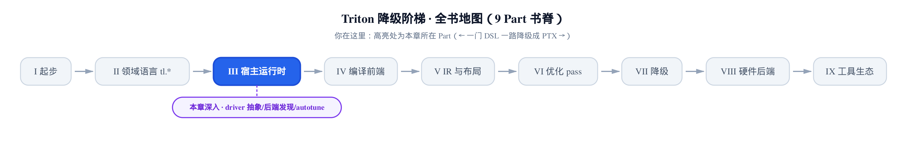
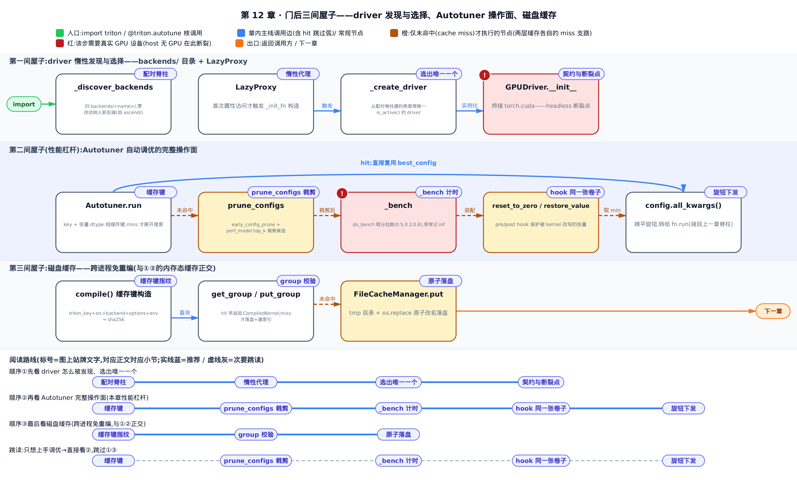
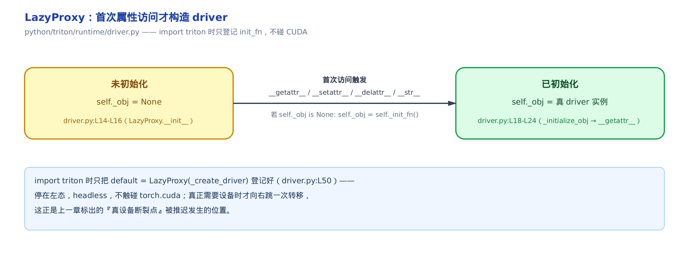
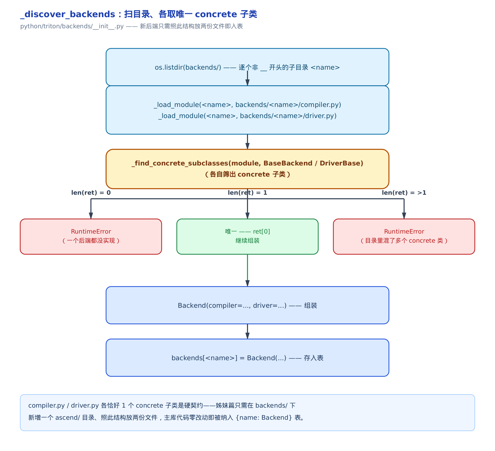
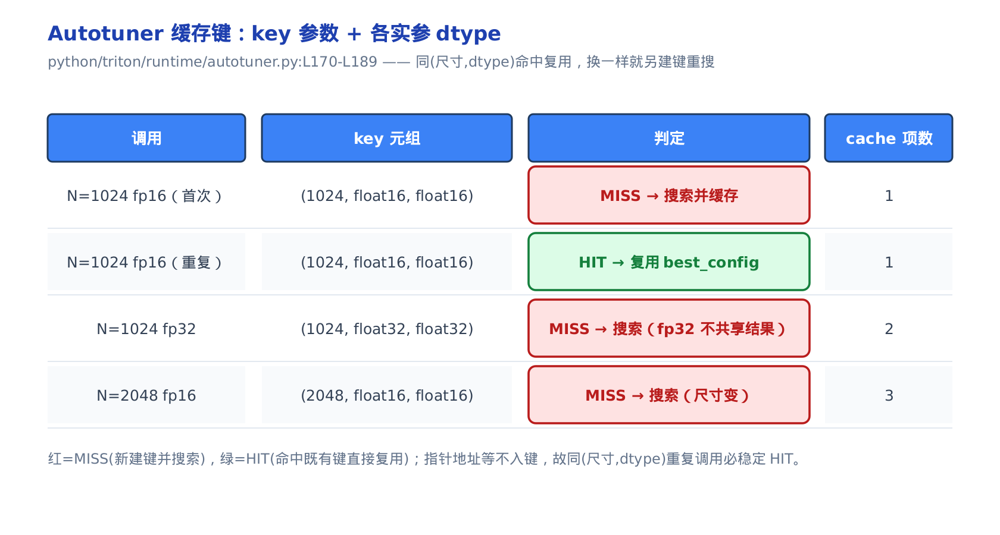
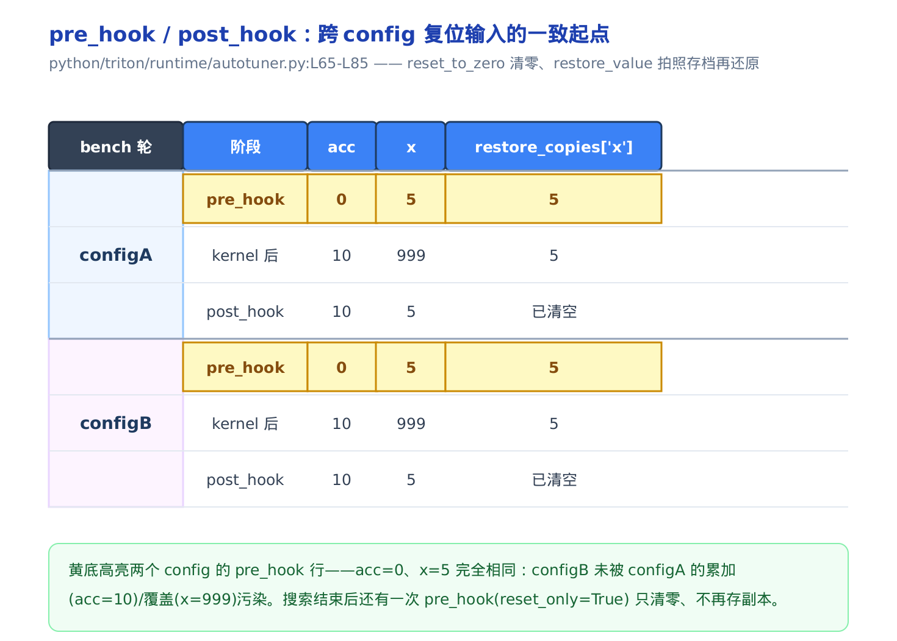
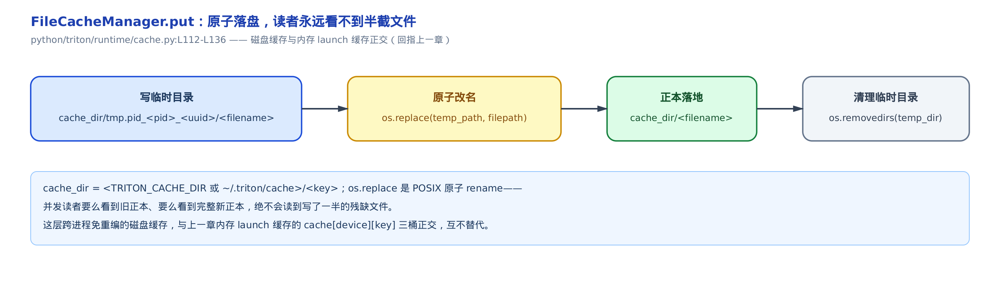

# driver 抽象、后端发现、autotune 与磁盘缓存



- 上一章：`run()` 把一次 launch 串起来，在门口停下——它三次问 `driver.active` 要设备，却没进门。
- 本章：推开那扇门。driver 怎么惰性选出唯一后端，autotune 怎么帮你自动找最优 config。
- 下一章：没有 GPU 时，怎么让核在纯 CPU 上跑出等价语义。

上一章的 `run()`（`@triton.jit` 产物的发射入口方法）落笔第一件事，是向 `driver.active`（当前激活的 GPU 驱动后端对象）连问三句：哪块卡、哪条流、这卡什么型号。当时我们把这道门推到、标了「host 无 GPU 在此断裂」，就绕开了——[那一章](../../ch11-run-launch-pipeline/narrative/chapter.md)只走到门口。这一章进门。

进门要认清一件事：门后不是一坨设备代码，而是一套**可插拔的后端抽象**，主体住在 `python/triton/runtime/driver.py` 与 `python/triton/backends/__init__.py`。`import triton` 时它一根手指都不碰 CUDA；真需要设备了才临门点火。这套「惰性 + 配对」的设计，正是 triton 能同时容纳 NVIDIA、AMD、乃至姊妹篇里的昇腾后端的地基。

但本章真正的**性能杠杆**在门后的第二间屋子——`@triton.autotune`。写 Triton 核，`BLOCK_SIZE` 设 64 还是 256、`num_stages`（软件流水线级数，上一章已铺）开 2 还是 4，人肉试到手酸。autotune 让编译器替你把这些旋钮的组合逐个跑一遍、留最快的。读懂它的**完整操作面**——搜索空间怎么设、缓存键怎么选、怎么裁剪候选、怎么保护被核改写的张量——你就能给自己的算子挂上自动调优，而不是抄一份别人的 config 碰运气。

本章分三段走：先看 driver 怎么被**惰性发现并选出**（配对脊柱），再把 **autotune 的操作面**逐个旋钮讲透（性能落点），最后收尾**磁盘缓存**——它和上一章的内存 launch 缓存是正交的另一层。只想上手调优，可直接跳到 [Autotuner 一节](#autotuner自动调优的完整操作面)；想跟全程，按序读。



只想马上用上 autotune，图上「prune_configs 裁剪」「_bench 计时」「hook 同一张卷子」三步对应你要调的三个旋钮，直接跳「Autotuner：自动调优的完整操作面」；想弄清后端怎么被发现、又怎么选出唯一一个，看前两节；磁盘缓存那间屋子和前面两层内存态缓存正交，可以单独跳读「磁盘缓存：跨进程免重编」。

---

## 惰性代理：import triton 为什么不点火 CUDA

`import triton` 是一句纯 Python 导入。它不该顺手把 CUDA 初始化了——否则纯 CPU 机器、文档构建、单元测试的导入统统会崩。可 triton 全库又都靠 `driver.active.xxx` 拿设备。这对矛盾怎么调和？

答案是一个惰性代理。打个比方：`import triton` 像餐厅「按铃才上菜」——只把菜单摆上桌，没人真去后厨。直到某段代码第一次伸手拿 `driver.active` 的某个属性，铃才响、后厨（CUDA）才开火。

这个代理叫 `LazyProxy`（惰性代理，包住一个构造函数、推迟到首次访问才真正构造对象）。它只有两个状态：



来看它的全貌。`import triton` 期间，`python/triton/runtime/driver.py` 模块级只跑到最后一行 `driver = DriverConfig()`，此刻**没有任何真 driver 被构造**：

```python
# python/triton/runtime/driver.py:L4-L60
def _create_driver():
    actives = [x.driver for x in backends.values() if x.driver.is_active()]
    if len(actives) != 1:
        raise RuntimeError(f"{len(actives)} active drivers ({actives}). There should only be one.")
    return actives[0]()


class LazyProxy:

    def __init__(self, init_fn):
        self._init_fn = init_fn
        self._obj = None

    def _initialize_obj(self):
        if self._obj is None:
            self._obj = self._init_fn()

    def __getattr__(self, name):
        self._initialize_obj()
        return getattr(self._obj, name)

    def __setattr__(self, name, value):
        if name in ["_init_fn", "_obj"]:
            super().__setattr__(name, value)
        else:
            self._initialize_obj()
            setattr(self._obj, name, value)

    # … 省略：__delattr__/__repr__/__str__ 是转发协议的补全，机制核心在 __getattr__ …


class DriverConfig:

    def __init__(self):
        self.default = LazyProxy(_create_driver)
        self.active = self.default

    def set_active(self, driver: DriverBase):
        self.active = driver

    def reset_active(self):
        self.active = self.default


driver = DriverConfig()
```

逐段拆。`DriverConfig.__init__` 里 `self.default = LazyProxy(_create_driver)`——**只是把 `_create_driver` 这个函数存进代理**，`LazyProxy.__init__` 把 `self._obj` 置成 `None` 就返回了，`_create_driver` 一次都没被调用。所以 `import triton` 走完，`driver.default._obj` 仍是 `None`，torch.cuda 毫发未损。

点火发生在**首次属性访问**。全库任何一处写 `driver.active.get_current_device()`，Python 先在 `driver.active`（就是那个 `LazyProxy`）上找 `get_current_device` 属性。找不到实体属性 → 触发 `__getattr__` → 调 `_initialize_obj`。这里有个判空守卫 `if self._obj is None`：仅当 `_obj` 还是 `None` 才真的调 `_create_driver()` 构造，之后转发给它。第二次访问，`_obj` 已非空，`_initialize_obj` 空转、直接转发——**构造只发生一次**。**不变量**：判空守卫 `if self._obj is None` 保证 `_init_fn`（即 `_create_driver`）全进程至多被真正调用一次——第一次访问触发构造并把结果存进 `_obj`，此后任意次访问都直接转发给同一个已构造对象，不会重复触发 CUDA 初始化。

这就是上一章那个「真设备断裂点」被推迟发生的确切位置：`import` 时它在左态睡着，第一次真 launch 触到它，才向右跳、才碰 GPU。惰性初始化的本质，是把「模块加载副作用」和「首次使用副作用」解耦——调用方写 `driver.active.xxx` 和直接持有真 driver 毫无区别，唯一变的是构造时机后移。

`DriverConfig` 还留了 `set_active` / `reset_active` 两个口子：运行期可以手动把 `active` 换成别的 driver（比如测试里塞个 stub），再一键还原回 `default`。这也是上一章取证脚本能在无 GPU 机器上顶替这道门的机关。

---

## 配对脊柱：后端怎么被发现、又怎么选出唯一一个

driver 惰性构造好了，可 `_create_driver` 从哪认识 NVIDIA、AMD 这些后端的？答案是 triton **不维护一张注册名单**，而是开机扫目录。

### 扫目录、各取唯一 concrete 子类

后端接入像「往文件夹里丢标准插件」：`backends/` 目录下每个子目录就是一个后端，里面必须恰好放一份 `compiler.py` 和一份 `driver.py`，各含**唯一一个「能实例化的」类**。多一个少一个都当场报错——逼你保持「一目录一后端一驱动」的干净契约。

```python
# python/triton/backends/__init__.py:L16-L47
def _find_concrete_subclasses(module, base_class):
    ret = []
    for attr_name in dir(module):
        attr = getattr(module, attr_name)
        if isinstance(attr, type) and issubclass(attr, base_class) and not inspect.isabstract(attr):
            ret.append(attr)
    if len(ret) == 0:
        raise RuntimeError(f"Found 0 concrete subclasses of {base_class} in {module}: {ret}")
    if len(ret) > 1:
        raise RuntimeError(f"Found >1 concrete subclasses of {base_class} in {module}: {ret}")
    return ret[0]


@dataclass(frozen=True)
class Backend:
    compiler: BaseBackend = None
    driver: DriverBase = None


def _discover_backends():
    backends = dict()
    root = os.path.dirname(__file__)
    for name in os.listdir(root):
        if not os.path.isdir(os.path.join(root, name)):
            continue
        if name.startswith('__'):
            continue
        compiler = _load_module(name, os.path.join(root, name, 'compiler.py'))
        driver = _load_module(name, os.path.join(root, name, 'driver.py'))
        backends[name] = Backend(_find_concrete_subclasses(compiler, BaseBackend),
                                 _find_concrete_subclasses(driver, DriverBase))
    return backends
```

`_discover_backends` 在 `import` 期就跑（模块尾行 `backends = _discover_backends()`）：`os.listdir` 列出 `backends/` 下每个非 `__` 开头的子目录，`_load_module`（用 `importlib` 从文件路径加载模块的小工具）各加载 `compiler.py` / `driver.py`，再交给 `_find_concrete_subclasses` 各筛一个类。

`_find_concrete_subclasses` 是契约的执法者。它遍历模块里所有属性，留下「是类、是 `base_class` 的子类、且 `not inspect.isabstract`（不是抽象类、能实例化）」的——这就是 concrete 子类。然后卡死数量：`len(ret) == 0` 说明这个后端一个实现都没写，报错；`len(ret) > 1` 说明目录里混了多个 concrete 类、选谁有歧义，也报错。只有恰好一个，才返回 `ret[0]`。**不变量**：`_find_concrete_subclasses` 要么返回唯一一个 concrete 子类、要么抛错——`len(ret)` 只有 `{0, 1, >1}` 三种取值，`0` 和 `>1` 两种全被拦成 `RuntimeError`，唯有 `==1` 才落到穷举出这一个结果的分支，绝不会静默选中一个歧义候选。筛出的 `(compiler, driver)` 配成一条 `Backend` 记录（frozen dataclass，一条后端 = 编译器类 + 驱动类的配对），存进 `{name: Backend}` 表。



这套「约定目录结构 + 唯一 concrete 子类」就是**配对脊柱**。它的妙处在接入成本：新后端**零改动**纳入——不用改 triton 主库一行代码，只需在 `backends/` 下建一个目录、照结构放两份文件。姊妹篇 triton-ascend 就是这么把昇腾后端接进来的：往 `backends/` 塞一个 `ascend/` 目录，里面一份 `compiler.py`、一份 `driver.py`，各含唯一 concrete 子类，`_discover_backends` 下次开机就自动把它扫进表。那本书讲昇腾接入时会回指本节这条脊柱。

### 选出唯一一个 active driver

`_discover_backends` 建的是「所有已知后端」的全表，可一次运行只能面向一种设备。谁上场？回到章首那段 `_create_driver`——它做的就是**开机自检「谁在场」**：让每个后端自报「我这套设备现在能用吗」（`is_active`），全场举手的必须**恰好一个**。

```python
# python/triton/runtime/driver.py:L4-L9
def _create_driver():
    actives = [x.driver for x in backends.values() if x.driver.is_active()]
    if len(actives) != 1:
        raise RuntimeError(f"{len(actives)} active drivers ({actives}). There should only be one.")
    return actives[0]()
```

一行列表推导过滤出所有 `is_active()` 为真的 driver，一个守卫 `if len(actives) != 1: raise` 卡死数量，然后 `actives[0]()` 实例化那唯一一个。三个场景走一遍就清楚了：

<!-- trace: m3 -->

| 场景 | active 数 | 判定（len != 1？） | 返回 |
|---|---|---|---|
| gpu-box：nvidia 可用、amd 不可用 | 1 | == 1，唯一 | 实例化 CudaDriver 实例 |
| cpu-only：两后端均不可用 | 0 | != 1 → 抛错 | RuntimeError: 0 active drivers |
| 双活歧义：两后端都自报 active | 2 | != 1 → 抛错 | RuntimeError: 2 active drivers |

不变量很干净：`_create_driver` **要么返回恰好一个 driver 实例，要么抛错，绝不静默返回歧义或空结果**。因为 `actives` 的长度取值 `{0, 1, 2, …}`，只有 `len == 1` 落到 `return actives[0]()`，其余全被那一个守卫拦成 `RuntimeError`。选择成本随后端数线性（本例 N=2、两次布尔判定），与核规模无关，且整个进程只在首次 `LazyProxy` 触发时跑这一次。

### 契约与断裂点：GPUDriver 桥到 torch.cuda

`is_active` 从哪来？它是 driver 抽象契约里的一个抽象方法。契约定义在 `python/triton/backends/driver.py`：

```python
# python/triton/backends/driver.py:L11-L44
class DriverBase(metaclass=ABCMeta):

    @abstractclassmethod
    def is_active(self):
        pass

    @abstractmethod
    def get_current_target(self):
        pass

    @abstractmethod
    def get_benchmarker(self) -> Benchmarker:
        """
        Return the benchmarking function that this backend should use by default.
        """
        raise NotImplementedError

    def __init__(self) -> None:
        pass


class GPUDriver(DriverBase):

    def __init__(self):
        # TODO: support other frameworks than torch
        import torch
        self.get_device_capability = torch.cuda.get_device_capability
        try:
            from torch._C import _cuda_getCurrentRawStream
            self.get_current_stream = _cuda_getCurrentRawStream
        except ImportError:
            self.get_current_stream = lambda idx: torch.cuda.current_stream(idx).cuda_stream
        self.get_current_device = torch.cuda.current_device
        self.set_current_device = torch.cuda.set_device
```

`DriverBase`（驱动抽象基类）用 `ABCMeta` 定了三个抽象方法：`is_active`（我这套设备可用吗）、`get_current_target`（当前设备的型号描述）、`get_benchmarker`（该用哪个计时器——autotune 会用到，下一节讲；它的返回类型标注 `Benchmarker` 是个计时函数的类型别名，形如 `Callable[[...], ...]`，接受待计时的核调用、返回耗时）。后端发现靠 `is_active` 做选择、靠 `not isabstract` 判 concrete 入表，全建立在它之上。

`GPUDriver`（GPU 驱动半成品基类）继承 `DriverBase`，`__init__` 里干的正是**上一章标出的那个断裂点**：把 `get_current_device` / `get_current_stream` / `set_current_device` / `get_device_capability` 全桥接到 `torch.cuda`。`get_current_device` 就是 `torch.cuda.current_device`，`get_current_stream` 要一条真 CUDA raw stream。这就是为什么 host 无卡时这道门一推就塌——**它一构造就 `import torch` 并伸手摸 `torch.cuda`**。上一章说「门后是真 GPU」，门后的真 GPU 就在这七行里。

各后端 driver 继承 `GPUDriver`，再补齐 `is_active` 等契约方法。`third_party/nvidia/backend/driver.py` 里那个唯一 concrete 子类叫 `CudaDriver`，继承自 `GPUDriver`——前面 trace 表里出现的 `CudaDriver` 就是它。看它怎么自报在场：

```python
# third_party/nvidia/backend/driver.py:L465-L472
    @staticmethod
    def is_active():
        import torch
        return torch.cuda.is_available() and (torch.version.hip is None)

    def get_benchmarker(self):
        from triton.testing import do_bench
        return do_bench
```

`is_active` 的判据很实在：`torch.cuda.is_available()`（有可用 CUDA 设备）**且** `torch.version.hip is None`（不是 HIP——AMD 的 ROCm 栈会把 torch 编成 HIP 版，此时 `torch.version.hip` 非空）。这个「且」正是为了在同装 CUDA/HIP 的机器上不误举手。`get_benchmarker` 返回默认计时器 `do_bench`——记住这个返回值，autotune 的计时就靠它。

到这里，上一章推到门口没进的 driver 子系统，三件事全交代了：怎么惰性构造（`LazyProxy`）、怎么发现（`_discover_backends`）、怎么选出唯一一个（`_create_driver` 按 `is_active`）。门后是 `torch.cuda`，headless 的断裂点就在 `GPUDriver.__init__`。

---

## Autotuner：自动调优的完整操作面

现在进第二间屋子——本章的性能落点。`@triton.autotune(configs=[...], key=[...])` 装饰一个 `@triton.jit` 核，triton 就用一个 `Autotuner`（自动调优器，`KernelInterface` 的包装器）把它裹住。`KernelInterface` 是 `JITFunction` 与 `Autotuner` 共用的「可像函数一样被调用」抽象基类——它定义 `__getitem__` 撑起 `fn[grid](*args)` 的写法，并要求子类实现 `run`；`Autotuner` 实现同一接口，所以套上 `@triton.autotune` 后调用写法不用变。之后你调 `kernel(*args)`，先落到 `Autotuner.run`。它干的事一句话概括：**第一次遇到某个「问题规模 + 数据类型」，把候选 config 逐个跑一遍留最快的；之后同样的问题直接复用那个最优 config**。

拆成四段讲：缓存键对应的 `key`（认「同样的问题」）、`_bench`（怎么给一个 config 计时）、hook 对应的 `reset_to_zero` / `restore_value`（怎么保证每个 config 公平）、`prune_configs` 对应的 `prune_configs_by`（怎么少跑几个）。其中 `key`、`prune_configs_by`、`reset_to_zero` / `restore_value` 三样，加上决定搜索空间的 `configs`，就是你写 `@triton.autotune` 能拨动的全部**四个用户旋钮**；`_bench` 是内部计时机制，不是你要配的旋钮，讲清楚它是为了让你看懂这套操作面怎么运作。

### 缓存键：认出「同一个问题」

最优 config 只随两件事变：**问题多大**、**数据什么类型**。同样是 fp16、同样 `N=1024`，最优的 `BLOCK_SIZE` 是固定的——没必要每次调用都重测。所以缓存键（cache key）得是「问题规模 + dtype」的函数，而不能把每次都不同的指针地址算进去，否则永远命不中。

这就像调优结果的「行李牌」：牌号 = 你声明的 `key` 参数值 + 每个张量实参的 dtype。换尺寸或把 fp16 换成 fp32，牌号变、重新调优；同尺寸同 dtype 再来，凭旧牌直接取结果。

```python
# python/triton/runtime/autotuner.py:L170-L189
    def run(self, *args, **kwargs):
        self.nargs = dict(zip(self.arg_names, args))
        used_cached_result = True
        if len(self.configs) > 1:
            all_args = {**self.nargs, **kwargs}
            _args = {k: v for (k, v) in all_args.items() if k in self.arg_names}
            key = [_args[key] for key in self.keys if key in _args]
            for _, arg in _args.items():
                if hasattr(arg, "dtype"):
                    key.append(str(arg.dtype))
            key = tuple(key)
            if key not in self.cache:
                # prune configs
                used_cached_result = False
                pruned_configs = self.prune_configs(kwargs)
                bench_start = time.time()
                timings = {config: self._bench(*args, config=config, **kwargs) for config in pruned_configs}
                bench_end = time.time()
                self.bench_time = bench_end - bench_start
                self.cache[key] = builtins.min(timings, key=timings.get)
                # … 省略：命中/未命中合流取 config（含 else 分支 config = self.configs[0]）、
                # reset_only 收尾钩子与 configs_timings 记录（下文『hook』一节展开）、
                # TRITON_PRINT_AUTOTUNING 打印、config.pre_hook 分发与最终 self.fn.run 派发
                # （下文『旋钮下发』一节展开）…
```

`key` 的构造分两截。先 `[_args[key] for key in self.keys if key in _args]`——`self.keys` 就是你在 `@triton.autotune(key=['N'])` 里声明的参数名，取出它们当前的实参值。再一个循环：`for arg in _args.items()`，凡带 `.dtype` 属性的实参（也就是张量），把 `str(arg.dtype)` 追加进去。最后 `tuple(key)` 定型。命中判定就一句 `if key not in self.cache`：没命中才进搜索分支（`prune_configs` 裁剪 → 逐 config `_bench` → `builtins.min` 取最快 → 写 `self.cache[key]`）；命中直接读缓存。

跑四次调用看键怎么变：

<!-- trace: m5 -->

| 调用 | key 元组 | 判定 | cache 项数 |
|---|---|---|---|
| N=1024 fp16（首次） | (1024, float16, float16) | MISS → 搜索并缓存 | 1 |
| N=1024 fp16（重复） | (1024, float16, float16) | HIT → 复用 best_config | 1 |
| N=1024 fp32 | (1024, float32, float32) | MISS → 搜索（fp32 不共享 fp16 结果） | 2 |
| N=2048 fp16 | (2048, float16, float16) | MISS → 搜索（尺寸变） | 3 |

第 2 次和第 1 次的 key 逐字节相同 `(1024, float16, float16)`——直接 HIT 复用，cache 项数不涨。第 3 次把 dtype 换成 fp32、第 4 次把尺寸换成 2048，key 都变了，各自 MISS 新建键。四次调用只触发三次昂贵搜索。



不变量：**key 是「keys 参数值 + 各 dtype」的确定函数，相同问题必得相同 key，同一 key 的昂贵搜索至多发生一次，cache 只增不改**。因为 key 全由纯读取实参构造，无随机、无外部状态；命中判定 `if key not in self.cache` 保证已命中直接读、只有未命中才写。指针地址这类每次都变的量不带 `.dtype`、也不在 `self.keys` 里，故不进键——这正是缓存能稳定命中的前提。

> 你在 `@triton.autotune(key=[...])` 里该填什么？填**那些一变、最优 config 就得重选**的参数——通常是决定问题规模的尺寸（矩阵的 M/N/K、序列长度）。dtype 会自动进键，不用你管。指针、步长这类别填，填了等于每次调用都重测。

### `_bench`：给一个 config 计时

计时怎么做由 `_bench` 内部实现，不是你要配的旋钮——它不出现在 `@triton.autotune(...)` 的任何参数里，纯粹是搜索分支内部的计时机制。搜索分支里 `self._bench(*args, config=config, **kwargs)` 给单个 config 计一次时。这像**赛马选马**：把每匹马（config）拉到同一条跑道各跑几趟，记「中位圈速」，最快的胜出；跑不动的马（显存超限/编译失败）直接记成「无穷慢」自然出局，绝不因为一匹马摔了就取消整场比赛。

```python
# python/triton/runtime/autotuner.py:L134-L168
    def _bench(self, *args, config, **meta):
        from ..compiler.errors import CompileTimeAssertionFailure

        # check for conflicts, i.e. meta-parameters both provided
        # as kwargs and by the autotuner
        conflicts = meta.keys() & config.kwargs.keys()
        if conflicts:
            raise ValueError(f"Conflicting meta-parameters: {', '.join(conflicts)}."
                             " Make sure that you don't re-define auto-tuned symbols.")
        # augment meta-parameters with tunable ones
        current = dict(meta, **config.all_kwargs())
        full_nargs = {**self.nargs, **current}

        def kernel_call():
            if config.pre_hook:
                config.pre_hook(full_nargs)
            self.pre_hook(full_nargs)
            try:
                self.fn.run(
                    *args,
                    **current,
                )
            except Exception as e:
                try:
                    self.post_hook(full_nargs, exception=e)
                finally:
                    # Throw exception raised by `self.fn.run`
                    raise

            self.post_hook(full_nargs, exception=None)

        try:
            return self.do_bench(kernel_call, quantiles=(0.5, 0.2, 0.8))
        except (OutOfResources, CompileTimeAssertionFailure):
            return [float("inf"), float("inf"), float("inf")]
```

它先查冲突：`meta.keys() & config.kwargs.keys()`——同一个 meta 参数不能既在 config 里被调、又当 kwarg 手动传，否则报错。然后 `current = dict(meta, **config.all_kwargs())` 把这个 config 的旋钮摊进参数，包成一个 `kernel_call` 闭包：里面顺序是 `pre_hook → fn.run → post_hook`（hook 下一节讲），异常时也保证 `post_hook` 被调到再重抛。

计时那句是关键：`self.do_bench(kernel_call, quantiles=(0.5, 0.2, 0.8))`。`do_bench` 就是上一节 `get_benchmarker` 返回的后端计时器——**autotune 自己不知道怎么在 CUDA 上准确计时，它问当前后端要**。`quantiles=(0.5, 0.2, 0.8)`（分位数：中位、p20、p80）让它对多次重复的延迟样本取经验分位数，返回中位、p20、p80 三个数。取中位数而非均值，是因为单次计时噪声大、中位数对 GC/时钟抖动这类离群点更稳健。

最后那个 `except (OutOfResources, CompileTimeAssertionFailure)`：如果这个 config 显存超限或编译期断言失败，不抛出中断整场，而是返回 `[inf, inf, inf]`——记成无穷慢，自然被淘汰。

真实 `_bench` 要在 CUDA 设备上跑 warmup + rep 次真核，host 无卡且实机延迟本就非确定。下表的延迟是**示意值**，用来演示比较逻辑；分位常量 `(0.5, 0.2, 0.8)` 和「异常记 inf 淘汰」这两条**逻辑**取自源码：

<!-- trace: m6 -->

| 候选 config | do_bench 返回 (q0.5,q0.2,q0.8) | 参与比较的中位(ms) | 判定 |
|---|---|---|---|
| configA (BLOCK=64) | (0.85, 0.80, 0.93) [示意] | 0.85 [示意] | 可运行，进入比较 |
| configB (BLOCK=256) | (inf, inf, inf) | inf | OutOfResources → 记 inf 淘汰 |
| min(timings) | — | 0.85 vs inf | 选中 configA |

回到 `run` 里那句 `builtins.min(timings, key=timings.get)`：它按返回列表的 **首元素（中位数）** 比较。不变量：**只要至少一个 config 计时有限，`min` 必选中一个有限项——OOM/编译失败的 config 永不胜出**（除非所有 config 都失败）。因为对任意有限 `x`，`x < inf` 恒成立；单个失败 config 只是被赋 `inf`、而非抛出，所以它不中断整轮搜索。这就是「一匹马摔了不取消整场」的代码依据。

### hook：让每个 config 面对同一张卷子

赛马要公平，得让每匹马跑**同一条**跑道。可有些核会往累加器里 `+=`、或原地改写输入张量。第一个 config 跑完把累加器加成了 10、把输入覆盖成了 999，第二个 config 就拿到了被污染的「脏卷子」，测出来的速度是失真的。

`reset_to_zero`（每轮把指定张量清零）和 `restore_value`（跑前拍照存档、跑后照原样恢复）就是来擦卷子的。它们在 `Autotuner.__init__` 里被装成默认的 `pre_hook` / `post_hook`：

```python
# python/triton/runtime/autotuner.py:L57-L85
        # Hook to reset or restore for required tensors
        self.pre_hook = lambda kwargs, reset_only=False: 0
        self.post_hook = lambda kwargs, exception: 0
        # … 省略：用户自定义 pre_hook/post_hook 的分支，此处只看默认钩子 …
        elif (len(self.reset_to_zero) > 0 or len(self.restore_value) > 0):

            def _pre_hook(kwargs, reset_only=False):
                for name in self.reset_to_zero:
                    kwargs[name].zero_()
                if not reset_only:
                    self.restore_copies = {name: kwargs[name].clone() for name in self.restore_value}

            self.pre_hook = _pre_hook

        # … 省略 …
        elif len(self.restore_value) > 0:

            def _post_hook(kwargs, exception):
                for name in self.restore_value:
                    kwargs[name].copy_(self.restore_copies[name])
                self.restore_copies = {}

            self.post_hook = _post_hook
```

默认 hook 空转（`lambda ...: 0`）。一旦你声明了 `reset_to_zero` 或 `restore_value`，它换成实打实的 `_pre_hook` / `_post_hook`。`_pre_hook` 做两件事：把 `reset_to_zero` 里的张量 `zero_()` 清零；把 `restore_value` 里的张量 `clone()` 拍照存进 `self.restore_copies`。`_post_hook` 做一件事：把 `restore_value` 里的张量 `copy_(副本)` 还原、清空副本。

回看上一节 `kernel_call` 的序：`pre_hook → fn.run → post_hook`。跟着两个 config 走一遍状态：

<!-- trace: m7 -->

| bench 轮 | 阶段 | acc | x | restore_copies['x'] |
|---|---|---|---|---|
| configA | pre_hook | 0 | 5 | 5 |
| configA | kernel 后 | 10 | 999 | 5 |
| configA | post_hook | 10 | 5 | 已清空 |
| configB | pre_hook | 0 | 5 | 5 |
| configB | kernel 后 | 10 | 999 | 5 |
| configB | post_hook | 10 | 5 | 已清空 |

`acc` 是累加器（核每轮 `+=10`），`x` 是输入（核原地覆盖成 999）。看两个 config 的 `pre_hook` 行——都是 `acc=0, x=5`，**完全相同**。configA 把 acc 加到 10、把 x 覆盖成 999，可 configA 的 `post_hook` 已把 x 还原成 5，configB 的 `pre_hook` 又把 acc 清成 0，所以 configB 拿到的和 configA 起跑时一模一样。



不变量：**任意两个 config 的 kernel_call 起点处，`reset_to_zero` 张量恒为 0、`restore_value` 张量恒为其原值——这是 bench 输入可比性的保证**。两轮 `pre_hook` 行逐字相同即是佐证。（搜索结束后 `run` 里还有一次 `self.pre_hook(full_nargs, reset_only=True)`，`reset_only` 让它只清零、不再存副本——把留给下一次真跑的累加器也归零。）

> 写带副作用的核要调优，这两个参数是必填的：核会原地累加的张量填 `reset_to_zero`，会被覆盖又要复用的输入填 `restore_value`。漏填，测速结果就是错的，autotune 会选出一个「在脏数据上碰巧最快」的 config。

### `prune_configs`：昂贵的实测只留给最有希望的少数

搜索空间大了，全测代价高——每个 config 都要编译 + 跑。`prune_configs` 做两级裁剪，把「昂贵的编译 + 计时」留给最有希望的少数。像海选两轮筛：先按硬规则刷掉明显不合格的，再用便宜的估时模型给剩下的排名，只让最靠前的几个下场实测。

```python
# python/triton/runtime/autotuner.py:L211-L229
    def prune_configs(self, kwargs):
        pruned_configs = self.configs
        if self.early_config_prune:
            pruned_configs = self.early_config_prune(self.configs, self.nargs, **kwargs)
        if self.perf_model:
            top_k = self.configs_top_k
            if isinstance(top_k, float) and top_k <= 1.0:
                top_k = int(len(self.configs) * top_k)
            if len(pruned_configs) > top_k:
                est_timing = {
                    config: self.perf_model(
                        **self.nargs,
                        **kwargs,
                        **config.all_kwargs(),
                    )
                    for config in pruned_configs
                }
                pruned_configs = sorted(est_timing.keys(), key=lambda x: est_timing[x])[:top_k]
        return pruned_configs
```

第一级 `early_config_prune`（你提供的硬筛函数）：按规则直接剔除非法项，比如某 `num_stages` 和 shared memory 用量冲突的组合。第二级 `perf_model`（你提供的估时模型）+ `top_k`：给每个候选估一个时间（纯 Python 前向、不真编译），`sorted(...)[:top_k]` 只留估时最快的 `top_k` 个。`top_k` 是浮点且 ≤ 1.0 时，按 `int(len(self.configs) * top_k)` 折算成个数。

八个候选看裁剪效果：

<!-- trace: m8 -->

| 场景 | early 后候选数 | top_k 解析 | 实际 _bench 数 | 成本比 |
|---|---|---|---|---|
| 无 prune_configs_by（默认） | 8 | 不适用 | 8 | 8/8 |
| early 删 2 + perf_model, top_k=0.5 | 6 | `int(8*0.5)=4` | 4 | 4/8 |
| 仅 perf_model, top_k=2（整数） | 8 | 2 | 2 | 2/8 |

不变量：**`pruned_configs` ⊆ `configs` 且 `|pruned| ≤ top_k ≤ |configs|`——两级裁剪只缩不增**。两步都是取子集/截断、无插入，故实测次数被压到 ≤ top_k。本例 8→4（`top_k=0.5`，$`2\times`$ 提速）与 8→2（`top_k=2`，$`4\times`$ 提速）。`perf_model` 估时成本远低于一次真 `_bench`，故净收益约等于省下的 `(|configs| − top_k)` 次编译 + 运行。

### 旋钮如何下发：Config 与 all_kwargs

一个候选 config 到底装了什么、又怎么变成传给核的参数？`Config`（一个候选配置：meta 参数 + 编译旋钮 + 可选 pre_hook）用 `all_kwargs` 把自己摊平：

```python
# python/triton/runtime/autotuner.py:L278-L293
    def all_kwargs(self):
        return {
            **self.kwargs, **{
                k: v
                for (k, v) in (
                    ("num_warps", self.num_warps),
                    ("num_ctas", self.num_ctas),
                    ("num_stages", self.num_stages),
                    ("num_buffers_warp_spec", self.num_buffers_warp_spec),
                    ("num_consumer_groups", self.num_consumer_groups),
                    ("reg_dec_producer", self.reg_dec_producer),
                    ("reg_inc_consumer", self.reg_inc_consumer),
                    ("maxnreg", self.maxnreg),
                ) if v is not None
            }
        }
```

`self.kwargs` 是 meta 参数（如 `BLOCK_SIZE=64`——`@triton.jit` 里的 `tl.constexpr` 编译期常量）。后面那串是编译旋钮：`num_warps`（每个 program 用几个 warp）、`num_stages`（软件流水线级数）、`num_ctas` 等，`if v is not None` 只摊非空的。合起来就是一个 config 的完整旋钮集。`num_ctas` 等其余字段（`num_buffers_warp_spec`/`num_consumer_groups`/`reg_dec_producer`/`reg_inc_consumer`/`maxnreg`）是更进阶的编译旋钮，涉及 warp 特化、寄存器分配相关的调优，用不到时保持默认 `None` 即可，本章不展开。

回到 `run` 的尾巴：拿到最优 config 后，`self.fn.run(*args, **kwargs, **config.all_kwargs())`——把选中的旋钮摊平成关键字参数下发给核。这一跳就接回上一章的 `JITFunction.run`：`num_warps`、`num_stages` 这些会进编译选项、进缓存键，走完整条编译 + launch 链路。**autotune 选出的 config，最终是通过 `all_kwargs` 摊平、经上一章那条脊柱下发的**。

至此 autotune 的操作面凑齐了：`configs` 定搜索空间，`key` 定何时复用，`prune_configs_by` 定怎么少跑，`reset_to_zero` / `restore_value` 定怎么公平计时。这四样就是你写 `@triton.autotune` 能拨的全部旋钮——不再是抄一份别人的 config，而是按自己算子的形状把这套操作面配起来。

> triton 还有个轻量替身 `Heuristics`（`@triton.heuristics`）：不测速，直接按你给的函数从实参算出 meta 参数。它和 `Autotuner` 并列，适合「规则一眼能定、没必要跑一轮」的场景。本章焦点是完整的自动调优操作面，`Heuristics` 知道有这么个更省的选项即可。

---

## 磁盘缓存：跨进程免重编

第三间屋子——磁盘缓存。得先划清它和上一章缓存的界：**上一章的内存 launch 缓存（`cache[device][key]` 三桶）解决「同一个进程里，同参数重复 launch 免二次编译」；本章的磁盘缓存解决「跨进程、跨运行，免重编」**。一层活在内存、随进程消失；一层落到 `~/.triton/cache/`、下次开机还在。两层不同粒度、不同生命周期，互不替代。[上一章](../../ch11-run-launch-pipeline/narrative/chapter.md)讲的是前者，这里讲后者。

### 缓存键：编译产物的指纹门牌

磁盘缓存的键在编译入口构造。它像编译产物的「指纹门牌」：把决定编译结果的所有东西拼成一长串，过 sha256 压成定长指纹，再转成文件名安全的串当目录名。

```python
# python/triton/compiler/compiler.py:L229-L233
    # create cache manager
    env_vars = get_cache_invalidating_env_vars()
    key = f"{triton_key()}-{src.hash()}-{backend.hash()}-{options.hash()}-{str(sorted(env_vars.items()))}"
    hash = hashlib.sha256(key.encode("utf-8")).hexdigest()
    fn_cache_manager = get_cache_manager(hash)
```

key 串**五段**拼接：`triton_key()`（triton 库版本指纹）、`src.hash()`（源码）、`backend.hash()`（后端）、`options.hash()`（编译选项，如 `num_warps`）、`sorted(env_vars)`（影响结果的环境变量）。任一段变，编译结果就可能变，键就该变。`hashlib.sha256(...).hexdigest()` 把它压成 64 位十六进制指纹。三次编译请求走一遍：

<!-- trace: m13 -->

| 轮次 | src.hash | sha256 前缀 | 目录名前缀 | 判定 |
|---|---|---|---|---|
| 首次编译 srcA | srcA | 1153a47c | EVOkfAl- | MISS → 逐产物落盘 |
| 重复同源 srcA | srcA | 1153a47c | EVOkfAl- | HIT → 命中既有目录 |
| 改一行 kernel srcB | srcB | cb897b24 | y4l7JPpb | MISS → 另起新目录 |

前两轮源码相同，sha256 与目录名逐字节相同——命中复用。第三轮改一行 kernel，`src.hash()` 变，sha256 立刻变成全然不同的 `cb897b24…`、目录名变成 `y4l7JPpb…`——另起一间重编。不变量：**目录名是这五元组的确定函数，相同五元组必得相同目录名（命中），任一分量变必得不同目录名（除极小概率哈希碰撞外，miss 重编）**。整条 key → sha256 → 目录名链无随机、无外部状态，sha256 的抗碰撞性保证不同输入极难撞名。

sha256 的十六进制不能直接当目录名（够长且安全，但可读性和跨文件系统另说），`get_cache_manager` 里再过一道 `_base64`：

```python
# python/triton/runtime/cache.py:L259-L277
def _base64(key):
    # Assume key is a hex string.
    return base64.urlsafe_b64encode(bytes.fromhex(key)).decode("utf-8").rstrip("=")


def get_cache_manager(key) -> CacheManager:
    import os

    user_cache_manager = os.environ.get("TRITON_CACHE_MANAGER", None)
    global __cache_cls
    global __cache_cls_nme

    if user_cache_manager is not None and user_cache_manager != __cache_cls_nme:
        module_path, clz_nme = user_cache_manager.split(":")
        module = importlib.import_module(module_path)
        __cache_cls = getattr(module, clz_nme)
        __cache_cls_nme = user_cache_manager

    return __cache_cls(_base64(key))
```

`_base64` 把 sha256 的 hex 串转成 URL-safe base64、去掉末尾填充 `=`——这就是最终目录名（如 `EVOkfAl-…`）。`get_cache_manager` 还留了**可插拔缝**：默认返回 `FileCacheManager`，但设了环境变量 `TRITON_CACHE_MANAGER=module:Class` 就动态 import 换成你指定的类。CI/分布式场景可以换成 Redis 等远程后端，让多台机共享编译产物、避免每台重编。

### 原子落盘：读者永远看不到半截文件

键定了，怎么把产物写进去？`FileCacheManager`（磁盘缓存管理器，目录布局 + 原子写 + 分组）的 `cache_dir` 是 `<TRITON_CACHE_DIR 或 ~/.triton/cache>/<key>`。落盘走 `put`：

```python
# python/triton/runtime/cache.py:L112-L136
    def put(self, data, filename, binary=True) -> str:
        if not self.cache_dir:
            raise RuntimeError("Could not create or locate cache dir")
        binary = isinstance(data, bytes)
        if not binary:
            data = str(data)
        assert self.lock_path is not None
        filepath = self._make_path(filename)
        # Random ID to avoid any collisions
        rnd_id = str(uuid.uuid4())
        # we use the PID in case a bunch of these around so we can see what PID made it
        pid = os.getpid()
        # use temp dir to be robust against program interruptions
        temp_dir = os.path.join(self.cache_dir, f"tmp.pid_{pid}_{rnd_id}")
        os.makedirs(temp_dir, exist_ok=True)
        temp_path = os.path.join(temp_dir, filename)

        mode = "wb" if binary else "w"
        with open(temp_path, mode) as f:
            f.write(data)
        # Replace is guaranteed to be atomic on POSIX systems if it succeeds
        # so filepath cannot see a partial write
        os.replace(temp_path, filepath)
        os.removedirs(temp_dir)
        return filepath
```

它不直接往正本文件写，而是**先写草稿、再一把换掉正本**。`temp_dir = cache_dir/tmp.pid_<pid>_<uuid>`——目录名带进程号（`os.getpid`，看得出哪个进程写的）和随机 `uuid`（防不同进程写同名文件互相覆盖）。内容先 `open(temp_path).write(data)` 写进这个临时目录，写完 `os.replace(temp_path, filepath)` 一步原子改名成正式文件，最后 `os.removedirs` 清临时目录。



关键在 `os.replace`。POSIX 的 `rename(2)` 对同一文件系统内的替换是**原子**的——要么旧内容、要么完整新内容，不存在中间态。**不变量**：并发读者在任意时刻打开 `filepath`，要么看到旧正本、要么看到完整新正本，**永远读不到写了一半的残缺文件**——因为 `rename(2)` 不存在「替换到一半」的可观察状态，写入过程全在 `temp_path` 上完成，`filepath` 只在改名那一刻整体切换。这是「write-to-tmp-then-rename」这个无锁发布手法的经典用法：一致性不靠加锁，靠 rename 的原子性 + 键的确定性（同键内容等价）。

### group：一次编译的多个产物绑成一组

一次编译不止产出一个文件——各 IR 阶段、`metadata.json`、二进制，好几份。缓存命中得保证这一整套**都在、都完整**，缺一个都算 miss。`group`（用 `__grp__` 索引把一组产物绑定的机制）管这事：

```python
# python/triton/runtime/cache.py:L87-L110
    def get_group(self, filename: str) -> Optional[Dict[str, str]]:
        grp_filename = f"__grp__{filename}"
        if not self.has_file(grp_filename):
            return None
        grp_filepath = self._make_path(grp_filename)
        with open(grp_filepath) as f:
            grp_data = json.load(f)
        child_paths = grp_data.get("child_paths", None)
        # Invalid group data.
        if child_paths is None:
            return None
        result = {}
        for c, p in child_paths.items():
            if os.path.exists(p):
                result[c] = p
        return result

    # Note a group of pushed files as being part of a group
    def put_group(self, filename: str, group: Dict[str, str]) -> str:
        if not self.cache_dir:
            raise RuntimeError("Could not create or locate cache dir")
        grp_contents = json.dumps({"child_paths": group})
        grp_filename = f"__grp__{filename}"
        return self.put(grp_contents, grp_filename, binary=False)
```

`put_group` 写一个 `__grp__<name>` 的 json，列出这次编译所有产物的 `child_paths`（用的还是上面那个原子 `put`）。`get_group` 读回索引，**逐个 `os.path.exists` 校验**——齐全才返回全组路径，任一缺失就当没命中。这样缓存命中拿到的必是完整一套，不会有「元数据在、二进制丢了」的半吊子。

编译入口就靠它判命中：

```python
# python/triton/compiler/compiler.py:L242-L252
    file_name = src.name[:150]
    metadata_filename = f"{file_name}.json"
    metadata_group = fn_cache_manager.get_group(metadata_filename) or {}
    metadata_path = metadata_group.get(metadata_filename)
    always_compile = os.environ.get("TRITON_ALWAYS_COMPILE", "0") == "1"
    if not always_compile and metadata_path is not None:
        # cache hit!
        metadata = json.loads(Path(metadata_path).read_text())
        return CompiledKernel(src, metadata_group, hash)
```

`get_group` 命中且 `metadata_path` 非空 → **早返回** `CompiledKernel`，整条编译链（各 lowering stage）全部跳过。这就是跨进程免重编的落点：换个进程、只要那五元组键没变、磁盘上那组产物还在，就直接读现成的。miss 才走完整编译，逐 stage `put` 产物 + `put_group` 写索引落盘，给下一次留货。

---

## 小结：门后两间屋子，一根性能杠杆

这一章推开了上一章停在门口的那扇门，看清了门后的三件事。

**driver 子系统**：`LazyProxy` 让 `import triton` 停在左态、不碰 CUDA，真需要设备才向右点火；`_discover_backends` 扫目录建全表、`_create_driver` 按 `is_active` 选出唯一一个；`GPUDriver.__init__` 桥到 `torch.cuda`，正是 headless 的断裂点所在。这套配对脊柱让新后端零改动接入——姊妹篇的昇腾后端就靠往 `backends/` 塞一个目录进来。

**autotune 操作面**（本章的性能杠杆）：`key + dtype` 组缓存键认出「同一个问题」、至多搜一次；`_bench` 用后端计时器取分位数、异常记 inf 淘汰（计时机制内部实现，不是用户旋钮）；`reset_to_zero` / `restore_value` 用 hook 保证每个 config 面对同一张卷子；`prune_configs_by` 两级裁剪把昂贵实测留给少数。加上决定搜索空间的 `configs`，凑齐这四个用户旋钮，你就能给自己的算子挂上真正的自动调优。

**磁盘缓存**：五元组键 → sha256 → base64 目录名，`put` 用 tmp + `os.replace` 原子落盘、`group` 保证整组产物齐全——跨进程免重编，和内存 launch 缓存正交互补。

门后的设备细节到此收口。可 host 上根本没这块卡、又想验证核的逻辑对不对，怎么办？triton 留了一条不碰真设备的替身通路——[下一章](../../ch13-triton-interpret/narrative/chapter.md)讲 `TRITON_INTERPRET`：让核在纯 CPU 上跑出等价语义，无 GPU 也能调试。
