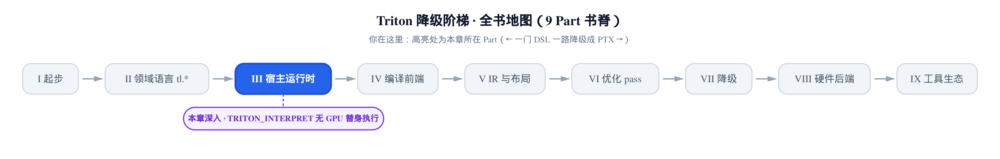
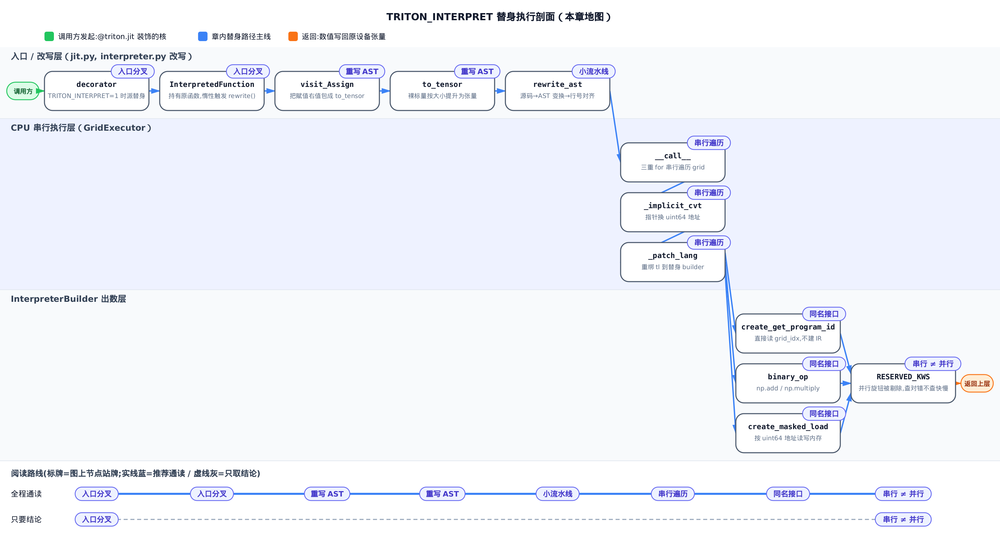
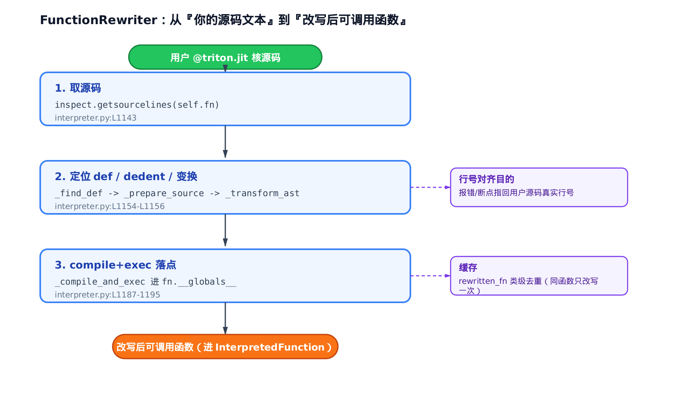
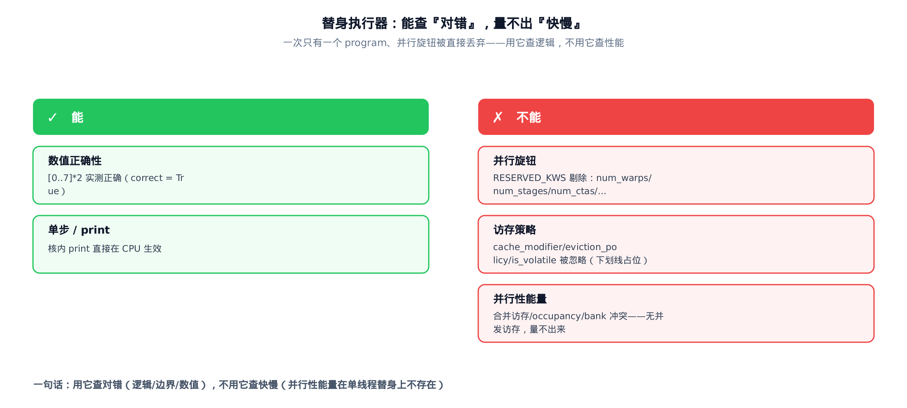

# TRITON_INTERPRET：让整本书的核，在没有 GPU 的机器上跑给你看

你在笔记本上写了个 Triton 核，逻辑绕、下标算得心虚。手边没卡，云上的卡还在排队。你想做的其实很朴素：**先在这台没有 GPU 的机器上，把这个核跑对、跑通，再上卡。**

这一章就讲这剂解药。设一个环境变量 `TRITON_INTERPRET=1`（Triton 的解释器开关，置 `1` 走 CPU 替身路径），你写的 `@triton.jit` 核就能在纯 CPU 上跑起来：能 `print`、能单步、能断点、能把每个 program 算出的中间值一个个看清楚。全书前面十几章拆过的核，现在都能在无卡机器上验证逻辑。这条路径的入口在 `python/triton/runtime/jit.py`，主体实现在 `python/triton/runtime/interpreter.py`，本章逐段拆的就是这两处。

先把话说在前头——**这是一章非性能杠杆的书**。前面每一章都在回答「懂了这一层，我能做什么调优决策」；这一章不解锁合并访存、不解锁 occupancy、不解锁 `num_stages`。它解锁的是另一件同等要紧的事：**在没有硬件的地方，先确认核的逻辑是对的。** 但它有一条必须记牢的边界——替身在 CPU 上把 grid 里的 program 排成一队、一个一个串行跑，**串行 ≠ 并行**。所以它能帮你查「对错」，量不出「快慢」。用它查逻辑，别用它测性能。这条边界，本章最后一节会用源码坐实。

<!-- roadmap 开篇「你在这里」窄长条横幅 -->


- 上一站走的是真发射：`JITFunction` 一路查缓存、编译、把 cubin 打到 GPU。
- 本章岔进替身路：同一份核代码，换 `TRITON_INTERPRET=1`，改在 CPU 上跑。
- 一个环境变量，就把整条执行路线从「登台真跑」切成「排练给你看」。



> 只想拿走一句结论——「能查对错、量不出快慢」——直接跳到最后一节「边界：串行 ≠ 并行」。想看清替身怎么从入口一步步跑通一个核，从下一节按序读。

在[第 1 章](../../ch01-what-is-triton/narrative/chapter.md)鸟瞰全书时，我们埋过一句话：`TRITON_INTERPRET=1` 时 `@triton.jit` 会返回一个叫 `InterpretedFunction` 的东西，而不是正常路径的 `JITFunction`，它经过一次 AST 重写、再由一个执行器在 CPU 上串行遍历 grid。当时只点了名，说「它不是原样跑 Python」。这一章就是那句话的兑现——我们把这条替身路径从入口到出数，逐段拆给你看，讲准它到底重写了什么、为什么必须重写。

## 入口分叉：一块牌子换掉整条执行路线

**直觉。** 同一份剧本（你的核代码），换个演出模式就换一位演员。平时登台真跑硬件的是主演 `JITFunction`（`@triton.jit` 装饰后的正常路径函数对象，[第 11 章](../../ch11-run-launch-pipeline/narrative/chapter.md)讲过它怎么查缓存、编译、发射）；一旦挂上 `TRITON_INTERPRET=1` 这块牌子，装饰器改派替身 `InterpretedFunction`（CPU 上的解释执行函数对象）上场。台词一字不改——`k[grid](...)` 这句调用语法你照写——只是这位替身在 CPU 上把戏排练给你看。

**机制。** 分叉发生在装饰器最里层，就一个 `if`。命中环境变量，返回替身；否则返回正常路径。两条路在**对象类型**上彻底分开，互不污染——这正是「返回 `InterpretedFunction` 而非 `JITFunction`」这句话的落点。


**源码。** 分叉判据是 `os.getenv`（读环境变量，缺省 `"0"`）等于 `"1"`：

```python
# python/triton/runtime/jit.py:L832-L849
    def decorator(fn: T) -> JITFunction[T]:
        assert callable(fn)
        if os.getenv("TRITON_INTERPRET", "0") == "1":
            from .interpreter import InterpretedFunction
            return InterpretedFunction(fn, version=version, do_not_specialize=do_not_specialize,
                                       do_not_specialize_on_alignment=do_not_specialize_on_alignment, debug=debug,
                                       noinline=noinline, repr=repr, launch_metadata=launch_metadata)
        else:
            return JITFunction(
                fn,
                # … 省略：与替身选择无关的构造参数 …
                launch_metadata=launch_metadata,
            )
```

三个设计点值得停一下。第一，分叉在**装饰器层**，不是在编译期切后端——换句话说，替身与正常路径连产出的函数对象类型都不一样，从入口就是两套东西。第二，`else` 分支那条 `JITFunction` 正常路径不是本章的活，[第 11 章](../../ch11-run-launch-pipeline/narrative/chapter.md)讲透了，这里只拿它当参照。第三，用户**零改动**：你不改一行核代码、不改一句调用，仅凭一个环境变量就切换整条路线。这就是把开关放在最外层装饰器的价值。

这不是纸面推断——headless 无 GPU 环境下实测：设 `TRITON_INTERPRET=1` 后，任意 `@triton.jit` 核 `k` 的 `type(k).__name__` 确实是 `"InterpretedFunction"`；分叉在真机上就是这样发生的。

替身对象本身长这样——它持有你的原函数，惰性地做一次重写，然后交给执行器发射：

```python
# python/triton/runtime/interpreter.py:L1198-L1235
class InterpretedFunction:
    # Cache all rewritten functions
    rewritten_fn = {}

    def __init__(self, fn, **kwargs) -> None:
        self.fn = fn
        self.rewriter = FunctionRewriter(fn, **kwargs)

        def run(*args, **kwargs):
            grid = kwargs["grid"]
            fn = self.rewrite()
            return GridExecutor(fn, self.arg_names, grid)(*args, **kwargs)

        self.run = run
        signature = inspect.signature(fn)
        self.arg_names = [v.name for v in signature.parameters.values()]

    def rewrite(self):
        if self.fn not in self.rewritten_fn:
            self.rewritten_fn[self.fn] = self.rewriter.rewrite_ast()
        return self.rewritten_fn[self.fn]

    # … 省略：@property __name__ 转发 self.fn.__name__ …

    def __getitem__(self, grid):
        fn = self.rewrite()
        return GridExecutor(fn, self.arg_names, grid)

    # … 省略：__call__ 处理「核内调用另一个设备函数」的路径 …
```

看 `run` 与 `__getitem__` 两条入口：都是先 `rewrite()` 拿到改写后的函数，再交给 `GridExecutor`（网格执行器，下面第四节的主角）去跑。`rewrite()` 背后是 `__init__` 里就建好的 `self.rewriter`——一个 `FunctionRewriter`（函数改写器，改写流水线的持有者，第三节细讲）；那个 `if self.fn not in self.rewritten_fn` 是类级缓存——`rewritten_fn` 是挂在类上的字典，**同一个核只改写一次**，之后每次调用复用。

那么这个「改写」到底改了什么？为什么不能捡起你的 Python 函数原样调用？下一节就是这个问题。

## 为什么要重写 AST，而不是原样跑你的 Python

**直觉。** 解释器拿到你的核，第一件事不是运行，而是给核体做一次「统一穿制服」：每条赋值的右值，都被套进一件叫 `to_tensor(...)` 的「张量外套」。为什么非套不可？因为 `tl` 的整套语义建立在「**一切都是张量**」之上——`tl.program_id`、`tl.arange` 返回的是张量，连你随手写的 `c = 2` 这个裸整数，也得先变成一个带 dtype 的张量，后面的 `tl` 运算才有统一语义可依。要是原样跑 Python，`c = 2` 就是个裸 `int`，它没有 dtype、不认识广播、没法参与张量运算——替身语义当场就漏了。

**机制。** 改写靠一个 AST（抽象语法树，Python 源码解析后的树状结构）变换器完成。它只盯一种节点——赋值节点——把 `x = value` 改写成 `x = to_tensor(value, interpreter_builder, False)`。别的节点一律不碰。我们拿一个小核跑一遍真实的改写，看每条语句发生了什么。核体是这样五句：

```python
pid  = tl.program_id(0)
offs = pid * BLOCK + tl.arange(0, BLOCK)
c    = 2
y    = tl.load(x_ptr + offs) * c
tl.store(y_ptr + offs, y)
```

前四句是赋值，最后一句 `tl.store(...)` 是纯表达式语句（没有 `=` 左值）。把这段真源码喂给改写器，逐条对照改写前后：

<!-- trace: m2-ast-rewrite-to-tensor -->

| 赋值序号 | 改写前 | 改写后 | 右值发生了什么 |
|---|---|---|---|
| 0 | `pid = tl.program_id(0)` | `pid = triton.language.semantic.to_tensor(tl.program_id(0), interpreter_builder, False)` | `program_id` 返回值被包一层 `to_tensor` |
| 1 | `offs = pid * BLOCK + tl.arange(0, BLOCK)` | `offs = triton.language.semantic.to_tensor(pid * BLOCK + tl.arange(0, BLOCK), interpreter_builder, False)` | 整个偏移表达式被包一层 |
| 2 | `c = 2` | `c = triton.language.semantic.to_tensor(2, interpreter_builder, False)` | 裸标量 `2` 被提升成整型张量——这一步最能说明「为何不能原样跑 Python」 |
| 3 | `y = tl.load(x_ptr + offs) * c` | `y = triton.language.semantic.to_tensor(tl.load(x_ptr + offs) * c, interpreter_builder, False)` | 读入并乘常量后的结果，同样被包一层 |

**这里的不变量**：改写是**保结构**的。核体 4 条赋值，恰好各被包一次；那 1 条 `tl.store` 表达式语句，0 次改写。语句总数不变、控制流不变、目标名不变——只在赋值的**右值**外面套一层，绝不在别处增删。为什么能守住这条？因为变换器只覆写「访问赋值节点」这一个方法，其余节点走默认遍历、原样不动。于是「改写次数 = 赋值数」就成了一个可数的守恒事实——本例 4 条赋值 → 4 次包裹，一次不多一次不少。


*（图中 `ib` 是 `interpreter_builder` 的简写。）*

**源码。** 变换器就是一个只重写赋值节点的类。它先拒绝多目标赋值（`a = b = c` 这种歧义写法直接抛错），再把原右值 `node.value` 塞进一个 `to_tensor(...)` 调用节点，返回：

```python
# python/triton/runtime/interpreter.py:L1109-L1126
class ASTTransformer(ast.NodeTransformer):

    def visit_Assign(self, node):
        names = []
        for target in node.targets:
            names += [self.visit(target)]
        if len(names) > 1:
            raise ValueError("Multiple assignments are not supported")
        # Modify the assignment x = value to
        # triton.language.semantic.to_tensor(value, interpreter_builder, False)
        node.value = ast.Call(
            func=ast.Attribute(
                # … 省略：构造 `triton.language.semantic.to_tensor` 这串属性访问的 AST …
                attr='to_tensor', ctx=ast.Load()),
            args=[node.value, ast.Name(id='interpreter_builder', ctx=ast.Load()),
                  ast.Constant(value=False)], keywords=[])
        return node
```

`ast.NodeTransformer` 是 Python 标准库里的 AST 变换基类：你覆写 `visit_XXX` 就只改写那类节点。这里只覆写 `visit_Assign`，所以「保结构」是这套机制天然带的属性，不需要额外守卫。注意那三个参数——被包的原右值、`interpreter_builder`、`False`——第二个 `interpreter_builder` 是个稍后会讲的全局单例（第五节的主角）：它在 `interpreter.py` 模块顶层被实例化一次（`interpreter_builder = InterpreterBuilder()`），全模块共用同一个实例，改写时先把这个名字埋进去，运行时才解析得到。第三个参数 `False` 对应 `to_tensor` 签名里的 `check_type`（是否再做一次类型合法性检查）：这里的右值是核体内部的表达式、不是用户从外部传进来的实参，不必再查一遍类型，直接按值提升即可，所以关掉。本章的改写路径只用到 `check_type=False` 这一侧；`check_type=True`（会对入参多做一次类型合法性检查）留给「外部输入」那类调用场景，不在本章的替身路径里出现，这里不展开。

那件「张量外套」`to_tensor` 本身干的活，就是把裸标量按大小选 dtype 提升成张量：

```python
# python/triton/language/semantic.py:L111-L126
def to_tensor(x, builder, check_type: bool = True):
    if isinstance(x, bool):
        return tl.tensor(builder.get_int1(x), tl.int1)
    # Note: compile-time const integers are represented by unsigned values
    elif isinstance(x, int):
        if -2**31 <= x < 2**31:
            dtype = tl.int32
        elif 2**31 <= x < 2**32:
            dtype = tl.uint32
        elif -2**63 <= x < 2**63:
            dtype = tl.int64
        elif 2**63 <= x < 2**64:
            dtype = tl.uint64
        else:
            raise ValueError(f'Nonrepresentable integer {x}.')
        return full((), x, dtype=dtype, builder=builder)
    # … 省略：float 分支按大小选 fp32/fp64；已是张量的 x 直接原样返回 …
```

省略号里还藏着 `check_type` 真正生效的那一行——都不是 bool/int/float/已是张量时，`check_type=True` 才抛类型错、`False` 就原样放行。这段检查逻辑不影响本例四条赋值的改写结果（它们全在 bool/int/float/tensor 之内），这里只需记住它的作用，不必去代码里找它。

看那条 `c = 2` 的命运：`2` 是 Python `int`，落进 `-2**31 <= x < 2**31` 分支，被 `full((), 2, dtype=tl.int32)` 造成一个 0 维的 int32 张量。从此核体里「一切皆张量」，`tl` 的运算、广播、dtype 规则全都对得上号。这就是「不是原样跑 Python」的准确含义——**不是解释你的 Python，而是先把你的 Python 改写成一段『处处是张量』的等价代码，再解释它。**

## 改写不是凭空发生的：一条小流水线

赋值怎么被套上外套，上一节讲清了。但这层改写要真正生效，得先把你函数的源码文本抠出来、解析、变换、再编译回一个能调用的函数。这一步由 `FunctionRewriter`（函数改写器，改写流水线的持有者）负责。它是支撑机制，我们讲清骨架和两个关键设计即可。



主方法把整条流水线串起来——取源码、定位 `def` 行、去缩进、解析、变换、compile+exec：

```python
# python/triton/runtime/interpreter.py:L1139-L1157
    def rewrite_ast(self):
        # If exception is raise, it means the function does not have source code available,
        # e.g., dynamically generated functions, we cannot rewrite it so just return the original function
        try:
            lines, _ = inspect.getsourcelines(self.fn)
        except Exception:
            return self.fn
        # … 省略：截掉 def 之前的 @triton.jit 等装饰器行的说明注释 …
        self.filename, self.def_file_lineno = self._get_jit_fn_file_line()
        self.def_lineno = self._find_def(lines)
        src = self._prepare_source(lines)
        transformed_ast = self._transform_ast(src)
        return self._compile_and_exec(transformed_ast)
```

第一行 `inspect.getsourcelines` 就是「把你写的核的源码文本原样抠出来」。抠不到（比如动态生成、没有源码的函数）就 `return self.fn`——原样退回，不改写。之后 `_find_def` 定位到 `def foo(...)` 那一行、`_prepare_source` 去掉多余缩进、`_transform_ast` 里跑上一节那个变换器。

两个设计决策值得单独点破。**其一，行号要对齐回你的原文件。** 看收尾这步 compile+exec：

```python
# python/triton/runtime/interpreter.py:L1187-L1195
    def _compile_and_exec(self, transformed_ast):
        compiled_code = compile(transformed_ast, filename=self.filename, mode='exec')
        local_namespace = {**self.kwargs}
        fn_globals = self.fn.__globals__
        for key, value in globals().items():
            if key not in fn_globals:
                fn_globals[key] = value
        exec(compiled_code, fn_globals, local_namespace)
        return local_namespace[self.fn.__name__]
```

`compile(..., filename=self.filename, ...)` 把改写后代码的文件名钉成你的原文件，配合流水线里对行号的重排，一旦核内报错，traceback 指的是**你源码的真实行号**，而不是某段临时改写字符串的行号。调试是这个模式的头等目的——报错能指回你写的那一行，这剂解药才好用。

那句 `local_namespace = {**self.kwargs}` 里的 `self.kwargs`，就是 `FunctionRewriter(fn, **kwargs)`（第一节 `InterpretedFunction.__init__` 里构造 `self.rewriter` 那一行）透传进来的那份参数——`debug`、`noinline` 这类核构造期的选项。先把它们塞进 `local_namespace`，`exec` 跑出来的新函数体如果引用了这些名字，就能从这个局部命名空间里读到。

**其二，exec 进原函数的 globals。** 那个 `for key, value in globals().items()` 循环，把解释器模块里的名字（尤其是改写时埋进去的 `interpreter_builder`）注入你原函数的 `__globals__`。这样改写后代码里那句 `to_tensor(value, interpreter_builder, False)` 才能把 `interpreter_builder` 这个名字解析到。改写埋名、这里补名，一埋一补对上了。

## 串行遍历 grid：一次只跑一个 program

改写后的函数拿到了，怎么在 CPU 上把它跑成一个 grid？这是本章的题眼，也是「串行 ≠ 并行」这句边界话的画面出处。

**直觉。** GPU 上一个 grid 的成百上千个 program 是**同时**铺开在各个核心上并行跑的。替身没有并行硬件，于是 `GridExecutor` 把它们排成一队，用三重 `for` 一个一个喂：先把 `program_id=0` 这个 program 从头到尾跑完，再喂 `program_id=1`……就像一位演员，把群戏里每个角色轮流演一遍。关键一句：`program_id`（SPMD 里「我是谁」的坐标，[第 1 章](../../ch01-what-is-triton/narrative/chapter.md)建立）**不是硬件算出来的，是执行器一个个塞进来的。**

**机制。** 拿一个最小例子跑真机 trace：输入 `x = [0,1,2,3,4,5,6,7]`，核体是 `y = x * 2`，`BLOCK = 4`，`grid = (2,)`——两个 program，各处理 4 个元素。设 `TRITON_INTERPRET=1` 在无卡机器上实跑，观测到的串行轮次：

<!-- trace: m4-grid-executor-serial -->

| 串行轮次 | program_id（执行器喂入） | offs 分片 | x 读入 | y = x*2 写出 | 此刻另一 program 状态 |
|---|---|---|---|---|---|
| 1 | 0 | `[0, 1, 2, 3]` | `[0, 1, 2, 3]` | `[0, 2, 4, 6]` | pid=1 尚未开始 |
| 2 | 1 | `[4, 5, 6, 7]` | `[4, 5, 6, 7]` | `[8, 10, 12, 14]` | pid=0 已整段跑完 |

读这张表最要紧的是最后一列：轮 1 跑 `pid=0` 时，`pid=1` **还没开始**；轮 2 跑 `pid=1` 时，`pid=0` **已整段跑完**。两个 program 首尾相接、绝不重叠——这就是串行。最终拼出的输出 `[0,2,4,6,8,10,12,14]` 与期望完全一致，逻辑跑对了。

**这里的不变量**：三重 `for` 恰好遍历「补齐后 grid 的元素乘积」次，每个 program 跑且只跑一次，串行不重入，有限步必停。为什么成立？`grid = (2,)` 被补齐成 `(2,1,1)`，三层 `range` 上界固定，迭代计数就是 `2×1×1 = 2`，严格有限；每轮先定当前坐标、再**同步**调一次核体，没有并发、没有 `await`，`pid=0` 整段返回后才进 `pid=1`。trace 里两行严格按 `program_id=0 → program_id=1` 的顺序打印，就是这条不变量的现场证据。

![grid=(2,) 补齐 (2,1,1)：上半 GPU 本应两个 program 并行铺开，下半 CPU 替身把它们摊成首尾相接的两次串行调用，`pid=0` 写 `[0,2,4,6]` 跑完才轮到 `pid=1` 写 `[8,10,12,14]`](../diagrams/fig-m4-serial-vs-parallel.png)

**源码。** 执行器的 `__call__` 是这条串行遍历的全部：

```python
# python/triton/runtime/interpreter.py:L1079-L1106
    def __call__(self, *args_dev, **kwargs):
        # removes reserved keywords from kwargs
        kwargs = {k: v for k, v in kwargs.items() if k not in RESERVED_KWS}
        if kwargs.pop("warmup", False):
            return
        # copy arguments to the host
        args_hst, kwargs_hst = self._init_args_hst(args_dev, kwargs)
        # remaps core language functions to interpreted ones
        _patch_lang(self.fn)
        # we need to copy arguments to the host for the interpreter
        # implicitly convert tensor arguments to their base pointers
        args = inspect.getcallargs(self.fn, *args_hst, **kwargs_hst)
        args = {name: arg if name in self.constexprs else _implicit_cvt(arg) for name, arg in args.items()}
        # iterate through grid
        grid = self.grid(args) if callable(self.grid) else self.grid
        assert len(grid) <= 3, "grid must have at most 3 dimensions"
        grid = grid + (1, ) * (3 - len(grid))
        interpreter_builder.set_grid_dim(*grid)
        try:
            for x in range(grid[0]):
                for y in range(grid[1]):
                    for z in range(grid[2]):
                        interpreter_builder.set_grid_idx(x, y, z)
                        self.fn(**args)
        except Exception as e:
            raise InterpreterError(repr(e)) from e
        # copy arguments back to propagate side-effects
        self._restore_args_dev(args_dev, args_hst, kwargs, kwargs_hst)
```

从上到下五段。**第一段**，`RESERVED_KWS`（保留关键字集合，装着 `num_warps`、`num_stages` 等并行旋钮）里的键被整体剔除——它们在串行 CPU 上无意义，这一剔本身就点破了边界，最后一节细说。紧接着那句 `if kwargs.pop("warmup", False): return` 是条快捷出口：`warmup=True` 表示「只走到这步、验证参数、并不真跑核体」的空跑（编译期常见的预热调用约定），解释器路径原样兼容它，命中就直接返回、不进下面的三重 `for`。**第二段**，`grid = grid + (1,) * (3 - len(grid))` 把 grid 补齐到三维，`(2,)` → `(2,1,1)`。**第三段**，三重 `for` 逐点 `set_grid_idx(x, y, z)` 定当前 program 的坐标，紧接着 `self.fn(**args)` 同步调一次核体。这两行就是「一次只跑一个 program」的全部实现——没有线程池、没有异步、没有任何并行原语。**第四段**，异常统一包成 `InterpreterError`。**第五段**，`_restore_args_dev` 把结果回拷（下面讲）。

那么核体运行时，那些张量参数从哪来、`program_id` 怎么就变成了当前坐标？这引出两个支撑动作，都在上面代码里露过脸。

其一，**拷参到 host、指针换地址**。GPU 张量得先搬到 CPU 才能用 numpy 算。（这里得澄清一句：`TRITON_INTERPRET=1` 并不要求机器一定没有 GPU——它也常用在「有卡、但这一趟只想核对逻辑、不想真编译发射」的场景，这时输入可能确实是 CUDA 张量，`.cpu()` 就是把它们捞回主机；在纯无卡机器上，张量本就在 CPU 上，这一步是空操作、纯防御性代码。）`_init_args_hst` 把带 `data_ptr`（张量底层缓冲区的整数地址）的设备张量 `.cpu()` 搬到主机：

```python
# python/triton/runtime/interpreter.py:L1052-L1066
    def _init_args_hst(self, args_dev, kwargs):
        args_hst = []
        for arg in args_dev:
            if hasattr(arg, "data_ptr"):
                args_hst.append(arg.cpu())
            else:
                args_hst.append(arg)
        # … 省略：kwargs 同理逐个搬到 host …
        return args_hst, kwargs_hst
```

搬到 host 之后，`_implicit_cvt`（隐式转换）再把指针实参换成「装着 `data_ptr()` 这个 uint64（64 位无符号整数）地址」的 `TensorHandle`（解释器里张量的载体，裹一个 numpy 数组加类型）：

```python
# python/triton/runtime/interpreter.py:L1012-L1032
def _implicit_cvt(arg):
    if isinstance(arg, int):
        # … 省略：int 实参按大小选 numpy dtype，提升成 TensorHandle …
        handle = TensorHandle(np.array([arg], dtype=dtype), ty)
        return tl.tensor(handle, ty)
    if hasattr(arg, "data_ptr"):
        ty = tl.str_to_ty(triton.runtime.jit.JITFunction._type_of(triton.runtime.jit.JITFunction._key_of(arg)))
        handle = TensorHandle(np.array([arg.data_ptr()], dtype=np.uint64), ty)
        return tl.tensor(handle, ty)
    return arg
```

看第二个 `if`：一个指针参数，被换成了「装着它 host 缓冲区整数地址的 `TensorHandle`」。核体里对指针只做整数算术（`base + offset`），把张量替换成它的整数地址后，numpy 侧的指针算术、以及 C++ 侧按地址读写内存，就能忠实复现「按地址访存」，压根不需要真设备的内存模型。跑完之后 `_restore_args_dev` 做对称的回拷——把 host 张量 `.to(device)` 搬回原设备张量，让 `store` 的写入对调用方可见。这就是为什么无 GPU 也能看到写回的结果。

这两步搬完之后，前面 `__call__` 里还夹着一句 `inspect.getcallargs(self.fn, *args_hst, **kwargs_hst)`——它是 Python 标准库函数，按 `self.fn` 的签名把这串位置/关键字实参绑成一个 `{形参名: 值}` 字典，这样后面就能按名字而不是按位置处理每个参数。紧接着那句 `{name: arg if name in self.constexprs else _implicit_cvt(arg) ...}` 里的 `self.constexprs`，是 `GridExecutor.__init__` 里从核签名的类型标注扫出来的：凡是被标 `tl.constexpr`（编译期常量）的形参名，都收进这个集合。它们是 Python 值（比如 `BLOCK=4` 这个整数本身），不是设备张量、没有 `data_ptr`——`_implicit_cvt` 只认指针和普通标量，遇到 constexpr 名字就原样放行，不做任何地址转换。

其二，**把 `tl.*` 整体重接到替身实现**。核体里那些 `tl.program_id`、`tl.load`、`tl.arange` 平时是通向真编译器的原语，现在得改接到 CPU 数值实现。`_patch_lang` 干这件事：

```python
# python/triton/runtime/interpreter.py:L999-L1008
def _patch_lang(fn):
    langs = [value for _, value in fn.__globals__.items() if value in [tl, tl.core]]
    assert len(langs) >= 1, "triton.language must be visible from within jit'd function"
    for lang in langs:
        _patch_builtin(lang, interpreter_builder)
        # … 省略：对 lang.tensor / lang.math 逐一重绑，并补 tensor 的 __bool__/__index__、range/reduce 等 …
```

它遍历你函数的 `__globals__` 找到 `tl` / `tl.core`，把其中每个原语的实现重绑到 `interpreter_builder`——那个前面反复出现的全局单例。重绑之后，核体里所有 `tl.*` 调用，落点全变成了下一节的主角。

## InterpreterBuilder：同名接口，换掉了内核

前面几节铺的都是「怎么把核代码改写、怎么把它在 CPU 上串行跑起来」。但核体里真正出数的动作——加、乘、`program_id`、`load`/`store`——最终落在哪？落在 `InterpreterBuilder`（解释器 builder，numpy 兜底的 IR builder 替身）身上。它是这一章「替身」二字最纯粹的体现。

**直觉。** 真实编译路径里，`builder.create_add` 是去「画一张施工图」——建一个 `tt.add` 的 IR 节点，交给后端编译成 GPU 指令。解释器的 `InterpreterBuilder` **同名同签名**，但它的 `create_add` 干的是当场把两个 numpy 数组加起来。接口一样、行为换芯：从「建 IR」换成「直接算数值」。所以同一段 `tl` 代码，一个走去编译、一个走去出数——核代码零改动，就复用到了 CPU 数值路径上。


**机制 + 源码。** 先看 `program_id`。真 builder 会建一个 `tt.get_program_id` 的 IR op 交后端；这里直接返回当前串行迭代的坐标：

```python
# python/triton/runtime/interpreter.py:L358-L364
    # programming model
    def create_get_program_id(self, axis):
        if self.grid_idx is None:
            raise ValueError("grid_idx is None")
        return TensorHandle(np.array([self.grid_idx[axis]], dtype=np.int32), tl.int32)

    def create_get_num_programs(self, axis):
        return TensorHandle(np.array([self.grid_dim[axis]], dtype=np.int32), tl.int32)
```

`self.grid_idx[axis]` 就是上一节 `set_grid_idx(x, y, z)` 每轮设进来的坐标。这行代码把「`program_id` 不是硬件算的，是执行器一个个喂进来的」这句话钉死了——它读的就是执行器刚设的那个数。紧挨着的 `create_get_num_programs` 读的 `self.grid_dim[axis]` 同理——就是上一节 `set_grid_dim(*grid)` 那一次性设进去的网格总维度；`grid_idx` 每轮变、`grid_dim` 全程不变。

`tl.arange` 走的也是同一个模子。第二节那个例子里那句 `tl.arange(0, BLOCK)`，最终就落在这一行：

```python
# python/triton/runtime/interpreter.py:L554-L555
    def create_make_range(self, start, stop):
        return TensorHandle(np.arange(start, stop, dtype=np.int32), tl.int32)
```

`np.arange(0, BLOCK)` 直接生成 `[0, 1, …, BLOCK-1]` 的 int32 数组——第二节里 program 内那个偏移张量的下标从哪来，答案就是这行 numpy。它和 `create_get_program_id`、下面的 `binary_op` 是同一副印子：同名接口，换 numpy 内核。

再看二元算子。所有 `create_add` / `create_mul` 之类，共用一个 `binary_op`，实现就是一句 numpy：

```python
# python/triton/runtime/interpreter.py:L415-L432
    # binary operators
    def binary_op(self, lhs, rhs, op):
        return TensorHandle(op(lhs.data, rhs.data), lhs.dtype.scalar)

    create_fadd = lambda self, lhs, rhs: self.binary_op(lhs, rhs, np.add)
    create_fmul = lambda self, lhs, rhs: self.binary_op(lhs, rhs, np.multiply)
    create_fdiv = lambda self, lhs, rhs: self.binary_op(lhs, rhs, np.divide)
    create_frem = lambda self, lhs, rhs: self.binary_op(lhs, rhs, np.remainder)
    create_fsub = lambda self, lhs, rhs: self.binary_op(lhs, rhs, np.subtract)
    create_mul = lambda self, lhs, rhs: self.binary_op(lhs, rhs, np.multiply)
    create_precise_divf = lambda self, lhs, rhs: self.binary_op(lhs, rhs, np.divide)
    create_sdiv = lambda self, lhs, rhs: self.create_idiv(lhs, rhs)
    create_udiv = lambda self, lhs, rhs: self.create_idiv(lhs, rhs)
    # LLVM has 'numpy.fmod', not 'numpy.remainder', semantics on integer remainders.
    create_srem = lambda self, lhs, rhs: self.binary_op(lhs, rhs, np.fmod)
    create_urem = lambda self, lhs, rhs: self.binary_op(lhs, rhs, np.fmod)
    create_add = lambda self, lhs, rhs: self.binary_op(lhs, rhs, np.add)
    create_sub = lambda self, lhs, rhs: self.binary_op(lhs, rhs, np.subtract)
```

`binary_op` 就一行——把两个 `TensorHandle` 里的 numpy 数据取出来、套一个 numpy 运算、包回一个新 `TensorHandle`。`create_add` 传 `np.add`、`create_mul` 传 `np.multiply`，`create_sub` 传 `np.subtract`，全是同一个模子印出来的。有一处细节耐人寻味：整数取余 `create_srem`/`create_urem` 用的是 `np.fmod` 而不是 `np.remainder`——注释写明这是为对齐 LLVM 在整数取余上的语义。**替身要「对」，得连这种符号约定都跟真实后端对齐。** 举个能记住的数字：`-7` 对 `3` 取余，`np.remainder` 给 `2`（余数与除数同号，Python 习惯），`np.fmod` 给 `-1`（余数与被除数同号，C/LLVM 习惯）——`create_srem` 选 `fmod`，就是要复现后者。上面这 13 个 `create_*` 是本章内嵌的二元算子全家；比较、位运算、超越函数那几十个同构的 `create_*` 一律 `op(numpy)` 一行实现，不再一一列。

**这里的不变量**：所有 `create_*` 都与真 builder 同名同签名，于是核体那一侧（`tl.*` 前端）一行都不用改——运行期只是把同一个方法名解析到不同的实现体（真 builder 建 IR ↔ `InterpreterBuilder` 用 numpy 直算）。这条接口一致性，正是「零改核代码就复用到 CPU 数值路径」的支点；连 `create_srem` 特意选 `np.fmod` 去对齐 LLVM，都是为了让「同名」在数值上也真的「同义」。

访存也是一个道理。`load`/`store` 按 uint64 地址读写 host 内存：

```python
# python/triton/runtime/interpreter.py:L367-L385
    # memory ops
    def create_load(self, ptr, _0, _1, is_volatile):
        mask = TensorHandle(np.ones_like(ptr.data, dtype=bool), tl.int1)
        other = None
        return self.create_masked_load(ptr, mask, other, _0, _1, is_volatile)

    # … 省略：create_store 同理转发到 create_masked_store …

    def create_masked_load(self, ptrs, mask, other, cache_modifier, eviction_policy, is_volatile):
        dtype_tt = ptrs.get_element_ty()
        dtype_np = _get_np_dtype(dtype_tt)
        if other is None:
            other = TensorHandle(np.zeros_like(ptrs.data, dtype=dtype_np), dtype_tt)
        ret = _interpreter.load(ptrs.data, mask.data, other.data, dtype_np)
        return TensorHandle(ret, dtype_tt)

    def create_masked_store(self, ptrs, value, mask, cache_modifier, eviction_policy):
        return _interpreter.store(ptrs.data, value.data, mask.data)
```

`_interpreter.load` / `.store` 是 C++ 侧的实现，按 `ptrs.data` 里那个 uint64 地址数组，直接读写进程内存——这正是前面 `_implicit_cvt` 把指针换成地址的目的地。这里有两处容易绊一下：其一，`_interpreter` 是随 Triton 一起编译的 C++ 扩展模块，**不是**本文件 `interpreter.py` 自身（名字撞脸，但一个是 Python 解释器主体、一个是被它调用的原生扩展）；其二，访存偏偏没像其他算子那样写一行 numpy——因为这里要做的是「按一串裸整数地址、在 mask 控制下逐地址读写进程内存」，这种直接操作原始地址的活，交给 C++ 扩展比用 numpy 的高层数组接口更直接、也更贴合真实后端的按地址访存语义。留意 `create_masked_load` 的参数表里，`cache_modifier`、`eviction_policy`、`is_volatile` 这几个进来了、却根本没被用上。它们是缓存策略、驱逐策略、易失性——全是影响真硬件「快慢」的旋钮。在这里被静静忽略，又一次点破了这个模式的边界。这条边界，正是下一节要正面收的账。

## 边界：串行 ≠ 并行，查对错不查快慢

前面五节把替身路径从入口拆到出数。收尾这一节，把这剂解药的「能」与「不能」讲透——它是本章开头那句承诺的兑现，也是伏笔里「串行 ≠ 并行」四个字的正面回答。

**直觉。** 替身是台「慢放的显微镜」。它能让你逐个 program 看清每一步算了什么、哪个下标越界、数值对不对；但它一次只有一个 program、访存是逐地址的 numpy 读写，根本没有「多线程同时抢内存」这回事——所以合并访存（coalescing）、bank 冲突（多个线程同一时刻抢同一块共享内存 bank，访问被迫排队串行化）、occupancy（占用率）这些**并行性能量**，在这台机器上压根不存在。一句话：**用它查对错，不用它查快慢。**



**机制。** 「能」的一侧，前面已被 trace 坐实：`[0..7] * 2` 的输出与期望逐位一致，逻辑跑对了；核内 `print` 直接在 CPU 生效，每个 program 的中间值都能打印出来看。这正是无卡调试要的——**先把对错确认下来。**

「不能」的一侧，源码里有三处硬证据，我们已在前面路过，这里收拢成一张账：

1. **并行旋钮被整体剔除。** `GridExecutor.__call__` 开头那句 `kwargs = {k: v for k, v in kwargs.items() if k not in RESERVED_KWS}`（`python/triton/runtime/interpreter.py:L1081`），把 `num_warps`（一个 program 用几个 warp）、`num_stages`（软件流水线级数）这些旋钮直接丢掉。它们只影响真硬件怎么调度、怎么流水，对 CPU 串行数值复现毫无意义。
2. **访存策略被忽略。** 上一节 `create_masked_load`（`python/triton/runtime/interpreter.py:L376-L385`）收下了 `cache_modifier` / `eviction_policy` / `is_volatile` 却不用——这些「怎么用缓存、怎么驱逐」的性能参数，在替身里是空占位。
3. **没有并发访存这回事。** 一次只有一个 program，`load`/`store` 是逐个地址的顺序读写。合并访存、bank 冲突、occupancy 全都是「多线程同时访问内存 / 寄存器压力」的产物——没有并发，这些量级在此模型里根本不成立。

**为什么必然如此。** 把它写成一句可推的话：替身的三重 `for` 让总工作量 = grid 元素数 × 单个 program 的核体计算，全落在单线程 numpy 上顺序执行；GPU 上这些 program 是跨 SM / warp 并行铺开的。两者的墙钟时间**没有任何可比性**——替身复现的是「每个 program 算什么」，不是「多少 program 同时算、访存合不合并、occupancy 多高」。所以拿它测出来的时间，对真实性能一分钱参考价值都没有。这不是实现没做好，是这个执行模型从根上就不承载性能语义。

这就把[第 1 章](../../ch01-what-is-triton/narrative/chapter.md)埋下的那句话补完了：`TRITON_INTERPRET=1` 时 `@triton.jit` 返回 `InterpretedFunction` 而非 `JITFunction`，经过一次把每个赋值包成 `to_tensor` 的 AST 重写（这就是「不是原样跑 Python」），再由 `GridExecutor` 用三重 `for` 在 CPU 上串行遍历 grid。它的用法与边界，现在都摆在桌面上了——**在没有卡的地方把核跑对、跑通，然后再上卡；至于快不快，那得回到真实硬件上，用前面那些性能杠杆去量。**

下一站我们回到真实编译与后端：一份 `.ttgir` 怎么绕过前端、直接做 IR 级实验，以及内容寻址缓存何时会失效——那是另一套「不上卡也能推进」的手艺。
