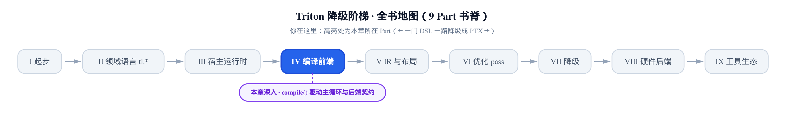
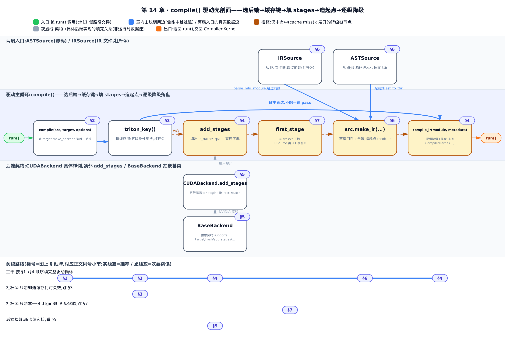
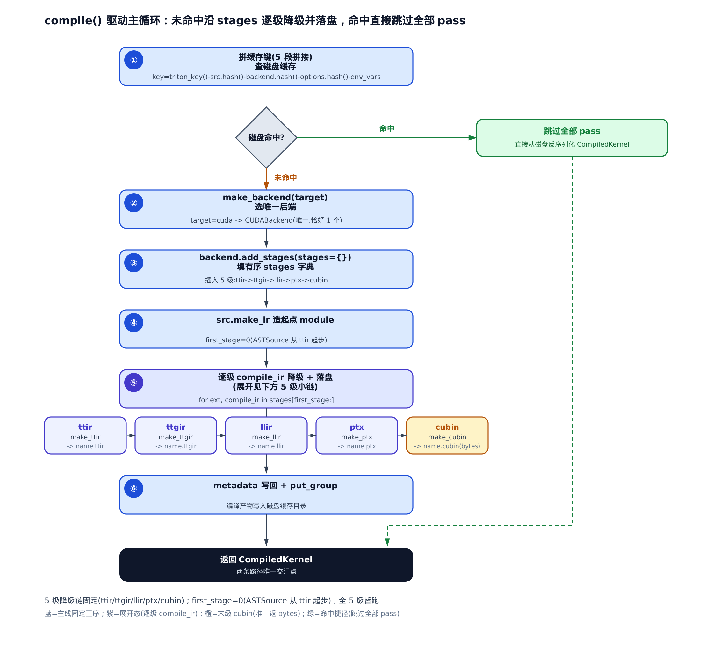
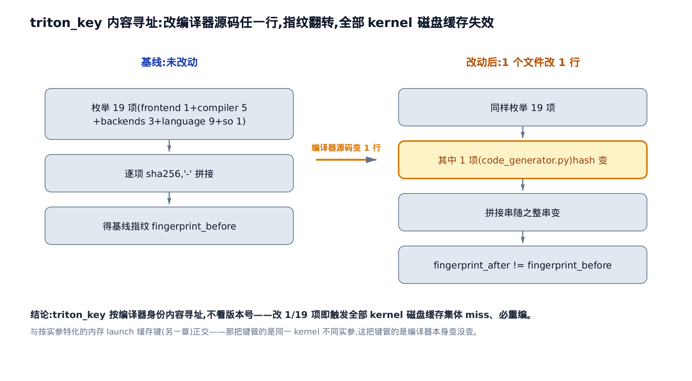
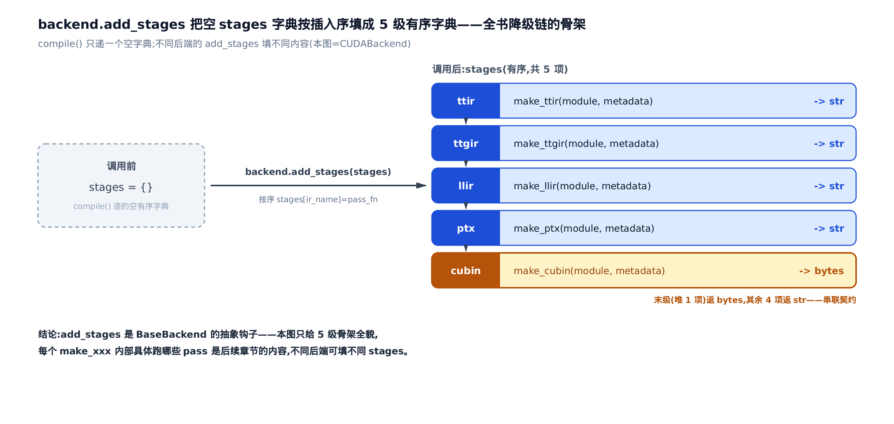
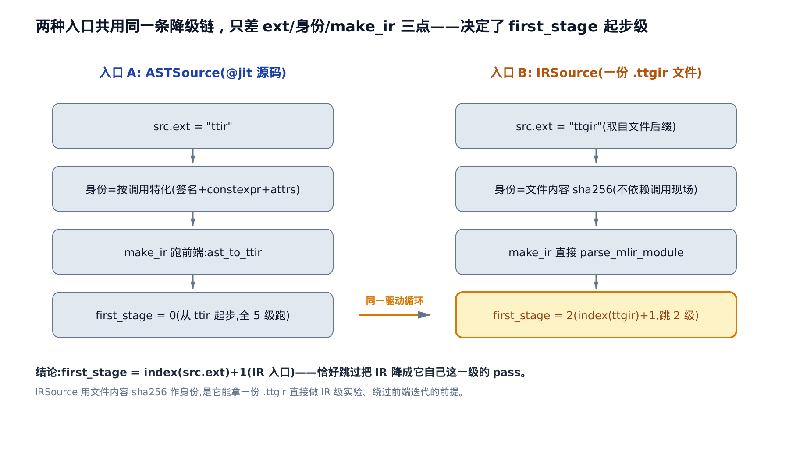
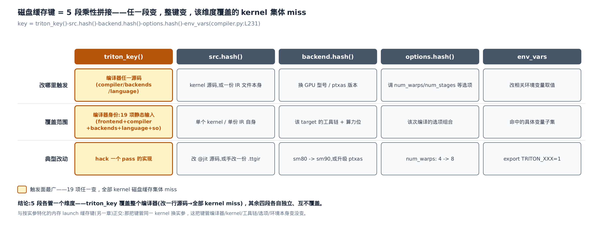

# compile() 驱动主循环——一路降到 PTX 的编排本体



上一部分讲清了「一份 kernel 怎么从 `fn[grid](...)` 走到发射」。
本章打开发射热路径上那个最贵的黑箱：`compile()`。
下一步，第五部分起会逐级拆开它填出来的每一道 pass。

一次未命中缓存的编译，慢就慢在 `python/triton/compiler/compiler.py` 里一个模块级函数 `compile()`。[第 11 章](../../ch11-run-launch-pipeline/narrative/chapter.md)讲 `run()` 时，我们把它当成一次调用一笔带过——`run()` 备齐 `ASTSource`、`target`、`options` 三样输入，交给 `compile()`，拿回一个 `CompiledKernel`（编译产物句柄，各级 IR 与最终二进制都挂在它上面）。「未命中慢路径到底贵在哪」，当时记的账，这一章来还：把 `compile()` 从头到尾拆开。

**这一章偏基建，但藏着两处能直接省你时间的性能杠杆。** 一，磁盘缓存不是按版本号失效的，而是按「编译器这个人的指纹」失效——你 hack 了编译器一行源码，**所有** kernel 的旧缓存当场作废，别傻等它复用；二，你能把某一级中间产物（比如一份 `.ttgir`）存成文件、手改几行、直接喂给 `compile()`，从那一级往下接着降到二进制，**绕过前端整条迭代**去单独调某一层。这两件事都落在本章的机制上。

**怎么读这一章。** 全章围绕一条主线：`compile()` 是一个**通用驱动壳**，它自己不懂任何一道编译工艺，只负责「选后端 → 拼缓存键 →(命中即返)→ 让后端填工位清单 → 造起点 → 照单逐级加工并存档 → 返回句柄」。想抓主干，顺着 §1→§4 读；只关心那两个性能杠杆，直接跳 §3（缓存何时失效）和 §7（IR 级实验）；想弄清「后端接缝长什么样、新卡怎么接」，看 §5。

术语先约定几个。**IR**（Intermediate Representation，中间表示）是编译器内部对程序的表示；Triton 一路要经过五级 IR：**TTIR**（Triton IR，最高层）、**TTGIR**（Triton GPU IR，贴了布局的张量 IR）、**LLIR**（LLVM IR）、**PTX**（NVIDIA 的虚拟汇编）、**cubin**（真正能上卡执行的二进制）。这五级的顺序，就是全书的骨架。



只想抠那两处性能杠杆，直接跳「§3 内容寻址的编译器身份」和「§7 拿一份 .ttgir 直接做 IR 级实验」；想弄清后端接缝长什么样，看「§5 stages 从哪来」；从头把驱动主循环跟一遍，就从 §1 开始。

---

## §1 一次编译的全景：驱动壳与工位清单

**直觉。** 把 `compile()` 想成一条流水线的**总控**，而不是任何一道具体工序。一块毛坯（起点 IR）从第一道工位进去，每道工位把它加工成下一种半成品、并拍张照存档（落盘），照着后端交来的「工位清单」一道道往下走，最后一道吐出成品（cubin）。总控不懂焊接也不懂喷漆——它只做三件事：**按清单顺序把料递给下一道工位、每道存一次档、清单走完把成品交出去。**

这就是本章的核心论点，也是全书结构主线的落点：**降级链有哪几级、每级干什么，全由后端决定；`compile()` 只做通用遍历。** 你在这张图里看到的两条路径——命中缓存直接从磁盘重建、未命中才逐级降级——就是整章要拆的骨架。



`python/triton/compiler/compiler.py` 的这个函数值得记住它的五段结构：**选后端、拼缓存键、填 stages、造起点、逐级降级落盘**。后面每一节各拆一段。先从开场看起。

---

## §2 开场三件事：选后端、分流入口、拼缓存键

看 `compile()` 的头十七行——它在真正干活之前，先把「这次编译的身份」定死：

```python
# python/triton/compiler/compiler.py:L217-L233
def compile(src, target=None, options=None):
    if target is None:
        target = driver.active.get_current_target()
    assert isinstance(target, GPUTarget), "target must be of GPUTarget type"
    backend = make_backend(target)
    ir_source = not isinstance(src, ASTSource)
    # create backend
    if ir_source:
        assert isinstance(src, str), "source must be either AST or a filepath"
        src = IRSource(src)
    extra_options = src.parse_options()
    options = backend.parse_options(dict(options or dict(), **extra_options))
    # create cache manager
    env_vars = get_cache_invalidating_env_vars()
    key = f"{triton_key()}-{src.hash()}-{backend.hash()}-{options.hash()}-{str(sorted(env_vars.items()))}"
    hash = hashlib.sha256(key.encode("utf-8")).hexdigest()
    fn_cache_manager = get_cache_manager(hash)
```

拆成三件事：

1. **定 `target` 并选后端。** `target` 是一个 `GPUTarget`（编译目标，一个 `backend/arch/warp_size` 三元组，唯一标识「要编给哪块卡」）；没传就现取当前设备的。`make_backend(target)` 按它选出**唯一**后端——这一步 §5 细讲。
2. **分流两种入口。** `ir_source` 判断 `src` 是不是 `ASTSource`（从 `@jit` 源码来的输入描述）。不是，就当它是一个 IR 文件路径，包成 `IRSource`。两扇门进同一条流水线——§6 细讲。
3. **拼磁盘缓存键。** `key` 由五段用连字符拼成，再 `sha256`（一种密码学哈希，把任意字节压成一个抗碰撞的定长指纹）取十六进制。这五段是本章两个杠杆的根：`triton_key()`（编译器身份，§3）、`src.hash()`（kernel/IR 身份）、`backend.hash()`（工具链+架构）、`options.hash()`（编译选项）、`env_vars`（会使缓存失效的环境变量）。`get_cache_invalidating_env_vars` 是 C++ 侧维护的一份「敏感环境变量」名单，属缓存子系统细节，这里只需知道它是键的一段。§8 会把这把「五齿钥匙」摆全。

先把最简单的一件——选后端——讲透，它是理解「driver 壳与后端如何解耦」的入口。

### make_backend：点名，且只准一个人举手

**直觉。** 一台机器上可能同时装了好几家后端（cuda / amd / …）。`compile()` 拿到 `target` 时像点名：让每个已发现的后端自报「我支不支持这个 target」，要求场上**恰好一个人**举手——零个举手（没人支持）或两个举手（归属不清）都当场报错，绝不蒙着编。

```python
# python/triton/compiler/compiler.py:L306-L311
def make_backend(target):
    actives = [x.compiler for x in backends.values() if x.compiler.supports_target(target)]
    if len(actives) != 1:
        raise RuntimeError(
            f"{len(actives)} compatible backends for target ({target.backend}) ({actives}). There should only be one.")
    return actives[0](target)
```

`backends` 是[第 1 章](../../ch01-what-is-triton/narrative/chapter.md)那道后端接缝扫出来的字典（`python/triton/backends/` 下每个子目录一份实现）。`make_backend` 在其上用每个后端的类方法 `supports_target(target)` 过滤，落到 `actives`。**后置条件是 `len(actives) == 1`**：不等于一就抛 `RuntimeError`，只有恰好一个才落到 `return actives[0](target)`，用 `target` 把选中的后端类实例化。

这套「必须恰好一个」不是防御性冗余，而是保证 `target → 后端` 是一个良定义的函数（每个 target 恰好落到一个后端，但不要求不同 target 落到不同后端——比如 sm80、sm90 两个不同的 `target`，`target.backend` 都是 `"cuda"`，都会落到同一个 `CudaBackend`，这不违反契约）——否则一份编译产物归属不明。摆四轮实机判定看边界，覆盖「恰好一个」的放行与「零个/两个」两种失败模式：

<!-- trace: m5-make-backend-selection -->

| `target.backend` | 已发现后端数 | `supports_target` 命中者 | actives 数 | 结果 |
|---|---|---|---|---|
| cuda | 2 | cuda | 1 | 选中 cuda（唯一，实例化返回） |
| hip | 2 | amd | 1 | 选中 amd（唯一，实例化返回） |
| xpu | 2 | （无人举手） | 0 | RuntimeError：需恰好一个 |
| cuda（虚构：假设装了个第三方插件，其 `supports_target` 误把 cuda 的 target 也判为支持） | 3 | cuda + 该插件 | 2 | RuntimeError：两个都举手，归属不清 |

前两行落在「恰好一个」上、放行；第三行 `xpu` 没人举手、`actives` 为空，命中 `len != 1` 抛错；第四行是本仓真实源码树里不存在的虚构场景——用来把「两个举手」这另一种失败模式也摆实：一旦 `actives` 数到 2，同样触发 `len != 1`，同样报错，不会“各打五十大板”选一个凑合返回。点名的代价是 `$`O(n)`$` 次 `supports_target` 调用（`n` = 已发现后端数，本仓实际是 2），合法结果集大小恒为 1，非 0 非 ≥2。`compile()` 与具体后端就靠这层「按 target 唯一选择」解耦——它拿到的 `backend` 只是一个满足契约的对象，不关心是 CUDA 还是别的。

---

## §3 内容寻址的编译器身份：triton_key（杠杆①）

现在拆缓存键的第一段，也是本章第一个性能杠杆所在。

**直觉。** 磁盘缓存不看「版本号几点几」，而看「编译器这个人的指纹长啥样」。它把前端、整个 `compiler/` 包、`backends/` 包、编译好的 `libtriton.so`（Triton 的 C++ 扩展二进制）、以及整个 `language/` 包，**逐文件按 `sha256` 拼成一张身份证**。你改了编译器任一行源码，指纹就换了张脸——旧缓存全部不认你，必须重编。这跟 kernel 传什么实参**毫无关系**（那是[第 10 章](../../ch10-jitfunction-and-cache-keys/narrative/chapter.md)那套按实参特化的缓存键，正交，后面点破）。

看它怎么拼这张身份证：

```python
# python/triton/compiler/compiler.py:L134-L166
@functools.lru_cache()
def triton_key():
    import pkgutil
    TRITON_PATH = os.path.dirname(os.path.dirname(os.path.abspath(__file__)))
    contents = []
    # frontend
    with open(__file__, "rb") as f:
        contents += [hashlib.sha256(f.read()).hexdigest()]
    # compiler
    path_prefixes = [
        (os.path.join(TRITON_PATH, "compiler"), "triton.compiler."),
        (os.path.join(TRITON_PATH, "backends"), "triton.backends."),
    ]
    for path, prefix in path_prefixes:
        for lib in pkgutil.walk_packages([path], prefix=prefix):
            with open(lib.module_finder.find_spec(lib.name).origin, "rb") as f:
                contents += [hashlib.sha256(f.read()).hexdigest()]
    # backend
    libtriton_hash = hashlib.sha256()
    with open(os.path.join(TRITON_PATH, "_C/libtriton.so"), "rb") as f:
        while True:
            chunk = f.read(1024**2)
            if not chunk:
                break
            libtriton_hash.update(chunk)
    contents.append(libtriton_hash.hexdigest())
    # language
    language_path = os.path.join(TRITON_PATH, 'language')
    for lib in pkgutil.walk_packages([language_path], prefix="triton.language."):
        with open(lib.module_finder.find_spec(lib.name).origin, "rb") as f:
            contents += [hashlib.sha256(f.read()).hexdigest()]
    return f'{__version__}' + '-'.join(contents)
```

逐段读：先把**前端**（`compiler.py` 本身，`__file__`）哈希；再用 `pkgutil.walk_packages` 走遍 `compiler/` 与 `backends/` 两个包的每个 `.py`，逐个哈希；再把编译好的 `libtriton.so` 按 1 MiB 分块喂进哈希器；最后走遍 `language/` 包每个 `.py`。所有 `sha256` 十六进制串用 `'-'` 拼成一条长串，**前缀版本号** `__version__` 返回。`@functools.lru_cache()` 保证一个进程里只算一次——不会每次编译都重扫盘。

**机制：改一个文件，指纹翻转，全体失效。** 在本 pin（v3.2.0）的源码树上把枚举面数一遍，摆成两行：

<!-- trace: m2-triton-key-content-addressing -->

| 步骤 | 动作 | 被 sha256 的输入数 | 改动文件数 | 编译器身份指纹 | 全部 kernel 磁盘缓存 |
|---|---|---|---|---|---|
| 基线 | 枚举 frontend 1 + compiler 5 + backends 3 + language 9 + libtriton.so 1，逐个求哈希、拼接、前缀版本号 | 19 | 0 | 取得基线指纹 | 以此为基准键 |
| 改编译器一行 | 仅对 `compiler` 包里 `code_generator.py` 追加 1 行注释 | 19 | 1 | 指纹翻转（与基线不同） | 缓存键随之全变 → 全部 miss、必重编 |

静态基线是 18 个 `.py` 加上 `libtriton.so` 共 19 项输入。**不变量：`triton_key` 是编译器全体源码/二进制内容的单射指纹**——任一被枚举文件的字节变了，指纹必变。论证靠 `sha256` 的抗碰撞：单个文件字节变 → 该文件哈希变 → 拼接串里那一段变 → 整条串变 → 缓存键里的 `triton_key` 位变。实测只改一个文件一行注释，基线指纹 `72695f4f…` 变成 `86e85e6e…`——翻转确凿。（真实运行时，`language` 的后端扩展会再多枚举几项，不改变「改一处即全失效」的结论。）



**杠杆① 落到你手上：** 你在改 Triton 编译器/后端/语言层的源码做实验时（哪怕只是加一句 `print` 调试），**别指望旧的磁盘缓存**——`triton_key` 已随你的改动翻转，下次编译全体 miss、一定重编。反过来，你若只是想「让某个改动生效」但发现它没生效，先想想：是不是改的文件根本不在这三个包的枚举面里，指纹没动，于是命中了旧缓存。这与按实参特化的那套缓存键正交，各管各的——下一节看清「命中」这条捷径后，§8 再把两者摆到一起。

---

## §4 主循环本体：命中捷径、逐级降级、写回出口

缓存键拼好、`fn_cache_manager` 就位后，中间还有一小段簿记（这里略去代码）：拿 `hash` 去缓存目录探一次，探到已登记的文件组，就把它的元数据文件路径记进 `metadata_path`（这就是下面的命中判据）、文件名前缀记进 `file_name`（拼各级 IR 落盘名 `f"{file_name}.{ext}"` 用）、元数据文件名记进 `metadata_filename`、已登记的文件清单记进 `metadata_group`（后面各级产物往里塞、最后 `put_group` 登记）。这几个都是缓存子系统的簿记变量，跟着往下走就会看到它们怎么被读写。有了它们，`compile()` 才走到岔路口：命中就抄近道，未命中才真干活。

```python
# python/triton/compiler/compiler.py:L248-L263
    always_compile = os.environ.get("TRITON_ALWAYS_COMPILE", "0") == "1"
    if not always_compile and metadata_path is not None:
        # cache hit!
        metadata = json.loads(Path(metadata_path).read_text())
        return CompiledKernel(src, metadata_group, hash)
    # initialize metadata
    metadata = {
        "hash": hash,
        "target": target,
        **options.__dict__,
        **env_vars,
    }
    # run compilation pipeline  and populate metadata
    stages = dict()
    backend.add_stages(stages, options)
    first_stage = list(stages.keys()).index(src.ext)
```

**命中捷径。** 若这个缓存键对应的 `metadata_path` 已在盘上（且没开 `TRITON_ALWAYS_COMPILE` 强编），直接读回 `metadata`、`return CompiledKernel(...)`——**一道 pass 都不跑**。这就是图里那条绿色捷径：产物早在盘上，`compile()` 只是把它从磁盘反序列化回来。

**未命中，进慢路径。** 先给 `metadata` 播种（`hash`、`target`、所有编译选项、环境变量）——它是一个空字典，接下来会被各级 pass 一路往里塞东西。然后是关键三行：`stages` 是个**空字典**；`backend.add_stages(stages, options)` 让后端把它填成一个**有序字典**（`ir_name → 加工函数`）；`first_stage` 是起点 IR 的扩展名 `src.ext` 在这个字典里的下标。`stages` 从哪来、为什么有序，§5 专讲；这里先接着看主循环怎么消费它。

```python
# python/triton/compiler/compiler.py:L264-L292
    # when the source is an IR file, don't apply the passes related to this stage. This makes it easier to write IR level tests.
    if ir_source:
        first_stage += 1
    context = ir.context()
    ir.load_dialects(context)
    backend.load_dialects(context)
    codegen_fns = backend.get_codegen_implementation()
    module_map = backend.get_module_map()
    try:
        module = src.make_ir(options, codegen_fns, module_map, context)
    except Exception as e:
        filter_traceback(e)
        raise
    use_ir_loc = os.environ.get("USE_IR_LOC", None)
    for ext, compile_ir in list(stages.items())[first_stage:]:
        next_module = compile_ir(module, metadata)
        ir_filename = f"{file_name}.{ext}"
        # … 省略：TRITON_KERNEL_OVERRIDE 调试旁路（把某级 IR 换成外部文件），默认关 …
        metadata_group[ir_filename] = fn_cache_manager.put(next_module, ir_filename)
        # … 省略：TRITON_KERNEL_DUMP / USE_IR_LOC 两条调试旁路，默认关 …
        module = next_module
```

上半段：`first_stage += 1` 是 IR 入口的关键动作（§7 讲）。建一个 MLIR context（`MLIR` = 多级中间表示，Triton 用它承载各级 IR），载入通用与后端两套 dialect（方言，一组 IR 操作的定义），取后端的 codegen 函数与 module_map，然后 `src.make_ir(...)` **造出起点 module**——AST 入口在这里跑前端把源码译成 TTIR，IR 入口在这里直接把文件解析成 module。

**下半段就是驱动主循环本体**，一个 `for`：从 `first_stage` 起切一段 `stages`，每轮 `next_module = compile_ir(module, metadata)` 把上一级 module 加工成下一级，`fn_cache_manager.put` 把它落盘成 `f"{name}.{ext}"`，然后 `module = next_module` 前进一步。省略的三行（override / dump / use_ir_loc）都是默认关的调试旁路，主线不依赖它们。

把一次未命中、`ASTSource` 起步、CUDA 后端的编译，逐轮摆出来：

<!-- trace: m1-compile-driver-loop -->

| 轮次（stages 下标） | ext | `compile_ir` 调用 | 输入 module | 输出 module → 落盘文件 |
|---|---|---|---|---|
| 0 | ttir | make_ttir(module, metadata) | make_ir 造的起点 TTIR | TTIR′ → name.ttir |
| 1 | ttgir | make_ttgir(module, metadata) | 上一级 TTIR′ | TTGIR → name.ttgir |
| 2 | llir | make_llir(module, metadata) | 上一级 TTGIR | LLIR → name.llir |
| 3 | ptx | make_ptx(module, metadata) | 上一级 LLIR | PTX → name.ptx |
| 4 | cubin | make_cubin(module, metadata) | 上一级 PTX | cubin（bytes，末级）→ name.cubin |

**不变量：主循环每轮把 module 严格推进降级链一级，循环体不引入回退。** 论证：`stages` 是有限有序字典（CUDA 后端恰五项），`for ext, compile_ir in list(stages.items())[first_stage:]` 遍历一个**固定切片**、每轮消费一项且只做 `module = next_module` 前进不回退；切片长度 = 5 − first_stage 是有限非负整数，故必在有限轮内耗尽。契约保证除末级外每级返 `str`（IR 文本）、末级返 `bytes`（cubin），终止时 module 即最终二进制。一次未命中编译的开销就是 `$`O(k)`$` 次 `compile_ir` 加 `$`O(k)`$` 次落盘（`k` = 降级链级数，CUDA 后端 `k` = 5，故落盘 5 个 IR 文件）。

循环跑完，收尾出口：

```python
# python/triton/compiler/compiler.py:L293-L303
    # write-back metadata
    metadata_group[metadata_filename] = fn_cache_manager.put(json.dumps(metadata, default=vars), metadata_filename,
                                                             binary=False)
    fn_cache_manager.put_group(metadata_filename, metadata_group)
    # Compilation completed, disabling multithreading in context.
    # This is needed to safely finalize threads pool inside context: if current process forks before
    # python GC deletes context object, thread pool in child process will be invalid, which could
    # lead to child crash or hang.
    context.disable_multithreading()
    # return handle to compiled kernel
    return CompiledKernel(src, metadata_group, hash)
```

把一路被各级 pass 塞满的 `metadata`（`shared`、`name`、`cluster_dims` 之类）序列化落盘，`put_group` 把整组文件登记进缓存目录；关掉 context 多线程（防 fork 后子进程线程池失效）；最后同样 `return CompiledKernel(src, metadata_group, hash)`。**注意这个出口和命中捷径是同一个** `CompiledKernel` 构造——无论产物来自磁盘还是刚编出来，对调用者都是同一种句柄，屏蔽了「这次到底编没编」。

---

## §5 stages 从哪来：add_stages 契约与后端骨架

主循环遍历的那个「工位清单」`stages`，是后端填的。这一节把「填」这个动作讲透——它是全书降级链的**骨架来源**，也是新硬件接入的接缝。

**直觉。** `compile()` 不自己规定「降级链有哪几级、什么顺序」，而是递给后端一个**空字典**，让后端往里按顺序填工位。填完的这张有序清单，就是后续第五到第八部分要逐章展开的骨架。

不管后端内部怎么实现，`compile()` 只认这几个钩子的存在——像插座标准，不管哪国插头，针脚对得上就能插上。先看契约本身——所有后端必须实现的抽象基类 `BaseBackend`：

```python
# python/triton/backends/compiler.py:L226-L290
class BaseBackend(metaclass=ABCMeta):

    def __init__(self, target: GPUTarget) -> None:
        self.target = target
        assert self.supports_target(target)

    # … 省略：_path_to_binary（工具链二进制路径探测，非契约核心）…

    @abstractclassmethod
    def supports_target(target: GPUTarget):
        raise NotImplementedError

    @abstractmethod
    def hash(self) -> str:
        """Returns a unique identifier for this backend"""
        raise NotImplementedError

    @abstractmethod
    def parse_options(self, options: dict) -> object:
        """
        Converts an `options` dictionary into an arbitrary object and returns it.
        This function may contain target-specific heuristics and check the legality of the provided options
        """
        raise NotImplementedError

    @abstractmethod
    def add_stages(self, stages: dict, options: object) -> None:
        """
        Populates `stages` dictionary with entries of the form:
        ir_name [str] => Function[(src: str, metadata: dict) -> str|bytes]
        The value of each entry may populate a `metadata` dictionary.
        Stages will be run sequentially (in inseriton order) and can communicate using `metadata`.
        All stages are expected to return a `str` object, except for the last stage which returns
        a `bytes` object for execution by the launcher.
        """
        raise NotImplementedError

    @abstractmethod
    def load_dialects(self, context):
        """
        Load additional MLIR dialects into the provided `context`
        """
        raise NotImplementedError

    @abstractmethod
    def get_module_map(self) -> Dict[str, ModuleType]:
        """
        Return a map of interface modules to their device-specific implementations
        """
        raise NotImplementedError
```

`ABCMeta` 加 `@abstractmethod` 强制每个后端实现这些钩子。**`compile()` 主循环里用到的绝大多数 `backend.xxx` 调用，在这里都有对应的抽象钩子**：`supports_target`（§2 的 `make_backend` 选它）、`hash`（喂缓存键，§8）、`parse_options`（归一化选项）、`add_stages`（填 `stages`）、`load_dialects` / `get_module_map`（§4 建 context 用）。（§4 还调了一个 `get_codegen_implementation`——它不在这份抽象契约里，由各后端自行提供，此处不贴。）[第 11 章](../../ch11-run-launch-pipeline/narrative/chapter.md)讲过的 `get_attrs_descriptor`（`run()` 侧用它造特化描述子 `configs[0]`）就是这个基类的一个默认方法，属特化那条线，这里不重讲。

`add_stages` 的文档注释把契约写死了：填的每一项是 `ir_name → (src, metadata) -> str | bytes`；**按插入序执行**；各级靠 `metadata` 串联；**除末级返 `bytes`（交给 launcher 执行）外，其余都返 `str`**。这三条正是 §4 主循环敢「拿一个有序切片一路遍历下去」的前提。

再看 CUDA 后端怎么兑现这份契约——一个具体样例：

```python
# third_party/nvidia/backend/compiler.py:L384-L394
    def add_stages(self, stages, options):
        stages["ttir"] = lambda src, metadata: self.make_ttir(src, metadata, options)
        stages["ttgir"] = lambda src, metadata: self.make_ttgir(src, metadata, options, self.capability)
        stages["llir"] = lambda src, metadata: self.make_llir(src, metadata, options, self.capability)
        stages["ptx"] = lambda src, metadata: self.make_ptx(src, metadata, options, self.capability)
        stages["cubin"] = lambda src, metadata: self.make_cubin(src, metadata, options, self.capability)

    @functools.lru_cache()
    def hash(self):
        version = get_ptxas_version()
        return f'{version}-{self.capability}'
```

五行，按序登记 `ttir → ttgir → llir → ptx → cubin` 五级，每级绑一个 `make_xxx` 函数（`self.capability` 是 GPU 的算力位，如 sm80）。`self.capability` 不是凭空冒出来的：CUDA 后端的 `__init__` 里把它从传入的 `target.arch`（就是 §2 提到的 `GPUTarget` 三元组里那个「目标架构」字段，对 CUDA 而言是形如 80/90 的整数）直接赋值得到，这里只是把它当一个已就绪的只读属性来用。**这就是 §4 主循环遍历的那个有序字典。**



顺便，`hash()` 返回 `ptxas 版本-capability`——`ptxas`（CUDA 工具链里把 PTX 汇成 cubin 的汇编器）版本或卡的算力位一变，`backend.hash()` 就变，磁盘缓存键随之变。这是 §8 五齿钥匙里的一齿。

**本章到此为止只给骨架全貌。** 每个 `make_xxx` 内部具体跑了哪些 MLIR pass（`make_ttir` 里的内联、规范化，`make_ttgir` 里的贴布局……），是第五到第八部分各章的主题，本章不展开。而**不同后端填不同 `stages` 即支持不同降级路径**这一点，正是第八部分「硬件后端」会展开的——那里会看 CUDA 后端怎么把这五行完整填进来、一块新卡的后端又该往这张空字典里填什么。姊妹篇《Triton-Ascend 源码解读》干的事，就是往这道缝里塞一份昇腾 NPU 的 `add_stages`。

---

## §6 两扇门进同一条流水线：ASTSource 与 IRSource

回到 §2 那个分流。`compile()` 有两个入口，走的是同一条降级传送带，只是**上带的位置和「身份怎么算」不同**。

**直觉。** 一扇门是「交源码」——`ASTSource`，一个 `@jit` 函数，进门先跑前端把源码译成起点 IR；另一扇是「交半成品」——`IRSource`，一份 `.ttir` / `.ttgir` 文件，进门直接把文件解析成 module、绕过前端。

先看「交源码」这扇：

```python
# python/triton/compiler/compiler.py:L67-L104
class ASTSource:

    def __init__(self, fn, signature, constants=None, attrs=None) -> None:
        self.fn = fn
        self.ext = "ttir"
        self.name = fn.__name__
        self.signature = signature
        self.constants = constants
        self.attrs = attrs
        # … 省略：签名/常量归一化（str 化 key、None 补空） …
        if self.attrs is None:
            self.attrs = AttrsDescriptor()

    def hash(self):
        sorted_sig = [v for k, v in sorted(self.signature.items())]
        sorted_constants = sorted((str(k), v) for k, v in self.constants.items())
        key = f"{self.fn.cache_key}-{self.attrs.hash()}-{sorted_sig}-{sorted_constants}"
        return hashlib.sha256(key.encode("utf-8")).hexdigest()

    def make_ir(self, options, codegen_fns, module_map, context):
        return ast_to_ttir(self.fn, self, context=context, options=options, codegen_fns=codegen_fns,
                           module_map=module_map)

    def parse_options(self):
        return dict()
```

三个要点：`ext` 固定 `"ttir"`——起点是 TTIR，从降级链头上进；`make_ir` 调 `ast_to_ttir` 跑前端（AST → TTIR，细节属编译前端专章）；`hash` 用 `fn.cache_key`（源码指纹）+ `attrs`（那套特化事实）+ 签名 + 常量——即 **「按这个 kernel 的身份加这次特化」寻址**。`parse_options` 返空——源码入口不从源里读编译选项。

顺带点一句 `self.attrs = AttrsDescriptor()` 这行兜底：`AttrsDescriptor`（[第 11 章](../../ch11-run-launch-pipeline/narrative/chapter.md) `run()` 里造的那份特化描述子，承载 16 字节对齐等特化属性）在调用方没显式传 `attrs` 时，给个默认空值——`hash()` 里那句 `self.attrs.hash()`，取的就是这份描述子（无论是调用方传入的、还是这里兜底出来的）的指纹。

再看「交半成品」这扇：

```python
# python/triton/compiler/compiler.py:L107-L131
class IRSource:

    def __init__(self, path):
        self.path = path
        path = Path(path)
        self.ext = path.suffix[1:]
        self.src = path.read_text()
        match = re.search(prototype_pattern[self.ext], self.src, re.MULTILINE)
        self.name = match.group(1)
        signature = match.group(2)
        types = re.findall(arg_type_pattern[self.ext], signature)
        self.signature = {k: convert_type_repr(ty) for k, ty in enumerate(types)}

    def hash(self):
        return hashlib.sha256(self.src.encode("utf-8")).hexdigest()

    def make_ir(self, options, codegen_fns, module_map, context):
        module = ir.parse_mlir_module(self.path, context)
        module.context = context
        return module

    def parse_options(self):
        if self.ext == "ttgir":
            return {'num_warps': _get_num_warps_from_ir_str(self.src)}
        return dict()
```

对照着看差异，全在三点：`ext` 取**文件后缀**（`.ttgir` 文件 → `ext="ttgir"`，决定从降级链哪一级起步）；`make_ir` 不跑前端，直接 `parse_mlir_module` 把文本解析成 module；`hash` 就是**这份 IR 文本的 `sha256`**——**内容寻址身份 = 文件内容本身**。`parse_options` 还会在 `.ttgir` 时从文本里正则抠出 `num_warps`（一个 program 用几个 warp，这个数已经烙进 ttgir 的属性里了）。



**不变量：无论走哪扇门，起步级都由 `src.ext` 在 `stages` 里的下标唯一决定**——对任意后缀 `ext`，`compile()` 都能凭它算出该从降级链哪一级接上（下一节的公式把这句形式化）。两扇门进来，`compile()` 下游的驱动循环完全共用。这套设计不是为了对称好看——`IRSource` 用文件内容当身份，恰恰是下一节那个性能杠杆的地基。

---

## §7 拿一份 .ttgir 直接做 IR 级实验（杠杆②）

**直觉。** 想单独调某一层 pass 的效果，不必每次都从 kernel 源码重跑整条前端。把某一级 IR（比如 dump 出来的 `.ttgir`）存成文件、手改几行，直接喂 `compile(path)`：它认这份文件的内容当身份，从「比这级低一级」的地方接着往下降到 cubin——迭代半径从「改源码 → 跑五级」缩到「改一份 IR → 跑剩下几级」。

这件事的开关，就是 §4 里那两行不起眼的代码：

```python
# python/triton/compiler/compiler.py:L263-L266
    first_stage = list(stages.keys()).index(src.ext)
    # when the source is an IR file, don't apply the passes related to this stage. This makes it easier to write IR level tests.
    if ir_source:
        first_stage += 1
```

`first_stage` 先定位 `src.ext` 在降级链里的位置；`ir_source` 时再 `+1`，让遍历**从下一级开始**。为什么要 `+1`？因为一份 `.ttgir` 文件**已经是 ttgir 了**——你不需要再「生成 ttir」，也不需要「把它降成 ttgir」，那道 pass 对它是多余的。跳过它，正好。

摆三种入口对照，看它各从第几级起步、跑几级：

<!-- trace: m4-ir-level-experiment -->

| 入口 | src.ext | ir_source | first_stage 下标 | 实际遍历的级 | 跑几级 | 跳过几级 |
|---|---|---|---|---|---|---|
| ASTSource(@jit) | ttir | 否 | 0 | ttir→ttgir→llir→ptx→cubin | 5 | 0 |
| IRSource(.ttgir) | ttgir | 是 | 2 | llir→ptx→cubin | 3 | 2 |
| IRSource(.llir) | llir | 是 | 3 | ptx→cubin | 2 | 3 |

**不变量：IR 入口的起步级 = `index(src.ext) + 1`，恰好跳过「把 IR 降成它自己这一级」的那道 pass**——保证一份已经是 X 级的 IR 不会被再降一次 X。一式点破：

```math
\mathrm{first\_stage} = \mathrm{index}(\mathrm{src.ext}) + 1
```

`.ttgir` 的 `index` 是 1，`+1` 从 llir（下标 2）起，ttir/ttgir 两级被跳过；跑的级数加跳的级数恒等于总级数 5，无遗漏、无重复。

**杠杆② 落到你手上：** 从一份 `.ttgir` 起步，只跑 3 级（省去前 2 级）；从 `.llir` 起步只跑 2 级（省 3 级）。相较 `ASTSource` 全跑 5 级，IR 级实验把每次迭代的 pass 执行数从 5 降到 2~3，且**完全免掉前端** `ast_to_ttir`。具体怎么用：拿 `TRITON_KERNEL_DUMP`（一个把各级中间 IR 落盘成文件供人查看的调试开关，就是 §4 主循环里省略掉的那条 dump 旁路）把某级 IR 打出来，手工改几行——比如在 ttgir 里调一处布局、或改 `num_warps`——存回文件，`compile("kernel.ttgir")`，只跑下游几级就能看这一处改动对最终 cubin 的影响，不用回头动 kernel 源码、也不用重跑整条前端。产物身份完全由这份文件内容决定，与原 kernel 无关。

---

## §8 缓存键的五齿钥匙与正交性

最后把 §2 那把缓存键摆全，收束本章两个杠杆，并点破它与运行时那套内存键的关系。

回看那一行：

```python
# python/triton/compiler/compiler.py:L230-L233
    env_vars = get_cache_invalidating_env_vars()
    key = f"{triton_key()}-{src.hash()}-{backend.hash()}-{options.hash()}-{str(sorted(env_vars.items()))}"
    hash = hashlib.sha256(key.encode("utf-8")).hexdigest()
    fn_cache_manager = get_cache_manager(hash)
```

**直觉。** 磁盘缓存键像一把五齿钥匙：`triton_key`（编译器身份）、`src.hash`（kernel/IR 身份）、`backend.hash`（工具链+架构）、`options.hash`（编译选项）、`env_vars`（敏感环境变量）。**任一齿变了，钥匙就开不了旧锁、缓存 miss。**



五段各自回答「什么改动触发多大范围的重编」，粒度差得很远：

- **`triton_key`——覆盖面最广。** 整个 `compiler/` + `backends/` + `language/` 包加 `libtriton.so`（§3 数过是 19 项静态输入）。改编译器一行源码 → **全部** kernel miss。
- **`backend.hash`——只含 ptxas 版本 + 算力位。** 换卡、换 CUDA 工具链才动。
- **`options.hash`——含 `num_warps` / `num_stages` 等。** 调参就动，只影响这一个 kernel 这次编译。
- **`src.hash`——只随 kernel 源码或那份 IR 文件变。** 别的 kernel 不受牵连。
- **`env_vars`——命中的那几个敏感环境变量取值变才动。**

理解这个乘积，就理解了「什么改动会触发多大范围的重编」——这本身就是一种性能直觉：你在批量跑 autotune 时改了 `num_warps`，只有 `options.hash` 动、重编一个变体；你升级了 CUDA，`backend.hash` 动、全部重编；你 hack 了编译器，`triton_key` 动、同样全部重编但走的是另一齿。

**和那套内存缓存键的正交性。** 运行时 `run()` 里有一层**内存**缓存：`cache[device][key]`，键按 kernel 实参特化（签名 + 特化位 + `constexpr` 值，那一章讲透）。它和本章这把**磁盘**缓存键**插的是不同的锁**：

- 内存键答的是「同一进程这次调用，要不要重走编译」；
- 磁盘键答的是「跨进程/重启后，这份产物在不在盘上、**是不是这个编译器编的**」。

两者维度不同、互不覆盖：同一 kernel 同一特化，重启后内存 miss 但磁盘可能 hit；编译器改了，磁盘全 miss 但内存键**丝毫不受影响**。所以本章讲的是缓存的**另一半**——那层内存键按实参寻址，本章磁盘键按编译器身份寻址，各管各的一层。点破即可，不重讲那边的三桶。

---

## 小结：两把杠杆，一个骨架

`compile()`（`python/triton/compiler/compiler.py`）是全书「一路降到 PTX」的驱动本体，通篇看下来它其实只做五件事：**选唯一后端、拼内容寻址缓存键、让后端填 stages、造起点 module、逐级降级并落盘**——降级链的**内容**一概不归它管，归后端的 `add_stages`。这就是为什么后续每一个 pass 都能独立成章：本章给的是骨架，各章填的是血肉。

带走两把能拧的杠杆：

- **杠杆①（缓存何时失效）：** 磁盘缓存按 `triton_key` 内容寻址，不是按版本号。你 hack 了编译器/后端/语言层任意一行，别傻等旧缓存——它已随指纹翻转、全部失效，下次编译必重编。反过来，改动没生效时先查：改的文件在不在那 19 项枚举面里。
- **杠杆②（IR 级实验）：** `IRSource` 用文件内容 `sha256` 作身份、`first_stage` 由后缀决定，让你能拿一份 `.ttgir` 手改后直接 `compile(path)`，从下一级往下只跑 2~3 级到 cubin，绕过前端整条迭代去单独调某一层。

下一部分起，我们就顺着 `add_stages` 填出的这五级，一级一级走进去，看每个 `make_xxx` 内部到底跑了哪些 pass、把朴素 IR 打磨成高性能 IR。
