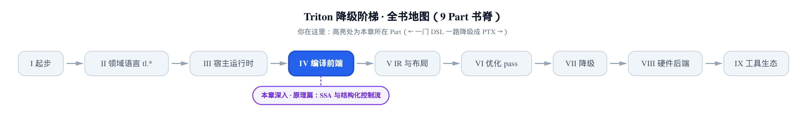
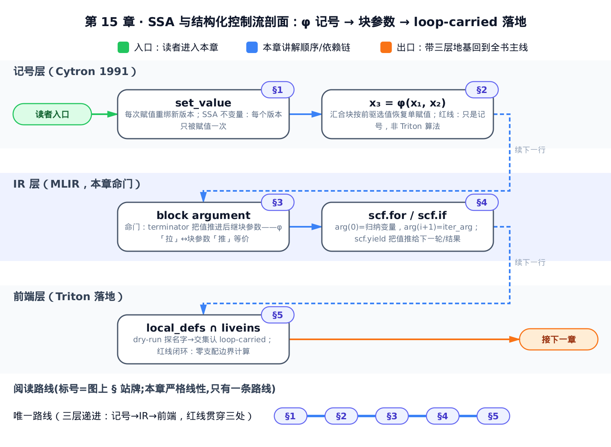
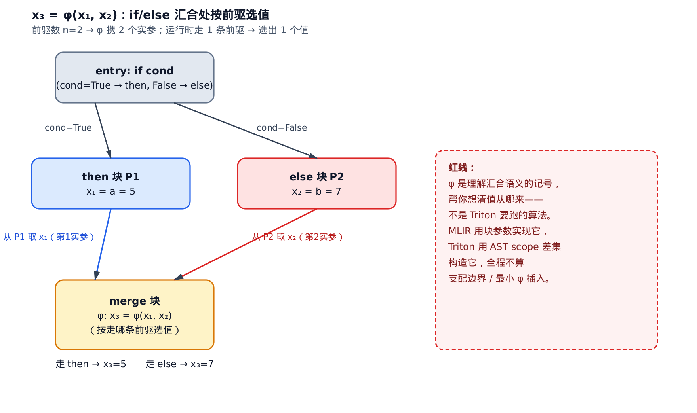
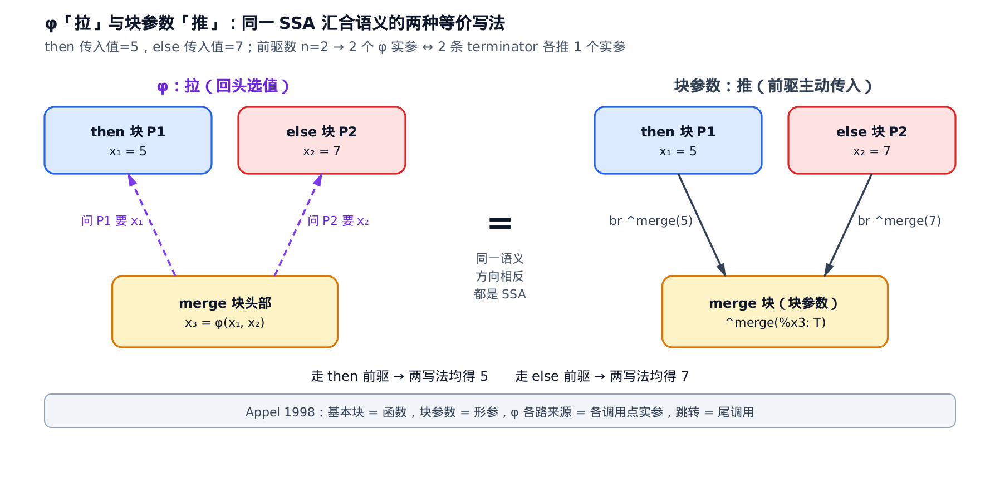
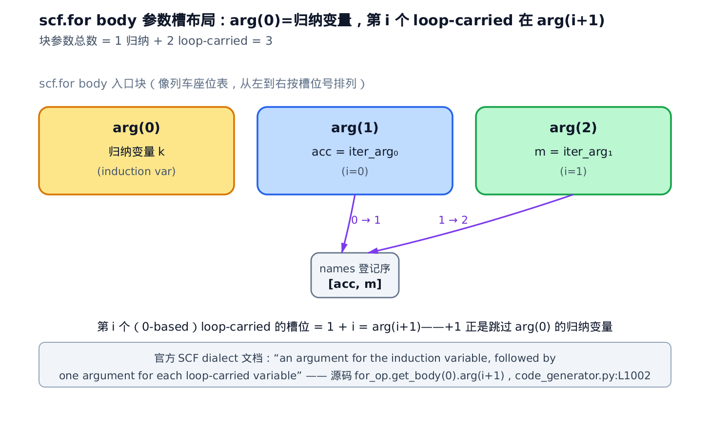
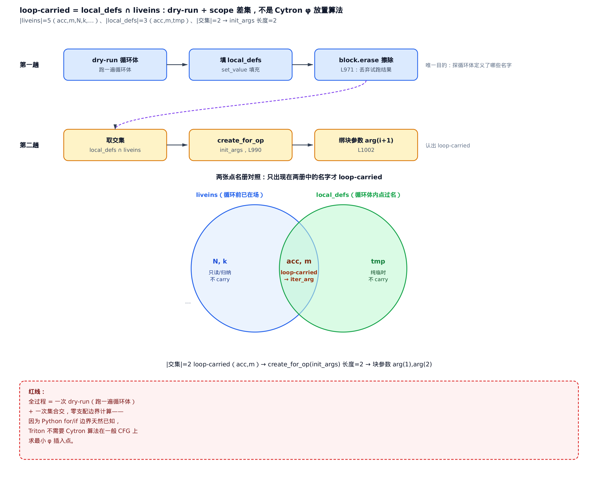

# SSA 与结构化控制流：φ 节点、块参数与 loop-carried 变量



> **你在这里** ——第 IV 部分「编译前端」的理论台阶。
> 上一章：`compile()` 主循环把五级降级跑了起来。
> 本章：立读 IR 必备的三块地基——SSA、块参数、loop-carried。
> 下一章：CodeGenerator 拿这套地基逐节点翻译 AST。

[第 14 章](../../ch14-compile-driver-loop/narrative/chapter.md)拆完 `compile()` 之后，降级链的起点已经就位：前端要把 Python 的 AST（抽象语法树）翻成 TTIR（Triton IR，五级降级的最高一层）。但这一步跨的不只是语法。Python 里变量随便改，`acc = acc + k` 想写几遍写几遍；IR 世界的铁律却是 **每个值只赋一次**。[第 5 章](../../ch05-type-system-and-tensor/narrative/chapter.md)已经点过名：`tensor.handle` 拿的就是 IR 里某个 SSA 值的编号。本章把那句话讲透——SSA 是什么、控制流一汇合它怎么不塌、MLIR 为什么不用教科书里的 φ 节点而用块参数、你写的 `for` 循环里哪些变量要被「带进带出」。

先把预期摆正：这不是一个直接给性能杠杆的章，它买的是读懂后面所有循环优化的 **语言**。软件流水线（`num_stages`，第 VI 部分展开）调度的对象、循环体寄存器压力的一部分来源，都挂在 loop-carried 值链上：你循环里每一个被更新且跨轮存活的变量，都会变成 `scf.for` 的一个 iter_arg。认得这条链，后面读 pass 的每一章才不用猜。



只想直奔 MLIR 命门，直接跳「§3 命门：MLIR 用块参数取代 φ」；只想知道 loop-carried 怎么被 Triton 前端认出来，跳「§5 落地」；想从 φ 是什么顺着推到底，就从 §1 开始。

本章推导只用这几个记号：

| 符号 | 含义 | 首现 |
|---|---|---|
| $`x_i`$ | 变量 x 的第 i 个 SSA 版本；每次再赋值就换新版本，绝不复用旧下标 | §1 |
| $`\phi`$ | phi 函数：汇合块开头的伪操作，按「从哪个前驱进来」选出对应来源 | §2 |
| $`P_k`$ / $`v_k`$ | 汇合块的第 k 个前驱块 / φ 的第 k 个实参，二者一一对应 | §2 |
| $`\mathtt{br}\ B(v_k)`$ | 前驱的 terminator：跳到块 B，并把实参 v_k「推」进 B 的块参数 | §3 |
| `liveins` | 进入循环/分支子区域前的父作用域快照（循环前已存在的名字） | §5 |
| `local_defs` | 本区域（如循环体）内被赋值的名字集 | §5 |
| `arg(0)` / `arg(i+1)` | scf.for body 块的参数槽：归纳变量 / 第 i 个 loop-carried 变量 | §4 |
| iter_arg | loop-carried 变量在 scf.for 里的身份：初值带进、每轮 yield 新值 | §4 |

## §1 动机：为什么 IR 要 SSA

把变量想成文档的版本号：每次编辑都存一个新版本，从不覆盖旧版——问「这句话是哪一版写的」永远有唯一答案。SSA（Static Single Assignment，静态单赋值）就是把这个约定钉进 IR：**每个变量在程序文本里只被赋值一次，再赋值就换一个新名字**（`x`→`x₁`→`x₂`）。

MLIR 论文对它的评价（arXiv:2002.11054，§"SSA and regions"，逐字）：

> "The Static Single Assignment (SSA) form [15] is a widely used representation in compiler IRs. It provides numerous advantages including making dataflow analysis **simple and sparse** ..."

其中 [15] 正是 SSA 与 φ 的定义性文献 Cytron et al. 1991（ACM TOPLAS 13(4):451–490，DOI:10.1145/115372.115320）。不变量先写下来——直觉是「一个值一张出生证明」：

```math
\forall\, x_i:\qquad \bigl|\,\mathrm{defs}(x_i)\,\bigr| \;=\; 1
```

$`\mathrm{defs}(x_i)`$ 是给版本 $`x_i`$ 赋值的语句集合——恰好一条，不多不少（SSA 定义归 Cytron 1991，本章经 MLIR 论文 §"SSA and regions" 对 [15] 的转述取用）。注意「只赋值一次」不是语言层的 immutable（不可变变量），而是 **IR 层的表示约定**：同一个 Python 名字 `acc` 被更新多次，下降后变成一串版本 $`acc_0, acc_1, \dots`$。三条赋值语句推一遍就看清了：

<!-- trace: ssa-single-assignment -->

| 源码语句 | SSA 版本 | 求值 | 用哪个旧版本 | 该版本被赋值的语句数 |
|---|---|---|---|---|
| `acc = 0` | $`acc_0 = 0`$ | 0 | 常量 0 | 1 |
| `acc = acc + 1` | $`acc_1 = acc_0 + 1`$ | 1 | 用 $`acc_0`$ | 1 |
| `acc = acc * 2` | $`acc_2 = acc_1 * 2`$ | 2 | 用 $`acc_1`$ | 1 |

三条 Python 赋值 → 三个 SSA 版本、两条 use-def 边（use-def：从值的使用点指回其定义点的边——$`acc_1`$ 用 $`acc_0`$、$`acc_2`$ 用 $`acc_1`$）。版本下标随赋值次数严格递增，新版本永不与旧版本撞号，所以每个版本的「被赋值语句数」那一列恒为 1——不变量成立。

这买到了什么：每个值来源唯一 → use-def 关系一步到位 → 常量传播（把编译期已知的常量直接代入使用点）、DCE（dead code elimination，死代码消除）、CSE（common subexpression elimination，公共子表达式消除）都不必反复追问「此刻 `acc` 是哪次赋值的结果」。这正是引文里 dataflow analysis「simple and sparse」的含义：数据流分析退化成沿着显式边走，不用做到处的定值到达分析。

工程落点一句话：Triton 前端每处赋值都经 `set_value`（`python/triton/compiler/code_generator.py:L315`）把名字重绑到一个新的 IR 值——「同名多版本」在前端的落点。记住这个函数，§5 全靠它。

## §2 φ 节点：汇合处按前驱选值

SSA 在直线代码里稳如泰山，控制流一汇合就出事。经典例子：

```
if cond:
    x = a        # then 支：下降后是 x1 = a
else:
    x = b        # else 支：下降后是 x2 = b
use(x)           # 汇合：用的是 x1 还是 x2？
```

then 支产出 $`x_1`$、else 支产出 $`x_2`$，汇合点用到的那个 `x` 在编译期无法静态确定——取决于运行时走哪条路。单赋值似乎在这里失效了。

Cytron 1991 补这个洞的记号是 **φ 节点**（phi function）：在汇合块的开头放一个伪操作，

```math
x_3 \;=\; \phi(x_1,\ x_2)
```

语义一句话：**从 then 支进来取 $`x_1`$，从 else 支进来取 $`x_2`$**。φ 按「你从哪个前驱块来」（前驱块，predecessor：控制流图里有边指向本块的块）选出对应实参，于是汇合点重新得到唯一的新版本 $`x_3`$，单赋值不变量恢复（φ 的定义归 Cytron 1991，DOI:10.1145/115372.115320，经 MLIR 论文对 [15] 的转述）。φ 的实参个数 = 汇合块的前驱个数，第 k 个实参对应第 k 个前驱。



取 a=5、b=7（刻意不相等，避开两支恰好同值的巧合）跑一遍这个语义：

<!-- trace: phi-merge-semantics -->

| 运行路径 | 进入汇合块的前驱 | φ 选中实参 | $`x_3`$ 值 |
|---|---|---|---|
| cond=True | then 支 $`P_1`$ | 第 1 实参 $`x_1`$ | 5 |
| cond=False | else 支 $`P_2`$ | 第 2 实参 $`x_2`$ | 7 |

编译期定死两个实参（= 前驱数），运行时只走一条前驱、选出一个值——「实参数 = 前驱数、选中数 = 1」这对计数，保证汇合之后仍是单值。

> **红线：φ 在本章是记号，不是 Triton 要实现的算法。** Cytron 1991 的贡献有两半：一半是「φ 是什么」——定义与记号，本章要的就是它；另一半是「φ 该放在哪、怎么放最少」——支配边界（dominance frontier，一个块的支配作用恰好失效的边界块集）加最小 φ 插入算法，本章不要。Triton 前端 **不跑** 后一半：§5 会看到，它直接从 Python AST 用作用域交集构造 SSA，全程不算支配边界。φ 在这里只干一件事——帮你想清楚「汇合处的值到底从哪来」。

## §3 命门：MLIR 用块参数取代 φ

φ 是记号，那工程上怎么落地？Triton 生成的是 MLIR，答案要到 MLIR 的结构里找。先补两个结构词汇。region 在[第 8 章](../../ch08-dot-reduce-scan/narrative/chapter.md)打过照面——`combine_fn` 被编译进 reduce 算子内部的那段子代码块。MLIR 论文的正式定义（arXiv:2002.11054，§"Regions and blocks"，逐字）：

> "A region provides the mechanism for nested structure in MLIR: **a region contains a list of blocks, and a block contains a list of operations** (which may contain regions)."

嵌套是四层循环：**Op ⊃ region ⊃ block ⊃ Op**（Op 里还能再嵌 region）。就像文件夹里再放文件夹——`scf.for` 这个 Op 的循环体是它的一个 region，region 里是承载指令的 block。block（基本块）是一段顺序执行的操作序列，以 **terminator**（终结子——块的最后一个操作，决定控制流转向哪个后继块）收尾；同一 region 里块与块的后继关系构成 CFG（控制流图）。论文举的例子恰好是循环：`affine.for`（MLIR 多面体方言的 for，`scf.for` 的同构前身）是「a loop with the single-block body attached as a region」——循环体是单块 body 挂成一个 region。

词汇齐了，上本章命门引文（同节，逐字，粗体是我加的）：

> "**Instead of using φ nodes, MLIR uses a functional form of SSA [2] where terminators pass values into block arguments defined by the successor block.** Each block has a (potentially empty) list of typed block arguments, which are regular values and obey SSA. The semantics of terminator Ops defines what values the arguments of the block will take after the control is transferred. For the first (entry) block of the region, the values are defined by the semantics of the enclosing Op. For example, affine.for uses the entry block argument `%arg4` as loop induction variable."
> —— arXiv:2002.11054，§"Regions and blocks"

拆开读（MLIR 文本记号：`^bb` 是块标签，`%x` 是 SSA 值）：后继块不再在头部写 φ，而是 **声明带类型的块参数**（block argument），写作 `^merge(%x3: T)`；每个前驱的 terminator 跳转时 **把实参传进去**，写作 `br ^merge(5)`。这是同一汇合语义的两种写法——直觉上，φ 是「拉」（汇合块回头问各前驱要值），块参数是「推」（各前驱主动把值推给后继）：

```math
\underbrace{\;x = \phi(v_1, \dots, v_n)\;}_{\mathrm{pull}}
\qquad\Longleftrightarrow\qquad
\underbrace{\;B(x{:}\,T),\quad P_k:\ \mathtt{br}\ B(v_k),\ \ k = 1,\dots,n\;}_{\mathrm{push}}
```

左边 pull：汇合块 $`B`$ 头部的 φ 按前驱选值；右边 push：$`B`$ 声明块参数 $`x`$，各前驱 $`P_k`$ 的 terminator 跳转时传实参 $`v_k`$（等价式按上面命门引文的语义写出，arXiv:2002.11054 §"Regions and blocks"）。φ 的第 k 槽与第 k 个前驱 terminator 的实参严格对齐——一个双射，所以任意运行路径下两种写法选出同一个值。还是 a=5、b=7 那个例子，逐行对照：

<!-- trace: block-args-replace-phi -->

| 视角 | φ 写法（拉） | 块参数写法（推） |
|---|---|---|
| then 支落地 | 实参 $`x_1 = 5`$ 占 φ 第 1 槽 | then 的 terminator：`br ^merge(5)` |
| else 支落地 | 实参 $`x_2 = 7`$ 占 φ 第 2 槽 | else 的 terminator：`br ^merge(7)` |
| 汇合取值 | $`x_3 = \phi(x_1, x_2)`$，汇合块头部选值 | `^merge(%x3: T)`：`%x3` 已由前驱推入 |



> **红线（第二遍）**：φ 是想清汇合语义的 **记号**，块参数是把这个语义落成 IR 的 **工程形式**。Triton 生成的就是 MLIR——你 dump 出来的 IR 里不会有 φ，只有块参数。

> **直觉**：块参数不是 MLIR 拍脑袋的发明。命门引文里那个 "[2]" 指向 Appel 1998《SSA is Functional Programming》（ACM SIGPLAN Notices 33(4):17–20，DOI:10.1145/278283.278285）：把基本块看成函数、块参数看成形参、φ 的各路来源看成各调用点传的实参、跳转看成尾调用——「按前驱选值」与「函数入参绑定」天然等价，块参数就是 SSA 的函数式重述。你不需要读它的正文，接受这个视角就能继续往下推。

工程动机还有旁证（MLIR 官方设计文档，非学术论文）：φ 必须钉在块首，每次 IR 变换都要手工绕开它；函数参数沦为特例；φ 的原子并行拷贝语义反直觉——换成块参数后，这些特例一律消失。

## §4 scf.for 与 scf.if：结构化控制流的参数布局

块参数解决了「汇合怎么传值」，还差一步：循环和分支在 IR 里长什么样。这不是顺带的甜头，而是 MLIR 明写的设计目标（arXiv:2002.11054，§"SSA and regions"，逐字）：

> "To support heterogeneous compilation, the system has to support the **expression of structured control flow** ..."

把循环/条件表达成 **带 region 的结构化 Op**（而不是扁平 CFG 加 goto），就是 `scf.for` / `scf.if` 存在的理由（scf = Structured Control Flow，MLIR 的结构化控制流方言）。诚实交代出处：SCF 方言 **没有** 专属学术论文，官方方言文档就是语义依据——下面引它的措辞，你会看到它与 Triton 源码逐字对应。

`scf.for` 的循环体是单块 body 挂成一个 region（§3 里 `affine.for` 的同款结构）。入口块的参数布局，官方文档一句话钉死：

> "The operation region has **an argument for the induction variable, followed by one argument for each loop-carried variable**."
> —— MLIR 官方 SCF 方言文档（scf.for）

induction variable（归纳变量，循环计数器 `k` 那个）恒占 `arg(0)`；其后每个 **loop-carried 变量**（跨轮存活的变量：循环里被更新、下一轮还要用，§5 给精确判据）各占一槽。于是第 i 个（0 起数）loop-carried 的槽位 = i + 1——像列车座位表，0 号座固定留给圈数牌，行李从 1 号座起坐：



拿一个双累加器循环对号入座：`acc`、`m` 是 loop-carried，`k` 是归纳变量（登记序 `[acc, m]`）：

<!-- trace: scf-for-arg-layout -->

| 参数槽 | 绑定内容 | 源码落点 | i → arg(i+1) |
|---|---|---|---|
| arg(0) | 归纳变量 `k` | `get_induction_var`（占位 L957 → 替换 L1023） | 归纳变量，不经 i+1 |
| arg(1) | `acc`（loop-carried，i=0） | `for_op.get_body(0).arg(i+1)`，i=0（`code_generator.py:L1002`） | 0 → 1 |
| arg(2) | `m`（loop-carried，i=1） | `for_op.get_body(0).arg(i+1)`，i=1（`code_generator.py:L1002`） | 1 → 2 |

块参数总数 = 一个归纳变量加两个 loop-carried，共三个。源码里那个 `+1`（`python/triton/compiler/code_generator.py:L1002`，§5 整段展开）就是跳过 `arg(0)` 的归纳变量——与官方文档「induction variable, followed by one argument for each loop-carried variable」逐字对上。

值怎么跨轮流动？靠 terminator。`scf.for` body 的 terminator 是 `scf.yield`，官方文档：

> "The region must terminate with a **scf.yield** that passes the current values of all loop-carried variables to the next iteration, or to the scf.for result, if at the last iteration."
> —— MLIR 官方 SCF 方言文档（scf.for）

这正是 §3 命门「terminator 把值推给后继块参数」的实例——只是这里的「后继」是下一轮循环的同一个 body 块，末轮则推给 `scf.for` 的结果。直觉像接力交棒：每轮跑完把新值递给下一轮的 iter_arg 槽（iter_arg：loop-carried 变量在 `scf.for` 里的官方称呼——初值带进、每轮 yield 新值），最后一棒把棒交给循环外。只追 `acc`（初值 0，每轮 `acc = acc + k`，`k` 走 0、1、2）：

<!-- trace: scf-yield-loop-carried -->

| 轮次 | k | iter_arg 入值 arg(1) | acc = acc + k | yield 出值 | 去向 |
|---|---|---|---|---|---|
| 1 | 0 | 0 | 0 + 0 = 0 | yield 0 | → 下轮 arg(1) |
| 2 | 1 | 0 | 0 + 1 = 1 | yield 1 | → 下轮 arg(1) |
| 3 | 2 | 1 | 1 + 2 = 3 | yield 3 | → `for_op.get_result(0)`（`code_generator.py:L1027`） |

值链两端闭合：初值进第一轮的 `arg(1)`，每轮 yield 接到下一轮同一槽，末轮的 yield 定义 `for_op.get_result(0)`——`acc` 的终值 3 被带出循环。终止性顺手立住：归纳变量从下界起每轮加 step，严格逼近上界，有界整数单调递增，必在有限轮内停。

`scf.if` 是同一机制的分支版。§2 那个 `x` 的 φ 问题，MLIR 落地就是：两支各自 `scf.yield` 一个值，`scf.if` 本身产出结果——「scf.if may also produce results」（官方 SCF 方言文档）。和 `scf.for` 的 `yield` 一样把值送出去，只是终点不是下一轮迭代、而是汇合点本身——`scf.if` 的结果就是两个分支各自 yield 的值在汇合处的选择。φ（记号）→ yield 推给块参数/结果（MLIR）→ 结果取用（Triton，§5 见 `if_op.get_result`）：三层，同一件事。

## §5 落地：Triton 前端怎么认出 loop-carried

理论三层立完，回到 Triton 的真实前端。先给 loop-carried 的精确判据——一个名字要「带进带出」，当且仅当：**循环前已有初值**（作为 iter_arg 初值带进），且 **循环体内被更新**（每轮 yield 新值带出）。每轮重算的纯临时量不算，只读参数也不算。认对这个集合，是把 Python `for` 正确降到 `scf.for` 的关键。

Triton 的做法朴素得出乎教科书意料。先看两个集合从哪来——下降 for/if 时都会进 `enter_sub_region` 上下文管理器：

```python
# python/triton/compiler/code_generator.py:L83-L92
class enter_sub_region:

    def __init__(self, generator):
        self.generator = generator

    def __enter__(self):
        # record lscope & local_defs in the parent scope
        self.liveins = self.generator.lscope.copy()
        self.prev_defs = self.generator.local_defs.copy()
        self.generator.local_defs = {}
        # … 省略：builder 插入点的记录；__exit__ 把 lscope 与 local_defs 原样还原 …

# python/triton/compiler/code_generator.py:L315-L322 —— 同文件另一处，非相邻
    def set_value(self, name: str, value: Union[tensor, constexpr]) -> None:
        # … 省略：docstring …
        self.lscope[name] = value
        self.local_defs[name] = value
```

`lscope` 是当前可见作用域表（名字 → 追踪期的值），`local_defs` 是本区域新定义的名字集。进入子区域那一刻：父作用域快照存为 `liveins`（循环前已存在的名字），`local_defs` 清空、留给循环体去填——填它的正是 §1 那个 `set_value`，每处赋值同时写进两张表。

然后是 `visit_For` 的关键三十行（`node` 是这个 `for` 循环的 AST 节点；`iv` 即 induction variable，`iv_ir_type` 是它的 IR 类型）：

```python
# python/triton/compiler/code_generator.py:L957-L986
        iv = self.builder.create_poison(iv_ir_type)
        self.set_value(node.target.id, language.core.tensor(iv, iv_type))

        with enter_sub_region(self) as sr:
            liveins, insert_block = sr
            ip, last_loc = self._get_insertion_point_and_loc()

            # create loop body block
            block = self.builder.create_block()
            self.builder.set_insertion_point_to_start(block)
            # dry visit loop body
            self.scf_stack.append(node)
            self.visit_compound_statement(node.body)
            self.scf_stack.pop()
            block.erase()

            # If a variable (name) is defined in both its parent & itself, then it's
            # a loop-carried variable. (They must be of the same type)
            init_args = []
            yields = []
            names = []
            for name in self.local_defs:
                if name in liveins:
                    loop_val = self.local_defs[name]
                    live_val = liveins[name]
                    self._verify_loop_carried_variable(name, loop_val, live_val)

                    names.append(name)
                    init_args.append(live_val)
                    yields.append(loop_val)
```

逐段读（`ip`/`last_loc`/`insert_block` 是 builder 插入点的记账，与主线无关；`scf_stack` 记录当前嵌套在哪个结构化控制流节点里）：

**占位归纳变量（L957-L958）。** 循环体里会用到 `k`，但真正的归纳变量要等 `scf.for` 建出来才有——先用 `create_poison`（MLIR 的 poison 占位值，表示「暂无定义」）造一个假的顶着。注意这发生在 `enter_sub_region` **之前**，所以 `k` 会出现在 `liveins` 里。

**dry-run（L965-L971）。** 造一个临时块，把循环体 **试跑** 一遍（`visit_compound_statement`：依序访问一段语句列表——它怎么逐节点翻译是下一章的主题，这里当黑盒），跑完立刻 `block.erase()` 擦掉。这趟的产物只有一个：`local_defs` 被填满了——「循环体里到底给哪些名字赋了值」。为什么必须先试跑？因为建 `scf.for`（下个片段的 `create_for_op`）要在 **创建时** 就拿到 iter_arg 初值列表，而哪些变量该是 iter_arg，只有跑一遍循环体才知道。先探路、再动工——两趟结构是被「建 op 需要参数列表」的时序逼出来的。

**交集判定（L973-L986）。** 源码注释逐字就是判据：「If a variable (name) is defined in both its parent & itself, then it's a loop-carried variable」。写成集合式（这一步在做的事：从两张名册里筛出既有初值、又被更新的名字）：

```math
\mathrm{carried} \;=\; \mathtt{local\_defs} \,\cap\, \mathtt{liveins}
\;=\; \{\, \mathrm{name} \;\mid\; \mathrm{name} \in \mathtt{local\_defs} \ \wedge\ \mathrm{name} \in \mathtt{liveins} \,\}
```

判据即上面片段里 `for name in self.local_defs:` 加 `if name in liveins:` 那两行（`code_generator.py:L978-L979`）。这是 Triton 的工程做法、无论文出处；它落地的汇合语义对应 arXiv:2002.11054 的块参数机制。本书源码讨论里也叫它 scope 差集——按作用域归属筛名字，落到运算上是一次集合交。交集为什么恰好不多不少：∈ `liveins` 保证有初值可带进（`init_args` 收 `live_val`，循环前的值），∈ `local_defs` 保证有新值可 yield（`yields` 收 `loop_val`，dry-run 里循环体产出的值）；缺前者是纯临时量，缺后者是只读名——都不需要跨轮传递。`_verify_loop_carried_variable` 再把一道门：初值与循环内新值的类型必须一致，因为 iter_arg 槽的类型编译期就要钉死。



拿 §4 那个循环、外加两个干扰项对号入座：`tmp = k * 2` 只在循环体里出现（每轮重算），`N` 只在循环前出现（只读参数），归纳变量 `k` 因为占位发生在快照前、也只在 `liveins` 一侧：

<!-- trace: loop-carried-scope-diff -->

| 名字 | ∈ liveins？ | ∈ local_defs？ | 交集判定 | 角色 |
|---|---|---|---|---|
| `acc` | ✓ | ✓ | ✓ loop-carried | iter_arg 0 |
| `m` | ✓ | ✓ | ✓ loop-carried | iter_arg 1 |
| `tmp` | ✗ | ✓ | ✗，仅 local_defs | 循环内纯临时，每轮重算 |
| `N` | ✓ | ✗ | ✗，仅 liveins | 只读参数，体内未再赋值 |
| `k` | ✓ | ✗ | ✗，仅 liveins | 归纳变量，占位在 liveins、体内未再赋值 |

交集 {acc, m} 两个成员——`init_args` 长度为二，块参数用掉 `arg(1)` 与 `arg(2)`，正是 §4 座位表那一排。

集合定下来，正式动工——绑块参数、第二次 visit、yield、接回结果（`lb`/`ub`/`step`：循环的下界、上界、步长，前文已转成 IR 值）：

```python
# python/triton/compiler/code_generator.py:L988-L1027
            # create ForOp
            self._set_insertion_point_and_loc(ip, last_loc)
            for_op = self.builder.create_for_op(lb, ub, step, [arg.handle for arg in init_args])
            # … 省略：num_stages / loop_unroll_factor 作为属性标到循环 op 上 …

            self.scf_stack.append(node)
            self.builder.set_insertion_point_to_start(for_op.get_body(0))
            # reset local scope to not pick up local defs from the previous dry run.
            self.lscope = liveins.copy()
            self.local_defs = {}
            for i, name in enumerate(names):
                self.set_value(name, language.core.tensor(for_op.get_body(0).arg(i + 1), yields[i].type))
            self.visit_compound_statement(node.body)
            self.scf_stack.pop()
            yields = []
            for name in self.local_defs:
                if name in liveins:
                    yields.append(language.semantic.to_tensor(self.local_defs[name], self.builder))

            # create YieldOp
            if len(yields) > 0:
                self.builder.create_yield_op([y.handle for y in yields])
            # … 省略：单块断言；占位归纳变量换真身（get_induction_var → replace_all_uses_with） …

        # update lscope & local_defs (ForOp defines new values)
        for i, name in enumerate(names):
            self.set_value(name, language.core.tensor(for_op.get_result(i), yields[i].type))
```

正式 visit 前先 `self.lscope = liveins.copy()` 并清空 `local_defs`——把 dry-run 留下的痕迹全部丢掉；然后把每个 loop-carried 名字重绑到 `for_op.get_body(0).arg(i + 1)`：**§4 那个 +1，就是这一行（L1002）**——跳过 `arg(0)` 的归纳变量。循环体第二次被 visit 时，读 `acc` 读到的已经是块参数（本轮的 iter_arg 入值）。体内收尾再做一次同款交集（正式这趟的 `local_defs` 对 `liveins`），把本轮新值交给 `create_yield_op`（收集时过一道 `to_tensor`，把编译期常量裹回 tensor）——§4 的 `scf.yield` 交棒，就是这行代码。出了 `enter_sub_region`，外层作用域把每个 loop-carried 名字重绑到 `for_op.get_result(i)`：循环外的代码继续用 `acc` 这个名字，拿到的已是循环结果。

省略掉的两小段各一句话：`num_stages` / `loop_unroll_factor` 会作为属性标在循环 op 上——[第 4 章](../../ch04-tl-surface-and-constexpr/narrative/chapter.md)里 `tl.range` 的两个调度旋钮就从这里进 IR；占位的假归纳变量在 op 建好后被 `get_induction_var` 换成真身，`replace_all_uses_with` 全量替换。

分支版的落点是 `visit_if_scf`——同一套 `enter_sub_region` 加集合逻辑（`visit_then_else_blocks` 负责收集两支各自的赋值集 `then_defs`/`else_defs` 与撞名清单 `names`，细节连同整个 AST 访问者机理留给下一章）：

```python
# python/triton/compiler/code_generator.py:L656-L681
    def visit_if_scf(self, cond, node):
        with enter_sub_region(self) as sr:
            liveins, _ = sr
            ip, last_loc = self._get_insertion_point_and_loc()
            then_block = self.builder.create_block()
            else_block = self.builder.create_block() if node.orelse else None
            then_defs, else_defs, then_block, else_block, names, ret_types, _ = \
                self.visit_then_else_blocks(node, liveins, then_block, else_block)
            # create if op
            self._set_insertion_point_and_loc(ip, last_loc)
            if_op = self.builder.create_if_op([ty.to_ir(self.builder) for ty in ret_types], cond.handle, True)
            then_block.merge_block_before(if_op.get_then_block())
            self.builder.set_insertion_point_to_end(if_op.get_then_block())
            if len(names) > 0:
                self.builder.create_yield_op([then_defs[n].handle for n in names])
            # … 省略：else 块的排布（无 orelse 时直接取 if_op.get_else_block） …
            self.builder.set_insertion_point_to_end(if_op.get_else_block())
            if len(names) > 0:
                self.builder.create_yield_op([else_defs[n].handle for n in names])
        # update values
        for i, name in enumerate(names):
            new_tensor = language.core.tensor(if_op.get_result(i), ret_types[i])
            self.set_value(name, new_tensor)
```

两支的语句先在暂存块里生成、再由 `merge_block_before` 拼进 `if_op` 对应的 region；随后两支各 `create_yield_op` 推一个值，汇合后 `if_op.get_result(i)` 取出，重绑回 Python 名字——§2 那个 $`x_3 = \phi(x_1, x_2)`$ 至此完整闭环：φ（记号）帮你想清语义，yield 推给块参数/结果（MLIR）落地语义，`get_result`（Triton）把值接回名字。

> **红线（第三遍，闭环）**：Triton 认 loop-carried 的全过程 = 一次 dry-run 加一次集合交，**零支配边界计算**。Cytron 算法解决的是「一般 CFG 上 φ 该放哪、怎么放最少」——那是把任意跳转编织的非结构化控制流翻成 SSA 时才需要的重武器。Triton 的输入是 **结构化的 Python AST**：循环边界、分支汇合点天然已知，汇合点就是 `scf.for` / `scf.if` 的出口，无处可猜、无需去算。§2 说 φ 是想清语义的记号，这里就是记号的兑现处——语义全程成立，算法一步没跑。

## 小结：三层，同一件事

把本章钉在一张表上：

| 层 | 写法 | 汇合处怎么拿值 |
|---|---|---|
| 记号（Cytron 1991） | $`x_3 = \phi(x_1, x_2)`$ | 汇合块回头「拉」 |
| IR（MLIR，arXiv:2002.11054） | 块参数 + terminator 传实参 | 前驱主动「推」 |
| 前端（Triton） | dry-run + `local_defs` ∩ `liveins` → iter_arg | 集合交认出该传谁 |

φ 是语义记号，块参数是 IR 落地，作用域交集是 Triton 从结构化 AST 直接构造 SSA 的工程做法——三层描述同一个汇合语义，而 Cytron 的 φ 放置算法自始至终不在场。

带走的是读 IR 的能力：下次 dump 出带 `scf.for` 的 IR，你能立刻读出 body 块参数表里 `arg(0)` 是归纳变量、后面每个槽是谁家的累加器；看到 `scf.yield`，知道那是值链在交棒。**你循环里每多一个跨轮更新的变量，就多一个 iter_arg、多一份要跨轮携带的状态**——第 VI 部分讲软件流水线时，`num_stages` 重排的正是这条 yield 值链上的依赖。

下一章打开 CodeGenerator 本体：AST 访问者怎么逐节点翻译、本章当黑盒用的 `visit_compound_statement` 里到底发生什么；再往后的控制流下降章把 if/for/while 的全部路径走通。本章的三块地基——SSA 单赋值、块参数推值、loop-carried 交集——到那里就是你脚下的台阶。
